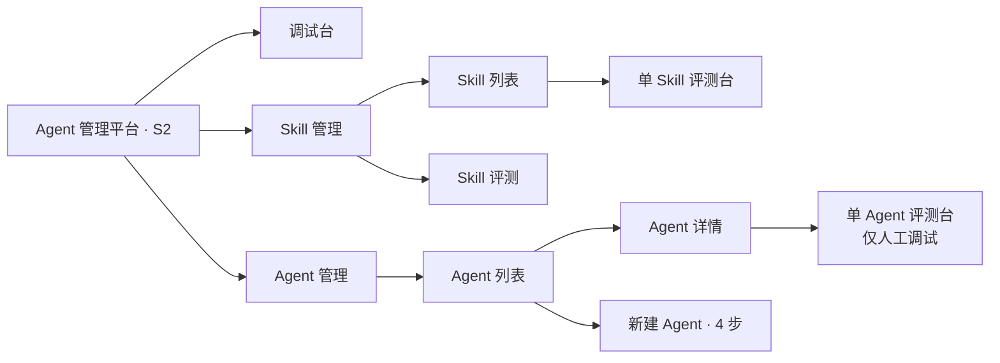
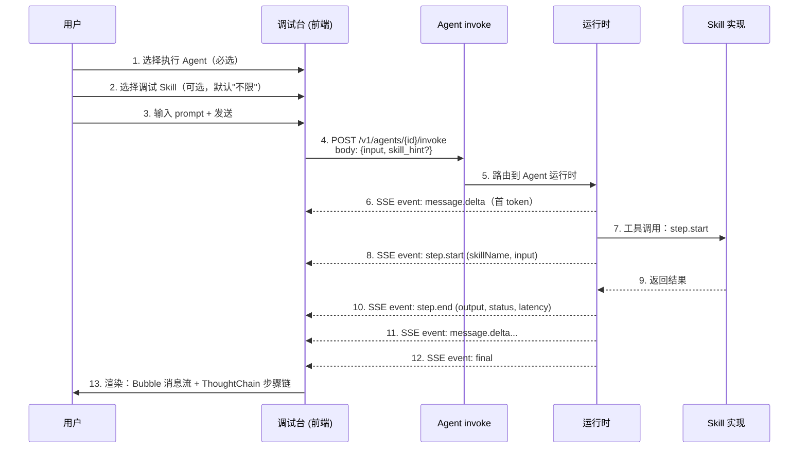
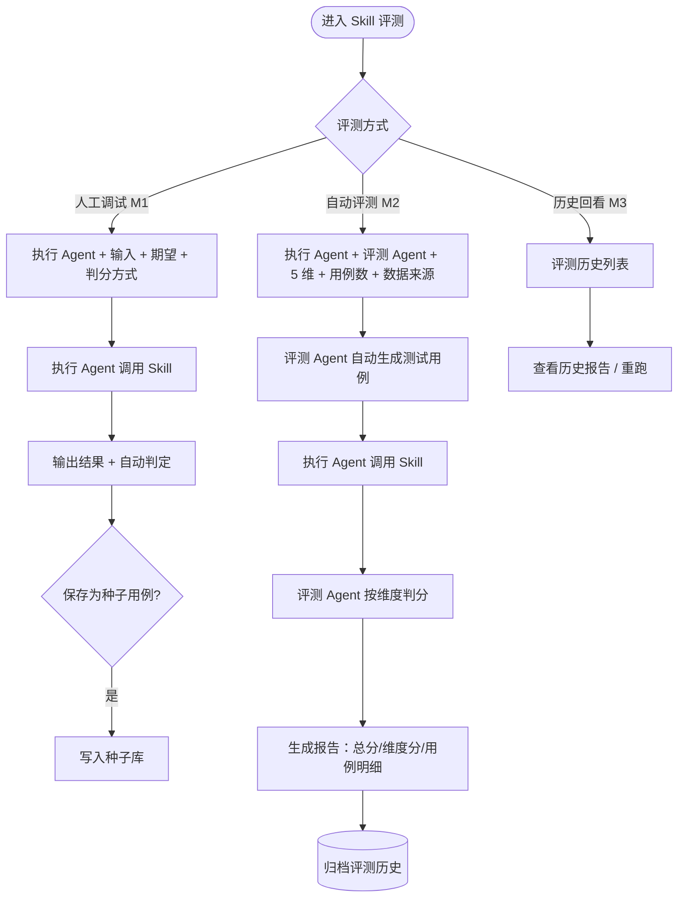
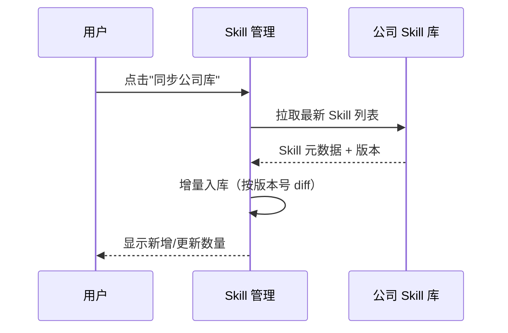

# AgentOps — S2 产品需求文档（PRD）

> 文档日期：2026-05-11　|　版本：v2.0　|　覆盖周期：S2（2026-04 ~ 2026-07）
> 输入来源：[S2 规划](../总体规划/2026-05-11-AgentOps-S2规划.md) · [总体规划](../总体规划/2026-05-11-AgentOps-总体规划.md) · [总平台 PRD](../../../../03-会议与汇报-meetings/规划汇报-planning/2026-05-08-Agent管理平台-PRD.md)
> 本文与总平台 PRD 的关系：**总平台 PRD 是全集（一期+二期+三期），本文是 S2 周期内的范围裁剪 + 调试台/评测台细化**。
>
> **v2.0 变更摘要（2026-05-14）**：Agent 创建方式从 5 种（配置 / ACP / MCP / A2A / API）收敛为 **2 种**：**配置模式**（页面新建）+ **A2A 模式**（订阅 Nacos 注册中心自动同步、平台只读）。原 ACP / MCP / API 整体下线，详见 [Agent 管理 PRD v2.0](./2026-05-11-Agent管理-PRD.md)。本文 §7.4 / §11 已同步。

---

## 1. 产品/需求背景

研发流程管理部 AI Agent 应用快速增长，部门面临三个突出问题：**重复建设、难以治理、难以沉淀**。详见[总体规划 §1](../总体规划/2026-05-11-AgentOps-总体规划.md)。

S2 周期（剩余 ~12 周，截至文档日期）的策略是**先用"调试台 + Skill 评测"打通可感知价值，再补齐 Skill / Agent 管理与 Agent 评测的最小闭环**，避免一上来铺 8 大模块导致每个都半成品。

**面向用户**：研发流程管理部内部业务团队、Skill 维护者、平台演示场景。**S2 内不开放给上层应用方调用**（OpenAPI 仅做 Agent invoke 的 mock 实现，自动文档生成进 S3）。

---

## 2. 目标与范围

### 2.1 S2 目标

- **可演示**：10 分钟内能完整演示"建 Skill → 评测 → 调试台跑通"链路；
- **可观测**：调试 Skill 时能看到每一步的入参 / 出参 / 状态 / 耗时；
- **可量化**：≥ 3 个真实业务 Skill 接入并拿到完整评测报告，黄金集累计 ≥ 100 题；
- **可承接**：5 个 P0/P1 模块全部 GA 到"够用就行"水平，Agent 评测达到人工调试可用。

### 2.2 范围（按 S2 规划优先级排序）

| 优先级 | 模块 | S2 内交付水平 |
| --- | --- | --- |
| P0-高 | **调试台** | 多轮对话 + 上下文选择器（执行 Agent 必选 / 调试 Skill 可选）+ Skill 步骤级 trace |
| P0-高 | **Skill 评测** | 人工调试 (M1) → 自动评测 GA (M2) → 评测看板沉淀 (M3) |
| P1-中 | **Skill 管理** | CRUD + 公司库一键同步 + 评测入口 |
| P1-中 | **Agent 管理** | 三类型 + 4 步表单 + 详情页关键卡片 + invoke 接口 |
| P2-低 | **Agent 评测** | 仅人工调试 |

### 2.3 显式不做（S2 内）

- ❌ 工作空间完整 RBAC（用单工作空间硬编码兜底）
- ❌ MCP 管理（评测如需 MCP 走 mock）
- ❌ 知识库管理
- ❌ 平台概览 Dashboard
- ❌ 自定义角色 / SSO 接入
- ❌ Agent 自动评测（进 S3）
- ❌ Agent 编排画布
- ❌ OpenAPI 5 语言示例自动生成（只给 cURL）
- ❌ 完整记忆管理（只做开关）

---

## 3. 系统线框图

### 3.1 信息架构（S2 菜单）



### 3.2 整体页面布局（PC 后台）

沿用总平台 PRD 的"黑底侧栏 + 亮色内容区 + ProCard / ProTable"模板。S2 内只渲染上述菜单，工作空间 / MCP / 知识库 / 权限 / 概览菜单项**隐藏**。

### 3.3 登录与错误页（2026-05-12 同步 Figma `73:2` `73:4`）

> **设计真相来源**：Figma `hoQIHy1FcQdfE49oDsiSV9` 节点 `73:2` 登录、`86:25/86:35/86:45` 403/404/5xx
> fe 已落地：[Login/index.tsx](../代码仓库/rd-agent-fe/src/pages/Login/index.tsx)、[Error/index.tsx](../代码仓库/rd-agent-fe/src/pages/Error/index.tsx)
> 全屏路径：`/login` `/403` `/404` `/500` 在 [App.tsx](../代码仓库/rd-agent-fe/src/App.tsx) 里 bypass ProLayout，独立渲染（无侧栏 + 无顶栏）。

#### 3.3.1 登录页（`/login`）


- 浅灰底 (#F8FAFC) 居中 480×440 白卡 (#fff + #E2E8F0 边框 + r14 + 阴影)
- 56×56 深色方块 logo (#0F172B + r12) + 白色 "A" 28/Bold
- 标题 "Agent Sphere" 24/Bold，副标题 "Sphere 管理后台" 14/灰
- 主按钮 "使用 GT 账号登录" 蓝色 (#2B52D9) + 右箭头
- 底部分割线 + "没有访问权限？联系运维 · 查看操作手册"
- 已登录用户访问 `/login`：自动按 `?from=` 参数跳回，否则跳 `/agent/manage`

#### 3.3.2 错误页（`/403` `/404` `/500`）


| 错误码 | 圆形背景/文字色 | 标题 | 主按钮 | 文字链 |
| --- | --- | --- | --- | --- |
| 403 | `#FEF3C7` / `#92400E` | 权限不足 | 联系管理员（蓝） | 回到首页 |
| 404 | `#EFF6FF` / `#2B52D9` | 页面不存在 | 返回首页（蓝） | 回到首页 |
| 5xx | `#FEE2E2` / `#DC2626` | 服务异常 | 重试（红） | 回到首页 |

- 单卡 420 宽，padding 40/32/32，r14
- 圆形 96×96 错误码 36/Bold
- 路由 `*` 通配符 → 跳 `/404` 错误页（不再 redirect 到列表）

---

## 4. 业务流程图

### 4.1 调试台核心流程（P0 重点）



### 4.2 Skill 评测流程



### 4.3 Skill 公司库同步流程



---

## 5. 用例图

```mermaid
flowchart LR
    subgraph 参与者
        Dev[开发者/Skill 维护者]
        SkillOwner[Skill 维护者]
        Demo[平台演示者]
    end

    subgraph 调试用例
        UC_DT_PICK[选择执行 Agent + 调试 Skill]
        UC_DT_CHAT[多轮对话调试]
        UC_DT_TRACE[查看 Skill 步骤 trace]
    end

    subgraph Skill 用例
        UC_SK_CRUD[新增/编辑/发布/弃用 Skill]
        UC_SK_SYNC[同步公司库]
        UC_SK_EVAL_M[Skill 人工调试]
        UC_SK_EVAL_A[Skill 自动评测]
        UC_SK_HIST[查看评测历史]
    end

    subgraph Agent 用例
        UC_AG_CRUD[创建/编辑/下线 Agent (配置模式)]
        UC_AG_DETAIL[查看 Agent 详情]
        UC_AG_API[查看 invoke 接口文档]
        UC_AG_EVAL_M[Agent 人工调试]
        UC_AG_NACOS[A2A: 通过 Nacos 自动同步 (无 UI 操作)]
    end

    Dev --> UC_DT_PICK & UC_DT_CHAT & UC_DT_TRACE
    Dev --> UC_AG_CRUD & UC_AG_DETAIL & UC_AG_API & UC_AG_EVAL_M
    SkillOwner --> UC_SK_CRUD & UC_SK_SYNC & UC_SK_EVAL_M & UC_SK_EVAL_A & UC_SK_HIST
    Demo --> UC_DT_PICK & UC_DT_CHAT & UC_DT_TRACE
```

---

## 6. 用户与场景

| 角色 | 描述 | 典型场景 |
| --- | --- | --- |
| **开发者** | 业务团队工程师 | 在调试台试 Skill、配 Agent、跑人工调试 |
| **Skill 维护者** | 负责 Skill 质量 | 同步公司库、跑评测、看历史报告 |
| **平台演示者** | 本人/老板 | 用调试台 + Skill 评测演示，争取业务方接入 |

**用户故事**

- 作为**开发者**，我想选好 Agent + 选个 Skill，发一句话就能看到 Skill 每一步的入参/出参/耗时，避免在日志里翻找。
- 作为**Skill 维护者**，我希望对一个 Skill 配上"执行 Agent + 评测 Agent"自动跑 20 道题，避免每次手动验证。
- 作为**平台演示者**，我希望 10 分钟内能用真实业务 Skill 演示「建 → 评 → 调」全链路，让业务方愿意接入。

---

## 7. 功能需求

> 优先级标注 **S2-P0/P1/P2**。M1=2026-06-08、M2=2026-07-06、M3=2026-07-31。

### 7.1 调试台（最高优先级）

#### 7.1.1 上下文选择器

| 序号 | 功能点 | 简要说明 | 优先级 | 里程碑 |
| --- | --- | --- | --- | --- |
| 1.1.1 | 执行 Agent 选择 | 必选；下拉按当前用户可见范围过滤；切换时自动起新会话 | S2-P0 | M1 |
| 1.1.2 | 调试 Skill 选择 | 可选；下拉首项为「不限（Agent 自主决策）」；选定后将该 Skill 通过 `skill_hint` 字段强制注入本次会话工具集 | S2-P0 | M1 |
| 1.1.3 | 上下文锚点显示 | 会话顶部展示「当前 Agent + Skill」，含 ID 与名称，可一键复制 | S2-P0 | M1 |
| 1.1.4 | 切换确认 | 切换 Agent 时若当前会话有消息，提示"将开启新会话" | S2-P0 | M1 |

#### 7.1.2 多轮对话与输入模式

| 序号 | 功能点 | 简要说明 | 优先级 | 里程碑 |
| --- | --- | --- | --- | --- |
| 1.2.1 | 会话列表 | 左侧 Conversations 组件，可切换 / 重命名 / 删除 | S2-P0 | M1 |
| 1.2.2 | 消息流 | Bubble.List 渲染 user / assistant 消息；user 消息保留输入模式标记 | S2-P0 | M1 |
| 1.2.3 | 输入器 | Sender，Enter 发送 / Shift+Enter 换行；发送中 loading + 中止 | S2-P0 | M1 |
| 1.2.4 | **输入模式切换** | 输入器顶部 Segmented：**Text / JSON 二选一**；切换时尝试保留内容（不兼容则提示清空） | S2-P0 | M1 |
| 1.2.5 | **Text 模式** | 默认；多行 textarea；invoke body 用 `{"input": "<文本>", "input_type": "text"}` | S2-P0 | M1 |
| 1.2.6 | **JSON 模式** | Monaco/CodeMirror JSON 编辑器（语法高亮 + 实时校验 + 格式化）；校验失败时 Sender disabled；invoke body 用 `{"input": <object>, "input_type": "json"}` | S2-P0 | M1 |
| 1.2.7 | **Skill 模式联动** | 选定调试 Skill 且该 Skill 有 input schema 时：① 自动切 JSON 模式；② 加载 schema 作为校验规则与示例占位 | S2-P0 | M1 |
| 1.2.8 | 欢迎页与快捷指令 | Welcome + Prompts 三条预设（按 Skill 切换时刷新） | S2-P0 | M1 |
| 1.2.9 | 流式输出 | SSE 接通后逐字渲染 | S2-P0 | M2 |

#### 7.1.3 Skill 步骤级 trace（核心差异化能力）

| 序号 | 功能点 | 简要说明 | 优先级 | 里程碑 |
| --- | --- | --- | --- | --- |
| 1.3.1 | 步骤链可视化 | 用 Ant Design X 的 ThoughtChain 组件展示工具调用链 | S2-P0 | M1 |
| 1.3.2 | 步骤元信息 | 每步显示：步骤名 / 入参 / 出参 / 状态（pending/success/error）/ 耗时 ms | S2-P0 | M1 |
| 1.3.3 | 展开折叠 | 步骤入参/出参默认折叠，点击展开查看完整 JSON | S2-P0 | M1 |
| 1.3.4 | 错误高亮 | error 状态步骤红色边框 + 错误消息 | S2-P0 | M1 |
| 1.3.5 | trace_id 关联 | 步骤链顶部展示 trace_id，可复制（与后端审计共享同一 trace） | S2-P0 | M2 |

#### 7.1.4 invoke 接口契约（请求体 + SSE 事件）

**请求体**

| 字段 | 类型 | 必填 | 说明 |
| --- | --- | --- | --- |
| `input` | string \| object | 是 | text 模式为字符串；JSON 模式为对象 |
| `input_type` | "text" \| "json" | 是 | 显式标识输入模式 |
| `skill_hint` | string | 否 | 调试 Skill 时强制注入的 skill_name |
| `session_id` | string | 否 | 不传则起新会话 |

> JSON 模式下，若 `skill_hint` 命中的 Skill 有 input schema，后端用 schema 二次校验，不通过返回 422 + 字段错误明细。

**SSE 事件**

| 事件类型 | 触发时机 | 关键字段 |
| --- | --- | --- |
| `message.delta` | LLM 输出每一段文本 | content (str), index (int) |
| `step.start` | 进入工具/Skill 调用 | step_id, skill_name, input (json), started_at |
| `step.end` | 工具/Skill 调用结束 | step_id, output (json), status, latency_ms, error? |
| `final` | 整个 invoke 结束 | session_id, trace_id, total_tokens, total_latency_ms |
| `error` | 不可恢复错误 | code, message, step_id? |

> M2 前 mock 实现必须按相同协议回放，避免前端联调返工。

### 7.2 Skill 评测

#### 7.2.1 Skill 评测主页

| 序号 | 功能点 | 简要说明 | 优先级 | 里程碑 |
| --- | --- | --- | --- | --- |
| 2.1.1 | 评测任务总览 | ProTable：Skill 名 / 执行 Agent / 评测 Agent / 总分 / 通过率 / 时间 | S2-P0 | M2 |
| 2.1.2 | 4 张统计卡 | 累计评测次数 / 通过率 / 平均时延 / 黄金集题量 | S2-P0 | M2 |
| 2.1.3 | 发起评测入口 | 跳转单 Skill 评测台 | S2-P0 | M1 |

#### 7.2.2 单 Skill 评测台 - 人工调试（M1 必交付）

| 序号 | 功能点 | 简要说明 | 优先级 | 里程碑 |
| --- | --- | --- | --- | --- |
| 2.2.1 | 执行 Agent 选择 | 下拉，可选「空白沙盒 Agent」 | S2-P0 | M1 |
| 2.2.2 | 输入区 | 任务输入 + 期望结果 + 判分方式（LLM Judge / 关键词匹配 / 不判分） | S2-P0 | M1 |
| 2.2.3 | 输出对比 | 实际输出 vs 期望，diff 高亮 | S2-P0 | M1 |
| 2.2.4 | 自动判定 | 按所选判分方式给"通过/不通过 + 分值" | S2-P0 | M1 |
| 2.2.5 | 保存为种子 | 一键回流到自动评测的数据源 | S2-P1 | M2 |

#### 7.2.3 单 Skill 评测台 - 自动评测（M2 必交付）

| 序号 | 功能点 | 简要说明 | 优先级 | 里程碑 |
| --- | --- | --- | --- | --- |
| 2.3.1 | 评测配置 | 执行 Agent + 评测 Agent + 5 维评分（准确性/相关性/完整性/风格/合规）+ 用例数 + 数据来源（Skill 描述 / 历史样本 / 人工种子） | S2-P0 | M2 |
| 2.3.2 | 评测执行 | 评测 Agent 生成用例 → 执行 Agent 调用 Skill → 评测 Agent 判分 | S2-P0 | M2 |
| 2.3.3 | 评测报告 | 总分 / 通过率 / 平均时延 + 维度评分（雷达图）+ 用例明细（输入/期望/实际/分/时延） | S2-P0 | M2 |
| 2.3.4 | 报告导出 | CSV + 在线分享链接 | S2-P1 | M3 |

#### 7.2.4 评测历史（M3 必交付）

| 序号 | 功能点 | 简要说明 | 优先级 | 里程碑 |
| --- | --- | --- | --- | --- |
| 2.4.1 | 历次报告 ProTable | 含执行 Agent 列与评测 Agent 列，可追溯每次评测的上下文 | S2-P0 | M3 |
| 2.4.2 | 重跑 | 用相同配置 + 当前 Skill 版本重新执行 | S2-P0 | M3 |
| 2.4.3 | 版本对比 | 选两次评测看维度分 / 通过率差值 | S2-P1 | M3 |

### 7.3 Skill 管理

| 序号 | 功能点 | 简要说明 | 优先级 | 里程碑 |
| --- | --- | --- | --- | --- |
| 3.1 | Skill 列表 | ProTable：名/来源/分类/**在线版本号**/发布人/状态/复用数/更新时间 | S2-P1 | M1 |
| 3.2 | 同步公司库 | 一键拉取，按版本 diff 增量入库 | S2-P1 | M2 |
| 3.3 | 新增 Skill | 名称/描述/分类/输入 schema/输出 schema/实现地址；首发即 v1.0.0 | S2-P1 | M1 |
| 3.4 | 编辑 Skill | M1 改了即生效；M2 起走草稿/发布机制（详见 §7.6） | S2-P1 | M1 / M2 升级 |
| 3.5 | 发布 / 弃用 | M1：状态切换；M2 起：发布 Modal（影响等级 + 备注必填） | S2-P1 | M2 |
| 3.6 | 评测入口 | 行操作跳转单 Skill 评测台 | S2-P1 | M1 |
| 3.7 | 复用数统计 | 显示被多少 Agent 挂载 | S2-P2 | M3 |

> **够用就行**：UI 走 Ant Design Pro 标准 ProTable + ModalForm，不做精细化交互优化。

### 7.4 Agent 管理

#### 7.4.1 Agent 列表

| 序号 | 功能点 | 简要说明 | 优先级 | 里程碑 |
| --- | --- | --- | --- | --- |
| 4.1.1 | 列表展示 | 名称/**创建方式**（配置模式 / A2A·Nacos）/类型/模型/负责人/状态/**在线版本号**/挂载 Skill 数/调用次数/更新时间 | S2-P1 | M2 |
| 4.1.2 | 行操作 | 进调试台 / 评测 / 编辑（仅配置模式） / 下线（仅配置模式） | S2-P1 | M2 |
| 4.1.3 | 筛选 | 按**创建方式** / 模型 / 状态 / 类型筛选 | S2-P1 | M2 |
| 4.1.4 | 新建入口 | 仅生成"配置模式"4 步表单（A2A 模式不通过手工创建产生） | S2-P1 | M2 |
| 4.1.5 | A2A 同步状态 | A2A 模式行显示"最近同步时间"+ Nacos 来源服务名 tooltip | S2-P2 | M3 |

#### 7.4.2 Agent 创建方式（2 种）

> **两个正交维度**：创建方式（Agent 来源）+ 类型（行为模式）。详见 [Agent 管理 PRD §6.2](./2026-05-11-Agent管理-PRD.md#62-agent-创建方式2-种)。

| 创建方式 | 一句话定位 | 产生方式 | 平台可改 | 适用类型 | S2 范围 |
| --- | --- | --- | --- | --- | --- |
| **配置模式** | 平台原生配置出 Agent | 用户在页面新建 | ✅ 可编辑 / 发布 / 下线 | 普通 / 监督者 / 路由 | M2 必做（普通），监督者 / 路由 M3 视进度 |
| **A2A 模式** | 通过订阅 **Nacos 注册中心**自动发现外部 A2A Agent | 后台订阅 Nacos 自动入库（不出现在新建入口） | ❌ 全字段只读，含状态 | 普通（远端类型平台不感知） | M3 接通 |

> **下线说明**：原 ACP / MCP / API 三种创建方式整体退出 S2 路线图（不再延伸到 S3）；原 "A2A 模式 = Google A2A 协议接入" 重定义为 "Nacos 订阅同步"。
> **风险预案**：若 W8 进度落后，A2A Nacos 订阅整体砍到下个迭代，S2 仅交付配置模式。

#### 7.4.3 Agent 三类型

| 类型 | 说明 | 可用创建方式 | S2 范围 |
| --- | --- | --- | --- |
| **普通 Agent** | 单一职责 | 配置模式 / A2A 模式 | M2 必做（配置模式），M3 接通 A2A |
| **监督者 Agent** | 编排子 Agent | 仅配置模式 | M3 看进度，可砍 |
| **路由 Agent** | 按意图分发 | 仅配置模式 | M3 看进度，可砍 |

> A2A Agent 内部可能是任意行为模式，平台无法感知，统一记为"普通"。

#### 7.4.4 新建 Agent（仅配置模式走表单）

| 序号 | 步骤 | 内容 | 优先级 | 里程碑 |
| --- | --- | --- | --- | --- |
| 4.4.1 | 配置模式 - Step1 基础信息 | 名称 / 类型 / 模型 / 系统提示词 / 用户提示词 / 温度 | S2-P1 | M2 |
| 4.4.2 | 配置模式 - Step2 挂载资源 | Skill 多选；MCP/知识库 mock；监督者/路由强制选子 Agent | S2-P1 | M2 |
| 4.4.3 | 配置模式 - Step3 记忆与限流 | 短/长记忆开关、QPS、日预算 | S2-P1 | M3 |
| 4.4.4 | 配置模式 - Step4 完成 | 校验后提交 | S2-P1 | M2 |
| 4.4.5 | A2A 模式 - Nacos 订阅同步（无用户介入） | 平台启动建立 `a2a-agents` group 长订阅 + 5min 兜底全量轮询；发现新实例 → 拉取 Agent Card → upsert 入库 (creation_mode=A2A)；下线 / 元数据变更全字段覆盖 | S2-P1 | M3 |
| 4.4.6 | A2A 模式 - 写入保护 | 编辑 / 发布 / 下线 / 删除接口对 `creation_mode = A2A` 一律返回 403；前端隐藏对应按钮 | S2-P0 | M3 |

#### 7.4.5 Agent 详情（关键卡片）

| 序号 | 卡片 | 简要说明 | 优先级 | 里程碑 |
| --- | --- | --- | --- | --- |
| 4.5.1 | 基础信息 | 名称 / 负责人 / **创建方式** / 类型 / 模型 / 状态 / 温度 / QPS / 提示词（仅配置模式显示提示词） | S2-P1 | M2 |
| 4.5.2 | A2A 来源信息卡片 | 仅 A2A 显示：来源服务名 / Nacos 实例 / 远端 endpoint / 最近同步时间 / 同步事件来源 | S2-P1 | M3 |
| 4.5.3 | Skill 配置 | 当前挂载 Skill 列表（仅配置模式） | S2-P1 | M2 |
| 4.5.4 | 子 Agent 卡片 | 仅监督者 / 路由（且配置模式）显示 | S2-P1 | M3 |
| 4.5.5 | A2A 远端能力卡片 | 仅 A2A：展示 Agent Card 中的 skills（只读） | S2-P1 | M3 |
| 4.5.6 | 对外接口 | 自动生成 cURL 示例（5 语言进 S3） | S2-P1 | M3 |
| 4.5.7 | A2A 只读 Banner | 顶部 Banner："该 Agent 来源于 Nacos (`<service_full_name>`)，所有信息由远端管理，平台不可修改。最近同步：YYYY-MM-DD HH:mm:ss" + [手动重新同步] | S2-P0 | M3 |

#### 7.4.6 Agent invoke 接口（调试台依赖）

| 接口 | Method | 路径 | 说明 | 优先级 |
| --- | --- | --- | --- | --- |
| 调用 Agent | POST | `/v1/agents/{agentId}/invoke` | 同步 + SSE 流式二合一；body 见 §7.1.4，支持 text/JSON 输入模式 + `skill_hint`；A2A 模式由运行时按 A2A 协议代理远端 | S2-P0 |
| 创建会话 | POST | `/v1/agents/{agentId}/sessions` | — | S2-P1 |
| 查询会话列表 | GET | `/v1/agents/{agentId}/sessions` | — | S2-P1 |
| 查询会话详情 | GET | `/v1/agents/{agentId}/sessions/{sessionId}` | — | S2-P1 |

### 7.5 Agent 评测（最低优先级）

| 序号 | 功能点 | 简要说明 | 优先级 | 里程碑 |
| --- | --- | --- | --- | --- |
| 5.1 | 单 Agent 评测台 - 人工调试 | 任务输入 / 期望 / 判分方式（LLM Judge / 规则 / 不判分）→ 输出对比 + 判定 | S2-P2 | M3 |

> S2 不做：评测主页、跨 Agent 总览、自动评测、维度分、并发执行（全部进 S3）。

### 7.6 版本管理与发布（M2 起，跨 Agent + Skill 统一规范）

> Agent / Skill **共享同一套版本化规范**：草稿 → 发布 → 自增 Semver → 不可变历史快照。详见 [Agent 管理 PRD §6.13](./2026-05-11-Agent管理-PRD.md#613-版本管理与发布m2-起引入) / [Skill 管理 PRD §6.7](./2026-05-11-Skill管理-PRD.md#67-版本管理与发布m2-起引入)。

#### 7.6.1 通用机制

| 序号 | 功能点 | 简要说明 | 优先级 | 里程碑 |
| --- | --- | --- | --- | --- |
| 6.1 | 版本号策略 | Semver `vX.Y.Z`；patch=微调 / minor=功能性 / major=破坏性；首发 v1.0.0 | S2-P0 | M2 |
| 6.2 | 编辑→草稿 | 基于在线版本快照创建草稿；同实体同时仅一份草稿；草稿仅作者可见，不影响调用方 | S2-P0 | M2 |
| 6.3 | 发布 Modal | 影响等级（patch/minor/major）+ 备注必填（≥10 字 ≤500 字）+ 配置 diff 预览 | S2-P0 | M2 |
| 6.4 | Schema 破坏性变更检测 | Skill 专属：自动比对 input/output schema，破坏性变更强制 major + 红色 Alert | S2-P0 | M2 |
| 6.5 | 版本不可变 | 发布后版本快照只读 | S2-P0 | M2 |
| 6.6 | 版本历史卡片 | 详情页"版本历史"：版本号/发布时间/发布人/影响等级/备注/状态 | S2-P0 | M3 |
| 6.7 | 查看历史配置 | 只读查看任意历史版本完整配置 | S2-P0 | M3 |
| 6.8 | 版本对比 | 选 2 个版本→侧边栏 diff 视图 | S2-P1 | M3 |
| 6.9 | 版本回滚 | 复制历史配置生成新草稿，走标准发布流程递增版本号 | S2-P1 | M3 |
| 6.10 | 评测关联版本 | Skill / Agent 评测报告记录"执行时的版本号"，评测历史可按版本回归对比 | S2-P0 | M3 |
| 6.11 | 草稿冲突检测 | 他人编辑中的实体显示锁定 + 接管/等待 | S2-P1 | M3 |

#### 7.6.2 调用方对版本的感知

| 调用场景 | 默认行为 | S2 内是否可指定版本 |
| --- | --- | --- |
| 调试台调用 Agent / Skill | 调用在线版本 | M3 加版本选择器（高级） |
| Agent 挂载 Skill / 子 Agent | 引用在线版本（自动跟随） | 否（S3 起锁定） |
| 评测台执行 | 调用在线版本 | M3 评测台支持显式选历史版本 |
| 外部 invoke 接口 | 调用在线版本 | S3 起 `?version=` 参数 |

> **M1 范围**：M1 内 Skill / Agent 修改仍是"改了即生效"，**M2 起切换到草稿/发布机制**。M1 评测分数无版本对齐，作为试点不强求回归对比能力。

---

## 8. 原型图 / 界面说明

### 8.1 调试台（核心原型）

```
┌─ 调试台 ─────────────────────────────────────────────────────┐
│ 执行 Agent: [研发周报助手 ▾]   调试 Skill: [不限 ▾]    🔁 新会话│
├──────────────┬──────────────────────────────────────────────┤
│ 会话列表 280  │  ┌─ 当前: 研发周报助手 · agt-1001 ────────┐  │
│ ─ 本周周报…  │  │ trace_id: abc-123  📋                  │  │
│ ─ Jira 摘要  │  └────────────────────────────────────────┘  │
│ ─ Skill 调试 │                                              │
│ + 新建会话   │  💬 Bubble 消息流                            │
│              │  ┌───────────────────────────────────────┐  │
│              │  │ 👤 帮我用 jira-summary 拉一下 PROJ-X    │  │
│              │  └───────────────────────────────────────┘  │
│              │  ┌───────────────────────────────────────┐  │
│              │  │ 🤖 ThoughtChain 步骤链                  │  │
│              │  │  ✅ Step 1 jira-summary  120ms ▸       │  │
│              │  │     in: {project: "PROJ-X"}            │  │
│              │  │     out: {issues: [...]}               │  │
│              │  │  ✅ Step 2 summarize     420ms ▸       │  │
│              │  │  ❌ Step 3 publish       err  ▸ [展开]  │  │
│              │  │ ─────────────────────────             │  │
│              │  │ 文本回复（流式输出中…）                  │  │
│              │  └───────────────────────────────────────┘  │
│              │  ┌─ 输入器 ──────────────────────────────┐  │
│              │  │ 模式: [📝 Text] [{} JSON]             │  │
│              │  │ ─────────────────────────────────── │  │
│              │  │ Text 模式：输入指令，Enter 发送         │  │
│              │  │ JSON 模式（选了 Skill 时自动切）：       │  │
│              │  │   { "project": "PROJ-X" }              │  │
│              │  │   ✓ 校验通过 / ✗ 第3行缺少逗号         │  │
│              │  └────────────────────────────────────────┘  │
└──────────────┴──────────────────────────────────────────────┘
```

### 8.2 Skill 评测台 - 人工调试（M1 必交付）

```
┌─ 🧪 Skill 评测 · jira-issue-summary ─────────────────────┐
│ ┌─ Skill 信息 (ID/名称/版本/来源/状态) ──────────────────┐ │
│ └────────────────────────────────────────────────────────┘ │
│ ┌─ ⚡ 评测台 ────────────────────────────────────────────┐ │
│ │ [📝 人工调试] [🤖 自动评测 (M2)] [🕘 历史 (M3)]        │ │
│ │ ─────────────────────────────────────────────────── │ │
│ │ 执行 Agent  [空白沙盒 Agent ▾]                        │ │
│ │ 任务输入    [text area]                               │ │
│ │ 期望结果    [text area]                               │ │
│ │ 判分方式    ◉ LLM Judge ○ 关键词匹配 ○ 不判分          │ │
│ │ [▶ 执行]                                              │ │
│ │ ─────────────────────────────────────────────────── │ │
│ │ 实际输出 vs 期望 (diff 视图)                          │ │
│ │ 判定: ✅ 通过  分值 92  时延 1023ms                   │ │
│ │ [💾 保存为种子用例]                                    │ │
│ └────────────────────────────────────────────────────────┘ │
└──────────────────────────────────────────────────────────┘
```

### 8.3 Skill 评测台 - 自动评测（M2 必交付）

```
┌─ ⚡ 自动评测 · jira-issue-summary ─────────────────────┐
│ 评测配置                                                │
│   执行 Agent  [研发周报助手 ▾]                          │
│   评测 Agent  [eval-judge-v2 ▾]                        │
│   评测维度    ☑ 准确性 ☑ 相关性 ☑ 完整性 ☑ 风格 ☑ 合规 │
│   用例数量    [20]                                      │
│   数据来源    ◉ Skill 描述 ○ 历史样本 ○ 人工种子        │
│   [▶ 生成并执行评测]                                    │
│ ─────────────────────────────────────────────────────  │
│ 评测报告                                                │
│   总分 86 ｜ 通过率 80% ｜ 平均时延 1174ms              │
│   维度雷达图                                            │
│   用例明细 (输入/期望/实际/判定/分/时延) ProTable       │
└──────────────────────────────────────────────────────┘
```

### 8.4 关键状态

| 状态 | 处理 |
| --- | --- |
| 列表为空 | Empty + "新建 XXX" 引导按钮 |
| 加载中 | Spin 覆盖；ProTable 自带 loading |
| 接口失败 | message.error；表格保留上次数据 |
| Skill 步骤 error | 步骤红色边框 + 错误消息 + 不阻塞后续步骤渲染 |
| SSE 中断 | 输入框 loading 状态 + "重试"按钮 + 已渲染步骤保留 |
| 切换 Agent 时旧会话有消息 | Modal 确认"将开启新会话" |

---

## 9. 非功能需求

### 9.1 性能

| 项 | 目标 |
| --- | --- |
| 调试台首屏 | ≤ 1.5s |
| Agent 详情页 | ≤ 2s |
| `/v1/agents/{id}/invoke` P95 | ≤ 5s |
| SSE 首 token | ≤ 1.5s |
| 单 step.end 事件延迟（运行时端） | ≤ 200ms |
| 单 Agent 默认 QPS | 10（创建表单可调） |

### 9.2 安全与权限

- S2 内单工作空间硬编码，所有用户共享同一可见集合；
- 调试台 / 评测台请求需带登录态（公司统一登录，不接 SSO）；
- 每次调用记录 trace_id / 入参 / 出参摘要 / 工具调用链（与调试台 step 事件共享同一份 trace）；
- 日志中敏感字段自动打码；
- 接口失败用 `message.error`，3 秒消失；严重错误顶部 banner。

### 9.3 多端

- 仅 PC 端 Web；浏览器最低 Chrome 100+ / Edge 100+。

### 9.4 可观测

- 评测历史、人工调试结果可在评测历史页追溯；
- 调试台每次会话保留最近 50 条消息 + 完整 step 链（30 天）。

---

## 10. 与现有功能 / 兄弟系统的关系

- **复用公司基建**：LLM 代理（Judge 模型额度走代理）、Skill 库（同步协议）、统一登录态；
- **不替代数字员工**：本平台为其提供 invoke 接口（数字员工是评测对象）；
- **不二开 OpenClaw**；
- **不接公司 SSO**（S2 走登录态兜底，SSO 进 S3）；
- **MCP / 知识库 / 工作空间 / 平台概览**进 S3。

---

## 11. 验收标准（按里程碑拆）

### 11.1 M1 演示就绪（2026-06-08，W4）

- [ ] 调试台 UI 完整：上下文选择器（Agent 必选 + Skill 可选）+ 多轮对话 + ThoughtChain 步骤链（mock 数据）
- [ ] 调试台输入器 Text / JSON 双模式可切换；JSON 模式带语法高亮 + 实时校验；选定 Skill 时自动切 JSON 并加载 input schema
- [ ] **Agent 新建入口固定为配置模式**（无创建方式选择器；A2A 模式不通过手工创建）
- [ ] Skill 管理列表 + CRUD + 评测入口可用
- [ ] Skill 人工调试评测台可用（执行 Agent + 输入 + 期望 + 判分 + 输出对比）
- [ ] 现场可演示"建 Skill → 人工调试 → 调试台跑通"完整链路
- [ ] M1 demo 视频归档

### 11.2 M2 集成就绪（2026-07-06，W8）

- [ ] 调试台接通真实 SSE，事件协议（message.delta / step.start / step.end / final）按契约实现
- [ ] Skill 自动评测 GA：5 维评分 + 报告（总分/维度/明细）
- [ ] Agent 管理：**配置模式**普通 Agent 可建（4 步表单）+ 详情页基础信息 + Skill 配置
- [ ] **Agent + Skill 版本化机制 GA**（统一规范）：编辑→草稿→发布闭环；Semver 自动递增（patch/minor/major）；备注必填 ≥10 字；首发 v1.0.0；列表显示在线版本号；评测报告记录"执行时的版本号"
- [ ] **Skill 发布 Modal schema 破坏性变更检测**：删字段 / 改类型 / required 增项强制 major + 红色 Alert
- [ ] Agent 列表新增**创建方式列 + 创建方式筛选器**
- [ ] Agent invoke 接口真实可用，支持 `skill_hint` 字段 + `input_type` text/json 双模式（JSON 按 Skill input schema 校验）
- [ ] 运行时按 `agent.creation_mode` 路由（M2 仅"配置模式"分支真实实现，A2A 留接口）
- [ ] Skill 公司库一键同步联调通过
- [ ] 至少 1 个真实业务 Skill 拿到完整自动评测报告
- [ ] 至少 1 个业务 Agent 上线，业务方在调试台可试

### 11.3 M3 S2 收尾（2026-07-31，W12）

- [ ] Agent 人工调试评测可用
- [ ] Skill 评测历史 + 重跑 + 版本对比可用
- [ ] Agent 管理详情页：子 Agent 卡片（如监督者/路由进度允许）+ 对外接口 cURL 示例
- [ ] **A2A 模式 GA**：
  - [ ] 后台订阅 Nacos `a2a-agents` group，发现 → 入库 → 列表可见 ≤ 5s；兜底全量轮询每 5min 一次
  - [ ] Nacos 实例下线 → 平台 Agent 状态同步为下线 ≤ 5s；元数据变更全字段覆盖
  - [ ] A2A Agent 详情页只读，编辑/发布/下线/删除按钮不渲染；后端兜底 403
  - [ ] 调试台可调用 A2A Agent，运行时按 A2A 协议代理远端，事件适配为统一 SSE
  - [ ] A2A 来源信息卡片显示来源服务名 / endpoint / 最近同步时间
  - [ ] 详情页"手动重新同步"按钮可用
- [ ] 接入式 Agent 在调试台可调用，运行时事件适配为统一 SSE 协议
- [ ] **版本历史卡片 GA（Agent + Skill）**：列表 + 查看历史配置 + 版本对比 diff + 一键回滚
- [ ] **跨 Skill 版本评测对比**（选两次评测看维度分差值）；评测历史关联版本号可下钻
- [ ] **草稿冲突检测**：他人编辑中的实体显示锁定 + 接管/等待
- [ ] 评测黄金集累计 ≥ 100 题
- [ ] ≥ 3 个业务 Skill 接入并跑通完整评测
- [ ] ≥ 3 个业务方反馈，≥ 1 个主动来要
- [ ] S2 双月汇报材料完成

### 11.4 不在 S2 验收范围

- 工作空间 / RBAC / SSO / 自定义角色
- MCP 管理
- 知识库管理
- 平台概览 Dashboard
- Agent 自动评测
- Agent 编排画布
- OpenAPI 5 语言示例自动生成
- 接入式 Agent 的配额隔离 / 计费
- ~~ACP / MCP / API 模式接入~~（v2.0 整体下线，不进路线图）

---

## 附：与下游技术方案的对接提示

本 PRD 已包含**S2 范围内的系统线框图、业务流程图、用例图、关键原型图、SSE 事件契约**，可直接交给 **design-technical-solution** 技能。建议按以下子需求分解（依赖关系已嵌入优先级）：

1. **Agent invoke 接口 + SSE 事件协议**（S2-P0，调试台 + 所有评测的运行时基础）
2. **调试台前端**（S2-P0，依赖 1）
3. **Skill 管理 CRUD + 公司库同步**（S2-P1）
4. **Skill 评测 - 人工调试**（S2-P0，依赖 3 + 1）
5. **Skill 评测 - 自动评测 + 报告**（S2-P0，依赖 4）
6. **Agent 管理 CRUD + 4 步表单**（S2-P1）
7. **Skill 评测 - 历史/重跑/版本对比**（S2-P0，依赖 5）
8. **Agent 评测 - 人工调试**（S2-P2，依赖 6）

---

## 附：关联文档

- [S2 规划](../总体规划/2026-05-11-AgentOps-S2规划.md)
- [总体规划](../总体规划/2026-05-11-AgentOps-总体规划.md)
- [总平台 PRD（全集）](../../../../03-会议与汇报-meetings/规划汇报-planning/2026-05-08-Agent管理平台-PRD.md)
- [S2 目标沟通 - Agent 与 Skill 评测](../../../../03-会议与汇报-meetings/规划汇报-planning/2026-05-09-S2目标沟通-Agent与Skill评测.md)
- [前端 Demo](../../../../03-会议与汇报-meetings/规划汇报-planning/demo/2026-05-08-Agent管理平台/)
- [代码仓库](../代码仓库/rd-agent-ws/)
