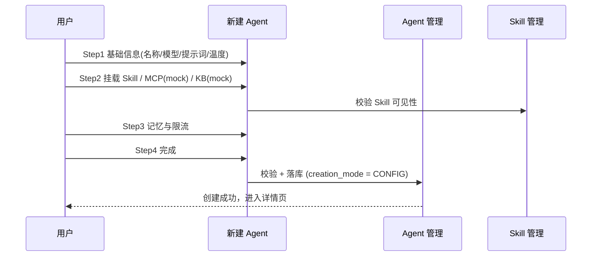
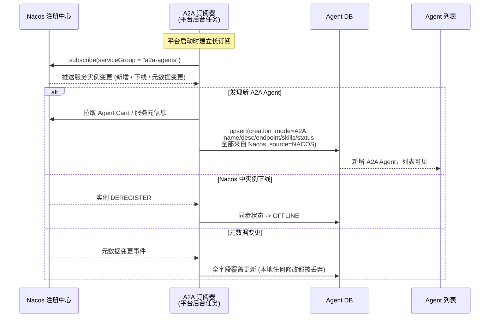
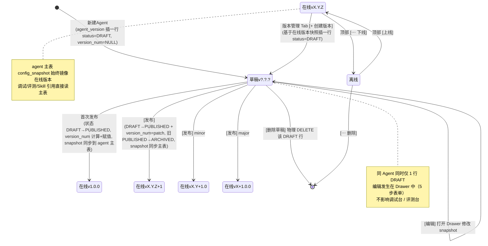
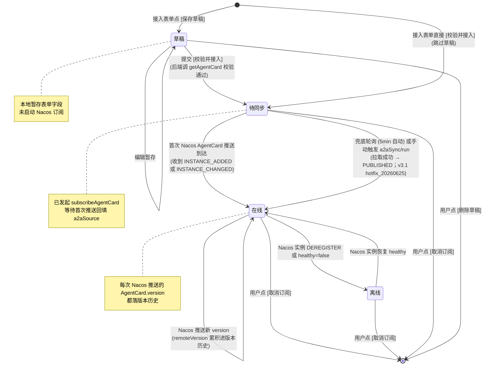
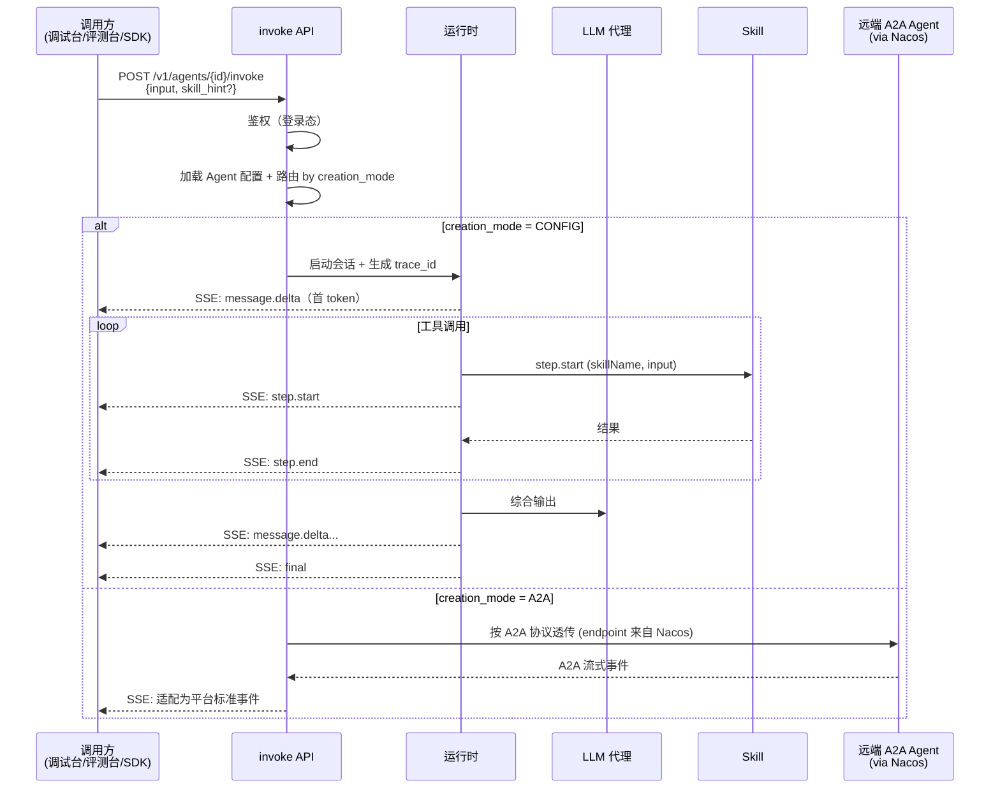
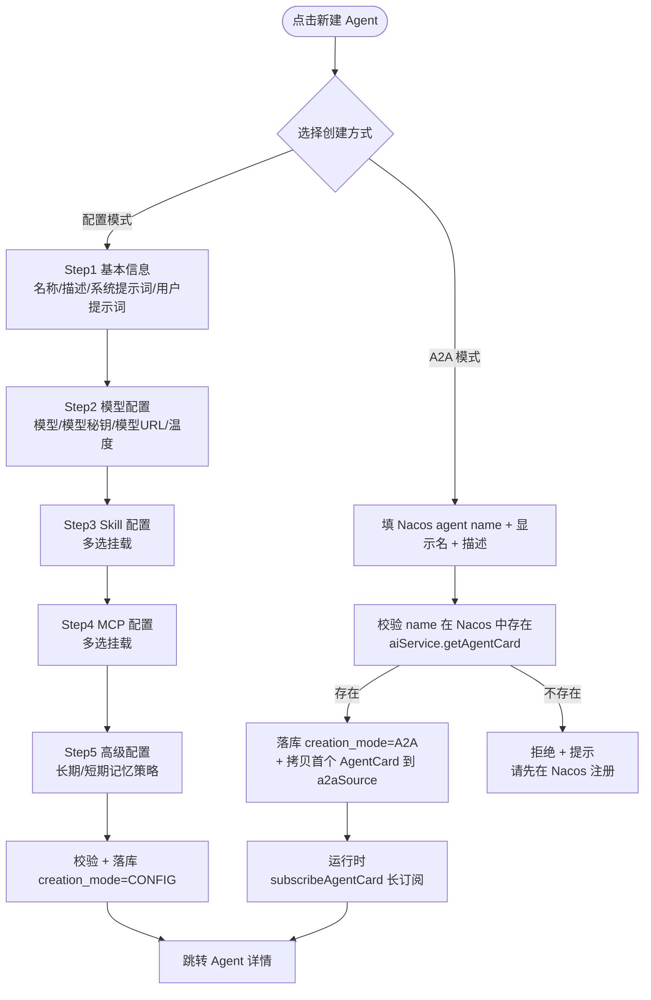
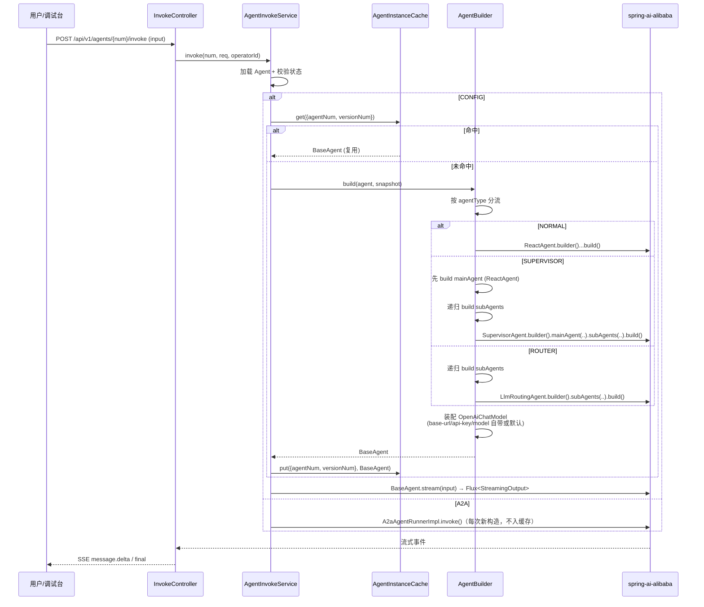

# AgentOps — Agent 管理 PRD（含 Agent 评测）

> 文档日期：2026-05-11　|　版本：v3.1　|　覆盖周期：S2（2026-04 ~ 2026-07）
> 父文档：[S2 PRD](./2026-05-11-AgentOps-S2-PRD.md) · [S2 规划](../总体规划/2026-05-11-AgentOps-S2规划.md)
>
> **v3.1 变更摘要（2026-06-25, hotfix_20260625_a2a-create-endpoints 同步能力补充）**：A2A "待同步 → 在线" 兜底轮询 + 手动触发：
> - **新增兜底轮询机制**：后端每 5 分钟对账一次 `status=PENDING_SYNC` 的 A2A Agent，主动调 Nacos `getAgentCard` 校验远端可达并推进至 `PUBLISHED`，弥补"长订阅推送延迟 / 漏推"场景（运维开 `A2A_NACOS_ENABLED` 后等不及下一个周期、或 Nacos 实例刚上线但推送尚未触达时必备）
> - **新增手动触发入口**：`POST /api/v1/agents/a2aSync/run?batchSize=N`，供运维 / 一线手工补齐，无需等下个 5min 周期
> - **新增 1min 冷却窗口**：`AgentQueryService.listPendingSyncCandidates` 过滤 `createTime <= now-1min` 的 PENDING_SYNC，避免与 Nacos 首次推送抢跑（用户刚接入完成的 Agent 至少等 1min 才走兜底）
> - **新增失败容错语义**：单条拉取失败 → 写 `A2aSyncHistory(syncEventType=POLLING_RECONCILE, errorMessage=...)` + 跳过，不影响其他条；整轮异常由下一周期重试
> - **状态机新增边**：`待同步 --> 在线: 兜底轮询 (5min 自动) 或手动触发 a2aSync/run`
> - **多副本部署**：经 Redisson 全局锁 `a2a:sync:reconcile:lock` 保证同一时刻只有一个实例执行兜底对账；抢不到锁的副本直接跳过本轮
> - **详见 §6.6.5 兜底轮询与手动触发** 与 §7.5 关键状态
>
> **v3.0 变更摘要（2026-05-15）**：版本模型与详情页操作位置重构（**重大数据模型变更**）：
> - **删除 `agent_draft` 表**；草稿不再独立存储
> - **`agent_version` 表加 `status` 字段**：枚举 `DRAFT` / `PUBLISHED` / `ARCHIVED`（旧版本）；同 Agent 同时仅 1 行 DRAFT
> - **创建版本流**重写：[+ 创建版本] = 在 `agent_version` 中 INSERT 一行 `status=DRAFT`（基于当前在线版本快照）；编辑 = UPDATE 该 DRAFT 行的 `config_snapshot`；发布 = `DRAFT → PUBLISHED` 状态翻转 + 计算最终 versionNum + 同步 snapshot 到 `agent` 主表
> - **`agent` 主表新增 `config_snapshot` JSON 列**：始终镜像当前在线版本的完整配置；调试 / 评测 / Skill 引用方查 agent 时直接拿配置，不必 join `agent_version`
> - **详情页顶部按钮去掉 [+ 创建版本] 与 [发布]**：操作位置移到"版本管理" Tab：
>   - 版本管理 Tab 右上角：**[+ 创建版本]** 按钮 → 在版本表中插一行 DRAFT
>   - 版本列表行操作（按 status 分支）：
>     - DRAFT 行：[编辑]（打开 5 步表单 Drawer）/ [发布]（弹影响等级 + 备注 Modal）/ [删除]
>     - PUBLISHED（current=true）行：[查看 snapshot]（其他操作不暴露）
>     - ARCHIVED 历史行：[查看 snapshot] / [对比] / [回滚]
> - 详情页顶部按钮简化为：[调试] / [上线]（OFFLINE 时） / [⋯ 更多: 下线 / 删除]
> - 版本号策略：DRAFT 态 versionNum 字段为 NULL；发布时按 changeLevel 与当前在线版本计算最终 Semver
> - 同 Agent 同时仅 1 个 DRAFT 版本（应用层校验 + DDL `agent_version` 加 `(agent_num, status='DRAFT')` 部分唯一约束兜底）
>
> **v2.9 变更摘要（2026-05-15）**：CONFIG 详情页"版本历史" Tab 升级为"版本管理"：
> - **Tab 改名**：CONFIG 详情页第 7 个 Tab "版本历史" → **"版本管理"**（A2A 仍保留"版本历史"，因为只展示同步事件流不可编辑）
> - **当前草稿合并到表格头一行**：状态显示 `草稿编辑中`；版本号列显示 `<currentVersionNum> → 草稿`（首次未发布则显示"草稿（首版未发布）"）；操作列只有 [编辑]
> - **点 [编辑] 跳转编辑态**：切回"基本信息" Tab + Toast 提示"请在各 Tab 中编辑后点 [发布] 升版本"；用户在 Tab 内修改 model/Skill/MCP/记忆策略等字段 → 顶部按钮 [发布] 走标准升版本流程
> - **同 Agent 同时仅 1 份草稿**（PRD §6.10.4 已有约束）
> - 同步 backend `saveDraft` 改 upsert 语义（v2.8 已落地）：在线 PUBLISHED Agent 上点 [+ 创建版本] → 后端自动基于 currentVersionNum 创建新草稿，前端"版本管理"Tab 立即出现草稿行
>
> **v2.8 变更摘要（2026-05-15）**：CONFIG Agent 大模型配置必须 Agent 自带（撤销平台默认回落）：
> - **§6.5 Step2 模型秘钥 / 模型 URL 地址改为必填**（撤销 v2.5 的"留空走平台默认"语义）
> - **`OpenAiChatModelFactory` 简化**：每次构建 LLM 都强制读 `ConfigSnapshot.modelApiKey / modelBaseUrl / model`；任一缺失抛 `BizCode.MODEL_NOT_CONFIGURED(2014)`
> - **不再注入或依赖** `spring.ai.openai.*` Spring Bean 默认值；`application.yml` 中 OpenAI 段保留 placeholder 仅供 starter 自动装配 Bean 不报错（实际不会被 CONFIG 调用路径使用）
> - **业务理由**：Agent 维度独立的密钥使审计 / 限流 / 计费可按 Agent 归因，平台不再担当"共享 LLM 凭证池"角色
>
> **v2.7 变更摘要（2026-05-15）**：CONFIG 模式 Agent 调试发起会话时的构建链路定义：
> - **构建分流**（按 `agentType` 派发到 spring-ai-alibaba 提供的对应 Agent 类型）：
>   - 普通 → `ReactAgent`
>   - 监督者 → `SupervisorAgent`（必须含一个 `mainAgent` ReactAgent + 子 Agent 列表）
>   - 路由 → `LlmRoutingAgent`（一次性路由到子 Agent）
>   - 子 Agent 也按本规则递归构建
> - **大模型装配统一走 OpenAI 兼容协议**：用 `spring-ai-openai-spring-boot-starter` 实例化 `OpenAiChatModel`，base-url + api-key + model 取自 Agent `ConfigSnapshot` 的 `modelBaseUrl / modelApiKey / model` 字段；为空则回落到 application.yml 的 `spring.ai.openai.*` 默认值。**禁用 DashScope 原生 starter**（`spring-ai-alibaba-starter-dashscope`），避免与 OpenAI starter 版本冲突。
> - **构建后实例缓存到进程内**：`ConcurrentHashMap<cacheKey, BaseAgent>`；同一个 Agent 在同版本下首次构建后被复用，避免每次发起会话都重建（构建涉及 LLM client 实例化 / 子 Agent 递归构建）。
> - **缓存失效时机**：发布新版本 / 下线 / 删除 / Agent.modelApiKey 或 modelBaseUrl 改动；A2A 模式不进入此缓存（A2A 走 `A2aRemoteAgent` 链路，由 `A2aAgentRunnerImpl` 自行管理实例）。
>
> **v2.6 变更摘要（2026-05-14）**：状态机统一 + 版本管理推广到两种模式：
> - **CONFIG 状态机**：`草稿 / 在线 / 离线` 三态（语义 = `DRAFT_ONLY / PUBLISHED / OFFLINE`，与原一致）
> - **A2A 状态机**：`草稿 / 待同步 / 在线 / 离线` 四态（**v2.6 新增"待同步" `PENDING_SYNC`**：用户接入表单提交后、首次 Nacos AgentCard 推送到达前的过渡态；**新增"草稿"** = 用户暂存表单未提交校验，本地落库但未启动订阅）
> - **A2A 接入表单加 [保存草稿] 按钮**（v2.4 单一 [校验并接入] 按钮升级为双按钮）；草稿态可后续打开续填，提交校验通过后转 PENDING_SYNC
> - **CONFIG 不允许直接修改在线 Agent**（v2.6 强化 §6.10 已有约束）：在线 Agent 上不再有 [编辑] 按钮；改为 **[+ 创建版本]** 显式入口 → 进入版本编辑态 → [发布] 后生成新在线版本，旧版本沉淀进版本历史
> - **两种模式都有"版本号"字段 + "版本历史" Tab**：
>   - CONFIG：版本号 = 用户发布生成的 Semver（v1.0.0 / v1.1.0 ...，已有机制 §6.10）
>   - A2A：版本号 = Nacos AgentCard.version 推送值（每次 Nacos 推送新 version 落一条同步事件历史）
> - **CONFIG 详情页 Tab 由 6 个扩为 7 个**（加版本历史）；**A2A 详情页 Tab 由 4 个扩为 5 个**（加版本历史）
>
> **v2.5 变更摘要（2026-05-14）**：配置模式新建 Agent 步骤由 4 步扩为 **5 步**；CONFIG 详情页 Tab 由 5 个改为 **6 个**（5 步对应 + API 信息）：
> - **Step1 基本信息**：名称 / 描述 / 系统提示词 / 用户提示词（移除原 Step1 的模型 / 类型 / 温度）
> - **Step2 模型配置**：模型（下拉）/ 模型秘钥 / 模型 URL 地址 / 温度（v2.5 模型秘钥与 URL 由 Agent 自带，覆盖平台 LLM 代理默认值）
> - **Step3 Skill 配置**：从 Skill 列表多选挂载（独立成步）
> - **Step4 MCP 配置**：从 MCP 列表多选挂载（独立成步；原 mock 占位升级为真实选择，列表能否取到由 Skill / MCP 模块进度决定）
> - **Step5 高级配置**：长期记忆策略 / 短期记忆策略（替代原 Step3 的"开关"语义；具体策略选项 M3 视进度细化）；同步保留 QPS / 日预算（可选）+ 底部 [完成接入] 提交按钮
> - **CONFIG 详情页 Tab 改为 6 个**：基本信息 / 模型配置 / Skill 配置 / MCP 配置 / 高级配置 / **API 信息**（新增）；前 5 个 Tab 与 5 步表单一一对应（编辑模式复用同一组件）；API 信息 Tab 显示本 Agent 的 4 个对外 API 完整 URL + cURL 示例。A2A 详情页同步加 API 信息 Tab，共 4 个
> - **`ConfigSnapshot`** 加 `modelApiKey: String` / `modelBaseUrl: String` 字段；`memoryConfig` 由 `{shortTermEnabled, longTermEnabled}` 改为 `{shortTermStrategy, longTermStrategy}`
>
> **v2.4 变更摘要（2026-05-14）**：A2A Agent 接入方式由"后台自动发现"改为"UI 主动创建 + 后台按需订阅"：
> - **新建 Agent 按钮重新启用**（v2.1 disabled 撤销）。点击后弹出"选择创建方式"——配置模式 / A2A 模式
> - **A2A 模式新建表单**：用户填写 Nacos 中已注册的 Agent name（必填）+ 显示名 / 描述 / 备注（可选，用于本地展示）；提交后后端通过 Nacos AI SDK 拉取一次 AgentCard 校验存在性，落库一条 A2A Agent 记录并自动建立 `subscribeAgentCard` 长订阅
> - **同步范围由"批量发现 group"改为"已创建的 A2A Agent 一对一订阅"**：移除 `rd-agent.a2a-sync.agent-names` 配置驱动 + 移除 group 全量轮询；订阅列表运行时从 DB（`agent` 表 `creation_mode=A2A` 行）动态加载，新建 / 删除 Agent 时即刻 subscribe / unsubscribe
> - **A2A 详情页操作区新增 [取消订阅]**（行为 = 软删除 Agent + 反订阅）；其余字段（name / description / skills / mcps / status）仍由 Nacos 推送全字段覆盖，平台不可改
> - **失败语义**：UI 创建时 Nacos 中找不到该 agent name → 返回 4xxx 业务错并提示"远端未注册该 Agent，请先在 Nacos 注册"；不落库
>
> **v2.3 变更摘要（2026-05-14）**：A2A 详情页 Tab 扩展：
> - **A2A 模式 Tab 由 2 个扩为 3 个**：基本信息 / **Skills** / **MCP**（新增）
> - **MCP Tab 数据源**：来自 Nacos Agent Card 的 `mcps` 数组（与 `skills` 对称的元数据），平台只读展示远端 A2A Agent 已接入的 MCP 工具清单（name / description / serverUrl?）
> - **Nacos 同步字段映射**新增 `a2aSource.remoteMcps[]`，由 `A2aSyncService` 全字段覆盖更新
> - **配置模式 Tab 不变**（CONFIG 的 MCP 仍按原 mock 占位策略）
>
> **v2.2 变更摘要（2026-05-14）**：列表新增 **Agent 来源** 列：
> - **取值**：`人工创建` / `Nacos注册`（与 `配置方式` 列同源派生于 `creationMode`：`CONFIG → 人工创建`、`A2A → Nacos注册`）
> - **定位**：面向最终用户的"来源语言"；`配置方式` 列保留作为偏技术语义的标签
> - **列顺序（v2.2）**：编码 / 名称 / 描述 / **Agent来源** / 状态 / Skills / 配置方式 / 创建时间 / 最后更新时间
>
> **v2.1 变更摘要（2026-05-14）**：Agent 列表与详情页结构精简：
> - **列表列调整**：保留 **编码 / 名称 / 描述 / 状态 / Skills / 配置方式 / 创建时间 / 最后更新时间**；移除 **类型 / 版本号 / 创建人 / 更新人** 列。
> - **新建 Agent 按钮**：当前阶段 **disabled 不可点击**（保留按钮位以维持视觉），4 步表单暂不开放（仅完成 A2A 同步链路即可）。
> - **A2A 详情页 Tab 简化**：A2A 模式仅显示 **基本信息 / Skills** 两个 Tab；移除 Manifest、最近 Runs。配置模式 Tab 结构暂不变更。
>
> **v2.0 变更摘要（2026-05-14）**：创建方式从 5 种（配置 / ACP / MCP / A2A / API）收敛为 **2 种**：
> - **配置模式**：通过页面新建 Agent（保留原能力）
> - **A2A 模式**：通过订阅 **Nacos 注册中心**自动发现并同步 Agent，平台只读、不可修改任何信息（含状态）
>
> 原 ACP / MCP / API 模式整体下线，不再纳入路线图。

---

## 1. 模块定位

Agent 管理在 S2 周期内是 **基础支撑模块**（P1-中），定位为：

> **业务方"配置出 Agent" + "纳管已有 Agent"的统一入口 + 调试台 / 评测台的运行载体** —— 提供 **Agent 2 种创建方式**（配置模式 / A2A 模式）× **3 种类型**（普通 / 监督者 / 路由）的 CRUD、新建表单、详情页关键卡片，并对外暴露 invoke 接口（含 SSE 流式）作为整个平台的运行时入口。Agent 评测在 S2 内仅交付人工调试。

**为什么把 Agent 评测合并进本 PRD**：S2 内 Agent 评测只做人工调试一项功能，规模较小，独立成册过重；评测台也是从 Agent 列表行操作进入，归属合理。

**两种创建方式的本质区别**

| 维度 | 配置模式 | A2A 模式 |
| --- | --- | --- |
| 来源 | 用户在平台页面手工配置 | 后台订阅 Nacos 注册中心自动发现 |
| 实现承载 | 平台运行时 + LLM + 挂载 Skill / MCP / KB | 远端业务团队自管的 A2A Agent 服务 |
| 平台是否可改 | ✅ 全部可改、可发布、可下线 | ❌ 平台只读；信息、状态全部从 Nacos 同步 |
| 版本管理 | ✅ 平台 own，Semver 草稿/发布闭环 | ❌ 不适用，版本由远端 own |
| invoke 入口 | `/v1/agents/{id}/invoke`（统一） | `/v1/agents/{id}/invoke`（统一，运行时按 A2A 协议代理调用远端） |

**与兄弟模块关系**

- 被 [调试台](./2026-05-11-调试台-PRD.md) 依赖（提供 Agent 列表 + invoke 接口 + SSE 事件）；
- 被 [Skill 管理](./2026-05-11-Skill管理-PRD.md) 评测台依赖（执行 Agent 选择 + 沙盒 Agent）；
- Agent 挂载 Skill 是配置模式核心能力之一；
- MCP / 知识库挂载在 S2 内仅 mock。

---

## 2. 目标与范围

### 2.1 S2 目标

| 目标 | 度量 |
| --- | --- |
| 配置模式可建 | 普通 Agent M2 必做；监督者 / 路由 M3 视进度 |
| A2A 模式可同步 | M3 接通 Nacos 订阅，自动写入 A2A Agent 至列表 |
| 调试可用 | 调试台可选到任意已发布或已同步的 Agent 并发起调用 |
| 评测可用 | 单 Agent 可跑人工调试评测（M3） |
| 接口稳定 | invoke 接口（SSE 流式，按 §6.8 契约）M2 真实 GA |
| 业务接入 | 至少 1 个业务 Agent 上线，调试台可试 |

### 2.2 范围

**S2 内做**

- Agent 列表（ProTable + 行操作 + 搜索 Agent 编码 / 名称 + **创建方式筛选**）
- 新建 Agent：仅 **配置模式** 走页面表单；**A2A 模式不出现在新建入口**（不通过手工创建产生）
- A2A Nacos 订阅同步：后台任务订阅 Nacos 注册中心，发现符合 A2A 协议的 Agent 后自动入库
- Agent 详情（基础信息 / Skill 配置 / 对外接口 cURL；A2A 模式额外显示来源信息卡片）
- Agent invoke 接口 + 会话 CRUD（mock M1，真实 M2）
- SSE 事件流（与调试台契约一致；A2A 模式由运行时按 A2A 协议适配）
- 普通 Agent（必做）；监督者 / 路由 Agent S3 开放（仅配置模式可创建）
- Agent 人工调试评测（M3）
- "空白沙盒 Agent"内置（供 Skill 评测）

**S2 内不做**

- ❌ 完整记忆管理（短/长记忆只做开关，不做条目级管理）
- ❌ 近期调用统计 / Token 消耗仪表
- ❌ OpenAPI 5 语言示例自动生成（只给 cURL，进 S3）
- ❌ 完整 MCP / 知识库挂载（仅 mock，真实接入进 S3）
- ❌ Agent 自动评测（进 S3）
- ❌ 评测主页 / 跨 Agent 任务总览（进 S3）
- ❌ 工作空间隔离（单空间硬编码）
- ❌ A2A Agent 的本地编辑、覆盖、版本化（A2A 永远只读）
- ❌ ~~ACP 模式 / MCP 模式 / API 模式接入~~（v2.0 整体下线，不进路线图）

---

## 3. 业务流程

### 3.1 新建 Agent（仅配置模式走表单）

> **S2 范围**：新建 Agent 入口只支持 **配置模式**；A2A 模式由后台订阅自动产生，不在新建入口出现；类型仅支持普通 Agent。



### 3.2 A2A 模式 - Nacos 订阅自动同步（无用户介入）



> **强约束**：A2A Agent 的所有字段（含 `name` / `description` / `endpoint` / `status` / `version` 等）以 Nacos 为唯一权威源；平台不暴露任何编辑入口；同步任务每次都执行**全字段覆盖**，不做增量合并。

### 3.3 Agent 状态机（v2.6 改：CONFIG 3 态 / A2A 4 态，两种模式均有版本化）

**配置模式状态机（v3.0 改：草稿是 agent_version.status=DRAFT 的版本，不再单独 agent_draft 表）**



**A2A 模式状态机（4 态，v2.6 不变）**



> **不变量**：A2A 模式版本号（remoteVersion）来自 Nacos AgentCard，平台不能本地编辑；CONFIG 模式版本号由平台 Semver 生成。两种模式都有"版本历史" Tab，但同步语义完全不同（详见 §6.10.4）。

### 3.4 Agent invoke 调用流程



---

## 4. 用例图

```mermaid
flowchart LR
    Dev[开发者]
    AgentOwner[Agent 负责人]
    Demo[平台演示者]
    A2AOwner[A2A Agent 服务负责人<br/>(在 Nacos 注册自管 Agent)]

    UC_LIST[查看 Agent 列表]
    UC_NEW_CFG[配置模式新建 (4 步)]
    UC_EDIT[编辑配置模式 Agent]
    UC_PUB[发布/下线]
    UC_DETAIL[查看详情]
    UC_BIND[绑定子 Agent]
    UC_API[查看 invoke 接口文档]
    UC_DEBUG[进调试台调试]
    UC_EVAL[人工调试评测]
    UC_REGISTER[在 Nacos 注册 A2A Agent]
    UC_VIEW_A2A[查看 A2A Agent 同步状态]

    Dev --> UC_LIST & UC_NEW_CFG & UC_DETAIL & UC_API & UC_DEBUG
    AgentOwner --> UC_LIST & UC_NEW_CFG & UC_EDIT & UC_PUB & UC_DETAIL & UC_BIND & UC_EVAL
    Demo --> UC_LIST & UC_DETAIL & UC_DEBUG
    A2AOwner --> UC_REGISTER
    UC_REGISTER -.->|订阅自动同步| UC_VIEW_A2A
    Dev --> UC_VIEW_A2A
```

---

## 5. 用户与场景

| 角色 | 典型场景 |
| --- | --- |
| **开发者** | 新写一个 Skill 后，建一个普通 Agent 把 Skill 挂上，调试台跑通 |
| **Agent 负责人** | 维护业务方 Agent；监控调用情况；定期跑人工调试评测 |
| **平台演示者** | 演示「4 步建出 Agent → 调试台跑通」的快速链路 |
| **A2A Agent 服务负责人** | 团队已有的 A2A Agent 服务在 Nacos 注册后，自动出现在平台 Agent 列表，业务方在调试台可试 |

**用户故事**

- 作为**开发者**，我希望 4 步表单 5 分钟内建出一个 Agent，绑定 Skill 后立刻能在调试台调用。
- 作为**Agent 负责人**，我希望详情页能看到当前 Agent 的所有挂载资源 + 对外接口 cURL，方便发给业务方接入。
- 作为**Skill 评测台**（系统调用方），我希望能选到一个"空白沙盒 Agent"作为评测载体，无需为每个 Skill 评测建专属 Agent。
- 作为**A2A Agent 服务负责人**，我只需要在 Nacos 注册 / 注销服务，平台 Agent 列表会自动同步，不需要在平台再做任何配置。
- 作为**平台用户**，我希望详情页能清楚标识"该 Agent 来自 Nacos，平台不可修改"，并能看到来源服务名 / 注册时间 / 最近同步时间。

---

## 6. 功能需求

> 优先级：S2-P0/P1/P2；里程碑：M1 / M2 / M3。

### 6.1 Agent 列表

| 序号 | 功能点 | 简要说明 | 优先级 | 里程碑 |
| --- | --- | --- | --- | --- |
| 1.1 | 列表展示 | ProTable：**编码** / **名称** / **描述** / **Agent来源** / **状态** / **Skills** / **配置方式** / **创建时间** / **最后更新时间**（v2.2 新增 Agent来源；v2.1 移除类型/版本号/创建人/更新人） | S2-P1 | M2 |
| 1.2 | 行操作 | **查看** / **调试**（A2A 模式行同样可调试，但无编辑入口） | S2-P1 | M2 |
| 1.3 | 搜索 | 支持按关键词模糊搜索 编码 / 名称 | S2-P1 | M2 |
| 1.4 | 配置方式筛选 | 配置模式 / A2A 模式 / 全部 | S2-P1 | M2 |
| 1.5 | 新建入口 | 点击"新建 Agent"弹出 Modal："选择创建方式：配置模式 / A2A 模式"。配置模式 → 4 步配置表单；A2A 模式 → 简表（填 Nacos agent name + 显示名 / 描述），提交后后台自动订阅。**v2.1 disabled 撤销** | S2-P1 | M2 |
| 1.6 | A2A Agent 视觉标识 | 列表行的"配置方式"列对 A2A Agent 显示徽标"A2A · Nacos 同步" | S2-P1 | M3 |
| 1.7 | Agent来源筛选 | 人工创建 / Nacos注册 / 全部（与配置方式筛选互斥同源；前端可二选一展示，后端复用 `creationMode` 参数） | S2-P2 | M3 |

> **列字段细则**：
> - **编码**：`agent.num`（AGT 前缀）
> - **名称**：`agent.name`
> - **描述**：`agent.description`，列表内单行省略，hover tooltip 完整显示
> - **Agent来源**：派生自 `creationMode`，`CONFIG → 人工创建`、`A2A → Nacos注册`；列内显示文案标签（无徽标）
> - **状态**：胶囊样式，PUBLISHED → 在线 / OFFLINE → 已下线 / DRAFT_ONLY → 草稿
> - **Skills**：显示挂载/远端能力 Skill 数量；hover tooltip 列出 Skill 名称数组（CONFIG 取 `configSnapshot.skillNums` 关联名称；A2A 取 `a2aSource.remoteSkills[].name`）
> - **配置方式**：技术语义标签，配置模式 / A2A · Nacos（带徽标）；与 Agent来源 同源派生
> - **创建时间**：`agent.createTime`，格式 `YYYY-MM-DD HH:mm`
> - **最后更新时间**：`agent.updateTime`（A2A 即最近一次 Nacos 同步覆盖时间），格式 `YYYY-MM-DD HH:mm`
>
> **Agent来源 vs 配置方式**：两列同源派生于 `creationMode`，差异仅在展示语言：
> | creationMode | Agent来源 | 配置方式 |
> | --- | --- | --- |
> | `CONFIG` | 人工创建 | 配置模式 |
> | `A2A` | Nacos注册 | A2A · Nacos |
>
> 前端可视产品形态决定两列同时保留或择一显示；后端字段不冗余。

### 6.2 Agent 创建方式（2 种）

> Agent 有两个正交维度：**创建方式**（Agent 来源 / 实现承载）+ **类型**（行为模式）。

| 方式 | 一句话定位 | Agent 实际承载 | 产生方式 | 平台可改 | 适用类型 | S2 状态 |
| --- | --- | --- | --- | --- | --- | --- |
| **配置模式** | 平台原生配置出 Agent | 平台运行时 + LLM + 挂载 Skill/MCP/KB | 用户在页面新建（4 步表单） | ✅ | 普通 / 监督者 / 路由 | ✅ M2 必做（监督者 / 路由 M3） |
| **A2A 模式** | 用户主动接入一个已在 Nacos 注册的远端 A2A Agent | 远端 A2A Agent 服务（业务团队自管） | **用户在 UI 填 Nacos agent name 创建（v2.4 改）+ 后台自动 subscribeAgentCard 拉取并保持同步** | ❌ name/description/skills/mcps/status 等字段只读，由 Nacos 推送覆盖；用户仅可：取消订阅（删除）、改本地备注（M3 视进度） | 普通（远端类型由远端定义，平台统一记为普通） | ✅ M3 接通 |

**通用约束**

- 所有方式产出的 Agent 在调用层完全一致：都通过 `/v1/agents/{id}/invoke` 入口，对调用方透明；
- 配置模式可挂载 Skill / MCP / KB，可走草稿/发布版本流程；
- A2A 模式所有 AgentCard 字段（name / description / skills / mcps / status）以 Nacos 为唯一权威源；用户在平台仅持有"订阅关系"，无法编辑 AgentCard 字段；
- A2A 模式不参与平台的版本化机制，详情页的"在线版本号"显示远端服务版本（取自 Nacos AgentCard `version` 字段，缺失时显示 `-`）；
- A2A Agent 在 UI 创建时，后端必须先调 `aiService.getAgentCard(name)` 校验远端存在，**未注册则拒绝创建**（返回 4xxx，不落库）。

### 6.3 Agent 三类型

| 类型 | 说明 | 可用创建方式 | S2 状态 |
| --- | --- | --- | --- |
| **普通 Agent** | 单一职责，挂载 Skill 直接执行；可作为子 Agent 被绑定 | 配置模式 / A2A 模式 | ✅ S2 必做 |
| ~~**监督者 Agent**~~ | ~~编排子 Agent；可绑定子 Agent（仅普通）~~ | 仅配置模式 | 🔒 S3 开放 |
| ~~**路由 Agent**~~ | ~~按用户意图分发请求；可绑定子 Agent（仅普通）~~ | 仅配置模式 | 🔒 S3 开放 |
| **空白沙盒 Agent** | 平台内置，供 Skill 评测台兜底使用；不出现在 Agent 列表 | 配置模式（系统种入） | ✅ M1 必做 |

> 注：A2A 模式的远端 Agent 内部可能是任意行为模式（监督者 / 路由 / 普通），但平台无法感知，统一记为"普通"。

### 6.4 新建 Agent 流程



> **新建入口同时支持配置模式与 A2A 模式**（v2.4 改）。配置模式 v2.5 起拆为 5 步；A2A 模式必须先在 Nacos 注册，平台才能创建。

### 6.5 配置模式 - 5 步表单（v2.5）

| 步 | 字段 | 说明 | 优先级 | 里程碑 |
| --- | --- | --- | --- | --- |
| **Step1 基本信息** | 名称 | 必填，部门内唯一 | S2-P1 | M2 |
| | 描述 | 多行 textarea，可为空，列表 / 详情页展示用 | S2-P1 | M2 |
| | 系统提示词 | 多行 textarea | S2-P1 | M2 |
| | 用户提示词 | 多行 textarea，可为空 | S2-P1 | M2 |
| **Step2 模型配置** | 模型 | 必填，下拉：公司 LLM 代理可用模型；选定后右侧展示厂商 / 上下文长度等只读元信息 | S2-P1 | M2 |
| | 模型秘钥 | **必填（v2.8 改）**，OpenAI 兼容 API key；落库加密 | S2-P1 | M2 |
| | 模型 URL 地址 | **必填（v2.8 改）**，OpenAI 兼容 base URL（含 `/v1`）；该 Agent 调用时直接用 | S2-P1 | M2 |
| | 温度 | 0.0 ~ 2.0，默认 0.7 | S2-P1 | M2 |
| **Step3 Skill 配置** | Skill 列表 | 多选，下拉来自 Skill 管理已发布列表；左侧候选区 + 右侧已选区双栏交互；可搜索 Skill 名称 / 标签 | S2-P1 | M2 |
| **Step4 MCP 配置** | MCP 列表 | 多选，下拉来自 MCP 管理列表（M3 接通；S2 内 MCP 模块若未就绪则展示 Empty + "MCP 模块暂未上线，可先跳过"）；同样双栏交互 | S2-P2 | M3 |
| **Step5 高级配置** | 长期记忆策略 | 单选下拉：`无` / `向量召回` / `全文召回`（具体策略选项 M3 视记忆模块进度细化） | S2-P1 | M3 |
| | 短期记忆策略 | 单选下拉：`无` / `最近 N 轮`（默认 N=10）/ `滑动窗口` | S2-P1 | M3 |
| | QPS（可选） | 默认 10；折叠在"限流参数"展开块内 | S2-P1 | M3 |
| | 日预算（可选） | 默认 100 元；同上 | S2-P2 | M3 |
| | [完成接入] | 底部 Primary 按钮：后端校验通过 → 落库 → 跳转详情 | S2-P1 | M2 |

> **类型字段不在表单中暴露**：S2 内固定为普通 Agent（监督者 / 路由 S3 开放）；后端落库时硬编码 `agentType = NORMAL`。
> **知识库（KB）**：v2.0 起暂未纳入表单，等 KB 模块就绪后单独追加 Step（不算破坏性变更，新 Step 在 Step4 与 Step5 之间插入）。
> **模型秘钥 / URL 安全**：模型秘钥落库时加密（与 Skill 模块的密钥加密策略对齐）；前端编辑时不回显明文，仅提示"已配置"+ [清空重填] 按钮。

### 6.5A A2A 模式 - 接入表单（v2.4 新增）

> A2A 模式不走 4 步表单，因为 AgentCard 字段（name / description / skills / mcps / version）由 Nacos 推送，平台不维护。用户只需告诉平台"我要接入 Nacos 中名为 X 的 Agent"，剩下的同步由后台自动完成。

| 字段 | 必填 | 说明 | 优先级 | 里程碑 |
| --- | --- | --- | --- | --- |
| Nacos Agent Name | ✅ | Nacos AI 中已注册的 AgentCard.name；后端用此 name 调 `aiService.getAgentCard` 校验存在性 | S2-P0 | M3 |
| 显示名 | 可选 | 平台列表显示用；不填默认取 Nacos AgentCard.name | S2-P1 | M3 |
| 描述 | 可选 | 平台备注；不填默认取 Nacos AgentCard.description；后续 Nacos 推送 description 不会覆盖此本地备注（M3 视进度，先不区分） | S2-P2 | M3 |
| 备注 | 可选 | 仅本地展示，不参与同步 | S2-P2 | M3 |

**提交流程（v2.6 双按钮）**

表单底部两个按钮：

| 按钮 | 后端流程 | 落库状态 |
| --- | --- | --- |
| **[保存草稿]** | POST `/api/v1/agent/command/saveA2aDraft` —— 不调 Nacos，直接落库 | `DRAFT_ONLY`（草稿） |
| **[校验并接入]** | POST `/api/v1/agent/command/createA2a`（流程见下） | `PENDING_SYNC`（待同步） |

**[校验并接入] 详细流程**：

1. 前端 POST `/api/v1/agent/command/createA2a {nacosAgentName, displayName?, description?, remark?, draftAgentNum?}`（如果是从草稿提交，传 `draftAgentNum`）
2. 后端调 `aiService.getAgentCard(nacosAgentName)` 校验远端存在
   - 不存在 → 返回 BizCode `2011 A2A_AGENT_NOT_FOUND_IN_NACOS` + "远端未注册该 Agent，请先在 Nacos 注册"，**不落库**（草稿仍保留）
   - Nacos 不可达 → 返回 BizCode `2012 NACOS_UNREACHABLE` + "Nacos AI Server 不可达，请稍后重试"
3. 校验通过 → 落库（或更新草稿为正式记录）`creation_mode=A2A`，`status=PENDING_SYNC`，`a2a_source` 列填首次拉到的 AgentCard 转换值
4. 触发运行时 `subscribeAgentCard(nacosAgentName, listener)` 建立长订阅
5. 首次推送到达 → status 自动转 `PUBLISHED`（在线）
6. 前端跳转详情页（详情页顶部 Banner "等待 Nacos 首次同步…"）

**幂等**：同 `nacosAgentName` 二次提交 → 返回已存在的 Agent num（无论它是 DRAFT_ONLY / PENDING_SYNC / PUBLISHED），不重复落库；前端弹 Tooltip "该 A2A Agent 已接入"。

**草稿管理**：A2A 草稿在列表中显示 `Agent来源 = Nacos注册` + `状态 = 草稿`；行操作多一个 [继续接入] 链接，点击重新打开接入表单（预填已暂存字段）。

### 6.6 A2A 模式 - Nacos 订阅与同步

> **核心约束**（v2.4 改）：A2A Agent **由用户在 UI 主动创建**（见 §6.5A），创建后由后台对该单个 Agent 建立 `subscribeAgentCard` 长订阅；订阅范围 = 已落库的 `creation_mode=A2A` Agent 集合，运行时动态加减。所有 AgentCard 字段以 Nacos 为唯一权威源，平台只读。

#### 6.6.1 订阅范围与运行时管理（v2.4 重写）

| 配置项 | 默认值 | 说明 | 优先级 | 里程碑 |
| --- | --- | --- | --- | --- |
| 订阅列表来源 | DB（`agent` 表 `creation_mode=A2A` 行） | 不再用 yml 配置驱动；启动时全量装载，UI 创建 / 取消订阅时即时变更 | S2-P0 | M3 |
| 单 Agent 订阅 | 每个 A2A Agent → 一次 `aiService.subscribeAgentCard(name, listener)` | 一对一长订阅，listener 收到事件后回调 `AgentCommandService.onNacosEvent` | S2-P0 | M3 |
| 兜底轮询 | 每 5 分钟（可配 `rd-agent.a2a-sync.poll-interval-ms`）对所有已订阅 Agent 调一次 `getAgentCard` 对账，补长订阅丢失的事件 | S2-P1 | M3 |
| 不再做 group 全量发现 | ~~按 `a2a-agents` group 列出全部实例~~ | v2.4 撤销：Nacos AI SDK 暂不支持 list-all-agents，且产品上需要"用户对接入 Agent 有 explicit 决策" | — | — |

> **演进路径**：等 Nacos AI SDK 提供 catalog API（list-all-agents）或业务方约定通过 Nacos config 下发动态名单后，可加一个"批量发现并建议"入口，但订阅关系仍走 UI 显式确认。

#### 6.6.2 同步字段映射（Nacos → 平台 DB）

| 平台字段 | Nacos 来源 | 是否覆盖本地 |
| --- | --- | --- |
| `num` | UI 创建时由平台生成（AGT 前缀） | 否（一次性） |
| `nacos_service_key` | UI 创建时填入的 nacosAgentName（构成 `namespace@@name` 唯一键） | 否（一次性） |
| `name` | Agent Card `name` 字段 | ✅ 每次同步覆盖 |
| `description` | Agent Card `description` 字段 | ✅（M3 视进度，可能保留本地 description 不被覆盖） |
| `endpoint` | Nacos 实例的 `host:port` + Agent Card 中 `endpoint` 路径 | ✅ |
| `version` | Agent Card `version` 字段（缺失则显示 `-`） | ✅ |
| `skills` | Agent Card `skills` 数组（仅展示，不可挂载平台 Skill） | ✅ |
| `mcps` | Agent Card `mcps` 数组（仅展示，列：name / description / serverUrl?）；v2.3 新增 | ✅ |
| `status` | Nacos 实例 `healthy=true` → 在线；`healthy=false` 或实例下线 → 下线 | ✅ |
| `creation_mode` | 固定为 `A2A` | 写入时一次性 |
| `source` | 固定为 `NACOS` | 写入时一次性 |
| `last_synced_at` | 最近一次同步时间戳 | ✅ 每次同步刷新 |

#### 6.6.3 同步策略

| 序号 | 功能点 | 简要说明 | 优先级 | 里程碑 |
| --- | --- | --- | --- | --- |
| 6.1 | 启动时装载 | 进程启动后从 DB 拉取所有 A2A Agent，对每个 `subscribeAgentCard` 建立长订阅 | S2-P0 | M3 |
| 6.2 | 长订阅 | 监听单个 AgentCard 变更事件（INSTANCE_CHANGED / INSTANCE_REMOVED），实时回写本地 | S2-P0 | M3 |
| 6.3 | 即时订阅 / 反订阅 | UI 创建 A2A Agent → 即刻 `subscribeAgentCard`；UI 取消订阅 / 删除 → 即刻 `unsubscribeAgentCard` | S2-P0 | M3 |
| 6.4 | 兜底轮询 | 每 5 分钟对所有已订阅 Agent 调一次 `getAgentCard` 对账，补长订阅丢失的事件 | S2-P1 | M3 |
| 6.5 | 全字段覆盖 | 每次同步时所有 Nacos 来源字段全量覆盖，本地任何篡改都被丢弃 | S2-P0 | M3 |
| 6.6 | 软下线 | Nacos 中实例 DEREGISTER → 平台保留 Agent 记录但状态置为下线，调用返回 410 | S2-P1 | M3 |
| 6.7 | 同步审计 | 每次同步动作记录 trace（来源事件 / 字段 diff / 同步耗时），便于排错 | S2-P2 | M3 |

#### 6.6.5 兜底轮询与手动触发（v3.1 新增, hotfix_20260625_a2a-create-endpoints）

> **核心目的**：弥补 Nacos 长订阅推送延迟 / 漏推场景，确保 `status=PENDING_SYNC` 的 A2A Agent 最终都会被推进至 `PUBLISHED`。正常情况下长订阅会在数秒内触发 INSTANCE_ADDED；该机制仅在长订阅丢失事件或运维刚启用 Nacos 配置时启动一次补齐。

**触发方式（两条并行入口，都打到 application 层同一方法）**

| 入口 | 触发时机 | 实现位置 |
| --- | --- | --- |
| **定时轮询** | `@Scheduled(cron = "0 0/5 * * * ?")`，每 5 分钟一次 | `A2aSyncScheduler`（adapter 层 scheduler）|
| **手动触发** | 运维 / 一线调 `POST /api/v1/agents/a2aSync/run?batchSize=N` | `A2aSyncController`（adapter 层 controller）|

**流程（两条入口完全一致）**

1. 抢 Redisson 全局锁 `a2a:sync:reconcile:lock`（多副本下抢不到直接跳过本轮）
2. 调 `AgentQueryService.listPendingSyncCandidates(batchSize)` 取候选（**已含 1min 冷却窗口**：过滤 `createTime <= now-1min` 的 PENDING_SYNC，避免与首次 Nacos 推送抢跑）
3. 逐条：调 `NacosAgentCardFetcher.fetch(name)` 拉远端 AgentCard
   - 拉取成功 → 调 `Agent.applyNacosSync(...)` 推进 status 至 PUBLISHED + 写 `A2aSyncHistory(syncEventType=POLLING_RECONCILE)`
   - 拉取失败 → 仅写 `A2aSyncHistory(syncEventType=POLLING_RECONCILE, errorMessage=...)` + 跳过；不影响后续条
4. 每条独立事务（`Propagation.REQUIRES_NEW`），单条失败不阻断后续

**手动触发端点契约**

| 项 | 内容 |
| --- | --- |
| Method / Path | `POST /api/v1/agents/a2aSync/run` |
| 入参 | `batchSize: int`（query param，1 ≤ batchSize ≤ 500，缺省 50） |
| 出参 | `{ "code": 200, "data": { "processed": <int> }, "traceId": ... }` |
| 权限 | M2 阶段放给所有已登录用户；后续应挂在 platform admin 权限码下，与 `a2aResync` 对齐 |
| 适用场景 | ① 运维刚把 `A2A_NACOS_ENABLED` 打开但等不及下个周期；② 运维确认 Nacos 上线后批量推进 PENDING_SYNC；③ 压测 / 演练 PENDING_SYNC → PUBLISHED 链路 |

**冷却窗口策略**

| 字段 | 取值 | 原因 |
| --- | --- | --- |
| 冷却时长 | 1min | 略大于 Nacos 首次推送通常的延迟（数秒）；过短 → 与推送抢跑，过长 → 兜底感知差 |
| 实现 | `AgentQueryService.listPendingSyncCandidates` SQL 加 `WHERE create_time <= DATE_SUB(NOW(), INTERVAL 1 MINUTE)` | 与推送并行无副作用（同一 Agent 两条同步路径汇合时由乐观锁兜底）|
| 是否可配 | 否（硬编码）| 与 `LockKeyConstant` 中常量放一起即可，无配置入口 |

**失败容错**

| 异常类型 | 处理 |
| --- | --- |
| `fetcher.fetch` 抛 `BusinessException(A2A_REMOTE_UNREACHABLE)` | 写 `A2aSyncHistory(errorMessage=msg)` + 跳过，不影响其他条；本轮继续 |
| `AgentFactory.createByNum` 返回 null（Agent 已被并发删除） | 直接跳过；不写历史（无 agentNum 可归属）|
| Agent `creationMode` 被并发改为非 A2A / status 已变更 | 跳过；不写历史（数据竞态已无意义）|
| 整轮异常（非循环内异常）| 打 ERROR 日志 → 下一周期自动重试 |

**多副本并发控制**

- Redisson 锁 `a2a:sync:reconcile:lock`，租约 280s（略小于 cron 间隔 300s）
- 抢不到锁的副本直接跳过本轮，不阻塞
- 锁键常量定义于 `rd-agent-be-infra/.../common/constant/LockKeyConstant.A2A_SYNC_RECONCILE_LOCK`

#### 6.6.4 写入保护

| 序号 | 功能点 | 简要说明 | 优先级 | 里程碑 |
| --- | --- | --- | --- | --- |
| 6.8 | 接口拦截 | 编辑 / 发布 / 下线接口对 `creation_mode = A2A` 一律返回 2010 BizException + "A2A Agent 字段由 Nacos 推送，无法在平台修改" | S2-P0 | M3 |
| 6.9 | 删除允许 | 与 v2.0 不同：v2.4 允许通过 UI 删除 A2A Agent（语义 = 取消订阅 + 软删除本地记录）；不影响 Nacos 中的注册 | S2-P0 | M3 |
| 6.10 | 前端禁用 | 详情页对 A2A Agent 不渲染编辑/发布/下线按钮；保留 [调试] [手动重新同步] [取消订阅] | S2-P0 | M3 |
| 6.11 | 列表行操作裁剪 | A2A Agent 行操作 [查看] [调试] [取消订阅]，无编辑 | S2-P0 | M3 |

### 6.7 Agent 详情页

> ⚠️ **2026-05-12 与 Figma `73:8` 同步：** 详情页从「卡片堆」结构改为「顶部信息行 + 5 个 Tab」结构。原 §10.1~§10.12 卡片表保留作为功能优先级清单，但 UI 落地按下方 Tab 表实现。

#### 6.7.1 详情页操作区（按创建方式分支）

详情页默认以**查看模式**打开，顶部操作区按 `creation_mode` 渲染：

**配置模式 - 查看模式**（v3.0 改：所有版本管理操作下沉到"版本管理" Tab；详情顶部仅保留运行/状态类按钮）

| 按钮 | 可见条件 | 行为 |
| --- | --- | --- |
| **调试** | 始终显示 | 跳转调试台，携带当前 Agent 上下文 |
| **上线** | 状态 = 离线时显示 | 恢复在线（基于最近一次在线版本） |
| **⋯ 更多** | 始终显示 | 下拉：下线 / 删除 |

> **v3.0 移除**：~~[+ 创建版本]~~（迁到版本管理 Tab 右上角）、~~[发布]~~（迁到版本管理 Tab 列表行操作）、~~[版本历史 Tab 跳转]~~（直接点 Tab 即可）、~~[版本对比]~~（迁到列表行操作）。
> 详情页顶部不再承担"修改 Agent"职责，专注于"运行该 Agent"（调试 / 上下线 / 删除）。所有"修改"动作都在版本管理 Tab 内完成，符合"修改 = 创建新版本"的强约束（PRD §6.10）。

**A2A 模式 - 查看模式**

| 按钮 | 可见条件 | 行为 |
| --- | --- | --- |
| **调试** | 状态 = 在线 | 跳转调试台；其他状态下 disabled + Tooltip "当前状态不可调用" |
| **🔒 不可编辑提示** | 顶部 Banner | "该 Agent 来源于 Nacos 注册中心 (`<service_full_name>`)，AgentCard 由远端管理，平台不可修改。最近同步：YYYY-MM-DD HH:mm:ss" |
| **⏳ 待同步提示** | 状态 = 待同步时（v2.6 新增） | 顶部 Banner "等待 Nacos 首次推送…已订阅 X 秒；如长时间无响应请检查 Nacos 注册中 AgentCard.url 是否可达" |
| **↻ 手动重新同步** | 状态 ∈ {待同步 / 在线 / 离线} | 立即向 Nacos 调一次 `getAgentCard` 拉最新 AgentCard 并覆盖本地 |
| **📝 继续接入** | 状态 = 草稿（v2.6 新增） | 重新打开接入表单，预填已暂存字段，可改 Nacos name 后再次提交 [校验并接入] |
| **🚫 取消订阅** | 状态 ∈ {待同步 / 在线 / 离线} | 二次确认 Modal；确认后：① 调 `aiService.unsubscribeAgentCard` 解订阅；② 软删除本地 Agent 记录（`deleted=1`）；③ 跳回列表 |
| **🗑 删除草稿** | 状态 = 草稿（v2.6 新增） | 二次确认；草稿无订阅，直接软删除 |

#### 6.7.2 详情页操作区（编辑模式，仅配置模式）

| 按钮 | 行为 |
| --- | --- |
| **保存** | 暂存当前编辑内容为草稿 |
| **取消** | 退出编辑模式 |
| **发布** | 先保存草稿，再弹出发布 Modal |

#### 6.7.3 卡片清单

| 序号 | 卡片 | 简要说明 | 配置模式 | A2A 模式 | 优先级 | 里程碑 |
| --- | --- | --- | --- | --- | --- | --- |
| 7.1 | 基础信息 | 名称 / 负责人 / **创建方式** / 类型 / 模型 / 状态 / 版本号 / 温度 / QPS | ✅ 可编辑 | ✅ 只读，模型/温度/QPS 字段隐藏 | S2-P1 | M2 |
| 7.2 | **A2A 来源信息卡片** | 来源服务名 / Nacos 实例地址 / 远端 endpoint / 最近同步时间 / 同步事件来源 | — | ✅ 显示 | S2-P1 | M3 |
| 7.3 | Skill 配置 | 当前挂载 Skill 列表 + 挂载 / 解绑 | ✅ | ❌ 不显示（A2A Agent 的 skill 由远端自管） | S2-P1 | M2 |
| 7.4 | MCP 配置 | mock 占位 | ✅ | ❌ | S2-P2 | M2 |
| 7.5 | 知识库配置 | mock 占位 | ✅ | ❌ | S2-P2 | M2 |
| 7.6 | 子 Agent 卡片 | 仅监督者 / 路由显示 | ✅ S3 | ❌ | S2-P1 | M3 |
| 7.7 | A2A 远端能力卡片 | 展示 Agent Card 的 skills（只读） | — | ✅ | S2-P1 | M3 |
| 7.8 | 对外接口 | 自动生成 cURL 示例 | ✅ | ✅（endpoint 透传 Nacos） | S2-P1 | M3 |
| 7.9 | **版本历史卡片** | 见 §6.10.4 | ✅ | ❌（A2A 不参与版本化） | S2-P0 | M3 |
| 7.10 | 进调试台 | 顶部按钮 | ✅ | ✅ | S2-P0 | M2 |
| 7.11 | 评测入口 | 顶部按钮 | ✅ | ✅ | S2-P2 | M3 |

#### 6.7.4 Tab 结构（按 creationMode 分支）

**配置模式（v2.6 改为 7 个 Tab，前 5 个对应 5 步表单 + API + 版本历史）**

| Tab | 对应步骤 | 内容 | M2 起 |
| --- | --- | --- | --- |
| 基本信息 | Step1 | 名称 / 描述 / 系统提示词 / 用户提示词；左侧标签栏（作者 / 创建时间 / **当前版本号** / 草稿状态） | ✅ |
| 模型配置 | Step2 | 模型 / 模型秘钥（`***` 不回显，可 [清空重填]）/ 模型 URL 地址 / 温度 | ✅ |
| Skill 配置 (N) | Step3 | 已挂载 skill 列表（**版本编辑态** = 双栏候选区 + 已选区） | ✅ |
| MCP 配置 (N) | Step4 | 已挂载 MCP 列表（**版本编辑态**同 Skill 双栏；MCP 模块未上线时 Empty + 提示） | ✅ |
| 高级配置 | Step5 | 长期 / 短期记忆策略；折叠的限流参数（QPS / 日预算） | ✅ M3 |
| API 信息 | — | v2.5 新增：4 个对外 API URL + cURL 示例 + [复制] | ✅ |
| **版本管理** | — | **v2.6 新增 / v2.9 改名 / v3.0 重设计**：Tab 右上角 [+ 创建版本] 按钮（基于当前在线版本插一行 `agent_version.status=DRAFT`）；ProTable 列：版本号 / 影响等级 / 备注 / 发布人或编辑者 / 创建/发布时间 / 状态（草稿 / 在线 / 历史）；按 status 分支行操作：DRAFT 行 [编辑]（5 步表单 Drawer）/ [发布]（影响等级 + 备注 Modal）/ [删除]；PUBLISHED current=true 行仅 [查看 snapshot]；ARCHIVED 历史行 [查看 snapshot] / [对比] / [回滚]；详见 §6.10.4 | ✅ M3 |

> **版本编辑态**（v2.6 名词）：用户在查看模式点 [+ 创建版本] 后进入。所有编辑发生在草稿上，不影响在线版本。Tab 切换不丢失草稿（前端本地缓存 + 后端 saveDraft 双保险）。底部按钮变 [保存草稿] / [取消编辑] / [发布]（详见 §6.7.2）。

**API 信息 Tab 内容（CONFIG / A2A 共用骨架）**

| 接口 | Method | URL（替换 `{num}` 后） | 说明 |
| --- | --- | --- | --- |
| 调用 Agent | POST | `https://<host>/api/v1/agents/{num}/invoke` | SSE 流式；body 见 §6.8.1 |
| 创建会话 | POST | `https://<host>/api/v1/agents/{num}/sessions` | 起新会话，返回 sessionId |
| 查询会话列表 | GET | `https://<host>/api/v1/agents/{num}/sessions` | 分页查会话 |
| 查询会话详情 | GET | `https://<host>/api/v1/agents/{num}/sessions/{sessionId}` | 含消息链 |

> 每条接口下方提供 `bash` 代码块的 cURL 示例（含 Bearer token 占位 + 标准 input_type/text 请求体），点 [复制] 一键拷贝。
> CONFIG 与 A2A Agent 在调用层完全一致，所以两边详情页 API 信息 Tab 复用同一组件。

**A2A 模式（v2.6 改为 5 个 Tab，加版本历史）**

| Tab | 内容 | A2A 模式 M3 |
| --- | --- | --- |
| 基本信息 | 描述 / 作者 / 标签 / 当前版本号（来自 `a2aSource.remoteVersion`）/ **A2A 来源信息卡片**（来源服务名 / Nacos 实例 / 远端 endpoint / 最近同步时间 / 同步事件来源） | ✅ |
| Skills (N) | **远端能力 Skill 列表**（来自 Agent Card `skills` 数组，只读；列：name / description） | ✅ |
| MCP (N) | **远端 MCP 工具列表**（来自 Agent Card `mcps` 数组，只读；列：name / description / serverUrl?）；空数组显示 Empty + "远端 Agent Card 未声明 MCP 接入" | ✅ v2.3 新增 |
| API 信息 | 同 CONFIG 的 API 信息 Tab；URL 替换为本 A2A Agent num | ✅ v2.5 新增 |
| **版本历史** | **v2.6 新增**：ProTable 列：版本号（remoteVersion）/ 同步时间 / 同步事件类型（INSTANCE_ADDED / INSTANCE_CHANGED / POLLING_RECONCILE / MANUAL_RESYNC）/ 触发源（自动 / 手动）；行操作 [查看 AgentCard snapshot]（弹 Modal + JSON viewer）；不可对比 / 不可回滚（A2A 远端自管） | ✅ M3 |

> **A2A 模式 v2.1 移除项**：~~Manifest（Agent Card JSON）~~、~~最近 Runs~~、~~当前 Prompt~~（远端 prompt 平台不可见）。如需查看完整 Agent Card 原文，可在"基本信息" Tab 内的 A2A 来源信息卡片中提供"查看原始 Agent Card"按钮（弹窗 JSON viewer，M3 视进度）。
> **MCP Tab v2.3 数据源**：与 Skills Tab 对称，由 `A2aSyncService` 从 Agent Card 同步至 `a2aSource.remoteMcps[]`，全字段覆盖；不参与平台版本化、不可挂载/解绑（A2A 全部远端自管）。
> **A2A 版本历史语义**（v2.6）：每次 Nacos 推送的 AgentCard.version 都落一条历史记录（即便 version 没变也记同步事件，便于审计）；表实现见技术方案。

### 6.8 Agent 对外接口（调试台 + 评测台依赖）

| 接口 | Method | 路径 | S2 范围 | 优先级 | 里程碑 |
| --- | --- | --- | --- | --- | --- |
| 调用 Agent | POST | `/v1/agents/{agentId}/invoke` | 同步 + SSE 流式二合一；body 见 §6.8.1，支持 text / JSON 两种输入模式 + `skill_hint` 字段；A2A 模式在运行时按 A2A 协议透传到远端 | S2-P0 | M1 mock / M2 真实 |
| 创建会话 | POST | `/v1/agents/{agentId}/sessions` | — | S2-P1 | M2 |
| 查询会话列表 | GET | `/v1/agents/{agentId}/sessions` | — | S2-P1 | M2 |
| 查询会话详情 | GET | `/v1/agents/{agentId}/sessions/{sessionId}` | — | S2-P1 | M2 |
| 鉴权 | — | — | 登录态（公司统一登录，不接 SSO） | S2-P0 | M2 |

> **重要**：2 种创建方式产出的 Agent 在调用层完全一致，调用方无需感知 Agent 来源；运行时按 `agent.creation_mode` 路由到 `ConfigAgentRunner` 或 `A2aAgentRunner`。

#### 6.8.1 invoke 请求体（与调试台共享契约）

| 字段 | 类型 | 必填 | 说明 |
| --- | --- | --- | --- |
| `input` | string \| object | 是 | text 模式为字符串；JSON 模式为对象 |
| `input_type` | "text" \| "json" | 是 | 显式标识输入模式 |
| `skill_hint` | string | 否 | 调试 Skill 时强制注入的 skill_name（仅配置模式生效；A2A 模式忽略） |
| `session_id` | string | 否 | 不传则起新会话 |

**JSON 模式后端处理（仅配置模式）**：
- 若 `skill_hint` 命中的 Skill 有 input schema → 用 schema 二次校验，不通过返回 422 + 字段错误明细；
- 若无 `skill_hint` 或无 schema → 把 `input` 对象 `JSON.stringify` 后注入提示词上下文。

**A2A 模式的请求转换**：
- 平台运行时按 A2A 协议封装 `input`（含 task_id / message 等标准字段），向 Nacos 中拿到的 `endpoint` 投递；
- 远端 A2A 流式响应在运行时层转换为本平台 SSE 事件（§6.8.2）后回流给调用方。

#### 6.8.2 SSE 事件协议（与调试台共享同一份契约）

| 事件类型 | 触发时机 | 关键字段 |
| --- | --- | --- |
| `message.delta` | LLM 输出每段文本 | content, index |
| `step.start` | 进入工具/Skill 调用 | step_id, skill_name, input, started_at |
| `step.end` | 工具/Skill 调用结束 | step_id, output, status, latency_ms, error? |
| `final` | invoke 结束 | session_id, trace_id, total_tokens, total_latency_ms |
| `error` | 不可恢复错误 | code, message, step_id? |

> **强约束**：M2 前 mock 必须按相同协议回放；事件协议归属本模块定义，调试台 / 评测台 reuse。
> **A2A 模式**：远端 A2A 协议事件需在 Agent 运行时层适配为本平台事件协议，对调用方透明。

### 6.9 Agent 评测（M3 必交付，最低优先级）

| 序号 | 功能点 | 简要说明 | 优先级 | 里程碑 |
| --- | --- | --- | --- | --- |
| 9.1 | 评测台入口 | Agent 详情页顶部"评测"按钮 | S2-P2 | M3 |
| 9.2 | 人工调试 - 任务输入 | 多行 textarea | S2-P2 | M3 |
| 9.3 | 人工调试 - 期望结果 | 多行 textarea，可为空 | S2-P2 | M3 |
| 9.4 | 人工调试 - 判分方式 | 单选：LLM Judge / 规则 / 不判分 | S2-P2 | M3 |
| 9.5 | 输出对比 + 自动判定 | 复用 Skill 评测台同款 UI | S2-P2 | M3 |
| 9.6 | 步骤链 | 复用调试台 ThoughtChain 组件 | S2-P2 | M3 |

> **不做**（进 S3）：评测主页、跨 Agent 任务总览、自动评测、维度分、并发执行、评测历史、版本对比。
> **A2A 模式**：评测可正常执行（通过 invoke 接口），但评测报告里的"Agent 版本号"取自 Nacos 元数据 `version` 字段，不参与平台 Semver。

### 6.10 版本管理与发布（v2.6 改：CONFIG 仍走 Semver 闭环；A2A 加只读版本历史）

> **CONFIG 模式核心约束（v2.6 强化）**：在线 Agent **不可直接编辑**。任何修改都必须经过 **[+ 创建版本] → 编辑草稿 → [发布]** 闭环；每次发布自动生成新版本号（Semver）+ 必填备注；历史版本只读保留。
>
> **A2A 模式版本管理（v2.6 新增）**：A2A 不参与平台 Semver 闭环，但 **AgentCard.version 每次变更都落同步事件历史**，详情页"版本历史" Tab 展示该列表。A2A 不可对比 / 不可回滚。

#### 6.10.1 版本号策略

**CONFIG 模式 - Semver**

| 影响等级 | 何时选 | 自动递增规则 | 示例 |
| --- | --- | --- | --- |
| **patch** | 微调：提示词文字微调 / 温度调整 / 备注修订 | `vX.Y.Z` → `vX.Y.(Z+1)` | v1.0.3 → v1.0.4 |
| **minor** | 功能性变更：加挂 / 解绑 Skill / 子 Agent / 改 QPS / 加字段映射 | `vX.Y.Z` → `vX.(Y+1).0` | v1.0.4 → v1.1.0 |
| **major** | 重大变更：模型大换 / 协议大改 / 不兼容的 input/output schema | `vX.Y.Z` → `v(X+1).0.0` | v1.1.0 → v2.0.0 |

> 首次发布固定为 v1.0.0；下线再重发恢复在线时不递增（仅状态切换）。

**A2A 模式 - 远端版本号**

- 字段：`a2aSource.remoteVersion`（来自 Nacos AgentCard.version）；缺失显示 `-`
- 不参与 Semver 比较，按 Nacos 推送原文展示
- 平台无法触发"发版"，只能记录推送事件

#### 6.10.2 编辑与草稿（v3.0 改：草稿是 `agent_version.status=DRAFT` 行，不再独立 `agent_draft` 表）

| 序号 | 功能点 | 简要说明 | 优先级 | 里程碑 |
| --- | --- | --- | --- | --- |
| 10.1 | **创建版本入口** | 详情页"版本管理" Tab **右上角** [+ 创建版本] 按钮（v3.0：从详情页顶部下沉到 Tab 内） | S2-P0 | M2 |
| 10.2 | 创建动作 | 后端在 `agent_version` 表插一行：`status=DRAFT, version_num=NULL, config_snapshot=<当前在线版本快照拷贝>, editor_user_id=操作人, lock_until=now+30min`；同 Agent 同时仅 1 行 DRAFT（应用层校验 + DDL 部分唯一约束兜底） | S2-P0 | M2 |
| 10.3 | 编辑入口 | 版本管理 Tab DRAFT 行 [编辑] → 弹 5 步表单 Drawer（与新建表单同 UI），初值取该 DRAFT 行的 config_snapshot；Drawer 底部 [保存草稿] → UPDATE `agent_version` | S2-P0 | M2 |
| 10.4 | 草稿暂存 | UPDATE `agent_version SET config_snapshot=新值, lock_until=续期 WHERE id=...` | S2-P0 | M2 |
| 10.5 | 取消编辑 | Drawer 关闭即可，不强制保存（已有草稿仍在表中） | S2-P0 | M2 |
| 10.6 | 草稿冲突 | 别人持锁时显示"被 XX 锁定，可选接管或等待"（用 `editor_user_id + lock_until` 字段） | S2-P1 | M3 |
| 10.7 | 删除草稿 | 版本管理 Tab DRAFT 行 [删除] → 物理 DELETE `agent_version` 该行（草稿无审计价值） | S2-P0 | M2 |
| 10.8 | 在线版本写保护 | 后端在创建 / 保存草稿时校验 `current_version_num` 未变化；变化抛 `STALE_BASE_VERSION(2013)` 提示刷新 | S2-P1 | M3 |

#### 6.10.3 发布（v3.0 改：状态翻转 + 同步到 agent 主表）

| 序号 | 功能点 | 简要说明 | 优先级 | 里程碑 |
| --- | --- | --- | --- | --- |
| 10.9 | 发布入口 | 版本管理 Tab DRAFT 行 [发布] 按钮（v3.0：从详情页顶部下沉到行操作） | S2-P0 | M2 |
| 10.10 | 发布 Modal | 必填影响等级（patch/minor/major）+ 备注（≥10 字 ≤500 字）；自动预览生成的新 versionNum | S2-P0 | M2 |
| 10.11 | 配置 diff 预览 | Modal 中展示"草稿 vs 当前在线"的配置 diff | S2-P1 | M2 |
| 10.12 | **发布动作（事务原子，v3.0 重写）** | ① 计算新 versionNum（按 changeLevel + 当前在线 Semver）；② 旧在线行 `status: PUBLISHED→ARCHIVED, current_flag=0`；③ DRAFT 行 `status: DRAFT→PUBLISHED, version_num=新, current_flag=1, published_at=now, published_by=操作人, remark, change_level`；④ **同步 snapshot 到 `agent` 主表**：`UPDATE agent SET current_version_num=新, config_snapshot=<快照>`；⑤ 发 `AGENT_VERSION_PUBLISHED` 事件 | S2-P0 | M2 |
| 10.13 | 发布通知 | 发布成功 Toast + 列表自动刷新 | S2-P0 | M2 |
| 10.14 | 发布权限 | 仅 Agent 负责人 + 平台管理员可发布 | S2-P1 | M3 |

#### 6.10.4 版本管理 Tab 列表（v3.0：所有版本统一展示，按 status 分支操作）

**CONFIG 版本管理**（统一 `agent_version` 表，含草稿/在线/历史）

| 序号 | 功能点 | 简要说明 | 优先级 | 里程碑 |
| --- | --- | --- | --- | --- |
| 10.15 | 版本管理 Tab | ProTable：版本号 / 影响等级 / 备注 / 发布人或编辑者 / 创建/发布时间 / 状态（**草稿** / 当前 / 历史）；右上角 [+ 创建版本] 按钮 | S2-P0 | M3 |
| 10.16 | DRAFT 行操作 | [编辑]（弹 5 步表单 Drawer）/ [发布]（弹影响等级 + 备注 Modal）/ [删除]（物理 DELETE） | S2-P0 | M3 |
| 10.17 | PUBLISHED 当前行操作 | [查看 snapshot]；不可直接修改 | S2-P0 | M3 |
| 10.18 | ARCHIVED 历史行操作 | [查看 snapshot] / [对比]（M3）/ [回滚]（M3，本质 = 复制该历史行 snapshot 到新 DRAFT） | S2-P1 | M3 |
| 10.19 | 版本数量限制 | 每个 Agent 保留最近 50 个 PUBLISHED/ARCHIVED 版本；DRAFT 不计数（同 Agent 仅 1 行） | S2-P2 | M3 |

**A2A 版本历史**（v2.6 新增，AgentCard 推送事件流）

| 序号 | 功能点 | 简要说明 | 优先级 | 里程碑 |
| --- | --- | --- | --- | --- |
| 10.20 | 版本历史 Tab | ProTable：版本号（remoteVersion）/ 同步时间 / 同步事件类型（INSTANCE_ADDED / INSTANCE_CHANGED / POLLING_RECONCILE / MANUAL_RESYNC）/ 触发源（自动 / 手动） | S2-P1 | M3 |
| 10.21 | 查看 AgentCard snapshot | 行操作 [查看]：弹 Modal + JSON viewer 展示该次同步落库的 AgentCard 全文 | S2-P1 | M3 |
| 10.22 | 不可对比 / 不可回滚 | A2A 远端自管，平台只读；按钮在 UI 不渲染 | S2-P0 | M3 |
| 10.23 | 历史保留策略 | 每个 A2A Agent 保留最近 100 条同步事件；超过滚动删除最旧 | S2-P2 | M3 |

#### 6.10.5 调用方对版本的感知

| 调用场景 | 默认行为 | 是否可指定版本 |
| --- | --- | --- |
| 调试台调用 | 配置模式：调用在线版本；A2A：调用远端实时版本 | M3 配置模式加入"版本选择器" |
| Agent 挂载到监督者/路由 | 引用在线版本（自动跟随更新） | 否（S2 内不支持锁定子 Agent 版本） |
| 评测台执行 Agent | 同上 | M3 评测报告字段记录"执行时的 Agent 版本号"（A2A 取 Nacos 元数据 version） |
| 外部 invoke 接口 | 调用在线版本 | S3 支持 URL `?version=vX.Y.Z` 显式指定（仅配置模式） |

### 6.11 配置模式 - 调试发起会话的构建链路（v2.7 新增）

> **目的**：用户在调试台 / SDK 发起会话时，平台需要把存在 DB 中的 `ConfigSnapshot` 实例化为可执行的 spring-ai-alibaba `BaseAgent` 实例（含 LLM client、子 Agent、工具）。本节定义构建分流规则、缓存策略与失效时机。
>
> **范围**：仅 CONFIG 模式。A2A 模式由 `A2aAgentRunnerImpl` 通过 `A2aRemoteAgent` 直连远端，不进入本流程。

#### 6.11.1 构建分流规则

按 Agent `agentType` 派发到 spring-ai-alibaba 提供的对应 Agent 类型：

| agentType | spring-ai-alibaba 类 | 关键配置 |
| --- | --- | --- |
| `NORMAL` | `ReactAgent` | name / description / model / instruction / tools / outputKey |
| `SUPERVISOR` | `SupervisorAgent` | name / description / model / **mainAgent**（一个 ReactAgent，决策入口）/ subAgents（递归构建）|
| `ROUTER` | `LlmRoutingAgent` | name / description / model / systemPrompt / instruction / subAgents（递归构建，一次性路由）|

**分流约束**：
- 子 Agent 必须是 CONFIG + NORMAL（v2.0 已约束；A2A 不可作为子 Agent）
- SUPERVISOR 的 `mainAgent` 自动用同一份 ConfigSnapshot 构造一个 `ReactAgent`（systemPrompt 从 ConfigSnapshot.systemPrompt 取）
- ROUTER 的 systemPrompt / instruction 都从 ConfigSnapshot 的对应字段取（而 NORMAL 只用 instruction）
- S2 内 SUPERVISOR / ROUTER 暂未开放给 UI（PRD §6.3）；本节定义构建链路提前到位，S3 启用时直接复用

#### 6.11.2 大模型装配（OpenAI 兼容模式）

> 强约束：**统一走 OpenAI 兼容协议**，不使用 DashScope 原生 SDK。已用 `spring-ai-openai-spring-boot-starter`（`spring-ai-alibaba-starter-dashscope` 不引入避免版本冲突）。

| 来源 | api-key | base-url | model |
| --- | --- | --- | --- |
| Agent 自带（ConfigSnapshot 非空）| `configSnapshot.modelApiKey` | `configSnapshot.modelBaseUrl` | `configSnapshot.model` |
| 平台默认（ConfigSnapshot 留空）| `spring.ai.openai.api-key`（application.yml）| `spring.ai.openai.base-url` | `configSnapshot.model`（model 字段必填，base/key 可空） |

构建时按 ConfigSnapshot 字段是否为空选择"自带 OpenAiChatModel 实例" 或"用 Spring 注入的默认 OpenAiChatModel Bean"。

#### 6.11.3 实例缓存策略

| 项 | 设计 |
| --- | --- |
| 容器 | 进程内 `ConcurrentHashMap<CacheKey, BaseAgent>`（线程安全；S2 单进程足够，S3 可演进为 Caffeine + 容量上限） |
| CacheKey | `agentNum + agentVersionNum`（同 Agent 同版本只构建一次；不同版本独立缓存） |
| 命中时 | 直接复用，不重复构造 LLM client / 子 Agent |
| 未命中 | 按 §6.11.1 构建 → put 入 map → 返回新实例 |
| 失效（active invalidate）| ① Agent 发布新版本（`AGENT_VERSION_PUBLISHED` 事件）→ 删除该 agentNum 的所有缓存项（旧版本与未来新版本都不复用旧实例）；② Agent 下线（`AGENT_OFFLINED`）→ 删除该 agentNum 的所有缓存项；③ Agent 删除 → 同上；④ ConfigSnapshot 中模型秘钥/URL 改动属于版本字段一部分，发布即触发新版本号 → 通过 ① 自动失效 |
| A2A 是否进入此缓存 | ❌ 不进入。A2A 走 `A2aAgentRunnerImpl` 的 `A2aRemoteAgent`，每次 invoke 时即时构造（spring-ai-alibaba 内部的 InMemoryMemory 使其单例化会跨请求串对话）|

#### 6.11.4 发起会话的端到端时序



#### 6.11.5 关键状态与异常

| 状态 | 处理 |
| --- | --- |
| ConfigSnapshot.model 为空 | 构建失败：返回 BizCode `2014 MODEL_NOT_CONFIGURED`，提示"Agent 未配置模型" |
| modelBaseUrl 不可达 | 首次 invoke 时拿到 connection refused → SSE 推 `error` 事件 + code=2015 LLM_UNREACHABLE；缓存项不缓存失败实例（不 put） |
| 子 Agent 找不到 / 已下线 | 构建失败：返回 BizCode `2016 SUBAGENT_NOT_AVAILABLE` + 列出有问题的子 Agent num |
| 缓存命中但 Agent 中途被发布新版本 | 监听 `AGENT_VERSION_PUBLISHED` 事件，先 invalidate 后下次 invoke 自然重建 |
| SUPERVISOR / ROUTER 在 S2 通过 UI 创建被拒 | 前端不暴露选项；后端在 createAgent 时校验 agentType in {NORMAL}，否则 400（M3 解锁） |

---

## 7. 原型图

### 7.1 Agent 列表

```
┌─ Agent 管理 ────────────────────────────────────────────────────────────────────────────────────────────────  [+ 新建 Agent] ──┐
│ 🔍 搜索 编码 / 名称        配置方式：[全部 ▾]                                                                                  │
│ ┌──────────────────────────────────────────────────────────────────────────────────────────────────────────────────────────┐ │
│ │ 编码    │ 名称           │ 描述              │ Agent来源  │ 状态 │ Skills │ 配置方式      │ 创建时间          │ 最后更新时间        │ 操作                  │ │
│ │────────│────────────────│──────────────────│───────────│─────│────────│──────────────│──────────────────│────────────────────│──────────────────────│ │
│ │ AGT001 │ 研发周报助手    │ 自动汇总周报…     │ 人工创建   │ 在线 │ 3      │ 配置模式      │ 2026-05-01 10:00 │ 2026-05-08 14:22   │ [查看][调试]          │
│ │ AGT002 │ jira-mcp-agent │ JIRA 工单分析     │ 人工创建   │ 在线 │ 1      │ 配置模式      │ 2026-05-02 09:00 │ 2026-05-09 11:05   │ [查看][调试]          │
│ │ AGT003 │ flight-bot     │ 飞行任务规划助手   │ Nacos注册  │ 在线 │ 5      │ 🔵 A2A·Nacos │ 2026-05-08 14:00 │ 2026-05-14 09:32   │ [查看][调试][取消订阅] │
│ │ AGT004 │ legacy-api     │ 旧 API 迁移助手   │ 人工创建   │ 草稿 │ 2      │ 配置模式      │ 2026-05-04 11:00 │ 2026-05-04 11:00   │ [查看][调试]          │
│ │ AGT005 │ rd-status-bot  │ 研发状态播报      │ Nacos注册  │ 下线 │ 0      │ 🔵 A2A·Nacos │ 2026-05-06 12:00 │ 2026-05-12 08:14   │ [查看][调试][取消订阅] │
│ └──────────────────────────────────────────────────────────────────────────────────────────────────────────────────────────┘ │
└──────────────────────────────────────────────────────────────────────────────────────────────────────────────────────────────┘
```

> **新建按钮 v2.4 重新启用**，点击弹"选择创建方式" Modal：配置模式 → 4 步表单；A2A 模式 → 简表（见 §7.2A）。
> **列说明**：编码 / 名称 / 描述 / **Agent来源**（人工创建 / Nacos注册）/ 状态 / Skills（数量 + tooltip 名称列表）/ 配置方式（带 A2A 徽标）/ 创建时间 / 最后更新时间 + 操作。Agent来源 与 配置方式 同源派生于 `creationMode`，差异仅在展示语言；A2A 行操作多一个 [取消订阅]，无 [编辑]/[删除]。

### 7.2 配置模式 - 5 步表单（v2.5）

> 进入此表单前先弹"选择创建方式" Modal（见 §7.2A）。

```
┌─ 新建 Agent (配置模式) ────────────────────────────────────────────────────┐
│ ① 基本信息  →  ② 模型配置  →  ③ Skill 配置  →  ④ MCP 配置  →  ⑤ 高级配置  │
│                                                                              │
│ Step 1 基本信息                                                              │
│   名称        [______________]  *                                            │
│   描述        [text area]                                                    │
│   系统提示词  [text area]                                                    │
│   用户提示词  [text area]                                                    │
│                                                          [下一步 →]          │
└──────────────────────────────────────────────────────────────────────────────┘

┌─ Step 2 模型配置 ─────────────────────────────────────────────────────────┐
│   模型           [claude-opus-4-7 ▾]  *  ⓘ Anthropic · 200K context        │
│   模型秘钥       [••••••••••••]  *  ⓘ 必填，OpenAI 兼容 API key            │
│   模型 URL 地址  [https://llm-proxy.garry.internal/v1]  *  ⓘ 必填，OpenAI 兼容 │
│   温度           [—●——————]  0.7                                          │
│                                                  [上一步]  [下一步 →]      │
└──────────────────────────────────────────────────────────────────────────────┘

┌─ Step 3 Skill 配置 ──────────────────────────────────────────────────────┐
│   ┌── 候选 Skill ────────┐  ←→  ┌── 已选 Skill (3) ──────┐                │
│   │ 🔍 搜索 / 标签筛选   │       │ ✓ jira_query           │                │
│   │ ▢ jira_query        │       │ ✓ wiki_search          │                │
│   │ ▢ wiki_search       │       │ ✓ git_diff_summary     │                │
│   │ ▢ git_diff_summary  │       │                          │                │
│   │ ▢ ...                │       │                          │                │
│   └──────────────────────┘       └──────────────────────────┘                │
│                                                  [上一步]  [下一步 →]      │
└──────────────────────────────────────────────────────────────────────────────┘

┌─ Step 4 MCP 配置 ────────────────────────────────────────────────────────┐
│   ┌── 候选 MCP ──────────┐  ←→  ┌── 已选 MCP (1) ────────┐                │
│   │ ▢ filesystem        │       │ ✓ jira-mcp             │                │
│   │ ▢ jira-mcp          │       │                          │                │
│   │ ▢ ...                │       │                          │                │
│   └──────────────────────┘       └──────────────────────────┘                │
│   （MCP 模块未上线时：Empty 占位 + "可先跳过"）                              │
│                                                  [上一步]  [下一步 →]      │
└──────────────────────────────────────────────────────────────────────────────┘

┌─ Step 5 高级配置 ────────────────────────────────────────────────────────┐
│   长期记忆策略  [无 ▾]   ⓘ 无 / 向量召回 / 全文召回                         │
│   短期记忆策略  [最近 N 轮 ▾]  N=[10]  ⓘ 无 / 最近 N 轮 / 滑动窗口          │
│                                                                              │
│   ▸ 限流参数（可选展开）                                                    │
│      QPS       [10]                                                          │
│      日预算    [100] 元                                                      │
│                                                                              │
│                                            [上一步]  [完成接入]  ◀ Primary │
└──────────────────────────────────────────────────────────────────────────────┘
```

> **提交反馈**：[完成接入] 点击后置 loading；后端 422 校验失败 → 自动跳回出错的 Step 并高亮字段；成功 → Toast "Agent 创建成功" + 跳转详情。

### 7.2A A2A 模式 - 接入表单 + 创建方式选择 Modal（v2.4 新增）

**Step 0：选择创建方式 Modal**

```
┌─ 新建 Agent ──────────────────────────────────┐
│ 请选择创建方式                                  │
│                                                │
│  ┌──────────────────┐  ┌────────────────────┐ │
│  │ 🛠 配置模式       │  │ 🔵 A2A 模式         │ │
│  │ 平台原生配置      │  │ 接入 Nacos 已注册   │ │
│  │ 4 步建出 Agent   │  │ 远端 A2A Agent     │ │
│  │ [选择 →]         │  │ [选择 →]            │ │
│  └──────────────────┘  └────────────────────┘ │
└────────────────────────────────────────────────┘
```

**A2A 模式接入表单**

```
┌─ 新建 Agent (A2A 模式) ──────────────────────────────────────────┐
│ 接入 Nacos 已注册的远端 A2A Agent                                  │
│                                                                    │
│ Nacos Agent Name *  [ClaudeAgent________________]                  │
│   ⓘ 必须是 Nacos AI 中已注册的 AgentCard.name                      │
│                                                                    │
│ 显示名（可选）      [______________]                               │
│   ⓘ 平台列表显示用，留空则取 Nacos AgentCard.name                   │
│                                                                    │
│ 描述（可选）        [text area]                                   │
│   ⓘ 留空则取 Nacos AgentCard.description                           │
│                                                                    │
│ 备注（可选）        [text area]                                   │
│   ⓘ 仅本地展示，不参与同步                                          │
│                                                                    │
│ ──────────────────────────────────────────────────────────────── │
│                            [取消]  [校验并接入 →]                  │
└──────────────────────────────────────────────────────────────────┘
```

**提交反馈状态**

| 状态 | UI |
| --- | --- |
| 提交中 | "校验并接入 →" 按钮 loading；提示 "正在向 Nacos 校验 Agent 存在性…" |
| 成功 | Toast "已接入并启动订阅"；自动跳转 `/agent/manage/detail/{num}` |
| Nacos 中未注册 | 字段下方红字 "❌ 远端未注册该 Agent，请先在 Nacos 注册"；按钮恢复可点 |
| Nacos 不可达 | 顶部 Alert "❌ Nacos AI Server 不可达，请稍后重试"；按钮恢复可点 |
| 重复接入 | Toast "该 A2A Agent 已接入" + 跳转已存在的 detail 页 |

### 7.3 A2A Agent 详情页（只读）

```
┌─ Agent 详情 — flight-bot ──────────────────────────────────────────────────┐
│ ┌────────────────────────────────────────────────────────────────────────┐ │
│ │ 🔒 该 Agent 来源于 Nacos 注册中心 (DEFAULT_GROUP@@a2a-agents@@flight)   │ │
│ │    所有信息由远端管理，平台不可修改。最近同步：2026-05-14 09:32:11       │ │
│ │    [↻ 手动重新同步]                                                     │ │
│ └────────────────────────────────────────────────────────────────────────┘ │
│                                                                            │
│ flight-bot  [● 在线]  v3.2.1               [▶ 跳调试台 →][↻ 手动重新同步][🚫 取消订阅] │
│ ────────────────────────────────────────────────────────────────────────── │
│ name: AGT003 · creation_mode: A2A · source: NACOS · last_synced: 09:32:11  │
│ ────────────────────────────────────────────────────────────────────────── │
│ [基本信息]  [Skills (5)]  [MCP (2)]            ← v2.3：3 个 Tab           │
│ ━━━━━━━━━                                                                  │
│ ┌─ 描述 ──────────────────────────────┐                                   │
│ │ 飞行任务规划助手（来自 Nacos）        │                                   │
│ └────────────────────────────────────┘                                   │
│ ┌─ A2A 来源信息 ──────────────────────────────┐                          │
│ │ 服务名：DEFAULT_GROUP@@a2a-agents@@flight    │                          │
│ │ 实例：10.20.30.40:8080                       │                          │
│ │ Endpoint：/a2a/invoke                        │                          │
│ │ Agent Card 版本：v3.2.1                      │                          │
│ │ 最近同步事件：INSTANCE_CHANGED               │                          │
│ │ 最近同步时间：2026-05-14 09:32:11            │                          │
│ │ [📄 查看原始 Agent Card]                     │                          │
│ └──────────────────────────────────────────────┘                          │
│                                                                            │
│ — 切到 [Skills (5)] Tab —                                                  │
│ ┌─ 远端能力 Skills（来自 Agent Card，只读）────────────────────────────┐  │
│ │ 名称              │ 描述                                              │  │
│ │ plan_route        │ 规划航线                                          │  │
│ │ check_weather     │ 查询气象                                          │  │
│ │ ...                                                                  │  │
│ └────────────────────────────────────────────────────────────────────────┘ │
│                                                                            │
│ — 切到 [MCP (2)] Tab —                                                     │
│ ┌─ 远端 MCP 工具（来自 Agent Card，只读）──────────────────────────────┐  │
│ │ 名称              │ 描述                  │ Server URL                 │  │
│ │ filesystem        │ 本地文件读写          │ http://10.20.30.40:9001    │  │
│ │ jira              │ JIRA 工单查询         │ http://10.20.30.40:9002    │  │
│ │ (空数组时显示：远端 Agent Card 未声明 MCP 接入)                         │  │
│ └────────────────────────────────────────────────────────────────────────┘ │
└────────────────────────────────────────────────────────────────────────────┘
```

> **A2A 详情页 v2.3 共 3 个 Tab：基本信息 / Skills / MCP**；不再显示 Manifest、最近 Runs、当前 Prompt。Agent Card 原文通过基本信息卡片中的"查看原始 Agent Card"弹窗访问。
> 详情页**不显示**编辑/发布/下线/删除/版本历史卡片；调试可正常进入。

### 7.4 配置模式详情页

> **设计真相来源**：Figma `hoQIHy1FcQdfE49oDsiSV9` 节点 `73:8`（[查看](https://www.figma.com/design/hoQIHy1FcQdfE49oDsiSV9/AgentSphere?node-id=73-8)）
> **同步日期**：2026-05-12（fe 已落地 [Agent/Detail.tsx](../代码仓库/rd-agent-fe/src/pages/Agent/Detail.tsx)）


```
┌─ Sidebar 220 ─┬─ Main 1180 (padding 32, gap 24) ─────────────────────┐
│ 🪐 AgentSphere│ 智能体管理 › skill-runner                              │
│ ▾ 智能体中心   │ ───────────────────────────────────────────────────── │
│   智能体管理 ✦│ Skill 运行器 [● 运行中]    [📜历史Runs][▶跳调试台→][⋯] │
│   智能体调试   │                                                       │
│ ▾ Skill Hub   │ name: AGTxxx · version: v1.2.0 · 当前 prompt: v1.2.0 ·│
│   ...          │ skills: 12 · model: claude-opus-4-7                  │
│                │ ───────────────────────────────────────────────────── │
│                │ [基本信息]  Manifest  Skills (12)  当前 Prompt  最近 Runs│
│                │ ━━━━━━━━━                                              │
│                │ ┌─ 描述 / 作者 / 标签 / 当前 Prompt 卡片 ┐           │
│                │ │ ...                                      │          │
│                │ └─────────────────────────────────────────┘          │
└────────────────┴───────────────────────────────────────────────────────┘
```

### 7.5 关键状态

| 状态 | 处理 |
| --- | --- |
| 列表为空 | Empty + "新建 Agent" 引导 |
| 创建表单未填必填 | 字段红框 + 顶部 Alert |
| 监督者/路由 Step2 未选子 Agent | "下一步" disabled + Tooltip |
| 配置模式下线 Agent | 列表灰显；调试台 / 评测台 / 子 Agent 候选下拉不可见 |
| A2A 模式 Nacos 中实例下线 | 列表灰显；调用返回 410；详情页可见但调试台候选不可见 |
| A2A 模式：待同步状态（v2.6） | 详情页顶部 Banner "等待 Nacos 首次推送…已订阅 X 秒"；调试台候选下拉 disabled + Tooltip "等待首次同步"；列表行状态显示橙色"待同步"胶囊 |
| A2A 模式：草稿状态（v2.6） | 列表行状态显示灰色"草稿"胶囊 + 行操作 [继续接入][删除草稿]；详情页顶部按钮区显示 [📝 继续接入][🗑 删除草稿] |
| CONFIG 用户尝试编辑在线 Agent（v2.6） | 在线状态下顶部不渲染 [编辑] 按钮，改为 [+ 创建版本]；点击后进入版本编辑态。直接调 saveDraft 接口绕过的，后端校验 baseVersionNum != currentVersionNum 返回 BizCode 2013 |
| A2A 接入表单：Nacos 中未注册 | 字段下方红字 "❌ 远端未注册该 Agent，请先在 Nacos 注册"（v2.4） |
| A2A 接入表单：Nacos 不可达 | 顶部 Alert "❌ Nacos AI Server 不可达，请稍后重试"（v2.4） |
| A2A 接入表单：重复接入 | Toast "该 A2A Agent 已接入"，跳转已存在的详情页（v2.4） |
| A2A 取消订阅 | 二次确认 Modal；确认后软删除本地 + `unsubscribeAgentCard`，Nacos 注册不受影响（v2.4） |
| A2A 模式：待同步长订阅无响应（v3.1） | 顶部 Banner "等待 Nacos 首次推送…已订阅 X 秒（兜底轮询将在 <1min 内尝试补齐，可手动触发 a2aSync/run 立即推进）"；兜底轮询每 5min 一次自动尝试拉取 |
| A2A 模式：运维手动触发 a2aSync/run（v3.1） | 调 `POST /api/v1/agents/a2aSync/run?batchSize=50`；返回 `{processed: N}`；前端展示 Toast "已推进 N 条 PENDING_SYNC" + 列表自动刷新 |
| 用户尝试编辑 A2A Agent | 前端不渲染编辑按钮；后端兜底返回 BizException 2010 + "A2A Agent 字段由 Nacos 推送，无法在平台修改" |
| invoke 接口失败 | 详情页 Banner "运行时不可用，调用临时不可用" |
| Nacos 订阅断开 | 平台监控告警，5 分钟兜底全量轮询补漏 |

---

## 8. 非功能需求

| 项 | 目标 |
| --- | --- |
| Agent 列表首屏 | ≤ 1.5s |
| Agent 详情页 | ≤ 2s |
| `/v1/agents/{id}/invoke` P95 | ≤ 5s |
| SSE 首 token | ≤ 1.5s |
| 创建 Agent → 详情页可见 | ≤ 1s |
| Nacos 事件 → A2A Agent 列表可见 | ≤ 5s |
| 兜底全量轮询周期 | 5 分钟 |
| 单 Agent 默认 QPS | 10（创建表单可调；A2A 模式不限速） |
| 鉴权 | 登录态 Bearer |
| 审计 | 每次调用记录 trace_id / 入参 / 出参摘要 / 工具调用链；A2A 同步动作记录 trace |

---

## 9. 与其他模块的依赖

| 依赖项 | 来源 | S2 内交付状态 |
| --- | --- | --- |
| Skill 列表（挂载下拉） | Skill 管理 | M1 真实 |
| 公司 LLM 代理（模型路由） | 外部 | M2 接通 |
| 调试台（进调试台跳转） | 调试台 | M1 mock，M2 真实 |
| 公司统一登录态 | 平台基础 | M1 |
| **Nacos 注册中心 + A2A 服务** | 公司基础设施 + 各业务团队 | M3 接通 |

**反向：本模块作为提供方**

| 提供项 | 消费方 | 交付时点 |
| --- | --- | --- |
| Agent 列表 | 调试台、Skill 评测台 | M1 mock，M2 真实 |
| invoke 接口 + SSE 事件 | 调试台、Skill 评测台、Agent 评测台 | M1 mock，M2 真实 |
| 空白沙盒 Agent | Skill 评测台 | M1 |

---

## 10. 验收标准

### 10.1 M1 演示就绪（2026-06-08）

- [ ] Agent 列表 + 4 步表单骨架（mock 数据）可访问
- [ ] **新建入口固定为配置模式**（无创建方式选择器；A2A 模式不出现）
- [ ] **空白沙盒 Agent** 内置可用（被 Skill 评测台依赖）
- [ ] invoke 接口 mock 实现，按 SSE 事件协议回放
- [ ] mock Agent 列表（≥ 3 个示例，含 1 条 A2A mock）供调试台选择

### 10.2 M2 集成就绪（2026-07-06）

- [ ] 普通 Agent（配置模式）CRUD 全 GA：4 步表单 + 列表 + 详情页基础信息 + Skill 配置；类型固定为普通 Agent
- [ ] **版本化机制 GA**（仅配置模式）：编辑→草稿→发布闭环；发布 Modal（影响等级 patch/minor/major + 备注必填 ≥10 字 + 配置 diff 预览）；版本号自动 Semver 递增；首次发布固定 v1.0.0
- [ ] **列表新增"在线版本号"列**；详情页基础信息显示版本号 + 草稿提示
- [ ] Agent 列表新增**创建方式列 + 创建方式筛选**
- [ ] invoke 接口真实可用（仅配置模式分支真实），支持 `skill_hint` 字段 + `input_type` text/json 双模式（JSON 模式按 Skill input schema 校验），按事件协议
- [ ] 运行时按 `agent.creation_mode` 路由（M2 仅"配置模式"分支真实实现，A2A 留接口）
- [ ] 会话 CRUD（POST /sessions、GET /sessions、GET /sessions/{id}）GA
- [ ] 至少 1 个业务 Agent（配置模式）上线，业务方在调试台可试

### 10.3 M3 S2 收尾（2026-07-31）

- [ ] ~~监督者 / 路由 Agent~~ S3 开放，S2 内不可创建
- [ ] **版本历史卡片 GA**（仅配置模式）：列表 + 查看历史配置 + 版本对比 diff + 一键回滚
- [ ] **评测报告字段记录"执行时的 Agent 版本号"**，便于回归对比（A2A 取 Nacos 元数据）
- [ ] **草稿冲突检测**：他人编辑中的 Agent 显示锁定 + 接管/等待选项
- [ ] **A2A 模式 GA**：
  - [ ] 后台订阅 Nacos `a2a-agents` group，发现 → 入库 → 列表可见 ≤ 5s
  - [ ] 兜底全量轮询每 5 分钟一次
  - [ ] Nacos 实例下线 → 平台 Agent 状态同步为下线 ≤ 5s
  - [ ] A2A Agent 详情页只读，编辑/发布/下线/删除按钮不渲染；后端拦截编辑接口返回 403
  - [ ] 调试台可调用 A2A Agent，运行时按 A2A 协议代理远端，事件适配为统一 SSE
  - [ ] A2A 来源信息卡片显示来源服务名 / endpoint / 最近同步时间 / 同步事件来源
  - [ ] 详情页"手动重新同步"按钮可用，立即覆盖本地
- [ ] Agent 详情页对外接口 cURL 示例可见（配置模式 + A2A 模式都需）
- [ ] Step3 记忆与限流配置 GA（仅配置模式）
- [ ] Agent 人工调试评测 GA

### 10.4 不在 S2 验收范围

- 完整记忆管理（条目级）
- 近期调用统计 / Token 消耗仪表
- OpenAPI 5 语言示例自动生成
- 真实 MCP / 知识库挂载
- ~~ACP / MCP / API 模式接入~~（v2.0 整体下线，不进路线图）

---

## 附：与下游技术方案的对接提示

1. **SSE 事件协议**归属本模块定义，调试台与评测台 reuse；mock 与真实必须用同一份协议；
2. **空白沙盒 Agent**是 S2 的关键内置概念——建议在数据库初始化时种入一条 `agent_id = sandbox-skill-eval` 记录，模型用最便宜的，提示词为空，Skill 在评测时动态注入；
3. **Agent 三类型的子 Agent 候选**只能是配置模式的普通 Agent —— 后端在挂载时强校验，避免循环引用；A2A Agent 不允许作为子 Agent（无法保证可用性与契约）；
4. **invoke 接口必须无状态**：会话上下文从 sessions 表加载，避免运行时实例绑定；
5. **MCP / 知识库的 mock 设计**：表结构提前预留，但前端表单只显示占位 + tooltip "S3 接入"；
6. **trace_id 生成**：建议用 UUIDv7 或 snowflake，需透传到所有 SSE 事件 + 审计日志；
7. **`agent.creation_mode` 字段**作为运行时路由的一等公民——表结构枚举固定为 `CONFIG / A2A`，运行时用 Strategy 模式按枚举派发到 `ConfigAgentRunner` / `A2aAgentRunner`，M2 内只实现 ConfigAgentRunner；
8. **A2A 写入保护必须前后端双层兜底**：前端不渲染编辑按钮 + 后端在所有 mutate 接口对 `creation_mode = A2A` 一律返回 403；
9. **Nacos 订阅推荐使用官方 Java SDK 的长订阅 + 兜底全量轮询**：长订阅丢失事件时由轮询补漏；订阅过滤建议在客户端按 group + 元数据键过滤，避免拉取无关服务；
10. **A2A Agent 的 num 生成策略**：以 Nacos 服务全名（`group@@service`）作为幂等键；首次发现时生成 AGT 前缀的 num 并入库；后续同步以幂等键 upsert，避免重复创建；
11. **A2A 同步必须全字段覆盖**：任何本地的篡改（直接改库等绕过接口的方式）在下次同步时都被刷掉；同步事件应记录字段 diff 进审计表；
12. **A2A 调用代理层**：把 A2A 协议的标准事件（task.update / task.complete / message 等）映射到平台 5 类标准事件（message.delta / step.start / step.end / final / error），映射规则在 `A2aAgentRunner` 内固化；
13. **版本表设计**：建议 `agent_versions(agent_id, version_no, semver_major/minor/patch, config_snapshot_json, remark, published_by, published_at, status)` + `agents` 表只存元信息和 `current_published_version_id` 指针；版本不可变；A2A Agent 不写 `agent_versions`；
14. **配置 diff 算法**：用 deep-diff 库对比草稿和在线 snapshot；提示词等大文本字段用行级 diff（如 `react-diff-viewer`）；
15. **回滚的实现**：不是真的"切指针回历史版本"，而是"复制历史版本配置生成新草稿"，用户确认后走标准发布流程递增版本号——保证版本号永远单调递增；
16. **A2A 健康状态判定优先级**：Nacos 实例 `healthy` 字段 > 自身定期探活；当 Nacos 显示健康但平台调用失败时，标记降级但不改 Agent 状态（避免与 Nacos 失同步）；
17. **下游影响**：本次 v2.0 变更同步影响 [S2 PRD](./2026-05-11-AgentOps-S2-PRD.md) 的创建方式描述与里程碑、[Agent 管理 - 技术方案](../技术方案/2026-05-11_Agent管理-技术方案.md) 的 `creation_mode` 枚举与 Runner Strategy（需移除 ACP/MCP/A2A(原)/API 分支并新增 A2A Nacos 分支），需同步更新。

---

## 附：关联文档

- [S2 PRD（聚合）](./2026-05-11-AgentOps-S2-PRD.md)
- [调试台 PRD](./2026-05-11-调试台-PRD.md)
- [Skill 管理 PRD](./2026-05-11-Skill管理-PRD.md)
- [S2 规划](../总体规划/2026-05-11-AgentOps-S2规划.md)
- [总体规划](../总体规划/2026-05-11-AgentOps-总体规划.md)
- [代码仓库](../代码仓库/rd-agent-ws/)
