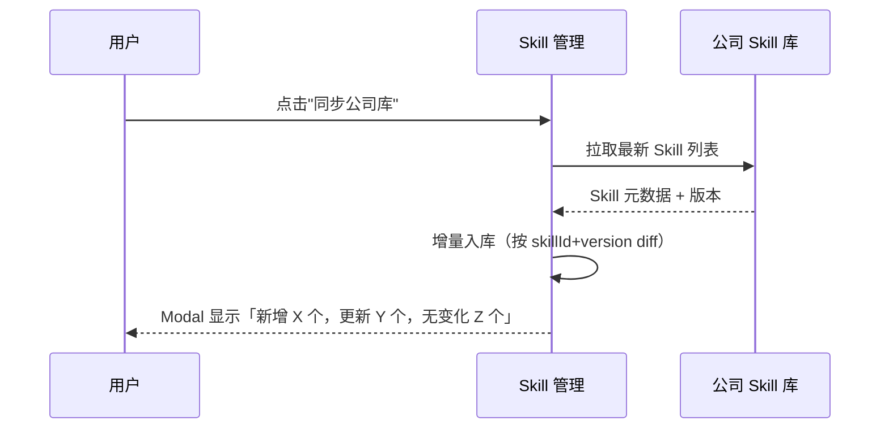
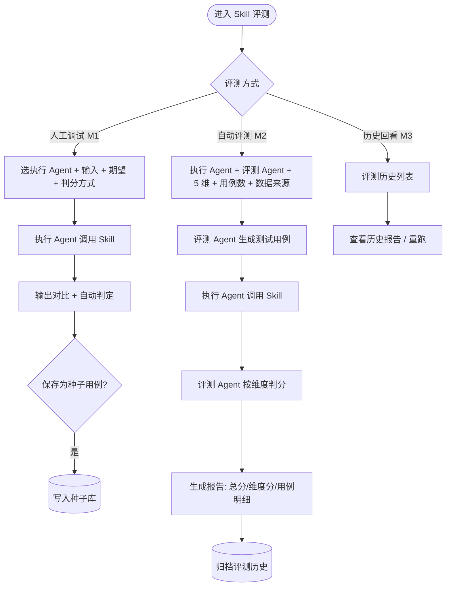
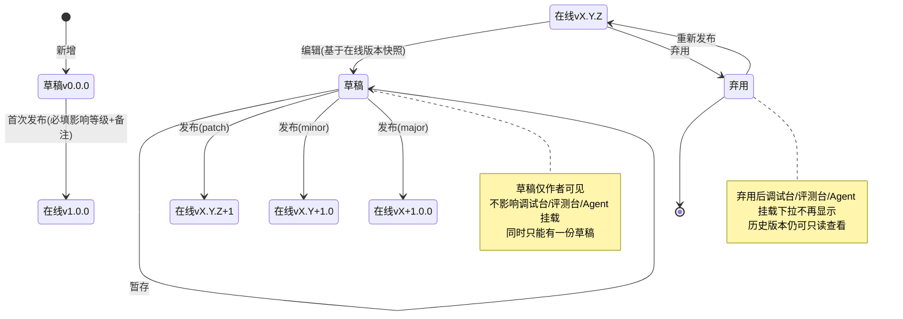
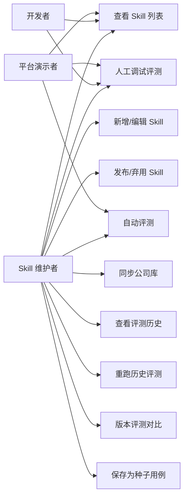

# AgentOps — Skill 管理 PRD（含 Skill 评测）

> 文档日期：2026-05-11　|　版本：v2.0　|　覆盖周期：S2（2026-04 ~ 2026-07）
> 父文档：[S2 PRD](./2026-05-11-AgentOps-S2-PRD.md) · [S2 规划](../总体规划/2026-05-11-AgentOps-S2规划.md)

> **v2.0 变更摘要（2026-05-18）**：Skill 形态由 JSON Schema 工具切换到 SKILL.md 文档模式：
> - **字段重构**（§6.1）：删除 input/output JSON Schema 与「实现 Endpoint URL」；新增以下 Skill 核心属性：
>   - **ID**（slug 风格，用户输入，唯一标识；仅允许小写字母 / 数字 / 连字符；≤128 字符）
>   - **名称**（≤128 字符）
>   - **描述**（自动从 SKILL.md 首段抽取，支持手动覆盖修改）
>   - **版本号**（形如 `1.0.0`，同一 Skill 不允许重复）
>   - **变更说明**（本次版本变更主要说明；旧 PRD 的 `remark` 字段重命名）
>   - **标签**（自由输入多 tag）
>   - **来源**（自建 / 公司库，由系统派生）
>   - **SKILL 文件**（必填；本地上传 `.zip` 或 `.md` 文件；`.md` = 仅 SKILL.md 单文件形态；`.zip` = SKILL.md + 附加资源打包形态，解压后根目录必须含 SKILL.md）
> - **公司库同步**（§6.2）：同步过来的 Skill **ID 与版本号沿用公司库源仓库**；本地用户只能查看 / 挂载，不能修改任何字段；若需修改请 fork 为「自建」副本
> - **版本管理**（§6.7）：删除「JSON Schema 破坏性变更检测」相关流程（7.9 / 7.10），不再有 schema diff；Semver 自动递增、变更说明必填、版本只读这些保留
> - 内部主键 `num`（系统生成的 `SKL...` 业务编号）不变；新增的 ID 是对外可见标识，与 `num` 并存

---

## 1. 模块定位

Skill 管理是 S2 周期内 **第二高优先级** 的资产模块，定位为：

> **部门 Skill 资产的统一目录 + 评测入口** —— Skill 既可部门自建，也可一键同步公司 Skill 库；每个 Skill 都可独立跑评测（人工调试 + 自动评测），形成"建一个 Skill → 立刻能评 → 评完能复用"的闭环。

**为什么把 Skill 评测合并进本 PRD**：评测台从 Skill 列表行操作进入，与 Skill 资产是"主-延伸"关系；S2 战略层把 Skill 评测作为差异化锚点，但功能上仍归 Skill 管理负责团队 own。

**与兄弟模块关系**：

- 被 [调试台](./2026-05-11-调试台-PRD.md) 依赖（提供 Skill 列表）；
- 被 [Agent 管理](./2026-05-11-Agent管理-PRD.md) 依赖（Agent 挂载 Skill）；
- 评测台 reuse Agent 管理提供的"执行 Agent"作为承载体；
- 同步源是公司 Skill 库（外部依赖）。

---

## 2. 目标与范围

### 2.1 S2 目标

| 目标 | 度量 |
| --- | --- |
| 资产可见 | 部门所有 Skill（自建 + 同步）100% 在平台目录化 |
| 评测可用 | M1 人工调试 GA、M2 自动评测 GA、M3 评测历史 GA |
| 业务接入 | ≥ 3 个真实业务 Skill 接入并跑通完整评测 |
| 黄金集沉淀 | S2 末黄金集 ≥ 100 题（S3 冲 500） |

### 2.2 范围

**S2 内做**

- Skill CRUD（新增 / 编辑 / 发布 / 弃用）
- Skill 列表（ProTable，含来源 / 版本 / 状态 / 复用数）
- 公司 Skill 库一键同步
- Skill 评测台 - 人工调试（M1）
- Skill 评测台 - 自动评测（M2）
- Skill 评测历史 + 重跑（M3）

**S2 内不做**

- ❌ Skill 版本灰度发布
- ❌ Skill 跨工作空间共享（单工作空间硬编码）
- ❌ 跨部门评测共享
- ❌ 评测门禁（"必过才上线"机制进 S3）
- ❌ Skill 商店 / 评分生态

---

## 3. 业务流程

### 3.1 Skill 公司库同步流程



### 3.2 Skill 评测流程



### 3.3 Skill 生命周期（M2 起引入版本化）



> **版本不可变 + 评测可回归**：每次发布生成的版本（含完整 Skill 配置 snapshot）只读；评测历史关联具体版本号，便于"v1.2 vs v1.3"的回归对比。

> **M1 范围说明**：M1 内 Skill 修改仍是"改了即生效"，**M2 起切换到草稿/发布机制**——本规范用于 M2 实施。

---

## 4. 用例图



---

## 5. 用户与场景

| 角色 | 典型场景 |
| --- | --- |
| **Skill 维护者** | 新写一个 Skill，发布前用人工调试快速验证；发布后定期跑自动评测看回归 |
| **开发者** | 在 Agent 上挂 Skill 前，先用人工调试看看效果是否符合预期 |
| **平台演示者** | 演示「建一个 Skill → 评测 → 拿到分数表」完整价值闭环 |

**用户故事**

- 作为 **Skill 维护者**，我希望对一个新写的 Skill 自动出 20 道题，按 5 维度自动判分，避免每次手动验证。
- 作为 **Skill 维护者**，我希望评测历史里能对比同一 Skill 的两次评测分数，知道这次发布是不是有回归。
- 作为 **开发者**，我希望同步公司 Skill 库后立刻能看到新 Skill 的评测分数，决定是否要挂到自家 Agent 上。

---

## 6. 功能需求

> 优先级：S2-P0/P1/P2；里程碑：M1 / M2 / M3。

### 6.1 Skill 列表与 CRUD

#### 6.1.1 Skill 字段定义（v2.0 重构后权威源）

| 字段 | 类型 | 必填 | 约束 | 说明 |
| --- | --- | --- | --- | --- |
| **`num`** | string | 系统生成 | 前缀 `SKL...`；全局唯一 | 内部业务主键；不对用户暴露在 URL 之外的位置；FK 关联用 |
| **`skillId`** | string | ✓ | 仅小写字母 / 数字 / 连字符（正则 `^[a-z0-9-]{1,128}$`）；≤128 字符；自建态全局唯一 | 用户输入的对外可见唯一标识；同步源决定时不可改 |
| **`name`** | string | ✓ | ≤128 字符 | 显示名 |
| **`description`** | text | ✓ | 自动从 SKILL.md 首段（或 front-matter `description`）抽取；用户可手动覆盖修改 | 描述；用于列表 / 挂载下拉 / 详情头 |
| **`versionNum`** | string | ✓ | 形如 `1.0.0`（Semver）；**同一 Skill 下不允许重复** | 版本号 |
| **`changeNote`** | text | ✓ | ≥10 字、≤500 字 | 本次版本变更主要说明；旧 PRD 称 `remark` |
| **`tags`** | string[] | 可选 | 自由输入；单 tag ≤32 字符；上限 20 个 | 标签；列表支持 facet 聚合筛选 |
| **`source`** | enum | 系统派生 | `SELF` / `COMPANY` | 来源：自建 / 公司库；同步入库时强制设 `COMPANY` |
| **`skillFile`** | file (.zip \| .md) | ✓ | 本地上传 `.zip` 或 `.md` 单文件；总大小 ≤2 MB（.zip 解压后 ≤10 MB） | **SKILL 文件**：描述与版本说明的事实源。`.md` 形态 = 单文件 SKILL.md；`.zip` 形态 = SKILL.md + 附加资源（脚本 / 参考文档 / prompt 模板等），解压后根目录必须含 `SKILL.md`，否则上传被拒 |
| **`skillFileType`** | enum | 系统派生 | `ZIP` / `MD` | 根据上传文件扩展名自动判定，与 `skillFile` 一一对应 |
| **`status`** | enum | 系统派生 | `DRAFT_ONLY` / `PUBLISHED` / `DEPRECATED` | 生命周期状态 |
| **`currentVersionNum`** | string | 系统派生 | 同 `versionNum` | 当前在线版本号镜像（详情/列表读取，避免 join） |

**字段间约束**：
- `skillId` 在自建态由用户输入并校验唯一性；公司库同步过来时直接复用源仓库 ID，本地用户不能改
- `versionNum` 同一个 `skillId` 下不能存在两个相同值（含历史版本）；发布时若新版本号与历史版本重复则拒绝
- `tags` 是 Skill 元信息层属性（不进版本快照），列表筛选 / 详情头展示；要求标签随版本变化的场景未来再考虑
- `source = COMPANY` 时所有用户可写字段（`skillId / name / description / skillFile / tags / versionNum / changeNote`）一律变为只读；要修改需通过列表行操作「fork 为自建」生成本地副本
- `skillFile` 必填；`.zip` 形态在上传时由后端解压校验：① 解压后总大小 ≤10 MB；② 根目录必须存在 `SKILL.md`（大小写敏感）；③ 不允许 `..` 路径穿越；④ 单文件不超过 2 MB（防 zip 炸弹）；任一不满足直接拒绝并返回明细错误

#### 6.1.2 功能点

| 序号 | 功能点 | 简要说明 | 优先级 | 里程碑 |
| --- | --- | --- | --- | --- |
| 1.1 | Skill 列表 | ProTable：**ID** / 名称 / 描述 / 标签 / 来源（自建/公司库胶囊）/ **在线版本号** / 发布人 / 状态 / 复用数 / 更新时间 | S2-P1 | M1 |
| 1.2 | 列表搜索 | 按 **ID** / 名称 / 描述 / **tag** / 来源 / 状态筛选 | S2-P1 | M1 |
| 1.3 | 新增 Skill | 表单字段按 §6.1.1：上传 SKILL 文件（`.zip` 或 `.md`）→ 后端解析其中的 SKILL.md 首段为 description（用户可覆盖）→ 用户填 ID / 名称 / 版本号 / 变更说明 / 标签；提交即首发 v1.0.0 | S2-P1 | M1 |
| 1.4 | 编辑 Skill | **M1**：直接修改即生效（无版本化）；**M2 起**：基于在线版本生成草稿，详见 §6.7 版本管理；公司库 Skill 编辑按钮 disabled + tooltip「公司库 Skill 只读，请 fork 为自建后编辑」 | S2-P1 | M1 / M2 升级 |
| 1.5 | 发布 Skill | **M1**：状态 草稿 → 发布；**M2 起**：发布 Modal（版本号 + 变更说明必填），详见 §6.7 | S2-P1 | M1 / M2 升级 |
| 1.6 | 弃用 Skill | 状态 → 弃用；调试台/评测台/Agent 挂载下拉不再显示；公司库 Skill 同样支持本地弃用（不影响公司库源） | S2-P1 | M2 |
| 1.7 | 评测入口 | 行操作"评测" → 跳转单 Skill 评测台 | S2-P1 | M1 |
| 1.8 | 复用数统计 | 显示被多少 Agent 挂载 | S2-P2 | M3 |
| 1.9 | Skill 详情 | 查看 SKILL.md / 历史版本 / 标签 / 评测概要 | S2-P1 | M2 |
| 1.10 | **fork 为自建**（v2.0 新增）| 公司库 Skill 行操作「fork 为自建」→ 复制元信息 + SKILL.md + 当前版本 snapshot 生成 `source=SELF` 的本地副本；ID 需用户重新输入（避免冲突） | S2-P2 | M3 |

### 6.2 公司 Skill 库同步

| 序号 | 功能点 | 简要说明 | 优先级 | 里程碑 |
| --- | --- | --- | --- | --- |
| 2.1 | 一键同步 | 顶部按钮"同步公司库" | S2-P1 | M2 |
| 2.2 | 增量 diff | 按 **skillId + versionNum** 比对，区分 新增/更新/无变化 | S2-P1 | M2 |
| 2.3 | 同步结果 Modal | 展示新增 X / 更新 Y / 无变化 Z + 失败列表 | S2-P1 | M2 |
| 2.4 | 同步频率 | M2 仅手动；M3 看是否加日定时 | S2-P2 | M3 |
| 2.5 | 同步源标记 | 列表"来源"列区分"自建" / "公司库 v1.2.3"（v1.2.3 为公司库源版本号，与本地 versionNum 一致） | S2-P1 | M2 |
| 2.6 | **同步入库即只读**（v2.0 新增） | `source=COMPANY` 的 Skill 所有用户可写字段一律 disabled；列表行操作只显示「查看」/「评测」/「fork 为自建」；新版本由下次同步覆盖（不增本地版本号） | S2-P1 | M2 |

### 6.3 Skill 评测台 - 人工调试（M1 必交付）

| 序号 | 功能点 | 简要说明 | 优先级 | 里程碑 |
| --- | --- | --- | --- | --- |
| 3.1 | 执行 Agent 选择 | 下拉，可选「空白沙盒 Agent」（系统内置） | S2-P0 | M1 |
| 3.2 | 任务输入 | 多行 textarea | S2-P0 | M1 |
| 3.3 | 期望结果 | 多行 textarea；可为空（"不判分"模式） | S2-P0 | M1 |
| 3.4 | 判分方式 | 单选：LLM Judge / 关键词匹配 / 不判分 | S2-P0 | M1 |
| 3.5 | 执行按钮 | 点"执行" → 走调试台同款 invoke 接口 | S2-P0 | M1 |
| 3.6 | 输出对比 | 实际输出 vs 期望，diff 高亮 | S2-P0 | M1 |
| 3.7 | 自动判定 | 按所选判分方式给"通过/不通过 + 分值 + 时延" | S2-P0 | M1 |
| 3.8 | 步骤链 | 复用调试台 ThoughtChain 组件 | S2-P0 | M1 |
| 3.9 | 保存为种子 | 一键回流到自动评测的"人工种子"数据源 | S2-P1 | M2 |

### 6.4 Skill 评测台 - 自动评测（M2 必交付）

| 序号 | 功能点 | 简要说明 | 优先级 | 里程碑 |
| --- | --- | --- | --- | --- |
| 4.1 | 评测配置 | 执行 Agent / 评测 Agent / 5 维评分多选 / 用例数（默认 20）/ 数据来源 | S2-P0 | M2 |
| 4.2 | 5 维评分 | 准确性 / 相关性 / 完整性 / 风格一致 / 安全合规 | S2-P0 | M2 |
| 4.3 | 数据来源 | 三选一：Skill 描述自动生成 / 历史样本回放 / 人工种子 | S2-P0 | M2 |
| 4.4 | 执行流程 | 评测 Agent 生成用例 → 执行 Agent 调用 Skill → 评测 Agent 判分 | S2-P0 | M2 |
| 4.5 | 进度条 | 流式展示"已完成 N / 总 M"，每条用例完成立刻入表 | S2-P0 | M2 |
| 4.6 | 评测报告 | 总分 / 通过率 / 平均时延 + 维度雷达图 + 用例明细（输入/期望/实际/分/时延） | S2-P0 | M2 |
| 4.7 | 报告导出 | CSV + 在线分享链接 | S2-P1 | M3 |
| 4.8 | 并发度 | 默认 5，可在配置里调（上限 20） | S2-P1 | M2 |

### 6.5 评测主页（M2 必交付）

| 序号 | 功能点 | 简要说明 | 优先级 | 里程碑 |
| --- | --- | --- | --- | --- |
| 5.1 | 4 张统计卡 | 累计评测次数 / 通过率 / 平均时延 / 黄金集题量 | S2-P0 | M2 |
| 5.2 | 评测任务总览 | ProTable：Skill 名 / **Skill 版本号** / 执行 Agent / 评测 Agent / 总分 / 通过率 / 时间 | S2-P0 | M2 |
| 5.3 | 发起评测入口 | 跳转单 Skill 评测台 | S2-P0 | M1 |

### 6.6 评测历史（M3 必交付，关联版本回归）

| 序号 | 功能点 | 简要说明 | 优先级 | 里程碑 |
| --- | --- | --- | --- | --- |
| 6.1 | 历次报告 ProTable | 含 **Skill 版本号** / 执行 Agent / 评测 Agent 列，可追溯每次评测上下文 | S2-P0 | M3 |
| 6.2 | 重跑 | 用相同配置 + 当前在线 Skill 版本重新执行（用于回归） | S2-P0 | M3 |
| 6.3 | **跨 Skill 版本对比** | 选两次评测（不同 Skill 版本）看总分 / 维度分 / 通过率差值；高亮回归 / 改进 | S2-P1 | M3 |
| 6.4 | 失败用例下钻 | 点击 fail 用例查看完整 prompt / 输出 / Judge 解释 | S2-P0 | M3 |

### 6.7 版本管理与发布（M2 起引入）

> **核心约束**：M2 起 Skill 修改不再"改了就生效"，必须经过**编辑草稿 → 发布**两步；每次发布自动生成新版本号（Semver）+ 必填**变更说明**；历史版本只读保留；评测历史关联版本号便于回归。
>
> **v2.0 调整**：删除原 PRD 的「JSON Schema 破坏性变更检测」相关流程（旧 7.9 / 7.10）—— SKILL.md 模式下不存在结构化 schema，破坏性变更靠用户在变更说明里描述 + 选择影响等级人工决定。

#### 6.7.1 版本号策略（Semver）

| 影响等级 | 何时选 | 自动递增规则 | 示例 |
| --- | --- | --- | --- |
| **patch** | 微调：SKILL.md 文字微调 / 标签微调 / 描述润色 | `vX.Y.Z` → `vX.Y.(Z+1)` | v1.0.3 → v1.0.4 |
| **minor** | 功能性变更：SKILL.md 新增能力段 / 标签新增项 | `vX.Y.Z` → `vX.(Y+1).0` | v1.0.4 → v1.1.0 |
| **major** | **破坏性变更**：SKILL.md 改语义 / 行为约束变化（由用户自评判） | `vX.Y.Z` → `v(X+1).0.0` | v1.1.0 → v2.0.0 |

> 首次发布固定为 v1.0.0；公司库同步过来的 Skill 版本号沿用公司库语义（不改写）。

#### 6.7.2 编辑与草稿

| 序号 | 功能点 | 简要说明 | 优先级 | 里程碑 |
| --- | --- | --- | --- | --- |
| 7.1 | 编辑入口 | 列表行操作"编辑"或详情页"编辑"按钮；公司库 Skill 隐藏此入口 | S2-P0 | M2 |
| 7.2 | 草稿创建 | 编辑时基于"在线版本配置 snapshot"创建草稿；同一 Skill 同时只允许 1 份草稿 | S2-P0 | M2 |
| 7.3 | 草稿暂存 | "保存为草稿"，仅作者可见，不影响调试台/评测台/Agent 挂载 | S2-P0 | M2 |
| 7.4 | 草稿丢弃 | 显式"丢弃草稿" | S2-P0 | M2 |
| 7.5 | 草稿冲突 | 别的成员正在编辑（已有草稿）时，第二个人显示"被 XX 锁定，可接管或等待" | S2-P1 | M3 |
| 7.6 | 编辑提醒 | 顶部 Banner "您正在编辑 vX.Y.Z 的草稿，未发布前对调用方无影响" | S2-P0 | M2 |

#### 6.7.3 发布

| 序号 | 功能点 | 简要说明 | 优先级 | 里程碑 |
| --- | --- | --- | --- | --- |
| 7.7 | 发布按钮 | 草稿状态下顶部"发布"按钮可见 | S2-P0 | M2 |
| 7.8 | 发布 Modal | 弹窗：影响等级（patch/minor/major 单选）+ 预览新版本号 + **变更说明**（必填，≥10 字，≤500 字） | S2-P0 | M2 |
| 7.9 | 配置 diff 预览 | Modal 中展示"草稿 vs 在线"的 SKILL.md 内容 + 标签 + 描述行级 diff | S2-P1 | M2 |
| 7.10 | **同版本号校验** | 提交时校验新版本号在该 Skill 历史中未出现过（含已弃用版本），重复直接拒绝 + 提示 | S2-P0 | M2 |
| 7.11 | 发布动作 | 确认 → 后端原子操作：草稿 → 新版本（不可变 snapshot）+ current_published_version 指针切换 | S2-P0 | M2 |
| 7.12 | 发布通知 | 发布成功 Toast | S2-P0 | M2 |
| 7.13 | 发布权限 | 仅 Skill 维护者 + 平台管理员可发布；其他成员只能保存草稿 | S2-P1 | M3 |

#### 6.7.4 版本历史

| 序号 | 功能点 | 简要说明 | 优先级 | 里程碑 |
| --- | --- | --- | --- | --- |
| 7.14 | 版本历史卡片 | Skill 详情页"版本历史"卡片，ProTable：版本号 / 发布时间 / 发布人 / 影响等级 / **变更说明** / 状态（在线/历史/已弃用）/ 关联评测数 | S2-P0 | M3 |
| 7.15 | 查看历史版本配置 | 点行→只读查看该版本完整配置（SKILL.md + 描述 + 标签） | S2-P0 | M3 |
| 7.16 | 版本对比 | 选 2 个版本→侧边栏 diff 视图（SKILL.md + 字段对比） | S2-P1 | M3 |
| 7.17 | 版本回滚 | 历史版本行操作"回滚"→自动以该版本配置生成新草稿（用户走标准发布流程，新版本号自增） | S2-P1 | M3 |
| 7.18 | **跨版本评测对比快捷入口** | 历史版本卡片每行有"评测数 X 次"链接，跳转评测历史并预筛该版本 | S2-P1 | M3 |
| 7.19 | 版本数量限制 | 每个 Skill 保留最近 50 个版本，更早归档（仅查看不可回滚） | S2-P2 | M3 |

#### 6.7.5 调用方对版本的感知

| 调用场景 | 默认行为 | 是否可指定版本 |
| --- | --- | --- |
| 调试台调用（含 Skill 模式） | 调用在线版本 | M3 加版本选择器（高级用法） |
| Agent 挂载 Skill | M2 仅引用 Skill ID（自动跟随在线版本）；S3 起支持锁定版本 | 否（S2 内不锁定） |
| 评测台执行 | 调用在线版本，评测报告记录"执行时的 Skill 版本号" | M3 评测台支持显式选历史版本（用于回归） |
| 公司库同步 | 同步过来的 Skill 沿用源版本号；本地编辑后切换到本地版本号体系 | — |


| 6.4 | 失败用例下钻 | 点击 fail 用例查看完整 prompt / 输出 / Judge 解释 | S2-P0 | M3 |

---

## 7. 原型图

> ⚠️ **2026-05-12 同步：** Figma `hoQIHy1FcQdfE49oDsiSV9` **未单独绘制 Skill 管理画板**，fe 已套用 Agent 管理（`73:6` 列表 / `73:8` 详情）的扁平化模板，配合 Skill 业务字段实现，详见 fe tech-debt D-013/D-014/D-015。等设计师补 Figma 后再做对齐调整。

### 7.1 Skill 列表（2026-05-12 套 Agent 模板）

```
┌─ Skill 管理 ──────────────────────────────────────────────────┐
│ Skill 管理                  [↻ 同步公司库] [+ 新建 Skill]      │
│ 管理自建 + 公司库 skill，支持 schema 版本化、JSON Schema 校验  │
│ ─────────────────────────────────────────────────────────────│
│ 全部 N 个 skill                       🔍 搜索 skill 名称/描述... │
│ ┌─ 表格（白底 + #E2E8F0 边框 + radius 8）─────────────────────┐ │
│ │ NAME │ DISPLAY NAME │ DESCRIPTION │ CATEGORY │ SOURCE │ VERSION │ REUSE │ 操作│ │
│ │ SKL.. │ jira-summary │ 汇总 Jira... │ 分析     │ 自建   │ v1.0   │ 3     │ 查看·编辑│ │
│ └─────────────────────────────────────────────────────────────┘ │
└─────────────────────────────────────────────────────────────────┘
```

### 7.1.1 Skill 详情页（2026-05-12 套 Agent 模板）

```
┌─ Skill 管理 › jira-summary                                      ┐
│ jira-summary  [自建 浅蓝胶囊] [● 在用 绿胶囊]   [版本历史][编辑草稿][⋯]│
│ name: SKL.. · version: v1.2 · category: 分析 · reuseCount: 3 · updated: ... │
│ ─────────────────────────────────────────────────────────────────│
│ [基本信息] Schema  版本历史 (4)  最近 Runs                        │
│ ━━━━━━━━━                                                         │
│ ┌─ 描述: 汇总 Jira project 当周 issue                            │
│ ├─ 实现 Endpoint: https://...                                   │
│ └─ 标签: [自建][分析][在用]                                      │
└─────────────────────────────────────────────────────────────────┘
```

### 7.1.2 Skill 编辑器 / Compare（2026-05-12 套扁平外壳）

- **Editor**: 面包屑 / 标题行（[● 草稿模式] 黄胶囊 + 检查/保存草稿/发布按钮）/ 字段行（描述+Endpoint）/ Schema Tab (Input/Output) + Monaco
- **Compare**: 面包屑 / 标题 / 版本选择条 (`Base ▾ → Target ▾`) / View Tab (Schema Patches / 文本 Diffs) / 自渲染 diff 表（红绿背景）

### 7.2 Skill 评测台 - 任务列表（2026-05-12 同步 Figma `116:2`）

> **设计真相来源**：Figma `hoQIHy1FcQdfE49oDsiSV9` 节点 `116:2`（[查看](https://www.figma.com/design/hoQIHy1FcQdfE49oDsiSV9/AgentSphere?node-id=116-2)）
> fe 已落地：[Evaluation/List.tsx](../代码仓库/rd-agent-fe/src/pages/Evaluation/List.tsx) [Evaluation/Detail.tsx](../代码仓库/rd-agent-fe/src/pages/Evaluation/Detail.tsx) [Evaluation/Compare.tsx](../代码仓库/rd-agent-fe/src/pages/Evaluation/Compare.tsx) [Evaluation/Seeds.tsx](../代码仓库/rd-agent-fe/src/pages/Evaluation/Seeds.tsx)


```
┌─ Skill 评测 · 任务列表 ────────────────────────────────────────┐
│ Skill 评测 · 任务列表    [🧪 种子库][⬆ 导入 case][+ 新建评测任务]│
│ ─────────────────────────────────────────────────────────────│
│ [全部 N 蓝胶囊][进行中 N][已完成 N][失败 N]                    │
│ ┌─ 表格 (8 列扁平) ─────────────────────────────────────────┐ │
│ │ 任务名 │ TARGET │ CASE │ 方式 │ 进度 │ 通过率 │ 创建人 │ 时间 │ 操作│ │
│ │ summarizer-eval-#1024 │ skill/summarizer │ 30 │ 自动 │ ✓ 已完成 │ 87% │ ... │ ... │ 详情·删除│ │
│ └────────────────────────────────────────────────────────────┘ │
└────────────────────────────────────────────────────────────────┘
```

### 7.2.1 新建评测任务（Drawer + Steps，2026-05-12 同步 Figma `116:13`）


```
┌─ Drawer · 新建评测任务 ─────────────────────────┐
│ Steps：[ 对象 ─ Case ─ 方式 ─ 确认 ]             │
│ ────────────────────────────────────────────── │
│ Step1: 对象类型 [Skill/Agent] + 选择对象        │
│ Step2: 数据源 [Schema 生成/历史/种子] + 用例数  │
│ Step3: 模式 [人工/自动] + 维度/Judge/...        │
│ Step4: 摘要确认                                  │
│ ────────────────────────────────────────────── │
│ [取消]                          [下一步 →/提交] │
└──────────────────────────────────────────────── ┘
```

### 7.2.2 评测任务详情（2026-05-12 同步 Figma `116:24`）


```
┌─ Skill 评测 › EVL202604... ─────────────────────────────────┐
│ EVL202604...                                  [⬇ 导出 CSV]   │
│ target: skill/summarizer · v0.3.2 · method: 自动 · case: 30 ·│
│ ─────────────────────────────────────────────────────────── │
│ ┌─总通过率 87% (1.5x)─┐ ┌─通过 26┐ ┌─失败 3┐ ┌─未判定 1┐    │
│ └────────────────────┘ └────────┘ └───────┘ └──────────┘    │
│ [全部 N][通过 N][失败 N][未判定 N]                            │
│ ┌─ case 表 ───────────────────────────────────────────────┐ │
│ │ # │ INPUT │ ACTUAL │ EXPECTED │ JUDGEMENT │ 耗时 │ 操作  │ │
│ │001│ json  │ json   │ json     │ ✓ 通过 绿  │ 230ms│ 详情·trace│ │
│ └─────────────────────────────────────────────────────────┘ │
│ (兼容) 评分雷达图 (auto 评测维度分，detail.radarData 有则展示)│
└─────────────────────────────────────────────────────────────┘
```

### 7.2.3 评测对比（2026-05-12 同步 Figma `116:35`）


```
┌─ Skill 评测 › 跨版本对比 ──────────────────────────────────┐
│ 跨版本评测对比                                              │
│ ┌─ 选择条 (#F8FAFC) ────────────────────────────────────┐ │
│ │ Base (A) [EVL... 输入]  →  Target (B) [EVL... 输入]  [对比]│ │
│ └────────────────────────────────────────────────────────┘ │
│ ┌─ KPI: Base │ Target │ 总分差 ▼ -5 │ 通过率差 -5% │ 时延+50ms ┐│
│ └────────────────────────────────────────────────────────┘ │
│ 维度差异表：维度 │ 差异 (彩色胶囊) │ 趋势 (↑ 提升/↓ 回退/— 持平)│
└─────────────────────────────────────────────────────────────┘
```

### 7.4 关键状态

| 状态 | 处理 |
| --- | --- |
| Skill 列表为空 | Empty + "新增 Skill" / "同步公司库" 双引导 |
| 同步公司库失败 | Modal 显示失败 Skill 列表 + 重试按钮 |
| 评测执行中 | 进度条 + 用例表实时入行 |
| 评测 Judge 失败 | 用例标"判分失败"，不计入总分 |
| Skill 弃用 | 列表灰显 + tooltip "已弃用，调试台/Agent 不可见" |

---

## 8. 非功能需求

| 项 | 目标 |
| --- | --- |
| Skill 列表首屏 | ≤ 1.5s |
| 公司库同步 | ≤ 30s（上限 1000 个 Skill） |
| 单 Skill 自动评测（20 用例，并发 5） | ≤ 3 min |
| 评测报告生成 | 评测结束后 ≤ 1s 渲染 |
| LLM Judge 评分稳定性 | 同题多次评测均值波动 ≤ 5% |

---

## 9. 与其他模块的依赖

| 依赖项 | 来源 | S2 内交付状态 |
| --- | --- | --- |
| Agent 列表（评测台执行 Agent 选择） | Agent 管理 | M1 mock，M2 真实 |
| Agent invoke 接口 + SSE | Agent 管理 / 运行时 | M1 mock，M2 真实 |
| ThoughtChain 步骤渲染 | 调试台共享组件 | M1 |
| LLM Judge 调用配额 | 公司 LLM 代理 | M1 申请 |
| 公司 Skill 库同步协议 | 外部 | W1 (5/18) 前对齐 |
| 空白沙盒 Agent | 平台内置 | M1 |

---

## 10. 验收标准

### 10.1 M1 演示就绪（2026-06-08）

- [ ] Skill 列表 + CRUD（新增/编辑）+ 评测入口 GA
- [ ] 人工调试评测台 GA：执行 Agent + 输入 + 期望 + 判分 + 输出对比 + 步骤链
- [ ] "空白沙盒 Agent"系统内置可用
- [ ] 现场可演示：建 Skill → 人工调试 → 拿到判定结果

### 10.2 M2 集成就绪（2026-07-06）

- [ ] 公司 Skill 库一键同步 GA
- [ ] 自动评测 GA：5 维评分 + 报告（总分/维度/明细 + 雷达图）
- [ ] 评测主页 GA：4 张统计卡 + 任务总览（含 Skill 版本号列）
- [ ] 至少 1 个真实业务 Skill 拿到完整自动评测报告
- [ ] 黄金集累计 ≥ 50 题
- [ ] **版本化机制 GA**：编辑→草稿→发布闭环；发布 Modal（影响等级 + 备注必填 ≥10 字 + schema 破坏性变更检测自动建议 major + 配置 diff 预览）；版本号自动 Semver 递增
- [ ] **Skill 列表"在线版本号"列**；Skill 详情页可见版本号
- [ ] 评测报告记录"执行时的 Skill 版本号"
- [ ] 弃用状态机可用

### 10.3 M3 S2 收尾（2026-07-31）

- [ ] 评测历史 + 重跑 + 失败用例下钻 GA
- [ ] **跨 Skill 版本评测对比**（选两次评测看维度分差值）
- [ ] **版本历史卡片 GA**：列表 + 查看历史配置 + 版本对比 diff + 一键回滚
- [ ] **草稿冲突检测**：他人编辑中的 Skill 显示锁定 + 接管/等待
- [ ] 报告导出 CSV + 分享链接
- [ ] ≥ 3 个业务 Skill 接入并跑通完整评测
- [ ] 黄金集累计 ≥ 100 题
- [ ] 复用数 / Skill 详情可用

---

## 附：与下游技术方案的对接提示

1. **"空白沙盒 Agent"** 是 S2 的关键内置概念——Skill 评测必须挂在某个 Agent 上才能跑，用沙盒 Agent 兜底；
2. **5 维评分模型**第 1 周需出 [评测维度白皮书 v0.1](../其他方案/)，把每个维度的 LLM Judge prompt 模板定下；
3. **SKILL.md 解析**（v2.0 替代 JSON Schema 校验）：上传时解析 markdown 首段或 front-matter 的 `description` 字段作为自动抽取的描述；后续可由用户手动覆盖；
4. **评测并发**建议用任务队列（不阻塞主请求），Polling 拉进度或 WebSocket 推；
5. **公司 Skill 库同步协议** W1 (5/18) 必须对齐——这是外部强依赖，错过截止日期需告警；
6. **版本表设计**：建议 `skill_versions(skill_num, version_num, semver_major/minor/patch, change_level, snapshot_json, change_note, published_by, published_at, status)` + `skills` 表只存元信息（含 `skill_id` 用户输入唯一标识 + `tags` JSON + `source`）和 `current_published_version_num` 指针；版本不可变；
7. **同版本号校验**（v2.0 新增）：发布事务内先查 `skill_versions` 是否已有相同 `(skill_num, version_num)`，存在直接抛 BizException；不依赖 unique key，由应用层显式判定给更友好的错误码；
8. **回滚的实现**：复制历史版本配置生成新草稿走标准发布流程，版本号永远单调递增（不真的"切指针回历史"）；
9. **评测-版本关联**：评测任务表加 `skill_version_num` 字段，每次评测启动时锁定当时的在线版本号，确保历史报告里版本号与配置 snapshot 永远对得上；
10. **公司库同步的版本号兼容**（v2.0 简化）：外部 Skill 沿用源仓库的 `skillId + versionNum`；本地用户只读不可改；如需本地修改请走「fork 为自建」生成 `source=SELF` 的副本，副本可自由编辑并走本地 Semver 体系；
11. **SKILL 文件存储**：本地上传 `.zip` 或 `.md` 文件；`.md` 直接落对象存储；`.zip` 在 application 层先解压做安全校验（根目录有 SKILL.md / 总大小 / zip 炸弹防护），通过后整包原样落对象存储（保留附加资源）；表里只存路径/key + 文件类型；版本快照存「文件 hash + 路径 + 类型」三件套。

---

## 附：关联文档

- [S2 PRD（聚合）](./2026-05-11-AgentOps-S2-PRD.md)
- [调试台 PRD](./2026-05-11-调试台-PRD.md)
- [Agent 管理 PRD](./2026-05-11-Agent管理-PRD.md)
- [S2 规划](../总体规划/2026-05-11-AgentOps-S2规划.md)
- [总体规划](../总体规划/2026-05-11-AgentOps-总体规划.md)
- [代码仓库](../代码仓库/rd-agent-ws/)
