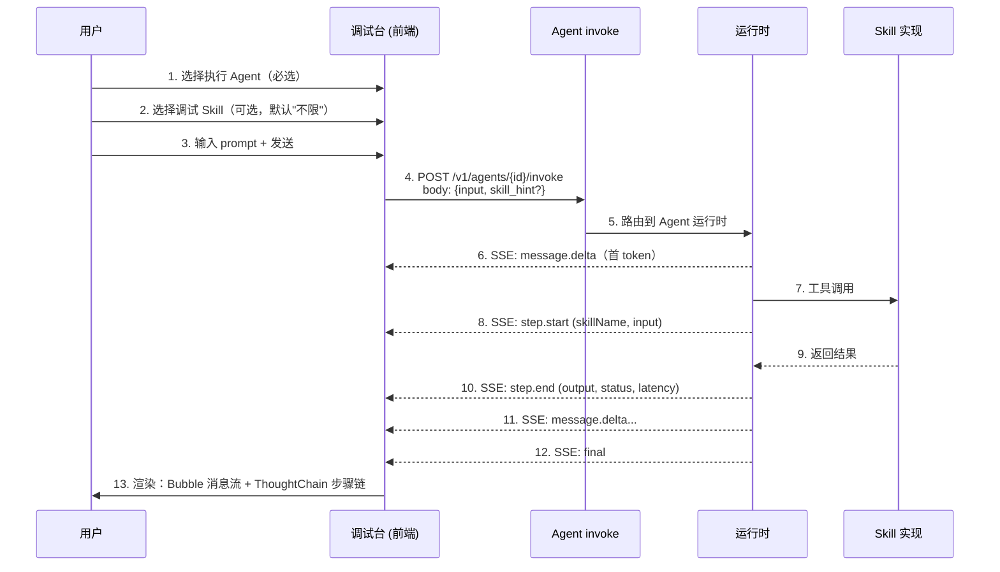
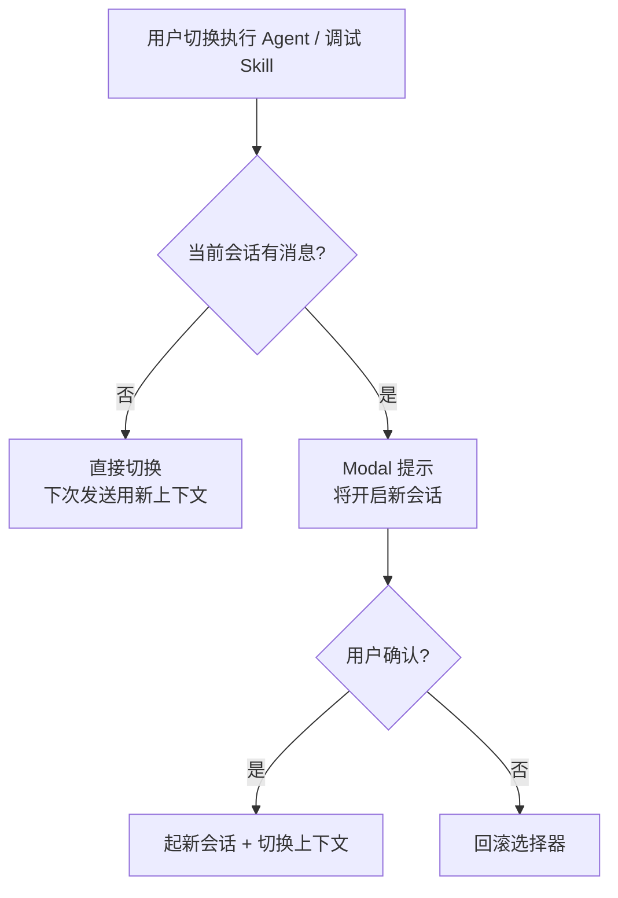
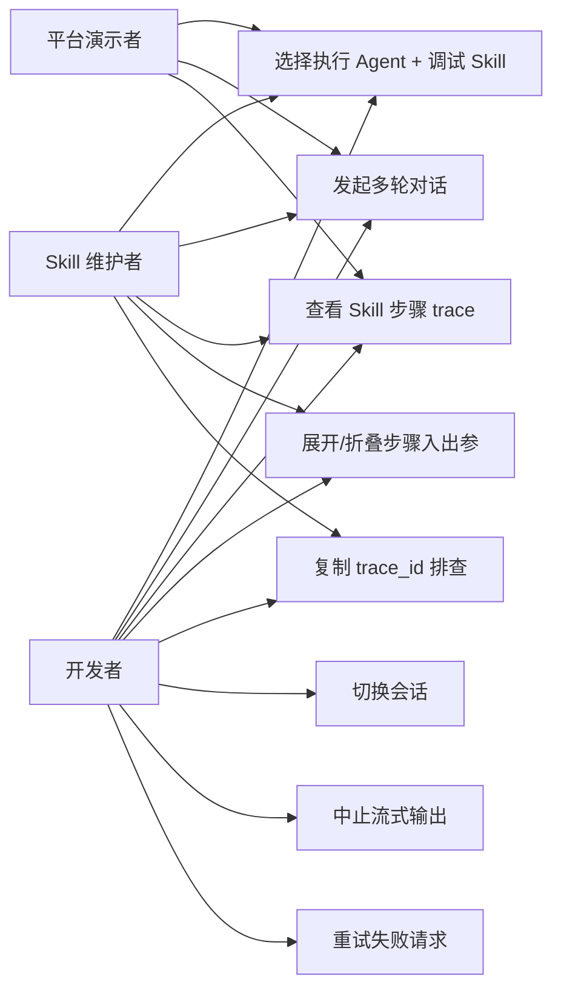

# AgentOps — 调试台 PRD

> 文档日期：2026-05-11　|　版本：v1.0　|　覆盖周期：S2（2026-04 ~ 2026-07）
> 父文档：[S2 PRD](./2026-05-11-AgentOps-S2-PRD.md) · [S2 规划](../总体规划/2026-05-11-AgentOps-S2规划.md)

---

## 1. 模块定位

调试台是 S2 周期的**最高优先级模块**，定位为：

> **业务方对 Agent / Skill 的"可点可看可演示"入口** —— 选定执行 Agent，可选定调试 Skill，发起多轮对话，并在每次执行中**可视化每一步 Skill 调用的入参 / 出参 / 状态 / 耗时**。

**与兄弟模块关系**：

- 依赖 [Agent 管理](./2026-05-11-Agent管理-PRD.md) 提供 Agent 列表 + invoke 接口 + SSE 事件流；
- 依赖 [Skill 管理](./2026-05-11-Skill管理-PRD.md) 提供 Skill 列表；
- 是 Skill 评测、Agent 评测的**底层运行能力**（评测台本质是"调试台 + 自动判分"）；
- 是平台对外演示的**唯一入口**（M1 现场 demo 全部由调试台承担）。

---

## 2. 目标与范围

### 2.1 S2 目标

| 目标 | 度量 |
| --- | --- |
| 可演示 | 10 分钟内能用真实业务 Skill 跑通"建 → 调 → 看每一步" |
| 可观测 | Skill 每一步 trace 必须实时可见，error 步骤可定位 |
| 可信赖 | SSE 流式不掉帧、不卡顿，错误步骤不阻塞后续渲染 |
| 可演示者无门槛 | 平台演示者（含老板）能独立操作，不需要工程师在旁 |

### 2.2 范围

**S2 内做**

- 上下文选择器（执行 Agent 必选 + 调试 Skill 可选，默认"不限"）
- 多轮对话（会话列表 / 消息流 / 输入器 / 欢迎页与快捷指令）
- Skill 步骤级 trace 可视化（ThoughtChain）
- SSE 流式输出
- trace_id 关联（与后端审计共享）

**S2 内不做**

- ❌ 多对象同窗对比
- ❌ 会话归档 / 跨会话搜索
- ❌ 富媒体输入（图片 / 文件上传）
- ❌ Skill 多选
- ❌ 步骤的可编辑回放（"换个入参重跑这一步"）
- ❌ 工作空间隔离（单空间硬编码）

---

## 3. 业务流程

### 3.1 调试台核心流程



### 3.2 切换 Agent / Skill 流程



### 3.3 SSE 中断恢复流程

```mermaid
flowchart LR
    A[发送中] --> B{SSE 事件正常?}
    B -->|是| C[按事件类型渲染]
    B -->|网络中断| D[Sender 显示"重试"]
    B -->|后端 error 事件| E[消息气泡显示错误]
    D --> F[用户点重试]
    F --> G[已渲染步骤保留<br/>从最后一条 user 消息重发]
    E --> H[已渲染步骤保留<br/>不阻塞下次发送]
```

---

## 4. 用例图



---

## 5. 用户与场景

| 角色 | 典型场景 |
| --- | --- |
| **开发者** | 联调新写的 Skill：在调试台选自家 Agent + 自家 Skill，发测试 prompt，看每一步入参/出参是否符合预期 |
| **Skill 维护者** | 排查 Skill 异常：复制 trace_id 给后端，定位是哪一步出问题 |
| **平台演示者** | 现场 demo：选个真实业务 Agent，发一句话，向业务方展示"步骤链 + 流式输出"的可观测性 |

**用户故事**

- 作为**开发者**，我想发完一句话就看到 Skill 每一步的入参/出参/耗时，避免在日志里翻找。
- 作为**Skill 维护者**，我想从一个 error 步骤一键拿到 trace_id，让后端能 5 分钟内定位问题。
- 作为**平台演示者**，我想 2 分钟内 setup 出一个能演示"完整步骤可视化"的会话，让业务方一眼看懂平台的可观测性优势。

---

## 6. 功能需求

> 优先级：S2-P0/P1/P2；里程碑：M1 (2026-06-08)、M2 (2026-07-06)、M3 (2026-07-31)。

### 6.1 上下文选择器

| 序号 | 功能点 | 简要说明 | 优先级 | 里程碑 |
| --- | --- | --- | --- | --- |
| 1.1 | 执行 Agent 选择 | 必选；下拉按当前用户可见范围过滤；切换时若有消息提示新建会话 | S2-P0 | M1 |
| 1.2 | ⚠️ 调试 Skill 选择 | **2026-05-12 同步 Figma `59:2`**：M1 砍掉 Skill 选择器，由 fixture 库（SubToolbar `🧪 fixtures`）间接覆盖；保留 SSE `skill_hint` 字段供 M2 真实接入时启用 | ~~S2-P0~~ S2-P2 | ~~M1~~ M2 |
| 1.3 | 上下文锚点 | 会话顶部展示「当前 Agent + Skill + trace_id」，可一键复制 | S2-P0 | M1 |
| 1.4 | 切换确认 | 切换 Agent 时若当前会话有消息，Modal 提示"将开启新会话" | S2-P0 | M1 |
| 1.5 | 选择器持久化 | 上次选择的 Agent / Skill 在本浏览器记住 | S2-P1 | M2 |

### 6.2 多轮对话与输入模式

| 序号 | 功能点 | 简要说明 | 优先级 | 里程碑 |
| --- | --- | --- | --- | --- |
| 2.1 | 会话列表 | **顶部 SubToolbar 胶囊（Dropdown）**：胶囊文案「📂 当前会话标题 · N turns」，点击展开下拉，下拉项支持切换 / 重命名 / 删除 / + 新对话。无常驻左侧栏（2026-05-12 同步 Figma `132:7-13`） | S2-P0 | M1 |
| 2.2 | 消息流 | Bubble.List 渲染 user / assistant 消息；user 消息保留输入模式标记 | S2-P0 | M1 |
| 2.3 | 输入器 | Sender，Enter 发送 / Shift+Enter 换行；发送中 loading + 中止按钮 | S2-P0 | M1 |
| 2.4 | ⚠️ **输入模式切换** | **2026-05-12 同步 Figma `132:2/132:14`**：模式 toggle 从 Sender 上移到 SubToolbar 顶部「⌘J JSON 模式」按钮（全局快捷键 `⌘J / Ctrl+J`）；Sender 内部不再有 Segmented，简化为单一输入框 + 底部提示行 + 右下双按钮 | S2-P0 | M1 |
| 2.5 | **Text 模式** | 默认；多行 textarea；发送时 invoke body：`{"input": "<文本>", "input_type": "text"}` | S2-P0 | M1 |
| 2.6 | **JSON 模式** | Monaco/CodeMirror JSON 编辑器（语法高亮 + 实时校验 + 格式化按钮）；发送前必须通过 JSON 校验，否则 Sender disabled；发送时 invoke body：`{"input": <object>, "input_type": "json"}` | S2-P0 | M1 |
| 2.7 | **Skill 模式联动** | ⚠️ **2026-05-12 跟随 §2.1 同步**：Skill 选择 M1 不实现，本条 M1 不生效；fixture 库选中带 input schema 的 fixture 时按相同规则联动（M2） | ~~S2-P0~~ S2-P2 | ~~M1~~ M2 |
| 2.8 | ⚠️ 欢迎页与快捷指令 | **2026-05-12 同步 Figma `59:2`**：Figma 未画 Welcome/Prompts 区，砍掉 M1 实现；空态仅显示极简提示（"请先在顶部选择执行 Agent" / "从下方输入框开始对话"）；快捷指令通过 fixture 库 M2 替代 | ~~S2-P0~~ S2-P2 | ~~M1~~ M2 |
| 2.9 | 流式输出 | SSE 接通后逐字渲染 | S2-P0 | M2 |
| 2.10 | 中止 | 流式中点击"中止"立即停止接收 | S2-P0 | M2 |
| 2.11 | 重试 | error / 中断后保留已渲染内容，从最后一条 user 消息重发（保留原输入模式） | S2-P0 | M2 |

### 6.3 Skill 步骤级 trace（核心差异化）

| 序号 | 功能点 | 简要说明 | 优先级 | 里程碑 |
| --- | --- | --- | --- | --- |
| 3.1 | 步骤链可视化 | 用 Ant Design X 的 ThoughtChain 组件展示工具调用链 | S2-P0 | M1 |
| 3.2 | 步骤元信息 | 每步显示：步骤名 / 入参 / 出参 / 状态（pending/success/error）/ 耗时 ms | S2-P0 | M1 |
| 3.3 | 展开折叠 | 入参/出参默认折叠，点击展开查看完整 JSON（带语法高亮） | S2-P0 | M1 |
| 3.4 | 错误高亮 | error 状态步骤红色边框 + 错误消息，不阻塞后续步骤渲染 | S2-P0 | M1 |
| 3.5 | trace_id 关联 | 步骤链顶部展示 trace_id（与后端审计共享同一 trace） | S2-P0 | M2 |
| 3.6 | 复制 step JSON | 单步骤右上角"复制"按钮，复制完整 step 数据给后端排查 | S2-P1 | M2 |
| 3.7 | 嵌套步骤 | 监督者 / 路由 Agent 子 Agent 调用展现为可折叠子链 | S2-P2 | M3 |

### 6.4 SSE 事件协议（前后端契约）

#### 6.4.1 invoke 请求体

| 字段 | 类型 | 必填 | 说明 |
| --- | --- | --- | --- |
| `input` | string \| object | 是 | text 模式为字符串；JSON 模式为对象 |
| `input_type` | "text" \| "json" | 是 | 显式标识输入模式，避免后端歧义 |
| `skill_hint` | string | 否 | 调试 Skill 时强制注入的 skill_name |
| `session_id` | string | 否 | 不传则起新会话 |

> JSON 模式下，若 `skill_hint` 命中的 Skill 有 input schema，后端需用 schema 二次校验 `input` 对象；不通过则返回 422 + 字段错误明细。

#### 6.4.2 SSE 事件

| 事件类型 | 触发时机 | 关键字段 |
| --- | --- | --- |
| `message.delta` | LLM 输出每段文本 | content (str), index (int) |
| `step.start` | 进入工具/Skill 调用 | step_id, skill_name, input (json), started_at |
| `step.end` | 工具/Skill 调用结束 | step_id, output (json), status, latency_ms, error? |
| `final` | 整个 invoke 结束 | session_id, trace_id, total_tokens, total_latency_ms |
| `error` | 不可恢复错误 | code, message, step_id? |

> **强约束**：M2 前 mock 实现必须按相同协议回放，避免前端联调返工。

---

## 7. 原型图 / 界面说明

> **设计真相来源**：Figma `hoQIHy1FcQdfE49oDsiSV9` 节点 `59:2`（[查看](https://www.figma.com/design/hoQIHy1FcQdfE49oDsiSV9/AgentSphere?node-id=59-2)）
> **同步日期**：2026-05-12（fe 已落地 [Console/index.tsx](../代码仓库/rd-agent-fe/src/pages/Console/index.tsx)）
> 关键决策：**砍掉常驻左侧会话栏**，会话列表收到顶部 SubToolbar 胶囊。Figma 设计哲学是"演示态优先 / 沉浸式单列对话"。


### 7.0 ASCII 简化线框（agent 可读）

```
┌─ Sidebar 220 ─┬─ Header 1200 × 56 ─────────────────────────────────┐
│ 🪐 AgentSphere│ Agent 调试台                                        │
│ ▾ 智能体中心   ├──────────────────────────────────────────────────┤
│   智能体管理   │ SubToolbar 1200 × 56 (132:2)                       │
│   智能体调试 ✦ │ [🤖 skill-runner ▾]  [📂 Summarize 文本 · 4 turns ▾]│
│ ▾ Skill Hub   │                            [+ 新对话][⌘J JSON 模式][🧪 fixtures]│
│   Skill 管理   ├──────────────────────────────────────────────────┤
│   Skill 评测   │                                                    │
│   Prompt 中心  │     ┌─ 对话区 (max-w 820, 居中) ────────┐         │
│                │     │ 👤 bill.hong  14:32:08              │         │
│                │     │ ┌ 灰底气泡 #F8FAFC r8 ───────────┐ │         │
│                │     │ │ 用户提问内容                     │ │         │
│                │     │ └─────────────────────────────────┘ │         │
│                │     │                                      │         │
│                │     │ ⚡ skill-runner  ✓ 已完成 run_xxx · 1.8s│      │
│                │     │ ┌ 步骤卡片 #F8FAFC #E5E7EB r6 ──┐ │         │
│                │     │ │ ▸ 已执行 4 步 · thinking →      │ │         │
│                │     │ │   tool_use → tool_result → text │ │         │
│                │     │ │ ● 拆解输入...      +0.2s        │ │         │
│                │     │ │ ● 调用 summarizer  +0.4s        │ │         │
│                │     │ │ ● 返回压缩结果...  +1.4s        │ │         │
│                │     │ │ ● 组装最终回复    +1.7s         │ │         │
│                │     │ └─────────────────────────────────┘ │         │
│                │     │ Agent 回复正文...                    │         │
│                │     │ 复制 · 重新生成 · 保存为示例 · 分享 run_id│   │
│                │     └─────────────────────────────────────┘         │
│                ├──────────────────────────────────────────────────┤
│                │  ┌─ Sender 820 × 84 (max-w 820, 居中) r12 ──────┐ │
│                │  │ 继续追问，或粘贴正文...                      │ │
│                │  │ ─────────────────────────────────────────── │ │
│                │  │ Shift+Enter 换行 · ⌘J 切 JSON · ...  [⏹停止][▶发送]│ │
│                │  └─────────────────────────────────────────────┘ │
└────────────────┴──────────────────────────────────────────────────┘
```

### 7.1 关键状态

| 状态 | 处理 |
| --- | --- |
| 未选 Agent | Sender disabled + 顶部 Alert "请先选择执行 Agent" |
| JSON 模式校验失败 | Sender disabled + 编辑器底部红色错误提示（行号 + 原因） |
| 切换 Text↔JSON 内容不兼容 | Modal 提示"内容无法转换，将清空"，确认后清空 |
| 选定 Skill 自动切 JSON | 顶部 Toast "已切换到 JSON 模式（按 {SkillName} input schema 校验）" |
| 加载会话中 | Spin 覆盖消息区 |
| SSE 接收中 | Sender loading + 中止按钮可见 |
| 步骤 error | 红色边框 + error 消息内嵌；不阻塞后续步骤 |
| SSE 中断 | "重试" 按钮可见；已渲染步骤保留 |
| Agent 切换且当前会话有消息 | Modal 二次确认 |
| 接口失败 | message.error，3 秒消失 |

---

## 8. 非功能需求

| 项 | 目标 |
| --- | --- |
| 调试台首屏 | ≤ 1.5s |
| SSE 首 token | ≤ 1.5s |
| 单 step.end 事件后端→前端延迟 | ≤ 200ms |
| 步骤链单条渲染 | ≤ 50ms（不卡顿） |
| 单会话保留消息上限 | 50 条（M3 内） |
| 单步骤入/出参 JSON 上限 | 256 KB（超出截断 + 提示"过大"） |
| 浏览器 | Chrome 100+ / Edge 100+，仅 PC |

---

## 9. 与其他模块的依赖

| 依赖项 | 来源模块 | S2 内交付状态 |
| --- | --- | --- |
| Agent 列表 | Agent 管理 | M1 mock，M2 真实 |
| Agent invoke 接口 + SSE 事件 | Agent 管理 / 运行时 | M1 mock，M2 真实 |
| Skill 列表 | Skill 管理 | M1 真实（Skill 管理 M1 即 GA） |
| trace_id 一致性 | 运行时审计 | M2 真实联调 |
| Skill input schema（JSON 模式校验） | Skill 管理 | M1 真实（Skill 管理 M1 即 GA） |
| 公司统一登录态 | 平台基础 | M1 |

---

## 10. 验收标准

### 10.1 M1 演示就绪（2026-06-08）

- [ ] UI 完整：上下文选择器（Agent 必选 + Skill 可选）+ 多轮对话 + ThoughtChain 步骤链
- [ ] **输入器 Text / JSON 双模式可切换；JSON 模式带语法高亮 + 实时校验**
- [ ] **选定调试 Skill 时自动切 JSON 模式 + 加载该 Skill 的 input schema 作为校验规则**
- [ ] mock SSE 事件按契约（`message.delta` / `step.start` / `step.end` / `final` / `error`）回放
- [ ] 步骤入参/出参展开折叠 + 错误高亮
- [ ] 切换 Agent 时若有消息弹 Modal 确认
- [ ] 现场可演示：选 Agent → 选 Skill → 发 prompt → 看步骤链
- [ ] M1 demo 视频归档

### 10.2 M2 集成就绪（2026-07-06）

- [ ] 接通真实 SSE，事件协议按契约
- [ ] trace_id 与后端审计共享，可复制
- [ ] 中止 + 重试可用
- [ ] 单步骤"复制 JSON"按钮可用
- [ ] 至少 1 个真实业务 Agent + Skill 在调试台跑通

### 10.3 M3 S2 收尾（2026-07-31）

- [ ] 嵌套步骤（监督者/路由子 Agent 子链）可用（如 Agent 管理 M3 提供）
- [ ] 选择器持久化（本浏览器记住上次选择）
- [ ] 业务方反馈 ≥ 3 条，至少 1 条积极反馈

---

## 附：与下游技术方案的对接提示

本 PRD 可直接交给 **design-technical-solution**。建议的关键技术点：

1. **SSE 事件协议**已在 §6.4 定下契约，前后端按此独立开发；
2. **invoke 请求体的 input 字段**类型 = string | object，配合 `input_type` 显式标识，避免后端歧义；JSON 模式下后端需用 Skill input schema 二次校验；
3. **JSON 编辑器**建议用 Monaco Editor 或 CodeMirror（已有 JSON Schema 支持），不自造；
4. **ThoughtChain 组件**用 Ant Design X 现成实现，不自造；
5. **mock 服务器**必须按事件协议回放（建议用 Umi mock 写一个 `/v1/agents/:id/invoke` 路由，按 EventStream 返回伪事件流），且支持识别 `input_type` 区分 text/json；
6. **trace_id 生成与传递**：建议在 invoke 接口入口生成，随每个 SSE 事件携带（避免单独取）；
7. **大入/出参截断策略**：超过 256 KB 后端截断 + 加 `truncated: true` 字段，前端显示"过大，已截断"。

---

## 附：关联文档

- [S2 PRD（聚合）](./2026-05-11-AgentOps-S2-PRD.md)
- [Skill 管理 PRD](./2026-05-11-Skill管理-PRD.md)
- [Agent 管理 PRD](./2026-05-11-Agent管理-PRD.md)
- [S2 规划](../总体规划/2026-05-11-AgentOps-S2规划.md)
- [总体规划](../总体规划/2026-05-11-AgentOps-总体规划.md)
- [代码仓库](../代码仓库/rd-agent-ws/)
