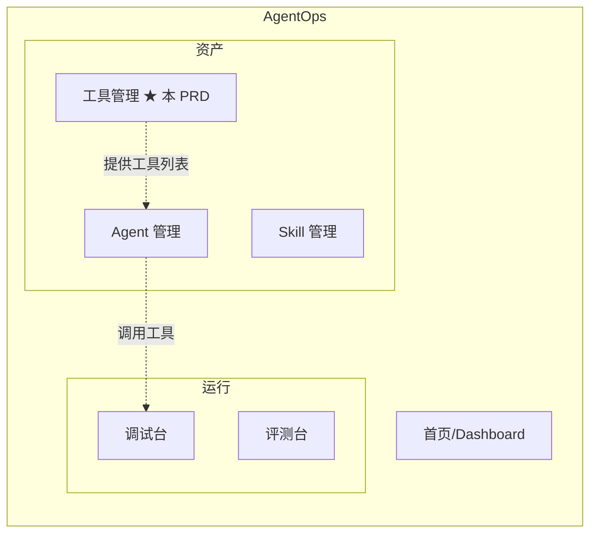
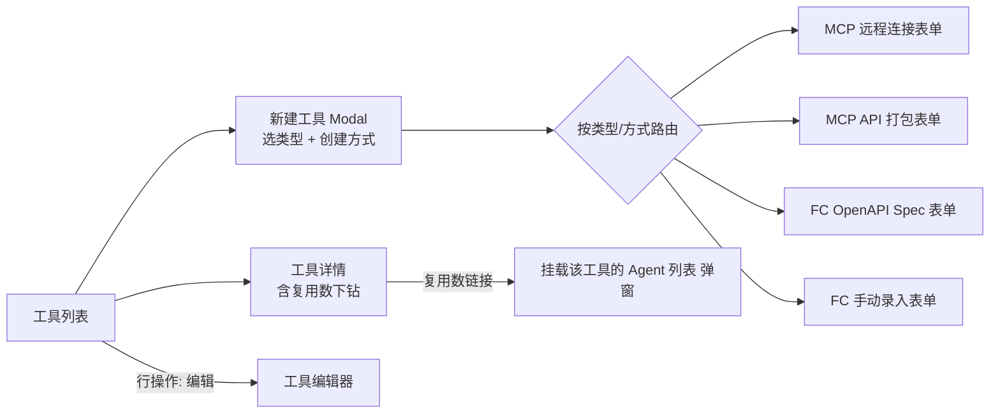
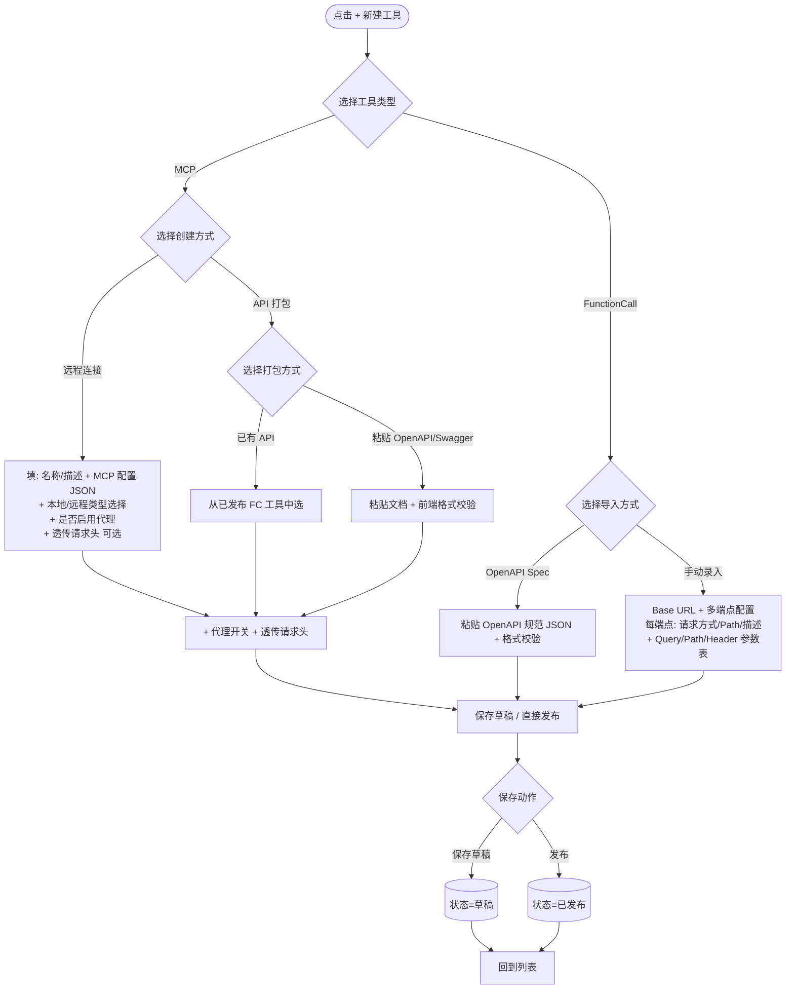
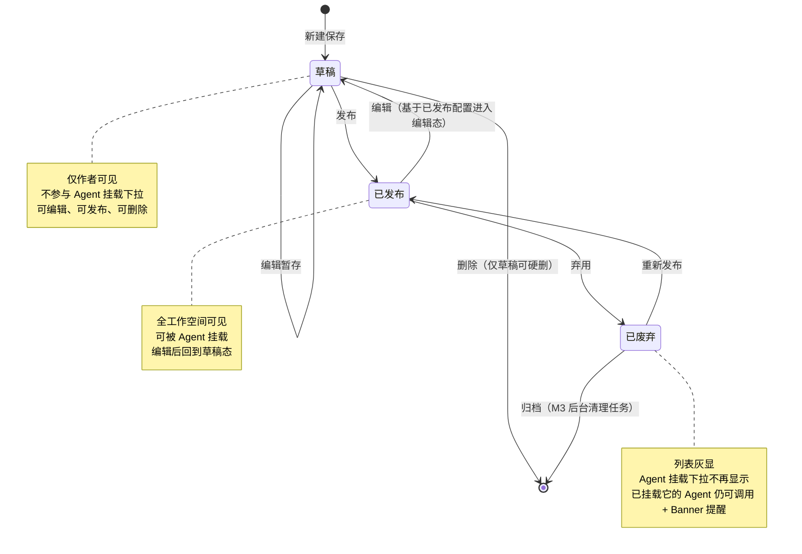
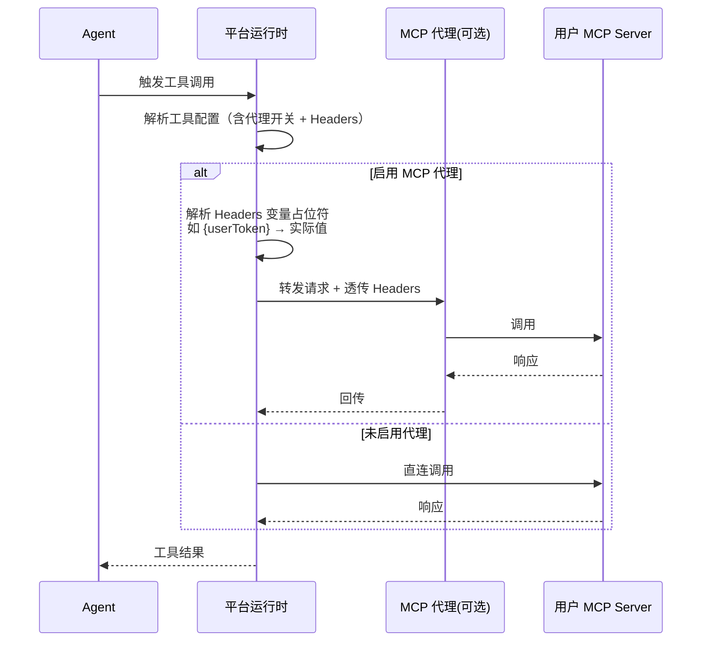
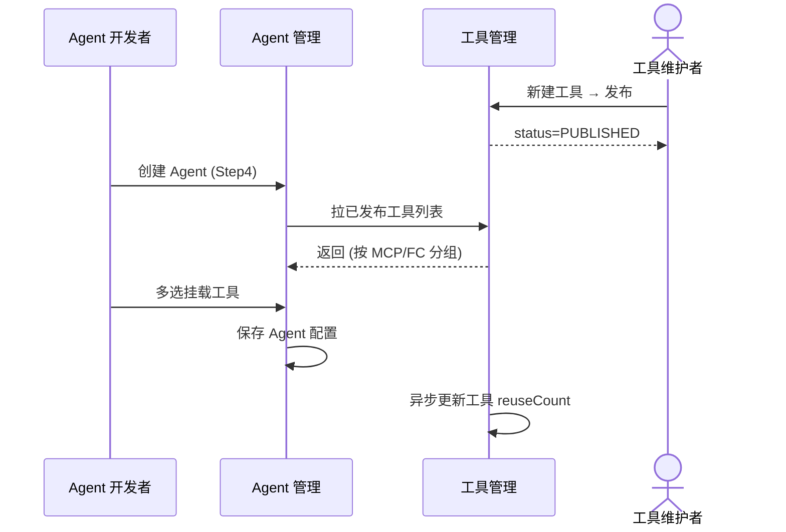
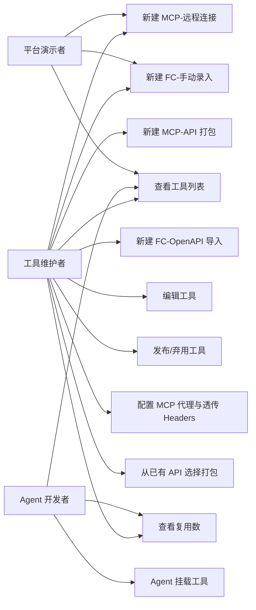

# AgentOps — 工具管理 PRD

> 文档日期：2026-06-01　|　版本：v1.0　|　覆盖周期：S2（2026-04 ~ 2026-07）
> 父文档：[S2 PRD](./2026-05-11-AgentOps-S2-PRD.md) · [S2 规划](../总体规划/2026-05-11-AgentOps-S2规划.md)
> 兄弟文档：[Agent 管理 PRD](./2026-05-11-Agent管理-PRD.md) · [Skill 管理 PRD](./2026-05-11-Skill管理-PRD.md) · [调试台 PRD](./2026-05-11-调试台-PRD.md)

---

## 1. 产品/需求背景

### 1.1 为什么要做

S2 周期内 Agent 管理 CONFIG 模式的"Step4 MCP 配置"目前是 **mock 占位**（参见 [Agent 管理 PRD §6.1.5 / §7.3](./2026-05-11-Agent管理-PRD.md)），Agent 开发者无法真实挂载工具。同时 S2 战略层强调"Agent + Skill + 工具"三位一体的能力沉淀，但工具侧目前缺少统一目录化承载，工具维护者只能在各业务系统散落定义，复用率低、Agent 接入路径混乱。

### 1.2 解决什么问题

- **承接真实数据源**：把 Agent Step4 由 mock 切换为真实可挂载的工具列表；
- **统一工具资产入口**：MCP（远程 / API 打包）与 FunctionCall（OpenAPI / 手动录入）两类工具在同一目录化管理；
- **多形态导入降低接入门槛**：粘贴一段 OpenAPI 文档、或填几行 Base URL + 端点就能沉淀为可挂载工具；
- **运行时鉴权可治理**：MCP 代理 + 请求头变量透传，避免每个 Agent 自处理鉴权。

### 1.3 面向用户

- **工具维护者**：把团队自有 MCP server / 后台 API 沉淀为可复用工具；
- **Agent 开发者**：在 Agent CONFIG 模式 Step4 多选挂载工具；
- **平台演示者**：现场跑通"建工具 → Agent 挂载 → 调试调用"价值闭环。

### 1.4 与 Skill 管理的边界

- **Skill** = 部门沉淀的"能力包"（SKILL.md 文档形态，强语义），偏 LLM 提示工程；
- **工具** = 协议级"可调用端点"（MCP server / HTTP API），偏底层接口；
- 二者在 Agent 上**并存挂载**：Skill 主导任务编排，工具主导能力扩展。

---

## 2. 目标与范围

### 2.1 S2 目标

| 目标 | 度量 |
| --- | --- |
| 资产可见 | 部门所有 MCP 与 FunctionCall 工具 100% 在平台目录化 |
| 接入打通 | Agent 管理 Step4 由 mock 切换为真实工具列表 |
| 多形态覆盖 | 4 种创建路径（MCP 远程 / MCP API 打包 / FC OpenAPI / FC 手动）全部 GA |
| 业务接入 | ≥ 3 个真实业务工具被 ≥ 2 个 Agent 挂载并跑通调试 |

### 2.2 范围

**S2 内做**

- 工具 CRUD（新增 / 编辑 / 发布 / 弃用）
- 工具列表（ProTable，含类型 / 创建方式 / 状态 / 复用数）
- 4 种创建方式：MCP 远程连接、MCP API 打包、FunctionCall OpenAPI Spec 导入、FunctionCall 手动录入
- 草稿 / 已发布 / 已废弃 三态机
- MCP 代理（含请求头透传 + 变量替换）
- 已有 API 选择（依赖 FunctionCall 工具沉淀的 API 列表）
- 前端 JSON / OpenAPI 格式校验
- Agent 挂载工具后的复用数统计

**S2 内不做**

- ❌ 工具版本化（编辑即生效，不做 Semver 与历史版本；S3 评估）
- ❌ 工具评测（与 Skill 评测不复用，S3 评估）
- ❌ 跨工作空间 / 跨部门工具共享
- ❌ 公司工具市场 / 评分生态
- ❌ MCP server 自托管能力（远程连接需用户自备 endpoint，平台不代运营）
- ❌ 调用配额 / 费用治理（接 LLM 网关层后续做）

---

## 3. 系统线框图（必选，优先产出）

### 3.1 工具管理在平台中的位置



> ★ 标记为本 PRD 新增模块。工具管理与 Agent 管理 / Skill 管理 同列在"资产"侧导航分组下，作为 Agent 可调用能力的统一目录。

### 3.2 工具管理内部页面结构



### 3.3 主要页面/模块说明

| 页面/模块 | 职责 | 主要元素 |
| --- | --- | --- |
| 工具列表 | 所有工具的入口；支持按类型/状态/标签/关键字筛选 | ProTable + 新建按钮 + 类型胶囊 + 状态胶囊 |
| 新建工具 Modal | 类型 + 创建方式二选一 → 跳对应编辑器 | 两步分流选择（type → creationMode） |
| 工具编辑器（4 种形态） | 按创建方式渲染不同表单 + JSON/OpenAPI 校验 + 草稿/发布按钮 | 顶部状态 Banner + 字段表单 + 代码编辑器 |
| 工具详情 | 全字段只读 + 复用数链接 + 操作（编辑/弃用/重新发布） | 字段卡片 + 复用数下钻 |
| 挂载 Agent 列表（弹窗） | 反向查看哪些 Agent 在用该工具 | Modal + Agent 简表 |

> **信息架构一致性**：本节定义的页面边界与 §7 功能需求、§8 详细原型图、§9 用例图一一对应。

---

## 4. 业务流程图（必选）

### 4.1 工具创建主流程（4 种创建方式分流）



### 4.2 工具生命周期状态机



> **状态机简化说明（v1.0）**：S2 不做版本化，编辑已发布工具时**复用同一份记录**进入编辑态、回滚到草稿；再次发布则覆盖前一份发布配置。后续若沉淀版本化需求，再升级到 Skill 同款 Semver 体系。

### 4.3 MCP 代理与请求头透传调用流程



### 4.4 Agent 挂载工具流程（跨模块协作）



---

## 5. 用例图（必选）

### 5.1 参与者与用例



### 5.2 用例说明与权限边界

| 用例 | 含义 | 谁能做 |
| --- | --- | --- |
| 查看工具列表 | 浏览全部工具，含筛选 | 全部角色 |
| 新建工具（4 种形态） | 创建并保存草稿或直接发布 | 工具维护者、平台演示者 |
| 编辑工具 | 草稿或已发布态编辑（已发布编辑后回草稿） | 工具维护者；草稿仅作者可编辑 |
| 发布工具 | 草稿 → 已发布；通过全字段必填校验 | 工具维护者 |
| 弃用工具 | 已发布 → 已废弃；二次确认 | 工具维护者 |
| 重新发布 | 已废弃 → 已发布 | 工具维护者 |
| 配置 MCP 代理与透传 Headers | 启用代理、维护 Header 列表（含变量占位） | 工具维护者 |
| 从已有 API 选择打包 | MCP API 打包模式下选择已发布的 FC 工具 | 工具维护者 |
| 查看复用数 | 看工具被多少 Agent 挂载 + 下钻 Agent 列表 | 全部角色 |
| Agent 挂载工具 | Agent CONFIG 模式 Step4 多选挂载 | Agent 开发者（实际入口在 Agent 管理） |

---

## 6. 用户与场景

| 角色 | 典型场景 |
| --- | --- |
| **工具维护者** | 把团队自有 MCP server / 后台 API 沉淀为可复用工具；为业务一线封装统一调用入口 |
| **Agent 开发者** | 在创建 Agent 时挂载工具；优先复用已发布工具，避免重复造轮 |
| **平台演示者** | 现场演示"粘贴一段 OpenAPI → 立刻变成可挂载工具 → Agent 跑通调用"完整闭环 |

**用户故事**

- 作为 **工具维护者**，我希望把内部 Jira API 的 OpenAPI 文档粘贴一下就能变成 FunctionCall 工具，让任何 Agent 都能挂载查询。
- 作为 **工具维护者**，我希望我的 MCP server 在调用时能透传当前用户的 token，不用每个 Agent 自己处理鉴权——通过 MCP 代理 + 请求头变量就能搞定。
- 作为 **Agent 开发者**，我希望在 Agent Step4 挂载工具时，能看到每个工具被多少 Agent 在用，作为质量信号。
- 作为 **工具维护者**，我希望把已经导入过的某条 FunctionCall API 直接打包成 MCP 工具暴露出去，不用重新粘一遍 spec。

---

## 7. 功能需求

> 优先级标注 **S2-P0/P1/P2**；里程碑 M1=2026-06-08、M2=2026-07-06、M3=2026-07-31。功能点须与 §3 系统线框图、§4 业务流程图、§5 用例图一一对应。

### 7.1 工具字段定义（v1.0 权威源）

#### 7.1.1 通用字段（所有类型）

| 字段 | 类型 | 必填 | 约束 | 说明 |
| --- | --- | --- | --- | --- |
| **`num`** | string | 系统生成 | MCP 前缀 `MCP...`、FC 前缀 `FC...`；全局唯一 | 业务编号；URL / 关联引用使用 |
| **`name`** | string | ✓ | ≤128 字符；同工作空间内唯一（不区分类型） | 工具名称；列表 / 挂载下拉显示 |
| **`description`** | text | ✓ | ≤500 字符 | 工具描述；列表展示 + Agent 挂载时给 LLM 看 |
| **`type`** | enum | ✓ | `MCP` / `FUNCTION_CALL` | 工具类型；建好后不可改 |
| **`creationMode`** | enum | ✓ | 见 §7.1.2 | 创建方式；建好后不可改 |
| **`tags`** | string[] | 可选 | 单 tag ≤32 字符；上限 20 个 | 标签；列表筛选 |
| **`status`** | enum | 系统派生 | `DRAFT` / `PUBLISHED` / `DEPRECATED` | 状态；详见 §4.2 |
| **`reuseCount`** | int | 系统派生 | — | 被多少已发布 Agent 挂载（草稿态 Agent 不计入） |
| **`createdBy` / `createdAt` / `updatedBy` / `updatedAt`** | — | 系统派生 | — | 审计字段 |

#### 7.1.2 创建方式枚举

| `type` | `creationMode` | 含义 |
| --- | --- | --- |
| MCP | `REMOTE` | 远程连接：用户自备 MCP server endpoint，平台只存配置并转发 |
| MCP | `API_PACKAGE` | API 打包：把已有 API 或一段 OpenAPI 文档"包"成 MCP 工具暴露给 Agent |
| FUNCTION_CALL | `OPENAPI_SPEC` | OpenAPI Spec 导入：粘贴 JSON 规范文档解析 |
| FUNCTION_CALL | `MANUAL` | 手动录入：Base URL + 多端点逐项配置 |

#### 7.1.3 MCP 远程连接专有字段（`type=MCP, creationMode=REMOTE`）

| 字段 | 类型 | 必填 | 约束 | 说明 |
| --- | --- | --- | --- | --- |
| **`mcpConfigType`** | enum | ✓ | `LOCAL` / `REMOTE` | 配置子类型，决定 JSON 字段结构与前端校验规则 |
| **`mcpConfig`** | json (text) | ✓ | 合法 JSON；按 `mcpConfigType` 走不同 schema 校验（详见 §7.3） | MCP 配置 JSON 串；前端实时格式校验 |
| **`proxyEnabled`** | bool | 默认 false | — | 是否启用平台 MCP 代理；启用后调用经平台中转 |
| **`proxyHeaders`** | object[] | 可选 | `proxyEnabled=true` 时可填；上限 20 条 | 透传请求头（详见 §7.5） |

#### 7.1.4 MCP API 打包专有字段（`type=MCP, creationMode=API_PACKAGE`）

| 字段 | 类型 | 必填 | 约束 | 说明 |
| --- | --- | --- | --- | --- |
| **`packageMode`** | enum | ✓ | `EXISTING_API` / `OPENAPI_PASTE` | 打包方式 |
| **`sourceFcToolNum`** | string | `packageMode=EXISTING_API` 时必填 | 必须指向 `type=FUNCTION_CALL`、`status≠DEPRECATED` 的工具 | 来源 FunctionCall 工具的 num |
| **`openApiSpec`** | text | `packageMode=OPENAPI_PASTE` 时必填 | 合法 OpenAPI 3.x / Swagger 2.0 JSON；前端校验（§7.4） | 粘贴的 OpenAPI 规范文档原文 |
| **`proxyEnabled`** | bool | 默认 false | 同 §7.1.3 | API 打包模式同样支持代理与 Header 透传 |
| **`proxyHeaders`** | object[] | 可选 | 同 §7.1.3 | — |

> **MCP API 打包不存在 `mcpConfig` 字段**：MCP 协议层由平台自动按打包来源生成，用户不可见也不可改。

#### 7.1.5 FunctionCall 专有字段

**`creationMode=OPENAPI_SPEC`**

| 字段 | 类型 | 必填 | 约束 | 说明 |
| --- | --- | --- | --- | --- |
| **`openApiSpec`** | text | ✓ | 合法 OpenAPI 3.x / Swagger 2.0 JSON；前端校验 | 规范文档原文 |

**`creationMode=MANUAL`**

| 字段 | 类型 | 必填 | 约束 | 说明 |
| --- | --- | --- | --- | --- |
| **`baseUrl`** | string | ✓ | 合法 URL，需含 scheme | API Base URL，所有端点共用 |
| **`endpoints`** | object[] | ✓ | ≥1 条；详见 §7.6 | API 端点列表 |

### 7.2 工具列表与基础功能

| 序号 | 功能点 | 简要说明 | 优先级 | 里程碑 |
| --- | --- | --- | --- | --- |
| 2.1 | 工具列表 | ProTable：num / 名称 / 描述 / 类型胶囊（MCP/FC）/ 创建方式标签 / 状态 / 复用数 / 创建人 / 更新时间 / 操作 | S2-P0 | M1 |
| 2.2 | 列表筛选 | 类型 / 创建方式 / 状态 / 标签 / 关键字（搜 num + 名称 + 描述） | S2-P0 | M1 |
| 2.3 | 新建工具入口 | 顶部 `+ 新建工具` 按钮 → 弹 Modal 选类型（MCP/FC）+ 选创建方式 → 跳新建页 | S2-P0 | M1 |
| 2.4 | 工具详情 | 全字段只读展示 + 复用数下钻（点击数字 → 弹挂载该工具的 Agent 列表） | S2-P1 | M2 |
| 2.5 | 编辑工具 | 草稿态 / 已发布态都可编辑；已发布态编辑后变草稿（详见 §4.2） | S2-P0 | M1 |
| 2.6 | 发布 | 草稿态下顶部 `发布` 按钮 → 校验通过后状态 → 已发布 | S2-P0 | M1 |
| 2.7 | 弃用 | 已发布态行操作 `弃用` → 二次确认 → 状态 → 已废弃；提示该工具已被 X 个 Agent 挂载 | S2-P0 | M2 |
| 2.8 | 重新发布 | 已废弃态行操作 `重新发布` → 状态回 已发布 | S2-P1 | M2 |
| 2.9 | 删除草稿 | 仅草稿态显示 `删除` 行操作；已发布 / 已废弃禁删 | S2-P1 | M2 |
| 2.10 | 复用数统计 | 实时统计被多少**已发布 Agent** 在挂载（不含草稿态 Agent） | S2-P1 | M3 |
| 2.11 | 列表空态 | Empty + "新建工具" 引导 | S2-P0 | M1 |

### 7.3 MCP 远程连接 — `mcpConfig` 校验规则

> 前端实时校验，落库前后端再做一次兜底；任一不通过禁用「发布」按钮，并在编辑器下方红字给具体路径。

#### 7.3.1 `mcpConfigType=LOCAL`（本地 MCP server，stdio 传输）

参考结构（前端必须按此 schema 校验）：

```json
{
  "command": "node",
  "args": ["./server.js"],
  "env": {
    "API_KEY": "xxx"
  }
}
```

| 字段 | 类型 | 必填 | 约束 |
| --- | --- | --- | --- |
| `command` | string | ✓ | 非空 |
| `args` | string[] | 可选 | 默认 `[]` |
| `env` | object<string,string> | 可选 | 值必须是 string |

#### 7.3.2 `mcpConfigType=REMOTE`（远程 MCP server，sse / streamable-http 传输）

参考结构：

```json
{
  "url": "https://mcp.example.com/sse",
  "transport": "sse",
  "headers": {
    "Authorization": "Bearer xxx"
  }
}
```

| 字段 | 类型 | 必填 | 约束 |
| --- | --- | --- | --- |
| `url` | string | ✓ | 合法 URL，需含 `https://` 或 `http://` |
| `transport` | enum | ✓ | `sse` / `streamable-http` |
| `headers` | object<string,string> | 可选 | 与代理透传的 `proxyHeaders` 不冲突（一个静态在配置里、一个运行时透传） |

> **本地 vs 远程的判定**：前端根据 `mcpConfigType` 切换两套校验 schema；JSON 顶层必须能匹配对应结构，否则报"配置结构与所选类型不符"。

### 7.4 OpenAPI 文档校验规则（前端）

适用场景：MCP API 打包（`packageMode=OPENAPI_PASTE`）+ FunctionCall（`creationMode=OPENAPI_SPEC`）

| 校验项 | 规则 | 失败提示 |
| --- | --- | --- |
| JSON 合法性 | `JSON.parse` 成功 | "JSON 格式错误：行 X 列 Y" |
| OpenAPI 版本 | 顶层必含 `openapi` (3.x) 或 `swagger` (2.0) 字段 | "缺少 openapi 或 swagger 版本字段" |
| 必需根字段 | OpenAPI 3.x: `info` + `paths`；Swagger 2.0: `info` + `paths` + `host` | "缺少必需字段：…" |
| paths 非空 | `paths` 至少 1 个端点 | "至少需要一个 API 端点定义" |
| 端点合法 | 每个端点至少含 `summary` 或 `description` | "端点 `/xxx` 缺少描述" |

> 校验通过后**前端不做语义提取**，原样保存到 `openApiSpec`，由后端解析为端点元数据用于运行时调用与列表展示。

### 7.5 MCP 代理与请求头透传

| 序号 | 功能点 | 简要说明 | 优先级 | 里程碑 |
| --- | --- | --- | --- | --- |
| 5.1 | 代理开关 | Switch 控件，默认关闭；关闭时 `proxyHeaders` 区域 disabled + tooltip "需先启用代理" | S2-P0 | M2 |
| 5.2 | 透传 Header 列表 | 表格化录入：`Header 名` / `值` / `描述`（可选）；行操作 + / - | S2-P0 | M2 |
| 5.3 | 值支持两种模式 | ① 直接输入字面值（如 `application/json`）；② 变量占位符 `{变量名}`（如 `{userToken}`，运行时由平台上下文注入） | S2-P0 | M2 |
| 5.4 | 变量占位符校验 | 仅允许 `{字母数字下划线}` 形式；同一变量名可多 Header 引用；不存在的变量在运行时报警告（不阻塞调用） | S2-P0 | M2 |
| 5.5 | 平台内置变量清单 | 表单下方 Popover 列出可用内置变量（如 `userToken`、`userId`、`agentNum`、`traceId`），点击一键插入 | S2-P1 | M2 |
| 5.6 | Header 名去重 | 同一工具内 Header 名不允许重复（大小写不敏感） | S2-P0 | M2 |
| 5.7 | 调用预览 | 编辑态提供"预览解析后请求头"按钮，弹出当前模拟上下文下的 Header 实际值（仅展示，不真实调用） | S2-P2 | M3 |

### 7.6 FunctionCall 手动录入 — 端点配置

每条 `endpoints[i]` 字段：

| 字段 | 类型 | 必填 | 约束 |
| --- | --- | --- | --- |
| **`method`** | enum | ✓ | `GET` / `POST` / `PUT` / `DELETE` / `PATCH` |
| **`path`** | string | ✓ | 以 `/` 开头；可含 `{paramName}` 占位（与 `pathParams` 一一对应） |
| **`description`** | string | ✓ | ≤200 字符；给 LLM 看的端点用途说明 |
| **`queryParams`** | object[] | 可选 | 参见下表 |
| **`pathParams`** | object[] | 可选 | 参见下表；必须与 `path` 中占位符一一对应（前端校验） |
| **`headers`** | object[] | 可选 | 参见下表 |

**`queryParams[i]` / `pathParams[i]` 结构**

| 字段 | 类型 | 必填 | 约束 |
| --- | --- | --- | --- |
| `name` | string | ✓ | 合法变量名（字母 + 数字 + 下划线） |
| `type` | enum | ✓ | `string` / `number` / `boolean` / `integer` |
| `defaultValue` | string | 可选 | 字符串形式存储，运行时按 `type` 反序列化 |
| `description` | string | ✓ | ≤200 字符 |

**`headers[i]` 结构**

| 字段 | 类型 | 必填 | 约束 |
| --- | --- | --- | --- |
| `name` | string | ✓ | 合法 Header 名 |
| `defaultValue` | string | 可选 | 字面值；不在此处支持变量占位（变量占位仅 MCP 代理透传场景，避免心智混乱） |
| `description` | string | ✓ | ≤200 字符 |

> **端点上限**：单个工具最多 50 个端点（防止把巨型 API 全塞一个工具）；超出引导拆分为多个工具或改用 OpenAPI Spec 导入。

### 7.7 编辑与发布

| 序号 | 功能点 | 简要说明 | 优先级 | 里程碑 |
| --- | --- | --- | --- | --- |
| 7.1 | 编辑入口 | 列表行操作 `编辑`；草稿 + 已发布均可进 | S2-P0 | M1 |
| 7.2 | 已发布编辑的语义 | 进入编辑态 = 状态切回草稿；保存草稿后再次发布会覆盖前一份发布配置 | S2-P0 | M1 |
| 7.3 | 类型 / 创建方式只读 | 编辑态下 `type` 和 `creationMode` 字段 disabled，要换形态须新建 | S2-P0 | M1 |
| 7.4 | 顶部 Banner | 已发布编辑态顶部显示"您正在编辑已发布工具，保存草稿不影响 Agent 调用；点击「发布」后变更生效" | S2-P0 | M1 |
| 7.5 | 保存草稿 | 顶部按钮 `保存草稿`；不做必填校验（除 `name + type + creationMode`） | S2-P0 | M1 |
| 7.6 | 发布 | 顶部按钮 `发布`；走全字段必填 + 格式校验；通过后 `status=PUBLISHED` | S2-P0 | M1 |
| 7.7 | 弃用提示 | 弃用时若该工具已被 Agent 挂载，弹 Modal 列出"X 个 Agent 正在使用此工具，弃用后已挂载的 Agent 仍可调用但下拉中不再可选" + 二次确认 | S2-P0 | M2 |
| 7.8 | 删除草稿 | 仅草稿态可硬删；二次确认 + 不可恢复 | S2-P1 | M2 |

### 7.8 Agent 挂载工具的对接

| 序号 | 功能点 | 简要说明 | 优先级 | 里程碑 |
| --- | --- | --- | --- | --- |
| 8.1 | 切换 Agent Step4 数据源 | Agent 管理 CONFIG 模式 Step4 由 mock 切真实工具列表（过滤 `status=PUBLISHED`） | S2-P0 | M2 |
| 8.2 | 挂载下拉过滤 | 默认按类型分组（MCP / FunctionCall）；可搜索；隐藏 `DEPRECATED` 与 `DRAFT` | S2-P0 | M2 |
| 8.3 | 已挂载工具弃用提醒 | Agent 详情页若挂了已废弃工具，工具名旁显示 `已废弃` 胶囊 + tooltip "工具已被维护者弃用，建议替换" | S2-P1 | M3 |
| 8.4 | 反向定位 | 工具详情页 `复用数` 数字可点击 → 弹"挂载此工具的 Agent 列表" | S2-P1 | M3 |

---

## 8. 原型图/界面说明（必选）

> ⚠️ **2026-06-01 状态**：Figma `hoQIHy1FcQdfE49oDsiSV9` 尚未单独绘制工具管理画板，fe 可先复用 Skill 管理（列表 / 详情 / 编辑）的扁平化模板，待设计师补图后对齐。

### 8.1 工具列表

```
┌─ 工具管理 ─────────────────────────────────────────────────────────┐
│ 工具管理                                          [+ 新建工具]      │
│ 管理 MCP 与 FunctionCall 两类工具，可被 Agent 挂载                  │
│ ─────────────────────────────────────────────────────────────────│
│ [全部 N][MCP N][FunctionCall N]    🔍 搜索 num/名称/描述...        │
│ 状态: [全部 ▾]  创建方式: [全部 ▾]  标签: [全部 ▾]                  │
│ ┌─ 表格 ──────────────────────────────────────────────────────┐ │
│ │ NUM │ 名称 │ 描述 │ 类型 │ 创建方式 │ 状态 │ 复用 │ 更新时间 │ 操作│ │
│ │ MCP-001 │ jira-mcp │ ... │ MCP 蓝 │ 远程连接 │ ●已发布 │ 3 │ ... │ 编辑·弃用·查看│ │
│ │ FC-002  │ git-api  │ ... │ FC 紫 │ OpenAPI │ ●草稿  │ 0 │ ... │ 编辑·删除│ │
│ └─────────────────────────────────────────────────────────────┘ │
└─────────────────────────────────────────────────────────────────────┘
```

**对应功能点**：§7.2.1 ~ §7.2.11；空态见 §8.7。

### 8.2 新建工具 Modal — 类型与创建方式选择

```
┌─ Modal · 新建工具 ──────────────────────────────────┐
│ 选择工具类型                                          │
│ ┌──────────────┐   ┌──────────────┐                │
│ │ ● MCP        │   │ ○ FunctionCall│                │
│ │ Model Context│   │ HTTP API 调用 │                │
│ │ Protocol     │   │               │                │
│ └──────────────┘   └──────────────┘                │
│                                                       │
│ 选择创建方式（MCP）                                   │
│ ○ 远程连接 — 自备 MCP server endpoint                │
│ ○ API 打包 — 把已有 API 或 OpenAPI 文档包成 MCP      │
│ ─────────────────────────────────────────────────── │
│                              [取消]   [下一步 →]    │
└──────────────────────────────────────────────────────┘
```

**对应功能点**：§7.2.3；分流后跳 §8.3 ~ §8.6 四种编辑器。

### 8.3 MCP 远程连接 — 编辑器

```
┌─ 工具管理 › 新建 › MCP / 远程连接 ───────────────────────┐
│ [● 草稿模式 黄胶囊]      [保存草稿] [发布]              │
│ ──────────────────────────────────────────────────── │
│ * 工具名称: [_______________________]                │
│ * 描述:    [____________________________________]    │
│ 标签:      [tag1] [tag2] [+]                        │
│ ──────────────────────────────────────────────────── │
│ MCP 配置                                              │
│ 配置类型: ○ 本地  ● 远程                              │
│ ┌─ JSON 编辑器 (Monaco) ───────────────────────────┐ │
│ │ {                                                │ │
│ │   "url": "https://...",                          │ │
│ │   "transport": "sse",                            │ │
│ │   ...                                            │ │
│ │ }                                                │ │
│ └──────────────────────────────────────────────────┘ │
│ ✓ 配置格式正确 (绿) / ✗ 缺少 url 字段 (红)            │
│ ──────────────────────────────────────────────────── │
│ MCP 代理                                              │
│ 启用代理: [○ Off ●]                                  │
│ 透传请求头（启用代理后可编辑）                          │
│ ┌────────────────────────────────────────────────┐   │
│ │ Header 名 │ 值 │ 描述 │ 操作                    │   │
│ │ Authorization │ Bearer {userToken} │ ... │ - │   │
│ │ X-Trace-Id    │ {traceId}          │ ... │ - │   │
│ │ [+ 添加 Header]                              │   │
│ └────────────────────────────────────────────────┘   │
│ ℹ 支持内置变量: {userToken} {userId} {agentNum} ... │
└──────────────────────────────────────────────────────┘
```

**对应功能点**：§7.1.3、§7.3、§7.5；状态切换流转见 §4.2。

### 8.4 MCP API 打包 — 编辑器

```
┌─ 工具管理 › 新建 › MCP / API 打包 ───────────────────────┐
│ * 工具名称 / * 描述 / 标签（同上）                       │
│ ──────────────────────────────────────────────────── │
│ 打包方式: ● 选择已有 API   ○ 粘贴 OpenAPI/Swagger      │
│ ┌─ 已有 API 选择 ─────────────────────────────────┐ │
│ │ 下拉: 从已发布 FunctionCall 工具中选             │ │
│ │ [git-api (FC-002, 12 端点) ▾]                  │ │
│ │ 选中后预览端点列表                                │ │
│ └─────────────────────────────────────────────────┘ │
│ ─或─                                                 │
│ ┌─ 粘贴 OpenAPI/Swagger 文档 ─────────────────────┐ │
│ │ [JSON 编辑器 Monaco]                            │ │
│ │ ✓ 格式正确 / ✗ 缺少 paths 字段                  │ │
│ └─────────────────────────────────────────────────┘ │
│ ──────────────────────────────────────────────────── │
│ MCP 代理（同 §8.3）                                   │
└──────────────────────────────────────────────────────┘
```

**对应功能点**：§7.1.4、§7.4、§7.5。

### 8.5 FunctionCall OpenAPI Spec 导入

```
┌─ 工具管理 › 新建 › FunctionCall / OpenAPI Spec ──────────┐
│ * 工具名称 / * 描述 / 标签                              │
│ ──────────────────────────────────────────────────── │
│ * OpenAPI 规范文档（JSON）                            │
│ ┌─ JSON 编辑器 ───────────────────────────────────┐ │
│ │ {                                               │ │
│ │   "openapi": "3.0.0",                           │ │
│ │   "info": {...},                                │ │
│ │   "paths": {...}                                │ │
│ │ }                                               │ │
│ └─────────────────────────────────────────────────┘ │
│ ✓ 校验通过 (12 个端点已识别)                          │
└──────────────────────────────────────────────────────┘
```

**对应功能点**：§7.1.5、§7.4。

### 8.6 FunctionCall 手动录入

```
┌─ 工具管理 › 新建 › FunctionCall / 手动录入 ──────────────┐
│ * 工具名称 / * 描述 / 标签                              │
│ ──────────────────────────────────────────────────── │
│ * Base URL: [https://api.example.com]                │
│ ──────────────────────────────────────────────────── │
│ * API 端点                                            │
│ ┌─ Endpoint #1 ───────────────────────────────[─]┐ │
│ │ 请求方式: [GET ▾]   Path: [/users/{id}]         │ │
│ │ 描述:    [获取用户详情]                          │ │
│ │                                                   │ │
│ │ Query 参数 [+]                                   │ │
│ │ ┌──────────────────────────────────────────┐  │ │
│ │ │ 名 │ 类型 │ 默认值 │ 描述 │ -          │  │ │
│ │ │ verbose │ boolean │ false │ ... │ ⊖     │  │ │
│ │ └──────────────────────────────────────────┘  │ │
│ │                                                   │ │
│ │ Path 参数 [+]                                    │ │
│ │ ┌──────────────────────────────────────────┐  │ │
│ │ │ id │ string │ — │ 用户 ID │ ⊖           │  │ │
│ │ └──────────────────────────────────────────┘  │ │
│ │                                                   │ │
│ │ 请求头 [+]                                       │ │
│ │ ┌──────────────────────────────────────────┐  │ │
│ │ │ Accept │ application/json │ ... │ ⊖      │  │ │
│ │ └──────────────────────────────────────────┘  │ │
│ └──────────────────────────────────────────────────┘ │
│ [+ 添加端点]                                          │
└──────────────────────────────────────────────────────┘
```

**对应功能点**：§7.1.5、§7.6。

### 8.7 关键状态与异常态

| 状态 | 处理 |
| --- | --- |
| 工具列表为空 | Empty + "新建工具" 引导（功能点 §7.2.11） |
| MCP 配置 JSON 格式错误 | 编辑器下方红字提示具体行列；`发布` 按钮 disabled |
| OpenAPI 文档校验失败 | 显示首个错误（位置 + 缺失字段）；`发布` 按钮 disabled |
| 已发布工具进入编辑态 | 顶部 Banner 提示"编辑中不影响调用，发布后生效"（功能点 §7.7.4） |
| 弃用已被挂载的工具 | Modal 列出占用 Agent 数量 + 二次确认（功能点 §7.7.7） |
| 工具被弃用 | 列表灰显 + Agent 挂载下拉不显示 + 已挂载它的 Agent 详情页 tooltip 提示（功能点 §7.8.3） |
| Path 参数与 path 占位符不一致 | 行级红字 "参数 `id` 在 Path 中未声明" 或 "Path 中 `{name}` 未在参数表定义" |
| 选择已有 API 后源工具被弃用 | 编辑器顶部 Banner "来源 FC 工具已被弃用，请重新选择或切换打包方式" |

---

## 9. 非功能需求

| 项 | 目标 |
| --- | --- |
| 工具列表首屏 | ≤ 1.5s |
| 列表分页 | 默认 20，最大 100 |
| OpenAPI 文档大小上限 | 1 MB（前端粘贴时校验，超出引导分拆） |
| MCP 配置 JSON 大小上限 | 64 KB |
| 单工具端点数上限 | 50（手动录入） |
| 工具 num 生成 | UUID 后缀 + MCP/FC 前缀，全局唯一 |
| 复用数刷新延迟 | 准实时（≤ 5s，依赖 Agent 挂载事件） |
| MCP 代理转发增加的延迟 | P95 ≤ 50ms（不含目标 server 响应时间） |
| 同一工具名校验 | 前端失焦时调用后端 check，<300ms 响应 |
| 权限模型 | 复用平台现有工作空间内角色（M1 不做细化，所有工作空间成员可创建/编辑/发布） |
| 审计 | 所有 CRUD 与发布/弃用操作记录到平台审计日志，含操作人 + 时间 + diff |

---

## 10. 与现有功能的关系

| 关系 | 说明 | 兼容/迁移要点 |
| --- | --- | --- |
| **承接 Agent 管理 Step4 mock** | Agent 管理 CONFIG 模式 Step4 当前是 mock 占位（见 [Agent 管理 PRD §6.1.5](./2026-05-11-Agent管理-PRD.md)）；本模块 M2 提供真实工具列表 | M2 联调切换数据源；mock 期间的 Agent 配置不存在外键引用问题（mock 不落库） |
| **新增侧导航条目** | "资产"分组下新增"工具管理"条目，与 Agent 管理、Skill 管理 同级 | 前端路由 `/tools`；权限继承工作空间成员可见 |
| **复用 Skill 管理 UI 模板** | 列表 / 详情 / 编辑器扁平外壳套用 Skill 管理（fe tech-debt 同步） | 待设计师补 Figma 后对齐 |
| **与 Skill 管理无业务依赖** | 工具与 Skill 在 Agent 上并存挂载，但二者管理界面互不引用 | — |
| **MCP 代理对接平台运行时** | 运行时需新增 MCP 代理转发组件 + 内置变量注入 | M2 前与运行时团队对齐协议（transport 类型、变量名约定、trace 串联） |
| **审计日志共享** | 复用平台现有审计基础设施（同 Agent / Skill 走同一份） | 仅约定事件类型枚举：`TOOL_CREATE / TOOL_PUBLISH / TOOL_DEPRECATE / TOOL_DELETE_DRAFT` |
| **调试台间接消费** | 调试台调用 Agent 时若 Agent 挂了工具，工具调用走步骤链 `step.start/end`（已有协议） | 不改调试台代码 |

**全新功能 / 扩展改造判定**：本模块是 **全新模块**（不是对现有功能的改造），但 **改造了 Agent 管理 Step4 的数据源**（mock → 真实）。

---

## 11. 验收标准

### 11.1 M1 演示就绪（2026-06-08）

- [ ] 工具列表 GA：MCP / FunctionCall 双类型筛选 + 状态筛选
- [ ] 新建工具 Modal + 4 种创建方式入口齐全
- [ ] MCP 远程连接：表单 + 本地/远程 JSON 校验 + 草稿/发布
- [ ] FunctionCall 手动录入：Base URL + 多端点 + Query/Path/Header 参数表
- [ ] 三态机：草稿 / 已发布 / 已废弃；草稿删除、发布、编辑回滚到草稿全通
- [ ] 现场可演示：新建 MCP 远程工具 → 发布 → 在 Agent Step4 看到（即使是 mock 拉真数据）

### 11.2 M2 集成就绪（2026-07-06）

- [ ] MCP API 打包（已有 API 选择 + OpenAPI 粘贴）全 GA
- [ ] FunctionCall OpenAPI Spec 导入 GA（含解析端点元数据）
- [ ] MCP 代理 + 请求头透传 + 变量占位符 GA
- [ ] 内置变量清单（userToken / userId / agentNum / traceId）Popover 可选
- [ ] Agent 管理 Step4 切换为真实工具列表数据源
- [ ] 弃用流程含占用 Agent 提示
- [ ] 至少 3 个真实业务工具发布并被 Agent 挂载

### 11.3 M3 S2 收尾（2026-07-31）

- [ ] 工具详情页 + 复用数下钻（点击数字看挂载 Agent 列表）
- [ ] Agent 详情页已挂载的废弃工具 tooltip 提示
- [ ] MCP 代理"预览解析后请求头"调试辅助
- [ ] 端点拆分 / OpenAPI 大文档分拆引导
- [ ] 工具调用审计 trace 与调试台贯通验证

---

## 附：与下游技术方案的对接提示

1. **`mcpConfig` 双 schema 校验**：前端按 `mcpConfigType` 切换 JSON Schema（本地走 stdio 字段、远程走 sse/streamable-http 字段），后端落库前再用同一份 schema 兜底；建议把 schema 文件作为 spec 资产放在 [技术方案目录](../技术方案/) 下版本管理。
2. **MCP API 打包的"协议层自动生成"**：API 打包模式下用户看不到 `mcpConfig`，平台需在运行时把 OpenAPI 端点封装成 MCP tools schema 暴露给 LLM；建议封装为独立的 `OpenApiToMcpAdapter`，输入 OpenAPI 文档输出 MCP server 表达，复用到"已有 API 选"和"OpenAPI 粘贴"两种来源。
3. **变量占位符注入**：透传 Header 中的 `{变量名}` 由运行时上下文按"内置变量优先 → 用户上下文兜底 → 未命中报警告"顺序解析；建议建一份 `BuiltinVariableRegistry` 作为唯一事实源，前端 Popover 与运行时共用。
4. **`source FC 工具`引用一致性**：MCP API 打包引用 FC 工具时，被引用的 FC 工具弃用 / 删除前需校验是否被任何 MCP 工具引用（外键检查），引用中拒绝弃用。
5. **OpenAPI 大文档落库**：单个工具 `openApiSpec` 上限 1 MB，落 `text` 列前可 gzip 压缩；展示时按需懒加载，避免列表查询拖慢。
6. **`name` 唯一性**：S2 暂时按工作空间维度强唯一（不区分 type），方便挂载下拉不歧义；后续若开放跨工作空间共享再升级到 `(workspace, name)` 复合唯一。
7. **复用数统计**：建议走"Agent 发布事件 → 异步更新工具 reuseCount"，列表查询不实时 join；同时给后台对账任务每天兜底一次。
8. **MCP 代理转发组件**：M2 前需对齐"运行时通过代理调用 MCP 时的 trace 串联方式"，让调试台步骤链能看到经过代理的完整调用元信息。
9. **删除草稿物理删 vs 软删**：S2 走物理删（草稿无外部引用，无审计风险）；已发布 / 已废弃 永远软删。
10. **跨形态导入兼容**：MCP API 打包模式下用户切"已有 API"时，若选中的 FC 工具被多次更新过，引用的是其**最新已发布**配置 snapshot 还是动态跟随？S2 建议走"动态跟随"（FC 更新 → MCP 自动同步），降低用户心智；S3 看是否引入版本锁定。

---

## 附：关联文档

- [S2 PRD（聚合）](./2026-05-11-AgentOps-S2-PRD.md)
- [Agent 管理 PRD](./2026-05-11-Agent管理-PRD.md)
- [Skill 管理 PRD](./2026-05-11-Skill管理-PRD.md)
- [调试台 PRD](./2026-05-11-调试台-PRD.md)
- [S2 规划](../总体规划/2026-05-11-AgentOps-S2规划.md)
- [代码仓库](../代码仓库/)
