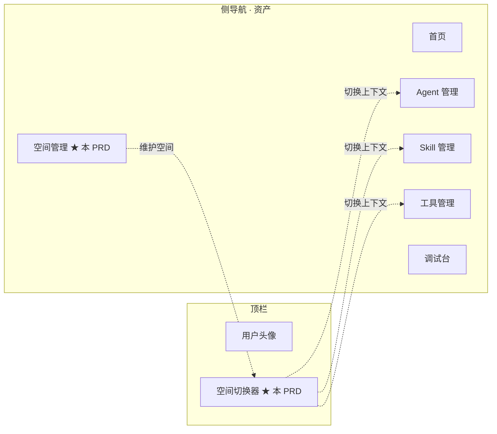
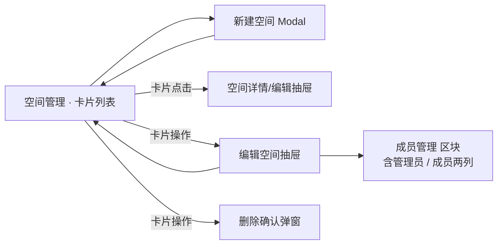
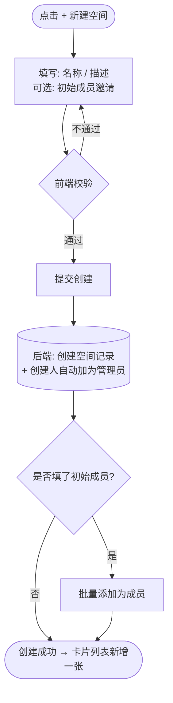
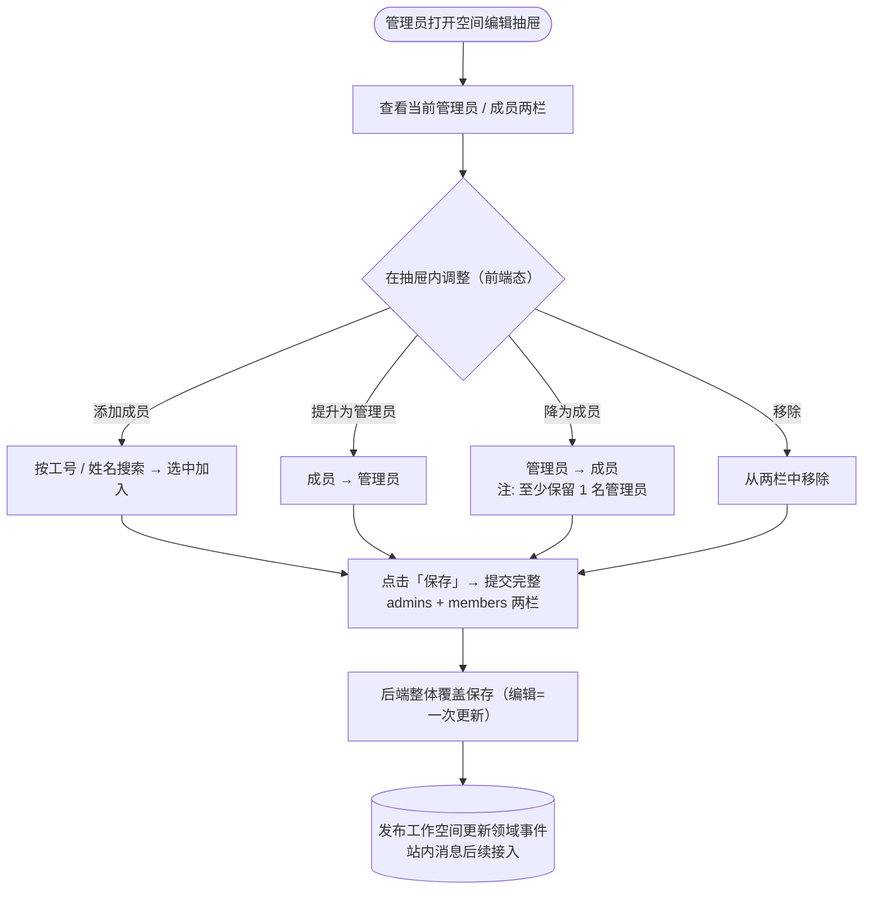
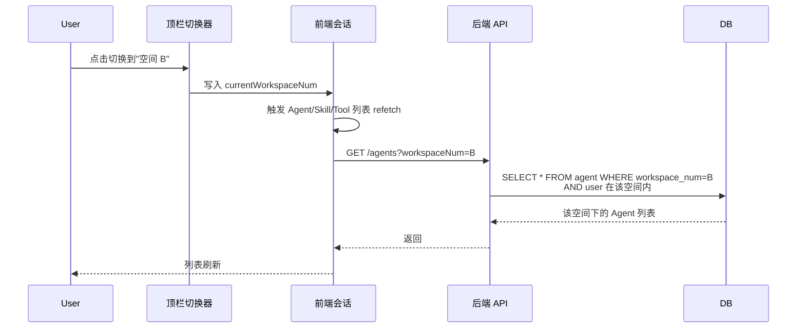
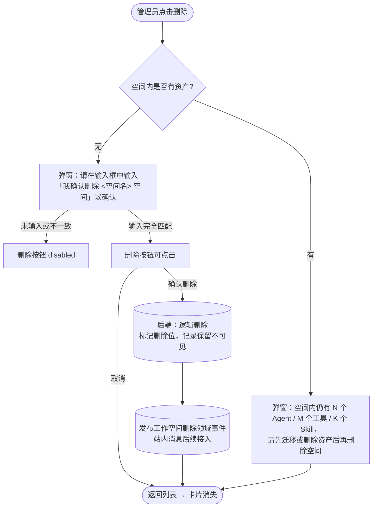
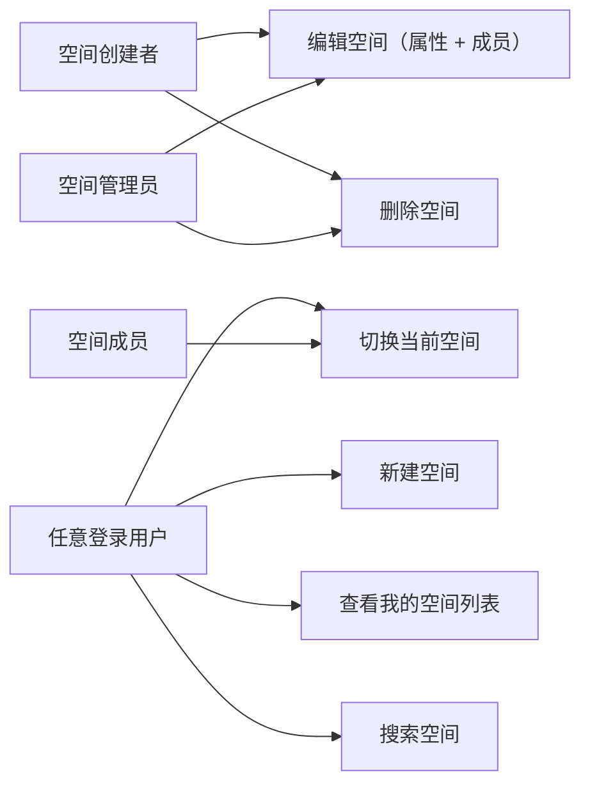

# AgentOps — 工作空间管理 PRD

> 文档日期：2026-06-03　|　版本：v1.0　|　覆盖周期：S2 收尾 → S3（解除"单工作空间硬编码"约束）
> 父文档：[S2 PRD](./2026-05-11-AgentOps-S2-PRD.md) · [S2 规划](../总体规划/2026-05-11-AgentOps-S2规划.md)
> 兄弟文档：[Agent 管理 PRD](./2026-05-11-Agent管理-PRD.md) · [Skill 管理 PRD](./2026-05-11-Skill管理-PRD.md) · [工具管理 PRD](./2026-06-01-工具管理-PRD.md) · [调试台 PRD](./2026-05-11-调试台-PRD.md)

---

## 1. 产品/需求背景

### 1.1 为什么要做

S2 周期内为了交付节奏，平台采用"**单工作空间硬编码**"兜底（参见 [S2 PRD §10](./2026-05-11-AgentOps-S2-PRD.md)），所有用户共享同一份 Agent / Skill / 工具可见集合。随着平台被多团队接入，**资产隔离**与**协作边界**已成阻塞性诉求：

- 不同业务线（如交付平台组、AICoding 组、流程组）希望各自维护自己的 Agent / Skill / 工具资产，互不打扰；
- 创建者希望明确"谁可以看/改我的资产"，而不是"所有平台用户都能看到所有资产"；
- 后续 RBAC、跨空间共享、空间级配额等治理能力，都需要先有"工作空间"这一聚合根。

### 1.2 解决什么问题

- **资产收拢**：把 Agent / MCP / Skill / 工具等所有资产统一挂到"工作空间"下，作为可见性与归属的边界；
- **多空间归属**：一个用户可同时归属多个空间（创建或被邀请加入），切换空间即切换资产视图；
- **轻量协作模型**：空间内分"管理员"和"成员"两层，管理员可加人，成员可使用资产；不引入复杂角色矩阵；
- **解除硬编码**：平台运行时从"全局默认工作空间"切到"基于当前用户 + 当前空间上下文"过滤资产。

### 1.3 面向用户

- **空间创建者 / 管理员**：业务线负责人或 Tech Lead，圈定团队的资产边界、拉人进来；
- **空间成员**：在某个空间内创建 / 使用 Agent / 工具 / Skill 的研发；
- **平台管理员（隐式）**：S3 才引入跨空间治理，本期不专设角色。

### 1.4 与现有"租户/部门"概念的边界

- **不是 SSO 意义的租户**：本期不接外部部门树做强映射，工作空间是**用户自主创建**的协作单元；
- **不是 RBAC 角色组**：仅"管理员/成员"两层，不做权限矩阵（S3 引入资源级 ACL 再迭代）；
- **不是项目空间**：粒度由用户决定（可大到部门、可小到单个项目），平台不约束。

---

## 2. 目标与范围

### 2.1 目标

| 目标 | 度量 |
| --- | --- |
| 资产归属可见 | 所有新建 Agent / Skill / 工具强制选择归属工作空间，存量数据迁移到"默认工作空间" |
| 多空间切换 | 用户可在 ≥ 2 个空间间无刷新切换；切换后资产列表正确过滤 |
| 协作下沉 | ≥ 3 个真实业务空间在平台落地，每个空间 ≥ 2 名成员 |
| 解除硬编码 | 代码侧移除"单工作空间硬编码"分支；所有资产查询带 `workspaceNum` 参数 |

### 2.2 范围

**本期做**

- 工作空间 CRUD（创建 / 编辑 / 删除）
- 空间属性：名称、描述、管理员（多）、成员（多）
- 空间管理界面：卡片列表 + 搜索（不分页）
- 用户可见性：仅展示"我创建的 + 我被加入的"空间
- 创建人自动成为管理员
- Agent / Skill / 工具列表按当前选中空间过滤
- 顶栏空间切换器（下拉选择当前活动空间）
- 存量数据迁移到"默认工作空间"

**本期不做**

- ❌ 跨空间资产共享 / 转移（S3 评估）
- ❌ 空间级配额 / 计费
- ❌ 与外部部门树强映射（保留接口预留字段）
- ❌ 资源级 ACL（如"某个 Agent 只允许某几个成员看"）
- ❌ 空间公开 / 申请加入（成员必须由管理员添加，不开放自助申请）
- ❌ 空间审计日志 UI（事件落 [审计基础设施](./2026-06-01-工具管理-PRD.md)，本期不出独立 UI）
- ❌ 删除空间时的资产级联策略 UI（删除前必须为空，详见 §7.5）

---

## 3. 系统线框图（必选）

### 3.1 工作空间在平台中的位置



> ★ 标记为本 PRD 新增模块。空间切换器位于顶栏右侧，空间管理位于侧导航最上方（资产分组顶部），作为所有其他资产的归属容器。

### 3.2 工作空间内部页面结构



### 3.3 主要页面/模块说明

| 页面/模块 | 职责 | 主要元素 |
| --- | --- | --- |
| 空间管理（卡片列表） | 展示"我创建 + 我加入"的所有空间；支持搜索、新建、进入编辑 | 顶部搜索框 + 新建按钮 + ProCard 卡片网格（无分页） |
| 新建空间 Modal | 收集空间名称、描述、初始成员 | Modal + 表单 |
| 编辑空间 抽屉 | 修改空间属性 + 管理成员（管理员/成员两类） | Drawer + 字段表单 + 成员列表 + 添加成员搜索框 |
| 顶栏空间切换器 | 在多个可见空间间切换；选中后落地为当前会话上下文 | Dropdown / Select（顶栏右侧） |
| 删除确认弹窗 | 删除空间前的二次确认 + 资产非空校验提示 | Modal |

> **信息架构一致性**：本节定义的页面边界与 §7 功能需求、§8 详细原型图、§9 用例图一一对应。

---

## 4. 业务流程图（必选）

### 4.1 空间创建主流程



### 4.2 成员管理流程（在"编辑"内整体提交）



> **成员变更不是即时下发**：抽屉内的添加 / 提升 / 降级 / 移除都只改前端态，点击「保存」时把**完整的**管理员 + 成员两栏一次性提交，后端整体覆盖。与界面"编辑"单一操作一致（参见技术方案 §4.2）。
>
> **管理员最少 1 人约束**：降级 / 移除导致管理员归零时前端禁用「保存」并 tooltip "空间至少保留 1 名管理员"，后端 `save` 兜底校验。

### 4.3 空间切换与资产过滤



### 4.4 空间删除流程



---

## 5. 用例图（必选）

### 5.1 参与者与用例



> **只有 创建 / 编辑 / 删除 三个写操作**：成员的添加 / 移除 / 提升 / 降级都收敛在"编辑空间"里（编辑抽屉内调整两栏后整体保存）；本期不提供"成员主动退出"独立操作，成员离开由管理员在编辑里移除。

### 5.2 用例说明与权限边界

| 用例 | 含义 | 谁能做 |
| --- | --- | --- |
| 查看我的空间列表 | 看到"我创建的 + 我被加入的"所有空间卡片 | 任意登录用户 |
| 搜索空间 | 在我可见的空间内按名称 / 描述模糊搜 | 任意登录用户 |
| 新建空间 | 创建新空间，自动成为管理员 | 任意登录用户 |
| 编辑空间 | 修改名称 / 描述 + 管理成员（添加 / 移除 / 提升 / 降级，整体保存） | 该空间管理员 |
| 删除空间 | 逻辑删空间（前置：空间内无资产 + 输入确认词） | 该空间管理员 |
| 切换当前空间 | 顶栏选择，触发资产列表过滤 | 该空间任意角色 |

---

## 6. 用户与场景

| 角色 | 典型场景 |
| --- | --- |
| **空间创建者** | 业务线 Tech Lead 创建"交付平台组"空间，把组内 5 名研发拉进来，组内的 Agent / 工具自此与其他组隔离 |
| **空间管理员** | 新人加入团队，管理员把他/她加入空间；某人调离，管理员将其移除 |
| **空间成员** | 在 Agent 管理新建 Agent 时，归属默认就是当前选中空间；切换空间后只看到自己组的资产 |

**用户故事**

- 作为 **业务线 Tech Lead**，我希望为我的团队建一个"AICoding 组"空间，把组员加进来，组里建的 Agent 别的组看不到。
- 作为 **空间成员**，我希望顶栏能一键切换空间，切到另一个组的视图查找参考资料 / 共建的 Agent。
- 作为 **空间管理员**，我希望降级前任管理员、提升新接手的同事时，平台能拦住"最后一名管理员"的危险操作。
- 作为 **空间创建者**，我希望删除空间前平台告诉我"还剩多少资产没清"，避免误删带走团队几个月的沉淀。

---

## 7. 功能需求

> 优先级标注 **P0/P1/P2**；里程碑由后续 [S2 规划](../总体规划/2026-05-11-AgentOps-S2规划.md) 排入。功能点须与 §3 系统线框图、§4 业务流程图、§5 用例图一一对应。

### 7.1 工作空间字段定义（v1.0 权威源）

| 字段 | 类型 | 必填 | 约束 | 说明 |
| --- | --- | --- | --- | --- |
| **`num`** | string | 系统生成 | 前缀 `WS-` + UUID 后缀；全局唯一 | 业务编号；URL / 资产归属外键使用 |
| **`name`** | string | ✓ | ≤64 字符；同用户可见范围内唯一 | **空间名称**；卡片标题、切换器下拉显示 |
| **`description`** | text | 可选 | ≤200 字符 | **空间描述**；卡片副标题展示 |
| **`admins`** | string[] | ✓ | ≥1 人；创建时默认包含创建人；元素为员工工号（`empNo`） | 空间管理员工号列表 |
| **`members`** | string[] | 可选 | 默认 `[]`；由管理员添加；与 `admins` 互斥（同一工号不重复出现在两个列表中）；元素为员工工号 | 空间成员工号列表 |
| **`createdBy` / `createdAt` / `updatedBy` / `updatedAt`** | — | 系统派生 | — | 审计字段 |

> **工号即权威键**：`admins` / `members` 只存 `empNo`，姓名 / 头像等展示字段由前端在渲染时按需走 SSO / 通讯录 API 解析，避免本表沉淀冗余的可变信息。
>
> **"用户可见范围内唯一"**：`name` 的唯一性约束作用于"当前用户能看到的空间集合"，不强制全平台唯一（不同团队可同名）。后端建索引时用 `(creator, name)` 复合唯一兜底。

### 7.2 空间列表（卡片视图）

| 序号 | 功能点 | 简要说明 | 优先级 |
| --- | --- | --- | --- |
| 2.1 | 卡片列表 | ProCard 网格：每行 3 ~ 4 张（响应式）；卡片含名称 / 描述 / 成员数 / 我的角色胶囊（管理员 / 成员） | P0 |
| 2.2 | 不分页 | 全量加载（预期每个用户可见空间数 ≤ 50；超 50 加滚动加载兜底，本期不实现） | P0 |
| 2.3 | 搜索 | 顶部搜索框，按 `name + description` 子串模糊匹配，前端过滤（数据量小） | P0 |
| 2.4 | 新建入口 | 顶部 `+ 新建空间` 按钮 → 弹 Modal（详见 §7.3） | P0 |
| 2.5 | 卡片操作 | 卡片右上角下拉菜单：编辑 / 删除（仅管理员可见）；成员看到的卡片只可点击查看 | P0 |
| 2.6 | 我的角色胶囊 | 卡片右上角彩色胶囊：管理员（蓝）/ 成员（灰） | P0 |
| 2.7 | 列表空态 | Empty + "新建空间" 引导文案 | P0 |
| 2.8 | 加入空间标识 | 我加入但非我创建的空间，卡片左上角小角标"被邀请加入" | P1 |
| 2.9 | 当前活动空间高亮 | 顶栏切换器选中的空间，在卡片列表中边框高亮（提示当前上下文） | P1 |

### 7.3 新建空间

| 序号 | 功能点 | 简要说明 | 优先级 |
| --- | --- | --- | --- |
| 3.1 | Modal 表单 | 字段：空间名称 * / 描述（≤200 字，含字符计数） / 初始成员（可选，搜索后多选） | P0 |
| 3.2 | 名称校验 | 前端：≤64 字符；后端兜底唯一性校验 | P0 |
| 3.3 | 描述字符计数 | TextArea 右下角 `xx / 200`，超出禁止提交并红字提示 | P0 |
| 3.4 | 成员搜索控件 | Select + 远程搜索（按工号 / 姓名调通讯录 API），支持多选；存库只取选中项的工号 | P0 |
| 3.5 | 提交语义 | 后端创建空间 + 创建人入 `admins` + 初始成员入 `members` | P0 |
| 3.6 | 成功反馈 | 关闭 Modal + 卡片列表前置新增一张 + 顶栏切换器下拉项更新 | P0 |
| 3.7 | 失败兜底 | 名称冲突时表单 inline 红字 "已存在同名空间，请更换" | P0 |

### 7.4 编辑空间

| 序号 | 功能点 | 简要说明 | 优先级 |
| --- | --- | --- | --- |
| 4.1 | 编辑入口 | 卡片菜单 `编辑` → 右侧 Drawer 抽屉打开 | P0 |
| 4.2 | 可编辑字段 | 名称 / 描述 + 管理员 / 成员两栏 | P0 |
| 4.3 | 成员管理区块 | 分两列：管理员列表 + 成员列表；每条显示工号 + 通讯录 API 解析出的姓名 / 头像 + 操作按钮 | P0 |
| 4.4 | 添加成员 | 区块顶部搜索框（按工号 / 姓名），选中后弹小卡选择"加为管理员 / 加为成员" | P0 |
| 4.5 | 提升 / 降级 | 行操作按钮：成员 → `提升为管理员`；管理员 → `降为成员`（仅改前端态） | P0 |
| 4.6 | 移除成员 | 行操作 `移除`（仅改前端态） | P0 |
| 4.7 | 最后一名管理员保护 | 当管理员栏将被清空时，`降为成员` / `移除` 按钮 disabled + tooltip "空间至少保留 1 名管理员" | P0 |
| 4.8 | 整体保存 | 抽屉内所有改动（名称 / 描述 / 两栏成员）点击「保存」后**一次性整体提交**后端覆盖（编辑=单次更新，非即时下发）；保存成功 Toast 反馈 | P0 |
| 4.9 | 仅管理员可见编辑入口 | 成员看到的卡片菜单只有 `查看`，无 `编辑 / 删除` | P0 |

### 7.5 删除空间

| 序号 | 功能点 | 简要说明 | 优先级 |
| --- | --- | --- | --- |
| 5.1 | 删除入口 | 卡片菜单 `删除`（仅管理员可见） | P0 |
| 5.2 | 资产非空拦截 | 删除前后端校验：若空间内 Agent / Skill / 工具任一不为 0，弹窗列出数量 + 引导"请先清空资产后再删除"；不提供"一键清空" | P0 |
| 5.3 | 确认词输入校验 | 资产为空时弹删除确认 Modal：必须在输入框中输入完全一致的 `我确认删除 <空间名> 空间`（空间名按数据库存的原文匹配，含大小写 / 空格 / 中英文标点）；不一致时 `确认删除` 按钮 disabled；输入框下方 placeholder 灰字提示完整确认词，便于用户照抄 | P0 |
| 5.4 | 逻辑删除 | 后端不做物理删；置删除标记 + 记录删除人 / 时间；该空间从所有用户的可见列表中移除；DB 中保留记录用于未来恢复 | P0 |
| 5.5 | 删除事件 | 发布"工作空间删除"领域事件（站内消息通知后续接入，本期不做） | P1 |
| 5.6 | 自动切换 | 若删除的是当前活动空间，前端自动切回"我的默认空间"或第一个可见空间 | P0 |
| 5.7 | 软删后唯一性释放 | 已逻辑删除的空间，其 `name` 不再参与 `(creator, name)` 唯一性校验，允许同名空间重新创建 | P1 |

### 7.6 顶栏空间切换器

| 序号 | 功能点 | 简要说明 | 优先级 |
| --- | --- | --- | --- |
| 6.1 | 切换器位置 | 顶栏右侧，用户头像左边 | P0 |
| 6.2 | 下拉项 | 列出"我创建 + 我加入"的所有空间；含名称 + 角色胶囊 | P0 |
| 6.3 | 选中态持久化 | 选中后写 `localStorage.currentWorkspaceNum`；下次登录默认载入 | P0 |
| 6.4 | 切换触发刷新 | 切换后所有资产列表（Agent / Skill / 工具）触发 refetch；调试台等其他模块按 workspace 重新过滤 | P0 |
| 6.5 | 切换器搜索 | 下拉框内含搜索框（空间多时使用） | P1 |
| 6.6 | "进入空间管理"快捷入口 | 下拉框底部固定一项 → 跳转 `/workspaces` | P1 |
| 6.7 | 空态处理 | 用户没有任何可见空间时，切换器显示"无空间" + 跳转新建空间页 | P0 |

### 7.7 资产归属

| 序号 | 功能点 | 简要说明 | 优先级 |
| --- | --- | --- | --- |
| 7.1 | 资产实体加 workspaceNum 字段 | Agent / Skill / 工具表新增 `workspace_num`（NOT NULL，逻辑外键关联 `workspace.num`，不建硬 FK 便于后续转移） | P0 |
| 7.2 | 新建资产自动绑定 | 新建 Agent / Skill / 工具时后端从会话上下文取当前 `workspaceNum` 落库 | P0 |
| 7.3 | 列表强制按空间过滤 | 所有资产列表 API 接收 `workspaceNum` 参数；服务端再校验"调用者是否在该空间内" | P0 |
| 7.4 | 跨空间访问拒绝 | 直接访问别的空间资产 URL 时返回 403 + 跳回 `/workspaces` | P0 |
| 7.5 | 存量数据迁移 | 上线前一次性把所有存量 Agent / Skill / 工具迁到"默认工作空间"（创建人入 admin，原有 mock 共享集合保持兼容） | P0 |
| 7.6 | 资产归属可见 | 资产详情页顶部展示"归属空间：XXX" 字样（不可在详情页改归属，需走资产编辑流程或后续"转移空间"能力，本期不实现） | P1 |

> **不做"成员主动退出"**：本期界面只有 创建 / 编辑 / 删除 三个写操作（参见 §5）。成员要离开某空间，由该空间管理员在"编辑"里移除；不提供成员自助退出入口（后续如有需求再评估）。

---

## 8. 原型图/界面说明（必选）

> ⚠️ **2026-06-03 状态**：Figma 尚未单独绘制空间管理画板，fe 可先复用 Skill / 工具管理的扁平模板，卡片样式套用 ProCard 默认风格，待设计师补图后对齐。

### 8.1 空间管理 · 卡片列表

```
┌─ 空间管理 ─────────────────────────────────────────────────────────┐
│ 空间管理                                          [+ 新建空间]      │
│ 你创建或加入的所有工作空间                                          │
│ ─────────────────────────────────────────────────────────────────│
│ 🔍 搜索空间名称 / 描述...                                           │
│ ─────────────────────────────────────────────────────────────────│
│ ┌──────────────────────┐ ┌──────────────────────┐ ┌──────────────┐│
│ │ AICoding 组    [⋮]  │ │ 交付平台组 [⋮] [当前]│ │ 流程组   [⋮]││
│ │             [管理员]│ │            [成员]   │ │     [管理员]││
│ │ garry AICoding 团队的 │ │ 研发交付物管理平台   │ │ 研发流程管理...││
│ │ 内部 Agent / 工具沉淀│ │ 组的共建空间         │ │              ││
│ │                     │ │                     │ │              ││
│ │ 成员 8 · 管理员 2   │ │ 成员 5 · 管理员 1   │ │ 成员 3 · ... ││
│ └──────────────────────┘ └──────────────────────┘ └──────────────┘│
│ ┌──────────────────────┐                                          │
│ │ 临时实验空间 [⋮]  [被│  ← 第四张卡片                            │
│ │ 邀请加入]            │                                          │
│ │ ...                  │                                          │
│ └──────────────────────┘                                          │
└─────────────────────────────────────────────────────────────────────┘
```

**对应功能点**：§7.2.1 ~ §7.2.9；空态见 §8.6。

### 8.2 新建空间 Modal

```
┌─ Modal · 新建工作空间 ──────────────────────────────┐
│ * 空间名称: [AICoding 组________________]         │
│   ≤64 字符                                          │
│                                                     │
│ 空间描述:                                           │
│ ┌─────────────────────────────────────────────┐   │
│ │ garry AICoding 团队的内部 Agent / 工具沉淀  │   │
│ │                                              │   │
│ └─────────────────────────────────────────────┘   │
│                                          24 / 200  │
│                                                     │
│ 初始成员（可选）:                                   │
│ [搜索工号或姓名...               ▾]               │
│ 已选: [张三 (10001) ⊖] [李四 (10002) ⊖]          │
│                                                     │
│ ℹ 你将自动成为该空间的管理员                       │
│ ─────────────────────────────────────────────────│
│                              [取消]   [创建空间]   │
└─────────────────────────────────────────────────────┘
```

**对应功能点**：§7.3.1 ~ §7.3.7。

### 8.3 编辑空间 抽屉

```
┌─ Drawer · 编辑空间 ─────────────────────────────────────┐
│ AICoding 组                                       [×]   │
│ ────────────────────────────────────────────────────── │
│ 空间名称: [AICoding 组]                                 │
│ 描述:    [____________________________] 24/200          │
│ ────────────────────────────────────────────────────── │
│ 成员管理                          [+ 添加成员]          │
│                                                          │
│ 管理员 (2)                                              │
│ ┌─ 我（张三, 10001）       [创建人] [降为成员-disabled]│ │
│ ├─ 李四 (10002)                    [降为成员]          │ │
│                                                          │
│ 成员 (6)                                                │
│ ┌─ 王五 (10003)        [提升为管理员] [移除]           │ │
│ ├─ 赵六 (10004)        [提升为管理员] [移除]           │ │
│ ├─ ...                                                   │ │
│ ────────────────────────────────────────────────────── │
│  [删除空间-红色]              [取消]   [保存]           │
└──────────────────────────────────────────────────────────┘
```

> 抽屉内"添加 / 提升 / 降级 / 移除"只改前端态，点击 **[保存]** 才把名称 + 描述 + 完整管理员 / 成员两栏一次性提交后端覆盖（编辑=单次更新，参见 §7.4.8）。

**对应功能点**：§7.4.1 ~ §7.4.9；删除入口见 §7.5。

### 8.4 顶栏空间切换器

```
┌─ TopBar ──────────────────────────────────────────────────────────┐
│ [AgentOps]          [搜索]   [AICoding 组 ▾] [头像]    │
└────────────────────────────────────────────────────────────────────┘
                                          │
                                          ▼ 展开
                                ┌─────────────────────┐
                                │ 🔍 搜索空间...     │
                                │ ─────────────────── │
                                │ ● AICoding 组 [管]  │
                                │   交付平台组 [成]   │
                                │   流程组 [管]       │
                                │   临时实验 [成]     │
                                │ ─────────────────── │
                                │ → 进入空间管理      │
                                └─────────────────────┘
```

**对应功能点**：§7.6.1 ~ §7.6.7。

### 8.5 删除空间确认 Modal

```
┌─ Modal · 删除空间 ──────────────────────────────────────┐
│ ⚠ 删除空间「AICoding 组」                          [×] │
│ ────────────────────────────────────────────────────── │
│ 此操作为不可逆的删除（逻辑删除，DB 内会保留记录但不可  │
│ 再访问）。空间内所有成员关系将一并失效。                │
│                                                          │
│ 为防止误操作，请在下方输入：                            │
│                                                          │
│   我确认删除 AICoding 组 空间                          │
│                                                          │
│ ┌──────────────────────────────────────────────────┐   │
│ │ 在此输入完整确认词...                            │   │
│ └──────────────────────────────────────────────────┘   │
│ ✗ 输入与确认词不一致 / ✓ 已匹配                        │
│ ────────────────────────────────────────────────────── │
│                      [取消]   [确认删除-红色, disabled] │
└──────────────────────────────────────────────────────────┘
```

**对应功能点**：§7.5.3 ~ §7.5.4；当空间内仍有资产时不会走到此 Modal，先走 §7.5.2 的资产非空拦截弹窗。

### 8.6 关键状态与异常态

| 状态 | 处理 |
| --- | --- |
| 空间列表为空 | Empty + "新建空间" 引导（功能点 §7.2.7） |
| 删除空间时仍有资产 | Modal 列出"X 个 Agent / Y 个工具 / Z 个 Skill 仍在空间内，请先清空资产"（功能点 §7.5.2） |
| 删除确认词输入不一致 | `确认删除` 按钮 disabled，输入框下方红字提示"输入与确认词不一致"（功能点 §7.5.3） |
| 删除最后一名管理员 | 该管理员的"降为成员"/"移除"按钮 disabled + tooltip（功能点 §7.4.7） |
| 切换到的空间无任何资产 | 资产列表显示对应模块的 Empty 引导（沿用 Agent / 工具 / Skill 各自的 Empty 文案） |
| 名称冲突 | 表单 inline 红字 "已存在同名空间，请更换"（功能点 §7.3.7） |
| 用户无任何可见空间 | 顶栏切换器显示"无空间"+ 引导跳转新建（功能点 §7.6.7） |
| 直接访问非授权空间 URL | 403 + 跳转 `/workspaces`（功能点 §7.7.4） |

---

## 9. 非功能需求

| 项 | 目标 |
| --- | --- |
| 空间列表加载 | ≤ 800ms（一次性全量加载，无分页） |
| 单用户可见空间上限 | 50（超过引导联系平台管理员；本期不做超限治理） |
| 空间内成员上限 | 200（含管理员） |
| 搜索响应 | 前端过滤，无网络往返 |
| 切换空间后资产列表刷新 | ≤ 1s（包含网络往返） |
| 名称冲突校验 | 前端失焦时调用后端 check，< 300ms 响应 |
| 工号 / 姓名搜索 | 走通讯录 / 员工搜索 API |
| 权限模型 | 空间内仅"管理员/成员"两层；S3 再引入资源级 ACL |
| 审计 | 本期发布工作空间领域事件 `WORKSPACE_CREATED / UPDATED / DELETED`（成员变化随 UPDATED 携带完整快照）；审计日志落库后续接入，本期不做 |
| 存量数据迁移 | 上线变更窗口内一次性脚本完成，回滚预案：保留 `workspace_num` 字段 nullable 一周 |

---

## 10. 与现有功能的关系

| 关系 | 说明 | 兼容/迁移要点 |
| --- | --- | --- |
| **解除 S2 单空间硬编码** | [S2 PRD §10](./2026-05-11-AgentOps-S2-PRD.md) 中"单工作空间硬编码"分支删除，统一走 `workspaceNum` 路径 | 上线前所有资产表加列 + 回填默认值；运行时移除全局默认 workspace 常量 |
| **新增侧导航条目** | "资产"分组顶部新增"空间管理"，与 Agent / Skill / 工具同级（实际在顶部） | 前端路由 `/workspaces` |
| **新增顶栏切换器** | 顶栏右侧新增 Workspace Switcher，与用户头像并列 | 现有顶栏组件需开放右侧插槽 |
| **Agent 管理** | Agent 表加 `workspace_num`；新建 / 列表 / 详情统一带该字段过滤 | 现有 mock 数据回填到默认空间 |
| **Skill 管理** | 同 Agent | 同 Agent |
| **工具管理** | 同 Agent；[工具管理 PRD §9 权限模型](./2026-06-01-工具管理-PRD.md) 中"复用平台现有工作空间内角色"在本 PRD 后落实为真实空间 | 工具复用数统计需按空间内过滤 |
| **MCP 代理透传** | MCP 代理透传的 `userToken` 等内置变量与空间无关；空间仅影响"哪些工具能被挂载" | 无 |
| **调试台** | 调试台调用的 Agent 必须属于当前活动空间，跨空间禁止 | 调试台调起时校验 `agent.workspaceNum == currentWorkspaceNum` |
| **审计日志** | 本期只发工作空间领域事件留口；审计落库复用平台审计基础设施，后续接入 | 仅约定事件类型枚举（CREATED / UPDATED / DELETED） |
| **通讯录 API** | 工号 / 姓名搜索复用通讯录 API | 不强依赖部门树映射（S3 评估） |

**全新功能 / 扩展改造判定**：本模块是 **全新模块**（不是对现有功能的改造），但 **改造了所有资产表的归属字段** 与 **解除了 S2 的单空间硬编码**。

---

## 11. 验收标准

### 11.1 基础就绪

- [ ] 空间 CRUD（新建 / 编辑 / 删除）API + 前端全通
- [ ] 空间管理卡片列表 GA（含搜索、无分页、空态）
- [ ] 成员管理在"编辑"内整体提交 GA（添加 / 移除 / 提升 / 降级），最后一名管理员保护生效
- [ ] 创建人自动入 `admins` 列表
- [ ] 描述 200 字符强校验，名称 64 字符校验
- [ ] 删除确认词（仅前端校验）+ 逻辑删除 GA
- [ ] 顶栏空间切换器 GA，切换后资产列表正确刷新

### 11.2 集成就绪

- [ ] Agent / Skill / 工具表均加 `workspace_num` 列，所有查询带过滤
- [ ] 存量数据迁移脚本通过 + 默认工作空间内可见所有历史资产
- [ ] 跨空间访问 URL 返回 403
- [ ] 删除空间前置校验（资产非空拦截）GA
- [ ] 至少 3 个真实业务空间在线，每个空间 ≥ 2 名成员

### 11.3 收尾

- [ ] 工作空间领域事件（创建 / 更新 / 删除）发布 GA
- [ ] S2 单空间硬编码代码分支删除并通过回归
- [ ] （后续）站内消息通知 / 审计日志接入 —— 本期只发领域事件留口，不做

---

## 附：与下游技术方案的对接提示

> 已落地为 [2026-06-03 工作空间管理技术方案](../技术方案/2026-06-03_工作空间管理-技术方案.md)，以下为关键约定（如与技术方案冲突，以技术方案为准）。

1. **`workspace` 表设计**：成员关系以 `admin_list` / `member_list` 两个 JSON 列（工号字符串数组）**内联在 workspace 主表**，不建独立 `workspace_member` 子表（仿现有 `skill.tags` JSON 列）；逻辑删除用 `deleted` 标记 + `update_no` / `update_time` 记录删除人与时间。"我可见空间"查询用 `JSON_CONTAINS(admin_list/member_list, 工号)`。
2. **资产表加列方案**：Agent / Skill / 工具表 `ALTER TABLE ADD COLUMN workspace_num VARCHAR NOT NULL DEFAULT 'WS-DEFAULT'`；上线后立即跑回填脚本（基于资产创建人推断归属，无主则入默认空间）；一周后移除 default。
3. **会话上下文注入**：后端 Filter / Interceptor 解析请求头中的 `X-Workspace-Num`（前端切换器写入），校验"调用者是否在该空间内"，否则 403；写入 ThreadLocal 供下游 Service 使用。
4. **空间名称唯一性**：用复合唯一索引 `(creator, name)` 兜底；前端校验仅做体验优化，最终以后端为准。
5. **最后一名管理员保护**：聚合 `save()` 内校验 `admin_list` 非空（编辑提交导致管理员归零则拒绝）；前端按钮 disabled 仅是 UX 优化。
6. **删除空间的资产非空校验**：在 `deleteWorkspace` 中并发统计 `agent / skill / tool WHERE workspace_num=? AND deleted=0`，任一非 0 即拒；返回结构化错误体 `{ blocked: true, counts: { agent: 3, skill: 0, tool: 2 } }` 供前端展示。
7. **删除确认词校验**：确认词 `我确认删除 <空间名> 空间` **仅前端校验**（输入一致才放开删除按钮），后端不二次比对。
8. **逻辑删除语义**：删除只置 `deleted` 标记（保留记录）；空间下资产**不级联软删**（前置已校验资产为空）；已删空间的 `name` 不再参与 `(creator, name)` 唯一性校验，允许同名空间重建。
9. **存量数据迁移与回滚**：迁移脚本独立成 Flyway 变更集（建表 + 资产加列 + 种子默认空间）；回滚预案保留 `workspace_num` nullable 一周 + feature flag 双轨验证。
10. **领域事件 / 站内消息 / 审计**：本期只发"工作空间创建 / 更新 / 删除"领域事件（成员变化随更新事件携带完整快照），**站内消息与审计日志后续接入，本期不做**。
11. **存量 mock 数据兼容**：S2 期间所有用户共享的 Agent / Skill / 工具迁入"默认空间"，并把所有现有用户自动加入该空间（角色：成员），保证上线后无人"无空间可用"。
12. **跨工作空间转移资产（S3 预留）**：本期不实现，但建议 `workspace_num` 字段不放 ForeignKey 硬约束（用逻辑外键），便于后续做转移而无需 drop FK。

---

## 附：关联文档

- [工作空间管理 技术方案](../技术方案/2026-06-03_工作空间管理-技术方案.md)（本 PRD 的落地方案）
- [S2 PRD（聚合）](./2026-05-11-AgentOps-S2-PRD.md)
- [Agent 管理 PRD](./2026-05-11-Agent管理-PRD.md)
- [Skill 管理 PRD](./2026-05-11-Skill管理-PRD.md)
- [工具管理 PRD](./2026-06-01-工具管理-PRD.md)
- [调试台 PRD](./2026-05-11-调试台-PRD.md)
- [S2 规划](../总体规划/2026-05-11-AgentOps-S2规划.md)
- [代码仓库](../代码仓库/)
