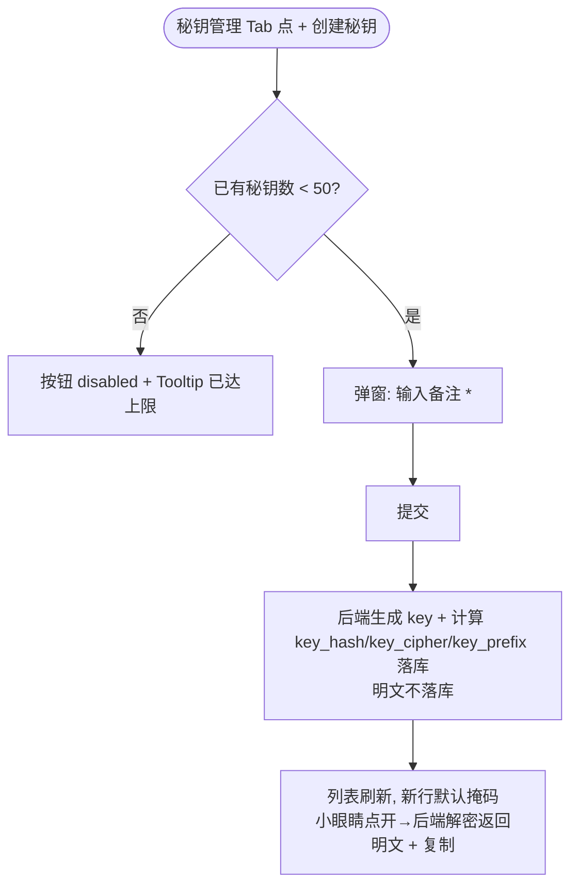

# AgentOps — Agent 优化 PRD（秘钥管理 + 体验/规则优化）

> 文档日期：2026-06-04　|　版本：v1.2　|　覆盖周期：S2（2026-04 ~ 2026-07）
> 父文档：[Agent 管理 PRD](./2026-05-11-Agent管理-PRD.md) · [工作空间管理 PRD](./2026-06-03-工作空间管理-PRD.md) · [S2 PRD](./2026-05-11-AgentOps-S2-PRD.md)
> 代码分支：`feature/2026-06-04/agent-optimization`（rd-agent-be / rd-agent-fe）
>
> **本 PRD 定位**：在 [Agent 管理 PRD v3.0](./2026-05-11-Agent管理-PRD.md) 基础上的一次**增量优化**，聚焦 7 项更改。本文为权威源；与父 PRD 冲突处以本文为准，落地后回填父 PRD。
>
> **v1.2 调整（2026-06-04，安全收紧）**：秘钥**一律加密存储，绝不存明文**。
> - **API 调用秘钥**：库里只存 `key_hash`（SHA-256，供 Bearer 认证比对）+ `key_cipher`（可逆密文，供小眼睛按需解密展示）+ `key_prefix`（掩码用）；**无明文列**。小眼睛点开时由后端**单条解密**返回明文，可复制；可反复查看。
> - **模型秘钥（`modelApiKey`）**：恢复 `SecretCipher` 加密入库（撤销 v1.1 明文）；小眼睛点开时后端解密返回；运行时调 LLM 前解密。
> - 撤销 v1.1 的"明文存库 / 列表直接返明文"全部表述，以本 v1.2 为准。
>
> **v1.1 调整（2026-06-04，已被 v1.2 撤销）**：~~秘钥改明文存储 + 小眼睛随时查看；模型秘钥同步明文~~（安全考虑回退，见 v1.2）。
>
> **v1.0 变更摘要（2026-06-04）**：
> 1. **新增「秘钥管理」Tab**：Agent 详情页增加秘钥管理 Tab，可创建 / 删除用于 API 调用的秘钥；创建时填**备注**、系统自动生成 **key**；单 Agent 最多 **50** 个。**秘钥加密存储（绝不存明文）**，列表行小眼睛点开由后端解密展示 + 复制（v1.2）。
> 1A. **模型秘钥（`modelApiKey`）加密存储**：创建 / 编辑 Agent 的 Step2 模型秘钥经 `SecretCipher` 加密落库；详情页 / 编辑态点小眼睛由后端解密展示 + 复制（v1.2，绝不存明文）。
> 2. **创建 Agent 流程不含秘钥步骤**：新建 Agent 表单不出现秘钥创建页（秘钥仅在详情页 Tab 内管理）。
> 3. **Agent 秘钥为 Agent 领域下的领域实体**：`AgentApiKey` 归属 Agent 聚合，不独立成模块。
> 4. **发布版本移除「影响等级」**：删除 `changeLevel`（PATCH/MINOR/MAJOR）字段；版本号改为**固定 patch +1** 自动递增（首版 v1.0.0）。
> 5. **Agent 名称唯一性改为「同空间内唯一」**：同一 `workspace_num` 内不可重名，跨空间允许重名（原为 per-owner 全局唯一）。
> 6. **创建 / 编辑 Agent 操作按钮固定底部**：下一步 / 上一步 / 保存 / 取消 / 完成 等按钮 sticky 到表单底部，不随内容滚动。
> 7. **对外 API 完备化 + 改走秘钥认证**：详情页「API 信息」Tab 的 4 个对外接口路径与后端对齐并补齐；这 4 个接口**不走登录态认证，改走秘钥认证**（`Authorization: Bearer <key>`）；站内调试台仍走独立的登录态内部接口。

---

## 1. 背景与目标

### 1.1 背景

Agent 管理模块当前形态（详见父 PRD v3.0）已支持配置模式 / A2A 模式的 CRUD、5 步表单、7 Tab 详情页与版本化闭环。本轮优化解决业务方在真实接入与日常使用中暴露的痛点：

- **缺少对外调用凭据自助管理**：对外 API 当前只有登录态（Cookie `session_token`）一种认证，业务系统无法以服务身份稳定调用 Agent；模型秘钥（`modelApiKey`）是 Agent 调 LLM 用的，与"别人调我 Agent"完全是两回事，二者不能混用。
- **发布心智负担**：每次发布都要选影响等级（patch/minor/major），对绝大多数微调场景是噪音。
- **多空间命名冲突**：工作空间上线后，名称 per-owner 全局唯一导致同一负责人在不同空间无法复用同名 Agent。
- **长表单按钮够不着**：5 步表单内容长，操作按钮随内容滚动，体验割裂。
- **API 文档与实际不符**：详情页 API 信息 Tab 展示的路径与后端实际路由不完全一致，业务方按文档接不通。

### 1.2 目标

| 目标 | 度量 |
| --- | --- |
| 对外可凭秘钥调用 | 业务方在详情页自助创建秘钥，用 `Bearer <key>` 调通 4 个对外接口，全程不需登录态 |
| 发布更轻 | 发布弹窗去掉影响等级，仅填备注即可发布；版本号自动 patch+1 |
| 多空间可复用命名 | 同名 Agent 可存在于不同工作空间；同空间内仍拦截重名 |
| 表单操作顺手 | 任意 Step 下，操作按钮始终可见（固定底部） |
| API 文档可信 | API 信息 Tab 的 4 接口路径、入参、cURL 与后端实际一致，复制即用 |

### 1.3 范围

**本轮做**

- 秘钥管理 Tab（创建 / 列表 / 删除 / 小眼睛按需解密查看 + 复制 / 50 上限）
- 模型秘钥（`modelApiKey`）加密存储 + 小眼睛按需解密查看
- `AgentApiKey` 领域实体 + 持久化 + 秘钥认证过滤器
- 发布流程移除影响等级，版本号固定 patch+1
- 名称唯一性收敛到 workspace 维度
- 创建 / 编辑表单 sticky footer
- 对外 4 接口路径对齐 + 秘钥认证；调试台保留独立登录态内部接口

**本轮不做**

- ❌ 秘钥的细粒度权限 / scope（按接口或按 Skill 限权）—— 本轮秘钥 = Agent 全量调用权
- ❌ 秘钥限流 / 配额 / 用量统计（计入后续）
- ❌ 秘钥过期时间 / 自动轮换（本轮只有手动删除）
- ❌ A2A Agent 的秘钥管理（A2A 调用由远端自管；本轮秘钥仅 CONFIG Agent）
- ❌ 历史版本号回溯重算（仅影响本轮之后的新发布）

---

## 2. 需求详述

### 2.1 秘钥管理（更改 1 / 2 / 3）

#### 2.1.1 功能概述

在 Agent 详情页新增「秘钥管理」Tab，提供 Agent 维度的 API 调用秘钥自助管理。秘钥用于**外部系统通过 API 调用本 Agent**（区别于 Step2 的 `modelApiKey`——那是本 Agent 调 LLM 用的）。

| 序号 | 功能点 | 简要说明 | 优先级 | 里程碑 |
| --- | --- | --- | --- | --- |
| 1.1 | 秘钥列表 | ProTable：备注 / 秘钥（默认掩码 `key_prefix****`，**小眼睛点开→后端单条解密展示 + [复制]**）/ 创建人 / 创建时间 / 最近使用时间 / 操作；按创建时间倒序 | S2-P0 | M2 |
| 1.2 | 创建秘钥 | 弹窗仅一个必填项**备注**；提交后系统自动生成 key | S2-P0 | M2 |
| 1.3 | 解密按需可见 | 列表行默认掩码；点小眼睛 → 调单条解密接口取明文 + [复制]；**可反复查看**（密文存库，明文不落库、不进列表批量返回） | S2-P0 | M2 |
| 1.4 | 删除秘钥 | 行操作 [删除] + 二次确认；删除后该 key 立即失效（再调用返回 401） | S2-P0 | M2 |
| 1.5 | 数量上限 | 单 Agent 最多 **50** 个有效秘钥；达上限时 [创建秘钥] 按钮 disabled + Tooltip "已达上限 50 个，请先删除部分秘钥" | S2-P0 | M2 |
| 1.6 | 空态 | 无秘钥时 Empty + "创建秘钥以通过 API 调用该 Agent" 引导 | S2-P1 | M2 |
| 1.7 | A2A 不展示 | A2A 模式 Agent 详情页不渲染秘钥管理 Tab（A2A 调用走远端，不适用） | S2-P0 | M2 |

#### 2.1.2 创建秘钥交互



> **备注**字段：必填，≤ 100 字，用于区分用途（如 "周报系统调用" / "测试脚本"）。
> **key 存储**：库里只存 `key_hash`（SHA-256，认证用）+ `key_cipher`（可逆密文，小眼睛解密用）+ `key_prefix`（掩码用）；**明文绝不落库**。小眼睛点开时后端单条解密 `key_cipher` 返回明文，可反复查看。存储与安全见 §2.1.3。

#### 2.1.3 秘钥格式与存储

| 项 | 设计 |
| --- | --- |
| 明文格式 | `ak-` 前缀 + 32 字节随机串（base62），如 `ak-7Qb3...`（总长约 46 字符）；前缀便于识别"这是 Agent 调用秘钥" |
| 存储（绝不存明文） | 三列：`key_hash`（SHA-256(明文)，**认证比对用**，唯一索引）+ `key_cipher`（`SecretCipher` 可逆加密的密文，**小眼睛解密展示用**）+ `key_prefix`（明文前 8 位，列表掩码用）。明文仅在创建那一刻于内存中生成，写库前即丢弃，**不落任何明文列** |
| 列表展示 | 默认 `key_prefix` + `****`；列表接口**不返回** `key_cipher`/明文 |
| 小眼睛查看 | 点小眼睛 → 调**单条解密接口**（按 keyNum）→ 后端解密 `key_cipher` 返回明文 → 前端展示 + 复制；可反复查看；接口走登录态 + workspace 成员校验 + 审计 |
| 认证 | 调用方传 `Authorization: Bearer ak-...` → 后端对收到的明文取 SHA-256 → 按 `key_hash = ?` 命中且未删除 → 校验该 key 归属 path/body 中的 `{agentNum}` → 放行 |
| 失效 | 删除即逻辑删除该行；命中失败返回 401 |

> 🔒 **安全说明**：秘钥（API 调用秘钥 + 模型秘钥）**一律加密存储，绝不落明文**。
> - 认证用 `key_hash`（单向，无需解密即可比对），小眼睛用 `key_cipher`（可逆，按需单条解密）——两者分离，认证链路不接触可逆密文。
> - 解密接口（小眼睛）必须经登录态 + workspace 成员校验，并记审计日志；列表/批量接口绝不返回 `key_cipher` 或明文。
> - `SecretCipher` 密钥经配置中心 / 环境变量下发，不硬编码、不入库；轮换 `SecretCipher` 密钥时需配套迁移已有 `key_cipher`。

#### 2.1.4 领域模型：`AgentApiKey`（更改 3）

> **强约束**（遵循 [VO/DTO/Domain 分层产出原则]）：`AgentApiKey` 是 **Agent 聚合下的领域实体**，归属 `domain/agent/` 包，不独立成领域；不存在独立 ApiKey 模块 / 顶层 Repository。

**领域分层落点（rd-agent-be）**

| 层 | 产出 | 路径（相对 `rd-agent-be-*/src/main/java/ink/garry/rd/agent/ws/`） |
| --- | --- | --- |
| domain | `AgentApiKey` 实体 | `domain/agent/AgentApiKey.java` |
| domain | `AgentApiKeyRepository` 接口 | `domain/agent/repository/AgentApiKeyRepository.java` |
| domain | key 生成 / 哈希领域服务 | `domain/agent/factory/AgentApiKeyFactory.java` |
| infra | Entity / Mapper / RepositoryImpl | `infra/agent/entity/AgentApiKeyEntity.java` 等 |
| application | 创建 / 删除 / 列表用例（返回 DTO） | `application/agent/AgentApiKeyCommandService.java` / `...QueryService.java` |
| adapter | Controller（返回 VO） | `adapter/agent/AgentApiKeyController.java` |
| adapter | 秘钥认证过滤器 | `adapter/security/ApiKeyAuthenticationFilter.java` |

> **JavaDoc**：所有新增类 / 字段 / 方法必须有完整 JavaDoc（遵循 [rd-agent-be JavaDoc 完整性] 规则）。

**`AgentApiKey` 字段**

| 字段 | 类型 | 说明 |
| --- | --- | --- |
| `id` | Long | 主键 |
| `num` | String | 业务编号（如 `AK-` 前缀） |
| `agentNum` | String | 归属 Agent 业务编号（外键到 agent.num） |
| `workspaceNum` | String | 冗余归属空间（随 Agent，便于隔离查询） |
| `remark` | String | 备注（用户输入，≤100） |
| `keyHash` | String | SHA-256(明文)，认证比对用（唯一索引） |
| `keyCipher` | String | `SecretCipher` 可逆密文，小眼睛解密展示用 |
| `keyPrefix` | String | 明文前 8 位，列表掩码展示用 |
| `lastUsedAt` | Timestamp | 最近一次成功认证时间（可空；异步更新，不阻塞调用） |
| `createNo` | String | 创建人工号 |
| `createTime` / `updateTime` | Timestamp | — |
| `deleted` | TinyInt | 逻辑删除 |

> 三列分工：`keyHash` 单向哈希走认证、`keyCipher` 可逆密文走小眼睛、`keyPrefix` 走列表掩码；**无任何明文列**。

**DB 迁移**：新增 Flyway `V13__agent_api_key.sql`（建表 `agent_api_key` + `uq_agent_api_key_hash(key_hash)` + `idx_agent_api_key_agent(agent_num, deleted)`）。

#### 2.1.5 创建 Agent 流程不含秘钥页（更改 2）

- 新建 Agent 5 步表单（`CreateForm.tsx`）**保持 5 步不变**，不插入任何"创建秘钥"步骤或页面。
- 秘钥的唯一入口是**详情页「秘钥管理」Tab**——即 Agent 必须先创建成功、进入详情页后才能管理秘钥。
- 现状确认：当前创建表单本就没有秘钥步骤；本条作为**显式约束固化**，防止后续误加。

#### 2.1.6 模型秘钥（`modelApiKey`）加密存储 + 小眼睛解密查看（更改 1A）

> 这里指 Step2「模型配置」里的 `modelApiKey`（本 Agent 调 LLM 用的凭据），不是 §2.1.1~§2.1.5 的 API 调用秘钥。本轮保留 `SecretCipher` 加密入库，**绝不存明文**；仅把详情/编辑态从"只展示 `***`、不可见"升级为"小眼睛点开由后端解密展示 + 复制"。

| 序号 | 功能点 | 简要说明 | 优先级 | 里程碑 |
| --- | --- | --- | --- | --- |
| 1.8 | 加密存储 | `ConfigSnapshot.modelApiKey` 经 `SecretCipher` 加密落库（保留原加密策略，绝不存明文） | S2-P0 | M2 |
| 1.9 | 编辑态可见 | 创建 / 编辑表单 Step2 模型秘钥旁加小眼睛：默认掩码；点开调解密接口取明文展示，可复制 | S2-P0 | M2 |
| 1.10 | 详情态可见 | 详情页「模型配置」Tab 模型秘钥默认 `***`；点小眼睛 → 后端解密返回明文 + [复制]（撤销原"仅展示 ***、不可见"） | S2-P0 | M2 |

**落地要点**
- 后端：写入仍经 `SecretCipher.encrypt`；详情/列表接口默认返回掩码，**不返回密文与明文**。
- 解密接口：新增按 agentNum + 版本/草稿维度的**单条模型秘钥解密接口**（走登录态 + workspace 校验 + 审计），供小眼睛取明文。
- 运行时：调 LLM 前 `SecretCipher.decrypt` 还原明文（既有逻辑保留）。
- 前端：`CreateForm.tsx` Step2 编辑态——新建时用户输入即明文（提交后加密）；编辑既有 Agent 时默认掩码，点小眼睛拉解密接口回显，可 [清空重填] 或复制。详情页模型配置 Tab 同样支持小眼睛解密 + 复制。
- 安全说明同 §2.1.3（加密存储、解密接口受控、审计）。


---

### 2.2 发布版本移除影响等级（更改 4）

#### 2.2.1 变更点

| 维度 | 变更前 | 变更后 |
| --- | --- | --- |
| 发布弹窗 | 「变更等级」Radio（PATCH/MINOR/MAJOR，默认 PATCH）+ 备注 | **仅**备注（≥10 字 ≤500 字）+ 配置 diff 预览 |
| 版本号递增 | 按 changeLevel 计算（patch/minor/major 位） | **固定 patch +1**；首版 v1.0.0 |
| 领域模型 | `ChangeLevel` 枚举 + `AgentVersion.changeLevel` 列 + `Version.next(level)` | 删除 `ChangeLevel`；`Version.next()` 无参，固定 patch+1 |
| 事件 | `AgentDomainEventDTO.changeLevel` | 移除该字段 |

#### 2.2.2 版本号规则（简化后）

| 场景 | 规则 | 示例 |
| --- | --- | --- |
| 首次发布 | 固定 `v1.0.0` | — |
| 后续发布 | `vX.Y.Z` → `vX.Y.(Z+1)` | v1.0.4 → v1.0.5 |
| 下线再上线 | 不递增（仅状态切换） | — |

#### 2.2.3 落地清单

**前端**（`rd-agent-fe`）
- `detail/index.tsx` 发布弹窗（约 L556-592）移除「变更等级」Radio.Group 及其 `changeLevel` 表单项与默认值。
- 版本管理 Tab 的 ProTable 移除「影响等级」列。
- 发布请求体不再带 `changeLevel`。

**后端**（`rd-agent-be`）
- 删除 `domain/agent/valueobject/ChangeLevel.java`。
- `client/agent/PublishParam.java` 移除 `changeLevel` 字段。
- `application/agent/AgentCommandService.publish()`：`Version.next(level)` → `Version.next()`（固定 patch+1）；首版 `Version.initial()` 仍为 1.0.0。
- `domain/agent/Version.java`：`next(ChangeLevel)` 改为无参 `next()`，内部 `patch+1`。
- `AgentVersion` 实体移除 `changeLevel`；`AgentDomainEventDTO` 移除 `changeLevel`。
- DB：`V13`（或合并到 api_key 迁移的 `V13`/独立 `V14`）`ALTER TABLE agent_version DROP COLUMN change_level`（保留历史数据兼容：DROP 前确认无下游强依赖；历史版本号不重算）。

> **兼容性**：历史已发布版本的版本号保持原样，不重算；仅本轮之后的新发布走固定 patch+1。

---

### 2.3 Agent 名称同空间内唯一（更改 5）

#### 2.3.1 规则

| 维度 | 变更前 | 变更后 |
| --- | --- | --- |
| 唯一性范围 | per-owner（同一 `ownerUserId` 全局唯一） | **per-workspace**（同一 `workspace_num` 内唯一） |
| 跨空间同名 | 不允许（同一负责人） | **允许** |
| 沙盒 / 已删除 | 不参与校验 | 不参与校验（不变） |

#### 2.3.2 落地清单

**后端**（`rd-agent-be`）
- `application/agent/AgentCommandService.create()`（约 L74-96）：唯一性校验由 `existsByOwnerAndName(operatorId, name)` 改为 `existsByWorkspaceAndName(workspaceNum, name)`；`workspaceNum` 取自 `WorkspaceContextHolder`（创建时已注入，见父 [工作空间管理 PRD](./2026-06-03-工作空间管理-PRD.md)）。
- `domain/agent/repository`（及 `infra/agent/gateway/AgentReadGatewayImpl`）：新增 `existsByWorkspaceAndName(workspaceNum, name)`，查询条件 `workspace_num = ? AND name = ? AND deleted = 0 AND sandbox = 0`。
- 命名冲突错误文案：`Agent 名称在当前工作空间内已存在`。
- **编辑 / 发布**同样按 workspace 维度校验（改名时）。

**前端**（`rd-agent-fe`）
- `CreateForm.tsx` 名称字段可加**异步唯一性校验**（失焦时调后端 check 接口，命中提示"当前空间内已存在"）；非必须，后端为唯一权威校验。

> **数据层**：`workspace` 表已有 `uq_workspace_creator_name(create_no,name,deleted)` 约束针对 workspace 本身；本条针对 **agent** 表，建议在 `agent` 表加部分唯一约束 `uq_agent_ws_name(workspace_num, name, deleted)` 兜底（应用层校验 + DDL 约束双保险）。

---

### 2.4 创建 / 编辑表单按钮固定底部（更改 6）

#### 2.4.1 规则

- 创建 Agent（`CreateForm.tsx`，5 步 StepsForm）与编辑 Agent（版本编辑 Drawer）的操作按钮区——**上一步 / 下一步 / 取消 / 保存草稿 / 完成接入 / 发布**——统一固定（`position: sticky; bottom: 0`）到表单容器底部。
- 表单内容区域可独立滚动；按钮区始终可见，带顶部分隔线 / 轻投影区分滚动内容。
- 适用范围：配置模式 5 步表单的每一步、版本编辑 Drawer、A2A 接入表单。

#### 2.4.2 落地

- 现状：`CreateForm.tsx` 用 `@ant-design/pro-components` 的 `StepsForm`，`submitter` 渲染在每步底部但随内容滚动。
- 方案：自定义 `StepsForm` 的 `submitter.render`，将按钮渲染进一个 sticky footer 容器（或外层包裹固定底栏 + 内容区 `overflow:auto`）；Drawer 场景用 Antd Drawer 的 `footer` 属性天然固定。
- 验收：表单内容超过一屏时，滚动内容操作按钮不消失。

---

### 2.5 对外 API 完备化 + 秘钥认证（更改 7）

#### 2.5.1 对外 4 接口（完备化）

详情页「API 信息」Tab 对外暴露且文档化的接口固定为以下 4 个，**路径与后端实际路由对齐**，对外统一走 RESTful 风格：

| # | 接口 | Method | 对外路径 | 说明 |
| --- | --- | --- | --- | --- |
| 1 | 调用 Agent | POST | `/api/v1/agents/{num}/invoke` | SSE 流式；body 见 §2.5.4 |
| 2 | 创建会话 | POST | `/api/v1/agents/{num}/sessions` | 起新会话，返回 sessionId |
| 3 | 查询会话列表 | GET | `/api/v1/agents/{num}/sessions` | 分页查会话 |
| 4 | 查询会话详情 | GET | `/api/v1/agents/{num}/sessions/{sessionId}` | 含消息链 |

> **现状差异（需对齐）**：后端当前会话接口实际路由是 `POST /api/v1/session/command/create`、`POST /api/v1/session/query/list`、`GET /api/v1/session/query/detail`、`GET /api/v1/session/query/messages`，与 API 信息 Tab 展示的 RESTful 路径不一致，导致业务方"照文档接不通"。
>
> **方案**：新增/对齐一组**对外 RESTful 端点**（上表 4 个）作为对外契约，挂在秘钥认证链路下；内部既有 `session/command/*`、`session/query/*` 路由保留给调试台（登录态）。即"对外契约"与"站内调试"两套入口，路径与认证都分离。

#### 2.5.2 认证：4 接口走秘钥，不走登录态

| 维度 | 调试台（站内） | 对外 4 接口 |
| --- | --- | --- |
| 入口路径 | `session/command/*`、`session/query/*`、`agents/{num}/invoke`（内部调用） | `agents/{num}/invoke`、`agents/{num}/sessions...`（对外契约） |
| 认证 | **登录态**（Cookie `session_token`，JWT）+ RBAC + workspace header | **秘钥认证**（`Authorization: Bearer ak-...`），**不要求登录态** |
| 适用 | 平台内用户在调试台手动调试 | 外部业务系统服务化调用 |

> 按本轮决策：**调试台走独立的登录态内部接口**，不复用对外秘钥接口；对外 4 接口对登录态"透明"——有没有 Cookie 都不影响，只认 Bearer 秘钥。

#### 2.5.3 秘钥认证过滤器（后端）

新增 `adapter/security/ApiKeyAuthenticationFilter`，置于 `JwtAuthenticationFilter` 之前或并行：

```mermaid
sequenceDiagram
    participant Caller as 外部调用方
    participant F as ApiKeyAuthenticationFilter
    participant Repo as AgentApiKeyRepository
    participant Ctx as Workspace/UserContext
    participant Ctrl as Agent 对外 Controller

    Caller->>F: POST /api/v1/agents/{num}/invoke<br/>Authorization: Bearer ak-...
    F->>F: 仅拦截对外 4 路径; 提取 Bearer key
    alt 缺失 / 非 ak- 前缀
        F-->>Caller: 401 缺少有效秘钥
    else
        F->>F: SHA-256(收到的明文)
        F->>Repo: findByKeyHash(hash, deleted=0)
        alt 未命中
            F-->>Caller: 401 秘钥无效
        else 命中
            F->>F: 校验 key.agentNum == path {num}
            alt 不匹配
                F-->>Caller: 403 秘钥与该 Agent 不匹配
            else
                F->>Ctx: 注入 workspaceNum=key.workspaceNum<br/>调用主体=该秘钥(系统身份)
                F->>Repo: 异步更新 last_used_at
                F->>Ctrl: 放行
            end
        end
    end
```

**关键点**
- 过滤器**只拦截对外 4 个路径**；其余路径（调试台 / 管理后台）不受影响，仍走登录态。
- 秘钥隐含归属：key → agentNum → workspaceNum → 调用上下文，无需调用方再传 workspace header。
- `app.auth.disable-auth=true`（本地 dev）对秘钥链路同样可短路，便于本地联调。
- 401/403 错误用统一 BizCode（建议：`2017 API_KEY_MISSING` / `2018 API_KEY_INVALID` / `2019 API_KEY_AGENT_MISMATCH`）。

#### 2.5.4 invoke 请求体（沿用父 PRD §6.8.1）

| 字段 | 类型 | 必填 | 说明 |
| --- | --- | --- | --- |
| `input` | string \| object | 是 | text 模式字符串；JSON 模式对象 |
| `input_type` | "text" \| "json" | 是 | 输入模式 |
| `skill_hint` | string | 否 | 强制注入的 skill_name（仅 CONFIG） |
| `session_id` | string | 否 | 不传则起新会话 |

#### 2.5.5 API 信息 Tab 展示（前端）

- 4 个接口的 Method / 路径 / 说明 / 入参表，**cURL 示例的认证头从 `Bearer <登录 token>` 改为 `Bearer ak-<你的秘钥>`**，并加引导文案"秘钥在『秘钥管理』Tab 创建"。
- cURL 占位用真实 host + 真实 `{num}`，点 [复制] 即用。
- A2A 模式 API 信息 Tab 保留（A2A 调用层一致），但**不展示秘钥相关引导**（A2A 不在本轮秘钥范围）。

---

## 3. 详情页 Tab 结构变化

**配置模式（CONFIG）：7 → 8 个 Tab**

| Tab | 变化 |
| --- | --- |
| 基本信息 | 不变 |
| 模型配置 | **改**：`modelApiKey` 加密存储；默认掩码 `***`，小眼睛点开后端解密 + 复制（v1.2） |
| Skill 配置 | 不变 |
| MCP 配置 | 不变 |
| 高级配置 | 不变 |
| API 信息 | **改**：4 接口路径对齐 + cURL 改 Bearer 秘钥 + 引导 |
| **秘钥管理** | **新增**：创建 / 列表 / 删除 / 50 上限 |
| 版本管理 | **改**：移除「影响等级」列 |

**A2A 模式：5 个 Tab 不变**（不新增秘钥管理 Tab）。

---

## 4. 原型图

### 4.1 秘钥管理 Tab

```
┌─ Agent 详情 — 研发周报助手 ───────────────────────────────────────────────┐
│ … [基本信息][模型配置][Skill配置][MCP配置][高级配置][API信息][秘钥管理][版本管理] │
│                                                            ━━━━━━━━━        │
│ 秘钥管理                                              [+ 创建秘钥]  (3/50)  │
│ ┌──────────────────────────────────────────────────────────────────────┐ │
│ │ 备注            │ 秘钥                    │ 创建人 │ 创建时间         │ 最近使用 │ 操作  │ │
│ │────────────────│────────────────────────│───────│─────────────────│─────────│──────│ │
│ │ 周报系统调用     │ ak-7Qb3****  👁 📋      │ 10001 │ 2026-06-04 10:00│ 06-04…  │ [删除]│ │
│ │ 测试脚本        │ ak-9Lm2f9Kd...c1Ze 👁 📋 │ 10001 │ 2026-06-04 11:20│ —       │ [删除]│ │  ← 已点开小眼睛(后端解密)
│ │ CI 集成         │ ak-2Xc8****  👁 📋      │ 10003 │ 2026-06-04 14:05│ 06-04…  │ [删除]│ │
│ └──────────────────────────────────────────────────────────────────────┘ │
└────────────────────────────────────────────────────────────────────────────┘
```

> 👁 小眼睛点开调单条解密接口取明文、📋 复制；默认掩码，可反复查看（密文存库，明文不落库）。

### 4.2 创建秘钥弹窗

```
┌─ 创建秘钥 ─────────────────────┐
│ 备注 *  [周报系统调用________] │
│         ≤100 字                │
│                                │
│            [取消]  [生成秘钥]   │
└────────────────────────────────┘
   生成后直接回列表，新行小眼睛点开由后端解密查看明文（无"仅此一次"弹窗）
```

### 4.2A 模型配置 Tab 秘钥小眼睛（更改 1A）

```
┌─ 模型配置 ───────────────────────────────────────────────┐
│   模型           claude-opus-4-7                          │
│   模型秘钥       ••••••••••••  👁 📋   （点 👁 → 后端解密 sk-xxxx）│
│   模型 URL 地址  https://llm-proxy.garry.internal/v1        │
│   温度           0.7                                      │
└────────────────────────────────────────────────────────────┘
```

### 4.3 发布弹窗（移除影响等级后）

```
┌─ 发布新版本 ─────────────────────────────────┐
│ 新版本号：v1.0.4 → v1.0.5  (自动 patch +1)    │
│                                              │
│ 发布备注 *  [本次微调了系统提示词……]          │
│             ≥10 字 ≤500 字                    │
│                                              │
│ ▸ 配置 diff 预览（草稿 vs 当前在线）          │
│                                              │
│                        [取消]  [确认发布]     │
└───────────────────────────────────────────────┘
```

### 4.4 表单 sticky footer

```
┌─ 新建 Agent (配置模式) ──────────────────────┐
│ ① 基本信息 → ② 模型配置 → ③ Skill → ④ MCP → ⑤ 高级 │
│ ┌──────────────────────────────────────────┐ │
│ │ (内容区，可滚动) …                          │ │ ← overflow:auto
│ │ …                                          │ │
│ └──────────────────────────────────────────┘ │
│ ───────────────────────────────────────────  │ ← sticky 分隔线
│                    [上一步]  [下一步 →]        │ ← 固定底部，始终可见
└────────────────────────────────────────────────┘
```

---

## 5. 数据模型变更汇总

| 表 | 变更 | 迁移脚本 |
| --- | --- | --- |
| `agent_api_key`（新增） | 见 §2.1.4 字段表 + `uq_agent_api_key_hash(key_hash)` + `idx_agent_api_key_agent` | `V13__agent_api_key.sql` |
| `agent_version` | DROP COLUMN `change_level` | `V14__drop_change_level.sql` |
| `agent` | 加部分唯一约束 `uq_agent_ws_name(workspace_num, name, deleted)`（兜底同空间唯一） | `V15__agent_ws_name_unique.sql` |
| `agent`（`config_snapshot.modelApiKey`） | 无表结构变更；保留 `SecretCipher` 加密存储；新增解密接口供小眼睛（更改 1A） | — |

> 迁移脚本编号顺延当前最大 `V12`；按 [工作空间管理 PRD] 落库实践，Flyway 未挂运行时，迁移手工应用到各环境（dev/test/...）。

---

## 6. 关键状态与异常

| 场景 | 处理 |
| --- | --- |
| 创建秘钥达 50 上限 | 按钮 disabled + Tooltip；后端兜底返回 `API_KEY_LIMIT_EXCEEDED` |
| 查看秘钥明文 | 小眼睛点开调单条解密接口（登录态 + workspace 校验 + 审计）；解密 `key_cipher` 返回，可反复查看；明文不落库 |
| 删除秘钥后调用 | 401 `API_KEY_INVALID` |
| 秘钥与 Agent 不匹配 | 403 `API_KEY_AGENT_MISMATCH`（用 A Agent 的 key 调 B Agent） |
| 对外接口缺 Bearer | 401 `API_KEY_MISSING`（不回落登录态） |
| 同空间内重名创建 | 422 / BizException "名称在当前工作空间内已存在" |
| 跨空间同名创建 | 正常放行 |
| 发布时无影响等级字段 | 仅校验备注；版本号自动 patch+1 |
| A2A Agent 详情页 | 不渲染秘钥管理 Tab |

---

## 7. 验收标准

### 7.1 秘钥管理
- [ ] 详情页（CONFIG）出现「秘钥管理」Tab；A2A 不出现
- [ ] 创建秘钥仅需填备注；列表默认掩码，小眼睛点开后端解密展示 + 复制，可反复查看
- [ ] 秘钥**绝不存明文**：库内仅 `key_hash` + `key_cipher` + `key_prefix`；解密接口经登录态 + workspace 校验 + 审计；列表/批量接口不返回密文或明文
- [ ] 单 Agent 满 50 个后无法再建（前端禁用 + 后端拦截）
- [ ] 删除秘钥后该 key 立即失效
- [ ] `AgentApiKey` 落在 `domain/agent/` 下，含完整 JavaDoc；不存在独立 ApiKey 模块
- [ ] 模型秘钥（`modelApiKey`）`SecretCipher` 加密存储；创建/编辑/详情态小眼睛点开后端解密 + 复制

### 7.2 创建流程
- [ ] 新建 Agent 5 步表单不含任何秘钥创建步骤 / 页面

### 7.3 发布
- [ ] 发布弹窗无「影响等级」；仅备注必填
- [ ] 新版本号 = 当前 patch +1；首版 v1.0.0
- [ ] `ChangeLevel` 枚举 / `change_level` 列 / 事件字段全部移除，编译与运行无残留引用

### 7.4 命名唯一性
- [ ] 同一工作空间内不可建同名 Agent
- [ ] 不同工作空间可建同名 Agent
- [ ] 后端 + DB 双层约束生效

### 7.5 表单按钮
- [ ] 5 步表单 / 编辑 Drawer 内容超一屏时，操作按钮固定底部始终可见

### 7.6 对外 API + 秘钥认证
- [ ] API 信息 Tab 4 接口路径与后端对齐，cURL 用 `Bearer ak-...` 占位且复制即用
- [ ] 用有效秘钥 + `Authorization: Bearer ak-...` 可调通 4 接口，全程无登录态
- [ ] 无秘钥 / 错秘钥 → 401/403，不回落登录态
- [ ] 调试台仍通过独立登录态内部接口正常工作，不受秘钥链路影响

---

## 8. 落地影响清单（给技术方案）

**rd-agent-fe**
- `src/pages/Agents/detail/index.tsx`：新增秘钥管理 Tab；发布弹窗移除 changeLevel；版本管理 Tab 移除影响等级列
- `src/pages/Agents/detail/ApiKeyTab.tsx`（新增）：秘钥列表 / 创建弹窗 / **小眼睛点开调解密接口取明文 + 复制** / 删除
- `src/pages/Agents/detail/ModelCfgTab`（详情模型配置）：模型秘钥默认掩码 + 小眼睛调解密接口取明文 + 复制
- `src/pages/Agents/detail/ApiInfoTab.tsx`：4 接口路径对齐 + cURL 改 Bearer 秘钥 + 引导文案
- `src/pages/Agents/components/CreateForm.tsx`：sticky footer；Step2 模型秘钥新建态明文输入（提交即加密）/ 编辑态小眼睛解密回显；可选名称异步唯一性校验
- `src/services/agent/*`：新增秘钥 CRUD + 单条解密 service；发布参数去 changeLevel
- `src/types/agent.ts`：新增 `AgentApiKey` 类型；`PublishParam` 去 changeLevel

**rd-agent-be**
- domain：新增 `AgentApiKey`（含 `keyHash`/`keyCipher`/`keyPrefix`）+ Repository（`findByKeyHash` / `countByAgent`）+ Factory（生成 key + 算 hash/cipher/prefix）；删除 `ChangeLevel`；`Version.next()` 无参
- infra：`AgentApiKeyEntity`/Mapper/RepositoryImpl；`existsByWorkspaceAndName`；**`modelApiKey` 保留 `SecretCipher` 加解密**（运行时调 LLM 前解密，既有逻辑保留）；秘钥 `SecretCipher` 加解密落 infra
- application：`AgentApiKeyCommandService`/`QueryService`（含单条解密用例 + 审计）；模型秘钥单条解密用例；`AgentCommandService` 改唯一性校验 + publish 去 changeLevel
- adapter：`AgentApiKeyController`（VO，含解密接口走登录态）；模型秘钥解密接口；`ApiKeyAuthenticationFilter`（SHA-256 → `findByKeyHash` 比对）；对外 RESTful `agents/{num}/sessions...` 端点；`WebMvcConfig` 注册过滤器路径
- client：`PublishParam` 去 changeLevel
- DB：`V13`~`V15` 迁移

---

## 附：关联文档

- [Agent 管理 PRD（父）](./2026-05-11-Agent管理-PRD.md)
- [工作空间管理 PRD](./2026-06-03-工作空间管理-PRD.md)
- [调试台 PRD](./2026-05-11-调试台-PRD.md)
- [Agent 管理 - 技术方案](../技术方案/2026-05-11_Agent管理-技术方案.md)
- [工作空间管理 - 技术方案](../技术方案/2026-06-03_工作空间管理-技术方案.md)
