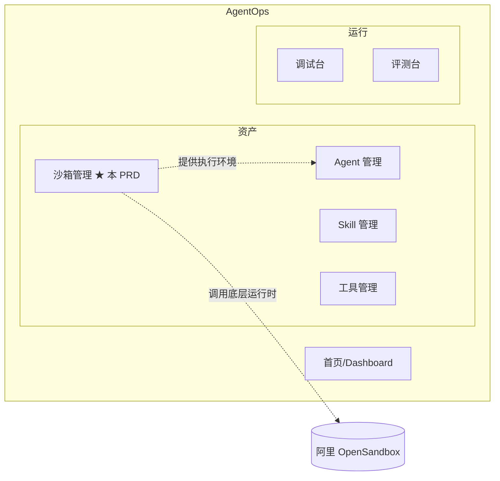
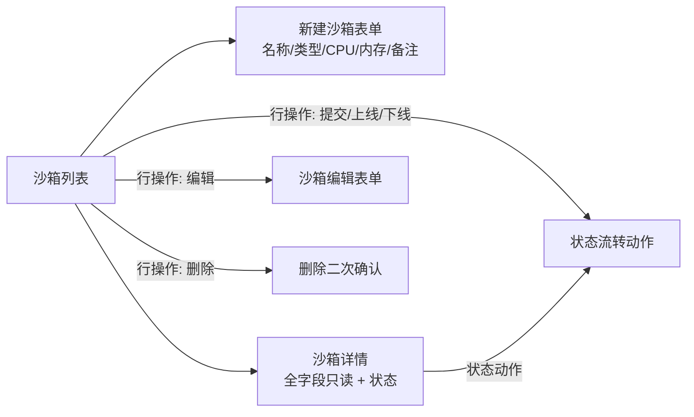
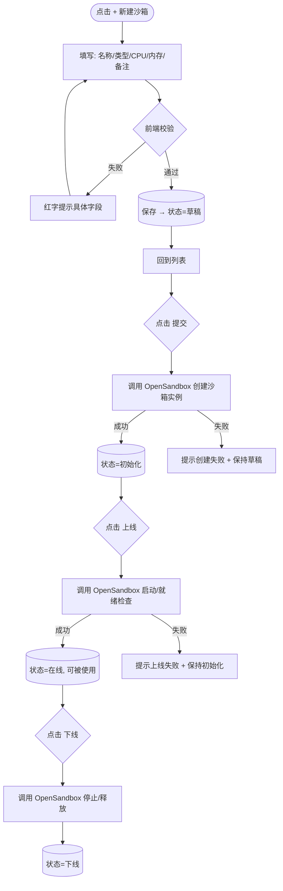
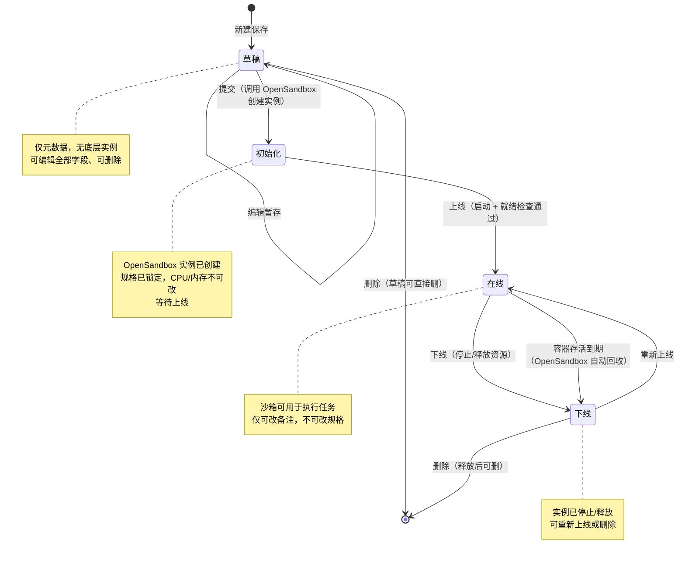
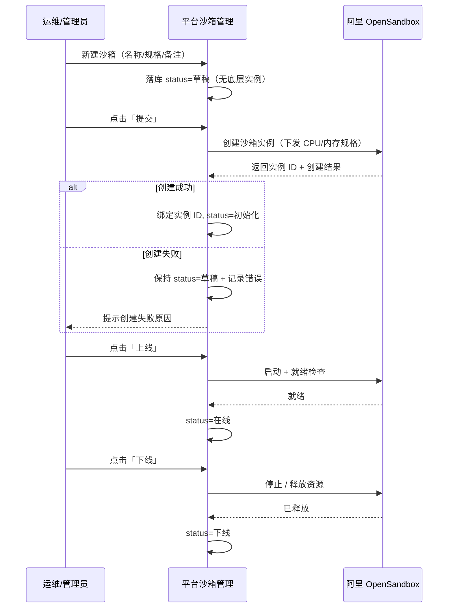
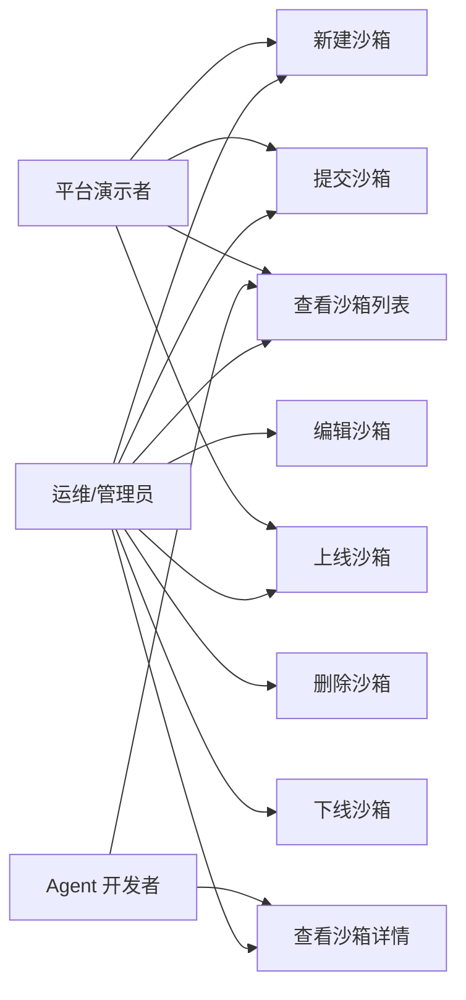

# AgentOps — 沙箱管理 PRD

> 文档日期：2026-06-08　|　版本：v1.0　|　覆盖周期：S2（2026-04 ~ 2026-07）
> 父文档：[S2 PRD](./2026-05-11-AgentOps-S2-PRD.md) · [S2 规划](../总体规划/2026-05-11-AgentOps-S2规划.md)
> 兄弟文档：[Agent 管理 PRD](./2026-05-11-Agent管理-PRD.md) · [Skill 管理 PRD](./2026-05-11-Skill管理-PRD.md) · [工具管理 PRD](./2026-06-01-工具管理-PRD.md) · [工作空间管理 PRD](./2026-06-03-工作空间管理-PRD.md)

---

## 1. 产品/需求背景

### 1.1 为什么要做

平台 Agent 在执行"代码生成 / 代码执行 / 命令运行"类任务时，需要一个隔离、可弹性伸缩、可销毁的执行环境，避免直接在平台运行时进程内执行不可信代码带来的安全与稳定性风险。目前平台缺少对执行沙箱的统一承载与可视化管理，沙箱资源（CPU / 内存）只能由后端硬编码分配，运维与开发无法按需创建、调整或回收。

本模块引入阿里巴巴 **OpenSandbox** 作为底层沙箱运行时，在平台侧提供一层目录化的沙箱资产管理能力，让用户可以像管理 Agent / 工具一样地新增、查看、修改、删除沙箱，并清晰地观察其生命周期状态。

### 1.2 解决什么问题

- **统一承载执行环境**：把散落的代码执行环境收敛为平台内可见、可管的"沙箱"资产；
- **资源可配置**：CPU（按 0.5 核为单位）、内存（MB）由用户按需声明，而非后端写死；
- **生命周期可观测**：草稿 → 初始化 → 在线 → 下线 四态可视，运维能直观判断哪些沙箱可用；
- **降低对接门槛**：屏蔽 OpenSandbox 的底层创建 / 销毁细节，用户只填业务属性即可拉起一个代码沙箱。

### 1.3 面向用户

- **平台运维 / 管理员**：按业务需要创建并配置沙箱、调整规格、回收闲置沙箱；
- **Agent 开发者**：了解可用沙箱及其规格，为需要代码执行能力的 Agent 选择合适的执行环境；
- **平台演示者**：现场演示"创建一个代码沙箱 → 提交 → 上线可用"的完整生命周期。

### 1.4 与 OpenSandbox 的边界

- **OpenSandbox**：底层沙箱运行时，负责真实的容器创建、资源限额、销毁等；
- **本模块**：平台侧管理面，负责沙箱元数据（名称 / 类型 / 规格 / 状态 / 备注）的 CRUD、状态流转触发，以及对 OpenSandbox 的调用编排；
- 平台**不重新实现**沙箱运行时，仅作为 OpenSandbox 的管理与编排层。

---

## 2. 目标与范围

### 2.1 S2 目标

| 目标 | 度量 |
| --- | --- |
| 沙箱可管 | 沙箱的增 / 删 / 查 / 改 4 项能力全部 GA |
| 运行时打通 | 沙箱"提交 / 上线 / 下线"动作真实调用 OpenSandbox 成功 |
| 规格可配 | CPU（0.5 核步进）与内存（MB）可由用户声明并下发到 OpenSandbox |
| 状态可观测 | 草稿 → 初始化 → 在线 → 下线 四态在列表与详情清晰可见 |

### 2.2 范围

**S2 内做**

- 沙箱 CRUD（新增 / 查看 / 编辑 / 删除）
- 沙箱列表（名称 / 类型 / CPU / 内存 / 状态 / 备注 / 操作）
- 沙箱字段：名称、类型（代码沙箱）、CPU、内存、状态、备注
- 四态生命周期机：草稿 → 初始化 → 在线 → 下线，及对应触发动作（提交 / 上线 / 下线）
- 基于 OpenSandbox 的沙箱创建（提交）/ 上线 / 下线编排
- 规格校验（CPU 0.5 核步进、内存 MB 正整数、备注 ≤100 字）

**S2 内不做**

- ❌ 沙箱类型扩展（本期仅"代码沙箱"一种类型，其他类型 S3 评估）
- ❌ 沙箱与 Agent 的强绑定挂载（Agent 选择沙箱的入口 S3 评估，本期只做沙箱资产管理）
- ❌ 沙箱内运行日志 / 监控大盘（资源使用率、调用次数等观测 S3 评估）
- ❌ 沙箱自动伸缩 / 弹性扩容策略
- ❌ 沙箱镜像 / 运行环境自定义（预装依赖、基础镜像选择）
- ❌ 多版本沙箱配置与历史版本回溯
- ❌ 沙箱配额 / 费用治理

---

## 3. 系统线框图（必选，优先产出）

### 3.1 沙箱管理在平台中的位置



> ★ 标记为本 PRD 新增模块。沙箱管理与 Agent 管理 / Skill 管理 / 工具管理 同列在"资产"侧导航分组下，作为 Agent 可用执行环境的统一目录。

### 3.2 沙箱管理内部页面结构



### 3.3 主要页面/模块说明

| 页面/模块 | 职责 | 主要元素 |
| --- | --- | --- |
| 沙箱列表 | 所有沙箱的入口；支持按类型/状态/关键字筛选 | ProTable + 新建按钮 + 类型标签 + 状态胶囊 + 规格列 |
| 新建沙箱表单 | 录入名称/类型/CPU/内存/备注，保存为草稿 | 表单（名称、类型选择、CPU 步进器、内存输入、备注） |
| 沙箱编辑表单 | 修改沙箱属性（受状态约束，详见 §7.4） | 同新建表单 + 状态 Banner |
| 沙箱详情 | 全字段只读 + 当前状态 + 状态流转操作 | 字段卡片 + 状态时间线 + 操作按钮 |
| 状态流转动作 | 提交 / 上线 / 下线 触发，调用 OpenSandbox | 行操作按钮 + 进行中态 Loading + 结果反馈 |

> **信息架构一致性**：本节定义的页面边界与 §7 功能需求、§8 详细原型图、§5 用例图一一对应。

---

## 4. 业务流程图（必选）

### 4.1 沙箱创建与上线主流程



### 4.2 沙箱生命周期状态机



> **状态机说明（v1.0）**：
> - **草稿**：仅平台侧元数据，尚未在 OpenSandbox 创建任何实例；可自由编辑、删除。
> - **初始化**：触发"提交"动作后调用 OpenSandbox 创建沙箱实例，规格（CPU/内存）随之锁定到底层，不可再改。
> - **在线**：沙箱已就绪、可被使用；此态仅允许修改备注。容器运行满 `aliveMinutes` 后由 OpenSandbox 自动回收，平台感知后流转为下线。
> - **下线**：实例已停止并释放底层资源；可"重新上线"回到在线，或删除。
> - **删除约束**：草稿可直接删；在线态需先下线再删（避免误删正在使用的沙箱）；初始化态删除需先释放底层实例（详见 §7.4）。

### 4.3 OpenSandbox 调用编排时序



---

## 5. 用例图（必选）

### 5.1 参与者与用例



### 5.2 用例说明与权限边界

| 用例 | 含义 | 谁能做 |
| --- | --- | --- |
| 查看沙箱列表 | 浏览全部沙箱，含筛选 | 全部角色 |
| 查看沙箱详情 | 全字段只读 + 状态信息 | 全部角色 |
| 新建沙箱 | 录入字段并保存为草稿 | 运维/管理员、平台演示者 |
| 编辑沙箱 | 修改字段（受状态约束，§7.4） | 运维/管理员 |
| 删除沙箱 | 删除沙箱（受状态约束，§7.4） | 运维/管理员 |
| 提交沙箱 | 草稿 → 初始化，调用 OpenSandbox 创建实例 | 运维/管理员 |
| 上线沙箱 | 初始化 → 在线 | 运维/管理员 |
| 下线沙箱 | 在线 → 下线，释放底层资源 | 运维/管理员 |

---

## 6. 用户与场景

| 角色 | 典型场景 |
| --- | --- |
| **运维/管理员** | 按业务需要创建代码沙箱、设定 CPU/内存规格、提交并上线；回收闲置沙箱 |
| **Agent 开发者** | 查看平台有哪些可用沙箱及其规格，判断是否满足自己 Agent 的代码执行需求 |
| **平台演示者** | 现场演示"创建代码沙箱 → 提交 → 上线"完整生命周期闭环 |

**用户故事**

- 作为 **运维/管理员**，我希望新建一个名为"Python 代码执行环境"的代码沙箱，分配 1.5 核 CPU、2048 MB 内存，保存后再提交并上线，让它进入可用状态。
- 作为 **运维/管理员**，我希望对一个长期闲置的在线沙箱执行"下线"，释放底层 OpenSandbox 资源，需要时再"重新上线"。
- 作为 **运维/管理员**，我希望在沙箱列表上一眼看到每个沙箱的规格（CPU/内存）和当前状态（草稿/初始化/在线/下线）。
- 作为 **Agent 开发者**，我希望查看某个在线沙箱的详情，确认它的内存够不够我跑数据处理脚本。

---

## 7. 功能需求

> 优先级标注 **S2-P0/P1/P2**；里程碑 M1=2026-06-08、M2=2026-07-06、M3=2026-07-31。功能点须与 §3 系统线框图、§4 业务流程图、§5 用例图一一对应。

### 7.1 沙箱字段定义（v1.0 权威源）

| 字段 | 类型 | 必填 | 约束 | 说明 |
| --- | --- | --- | --- | --- |
| **`num`** | string | 系统生成 | 前缀 `SBX...`；全局唯一 | 业务编号；URL / 关联引用使用 |
| **`name`** | string | ✓ | ≤64 字符；同工作空间内唯一 | 沙箱名称；列表展示 |
| **`type`** | enum | ✓ | 本期固定 `CODE`（代码沙箱） | 沙箱类型；本期仅一种，UI 默认选中且可见但不可改其它值 |
| **`cpu`** | number | ✓ | ≥0.5；**0.5 的整数倍**（0.5 / 1.0 / 1.5 …）；上限 16 核 | CPU 核数；以 0.5 核为步进单位 |
| **`memory`** | int | ✓ | 正整数，单位 MB；区间 [128, 65536]；建议 128 的整数倍 | 内存大小（MB） |
| **`aliveMinutes`** | int | ✓ | 正整数，单位分钟；区间 [1, 1440]（最长 24h） | 沙箱容器存活时间；从上线（容器就绪）起算，到点由 OpenSandbox 回收容器 |
| **`status`** | enum | 系统派生 | `DRAFT` / `INITIALIZED` / `ONLINE` / `OFFLINE` | 状态；详见 §4.2，对应 草稿 / 初始化 / 在线 / 下线 |
| **`remark`** | string | 可选 | ≤100 字符 | 备注 |
| **`sandboxInstanceId`** | string | 系统派生 | 初始化成功后由 OpenSandbox 返回 | 底层 OpenSandbox 实例 ID；草稿态为空 |
| **`createdBy` / `createdAt` / `updatedBy` / `updatedAt`** | — | 系统派生 | — | 审计字段 |

> **状态枚举与中文对照**：`DRAFT`=草稿、`INITIALIZED`=初始化、`ONLINE`=在线、`OFFLINE`=下线。

### 7.2 沙箱列表与基础功能

| 序号 | 功能点 | 简要说明 | 优先级 | 里程碑 |
| --- | --- | --- | --- | --- |
| 2.1 | 沙箱列表 | ProTable：num / 名称 / 类型标签 / CPU / 内存 / 存活时间 / 状态胶囊 / 备注 / 创建人 / 更新时间 / 操作 | S2-P0 | M1 |
| 2.2 | 列表筛选 | 类型 / 状态 / 关键字（搜 num + 名称 + 备注） | S2-P0 | M1 |
| 2.3 | 新建沙箱入口 | 顶部 `+ 新建沙箱` 按钮 → 弹表单 → 保存为草稿 | S2-P0 | M1 |
| 2.4 | 沙箱详情 | 全字段只读展示 + 当前状态 + 状态流转操作 | S2-P1 | M2 |
| 2.5 | 编辑沙箱 | 按状态约束编辑（详见 §7.4） | S2-P0 | M1 |
| 2.6 | 删除沙箱 | 按状态约束删除 + 二次确认（详见 §7.4） | S2-P0 | M1 |
| 2.7 | 列表空态 | Empty + "新建沙箱" 引导 | S2-P0 | M1 |
| 2.8 | 状态胶囊展示 | 草稿（灰）/ 初始化（蓝）/ 在线（绿）/ 下线（橙）色彩区分 | S2-P0 | M1 |

### 7.3 沙箱状态流转动作

| 序号 | 功能点 | 简要说明 | 优先级 | 里程碑 |
| --- | --- | --- | --- | --- |
| 3.1 | 提交（初始化） | 草稿态行操作 `提交` → 调用 OpenSandbox 创建实例 → 成功后 status=初始化 + 绑定实例 ID；失败保持草稿并提示 | S2-P0 | M2 |
| 3.2 | 上线 | 初始化态行操作 `上线` → 调用 OpenSandbox 启动 + 就绪检查 → 成功后 status=在线；失败保持初始化 | S2-P0 | M2 |
| 3.3 | 下线 | 在线态行操作 `下线` → 二次确认 → 调用 OpenSandbox 停止/释放 → status=下线 | S2-P0 | M2 |
| 3.4 | 重新上线 | 下线态行操作 `重新上线` → 重新调用 OpenSandbox 启动 → status=在线 | S2-P1 | M2 |
| 3.5 | 动作进行中态 | 调用 OpenSandbox 期间按钮 Loading + 行状态显示"处理中"，避免重复触发 | S2-P1 | M2 |

### 7.4 编辑与删除的状态约束

> 沙箱一旦初始化（在 OpenSandbox 创建了实例），规格即锁定，不能再改 CPU/内存/存活时间；只有草稿态可改全部字段。

| 当前状态 | 可改字段 | 可否删除 | 说明 |
| --- | --- | --- | --- |
| **草稿** | 名称、类型（本期固定）、CPU、内存、存活时间、备注 | ✓ 直接删 | 无底层实例，无副作用 |
| **初始化** | 仅备注 | 需先释放实例（弹确认 → 调用 OpenSandbox 销毁 → 再删） | 规格已下发到 OpenSandbox，锁定 |
| **在线** | 仅备注 | ✗ 需先下线 | 防止误删正在使用的沙箱 |
| **下线** | 仅备注 | ✓ 删除时一并释放底层残留资源 | 实例已停止 |

| 序号 | 功能点 | 简要说明 | 优先级 | 里程碑 |
| --- | --- | --- | --- | --- |
| 4.1 | 草稿态全字段编辑 | 草稿可改名称/CPU/内存/存活时间/备注 | S2-P0 | M1 |
| 4.2 | 非草稿态仅改备注 | 初始化/在线/下线态规格（CPU/内存/存活时间）只读，仅备注可改 | S2-P0 | M2 |
| 4.3 | 删除状态守卫 | 在线态禁删并提示"请先下线"；初始化/下线删除时联动释放底层实例 | S2-P0 | M2 |

### 7.5 前端字段校验规则

| 校验项 | 规则 | 失败提示 |
| --- | --- | --- |
| 名称非空 | 必填，≤64 字符 | "请输入沙箱名称（≤64 字符）" |
| 名称唯一 | 失焦时调后端 check 同工作空间内唯一 | "该名称已存在" |
| CPU 步进 | ≥0.5 且为 0.5 的整数倍 | "CPU 需为 0.5 核的整数倍" |
| CPU 上限 | ≤16 核 | "CPU 不能超过 16 核" |
| 内存范围 | 正整数，[128, 65536] MB | "内存需在 128 ~ 65536 MB 之间" |
| 存活时间范围 | 正整数，[1, 1440] 分钟 | "容器存活时间需在 1 ~ 1440 分钟之间" |
| 备注长度 | ≤100 字符 | "备注不超过 100 字" |
| 类型 | 本期固定为代码沙箱 | —（默认选中且禁选其它） |

---

## 8. 原型图/界面说明（必选）

### 8.1 沙箱列表页

```
┌────────────────────────────────────────────────────────────────────┐
│ 沙箱管理                                          [ + 新建沙箱 ]      │
│ ┌──────────────────────────────────────────────────────────────┐  │
│ │ 类型: [全部▾]  状态: [全部▾]  搜索: [____________] 🔍        │  │
│ └──────────────────────────────────────────────────────────────┘  │
│ ┌──────────────────────────────────────────────────────────────┐  │
│ │ 名称          │类型   │CPU │内存    │状态  │备注      │操作    │  │
│ ├──────────────────────────────────────────────────────────────┤  │
│ │ Python执行环境│代码沙箱│1.5 │2048MB │🟢在线│日常脚本  │详情 下线│  │
│ │ 临时构建沙箱  │代码沙箱│0.5 │512MB  │⚪草稿│—        │详情 编辑 提交 删除│
│ │ GPU调试环境   │代码沙箱│2.0 │4096MB │🔵初始化│待上线  │详情 上线│  │
│ │ 旧版执行环境  │代码沙箱│1.0 │1024MB │🟠下线│已弃用    │详情 重新上线 删除│
│ └──────────────────────────────────────────────────────────────┘  │
│                                                  共 4 条  < 1 >      │
└────────────────────────────────────────────────────────────────────┘
```

**对应功能点**：§7.2、§7.3。行操作随状态动态显示（草稿：编辑/提交/删除；初始化：上线；在线：下线；下线：重新上线/删除）。

### 8.2 新建 / 编辑沙箱表单

```
┌──────────────────────────────────────────────┐
│ 新建沙箱                                  ✕   │
│ ──────────────────────────────────────────── │
│ 名称*      [ ______________________ ]  (≤64) │
│ 类型*      [ 代码沙箱 ▾ ]  (本期仅此类型)     │
│ CPU*       [ − ] 1.5 核 [ + ]  (0.5 步进)     │
│ 内存*      [ 2048 ] MB   (128 ~ 65536)        │
│ 存活时间*  [ 60 ] 分钟   (1 ~ 1440)           │
│ 备注       [ ____________________________ ]   │
│            还可输入 78 字                      │
│ ──────────────────────────────────────────── │
│                    [ 取消 ]  [ 保存为草稿 ]   │
└──────────────────────────────────────────────┘
```

**对应功能点**：§7.1、§7.4、§7.5。编辑非草稿态沙箱时，CPU/内存输入框置灰只读并显示提示"沙箱已初始化，规格不可修改"。

### 8.3 沙箱详情页

```
┌────────────────────────────────────────────────────────────┐
│ ← 返回   Python执行环境            🟢在线   [ 下线 ]         │
│ ──────────────────────────────────────────────────────────│
│ 编号        SBX-3f9a2c                                      │
│ 类型        代码沙箱                                         │
│ CPU         1.5 核                                          │
│ 内存        2048 MB                                         │
│ 存活时间    60 分钟                                         │
│ 状态        🟢 在线                                         │
│ 实例 ID     osb-inst-8821                                  │
│ 备注        日常脚本执行                                     │
│ ──────────────────────────────────────────────────────────│
│ 状态时间线                                                  │
│  ⚪ 草稿     2026-06-08 10:00  by 张三                      │
│  🔵 初始化   2026-06-08 10:05  by 张三                      │
│  🟢 在线     2026-06-08 10:07  by 张三                      │
└────────────────────────────────────────────────────────────┘
```

**对应功能点**：§7.2.4、§7.3。详情页顶部操作按钮随状态变化。

### 8.4 关键状态与异常态

| 状态 | 处理 |
| --- | --- |
| 沙箱列表为空 | Empty + "新建沙箱" 引导（功能点 §7.2.7） |
| CPU 非 0.5 倍数 | 步进器自动吸附；手动输入非法时红字 "CPU 需为 0.5 核的整数倍"（§7.5） |
| 内存超范围 | 红字 "内存需在 128 ~ 65536 MB 之间"；`保存` 按钮 disabled |
| 存活时间超范围 | 红字 "容器存活时间需在 1 ~ 1440 分钟之间"；`保存` 按钮 disabled |
| 备注超 100 字 | 实时字数提示转红 + 截断保护；`保存` 按钮 disabled |
| 提交（初始化）调用 OpenSandbox 失败 | Toast 提示失败原因 + 沙箱保持草稿态（§7.3.1） |
| 上线就绪检查失败 | Toast 提示 + 保持初始化态（§7.3.2） |
| 删除在线沙箱 | 禁用删除按钮 + tooltip "请先下线后再删除"（§7.4.3） |
| 删除初始化/下线沙箱 | 二次确认 Modal："将同时释放底层 OpenSandbox 实例，确认删除？" |
| 状态流转进行中 | 按钮 Loading + 行状态显示"处理中"，禁止重复点击（§7.3.5） |
| 容器存活到期 | 在线沙箱运行满 `aliveMinutes` 后，OpenSandbox 回收容器；平台经回调/对账感知后将 status 置为 下线，详情页提示"容器已到期回收，可重新上线"（§9 脏态对账 + §4.2） |

---

## 9. 非功能需求

| 项 | 目标 |
| --- | --- |
| 沙箱列表首屏 | ≤ 1.5s |
| 列表分页 | 默认 20，最大 100 |
| 沙箱 num 生成 | UUID 后缀 + `SBX` 前缀，全局唯一 |
| CPU 取值 | 0.5 核步进，区间 [0.5, 16] |
| 内存取值 | 正整数 MB，区间 [128, 65536] |
| 容器存活时间 | 正整数分钟，区间 [1, 1440]；自上线（容器就绪）起算，到期由 OpenSandbox 回收 |
| 备注长度 | ≤100 字符（前后端双校验） |
| OpenSandbox 调用超时 | 提交/上线/下线动作设超时（建议 30s），超时报错并保持原态 |
| 状态一致性 | 平台 status 与 OpenSandbox 实例真实状态需对账，避免"平台显示在线、底层已挂"的脏态 |
| 名称唯一校验 | 前端失焦调后端 check，<300ms 响应 |
| 权限模型 | 复用平台现有工作空间内角色（M1 不细化，工作空间成员可创建/编辑；状态流转与删除建议限管理员） |
| 审计 | 所有 CRUD 与状态流转操作记录到平台审计日志，含操作人 + 时间 + diff |

---

## 10. 与现有功能的关系

| 关系 | 说明 | 兼容/迁移要点 |
| --- | --- | --- |
| **新增侧导航条目** | "资产"分组下新增"沙箱管理"，与 Agent / Skill / 工具管理 同级 | 前端路由 `/sandboxes`；权限继承工作空间成员可见 |
| **对接 OpenSandbox 运行时** | 平台运行时新增 OpenSandbox 客户端封装，负责创建/启动/停止/销毁实例 | M2 前与 OpenSandbox 对齐 SDK / API 版本、规格下发字段、实例状态回调 |
| **复用资产管理 UI 模板** | 列表/详情/表单外壳套用工具管理 / Skill 管理同款 ProTable + Modal | 待设计师补 Figma 后对齐 |
| **与 Agent 管理弱关联** | 本期仅做沙箱资产，Agent 选择/绑定沙箱的入口 S3 评估 | 数据模型预留沙箱可被引用的 num，但不建外键约束 |
| **审计日志共享** | 复用平台现有审计基础设施 | 约定事件类型枚举：`SANDBOX_CREATE / SANDBOX_UPDATE / SANDBOX_DELETE / SANDBOX_SUBMIT（草稿→初始化）/ SANDBOX_ONLINE / SANDBOX_OFFLINE` |

**全新功能 / 扩展改造判定**：本模块是 **全新模块**，新增对阿里 OpenSandbox 的对接层，不改造现有 Agent / 工具 / Skill 模块。

---

## 11. 验收标准

### 11.1 M1 演示就绪（2026-06-08）

- [ ] 沙箱列表 GA：类型 / 状态筛选 + 关键字搜索
- [ ] 新建沙箱表单：名称 / 类型 / CPU（0.5 步进）/ 内存 / 备注，全部校验生效
- [ ] 草稿态全字段编辑 + 删除
- [ ] 四态状态胶囊在列表正确展示
- [ ] 现场可演示：新建一个代码沙箱 → 保存草稿 → 列表可见

### 11.2 M2 集成就绪（2026-07-06）

- [ ] 提交（初始化）/ 上线 / 下线 / 重新上线 动作真实调用 OpenSandbox 成功
- [ ] 状态流转动作的进行中态 + 失败回退处理
- [ ] 非草稿态规格锁定（仅备注可改）
- [ ] 删除状态守卫（在线禁删、初始化/下线删除联动释放实例）
- [ ] 沙箱详情页 + 状态时间线
- [ ] 平台 status 与 OpenSandbox 实例状态对账机制

### 11.3 M3 S2 收尾（2026-07-31）

- [ ] OpenSandbox 调用超时与异常态完整覆盖
- [ ] 状态流转审计 trace 完整
- [ ] 脏态对账定时任务上线（平台 vs OpenSandbox 真实状态）

---

## 附：与下游技术方案的对接提示

1. **OpenSandbox 客户端封装**：建议封装独立的 `OpenSandboxClient`（创建 / 启动 / 停止 / 销毁 / 查询状态），把 SDK 细节与平台领域模型隔离；规格下发字段（CPU 核数、内存 MB）的单位与精度需与 OpenSandbox API 对齐。
2. **状态机落地**：四态（DRAFT/INITIALIZED/ONLINE/OFFLINE）建议在 domain 层用状态机约束流转，非法流转直接拒绝；状态流转动作均为"先调 OpenSandbox 成功、再落库改状态"的两阶段，失败不改本地状态。
3. **规格锁定**：初始化成功即写入 `sandboxInstanceId` 并锁定 CPU/内存/存活时间；编辑接口需按 status 校验可改字段集合（草稿全改、其余仅备注）。
4. **CPU 0.5 步进**：CPU 用 `BigDecimal` 或以"半核为单位的整数（核数×2）"存储，避免浮点精度问题；前后端校验 `cpu * 2` 为整数。
5. **删除与资源释放**：删除初始化/下线态沙箱时需联动调用 OpenSandbox 销毁实例，建议走"先销毁底层、再软删元数据"，避免泄漏底层资源。
6. **脏态对账**：平台 status 是 OpenSandbox 真实状态的缓存视图，建议加每日对账任务（查 OpenSandbox 实例真实状态 → 修正平台脏态），并在详情页支持手动"刷新状态"。
7. **容器存活时间到期回收**：`aliveMinutes` 自容器就绪（上线）起算下发给 OpenSandbox 作为生命周期上限；到期回收优先走 OpenSandbox 的回调/事件通知把平台 status 置为下线，对账任务兜底；UI 可基于 `上线时间 + aliveMinutes` 展示剩余存活倒计时（仅展示，不作为真实回收依据）。
8. **`name` 唯一性**：按工作空间维度强唯一；后续若开放跨工作空间共享再升级到 `(workspace, name)` 复合唯一。
9. **类型可扩展**：本期 `type` 仅 `CODE`，但枚举与 UI 选择器需预留扩展位，避免后续加类型时改表结构。

---

## 附：关联文档

- [S2 PRD（聚合）](./2026-05-11-AgentOps-S2-PRD.md)
- [Agent 管理 PRD](./2026-05-11-Agent管理-PRD.md)
- [Skill 管理 PRD](./2026-05-11-Skill管理-PRD.md)
- [工具管理 PRD](./2026-06-01-工具管理-PRD.md)
- [工作空间管理 PRD](./2026-06-03-工作空间管理-PRD.md)
- [S2 规划](../总体规划/2026-05-11-AgentOps-S2规划.md)
- [代码仓库](../代码仓库/)
