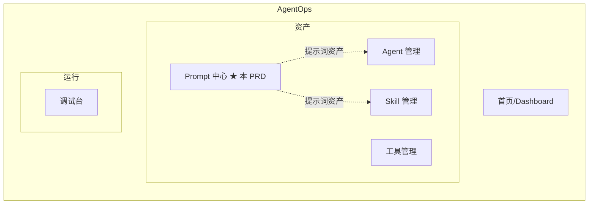
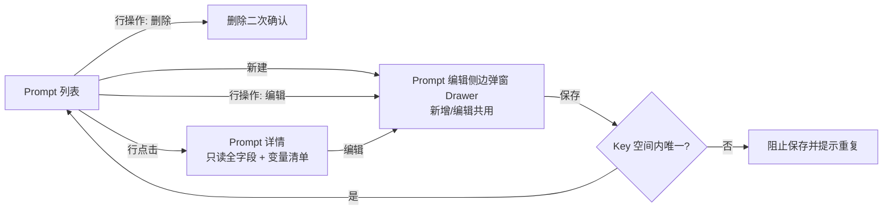
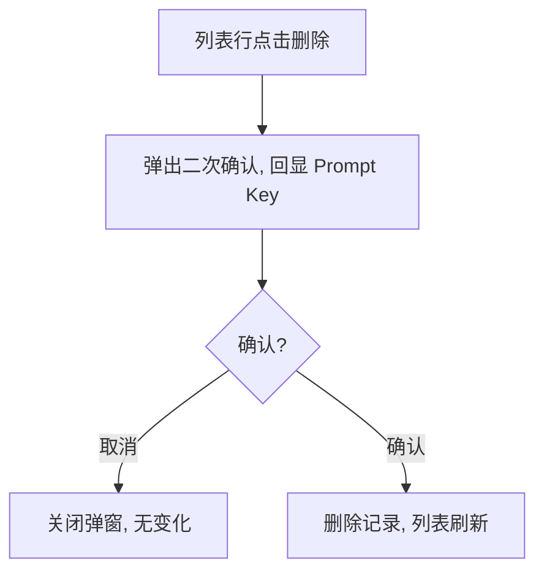
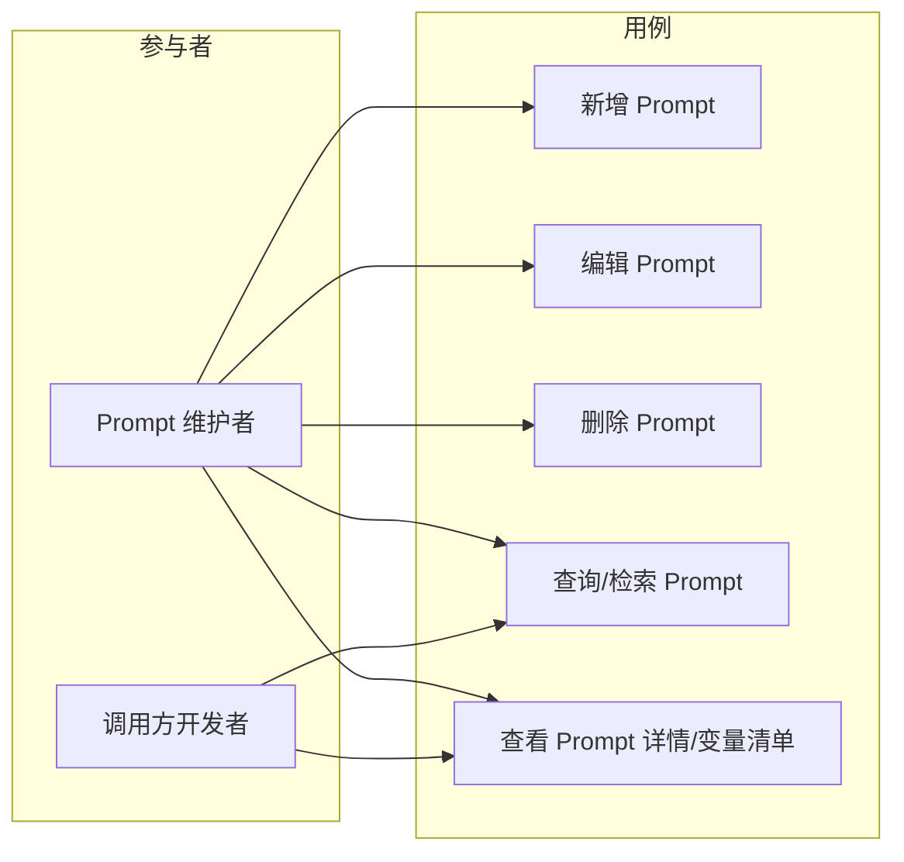

# AgentOps — Prompt 中心 PRD

> 文档日期：2026-06-10　|　版本：v1.0　|　覆盖周期：S2（2026-04 ~ 2026-07）
> 父文档：[S2 PRD](./2026-05-11-AgentOps-S2-PRD.md)
> 兄弟文档：[工具管理 PRD](./2026-06-01-工具管理-PRD.md) · [Skill 管理 PRD](./2026-05-11-Skill管理-PRD.md) · [Agent 管理 PRD](./2026-05-11-Agent管理-PRD.md)

---

## 1. 产品/需求背景

### 1.1 为什么要做

Agent / Skill / 业务系统中大量提示词（Prompt）目前散落在各服务的代码、配置文件甚至硬编码字符串里。改一句话术要发版、要找开发，话术无法被检索、复用与统一治理。随着平台上 Agent 与业务场景增多，"提示词资产"需要一个**统一的目录化存放与维护入口**。

Prompt 中心即为此而生：把提示词从代码里抽出来，沉淀为可检索、可编辑、可按 Key 引用的结构化资产，并通过 `{{变量名}}` 模板语法支持运行时变量替换。

### 1.2 解决什么问题

- **提示词散落、改动成本高**：话术变更需改代码 + 发版 → 改为平台编辑即维护；
- **无法复用与检索**：相同话术在多处重复 → 统一目录，按业务编码 / Key / 标签检索；
- **引用方式不统一**：调用方靠字符串硬编码 → 统一以「业务编码 + Prompt Key」稳定寻址；
- **变量拼接混乱**：各自手写字符串拼接 → 统一 `{{变量名}}` 模板语法。

### 1.3 面向用户

- **Prompt 维护者**（产品 / 提示词工程师 / 研发）：在平台增删查改提示词；
- **调用方开发者**：通过「业务编码 + Prompt Key」在代码中引用 Prompt 模板，运行时填充变量。

### 1.4 与 Skill 管理的边界

- **Skill** = 部门沉淀的"能力包"（SKILL.md 形态，含触发条件、流程编排，强语义）；
- **Prompt** = 单条可参数化的**提示词模板文本**，粒度更细，是 Skill / Agent / 业务调用的原子素材；
- 关系：Skill 与 Agent 可以引用 Prompt 中心的 Prompt 作为其提示词来源（本期不做强绑定，仅作为独立资产沉淀）。

---

## 2. 目标与范围

### 2.1 目标

| 目标 | 度量 |
| --- | --- |
| 资产可见 | 提示词从代码中抽离，100% 在 Prompt 中心目录化 |
| 维护无需发版 | 提示词内容变更由维护者在平台直接完成，不依赖研发发版 |
| 稳定寻址 | 调用方可通过「业务编码 + Prompt Key」稳定引用，且 Key 在空间内唯一 |
| 模板可参数化 | 模板内容支持 `{{变量名}}` 语法，运行时可替换 |

### 2.2 范围

**本期做**

- Prompt 的**增删查改（CRUD）**；
- 核心字段：业务编码、Prompt Key、描述、模板内容（支持 `{{变量名}}` 变量替换）、标签；
- **Prompt Key 在「业务编码空间」内唯一性校验**（重复时阻止保存并提示）；
- Prompt 列表：支持按业务编码 / Key / 标签 / 关键字检索与筛选；
- 模板内容编辑时**自动识别 `{{变量名}}`** 并展示变量清单（便于调用方理解参数）；
- 新增 / 编辑 / 删除均由用户直接操作。

**本期不做**

- ❌ **状态控制**（无草稿 / 发布 / 弃用态，新增即生效，编辑即生效）；
- ❌ 版本化与历史版本回溯（编辑即覆盖，本期不留版本快照，S3 评估）；
- ❌ Prompt 评测 / A/B / 效果打分；
- ❌ 与 Agent / Skill 的强绑定与"被引用数"统计（本期仅独立资产沉淀）；
- ❌ 变量类型 / 默认值 / 必填校验等强 Schema 约束（本期仅按 `{{变量名}}` 提取展示）；
- ❌ 权限分级 / 审批流（沿用平台现有登录态即可）；
- ❌ 多语言 / 国际化版本管理。

---

## 3. 系统线框图（必选，优先产出）

### 3.1 Prompt 中心在平台中的位置



> ★ 标记为本 PRD 新增模块。Prompt 中心与 Agent / Skill / 工具管理同列在"资产"侧导航分组下，作为提示词资产的统一目录。

### 3.2 Prompt 中心内部页面结构



> 新增 / 编辑统一在**右侧侧边弹窗（Drawer）**中完成，不跳转独立页面；列表保持在弹窗下方可见，关闭弹窗即返回列表。

### 3.3 主要页面/模块说明

| 页面/模块 | 职责 | 主要元素 |
| --- | --- | --- |
| Prompt 列表 | 所有 Prompt 入口；按业务编码 / Key / 标签 / 关键字检索 | ProTable + 新建按钮 + 标签胶囊 + 行操作（编辑/删除） |
| Prompt 编辑侧边弹窗（Drawer） | 新增 / 编辑共用；从右侧滑出；填字段 + 编辑模板 + 变量识别 + Key 唯一校验 | 右侧 Drawer + 字段表单 + 模板内容代码框 + 变量清单 + 底部固定保存/取消 |
| Prompt 详情 | 全字段只读查看 + 变量清单 + 操作入口 | 字段卡片 + 模板预览 + 编辑/删除 |
| 删除二次确认 | 删除前确认，避免误删 | Modal + Prompt Key 回显 |

---

## 4. 业务流程图（必选）

### 4.1 新增 / 编辑 Prompt 主流程

```mermaid
flowchart TD
    A[进入 Prompt 列表] --> B{操作}
    B -->|新建| C[右侧滑出空白编辑 Drawer]
    B -->|编辑某行| D[右侧滑出预填编辑 Drawer]
    C --> E[填写业务编码/Key/描述/模板/标签]
    D --> E
    E --> F[系统自动从模板提取 {{变量名}} 并展示变量清单]
    F --> G[点击保存]
    G --> H{业务编码+Key 在空间内是否重复?}
    H -->|重复| I[标红提示 Key 已存在, 阻止保存]
    I --> E
    H -->|不重复| J[保存成功, 返回列表并刷新]
```

> 说明：唯一性判定的"空间"= **同一业务编码下**；即同一业务编码内 Prompt Key 不可重复，不同业务编码可使用相同 Key。编辑场景下排除自身记录再做重复判定。

### 4.2 删除流程



---

## 5. 用例图（必选）



> 说明：本期不做状态控制与审批，维护者拥有全部 CRUD 用例；调用方开发者主要使用检索与详情查看，以获取「业务编码 + Prompt Key」及变量清单用于代码引用。

---

## 6. 用户与场景

- 作为 **Prompt 维护者**，我希望新建一条 Prompt 并填写业务编码、Key、描述、模板内容和标签，以便把散落的提示词沉淀到平台。
- 作为 **Prompt 维护者**，我希望直接编辑某条 Prompt 的模板内容并保存即生效，以便话术调整无需研发发版。
- 作为 **Prompt 维护者**，我希望保存时若 Key 在该业务编码下已存在能被明确拦截，以避免引用歧义。
- 作为 **调用方开发者**，我希望按业务编码 / Key / 标签检索到目标 Prompt，并看到它需要哪些 `{{变量}}`，以便在代码中正确引用并填充变量。

---

## 7. 功能需求

### 7.1 字段定义

| 字段 | 含义 | 约束 | 优先级 |
| --- | --- | --- | --- |
| 业务编码 | Prompt 所属业务空间标识，作为 Key 唯一性的命名空间 | 必填；建议英文 / 数字 / 下划线 | P0 |
| Prompt Key | Prompt 在业务空间内的稳定引用键 | 必填；**同一业务编码下唯一**；建议英文 / 数字 / 点 / 下划线 | P0 |
| 描述 | 用途说明 | 选填 | P1 |
| 模板内容 | 提示词正文，支持 `{{变量名}}` 占位 | 必填 | P0 |
| 标签 | 多个标签，用于分类与检索 | 选填；多值 | P1 |

### 7.2 功能点

| 序号 | 功能点 | 简要说明 | 优先级 |
| --- | --- | --- | --- |
| 1 | 新增 Prompt | 列表右上「新建」从**右侧侧边弹窗（Drawer）**打开空白表单，填写全字段并保存；保存前做必填 + Key 空间内唯一校验 | P0 |
| 2 | 编辑 Prompt | 列表/详情「编辑」从**右侧侧边弹窗（Drawer）**打开并预填，修改后保存；唯一校验排除自身；编辑即生效 | P0 |
| 3 | 删除 Prompt | 二次确认后删除 | P0 |
| 4 | Prompt 列表查询 | 分页列表，展示业务编码 / Key / 描述 / 标签 | P0 |
| 5 | 检索与筛选 | 按业务编码、Prompt Key（精确/模糊）、标签、关键字筛选 | P0 |
| 6 | Prompt Key 空间内唯一校验 | 同一业务编码下 Key 重复时阻止保存并标红提示 | P0 |
| 7 | 模板变量识别 | 编辑 / 详情时自动从模板内容解析 `{{变量名}}`，去重后展示变量清单 | P0 |
| 8 | Prompt 详情查看 | 只读展示全字段 + 模板预览 + 变量清单 | P1 |

### 7.3 变量语法规则（`{{变量名}}`）

- 占位语法：`{{变量名}}`，双花括号包裹；
- 变量名建议为字母 / 数字 / 下划线组合；
- 同一变量可在模板中多次出现，变量清单**去重**展示；
- 本期仅做**识别与展示**，不校验变量类型 / 默认值 / 是否必填（见 §2.2 不做项）；
- 变量的**实际替换由调用方在运行时完成**，Prompt 中心只负责存储与展示模板原文。

---

## 8. 原型图/界面说明（必选）

### 8.1 Prompt 列表页

```
┌─────────────────────────────────────────────────────────────────────┐
│ Prompt 中心                                              [ + 新建 ]    │
├─────────────────────────────────────────────────────────────────────┤
│ 业务编码[      ▾]  Prompt Key[        ]  标签[      ▾]  [搜索][重置]   │
├──────────┬───────────────┬──────────────┬───────────┬───────────────┤
│ 业务编码  │ Prompt Key     │ 描述          │ 标签       │ 操作           │
├──────────┼───────────────┼──────────────┼───────────┼───────────────┤
│ rd-agent │ greeting.intro │ 开场欢迎语    │ 客服 通用  │ 编辑 | 删除    │
│ rd-agent │ summary.daily  │ 日报总结提示  │ 总结       │ 编辑 | 删除    │
│ review   │ code.review    │ 代码评审提示  │ 研发       │ 编辑 | 删除    │
├──────────┴───────────────┴──────────────┴───────────┴───────────────┤
│                                            < 1 2 3 >  共 N 条          │
└─────────────────────────────────────────────────────────────────────┘
```

> 说明：列表展示业务编码、Prompt Key、描述、标签、行操作；顶部筛选区支持按业务编码、Key、标签检索。点击行进入详情，行操作直接编辑 / 删除。

### 8.2 Prompt 编辑侧边弹窗 / Drawer（新增 / 编辑共用）

> 点击列表「新建」或行内「编辑」时，从页面**右侧滑出 Drawer**（列表保持在左侧背景可见），不跳转独立页面；保存/取消按钮固定在 Drawer 底部。

```
列表页 ─────────────────────────────┐┌──────── 右侧滑出 Drawer ──────────┐
                                    ││ 新建 / 编辑 Prompt            [✕] │
 业务编码  Prompt Key   ...         │├───────────────────────────────────┤
 rd-agent  greeting.intro  ...      ││ 业务编码 *  [ rd-agent          ▾]│
 rd-agent  summary.daily   ...      ││ Prompt Key *[ greeting.intro     ]│
 review    code.review     ...      ││   ← 同一业务编码下唯一            │
                                    ││ 描述        [ 开场欢迎语         ]│
 (列表内容在 Drawer 打开时          ││ 标签   [客服 ✕][通用 ✕][+ 添加]  │
  仍可见于左侧，作为背景)           ││ ───────────────────────────────  │
                                    ││ 模板内容 *                        │
                                    ││ ┌───────────────────────────────┐│
                                    ││ │你好 {{userName}}，欢迎使用      ││
                                    ││ │{{productName}}。今天是 {{date}} ││
                                    ││ └───────────────────────────────┘│
                                    ││ 识别到的变量：                    │
                                    ││  userName  productName  date      │
                                    │├───────────────────────────────────┤
                                    ││            [ 取消 ]   [ 保存 ]    │← 底部固定
└────────────────────────────────────┘└───────────────────────────────────┘
```

> 说明：模板内容下方实时展示从 `{{...}}` 解析出的变量清单（去重）。点击底部「保存」触发必填校验与「业务编码 + Key」空间内唯一校验，校验失败时 Drawer 不关闭、对应字段标红。

### 8.3 关键状态

- **Key 重复（错误态）**：Prompt Key 输入框标红，提示「该业务编码下 Prompt Key 已存在，请更换」，Drawer 不关闭、保存被阻止。
- **必填缺失（错误态）**：业务编码 / Key / 模板内容为空时对应字段标红提示，Drawer 不关闭。
- **列表空态**：无数据时展示「暂无 Prompt，点击右上角新建」引导。
- **删除确认态**：弹窗回显将删除的 Prompt Key，确认后刷新列表。

---

## 9. 非功能需求

- **性能**：列表分页查询，常规数据量（千级）下检索响应 < 1s。
- **唯一性一致性**：「业务编码 + Prompt Key」唯一性须在**后端持久层有唯一约束**兜底，前端校验仅作交互提示，避免并发写入绕过前端校验。
- **变量解析鲁棒性**：模板含未闭合 / 异常 `{{` 时不应导致解析报错或页面崩溃，按尽力提取处理。
- **审计**：记录创建人 / 创建时间、最后修改人 / 修改时间（沿用平台现有审计字段约定）。
- **兼容**：沿用平台现有前端框架（Ant Design Pro）与登录态。

---

## 10. 与现有功能的关系

- **全新模块**，作为"资产"侧导航下与 Agent / Skill / 工具管理并列的新成员；
- 不改造现有模块；本期不与 Agent / Skill 做强绑定（仅独立资产沉淀），后续（S3）可评估将 Prompt 作为 Agent / Skill 提示词来源被引用。

---

## 11. 验收标准

- [ ] 可新增 Prompt，填写业务编码、Prompt Key、描述、模板内容、标签并保存成功。
- [ ] 在同一业务编码下使用已存在的 Prompt Key 保存时被阻止并提示重复；不同业务编码可用相同 Key。
- [ ] 可编辑已有 Prompt，保存即生效；编辑时唯一校验排除自身。
- [ ] 可删除 Prompt（含二次确认），删除后列表刷新。
- [ ] 列表支持按业务编码、Prompt Key、标签、关键字检索。
- [ ] 模板内容中的 `{{变量名}}` 能被自动识别并去重展示为变量清单。
- [ ] 后端持久层对「业务编码 + Prompt Key」存在唯一约束。
- [ ] 全流程无状态控制（无草稿/发布/弃用态），新增、编辑即生效。
