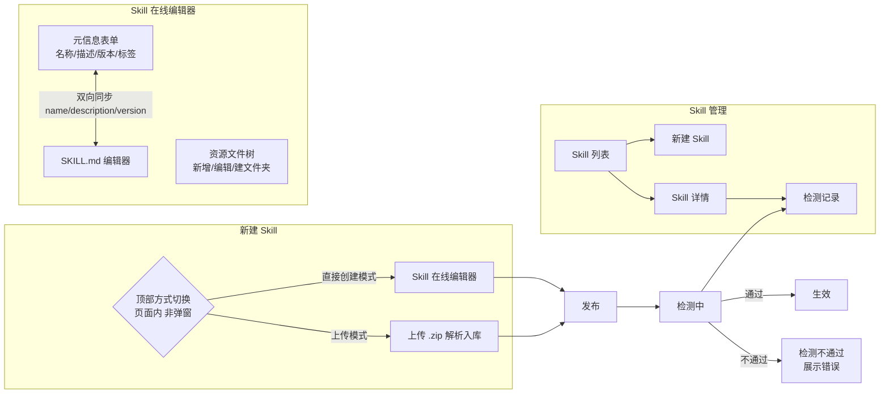
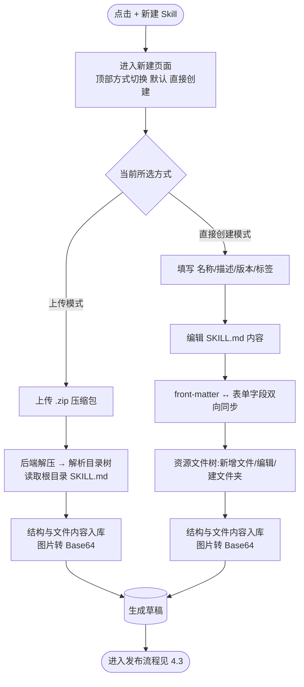
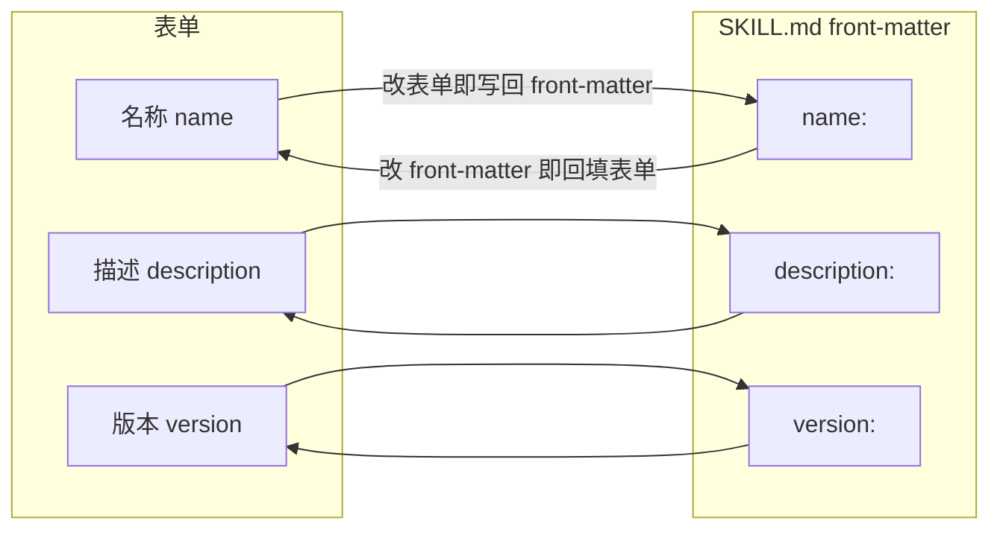
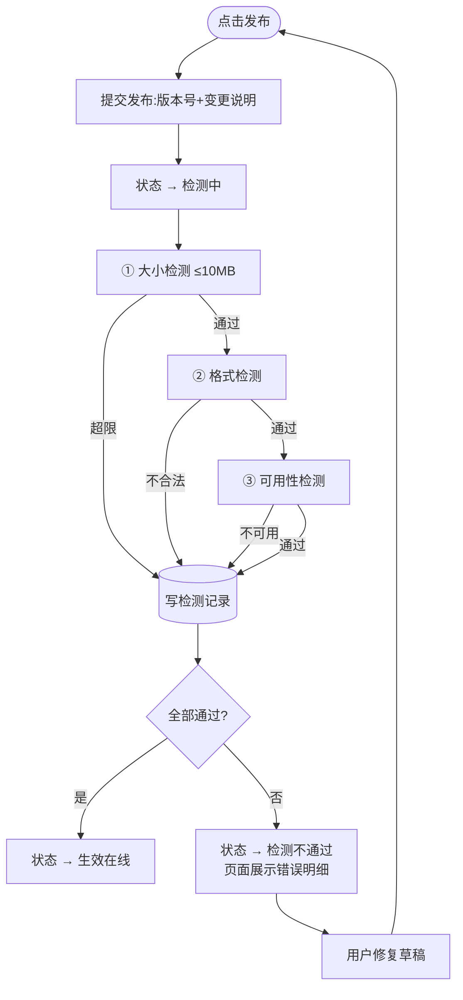
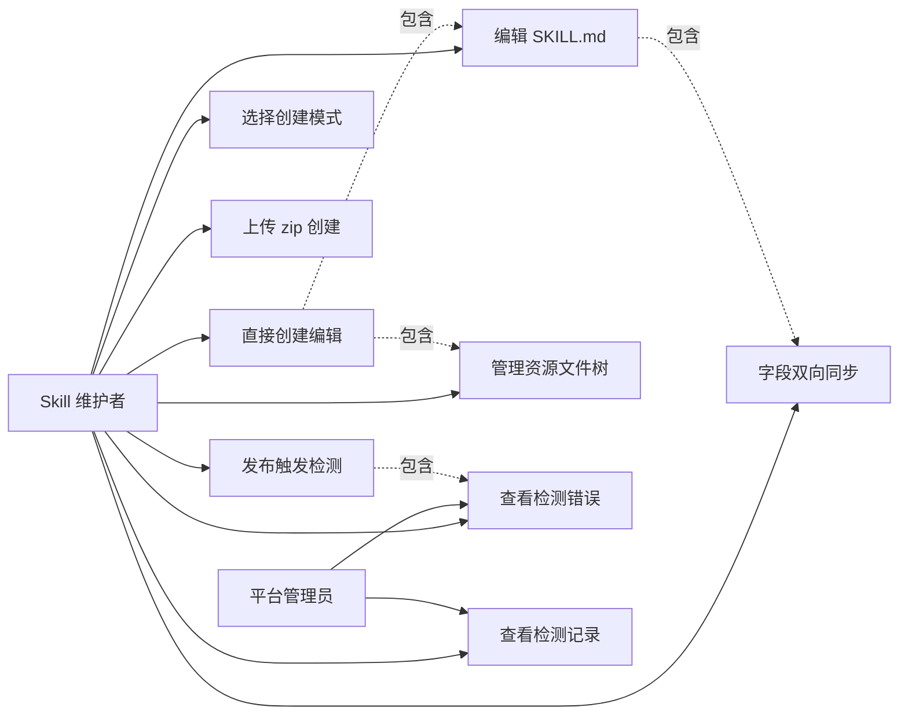

# AgentOps — Skill 管理优化 PRD（双模式创建 + 发布检测）

> 文档日期：2026-06-10　|　版本：v1.0　|　覆盖周期：S2（2026-04 ~ 2026-07）
> 基线文档：[Skill 管理 PRD v2.0](./2026-05-11-Skill管理-PRD.md) · 父文档：[S2 PRD](./2026-05-11-AgentOps-S2-PRD.md)

> **本 PRD 性质**：对基线 [Skill 管理 PRD v2.0](./2026-05-11-Skill管理-PRD.md) 的**优化与覆盖**，仅描述本次变更的两块能力，其余（列表、CRUD、公司库同步、评测台、版本管理整体框架）沿用基线不变。
>
> **对基线的覆盖点（冲突以本 PRD 为准）**：
> 1. **存储模型**：基线附录 11「SKILL 文件整包落对象存储」**作废**——本次改为 **Skill 的目录结构与文件内容全部入库存储**，文件内容存数据库字段，**不再使用对象存储**；图片等二进制资源转 **Base64** 存库。
> 2. **新建入口**：基线「上传 `.zip`/`.md` 文件」单一入口，**升级**为「**上传模式**」与「**直接创建模式**」二选一；直接创建模式支持在线编辑 SKILL.md + 树形管理资源文件。
> 3. **发布状态机**：基线「草稿 → 发布 → 在线」**升级**为「草稿 → 发布 → **检测中** → 生效 / 检测不通过」，引入大小 / 格式 / 可用性三类检测与**检测记录**。

---

## 1. 产品/需求背景

- **为什么要做**：
  - 现状新建 Skill 只能上传打包好的 `.zip`/`.md`，用户想新建或微调一个 Skill 必须在本地准备文件再打包上传，**无法在平台内直接编写**，体验割裂、迭代慢。
  - 现状 SKILL 文件落**对象存储**，与平台其余资产（库内字段化管理）形态不一致，存在外部依赖、备份 / 迁移 / 版本快照成本高，且无法对文件内容做库内检索与结构化校验。
  - 现状发布即生效，**缺少发布前的质量闸门**——超大包、格式损坏、不可加载的 Skill 也能上线，影响挂载它的 Agent 运行时稳定性。
- **解决什么问题**：让用户在平台内**直接创建并可视化编辑** Skill（含 SKILL.md 与资源文件树），数据**统一入库**便于管理；并在每次发布时通过**自动检测闸门**拦住有问题的 Skill，检测过程**留痕可查**。
- **面向用户**：Skill 维护者（部门内自建 Skill 的研发 / 产品）、平台管理员。

---

## 2. 目标与范围

### 2.1 目标

| 目标 | 度量 |
| --- | --- |
| 平台内可建 | 不依赖本地打包，纯在平台内即可完成「建 Skill → 编辑 SKILL.md → 加资源文件 → 发布」 |
| 存储统一 | Skill 结构与文件内容 100% 入库；对象存储依赖归零 |
| 质量闸门 | 发布必过「大小 / 格式 / 可用性」三检；不达标无法生效 |
| 过程留痕 | 每次发布检测 100% 生成可追溯的检测记录 |

### 2.2 范围

**本次做**

- 新建 Skill **双模式**：上传模式（`.zip`）/ 直接创建模式（二选一）。
- 直接创建模式：名称 / 描述 / 版本 / 标签表单 + **SKILL.md 在线编辑器** + **资源文件树**（新增 / 编辑 / 建文件夹）。
- SKILL.md front-matter 与「名称 / 版本 / 描述」表单字段**双向同步**。
- Skill 结构与文件内容**入库存储**；图片等二进制转 **Base64** 存库;**不再使用对象存储**。
- 发布**检测流程**：检测中状态 + 大小（≤10 MB）/ 格式 / 可用性三检 + 检测不通过错误展示。
- **检测记录**：每次检测留痕，列表 + 详情可查。

**本次不做**

- ❌ 资源文件的多人协同实时编辑（沿用基线单草稿 + 草稿锁）。
- ❌ SKILL.md 的富文本 / 所见即所得编辑（用 Markdown 源码编辑器即可）。
- ❌ 已入库历史 Skill 从对象存储到 DB 的存量迁移工具（如有存量，单独立项；本次只保证新链路全部走 DB）。
- ❌ 可用性检测中的「业务语义正确性」评判（那是评测台的事，本检测只验「能不能正常加载 / 解析」）。
- ❌ 检测项阈值的用户自定义配置（10 MB 等阈值本期硬编码）。

---

## 3. 系统线框图（优化范围内）



**模块说明**：

- **新建 Skill**：点「+ 新建 Skill」直接进入新建页面，页面**顶部**以方式切换控件（上传 / 直接创建）二选一，切换即在同页切换下方表单区，不弹窗。
- **Skill 在线编辑器**（直接创建模式核心）：左侧元信息表单 + SKILL.md 源码编辑器，右侧资源文件树；表单与 SKILL.md front-matter 双向同步。
- **检测**：发布动作触发，串联在「发布 → 生效」之间；产出检测记录。
- **检测记录**：挂在 Skill 详情下，按版本 / 检测批次列出每次检测的结果与明细。

---

## 4. 业务流程图

### 4.1 新建 Skill —— 双模式



### 4.2 SKILL.md 与表单字段双向同步



> 同步对象仅限 `name` / `description` / `version` 三个字段；标签（tags）为 Skill 元信息层属性，不参与 SKILL.md 双向同步（见 §6.2 字段约束）。

### 4.3 发布检测流程（核心）



> **状态机变化**（覆盖基线 §3.3）：原「草稿 →（发布）→ 在线」之间插入「**检测中**」与「**检测不通过**」两个状态。检测中为系统中间态（不可挂载 / 不对调用方可见）；检测不通过可回到草稿修复后重新发布；只有「生效」状态才进入基线原有的在线 / 弃用流转。

---

## 5. 用例图



---

## 6. 功能需求

> 优先级：P0 必做 / P1 重要 / P2 增强。

### 6.1 新建页面方式切换

| 序号 | 功能点 | 简要说明 | 优先级 |
| --- | --- | --- | --- |
| 1.1 | 方式切换 | 点「+ 新建 Skill」直接进入新建页面，**页面顶部**用方式切换控件（Segmented/Radio，非弹窗）二选一：**上传模式** / **直接创建模式**；默认选中「直接创建模式」；切换即在同页切换下方表单区，**二者互斥不可同时** | P0 |
| 1.2 | 上传模式 | 上传单个 `.zip` 压缩包；后端解压 → 校验根目录含 `SKILL.md` → 解析目录树并入库（见 §6.4 存储） | P0 |
| 1.3 | 直接创建模式 | 进入 Skill 在线编辑器（§6.2 / §6.3） | P0 |
| 1.4 | 模式切换提示 | 在编辑器内若想切换模式，提示「切换将丢弃当前已填内容」需二次确认 | P1 |

> 基线 v2.0 支持的 `.md` 单文件上传由「直接创建模式」覆盖（直接创建即等价于在线编写单个 SKILL.md），上传模式本期只保留 `.zip`。

### 6.2 直接创建 —— 元信息表单与双向同步

| 序号 | 功能点 | 简要说明 | 优先级 |
| --- | --- | --- | --- |
| 2.1 | 名称 | 文本输入，≤128 字符，必填 | P0 |
| 2.2 | 描述 | 多行文本，必填 | P0 |
| 2.3 | 版本 | Semver 格式 `x.y.z`，必填；首建默认 `1.0.0` | P0 |
| 2.4 | 标签 | 多 tag 自由输入，可选；单 tag ≤32 字符，上限 20 个 | P1 |
| 2.5 | **双向同步** | 名称 / 描述 / 版本 与 SKILL.md front-matter 的 `name` / `description` / `version` **实时双向同步**：改表单写回 front-matter，改 front-matter 回填表单 | P0 |
| 2.6 | 同步冲突处理 | 当用户在 SKILL.md 中写出非法 front-matter（YAML 解析失败 / 缺字段）时，表单对应字段标红提示，不静默覆盖 | P1 |

**字段约束**：

- 同步范围严格限定 `name` / `description` / `version` 三字段；`tags` 不参与 SKILL.md 同步（避免与 Skill 元信息层语义冲突，沿用基线 v2.0 §6.1.1）。
- SKILL.md front-matter 缺失被同步字段时，以表单值为准补齐；二者都为空则发布时格式检测拦截（§6.5）。
- 版本号唯一性、变更说明必填等沿用基线 §6.7 发布规则。

### 6.3 直接创建 —— 资源文件树

| 序号 | 功能点 | 简要说明 | 优先级 |
| --- | --- | --- | --- |
| 3.1 | 树形展示 | 以 SKILL.md 为根，树形展示所有文件 / 文件夹 | P0 |
| 3.2 | 新增文件 | 在选定节点下新增文件，进入内容编辑 | P0 |
| 3.3 | 新增文件夹 | 在选定节点下创建文件夹（可嵌套） | P0 |
| 3.4 | 编辑文件 | 点击文本文件 → 内容编辑器编辑并保存；点击图片 → 预览 | P0 |
| 3.5 | 重命名 / 移动 / 删除 | 节点右键或行操作支持重命名、删除；移动可后续迭代 | P1 |
| 3.6 | 图片资源 | 上传 / 拖入图片 → 前端或后端统一转 **Base64** 入库（§6.4）；编辑器内可预览 | P0 |
| 3.7 | 路径合法性 | 禁止 `..` 穿越、禁止绝对路径、禁止重名同级节点；非法即时提示 | P0 |
| 3.8 | SKILL.md 唯一根 | 根目录 `SKILL.md` 为系统保留文件，不可删除 / 不可重命名 | P0 |

### 6.4 存储模型（入库，覆盖基线对象存储方案）

> **核心变更**：Skill 的**目录结构与每个文件的内容全部入库**，**不再使用对象存储**。

| 序号 | 功能点 | 简要说明 | 优先级 |
| --- | --- | --- | --- |
| 4.1 | 结构入库 | Skill 文件树（路径、类型 文件/文件夹、父子关系）以记录形式存数据库 | P0 |
| 4.2 | 文本内容入库 | 文本文件（`.md` / `.txt` / 脚本等）内容存数据库文本字段，UTF-8 | P0 |
| 4.3 | 图片转 Base64 | 图片等二进制资源 → Base64 字符串存数据库字段，并记录原始 MIME 类型 | P0 |
| 4.4 | 版本快照 | 每次发布生效的版本，对其完整文件树 + 内容做**不可变快照**入库（沿用基线版本快照思路，载体改为库内结构） | P0 |
| 4.5 | 编码标识 | 每个文件记录编码方式（`text` / `base64`）与 MIME，便于读取时正确还原 | P0 |

**存储模型示意（PRD 层概念，字段以技术方案为准）**：

```
skill_resource_file
├── 所属 skill / 版本
├── path          # 相对路径，如 references/guide.md、assets/logo.png
├── type          # FILE / DIR
├── parent_path   # 父节点路径
├── encoding      # text / base64
├── mime          # text/markdown、image/png ...
└── content       # 文本原文 或 Base64 串（DB 字段）
```

> 大小计量口径：以**解码后的原始字节数**之和计（Base64 入库会膨胀约 1/3，但 §6.5 的 10 MB 校验以解码后原始大小为准，与用户直觉一致）。

### 6.5 发布检测

| 序号 | 功能点 | 简要说明 | 优先级 |
| --- | --- | --- | --- |
| 5.1 | 检测中状态 | 点发布 → 状态置「**检测中**」，期间不可挂载 / 不对调用方可见；前端展示进行中态 | P0 |
| 5.2 | ① 大小检测 | Skill 全部文件解码后总大小 **≤ 10 MB**，超限不通过 | P0 |
| 5.3 | ② 格式检测 | 校验：根目录存在 `SKILL.md`；front-matter 可被 YAML 解析；`name`/`description`/`version` 齐全且 `version` 合法 Semver；文件树路径合法（无穿越）；图片为合法 Base64 且 MIME 在白名单（png/jpg/jpeg/gif/svg/webp）；文本文件 UTF-8 | P0 |
| 5.4 | ③ 可用性检测 | 校验 Skill 可被运行时正确加载：能解析装载 SKILL.md 与资源；SKILL.md 内引用的相对路径资源在文件树中均存在（引用完整性）；可选挂空白沙盒 Agent 做一次加载冒烟（不跑业务语义） | P0 |
| 5.5 | 通过 → 生效 | 三检全通过 → 状态「**生效**」，进入基线在线 / 弃用流转 | P0 |
| 5.6 | 不通过 → 错误展示 | 任一检测不通过 → 状态「**检测不通过**」，页面以清单形式展示**每条错误的检测项、位置/文件、原因** | P0 |
| 5.7 | 修复后重发 | 检测不通过的 Skill 可回到草稿修改后重新发布，再次走检测 | P0 |
| 5.8 | 检测顺序与短路 | 按 大小 → 格式 → 可用性 顺序执行；本期一次跑完所有项并汇总全部错误（不短路），便于用户一次看全问题 | P1 |

### 6.6 检测记录

| 序号 | 功能点 | 简要说明 | 优先级 |
| --- | --- | --- | --- |
| 6.1 | 每次留痕 | 每次发布触发的检测都生成一条**检测记录**入库 | P0 |
| 6.2 | 记录内容 | 检测批次号、Skill / 版本号、触发人、检测时间、整体结果（通过/不通过）、三类检测各自子结果与耗时、错误明细列表、总耗时 | P0 |
| 6.3 | 记录列表 | Skill 详情下「检测记录」页签：ProTable 列出历次检测（时间 / 版本 / 触发人 / 结果 / 耗时） | P0 |
| 6.4 | 记录详情 | 点行展开查看该次检测的逐项明细与完整错误信息 | P0 |
| 6.5 | 失败可复看 | 检测不通过的记录长期保留，便于事后排查（不随重新发布删除） | P1 |

---

## 7. 原型图 / 界面说明

> 沿用基线扁平化模板（白底 + `#E2E8F0` 边框 + radius 8），与 Agent 管理 / 现有 Skill 列表风格一致。以下为本次新增 / 改动界面。

### 7.1 新建页面 —— 顶部方式切换（页面内，非弹窗）

```
┌─ 新建 Skill ──────────────────────────────────────────────────────┐
│ 创建方式：[ ⬆ 上传模式 │ ✎ 直接创建模式 ]  ← 页面顶部 Segmented 切换 │
│ ──────────────────────────────────────────────────────────────────│
│  （下方表单区随所选方式在同页切换，不弹窗）                          │
│  · 选「上传模式」→ 显示 zip 上传区（见下）                           │
│  · 选「直接创建模式」→ 显示在线编辑器（见 7.2）                      │
└────────────────────────────────────────────────────────────────────┘

  ── 上传模式表单区 ──
┌────────────────────────────────────────────────────────────────────┐
│ 创建方式：[ ⬆ 上传模式 │ ✎ 直接创建模式 ]                            │
│ 名称[____________]  版本[1.0.0]  标签[+tag]                          │
│ 描述[__________________________________________________]            │
│ ┌─ 拖拽或点击上传 .zip 压缩包 ──────────────────────┐  [发布]        │
│ │            ⬆  仅支持 .zip，解压后根目录需含 SKILL.md │              │
│ └────────────────────────────────────────────────────┘              │
└────────────────────────────────────────────────────────────────────┘
```

- 进入新建页面默认选中「直接创建模式」。
- 顶部方式切换为页面内控件（Segmented/Radio），切换即在同页替换下方表单区，不弹窗、不跳页。
- 切换方式时若下方已填内容，提示「切换将丢弃当前已填内容」二次确认（见 §6.1 功能点 1.4）。

### 7.2 直接创建编辑器（双栏）

```
┌─ 新建 Skill · 直接创建 ─────────────────────────────────────────────┐
│ 名称[____________]  版本[1.0.0]  标签[+tag][+tag]        [发布]      │
│ 描述[__________________________________________________]            │
│ ───────────────────────────────────────────────────────────────────│
│ ┌─ 资源文件树 ───────┐ ┌─ 编辑区 ──────────────────────────────────┐ │
│ │ 📄 SKILL.md ●根     │ │  ---                                      │ │
│ │ 📁 references/      │ │  name: jira-summary       ←双向同步→ 表单 │ │
│ │   └ 📄 guide.md     │ │  description: 汇总 Jira...                │ │
│ │ 📁 assets/          │ │  version: 1.0.0                          │ │
│ │   └ 🖼 logo.png      │ │  ---                                      │ │
│ │ [+文件][+文件夹]    │ │  # Jira Summary Skill                    │ │
│ │                     │ │  ...(Markdown 源码编辑)...                │ │
│ └─────────────────────┘ └───────────────────────────────────────────┘ │
└──────────────────────────────────────────────────────────────────────┘
```

- 左栏：资源文件树，支持新增文件 / 文件夹、编辑、删除；点图片节点在编辑区预览。
- 右栏：选中 SKILL.md 时为 Markdown 源码编辑器；选中其它文本文件时编辑其内容；选中图片时预览。
- 顶部表单的「名称 / 版本 / 描述」与 SKILL.md front-matter 实时双向同步。

### 7.3 发布检测态

```
┌─ 发布 ──────────────────────────────────────────────┐
│  ⏳ 检测中…                                           │
│   ① 大小检测      ✓ 2.3MB / 10MB                     │
│   ② 格式检测      ⏳ 进行中                            │
│   ③ 可用性检测    —                                   │
└──────────────────────────────────────────────────────┘

  ── 检测不通过示例 ──
┌──────────────────────────────────────────────────────┐
│  ✗ 检测不通过（2 项错误）            [查看检测记录]    │
│  ① 大小检测     ✓ 通过                                │
│  ② 格式检测     ✗ SKILL.md front-matter 缺少 version  │
│                 ✗ assets/x.bmp MIME 不在白名单        │
│  ③ 可用性检测   ✗ SKILL.md 引用的 references/api.md   │
│                   在文件树中不存在                     │
│                                   [返回修改] [重新发布]│
└──────────────────────────────────────────────────────┘
```

### 7.4 检测记录

```
┌─ Skill 详情 › 检测记录 ──────────────────────────────────────┐
│ 检测时间        │ 版本   │ 触发人 │ 结果      │ 耗时 │ 操作   │
│ 2026-06-10 14:2 │ 1.0.1  │ 张三   │ ✓ 通过    │ 1.2s │ 详情   │
│ 2026-06-10 11:0 │ 1.0.1  │ 张三   │ ✗ 不通过  │ 0.8s │ 详情   │
└──────────────────────────────────────────────────────────────┘
  点「详情」→ 展开三类检测逐项结果 + 完整错误信息
```

### 7.5 关键状态

| 状态 | 处理 |
| --- | --- |
| 检测中 | 发布按钮置 loading；列表 / 详情状态显示「检测中」胶囊；不可再次发布 |
| 检测不通过 | 红色状态胶囊；错误清单 + 「返回修改 / 重新发布」；可跳检测记录 |
| 图片过大致超限 | 大小检测明确提示「当前 X MB 超 10 MB，请精简资源 / 压缩图片」 |
| front-matter 非法 | 表单对应字段标红 + 编辑器内行级提示 |
| 资源树为空（仅 SKILL.md） | 允许，等价单文件 Skill |

---

## 8. 非功能需求

| 项 | 目标 |
| --- | --- |
| 编辑器保存 | 单文件保存响应 ≤ 500ms |
| 双向同步延迟 | 表单 ↔ front-matter 同步 ≤ 200ms（前端本地同步，无需往返） |
| 发布检测耗时 | 单 Skill（≤10 MB）三检完成 ≤ 5s |
| 大小校验口径 | 以解码后原始字节计；Base64 入库膨胀不计入用户可见大小 |
| 安全 | 路径穿越防护、Base64 / MIME 白名单校验、zip 解压防炸弹（沿用基线 §6.1.1） |
| 数据一致性 | 发布生效为原子操作：版本快照入库 + 状态切换 + 检测记录写入同事务 |

---

## 9. 与现有功能的关系

- **改造** 基线 [Skill 管理 PRD v2.0](./2026-05-11-Skill管理-PRD.md)，非全新模块。
- **作废**：基线附录 11「SKILL 文件整包落对象存储 / 表里只存 key」——本期改为入库存储，技术方案需据此重做存储设计与（如有存量的）迁移评估。
- **兼容**：列表、搜索、公司库同步、评测台、版本号 Semver 策略、变更说明必填、草稿锁等沿用基线；公司库同步来的 Skill 仍只读，其文件同样按入库模型存储。
- **状态机扩展**：在基线生命周期前段插入「检测中 / 检测不通过」，生效后流转不变。

---

## 10. 验收标准

- [ ] 新建 Skill 可选「上传模式 / 直接创建模式」，二选一互斥。
- [ ] 直接创建模式：可填名称 / 描述 / 版本 / 标签，可在线编辑 SKILL.md，可树形新增文件 / 编辑 / 建文件夹。
- [ ] 名称 / 版本 / 描述与 SKILL.md front-matter **双向同步**生效。
- [ ] 图片资源以 Base64 入库；Skill 结构与文件内容全部存数据库，**无任何对象存储调用**。
- [ ] 发布后状态进入「检测中」，完成大小（≤10 MB）/ 格式 / 可用性三检。
- [ ] 通过 → 生效；不通过 → 检测不通过并展示每条错误明细，可修复后重发。
- [ ] 每次检测生成检测记录，列表 + 详情可查看历次结果与错误信息。

---

## 附：与下游技术方案的对接提示

1. **存储重构**：新增 `skill_resource_file`（结构 + 内容字段）与版本快照载体；下线对象存储读写；评估超大 Base64 字段的 DB 行 / 列长度限制（如 MySQL `LONGTEXT`）与单 Skill 总量上限。
2. **大小口径**：10 MB 以解码后原始字节计，校验在入库 / 发布两处都要做；注意 Base64 膨胀，DB 实际占用约 ×1.33。
3. **双向同步**：建议前端解析 / 序列化 front-matter（YAML），表单与编辑器共享同一数据源做单向数据流 + 双绑，避免后端往返；非法 front-matter 不静默覆盖表单。
4. **检测引擎**：大小 / 格式 / 可用性建议做成可插拔的检测项链（responsibility chain），一次跑完汇总全部错误；检测结果结构化存检测记录表。
5. **可用性检测**：与运行时 Skill 加载器复用同一套解析逻辑（解析即检测），引用完整性扫 SKILL.md 内相对路径引用；沙盒冒烟为可选增强。
6. **状态机**：在 `status` 枚举中新增 `CHECKING` / `CHECK_FAILED`；生效仍为基线的在线态；发布生效需事务包住「快照入库 + 状态切换 + 检测记录」。
7. **检测记录表**：`skill_check_record(skill_num, version_num, result, size_result, format_result, availability_result, errors_json, triggered_by, cost_ms, created_at)`。

---

## 附：关联文档

- [Skill 管理 PRD v2.0（基线）](./2026-05-11-Skill管理-PRD.md)
- [S2 PRD（聚合）](./2026-05-11-AgentOps-S2-PRD.md)
- [Agent 管理 PRD](./2026-05-11-Agent管理-PRD.md)
- [代码仓库](../代码仓库/rd-agent-ws/)
