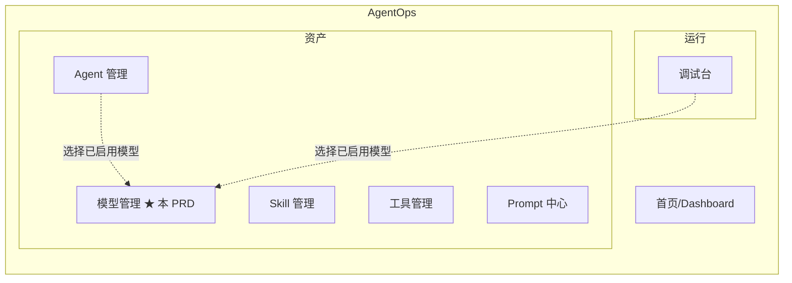
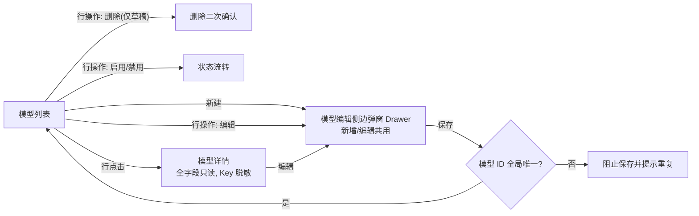
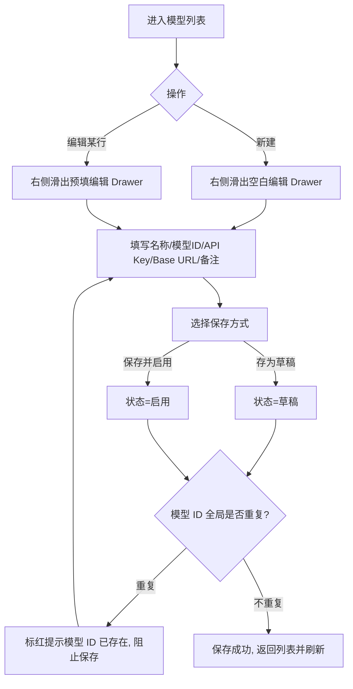
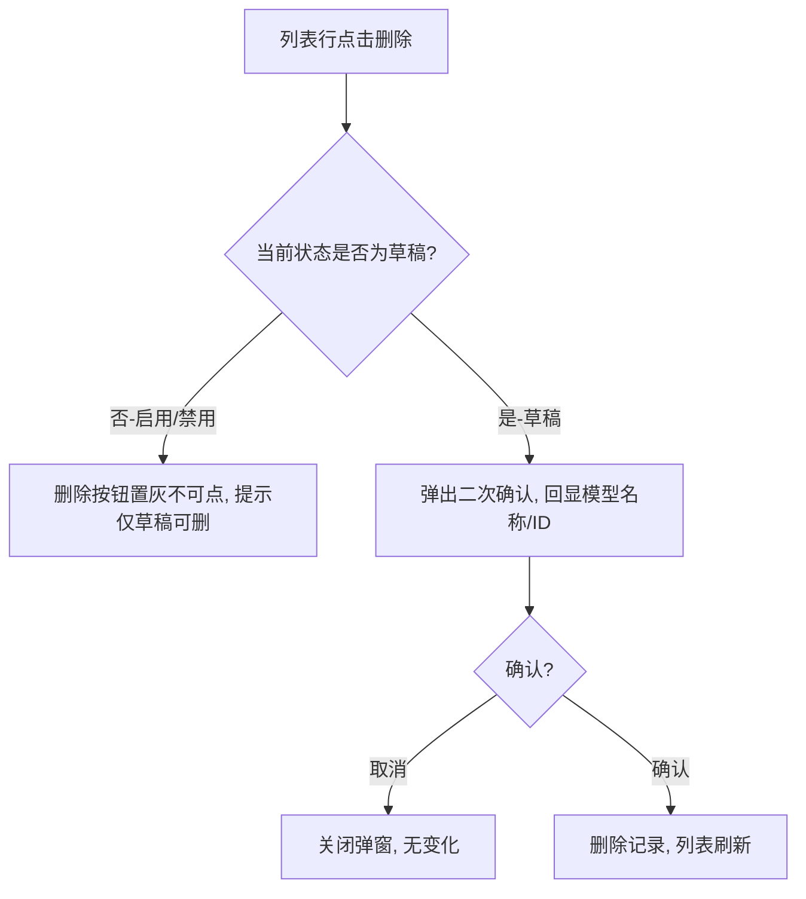
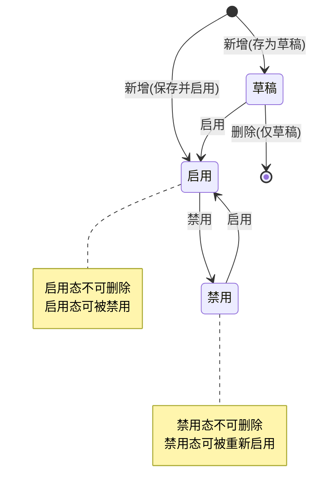
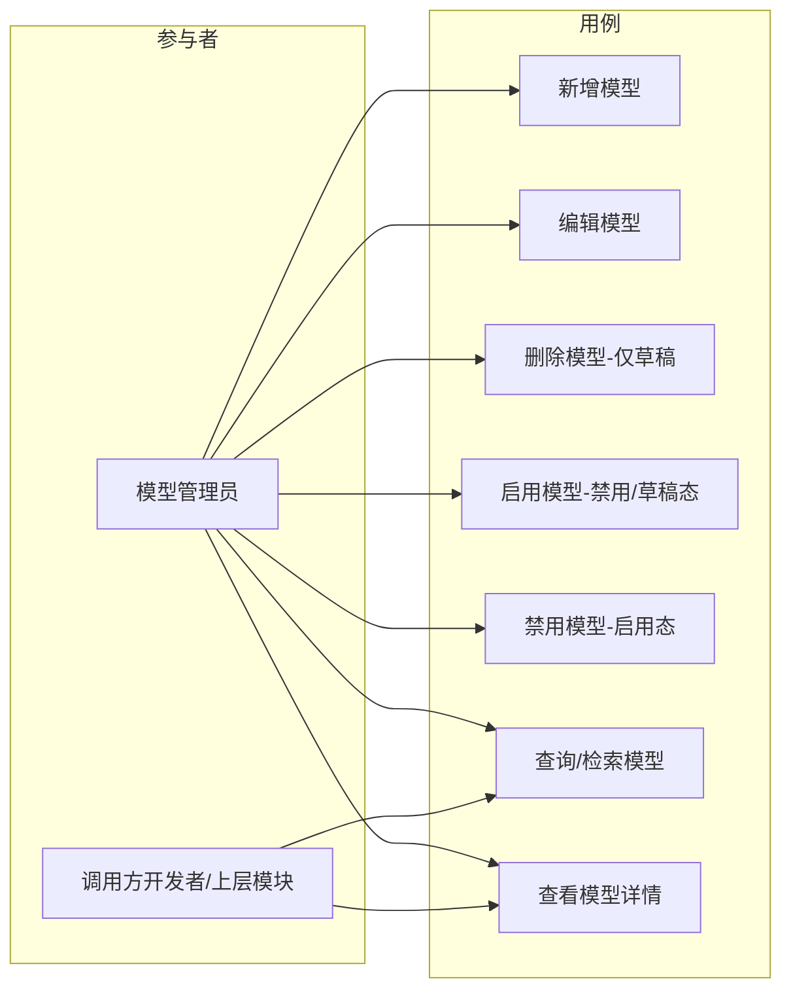

# AgentOps — 模型管理 PRD

> 文档日期：2026-06-10　|　版本：v1.0　|　覆盖周期：S2（2026-04 ~ 2026-07）
> 父文档：[S2 PRD](./2026-05-11-AgentOps-S2-PRD.md)
> 兄弟文档：[Prompt 中心 PRD](./2026-06-10-Prompt中心-PRD.md) · [工具管理 PRD](./2026-06-01-工具管理-PRD.md) · [Skill 管理 PRD](./2026-05-11-Skill管理-PRD.md) · [Agent 管理 PRD](./2026-05-11-Agent管理-PRD.md)

---

## 1. 产品/需求背景

### 1.1 为什么要做

平台上的 Agent / Skill / 调试台等模块运行时都要调用大模型（LLM）。目前模型的接入信息（API Key、Base URL 等）散落在各服务的配置文件甚至硬编码里：新增一个模型要改配置、要发版；同一个 Key 在多处重复维护；模型上下线没有统一开关，想临时停用某个模型只能改代码。

模型管理即为此而生：把模型接入信息从代码里抽出来，沉淀为**统一的、可启停的模型目录**，调用方按「模型 ID」稳定寻址，运维可在平台直接启用/禁用模型而无需发版。

### 1.2 解决什么问题

- **接入信息散落、新增成本高**：模型 API Key / Base URL 改动需改配置 + 发版 → 改为平台统一登记维护；
- **缺少统一开关**：模型上下线只能改代码 → 通过「状态」字段统一启用 / 禁用，即时生效；
- **草稿态无法暂存**：模型信息未填全或待验证时无处暂存 → 提供「草稿」态，允许先建后用；
- **误删风险**：已在使用的模型被误删会导致线上故障 → 仅允许删除草稿态模型，启用 / 禁用态不可删。

### 1.3 面向用户

- **模型管理员**（平台运维 / 研发负责人）：在平台登记、维护模型接入信息，控制模型的启用 / 禁用；
- **调用方开发者 / 上层模块**（Agent、Skill、调试台）：通过模型 ID 引用已启用的模型。

### 1.4 与其他资产模块的边界

- **模型** = 一条 LLM 接入凭据与端点配置（名称 / ID / Key / Base URL / 状态），是最底层的运行资源；
- Agent / Skill / 调试台在运行时**选择并引用**已启用的模型；本期模型管理只负责模型本身的登记与启停，不负责被引用关系的统计与强绑定（S3 评估）。

---

## 2. 目标与范围

### 2.1 目标

| 目标 | 度量 |
| --- | --- |
| 接入信息可见 | 模型接入信息从代码中抽离，100% 在模型管理目录化登记 |
| 启停无需发版 | 模型的启用 / 禁用由管理员在平台直接完成，即时生效，不依赖研发发版 |
| 稳定寻址 | 调用方通过「模型 ID」稳定引用，且模型 ID 全局唯一 |
| 状态可控可追溯 | 模型生命周期由「草稿 / 启用 / 禁用」三态显式管控，状态流转受规则约束 |

### 2.2 范围

**本期做**

- 模型的**新增、修改、删除、启用、禁用**；
- 核心字段：模型名称、模型 ID、模型 API Key、Base URL、状态（草稿 / 启用 / 禁用）、备注；
- **模型 ID 全局唯一性校验**（重复时阻止保存并提示）；
- **状态机管控**：删除仅限草稿态；启用仅限禁用态、草稿态；禁用仅限启用态（详见 §7.3）；
- 模型列表：支持按模型名称 / 模型 ID / 状态检索与筛选；
- API Key 列表与详情**默认脱敏展示**。

**本期不做**

- ❌ 模型连通性测试 / 健康探活（填写后是否可用由调用方运行时反馈，S3 评估"测试连接"按钮）；
- ❌ 模型调用计量 / 费用统计 / 限流配额；
- ❌ 模型参数模板（temperature / max_tokens 等默认参数）配置——本期仅登记接入信息；
- ❌ 多版本 / 历史版本回溯（编辑即覆盖，不留版本快照）；
- ❌ 与 Agent / Skill / 调试台的"被引用数"统计与强绑定校验；
- ❌ 权限分级 / 审批流（沿用平台现有登录态即可）；
- ❌ API Key 的加密密钥轮换 / KMS 托管（本期按平台现有敏感字段存储约定处理）。

---

## 3. 系统线框图（必选，优先产出）

### 3.1 模型管理在平台中的位置



> ★ 标记为本 PRD 新增模块。模型管理与 Agent / Skill / 工具 / Prompt 同列在"资产"侧导航分组下，作为模型接入资源的统一目录；Agent 与调试台在运行时选择并引用已启用的模型。

### 3.2 模型管理内部页面结构



> 新增 / 编辑统一在**右侧侧边弹窗（Drawer）**中完成，不跳转独立页面；启用 / 禁用 / 删除为列表行内操作，按当前状态决定是否可点（详见 §7.3 状态机）。

### 3.3 主要页面/模块说明

| 页面/模块 | 职责 | 主要元素 |
| --- | --- | --- |
| 模型列表 | 所有模型入口；按名称 / 模型 ID / 状态检索 | ProTable + 新建按钮 + 状态标签 + 行操作（编辑 / 删除 / 启用 / 禁用） |
| 模型编辑侧边弹窗（Drawer） | 新增 / 编辑共用；从右侧滑出；填字段 + 模型 ID 唯一校验 | 右侧 Drawer + 字段表单 + API Key 输入（可显隐） + 底部固定保存 / 取消 |
| 模型详情 | 全字段只读查看 + 操作入口 | 字段卡片（API Key 脱敏） + 编辑 / 删除 / 启用 / 禁用 |
| 删除二次确认 | 删除前确认，避免误删（仅草稿态可达） | Modal + 模型名称 / ID 回显 |

---

## 4. 业务流程图（必选）

### 4.1 新增 / 编辑模型主流程



> 说明：新增时可选择"存为草稿"或"保存并启用"两种落库状态（默认草稿）；编辑场景下状态不在此流程改变（状态改变走 §4.3 的启用 / 禁用操作），编辑只更新字段。编辑时唯一性判定排除自身记录。

### 4.2 删除流程（仅草稿态可删）



### 4.3 状态流转流程（启用 / 禁用）



> 说明：
> - **启用**操作的合法前置态为「禁用」或「草稿」；
> - **禁用**操作的合法前置态为「启用」；
> - **删除**操作的合法前置态为「草稿」；
> - 非法的状态操作在前端表现为对应按钮**置灰不可点**，后端同样需做状态校验兜底（详见 §9）。

---

## 5. 用例图（必选）



> 说明：本期不做权限分级，模型管理员拥有全部用例；调用方开发者 / 上层模块主要使用检索与详情查看，以获取模型 ID 用于运行时引用（仅引用已启用模型）。

---

## 6. 用户与场景

- 作为**模型管理员**，我希望新建一个模型并填写名称、模型 ID、API Key、Base URL 和备注，可先"存为草稿"暂存，待信息核对无误后再启用，以便安全地接入新模型。
- 作为**模型管理员**，我希望对某个已启用模型一键"禁用"使其立即对上层不可用，以便在模型出问题时快速止血而无需改代码发版。
- 作为**模型管理员**，我希望对禁用或草稿态的模型一键"启用"使其生效，以便恢复或正式上线模型。
- 作为**模型管理员**，我希望只能删除草稿态模型，启用 / 禁用态模型的删除入口不可点，以避免误删线上正在引用的模型。
- 作为**调用方开发者**，我希望按名称 / 模型 ID / 状态检索到目标模型并看到其 Base URL（Key 脱敏），以便在运行时正确引用已启用的模型。

---

## 7. 功能需求

### 7.1 字段定义

| 字段 | 含义 | 约束 | 优先级 |
| --- | --- | --- | --- |
| 模型名称 | 模型的展示名称 | 必填 | P0 |
| 模型 ID | 模型的稳定引用标识，调用方按此寻址 | 必填；**全局唯一**；建议英文 / 数字 / 中划线 / 点 / 下划线 | P0 |
| 模型 API Key | 调用模型的鉴权密钥 | 必填；列表 / 详情默认脱敏展示 | P0 |
| Base URL | 模型服务端点地址 | 必填；建议 http(s) URL 格式 | P0 |
| 状态 | 模型生命周期状态 | 枚举：草稿 / 启用 / 禁用；新增默认草稿 | P0 |
| 备注 | 补充说明（如供应商、用途） | 选填 | P1 |

### 7.2 功能点

| 序号 | 功能点 | 简要说明 | 优先级 |
| --- | --- | --- | --- |
| 1 | 新增模型 | 列表右上「新建」从**右侧侧边弹窗（Drawer）**打开空白表单，填写全字段；可选"存为草稿"（默认）或"保存并启用"；保存前做必填 + 模型 ID 全局唯一校验 | P0 |
| 2 | 编辑模型 | 列表 / 详情「编辑」从**右侧侧边弹窗（Drawer）**打开并预填，修改字段后保存；唯一校验排除自身；编辑不改变状态 | P0 |
| 3 | 删除模型 | **仅草稿态**可删；二次确认后删除；非草稿态删除入口置灰 | P0 |
| 4 | 启用模型 | **仅禁用态 / 草稿态**可启用；启用后状态变为「启用」，即时生效 | P0 |
| 5 | 禁用模型 | **仅启用态**可禁用；禁用后状态变为「禁用」，即时生效 | P0 |
| 6 | 模型列表查询 | 分页列表，展示名称 / 模型 ID / Base URL / 状态 / 备注；API Key 脱敏 | P0 |
| 7 | 检索与筛选 | 按模型名称（模糊）、模型 ID（精确 / 模糊）、状态筛选 | P0 |
| 8 | 模型 ID 全局唯一校验 | 模型 ID 重复时阻止保存并标红提示 | P0 |
| 9 | API Key 脱敏 | 列表 / 详情默认以 `sk-****1234` 形式脱敏；编辑态可点击显隐查看 | P0 |
| 10 | 模型详情查看 | 只读展示全字段（Key 脱敏） + 状态 + 操作入口 | P1 |

### 7.3 状态机规则（核心）

模型状态为「草稿 / 启用 / 禁用」三态，各操作的**合法前置态**如下表；不满足前置态时，对应操作入口在前端**置灰不可点**，后端亦须校验拦截。

| 操作 | 合法前置态 | 操作后状态 | 非法时表现 |
| --- | --- | --- | --- |
| 新增（存为草稿） | —（新建） | 草稿 | — |
| 新增（保存并启用） | —（新建） | 启用 | — |
| 编辑 | 草稿 / 启用 / 禁用（任意态） | 状态不变 | — |
| **删除** | **仅草稿** | 记录删除 | 启用 / 禁用态：删除按钮置灰，hover 提示「仅草稿态可删除」 |
| **启用** | **禁用 / 草稿** | 启用 | 启用态：启用按钮置灰 / 不展示 |
| **禁用** | **仅启用** | 禁用 | 草稿 / 禁用态：禁用按钮置灰 / 不展示 |

> 状态流转图见 §4.3。规则要点：
> - 草稿态是"未正式上线"的暂存态：可编辑、可删除、可启用；
> - 启用 ↔ 禁用 可互相切换，构成线上模型的开关；
> - 启用 / 禁用态**均不可删除**，需先无引用风险后由人工评估（本期不提供"先禁用再删除"的链路，禁用态也不可删，仅可重新启用）；
> - 所有状态变更**即时生效**，无审批流。

---

## 8. 原型图/界面说明（必选）

### 8.1 模型列表页

```
┌────────────────────────────────────────────────────────────────────────────────┐
│ 模型管理                                                          [ + 新建 ]      │
├────────────────────────────────────────────────────────────────────────────────┤
│ 模型名称[        ]  模型 ID[        ]  状态[全部 ▾]            [搜索] [重置]      │
├────────────┬──────────────┬──────────────────────┬────────┬──────────────────────┤
│ 模型名称    │ 模型 ID       │ Base URL              │ 状态    │ 操作                  │
├────────────┼──────────────┼──────────────────────┼────────┼──────────────────────┤
│ GPT-4o     │ gpt-4o        │ https://api.openai…  │ 🟢启用  │ 编辑 | 禁用 | 删除(灰) │
│ Claude-3.5 │ claude-3-5    │ https://api.anthro…  │ 🔴禁用  │ 编辑 | 启用 | 删除(灰) │
│ 通义-Plus   │ qwen-plus     │ https://dashscope…   │ ⚪草稿  │ 编辑 | 启用 | 删除     │
├────────────┴──────────────┴──────────────────────┴────────┴──────────────────────┤
│                                                          < 1 2 3 >  共 N 条       │
└────────────────────────────────────────────────────────────────────────────────┘
```

> 说明：状态列用彩色标签区分（🟢启用 / 🔴禁用 / ⚪草稿）；行操作按当前状态动态展示——启用态显示「禁用」、禁用 / 草稿态显示「启用」，「删除」仅草稿态可点（其余置灰）。API Key 不在列表展示。

### 8.2 模型编辑侧边弹窗 / Drawer（新增 / 编辑共用）

> 点击列表「新建」或行内「编辑」时，从页面**右侧滑出 Drawer**（列表保持在左侧背景可见），不跳转独立页面；保存 / 取消按钮固定在 Drawer 底部。

```
列表页 ──────────────────────────────┐┌──────── 右侧滑出 Drawer ───────────┐
                                     ││ 新建 / 编辑模型                [✕] │
 模型名称   模型 ID    状态           │├────────────────────────────────────┤
 GPT-4o     gpt-4o     启用          ││ 模型名称 *  [ GPT-4o             ] │
 Claude-3.5 claude-3-5 禁用          ││ 模型 ID *   [ gpt-4o             ] │
 通义-Plus   qwen-plus  草稿          ││    ← 全局唯一, 保存后不建议变更    │
                                     ││ API Key *   [ sk-****1234    👁 ] │
 (列表内容在 Drawer 打开时           ││ Base URL *  [ https://api.open…  ]│
  仍可见于左侧, 作为背景)            ││ 备注        [ OpenAI 官方端点    ]│
                                     ││                                    │
                                     │├────────────────────────────────────┤
                                     ││  [ 取消 ]  [ 存为草稿 ] [ 保存并启用 ]│← 底部固定
└─────────────────────────────────────┘└────────────────────────────────────┘
```

> 说明：
> - API Key 输入框右侧提供 👁 显隐切换，默认脱敏；
> - **新增**时底部提供「存为草稿」与「保存并启用」两个按钮（决定落库状态）；
> - **编辑**时底部为「取消」「保存」（编辑不改状态，状态改变走列表行内的启用 / 禁用操作）；
> - 点击保存触发必填校验与模型 ID 全局唯一校验，校验失败时 Drawer 不关闭、对应字段标红。

### 8.3 关键状态

- **模型 ID 重复（错误态）**：模型 ID 输入框标红，提示「模型 ID 已存在，请更换」，Drawer 不关闭、保存被阻止。
- **必填缺失（错误态）**：名称 / 模型 ID / API Key / Base URL 为空时对应字段标红提示，Drawer 不关闭。
- **非法状态操作**：删除（非草稿态）、启用（启用态）、禁用（非启用态）对应按钮置灰，hover 提示原因。
- **列表空态**：无数据时展示「暂无模型，点击右上角新建」引导。
- **删除确认态**：弹窗回显将删除的模型名称 / ID，确认后刷新列表（仅草稿态可达此态）。

---

## 9. 非功能需求

- **性能**：列表分页查询，常规数据量（百级 / 千级）下检索响应 < 1s。
- **唯一性一致性**：「模型 ID」全局唯一性须在**后端持久层有唯一约束**兜底，前端校验仅作交互提示，避免并发写入绕过前端校验。
- **状态机一致性**：删除 / 启用 / 禁用的合法前置态须在**后端做状态校验**兜底，前端置灰仅作交互引导，避免接口被直接调用绕过约束（如对启用态调删除接口须返回业务错误）。
- **API Key 安全**：
  - API Key 列表 / 详情 / 日志中**默认脱敏**，禁止明文回显与打印；
  - 存储沿用平台现有敏感字段存储约定（加密落库 / 不在审计日志记录明文）；
  - 编辑回显时若不修改 Key，应保留原值而非以脱敏串覆盖。
- **审计**：记录创建人 / 创建时间、最后修改人 / 修改时间，以及状态变更（启用 / 禁用 / 删除）的操作人与时间（沿用平台现有审计字段约定）。
- **兼容**：沿用平台现有前端框架（Ant Design Pro）与登录态。

---

## 10. 与现有功能的关系

- **全新模块**，作为"资产"侧导航下与 Agent / Skill / 工具 / Prompt 并列的新成员；
- 不改造现有模块结构；本期不与 Agent / Skill / 调试台做强绑定与"被引用数"统计，仅提供模型 ID 供上层选择引用；
- 后续（S3）可评估：① 模型"测试连接"探活；② 上层引用关系统计与"启用中且被引用的模型禁用前告警"；③ 模型默认参数模板。

---

## 11. 验收标准

- [ ] 可新增模型，填写模型名称、模型 ID、API Key、Base URL、备注，并选择"存为草稿"或"保存并启用"成功落库为对应状态。
- [ ] 模型 ID 全局重复时保存被阻止并提示；编辑时唯一校验排除自身。
- [ ] 可编辑已有模型（任意状态），保存即生效；编辑不改变模型状态。
- [ ] **删除**：仅草稿态模型可删除（含二次确认）；启用 / 禁用态删除入口置灰且后端拦截。
- [ ] **启用**：仅禁用态、草稿态模型可启用，启用后状态变为「启用」；启用态无启用入口。
- [ ] **禁用**：仅启用态模型可禁用，禁用后状态变为「禁用」；草稿 / 禁用态无禁用入口。
- [ ] 非法状态操作通过接口直接调用时，后端返回业务错误而非执行。
- [ ] 列表支持按模型名称、模型 ID、状态检索；列表 / 详情中 API Key 脱敏展示。
- [ ] 后端持久层对「模型 ID」存在唯一约束；API Key 加密落库且不在日志 / 审计中明文出现。
