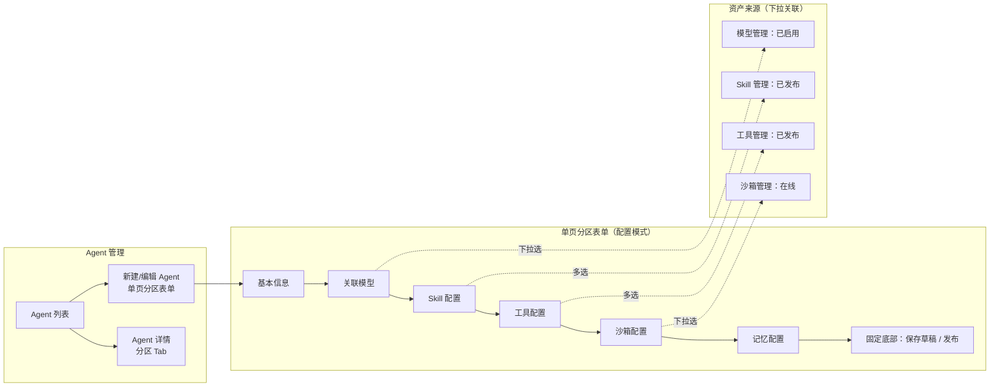
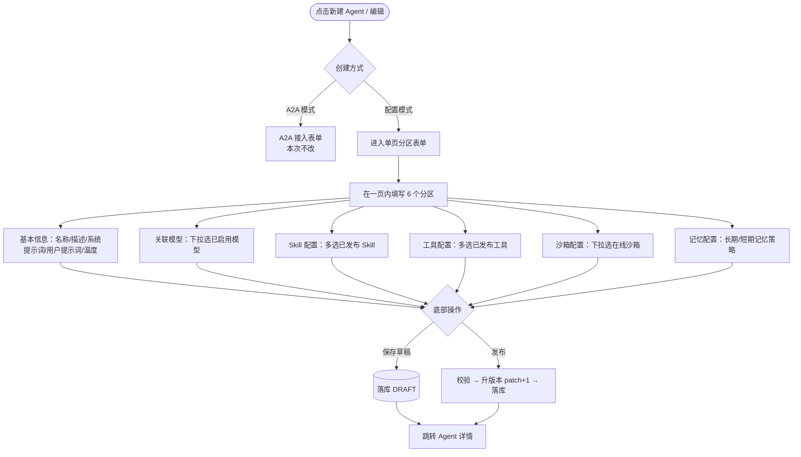
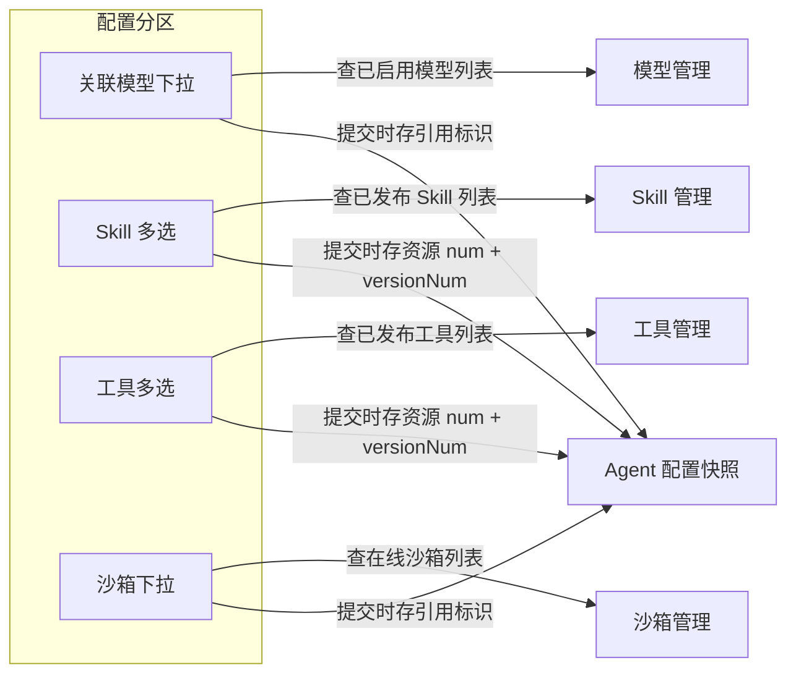
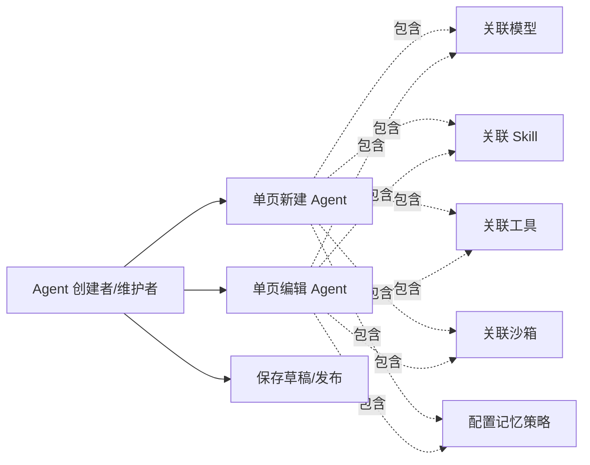

# AgentOps — Agent 配置优化 PRD（单页表单 + 资产化关联）

> 文档日期：2026-06-11　|　版本：v1.0　|　覆盖周期：S2（2026-04 ~ 2026-07）
> 父文档：[Agent 管理 PRD v3.0](./2026-05-11-Agent管理-PRD.md) · [Agent 优化 PRD v1.2](./2026-06-04-Agent优化-PRD.md)
> 关联模块：[模型管理 PRD](./2026-06-10-模型管理-PRD.md) · [Skill 管理 PRD](./2026-05-11-Skill管理-PRD.md) · [工具管理 PRD](./2026-06-01-工具管理-PRD.md) · [沙箱管理 PRD](./2026-06-08-沙箱管理-PRD.md)

> **本 PRD 定位**：对 [Agent 管理 PRD v3.0](./2026-05-11-Agent管理-PRD.md)（配置模式 5 步表单）的一次**配置形态重构**。本文为权威源；与父 PRD 冲突处以本文为准，落地后回填父 PRD。**仅改造「配置模式（CONFIG）Agent」的新建 / 编辑配置形态**；A2A 模式、版本化、秘钥管理、状态机等其余能力一律不变。

> **核心变更一句话**：把配置模式 Agent 的「5 步分步表单」改为「**单页分区表单**」，并让模型 / 工具 / 沙箱配置都改为**从对应资产模块下拉关联**（不再手填），新增沙箱配置与记忆配置分区。

---

## 1. 产品/需求背景

- **为什么要做**：
  - **分步割裂**：现状配置模式新建走 5 步（Step1 基本信息 → Step2 模型 → Step3 Skill → Step4 MCP → Step5 高级），每步「下一步」跳转，配置一个 Agent 要点 4 次「下一步」，回头改某项要逐步退回，体验割裂、心智负担重。
  - **模型手填易错**：现状 Step2 要手填「模型秘钥 + 模型 URL + 模型名」，与平台已上线的**模型管理**模块重复——模型接入信息本应在模型管理统一登记、Agent 直接选用，手填既易错（URL/key 拼错）又无法复用、无法统一启停。
  - **沙箱无处配**：**沙箱管理**模块已上线（代码沙箱资产），但 Agent 配置里没有沙箱配置入口，Agent 无法关联沙箱执行代码类能力。
  - **命名与现状不一致**：现状叫「MCP 配置」，但平台已把 MCP / FunctionCall 统一进**工具管理**模块，术语应对齐为「工具配置」。
- **解决什么问题**：让配置一个 Agent 在**一页内**完成；模型 / 工具 / 沙箱全部改为**从资产模块下拉关联**（选已就绪资产，不手填）；补齐沙箱配置；术语对齐。
- **面向用户**：Agent 创建者 / 维护者（部门内研发、产品）。

---

## 2. 目标与范围

### 2.1 目标

| 目标 | 度量 |
| --- | --- |
| 单页配置 | 配置模式 Agent 新建 / 编辑在**一个页面**内完成，无「下一步 / 上一步」 |
| 模型资产化 | 模型从模型管理「已启用」列表下拉选择，不再手填 key / URL |
| 能力资产化 | Skill / 工具 / 沙箱均从对应模块下拉关联 |
| 沙箱可配 | Agent 可关联沙箱（来自沙箱管理「在线」沙箱） |
| 术语对齐 | 「MCP 配置」→「工具配置」；「高级配置」→「记忆配置」 |

### 2.2 范围

**本次做**

- 配置模式 Agent 新建 / 编辑：**5 步分步表单 → 单页分区表单**（样式参考工具模块编辑器）。
- 6 个配置分区：**基本信息 / 关联模型 / Skill 配置 / 工具配置 / 沙箱配置 / 记忆配置**。
- **系统提示词支持从提示词中心选择**：基本信息分区的系统提示词可一键从 Prompt 中心选取模板内容填入。
- **「工具与上下文」统一交互组件**：Skill / 工具 / 沙箱 / 记忆（+ 知识库占位）合并为横向 Tab + 计数徽标 + 右侧「+ 添加」的交互（对齐目标 UI，见 §7.6A / §8.1A）。
- **关联模型**：下拉选择模型管理中「已启用」的模型（替代手填模型秘钥 / 模型 URL / 模型名）。
- **Skill 配置**：下拉关联 Skill 管理「已发布」Skill（沿用现状，移入单页分区）。
- **工具配置**（原 MCP 配置）：下拉关联工具管理「已发布」工具（MCP / FunctionCall）。
- **沙箱配置**（新增）：下拉关联沙箱管理「在线」沙箱。
- **记忆配置**（原高级配置）：长期 / 短期记忆策略（+ 原限流参数，沿用现状内容，仅改分区名）。
- 详情页对应 Tab 同步调整（与单页分区一一对应）。

**本次不做**

- ❌ A2A 模式接入表单（保持现状，不受影响）。
- ❌ Agent 状态机 / 版本化 / 发布流程（沿用 Agent 优化 PRD v1.2：固定 patch+1，无影响等级）。
- ❌ 秘钥管理 Tab、对外 API 认证（沿用 Agent 优化 PRD v1.2，不变）。
- ❌ Agent 类型扩展（仍固定 NORMAL，监督者 / 路由进 S3）。
- ❌ 模型 / 工具 / 沙箱 / Skill 各资产模块自身的能力（本次只做「在 Agent 里关联它们」）。
- ❌ 知识库（KB）配置（KB 模块未就绪，不纳入）。
- ❌ 模型 / 工具 / 沙箱的多选（除 Skill / 工具为多选外，模型 / 沙箱本期按单选，见 §7 字段约束；如需多选另议）。

---

## 3. 系统线框图



**说明**：

- **单页分区表单**：所有配置分区在**同一页面**纵向排布（参考工具模块编辑器的单页表单 + 分区/卡片样式），无分步跳转；操作按钮固定底部（沿用 Agent 优化 PRD v1.2 sticky footer）。
- **资产来源**：关联模型 / Skill / 工具 / 沙箱四个分区的数据均来自对应资产模块的「可用状态」列表（模型=已启用、Skill=已发布、工具=已发布、沙箱=在线）。
- **A2A 模式**：新建入口仍可选 A2A，但 A2A 走原接入表单，不在本次单页表单改造范围。

---

## 4. 业务流程图

### 4.1 配置模式 Agent 新建 / 编辑（单页表单）



### 4.2 资产关联数据流



> Agent 配置不拷贝资产内容。模型 / 沙箱按引用标识解析；Skill / 工具等带版本资源必须在快照中保存资源 num + versionNum，运行时按快照版本取配置，不隐式取最新发布版本。空列表时分区显示 Empty + 引导（「请先到 XX 管理新建并启用 / 发布 / 上线」）。

---

## 5. 用例图



---

## 6. 用户与场景

| 角色 | 典型场景 |
| --- | --- |
| **Agent 创建者** | 新建一个客服 Agent：填名称/提示词 → 选已启用的 GPT-4o 模型 → 勾 3 个 Skill → 勾 1 个 MCP 工具 → 选 1 个在线沙箱 → 设记忆策略 → 一页内点「发布」 |
| **Agent 维护者** | 给现有 Agent 换模型 / 加一个工具：进编辑页，在对应分区下拉改选 → 发布升版本，无需逐步「下一步」 |

**用户故事**

- 作为 **Agent 创建者**，我希望在一个页面里把所有配置填完，不用反复点「下一步」。
- 作为 **Agent 创建者**，我希望模型直接从已启用的模型里选，不用手抄 API key 和 URL。
- 作为 **Agent 维护者**，我希望能给 Agent 关联沙箱，让它能跑代码类能力。

---

## 7. 功能需求

> 优先级：P0 必做 / P1 重要 / P2 增强。

### 7.1 单页分区表单（核心改造）

| 序号 | 功能点 | 简要说明 | 优先级 |
| --- | --- | --- | --- |
| 1.1 | 去分步 | 删除 5 步「下一步 / 上一步」分步交互；6 个配置分区在**同一页面**纵向排布 | P0 |
| 1.2 | 分区样式 | 参考工具模块编辑器：单页表单 + 分区标题 + 字段分组（卡片 / 折叠块）；同一组件用于新建与编辑 | P0 |
| 1.3 | 固定底部操作 | 「保存草稿 / 发布 / 取消」按钮 sticky 到表单底部，不随内容滚动（沿用 Agent 优化 PRD v1.2） | P0 |
| 1.4 | 分区内校验 | 提交时整页校验，错误分区高亮 + 滚动定位到首个错误（无分步拦截） | P1 |
| 1.5 | 编辑态回填 | 编辑时各分区回填当前 Agent 配置（含已关联的模型 / Skill / 工具 / 沙箱标识） | P0 |

### 7.2 基本信息分区

| 序号 | 字段 | 说明 | 优先级 |
| --- | --- | --- | --- |
| 2.1 | 名称 | 必填，同工作空间内唯一（沿用 Agent 优化 PRD v1.2） | P0 |
| 2.2 | 描述 | 多行，可空 | P0 |
| 2.3 | 系统提示词 | 多行，必填 | P0 |
| 2.4 | **从提示词中心选择**（新增） | 系统提示词支持从**提示词中心**（Prompt 中心）下拉 / 弹窗选择已有 Prompt，选中后将其模板内容填入系统提示词编辑框；可在填入后继续手动编辑（仅取内容快照，不与 Prompt 中心保持联动）；含 `{{变量名}}` 的模板原样填入，变量替换由用户/运行时处理 | P1 |
| 2.5 | 用户提示词 | 多行，可空 | P1 |
| 2.6 | 温度 | 0.0 ~ 2.0，默认 0.7 | P1 |

### 7.3 关联模型分区（改造：手填 → 下拉关联）

| 序号 | 功能点 | 简要说明 | 优先级 |
| --- | --- | --- | --- |
| 3.1 | 模型下拉 | **必填，单选**；下拉来自模型管理**「已启用」**模型列表（按模型名称 / 模型 ID 检索） | P0 |
| 3.2 | 只存引用 | Agent 仅存所选模型的**引用标识（模型 ID）**；不再存模型秘钥 / 模型 URL（这些由模型管理维护） | P0 |
| 3.3 | 选中元信息 | 选定后展示该模型只读元信息（名称 / 模型 ID / Base URL 脱敏等），便于确认 | P1 |
| 3.4 | 空 / 失效处理 | 无已启用模型时 Empty + 引导「请先到模型管理新建并启用模型」；已关联模型被禁用 / 删除时编辑页标红提示重选 | P1 |

> **作废**：现状 Step2 的「模型秘钥」「模型 URL 地址」手填字段及其加密存储逻辑（改由模型管理承载）。运行时由模型 ID 解析模型管理中的 key / URL 装配 LLM。

### 7.4 Skill 配置分区

| 序号 | 功能点 | 简要说明 | 优先级 |
| --- | --- | --- | --- |
| 4.1 | Skill 多选 | 多选，来自 Skill 管理**「已发布」**列表；可搜索名称 / 标签（沿用现状交互，移入单页分区） | P0 |
| 4.2 | 存版本化引用 | 保存所选 Skill 的 `skillNum + versionNum`；默认绑定当前已发布版本，运行时按版本取 Skill 配置 | P0 |
| 4.3 | 空处理 | 无已发布 Skill 时 Empty + 引导 | P1 |
| 4.4 | 版本失效处理 | 已绑定 Skill 版本被删除 / 弃用 / 不存在时，编辑页标红提示重选，运行前返回明确错误 | P1 |

### 7.5 工具配置分区（原 MCP 配置，术语对齐）

| 序号 | 功能点 | 简要说明 | 优先级 |
| --- | --- | --- | --- |
| 5.1 | 工具多选 | 多选，来自工具管理**「已发布」**列表（含 MCP / FunctionCall）；可搜索名称 / 类型 | P0 |
| 5.2 | 存版本化引用 | 保存所选工具的 `toolNum + versionNum`；默认绑定当前已发布版本，运行时按版本取工具配置 | P0 |
| 5.3 | 术语对齐 | 界面 / 字段 / 文案由「MCP 配置」统一改为「工具配置」 | P0 |
| 5.4 | 空处理 | 无已发布工具时 Empty + 引导 | P1 |
| 5.5 | 版本失效处理 | 已绑定工具版本被删除 / 弃用 / 不存在时，编辑页标红提示重选，运行前返回明确错误 | P1 |

### 7.6 沙箱配置分区（新增）

| 序号 | 功能点 | 简要说明 | 优先级 |
| --- | --- | --- | --- |
| 6.1 | 沙箱下拉 | **单选，可空**；下拉来自沙箱管理**「在线」**沙箱列表（按名称检索） | P0 |
| 6.2 | 只存引用 | 仅存所选沙箱的引用标识 | P0 |
| 6.3 | 选中元信息 | 选定后展示沙箱只读规格（类型 / CPU / 内存 / 状态） | P1 |
| 6.4 | 空 / 失效处理 | 无在线沙箱时 Empty + 引导「请先到沙箱管理新建并上线沙箱」；已关联沙箱下线 / 删除时编辑页标红提示 | P1 |

### 7.6A「工具与上下文」交互组件（Skill / 工具 / 沙箱 / 记忆统一区，UI 改造）

> §7.4 Skill、§7.5 工具、§7.6 沙箱、§7.7 记忆四个分区**在界面上合并为一个「工具与上下文」区块**，采用**横向 Tab + 计数徽标**的交互（见 §8.1A 原型图，对齐用户提供的目标 UI），替代原各自独立的双栏候选/已选交互。各分区的字段约束与数据来源不变，仅交互容器统一。

| 序号 | 功能点 | 简要说明 | 优先级 |
| --- | --- | --- | --- |
| 6A.1 | 横向 Tab 容器 | 「工具与上下文」区块内横向排列 Tab：**Skills / 工具 / 沙箱 / 知识库 / 记忆**；每个 Tab 标题右侧带**计数徽标**（已选数量，如 `Skills 0`、`工具 2`） | P0 |
| 6A.2 | 右侧添加按钮 | 区块右上角「+ 添加」按钮随当前激活 Tab 变化（如 Skills Tab → `+ Skills`、工具 Tab → `+ 工具`）；点击弹出对应资产选择器（来源/状态门槛见 §7.4~§7.6） | P0 |
| 6A.3 | Tab 内已选列表 | 切到某 Tab 显示该类已选项列表（名称 + 移除按钮），可逐项移除；空时显示该 Tab 的功能说明 + 引导 | P0 |
| 6A.4 | 功能说明区 | Tab 下方展示该类能力的说明文案（如 Skills：「内置查询 AgentRun 平台管理的 Skills，按需下载调用」+ 安全提示），对齐目标 UI | P2 |
| 6A.5 | 知识库 Tab 占位 | 「知识库」Tab 保留展示但**禁用**（KB 模块未就绪），hover 提示「知识库暂未上线」；计数恒为 0 | P1 |
| 6A.6 | 记忆 Tab | 「记忆」Tab 内承载 §7.7 记忆配置（长期 / 短期策略 + 限流折叠）；计数可表示是否启用记忆（0 = 未配置 / 1 = 已配置，具体由实现定） | P1 |


### 7.7 记忆配置分区（原高级配置，仅改分区名）

| 序号 | 字段 | 说明 | 优先级 |
| --- | --- | --- | --- |
| 7.1 | 长期记忆策略 | 单选下拉：`无` / `向量召回` / `全文召回`（沿用现状） | P1 |
| 7.2 | 短期记忆策略 | 单选下拉：`无` / `最近 N 轮`（默认 N=10）/ `滑动窗口`（沿用现状） | P1 |
| 7.3 | 限流参数（可选） | QPS / 日预算，折叠块内（沿用现状，从「高级配置」平移） | P2 |
| 7.4 | 分区命名 | 界面分区名由「高级配置」改为「记忆配置」；限流参数作为该分区下的可选折叠项 | P1 |

### 7.8 详情页同步

| 序号 | 功能点 | 简要说明 | 优先级 |
| --- | --- | --- | --- |
| 8.1 | Tab 对齐 | 配置模式详情页 Tab 与单页分区对齐：基本信息 / 关联模型 / Skill 配置 / 工具配置 / 沙箱配置 / 记忆配置（+ 保留 API 信息 / 秘钥管理 Tab） | P1 |
| 8.2 | 编辑入口 | 详情页「编辑」进入单页表单编辑态（沿用现状编辑跳转语义） | P1 |

> **其他一律不变**：A2A 模式、状态机（CONFIG 草稿/发布/下线）、版本化（patch+1）、秘钥管理、对外 API、调试入口、评测入口等均沿用父 PRD 与 Agent 优化 PRD v1.2，本次不动。

---

## 8. 原型图 / 界面说明

> 沿用平台扁平化模板（白底 + `#E2E8F0` 边框 + radius 8），单页表单样式对齐工具模块编辑器。

### 8.1 单页分区表单（配置模式新建 / 编辑）

```
┌─ 新建 Agent · 配置模式 ───────────────────────────────────────────┐
│ 创建方式：[ ⚙ 配置模式 │ 🔗 A2A 模式 ]   （选配置模式后展示下方单页表单）│
│ ──────────────────────────────────────────────────────────────────│
│ ▣ 基本信息                                                          │
│   名称[____________]  温度[0.7]                                     │
│   描述[__________________________________________________]         │
│   系统提示词 *                    [+ 从提示词中心选择] [✦ 帮我优化] │
│   [____________________________________________________]          │
│   用户提示词[____________________________________________]         │
│ ──────────────────────────────────────────────────────────────────│
│ ▣ 关联模型                                                          │
│   模型[ 下拉：已启用模型 ▾ ]   选中→ 名称/模型ID/BaseURL(脱敏) 只读  │
│ ──────────────────────────────────────────────────────────────────│
│ ▣ 工具与上下文                                                      │
│   [ Skills (2) │ 工具 (1) │ 沙箱 (1) │ 知识库 (0) │ 记忆 (1) ]  [+ Skills]│
│   ┌──────────────────────────────────────────────────────────────┐ │
│   │ (当前 Tab=Skills) 已选：[skl-a ✕] [skl-b ✕]                   │ │
│   │ 功能说明：按需查询 AgentRun 平台管理的 Skills，下载调用…       │ │
│   └──────────────────────────────────────────────────────────────┘ │
│   · 工具 Tab → [+ 工具] 选已发布工具(MCP/FC)                         │
│   · 沙箱 Tab → [+ 沙箱] 选在线沙箱(单选)                             │
│   · 知识库 Tab → 占位禁用（暂未上线）                                │
│   · 记忆 Tab → 长期[无▾] 短期[最近N轮▾] ▸限流参数(可选折叠)          │
│ ──────────────────────────────────────────────────────────────────│
│ ───────── sticky footer ─────────                                   │
│                          [取消]  [保存草稿]  [发布]                  │
└────────────────────────────────────────────────────────────────────┘
```

- 基本信息 + 关联模型 + 「工具与上下文」区块在同一页纵向排布，无「下一步」。
- **系统提示词**右上角支持「从提示词中心选择」（填入 Prompt 模板内容）+「帮我优化」。
- **「工具与上下文」**用横向 Tab + 计数徽标承载 Skill / 工具 / 沙箱 / 知识库 / 记忆，右上「+ 添加」按钮随激活 Tab 变化（见 §8.1A）。
- 底部操作栏 sticky，始终可见。

### 8.1A「工具与上下文」交互组件（对齐目标 UI）

```
┌─ 工具与上下文 ─────────────────────────────────────────────────────┐
│ 可使用各类工具拓展 Agent 能力，也可接入知识库和记忆提升回复准确性    │
│ ┌────────────────────────────────────────────────────────────────┐ │
│ │ [Skills 0] [工具 0] [沙箱 0] [知识库 0] [记忆 0]      [+ Skills] │ │  ← Tab 计数徽标 + 右侧添加(随激活Tab变)
│ └────────────────────────────────────────────────────────────────┘ │
│ ┌─ 当前激活 Tab 的内容区 ────────────────────────────────────────┐ │
│ │ 已选列表：[名称 ✕] [名称 ✕] …（空时显示功能说明 + 引导）        │ │
│ │ 功能说明：<该类能力一句话说明 + 安全提示>                       │ │
│ └────────────────────────────────────────────────────────────────┘ │
└────────────────────────────────────────────────────────────────────┘
```

- Tab：**Skills / 工具 / 沙箱 / 知识库 / 记忆**；标题右侧数字为已选计数。
- 右上「+ 添加」按钮文案随激活 Tab 切换（`+ Skills` / `+ 工具` / `+ 沙箱`）→ 弹对应资产选择器。
- 「知识库」Tab 占位禁用；「记忆」Tab 内为记忆策略配置。
- 资产来源/状态门槛：Skills=已发布、工具=已发布、沙箱=在线（沙箱单选、Skills/工具多选）。

### 8.2 资产下拉空态 / 选择器空态

```
┌─ 关联模型 ──────────────────────────────┐
│  暂无可用模型                            │
│  请先到「模型管理」新建并启用模型  [前往]  │
└──────────────────────────────────────────┘
```

### 8.3 关键状态

| 状态 | 处理 |
| --- | --- |
| 资产列表为空 | 分区内 Empty + 跳对应管理模块引导 |
| 已关联资产失效（模型禁用 / 沙箱下线 / Skill·工具弃用） | 编辑页该项标红 + 提示重选；不阻塞其它分区 |
| 整页校验失败 | 滚动定位首个错误分区 + 字段标红 |
| 编辑态 | 各分区回填当前配置；模型 / 沙箱回填引用 + 只读元信息 |

---

## 9. 非功能需求

| 项 | 目标 |
| --- | --- |
| 表单加载 | 单页表单含 4 个资产下拉，首屏 ≤ 1.5s（下拉列表可懒加载 / 按需搜索） |
| 引用一致性 | 模型 / 沙箱按引用标识解析；Skill / 工具按快照中的资源 num + versionNum 解析指定版本；资产或版本失效有明确提示 |
| 存量处理 | **不做迁移**：存量配置模式 Agent 数据直接清除；手填模型字段（`modelApiKey/modelBaseUrl/model`）直接删除不保留（详见 §10） |
| 术语一致 | 「工具配置」「记忆配置」在表单 / 详情 / 文案中统一 |

---

## 10. 与现有功能的关系

- **改造** [Agent 管理 PRD v3.0](./2026-05-11-Agent管理-PRD.md) 配置模式的 §6.4 新建流程、§6.5 5 步表单，以及详情页 Tab；**叠加在** [Agent 优化 PRD v1.2](./2026-06-04-Agent优化-PRD.md) 之上（sticky footer / patch+1 / 同空间唯一 / 秘钥管理均保留）。
- **作废**：Step2 的「模型秘钥」「模型 URL」手填 + 加密存储链路（改由模型管理承载，Agent 存模型 ID 引用）。
- **新增**：沙箱配置分区（关联沙箱管理）。
- **术语对齐**：MCP 配置 → 工具配置（关联工具管理，含 MCP/FC）；高级配置 → 记忆配置。
- **不变**：A2A 模式、状态机、版本化、秘钥管理 Tab、对外 API、调试 / 评测入口。
- **存量处理（已决策：不迁移、不保留）**：现存配置模式 Agent 的数据**直接删除**，不做迁移；手填模型字段 `modelApiKey` / `modelBaseUrl` / `model` 从数据模型中**直接移除，不保留、不做运行时回退**。新链路一律走「模型 ID 引用模型管理」。无存量迁移脚本，仅需清理脚本（删除存量配置模式 Agent 及其相关数据）。

---

## 11. 验收标准

- [ ] 配置模式 Agent 新建 / 编辑在**一页内**完成，无「下一步 / 上一步」。
- [ ] 6 个分区齐全：基本信息 / 关联模型 / Skill 配置 / 工具配置 / 沙箱配置 / 记忆配置。
- [ ] 关联模型从模型管理「已启用」下拉选择，Agent 不再手填模型秘钥 / URL。
- [ ] Skill / 工具 / 沙箱均从对应模块（已发布 / 已发布 / 在线）下拉关联；Skill / 工具保存资源 num + versionNum，沙箱保存引用标识。
- [ ] Skill / 工具发布新版本后，已发布 Agent 仍按快照中的旧版本运行，不自动切换最新版本。
- [ ] 编辑页能回显已绑定 Skill / 工具的版本；版本失效时标红提示重选。
- [ ] 沙箱配置可关联在线沙箱并回填。
- [ ] **系统提示词可从提示词中心选择**，选中后模板内容填入并可继续编辑。
- [ ] **Skill / 工具 / 沙箱 / 记忆采用「工具与上下文」横向 Tab + 计数徽标 + 右侧「+ 添加」交互**，对齐目标 UI；知识库 Tab 占位禁用。
- [ ] 「MCP 配置」改为「工具配置」、「高级配置」改为「记忆配置」，全链路术语一致。
- [ ] 操作按钮固定底部；整页校验定位首个错误。
- [ ] A2A 模式、状态机、版本化、秘钥管理等其余能力不受影响。

---

## 附：与下游技术方案的对接提示

1. **配置快照字段调整**：Agent `ConfigSnapshot` **删除** `modelApiKey / modelBaseUrl / model`（手填，不保留），**改为** `modelId`（引用模型管理）；新增 `sandboxRef`（沙箱引用，单选可空）；Skill / 工具从 `skillNums` / `toolNums` 升级为结构化版本引用（如 `skillRefs=[{skillNum, versionNum}]`、`toolRefs=[{toolNum, versionNum}]`），兼容字段仅作旧数据读取或前端回填。
2. **资产列表接口**：四个下拉分别调模型管理（已启用）/ Skill 管理（已发布）/ 工具管理（已发布）/ 沙箱管理（在线）的列表查询；建议统一为「可选资产」轻量查询接口（id + 名称 + 必要元信息）。系统提示词「从提示词中心选择」额外调 Prompt 中心列表 + 取模板内容接口（仅取内容快照填入，不存 Prompt 引用关系）。
3. **运行时装配**：LLM 装配由「读 Agent 自带 key/url」改为「按 modelId 解析模型管理记录 → 取 key/url/model」；沙箱按引用解析；Skill / 工具按快照中的 `资源 num + versionNum` 解析指定版本配置，不取最新发布版本。
4. **存量处理（不迁移）**：存量配置模式 Agent 数据直接删除；手填模型字段直接移除、不保留、不做运行时回退。只需准备清理脚本，无迁移脚本。
5. **失效校验**：发布 / 运行前校验所引用资产是否仍可用（模型启用 / Skill 指定版本可用 / 工具指定版本可用 / 沙箱在线），失效给明确错误。
6. **单页 vs 分步**：前端表单由 Steps 组件改为单页分区 + sticky footer，整页统一校验。

---

## 附：关联文档

- [Agent 管理 PRD v3.0](./2026-05-11-Agent管理-PRD.md)
- [Agent 优化 PRD v1.2](./2026-06-04-Agent优化-PRD.md)
- [模型管理 PRD](./2026-06-10-模型管理-PRD.md) · [Skill 管理 PRD](./2026-05-11-Skill管理-PRD.md) · [工具管理 PRD](./2026-06-01-工具管理-PRD.md) · [沙箱管理 PRD](./2026-06-08-沙箱管理-PRD.md)
