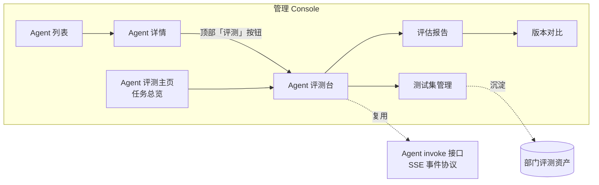
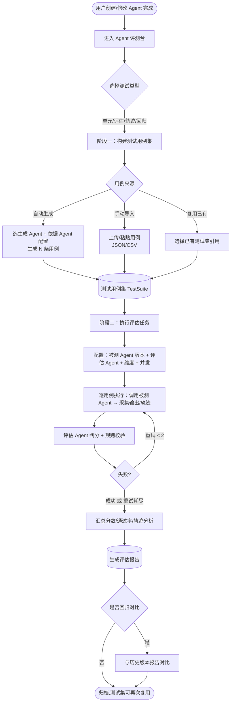
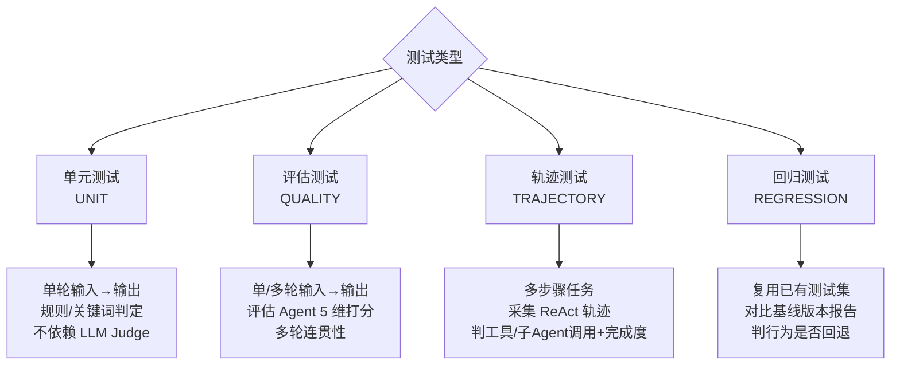
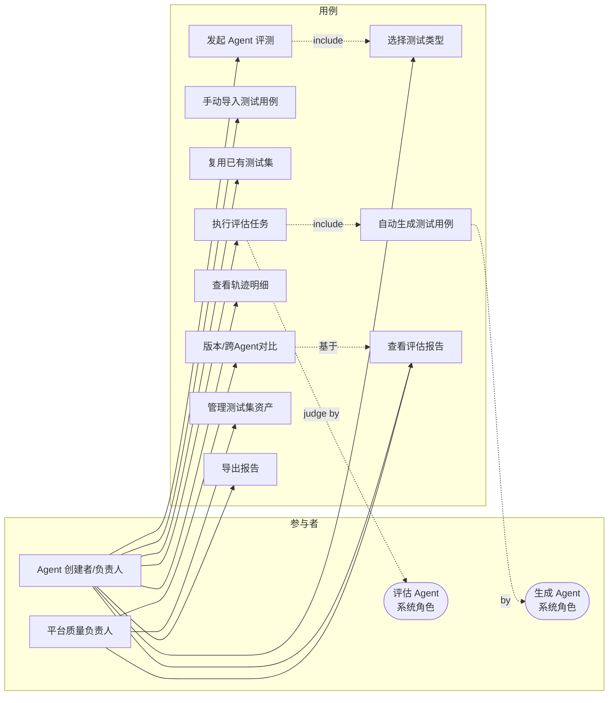

# Agent 评测 产品需求文档（PRD）

> 文档日期：2026-06-11　|　版本：v1.0　|　所属：AgentOps
> 上游：[总体规划 §5.2 评测 M1/M2/M3](../总体规划/2026-05-11-AgentOps-总体规划.md) · [Agent 管理 PRD §6.9 Agent 评测](./2026-05-11-Agent管理-PRD.md) · [Skill 管理 PRD §7.2 评测台](./2026-05-11-Skill管理-PRD.md)
> 已有底座：[评测-技术方案 v1.0](../技术方案/2026-05-11_评测-技术方案.md)（Skill/Agent 共用 `evaluation` 领域）
> 下游：交付 **design-technical-solution** 产出《Agent 评测-技术方案》

---

## 1. 产品/需求背景

- **为什么要做**：用户在平台用配置或 A2A 方式创建出 Agent 后，缺少一把"客观的尺子"判断这个 Agent 到底能不能用、好不好用、改了一版后有没有变差。当前只能靠人工在调试台逐条试，凭"感觉"判断，无法规模化、无法回归、无法沉淀。
- **解决什么问题**：
  1. **质量无背书**——Agent 上线只能凭人肉感觉，业务方"不敢规模化用"；
  2. **行为不可验证**——Agent 是多步骤、带工具调用与子 Agent 路由的复杂体，单看最终输出无法判断中间过程是否合理；
  3. **改版无回归**——Agent 配置（Prompt / 模型 / 工具 / 子 Agent）一改，没有手段验证既有能力是否回退；
  4. **用例无沉淀**——每次评测的测试数据用完即弃，无法复用、无法积累成部门资产。
- **面向用户**：Agent 创建者 / Agent 负责人（业务团队）、平台质量负责人（我）、以及作为评测对象输入方的兄弟团队（数字员工等）。

> **一句话**：把"Agent 能跑"升级为"Agent 敢规模化跑"——通过**四类测试**覆盖从单点能力到多步行为再到改版稳定性的完整质量面，并让**测试用例集可复用、可沉淀**为部门资产。

---

## 2. 目标与范围

### 2.1 目标

- **G1**：用户创建/修改 Agent 后，能针对该 Agent 发起评测，覆盖**单元测试、评估测试、轨迹测试、回归测试**四类场景；
- **G2**：评测分**两阶段**——先**构建可复用测试用例集**（评测 Agent 自动生成 或 用户手动导入），再**执行评估任务**生成评估报告；
- **G3**：一套测试用例集**可被多次复用**（同一 Agent 跨版本回归、不同 Agent 横向对比），沉淀为部门评测资产；
- **G4**：评估过程由 **Agent 评估 Agent**（LLM Judge）自动判分，沿用平台现有 5 维评分体系，产出可量化、可对比、可导出的评估报告。

### 2.2 范围（本次做什么）

| 范围 | 说明 |
| --- | --- |
| **四类测试类型** | 单元测试 / 评估测试 / 轨迹测试 / 回归测试，统一在 Agent 评测台内选择 |
| **两阶段流程** | 阶段一：测试集构建（自动生成 + 手动导入）；阶段二：评估执行 + 报告 |
| **可复用测试集（TestSuite）** | 测试用例独立于评测任务存在，可被多次引用执行 |
| **三类参与 Agent** | 被测 Agent（执行）、生成 Agent（造用例）、评估 Agent（判分） |
| **评估报告** | 总分 / 通过率 / 5 维雷达 / 轨迹明细 / 用例级判定 / 版本对比 / 导出 |
| **Agent 特有维度** | 多轮对话连贯性、工具/子 Agent 调用正确性、任务完成度与轨迹合理性 |
| **入口** | Agent 详情页"评测"按钮 + Agent 评测主页（任务总览） |

### 2.3 不做什么（本次明确排除）

- ❌ **评测门禁/上线卡口**（必过才能发布）——进 M3，本次只产出分数不拦上线；
- ❌ Skill 评测改造——本 PRD 只聚焦 Agent；Skill 评测沿用现有体系；
- ❌ 自训 reward model / 评分模型微调——评估 Agent 复用平台 LLM 代理；
- ❌ 评测结果驱动的自动优化/调参闭环——进 S3；
- ❌ 跨部门评测集共享市场——进 S3；
- ❌ 实时 SSE 推送评测进度——M2 用前端 Polling，SSE 进 S3。

### 2.4 阶段定位

> 本 PRD **聚焦 M2 自动评测**。M1 人工调试已由 [Agent 管理 PRD §6.9](./2026-05-11-Agent管理-PRD.md) 覆盖；M3 评测门禁/月度报告在本 PRD 中仅标注衔接点，不展开。

---

## 3. 系统线框图（优先产出）

### 3.1 Agent 评测在平台中的位置

Agent 评测是平台 8 大模块中"评测体系"的 Agent 侧落地，从 **Agent 详情页**或 **Agent 评测主页**进入，运行时复用 Agent 的 `invoke` 接口。



### 3.2 页面结构与职责

| 页面/模块 | 路由（建议） | 职责 |
| --- | --- | --- |
| **Agent 评测主页** | `/agent/evaluation` | 全部 Agent 评测任务总览 + 4 张统计卡 + 发起评测入口 |
| **Agent 评测台** | `/agent/evaluation/run/:agentNum` | 选测试类型 → 两阶段配置 → 发起评测（核心页） |
| **测试集管理** | `/agent/evaluation/suites` | 测试用例集 CRUD、自动生成、手动导入、复用引用 |
| **评估报告详情** | `/agent/evaluation/report/:evalNum` | 总分/通过率/雷达/轨迹/用例明细/导出 CSV |
| **版本对比** | `/agent/evaluation/compare` | 同一 Agent 跨版本 或 跨 Agent 报告对比 |

---

## 4. 业务流程图

### 4.1 主流程：两阶段评测



### 4.2 四类测试的差异化执行



### 4.3 关键异常分支

- **生成 Agent 生成用例失败**：提示并允许重试或转手动导入；
- **被测 Agent 单条调用失败**：用例级重试 ≤ 2 次，最终仍失败记为 `FAILED` 但不阻塞整批；
- **评估 Agent 判分超时/限流**：同款重试；全批判分失败才置任务 `FAILED`；
- **回归测试缺少基线**：提示"该 Agent 暂无历史报告，本次将作为基线归档"。

---

## 5. 用例图



**图例说明**

- **生成 Agent / 评估 Agent**：系统内的特殊 Agent 角色，分别承担"造用例"与"判分"，由用户在配置时选定，非自然人；
- `发起评测` 包含 `选择测试类型`；`执行评估` 在自动生成模式下包含 `自动生成用例`，并由 `评估 Agent` 判分；
- 质量负责人侧重资产治理（测试集管理、跨版本对比）。

---

## 6. 用户与场景

### 6.1 用户角色

| 角色 | 关注点 | 在评测中的动作 |
| --- | --- | --- |
| **Agent 创建者** | 我建的 Agent 质量够不够上线 | 建用例集、跑评测、看报告、按报告改配置 |
| **Agent 负责人** | 业务 Agent 的持续质量 | 改版后跑回归、对比版本、维护测试集 |
| **平台质量负责人** | 部门整体评测水位与资产 | 治理测试集、横向对比多 Agent、推动评测覆盖率 |
| **生成 Agent**（系统） | 按被测 Agent 配置造高质量用例 | 被调用生成测试用例 |
| **评估 Agent**（系统） | 客观、稳定地判分 | 被调用按维度打分 + 轨迹合理性判定 |

### 6.2 典型用户故事

- **US1（单元）**：作为创建者，我希望对刚建好的客服 Agent 跑一批"输入→预期回复"的单元用例，用关键词/规则快速判定基础能力是否达标，不必等 LLM Judge。
- **US2（评估）**：作为负责人，我希望评估 Agent 对一组多轮对话用例按"准确/相关/完整/风格/合规"5 维打分，看 Agent 的输出质量与多轮连贯性。
- **US3（轨迹）**：作为创建者，我的 Agent 会调用工具和子 Agent，我希望评测能采集每步 ReAct 轨迹，判断它**有没有选对工具、传对参数、走对子 Agent、最终是否达成任务**。
- **US4（回归）**：作为负责人，我改了 Agent 的 Prompt 后，希望**复用上一版的测试集**重新跑一遍，并和上一版报告对比，确认既有能力没有回退。
- **US5（复用沉淀）**：作为质量负责人，我希望把跑出来质量高的用例集保存为部门资产，供其它同类 Agent 直接引用，不必重复造。

---

## 7. 功能需求

> 优先级：P0 = M2 必交付；P1 = M2 尽量；P2 = 衔接 M3。所有功能点与 §3 线框图、§4 流程图、§5 用例图一致。

### 7.1 测试类型选择（评测台入口）

| 序号 | 功能点 | 简要说明 | 优先级 |
| --- | --- | --- | --- |
| 1.1 | 四类测试类型选择 | 单元 UNIT / 评估 QUALITY / 轨迹 TRAJECTORY / 回归 REGRESSION，单选，决定后续阶段一/二的可选项 | P0 |
| 1.2 | 类型说明引导 | 每类测试旁注"测什么/判分方式/适用场景"，降低理解成本 | P1 |
| 1.3 | 从 Agent 详情进入 | Agent 详情页顶部"评测"按钮带入 `agentNum` 并预填被测 Agent | P0 |

#### 四类测试定义（统一口径）

| 测试类型 | 测什么 | 输入形态 | 判分方式 | Agent 特有点 |
| --- | --- | --- | --- | --- |
| **单元测试 UNIT** | 单点能力是否达标 | 单轮 输入→预期 | 关键词 / 规则（不强制 LLM Judge） | 快速、低成本回归基础能力 |
| **评估测试 QUALITY** | LLM 输出质量 | 单轮或多轮对话 | 评估 Agent 5 维打分 | **多轮对话连贯性**纳入评分 |
| **轨迹测试 TRAJECTORY** | 多步骤行为是否合理 | 任务型指令 | 轨迹规则 + 评估 Agent 合理性判定 | **工具/子 Agent 调用正确性 + 任务完成度** |
| **回归测试 REGRESSION** | 行为稳定性 | 复用已有测试集 | 与基线报告逐项对比 | 跨版本行为是否回退 |

### 7.2 阶段一：测试用例集构建（可复用）

| 序号 | 功能点 | 简要说明 | 优先级 |
| --- | --- | --- | --- |
| 2.1 | **测试集（TestSuite）独立实体** | 用例集独立于评测任务存在，有自己的 num/名称/类型/版本，可被多次引用执行 | P0 |
| 2.2 | 自动生成用例 | 选**生成 Agent** + 依据被测 Agent 配置（描述/输入 schema/工具/子 Agent）生成 N 条用例 | P0 |
| 2.3 | 手动导入用例 | 支持 JSON/CSV 上传或表单粘贴；字段：input、expectedOutput?、期望轨迹?（轨迹测试） | P0 |
| 2.4 | 用例编辑/增删 | 生成或导入后可人工修订（改预期、删噪声、补边界） | P1 |
| 2.5 | 测试集复用引用 | 阶段二可直接选"已有测试集"，无需重建（回归测试的基础） | P0 |
| 2.6 | 测试集版本/快照 | 测试集被某次评测引用时记录快照，保证历史报告可复现 | P1 |
| 2.7 | 人工调试结果回流 | M1 人工调试中跑出的好用例一键存入测试集（沿用现有 saveSeed 思路） | P1 |

### 7.3 阶段二：评估任务执行

| 序号 | 功能点 | 简要说明 | 优先级 |
| --- | --- | --- | --- |
| 3.1 | 评估配置 | 被测 Agent + 版本（锁定）+ 评估 Agent + 评分维度 + 并发数（默认 5）+ 引用的测试集 | P0 |
| 3.2 | 版本锁定 | 创建评测时一次性锁定被测/生成/评估 Agent 版本号，过程中发布新版不影响本次（A2A 取 Nacos 元数据 version） | P0 |
| 3.3 | 逐用例执行 | 复用 Agent `invoke` 接口取流并聚合 final；轨迹测试额外采集每步事件 | P0 |
| 3.4 | 评估 Agent 判分 | LLM Judge 按所选维度独立打分 + 轨迹合理性判定 | P0 |
| 3.5 | 用例级重试 | 单条用例 invoke/judge 失败重试 ≤ 2 次，最终失败不阻塞整批 | P0 |
| 3.6 | 异步执行 + 进度 | 任务 PENDING→RUNNING→SUCCESS/FAILED；前端 Polling 拉进度 | P0 |
| 3.7 | 并发控制 | 并发 ∈ [1,20]，线程池兜底，防 OOM/限流 | P1 |

### 7.4 评估维度（沿用现有 5 维 + Agent 特有项）

| 序号 | 维度 | 说明 | 适用测试类型 | 优先级 |
| --- | --- | --- | --- | --- |
| 4.1 | 准确性 ACCURACY | 关键事实与预期一致 | 评估/轨迹 | P0 |
| 4.2 | 相关性 RELEVANCE | 是否回答了输入 | 评估/轨迹 | P0 |
| 4.3 | 完整性 COMPLETENESS | 是否覆盖预期所有要点 | 评估/轨迹 | P0 |
| 4.4 | 风格一致 STYLE | 语气/格式符合预期 | 评估 | P0 |
| 4.5 | 安全合规 COMPLIANCE | 无敏感/违规内容 | 全部 | P0 |
| 4.6 | **多轮连贯性** | 多轮对话上下文是否保持、指代是否正确 | 评估（多轮） | P0 |
| 4.7 | **工具/子Agent调用正确性** | 是否选对工具、传对参数、路由对子 Agent | 轨迹 | P0 |
| 4.8 | **任务完成度** | 多步骤后是否达成最终目标、步数/时延是否合理 | 轨迹 | P0 |

### 7.5 评估报告

| 序号 | 功能点 | 简要说明 | 优先级 |
| --- | --- | --- | --- |
| 5.1 | 报告概览 | 总分 / 通过率 / 平均时延 / 用例数 / 被测版本 | P0 |
| 5.2 | 5 维雷达图 | 评估/轨迹测试展示维度得分雷达 | P0 |
| 5.3 | 用例明细表 | 每条：input / actual / expected / 判定 / 维度分 / 时延 / traceId | P0 |
| 5.4 | **轨迹明细** | 轨迹测试展示每步：思考/工具调用/参数/子Agent/观察，标注合理性 | P0 |
| 5.5 | 导出 CSV | 报告与用例明细导出 | P1 |
| 5.6 | 报告归档 + 复用 | 报告与所用测试集关联归档，测试集可再次发起评测 | P0 |

### 7.6 版本对比与回归

| 序号 | 功能点 | 简要说明 | 优先级 |
| --- | --- | --- | --- |
| 6.1 | 同 Agent 跨版本对比 | 选两次报告，对比总分/5 维/通过率/时延差值，正负彩色标注 | P0 |
| 6.2 | 回归判定 | 回归测试自动与基线报告逐用例对比，标注"回退/持平/提升" | P0 |
| 6.3 | 跨 Agent 横向对比 | 同测试集下不同 Agent 报告对比（质量负责人选型用） | P1 |

### 7.7 Agent 评测主页

| 序号 | 功能点 | 简要说明 | 优先级 |
| --- | --- | --- | --- |
| 7.1 | 任务总览表 | Agent / 测试类型 / 测试集 / 评估 Agent / 总分 / 通过率 / 状态 / 时间 | P0 |
| 7.2 | 4 张统计卡 | 累计评测次数 / 平均通过率 / 平均时延 / 测试集资产数 | P0 |
| 7.3 | 状态筛选 | 全部/进行中/已完成/失败 + 测试类型筛选 | P1 |
| 7.4 | 发起评测入口 | "+ 新建评测任务"进入评测台 | P0 |

---

## 8. 原型图/界面说明

> 现有 Skill 评测台四张线框图（[wireframes/B4-Skill评测/](./wireframes/B4-Skill评测/)：`eval-tasks` / `eval-new` / `eval-result` / `eval-compare`）可作为 Agent 评测台 UI 基线复用。Agent 评测在其上**新增"测试类型选择"与"轨迹明细"两块**。

### 8.1 Agent 评测主页（参考 `eval-tasks.png`）

- 顶部 4 张统计卡 + 状态/类型筛选胶囊 `[全部][进行中][已完成][失败]`；
- 任务表：Agent 名 / 测试类型胶囊 / 测试集 / 评估 Agent / 总分 / 通过率 / 状态 / 创建人 / 时间 / 操作（详情·重跑·对比）；
- 右上：「测试集管理」「+ 新建评测任务」。

### 8.2 Agent 评测台 - 新建（参考 `eval-new.png`，Drawer 分步）

```
Step1 测试类型 → [单元] [评估] [轨迹] [回归]  (radio,各带一句说明)
Step2 阶段一·测试集 → 来源 [自动生成|手动导入|复用已有]
        ├ 自动生成: 选生成 Agent + 用例数(1~50) + 依据(Agent配置)
        ├ 手动导入: 上传 JSON/CSV 或粘贴
        └ 复用已有: 下拉选 TestSuite
Step3 阶段二·评估配置 → 被测 Agent(预填)+版本 / 评估 Agent / 维度勾选 / 并发
Step4 摘要确认 → 类型+测试集+被测/评估Agent概览 → [提交]
```

### 8.3 评估报告详情（参考 `eval-result.png` + 新增轨迹块）

- 面包屑 → 标题 + 「⬇ 导出 CSV」→ meta 行（Agent/版本/测试类型/评估Agent/用例数）；
- 4 KPI 卡（总通过率大字 + 通过/失败/未判定）；
- 维度雷达（评估/轨迹测试时显示）；
- 用例明细表；点开**轨迹测试**用例 → **轨迹时间线**（思考→工具调用→参数→子Agent→观察→结论，每步标 ✓/✕ 合理性）。

### 8.4 版本对比（参考 `eval-compare.png`）

- 选择条 `Base [报告A] → Target [报告B]` + 对比按钮；
- 5 KPI 卡（Base/Target/总分差/通过率差/时延差，正负彩色）+ 维度差异表（趋势 ↑↓— + 回退红/提升绿）。

### 8.5 关键状态

- **空态**：该 Agent 暂无测试集 → 引导"自动生成或导入第一个测试集"；
- **执行中**：进度条 + Polling 刷新 + 可中断提示；
- **回归无基线**：提示"本次作为基线归档"；
- **生成失败**：提示并提供"重试/转手动导入"。

---

## 9. 非功能需求

- **性能**：单批用例数 ∈ [1,50]，并发 ∈ [1,20]；用例 output 超 256KB 截断后落库即释放，防 OOM；
- **稳定性**：用例级重试 ≤ 2；评估 Agent 判分波动需可控（同题多次取均值的实验开关，沿用技术方案 §11.4）；
- **版本可追溯**：报告须记录被测/生成/评估三类 Agent 的版本号（A2A 取 Nacos 元数据 version）；
- **审计**：每条用例完整落 input/expected/actual/轨迹 + traceId，与 invocation_trace 关联；
- **权限**：评测操作遵循平台 RBAC，按工作空间隔离测试集与报告可见性；
- **复用性**：测试集为一等公民，引用时快照，保证历史报告可复现；
- **兼容**：复用 Agent `invoke` SSE 事件协议，mock 与真实同协议。

---

## 10. 与现有功能的关系

| 关系 | 说明 |
| --- | --- |
| **扩展现有 `evaluation` 领域** | 复用 Evaluation / EvaluationCase / 5 维 / LLM Judge / 版本锁定；**新增**：测试类型枚举（UNIT/QUALITY/TRAJECTORY/REGRESSION）、Agent 特有维度（多轮/工具/完成度）、轨迹采集与判定 |
| **升级 EvalSeed → TestSuite** | 现有 `eval_seed`（黄金集，绑 skillNum、用完即弃式）升级为**可复用测试集**：独立实体、支持 Agent、支持引用快照。需评估是新增 `test_suite` 表还是扩展 `eval_seed` |
| **依赖 Agent invoke** | 直接复用 `AgentInvokeStreamService.invoke(...)`；轨迹测试需 invoke 暴露分步事件（思考/工具/子Agent/观察） |
| **复用 Skill 评测台 UI** | 任务列表/新建 Drawer/报告/对比四页 UI 基线复用，新增"测试类型选择"与"轨迹明细" |
| **衔接 Agent 管理 PRD §6.9** | M1 人工调试已交付；本 PRD 补 M2 自动评测；M3 门禁衔接点预留 |
| **生成 Agent 是新角色** | 现有体系只有 executor + judge 两类 Agent，本 PRD 显式引入第三类"**生成 Agent**"（造用例），需在配置与领域模型中体现 |

> **给技术方案的提示**：本 PRD 相对现有《评测-技术方案 v1.0》的最大增量是 ——（1）**测试类型四分**且轨迹测试需采集 ReAct 分步轨迹；（2）**TestSuite 可复用实体**；（3）**生成 Agent 角色**。这三点会驱动 domain（新增 valueobject + 可能新增聚合）、infra（新表）、application（轨迹判定/用例生成编排）、adapter（测试集 CRUD 接口）的变更。

---

## 11. 验收标准

- **AC1**：用户能从 Agent 详情页发起评测，四类测试类型均可选并正确执行；
- **AC2**：阶段一可通过"自动生成 / 手动导入 / 复用已有"三种方式得到测试集，且测试集能被**第二次评测复用**；
- **AC3**：评估 Agent 能对评估测试用例产出 5 维分数与雷达图；
- **AC4**：轨迹测试报告能展示每步 ReAct 轨迹并标注工具/子Agent调用与任务完成度判定；
- **AC5**：回归测试能复用历史测试集并与基线报告对比，标注回退/持平/提升；
- **AC6**：报告记录被测/生成/评估三类 Agent 版本号，跨版本对比数值准确；
- **AC7**：单条用例失败重试 ≤ 2 次且不阻塞整批，任务最终状态正确；
- **AC8**：≥ 3 个真实业务 Agent 接入并产出完整评估报告（对齐总体规划 M2 验收信号）。

---

## 附：关联文档

- [总体规划 §5.2 评测 M1/M2/M3](../总体规划/2026-05-11-AgentOps-总体规划.md)
- [Agent 管理 PRD §6.9 Agent 评测](./2026-05-11-Agent管理-PRD.md)
- [Skill 管理 PRD §7.2 评测台](./2026-05-11-Skill管理-PRD.md)
- [评测-技术方案 v1.0（现有底座）](../技术方案/2026-05-11_评测-技术方案.md)
- [Skill 评测线框图](./wireframes/B4-Skill评测/)
