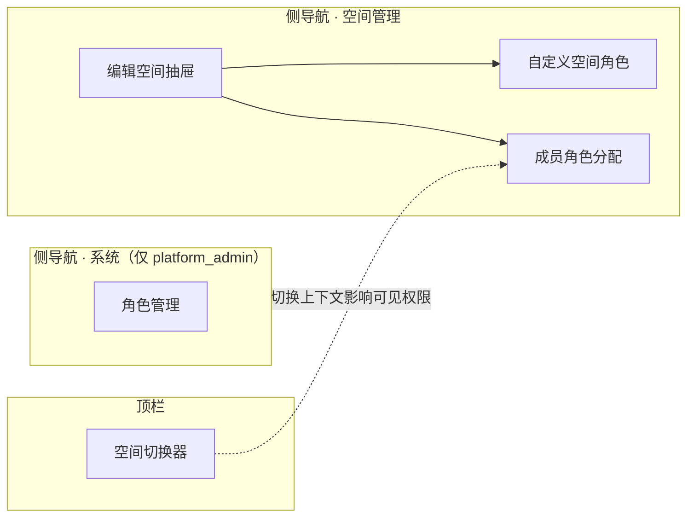
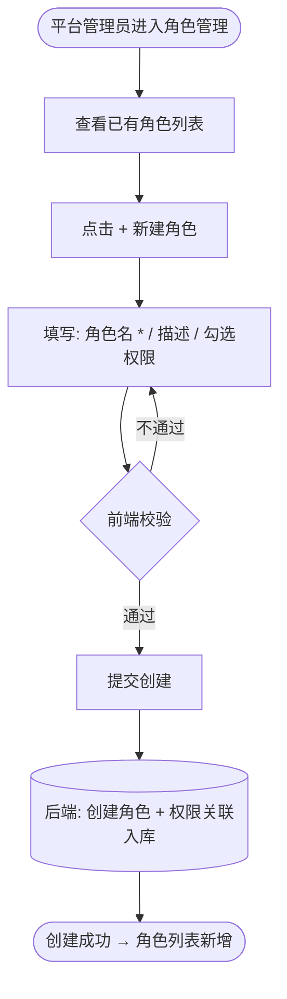
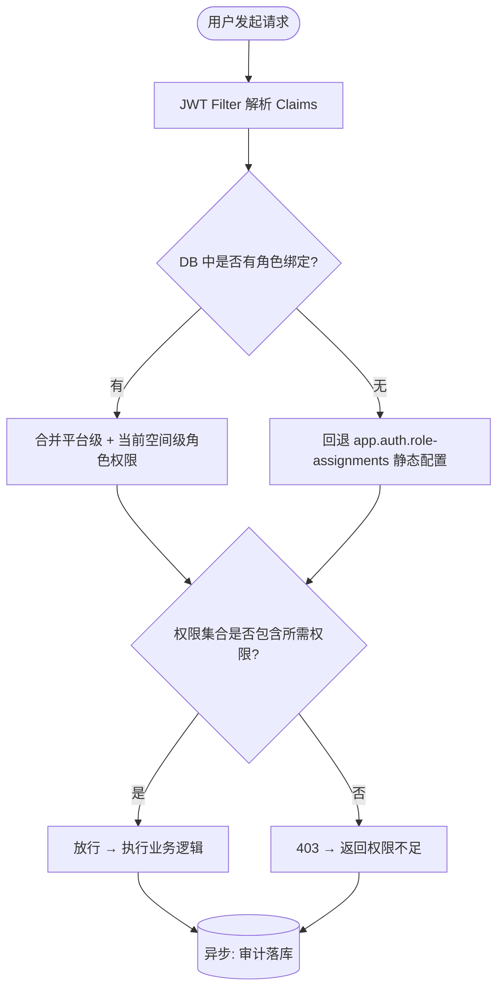
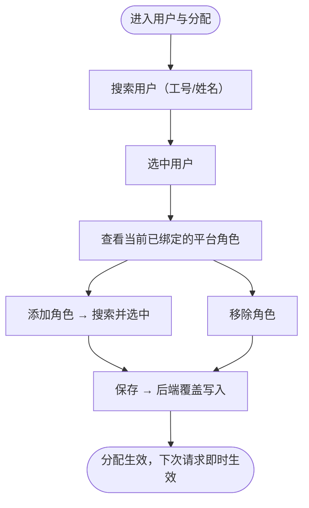
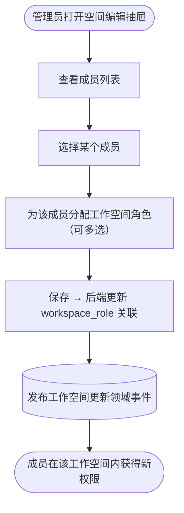
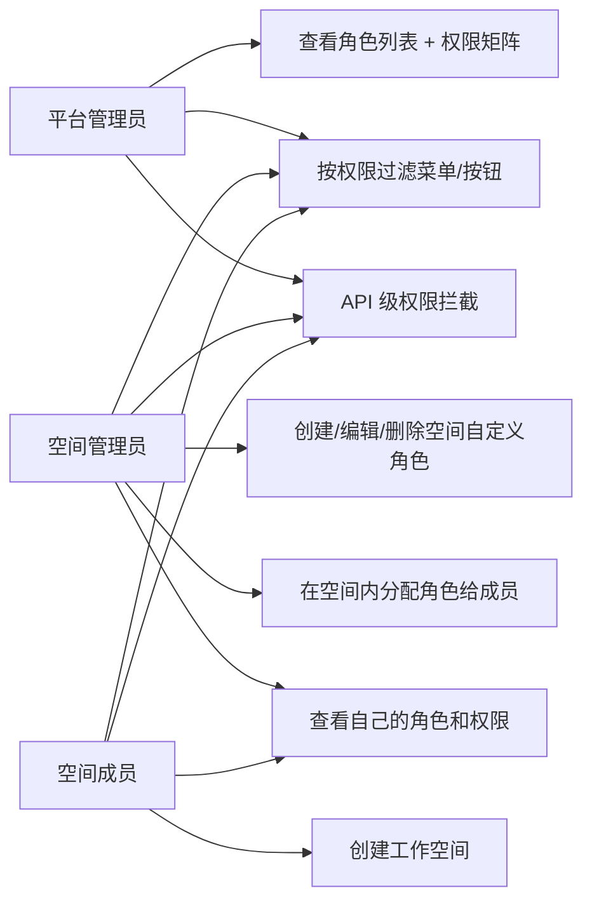
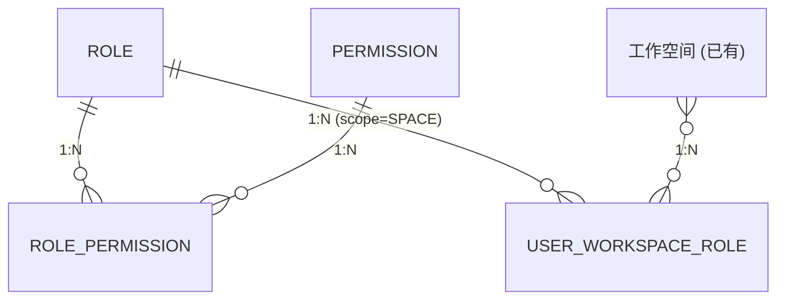

# AgentOps — 权限管理 PRD

> 文档日期：2026-06-15 | 版本：v1.0 | 覆盖周期：S3（2026-08 ~ 2026-11）
> 父文档：[S2 PRD](./2026-05-11-AgentOps-S2-PRD.md) · [架构设计](../架构设计/2026-06-01_AgentOps-架构设计文档-v1.0.md)
> 兄弟文档：[工作空间管理 PRD](./2026-06-03-工作空间管理-PRD.md) 

---

## 1. 产品/需求背景

### 1.1 为什么要做

S2 周期内平台采用**单工作空间硬编码 + 静态配置角色**兜底（参见 [S2 PRD §9.2](./2026-05-11-AgentOps-S2-PRD.md)）：

- 认证走 JWT Cookie，角色列表硬编码在 `app.auth.role-assignments` 配置文件中，仅 `itadmin` / `admin` / `editor` / `user` 四个固定角色；
- `RouteRoleMapping` 的 `buildRoleMappings()` 为空，所有路径默认仅要求"已认证"，无实际 RBAC 管控；
- 工作空间内仅"管理员/成员"两层，不做权限矩阵。

随着平台被多个业务团队接入，**缺乏细粒度权限治理**已成为规模化阻塞点：

- 所有登录用户都能看到所有 Agent / Skill / 工具，无法实现"只读"、"仅操作我的资产"等场景；
- 无法限制"谁能发布 Agent"、"谁能删除工具"等高危操作；
- 无法为新入职同事分配受限角色，只能给"全有或全无"；
- S3 路线图已明确"自定义角色"为演进重点（参见 [架构设计 §8.2](../架构设计/2026-06-01_AgentOps-架构设计文档-v1.0.md)）。

### 1.2 解决什么问题

- **RBAC 模型落地**：将所有平台操作定义为标准权限点，角色 = 权限集合；
- **两级角色体系**：平台级角色（全局）+ 空间级角色（局部），各司其职；
- **平台管理员唯一内置**：预置 `platform_admin`，拥有全部权限，不可删除/修改；
- **空间内置角色开箱即用**：每个空间创建时自动带"空间管理员"和"空间成员"两个角色，不可编辑/删除；
- **空间级自定义角色**：空间管理员可根据需要自定义空间角色，定义后在编辑空间信息时给成员分配；
- **用户默认能力**：任何用户登录后可创建工作空间，创建后自动成为该空间的管理员；
- **与现有认证基础设施无缝集成**：复用 JWT，静态 `role-assignments` 降级为兜底。

### 1.3 面向用户

| 角色 | 描述 |
| --- | --- |
| **平台管理员**（唯一） | 运维 / Tech Lead，拥有全部权限，不可删除/修改 |
| **空间管理员** | 业务线负责人，创建空间后自动获得，可管理空间属性/成员/空间角色 |
| **空间成员** | 在空间内执行日常操作的成员，具体权限由空间管理员分配的空间角色决定 |

---

## 2. 目标与范围

### 2.1 目标

| 目标 | 度量 |
| --- | --- |
| 全部平台操作权限化 | 8 大模块 ≥ 48 个操作权限点全部定义 |
| 平台管理员唯一内置 | `platform_admin` 唯一内置角色，不可删除/修改，拥有全部权限 |
| 空间内置角色开箱即用 | 每个空间创建时自动带"空间管理员"和"空间成员"两个角色 |
| 空间级自定义角色可用 | 空间管理员可从 ≥ 48 个权限点中自由勾选创建空间角色 |
| 角色绑定分层 | 平台级角色（平台管理员分配）+ 空间级角色（空间管理员在编辑空间时分配） |
| 用户默认可创建空间 | 任何登录用户可创建工作空间，创建后自动成为空间管理员 |
| 静态配置降级 | `app.auth.role-assignments` 保留为兜底，新角色优先走 DB |

### 2.2 范围

**本期做**

- 权限点定义（全部平台操作拆解为标准化权限编码）
- 平台级角色：唯一内置 `platform_admin`，拥有全部权限，不可删除/修改
- 空间级角色：每个空间创建时自动带"空间管理员"和"空间成员"两个内置角色，不可编辑/删除
- 空间级自定义角色：空间管理员可自由创建/编辑/删除空间角色
- 用户默认能力：任何登录用户可创建工作空间，创建后自动成为该空间管理员
- 空间角色分配：空间管理员在"编辑空间"抽屉内为成员分配空间角色
- 权限拦截（后端路由级 + 前端菜单/按钮级）
- `app.auth.role-assignments` 降级为兜底

**本期不做**

- ❌ 平台级自定义角色（仅平台管理员一个角色，S3 评估是否扩展更多平台角色）
- ❌ 资源级 ACL（如"某个 Agent 只允许某几个用户看"，S3 评估）
- ❌ 审批流 / 高风险操作二次确认
- ❌ 与外部部门树强映射（按部门批量赋权）
- ❌ 角色模板市场 / 跨平台角色共享
- ❌ 操作审计 UI（审计事件已有基础设施，本期不出独立 UI）

---

## 3. 两级角色模型设计

### 3.1 模型总览

平台采用 **两级角色体系**：平台级角色 + 空间级角色。

```
┌── 平台级角色 ──────────────────────────────────┐
│                                                  │
│  platform_admin（唯一内置，不可删除/修改）       │
│    └── 拥有全部 48 个权限                        │
│    └── 由系统预设，不需要"分配"流程               │
│                                                  │
├── 空间级角色 ────────────────────────────────────┤
│                                                  │
│  空间创建 → 自动生成两个内置角色：                 │
│    ├── space_admin（空间管理员，不可编辑/删除）   │
│    │     └── 拥有该空间内全部操作权限             │
│    │     └── 空间管理员可创建/编辑/删除自定义角色  │
│    │     └── 可在"编辑空间"抽屉内给成员分配角色    │
│    └── space_member（空间成员，不可编辑/删除）    │
│          └── 仅拥有该空间内的只读权限             │
│          └── 新成员加入空间时默认绑定此角色        │
│                                                  │
│  空间自定义角色（空间管理员可自由创建/编辑/删除）  │
│    └── 从全部 48 个权限点中勾选所需权限           │
│    └── 作用域仅限本空间                           │
└──────────────────────────────────────────────────┘

用户最终权限 =
  （如果是 platform_admin → 全部 48 个权限）
  ∪（当前空间内所有已绑定的空间角色权限）

权限判断逻辑：
  1. 用户是否为 platform_admin？是 → 全部放行
  2. 否 → 获取当前工作空间 → 合并该空间内所有已绑定的空间角色权限
  3. 权限集合是否包含所需权限？是 → 放行；否 → 403
```

**核心原则**：

- **两级分离**：平台级角色只有一个（`platform_admin`），其余所有角色都是空间级；
- **权限并集**：用户在某空间内绑定多个空间角色时，权限取并集；
- **空间级角色作用域**：空间自定义角色仅在本空间内生效，切换空间后对应权限消失；
- **空间内置角色不可编辑/删除**：`space_admin` 和 `space_member` 随空间创建自动生成，不可改名/改权限/删除；
- **用户默认可创建空间**：任何登录用户都有 `workspace:create` 权限，无需额外分配；创建空间后自动成为该空间的 `space_admin`。

### 3.2 平台级角色（唯一）

| 角色编码 | 名称 | 定位 | 能否编辑/删除 |
| --- | --- | --- | --- |
| `platform_admin` | 平台管理员 | 拥有全部 48 个权限，包括角色管理和系统设置 | 内置，不可编辑/删除 |

> 平台级角色仅此一个。S3 视情况评估是否扩展更多平台角色。

### 3.3 空间内置角色（每个空间自动带）

| 角色编码 | 名称 | 定位 | 能否编辑/删除 | 何时产生 |
| --- | --- | --- | --- | --- |
| `space_admin` | 空间管理员 | 拥有该空间内全部操作权限（除角色管理本身外） | 内置，不可编辑/删除 | 空间创建时自动生成 |
| `space_member` | 空间成员 | 仅拥有该空间内的只读权限（`*:read` + `debug_console:access` + `model:read`） | 内置，不可编辑/删除 | 空间创建时自动生成 |

> 这两个角色随空间产生，作用域仅限本空间。

### 3.4 空间自定义角色

空间管理员可自由创建/编辑/删除空间角色。约束：

- 角色名在空间内唯一（≤64 字符）；不同空间可同名；
- 角色描述 ≤200 字符；
- 自定义角色可编辑（改名、改描述、改权限集合）、可删除（有用户绑定时禁止删除）；
- 自定义角色不能标记为内置（`builtin` 字段仅系统创建）；
- 自定义角色作用域仅限本空间，其他空间不可见。

### 3.5 用户登录后的默认流程

```
用户登录
  │
  ├─ 如果是 platform_admin → 看到所有空间 + 系统管理菜单
  │
  └─ 如果不是 platform_admin →
       ├─ 是否已有空间？→ 进入空间列表
       └─ 没有任何空间？→ 引导创建第一个空间
           └─ 创建成功 → 用户自动成为该空间的 space_admin
               → 可以在编辑空间时给成员分配空间角色
```

---

## 4. 权限点定义（v1.0 权威源）

### 4.1 权限编码规范

- 格式：`{resource}:{action}`
- resource = 资源域（agent / skill / tool / knowledge_base / evaluation / debug_console / workspace / system）
- action = 操作（create / read / update / delete / publish / invoke / sync / evaluate / assign_role / manage_settings）

### 4.2 全部权限清单

#### 4.2.1 Agent 管理

| 权限编码 | 名称 | 含义 | 对应 API |
| --- | --- | --- | --- |
| `agent:create` | 创建 Agent | 新建 Agent（配置模式） | `POST /api/v1/agents` |
| `agent:read` | 查看 Agent | 查看 Agent 列表 + 详情 + 版本历史 | `GET /api/v1/agents/**` |
| `agent:update` | 编辑 Agent | 修改 Agent 配置（草稿态） | `PUT /api/v1/agents/{num}` |
| `agent:delete` | 删除 Agent | 删除 / 下线 Agent | `DELETE /api/v1/agents/{num}` |
| `agent:publish` | 发布 Agent | 发布草稿为正式版本 | `POST /api/v1/agents/{num}/publish` |
| `agent:invoke` | 调用 Agent | 通过调试台 / 接口调用 Agent | `POST /api/v1/agents/{num}/invoke` |
| `agent:manage_apikey` | 管理 API Key | 创建 / 删除 / 查看 Agent 的 API Key | `POST/DELETE /api/v1/agents/{num}/api-keys` |

#### 4.2.2 Skill 管理

| 权限编码 | 名称 | 含义 | 对应 API |
| --- | --- | --- | --- |
| `skill:create` | 创建 Skill | 新建 Skill | `POST /api/v1/skills` |
| `skill:read` | 查看 Skill | 查看 Skill 列表 + 详情 + 版本历史 | `GET /api/v1/skills/**` |
| `skill:update` | 编辑 Skill | 修改 Skill 配置（草稿态） | `PUT /api/v1/skills/{num}` |
| `skill:delete` | 删除 Skill | 删除 / 弃用 Skill | `DELETE /api/v1/skills/{num}` |
| `skill:publish` | 发布 Skill | 发布 Skill 草稿为正式版本 | `POST /api/v1/skills/{num}/publish` |
| `skill:sync` | 同步公司库 | 一键同步公司 Skill 库 | `POST /api/v1/skills/sync` |

#### 4.2.3 工具管理

| 权限编码 | 名称 | 含义 | 对应 API |
| --- | --- | --- | --- |
| `tool:create` | 创建工具 | 新建工具（MCP 远程 / FC 手动 / FC OpenAPI 导入 / MCP API 打包） | `POST /api/v1/tools` |
| `tool:read` | 查看工具 | 查看工具列表 + 详情 | `GET /api/v1/tools/**` |
| `tool:update` | 编辑工具 | 修改工具配置 | `PUT /api/v1/tools/{num}` |
| `tool:delete` | 删除工具 | 删除工具 | `DELETE /api/v1/tools/{num}` |
| `tool:publish` | 发布工具 | 发布工具配置 | `POST /api/v1/tools/{num}/publish` |

#### 4.2.4 知识库（S3 接入）

| 权限编码 | 名称 | 含义 | 对应 API |
| --- | --- | --- | --- |
| `knowledge_base:create` | 创建知识库 | 新建知识库 | `POST /api/v1/knowledge-bases` |
| `knowledge_base:read` | 查看知识库 | 查看知识库列表 + 详情 | `GET /api/v1/knowledge-bases/**` |
| `knowledge_base:update` | 编辑知识库 | 修改知识库配置 | `PUT /api/v1/knowledge-bases/{num}` |
| `knowledge_base:delete` | 删除知识库 | 删除知识库 | `DELETE /api/v1/knowledge-bases/{num}` |

#### 4.2.5 评测体系

| 权限编码 | 名称 | 含义 | 对应 API |
| --- | --- | --- | --- |
| `evaluation:create` | 创建评测任务 | 新建 Agent / Skill 评测任务 | `POST /api/v1/evaluations` |
| `evaluation:read` | 查看评测 | 查看评测列表 + 报告 + 历史 | `GET /api/v1/evaluations/**` |
| `evaluation:execute` | 执行评测 | 运行评测任务（人工/自动） | `POST /api/v1/evaluations/{num}/execute` |
| `evaluation:delete` | 删除评测任务 | 删除评测记录 | `DELETE /api/v1/evaluations/{num}` |
| `evaluation:manage_seed` | 管理种子用例 | 创建 / 编辑 / 删除种子用例 | `POST/PUT/DELETE /api/v1/evaluations/seeds` |

#### 4.2.6 调试台

| 权限编码 | 名称 | 含义 | 对应 API |
| --- | --- | --- | --- |
| `debug_console:access` | 访问调试台 | 进入调试台页面 + 发起调试调用 | `GET /api/v1/debug-console/**` |

#### 4.2.7 Prompt 管理

| 权限编码 | 名称 | 含义 | 对应 API |
| --- | --- | --- | --- |
| `prompt:create` | 创建 Prompt | 新建 Prompt 模板 | `POST /api/v1/prompts` |
| `prompt:read` | 查看 Prompt | 查看 Prompt 列表 + 详情 | `GET /api/v1/prompts/**` |
| `prompt:update` | 编辑 Prompt | 修改 Prompt 配置 | `PUT /api/v1/prompts/{num}` |
| `prompt:delete` | 删除 Prompt | 删除 Prompt | `DELETE /api/v1/prompts/{num}` |
| `prompt:publish` | 发布 Prompt | 发布 Prompt 为 Active 状态 | `POST /api/v1/prompts/{num}/publish` |

#### 4.2.8 沙箱管理

| 权限编码 | 名称 | 含义 | 对应 API |
| --- | --- | --- | --- |
| `sandbox:create` | 创建沙箱 | 新建沙箱配置 | `POST /api/v1/sandboxes` |
| `sandbox:read` | 查看沙箱 | 查看沙箱列表 + 详情 | `GET /api/v1/sandboxes/**` |
| `sandbox:update` | 编辑沙箱 | 修改沙箱配置 | `PUT /api/v1/sandboxes/{num}` |
| `sandbox:delete` | 删除沙箱 | 删除沙箱 | `DELETE /api/v1/sandboxes/{num}` |

#### 4.2.9 模型管理

| 权限编码 | 名称 | 含义 | 对应 API |
| --- | --- | --- | --- |
| `model:read` | 查看模型 | 查看可用模型列表 + 详情 | `GET /api/v1/models/**` |
| `model:create` | 创建空间模型 | 在当前工作空间创建空间模型 | `POST /api/v1/models` |
| `model:update` | 编辑空间模型 | 编辑当前工作空间内模型信息 / 启用 / 禁用 | `PUT /api/v1/models/**` + `POST /api/v1/models/**/enable|disable` |
| `model:delete` | 删除空间模型 | 删除当前工作空间内草稿态模型 | `DELETE /api/v1/models/{num}` |

> 空间模型写操作使用 `model:create/update/delete`；系统模型管理属于平台设置能力，统一使用 `system:manage_settings`，不新增 `system:manage_model`。

#### 4.2.10 工作空间

| 权限编码 | 名称 | 含义 | 对应 API |
| --- | --- | --- | --- |
| `workspace:create` | 创建工作空间 | 新建工作空间 | `POST /api/v1/workspaces` |
| `workspace:read` | 查看工作空间 | 查看我可见的工作空间列表 | `GET /api/v1/workspaces/**` |
| `workspace:update` | 编辑工作空间 | 修改工作空间属性 + 管理成员 | `PUT /api/v1/workspaces/{num}` |
| `workspace:delete` | 删除工作空间 | 逻辑删除工作空间 | `DELETE /api/v1/workspaces/{num}` |

#### 4.2.11 系统管理

| 权限编码 | 名称 | 含义 | 对应 API |
| --- | --- | --- | --- |
| `system:manage_role` | 管理角色 | 创建 / 编辑 / 删除自定义角色，分配平台角色 | `POST/PUT/DELETE /api/v1/roles` + `/api/v1/users/roles` |
| `system:manage_settings` | 管理平台设置 | 修改平台全局配置 | `PUT /api/v1/settings` |
| `system:view_audit` | 查看审计日志 | 查看操作审计记录 | `GET /api/v1/audit-logs` |

### 4.3 权限汇总统计

| 资源域 | 权限数 |
| --- | --- |
| Agent | 7 |
| Skill | 6 |
| Tool | 5 |
| Knowledge Base | 4 |
| Evaluation | 5 |
| Debug Console | 1 |
| Prompt | 5 |
| Sandbox | 4 |
| Model | 4 |
| Workspace | 4 |
| System | 3 |
| **总计** | **48** |

### 4.4 角色权限矩阵

| 权限 | platform_admin | space_admin | space_member | 空间自定义角色 |
| --- | :---: | :---: | :---: | :---: |
| `agent:create` | ✓ | ✓ | | 空间管理员勾选 |
| `agent:read` | ✓ | ✓ | ✓ | 空间管理员勾选 |
| `agent:update` | ✓ | ✓ | | 空间管理员勾选 |
| `agent:delete` | ✓ | ✓ | | 空间管理员勾选 |
| `agent:publish` | ✓ | ✓ | | 空间管理员勾选 |
| `agent:invoke` | ✓ | ✓ | ✓ | 空间管理员勾选 |
| `agent:manage_apikey` | ✓ | ✓ | | 空间管理员勾选 |
| `skill:create` | ✓ | ✓ | | 空间管理员勾选 |
| `skill:read` | ✓ | ✓ | ✓ | 空间管理员勾选 |
| `skill:update` | ✓ | ✓ | | 空间管理员勾选 |
| `skill:delete` | ✓ | ✓ | | 空间管理员勾选 |
| `skill:publish` | ✓ | ✓ | | 空间管理员勾选 |
| `skill:sync` | ✓ | ✓ | | 空间管理员勾选 |
| `tool:create` | ✓ | ✓ | | 空间管理员勾选 |
| `tool:read` | ✓ | ✓ | ✓ | 空间管理员勾选 |
| `tool:update` | ✓ | ✓ | | 空间管理员勾选 |
| `tool:delete` | ✓ | ✓ | | 空间管理员勾选 |
| `tool:publish` | ✓ | ✓ | | 空间管理员勾选 |
| `knowledge_base:create` | ✓ | ✓ | | 空间管理员勾选 |
| `knowledge_base:read` | ✓ | ✓ | ✓ | 空间管理员勾选 |
| `knowledge_base:update` | ✓ | ✓ | | 空间管理员勾选 |
| `knowledge_base:delete` | ✓ | ✓ | | 空间管理员勾选 |
| `evaluation:create` | ✓ | ✓ | | 空间管理员勾选 |
| `evaluation:read` | ✓ | ✓ | ✓ | 空间管理员勾选 |
| `evaluation:execute` | ✓ | ✓ | | 空间管理员勾选 |
| `evaluation:delete` | ✓ | ✓ | | 空间管理员勾选 |
| `evaluation:manage_seed` | ✓ | ✓ | | 空间管理员勾选 |
| `debug_console:access` | ✓ | ✓ | ✓ | 空间管理员勾选 |
| `prompt:create` | ✓ | ✓ | | 空间管理员勾选 |
| `prompt:read` | ✓ | ✓ | ✓ | 空间管理员勾选 |
| `prompt:update` | ✓ | ✓ | | 空间管理员勾选 |
| `prompt:delete` | ✓ | ✓ | | 空间管理员勾选 |
| `prompt:publish` | ✓ | ✓ | | 空间管理员勾选 |
| `sandbox:create` | ✓ | ✓ | | 空间管理员勾选 |
| `sandbox:read` | ✓ | ✓ | ✓ | 空间管理员勾选 |
| `sandbox:update` | ✓ | ✓ | | 空间管理员勾选 |
| `sandbox:delete` | ✓ | ✓ | | 空间管理员勾选 |
| `model:read` | ✓ | ✓ | ✓ | 空间管理员勾选 |
| `model:create` | ✓ | ✓ | | 空间管理员勾选 |
| `model:update` | ✓ | ✓ | | 空间管理员勾选 |
| `model:delete` | ✓ | ✓ | | 空间管理员勾选 |
| `workspace:create` | ✓ | ✓ | | 系统默认（任何用户可创建） |
| `workspace:read` | ✓ | ✓ | ✓ | 系统默认 |
| `workspace:update` | ✓ | ✓ | | 空间管理员自动拥有（编辑自己空间） |
| `workspace:delete` | ✓ | ✓ | | 空间管理员自动拥有（删除自己空间） |
| `system:manage_role` | ✓ | | | 仅 platform_admin |
| `system:manage_settings` | ✓ | | | 仅 platform_admin |
| `system:view_audit` | ✓ | ✓ | | 空间管理员勾选 |

---

## 5. 系统线框图

### 5.1 权限管理在平台中的位置



### 5.2 菜单结构

```
Agent 管理平台
├── 资产
│   ├── 空间管理
│   ├── Agent 管理
│   ├── Skill 管理
│   ├── 工具管理
│   └── 调试台
├── 评测
│   ├── Skill 评测
│   └── Agent 评测
├── 系统（仅 platform_admin 可见）
│   └── 角色管理（查看全平台角色 + 权限矩阵）
└── 用户
    └── 我的设置
```

> **菜单可见性**：
> - "系统"菜单仅 `platform_admin` 可见，用于查看全平台所有空间的角色定义；
> - 空间级角色管理在"空间管理 → 编辑空间"抽屉内完成，不单独出菜单。

---

## 6. 业务流程图

### 6.1 角色创建流程



### 6.2 权限判断流程



### 6.3 用户角色分配流程（平台级）



### 6.4 工作空间角色分配流程



---

## 7. 用例图



| 用例 | 含义 | 谁能做 |
| --- | --- | --- |
| 创建/编辑/删除空间自定义角色 | 空间管理员管理本空间角色定义与权限集合 | 空间管理员 |
| 查看角色列表 + 权限矩阵 | 查看所有角色及其权限 | `system:manage_role`（platform_admin） |
| 在空间内分配角色给成员 | 空间内绑定成员 → 角色 | 该空间管理员 |
| 查看自己的角色和权限 | 用户查看自己拥有的角色和权限 | 任意登录用户 |
| 创建空间 | 登录用户创建工作空间，创建后自动成为 space_admin | 任意登录用户 |
| 按权限过滤菜单/按钮 | 前端根据权限隐藏/展示菜单项和操作按钮 | 前端自动 |
| API 级权限拦截 | 后端在 API 入口处拦截无权请求 | 后端自动 |

---

## 8. 用户与场景

| 角色 | 典型场景 |
| --- | --- |
| **平台管理员** | 登录系统后可以看到全部空间 + 系统设置，管理全局角色 |
| **空间管理员** | 创建了一个"AICoding 组"空间，自动成为空间管理员；在"编辑空间"抽屉内自定义了一个"技能审核员"角色，把新来的 QA 同事分配为该角色 |
| **空间成员** | 被管理员加入空间后，自动获得 `space_member`（只读）角色；如果管理员分配了自定义角色，则获得对应权限 |
| **普通用户** | 首次登录没有任何空间，系统引导创建第一个空间；创建后自动成为该空间的 `space_admin` |

**用户故事**

- 作为**空间管理员**，我希望自定义一个"技能审核员"角色，只包含 `skill:read` + `evaluation:read` + `evaluation:execute`，让 QA 同事只能评测 Skill 而不能修改任何配置。
- 作为**空间管理员**，我希望在"编辑空间"抽屉里，给不同成员分配不同空间角色，一次保存生效。
- 作为**首次登录用户**，我希望创建空间后立即成为管理员，开始建 Agent / Skill，不需要等别人给我赋权。
- 作为**普通成员**，我希望在操作被拒绝时，平台告诉我"缺少 XX 权限，请联系空间管理员"，而不是冷冰冰的 403。

---

## 9. 功能需求

> 优先级标注 **P0/P1/P2**；里程碑由 S3 规划排入。

### 9.1 角色管理（空间级）

#### 9.1.1 角色列表（空间管理抽屉内）

| 序号 | 功能点 | 简要说明 | 优先级 |
| --- | --- | --- | --- |
| 1.1.1 | 角色列表 | 在"编辑空间"抽屉内展示当前空间的所有角色：内置 2 个（space_admin / space_member）+ 自定义角色 | P0 |
| 1.1.2 | 内置角色标识 | space_admin / space_member 显示"内置"蓝色胶囊标签，不可编辑/删除 | P0 |
| 1.1.3 | 新建入口 | + 新建角色（仅 space_admin 可见，创建自定义空间角色） | P0 |
| 1.1.4 | 行操作 | 内置角色：仅查看权限明细；自定义角色：编辑 / 删除（有用户绑定时删除按钮 disabled） | P0 |

#### 9.1.2 新建/编辑空间角色

| 序号 | 功能点 | 简要说明 | 优先级 |
| --- | --- | --- | --- |
| 1.2.1 | Drawer 表单 | 字段：角色名 *（≤64 字符，**空间内唯一**，不同空间可同名）/ 描述（≤200 字符）/ 权限勾选 | P0 |
| 1.2.2 | 权限勾选面板 | 按资源域分组（Agent / Skill / Tool ...），每个域下 Checkbox 列出权限；支持"全选该域"/"取消全选" | P0 |
| 1.2.3 | 权限搜索 | 权限勾选面板顶部搜索框，按权限名/编码子串过滤 | P1 |
| 1.2.4 | 权限数量提示 | 勾选面板底部显示"已选 X / 共 48 个权限" | P0 |
| 1.2.5 | 名称唯一校验 | 前端失焦调用后端 check（空间内唯一），< 300ms 响应；冲突时 inline 红字 | P0 |
| 1.2.6 | 编辑限制 | 内置角色的 Drawer 打开后所有字段只读 + 顶部 Alert "内置角色不可修改" | P0 |
| 1.2.7 | 保存反馈 | 保存成功 Toast + 角色列表刷新 | P0 |

#### 9.1.3 删除空间角色

| 序号 | 功能点 | 简要说明 | 优先级 |
| --- | --- | --- | --- |
| 1.3.1 | 删除拦截 | 有用户绑定该角色时删除按钮 disabled + tooltip "X 个成员正在使用此角色，请先解除绑定" | P0 |
| 1.3.2 | 删除确认 | Modal 确认（非高危操作，不需要输入确认词） | P0 |
| 1.3.3 | 逻辑删除 | 后端置 `deleted` 标记，不物理删除 | P0 |

### 9.2 权限查看

| 序号 | 功能点 | 简要说明 | 优先级 |
| --- | --- | --- | --- |
| 2.1 | 查看角色权限 | 点击角色名 → 弹出权限明细 Drawer，列出所有勾选权限（按域分组） | P0 |
| 2.2 | 查看成员权限 | 在"编辑空间"抽屉内点击成员 → 弹出该成员所有权限汇总 | P0 |
| 2.3 | 查看我的权限 | 顶栏用户头像下拉 → "我的权限" → 弹出当前用户拥有的全部权限列表 + 对应角色来源 | P0 |

### 9.3 平台管理员

| 序号 | 功能点 | 简要说明 | 优先级 |
| --- | --- | --- | --- |
| 3.1 | 唯一内置角色 | `platform_admin` 为唯一平台级角色，拥有全部 48 个权限，不可删除/修改 | P0 |
| 3.2 | 系统管理菜单 | 仅 platform_admin 可见"系统 → 角色管理"菜单（查看全平台角色 + 权限矩阵） | P0 |
| 3.3 | 查看全平台角色 | platform_admin 可查看全平台所有空间的角色定义，但不能编辑/删除空间级角色 | P0 |

### 9.4 空间角色分配

| 序号 | 功能点 | 简要说明 | 优先级 |
| --- | --- | --- | --- |
| 4.1 | 在"编辑空间"抽屉内分配 | 成员列表中每个成员显示"角色"字段，点击可编辑（下拉多选，可选该空间内全部角色） | P0 |
| 4.2 | 整体保存 | 与成员管理的"提升/降级"一致，角色变更仅改前端态，点击「保存」整体提交 | P0 |
| 4.3 | 默认角色 | 新成员加入空间时，默认绑定 `space_member` 角色（管理员可后续调整） | P0 |
| 4.4 | 空间创建者自动角色 | 空间创建者自动绑定 `space_admin` 角色，不可被移除 | P0 |

### 9.5 用户默认能力

| 序号 | 功能点 | 简要说明 | 优先级 |
| --- | --- | --- | --- |
| 5.1 | 默认 `workspace:create` | 任何登录用户都有创建工作空间的权限 | P0 |
| 5.2 | 创建后自动 space_admin | 创建空间后，创建者自动成为该空间的 `space_admin` | P0 |

### 9.6 后端权限拦截

| 序号 | 功能点 | 简要说明 | 优先级 |
| --- | --- | --- | --- |
| 6.1 | 路径 → 权限映射 | 建立 Ant 风格路径 → 所需权限编码的映射表，替代当前空的 `buildRoleMappings()` | P0 |
| 6.2 | JWT Filter 改造 | `JwtAuthenticationFilter` 解析 JWT 后，从 DB 加载用户角色 → 合并权限集合 → 校验路径对应权限 | P0 |
| 6.3 | 静态配置兜底 | DB 中无任何角色绑定时，回退 `app.auth.role-assignments` 静态配置（保留向后兼容） | P0 |
| 6.4 | 403 响应增强 | 权限不足时返回结构化错误体 `{ code: "FORBIDDEN", message: "缺少 agent:delete 权限，请联系空间管理员" }` | P0 |
| 6.5 | 工作空间上下文 | 拦截时结合 `X-Workspace-Num` 请求头，合并当前空间内角色权限 | P0 |
| 6.6 | platform_admin 特权 | platform_admin 直接放行，不校验空间角色 | P0 |

### 9.7 前端权限过滤

| 序号 | 功能点 | 简要说明 | 优先级 |
| --- | --- | --- | --- |
| 7.1 | 菜单过滤 | 侧导航菜单项按权限过滤：无 `system:manage_role` 则隐藏"系统 → 角色管理" | P0 |
| 7.2 | 按钮过滤 | 页面操作按钮（新建 / 编辑 / 删除）按权限 v-if 控制 | P0 |
| 7.3 | /me 接口扩展 | `GET /api/v1/auth/me` 返回权限列表 `permissions: string[]`，前端缓存用于 v-if 判断 | P0 |
| 7.4 | 权限工具函数 | 前端提供 `usePermission('agent:delete')` Hook，返回 boolean | P0 |

### 9.8 权限元数据

| 序号 | 功能点 | 简要说明 | 优先级 |
| --- | --- | --- | --- |
| 8.1 | 权限元数据接口 | `GET /api/v1/permissions` 返回全部 48 个权限的定义（编码 + 名称 + 资源域 + 描述），供前端渲染权限勾选面板 | P0 |
| 8.2 | 权限缓存 | 权限元数据是静态的，后端缓存（启动时加载），前端缓存（首次请求后 localStorage） | P0 |

---

## 10. 数据模型

### 10.1 实体清单

```
role (角色表)
├── num              string   PK   业务编号，前缀 RL-
├── name             string   必填   角色名，≤64 字符
├── description      text   可选   角色描述，≤200 字符
├── scope            enum   必填   PLATFORM（平台级）/ SPACE（空间级）
├── workspace_num    string   可选   所属工作空间（scope=SPACE 时必填）
├── builtin          boolean  系统   是否内置角色
├── status           enum   系统   ENABLED / DISABLED
├── audit fields     —       系统   createdBy / createdAt / updatedBy / updatedAt
└── deleted          boolean  系统   逻辑删除标记
    唯一索引：scope=PLATFORM 时 (name) 全局唯一
              scope=SPACE 时 (workspace_num, name) 空间内唯一

permission (权限表)
├── code             string   PK   权限编码，如 agent:create
├── name             string   必填   权限中文名
├── resource_domain  string   必填   资源域：agent / skill / tool / ...
├── description      text   可选   权限描述
└── sort_order       int    系统   展示排序

role_permission (角色-权限关联表)
├── id               bigint   PK   自增
├── role_num         string   FK   → role.num
└── permission_code  string   FK   → permission.code
    唯一索引 (role_num, permission_code)

user_workspace_role (用户-空间角色关联表)
├── id               bigint   PK   自增
├── workspace_num    string   FK   → workspace.num
├── user_id          string   必填   用户工号 (empNo)
├── role_num         string   FK   → role.num（scope=SPACE）
└── created_at       datetime 系统   绑定时间
    唯一索引 (workspace_num, user_id, role_num)
```

### 10.2 ER 关系图



### 10.3 编号前缀

| 实体 | num 前缀 | 示例 |
| --- | --- | --- |
| Role（平台级） | `RL-PLATFORM-` | `RL-PLATFORM-ADMIN` |
| Role（空间级） | `RL-SPACE-` | `RL-SPACE-ADMIN-WS001`（随空间自动生成，用户不可见） |
| Permission | 权限编码本身 | `agent:create` |

### 10.4 内置角色种子数据

#### 平台级角色（系统启动时插入一次）

| num | name | scope | builtin | 权限来源 |
| --- | --- | --- | --- | --- |
| `RL-PLATFORM-ADMIN` | 平台管理员 | PLATFORM | true | 全部 48 个权限 |

#### 空间级内置角色（每个空间创建时自动生成）

| num | name | scope | builtin | 权限来源 | 产生方式 |
| --- | --- | --- | --- | --- | --- |
| `RL-SPACE-ADMIN` | 空间管理员 | SPACE | true | 全部资产操作权限 + `workspace:update/delete` + 自定义角色管理 | 空间创建时自动生成 |
| `RL-SPACE-MEMBER` | 空间成员 | SPACE | true | 全部 `:read` + `debug_console:access` + `model:read` | 空间创建时自动生成 |

> 空间创建者自动绑定 `RL-SPACE-ADMIN`；新加入空间的成员默认绑定 `RL-SPACE-MEMBER`。

### 10.5 权限元数据种子数据

Flyway 初始化脚本中 INSERT 全部 48 条权限记录，按 `sort_order` 排序展示。后续新增权限也通过 Flyway 变更集追加。

---

## 11. 原型图/界面说明

### 11.1 角色管理 · 列表页

```
┌─ Drawer · 编辑空间 ─────────────────────────────────────────────┐
│ AICoding 组                                               [×]   │
│ ────────────────────────────────────────────────────────────── │
│ 空间名称: [AICoding 组]                                        │
│ 描述:    [____________________________] 24/200                 │
│ ────────────────────────────────────────────────────────────── │
│ 角色管理                               [+ 新建角色]             │
│                                                                  │
│ 内置角色                                                       │
│ ┌─ 空间管理员 (space_admin)   [内置，不可编辑]  [查看权限明细]  │
│ ├─ 空间成员 (space_member)    [内置，不可编辑]  [查看权限明细]  │
│                                                                  │
│ 自定义角色                                                      │
│ ┌─ 技能审核员                [编辑] [删除]       [查看权限明细]  │
│   权限：skill:read, evaluation:read, evaluation:execute          │
│                                                                  │
│ ────────────────────────────────────────────────────────────── │
│ 成员管理                          [+ 添加成员]                   │
│                                                                  │
│ 管理员 (2)                                                      │
│ ┌─ 我（张三, 10001）       [创建人] [降为成员-disabled]         │
│ ├─ 李四 (10002)                    [降为成员]                    │
│   角色: 空间管理员                                              │
│                                                                  │
│ 成员 (6)                                                        │
│ ┌─ 王五 (10003)        [提升为管理员] [移除]                    │
│   角色: [空间成员     ▾]  ← 可切换为该空间内任意角色              │
│ ├─ 赵六 (10004)        [提升为管理员] [移除]                    │
│   角色: [技能审核员  ▾]                                          │
│ ────────────────────────────────────────────────────────────── │
│  [删除空间-红色]              [取消]   [保存]                    │
└─────────────────────────────────────────────────────────────────┘
```

> 抽屉内"角色管理"区块中，新建/编辑/删除自定义角色直接操作（仅改前端态），点击 **[保存]** 才把名称 + 描述 + 完整成员/角色两栏一次性提交后端覆盖。

### 11.2 新建/编辑空间角色 · Drawer（在"编辑空间"抽屉内）

```
┌─ Drawer · 新建空间角色 ──────────────────────────────────────────┐
│ 新建角色                                                   [×]   │
│ ─────────────────────────────────────────────────────────────── │
│ * 角色名称: [技能审核员__________________]                       │
│   ≤64 字符，空间内唯一                                           │
│                                                                  │
│ 描述:                                                            │
│ [仅允许评测 Skill 和查看结果，不能修改任何配置。            ]    │
│                                                  36 / 200        │
│ ─────────────────────────────────────────────────────────────── │
│ 权限设置                               [已选 4 / 共 48 个]       │
│                                                                  │
│ ☐ Agent 管理          [全选]                                    │
│   ☐ agent:create      ☐ agent:read                              │
│   ☐ agent:update      ☐ agent:delete                            │
│   ☐ agent:publish     ☐ agent:invoke                            │
│   ☐ agent:manage_apikey                                         │
│                                                                  │
│ ☑ Skill 管理          [全选]                                    │
│   ☐ skill:create      ☑ skill:read                              │
│   ☐ skill:update      ☐ skill:delete                            │
│   ☐ skill:publish     ☑ skill:sync                              │
│                                                                  │
│ ☑ Evaluation          [全选]                                    │
│   ☑ evaluation:create  ☑ evaluation:read                        │
│   ☑ evaluation:execute ☑ evaluation:delete                      │
│   ☑ evaluation:manage_seed                                      │
│                                                                  │
│ ☑ Debug Console      [全选]                                    │
│   ☑ debug_console:access                                        │
│                                                                  │
│ ... (展开更多域)                                                │
│ ─────────────────────────────────────────────────────────────── │
│                                        [取消]   [保存角色]       │
└────────────────────────────────────────────────────────────────┘
```

### 11.3 我的权限（用户头像下拉）

```
┌─ 用户头像下拉 ───────────────────┐
│ 张三 (10001)                     │
│ ────────────────────────────── │
│ 我的权限                         │
│ 退出登录                         │
└──────────────────────────────────┘

    ↓ 点击"我的权限"

┌─ Drawer · 我的权限 ──────────────────────────────────────────┐
│ 我的权限                                               [×]   │
│ ────────────────────────────────────────────────────────── │
│ 当前角色                                                    │
│   AICoding 组：空间管理员                                   │
│ ────────────────────────────────────────────────────────── │
│ 我的全部权限（当前空间内角色并集）                           │
│                                                             │
│ Agent 管理                                                  │
│   ✓ agent:create     ✓ agent:read     ✓ agent:update        │
│   ✓ agent:delete     ✓ agent:publish  ✓ agent:invoke        │
│   ✓ agent:manage_apikey                                     │
│                                                             │
│ Skill 管理                                                  │
│   ✓ skill:create     ✓ skill:read     ✓ skill:update        │
│   ✓ skill:delete     ✓ skill:publish  ✓ skill:sync          │
│                                                             │
│ ... (全部权限)                                              │
│                                                             │
│ 说明：如果当前用户为平台管理员，显示"拥有全部 48 个权限"。    │
│ 切换工作空间后，该空间内的角色权限会相应变化。               │
└───────────────────────────────────────────────────────────┘
```

### 11.4 平台管理员 · 角色查看页（仅 platform_admin）

```
┌─ 全平台角色总览 ────────────────────────────────────────────────┐
│ 全平台角色总览（仅 platform_admin 可见）                         │
│ 查看所有空间的角色定义（只读）                                   │
│ ──────────────────────────────────────────────────────────────│
│ 🔍 搜索角色名称...                                              │
│ ──────────────────────────────────────────────────────────────│
│ 角色名          类型      所属空间   权限数  绑定成员  操作      │
│ ──────────────────────────────────────────────────────────────│
│ 平台管理员      [平台]    —          48      3        [查看]     │
│ 空间管理员      [内置]    AICoding组  37      2        [查看]     │
│ 空间成员        [内置]    AICoding组  12      6        [查看]     │
│ 技能审核员      [自定义]  AICoding组  4       1        [查看]     │
│ 空间管理员      [内置]    交付平台组  37      1        [查看]     │
│ 空间成员        [内置]    交付平台组  12      5        [查看]     │
└────────────────────────────────────────────────────────────────┘
```

> platform_admin 只能查看，不能编辑/删除空间级角色。

---

## 12. 非功能需求

| 项 | 目标 |
| --- | --- |
| 角色列表加载 | ≤ 500ms |
| 权限元数据加载 | ≤ 200ms（启动时缓存） |
| 权限判断延迟 | ≤ 5ms（内存判断，不走 DB） |
| JWT 刷新后权限生效 | 即时（下次请求） |
| 角色绑定变更后生效 | 下次请求即时生效（JWT 重签发时写入新 claims） |
| 前端菜单过滤 | 首屏渲染无闪烁（权限数据预加载） |
| 权限数量上限 | 每个角色最多绑定 48 个权限（全部） |
| 单用户在单空间的角色上限 | 5 个（超限引导合并角色） |
| 并发安全 | 角色编辑 / 删除时检测正在使用的用户数，避免脏读 |
| 空间创建者 space_admin 不可被移除 | 后端兜底校验，前端禁用"移除"按钮 |

---

## 13. 与现有功能的关系

| 关系 | 说明 | 兼容/迁移要点 |
| --- | --- | --- |
| **替代 `app.auth.role-assignments`** | 静态配置降级为兜底；DB 角色优先 | 上线后现有角色 `itadmin/admin/editor/user` 迁移到 `platform_admin` |
| **替代 `RouteRoleMapping` 的空映射** | `buildRoleMappings()` 填充为路径 → 权限编码映射 | 无需前端改造，Filter 层内部替换 |
| **替代工作空间 admin/member 两层** | 现有"管理员/成员"映射为 `space_admin` / `space_member` 空间内置角色 | 工作空间管理 PRD 中 `admin_list` / `member_list` 映射为空间角色绑定 |
| **JWT 集成** | JWT Claims 中的 `roles` 字段写入 DB 角色编码 | JWT 签发逻辑改造：从 DB 读取角色列表写入 claims |
| **工作空间管理** | "编辑空间"抽屉内新增"角色管理"区块 + 成员角色分配 | 复用现有"编辑=整体保存"模式 |
| **六层 Java 架构** | 按 facade → client → domain → infra → application → adapter 分层落地 | 遵循现有 `CLAUDE.md` 规范 |
| **/me 接口** | `MeController` 扩展返回 `permissions` 字段 | 前端现有 `role` 字段保留向后兼容 |

---

## 14. 验收标准

### 14.1 基础就绪

- [ ] 48 个权限点全部入库（`permission` 表种子数据）
- [ ] 平台级角色 `platform_admin` 创建成功 + 全部权限关联正确
- [ ] 空间创建时自动生成 `space_admin` 和 `space_member` 两个内置角色
- [ ] 空间创建者自动绑定 `space_admin`，且不可被移除
- [ ] 新成员加入空间默认绑定 `space_member`
- [ ] 空间自定义角色 CRUD 全通（新建 / 编辑 / 查看 / 删除，有用户绑定时禁止删除）
- [ ] 空间内置角色只读，不可编辑/删除
- [ ] 权限勾选面板按域分组展示，支持全选/取消全选
- [ ] 角色名空间内唯一性校验生效（不同空间可同名）

### 14.2 集成就绪

- [ ] 空间角色分配在"编辑空间"抽屉内可用（成员角色下拉多选 + 整体保存）
- [ ] 空间管理员可创建/编辑/删除自定义空间角色
- [ ] 任何用户可创建工作空间，创建后自动成为 space_admin
- [ ] JWT Filter 改造完成：platform_admin 直接放行，其余走空间角色权限合并
- [ ] 路径 → 权限映射生效，无权请求返回 403 + 友好提示（"缺少 XX 权限，请联系空间管理员"）
- [ ] `/me` 接口返回 `permissions` 列表
- [ ] 前端菜单/按钮按权限过滤
- [ ] platform_admin 可查看全平台角色总览（只读）

### 14.3 收尾

- [ ] `app.auth.role-assignments` 降级为兜底验证通过
- [ ] 静态角色 `itadmin/admin/editor/user` 迁移到 `platform_admin`
- [ ] "我的权限"抽屉可用
- [ ] 权限元数据接口 `GET /api/v1/permissions` 可用
- [ ] 空间自定义角色删除时用户绑定拦截生效
- [ ] 空间创建者 space_admin 角色不可被移除（后端兜底）

---

## 附：关联文档

- [S2 PRD（聚合）](./2026-05-11-AgentOps-S2-PRD.md)
- [架构设计文档](../架构设计/2026-06-01_AgentOps-架构设计文档-v1.0.md)
- [工作空间管理 PRD](./2026-06-03-工作空间管理-PRD.md)
- [S2 规划](../总体规划/2026-05-11-AgentOps-S2规划.md)
- [总体规划](../总体规划/2026-05-11-AgentOps-总体规划.md)
- [代码仓库](../代码仓库/)
