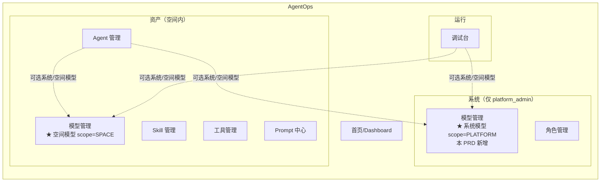
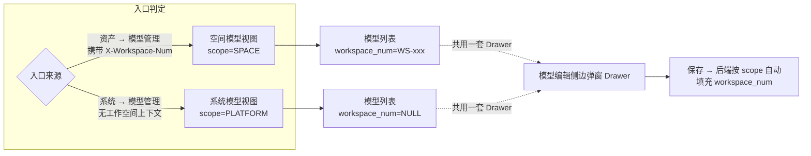
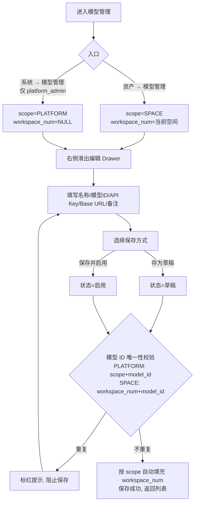
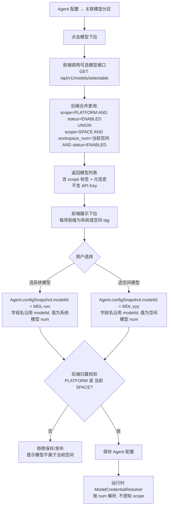
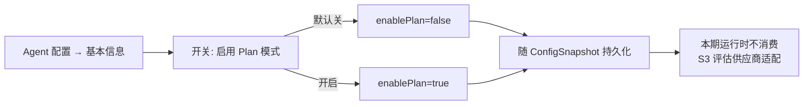
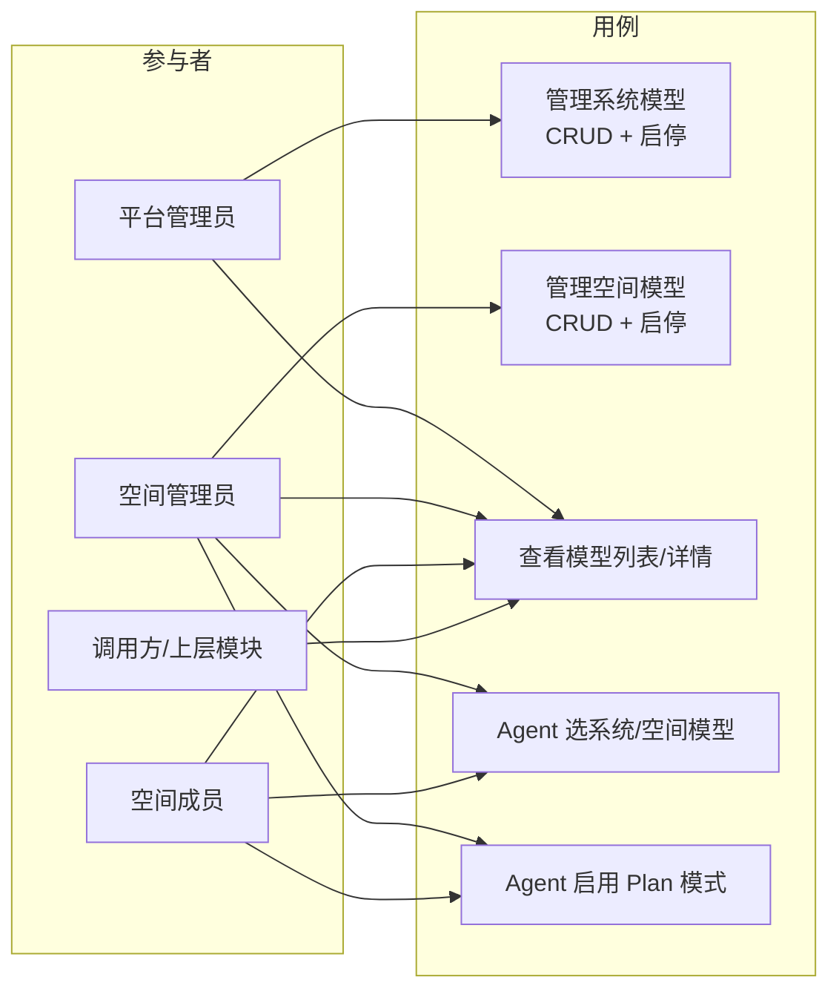

# AgentOps — 模型管理优化 PRD（系统模型 + Agent Plan 模式）

> 文档日期：2026-06-17　|　版本：v1.0　|　覆盖周期：S3（2026-08 ~ 2026-11）
> 父文档：[模型管理 PRD v1.0](./2026-06-10-模型管理-PRD.md) · [Agent 配置优化 PRD](./2026-06-11-Agent配置优化-PRD.md)
> 兄弟文档：[权限管理 PRD](./2026-06-15-权限管理-PRD.md) · [Agent 管理 PRD v3.0](./2026-05-11-Agent管理-PRD.md) · [Agent 优化 PRD v1.2](./2026-06-04-Agent优化-PRD.md)

> **本 PRD 定位**：对 [模型管理 PRD v1.0](./2026-06-10-模型管理-PRD.md) 的**模型归类升级**（系统模型 / 空间模型两层），叠加 [Agent 配置优化 PRD](./2026-06-11-Agent配置优化-PRD.md) 的**关联模型扩展**（可选系统模型）与**基本信息新增 Plan 模式开关**。本文与父 PRD 冲突处以本文为准，落地后回填父 PRD。

> **核心变更一句话**：
> 1. **模型分层**：模型分两类——**系统模型**（平台级，`scope=PLATFORM`、`workspace_num=NULL`，for 平台管理员）与**空间模型**（空间内，`scope=SPACE`、`workspace_num=WS-xxx`，沿用现状）；
> 2. **平台层级模型管理入口**：在「系统」侧导航下新增「模型管理」二级菜单（仅 platform_admin 可见），功能与空间内模型管理**完全一致**（同样的 CRUD + 状态机 + 脱敏 + 加密约定），但 scope 归属由服务端按可信入口与权限判定；
> 3. **Agent 关联模型扩展**：下拉可选**系统模型 ∪ 当前空间模型**，保存 / 发布时后端校验模型归属必须为「系统模型」或「当前空间模型」；**系统模型的 API Key 严禁以任何形式（明文 / 脱敏串）下发到前端**——前端只可见名称 / 模型 ID / Base URL 等元信息；
> 4. **Agent Plan 模式**：基本信息分区新增「是否启用 Plan 模式」开关，落 `ConfigSnapshot.enablePlan`（默认 false）；
> 5. **Agent 资源版本钉住**：Agent 绑定 Skill / 工具等带版本资源时，配置快照必须同时保存资源 num 与版本号；后续运行时按快照版本取配置，不再隐式解析最新版本。

---

## 1. 产品/需求背景

### 1.1 为什么要做

[模型管理 PRD v1.0](./2026-06-10-模型管理-PRD.md) 上线后，模型接入信息（API Key、Base URL）已统一目录化、按工作空间隔离。但在实际运营中暴露出三类问题：

- **公司统一采购的模型无处安放**：OpenAI / Anthropic / 通义等公司账号是平台统一采购，对应 Key 是平台级资源；目前只能"硬塞"进某个工作空间，其他空间想用要么重复录入（Key 泄露面扩大），要么只能"借用他人空间模型"（治理混乱）。
- **平台运维没有统一入口管理平台级模型**：现状所有模型都被绑死在某个 `workspace_num`，平台管理员要维护平台级模型时只能"伪装成某个空间成员"，缺乏平台视角的统一目录。
- **Agent 缺少"慢思考"开关**：当前 Agent 配置只有 `temperature` 一种采样参数，无法在需要复杂推理的场景启用 reasoning / thinking 类模型能力（如 OpenAI o1/o3、Claude thinking、DeepSeek-R1 等），调用方只能透传裸参数，难以统一治理。

### 1.2 解决什么问题

| 问题 | 解决方式 |
| --- | --- |
| 公司统一 Key 无处放 | 引入**系统模型**（`scope=PLATFORM`），平台管理员在平台层登记维护，**全平台 Agent 皆可选用**，避免跨空间重复录入 |
| 平台运维缺统一入口 | 平台层新增「系统 → 模型管理」菜单（仅 platform_admin 可见），CRUD 与空间内一致 |
| Agent 关联模型受限 | Agent 关联模型下拉合并「系统模型 ∪ 当前空间模型」，用户在选模型时**用 `[系统]/[空间]` tag 区分** |
| 系统 Key 安全风险 | 系统模型的 API Key 在**任何前端接口（列表 / 详情 / 选择器 / 编辑回显）都不下发**，前端只能见名称 / 模型 ID / Base URL；空间模型仍沿用现状脱敏（`prefix+****`） |
| 缺推理开关 | Agent 基本信息新增「启用 Plan 模式」开关，落 `ConfigSnapshot.enablePlan` |

### 1.3 面向用户

| 角色 | 关注点 |
| --- | --- |
| **平台管理员**（唯一） | 维护平台统一采购的模型（OpenAI / Anthropic / 通义 等），全平台共享，且其 API Key 严控不被前端可见 |
| **空间管理员 / 空间成员** | 维护本空间专属模型（如自建 vLLM 端点 / 部门独立账号），与系统模型并列展示 |
| **Agent 创建者 / 维护者** | 在「关联模型」分区同时可选系统模型与空间模型；按需启用 Plan 模式 |

### 1.4 与其他资产模块的边界

- **模型** = 一条 LLM 接入凭据与端点配置（名称 / num / API Key / Base URL / 状态 / scope）；
- 本期模型管理**新增 scope 维度**（PLATFORM / SPACE），**不**改变模型作为"最底层运行资源"的定位；
- Agent / Skill / 调试台在运行时按模型 num 引用，**`ModelCredentialResolver` 不感知 scope**（按 num 解析即可，PLATFORM 模型 workspace_num=NULL 不影响查找）。

---

## 2. 目标与范围

### 2.1 目标

| 目标 | 度量 |
| --- | --- |
| 模型两层归属 | 系统模型（PLATFORM）+ 空间模型（SPACE），新增 `scope` 字段；存量数据全部迁移为 SPACE |
| 平台层管理入口 | 「系统 → 模型管理」菜单可用，仅 platform_admin 可见，CRUD 与空间内一致 |
| Agent 可选系统模型 | 关联模型下拉合并系统 ∪ 空间模型，前端 `[系统]/[空间]` tag 区分 |
| 系统 Key 严控 | 系统模型的 API Key **任何前端接口都不下发**（不下发明文、不下发脱敏串）；空间模型沿用现状脱敏 |
| Plan 模式开关 | Agent 基本信息新增「启用 Plan 模式」开关，落 `ConfigSnapshot.enablePlan`（默认 false） |
| 资源版本可复现 | Agent 绑定 Skill / 工具等带版本资源时保存资源 num + 版本号，运行时按版本读取配置 |

### 2.2 范围

**本期做**

- **模型 scope 维度**：model 表新增 `scope` 列（SPACE / PLATFORM），系统模型 `workspace_num=NULL`；存量数据全量迁移为 SPACE。
- **唯一性调整**：PLATFORM 模型按 `model_id + deleted` 做平台级唯一；SPACE 模型沿用 `(workspace_num, model_id, deleted)` 空间内唯一；不得使用会约束全部 SPACE 数据的单一 `(scope, model_id, deleted)` 唯一索引。
- **平台层模型管理菜单**：「系统 → 模型管理」二级菜单（仅 platform_admin 可见），功能与空间内模型管理**完全一致**（CRUD + 状态机 + 加密 + 脱敏对系统模型调整为"完全不下发"）。scope 由服务端根据系统入口 / 权限 / 工作空间上下文判定，前端不可越权覆盖。
- **Agent 关联模型扩展**：下拉合并「系统模型 ∪ 当前空间模型」，Agent 仅存模型 num 引用（沿用现状；当前字段名仍为 `ConfigSnapshot.modelId`，字段值实际为 `model.num`）。
- **系统模型 API Key 严控**：系统模型的 API Key 在**列表 / 详情 / 选择器 / 编辑回显**中均不下发；前端编辑系统模型时，API Key 输入框采用「留空保留原值 / 填写覆盖原值」语义（同空间模型编辑语义），不提供「显隐查看」入口。
- **Agent 基本信息新增 Plan 开关**：`ConfigSnapshot` 新增 `Boolean enablePlan`（默认 false）；前端基本信息分区加 checkbox / Switch。
- **Agent 资源版本钉住**：Agent 配置中绑定 Skill / 工具等带版本资源时，保存资源业务编号与发布版本号；运行时按快照中的版本号读取资源配置，确保已发布 Agent 行为可复现。
- **权限点扩展**：新增 `model:create` / `model:update` / `model:delete` 三个权限点（对照 [权限管理 PRD](./2026-06-15-权限管理-PRD.md) §4.2.9）；平台模型管理归 `system:manage_settings`（沿用现有平台管理员权限）。

**本期不做**

- ❌ **Plan 模式运行时消费**：本期只落 `enablePlan` 字段 + 前端开关 + 配置回显；运行时如何按供应商适配（OpenAI `reasoning_effort` / Anthropic `thinking` / DeepSeek `enable_thinking`）放 S3 评估，本期不实现。
- ❌ 系统模型「显隐查看」明文 API：本期不下发任何明文 / 脱敏串到前端，不提供查看入口。
- ❌ 系统 / 空间模型同 `modelId` 冲突自动合并：若系统模型 `gpt-4o` 与空间 `gpt-4o` 并存，前端两个都展示（`[系统]gpt-4o` / `[空间]gpt-4o`），用户自行区分选择。
- ❌ 模型连通性测试 / 健康探活（沿用 v1.0 决策，S3 评估）。
- ❌ 模型调用计量 / 费用统计 / 限流配额。
- ❌ 模型参数模板（temperature / max_tokens 等默认参数配置）。
- ❌ 多版本 / 历史版本回溯。
- ❌ 模型资源版本钉住：模型仍按模型 num 解析当前启用凭证；本条版本钉住仅覆盖 Skill / 工具等本身有发布版本的资源。
- ❌ 跨空间的「被引用数」统计与强绑定。
- ❌ 系统模型的版本化 / 审批流 / 多人协作（沿用现状编辑即覆盖）。

---

## 3. 系统线框图（必选，优先产出）

### 3.1 模型管理在平台中的位置（v2.0 调整）



> ★ 标记为本 PRD 新增 / 调整的模块。
> - 空间内「资产 → 模型管理」入口保留，承载**空间模型**（`scope=SPACE`）；
> - 平台层「系统 → 模型管理」是本 PRD 新增入口，承载**系统模型**（`scope=PLATFORM`），仅 platform_admin 可见；
> - Agent / 调试台在运行时**同时可选**系统模型与空间模型。

### 3.2 模型管理内部页面结构（平台 / 空间一致）



> 平台 / 空间两个入口**共用同一套 Controller + Drawer**，但 scope 不能信任前端自由传值。后端按可信入口（系统菜单 / 资产菜单）、权限与工作空间上下文判定 scope，并自动填充 `workspace_num`（PLATFORM → NULL，SPACE → 当前工作空间）；如保留 `scope` 请求参数，仅能作为展示意图，必须经后端权限与上下文二次校验。

### 3.3 主要页面/模块说明

| 页面/模块 | 职责 | 主要元素 |
| --- | --- | --- |
| 空间模型列表（资产入口） | 管理当前工作空间内的模型（`scope=SPACE`） | ProTable + 新建 + 状态标签 + 行操作 |
| 系统模型列表（系统入口） | 管理全平台共享的系统模型（`scope=PLATFORM`），仅 platform_admin 可见 | 同上 |
| 模型编辑 Drawer（共用） | 新增 / 编辑共用；API Key 输入：**空间模型沿用显隐切换；系统模型仅"留空保留 / 填写覆盖"，无显隐入口** | Drawer + 字段表单 + 底部固定保存 / 取消 |
| 模型详情 | 全字段只读查看；**系统模型 API Key 列不展示** | 字段卡片 + 编辑 / 启停 / 删除 |

---

## 4. 业务流程图（必选）

### 4.1 系统模型 / 空间模型新建与编辑主流程（共用）



> 说明：新增 / 编辑表单完全共用；后端按可信请求来源（URL 路径 / 菜单入口对应权限 / 工作空间上下文）自动判定 `scope` 与 `workspace_num` 填充值。若请求声明 `scope=PLATFORM` 但用户无 `system:manage_settings`，或声明 `scope=SPACE` 但缺少当前工作空间上下文，后端必须拒绝。状态机（草稿 / 启用 / 禁用）沿用 v1.0，不重复绘。

### 4.2 Agent 关联模型选择流程



> 关键安全约束：
> - 「可选模型接口」**绝不下发 API Key**（明文 / 脱敏串均无），只返回 num + 名称 + 模型 ID + Base URL + scope + 状态；
> - 系统模型与空间模型若 `modelId` 同名（如都叫 `gpt-4o`），前端用 tag 区分，**num（MDL-xxx）全局唯一不混淆**。
> - Agent 保存 / 发布时，后端必须校验提交的模型 num 满足 `scope=PLATFORM` 或 `scope=SPACE AND workspace_num=当前空间`，防止直接提交其他空间模型 num 绕过选择器。

### 4.3 Agent Plan 模式开关流程



> 说明：本期 Plan 模式开关只做**字段持久化 + 配置回显**，运行时不读取该字段；具体供应商适配（OpenAI `reasoning_effort` / Anthropic `thinking` / DeepSeek `enable_thinking`）在 S3 单独评估落地。

---

## 5. 用例图（必选）



> 说明：
> - **系统模型管理（UC1）** 仅 platform_admin 可用（归 `system:manage_settings`）；
> - **空间模型管理（UC2）** 沿用 v1.0 模型管理员角色（归 `model:create/update/delete`，本期新增权限点）；
> - **查看模型（UC3）**：空间成员仅可见本空间模型 + 全部系统模型（用于选模型）；
> - **Agent 选模型（UC4）** 与 **Plan 开关（UC5）** 对所有有 Agent 编辑权限的角色开放。

---

## 6. 用户与场景

- 作为**平台管理员**，我希望在「系统 → 模型管理」登记一条 OpenAI 公司账号的 GPT-4o 系统模型，让全平台所有空间的 Agent 都能选用，避免每个空间重复录入 Key。
- 作为**平台管理员**，我希望系统模型的 API Key 在前端**完全不可见**——连脱敏串都不要下发——以确保公司统一采购的高权限 Key 不会被前端泄露。
- 作为**空间管理员**，我希望在「资产 → 模型管理」继续维护本空间自建的 vLLM 端点 / 部门独立账号，与系统模型并列展示。
- 作为**空间成员**，我希望在 Agent 配置「关联模型」下拉里同时看到系统模型和本空间模型，用 `[系统]/[空间]` tag 区分。
- 作为**Agent 创建者**，我希望在基本信息里开启「Plan 模式」开关，标识这个 Agent 用于复杂推理场景（具体运行时行为等 S3 适配）。
- 作为**Agent 维护者**，我希望发布 Agent 时固定所选 Skill / 工具的版本，避免后续资源发布新版本后改变已发布 Agent 的运行行为。
- 作为**调用方开发者**，我希望按模型 num 稳定引用模型，`ModelCredentialResolver` 解析时不需要关心模型是系统级还是空间级。

---

## 7. 功能需求

> 优先级：P0 必做 / P1 重要 / P2 增强。

### 7.1 模型 scope 维度（核心改造）

| 序号 | 功能点 | 简要说明 | 优先级 |
| --- | --- | --- | --- |
| 1.1 | scope 字段 | model 表新增 `scope VARCHAR(16) NOT NULL DEFAULT 'SPACE'`；枚举值 `SPACE` / `PLATFORM` | P0 |
| 1.2 | 系统模型 workspace_num | `scope=PLATFORM` 时 `workspace_num=NULL`；后端按 scope 自动填充，前端不感知 | P0 |
| 1.3 | 唯一性调整 | PLATFORM：仅系统模型按 `model_id + deleted` 平台级唯一；SPACE：沿用 `(workspace_num, model_id, deleted)` 空间内唯一；数据库约束不得让 SPACE 模型跨空间唯一 | P0 |
| 1.4 | 存量迁移 | 存量 model 记录全部置 `scope='SPACE'`（Flyway 变更集） | P0 |
| 1.5 | 状态机不变 | 草稿 / 启用 / 禁用三态机与 v1.0 完全一致，不区分 scope | P0 |

### 7.2 平台层模型管理入口（新增）

| 序号 | 功能点 | 简要说明 | 优先级 |
| --- | --- | --- | --- |
| 2.1 | 菜单新增 | 「系统 → 模型管理」二级菜单，仅 platform_admin 可见（菜单过滤走 `system:manage_settings` 权限） | P0 |
| 2.2 | CRUD 一致 | 系统模型的 新增 / 编辑 / 删除 / 启用 / 禁用 / 列表 / 详情 / 检索**功能与空间模型完全一致** | P0 |
| 2.3 | 共用 Controller | 平台 / 空间两个入口**共用同一套 Controller**；后端按可信入口、权限与工作空间上下文判定 scope，并自动填充 `workspace_num` | P0 |
| 2.4 | 权限校验 | 系统模型写操作要求 `system:manage_settings` 权限；空间模型写操作要求 `model:create/update/delete`（本期新增）；前端传入 scope 不得绕过权限 | P0 |

### 7.3 系统模型 API Key 严控（核心安全约束）

| 序号 | 功能点 | 简要说明 | 优先级 |
| --- | --- | --- | --- |
| 3.1 | 系统模型列表不下发 Key | 系统模型列表接口的响应**不含 API Key 字段**（明文 / 脱敏串 / prefix 均无） | P0 |
| 3.2 | 系统模型详情不下发 Key | 系统模型详情接口的响应**不含 API Key 字段**；前端详情页该字段位置展示「••••••（系统模型 Key 不展示）」 | P0 |
| 3.3 | 选择器接口不下发 Key | 「可选模型接口」（供 Agent 选模型）**绝不下发 API Key**，只返回 num + 名称 + 模型 ID + Base URL + scope + 状态 | P0 |
| 3.4 | 编辑回显不下发 Key | 系统模型编辑 Drawer 回显时 API Key 输入框为**空**（占位提示「留空保留原值，填写则覆盖」）；不提供「显隐查看」入口 | P0 |
| 3.5 | 后端兜底 | 任何返回系统模型数据的接口，必须在 VO 序列化阶段剔除 apiKey 字段；ArchUnit / 单测兜底 | P0 |
| 3.6 | 空间模型沿用现状 | 空间模型仍按 v1.0 脱敏（`prefix+****`），编辑 Drawer 提供显隐切换；**不调整** | P0 |

> **关键差异表**：

| 场景 | 空间模型（SPACE） | 系统模型（PLATFORM） |
| --- | --- | --- |
| 列表 API Key 列 | `sk-****1234`（脱敏） | **不展示** |
| 详情 API Key 字段 | `sk-****1234`（脱敏） | **不展示** |
| 编辑回显 API Key | `sk-****1234`（脱敏）+ 显隐切换 | **空**（占位「留空保留原值」），无显隐切换 |
| Agent 选择器返回 | 不含 Key（沿用现状） | 不含 Key |
| 运行时 LLM 装配 | ModelCredentialResolver 解密取明文 | ModelCredentialResolver 解密取明文（不感知 scope） |

### 7.4 Agent 关联模型分区扩展（v1.1 增量）

| 序号 | 功能点 | 简要说明 | 优先级 |
| --- | --- | --- | --- |
| 4.1 | 下拉合并系统 ∪ 空间 | 「关联模型」下拉来自 `scope=PLATFORM AND status=ENABLED` ∪ `scope=SPACE AND workspace_num=当前空间 AND status=ENABLED` | P0 |
| 4.2 | 前端 tag 区分 | 下拉每项前缀 `[系统]` / `[空间]` 彩色 tag，避免同名 modelId 混淆 | P0 |
| 4.3 | Agent 仅存 num 引用 | 沿用 [Agent 配置优化 PRD](./2026-06-11-Agent配置优化-PRD.md) §7.3：Agent 存模型 num，不存 Key / URL；兼容现状字段名 `ConfigSnapshot.modelId`，其字段值实际为 `model.num`（如 `MDL-xxx`） | P0 |
| 4.4 | 选中元信息展示 | 选定后展示只读元信息（名称 / 模型 ID / Base URL / scope 标签）；**不展示 API Key**（包括空间模型，元信息区也不展示） | P1 |
| 4.5 | 失效处理 | 已关联模型被禁用 / 删除时编辑页标红提示重选；系统模型被禁用时同理 | P1 |
| 4.6 | 后端归属校验 | Agent 保存 / 发布时校验提交模型 num 必须为系统模型，或为当前工作空间内空间模型；其他空间模型一律拒绝 | P0 |

### 7.5 Agent Plan 模式开关（新增）

| 序号 | 功能点 | 简要说明 | 优先级 |
| --- | --- | --- | --- |
| 5.1 | 字段定义 | `ConfigSnapshot` 新增 `Boolean enablePlan`，默认 `false`；可空（兼容存量快照） | P0 |
| 5.2 | 基本信息 UI | 基本信息分区新增「启用 Plan 模式」Switch / Checkbox，默认关；位置建议放在 `temperature` 附近 | P0 |
| 5.3 | 配置回显 | 编辑 Agent 时按 `enablePlan` 回显开关状态 | P0 |
| 5.4 | 详情页展示 | Agent 详情页基本信息 Tab 展示「Plan 模式：已启用 / 未启用」 | P1 |
| 5.5 | 运行时消费 | **本期不实现**；S3 评估按供应商适配（OpenAI `reasoning_effort` / Anthropic `thinking` / DeepSeek `enable_thinking`） | P2（占位） |

> Plan 模式开关 UI 示意：

```
基本信息分区
├─ 名称 *
├─ 描述
├─ 系统提示词 *
├─ 用户提示词
├─ 温度 [0.7]
└─ 启用 Plan 模式 [Switch: OFF]   ← 新增
    └─ 提示：标记该 Agent 需要复杂推理规划能力；本期仅保存配置，运行时行为 S3 适配
```

### 7.6 Agent 资源版本钉住（新增）

| 序号 | 功能点 | 简要说明 | 优先级 |
| --- | --- | --- | --- |
| 6.1 | 版本化资源范围 | 覆盖 Agent 绑定的 Skill、工具等带发布版本的资源；沙箱若后续引入版本，也按同一规则扩展；模型本期不纳入版本钉住 | P0 |
| 6.2 | 快照结构 | `ConfigSnapshot` 保存结构化引用列表，例如 `skillRefs=[{skillNum, versionNum}]`、`toolRefs=[{toolNum, versionNum}]`；不再只依赖 `skillNums` / `toolNums` 推导最新版本 | P0 |
| 6.3 | 选择与发布 | 前端选择资源时默认选择当前已发布版本；Agent 保存 / 发布时后端将对应资源的当前发布版本号写入配置快照 | P0 |
| 6.4 | 运行时解析 | Agent 运行时按 `资源 num + versionNum` 获取 Skill / 工具配置；禁止仅按资源 num 解析最新发布版本 | P0 |
| 6.5 | 版本失效处理 | 快照版本被删除 / 弃用 / 不存在时，运行前返回明确错误；编辑页标红提示用户重新选择资源或版本 | P1 |
| 6.6 | 兼容策略 | 存量仅有 `skillNums` / `toolNums` 的快照按“首次编辑或发布时补齐版本号”处理；运行兼容期内可按资源当前发布版本兜底，但需记录告警 | P1 |

> 说明：该能力的核心是“已发布 Agent 行为可复现”。资源发布新版本后，不自动影响已发布 Agent；用户需要进入 Agent 编辑页重新选择资源版本并发布 Agent，才会切换到新版本。

### 7.7 权限点扩展（对照权限管理 PRD）

| 序号 | 功能点 | 简要说明 | 优先级 |
| --- | --- | --- | --- |
| 7.1 | 新增 model:create | 创建模型（空间模型写操作要求；系统模型走 system:manage_settings） | P0 |
| 7.2 | 新增 model:update | 编辑模型（同上） | P0 |
| 7.3 | 新增 model:delete | 删除模型（同上） | P0 |
| 7.4 | 系统模型权限 | 系统模型 CRUD 全部归 `system:manage_settings`（沿用现有平台管理员权限，不新增 system:manage_model） | P0 |
| 7.5 | 权限矩阵更新 | [权限管理 PRD](./2026-06-15-权限管理-PRD.md) §4.2.9 与 §4.4 矩阵同步更新：space_admin 拥有 model:create/update/delete；space_member 保留 model:read | P0 |

---

## 8. 原型图/界面说明（必选）

### 8.1 平台层「系统 → 模型管理」列表页

```
┌────────────────────────────────────────────────────────────────────────────────┐
│ 系统模型管理                                                    [ + 新建 ]      │
├────────────────────────────────────────────────────────────────────────────────┤
│ 模型名称[        ]  模型 ID[        ]  状态[全部 ▾]            [搜索] [重置]      │
├────────────┬──────────────┬──────────────────────┬────────┬──────────────────────┤
│ 模型名称    │ 模型 ID       │ Base URL              │ 状态    │ 操作                  │
├────────────┼──────────────┼──────────────────────┼────────┼──────────────────────┤
│ GPT-4o     │ gpt-4o        │ https://api.openai…  │ 🟢启用  │ 编辑 | 禁用 | 删除(灰) │
│ Claude-3.5 │ claude-3-5    │ https://api.anthro…  │ 🔴禁用  │ 编辑 | 启用 | 删除(灰) │
│ 通义-Plus   │ qwen-plus     │ https://dashscope…   │ ⚪草稿  │ 编辑 | 启用 | 删除     │
├────────────┴──────────────┴──────────────────────┴────────┴──────────────────────┤
│                                                          < 1 2 3 >  共 N 条       │
└────────────────────────────────────────────────────────────────────────────────┘
```

> 与空间模型列表**外观完全一致**，差异仅在：
> - **标题**：「系统模型管理」（区别于空间模型管理的「模型管理」）；
> - **API Key 列**：**不展示**（空间模型列表也无 API Key 列，沿用 v1.0）。

### 8.2 系统模型编辑 Drawer（与空间模型差异点）

```
列表页 ──────────────────────────────┐┌──────── 右侧滑出 Drawer ───────────┐
                                     ││ 新建 / 编辑系统模型            [✕] │
 模型名称   模型 ID    状态           │├────────────────────────────────────┤
 GPT-4o     gpt-4o     启用          ││ 模型名称 *  [ GPT-4o             ] │
 Claude-3.5 claude-3-5 禁用          ││ 模型 ID *   [ gpt-4o             ] │
                                     ││    ← 全局唯一（系统模型全局唯一）  │
                                     ││ API Key *   [                ] 👁✕│ ← 留空占位
                                     ││    ← 留空保留原值, 填写则覆盖     │
                                     ││    ← 系统模型不提供显隐切换        │
                                     ││ Base URL *  [ https://api.open…  ]│
                                     ││ 备注        [ OpenAI 官方端点    ]│
                                     ││                                    │
                                     │├────────────────────────────────────┤
                                     ││  [ 取消 ]  [ 存为草稿 ] [ 保存并启用 ]│← 底部固定
                                     └────────────────────────────────────┘┘
```

> 差异：
> - **API Key 输入框**：编辑时**空**，占位提示「留空保留原值，填写则覆盖」；**无 👁 显隐切换**（与空间模型不同）；
> - 新建时仍要求必填（与空间模型一致）；
> - **模型 ID 唯一性提示**：文案改为「全局唯一」（系统模型按 scope 全局唯一）。

### 8.3 系统模型详情页（API Key 不展示）

```
┌─ 系统模型详情 · GPT-4o ───────────────────────────────────────────┐
│                                                                   │
│ 模型名称：GPT-4o                                                  │
│ 模型 ID：gpt-4o                                                   │
│ API Key：••••••••••••（系统模型 Key 不展示）                       │ ← 关键差异
│ Base URL：https://api.openai.com/v1                               │
│ 状态：🟢启用                                                      │
│ 备注：OpenAI 官方端点                                              │
│                                                                   │
│ 创建人：admin    创建时间：2026-06-17 10:00                        │
│ 更新人：admin    更新时间：2026-06-17 10:00                        │
│                                                                   │
│                          [编辑]  [禁用]                            │
└───────────────────────────────────────────────────────────────────┘
```

### 8.4 Agent 关联模型下拉（系统 ∪ 空间合并展示）

```
┌─ 关联模型 ──────────────────────────────────────┐
│ 模型 [▾ 请选择已启用模型]                       │
│   ┌─────────────────────────────────────────┐   │
│   │ 🔍 搜索模型名称 / 模型 ID                │   │
│   ├─────────────────────────────────────────┤   │
│   │ [系统] GPT-4o          gpt-4o           │   │
│   │ [系统] Claude-3.5      claude-3-5       │   │
│   │ [空间] 自建-vLLM       vllm-local       │   │
│   │ [空间] 部门-通义       qwen-dept        │   │
│   └─────────────────────────────────────────┘   │
│                                                  │
│ 选中后元信息（只读, 不含 API Key）:               │
│   • 模型名称：GPT-4o                             │
│   • 模型 ID：gpt-4o                              │
│   • Base URL：https://api.openai.com/v1          │
│   • 归属：[系统]                                 │
└─────────────────────────────────────────────────┘
```

> **关键约束**：选中后展示的元信息**不含 API Key**（连空间模型也不展示，避免误显示）。

### 8.5 Agent 基本信息新增 Plan 模式开关

```
┌─ 基本信息 ──────────────────────────────────────────────────────┐
│ 名称 *  [_____________]                                          │
│ 描述    [_______________________________________________]       │
│ 系统提示词 *                    [+ 从提示词中心选择] [✦ 帮我优化] │
│ [____________________________________________________]          │
│ 用户提示词[____________________________________________]        │
│ 温度 [0.7]                                                       │
│                                                                  │
│ 启用 Plan 模式  [Switch: OFF ]  ← 新增                          │
│   提示：标记该 Agent 需要复杂推理规划能力                         │
│        （本期仅保存配置，具体运行时行为 S3 评估适配）              │
└─────────────────────────────────────────────────────────────────┘
```

### 8.6 关键状态

| 状态 | 处理 |
| --- | --- |
| 系统模型列表 / 详情 / 选择器 | API Key **完全不返回**，前端展示「••••••（系统模型 Key 不展示）」 |
| 系统模型编辑回显 | API Key 输入框**为空**，占位提示「留空保留原值，填写则覆盖」；无显隐切换 |
| 系统模型与空间模型 modelId 同名 | 下拉用 `[系统]/[空间]` tag 区分；num 全局唯一不混淆 |
| Plan 模式开关切换 | 仅本地状态变更，随表单提交持久化；本期不触发运行时行为变化 |
| 非法状态操作（删除非草稿、启用启用态、禁用非启用态） | 沿用 v1.0：前端置灰 + 后端兜底 |

---

## 9. 非功能需求

| 项 | 目标 |
| --- | --- |
| 性能 | 模型列表 / 选择器查询响应 < 1s；选择器合并系统 ∪ 空间两表查询走单条 SQL UNION 或两次查询合并 |
| 唯一性一致性 | 系统模型仅在 PLATFORM 范围内按 `model_id + deleted` 唯一；空间模型沿用 `(workspace_num, model_id, deleted)`；数据库约束不得导致不同空间 SPACE 模型同 `model_id` 冲突 |
| 状态机一致性 | 沿用 v1.0：状态流转后端兜底校验 |
| **API Key 安全（核心）** | **系统模型的 API Key 在任何前端接口（列表 / 详情 / 选择器 / 编辑回显）绝不下发**；ArchUnit 守卫或单测断言系统模型 VO 不含 apiKey 字段 |
| API Key 存储 | 系统模型 / 空间模型均沿用 `SecretCipher` AES 加密落库；编辑留空保留原密文 |
| 审计 | 沿用 v1.0 审计字段；系统模型操作记录中**不打印 API Key 明文 / 密文** |
| 兼容 | 沿用 Ant Design Pro + 现有登录态；平台菜单可见性复用 `system:manage_settings` 权限 |
| Plan 模式字段兼容 | 存量 Agent 配置快照无 `enablePlan` 字段，反序列化时默认 `false`；不做迁移 |

---

## 10. 与现有功能的关系

- **改造** [模型管理 PRD v1.0](./2026-06-10-模型管理-PRD.md)：
  - §7.1 字段定义新增 `scope` 字段；
  - §7.3 状态机不变；
  - §9 API Key 安全约束**对系统模型加强为"完全不下发"**；
  - 新增 §3.1 平台层入口、§7.2 平台 CRUD、§7.3 系统模型 Key 严控。
- **改造** [Agent 配置优化 PRD](./2026-06-11-Agent配置优化-PRD.md)：
  - §7.2 基本信息分区新增「启用 Plan 模式」开关；
  - §7.3 关联模型分区下拉扩展为「系统 ∪ 空间」合并展示；
  - 选中元信息区**移除 API Key 字段**（包括空间模型）。
  - Skill / 工具等带版本资源从“只存资源 num，运行时取最新”调整为“存资源 num + versionNum，运行时按版本取配置”。
- **改造** [权限管理 PRD](./2026-06-15-权限管理-PRD.md)：
  - §4.2.9 模型管理权限点扩展为 4 个（model:create / read / update / delete）；
  - §4.4 权限矩阵同步更新：space_admin 拥有 model:CRUD；space_member 保留 model:read；
  - 平台模型管理归 `system:manage_settings`（不新增 system:manage_model）。
- **不变**：
  - 模型领域聚合根 `Model`、`ModelRepository`、`ModelCredentialResolver` 的核心逻辑（仅扩展 scope 字段映射，运行时不感知 scope）；
  - Agent 版本化、状态机、秘钥管理、A2A 模式、调试 / 评测入口；
  - ConfigSnapshot 其他非资源版本字段（temperature / sandboxRef / memoryConfig 等）。
- **存量处理**：
  - model 表新增 `scope` 列，存量数据全量置 `scope='SPACE'`（Flyway 变更集，一条 UPDATE）；
  - Agent 配置快照无 `enablePlan` 字段，反序列化默认 false，不做迁移；
  - `ConfigSnapshot.modelId` 字段名为历史兼容命名，继续存模型管理业务编号 `model.num`；本文不新增字段迁移，后续若重命名为 `modelNum` 需单独做兼容方案；
  - 不需要清理脚本。

---

## 11. 验收标准

### 11.1 模型 scope 维度

- [ ] model 表新增 `scope` 列（VARCHAR(16) NOT NULL DEFAULT 'SPACE'）。
- [ ] 存量 model 记录全部置 `scope='SPACE'`（迁移脚本执行后校验）。
- [ ] 系统模型 `scope=PLATFORM`、`workspace_num=NULL`；空间模型 `scope=SPACE`、`workspace_num='WS-xxx'`。
- [ ] PLATFORM 模型仅在系统模型范围内按 `model_id + deleted` 平台级唯一；SPACE 模型按 `(workspace_num, model_id, deleted)` 空间内唯一。
- [ ] 不同工作空间的 SPACE 模型允许使用相同 `model_id`；系统模型与空间模型允许使用相同 `model_id`。
- [ ] 系统 / 空间模型的 modelId 同名（如都叫 `gpt-4o`）可以共存，前端用 tag 区分。

### 11.2 平台层模型管理入口

- [ ] 「系统 → 模型管理」菜单仅 platform_admin 可见。
- [ ] 系统模型 CRUD（新增 / 编辑 / 删除 / 启用 / 禁用 / 列表 / 详情 / 检索）全部可用，功能与空间模型一致。
- [ ] 平台 / 空间两个入口共用同一套 Controller；scope 由后端按可信入口、权限与工作空间上下文判定。
- [ ] 伪造 `scope=PLATFORM` 但无 `system:manage_settings` 权限，或伪造其他空间上下文，后端返回无权访问。

### 11.3 系统模型 API Key 严控（核心安全验收）

- [ ] 系统模型**列表接口响应不含 apiKey 字段**（明文 / 脱敏串 / prefix 均无）。
- [ ] 系统模型**详情接口响应不含 apiKey 字段**；前端详情页展示「••••••（系统模型 Key 不展示）」。
- [ ] 系统模型**编辑回显接口响应不含 apiKey 字段**；前端 Drawer 输入框为空，占位提示「留空保留原值」。
- [ ] **「可选模型接口」响应绝不含 apiKey 字段**（无论系统 / 空间模型）。
- [ ] 系统模型编辑时 API Key 留空，保存后**原密文保留**（不覆盖为空）。
- [ ] 单测断言系统模型 VO 序列化结果不含 apiKey 字段（防回归）。
- [ ] 空间模型沿用 v1.0 脱敏（`prefix+****`），行为不变。

### 11.4 Agent 关联模型扩展

- [ ] Agent 配置「关联模型」下拉同时展示系统模型 ∪ 当前空间模型。
- [ ] 下拉每项前缀 `[系统]` / `[空间]` tag 区分。
- [ ] 选定后元信息展示不含 API Key（包括空间模型）。
- [ ] Agent 仅存模型 num 引用；现状字段名 `ConfigSnapshot.modelId` 继续兼容，但字段值为 `model.num`。
- [ ] Agent 保存 / 发布时，提交其他空间 SPACE 模型 num 会被后端拒绝；提交 PLATFORM 模型 num 或当前空间 SPACE 模型 num 可通过校验。
- [ ] 运行时 `ModelCredentialResolver` 解析时不区分 scope，统一按 num 取凭证；保存 / 发布阶段已完成归属校验。

### 11.5 Agent Plan 模式开关

- [ ] Agent 基本信息分区新增「启用 Plan 模式」开关，默认关。
- [ ] 开关状态随 ConfigSnapshot 持久化（`enablePlan` 字段）。
- [ ] 编辑 Agent 时按 `enablePlan` 回显开关状态。
- [ ] Agent 详情页基本信息 Tab 展示「Plan 模式：已启用 / 未启用」。
- [ ] 存量 Agent 配置快照无 `enablePlan` 字段时，反序列化默认 false，不报错。
- [ ] 运行时**不读取** `enablePlan` 字段（本期仅持久化，不消费）。

### 11.6 Agent 资源版本钉住

- [ ] Agent 配置快照保存 Skill / 工具等带版本资源的 `资源 num + versionNum`。
- [ ] Agent 运行时按快照中的 `versionNum` 获取 Skill / 工具配置，不取最新发布版本。
- [ ] Skill / 工具发布新版本后，已发布 Agent 的运行行为不自动变化。
- [ ] 编辑页能回显已绑定资源及其版本；版本失效时标红提示重选。
- [ ] 存量仅有 `skillNums` / `toolNums` 的快照具备兼容和补齐版本号策略。

### 11.7 权限点扩展

- [ ] 新增 `model:create` / `model:update` / `model:delete` 三个权限点。
- [ ] 空间模型写操作要求对应权限（space_admin 默认拥有，space_member 无）。
- [ ] 系统模型写操作要求 `system:manage_settings`（仅 platform_admin）。
- [ ] [权限管理 PRD](./2026-06-15-权限管理-PRD.md) §4.2.9 与 §4.4 矩阵同步更新。

---

## 附：与下游技术方案的对接提示

1. **数据库变更**：
   - 新增 Flyway 变更集：版本号使用当前最新迁移后的下一个编号，避免与既有 V28 等脚本冲突；`ALTER TABLE model ADD COLUMN scope VARCHAR(16) NOT NULL DEFAULT 'SPACE'`；
   - 存量迁移：`UPDATE model SET scope='SPACE' WHERE scope IS NULL OR scope=''`；
   - 唯一性调整：保留 / 重建 `uq_model_ws_model_id (workspace_num, model_id, deleted)` 约束 SPACE 空间内唯一；新增仅对 PLATFORM 记录生效的唯一约束，确保系统模型 `model_id + deleted` 平台级唯一。MySQL 下可通过生成列 / 函数索引实现“仅 PLATFORM 生效”，不得直接使用会约束所有 SPACE 记录的 `(scope, model_id, deleted)` 唯一索引。
2. **领域层**：
   - `Model` 聚合新增 `scope` 字段（值对象 `ModelScope`：SPACE / PLATFORM）；
   - `Model.domainValidate()` 增加 scope 非空校验 + workspace_num 与 scope 一致性校验（PLATFORM 时须为 NULL，SPACE 时须非空）；
   - `save()` 时按 scope 自动填充 workspace_num（PLATFORM 强制 NULL）。
3. **infra 层**：
   - `ModelEntity` / `ModelMapper` 新增 scope 字段映射；
   - `ModelCredentialResolver` **不动**（按 num 解析，不感知 scope）。
4. **application / adapter 层**：
   - `ModelCommandService` / `ModelQueryService` 增加 scope 参数处理；Agent 保存 / 发布校验模型归属必须为 PLATFORM 或当前 SPACE；
   - 系统模型相关接口的 VO 序列化**剔除 apiKey 字段**（建议在 `ModelVoAssembler` 中按 scope 分支：PLATFORM 不组装 apiKey）；
   - 新增「可选模型接口」`GET /api/v1/models/selectable`（合并系统 ∪ 当前空间已启用模型，只返回元信息）。
5. **权限拦截**：
   - 路径 → 权限映射：系统模型写接口归 `system:manage_settings`；空间模型写接口归 `model:create/update/delete`；前端声明 scope 不能绕过服务端权限判定；
   - JWT Filter 改造完成后（[权限管理 PRD](./2026-06-15-权限管理-PRD.md) 落地后）生效。
6. **前端**：
   - 侧导航新增「系统 → 模型管理」菜单项（受 `system:manage_settings` 权限控制）；
   - 模型管理页面复用现有空间模型管理组件，通过 `scope` prop 区分；
   - 系统模型编辑 Drawer 隐藏 API Key 显隐切换；
   - Agent 关联模型下拉合并查询 + tag 区分；
   - Agent 基本信息新增 Plan 模式 Switch。
7. **ConfigSnapshot 扩展**：
   - 新增 `Boolean enablePlan`（默认 false，可空兼容存量）；
   - `modelId` 字段继续兼容历史命名，字段值明确为模型管理 `num`；如后续重命名 `modelNum`，需单独设计双写 / 读取兼容；
   - 新增带版本资源引用结构：`skillRefs=[{skillNum, versionNum}]`、`toolRefs=[{toolNum, versionNum}]`；运行时按版本解析配置。兼容期内可保留 `skillNums` / `toolNums` 用于旧数据读取或前端回填，但新写入以 refs 为准；
   - 不影响版本化、不影响 A2A 模式（A2A 不写 ConfigSnapshot）。

---

## 附：关联文档

- [模型管理 PRD v1.0](./2026-06-10-模型管理-PRD.md)（父文档，本 PRD 为其优化版）
- [Agent 配置优化 PRD](./2026-06-11-Agent配置优化-PRD.md)
- [Agent 管理 PRD v3.0](./2026-05-11-Agent管理-PRD.md) · [Agent 优化 PRD v1.2](./2026-06-04-Agent优化-PRD.md)
- [权限管理 PRD](./2026-06-15-权限管理-PRD.md)
- [沙箱管理 PRD](./2026-06-08-沙箱管理-PRD.md) · [Skill 管理 PRD](./2026-05-11-Skill管理-PRD.md) · [工具管理 PRD](./2026-06-01-工具管理-PRD.md)
