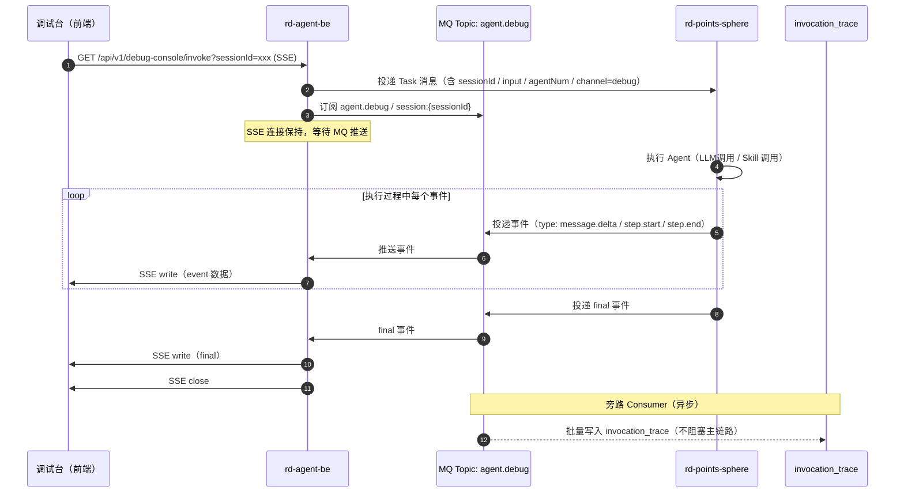
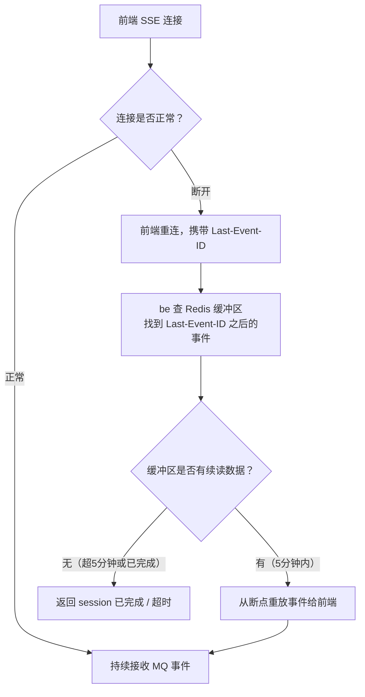
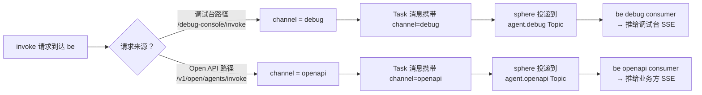

# Agent 运行时 MQ 优化 — 产品需求文档

> 文档日期：2026-06-18　|　版本：v1.0  
> 编写人：产品团队  
> 上游背景：[权限管理 PRD](./2026-06-15-权限管理-PRD.md) · [Agent 管理 PRD](./2026-05-11-Agent管理-PRD.md)

---

## 1. 产品背景

### 1.1 现状与问题

当前 Agent 流式调用链路（调试台 `POST /invoke` 与 Open API `POST /v1/open/agents/invoke`）采用**直透传**模式：

```
浏览器 / 业务方
    │  SSE 长连接（30s+）
    ↓
rd-agent-be（单 Pod 持有连接）
    │  同步转发
    ↓
rd-points-sphere（执行 Agent）
```

此模式存在四个痛点：

| 痛点 | 现象 |
|------|------|
| **断连丢失** | 用户切换网络 / Tab 挂起 / be Pod 重启，SSE 中断后已产生的输出全部丢失 |
| **无法水平扩展** | be 多 Pod 时 SSE 连接必须 sticky 到某一 Pod，限制了横向扩容能力 |
| **调试台与接口调用共用通道** | 调试台的高频测试流量与业务方 Open API 调用混跑，相互影响，优先级无法区分 |
| **审计不完整** | 流式事件过路即消，步骤级追踪数据依赖主链路写入，侵入性高 |

### 1.2 业务目标

1. 引入消息队列（MQ）作为 Agent 执行事件的传输层，实现 **be 无状态、连接可恢复**；
2. **调试台通道与 Open API 通道分离**，互不影响，各自可独立限流与降级；
3. 前端感知不到 MQ 的存在，**SSE 协议不变**，业务零改动；
4. 为后续 Human-in-the-loop、Agent 间协作等场景奠定基础。

---

## 2. 目标与范围

### 2.1 目标

- Agent 执行事件经由 MQ 投递，be 从 MQ 消费后推送给前端 SSE；
- 调试台与 Open API 使用**两个独立的 MQ Topic**（`agent.debug` / `agent.openapi`）；
- be 多 Pod 下任意 Pod 均可响应 SSE 请求，无需 sticky session；
- SSE 连接中断后，支持通过 `Last-Event-ID` 请求头从断点续读（最多 5 分钟内）；
- 执行步骤（Skill 调用 / LLM delta）自动旁路写入 `invocation_trace`，无需侵入主链路。

### 2.2 范围

**本期包含：**
- be 侧 SSE → MQ Consumer 桥接逻辑改造
- sphere 侧改为向 MQ 投递执行事件（而非直接回写 be）
- 调试台 Topic 与 Open API Topic 的路由规则
- 断点续读能力（基于 Redis 缓存近 5 分钟事件）
- 旁路审计 consumer（异步写 invocation_trace）

**本期不包含：**
- WebSocket 协议升级（前端仍用 SSE）
- Human-in-the-loop 中途追问（下一期）
- Agent 间协作 MQ 通道（下一期）
- MQ 监控告警运维配置（运维团队负责）

---

## 3. 系统线框图

### 3.1 整体架构（改造后）

```
┌──────────────────────────────────────────────────────────────┐
│                        接入层                                │
│  ┌────────────────┐          ┌────────────────────────────┐  │
│  │  调试台（SSE）  │          │  Open API 调用方（SSE）    │  │
│  │  /invoke       │          │  /v1/open/agents/invoke    │  │
│  └───────┬────────┘          └────────────┬───────────────┘  │
└──────────┼────────────────────────────────┼──────────────────┘
           │                                │
           ▼                                ▼
┌──────────────────────────────────────────────────────────────┐
│                    rd-agent-be（无状态多 Pod）                │
│                                                              │
│  ┌─────────────────────────────────────────────────────┐    │
│  │            SSE Endpoint（两个入口）                  │    │
│  │  /api/v1/debug-console/invoke  (debug channel)      │    │
│  │  /v1/open/agents/invoke        (openapi channel)    │    │
│  └──────────────────────┬──────────────────────────────┘    │
│                         │  1. 触发 sphere 执行               │
│                         │  2. 订阅 MQ（session_id 路由）     │
│                         │  3. MQ 事件 → SSE push             │
│  ┌──────────────────────┴──────────────────────────────┐    │
│  │              MQ Consumer Bridge                     │    │
│  │  debug consumer   ←──── Topic: agent.debug          │    │
│  │  openapi consumer ←──── Topic: agent.openapi        │    │
│  └─────────────────────────────────────────────────────┘    │
│                                                              │
│  ┌─────────────────────────────────────────────────────┐    │
│  │  旁路审计 Consumer（异步）                           │    │
│  │  订阅两个 Topic → 写 invocation_trace 表            │    │
│  └─────────────────────────────────────────────────────┘    │
└──────────────────────┬───────────────────────────────────────┘
                       │  触发执行（投递 Task 消息）
                       ▼
┌──────────────────────────────────────────────────────────────┐
│                  rd-points-sphere（执行层）                   │
│                                                              │
│  接收 Task → 执行 Agent → 产生事件流                          │
│  每个事件（delta / step.start / step.end / final）            │
│       ↓ 按 channel 写入对应 MQ Topic                          │
│  debug Task  → agent.debug  Topic                           │
│  openapi Task → agent.openapi Topic                         │
└──────────────────────────────────────────────────────────────┘
```

### 3.2 双 Topic 隔离示意

```
agent.debug（调试台专用）
├── 生产者：sphere 执行调试请求时投递
├── 消费者：be debug consumer（推给调试台 SSE）
├── 消费者：旁路审计 consumer
└── 策略：允许高频、允许降级（优先级低于 openapi）

agent.openapi（Open API 专用）
├── 生产者：sphere 执行业务 API 请求时投递
├── 消费者：be openapi consumer（推给业务方 SSE）
├── 消费者：旁路审计 consumer
└── 策略：优先保障、独立限流
```

---

## 4. 业务流程图

### 4.1 调试台调用主流程（改造后）



### 4.2 SSE 断连续读流程



### 4.3 双 Topic 路由决策流程



---

## 5. 用例图

```
参与者：
  - 研发用户（通过调试台测试 Agent）
  - 业务接入方（通过 Open API 调用 Agent）
  - 平台管理员（查看审计 / 调用记录）
  - sphere 执行引擎（内部系统）

用例：

研发用户
  ├── 发起调试台调用（走 agent.debug Topic）
  ├── 查看流式输出（SSE 实时接收）
  ├── 查看步骤追踪（ThoughtChain）
  └── 断开后续读（Last-Event-ID 重连）

业务接入方
  ├── 发起 Open API 调用（走 agent.openapi Topic）
  ├── 接收 SSE 流式结果
  └── 断开后续读（Last-Event-ID 重连）

平台管理员
  ├── 查看调用审计记录（invocation_trace）
  └── 查看调试台 vs Open API 调用量对比

sphere 执行引擎
  ├── 接收 Task 消息（含 channel 标识）
  ├── 执行 Agent 逻辑
  └── 按 channel 将事件投递到对应 MQ Topic
```

---

## 6. 用户与场景

### 场景一：研发用户调试 Agent

王工在调试台反复测试 Agent，每次测试都快速发消息。某次他切换了一下浏览器 Tab（SSE 中断），回来后页面应自动补全缺失的输出内容，不需要重新发送消息。

### 场景二：业务方高并发接入

工分平台在高峰期同时有数百个 Agent 调用。若某个调试台测试大量消耗资源，不应影响业务方的正常 Open API 调用——两个通道的 MQ Topic 独立，consumer 独立，互不干扰。

### 场景三：审计与问题排查

某次 Agent 执行结果异常，平台管理员需要查看该调用的完整步骤链（每个 Skill 的入参 / 出参 / 耗时）。旁路 consumer 已将所有事件写入 `invocation_trace`，无需从 sphere 重放。

---

## 7. 功能需求

### P0：核心链路改造

#### F1 — sphere 事件投递到 MQ
- sphere 在执行 Agent 过程中，将以下事件类型投递到 MQ（按 channel 路由）：
  - `message.delta`（LLM token 片段）
  - `step.start` / `step.end`（Skill / 工具调用）
  - `final`（整体结束，含统计数据）
  - `error`（不可恢复错误）
- 每条消息携带：`session_id`、`event_type`、`sequence_id`（全局递增）、`channel`、`payload`、`timestamp`

#### F2 — be SSE 端点改为 MQ Consumer 桥接
- `GET /api/v1/debug-console/invoke` 与 `POST /v1/open/agents/invoke` 保持 SSE 协议不变
- be 收到请求后：
  1. 向 sphere 投递 Task 消息（含 channel 标识）
  2. 在对应 Topic 订阅该 `session_id` 的消息
  3. 实时将 MQ 消息转为 SSE event 写入 response
  4. 收到 `final` 或 `error` 事件后关闭 SSE

#### F3 — 双 Topic 隔离
- 调试台请求携带 `channel=debug`，对应 Topic `agent.debug`
- Open API 请求携带 `channel=openapi`，对应 Topic `agent.openapi`
- 两个 Topic 在 be 侧各有独立的 consumer group 和消费线程池
- 各 Topic 可独立配置限流（QPS 上限）、消费者数量、消息保留时长

### P1：断点续读

#### F4 — SSE Last-Event-ID 支持
- be 将每个 `sequence_id` 作为 SSE 事件 ID（`id: {sequence_id}\n`）写入 response
- 近期事件（5 分钟内）缓存在 Redis（key: `agent:events:{session_id}`，List 结构，TTL 5min）
- 前端重连时携带 `Last-Event-ID` 请求头，be 从 Redis 缓冲区中找到该 sequence_id 之后的事件逐条重放
- 超出 5 分钟或 session 已完成：返回 SSE 关闭事件告知前端无需续读

### P1：旁路审计

#### F5 — 审计 Consumer
- 独立 consumer group 同时订阅 `agent.debug` 和 `agent.openapi` 两个 Topic
- 将 `step.start` / `step.end` / `final` 事件异步批量写入 `invocation_trace` 表
- 审计写入失败不影响主链路（catch 后写告警日志）

### P2：降级与容错

#### F6 — MQ 不可用降级
- MQ 连接失败时，be 自动降级为直连 sphere 的透传模式（当前行为）
- 降级时在日志记录 `[MQ_FALLBACK]` 标记，触发告警
- 降级模式下 F4（续读）能力不可用，其余功能正常

---

## 8. 原型图 / 界面说明

### 8.1 前端界面无变化

调试台与 Open API 的调用方完全感知不到 MQ 的引入，界面与接口协议保持不变。

### 8.2 SSE 事件协议（保持不变，补充 sequence_id）

```
id: 42\n                          ← 新增：sequence_id（用于续读）
event: message.delta\n
data: {"content":"你","index":0}\n
\n

id: 43\n
event: step.start\n
data: {"step_id":"s1","skill_name":"jira-query","input":{...}}\n
\n

id: 44\n
event: step.end\n
data: {"step_id":"s1","output":{...},"status":"success","latency_ms":320}\n
\n

id: 58\n
event: final\n
data: {"session_id":"sess-xxx","trace_id":"tr-yyy","total_tokens":312}\n
\n
```

### 8.3 续读重连协议

前端标准 SSE 断线重连时自动携带：

```
GET /api/v1/debug-console/invoke?sessionId=sess-xxx
Last-Event-ID: 42
```

be 从 Redis 找到 sequence_id > 42 的缓冲事件逐条补发。

---

## 9. 非功能需求

| 类别 | 要求 |
|------|------|
| **延迟** | MQ 引入的额外延迟 ≤ 50ms（P99），不应明显影响用户感知的流式体验 |
| **可靠性** | `agent.openapi` Topic 消息至少投递一次（at-least-once）；`agent.debug` 允许偶发丢失（at-most-once 可接受） |
| **隔离** | `agent.debug` 消费积压不影响 `agent.openapi` 的消费延迟 |
| **容量** | 单 Topic 支持峰值 500 msg/s；Redis 事件缓冲每 session 最多保留 1000 条 |
| **降级** | MQ 不可用时自动切回直连模式，用户调用不中断 |
| **安全** | MQ 消息体不含 API Key 等敏感字段（sphere 在投递前做脱敏） |
| **可观测** | 每个 Topic 暴露消费延迟、积压深度指标，接入 Prometheus |

---

## 10. 与现有功能的关系

| 现有模块 | 改造方式 | 兼容要求 |
|---------|---------|---------|
| `InvocationController`（调试台 invoke 端点） | 改为 MQ Consumer 模式，SSE 协议不变 | 前端零改动 |
| `OpenAgentController`（Open API invoke 端点） | 同上 | 调用方零改动 |
| sphere AgentRunner | 新增 MQ 投递逻辑，原直连回写逻辑保留作降级兜底 | 向后兼容 |
| `invocation_trace` 表 | 改为由旁路 consumer 写入，不再侵入主链路 | 数据格式不变 |

---

## 11. 验收标准

| 编号 | 验收项 | 通过条件 |
|------|--------|---------|
| AC-1 | 调试台正常调用 | SSE 流式输出正常，与改造前体验一致 |
| AC-2 | Open API 正常调用 | 业务方接入无感知，SSE 协议不变 |
| AC-3 | 双 Topic 隔离 | `agent.debug` 消费 100% 积压时，`agent.openapi` 延迟无变化 |
| AC-4 | 断连续读 | 模拟 SSE 中断后重连（5分钟内），能从 Last-Event-ID 断点续读 |
| AC-5 | 旁路审计 | 调用完成后 `invocation_trace` 有对应记录，步骤数与实际一致 |
| AC-6 | MQ 降级 | 关闭 MQ 后调用不报错，自动切回直连模式，日志有 `[MQ_FALLBACK]` |
| AC-7 | 延迟指标 | 压测 200 并发，MQ 链路 P99 延迟增量 ≤ 50ms |
