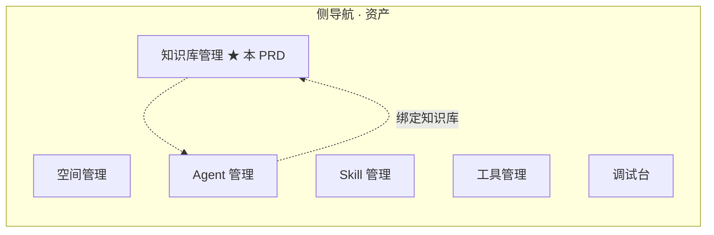
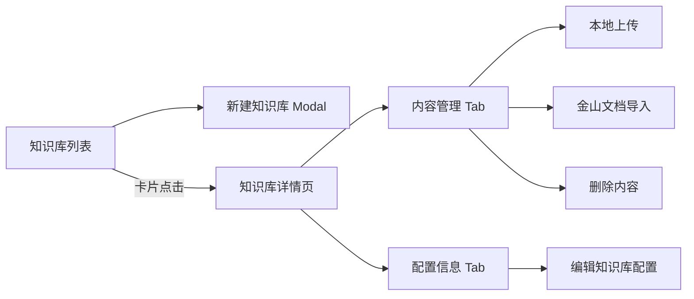
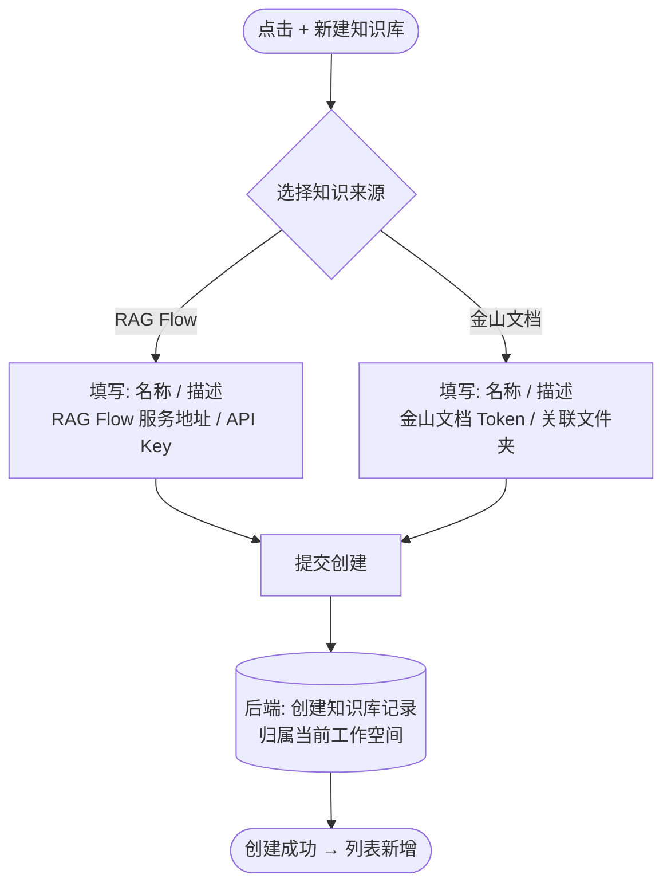
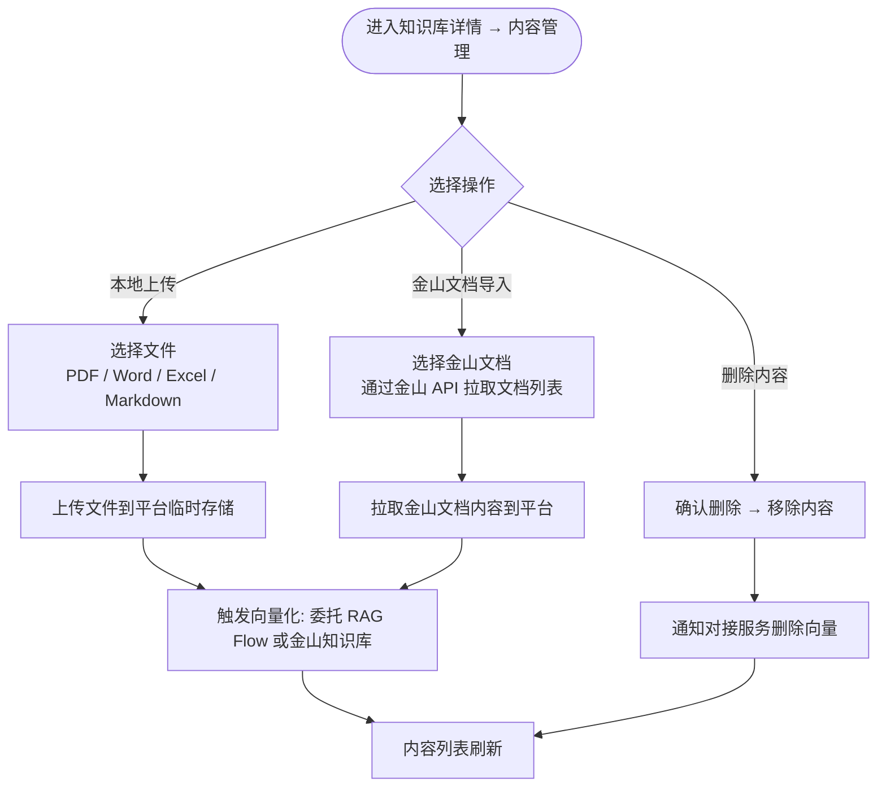
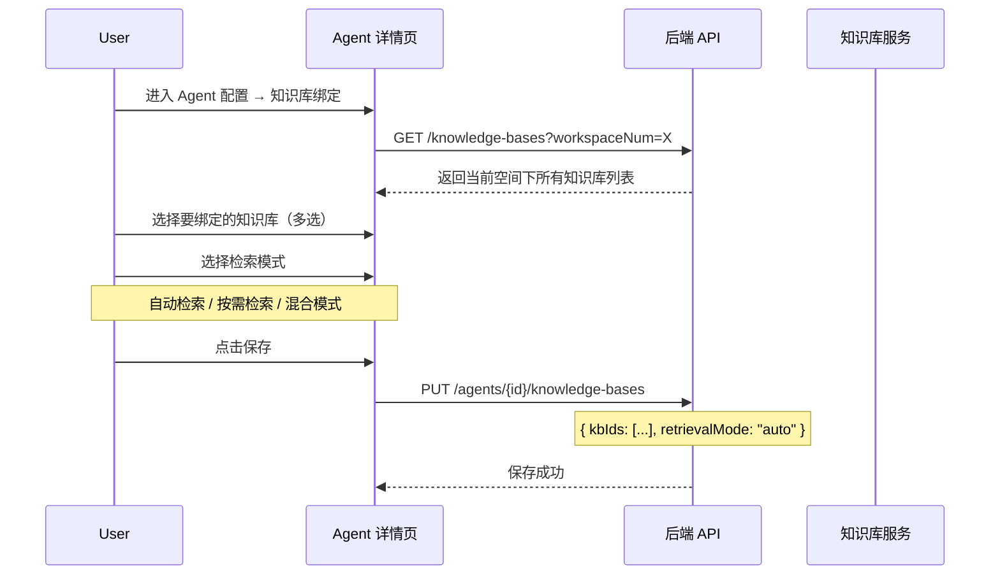
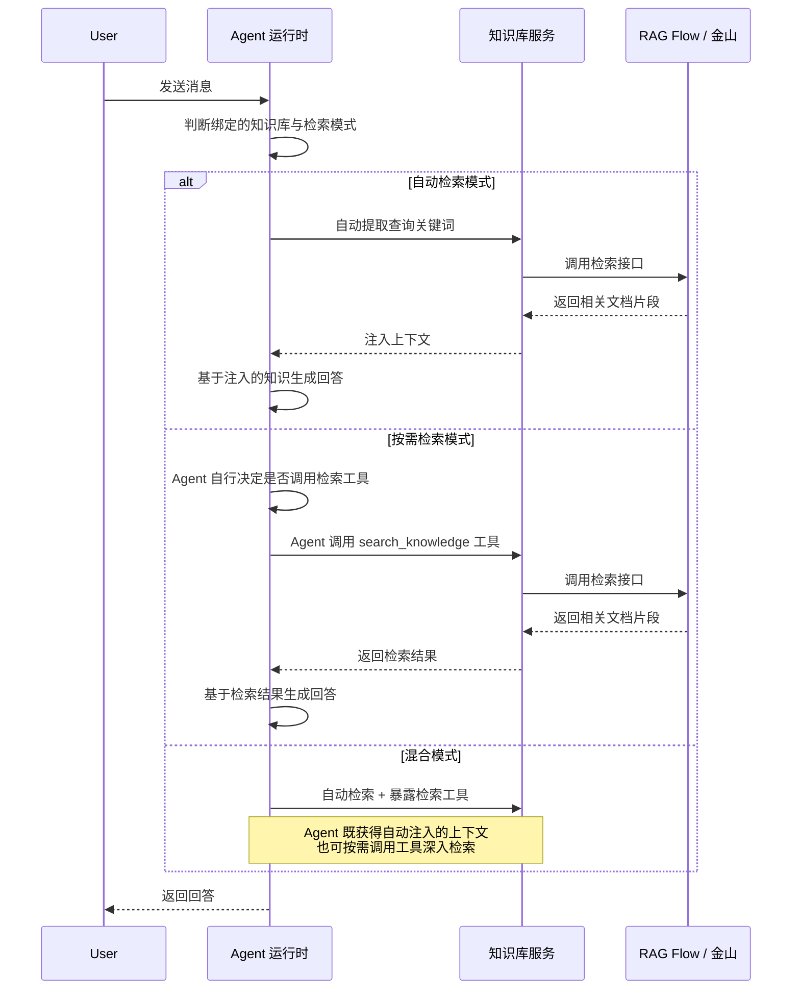
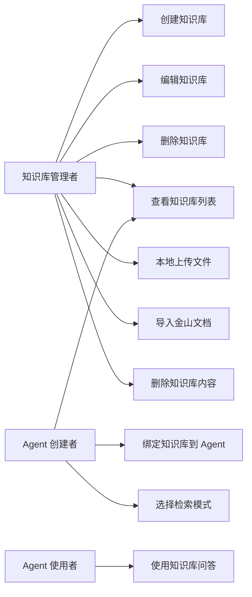

# AgentOps — 知识库管理 PRD

> 文档日期：2026-06-22　|　版本：v1.0　|　覆盖周期：S3
> 父文档：[S2 PRD](./2026-05-11-AgentOps-S2-PRD.md) · [工作空间管理 PRD](./2026-06-03-工作空间管理-PRD.md) · [Agent 管理 PRD](./2026-05-11-Agent管理-PRD.md)
> 兄弟文档：[Agent 优化 PRD](./2026-06-04-Agent优化-PRD.md)
> 关联需求：[ZYTS-14680 → L3：知识库管理-V1.0](https://colla.garrycorp.com/projex/project/9cd248f8f134b953a314c7536c/req/44064c9e6cedf810d73a831b7e)

---

## 1. 产品/需求背景

### 1.1 为什么要做

Agent 平台当前已支持 Agent 的创建、配置、发布与调试，但 Agent 的"知识"来源完全依赖模型自身的训练数据或 system prompt 中硬编码的上下文。随着业务方将 Agent 接入真实场景（如内部知识问答、文档分析、流程咨询），**Agent 缺乏外部知识注入能力**已成为阻塞性诉求：

- **业务文档问答**：Agent 需要读取公司内部的 Kingsoft 金山文档（技术方案、产品 PRD、会议纪要）来回答用户问题，而非依赖模型训练数据中的过时信息；
- **私有知识注入**：业务方有自有的 PDF / Word / Excel / Markdown 等格式的私有文档，希望上传后让 Agent 基于这些文档回答；
- **知识持续更新**：文档内容变更后，Agent 的知识应同步更新，无需重新发布 Agent；
- **多知识库组合**：一个 Agent 可能需要同时参考多个知识库（如"技术方案库"+"产品 PRD 库"），不同场景组合不同。

### 1.2 解决什么问题

- **知识库管理**：用户在空间内创建知识库，选择知识来源（金山文档 / RAG Flow），维护知识库内容；
- **多源接入**：对接金山文档（公司内部文档）和 RAG Flow（通用 RAG 服务）两种知识来源，平台本身不做向量化能力；
- **Agent 绑定**：将知识库绑定到 Agent，一个 Agent 可绑定多个知识库；
- **检索模式选择**：Agent 绑定知识库时，选择检索模式（参考 AgentScope 框架能力）；
- **内容管理**：支持本地上传文件（PDF / Word / Excel / Markdown）和从金山文档导入内容。

### 1.3 面向用户

- **知识库管理者**：在空间内创建和维护知识库，上传文档或关联金山文档；
- **Agent 创建者**：为 Agent 绑定知识库，选择检索模式，使 Agent 具备外部知识问答能力；
- **Agent 使用者**：在对话中享受 Agent 基于知识库提供的增强回答，无感知知识库存在。

### 1.4 与现有功能的关系

| 关系 | 说明 |
| --- | --- |
| **工作空间** | 知识库归属工作空间，与 Agent / Skill / 工具同级，受空间可见性约束 |
| **Agent 管理** | Agent 详情页新增"知识库绑定"配置，可绑定多个知识库并选择检索模式 |
| **调试台** | 调试台调用的 Agent 应使用已绑定的知识库进行知识检索 |
| **模型管理** | 知识库的向量化由对接的 RAG Flow 或金山知识库提供，不依赖平台模型配置 |

---

## 2. 目标与范围

### 2.1 目标

| 目标 | 度量 |
| --- | --- |
| 多来源知识库 | 支持金山文档和 RAG Flow 两种知识来源 |
| 本地上传 | 支持 PDF / Word / Excel / Markdown 格式上传 |
| Agent 绑定 | 一个 Agent 可绑定 ≥ 2 个知识库 |
| 检索模式 | Agent 绑定知识库时支持 ≥ 2 种检索模式 |
| 内容同步 | 金山文档内容变更后，知识库可同步更新 |

### 2.2 范围

**本期做**

- 知识库 CRUD（创建 / 编辑 / 删除）
- 知识库属性：名称、描述、来源类型（金山文档 / RAG Flow）、来源配置
- 知识库归属工作空间
- 本地上传文件（PDF / Word / Excel / Markdown）
- 金山文档内容导入（通过金山文档 API 拉取内容）
- 知识库内容列表查看与删除
- Agent 绑定知识库（多选）
- Agent 检索模式选择（自动检索 / 按需检索 / 混合模式）
- 知识库内容向量化触发（委托给 RAG Flow 或金山知识库）

**本期不做**

- ❌ 知识库内容在线编辑（仅支持上传/导入，不支持在线编辑文档内容）
- ❌ 知识库版本管理
- ❌ 知识库跨空间共享
- ❌ 知识库内容搜索预览（在本平台内搜索知识库内容）
- ❌ 自定义分块策略（使用对接服务的默认分块策略）
- ❌ 知识库用量统计与配额
- ❌ 知识库自动同步（金山文档内容变更后需手动触发同步）

---

## 3. 系统线框图（必选）

### 3.1 知识库在平台中的位置



> ★ 标记为本 PRD 新增模块。知识库管理位于侧导航资产分组中，与 Agent / Skill / 工具同级。

### 3.2 知识库内部页面结构



### 3.3 主要页面/模块说明

| 页面/模块 | 职责 | 主要元素 |
| --- | --- | --- |
| 知识库列表 | 展示当前空间下的所有知识库；支持搜索、新建 | 搜索框 + 新建按钮 + 卡片列表 |
| 新建知识库 Modal | 选择知识来源类型，填写名称/描述/来源配置 | Modal + 表单（来源类型切换） |
| 知识库详情页 | 查看知识库内容和管理配置 | Tabs：内容管理 / 配置信息 |
| 内容管理 Tab | 查看已上传/导入的文件列表，支持上传、导入、删除 | 文件列表 + 上传按钮 + 导入按钮 |
| 配置信息 Tab | 查看和编辑知识库的基本配置 | 字段展示 + 编辑按钮 |
| Agent 绑定配置 | Agent 详情页中绑定知识库的区域 | 多选选择器 + 检索模式选择器 |

---

## 4. 业务流程图（必选）

### 4.1 知识库创建主流程



### 4.2 内容管理流程



### 4.3 Agent 绑定知识库流程



### 4.4 Agent 运行时知识检索流程



---

## 5. 用例图（必选）

### 5.1 参与者与用例



### 5.2 用例说明与权限边界

| 用例 | 含义 | 谁能做 |
| --- | --- | --- |
| 创建知识库 | 在当前空间创建知识库，选择来源类型 | 空间管理员 / 成员 |
| 编辑知识库 | 修改知识库名称、描述、来源配置 | 空间管理员 |
| 删除知识库 | 删除知识库（前置：解除所有 Agent 绑定） | 空间管理员 |
| 查看知识库列表 | 查看当前空间下所有知识库 | 空间管理员 / 成员 |
| 本地上传文件 | 上传文件到知识库并触发向量化 | 空间管理员 / 成员 |
| 导入金山文档 | 从金山文档拉取内容到知识库 | 空间管理员 / 成员 |
| 删除知识库内容 | 从知识库移除文件/文档 | 空间管理员 |
| 绑定知识库到 Agent | 为 Agent 关联知识库 | Agent 创建者（空间管理员/成员） |
| 选择检索模式 | 为 Agent 绑定知识库时选择检索方式 | Agent 创建者 |
| 使用知识库问答 | 在对话中享受知识增强的回答 | Agent 使用者 |

---

## 6. 用户与场景

| 角色 | 典型场景 |
| --- | --- |
| **知识库管理者** | 在"AICoding 组"空间创建一个"技术方案库"，上传团队所有技术方案 PDF，并关联金山文档中存放的产品 PRD 文件夹 |
| **Agent 创建者** | 创建一个"研发助手 Agent"，绑定"技术方案库"和"产品 PRD 库"两个知识库，选择混合检索模式 |
| **Agent 使用者** | 在调试台问"XX 项目的技术方案是什么？"，Agent 自动从知识库检索并给出基于文档的准确回答 |

**用户故事**

- 作为 **知识库管理者**，我希望在空间内创建一个知识库，选择使用 RAG Flow 还是金山文档作为向量化引擎，这样团队可以根据已有基础设施灵活选择。
- 作为 **知识库管理者**，我希望上传 PDF / Word / Excel / Markdown 文件到知识库，文件自动被向量化，无需手动触发。
- 作为 **Agent 创建者**，我希望为 Agent 绑定多个知识库，这样 Agent 可以同时参考技术方案和产品 PRD 来回答问题。
- 作为 **Agent 创建者**，我希望为不同的知识库绑定场景选择不同的检索模式——对关键业务场景用自动检索确保知识总是注入，对探索性场景用按需检索节省 Token。
- 作为 **Agent 使用者**，我希望 Agent 能基于最新上传的文档回答问题，不需要关心知识库的配置细节。

---

## 7. 功能需求

> 优先级标注 **P0/P1/P2**。

### 7.1 知识库字段定义（v1.0 权威源）

| 字段 | 类型 | 必填 | 约束 | 说明 |
| --- | --- | --- | --- | --- |
| **`id`** | string | 系统生成 | 前缀 `KB-` + UUID 后缀；全局唯一 | 知识库业务编号 |
| **`name`** | string | ✓ | ≤64 字符；同空间内唯一 | 知识库名称 |
| **`description`** | text | 可选 | ≤200 字符 | 知识库描述 |
| **`sourceType`** | enum | ✓ | `RAG_FLOW` / `KINGSOFT` | 知识来源类型 |
| **`sourceConfig`** | json | ✓ | 见 §7.1.1 | 来源连接配置 |
| **`workspaceNum`** | string | ✓ | 逻辑外键关联 `workspace.num` | 归属工作空间 |
| **`fileCount`** | int | 系统派生 | — | 知识库内文件/文档数量 |
| **`status`** | enum | 系统派生 | `ACTIVE` / `SYNCING` / `ERROR` | 知识库状态 |
| **`createdBy` / `createdAt` / `updatedBy` / `updatedAt`** | — | 系统派生 | — | 审计字段 |

#### 7.1.1 来源配置（sourceConfig）

**RAG Flow 配置：**

| 字段 | 类型 | 必填 | 说明 |
| --- | --- | --- | --- |
| `endpoint` | string | ✓ | RAG Flow 服务地址（如 `http://rag-flow.internal:8080`） |
| `apiKey` | string | ✓ | RAG Flow API 密钥（加密存储） |
| `knowledgeBaseId` | string | ✓ | RAG Flow 侧对应的知识库 ID（由 RAG Flow 创建后返回） |

**金山文档配置：**

| 字段 | 类型 | 必填 | 说明 |
| --- | --- | --- | --- |
| `token` | string | ✓ | 金山文档 API Token（加密存储） |
| `folderId` | string | 可选 | 关联的金山文档文件夹 ID；不指定则手动选文档 |
| `knowledgeBaseId` | string | ✓ | 金山知识库侧对应的知识库 ID |

### 7.2 知识库列表

| 序号 | 功能点 | 简要说明 | 优先级 |
| --- | --- | --- | --- |
| 1.1 | 卡片列表 | 展示当前空间下所有知识库：名称 / 来源类型图标 / 文件数 / 状态 / 最后更新时间 | P0 |
| 1.2 | 搜索 | 按名称模糊搜索 | P0 |
| 1.3 | 新建入口 | 顶部 `+ 新建知识库` 按钮 → 弹 Modal | P0 |
| 1.4 | 空态 | Empty + "创建知识库以让 Agent 拥有外部知识" 引导文案 | P0 |
| 1.5 | 状态标识 | 卡片右上角状态胶囊：ACTIVE（绿）/ SYNCING（蓝，闪烁）/ ERROR（红） | P0 |
| 1.6 | 来源类型标识 | 卡片上显示来源类型图标（RAG Flow / 金山文档） | P1 |

### 7.3 新建知识库

| 序号 | 功能点 | 简要说明 | 优先级 |
| --- | --- | --- | --- |
| 2.1 | Modal 表单 | 字段：知识库名称 * / 描述 / 来源类型 *（Radio：RAG Flow / 金山文档） | P0 |
| 2.2 | 来源类型切换 | 选择不同来源类型，下方展示对应的配置表单 | P0 |
| 2.3 | RAG Flow 配置 | endpoint * / apiKey *（密码输入框 + 小眼睛） | P0 |
| 2.4 | 金山文档配置 | token *（密码输入框 + 小眼睛）/ folderId（可选） | P0 |
| 2.5 | 连通性校验 | 创建时后端校验对接服务的连通性；不通则提示"无法连接到 XX 服务，请检查配置" | P0 |
| 2.6 | 名称校验 | 同空间内唯一；≤64 字符 | P0 |
| 2.7 | 创建成功 | 关闭 Modal + 列表新增 + 状态为 ACTIVE | P0 |

### 7.4 知识库详情 — 内容管理

| 序号 | 功能点 | 简要说明 | 优先级 |
| --- | --- | --- | --- |
| 3.1 | 文件列表 | ProTable：文件名 / 类型 / 大小 / 上传人 / 上传时间 / 状态（向量化中/已完成/失败）/ 操作 | P0 |
| 3.2 | 本地上传 | 支持 PDF / Word（.docx）/ Excel（.xlsx）/ Markdown（.md）；单文件 ≤ 50MB | P0 |
| 3.3 | 上传后自动向量化 | 上传完成后自动调用 RAG Flow 或金山知识库的向量化接口 | P0 |
| 3.4 | 金山文档导入 | 弹窗展示可导入的金山文档列表（通过金山 API 获取），支持多选 | P0 |
| 3.5 | 导入后自动向量化 | 导入完成后自动触发向量化 | P0 |
| 3.6 | 删除内容 | 行操作删除 + 二次确认；删除后通知对接服务同步删除向量 | P0 |
| 3.7 | 向量化状态跟踪 | 文件行显示向量化进度/状态：PENDING → VECTORIZING → READY / FAILED | P0 |
| 3.8 | 向量化失败重试 | 失败状态行提供"重试"按钮，重新触发向量化 | P1 |
| 3.9 | 批量上传 | 支持拖拽多文件上传 | P1 |
| 3.10 | 文件类型图标 | 根据文件类型显示对应图标（PDF / Word / Excel / Markdown） | P1 |
| 3.11 | 空态 | 无内容时 Empty + "上传文件或导入金山文档" 引导 | P0 |

### 7.5 知识库详情 — 配置信息

| 序号 | 功能点 | 简要说明 | 优先级 |
| --- | --- | --- | --- |
| 4.1 | 基本信息展示 | 名称 / 描述 / 来源类型 / 来源配置（API Key 掩码展示） | P0 |
| 4.2 | 编辑入口 | 点击编辑 → 弹窗修改名称 / 描述 / 来源配置 | P0 |
| 4.3 | 来源配置编辑 | 修改 endpoint / apiKey / token 等；修改后重新校验连通性 | P0 |
| 4.4 | 删除知识库 | 底部红色删除按钮 + 二次确认（需输入确认词） | P0 |
| 4.5 | 删除前置校验 | 删除前检查是否有 Agent 仍绑定该知识库；有则列出并提示先解绑 | P0 |

### 7.6 Agent 绑定知识库

| 序号 | 功能点 | 简要说明 | 优先级 |
| --- | --- | --- | --- |
| 5.1 | 绑定入口 | Agent 详情页 / 编辑页新增"知识库"配置区块 | P0 |
| 5.2 | 知识库选择器 | 多选 Select，列出当前空间下所有 ACTIVE 状态的知识库 | P0 |
| 5.3 | 检索模式选择 | 绑定每个知识库时选择检索模式（详见 §7.7） | P0 |
| 5.4 | 绑定列表展示 | 展示已绑定的知识库列表：知识库名称 / 来源类型 / 检索模式 / 解绑按钮 | P0 |
| 5.5 | 解绑确认 | 解绑知识库时二次确认"解绑后 Agent 将不再使用该知识库的知识" | P1 |
| 5.6 | 运行时生效 | 绑定/解绑后，下次 Agent 对话立即生效（无需重新发布 Agent） | P0 |
| 5.7 | 绑定数上限 | 单 Agent 最多绑定 10 个知识库 | P1 |

### 7.7 检索模式

Agent 绑定知识库时，可选择以下检索模式（参考 AgentScope 框架的 Middleware 模式设计）：

| 序号 | 模式 | 说明 | 适用场景 | 优先级 |
| --- | --- | --- | --- | --- |
| 6.1 | **自动检索（Auto-Retrieval）** | 每次 Agent 回复前，系统自动从知识库检索相关内容，注入到 Agent 上下文中。Agent 无感知，始终基于检索到的知识回答。类似 AgentScope 的 `static_control` 模式。 | 关键业务问答场景，要求 Agent 必须基于知识库回答，不允许遗漏知识 | P0 |
| 6.2 | **按需检索（On-Demand）** | Agent 自行决定是否调用 `search_knowledge` 工具来检索知识库。系统不自动注入上下文，仅在 Agent 主动调用工具时返回检索结果。类似 AgentScope 的 `agent_control` 模式。 | 探索性场景，Agent 主要依赖自身能力，仅在必要时查阅知识 | P0 |
| 6.3 | **混合模式（Hybrid）** | 结合以上两种：系统自动注入简要上下文，同时暴露检索工具供 Agent 按需深入检索。类似 AgentScope 的 `both` 模式。 | 综合场景，既保证基础知识覆盖，又允许 Agent 深入探索 | P1 |

**检索模式配置参数（高级，默认使用推荐值）：**

| 参数 | 说明 | 默认值 | 适用范围 |
| --- | --- | --- | --- |
| `topK` | 每次检索返回的文档片段数 | 3 | 全部模式 |
| `minScore` | 检索结果最低相关性阈值（0~1） | 0.5 | 全部模式 |
| `autoInjectCount` | 自动注入的文档片段数（仅混合模式） | 1 | 混合模式 |

---

## 8. 原型图/界面说明（必选）

### 8.1 知识库列表

```
┌─ 知识库管理 ──────────────────────────────────────────────────────┐
│ 知识库管理                                          [+ 新建知识库] │
│ 当前空间下的所有知识库                                              │
│ ───────────────────────────────────────────────────────────────── │
│ 🔍 搜索知识库名称...                                                │
│ ───────────────────────────────────────────────────────────────── │
│ ┌────────────────────┐ ┌────────────────────┐ ┌──────────────────┐│
│ │ 技术方案库    [ACT]│ │ 产品PRD库    [ACT] │ │ 运营资料库  [ERR]││
│ │ 📄 RAG Flow       │ │ 📄 金山文档       │ │ 📄 RAG Flow      ││
│ │ 团队技术方案归档   │ │ 所有产品PRD汇总   │ │ 运营素材库...    ││
│ │                    │ │                    │ │                  ││
│ │ 12 个文件 · 5分钟前 │ │ 8 个文件 · 1小时前 │ │ 3 个文件 · 失败  ││
│ └────────────────────┘ └────────────────────┘ └──────────────────┘│
└────────────────────────────────────────────────────────────────────┘
```

### 8.2 新建知识库 Modal

```
┌─ Modal · 新建知识库 ───────────────────────────────────┐
│ * 知识库名称: [技术方案库______________________]      │
│   ≤64 字符                                              │
│                                                         │
│ 描述:                                                   │
│ ┌─────────────────────────────────────────────────┐   │
│ │ 团队技术方案归档，用于 Agent 回答技术相关问题   │   │
│ └─────────────────────────────────────────────────┘   │
│                                              28 / 200  │
│                                                         │
│ * 来源类型:                                            │
│  ○ RAG Flow  ● 金山文档                                │
│                                                         │
│ * API Token:    [*********************************] 👁 │
│   Folder ID（可选）: [________________________]         │
│                                                         │
│ ───────────────────────────────────────────────────── │
│                    [取消]   [创建并校验连通性]          │
└─────────────────────────────────────────────────────────┘
```

### 8.3 知识库详情 — 内容管理 Tab

```
┌─ 知识库详情 · 技术方案库 ──────────────────────────────────────────┐
│ [← 返回列表]  技术方案库                              [编辑配置]   │
│ ───────────────────────────────────────────────────────────────── │
│  [内容管理]  [配置信息]                                             │
│ ───────────────────────────────────────────────────────────────── │
│ [+ 上传文件]  [从金山文档导入]                                      │
│ ┌────────────────────────────────────────────────────────────────┐│
│ │ 文件名            │ 类型  │ 大小    │ 上传人  │ 状态    │ 操作 ││
│ ├────────────────────────────────────────────────────────────────┤│
│ │ 2026-06-22_技术方案 │ PDF   │ 2.3 MB │ 张三   │ ✅ 就绪 │ [删]││
│ │ 架构设计文档       │ Word  │ 1.1 MB │ 李四   │ 🔄 向量化│ [删]││
│ │ API 接口规范       │ MD    │ 156 KB │ 张三   │ ❌ 失败 │ [重试]││
│ │ 性能测试报告       │ Excel │ 890 KB │ 王五   │ ✅ 就绪 │ [删]││
│ └────────────────────────────────────────────────────────────────┘│
└────────────────────────────────────────────────────────────────────┘
```

### 8.4 Agent 绑定知识库配置

```
┌─ Agent 详情 · 研发助手 ────────────────────────────────────────────┐
│ ...其他 Tab...                                                     │
│ ───────────────────────────────────────────────────────────────── │
│ 知识库配置（新增）                                                  │
│ ┌────────────────────────────────────────────────────────────────┐│
│ │ 已绑定的知识库:                                                  ││
│ │ ┌──────────────────────────────────────────────────────────┐  ││
│ │ │ 技术方案库 · RAG Flow  │ 自动检索 │ topK:3 │ [解绑]   │  ││
│ │ │ 产品PRD库 · 金山文档   │ 混合模式 │ topK:3 │ [解绑]   │  ││
│ │ └──────────────────────────────────────────────────────────┘  ││
│ │                                                               ││
│ │ [+ 绑定知识库]                                                 ││
│ │                                                               ││
│ │ 检索模式说明:                                                   ││
│ │ ● 自动检索: 每次对话自动检索相关知识注入上下文                   ││
│ │ ○ 按需检索: Agent 自行决定是否调用检索工具                      ││
│ │ ○ 混合模式: 自动注入 + 按需检索                                ││
│ └────────────────────────────────────────────────────────────────┘│
└────────────────────────────────────────────────────────────────────┘
```

### 8.5 绑定知识库弹窗

```
┌─ Modal · 绑定知识库 ──────────────────────────────────┐
│ 选择知识库:                                             │
│ ┌──────────────────────────────────────────────────┐  │
│ │ ☑ 技术方案库 · RAG Flow · 12 个文件             │  │
│ │ ☑ 产品PRD库 · 金山文档 · 8 个文件               │  │
│ │ ☐ 运营资料库 · RAG Flow · 3 个文件（ERROR）     │  │
│ └──────────────────────────────────────────────────┘  │
│                                                         │
│ 检索模式:                                               │
│ ● 自动检索 — 每次对话自动检索知识                      │
│ ○ 按需检索 — Agent 按需调用检索工具                    │
│ ○ 混合模式 — 自动注入 + 按需检索                      │
│                                                         │
│ topK（每次检索返回片段数）: [3]                        │
│                                                         │
│ ───────────────────────────────────────────────────── │
│                    [取消]   [确认绑定]                  │
└─────────────────────────────────────────────────────────┘
```

### 8.6 关键状态与异常态

| 状态 | 处理 |
| --- | --- |
| 知识库列表为空 | Empty + "创建知识库" 引导 |
| 对接服务不可达 | 创建时提示"无法连接到 XX 服务，请检查配置"；知识库状态变为 ERROR |
| 向量化失败 | 文件行显示失败状态 + 重试按钮；知识库状态变为 ERROR |
| 上传文件格式不支持 | 前端限制文件选择器类型，超出提示"仅支持 PDF / Word / Excel / Markdown 格式" |
| 上传文件超 50MB | 前端校验 + 提示"单文件不超过 50MB" |
| 删除知识库时仍有 Agent 绑定 | 弹窗列出绑定 Agent 列表 + "请先解绑所有 Agent 后再删除" |
| Agent 绑定时知识库状态 ERROR | 选择器中 ERROR 状态知识库置灰 + Tooltip "该知识库当前不可用，请检查配置" |
| 知识库名称冲突 | 表单 inline 红字 "同空间下已存在同名知识库" |

---

## 8. 非功能需求

| 项 | 目标 |
| --- | --- |
| 知识库列表加载 | ≤ 800ms |
| 文件上传 | ≤ 5s（50MB 以内）；大文件后台异步处理 |
| 向量化触发延迟 | 上传完成后 ≤ 3s 内触发向量化请求 |
| 向量化完成通知 | 异步回调或轮询更新状态；前端不阻塞 |
| 知识库数量上限 | 单空间 ≤ 50 个知识库 |
| 单知识库文件上限 | ≤ 500 个文件/文档 |
| 单文件大小上限 | ≤ 50MB |
| Agent 绑定知识库上限 | 单 Agent ≤ 10 个知识库 |
| 检索响应时间 | ≤ 2s（从 Agent 触发检索到结果返回） |
| 对接服务容错 | RAG Flow / 金山文档不可达时，Agent 降级为不使用知识库，不影响正常对话 |
| 安全 | API Key / Token 加密存储（复用 Agent 优化 PRD 的 SecretCipher 方案） |

---

## 9. 与现有功能的关系

| 关系 | 说明 | 兼容/迁移要点 |
| --- | --- | --- |
| **工作空间** | 知识库归属工作空间，受空间可见性约束 | 新建知识库时自动绑定当前工作空间 |
| **Agent 管理** | Agent 详情页新增知识库绑定配置 | Agent 表新增 `knowledgeBaseIds` 和 `retrievalConfig` 字段 |
| **Agent 运行时** | Agent 回复时根据绑定的知识库和检索模式进行知识检索 | 运行时新增知识检索中间件，参考 AgentScope Middleware 模式 |
| **调试台** | 调试台调用的 Agent 使用已绑定的知识库 | 运行时统一处理，调试台无需特殊改造 |
| **模型管理** | 知识库向量化不依赖平台模型配置 | 无 |
| **秘钥管理** | 来源配置中的 API Key / Token 复用秘钥加密方案 | 复用 `SecretCipher` 加密存储 |

---

## 10. 验收标准

### 10.1 基础就绪

- [ ] 知识库 CRUD（创建 / 编辑 / 删除）API + 前端全通
- [ ] 支持 RAG Flow 和金山文档两种来源类型
- [ ] 创建时连通性校验 GA
- [ ] 知识库列表卡片视图 GA（含搜索、空态、状态标识）
- [ ] 来源配置加密存储

### 10.2 内容管理就绪

- [ ] 本地上传 PDF / Word / Excel / Markdown GA
- [ ] 上传后自动触发向量化 GA
- [ ] 金山文档导入 GA
- [ ] 内容列表展示 + 向量化状态跟踪 GA
- [ ] 删除内容 + 同步删除向量 GA
- [ ] 向量化失败重试 GA
- [ ] 文件格式 / 大小校验 GA

### 10.3 Agent 绑定就绪

- [ ] Agent 详情页知识库绑定配置 GA
- [ ] 多知识库绑定 GA（≥ 2 个）
- [ ] 三种检索模式（自动 / 按需 / 混合）GA
- [ ] 绑定/解绑后运行时立即生效
- [ ] 删除知识库前置校验（有 Agent 绑定时拦截）

### 10.4 运行时就绪

- [ ] 自动检索模式下，Agent 回复前自动检索知识并注入上下文
- [ ] 按需检索模式下，Agent 可调用 `search_knowledge` 工具
- [ ] 混合模式下，自动注入 + 按需检索同时生效
- [ ] 对接服务不可达时 Agent 降级不崩溃

---

## 附：与下游技术方案的对接提示

1. **知识库表设计**：`knowledge_base` 表含 `source_type`（RAG_FLOW / KINGSOFT）和 `source_config`（JSON 列存储 endpoint / apiKey 等）；`knowledge_base_file` 表存储文件/文档记录，含 `vector_status`（PENDING / VECTORIZING / READY / FAILED）。
2. **Agent 绑定设计**：Agent 表新增 `knowledge_base_bindings` JSON 列，格式为 `[{kbId, retrievalMode, topK, minScore}]`；或建独立关联表 `agent_knowledge_base`。
3. **来源配置加密**：`source_config` 中的 `apiKey` / `token` 字段复用 Agent 优化 PRD 的 `SecretCipher` 加密方案，绝不存明文。
4. **检索模式实现**：参考 AgentScope Middleware 的 `on_reply` 和 `on_reasoning` 钩子模式，在 Agent 运行时中实现知识检索中间件：
   - 自动检索 = 在 `on_reply` 中自动调用检索接口并注入上下文
   - 按需检索 = 在 `list_tools()` 中暴露 `search_knowledge` 工具
   - 混合模式 = 两者结合
5. **对接服务接口约定**：需与 RAG Flow 和金山文档团队约定统一的检索接口规范（请求：查询文本 + topK + minScore；响应：文档片段列表 + 相关性分数）。
6. **向量化异步回调**：上传文件后，平台将文件推送给对接服务，对接服务完成向量化后通过回调通知平台更新状态；平台提供回调端点 `/api/v1/knowledge-bases/{kbId}/files/{fileId}/vector-callback`。
7. **存量数据**：上线前无存量知识库数据，无需迁移。
8. **领域事件**：知识库创建 / 更新 / 删除 / 内容变更发布领域事件，供后续审计日志和站内消息接入。

---

## 附：关联文档

- [工作空间管理 PRD](./2026-06-03-工作空间管理-PRD.md)（知识库的归属容器）
- [Agent 管理 PRD](./2026-05-11-Agent管理-PRD.md)（Agent 绑定知识库的入口）
- [Agent 优化 PRD](./2026-06-04-Agent优化-PRD.md)（秘钥加密方案复用）
- [S2 PRD](./2026-05-11-AgentOps-S2-PRD.md)
