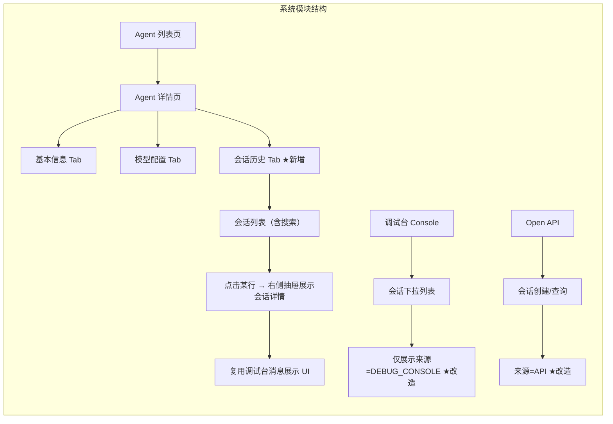
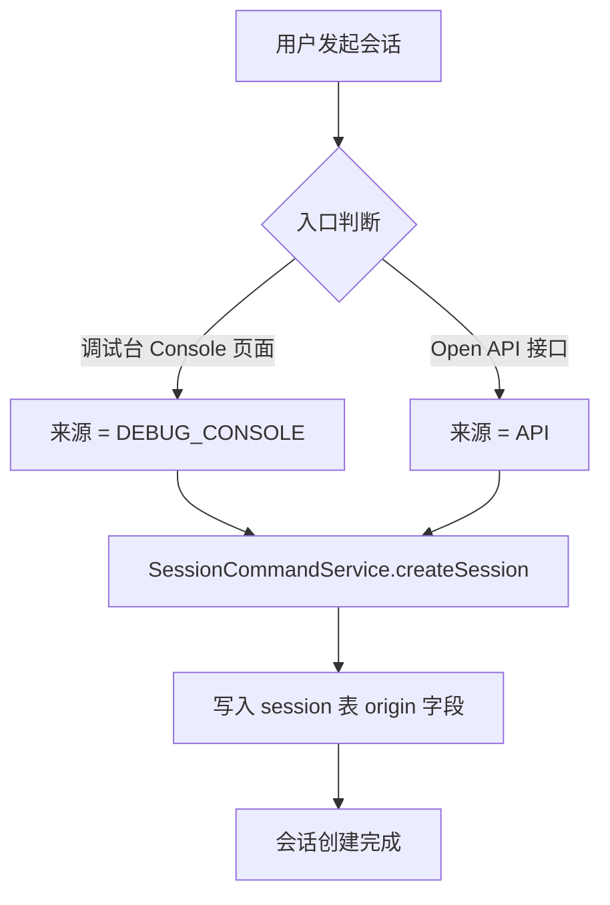
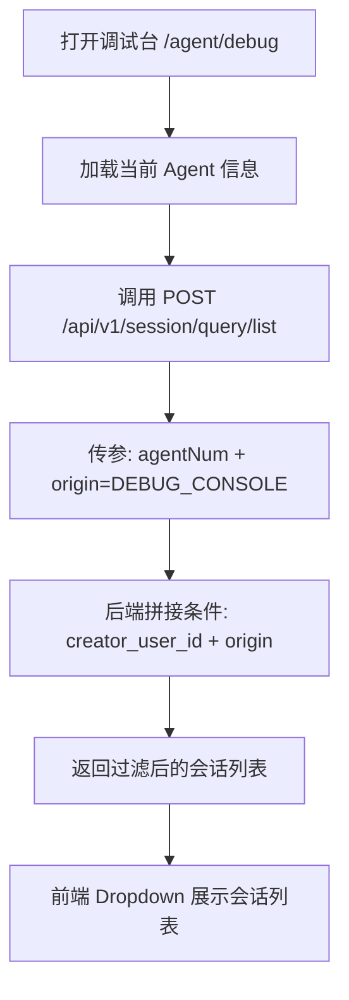
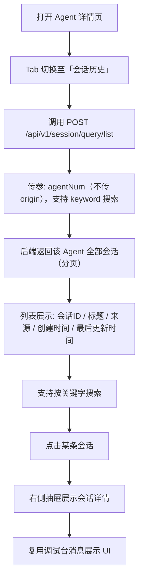
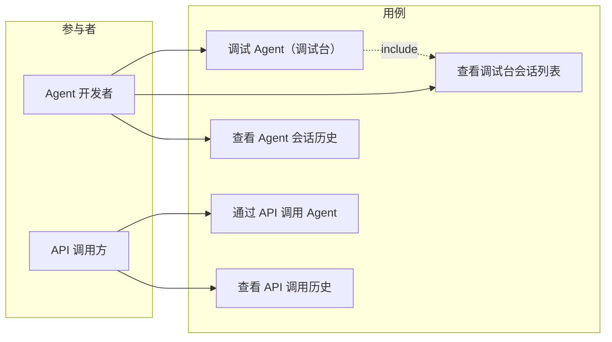

# 会话来源字段与会话历史 Tab 产品需求文档（PRD）

## 1. 产品/需求背景

- **为什么要做**：当前 AgentOps 系统中，Session（会话）表没有来源字段，无法区分会话是由调试台（DebugConsole）发起还是通过 Open API 发起。调试台的会话列表会混入 API 发起的会话，用户在调试台看到非自己调试产生的会话，体验不佳。
- **解决什么问题**：
  1. 区分调试台与 API 发起的会话，调试台只展示调试台的会话
  2. 在 Agent 详情页增加会话历史查看入口，方便用户查看某个 Agent 的完整历史对话记录
- **面向用户**：Agent 开发者（使用调试台调试 Agent）、API 调用方（通过 Open API 调用 Agent）

## 2. 目标与范围

- **目标**：
  1. 所有会话记录来源，区分 `DEBUG_CONSOLE` 和 `API`
  2. 调试台会话列表仅展示 `DEBUG_CONSOLE` 来源的会话
  3. Agent 详情页新增「会话历史」Tab，展示该 Agent 的全部历史会话（不分来源）

- **范围**：
  - ✅ 数据库 `session` 表新增 `origin` 字段
  - ✅ 创建会话时按入口写入来源
  - ✅ 后端列表查询接口支持按 `origin` 过滤
  - ✅ 所有 Session VO/DTO 增加 `origin` 字段
  - ✅ 调试台前端列表查询增加 `origin=DEBUG_CONSOLE` 过滤条件
  - ✅ Agent 详情页新增「会话历史」Tab 页
  - ❌ **不做**：历史会话数据的回填迁移（存量数据 origin 默认为 `API`）
  - ❌ **不做**：会话归档、关闭、批量删除功能
  - ❌ **不做**：移动端适配

## 3. 系统线框图（必选，优先产出）



**说明：**

| 模块 | 职责 |
|------|------|
| Agent 详情页 → 会话历史 Tab | 展示该 Agent 的全部历史会话（分页列表，按时间倒序） |
| 调试台 → 会话下拉列表 | 仅展示来源为 `DEBUG_CONSOLE` 的会话 |
| Open API → 会话创建 | 创建的会话来源标记为 `API` |

## 4. 业务流程图（必选）

### 4.1 会话创建流程



### 4.2 调试台会话列表加载流程



### 4.3 Agent 详情页会话历史 Tab 查看流程



## 5. 用例图（必选）



**说明：**

| 参与者 | 用例 | 说明 |
|--------|------|------|
| Agent 开发者 | 调试 Agent（调试台） | 在调试台发送消息测试 Agent 行为 |
| Agent 开发者 | 查看调试台会话列表 | 仅看到自己在调试台创建的会话 |
| Agent 开发者 | 查看 Agent 会话历史 | 在 Agent 详情页查看该 Agent 全部历史会话（含 API 调用） |
| API 调用方 | 通过 API 调用 Agent | 通过 Open API 创建会话并发起调用 |
| API 调用方 | 查看 API 调用历史 | 通过 Open API 查询会话列表（不含调试台会话） |

## 6. 用户与场景

| 用户角色 | 场景 |
|----------|------|
| Agent 开发者 | 打开调试台，下拉会话列表只看到自己调试产生的会话，不会被 API 调用的会话干扰 |
| Agent 开发者 | 在 Agent 详情页切换到「会话历史」Tab，查看该 Agent 全部历史对话记录，搜索指定会话，点击从右侧抽屉查看完整消息详情 |
| Agent 开发者 | 在会话历史 Tab 中点击某条会话，跳转到调试台查看完整消息 |
| API 调用方 | 通过 Open API 查询历史会话，只看到自己通过 API 创建的会话 |

## 7. 功能需求

| 序号 | 功能点 | 简要说明 | 优先级 |
|------|--------|----------|--------|
| 1 | session 表增加 origin 字段 | 新增枚举字段 `origin`，取值 `DEBUG_CONSOLE` / `API`，默认 `API` | P0 |
| 2 | 调试台创建会话时写入 origin=DEBUG_CONSOLE | SessionCommandController.create 和 invoke 惰性建会话入口写入对应来源 | P0 |
| 3 | Open API 创建会话时写入 origin=API | OpenAgentController.createSession 入口写入 `API` | P0 |
| 4 | Session 列表查询接口支持按 origin 过滤和 keyword 搜索 | SessionListQuery 增加可选 `origin`、`keyword` 参数；后端 LambdaQueryWrapper 拼接条件；keyword 在会话 num/title 中 LIKE 匹配 | P0 |
| 5 | 所有 Session VO/DTO 增加 origin 和 createTime 字段 | SessionListVO 增加 `origin`、`createTime`、`num` 已存在（作为会话ID）；SessionVO、SessionDetailVO、SessionDTO 增加 `origin` | P0 |
| 6 | 调试台前端列表查询增加 origin 过滤 | Console 页面调 pageList 时传 `origin: 'DEBUG_CONSOLE'` | P0 |
| 7 | Agent 详情页新增「会话历史」Tab | Tab 页展示该 Agent 全部历史会话（分页，按时间倒序），包含会话ID、标题、来源、创建时间、最后更新时间，支持按关键字搜索 | P0 |
| 8 | 点击会话右侧抽屉展示会话详情 | 点击某条会话右侧抽屉展示完整消息历史，复用调试台消息展示 UI 组件 | P0 |
| 9 | 抽屉可关闭 | 抽屉可关闭，回到会话列表 | P1 |

## 8. 原型图/界面说明（必选）

### 8.1 Agent 详情页 — 新增「会话历史」Tab

```
┌─────────────────────────────────────────────────────────┐
│ Agent 详情 - MyAgent                                     │
├─────────┬───────┬───────┬───────┬────────┬───────────────┤
│ 基本信息 │ 模型  │ Skill │ 工具  │ 版本管理 │ 会话历史 ★   │
├─────────┴───────┴───────┴───────┴────────┴───────────────┤
│                                                            │
│  会话历史                                                  │
│                                                            │
│  ┌─[ 🔍 搜索会话...                        ]──────────┐   │
│  │                                                     │   │
│  ├─ 会话ID ──── 会话名称 ──────── 来源 ── 创建时间 ──── 最后更新时间 ─┤   │
│  │ SES20260723xxxx 帮助排查日志问题  DEBUG 07-23 14:30 07-23 15:00 │   │
│  │ SES20260723xxxx 查询今日订单数据  API   07-23 10:15 07-23 11:00 │   │
│  │ SES20260722xxxx 测试新 prompt    DEBUG 07-22 22:10 07-22 23:00 │   │
│  │                                                     │   │
│  │                  < 1 2 3 ... 5 >                    │   │
│  └─────────────────────────────────────────────────────┘   │
│                                                            │
└─────────────────────────────────────────────────────────────┘

     ┌─── 点击某行后从右侧滑出抽屉 ──────────────────────┐
     │                                                    │
     │  ┌────────────────────────────────────────────┐     │
     │  │  会话详情  (只读)                     [关闭]│     │
     │  ├────────────────────────────────────────────┤     │
     │  │   消息区域（复用调试台消息展示 UI）          │     │
     │  │   · 用户: xxx                              │     │
     │  │   · Assistant: yyy                         │     │
     │  │   · Assistant: ...                         │     │
     │  └────────────────────────────────────────────┘     │
     └──────────────────────────────────────────────────────┘
```

**说明：**

| 区域 | 说明 |
|------|------|
| Tab 切换 | 在现有 Tab 末尾新增「会话历史」，统一 Tab 样式 |
| 搜索框 | 列表顶部搜索框，支持按会话 ID、会话名称关键字搜索 |
| 会话列表 | 表格/列表形式，每行展示：会话ID、会话名称、来源（`DEBUG_CONSOLE` 蓝色标签 / `API` 灰色标签）、创建时间、最后更新时间 |
| 点击交互 | 点击某行右侧抽屉展示会话详情，抽屉中复用调试台的消息展示 UI（只读模式） |
| 分页 | 底部标准分页器，默认每页 20 条 |
| 空态 | 无历史会话时展示「暂无会话记录」空态占位 |

### 8.2 调试台 — 会话列表仅展示调试台会话

```
┌───────────────────────────────────────┐
│  Agent Debug Console                   │
│                                       │
│  ┌─────────────────────────────┐      │
│  │ ▼ 帮助排查日志问题   14:30  │ ◄━━ Dropdown 列表
│  │   ─────────────────────────  │        仅显示来源=DEBUG_CONSOLE
│  │   查询今日订单数据   10:15  │        的会话
│  │   测试新 prompt      22:10  │      │
│  │   ─────────────────────────  │      │
│  │   ＋ 新对话                  │      │
│  └─────────────────────────────┘      │
│                                       │
│  ┌──────────────────────────────┐     │
│  │  消息区域...                 │     │
│  │                              │     │
│  └──────────────────────────────┘     │
│                                       │
│  [ 输入消息...              ] [发送]  │
└───────────────────────────────────────┘
```

**说明：** 下拉列表中的会话列表只展示 `origin=DEBUG_CONSOLE` 的会话，避免 API 会话干扰调试体验。

## 9. 非功能需求

| 类别 | 要求 |
|------|------|
| 安全性 | 调试台列表仍然强制按 `creator_user_id` 过滤（归属人校验）；`origin` 仅作为辅助过滤条件 |
| 兼容性 | 存量数据 `origin` 默认为 `API`（不回溯修改），不影响现有功能 |
| 性能 | 会话历史 Tab 分页查询，默认 20 条/页，无性能风险 |
| 审计 | 会话创建入口写入 `origin` 字段，后续可基于此做统计 |

## 10. 与现有功能的关系

- **改造现有功能**：对现有 Session 模块进行扩展
  - `session` 表增加 `origin` 字段（ALTER TABLE ADD COLUMN，非破坏性变更）
  - 调试台（Console）页面改造：查询时追加 `origin` 过滤条件
  - 调试台创建会话/惰性建会话入口：增加 `origin` 参数写入
  - Open API 创建会话入口：写入 `origin=API`
- **全新功能**：Agent 详情页「会话历史」Tab 为全新组件，不改造现有 Tab
- **兼容要点**：存量会话不迁移；未传 `origin` 的查询请求默认为不过滤（保持向后兼容）

## 11. 验收标准

1. **后端验收**
   - `session` 表存在 `origin` 字段，类型为 `VARCHAR(32)`，枚举值 `DEBUG_CONSOLE` / `API`，默认 `API`
   - 通过调试台创建的会话 `origin=DEBUG_CONSOLE`
   - 通过 Open API 创建的会话 `origin=API`
   - 列表查询接口传 `origin=DEBUG_CONSOLE` 时只返回对应来源的会话
   - 列表查询接口不传 `origin` 时返回全部会话（向后兼容）
   - 所有 Session VO/DTO 包含 `origin` 字段

2. **前端验收**
   - 调试台会话下拉列表只展示 `DEBUG_CONSOLE` 的会话
   - Agent 详情页新增「会话历史」Tab，点击切换展示该 Agent 全部会话
   - 会话列表含：会话ID、会话名称、来源标签、创建时间、最后更新时间
   - 搜索框支持按会话ID/会话名称关键字搜索
   - 点击某条会话弹窗展示完整消息历史（复用调试台消息展示 UI，只读模式）
   - 弹窗可关闭
   - 空态展示正常