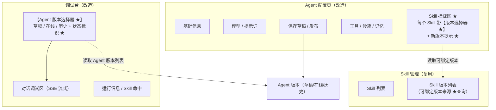
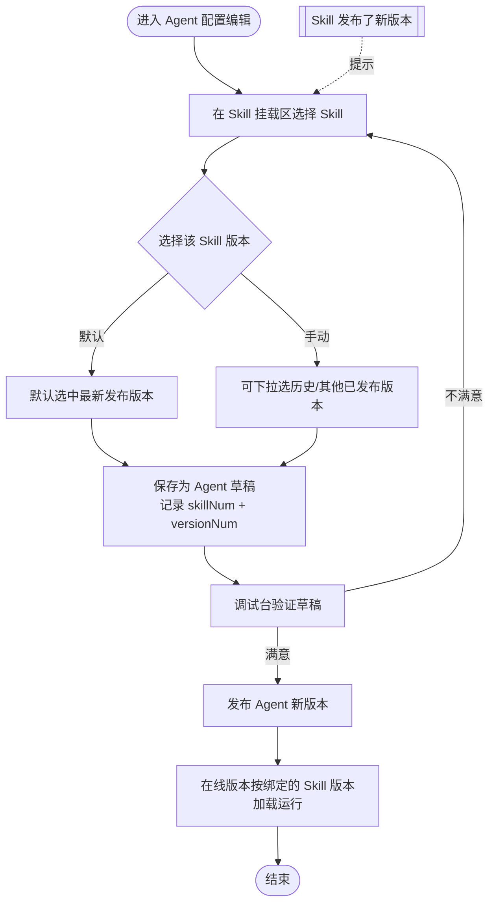
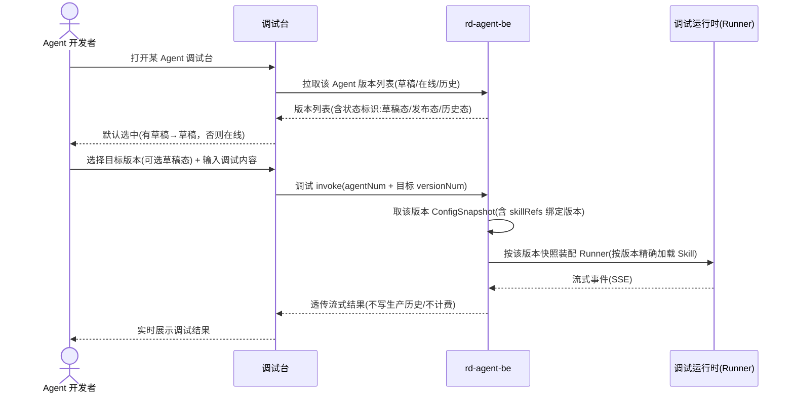
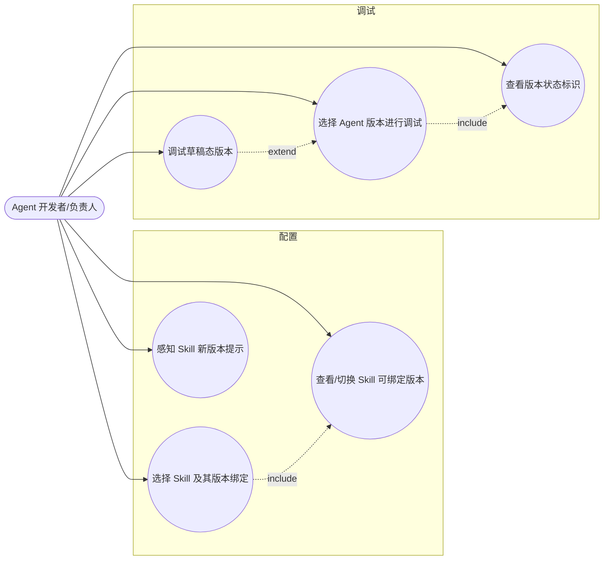

# Agent 绑定 Skill 版本与版本化调试 产品需求文档（PRD）

> 文档版本：v1.0　｜　编写日期：2026-07-28　｜　所属产品：AgentOps（Agent Sphere 管理后台）
> 关联既有 PRD：[Agent 配置优化](2026-06-11-Agent配置优化-PRD.md)、[Skill 管理优化](2026-06-10-Skill管理优化-PRD.md)、[调试台](2026-05-11-调试台-PRD.md)

## 1. 产品/需求背景

- **为什么要做**：Agent 与 Skill 都已进入「版本化」阶段——Skill 会不断发版（v1.0.0 → v1.1.0 → …），Agent 自身也有草稿态 / 在线态 / 历史态三态版本。但当前二者的「版本对齐」和「版本化调试」链路不完整：
  - Agent 挂载 Skill 时缺少**显式选择 Skill 具体版本**的入口，用户无法确定 Agent 到底用的是 Skill 的哪一版；Skill 一旦发新版，行为可能在用户无感知的情况下发生漂移，或反过来——用户希望用新版却无从切换。
  - 调试台目前只能调试「当前在线版本」，**无法在发布前调试草稿态 Agent**，也无法回放某个历史版本，导致「改完配置 → 只能先发布 → 再调试 → 发现不对 → 再改再发」，发布即污染线上版本号，验证成本高、风险大。
- **解决什么问题**：让 Agent 对 Skill 的依赖**精确到版本并可控可切换**；让调试台**支持按 Agent 版本（含草稿）调试**，实现「发布前先验证」。
- **面向用户**：Agent 开发者 / 负责人（在管理后台配置、发布、调试 Agent 的研发人员）。

## 2. 目标与范围

- **目标**：
  1. Agent 挂载的每个 Skill 都绑定到**明确的 Skill 版本**，加载 / 运行 / 调试时严格按绑定版本加载对应版本的 Skill 快照，不随 Skill 后续发版漂移。
  2. Skill 每次发布新版本后，Agent 编辑时都能**重新选择要绑定的版本**（升到新版或回退到历史版）。
  3. 调试台支持**选择目标 Agent 版本进行调试**，且**允许选择草稿态**版本，保证用户在正式发布前完成验证。
  4. 版本选择器在每个版本项后**明确标注该版本是「发布态」还是「草稿态」**（含历史态）。

- **范围（本次做什么）**：
  - Agent 配置页 Skill 选择器增加「版本选择」能力（下拉选具体版本 + 新版本提示）。
  - Skill 可绑定版本列表查询能力。
  - 调试台增加「Agent 版本选择器」（草稿 / 在线 / 历史），并按所选版本快照装配调试运行时。
  - 调试运行时放开「仅在线版本可调试」限制，支持草稿态与历史态版本调试。
  - 通用「版本状态标识」（发布态 / 草稿态 / 历史态）展示规范。

- **不做什么（明确排除）**：
  - 不做 Skill 版本的自动升级 / 自动跟随最新版策略（本期仅显式手动绑定；如需自动跟随留待后续）。
  - 不改动 Skill 自身的发版流程、Agent 自身的发布 / 回滚流程（复用现有能力，仅补齐版本选择与调试入口）。
  - 不做工具（Tool）的版本化绑定与调试（工具版本引用 `toolRefs` 已预留，落地不在本期范围）。
  - 不做 A2A 类型 Agent 的版本化（A2A 不参与版本化，维持现状）。
  - 不做草稿态版本的多人协同调试隔离（沿用现有草稿编辑锁语义）。

## 3. 系统线框图（必选，优先产出）

本需求横跨「Agent 配置」与「调试台」两个已有模块，新增 / 改造点用 ★ 标记：



**说明**：
- **Agent 配置页**：Skill 挂载区从「只选 Skill」升级为「选 Skill + 选该 Skill 的版本」，并在有新版本时给出提示。
- **Skill 管理**：提供「某 Skill 的可绑定版本列表」查询，作为版本选择器数据源（仅已发布、未下架版本）。
- **调试台**：新增 Agent 版本选择器，数据源为该 Agent 的全部版本（草稿 + 在线 + 历史），并按状态标识区分；选中后按该版本快照装配调试运行时。

## 4. 业务流程图（必选）

### 4.1 Agent 绑定 Skill 版本并发布



### 4.2 版本化调试（含草稿态）



**说明**：主路径为「选版本 → 按版本快照装配运行时 → 流式返回」；关键分支在于**目标版本可为草稿态**——此时放开「仅在线版本可调试」的校验；调试调用不写会话历史、不计费，与生产 invoke 隔离。

## 5. 用例图（必选）



**说明**：
- 参与者：Agent 开发者 / 负责人（需具备该 Agent 的编辑 / 调试权限）。
- 「选择 Skill 版本绑定」包含「查看可绑定版本」；「调试草稿态版本」是「选择版本调试」的扩展分支；「查看版本状态标识」是版本选择的必备信息展示。

## 6. 用户与场景

- **主要角色**：Agent 开发者 / 负责人（在 rd-agent 管理后台配置、发布、调试 Agent）。
- **典型用户故事**：
  - 作为 Agent 开发者，我希望在挂载 Skill 时能**指定使用哪个版本**，以便 Agent 行为稳定、不被 Skill 后续发版影响。
  - 作为 Agent 开发者，当某个 Skill 发布了新版本，我希望能**在编辑 Agent 时选择升到新版或保持旧版**，以便按需升级。
  - 作为 Agent 负责人，我希望在**正式发布前，用调试台调试我的草稿态 Agent**，验证配置正确后再发布，避免「发布即上线才发现问题」。
  - 作为 Agent 开发者，我希望调试台里**选版本时能一眼看出哪个是草稿、哪个是线上、哪个是历史**，避免选错版本。

## 7. 功能需求

### 7.1 模块一：Agent 绑定 Skill 版本

| 序号 | 功能点 | 简要说明 | 优先级 |
|------|--------|----------|--------|
| 1.1 | Skill 版本绑定 | Agent 挂载 Skill 时，绑定关系精确到 `(skillNum, versionNum)`；一个 Skill 只绑定一个版本 | P0 |
| 1.2 | 默认版本 | 新挂载 Skill 时默认选中该 Skill 的**最新已发布版本** | P0 |
| 1.3 | 版本选择器 | 每个已挂载 Skill 右侧提供版本下拉，可选该 Skill 的任意**已发布（未下架）版本**，展示版本号 + 发布时间 | P0 |
| 1.4 | 按版本加载 | Agent 加载 / 运行 / 调试时，严格按绑定的 `versionNum` 加载对应版本的 Skill 快照，**不随 Skill 后续发版漂移** | P0 |
| 1.5 | 新版本提示 | 当已绑定 Skill 存在比当前绑定更新的已发布版本时，在该 Skill 项上给出「有新版本 vX.Y.Z」提示，并支持一键切到新版本（切换后仍需保存草稿+发布方生效） | P1 |
| 1.6 | 已下架版本处理 | 绑定的版本被平台下架（DEPRECATED）时，配置页对该项做失效提示，引导用户改绑其他版本 | P2 |

### 7.2 模块二：Skill 版本更新后可重新选择绑定版本

| 序号 | 功能点 | 简要说明 | 优先级 |
|------|--------|----------|--------|
| 2.1 | 可绑定版本列表 | 提供「某 Skill 的可绑定版本列表」查询：返回该 Skill 全部**已发布、未下架**版本（版本号、发布时间、是否当前最新），按版本倒序 | P0 |
| 2.2 | 重新选择版本 | Agent 编辑态可变更任一已挂载 Skill 的绑定版本（升级到新版或回退到历史版），变更写入 Agent 草稿 | P0 |
| 2.3 | 发布方生效 | 绑定版本的变更沿用 Agent 版本化发布流程——保存草稿后需**发布 Agent 新版本**才对线上生效 | P0 |

### 7.3 模块三：调试台支持选择 Agent 版本（含草稿态）

| 序号 | 功能点 | 简要说明 | 优先级 |
|------|--------|----------|--------|
| 3.1 | Agent 版本选择器 | 调试台顶部提供 Agent 版本选择器，列出该 Agent 的：草稿态（若有）+ 当前在线版本 + 历史版本 | P0 |
| 3.2 | 默认选中 | 打开调试台时默认选中：**有草稿则选草稿态**，否则选当前在线版本 | P0 |
| 3.3 | 按版本装配运行时 | 选定版本后，调试运行时基于**该版本的配置快照**（含其绑定的 Skill 版本 `skillRefs`）装配 Runner 并执行 | P0 |
| 3.4 | 草稿态可调试 | 放开「仅在线版本可调试」限制，允许对草稿态 / 历史态版本发起调试，保证发布前可验证 | P0 |
| 3.5 | 调试隔离 | 调试调用维持现状：不写生产会话历史、不计费，与生产 invoke 隔离 | P0 |
| 3.6 | 版本切换重置 | 在调试台切换所选版本时，提示/清理当前调试会话上下文，避免跨版本上下文串味 | P1 |

### 7.4 模块四：版本状态标识（通用）

| 序号 | 功能点 | 简要说明 | 优先级 |
|------|--------|----------|--------|
| 4.1 | 状态标识 | 版本选择器每个版本项后标注状态：**草稿态 / 发布态（在线）/ 历史态**，并展示版本号 | P0 |
| 4.2 | 视觉区分 | 草稿态、发布态（在线）、历史态用不同标签色/文案区分，草稿态额外标注「未发布」 | P1 |

## 8. 原型图/界面说明（必选）

### 8.1 Agent 配置页 — Skill 挂载区（含版本选择器）

```
┌────────────────────────────────────────────────────────────┐
│  挂载 Skill                                    [ + 添加 Skill ] │
├────────────────────────────────────────────────────────────┤
│  ● 代码检查 Skill        版本 [ v1.2.0 ▾ ]   ⚠ 有新版本 v1.3.0 →│
│                              └ v1.3.0（2026-07-20 最新）        │
│                                v1.2.0（2026-07-01）✓ 当前绑定    │
│                                v1.1.0（2026-06-18）             │
│  ● 需求分析 Skill        版本 [ v2.0.0 ▾ ]（已是最新）      [移除]│
│  ● 旧文档 Skill          版本 [ v0.9.0 ✕ 已下架 ] 请改绑其他版本 │
└────────────────────────────────────────────────────────────┘
```

- **主要元素**：Skill 名称、版本下拉（默认最新发布版，可选历史版）、新版本提示 + 一键切换、已下架失效提示。
- **对应功能点**：FR1.1 ~ FR1.6、FR2.1 ~ FR2.2。

### 8.2 调试台 — Agent 版本选择器

```
┌────────────────────────────────────────────────────────────┐
│  调试台：需求分析 Agent                                        │
│  调试版本 [ 草稿态 · 未发布 ▾ ]                                 │
│            ├ 草稿态 · 未发布            ← 默认选中（有草稿时）    │
│            ├ v1.3.0 · 在线（发布态）                            │
│            ├ v1.2.0 · 历史（发布态）                            │
│            └ v1.1.0 · 历史（发布态）                            │
├────────────────────────────────────────────────────────────┤
│  [对话调试区 · SSE 流式输出]                                    │
│  > 帮我分析这个需求……                                          │
│  当前生效配置：模型 gpt-4o · Skill：代码检查@v1.2.0、需求分析@v2.0.0│
├────────────────────────────────────────────────────────────┤
│  输入框 [                                    ] [发送调试]        │
└────────────────────────────────────────────────────────────┘
```

- **主要元素**：Agent 版本选择器（草稿/在线/历史 + 状态标识）、当前生效配置摘要（含各 Skill 绑定版本）、流式对话区。
- **对应功能点**：FR3.1 ~ FR3.6、FR4.1 ~ FR4.2。

### 8.3 关键状态

- **无草稿**：版本选择器不展示「草稿态」项，默认选中当前在线版本。
- **无在线版本（仅草稿）**：仅展示草稿态，默认并只可选草稿态调试。
- **绑定版本已下架**：配置页该 Skill 项标红失效，调试装配时对失效 Skill 给出明确报错/跳过提示（不静默）。
- **空态**：Agent 无任何版本（异常）时，调试台提示「暂无可调试版本」。

## 9. 非功能需求

- **版本快照不可变**：已发布版本（在线 / 历史）的配置快照与其绑定的 Skill 版本引用不可变；按版本调试即按该快照精确复现。
- **调试隔离**：调试调用不写生产会话历史、不计费、不污染线上版本号；与生产 invoke 走独立入口。
- **权限**：仅具备该 Agent 编辑 / 调试权限的用户可选择草稿态 / 历史态版本调试（沿用现有权限与工作空间隔离）。
- **性能**：版本列表、可绑定版本列表查询应为轻量读接口；调试装配按版本快照直接读取，不做重型 join。
- **兼容**：存量 Agent 快照若仅有 Skill 编号而无版本引用（legacy `skillNums`），运行 / 调试时按 Skill 当前发布版本兜底加载，并保留告警，逐步引导迁移到显式版本绑定。
- **错误提示**：绑定版本缺失 / 已下架 / 加载失败时给出明确文案，不静默降级到错误版本。

## 10. 与现有功能的关系

- **属于对现有功能的扩展 / 改造**，非全新模块：
  - **复用**：Agent 版本三态模型（草稿 / 在线 / 历史）、Agent 配置快照中已存在的 Skill 版本引用结构（`skillRefs = skillNum + versionNum`）、Skill 版本化与「按版本读取 Skill 快照」的能力、调试台流式调用链路。
  - **改造点（需技术方案细化）**：
    1. **Agent 配置页 Skill 选择器**：从「只选 Skill」扩展为「选 Skill + 选版本」，并接入 Skill 可绑定版本列表与新版本提示。
    2. **调试运行时装配**：当前调试装配固定读「当前在线版本快照」且强制校验 Agent 为已发布状态；需改造为**接受目标 `versionNum` 参数**、按目标版本快照装配，并**放开草稿态调试的发布校验**。
    3. **查询接口**：补齐「某 Skill 可绑定版本列表」「某 Agent 全部版本（含草稿）列表 + 状态标识」两类读能力。
- **兼容要点**：存量以 legacy `skillNums`（无版本引用）挂载的 Agent 保持可运行（兜底当前发布版），不因本次改造中断。

## 11. 验收标准

1. Agent 挂载 Skill 时可选择具体版本，默认最新发布版；保存后 Agent 草稿正确记录 `(skillNum, versionNum)`。
2. Agent 加载 / 运行 / 调试时，加载的 Skill 内容与绑定版本一致，Skill 后续发新版**不影响**已绑定版本的行为。
3. Skill 发布新版本后，在 Agent 编辑态可看到新版本、可切换绑定版本（升级或回退），并可经发布生效。
4. 调试台可选择该 Agent 的草稿态 / 在线 / 历史版本进行调试；选择草稿态可在**未发布前**成功发起调试并返回结果。
5. 版本选择器每个版本项正确标注「草稿态 / 发布态（在线）/ 历史态」及版本号，默认选中逻辑符合 FR3.2。
6. 调试调用不写生产会话历史、不计费、不产生线上版本号。
7. 存量 legacy（无版本引用）Agent 仍可正常运行 / 调试（兜底当前发布版），无回归。

---

> 本 PRD 作为 **design-technical-solution** 的输入：技术方案阶段将围绕「Skill 版本绑定的数据契约」「调试运行时按版本装配 + 草稿态放开校验」「可绑定版本 / Agent 版本列表查询接口」等做设计前提问与模块拆解（facade / client / domain / infra / application / adapter 六层）。
