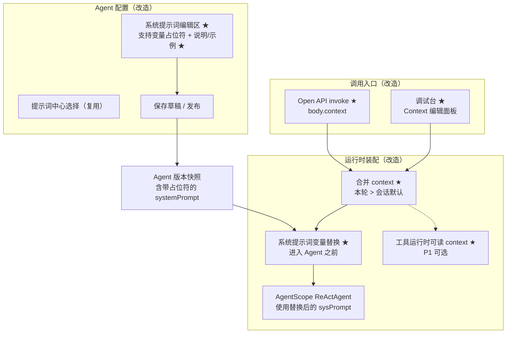
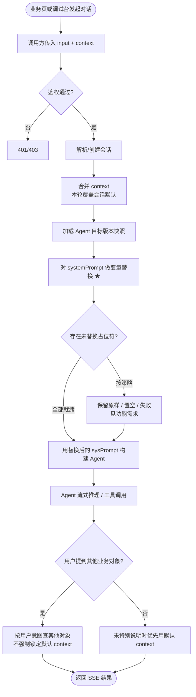
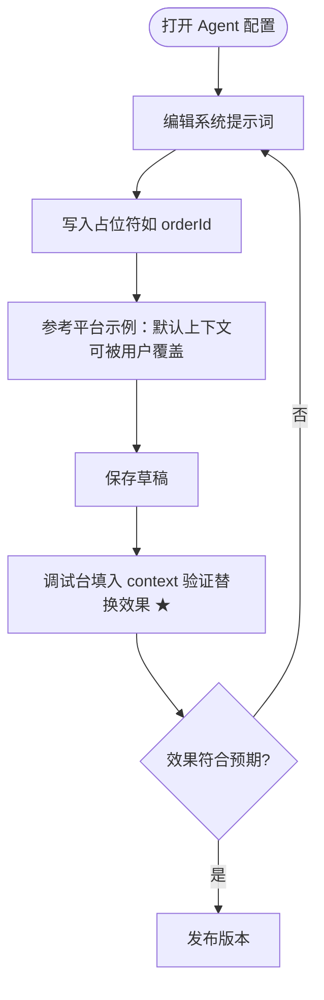
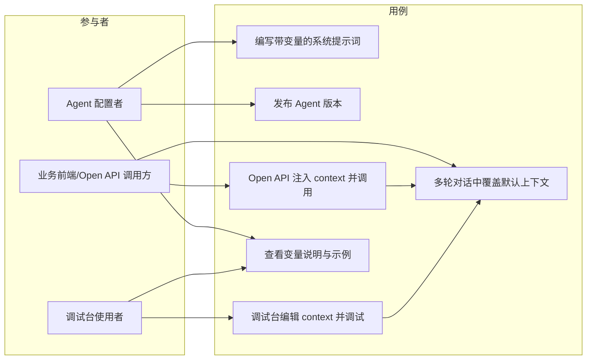

# 系统提示词变量替换与调用上下文注入 产品需求文档（PRD）

> 文档版本：v1.0　｜　编写日期：2026-08-09　｜　所属产品：AgentOps（Agent Sphere 管理后台）  
> 关联既有 PRD：[调试台](2026-05-11-调试台-PRD.md)、[Agent 管理](2026-05-11-Agent管理-PRD.md)、[Agent 配置优化](2026-06-11-Agent配置优化-PRD.md)、[Prompt 中心](2026-06-10-Prompt中心-PRD.md)

## 1. 产品/需求背景

- **为什么要做**：业务侧常见场景是用户停留在某一业务详情页（如订单详情）发起 Agent 对话。此时希望 Agent **默认知道当前业务对象**，但对话过程中用户仍可查询**其他订单或与当前页无关的信息**——即「默认上下文」而非「硬锁定」。  
  当前 Open API / 调试台调用只传纯文本 `input`，系统提示词在 Agent 配置中写死后原样进入运行时，**无法在进入 Agent 前按调用方注入的变量做替换**，业务方只能把订单号硬塞进用户话术，体验差且不稳定。
- **解决什么问题**：
  1. 系统提示词支持**变量占位符**，在装配 / 调用 Agent **之前**完成替换；
  2. Open API 与调试台允许调用方注入**结构化上下文（context）**，作为变量来源；
  3. 产品语义明确为「默认上下文、可被用户意图覆盖」，避免 Agent 被锁死在单一业务对象上。
- **面向用户**：
  - Agent 配置者（写系统提示词、声明可用变量）；
  - 业务前端 / Open API 调用方（在详情页等场景注入 context）；
  - 使用调试台验证上下文注入效果的研发人员。

## 2. 目标与范围

- **目标**：
  1. Agent 系统提示词支持统一变量语法，配置期可写占位符、运行期可替换。
  2. Open API 调用与调试台调用均可传入 `context`（键值对），在进入 Agent 运行时之前完成对系统提示词的变量替换。
  3. 文档与示例提示词引导「默认使用 context、用户明确提到其他对象时跟用户走」。
  4. 调试台可可视化编辑本轮 / 会话级 context，便于验收。

- **范围（本次做什么）**：
  - 系统提示词变量语法与替换规则（含缺失变量、类型与安全边界）。
  - Open API `invoke`（及必要时 `createSession`）增加 `context` 入参。
  - 调试台 invoke 增加 context 注入入口，并随 SSE 调用传到后端。
  - 运行时：在构建 / 调用 Agent **之前**，用本次 context（及约定的内置变量）替换系统提示词中的占位符，再交给 AgentScope。
  - Agent 配置页 / 用户手册：说明变量写法与「默认上下文」语义示例。
  - （建议同步）将同一份 context 暴露给工具运行时读取，便于工具参数兜底；**若工期紧张，工具通道可标为 P1，但 PRD 需预留契约。**

- **不做什么（明确排除）**：
  - 不做「仅允许查询当前 context 对象」的权限隔离或行级鉴权（那是业务 API / 工具自身职责）。
  - 不改造用户提示词 `userPrompt` 为本期主通道（本期以**系统提示词**为准；`userPrompt` 变量替换若已有能力则保持不变，不扩大范围）。
  - 不做复杂表达式引擎（条件、循环、函数库）；本期仅做**扁平键值占位替换**。
  - 不做跨会话自动推断业务对象（无 context 时不猜订单）。
  - 不改 A2A Agent 的提示词装配（A2A 无本地系统提示词版本化链路，维持现状）。
  - 不在本期做 Prompt 中心模板的独立「上下文变量」发布流（可复用现有「写入系统提示词」路径）。

## 3. 系统线框图（必选，优先产出）

本需求横跨「Agent 配置」「Open API」「调试台」「运行时装配」；新增 / 改造点用 ★ 标记：



**说明**：
- 配置侧只存「带占位符的系统提示词模板」；真正替换发生在**每次 invoke 装配阶段**。
- Open API 与调试台共用同一套 context → 替换语义。
- 替换必须在进入 AgentScope 之前完成，保证模型看到的是已填充文本。

## 4. 业务流程图（必选）

### 4.1 Open API / 调试台调用（主路径）



### 4.2 Agent 配置者编写带变量的系统提示词



## 5. 用例图（必选）



**说明**：
- 配置者负责「模板 + 语义文案」；调用方负责「本轮/会话 context 值」；最终「跟不跟默认订单」由模型根据系统提示词规则 + 用户话术决定，平台不硬拦截跨对象查询。

## 6. 用户与场景

| 角色 | 场景 | 期望 |
|------|------|------|
| 业务前端 | 用户在订单详情页点「智能助手」 | 请求带 `context.orderId`；首问「这个单什么时候发货」时 Agent 默认指当前单 |
| 终端用户 | 对话中说「帮我看 ORD-999」或问无关问题 | Agent 可查其他订单或回答无关问题，不被锁在详情页订单 |
| Agent 配置者 | 编写客服类 Agent 系统提示词 | 使用 `{{orderId}}` 等占位符，并写明默认/可覆盖规则 |
| 调试人员 | 调试台模拟详情页上下文 | 在 Context 面板填入 JSON，观察系统提示词替换后的行为 |

**用户故事**：
- 作为业务前端，我希望 invoke 时传入页面上下文，以便 Agent 默认理解当前业务对象。
- 作为终端用户，我希望仍能询问其他订单或无关信息，以便不被页面上下文绑死。
- 作为 Agent 配置者，我希望在系统提示词里用变量引用上下文，以便同一 Agent 复用到多种业务页。

## 7. 功能需求

| 序号 | 功能点 | 简要说明 | 优先级 |
|------|--------|----------|--------|
| F1 | 系统提示词变量语法 | 约定扁平占位符语法（建议 `{{key}}`，key 为字母数字下划线；大小写敏感策略需在技术方案中定一种并全文统一）。仅替换**系统提示词**字符串。 | P0 |
| F2 | 进入 Agent 前替换 | 在 Open API / 调试台 / 内部共用的 Agent 装配路径上，加载快照中的 `systemPrompt` 后、构建 ReActAgent **之前**完成替换；替换结果仅用于本次调用，**不回写** Agent 版本快照。 | P0 |
| F3 | Open API 注入 context | `POST /api/v1/open/agents/command/invoke` 增加可选字段 `context`：`object`（string → string/number/boolean；嵌套对象本期不支持或仅 JSON 字符串化，技术方案选定一种）。 | P0 |
| F4 | 调试台注入 context | 调试台提供 Context 编辑区（JSON 或键值表），随 invoke 请求传给后端；与 Open API 字段同名同语义。 | P0 |
| F5 | context 合并策略 | **本轮请求 context** 覆盖同名会话默认；支持「建会话时写入默认 context、后续轮不传则继承」（若本期做会话级：`createSession` 可带 context，或首轮 invoke 写入会话元数据）。至少保证：**单轮 invoke 带 context 即可工作（MVP）**；会话级继承为 P1。 | P0（单轮）/ P1（会话继承） |
| F6 | 缺失变量策略 | 占位符在 context（及内置变量）中不存在时：默认**保留占位符原文**或替换为空串（二选一，建议默认「替换为空串」并打 debug 日志；若 Agent 配置开启「严格模式」则直接失败——严格模式可 P1）。 | P0 |
| F7 | 内置变量（可选） | 平台提供少量只读内置变量（如 `sessionNum`、`agentNum`、`workspaceNum`），与调用方 context 分命名空间或低优先级，避免覆盖业务键。 | P1 |
| F8 | 默认上下文语义引导 | 在 Agent 配置页系统提示词旁提供「插入默认上下文示例」快捷块，文案体现：未特别说明时优先用 context；用户提到其他业务主键或无关问题时按用户意图处理。 | P0 |
| F9 | 工具侧可读 context | 装配时将 context 放入运行时上下文，供 FC/MCP 参数兜底或出站头映射（与现有入站头透传并列，不互相替代）。 | P1 |
| F10 | 观测与审计 | 日志中记录「是否发生替换、未命中的占位符列表」；不落库完整敏感 context 明文到公开日志（可截断/脱敏）。 | P1 |
| F11 | 文档 | Open API 说明、用户手册补充 context 与变量示例（订单详情页）。 | P0 |

### 7.1 变量与 context 产品约定

1. **系统提示词是模板**：发布进版本快照的可以是带 `{{orderId}}` 的模板文本。  
2. **context 是默认值来源**：调用方传入的键值用于填充模板，语义为「页面/会话默认」，不是唯一可访问范围。  
3. **用户话术优先**：平台不因存在 `context.orderId` 而禁止模型查询其他订单；是否跟默认对象由系统提示词规则 + 模型理解完成。  
4. **替换时机**：仅在服务端进入 Agent 之前；前端不对系统提示词做替换。  
5. **安全**：context 值按普通字符串嵌入提示词，需限制单键长度与总大小（建议单键 ≤ 2KB，整体 ≤ 16KB），防止提示词膨胀与注入过长文本。

### 7.2 Open API 契约（产品级）

```json
{
  "agentNum": "AGT...",
  "sessionNum": "SES...",
  "input": "这个单什么时候发货？",
  "context": {
    "orderId": "ORD-123",
    "page": "order_detail"
  }
}
```

- `context` 可空或省略：不替换业务变量（按 F6 策略处理占位符）。  
- 与现有 `Authorization: Bearer ak-...` 鉴权兼容，无额外权限码（沿用 `agent:invoke` / API Key 隐含权限）。

### 7.3 调试台契约（产品级）

- 请求体增加与 Open API 同名的 `context`（JSON 对象）。  
- UI：对话区旁或高级折叠面板「调用上下文」，支持编辑 JSON；发送时带上当前面板内容。  
- 切换会话时：若会话存有默认 context（P1），面板回填；否则清空或保留本地草稿（实现可选，需在交互说明中写清）。

## 8. 原型图/界面说明（必选）

### 8.1 Agent 配置页 — 系统提示词区

```
┌─────────────────────────────────────────────────────────┐
│ 系统提示词                                    [从提示词中心] │
│ ┌─────────────────────────────────────────────────────┐ │
│ │ 你是客服助手。                                        │ │
│ │ 【页面默认上下文】                                    │ │
│ │ - 当前订单：{{orderId}}                               │ │
│ │ 未特别说明时优先按上述订单理解；若用户提到其他订单号   │ │
│ │ 或无关问题，按用户意图处理，不要锁死在默认订单。       │ │
│ └─────────────────────────────────────────────────────┘ │
│ 可用变量：调用方 context 的键，如 {{orderId}}            │
│ [插入「默认上下文」示例 ★]                               │
└─────────────────────────────────────────────────────────┘
```

### 8.2 调试台 — Context 面板

```
┌──────────────┬──────────────────────────────────────────┐
│ 会话列表     │ Agent 版本选择器 │ [Context ★]            │
│              ├──────────────────────────────────────────┤
│              │ Context (JSON)                           │
│              │ {                                        │
│              │   "orderId": "ORD-123",                  │
│              │   "page": "order_detail"                 │
│              │ }                                        │
│              ├──────────────────────────────────────────┤
│              │ 对话消息流 ...                           │
│              │ [输入框]                        [发送]   │
└──────────────┴──────────────────────────────────────────┘
```

### 8.3 关键状态

| 状态 | 说明 |
|------|------|
| context 非法 JSON（调试台） | 发送前前端校验，阻止发送并提示 |
| 占位符未提供 | 按 F6：空串或保留原文；调试台可选展示「未命中变量」提示（P1） |
| context 超长 | 后端 400 + 明确错误码/文案 |
| 无系统提示词 | 跳过替换，行为与现网一致 |

## 9. 非功能需求

- **性能**：变量替换为纯字符串处理，单次耗时应可忽略（建议 &lt; 5ms，16KB 级文本）。  
- **安全**：context 不得用于绕过 API Key / 工作空间鉴权；敏感字段（手机号、证件）由调用方自行脱敏后再传入。  
- **兼容**：不传 `context` 时行为与现网一致（系统提示词无占位符则完全不变；有占位符则按 F6）。  
- **多租户**：context 仅作用于当前调用的 Agent 装配，不泄漏到其他工作空间。  
- **可观测**：替换失败（严格模式）需有明确错误返回，便于联调。

## 10. 与现有功能的关系

| 现有能力 | 关系 |
|----------|------|
| Agent `systemPrompt` / 版本快照 | **扩展**：快照中可含占位符；运行时替换后不写回快照 |
| 调试台 SSE invoke | **扩展**：请求体增加 `context` |
| Open API invoke | **扩展**：请求体增加 `context` |
| Prompt 中心 | **复用**：模板仍可含 `{{var}}` 填入系统提示词；本期不新增 Prompt 中心专用变量发布流 |
| 入站 HTTP 头透传 FC/MCP | **并存**：头透传服务工具出站；context 主要服务提示词（及 P1 工具运行时） |
| 沙箱环境说明 / 已挂载工具清单追加 | **顺序约定**：先业务 systemPrompt 变量替换，再追加平台固定段落（或反之，技术方案需固定一种，避免占位符被平台段落误伤） |

## 11. 验收标准

1. Agent 系统提示词含 `{{orderId}}`，Open API invoke 传 `context.orderId=ORD-123`，模型首轮表现能正确对应 ORD-123（人工或评测用例）。  
2. 同一会话中用户说「查一下 ORD-999」，Agent **可以**转向 ORD-999（不出现「只能查当前订单」的硬拒绝，除非业务工具本身鉴权失败）。  
3. 调试台 Context 面板传入相同 context，行为与 Open API 一致。  
4. 不传 context 时，无占位符的 Agent 与改前行为一致。  
5. context 超长或非法类型返回明确错误，不 500。  
6. 版本快照中仍保存带占位符的原文；发布内容不被某次调用的替换结果污染。  
7. 用户手册 / Open API 文档含订单详情页示例与「默认可覆盖」说明。

## 12. 优先级与里程碑建议

| 阶段 | 内容 |
|------|------|
| MVP（P0） | F1–F4、F5 单轮、F6、F8、F11 + 验收 1–6 |
| 增强（P1） | 会话级 context 继承、F7、F9、F10、调试台未命中变量提示、严格模式 |

---

**下游衔接**：本稿供 design-technical-solution 做设计前澄清（变量语法细节、合并顺序、与平台追加 sysPrompt 段落的先后、会话存储模型等）并拆解六层落码。
