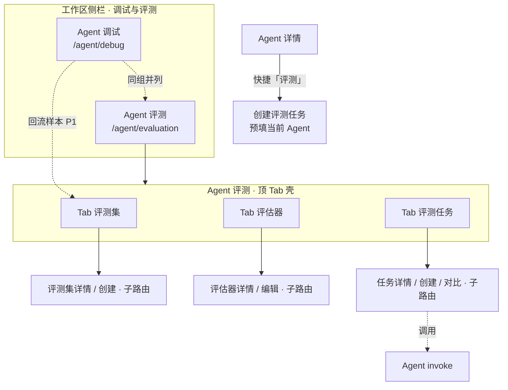
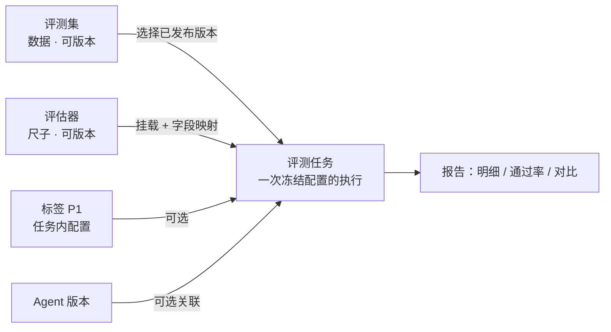
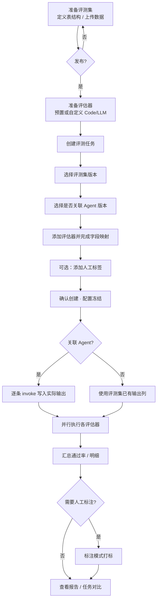
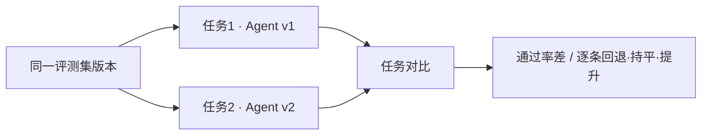
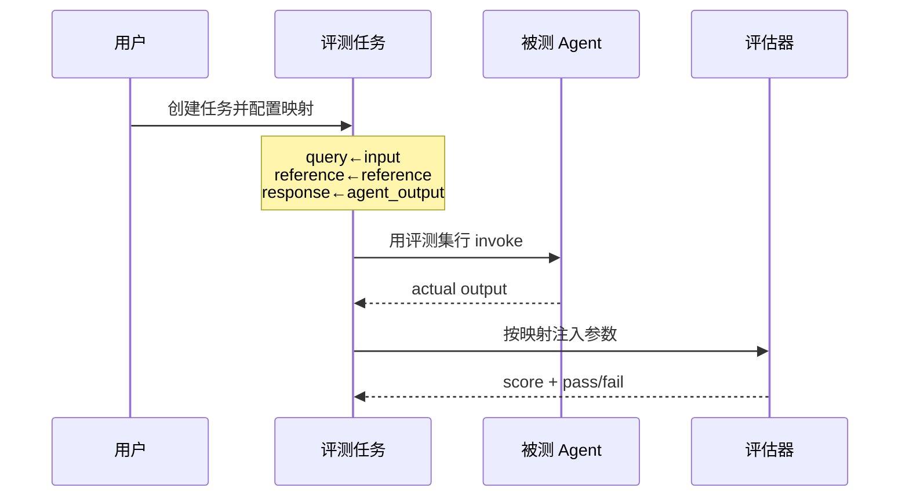
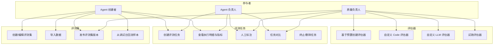

# Agent 应用评测 产品需求文档（PRD）

> 文档日期：2026-08-22　|　版本：v1.1　|　所属：AgentOps  
> 对标参考：阿里云百炼「新版应用评测」（[评测集](https://help.aliyun.com/zh/model-studio/new-version-of-evaluation-set) · [评估器](https://help.aliyun.com/zh/model-studio/grader) · [评测任务](https://help.aliyun.com/zh/model-studio/evaluation-task)）  
> 上游：[总体规划 §5.2 评测](../总体规划/2026-05-11-AgentOps-总体规划.md) · [Agent 管理 PRD](./2026-05-11-Agent管理-PRD.md)  
> 关系声明：**本 PRD 取代** [2026-06-11_Agent评测-PRD](./2026-06-11_Agent评测-PRD.md) 中以「四类测试（UNIT/QUALITY/TRAJECTORY/REGRESSION）」为主轴的方案；旧文档保留作历史参考，不再作为实现依据。  
> 下游：交付 **design-technical-solution** 产出《Agent 应用评测-技术方案》

---

## 1. 产品/需求背景

- **为什么要做**：Agent 配置、发布、调试已打通，但缺少一套可复用、可组合、可沉淀的「应用级」质量评估体系。业务方仍主要依赖调试台人肉试跑，无法规模化验证，也无法客观对比改版前后差异。
- **解决什么问题**：
  1. **尺子不清晰**——判分逻辑绑死在「评测任务」或「评测 Agent」上，无法像资产一样复用与版本化；
  2. **数据不沉淀**——用例散落在单次任务里，难以跨版本复用、难以从线上回流；
  3. **类型过重**——按「单元 / 评估 / 轨迹 / 回归」硬分产品入口，学习成本高，且与真实诉求（换数据、换尺子、换版本再跑）不对齐；
  4. **确定性与语义性混为一谈**——格式/关键词与语义质量共用一套 Judge，结果难解释、难稳定。
- **面向用户**：Agent 创建者 / Agent 负责人、空间质量负责人、需要对照标准答案验收业务效果的业务同学。

> **一句话**：对齐百炼新版应用评测——用**评测集 × 评估器 × 评测任务**三资产，把「Agent 能跑」升级为「Agent 敢规模化跑」；回归与轨迹不是一级类型，而是**同一评测集换版本再跑**、以及**挂上工具类评估器**的组合结果。

---

## 2. 目标与范围

### 2.1 目标

| 编号 | 目标 |
| --- | --- |
| **G1** | 工作空间内沉淀可版本化的 **评测集**（数据）与可复用的 **评估器**（尺子） |
| **G2** | 用户可创建 **评测任务**：选定评测集版本 + Agent 版本 + 一组评估器（字段映射），批量执行并产出报告 |
| **G3** | 支持 **Code 评估器**（确定性）与 **LLM 评估器**（语义）组合使用；可选人工标签补主观维度 |
| **G4** | 同一评测集、不同 Agent 版本（或不同 Agent）的任务之间可做 **横向对比**，支撑改版回归 |
| **G5** | 调试台 / 会话观测可将真实样本 **回流** 到评测集（P1），形成「线上问题 → 评测资产」闭环 |

### 2.2 范围（本次做什么）

| 范围 | 说明 |
| --- | --- |
| **评测集** | Agent 型 / 自定义型；草稿→发布→版本；本地上传；表结构可编辑（草稿态） |
| **评估器** | 预置模板 + 自定义 Code / LLM；评分范围 + Pass 阈值；版本管理；任务内字段映射 |
| **评测任务** | 绑定评测集版本 +（可选）Agent 版本；挂载多评估器；执行明细 + 通过率汇总；配置创建后冻结 |
| **人工标签** | 任务级可选标签，用于人工标注（与自动评分并存） |
| **任务对比** | 同评测集（建议同版本）下两次任务的通过率 / 逐条对比 |
| **入口** | 工作区侧栏「调试与评测」分组下，**Agent 调试** 正下方新增 **Agent 评测**；页内顶 Tab 切换三资产；Agent 详情「评测」快捷入口 |

### 2.3 不做什么（明确排除）

- ❌ 以 UNIT / QUALITY / TRAJECTORY / REGRESSION 作为一级产品类型与主流程分支  
- ❌ 评测发布门禁（未达标禁止发布）——可在后续迭代挂接，本 PRD 只产出报告与对比  
- ❌ 完整 ReAct 轨迹时间线裁判 UI（P2；P0/P1 仅将轨迹摘要落入结果字段，供工具类评估器使用）  
- ❌ 基于知识库自动生成评测集（无百炼一体知识库前提；后续可另立需求）  
- ❌ 自训 Reward Model / 微调评分模型  
- ❌ 跨工作空间评测集/评估器市场  
- ❌ Skill 评测全面重做——Skill 侧可逐步复用评估器资产，本 PRD 以 **Agent 应用评测** 为交付主线  

### 2.4 分期定位

| 阶段 | 内容 |
| --- | --- |
| **P0（MVP）** | 评测集（上传+发布版本）+ Code 评估器（含预置）+ 评测任务跑通 Agent + 明细/通过率 + 任务对比 |
| **P1** | LLM 评估器 + 字段映射试跑 + 人工标签/快速标注 + 调试台/观测导入评测集 + Agent 工具向预置评估器 |
| **P2** | 从已标注任务蒸馏 LLM 评估器、轨迹明细增强、发布门禁钩子、导出增强 |

---

## 3. 系统线框图（优先产出）

### 3.1 导航与现有系统对齐

对齐当前工作区 `WorkLayout` 信息架构：侧栏分组 **「调试与评测」** 下已有 **Agent 调试**（`/agent/debug`）。本需求在其**正下方**增加同级菜单 **Agent 评测**，不另开「应用评测」一级模块，也不把三资产拆成三个侧栏菜单。

```text
调试与评测
  ├─ Agent 调试          ← 已有
  └─ Agent 评测          ← 新增（本 PRD）
       └─ 页内顶 Tab：评测集 | 评估器 | 评测任务
```

**交互约定**

| 约定 | 说明 |
| --- | --- |
| **列表进 Tab** | 三个列表页共用壳子 + 顶 Tab 切换，侧栏高亮始终落在「Agent 评测」 |
| **深页出走路由** | 创建向导、详情、对比、评估器编辑等**离开 Tab 壳**，进入独立子路由；返回时回到对应 Tab |
| **标签不单独占 Tab** | P0 无标签管理页；P1 标签挂在任务创建/详情内配置，不增加第四个顶 Tab |
| **与 Skill 评测隔离** | 现有 `/skill/evaluation` 仍为 Skill 评测；本模块命名与路由均带 `agent`，避免混淆 |



### 3.2 三资产关系（信息架构）



### 3.3 页面结构与职责

| 页面/模块 | 路由（建议） | 壳层 | 职责 |
| --- | --- | --- | --- |
| **Agent 评测（默认进任务 Tab）** | `/agent/evaluation` → redirect `.../tasks` | 顶 Tab 壳 | 模块入口；三个列表共享页头与 Tab |
| **评测集列表** | `/agent/evaluation/datasets` | Tab「评测集」 | 列表、筛选、发布状态；主按钮「创建评测集」 |
| **评估器列表** | `/agent/evaluation/graders` | Tab「评估器」 | 预置与自定义；按类型筛选；主按钮「创建评估器」 |
| **评测任务列表** | `/agent/evaluation/tasks` | Tab「评测任务」 | 状态、通过率、关联集/Agent；主按钮「创建任务」「对比」 |
| **评测集创建/详情** | `/agent/evaluation/datasets/new` · `.../datasets/:num` | **离开 Tab 壳** | 表结构、导入、发布版本 |
| **评估器创建/编辑** | `/agent/evaluation/graders/new` · `.../graders/:num` | **离开 Tab 壳** | Prompt/Code、评分规则、试跑、版本 |
| **创建评测任务** | `/agent/evaluation/tasks/new` | **离开 Tab 壳** | 选评测集版本、Agent、评估器映射；（P1）标签 |
| **任务详情** | `/agent/evaluation/tasks/:num` | **离开 Tab 壳** | 明细、自动分、标注、指标 |
| **任务对比** | `/agent/evaluation/compare` | **离开 Tab 壳** | 选择两次任务对比 |

---

## 4. 业务流程图

### 4.1 主流程：创建资产 → 执行任务 → 看报告



### 4.2 回归场景（不设独立「回归类型」）



### 4.3 评估器字段映射（示意）



### 4.4 异常与约束

| 场景 | 行为 |
| --- | --- |
| 评测集未发布 | 不可被任务引用 |
| 评估器被任务引用 | 不可删除；可新建版本 |
| 任务创建后改配置 | **不允许**；需新建任务 |
| 单条 invoke 失败 | 该条标记失败，可重试单条（P0 至少支持任务级重跑失败项，细节技术方案定） |
| 评估器映射未完成 | 禁止创建任务 |
| 无基线可对比 | 对比页提示先完成至少两次关联同一评测集的任务 |

---

## 5. 用例图



**用例说明（摘要）**

| 用例 | 含义 |
| --- | --- |
| 创建/编辑评测集 | 选 Agent 型或自定义型，定义列，维护草稿数据 |
| 发布评测集版本 | 冻结当前数据快照供任务引用 |
| 创建评估器 | 预置 / Code / LLM；配置分数范围与阈值 |
| 创建评测任务 | 组合评测集、Agent、评估器映射、标签 |
| 人工标注 | 对任务明细补充主观标签 |
| 任务对比 | 两次任务的指标与逐条差异 |

---

## 6. 用户与场景

### 6.1 角色

| 角色 | 诉求 |
| --- | --- |
| Agent 创建者 | 改完 Prompt/工具后，快速用固定数据集验证有没有明显变差 |
| Agent 负责人 | 版本发布前看通过率与对比，组织业务同学补标注 |
| 质量负责人 | 沉淀通用评估器与评测集规范，统一空间内质量口径 |

### 6.2 用户故事

- **US1（评测集）**：作为创建者，我希望按当前 Agent 的入参结构生成评测集模板并上传 Excel，以便批量构造真实业务问题与参考答案。  
- **US2（Code 尺子）**：作为质量负责人，我希望用 Code 评估器校验「回答必须包含订单号字段 / JSON 合法」，以便得到稳定、可重复的 Pass/Fail。  
- **US3（LLM 尺子）**：作为负责人，我希望挂上「相关性 / 相对参考答案的正确性」LLM 评估器，以便覆盖无法用规则穷举的语义质量。  
- **US4（组合）**：作为创建者，我希望一个任务同时挂「字符串匹配 + 相关性」两个评估器，以便一份报告看到确定性与语义性结果。  
- **US5（回归）**：作为负责人，我改了系统提示词后，希望用**同一评测集版本**对新旧 Agent 版本各跑一个任务并对比，以便发现回退用例。  
- **US6（回流）**：作为创建者，我在调试台发现 Bad Case，希望一键加入评测集，以便下次回归必测到。  
- **US7（纯标注）**：作为业务同学，我希望任务不关联 Agent、只对已有输出列打标签，以便沉淀标注规范后再蒸馏自动评估器（P2）。  

---

## 7. 功能需求

### 7.1 评测集（Eval Dataset）

| 编号 | 功能点 | 说明 | 优先级 |
| --- | --- | --- | --- |
| D1 | 创建评测集 | 名称、描述；类型：`agent` / `custom`；创建后类型不可改 | P0 |
| D2 | Agent 型表结构 | 选择 Agent（及可选版本）后，按 invoke 入参生成默认列（至少：`input`；可选 `context` JSON、`reference`；预留附件列扩展） | P0 |
| D3 | 自定义表结构 | 用户增删列、定义列名与类型（string/number/boolean/json） | P0 |
| D4 | 数据导入 | 下载模板；上传 xls/xlsx 或 jsonl（具体格式技术方案定一种为 P0 主格式） | P0 |
| D5 | 草稿编辑 | 未发布前可改表头、增删改行、追加导入 | P0 |
| D6 | 发布与版本 | 发布后生成版本号；任务只能引用已发布版本；再编辑进入新草稿/新版本流程 | P0 |
| D7 | 导出 | 导出当前版本数据 | P1 |
| D8 | 调试台回流 | 将单条调试输入（+ context / 期望）写入指定评测集草稿 | P1 |
| D9 | 观测导入 | 从会话历史抽样写入评测集 | P1 |
| D10 | 多轮会话键 | 支持 `sessionKey` 将多行串为多轮（执行语义 P1） | P2 |

### 7.2 评估器（Grader）

| 编号 | 功能点 | 说明 | 优先级 |
| --- | --- | --- | --- |
| G1 | 预置评估器模板 | 分类：通用质量、文本匹配、格式校验；Agent 向（工具调用）P1 | P0（通用+匹配+格式） |
| G2 | Code 评估器 | Python/平台沙箱执行评分函数；入参可配；返回 score；试跑 | P0 |
| G3 | LLM 评估器 | 选择模型、编辑 Prompt（变量占位）、评分范围、通过阈值；试跑 | P1 |
| G4 | 评分规则 | 评分范围（如 0–1 / 0–100）；阈值 ≥ 为 Pass | P0 |
| G5 | 版本管理 | 评估器版本化；任务引用指定版本 | P0 |
| G6 | 复制 / 删除 | 复制创建；被任务引用不可删 | P0 |
| G7 | 从标注任务蒸馏 | 基于历史任务标注生成 LLM 评估器 | P2 |

**P0 建议预置（可直接选用或 fork）**

| 预置名 | 类型 | 典型入参 | 用途 |
| --- | --- | --- | --- |
| 字符串包含 | Code | `response`, `keywords` | 关键词是否出现 |
| 精确匹配 | Code | `response`, `reference` | 短答案一致 |
| JSON 合法性 | Code | `response` | 输出是否为合法 JSON |
| 非空输出 | Code | `response` | 是否产生有效回复 |

**P1 建议预置**

| 预置名 | 类型 | 用途 |
| --- | --- | --- |
| 问答相关性 | LLM | query vs response |
| 相对参考正确性 | LLM | query + reference vs response |
| 工具调用合理性 | LLM | query + tools_trace vs 期望 |
| 工具参数检查 | Code | 解析 trace 中工具名/必填参数 |

### 7.3 标签（Label）

| 编号 | 功能点 | 说明 | 优先级 |
| --- | --- | --- | --- |
| L1 | 标签定义 | 布尔 / 枚举（较差·一般·较好）/ 短文本；**不设独立「标签管理」菜单/Tab**，定义入口放在任务配置内（或空间设置二级，若需要再开） | P1 |
| L2 | 任务挂载标签 | 创建任务时可选；详情页可补配 | P1 |
| L3 | 快速标注 | 列表内联编辑；单条三栏标注（评测集 \| 应用输出 \| 人工） | P1 |

### 7.4 评测任务（Eval Task）

| 编号 | 功能点 | 说明 | 优先级 |
| --- | --- | --- | --- |
| T1 | 创建任务 | 名称、描述；选评测集+版本；选应用关联方式 | P0 |
| T2 | 应用关联 | `agent`：指定 Agent+版本并批量 invoke；`none`：不调用，仅评估/标注已有输出列 | P0（agent）；P1（none） |
| T3 | 挂载评估器 | 最多 N 个（建议上限 10，默认引导 2～5）；完成全部变量映射后方可创建 | P0 |
| T4 | 字段映射 | 评估器参数 ← 评测集列 或「Agent 实际输出」或「轨迹摘要字段」 | P0 |
| T5 | 配置冻结 | 创建后不可改评测集/Agent/评估器组合；标签可后补 | P0 |
| T6 | 异步执行 | 任务状态：PENDING → RUNNING → FINISHED / FAILED / CANCELLED | P0 |
| T7 | 用例明细 | 每行：输入、参考、实际输出、各评估器分数与 Pass、时延、错误信息 | P0 |
| T8 | 指标统计 | 评测集总量、完成量；各评估器通过率；综合通过率（规则：技术方案定义，如全评估器 Pass 才算综合 Pass） | P0 |
| T9 | 失败重跑 | 重跑失败用例或整任务（保留原配置） | P1 |
| T10 | 终止任务 | 运行中可终止 | P1 |
| T11 | 任务对比 | 选两次任务；展示通过率差、逐条回退/持平/提升 | P0 |
| T12 | Agent 详情快捷创建 | 预填当前 Agent 最新或指定版本 | P0 |

### 7.5 与「旧四类测试」的映射（仅说明，不落产品入口）

| 旧说法 | 在新模型中的实现方式 |
| --- | --- |
| 单元测试 | 评测集 + Code 评估器（匹配/关键词） |
| 评估测试 | 评测集 + LLM 评估器（质量维度） |
| 轨迹测试 | 结果写入 tools_trace + 工具类评估器 |
| 回归测试 | 同评测集版本 × 不同 Agent 版本的两个任务 + 对比 |

---

## 8. 原型图 / 界面说明

### 8.1 侧栏与顶 Tab 壳（贴合现网）

侧栏示意（与现网「Agent 与沙箱 / 模型与工具 / 调试与评测 / 权限与设置」一致）：

```
│ 调试与评测
│   ├─ 🐛 Agent 调试
│   └─ 📋 Agent 评测     ← 新增，紧挨调试下方
```

进入 **Agent 评测** 后为**同一页面壳**，顶 Tab 切换三资产列表（主操作按钮随当前 Tab 变化）：

```
┌──────────────────────────────────────────────────────────────┐
│ Agent 评测                                                    │
│ ┌─────────┬─────────┬─────────┐                               │
│ │ 评测集  │ 评估器  │ 评测任务│   ← 顶 Tab（路由 query/path）   │
│ └─────────┴─────────┴─────────┘                               │
│                                    [随 Tab：创建评测集/评估器/任务] │
├──────────────────────────────────────────────────────────────┤
│ 当前 Tab 的列表区（筛选 + 表格 + 分页）                         │
│ · 评测集：名称 / 类型 / 版本状态 / 条数 / 更新时间               │
│ · 评估器：名称 / Code|LLM / 预置|自定义 / 更新时间              │
│ · 评测任务：名称 / 状态 / 评测集 / Agent版本 / 通过率 / 时间     │
│   （任务 Tab 额外提供 [对比] 入口）                             │
└──────────────────────────────────────────────────────────────┘
```

默认落地 **评测任务** Tab（`/agent/evaluation/tasks`），因日常最高频是「看跑批结果 / 发起任务」。

从列表点「创建」或行「详情」→ **离开壳子**进入子页；子页顶栏提供「返回 Agent 评测 · xxx Tab」。

### 8.2 创建评测集（子路由，无顶 Tab）

```
步骤：基本信息 → 类型与表结构 → 导入数据 → 完成（可勾选立即发布）

Agent 型：下拉选择 Agent → 展示自动生成列 → 可增删可选列（context/reference）
自定义：空表 +「添加列」
导入：下载模板 / 上传文件 / 预览前 N 行
```

### 8.3 创建 / 编辑评估器（子路由，无顶 Tab）

```
┌──────────────────────────────┬─────────────────────────┐
│ 名称 / 描述 / 类型 Code|LLM   │ 试跑面板                 │
│ 入参列表                     │ 填测试 JSON              │
│ Code 编辑器 或 Prompt 编辑器 │ [开始试跑]               │
│ 评分范围 [0────1]  阈值 0.5  │ score / pass / 日志      │
│ [保存为版本]                 │                         │
└──────────────────────────────┴─────────────────────────┘
```

### 8.4 创建评测任务（子路由，无顶 Tab）

```
1. 基本信息
2. 评测集：选择已发布集 + 版本（展示列结构只读）
3. 应用：○ 智能体（选 Agent + 版本）  ○ 不关联（P1）
4. 评估器：添加 → 每行做参数映射表
     参数 query     → 评测集.input
     参数 reference → 评测集.reference
     参数 response  → Agent实际输出
5. 标签（可选，P1；无独立标签管理页）
6. 确认：只读摘要 + [创建并开始]
```

Agent 详情点「评测」：直接打开本页并预填当前 Agent（及可选版本）。

### 8.5 任务详情（子路由）

```
┌─ 指标 ───────────────────────────────────────────────┐
│ 综合通过率 78% │ 进度 78/100 │ 评估器A 90% │ 评估器B 70% │
└──────────────────────────────────────────────────────┘
┌─ 明细表 ─────────────────────────────────────────────┐
│ # │ input │ reference │ output │ A分 │ B分 │ 标签 │ 操作 │
│ 可切换：普通模式 / 快速标注（P1）                      │
│ 行点击 → 抽屉：三栏（集数据 | 输出 | 标注）            │
└──────────────────────────────────────────────────────┘
```

### 8.6 任务对比（子路由）

```
左：任务 T1（Agent v1）    右：任务 T2（Agent v2）
汇总：综合通过率 +12% / 评估器维度柱状对比
明细：用例级 回退 | 持平 | 提升 筛选
```

### 8.7 关键状态

| 状态 | 表现 |
| --- | --- |
| 无 Agent 评测权限 | 侧栏不展示「Agent 评测」 |
| 评测集空 | 评测集 Tab 空态 + 引导上传模板 |
| 无已发布评测集 | 创建任务页禁用提交并提示先发布 |
| 映射不全 | 「完成创建」禁用，标红未映射参数 |
| 任务运行中 | 进度条 + 不可编辑配置 |
| 对比无第二次任务 | 空态说明 |

---

## 9. 非功能需求

| 类别 | 要求 |
| --- | --- |
| **权限** | 评测集 / 评估器 / 任务的增删改查纳入工作空间权限点（如 `evaluation:dataset:*`、`evaluation:grader:*`、`evaluation:task:*`）；无权限不展示入口 |
| **多租户** | 资产均归属 `workspace`；请求带 `X-Workspace-Num` |
| **审计** | 发布评测集、创建/终止任务、删除资产写审计日志 |
| **性能** | P0 单任务建议支持至少 100 条用例；并发度可配置（默认保守）；列表分页 |
| **成本可见** | LLM 评估器与被测 Agent 调用产生的 token/费用在任务详情可汇总展示（能取则取） |
| **安全** | Code 评估器必须在受限执行环境运行，禁止访问任意内网与密钥；超时与资源限额 |
| **稳定性** | 评估器失败与 Agent 调用失败隔离记账，避免单条拖死整任务（可配置「遇错继续」） |
| **兼容** | 仅 Web 管理端；复用现有 Agent invoke，不直连 Data Plane |

---

## 10. 与现有功能的关系

| 现有能力 | 关系 |
| --- | --- |
| 现有 `evaluation` 域（Skill 人工/自动评测、种子） | **并存过渡**：Skill 评测短期保留；中长期种子导入评测集、Judge 迁移为 LLM 评估器。本 PRD 不要求一次性删除旧接口 |
| [2026-06-11 Agent 评测 PRD](./2026-06-11_Agent评测-PRD.md) | **产品方案废止**（四类测试主轴）；本文件为 Agent 评测唯一现行 PRD |
| Agent 调试台（`/agent/debug`） | **同组菜单兄弟**：侧栏「Agent 评测」紧挨其下；P0 可从 Agent 详情跳转创建任务；P1 支持从调试台回流样本到评测集 |
| 工作区导航 `WorkLayout` | 在「调试与评测」分组 `routes` 中追加一项，权限可与调试共用或独立 `evaluation:*`（技术方案定） |
| Agent 版本 / 系统提示词变量 / 附件 | 评测集列需能表达 `context`；附件列 P1/P2 |
| 会话与观测 | P1 作为评测集数据源 |
| 用户手册「四类 Agent 评测」章节 | 随本 PRD 落地后需改版文档（非本需求开发范围，需跟踪） |

**迁移原则（产品侧）**

1. 不要求用户理解旧四类枚举。  
2. 若已有 Skill 评测任务数据，P0 不强制迁移；提供说明「Agent 请使用侧栏 · Agent 评测」。  
3. 技术方案需评估：新建表/聚合 vs 扩展现有 Evaluation 表——以「三资产清晰」为准，避免继续用 `evalType` 硬编码四类。  

---

## 11. 验收标准与成功指标

### 11.1 验收标准（P0）

- **AC1**：可创建 Agent 型评测集，上传 ≥20 条数据并发布版本。  
- **AC2**：可基于预置创建 Code 评估器，试跑得到稳定 score/pass。  
- **AC3**：可创建评测任务：绑定该评测集版本 + 某 Agent 版本 + ≥2 个评估器且映射完整；任务跑完后明细与各评估器通过率正确。  
- **AC4**：任务配置创建后不可修改；再评需新建任务。  
- **AC5**：对同一评测集版本的两次任务（不同 Agent 版本）可完成对比，能标出至少「通过率变化」与「逐条差异」。  
- **AC6**：无相应权限用户侧栏不出现「Agent 评测」，且不可直链操作。  
- **AC7**：侧栏「调试与评测」下「Agent 评测」位于「Agent 调试」正下方；模块内顶 Tab 可在评测集 / 评估器 / 评测任务间切换，深页（创建/详情/对比）离开 Tab 壳且可返回对应 Tab。  

### 11.2 成功指标（上线后观察）

| 指标 | 期望 |
| --- | --- |
| 空间内至少 1 个核心 Agent 建立已发布评测集 | 试点空间 2 周内达成 |
| 改版前使用「同集对比」的比例 | 有评测习惯的 Agent 负责人 > 50% 改版会跑对比 |
| Code vs LLM 评估器使用比 | P0 以 Code 为主；P1 后 LLM 挂载率逐步上升 |

---

## 12. 给技术方案的提示（非实现细节）

1. **聚合建议**：`EvalDataset`（含 Version）、`Grader`（含 Version）、`EvalTask` + `EvalTaskItem`（行结果与各评估器分）分离；标签可为独立字典或任务配置快照。  
2. **执行**：复用现有 Agent 调用链路；任务编排异步（Worker/队列），与旧 `EvalWorker` 可演进合并。  
3. **Code 评估器**：必须有安全执行边界；入参/出参契约与试跑 API。  
4. **映射**：任务保存「评估器参数 → 数据源」快照，保证历史任务可复现。  
5. **综合通过率**：PRD 建议默认「全部挂载评估器均为 Pass 则该条综合 Pass」；若产品要加权，需在技术方案中做成任务级策略且有默认值。  
6. **权限点**：新增并在前后端统一过滤。  
7. **前端 IA**：`WorkLayout` 调试与评测分组增加 `/agent/evaluation`；列表三 Tab 可用嵌套路由或 Tab+路由同步，深页独立路由。  

---

## 13. 修订记录

| 版本 | 日期 | 说明 |
| --- | --- | --- |
| v1.0 | 2026-08-22 | 首版：对齐百炼新版「评测集 × 评估器 × 评测任务」；废止四类测试主轴方案 |
| v1.1 | 2026-08-22 | IA 贴合现网：侧栏「Agent 调试」下增加「Agent 评测」；三资产用页内顶 Tab；深页子路由；取消独立标签管理页/第四 Tab |
