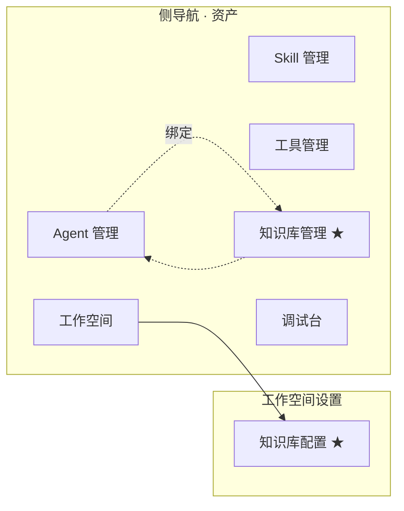
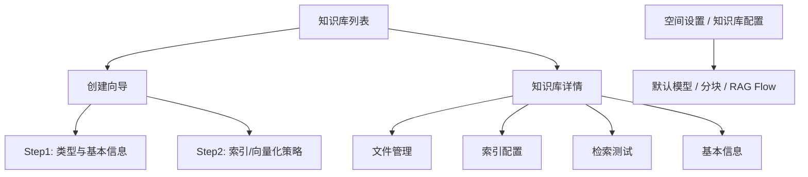
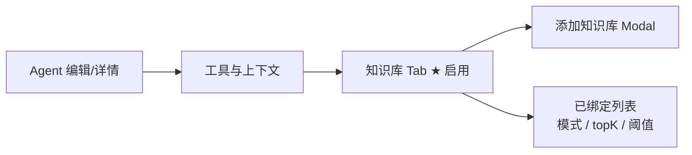
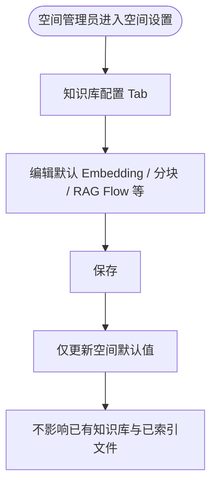
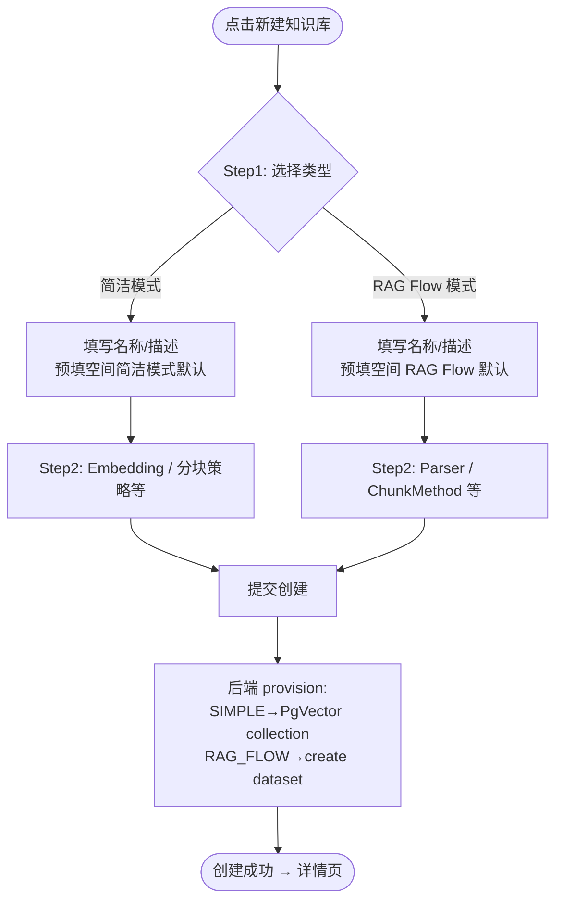
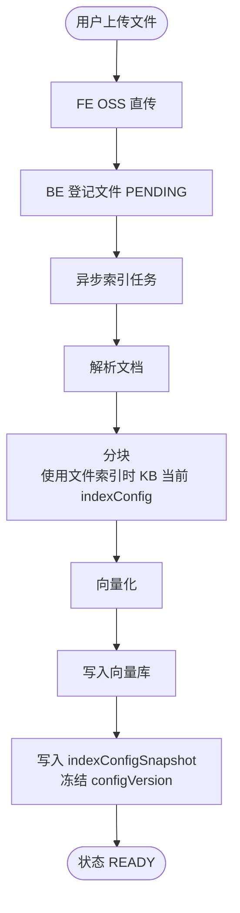
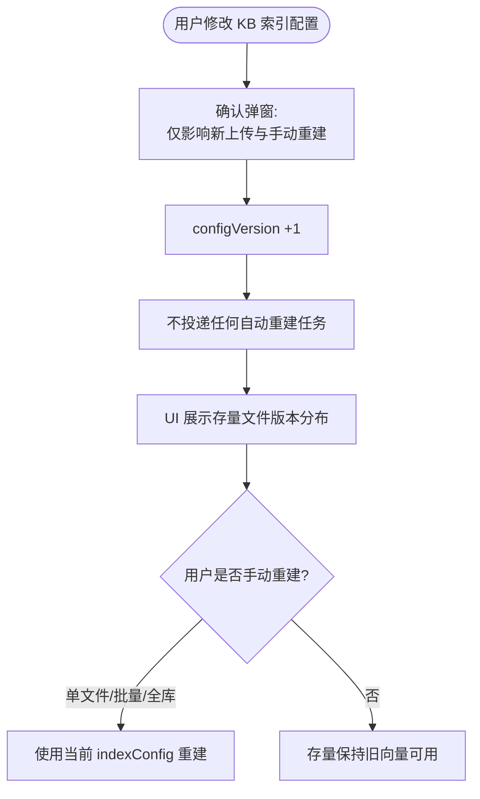
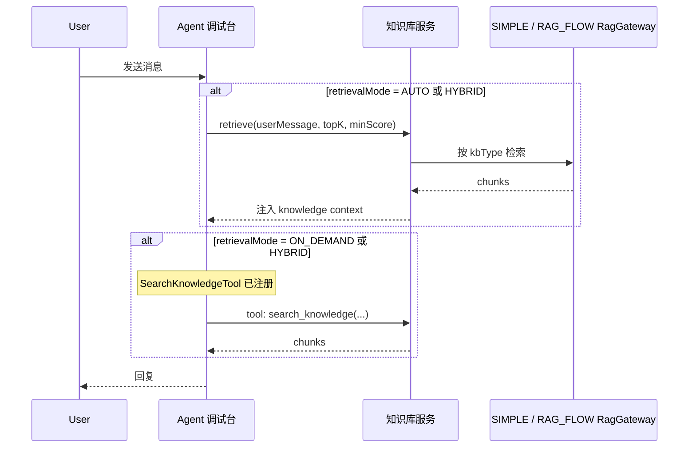
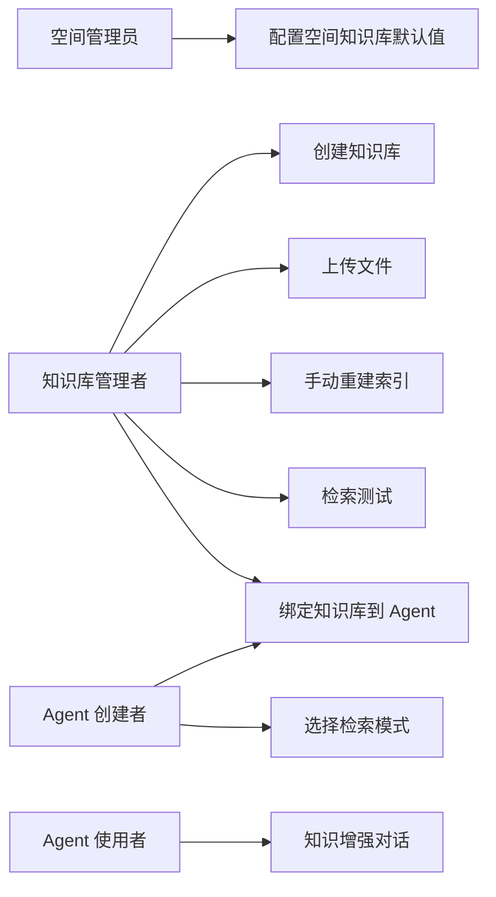

# AgentOps — 知识库管理 PRD

> 文档日期：2026-08-23　|　版本：v2.2（与技术方案评审修订对齐）
> 父文档：[S2 PRD](./2026-05-11-AgentOps-S2-PRD.md) · [工作空间管理 PRD](./2026-06-03-工作空间管理-PRD.md) · [Agent 管理 PRD](./2026-05-11-Agent管理-PRD.md)
> 前序版本：[2026-06-22-知识库管理-PRD](./2026-06-22-知识库管理-PRD.md)（v1.0，本文档替代其范围与实现路径）
> 下游输入：供 **design-technical-solution** 产出技术方案并落码

---

## 1. 产品/需求背景

### 1.1 为什么要做

Agent 平台已支持 Agent 的创建、配置、发布与调试，但 Agent 的「知识」仍主要依赖模型训练数据或 System Prompt 中的硬编码上下文。业务方接入真实场景（内部知识问答、文档分析、流程咨询）时，**缺乏可运营的外部知识注入能力**已成为阻塞性诉求：

- **私有文档问答**：用户希望上传 PDF / Word / Excel / Markdown，让 Agent 基于最新文档回答；
- **多知识库组合**：一个 Agent 可同时参考多个知识库（如「技术方案库」+「产品 PRD 库」）；
- **灵活底层实现**：部分团队希望平台自建向量链路（简洁可控），部分团队已有 RAG Flow 集群希望复用；
- **空间级治理**：Embedding 模型、分块策略等应在**工作空间**统一配置，而非全局硬编码或每个知识库孤立维护。

### 1.2 解决什么问题

- **工作空间知识库配置**：在空间设置中统一配置默认 Embedding 模型、分块策略、RAG Flow 连接等；
- **知识库全生命周期**：创建、文件上传、索引构建、检索测试、删除；
- **双类型知识库**：创建时选择「简洁模式」（平台自建）或「RAG Flow 模式」（对接外部服务），**产品能力一致、底层实现不同**；
- **可配置向量化策略**：创建知识库时选择索引/分块策略；修改配置**仅对增量数据生效**，存量须用户手动重建；
- **Agent 绑定**：多知识库绑定 + 多种检索模式（自动 / 按需 / 混合）；
- **调试台生效**：调试台运行的 Agent 使用已绑定知识库进行检索。

### 1.3 面向用户

| 角色 | 职责 |
| --- | --- |
| **空间管理员** | 配置空间级知识库默认策略；管理空间内知识库 |
| **知识库管理者** | 创建知识库、上传文件、维护索引、测试检索 |
| **Agent 创建者** | 为 Agent 绑定知识库并选择检索模式 |
| **Agent 使用者** | 在对话中获得基于知识库的增强回答 |

### 1.4 与现有功能的关系

| 关系 | 说明 |
| --- | --- |
| **工作空间** | 知识库归属工作空间；新增「知识库配置」空间设置项 |
| **模型管理** | 简洁模式 Embedding 模型来源于模型管理（EMBEDDING 类型） |
| **Agent 管理** | Agent 编辑/详情页「工具与上下文」启用知识库 Tab |
| **调试台** | 调试台 Agent 使用绑定知识库检索 |
| **工具 / Skill** | 与工具、Skill 同级资产；编号前缀 KB / KBF |
| **权限管理** | 复用已 seed 的 `knowledge_base:*` 权限域 |

### 1.5 平台级不变量（配置语义）

> **配置改的是「规则」，不是「历史」。历史须用户显式触发才重建。**

| 配置层级 | 变更影响 | 存量数据 |
| --- | --- | --- |
| 工作空间知识库配置 | 仅影响**此后新建**知识库的默认值 | 不改动已有知识库与已索引文件 |
| 知识库索引配置 | 仅影响**新上传文件**与**手动重建**的文件 | 已 READY 的文件向量不自动变更 |
| Agent 检索参数（topK / minScore / retrievalMode） | 立即影响检索行为 | 不涉及向量数据 |

---

## 2. 目标与范围

### 2.1 目标

| 目标 | 度量 |
| --- | --- |
| 双类型知识库 | 支持简洁模式 + RAG Flow 模式，产品能力对齐 |
| 空间级配置 | 工作空间可配置默认 Embedding、分块、RAG Flow 等 |
| 本地上传 | 支持 PDF / Word / Excel / Markdown / TXT |
| 可配向量化策略 | 创建知识库时可选索引策略；支持配置版本追踪 |
| Agent 绑定 | 单 Agent 可绑定 ≥ 2 个知识库，每库独立检索模式 |
| 检索模式 | 支持自动 / 按需 / 混合三种模式 |
| 增量配置生效 | 改配置不自动重建存量；提供手动重建入口 |
| 调试台可用 | 绑定知识库的 Agent 在调试台可验证检索效果 |

### 2.2 范围

**本期做（P0）**

- 工作空间「知识库配置」页（空间管理员）
- 知识库 CRUD（列表 / 创建向导 / 详情 / 删除）
- 知识库类型：简洁模式（SIMPLE）、RAG Flow 模式（RAG_FLOW）
- 创建时选择向量化/索引策略（按类型展示不同字段）
- 文件上传（OSS 直传）、索引状态跟踪、失败重试、手动重建（单文件 / 批量旧版本 / 全库）
- 配置版本（configVersion）展示与「存量未跟上」提示
- 检索测试（知识库详情 Tab）
- Agent 绑定知识库 + 检索模式 + topK / minScore
- 调试台检索生效
- 删除知识库前 Agent 绑定校验

**本期不做**

- ❌ 金山文档导入（枚举/字段预留）
- ❌ 知识库版本管理、跨空间共享
- ❌ 文档内容在线编辑
- ❌ Rerank / Query Rewrite（非 SimpleKnowledge 开箱能力）
- ❌ 知识图谱
- ❌ 知识库用量统计与配额（可后续迭代）
- ❌ 生产执行面（rd-points-sphere）对接（架构预留，本期以调试台为主）
- ❌ 知识库类型创建后变更（SIMPLE ↔ RAG_FLOW 不可互转）

---

## 3. 系统线框图

### 3.1 知识库在平台中的位置



### 3.2 知识库模块页面结构



### 3.3 Agent 配置中的知识库区块



### 3.4 主要页面说明

| 页面/模块 | 职责 | 主要元素 |
| --- | --- | --- |
| 空间设置 · 知识库配置 | 空间级默认策略 | 简洁模式默认 / RAG Flow 默认 / 允许的类型 / 文件限制 |
| 知识库列表 | 当前空间知识库一览 | 搜索、新建、类型标签、索引状态 |
| 创建向导 | 两步创建 | 类型选择 → 策略配置 → 提交 |
| 详情 · 文件管理 | 上传与索引 | 文件表、上传、重建、删除 |
| 详情 · 索引配置 | 查看/编辑向量化策略 | 当前配置版本、存量对齐状态 |
| 详情 · 检索测试 | 调试检索效果 | 问题输入、chunk 列表、score |
| Agent · 知识库 Tab | 绑定与检索模式 | 多选、每库模式与参数 |

---

## 4. 业务流程图

### 4.1 工作空间知识库配置



### 4.2 知识库创建（两步向导）



### 4.3 文件上传与索引



### 4.4 索引配置变更（增量生效）



### 4.5 Agent 绑定与运行时检索



---

## 5. 用例图



| 用例 | 谁能做 | 权限码（参考） |
| --- | --- | --- |
| 配置空间知识库默认值 | 空间管理员 | `workspace:update` 或专用权限 |
| 创建/编辑/删除知识库 | 空间管理员、授权成员 | `knowledge_base:*` |
| 上传文件 / 重建索引 | 空间管理员、授权成员 | `knowledge_base:update` |
| 检索测试 | 空间管理员、授权成员 | `knowledge_base:read` |
| 绑定知识库到 Agent | Agent 编辑者 | `agent:update` |
| 知识增强对话 | Agent 使用者 | 调试台 / 业务调用 |

---

## 6. 用户与场景

| 角色 | 典型场景 |
| --- | --- |
| **空间管理员** | 在「研发空间」配置默认 Embedding 为 `text-embedding-v3`、分块策略为「按段落」；新建知识库时自动预填 |
| **知识库管理者** | 创建「简洁模式」技术方案库，上传 20 份 PDF；将 Embedding 从 v2 改为 v3 后，仅新上传文件用新模型，旧文件通过「批量重建旧版本」升级 |
| **知识库管理者** | 创建「RAG Flow 模式」库对接公司已有 RAG Flow，上传复杂扫描件 PDF |
| **Agent 创建者** | 为「研发助手」绑定技术方案库（自动检索）+ FAQ 库（按需检索） |
| **Agent 使用者** | 在调试台提问「XX 模块的接口规范是什么？」，获得基于文档的回答 |

**用户故事**

- 作为**空间管理员**，我希望在空间设置中统一配置知识库默认 Embedding 和分块策略，这样团队成员创建知识库时无需重复配置。
- 作为**知识库管理者**，我希望创建知识库时选择「简洁模式」或「RAG Flow 模式」，以便复用现有基础设施或快速自建。
- 作为**知识库管理者**，我希望修改索引配置后**不会自动重建全部文件**，避免误操作带来的成本与等待；需要时我再手动重建。
- 作为**Agent 创建者**，我希望为每个绑定的知识库单独选择检索模式与 topK，以适应不同业务场景。

---

## 7. 功能需求

> 优先级：**P0** 本期必做，**P1** 建议同期，**P2** 可后续迭代。

### 7.1 工作空间知识库配置（P0）

**入口**：工作空间设置 →「知识库配置」Tab（仅空间管理员可编辑）。

#### 7.1.1 配置项

| 配置组 | 字段 | 说明 |
| --- | --- | --- |
| **通用** | `allowedKbTypes` | 本空间允许创建的类型：`SIMPLE` / `RAG_FLOW`（至少一种） |
| | `defaultKbType` | 创建向导默认选中类型 |
| | `maxKbCount` | 空间内知识库数量上限（默认 50） |
| | `maxFileSizeMb` | 单文件大小上限（默认 50） |
| | `allowedMimeTypes` | 允许上传的 MIME 类型列表 |
| **简洁模式默认** | `embeddingModelId` | 默认 Embedding 模型（模型管理 EMBEDDING 类型） |
| | `splitStrategy` | `PARAGRAPH` / `SENTENCE` / `TOKEN` / `CHARACTER` |
| | `chunkSize` | 块大小，256–2048，默认 512 |
| | `chunkOverlap` | 重叠大小，默认 64 |
| | `wordSeparateTables` | Word 表格是否单独成块 |
| | `wordTableFormat` | `MARKDOWN` / `JSON` |
| | `defaultTopK` | 默认检索 TopK，默认 5 |
| | `defaultMinScore` | 默认最低相似度，默认 0.5 |
| **RAG Flow 默认** | `ragFlowEndpoint` | RAG Flow 服务地址（空间级，不入库级） |
| | `ragFlowApiKey` | API Key（加密存储，掩码展示） |
| | `defaultParserId` | 默认解析器 |
| | `defaultChunkMethod` | 默认分块方法 |
| | `defaultTopK` / `defaultMinScore` | 检索默认值 |

#### 7.1.2 行为规则

- 保存空间配置后，**不触发**任何知识库或文件的索引变更。
- 新建知识库向导从空间配置**预填**默认值，用户可覆盖。
- 若空间禁用某种类型，创建向导不展示该选项。

---

### 7.2 知识库实体定义

#### 7.2.1 知识库主表字段

| 字段 | 类型 | 必填 | 说明 |
| --- | --- | --- | --- |
| `kbNum` | string | 系统 | 前缀 `KB`，工作空间内业务主键 |
| `workspaceNum` | string | ✓ | 归属工作空间 |
| `name` | string | ✓ | ≤64 字符，同空间唯一 |
| `description` | string | 可选 | ≤500 字符 |
| `kbType` | enum | ✓ | `SIMPLE` / `RAG_FLOW`，**创建后不可变** |
| `status` | enum | 系统 | `INDEXING` / `READY` / `PARTIAL_FAILED` / `DISABLED`（创建 provision 成功后空库即为 **READY**，可绑定） |
| `indexConfig` | json | ✓ | 当前索引/向量化策略（含 `configVersion`） |
| `sourceConfig` | json | ✓ | 底层资源引用（collection / datasetId） |
| `retrievalDefaults` | json | 可选 | `{ topK, minScore }`，Agent 绑定时可覆盖 |
| `fileCount` / `chunkCount` | int | 系统 | 统计 |
| 审计字段 | — | 系统 | createdBy / createdAt / updatedBy / updatedAt |

#### 7.2.2 知识库文件字段

| 字段 | 类型 | 说明 |
| --- | --- | --- |
| `fileNum` | string | 前缀 `KBF` |
| `kbNum` | string | 所属知识库 |
| `ossFileId` | string | OSS 文件 ID |
| `fileName` / `mimeType` / `fileSize` | — | 文件元数据 |
| `indexStatus` | enum | `PENDING` / `PARSING` / `CHUNKING` / `EMBEDDING` / `READY` / `FAILED` |
| `indexConfigSnapshot` | json | 索引完成时冻结的配置（含 `configVersion`） |
| `chunkCount` | int | 分块数量 |
| `vectorDocIds` | json | 向量侧文档 ID 列表（删除/重建用） |
| `errorMessage` | string | 失败原因 |
| `indexedAt` | datetime | 最近成功索引时间 |

#### 7.2.3 简洁模式 indexConfig 结构

```json
{
  "configVersion": 1,
  "embeddingModelId": "MODEL_xxx",
  "splitStrategy": "PARAGRAPH",
  "chunkSize": 512,
  "chunkOverlap": 64,
  "wordSeparateTables": true,
  "wordTableFormat": "MARKDOWN"
}
```

#### 7.2.4 RAG Flow 模式 indexConfig 结构

```json
{
  "configVersion": 1,
  "parserId": "naive",
  "chunkMethod": "general",
  "layoutRecognize": true
}
```

#### 7.2.5 sourceConfig 结构

**简洁模式：**

```json
{
  "vectorCollectionName": "kb_KB202608231200001",
  "dimensions": 1024
}
```

**RAG Flow 模式：**

```json
{
  "ragFlowDatasetId": "ds_abc123"
}
```

> RAG Flow 的 endpoint / apiKey **仅存空间配置**，不入知识库级。

---

### 7.3 配置版本与增量生效规则（P0，平台不变量）

#### 7.3.1 版本机制

- 每次保存「影响索引结果」的 `indexConfig` 变更 → `configVersion` 递增。
- 文件索引成功时，将当前 `indexConfig` 快照写入 `indexConfigSnapshot`。
- 知识库详情展示：
  - 当前配置版本：v3
  - 使用当前配置的文件数 / 使用旧版本的文件数

#### 7.3.2 变更影响矩阵

| 操作 | 新上传 | 存量已索引文件 | 自动后台任务 |
| --- | --- | --- | --- |
| 修改空间默认配置 | — | 不变 | 无 |
| 修改 KB indexConfig | 使用新配置 | 不变 | **无** |
| 单文件「重建索引」 | — | 该文件使用当前配置 | 有 |
| 「重建旧版本文件」 | — | 仅 snapshot.version < current 的文件 | 有 |
| 「全库重建」 | — | 全部文件 | 有 |
| 修改 Agent topK/minScore | — | 不涉及向量 | 无 |

#### 7.3.3 保存配置确认弹窗（必选文案）

> 配置变更仅对**此后新上传的文件**和**您手动触发重建索引的文件**生效。  
> 当前已有 {N} 个已索引文件不会自动更新。

#### 7.3.4 维度变更拦截

- 简洁模式下，若修改 Embedding 模型导致 **向量维度变化**，且知识库内存在已索引文件：
  - **禁止保存**，提示：「请新建知识库，或先清空/全库重建后再修改 Embedding 模型」。

---

### 7.4 知识库列表（P0）

| 序号 | 功能点 | 说明 |
| --- | --- | --- |
| 4.1 | 卡片列表 | 名称、类型标签（简洁 / RAG Flow）、文件数、状态、更新时间 |
| 4.2 | 搜索 | 按名称模糊搜索 |
| 4.3 | 新建 | 进入两步创建向导 |
| 4.4 | 空态 | 引导文案 + 跳转空间配置说明 |
| 4.5 | 状态徽标 | READY / INDEXING / PARTIAL_FAILED / DISABLED |
| 4.6 | 删除 | 行操作；有 Agent 绑定时阻塞并列出引用 |

---

### 7.5 创建知识库向导（P0）

#### Step 1 — 类型与基本信息

| 字段 | 约束 |
| --- | --- |
| 知识库类型 * | Radio：简洁模式（推荐）/ RAG Flow 模式；受空间 `allowedKbTypes` 约束 |
| 名称 * | ≤64 字符，同空间唯一 |
| 描述 | ≤500 字符 |

类型旁展示简要说明：
- **简洁模式**：平台自建向量索引（PostgreSQL），适合快速上手、数据自控。
- **RAG Flow 模式**：对接已有 RAG Flow 服务，适合复杂文档与 OCR 场景。

#### Step 2 — 索引/向量化策略

**简洁模式字段（预填空间默认，可改）：**

| 字段 | 说明 |
| --- | --- |
| Embedding 模型 * | 下拉，仅 EMBEDDING 类型且启用的模型 |
| 分块策略 * | 按段落 / 按句子 / 按 Token / 按字符 |
| 块大小 | 256–2048 |
| 重叠大小 | 0 – chunkSize×30% |
| Word 表格单独成块 | 开关 |
| 表格格式 | Markdown / JSON |
| 默认 TopK / 最低相似度 | 供 Agent 绑定时默认继承 |

**RAG Flow 模式字段（预填空间默认，可改）：**

| 字段 | 说明 |
| --- | --- |
| 解析器 parserId * | 下拉（来自 RAG Flow 能力列表或预置枚举） |
| 分块方法 chunkMethod * | general / qa / table 等 |
| 布局识别 | 开关 |
| 默认 TopK / 最低相似度 | 同上 |

#### 创建提交

- 后端按类型 provision 底层资源；
- 初始 `configVersion = 1`；
- 创建成功后跳转详情页。

---

### 7.6 知识库详情 — 文件管理（P0）

| 序号 | 功能点 | 说明 |
| --- | --- | --- |
| 6.1 | 文件表格 | 文件名、类型、大小、索引状态、配置版本、chunk 数、上传时间、操作 |
| 6.2 | 上传 | 拖拽/选择；PDF / docx / xlsx / md / txt；走 OSS STS |
| 6.3 | 自动索引 | 上传登记后自动投递异步索引任务 |
| 6.4 | 状态流转 | PENDING → PARSING → CHUNKING → EMBEDDING → READY / FAILED |
| 6.5 | 失败重试 | 行操作「重试」 |
| 6.6 | 单文件重建 | 使用**当前** indexConfig 覆盖索引 |
| 6.7 | 删除文件 | 删 OSS 元数据 + 删向量 + 软删记录 |
| 6.8 | 批量重建旧版本 | 对 `snapshot.configVersion < current` 的文件批量重建 |
| 6.9 | 全库重建 | 二次确认；展示预估文件数 |
| 6.10 | 配置版本列 | 展示文件索引时使用的 configVersion |

---

### 7.7 知识库详情 — 索引配置（P0）

| 序号 | 功能点 | 说明 |
| --- | --- | --- |
| 7.1 | 当前配置展示 | 按 kbType 展示对应字段；显示 configVersion |
| 7.2 | 存量对齐状态 | 「12 个文件 v2，3 个文件 v1，2 个文件已为当前 v3」 |
| 7.3 | 编辑配置 | 保存时弹出增量生效确认框 |
| 7.4 | 类型只读 | kbType 不可修改 |
| 7.5 | 检索默认值 | 可编辑 retrievalDefaults（topK / minScore） |

---

### 7.8 知识库详情 — 检索测试（P0）

| 序号 | 功能点 | 说明 |
| --- | --- | --- |
| 8.1 | 问题输入 | 多行文本 |
| 8.2 | 参数 | topK、minScore（默认取 KB retrievalDefaults） |
| 8.3 | 执行检索 | 调用统一 retrieve API |
| 8.4 | 结果列表 | chunk 内容、score、来源文件名、文件 configVersion |
| 8.5 | 空结果提示 | 无命中时说明可能原因（阈值过高、尚未索引等） |

---

### 7.9 Agent 绑定知识库（P0）

**入口**：Agent 编辑页 / 详情页 →「工具与上下文」→「知识库」Tab（启用现有占位）。

| 序号 | 功能点 | 说明 |
| --- | --- | --- |
| 9.1 | 添加知识库 | Modal 多选；仅 `READY` 状态；展示类型标签 |
| 9.2 | 绑定列表 | 每行：知识库名、类型、检索模式、topK、minScore、移除 |
| 9.3 | 检索模式 | 见 §7.10 |
| 9.4 | 参数 | 每绑定独立 topK（1–20）、minScore（0–1） |
| 9.5 | 保存 | 写入 Agent 版本 `knowledgeBaseBindings` |
| 9.6 | 调试台生效 | 保存后调试台下一轮对话生效 |
| 9.7 | 绑定上限 | 单 Agent 最多 10 个知识库（P1 可配置） |
| 9.8 | 混合类型 | 可同时绑定 SIMPLE 与 RAG_FLOW 库 |

**绑定数据结构：**

```json
{
  "knowledgeBaseBindings": [
    {
      "kbNum": "KB202608231200001",
      "retrievalMode": "AUTO",
      "topK": 5,
      "minScore": 0.5
    }
  ]
}
```

---

### 7.10 检索模式（P0）

| 模式 | 枚举值 | 行为 | 适用场景 |
| --- | --- | --- | --- |
| **自动检索** | `AUTO` | 每轮用户消息前，自动 retrieve 并注入上下文 | 强知识依赖、问答准确性优先 |
| **按需检索** | `ON_DEMAND` | 注册 `search_knowledge` 工具，Agent 自主决定是否检索 | 探索性对话、节省 Token |
| **混合模式** | `HYBRID` | 自动注入 + 工具可按需再查 | 兼顾覆盖与深度 |

**运行时规则（两种 kbType 一致）：**

- 多库 AUTO/HYBRID：并行 retrieve，按 score 合并去重，带来源标签 `[KB:名称]`；
- 全局 chunk 上限：默认 20（可空间配置）；
- ON_DEMAND 工具参数：`question`（必填）、`kbNum`（可选，缺省查所有 ON_DEMAND/HYBRID 绑定库）。

---

### 7.11 删除与校验（P0）

| 规则 | 说明 |
| --- | --- |
| 删知识库 | 软删；检查 Agent 绑定；提示先解绑 |
| 删文件 | 删向量 + 软删记录 |
| KB 软删 / 非 READY | 不可被新 Agent 绑定；**Agent 发布**时 `EvalPublishGateService` 拦截绑定 KB 非 READY 的情况（M3，P0） |
| 简洁模式 collection | 软删策略：标记废弃，异步清理（本期可不物理删） |
| RAG Flow dataset | 软删不动远端 dataset（与 v1 方案一致） |

---

### 7.12 双类型能力对齐表（P0）

用户侧功能完全一致，仅配置字段与底层不同：

| 能力 | 简洁模式 | RAG Flow 模式 |
| --- | --- | --- |
| 列表/详情/上传 | ✅ | ✅ |
| 索引状态 | ✅ 本地任务 | ✅ 轮询 RAG Flow |
| 检索测试 | ✅ | ✅ |
| Agent 绑定三种模式 | ✅ | ✅ |
| 配置版本增量规则 | ✅ | ✅ |
| 手动重建 | ✅ | ✅ |
| 空间级连接配置 | Embedding 默认 | endpoint / apiKey |

---

## 8. 原型图/界面说明

### 8.1 空间设置 — 知识库配置

```
┌─ 工作空间设置 ─────────────────────────────────────────┐
│ [基本信息] [成员] [知识库配置 ★]                        │
├────────────────────────────────────────────────────┤
│ 允许的知识库类型    [✓] 简洁模式  [✓] RAG Flow 模式      │
│ 默认创建类型        (•) 简洁模式  ( ) RAG Flow          │
│                                                    │
│ ── 简洁模式默认 ──                                   │
│ Embedding 模型      [text-embedding-v3      ▼]      │
│ 分块策略            [按段落 ▼]  块大小 [512] 重叠 [64]   │
│ 默认 TopK           [5]    默认最低相似度 [0.5]        │
│                                                    │
│ ── RAG Flow 默认 ──                                  │
│ 服务地址            [https://ragflow.internal    ]   │
│ API Key             [••••••••••••] 👁                │
│ 默认解析器          [naive ▼]                        │
│                                                    │
│ 单文件大小上限(MB)   [50]                             │
│                              [取消]  [保存]          │
└────────────────────────────────────────────────────┘
```

### 8.2 创建向导 Step 2（简洁模式）

```
┌─ 新建知识库 (2/2) ──────────────────────────────────┐
│ 索引配置（继承空间默认，可按知识库覆盖）                 │
│                                                    │
│ Embedding 模型 *    [text-embedding-v3      ▼]      │
│ 分块策略 *          [按段落 ▼]                        │
│ 块大小              [512]    重叠 [64]               │
│ Word 表格单独成块    [✓]    表格格式 [Markdown ▼]     │
│                                                    │
│ 默认检索 TopK       [5]    最低相似度 [0.5]            │
│                                                    │
│              [← 上一步]              [创建]           │
└────────────────────────────────────────────────────┘
```

### 8.3 知识库详情 — 索引配置 Tab

```
┌─ 技术方案库 · 简洁模式 ──────────────────────────────┐
│ [文件管理] [索引配置 ★] [检索测试] [基本信息]          │
├────────────────────────────────────────────────────┤
│ 当前配置版本: v3          [编辑配置]                  │
│                                                    │
│ ⚠ 配置对齐状态                                       │
│   · 使用当前配置 (v3): 2 个文件                       │
│   · 使用旧配置 (v2): 12 个文件  [批量重建旧版本]       │
│   · 使用旧配置 (v1): 1 个文件                        │
│                                                    │
│ Embedding 模型    text-embedding-v3                  │
│ 分块策略          按段落 / 512 / 重叠 64              │
└────────────────────────────────────────────────────┘
```

### 8.4 Agent 知识库 Tab

```
┌─ 工具与上下文 › 知识库 ──────────────────────────────┐
│ 已绑定 2 个知识库                      [+ 添加知识库]  │
├────────────────────────────────────────────────────┤
│ 📚 技术方案库          [简洁]                        │
│    检索模式 [混合模式 ▼]  TopK [5]  阈值 [0.5]  [移除] │
│ 📚 产品 FAQ            [RAG Flow]                   │
│    检索模式 [按需检索 ▼]  TopK [8]  阈值 [0.3]  [移除] │
└────────────────────────────────────────────────────┘
```

---

## 9. 非功能需求

| 类别 | 要求 |
| --- | --- |
| **性能** | 单文件 50MB 以内；索引异步，接口秒级返回；检索测试 P95 < 3s（简洁模式，TopK=5） |
| **安全** | 工作空间隔离；RAG Flow API Key 加密；检索/索引校验 workspaceNum |
| **审计** | 知识库创建/删除/配置变更/全库重建写审计日志 |
| **可用性** | 索引失败展示可读 errorMessage；配置变更有确认框 |
| **扩展性** | 知识库类型通过 RagGateway 扩展；FE 表单可由 type-schema API 驱动 |
| **兼容** | 权限域 `knowledge_base:*` 已存在；Agent ConfigSnapshot JSON 扩展向后兼容 |

---

## 10. 验收标准

### 10.1 空间配置

- [ ] 空间管理员可配置简洁/RAG Flow 默认值并保存
- [ ] 保存空间配置后，已有知识库文件索引状态与向量不变

### 10.2 知识库管理

- [ ] 可创建简洁模式与 RAG Flow 模式知识库（若空间均允许）
- [ ] 可上传 PDF/docx/xlsx/md/txt，看到索引状态直至 READY
- [ ] 检索测试可返回带 score 的 chunk 列表
- [ ] 修改 indexConfig 后，旧文件仍为旧版本；新上传使用新配置
- [ ] 手动「单文件重建」「批量重建旧版本」「全库重建」使用当前配置
- [ ] 维度不兼容的 Embedding 变更被拦截
- [ ] 有 Agent 绑定时无法删除知识库

### 10.3 Agent 绑定

- [ ] Agent 可绑定多个知识库，每库可选 AUTO / ON_DEMAND / HYBRID
- [ ] 调试台 AUTO 模式：提问可命中知识库内容
- [ ] 调试台 ON_DEMAND 模式：Agent 可主动调用检索工具
- [ ] 调试台 HYBRID 模式：既有自动注入也可工具检索

### 10.4 双类型一致性

- [ ] 两种类型在列表、上传、检索测试、Agent 绑定上的交互一致
- [ ] 仅「索引配置」字段与底层状态来源不同

---

## 11. 迭代规划（已定稿）

与技术方案 §12 对齐，按推荐顺序执行：

| 阶段 | 内容 | 优先级 |
| --- | --- | --- |
| **M1** | 空间 KB 配置 + SIMPLE 全链路（上传/索引/PG）+ 检索测试 + **FE 列表/创建/详情** | P0 |
| **M2** | configVersion 增量规则 + 手动重建 + **FE 索引配置/对齐 UI** | P0 |
| **M3** | Agent 绑定 + 检索模式 + 调试台生效 + **FE Agent 知识库 Tab** + 发布门禁 | P0 |
| **M4** | RAG_FLOW RagGateway + **FE 双类型创建向导** + 状态轮询 | P0 |
| **M5** | FE 体验收尾 + 审计 + 冒烟/单测 + sphere 对接方案 | P1 |

**已定稿决策摘要**（详见 [技术方案 §1.4 / §1.5](../技术方案/2026-08-23_知识库管理-技术方案.md#14-设计决策定稿全部按推荐方案执行)）：

- PostgreSQL 独立库 `rd_agent_vector`；MySQL 存元数据
- Embedding 走模型管理；默认 `text-embedding-v3` / 1024 维
- 空间默认同时开放 SIMPLE + RAG_FLOW，默认创建 SIMPLE
- Agent **发布**时校验绑定 KB 均为 READY（`EvalPublishGateService`）；草稿保存允许绑定非 READY 的 KB
- 配置仅增量生效；第一期仅调试台，sphere 对接方案放 M5
- 业务错误码使用 **12xx 段**（见技术方案 §14.2），禁止占用 9xxx 系统错误段
- 分支：`feature-20260823-knowledge-base`

---

## 12. 附录

### 12.1 术语表

| 术语 | 含义 |
| --- | --- |
| 简洁模式 | `kbType=SIMPLE`，平台自建 SimpleKnowledge + PgVector |
| RAG Flow 模式 | `kbType=RAG_FLOW`，对接 RAG Flow 数据集 |
| indexConfig | 影响索引结果的配置，含 configVersion |
| indexConfigSnapshot | 文件索引完成时冻结的配置 |
| 增量生效 | 配置变更不自动重建存量向量 |

### 12.2 与 v1.0 PRD 的主要差异

| 项 | v1.0 | v2.0（本文档） |
| --- | --- | --- |
| 知识来源 | 金山 + RAG Flow | **简洁模式 + RAG Flow** |
| 向量化 | 全部外包 | 简洁模式平台自建 |
| 配置层级 | 知识库级 endpoint/apiKey | **空间级默认 + 知识库级索引策略** |
| 分块策略 | 不可配 | **创建时可配，支持版本追踪** |
| 配置变更 | 未定义 | **仅增量生效，存量手动重建** |
| 检索测试 | 不做 | **P0** |

### 12.3 参考文档

- [AgentScope Simple Knowledge](https://java.agentscope.io/v2/zh/integration/rag/simple.html)
- [2026-08-23 知识库管理技术方案（v2.2 定稿）](../技术方案/2026-08-23_知识库管理-技术方案.md)
- [2026-07-29 RAG-Flow 开放接口文档](../技术方案/2026-07-29_RAG-Flow开放接口文档.md)

---

**文档状态**：已定稿（v2.2，与技术方案 v2.2 对齐）  
**下一步**：按技术方案 §12 从 M1 开始落码
