# Agent 管理 — 技术方案

> 文档日期：2026-05-11　|　版本：v3.1　|　覆盖周期：S2（2026-04 ~ 2026-07）
> 上游 PRD：[Agent 链路 PRD](../产品方案/2026-05-11-Agent管理-PRD.md)
> 总体方案：[2026-05-11_S2总体-技术方案.md](./2026-05-11_S2总体-技术方案.md)
>
> **v3.1 变更摘要（2026-06-25, hotfix_20260625_a2a-create-endpoints 同步能力补充）**：A2A "待同步 → 在线" 兜底轮询 + 手动触发实现：
> - **新增 application `A2aSyncApplicationService`**（独立于 `AgentCommandService`）：批处理推进 `status=PENDING_SYNC` 的 A2A Agent 至 PUBLISHED；`syncPendingBatch(int batchSize)` + `syncOne(A2aSyncCandidateVO)` 内部 `@Transactional(propagation = REQUIRES_NEW)` 单条事务；远端不可达 / 关键字段缺失 → 抛 `BusinessException(A2A_REMOTE_UNREACHABLE)`，写 `A2aSyncHistory` 跳过
> - **新增 adapter `A2aSyncController`**（HTTP 入口）：`POST /api/v1/agents/a2aSync/run?batchSize=1..500`，缺省 50，返回 `{processed: N}`；`@Min(1) @Max(500)` 参数校验
> - **新增 adapter `A2aSyncScheduler`**（cron 入口）：`@Scheduled(cron = "0 0/5 * * * ?")` 每 5min 触发；经 Redisson 全局锁 `LockKeyConstant.A2A_SYNC_RECONCILE_LOCK`（租约 280s）保证多副本下只有 1 个实例执行；抢不到锁直接跳过
> - **新增 application `AgentQueryService.listPendingSyncCandidates(int limit)`**：SQL `WHERE creation_mode=A2A AND status=PENDING_SYNC AND deleted=0 AND create_time <= DATE_SUB(NOW(), INTERVAL 1 MINUTE) ORDER BY id LIMIT ?`；1min 冷却窗口避免与 Nacos 首次推送抢跑
> - **新增 infra `LockKeyConstant.A2A_SYNC_RECONCILE_LOCK`**：`"a2a:sync:reconcile:lock"`
> - **入口层分工**：HTTP（Controller）+ cron（Scheduler）→ application 层同一方法 `syncPendingBatch`；与 `AgentCommandService.manualResync` 单条手动不同，本能力是批处理推进
> - **失败隔离**：每条独立事务 + try/catch 包外层循环 → 单条失败仅记日志 + 写历史 + 继续
> - **状态映射**：当前 fetcher 无 healthy 字段，M2 阶段统一按 PUBLISHED 处理（"远端可达即认为在线"）
> - **详见 PRD §6.6.5 + 本方案 §3.2.3.7 / §4.2.1 / §5.2.1 / §11.1.3**
>
> **v3.0 变更摘要（2026-05-15）**：版本模型重构 — **删除 `agent_draft` 表**；草稿合并到 `agent_version`：
> - **DDL（破坏性）**：
>   - `DROP TABLE agent_draft`
>   - `agent_version` 加 `status VARCHAR(16) NOT NULL` 枚举 `DRAFT / PUBLISHED / ARCHIVED`；`version_num` 改为允许 NULL（DRAFT 态尚未分配版本号）；加 `editor_user_id VARCHAR(64) NULL` + `lock_until TIMESTAMP(3) NULL`
>   - `agent_version` 唯一约束调整：`uk_agent_version_no (agent_num, version_num)` 仅对非 NULL version_num 生效；DRAFT 同 Agent 仅 1 行由应用层在 createVersion 时校验兜底（DDL 上 `(agent_num, status)` 仅作为查询索引）
>   - `agent` 加 `config_snapshot JSON NULL` 列，发布时同步当前在线版本快照
> - **Domain 层**：删除 `AgentDraft / AgentDraftRepository / AgentDraftFactory / AgentDraftReadGateway`；`AgentVersion` 加 `status: AgentVersionStatus` 枚举（DRAFT/PUBLISHED/ARCHIVED）+ `editorUserId / lockUntil` 字段；`Agent` 聚合根加 `configSnapshot: ConfigSnapshot` 字段
> - **Application 层**：
>   - `AgentCommandService` 删除 `saveDraft / discardDraft / createDraftFromCurrent`；新增：
>     - `createVersion(agentNum, operatorId)` —— 在 `agent_version` 插一行 DRAFT，基于当前在线 snapshot
>     - `editDraftVersion(versionId, configDraft, operatorId)` —— UPDATE DRAFT 行的 config_snapshot
>     - `deleteDraftVersion(versionId, operatorId)` —— DELETE DRAFT 行
>   - `AgentVersionCommandService.publish(versionId, changeLevel, remark, operatorId)` —— 入参由 agentNum 改为 versionId；事务原子完成 5 步：① 计算新 versionNum；② 旧 PUBLISHED → ARCHIVED + current_flag=0；③ DRAFT → PUBLISHED + 赋 versionNum + current_flag=1；④ UPDATE agent.config_snapshot + current_version_num；⑤ 发事件
> - **Adapter 层接口调整**：
>   - 新：`POST /api/v1/agents/version/create body {"agentNum":"..."}` → 返回 `{versionId}`
>   - 新：`POST /api/v1/agents/version/edit body {"versionId":...,"configDraft":{...}}` → 返回 `Void`
>   - 新：`POST /api/v1/agents/version/delete body {"versionId":...}` → 返回 `Void`
>   - 改：`POST /api/v1/agents/publish` 入参从 `{agentNum, ...}` 改为 `{versionId, changeLevel, remark}`
>   - 兼容期保留旧 `/draft/save` `/draft/discard` 路径，内部转发到新接口（M3 视进度删除）
> - **前端**：
>   - 详情页顶部按钮简化为 [调试] / [上线] / [⋯ 更多: 下线 / 删除]，去掉 [+ 创建版本] / [发布]
>   - 版本管理 Tab 右上角加 [+ 创建版本]；列表行操作按 status 分支：DRAFT [编辑]/[发布]/[删除]，PUBLISHED current [查看 snapshot]，ARCHIVED [查看]/[对比]/[回滚]
>   - 编辑入口 = 弹 5 步表单 Drawer（复用 CreateAgentForm mode='edit'）
>   - 发布入口 = 弹 PublishModal（点 OK 调新 publish 接口传 versionId）
> - **数据迁移**：把 `agent_draft` 现有非删除行迁移到 `agent_version` 作为 status=DRAFT；然后 DROP `agent_draft`
>
> **v2.9 变更摘要（2026-05-15）**：CONFIG 详情页"版本历史" Tab 升级为"版本管理"，并合并草稿展示：
> - **前端**：CONFIG 第 7 个 Tab label "版本历史" → "版本管理"；`CfgVersionHistoryTab` 合并草稿到表格头一行（草稿数据源：`agentApi.draftDetail(num)`，仅当 `detail.hasDraft=true` 时拉取）
> - 草稿行：状态显示 `草稿编辑中`；操作 [编辑] → 父组件回调 `setActiveTab('basic')` 跳回基本信息 Tab + Toast 引导用户在各 Tab 内编辑
> - **后端 `AgentDetailVO` 加 `currentVersion` 嵌套字段**（v2.8 已落地）：含 versionNum + configSnapshot；前端各 Tab + [+ 创建版本] 都依赖此字段
> - **后端 `AgentCommandService.saveDraft` upsert 化**（v2.8 已落地）：草稿不存在时基于 `agent.currentVersionNum` 自动创建，承接 [+ 创建版本] 闭环
> - **A2A 详情页 Tab "版本历史"语义不变**（远端推送事件流，不可编辑），仅 CONFIG 改名
>
> **v2.8 变更摘要（2026-05-15）**：CONFIG Agent 大模型配置必须从 DB 读取（撤销平台默认回落）：
> - **`OpenAiChatModelFactory.resolve(snap)` 简化**：不再注入 Spring 默认 `OpenAiChatModel` Bean；每次都用 `snap.modelApiKey / modelBaseUrl / model` 直接 `OpenAiApi.builder()` + `OpenAiChatModel.builder()` 实例化；任一缺失抛 `BizCode.MODEL_NOT_CONFIGURED(2014)`
> - **`AgentCreateParam`** + **`AgentDraftParam`** 加 `modelApiKey` / `modelBaseUrl` 必填校验（`@NotBlank`）；`AgentCommandService.create / saveDraft` 在 buildSnapshot 前断言非空
> - **`application.yml` 中 `spring.ai.openai.*` 段保留 placeholder**（让 starter 自动装配 Bean 不报错），但实际 CONFIG 调用路径不消费它；可以移除 default Bean 注入但 starter Bean 自动装配过程不打印 warn 即可
> - **业务理由**：Agent 维度独立的密钥使审计 / 限流 / 计费可按 Agent 归因，平台不再担当"共享 LLM 凭证池"角色
>
> **v2.7 变更摘要（2026-05-15）**：CONFIG 模式调试发起会话的构建链路定义，对齐 PRD §6.11：
> - **新增 `ConfigAgentBuilder`**（infra 层 strategy 工厂）：按 `agentType` 派发，构造 spring-ai-alibaba 的 `ReactAgent` / `SupervisorAgent` / `LlmRoutingAgent` 实例
>   - NORMAL → `ReactAgent.builder().name().description().model().instruction().outputKey().build()`
>   - SUPERVISOR → 先 build `mainAgent: ReactAgent`（用同一份 ConfigSnapshot.systemPrompt），再 `SupervisorAgent.builder().mainAgent().subAgents().build()`
>   - ROUTER → `LlmRoutingAgent.builder().systemPrompt().instruction().subAgents().build()`
>   - 子 Agent 递归调用同一 builder
> - **新增 `OpenAiChatModelFactory`**（infra 层）：当 ConfigSnapshot.modelApiKey/modelBaseUrl 非空时，用 `OpenAiApi.builder().baseUrl().apiKey().build()` + `OpenAiChatModel.builder().openAiApi().defaultOptions(model+temperature).build()` 实例化；为空时返回 Spring 默认 `OpenAiChatModel` Bean。**禁用 DashScope 原生 starter**。
> - **新增 `AgentInstanceCache`**（application 层 component）：`ConcurrentHashMap<String, BaseAgent>`，key=`{agentNum}::{agentVersionNum}`；`get(num, ver, supplier)` 原子 computeIfAbsent
> - **缓存失效**：监听 `AGENT_VERSION_PUBLISHED` / `AGENT_OFFLINED` / `AGENT_DELETED` 事件，调 `cache.invalidateByAgentNum(num)` 删除该 agent 的所有版本缓存项
> - **A2A 不入缓存**：A2aAgentRunnerImpl 行为不变（每次 invoke 即时构造 A2aRemoteAgent）
> - **新 BizCode**：`2014 MODEL_NOT_CONFIGURED` / `2015 LLM_UNREACHABLE` / `2016 SUBAGENT_NOT_AVAILABLE`
> - **ConfigAgentRunner 改造**：从直接 build LLM 改为调 `agentInstanceCache.get(...).stream(input)`；旧的 LlmGateway 流式 chat 路径标记为 deprecated（v2.7 起所有 CONFIG 调用走 spring-ai-alibaba 链路）
>
> **v2.6 变更摘要（2026-05-14）**：状态机统一 + 版本管理推广到两种模式：
> - **`AgentStatus` 枚举新增 `PENDING_SYNC`**（待同步）：仅 A2A 模式使用，订阅已发起但首次 AgentCard 未到达；CONFIG 状态保持 `DRAFT_ONLY / PUBLISHED / OFFLINE` 不变
> - **新增 `AgentCommandService.saveA2aDraft(param, operatorId)`**：本地落库不调 Nacos 不订阅；status=DRAFT_ONLY；幂等键 `nacos_service_key`（草稿允许 nacosAgentName 为空，幂等键此时用 `draft:{tempUuid}` 保证唯一）
> - **`AgentCommandService.createA2aAgent(param, operatorId)`** 改：成功后 status 由原 PUBLISHED 改为 **PENDING_SYNC**；首次 `onNacosEvent(INSTANCE_ADDED)` 触发时再升 PUBLISHED
> - **`Agent.assertMutableByPlatform()`** 拦截范围调整：CONFIG 在线 Agent 也禁止直接 saveDraft 字段（必须经 [+ 创建版本] 入口创建草稿后改草稿）；A2A 仍拦截 saveDraft / publish / offline；新增 BizCode `2013 STALE_BASE_VERSION`：草稿 baseVersionNum != current → 拒绝 publish
> - **新增表 `agent_a2a_sync_history`**：每次 Nacos AgentCard 推送（INSTANCE_ADDED / INSTANCE_CHANGED / POLLING_RECONCILE / MANUAL_RESYNC）落一行；列：id / agent_num / sync_event_type / remote_version / agent_card_json / synced_at / triggered_by；索引 `(agent_num, synced_at desc)`；保留最近 100 条（超过滚动删除）
> - **新增 `A2aSyncHistoryRepository.listByAgentNum(num, limit=100)`** + Controller 端点 `GET /api/v1/agent/version/a2a-history?agentNum=AGT...` 返回 `List<A2aSyncHistoryVO>`
> - **`AgentVersion` 实体保持不变**（仅 CONFIG 写入），CONFIG 版本历史接口路径不变
> - **前端 6/5 Tab → 7/5 Tab**：CONFIG 加"版本历史" Tab；A2A 加"版本历史" Tab；详见 §11.1.1
> - **状态胶囊新增 PENDING_SYNC**（橙色 `#FFF7ED / #EA580C`）+ 文案"待同步"
>
> **v2.5 变更摘要（2026-05-14）**：配置模式新建 Agent 步骤由 4 步扩为 **5 步**；CONFIG 详情页 Tab 由 5 个改为 **6 个**（5 步对应 + API 信息）：
> - **`ConfigSnapshot` 新增字段**：`modelApiKey: String`（落库加密）、`modelBaseUrl: String`；`memoryConfig` 由 `{shortTermEnabled: bool, longTermEnabled: bool}` 改为 `{shortTermStrategy: enum, shortTermN?: int, longTermStrategy: enum}`，枚举值见 PRD §6.5
> - **`AgentCreateParam` 同步加** `modelApiKey?: String` / `modelBaseUrl?: String`；`mcpNums?: List<String>`（独立成步后单独传，与 skillNums 平级）；`memoryConfig` 字段改名
> - **后端 `ConfigAgentRunner` 装载模型时**：若 `configSnapshot.modelApiKey` / `modelBaseUrl` 非空，覆盖平台 LLM 代理默认值；否则走 `app.llm.api-key` / `app.llm.base-url`
> - **`agent_version.config_snapshot` JSON 列**：v2.5 起多了 `modelApiKey`（密文）/ `modelBaseUrl` / 新版 `memoryConfig`；旧版本 snapshot 兼容读，新建版本统一新结构
> - **加密**：复用 Skill 模块的 `SecretCipher` Bean 对 `modelApiKey` 入库前加密 / 出库后解密；`AgentDetailVO.currentSnapshot` 中该字段固定为 `"***"` 不回显明文
> - **CONFIG 详情页 Tab 改为 6 个**：基本信息 / 模型配置 / Skill 配置 / MCP 配置 / 高级配置 / **API 信息**（新增）；前 5 个 Tab 与 5 步表单一一对应（查看 / 编辑模式复用同一组件，只读态隐藏底部 [完成接入] 按钮）；API 信息 Tab 显示 §6.8 的 4 个 API（invoke + sessions CRUD）的完整 URL（本 Agent num 替换好）+ cURL 示例
> - **5 步表单前端 + 6 Tab 详情页**：详见 §11.1.1
>
> **v2.4 变更摘要（2026-05-14）**：A2A Agent 接入方式由"后台自动发现"改为"UI 主动创建 + 后台按需订阅"：
> - **新增 client `A2aCreateParam`**：`{nacosAgentName: String!, displayName?, description?, remark?}`
> - **新增 application `AgentCommandService.createA2aAgent(param, operatorId)`**：① 调 `aiService.getAgentCard(name)` 校验存在 → 不存在抛 BizCode 2011；② 幂等查 `nacos_service_key` 已存在则返回已有 num；③ `factory.createA2aAgent(...)` + 落库；④ 调 `a2aSubscriptionRegistry.subscribe(name)` 即时建立长订阅
> - **新增 application `AgentCommandService.unsubscribeA2aAgent(num, operatorId)`**：① 调 `a2aSubscriptionRegistry.unsubscribe(name)`；② `agent.delete(operatorId)` 软删除
> - **新增 adapter 端点**：`POST /api/v1/agent/command/createA2a` + `POST /api/v1/agent/command/unsubscribeA2a`
> - **`A2aNacosSubscriber` 重构**：移除 yml 驱动 `agent-names`，改为启动时从 DB 全量装载（`agentRepository.listByCreationMode(A2A)`），并暴露 `subscribe(name)` / `unsubscribe(name)` 给 application 层调用；`pollAll` 范围 = 当前订阅集合
> - **新增 BizCode**：`2011 A2A_AGENT_NOT_FOUND_IN_NACOS`、`2012 NACOS_UNREACHABLE`
> - **`Agent.assertMutableByPlatform`** 语义微调：仍拦截 saveDraft / publish / offline / rollback；放开 `delete`（用户主动取消订阅是合法路径）
> - **`application.yml`** 删 `rd-agent.a2a-sync.agent-names`
>
> **v2.3 变更摘要（2026-05-14）**：A2A 详情页 Tab 扩为 3 个（基本信息 / Skills / **MCP**）：
> - **`A2aSourceInfo` 值对象新增 `remoteMcps: List<RemoteMcp>` 字段**（与 `remoteSkills` 对称），元素含 `name / description / serverUrl?`。
> - **`A2aSyncService.onNacosEvent`** 同步逻辑：从 Agent Card 解析 `mcps` 数组，全字段覆盖到 `a2aSource.remoteMcps`；解析失败时记 WARN 不阻断。
> - **`A2aSourceInfo` JSON Schema** 新增 `remoteMcps` 字段（见 §10.3）；DB 中存储于 `agent.a2a_source` JSON 列内，无需 DDL 变更。
> - **详情接口出参**：`AgentDetailVO.a2aSource` 自动包含 `remoteMcps` 数组（无需额外字段）；前端按 Tab 切片消费。
>
> **v2.2 变更摘要（2026-05-14）**：与 PRD v2.2 同步：
> - **list 接口出参新增 `agentSource` 字段**（取值 `MANUAL` / `NACOS`，前端文案展示为"人工创建" / "Nacos注册"），与 `creationMode` 同源派生（`CONFIG → MANUAL`、`A2A → NACOS`）。
> - **后端实现策略**：不新增数据库字段；`AgentVO` 在 application 层组装时由 `creationMode` 派生 `agentSource`，避免数据冗余与一致性风险。
> - **前端展示**：列表新增"Agent来源"列，与"配置方式"列共存（差异仅在展示语言）。
>
> **v2.1 变更摘要（2026-05-14）**：与 PRD v2.1 同步：
> - **list 接口出参**：精简为 `{num, name, description, status, skillNum, skillNames[], creationMode, createTime, updateTime}`；移除 `agentType / currentVersionNum / createNo / updateNo / lastSyncedAt`（A2A 的 `lastSyncedAt` 改用 `updateTime` 透出，详情页另行返回精确同步时间）。
> - **新建 Agent 入口**：前端 `[+ 新建 Agent]` 按钮 disabled；`/api/v1/agent/command/create` 接口保留实现但前端暂不调用（或后端开关关闭，返回 503）。
> - **A2A 详情页 Tab**：前端简化为 **基本信息 / Skills** 两个 Tab；详情接口出参字段不变（`a2aSource` + 远端 skills 已能覆盖）。
>
> **v2.0 变更摘要（2026-05-14）**：CreationMode 枚举从 5 个（CONFIG/ACP/MCP/A2A/API）收敛为 **2 个**：
> - `CONFIG`：配置模式（页面新建）
> - `A2A`：通过订阅 Nacos 注册中心自动同步（**整体重定义**，不再是 Google A2A 协议接入）
>
> 原 `ACP / MCP / API` 三个枚举值整体移除；原 A2A 语义重定义。Runner Strategy 从 5 个收敛为 2 个：`ConfigAgentRunner` + `A2aAgentRunner`。新增 `A2aNacosSubscriber` 后台同步任务。

---

## 1. 目标与范围

### 1.1 目标

- **2 种创建方式**（`CONFIG` / `A2A`）+ **1 种类型**（普通 Agent）的 Agent CRUD；监督者/路由类型 S3 开放；
- 对外暴露统一 invoke 接口（SSE 流式），运行时按 `creation_mode` Strategy 派发到 `ConfigAgentRunner` / `A2aAgentRunner`；
- **A2A 模式**：后台订阅 Nacos `a2a-agents` group，自动发现/同步/下线 A2A Agent；A2A Agent 在平台只读，所有字段（含状态）以 Nacos 为唯一权威源；
- **配置模式版本化机制**（草稿/发布、Semver、备注必填、不可变快照、回滚）；发布时自动生成版本号 + 配置 diff 对比；
- 内置**空白沙盒 Agent** 供 Skill 评测兜底；
- A2A Agent 在所有 mutate 接口（编辑 / 发布 / 下线 / 删除）兜底返回 403。

### 1.2 范围

| 内容 | 范围 |
| --- | --- |
| 业务领域 | `agent`（仅本子需求） |
| 涉及层 | facade / client / domain / infra / application / adapter |
| 不涉及 | session（调试台子需求）、evaluation（评测子需求）、skill 实体（Skill 子需求；本方案仅引用 ID） |

### 1.3 与公共方案的关系

- 共享值对象 `Version` / `ChangeLevel` / `InputType` / `EventType` / `PlatformEvent`：来自 [总体方案 §3.3](./2026-05-11_S2总体-技术方案.md#33-跨领域值对象在-facade-与-domaincommon-共享)
- 公共骨架 `UserContext` / `BizNumGenerator` / `JsonSchemaValidator` / `Result<T>` / `GlobalExceptionHandler` 由本子需求**首发分支携带**（见总体方案 §8）
- Nacos 客户端 SDK：`com.alibaba.nacos:nacos-client`（已在公司基建中存在）

---

## 2. 架构设计（仅代码结构）

| 层 | 领域 | 包 | 职责 |
| --- | --- | --- | --- |
| facade | agent | `ink.garry.rd.agent.ws.facade.agent` | AgentEntity（跨模块共享）、AgentDomainEventDTO、AgentEventPublisher 接口、`DomainEventConstant.AGENT_*` |
| client | agent | `ink.garry.rd.agent.ws.client.agent` | AgentCreateParam（仅 CONFIG，A2A 不通过此入口创建）、AgentVO、AgentVersionVO、PublishParam、InvokeRequest、InvokeEventVO |
| domain | agent | `ink.garry.rd.agent.ws.domain.agent` | Agent 聚合根 + factory + gateway + repository + valueobject；含 2 种 AgentRunner 实现（ConfigAgentRunner / A2aAgentRunner） |
| domain | agent.factory | `ink.garry.rd.agent.ws.domain.agent.factory` | AgentFactory（CONFIG：创建聚合根 + 首版本快照；A2A：从 Nacos Agent Card 创建/更新） |
| domain | agent.gateway | `ink.garry.rd.agent.ws.domain.agent.gateway` | LlmGateway（流式调用）、A2aAgentGateway（按 A2A 协议代理调用远端） |
| domain | agent.repository | `ink.garry.rd.agent.ws.domain.agent.repository` | AgentRepository（save/findByNum/deleteByNum/findBySourceServiceKey）、AgentVersionRepository（save/findByAgentNumAndVersionNum/findByAgentNumAndStatus/listByAgentNum/findCurrent） |
| domain | agent.valueobject | `ink.garry.rd.agent.ws.domain.agent.valueobject` | CreationMode、AgentType、AgentStatus、AgentVersionStatus（v3.0：DRAFT/PUBLISHED/ARCHIVED）、ConfigSnapshot、A2aSourceInfo、AgentRunner（接口）、ConfigAgentRunner、A2aAgentRunner |
| infra | persistence.agent | `ink.garry.rd.agent.ws.infra.persistence.agent` | AgentEntity、AgentVersionEntity（Lombok @Data）+ Mapper + RepositoryImpl |
| infra | llm | `ink.garry.rd.agent.ws.infra.llm` | LlmGatewayImpl（OkHttp + EventSource） |
| infra | a2a | `ink.garry.rd.agent.ws.infra.a2a` | A2aAgentGatewayImpl（OkHttp/EventSource）+ A2aProtocolAdapter（远端事件 → PlatformEvent） |
| infra | nacos | `ink.garry.rd.agent.ws.infra.nacos` | A2aNacosSubscriber（启动订阅 + 5min 兜底轮询）+ NacosAgentCardFetcher（拉取 Agent Card） |
| application | agent | `ink.garry.rd.agent.ws.application.agent` | AgentCommandService、AgentQueryService、AgentVersionCommandService、AgentInvokeStreamService、A2aSyncService（被 A2aNacosSubscriber 回调） |
| adapter | agent | `ink.garry.rd.agent.ws.adapter.agent` | AgentCommandController、AgentQueryController、AgentVersionController、AgentInvokeController（SSE）、A2aSyncController（手动重新同步接口） |

---

## 3. 领域模型设计

### 3.1 业务层级划分

| 层级 | 业务领域 | 说明 |
| --- | --- | --- |
| L1 资产层 | agent | Agent 元信息 + 版本快照（仅配置模式，含 DRAFT/PUBLISHED/ARCHIVED 三态，v3.0 起草稿合并到此实体） + 2 种 Runner |

### 3.2 agent 领域

#### 3.2.1 领域模型

**聚合与边界**

- 聚合根：`Agent`
- 实体：`AgentVersion`（**v3.0 起承载草稿与历史版本**：通过 `status: AgentVersionStatus` 区分 `DRAFT / PUBLISHED / ARCHIVED`，仅配置模式产生）
- 值对象：`CreationMode`、`AgentType`、`AgentStatus`、`AgentVersionStatus`（v3.0 新增）、`Version`（共享）、`ConfigSnapshot`、`A2aSourceInfo`、`ChangeLevel`（共享）、`AgentRunner`（接口）+ 2 个实现
- 跨聚合引用：仅持有 `skillNum: String`（指向 Skill 聚合）

> **v3.0 关键约束**：领域模型**不再存在 `AgentDraft` 实体**。同 Agent 的草稿、当前在线、历史归档共用同一张 `agent_version`，靠 `status` 字段三态区分；同 agentNum 下任意时刻至多 1 行 `status=DRAFT` 与 1 行 `status=PUBLISHED + current_flag=1`。Agent 聚合根额外冗余 `configSnapshot: ConfigSnapshot` 字段，作为当前在线版本快照的镜像，避免列表 / 详情查询 join `agent_version`。

**领域类图**

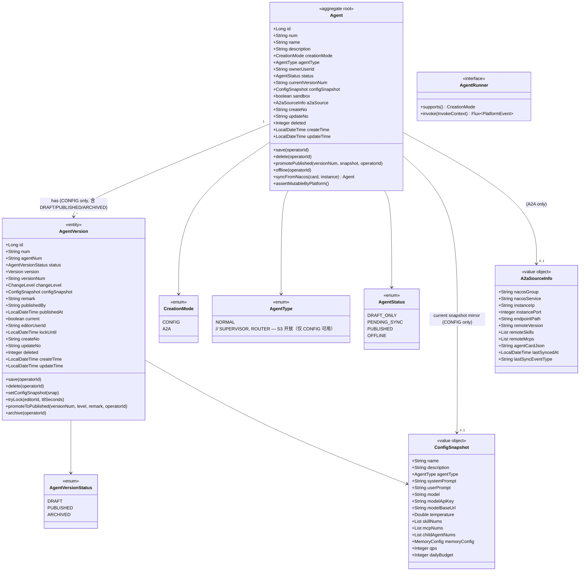
```mermaid
classDiagram
    class Agent {
        <<aggregate root>>
        +Long id
        +String num
        +String name
        +String description
        +CreationMode creationMode
        +AgentType agentType
        +String ownerUserId
        +AgentStatus status
        +String currentVersionNum
        +ConfigSnapshot configSnapshot
        +boolean sandbox
        +A2aSourceInfo a2aSource
        +String createNo
        +String updateNo
        +Integer deleted
        +LocalDateTime createTime
        +LocalDateTime updateTime
        +save(operatorId)
        +delete(operatorId)
        +promotePublished(versionNum, snapshot, operatorId)
        +offline(operatorId)
        +syncFromNacos(card, instance) Agent
        +assertMutableByPlatform()
    }
    class AgentVersion {
        <<entity>>
        +Long id
        +String num
        +String agentNum
        +AgentVersionStatus status
        +Version version
        +String versionNum
        +ChangeLevel changeLevel
        +ConfigSnapshot configSnapshot
        +String remark
        +String publishedBy
        +LocalDateTime publishedAt
        +boolean current
        +String editorUserId
        +LocalDateTime lockUntil
        +String createNo
        +String updateNo
        +Integer deleted
        +LocalDateTime createTime
        +LocalDateTime updateTime
        +save(operatorId)
        +delete(operatorId)
        +setConfigSnapshot(snap)
        +tryLock(editorId, ttlSeconds)
        +promoteToPublished(versionNum, level, remark, operatorId)
        +archive(operatorId)
    }
    class ConfigSnapshot {
        <<value object>>
        +String name
        +String description
        +AgentType agentType
        +String systemPrompt
        +String userPrompt
        +String model
        +String modelApiKey
        +String modelBaseUrl
        +Double temperature
        +List skillNums
        +List mcpNums
        +List childAgentNums
        +MemoryConfig memoryConfig
        +Integer qps
        +Integer dailyBudget
    }
    class A2aSourceInfo {
        <<value object>>
        +String nacosGroup
        +String nacosService
        +String instanceIp
        +Integer instancePort
        +String endpointPath
        +String remoteVersion
        +List remoteSkills
        +List remoteMcps
        +String agentCardJson
        +LocalDateTime lastSyncedAt
        +String lastSyncEventType
    }
    class CreationMode {
        <<enum>>
        CONFIG
        A2A
    }
    class AgentType {
        <<enum>>
        NORMAL
        // SUPERVISOR, ROUTER — S3 开放（仅 CONFIG 可用）
    }
    class AgentStatus {
        <<enum>>
        DRAFT_ONLY
        PENDING_SYNC
        PUBLISHED
        OFFLINE
    }
    class AgentVersionStatus {
        <<enum>>
        DRAFT
        PUBLISHED
        ARCHIVED
    }
    class AgentRunner {
        <<interface>>
        +supports() CreationMode
        +invoke(InvokeContext) Flux~PlatformEvent~
    }
    Agent "1" --> "*" AgentVersion : has (CONFIG only, 含 DRAFT/PUBLISHED/ARCHIVED)
    Agent --> CreationMode
    Agent --> AgentType
    Agent --> AgentStatus
    Agent --> "0..1" ConfigSnapshot : current snapshot mirror (CONFIG only)
    Agent --> "0..1" A2aSourceInfo : (A2A only)
    AgentVersion --> AgentVersionStatus
    AgentVersion --> ConfigSnapshot
```

**领域结构表格**

| 对象 | 类型 | 关键属性 | 关系 |
| --- | --- | --- | --- |
| Agent | 聚合根 | id, num, name, creationMode, agentType, currentVersionNum, status, configSnapshot?, a2aSource? | 1—* AgentVersion（仅 CONFIG，含 DRAFT/PUBLISHED/ARCHIVED 三态）；0..1 A2aSourceInfo（仅 A2A） |
| AgentVersion | 实体（**v3.0 起承载草稿与版本**） | id, num, agentNum, status, version, configSnapshot, current, editorUserId, lockUntil | 多 → 1 Agent；同 agentNum 下 status=DRAFT 至多 1 行、status=PUBLISHED + current=true 至多 1 行 |
| ConfigSnapshot | 值对象 | 配置模式专属配置（v3.x 起含 name / description / prompt / model / modelApiKey / modelBaseUrl / skills / mcps 等） | — |
| A2aSourceInfo | 值对象 | A2A 模式专属：Nacos 来源 + Agent Card 元数据（含 remoteSkills / remoteMcps） + 同步审计 | — |
| CreationMode | 枚举 | CONFIG / A2A | — |
| AgentType | 枚举 | NORMAL（SUPERVISOR/ROUTER S3） | — |
| AgentStatus | 枚举 | DRAFT_ONLY / PENDING_SYNC / PUBLISHED / OFFLINE | — |
| AgentVersionStatus | 枚举（**v3.0 新增**） | DRAFT / PUBLISHED / ARCHIVED | 由 AgentVersion 持有 |
| AgentRunner | 接口 | supports / invoke | 2 个实现：ConfigAgentRunner / A2aAgentRunner |

**Repository / Gateway / Factory 接口**

| 类 | 方法 |
| --- | --- |
| `AgentRepository` | save(Agent, operatorId)、findByNum(num)、deleteByNum(num, operatorId)、findBySourceServiceKey(group, service)（A2A 幂等查询） |
| `AgentVersionRepository` | save(AgentVersion, operatorId)、findByNum(num)、findByAgentNumAndVersionNum(agentNum, versionNum)、**findByAgentNumAndStatus(agentNum, AgentVersionStatus)**（v3.0 新增，典型用例：找 DRAFT）、listByAgentNum(agentNum, limit)、findCurrent(agentNum)、switchCurrent(oldId, newId)（v3.0 新增，DRAFT→PUBLISHED + 旧 PUBLISHED→ARCHIVED 翻转） |
| `LlmGateway` | streamChat(model, prompts, tools, config) Flux\<LlmEvent\> |
| `A2aAgentGateway` | invoke(endpoint, input, sessionId) Flux\<PlatformEvent\>（按 A2A 协议封装请求 + 适配响应事件） |
| `AgentFactory` | createConfigAgent(param, operatorId) Agent、createOrUpdateA2aAgent(card, instance) Agent |
| `AgentVersionFactory` | createInitial(agent, snapshot, operatorId) AgentVersion（首次发布 v1.0.0）、createDraftFromCurrent(agent, baseSnapshot, editorId) AgentVersion（status=DRAFT，拷贝当前在线版本 snapshot） |

#### 3.2.2 领域规则

| 聚合/对象 | 规则类型 | 规则描述 | 违反时表达 |
| --- | --- | --- | --- |
| Agent | 不变性 | `agentType ∈ {SUPERVISOR, ROUTER}` 时 `creationMode` 必须为 `CONFIG` | `BizException(2003, "A2A Agent 不支持监督者/路由类型")` |
| Agent | 不变性 | S2 内 `agentType` 固定为 `NORMAL`，`creationMode ∈ {CONFIG, A2A}` | `BizException(2003, "S2 内仅支持普通 Agent + 配置/A2A 模式")` |
| Agent | 不变性 | `creationMode = A2A` 时所有 mutate 操作（createVersion/editDraftVersion/deleteDraftVersion/publish/offline/delete）必须拒绝 | `BizException(2010, "A2A Agent 不可在平台修改，请到 Nacos 操作")` 由 `assertMutableByPlatform()` 兜底 |
| Agent | 不变性 | `creationMode = A2A` 时 `a2aSource` 必填且 `currentVersionNum` 必为 null（不存版本快照） | `BizException(2003)` |
| Agent | 不变性 | `creationMode = CONFIG` 时 `a2aSource` 必为 null | `BizException(2003)` |
| Agent | 不变性 | `status = OFFLINE` 时不可被 invoke / 不出现在调试台/挂载下拉 | invoke 接口返回 `code=2002` |
| Agent | 不变性 | `sandbox=true` 的 Agent 不出现在 Agent 列表（仅供评测内部使用） | 查询时过滤 |
| Agent | 业务规则 | 同 ownerUserId 下 name 不可重复（仅 CONFIG；A2A 不参与该约束，幂等键为 `nacosGroup + nacosService`） | `BizException(1005, "Agent 名称已存在")` |
| AgentVersion | 不变性 | 同 agentNum 下任意时刻 `status=DRAFT` 至多 1 行（v3.0：草稿合并到本实体） | 应用层 `createVersion` 前置 `findByAgentNumAndStatus(DRAFT)` 校验 → `BizException(6002)` |
| AgentVersion | 业务规则 | DRAFT 行编辑者 != 锁定者（`editorUserId` + `lockUntil`） → 显示"被锁定，可接管或等待" | `BizException(6002, "草稿被 X 锁定")` 含 lockUntil |
| AgentVersion | 不变性 | 已发布行（status ∈ {PUBLISHED, ARCHIVED}）的 `configSnapshot / versionNum / changeLevel / publishedBy / publishedAt` 不可修改；DRAFT 行的 `configSnapshot / editorUserId / lockUntil` 可覆盖更新 | DB 层只允许 INSERT 与状态翻转 / DRAFT 的 snapshot UPDATE |
| AgentVersion | 不变性 | 同 agentNum 下任意时刻仅一个 `status=PUBLISHED + current=true` | publish 事务内原子翻转 `switchCurrent(oldId, newId)` |
| ConfigSnapshot | 业务规则 | `agentType ∈ {SUPERVISOR, ROUTER}` 时 childAgentNums 不可为空，且每个子 Agent 必须 `creationMode = CONFIG + agentType = NORMAL` | `BizException(2003)`（A2A Agent 不可作为子 Agent） |
| Version | 不变性 | 首次发布固定 v1.0.0；A2A 不参与版本化 | `Version.initial()` 返回 (1,0,0) |
| AgentRunner | 业务规则 | 2 种 Runner（CONFIG / A2A）必须覆盖全部 CreationMode | Spring 启动时校验，缺失则启动失败 |

#### 3.2.3 领域动作

| 聚合/实体 | 领域动作 | 职责 | 前置条件 | 后置条件/规则 | 领域事件 |
| --- | --- | --- | --- | --- | --- |
| Agent | save(operatorId) | 保存/更新 Agent 元信息 | operatorId 有效 | updateNo 已更新 | — |
| Agent | delete(operatorId) | 逻辑删除 Agent（含所有版本，DRAFT/PUBLISHED/ARCHIVED 一并 deleted=1） | `creationMode = CONFIG` 且 status=OFFLINE 或被强制；operatorId 有权限 | deleted=1 | `AGENT_OFFLINED` |
| Agent | promotePublished(versionNum, snapshot, operatorId) | **v3.0 新增**：发布事务尾部由 publish 调用，把 `agent.currentVersionNum / configSnapshot / status / name / description` 同步为新在线版本（`name / description` 来自 snapshot） | `creationMode = CONFIG`；事务内 | currentVersionNum 已切换；`agent.config_snapshot` JSON 镜像更新；status=PUBLISHED；name/description 同步到主表 | — |
| Agent | offline(operatorId) | 手动下线（仅配置模式；A2A 由 Nacos 同步触发，不走此动作） | `creationMode = CONFIG`；status=PUBLISHED | status=OFFLINE | `AGENT_OFFLINED` |
| Agent | syncFromNacos(card, instance) | A2A 模式：从 Nacos 全字段覆盖更新 | `creationMode = A2A` | a2aSource 全字段覆盖；name/description/status 同步；lastSyncedAt 刷新 | `AGENT_A2A_SYNCED`（status 由 UP→DOWN 时附带触发 `AGENT_OFFLINED`） |
| Agent | assertMutableByPlatform() | 兜底守卫，所有 mutate 动作开头 invoke | — | 若 `creationMode = A2A` → throw `BizException(2010)` | — |
| AgentVersion | save(operatorId) | upsert 当前实体（DRAFT 行允许覆盖 snapshot；已发布行仅允许状态 / current_flag 翻转） | — | createNo/updateNo 已记录 | — |
| AgentVersion | setConfigSnapshot(snap) | **v3.0 新增**：DRAFT 行覆盖配置快照 | status=DRAFT | configSnapshot 已替换 | — |
| AgentVersion | tryLock(editorId, ttlSeconds) | **v3.0 新增**：DRAFT 行尝试锁定编辑权 | status=DRAFT；lockUntil < now 或 editorUserId 一致 | editorUserId=editorId；lockUntil=now+ttl | — |
| AgentVersion | promoteToPublished(versionNum, level, remark, operatorId) | **v3.0 新增**：DRAFT 行升级为 PUBLISHED + 赋 versionNum + current_flag=1；与旧 PUBLISHED 行的 `archive` 在同事务内成对调用 | status=DRAFT；remark ≥ 10 字符；level 有效 | status=PUBLISHED；version 已赋；current=true；editorUserId/lockUntil 清空 | `AGENT_VERSION_PUBLISHED` |
| AgentVersion | archive(operatorId) | **v3.0 新增**：原 PUBLISHED 行降级为 ARCHIVED + current_flag=0 | status=PUBLISHED 且 current=true | status=ARCHIVED；current=false | — |

##### 3.2.3.1 时序：publish（DRAFT → PUBLISHED，v3.0 重构）

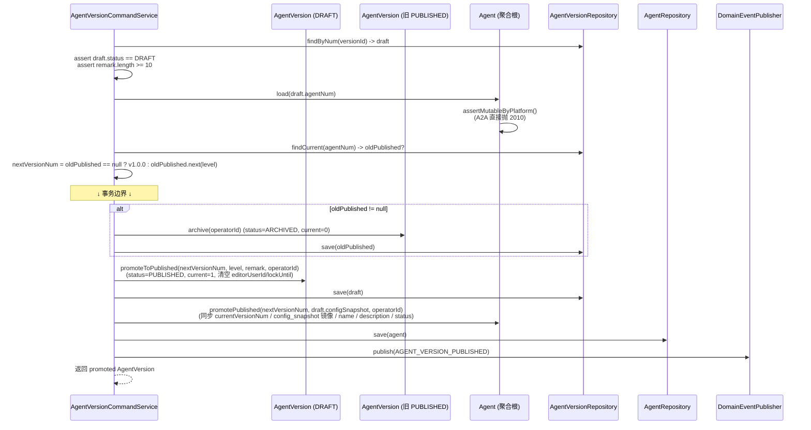
```mermaid
sequenceDiagram
    participant App as AgentVersionCommandService
    participant Draft as AgentVersion (DRAFT)
    participant Old as AgentVersion (旧 PUBLISHED)
    participant Agent as Agent (聚合根)
    participant VRepo as AgentVersionRepository
    participant Repo as AgentRepository
    participant Pub as DomainEventPublisher

    App->>VRepo: findByNum(versionId) -> draft
    App->>App: assert draft.status == DRAFT<br/>assert remark.length >= 10
    App->>Agent: load(draft.agentNum)
    Agent->>Agent: assertMutableByPlatform()<br/>(A2A 直接抛 2010)
    App->>VRepo: findCurrent(agentNum) -> oldPublished?
    App->>App: nextVersionNum = oldPublished == null ? v1.0.0 : oldPublished.next(level)
    Note over App: ↓ 事务边界 ↓
    alt oldPublished != null
        App->>Old: archive(operatorId) (status=ARCHIVED, current=0)
        App->>VRepo: save(oldPublished)
    end
    App->>Draft: promoteToPublished(nextVersionNum, level, remark, operatorId)<br/>(status=PUBLISHED, current=1, 清空 editorUserId/lockUntil)
    App->>VRepo: save(draft)
    App->>Agent: promotePublished(nextVersionNum, draft.configSnapshot, operatorId)<br/>(同步 currentVersionNum / config_snapshot 镜像 / name / description / status)
    App->>Repo: save(agent)
    App->>Pub: publish(AGENT_VERSION_PUBLISHED)
    App-->>App: 返回 promoted AgentVersion
```

##### 3.2.3.2 时序：createVersion + editDraftVersion（v3.0 重构，原 saveDraft）

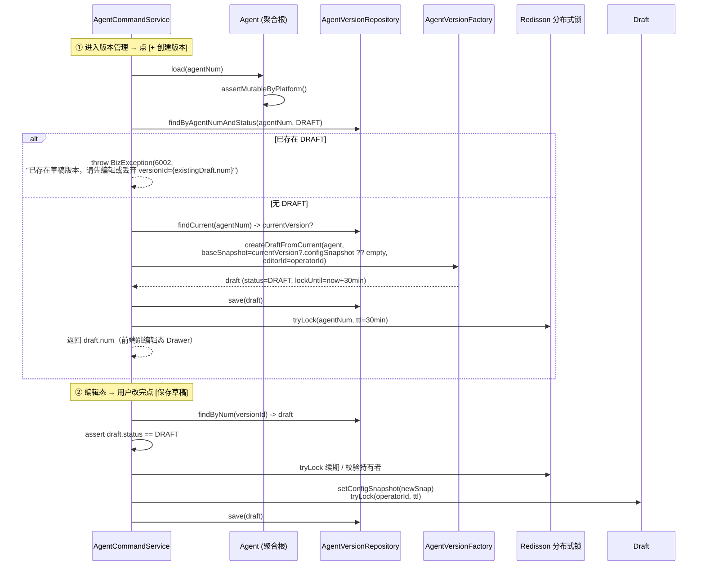
```mermaid
sequenceDiagram
    participant App as AgentCommandService
    participant Agent as Agent (聚合根)
    participant VRepo as AgentVersionRepository
    participant Factory as AgentVersionFactory
    participant Lock as Redisson 分布式锁

    Note over App: ① 进入版本管理 → 点 [+ 创建版本]
    App->>Agent: load(agentNum)
    Agent->>Agent: assertMutableByPlatform()
    App->>VRepo: findByAgentNumAndStatus(agentNum, DRAFT)
    alt 已存在 DRAFT
        App-->>App: throw BizException(6002,<br/>"已存在草稿版本，请先编辑或丢弃 versionId={existingDraft.num}")
    else 无 DRAFT
        App->>VRepo: findCurrent(agentNum) -> currentVersion?
        App->>Factory: createDraftFromCurrent(agent,<br/>baseSnapshot=currentVersion?.configSnapshot ?? empty,<br/>editorId=operatorId)
        Factory-->>App: draft (status=DRAFT, lockUntil=now+30min)
        App->>VRepo: save(draft)
        App->>Lock: tryLock(agentNum, ttl=30min)
        App-->>App: 返回 draft.num（前端跳编辑态 Drawer）
    end

    Note over App: ② 编辑态 → 用户改完点 [保存草稿]
    App->>VRepo: findByNum(versionId) -> draft
    App->>App: assert draft.status == DRAFT
    App->>Lock: tryLock 续期 / 校验持有者
    App->>Draft: setConfigSnapshot(newSnap)<br/>tryLock(operatorId, ttl)
    App->>VRepo: save(draft)
```

##### 3.2.3.3 时序：deleteDraftVersion（v3.0 重构，替代 discardDraft / rollbackToVersion 的"丢弃"语义）

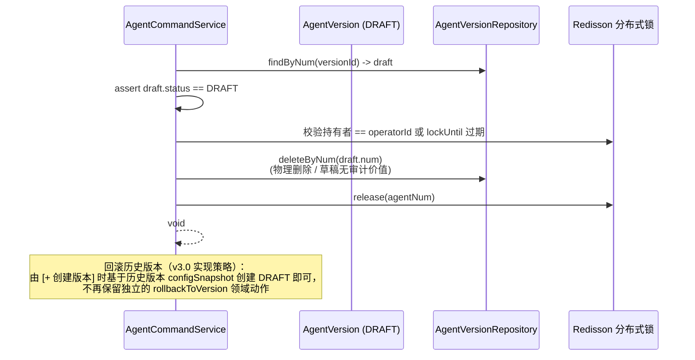
```mermaid
sequenceDiagram
    participant App as AgentCommandService
    participant Draft as AgentVersion (DRAFT)
    participant VRepo as AgentVersionRepository
    participant Lock as Redisson 分布式锁

    App->>VRepo: findByNum(versionId) -> draft
    App->>App: assert draft.status == DRAFT
    App->>Lock: 校验持有者 == operatorId 或 lockUntil 过期
    App->>VRepo: deleteByNum(draft.num)<br/>(物理删除 / 草稿无审计价值)
    App->>Lock: release(agentNum)
    App-->>App: void

    Note over App: 回滚历史版本（v3.0 实现策略）：<br/>由 [+ 创建版本] 时基于历史版本 configSnapshot 创建 DRAFT 即可，<br/>不再保留独立的 rollbackToVersion 领域动作
```

##### 3.2.3.4 时序：Agent.offline

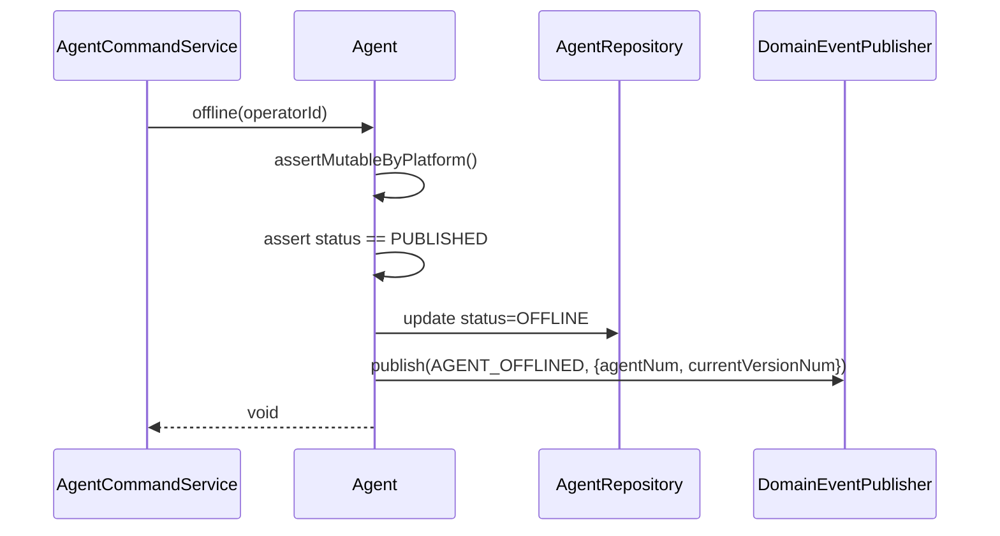
```mermaid
sequenceDiagram
    participant App as AgentCommandService
    participant Agent as Agent
    participant Repo as AgentRepository
    participant Pub as DomainEventPublisher

    App->>Agent: offline(operatorId)
    Agent->>Agent: assertMutableByPlatform()
    Agent->>Agent: assert status == PUBLISHED
    Agent->>Repo: update status=OFFLINE
    Agent->>Pub: publish(AGENT_OFFLINED, {agentNum, currentVersionNum})
    Agent-->>App: void
```

##### 3.2.3.5 时序：Agent.delete

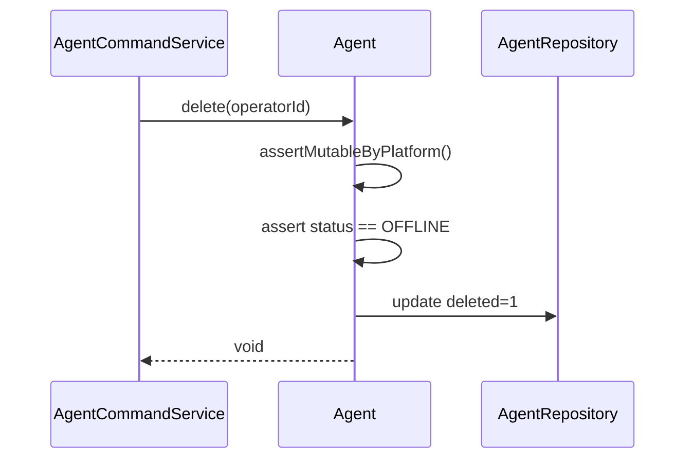
```mermaid
sequenceDiagram
    participant App as AgentCommandService
    participant Agent as Agent
    participant Repo as AgentRepository

    App->>Agent: delete(operatorId)
    Agent->>Agent: assertMutableByPlatform()
    Agent->>Agent: assert status == OFFLINE
    Agent->>Repo: update deleted=1
    Agent-->>App: void
```

##### 3.2.3.6 时序：Agent.syncFromNacos（A2A 自动同步）

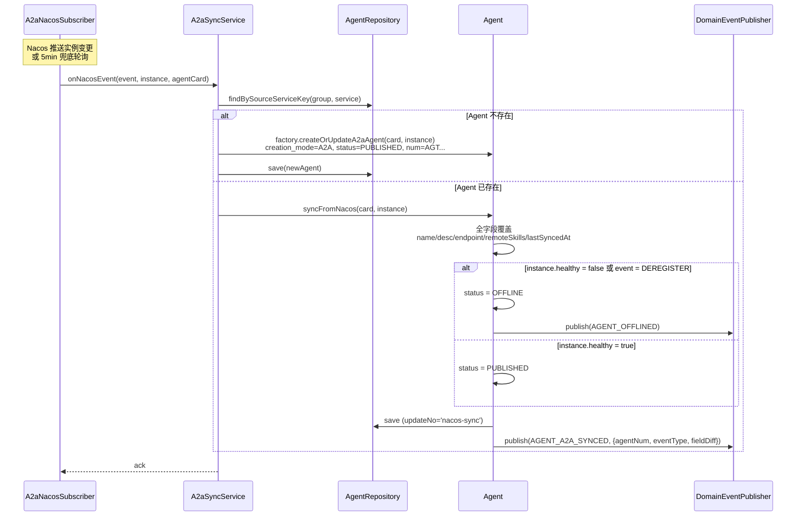
```mermaid
sequenceDiagram
    participant Sub as A2aNacosSubscriber
    participant SyncSvc as A2aSyncService
    participant Repo as AgentRepository
    participant Agent as Agent
    participant Pub as DomainEventPublisher

    Note over Sub: Nacos 推送实例变更<br/>或 5min 兜底轮询
    Sub->>SyncSvc: onNacosEvent(event, instance, agentCard)
    SyncSvc->>Repo: findBySourceServiceKey(group, service)
    alt Agent 不存在
        SyncSvc->>Agent: factory.createOrUpdateA2aAgent(card, instance)<br/>creation_mode=A2A, status=PUBLISHED, num=AGT...
        SyncSvc->>Repo: save(newAgent)
    else Agent 已存在
        SyncSvc->>Agent: syncFromNacos(card, instance)
        Agent->>Agent: 全字段覆盖<br/>name/desc/endpoint/remoteSkills/lastSyncedAt
        alt instance.healthy = false 或 event = DEREGISTER
            Agent->>Agent: status = OFFLINE
            Agent->>Pub: publish(AGENT_OFFLINED)
        else instance.healthy = true
            Agent->>Agent: status = PUBLISHED
        end
        Agent->>Repo: save (updateNo='nacos-sync')
        Agent->>Pub: publish(AGENT_A2A_SYNCED, {agentNum, eventType, fieldDiff})
    end
    SyncSvc-->>Sub: ack
```

##### 3.2.3.7 时序：A2aSyncApplicationService.syncPendingBatch（v3.1 兜底轮询 / 手动触发）

> 双入口共流程：`A2aSyncScheduler.syncPending()`（cron 5min）/`A2aSyncController.runSync(batchSize)`（HTTP）→ 同一应用层方法。

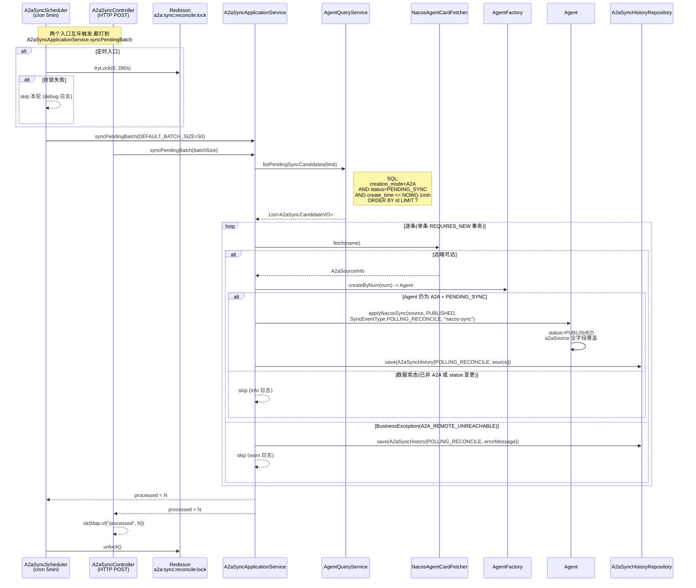
```mermaid
sequenceDiagram
    participant Cron as A2aSyncScheduler<br/>(cron 5min)
    participant Ctrl as A2aSyncController<br/>(HTTP POST)
    participant Lock as Redisson<br/>a2a:sync:reconcile:lock
    participant AppSvc as A2aSyncApplicationService
    participant Q as AgentQueryService
    participant Fetcher as NacosAgentCardFetcher
    participant Factory as AgentFactory
    participant Agent as Agent
    participant Repo as A2aSyncHistoryRepository

    Note over Cron,Ctrl: 两个入口互斥触发,都打到<br/>A2aSyncApplicationService.syncPendingBatch

    alt 定时入口
        Cron->>Lock: tryLock(0, 280s)
        alt 抢锁失败
            Cron-->>Cron: skip 本轮 (debug 日志)
        end
    end

    Cron->>AppSvc: syncPendingBatch(DEFAULT_BATCH_SIZE=50)
    Ctrl->>AppSvc: syncPendingBatch(batchSize)
    AppSvc->>Q: listPendingSyncCandidates(limit)
    Note right of Q: SQL:<br/>creation_mode=A2A<br/>AND status=PENDING_SYNC<br/>AND create_time <= NOW()-1min<br/>ORDER BY id LIMIT ?
    Q-->>AppSvc: List<A2aSyncCandidateVO>

    loop 逐条(单条 REQUIRES_NEW 事务)
        AppSvc->>Fetcher: fetch(name)
        alt 远端可达
            Fetcher-->>AppSvc: A2aSourceInfo
            AppSvc->>Factory: createByNum(num) -> Agent
            alt Agent 仍为 A2A + PENDING_SYNC
                AppSvc->>Agent: applyNacosSync(source, PUBLISHED,<br/>SyncEventType.POLLING_RECONCILE, "nacos-sync")
                Agent->>Agent: status=PUBLISHED<br/>a2aSource 全字段覆盖
                AppSvc->>Repo: save(A2aSyncHistory{POLLING_RECONCILE, source})
            else 数据竞态(已非 A2A 或 status 变更)
                AppSvc-->>AppSvc: skip (info 日志)
            end
        else BusinessException(A2A_REMOTE_UNREACHABLE)
            AppSvc->>Repo: save(A2aSyncHistory{POLLING_RECONCILE, errorMessage})
            AppSvc-->>AppSvc: skip (warn 日志)
        end
    end

    AppSvc-->>Cron: processed = N
    AppSvc-->>Ctrl: processed = N
    Ctrl-->>Ctrl: ok(Map.of("processed", N))
    Cron->>Lock: unlock()
```

#### 3.2.4 领域事件

| 事件名常量 | 触发时机 | 载荷要点 | 可订阅方/用途 |
| --- | --- | --- | --- |
| `AGENT_VERSION_PUBLISHED` | 配置模式 Agent 新版本发布成功 | agentNum / versionNum / changeLevel / publishedBy / publishedAt | 调试台 invalidate 缓存；评测：未来推送通知 |
| `AGENT_OFFLINED` | Agent 下线（手动 or A2A 同步触发） | agentNum / creationMode / currentVersionNum? / operatorId? / source: `MANUAL` \| `NACOS_SYNC` | 调试台 / 评测下拉刷新；监督者/路由 Agent 触发反引用清理（S3） |
| `AGENT_A2A_SYNCED` | A2A Agent 完成一次 Nacos 同步 | agentNum / eventType（`INSTANCE_ADDED` \| `INSTANCE_CHANGED` \| `INSTANCE_REMOVED` \| `POLLING_RECONCILE`）/ fieldDiff | 同步审计；监控告警 |

---

## 4. 应用层设计

### 4.1 业务模块划分

| application 模块 | 对应领域 |
| --- | --- |
| `application.agent` | agent 领域 |

### 4.2 application.agent

#### 4.2.1 Service 方法清单

| Service | 方法 | 职责 | 入参 | 出参 |
| --- | --- | --- | --- | --- |
| `AgentCommandService` | `createAgent(param, operatorId)` | 创建配置模式 Agent；落库 + 自动首发 v1.0.0；**param.creationMode 必须为 CONFIG，否则 400** | `AgentCreateParam` | `Result<AgentVO>` |
| `AgentCommandService` | `createA2aAgent(param, operatorId)` | **v2.4 新增 / v2.6 改**：① 调 `aiService.getAgentCard(name)` 校验远端存在 → 不存在抛 `BizCode.A2A_AGENT_NOT_FOUND_IN_NACOS(2011)`；Nacos 不可达抛 `NACOS_UNREACHABLE(2012)`；② 按 `nacos_service_key` 幂等查 → 已存在直接返回；③ `factory.createA2aAgent(card, operatorId)` 落库 **status=PENDING_SYNC**；④ 调 `a2aSubscriptionRegistry.subscribe(name)` 即时订阅；⑤ 首次 onNacosEvent 触发时升 PUBLISHED | `A2aCreateParam` | `Result<AgentVO>` |
| `AgentCommandService` | `saveA2aDraft(param, operatorId)` | **v2.6 新增**：本地落库 status=DRAFT_ONLY，不调 Nacos 不订阅；`nacosAgentName` 可空（草稿态允许部分字段）；幂等键临时为 `draft:{tempUuid}` | `A2aDraftParam` | `Result<AgentVO>` |
| `AgentCommandService` | `unsubscribeA2aAgent(agentNum, operatorId)` | **v2.4 新增**：① 加载 Agent 校验 creationMode=A2A；② 若状态 != DRAFT_ONLY 调 `a2aSubscriptionRegistry.unsubscribe(name)`；③ `agent.delete(operatorId)` 软删除；事务保证两步原子 | `String, String` | `Result<Void>` |
| `AgentCommandService` | `createVersion(agentNum, operatorId)` | **v3.0 新增**：在 `agent_version` 插一行 status=DRAFT，基于当前在线版本 snapshot 拷贝；同 agentNum 已存在 DRAFT 时抛 6002 | `String` | `Result<{versionId}>` |
| `AgentCommandService` | `editDraftVersion(versionId, configDraft, operatorId)` | **v3.0 新增**：UPDATE 指定 DRAFT 行的 `config_snapshot / editor_user_id / lock_until`；DRAFT 锁冲突抛 6002；非 DRAFT 状态抛 400 | `String, ConfigSnapshot` | `Result<Void>` |
| `AgentCommandService` | `deleteDraftVersion(versionId, operatorId)` | **v3.0 新增**：物理删除 DRAFT 行（草稿无审计价值） | `String` | `Result<Void>` |
| `AgentCommandService` | `offline(agentNum, operatorId)` | 手动下线（A2A 兜底返回 2010） | `String` | `Result<Void>` |
| `AgentCommandService` | `delete(agentNum, operatorId)` | 删除：CONFIG 仅 OFFLINE 可删；**v2.4 起 A2A 也允许（语义 = 取消订阅，建议优先调 `unsubscribeA2aAgent` 走显式入口）** | `String` | `Result<Void>` |
| `AgentVersionCommandService` | `publish(publishParam, operatorId)` | **v3.0 改入参为 versionId**：发布指定 DRAFT 为新版本；事务原子完成 ① 计算新 versionNum；② 旧 PUBLISHED → ARCHIVED + current=0；③ DRAFT → PUBLISHED + 赋 versionNum + current=1；④ 同步 `agent.config_snapshot / current_version_num / name / description / status`；⑤ 发事件。A2A 兜底返回 2010 | `PublishParam{versionId, changeLevel, remark}` | `Result<AgentVersionVO>` |
| `AgentVersionCommandService` | `~~rollbackToVersion~~` | **v3.0 移除**：回滚改为「在版本管理页基于历史版本 [+ 创建版本]」走标准 createVersion + editDraftVersion + publish 流程；不保留独立接口 | — | — |
| `A2aSyncService` | `onNacosEvent(event, instance, agentCard)` | 被 `A2aNacosSubscriber` 回调；按服务键 upsert A2A Agent；全字段覆盖 | `NacosEvent, Instance, AgentCard` | `void` |
| `A2aSyncService` | `manualResync(agentNum, operatorId)` | 详情页"手动重新同步"按钮触发 | `String, String` | `Result<AgentVO>` |
| `A2aSyncService` | `pollAll()` | 5min 兜底对账：**v2.4 范围 = 当前订阅集合（DB 中 creation_mode=A2A 行）**，不再扫 group | — | `void` |
| `A2aSyncApplicationService` | `syncPendingBatch(batchSize)` | **v3.1 新增**（hotfix_20260625）：批量推进 `status=PENDING_SYNC` 的 A2A Agent 至 PUBLISHED；走 `AgentQueryService.listPendingSyncCandidates(batchSize)` 取候选（已含 1min 冷却窗口）→ 逐条 `fetcher.fetch(name)` → 远端可达时 `Agent.applyNacosSync(..., PUBLISHED, POLLING_RECONCILE, "nacos-sync")`；失败 / 远端不可达写 `A2aSyncHistory(POLLING_RECONCILE, errorMessage=)` + 跳过；返回 processed 数 | `int` | `int` |
| `A2aSyncApplicationService` | `syncOne(A2aSyncCandidateVO)` | **v3.1 新增**：单条同步；`@Transactional(propagation = REQUIRES_NEW)` 每条独立事务；远端不可达 → 抛 `BusinessException(A2A_REMOTE_UNREACHABLE)`，catch 后写历史跳过；Agent 被并发改为非 A2A 或已变更 → 跳过 | `A2aSyncCandidateVO` | `void` |
| `A2aSyncApplicationService` | `countPendingCandidates(limit)` | **v3.1 新增**：监控 / 调试用，仅返回当前 PENDING_SYNC 候选数（不写库）| `int` | `int` |
| `A2aSyncApplicationService` | `DEFAULT_BATCH_SIZE` | **v3.1 新增常量**：`public static final int DEFAULT_BATCH_SIZE = 50`；`batchSize <= 0` 时取此默认值 | — | — |
| `AgentQueryService` | `listPendingSyncCandidates(limit)` | **v3.1 新增**：取 PENDING_SYNC 候选列表（已含 1min 冷却：`createTime <= now-1min`）；ORDER BY id LIMIT ?；返回值是 `A2aSyncCandidateVO`（轻量 VO：`{num, name}`，不返 Agent 全量字段）| `int` | `List<A2aSyncCandidateVO>` |
| `A2aSyncController` | `runSync(batchSize)` | **v3.1 新增**（adapter 层）：`POST /api/v1/agents/a2aSync/run?batchSize=1..500`（缺省 50）；返回 `{processed: N}`；调 `A2aSyncApplicationService.syncPendingBatch(batchSize)` | `int (query)` | `Result<Map<String, Integer>>` |
| `A2aSyncScheduler` | `syncPending()` | **v3.1 新增**（adapter 层 scheduler）：`@Scheduled(cron = "0 0/5 * * * ?")`；先抢 Redisson 锁 `a2a:sync:reconcile:lock`（租约 280s），抢不到直接跳过；调 `A2aSyncApplicationService.syncPendingBatch(DEFAULT_BATCH_SIZE)` | — | `void` |
| `AgentInvokeStreamService` | `invoke(invokeRequest, operatorId)` | 触发 invoke，返回 Flux\<PlatformEvent\>；按 creation_mode 派发 Runner | `InvokeRequest` | `Flux<PlatformEvent>` |
| `AgentQueryService` | `pageList(query)` | 列表（搜索仅按 num/name 模糊匹配；可按 creationMode 筛选）；**v2.2 出参 `{num, name, description, status, skillNum, skillNames, agentSource, creationMode, createTime, updateTime}`**：`agentSource = creationMode == CONFIG ? MANUAL : NACOS`，由 application 层组装时派生（不入库）；CONFIG 的 `skillNames` 取 `configSnapshot.skillNums` 反查 Skill 表的 `name`；A2A 的 `skillNames` 取 `a2aSource.remoteSkills[].name` | `AgentPageQuery` | `Result<PageVO<AgentVO>>` |
| `AgentQueryService` | `detail(agentNum)` | 详情（CONFIG 含当前版本 snapshot + 草稿信息；A2A 含 a2aSource） | `String` | `Result<AgentDetailVO>` |
| `AgentQueryService` | `versionList(agentNum)` | 版本历史列表（A2A 返回空数组） | `String` | `Result<List<AgentVersionVO>>` |
| `AgentQueryService` | `versionDetail(agentNum, versionNum)` | 历史版本只读详情 | `String, String` | `Result<AgentVersionDetailVO>` |
| `AgentQueryService` | `compareVersions(agentNum, vA, vB)` | 版本对比 | `String, String, String` | `Result<VersionDiffVO>` |

> ⚠️ **下线方法**：原 `AgentTestConnectionService` / `testConnection` 整体移除（A2A 不需要联通测试，由 Nacos 健康状态决定）。

#### 4.2.2 方法时序逻辑

##### 4.2.2.1 AgentCommandService.createAgent

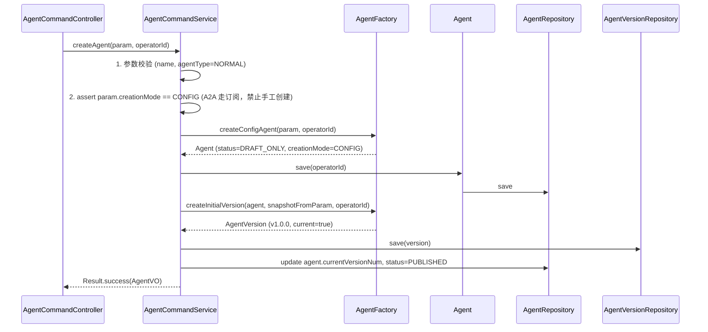
```mermaid
sequenceDiagram
    participant Ctrl as AgentCommandController
    participant Svc as AgentCommandService
    participant Factory as AgentFactory
    participant Agent as Agent
    participant Repo as AgentRepository
    participant VRepo as AgentVersionRepository

    Ctrl->>Svc: createAgent(param, operatorId)
    Svc->>Svc: 1. 参数校验 (name, agentType=NORMAL)
    Svc->>Svc: 2. assert param.creationMode == CONFIG (A2A 走订阅，禁止手工创建)
    Svc->>Factory: createConfigAgent(param, operatorId)
    Factory-->>Svc: Agent (status=DRAFT_ONLY, creationMode=CONFIG)
    Svc->>Agent: save(operatorId)
    Agent->>Repo: save
    Svc->>Factory: createInitialVersion(agent, snapshotFromParam, operatorId)
    Factory-->>Svc: AgentVersion (v1.0.0, current=true)
    Svc->>VRepo: save(version)
    Svc->>Repo: update agent.currentVersionNum, status=PUBLISHED
    Svc-->>Ctrl: Result.success(AgentVO)
```

##### 4.2.2.2 AgentCommandService.createVersion / editDraftVersion / deleteDraftVersion（v3.0 重构）

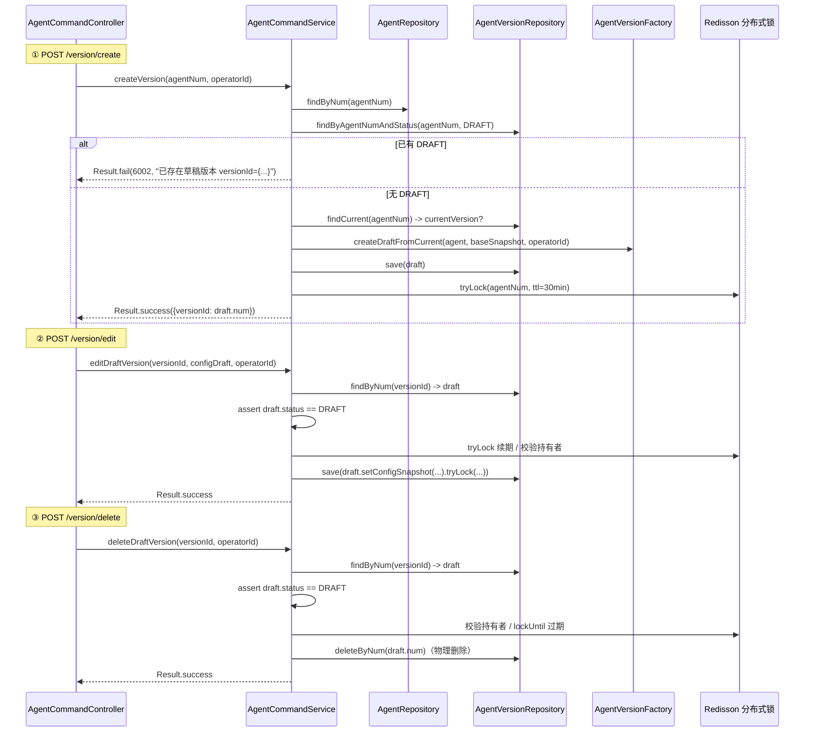
```mermaid
sequenceDiagram
    participant Ctrl as AgentCommandController
    participant Svc as AgentCommandService
    participant Repo as AgentRepository
    participant VRepo as AgentVersionRepository
    participant Factory as AgentVersionFactory
    participant Lock as Redisson 分布式锁

    Note over Ctrl: ① POST /version/create
    Ctrl->>Svc: createVersion(agentNum, operatorId)
    Svc->>Repo: findByNum(agentNum)
    Svc->>VRepo: findByAgentNumAndStatus(agentNum, DRAFT)
    alt 已有 DRAFT
        Svc-->>Ctrl: Result.fail(6002, "已存在草稿版本 versionId={...}")
    else 无 DRAFT
        Svc->>VRepo: findCurrent(agentNum) -> currentVersion?
        Svc->>Factory: createDraftFromCurrent(agent, baseSnapshot, operatorId)
        Svc->>VRepo: save(draft)
        Svc->>Lock: tryLock(agentNum, ttl=30min)
        Svc-->>Ctrl: Result.success({versionId: draft.num})
    end

    Note over Ctrl: ② POST /version/edit
    Ctrl->>Svc: editDraftVersion(versionId, configDraft, operatorId)
    Svc->>VRepo: findByNum(versionId) -> draft
    Svc->>Svc: assert draft.status == DRAFT
    Svc->>Lock: tryLock 续期 / 校验持有者
    Svc->>VRepo: save(draft.setConfigSnapshot(...).tryLock(...))
    Svc-->>Ctrl: Result.success

    Note over Ctrl: ③ POST /version/delete
    Ctrl->>Svc: deleteDraftVersion(versionId, operatorId)
    Svc->>VRepo: findByNum(versionId) -> draft
    Svc->>Svc: assert draft.status == DRAFT
    Svc->>Lock: 校验持有者 / lockUntil 过期
    Svc->>VRepo: deleteByNum(draft.num)（物理删除）
    Svc-->>Ctrl: Result.success
```

##### 4.2.2.3 AgentVersionCommandService.publish（v3.0 入参由 agentNum 改为 versionId）

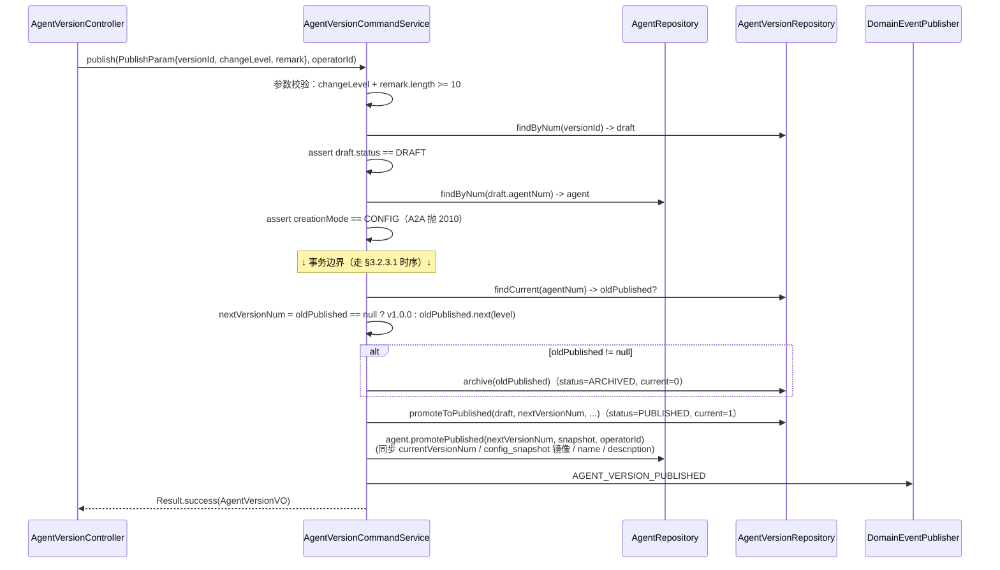
```mermaid
sequenceDiagram
    participant Ctrl as AgentVersionController
    participant Svc as AgentVersionCommandService
    participant Repo as AgentRepository
    participant VRepo as AgentVersionRepository
    participant Pub as DomainEventPublisher

    Ctrl->>Svc: publish(PublishParam{versionId, changeLevel, remark}, operatorId)
    Svc->>Svc: 参数校验：changeLevel + remark.length >= 10
    Svc->>VRepo: findByNum(versionId) -> draft
    Svc->>Svc: assert draft.status == DRAFT
    Svc->>Repo: findByNum(draft.agentNum) -> agent
    Svc->>Svc: assert creationMode == CONFIG（A2A 抛 2010）
    Note over Svc: ↓ 事务边界（走 §3.2.3.1 时序）↓
    Svc->>VRepo: findCurrent(agentNum) -> oldPublished?
    Svc->>Svc: nextVersionNum = oldPublished == null ? v1.0.0 : oldPublished.next(level)
    alt oldPublished != null
        Svc->>VRepo: archive(oldPublished)（status=ARCHIVED, current=0）
    end
    Svc->>VRepo: promoteToPublished(draft, nextVersionNum, ...)（status=PUBLISHED, current=1）
    Svc->>Repo: agent.promotePublished(nextVersionNum, snapshot, operatorId)<br/>(同步 currentVersionNum / config_snapshot 镜像 / name / description)
    Svc->>Pub: AGENT_VERSION_PUBLISHED
    Svc-->>Ctrl: Result.success(AgentVersionVO)
```

##### 4.2.2.4 ~~AgentVersionCommandService.rollbackToVersion~~（v3.0 移除）

> v3.0 起领域模型不再保留独立的回滚领域动作。回滚 = 在版本管理 Tab 选中目标历史版本，前端调 `agentApi.versionDetail(num, versionNum)` 取其 `configSnapshot`，再调 `POST /version/create` 创建 DRAFT（FE 在 PR 阶段把 DRAFT 的 snapshot 直接 `editDraftVersion` 覆盖为该历史版本快照），用户审核后走标准 publish 流程递增版本号。无需新增后端 endpoint。

##### 4.2.2.5 A2aSyncService.onNacosEvent

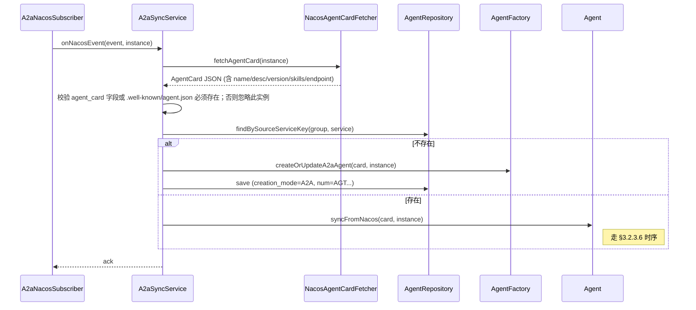
```mermaid
sequenceDiagram
    participant Sub as A2aNacosSubscriber
    participant Svc as A2aSyncService
    participant Fetcher as NacosAgentCardFetcher
    participant Repo as AgentRepository
    participant Factory as AgentFactory
    participant Agent as Agent

    Sub->>Svc: onNacosEvent(event, instance)
    Svc->>Fetcher: fetchAgentCard(instance)
    Fetcher-->>Svc: AgentCard JSON (含 name/desc/version/skills/endpoint)
    Svc->>Svc: 校验 agent_card 字段或 .well-known/agent.json 必须存在；否则忽略此实例
    Svc->>Repo: findBySourceServiceKey(group, service)
    alt 不存在
        Svc->>Factory: createOrUpdateA2aAgent(card, instance)
        Svc->>Repo: save (creation_mode=A2A, num=AGT...)
    else 存在
        Svc->>Agent: syncFromNacos(card, instance)
        Note right of Agent: 走 §3.2.3.6 时序
    end
    Svc-->>Sub: ack
```

##### 4.2.2.6 AgentInvokeStreamService.invoke

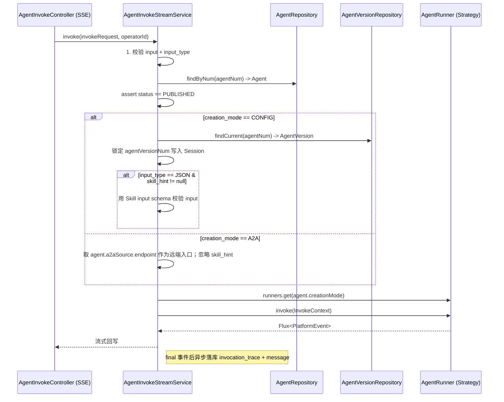
```mermaid
sequenceDiagram
    participant Ctrl as AgentInvokeController (SSE)
    participant Svc as AgentInvokeStreamService
    participant Repo as AgentRepository
    participant VRepo as AgentVersionRepository
    participant Runner as AgentRunner (Strategy)

    Ctrl->>Svc: invoke(invokeRequest, operatorId)
    Svc->>Svc: 1. 校验 input + input_type
    Svc->>Repo: findByNum(agentNum) -> Agent
    Svc->>Svc: assert status == PUBLISHED
    alt creation_mode == CONFIG
        Svc->>VRepo: findCurrent(agentNum) -> AgentVersion
        Svc->>Svc: 锁定 agentVersionNum 写入 Session
        alt input_type == JSON & skill_hint != null
            Svc->>Svc: 用 Skill input schema 校验 input
        end
    else creation_mode == A2A
        Svc->>Svc: 取 agent.a2aSource.endpoint 作为远端入口；忽略 skill_hint
    end
    Svc->>Runner: runners.get(agent.creationMode)
    Svc->>Runner: invoke(InvokeContext)
    Runner-->>Svc: Flux<PlatformEvent>
    Svc-->>Ctrl: 流式回写
    Note right of Svc: final 事件后异步落库 invocation_trace + message
```

##### 4.2.2.7 AgentQueryService.pageList

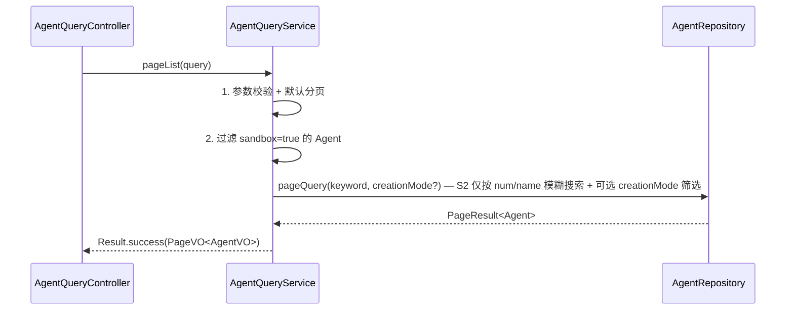
```mermaid
sequenceDiagram
    participant Ctrl as AgentQueryController
    participant Svc as AgentQueryService
    participant Repo as AgentRepository

    Ctrl->>Svc: pageList(query)
    Svc->>Svc: 1. 参数校验 + 默认分页
    Svc->>Svc: 2. 过滤 sandbox=true 的 Agent
    Svc->>Repo: pageQuery(keyword, creationMode?) — S2 仅按 num/name 模糊搜索 + 可选 creationMode 筛选
    Repo-->>Svc: PageResult<Agent>
    Svc-->>Ctrl: Result.success(PageVO<AgentVO>)
```

##### 4.2.2.8 AgentQueryService.detail

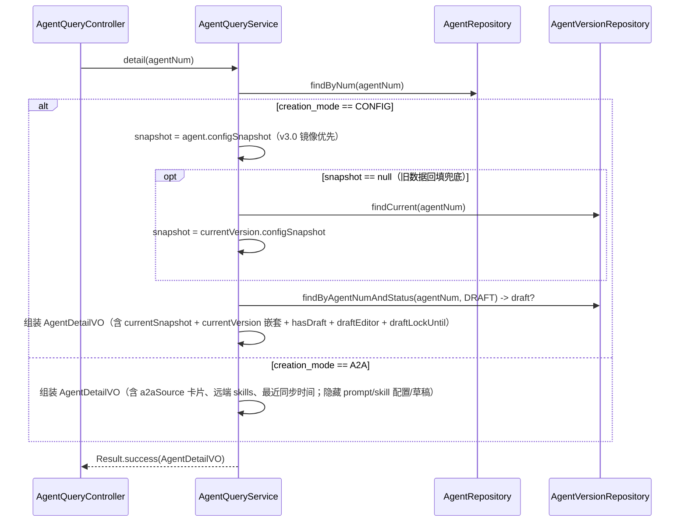
```mermaid
sequenceDiagram
    participant Ctrl as AgentQueryController
    participant Svc as AgentQueryService
    participant Repo as AgentRepository
    participant VRepo as AgentVersionRepository

    Ctrl->>Svc: detail(agentNum)
    Svc->>Repo: findByNum(agentNum)
    alt creation_mode == CONFIG
        Svc->>Svc: snapshot = agent.configSnapshot（v3.0 镜像优先）
        opt snapshot == null（旧数据回填兜底）
            Svc->>VRepo: findCurrent(agentNum)
            Svc->>Svc: snapshot = currentVersion.configSnapshot
        end
        Svc->>VRepo: findByAgentNumAndStatus(agentNum, DRAFT) -> draft?
        Svc->>Svc: 组装 AgentDetailVO（含 currentSnapshot + currentVersion 嵌套 + hasDraft + draftEditor + draftLockUntil）
    else creation_mode == A2A
        Svc->>Svc: 组装 AgentDetailVO（含 a2aSource 卡片、远端 skills、最近同步时间；隐藏 prompt/skill 配置/草稿）
    end
    Svc-->>Ctrl: Result.success(AgentDetailVO)
```

##### 4.2.2.9 AgentQueryService.versionList

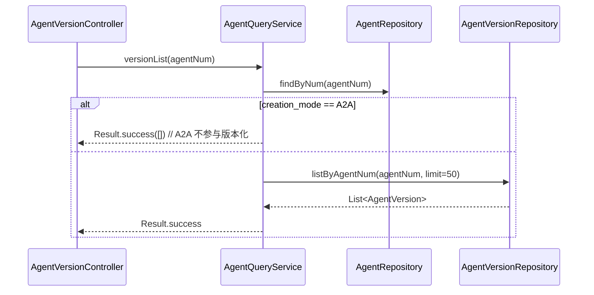
```mermaid
sequenceDiagram
    participant Ctrl as AgentVersionController
    participant Svc as AgentQueryService
    participant Repo as AgentRepository
    participant VRepo as AgentVersionRepository

    Ctrl->>Svc: versionList(agentNum)
    Svc->>Repo: findByNum(agentNum)
    alt creation_mode == A2A
        Svc-->>Ctrl: Result.success([])  // A2A 不参与版本化
    else
        Svc->>VRepo: listByAgentNum(agentNum, limit=50)
        VRepo-->>Svc: List<AgentVersion>
        Svc-->>Ctrl: Result.success
    end
```

##### 4.2.2.10 AgentQueryService.compareVersions

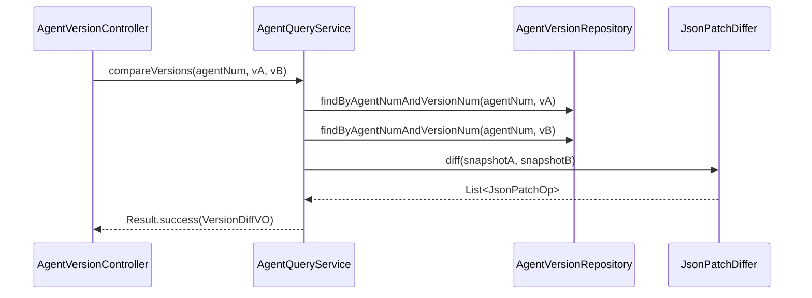
```mermaid
sequenceDiagram
    participant Ctrl as AgentVersionController
    participant Svc as AgentQueryService
    participant VRepo as AgentVersionRepository
    participant Diff as JsonPatchDiffer

    Ctrl->>Svc: compareVersions(agentNum, vA, vB)
    Svc->>VRepo: findByAgentNumAndVersionNum(agentNum, vA)
    Svc->>VRepo: findByAgentNumAndVersionNum(agentNum, vB)
    Svc->>Diff: diff(snapshotA, snapshotB)
    Diff-->>Svc: List<JsonPatchOp>
    Svc-->>Ctrl: Result.success(VersionDiffVO)
```

---

## 5. 控制器/Adapter 层设计

### 5.1 业务模块划分

| Controller 模块 | 对应 application | 路径前缀 |
| --- | --- | --- |
| AgentCommandController | AgentCommandService | `/api/v1/agent/command` |
| AgentQueryController | AgentQueryService | `/api/v1/agent/query` |
| AgentVersionController | AgentVersionCommandService + Query | `/api/v1/agent/version` |
| AgentInvokeController | AgentInvokeStreamService | `/api/v1/agent/{num}/invoke` (SSE) |
| A2aSyncController | A2aSyncService | `/api/v1/agent/a2a` |

### 5.2 agent

#### 5.2.1 Controller 接口清单

| 路径 | 方法 | 入参 JSON | 出参 JSON | 职责 |
| --- | --- | --- | --- | --- |
| `/api/v1/agent/command/create` | POST | `{ name, description, agentType, prompts: { system, user }, model, temperature, skillNums?, childAgentNums?, memoryConfig?, qps?, dailyBudget? }`（**creationMode 由后端固定为 CONFIG**，前端不传） | `{ code, message, data: { num, name, version: "v1.0.0", status: "PUBLISHED" }, traceId }` | 创建配置模式 Agent + 自动首发 v1.0.0；v2.4 起前端入口重新启用 |
| `/api/v1/agent/command/createA2a` | POST | `{ nacosAgentName, displayName?, description?, remark?, draftAgentNum? }` | `{ code, message, data: { num, name, status: "PENDING_SYNC", a2aSource: {...} }, traceId }` 或 `{ code: 2011, message: "远端未注册该 Agent" }` / `{ code: 2012, message: "Nacos 不可达" }` | **v2.4 新增 / v2.6 改**：UI 接入 Nacos 已注册 A2A Agent；后端校验远端存在 + 落库（status=PENDING_SYNC）+ 即时订阅；如传 draftAgentNum 则升级该草稿为正式记录 |
| `/api/v1/agent/command/saveA2aDraft` | POST | `{ nacosAgentName?, displayName?, description?, remark?, agentNum? }`（agentNum 非空表示更新已有草稿） | `{ code, message, data: { num, status: "DRAFT_ONLY" }, traceId }` | **v2.6 新增**：本地落库 status=DRAFT_ONLY，不调 Nacos 不订阅 |
| `/api/v1/agent/command/unsubscribeA2a` | POST | `{ num }` | `{ code, message, data: null, traceId }` | **v2.4 新增**：取消订阅 A2A Agent（unsubscribeAgentCard + 软删除本地记录）；草稿态直接软删，不调 unsubscribe |
| `/api/v1/agent/version/create` | POST | `{ agentNum }` | `{ code, message, data: { versionId }, traceId }` | **v3.0 新增**：创建 DRAFT 版本（拷贝当前在线 snapshot；同 agentNum 已有 DRAFT 抛 6002） |
| `/api/v1/agent/version/edit` | POST | `{ versionId, configDraft: {...} }` | `{ code, message, data: null, traceId }` | **v3.0 新增**：覆盖更新 DRAFT 行 snapshot（A2A 不会到此路径，CONFIG 草稿专用） |
| `/api/v1/agent/version/delete` | POST | `{ versionId }` | `{ code, message, data: null, traceId }` | **v3.0 新增**：物理删除 DRAFT 行 |
| ~~`/api/v1/agent/command/saveDraft`~~ | POST | `{ num, configDraft: {...} }` | `{ code, message, data: { draftNum, lockUntil }, traceId }` | **v3.0 兼容期保留**：内部转发到 `/version/create` + `/version/edit`（M3 删除） |
| ~~`/api/v1/agent/command/discardDraft`~~ | POST | `{ num }` | `{ code, message, data: null, traceId }` | **v3.0 兼容期保留**：内部转发到 `/version/delete`（M3 删除） |
| `/api/v1/agent/command/offline` | POST | `{ num }` | `{ code, message, data: null, traceId }` | 下线（A2A 返回 2010） |
| `/api/v1/agent/command/delete` | POST | `{ num }` | `{ code, message, data: null, traceId }` | 逻辑删除（CONFIG 仅 OFFLINE；v2.4 起 A2A 也允许，但建议走 unsubscribeA2a 显式入口）|
| `/api/v1/agent/version/publish` | POST | `{ versionId, changeLevel: "PATCH"\|"MINOR"\|"MAJOR", remark }`（**v3.0 入参从 agentNum 改为 versionId**） | `{ code, message, data: { versionNum: "v1.0.1", publishedAt }, traceId }` | 发布指定 DRAFT 为新版本（A2A 返回 2010） |
| ~~`/api/v1/agent/version/rollback`~~ | — | — | — | **v3.0 移除**：回滚走 [+ 创建版本] + [编辑] 标准流程，无独立接口 |
| `/api/v1/agent/query/list` | POST | `{ pageNo, pageSize, keyword?, creationMode? }` | `{ code, message, data: { total, list: [{num, name, description, status, skillNum, skillNames, agentSource, creationMode, createTime, updateTime}] }, traceId }`（v2.2 新增 `agentSource`：`MANUAL`/`NACOS`，由 `creationMode` 派生；v2.1 移除 agentType / currentVersionNum / createNo / updateNo / lastSyncedAt） | 列表（S2 仅 keyword 模糊搜索 + creationMode 筛选） |
| `/api/v1/agent/query/detail` | GET | `?num=AGT...` | `{ code, message, data: { num, name, creationMode, agentType, status, currentVersion?(CONFIG), hasDraft?(CONFIG), a2aSource?(A2A) }, traceId }` | 详情 |
| `/api/v1/agent/version/list` | GET | `?agentNum=AGT...` | `{ code, message, data: [{num, version, changeLevel, remark, publishedBy, publishedAt, current}] }`（A2A 返回空数组） | CONFIG 版本历史 |
| `/api/v1/agent/version/a2a-history` | GET | `?agentNum=AGT...&limit=100` | `{ code, message, data: [{id, remoteVersion, syncEventType, triggeredBy, syncedAt, agentCardJson}] }`（CONFIG 返回空数组） | **v2.6 新增**：A2A 版本历史（AgentCard 推送事件流，按 syncedAt desc） |
| `/api/v1/agent/version/detail` | GET | `?agentNum=AGT...&versionNum=v1.0.1` | `{ code, message, data: { ...version + configSnapshot } }` | 历史版本只读详情 |
| `/api/v1/agent/version/compare` | POST | `{ agentNum, versionA, versionB }` | `{ code, message, data: { patches: [{op, path, oldValue?, newValue?}] } }` | 版本对比 |
| `/api/v1/agent/a2a/manualResync` | POST | `{ num }` | `{ code, message, data: { num, lastSyncedAt }, traceId }` | A2A Agent 详情页"手动重新同步"（仅 A2A） |
| `/api/v1/agents/a2aSync/run` | POST | `?batchSize=1..500`（缺省 50）| `{ code, message, data: { processed: <int> }, traceId }` | **v3.1 新增**（hotfix_20260625）：兜底轮询 / 手动触发入口；batchSize 参数 `@Min(1) @Max(500)`；复用 `A2aSyncApplicationService.syncPendingBatch`；与 `A2aSyncScheduler`（cron 5min）双入口共享应用层同一方法 |
| `/api/v1/agent/{num}/invoke` | POST | `{ input, input_type: "text"\|"json", skill_hint?, session_num? }` | **`text/event-stream`**（SSE 事件，见总体方案 §10.1） | invoke 调用（流式） |

> ⚠️ **下线接口**：原 `/api/v1/agent/command/testConnection` 整体移除。

#### 5.2.2 接口时序逻辑

##### 5.2.2.1 POST /api/v1/agent/command/create

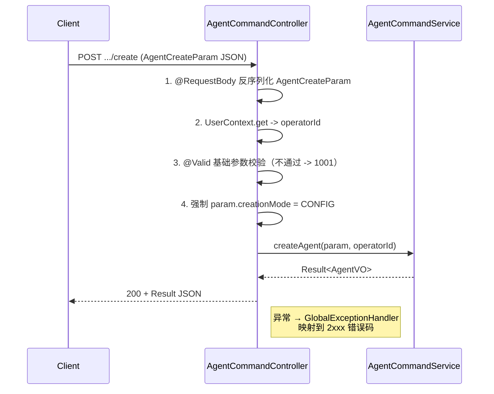
```mermaid
sequenceDiagram
    participant Cli as Client
    participant Ctrl as AgentCommandController
    participant Svc as AgentCommandService

    Cli->>Ctrl: POST .../create (AgentCreateParam JSON)
    Ctrl->>Ctrl: 1. @RequestBody 反序列化 AgentCreateParam
    Ctrl->>Ctrl: 2. UserContext.get -> operatorId
    Ctrl->>Ctrl: 3. @Valid 基础参数校验（不通过 -> 1001）
    Ctrl->>Ctrl: 4. 强制 param.creationMode = CONFIG
    Ctrl->>Svc: createAgent(param, operatorId)
    Svc-->>Ctrl: Result<AgentVO>
    Ctrl-->>Cli: 200 + Result JSON
    Note right of Ctrl: 异常 → GlobalExceptionHandler<br/>映射到 2xxx 错误码
```

##### 5.2.2.2 POST /api/v1/agent/version/{create,edit,delete}（v3.0 替代旧 saveDraft / discardDraft）

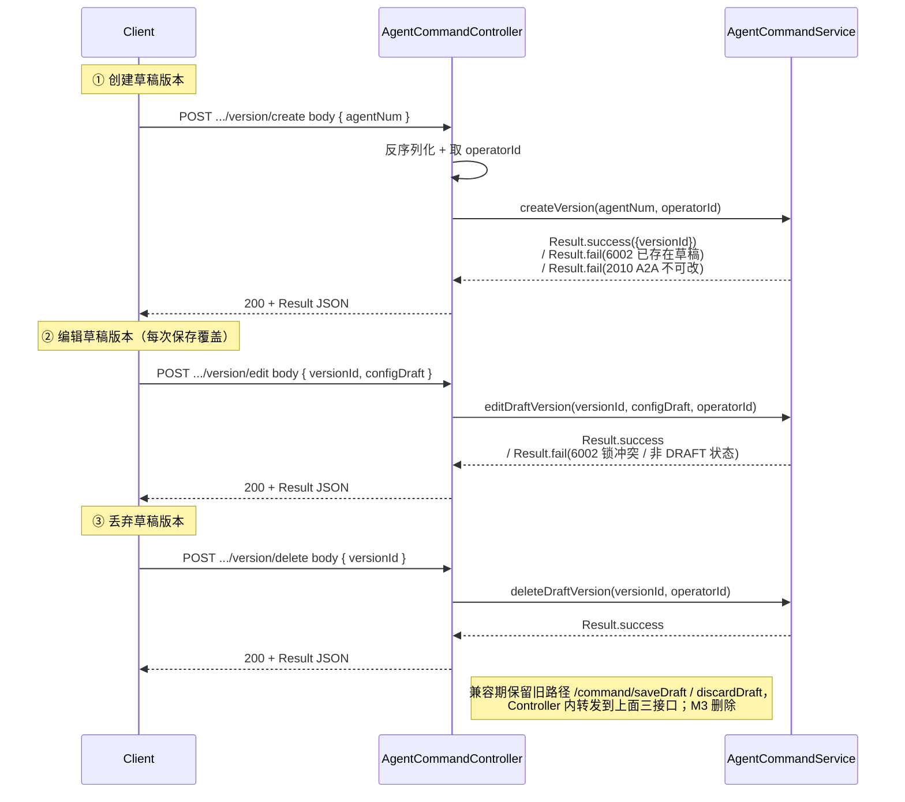
```mermaid
sequenceDiagram
    participant Cli as Client
    participant Ctrl as AgentCommandController
    participant Svc as AgentCommandService

    Note over Cli: ① 创建草稿版本
    Cli->>Ctrl: POST .../version/create  body { agentNum }
    Ctrl->>Ctrl: 反序列化 + 取 operatorId
    Ctrl->>Svc: createVersion(agentNum, operatorId)
    Svc-->>Ctrl: Result.success({versionId})<br/>/ Result.fail(6002 已存在草稿)<br/>/ Result.fail(2010 A2A 不可改)
    Ctrl-->>Cli: 200 + Result JSON

    Note over Cli: ② 编辑草稿版本（每次保存覆盖）
    Cli->>Ctrl: POST .../version/edit  body { versionId, configDraft }
    Ctrl->>Svc: editDraftVersion(versionId, configDraft, operatorId)
    Svc-->>Ctrl: Result.success<br/>/ Result.fail(6002 锁冲突 / 非 DRAFT 状态)
    Ctrl-->>Cli: 200 + Result JSON

    Note over Cli: ③ 丢弃草稿版本
    Cli->>Ctrl: POST .../version/delete  body { versionId }
    Ctrl->>Svc: deleteDraftVersion(versionId, operatorId)
    Svc-->>Ctrl: Result.success
    Ctrl-->>Cli: 200 + Result JSON

    Note right of Ctrl: 兼容期保留旧路径 /command/saveDraft / discardDraft，<br/>Controller 内转发到上面三接口；M3 删除
```

##### 5.2.2.3 POST /api/v1/agent/a2a/manualResync

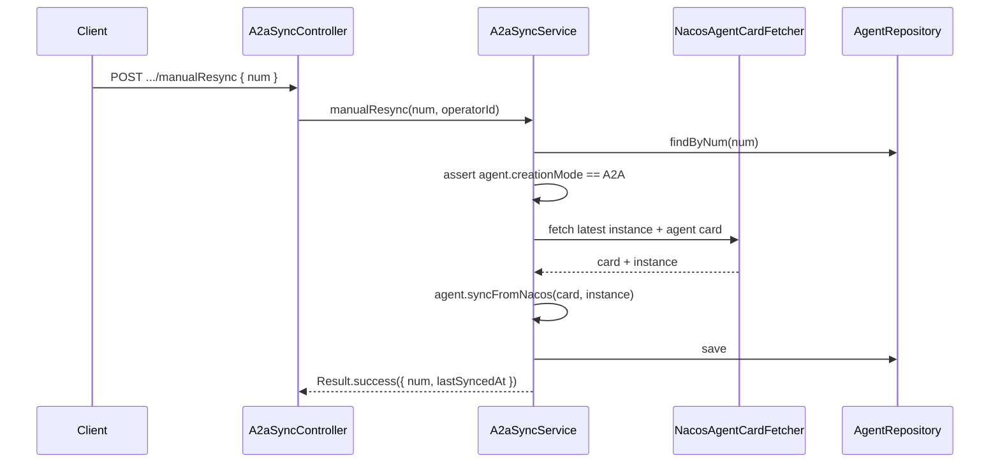
```mermaid
sequenceDiagram
    participant Cli as Client
    participant Ctrl as A2aSyncController
    participant Svc as A2aSyncService
    participant Fetcher as NacosAgentCardFetcher
    participant Repo as AgentRepository

    Cli->>Ctrl: POST .../manualResync { num }
    Ctrl->>Svc: manualResync(num, operatorId)
    Svc->>Repo: findByNum(num)
    Svc->>Svc: assert agent.creationMode == A2A
    Svc->>Fetcher: fetch latest instance + agent card
    Fetcher-->>Svc: card + instance
    Svc->>Svc: agent.syncFromNacos(card, instance)
    Svc->>Repo: save
    Svc-->>Ctrl: Result.success({ num, lastSyncedAt })
```

##### 5.2.2.3A POST /api/v1/agents/a2aSync/run（v3.1 新增, hotfix_20260625）

> 兜底轮询 / 手动触发入口。与 `A2aSyncScheduler.syncPending()`（cron 5min）双入口共享 `A2aSyncApplicationService.syncPendingBatch` 同一方法。

```mermaid
sequenceDiagram
    participant Cli as Client / Scheduler
    participant Ctrl as A2aSyncController
    participant Cron as A2aSyncScheduler
    participant Lock as Redisson 锁
    participant Svc as A2aSyncApplicationService
    participant Q as AgentQueryService
    participant F as NacosAgentCardFetcher
    participant Fac as AgentFactory
    participant H as A2aSyncHistoryRepository

    alt HTTP 入口(运维手工)
        Cli->>Ctrl: POST .../a2aSync/run?batchSize=50
        Ctrl->>Ctrl: @Min(1)@Max(500) 校验
        Ctrl->>Svc: syncPendingBatch(50)
    else Cron 入口(每 5min)
        Cron->>Lock: tryLock(0, 280s)
        alt 抢锁失败
            Cron-->>Cron: skip 本轮
        end
        Cron->>Svc: syncPendingBatch(DEFAULT_BATCH_SIZE=50)
    end

    Svc->>Q: listPendingSyncCandidates(50)<br/>(SQL: create_time <= NOW()-1min 冷却)
    Q-->>Svc: List<A2aSyncCandidateVO>{num, name}

    loop 逐条(单条 REQUIRES_NEW 事务)
        Svc->>F: fetch(name)
        alt 成功
            F-->>Svc: A2aSourceInfo
            Svc->>Fac: createByNum(num) -> Agent
            alt 仍 A2A + PENDING_SYNC
                Svc->>Svc: applyNacosSync(..., PUBLISHED,<br/>POLLING_RECONCILE, "nacos-sync")
                Svc->>H: save(A2aSyncHistory{source})
            else 数据竞态
                Svc-->>Svc: skip
            end
        else BusinessException(2011)
            Svc->>H: save(A2aSyncHistory{errorMessage})
            Svc-->>Svc: skip
        end
    end

    Svc-->>Ctrl: processed = N
    Ctrl-->>Cli: 200 + { processed: N }
    Svc-->>Cron: processed = N
    Cron->>Lock: unlock()
```

##### 5.2.2.4 POST /api/v1/agent/command/offline / delete

> A2A 在 Service 层 `assertMutableByPlatform()` 兜底返回 `BizException(2010)`，前端不渲染按钮。

##### 5.2.2.5 POST /api/v1/agent/version/publish / rollback

> A2A 在 Service 层 `assertMutableByPlatform()` 兜底返回 `BizException(2010)`，前端不渲染按钮。

##### 5.2.2.6 POST /api/v1/agent/query/list

```mermaid
sequenceDiagram
    participant Cli as Client
    participant Ctrl as AgentQueryController
    participant Svc as AgentQueryService

    Cli->>Ctrl: POST .../list (AgentPageQuery)
    Ctrl->>Svc: pageList(query)
    Svc-->>Ctrl: Result<PageVO<AgentVO>>
    Ctrl-->>Cli: 200
```

##### 5.2.2.7 GET /api/v1/agent/query/detail

```mermaid
sequenceDiagram
    participant Cli as Client
    participant Ctrl as AgentQueryController
    participant Svc as AgentQueryService

    Cli->>Ctrl: GET .../detail?num=AGT...
    Ctrl->>Svc: detail(num)
    Svc-->>Ctrl: Result<AgentDetailVO>
    Ctrl-->>Cli: 200 + 详情
```

##### 5.2.2.8 GET /api/v1/agent/version/list

```mermaid
sequenceDiagram
    participant Cli as Client
    participant Ctrl as AgentVersionController
    participant Svc as AgentQueryService

    Cli->>Ctrl: GET .../version/list?agentNum=...
    Ctrl->>Svc: versionList(agentNum)
    Svc-->>Ctrl: Result<List<AgentVersionVO>>（A2A 返回空数组）
    Ctrl-->>Cli: 200
```

##### 5.2.2.9 POST /api/v1/agent/{num}/invoke (SSE)

```mermaid
sequenceDiagram
    participant Cli as Client (浏览器 EventSource)
    participant Ctrl as AgentInvokeController
    participant Svc as AgentInvokeStreamService
    participant Run as Runner (CONFIG 或 A2A)

    Cli->>Ctrl: POST /api/v1/agent/{num}/invoke (SSE)
    Ctrl->>Ctrl: 鉴权 + 生成 traceId<br/>create SseEmitter (timeout=0)
    Ctrl->>Svc: invoke(InvokeRequest, operatorId)
    Svc->>Run: get runner & invoke(ctx)
    loop PlatformEvent flux
        Run-->>Ctrl: emit event
        Ctrl-->>Cli: SSE: event/data
    end
    Ctrl->>Ctrl: emitter.complete
    Cli-->>Ctrl: connection close
```

---

## 6. 数据库设计

### 6.1 表清单

| 表名 | 对应聚合/实体 | 用途 |
| --- | --- | --- |
| `agent` | Agent 聚合根 | Agent 元信息 + 当前在线版本指针（CONFIG）+ **当前在线版本快照镜像（v3.0 加 `config_snapshot` JSON 列）** + A2A 来源信息（A2A） |
| `agent_version` | AgentVersion 实体 | 版本（**v3.0 含 DRAFT/PUBLISHED/ARCHIVED 三态**，仅 CONFIG 写入） |
| ~~`agent_draft`~~ | ~~AgentDraft 实体~~ | **v3.0 删除**：草稿合并到 `agent_version` 表的 status=DRAFT 行 |
| `agent_a2a_sync_history` | A2aSyncHistory 实体（**v2.6 新增**） | A2A AgentCard 推送事件历史；详情页"版本历史" Tab 数据源；每 agent 保留最近 100 条 |

### 6.2 DDL

```sql
-- 1. agent
CREATE TABLE `agent` (
  `id` BIGINT NOT NULL AUTO_INCREMENT COMMENT '主键',
  `num` VARCHAR(64) NOT NULL COMMENT '业务编号 AGT...',
  `name` VARCHAR(128) NOT NULL COMMENT 'Agent 名称',
  `description` VARCHAR(512) DEFAULT NULL COMMENT '描述',
  `creation_mode` VARCHAR(16) NOT NULL COMMENT '创建方式 CONFIG/A2A',
  `agent_type` VARCHAR(16) NOT NULL DEFAULT 'NORMAL' COMMENT '类型 NORMAL/SUPERVISOR/ROUTER',
  `owner_user_id` VARCHAR(64) NOT NULL COMMENT '负责人 userId（A2A 取 Nacos 元数据 owner，缺失则 system）',
  `status` VARCHAR(16) NOT NULL DEFAULT 'DRAFT_ONLY' COMMENT '状态 DRAFT_ONLY/PUBLISHED/OFFLINE（A2A 由 Nacos healthy 同步）',
  `current_version_num` VARCHAR(64) DEFAULT NULL COMMENT '当前在线版本号（仅 CONFIG）',
  `config_snapshot` JSON DEFAULT NULL COMMENT 'v3.0：当前在线版本 snapshot 镜像（仅 CONFIG）；发布事务内同步更新；调试/评测/挂载下拉直接读，避免 join agent_version',
  `sandbox` TINYINT(1) NOT NULL DEFAULT 0 COMMENT '是否空白沙盒 Agent',
  `a2a_source` JSON DEFAULT NULL COMMENT 'A2A 来源信息（仅 A2A）：nacosGroup/nacosService/instanceIp/instancePort/endpointPath/remoteVersion/remoteSkills/remoteMcps/agentCardJson/lastSyncedAt/lastSyncEventType',
  `nacos_service_key` VARCHAR(256) DEFAULT NULL COMMENT 'A2A 幂等键 = nacosGroup@@nacosService（仅 A2A）',
  `create_no` VARCHAR(64) NOT NULL COMMENT '创建人（A2A 为 nacos-sync）',
  `update_no` VARCHAR(64) NOT NULL COMMENT '更新人（A2A 为 nacos-sync）',
  `deleted` TINYINT(1) NOT NULL DEFAULT 0 COMMENT '逻辑删除',
  `create_time` TIMESTAMP(3) NOT NULL DEFAULT CURRENT_TIMESTAMP(3),
  `update_time` TIMESTAMP(3) NOT NULL DEFAULT CURRENT_TIMESTAMP(3) ON UPDATE CURRENT_TIMESTAMP(3),
  PRIMARY KEY (`id`),
  UNIQUE KEY `uk_agent_num` (`num`),
  UNIQUE KEY `uk_agent_owner_name` (`owner_user_id`, `name`, `deleted`),
  UNIQUE KEY `uk_agent_nacos_key` (`nacos_service_key`, `deleted`) COMMENT 'A2A 幂等键',
  KEY `idx_creation_mode` (`creation_mode`, `deleted`),
  KEY `idx_status` (`status`, `deleted`)
) ENGINE=InnoDB DEFAULT CHARSET=utf8mb4 COMMENT='Agent 元信息';

-- 2. agent_version（v3.0：合并草稿，加 status/editor/lock；version_num 允许 NULL）
CREATE TABLE `agent_version` (
  `id` BIGINT NOT NULL AUTO_INCREMENT COMMENT '主键',
  `num` VARCHAR(64) NOT NULL COMMENT '业务编号 AVN...',
  `agent_num` VARCHAR(64) NOT NULL COMMENT '所属 Agent num（仅 CONFIG）',
  `status` VARCHAR(16) NOT NULL DEFAULT 'DRAFT' COMMENT 'v3.0：DRAFT 草稿 / PUBLISHED 当前在线（current_flag=1） / ARCHIVED 历史已发布',
  `version_num` VARCHAR(32) DEFAULT NULL COMMENT 'v1.0.0；DRAFT 时为 NULL，发布时按 changeLevel 计算后赋值',
  `semver_major` INT DEFAULT NULL,
  `semver_minor` INT DEFAULT NULL,
  `semver_patch` INT DEFAULT NULL,
  `change_level` VARCHAR(16) DEFAULT NULL COMMENT 'PATCH/MINOR/MAJOR；DRAFT 时为 NULL，发布时填',
  `config_snapshot` JSON NOT NULL COMMENT '完整配置 snapshot；DRAFT 与 PUBLISHED/ARCHIVED 共用此字段',
  `remark` VARCHAR(512) DEFAULT NULL COMMENT '发布备注（≥10字）；DRAFT 时为 NULL',
  `published_by` VARCHAR(64) DEFAULT NULL COMMENT '发布人 userId；DRAFT 时为 NULL',
  `published_at` TIMESTAMP(3) NULL DEFAULT NULL COMMENT '发布时间；DRAFT 时为 NULL',
  `current_flag` TINYINT(1) NOT NULL DEFAULT 0 COMMENT '是否当前在线版本（仅 PUBLISHED 行可能为 1，且每个 agent 同时仅 1 行）',
  `editor_user_id` VARCHAR(64) DEFAULT NULL COMMENT 'v3.0：当前编辑者（DRAFT 行用，继承自原 agent_draft）',
  `lock_until` TIMESTAMP(3) DEFAULT NULL COMMENT 'v3.0：草稿编辑锁过期时间',
  `create_no` VARCHAR(64) NOT NULL,
  `update_no` VARCHAR(64) NOT NULL,
  `deleted` TINYINT(1) NOT NULL DEFAULT 0,
  `create_time` TIMESTAMP(3) NOT NULL DEFAULT CURRENT_TIMESTAMP(3),
  `update_time` TIMESTAMP(3) NOT NULL DEFAULT CURRENT_TIMESTAMP(3) ON UPDATE CURRENT_TIMESTAMP(3),
  PRIMARY KEY (`id`),
  UNIQUE KEY `uk_agent_version_num` (`num`),
  UNIQUE KEY `uk_agent_version_no` (`agent_num`, `version_num`) COMMENT 'version_num 为 NULL 时不参与唯一性（MySQL 多 NULL 不冲突）',
  KEY `idx_agent_status` (`agent_num`, `status`, `deleted`) COMMENT '查询 DRAFT / PUBLISHED 行；DRAFT 同 Agent 仅 1 行由应用层 createVersion 校验兜底',
  KEY `idx_agent_current` (`agent_num`, `current_flag`, `deleted`),
  KEY `idx_published_at` (`agent_num`, `published_at`)
) ENGINE=InnoDB DEFAULT CHARSET=utf8mb4 COMMENT='Agent 版本（v3.0：含 DRAFT/PUBLISHED/ARCHIVED 三态，仅 CONFIG 模式写入）';

-- 3. agent_draft 已于 v3.0 删除（草稿合并到 agent_version 的 status=DRAFT 行）

-- 4. agent_a2a_sync_history（v2.6 新增，A2A 模式版本历史 Tab 数据源）
CREATE TABLE `agent_a2a_sync_history` (
  `id` BIGINT NOT NULL AUTO_INCREMENT COMMENT '主键',
  `agent_num` VARCHAR(64) NOT NULL COMMENT '所属 A2A Agent num',
  `remote_version` VARCHAR(64) DEFAULT NULL COMMENT 'AgentCard.version（缺失时存 NULL，前端显示 "-"）',
  `sync_event_type` VARCHAR(32) NOT NULL COMMENT 'INSTANCE_ADDED / INSTANCE_CHANGED / INSTANCE_REMOVED / POLLING_RECONCILE / MANUAL_RESYNC',
  `triggered_by` VARCHAR(16) NOT NULL DEFAULT 'AUTO' COMMENT 'AUTO（订阅推送 / 轮询）/ MANUAL（用户点手动重新同步）',
  `agent_card_json` JSON DEFAULT NULL COMMENT '本次同步落库的 AgentCard 全文 snapshot（点行 [查看] 时回显）',
  `synced_at` TIMESTAMP(3) NOT NULL DEFAULT CURRENT_TIMESTAMP(3) COMMENT '同步落库时间',
  PRIMARY KEY (`id`),
  KEY `idx_agent_synced_at` (`agent_num`, `synced_at` DESC) COMMENT '按 agent 倒序拉版本历史'
) ENGINE=InnoDB DEFAULT CHARSET=utf8mb4 COMMENT='A2A AgentCard 同步事件历史（v2.6 新增；保留每个 agent 最近 100 条，应用层滚动删除）';
```

### 6.3 初始化数据（DML，刷数）

```sql
-- 内置空白沙盒 Agent（供 Skill 评测兜底）
INSERT INTO `agent` (
  `num`, `name`, `description`, `creation_mode`, `agent_type`,
  `owner_user_id`, `status`, `current_version_num`, `sandbox`,
  `create_no`, `update_no`
) VALUES (
  'AGT202604010000',
  '空白沙盒 Agent',
  '系统内置 Agent，供 Skill 评测兜底使用，不出现在 Agent 列表',
  'CONFIG', 'NORMAL',
  'system', 'PUBLISHED', 'v1.0.0', 1,
  'system', 'system'
);

INSERT INTO `agent_version` (
  `num`, `agent_num`, `version_num`,
  `semver_major`, `semver_minor`, `semver_patch`, `change_level`,
  `config_snapshot`, `remark`, `published_by`, `published_at`, `current_flag`,
  `create_no`, `update_no`
) VALUES (
  'AVN202604010000',
  'AGT202604010000',
  'v1.0.0', 1, 0, 0, 'MAJOR',
  '{"agentType":"NORMAL","systemPrompt":"","userPrompt":"","model":"claude-haiku-4-5","temperature":0.0,"skillNums":[],"qps":10}',
  '系统初始化空白沙盒 Agent v1.0.0',
  'system', NOW(3), 1,
  'system', 'system'
);
```

### 6.4 与领域对应

- `agent` 表 ↔ `Agent` 聚合根（含 `a2a_source` JSON 列对应 `A2aSourceInfo` 值对象、`nacos_service_key` 冗余列用于 A2A 幂等查询、**v3.0 起 `config_snapshot` JSON 列作为当前在线版本快照镜像**）
- `agent_version` 表 ↔ `AgentVersion` 实体（仅 CONFIG；**v3.0 起承载 DRAFT / PUBLISHED / ARCHIVED 三态**，由 `status` 列区分；DRAFT 行的 `version_num / change_level / remark / published_*` 为 NULL，已发布行的 `editor_user_id / lock_until` 为 NULL）
- ~~`agent_draft` 表~~（**v3.0 已 DROP**：草稿合并到 `agent_version` 的 status=DRAFT 行）

### 6.5 关键查询场景与索引

- 列表搜索：`name` 模糊 LIKE 查询 + `deleted=0` 条件 +（可选）`creation_mode` 等值
- 详情：通过 `num` 唯一索引
- A2A 同步幂等：通过 `nacos_service_key` 唯一索引 upsert
- 当前版本：`(agent_num, current_flag, deleted)` 复合索引一行返回
- 版本历史：`(agent_num, published_at)` 倒序

---

## 7. 模块变更清单

| 层 | 变更项 | 对应 Skill |
| --- | --- | --- |
| facade | `AgentEntity` / `AgentDomainEventDTO` / `AgentEventPublisher` 接口 / `DomainEventConstant.AGENT_VERSION_PUBLISHED` / `AGENT_OFFLINED` / `AGENT_A2A_SYNCED` | **impl-facade-module** |
| client | `AgentCreateParam`（仅 CONFIG，creationMode 后端固定） / `PublishParam{versionId, changeLevel, remark}` / `AgentVO`（含 a2aSource? 字段） / `AgentDetailVO` / `AgentVersionVO`（含 status / configSnapshot / editorUserId / lockUntil） / `AgentVersionDetailVO` / `VersionDiffVO` / `InvokeRequest` / `InvokeEventVO` | **impl-client-module** |
| domain | Agent 聚合根（含 syncFromNacos / assertMutableByPlatform / promotePublished + `configSnapshot` 镜像字段） + AgentVersion 实体（v3.0 含 status / editorUserId / lockUntil + tryLock / setConfigSnapshot / promoteToPublished / archive） + AgentRepository / AgentVersionRepository（v3.0 加 findByAgentNumAndStatus / switchCurrent） / AgentFactory / AgentVersionFactory（v3.0 createDraftFromCurrent） / LlmGateway / A2aAgentGateway 接口 + valueobject (CreationMode / AgentType / AgentStatus / AgentVersionStatus / ConfigSnapshot / A2aSourceInfo / AgentRunner 接口与 2 实现：ConfigAgentRunner / A2aAgentRunner) | **impl-domain-module** |
| infra | AgentEntity（v3.0 加 `config_snapshot` JSON 列） / AgentVersionEntity（v3.0 加 `status / editor_user_id / lock_until`，`version_num / change_level / remark / published_*` 改可空）(Lombok @Data) + Mapper xml + Repository/Factory/Gateway Impl + LlmGatewayImpl (OkHttp+EventSource) + A2aAgentGatewayImpl + A2aProtocolAdapter + **A2aNacosSubscriber + NacosAgentCardFetcher** | **impl-infra-module** |
| application | AgentCommandService / AgentQueryService / AgentVersionCommandService / AgentInvokeStreamService / **A2aSyncService** | **impl-application-module** |
| adapter | AgentCommandController / AgentQueryController / AgentVersionController / AgentInvokeController (SSE) / **A2aSyncController** | **impl-adapter-module** |
| 三方 SDK | `com.alibaba.nacos:nacos-client`（infra 模块依赖） | **impl-third-party-sdk** |

---

## 8. 代码分支命名

`feature-20260511-agent-management`

> 本子需求首发分支，携带公共骨架（facade/client/infra.common/adapter.config）。

---

## 9. 实现顺序与依赖

1. **facade**：AgentEntity / DomainEventDTO / EventPublisher 接口 / Constant（含 `AGENT_A2A_SYNCED`）
2. **client**：AgentCreateParam（仅 CONFIG）+ \*VO + InvokeRequest/Event
3. **domain**：Agent 聚合根（含 syncFromNacos / assertMutableByPlatform / promotePublished + `configSnapshot` 镜像字段）+ AgentVersion 实体（v3.0 含 status 三态 + tryLock / setConfigSnapshot / promoteToPublished / archive）+ Repository（AgentRepository / AgentVersionRepository）/ Factory（AgentFactory / AgentVersionFactory）/ Gateway 接口 + 值对象（含 AgentVersionStatus / A2aSourceInfo + ConfigAgentRunner / A2aAgentRunner）
4. **infra**：DDL + Entity + Mapper + RepositoryImpl + LlmGatewayImpl + A2aAgentGatewayImpl + A2aProtocolAdapter
5. **application**：4 个 Service（不含 A2aSyncService）
6. **adapter**：4 个 Controller + UserContextFilter + GlobalExceptionHandler

> M3 阶段补：① `A2aNacosSubscriber + NacosAgentCardFetcher`（infra）② `A2aSyncService`（application）③ `A2aSyncController.manualResync`（adapter）④ A2A Runner 实际打通远端 ⑤ 监督者/路由类型支持（仅 CONFIG）。

---

## 10. 接口与数据契约

详见 §5.2.1 Controller 接口清单。

### 10.1 invoke 请求体（与调试台 reuse）

见 [总体方案 §10.1](./2026-05-11_S2总体-技术方案.md#101-invoke-请求体-json与调试台--评测-reuse)。

### 10.2 ConfigSnapshot JSON Schema（CONFIG 模式专属）

```json
{
  "agentType": "NORMAL",
  "systemPrompt": "...",
  "userPrompt": "...",
  "model": "claude-opus-4-7",
  "modelApiKey": "<密文，SecretCipher 加密；AgentDetailVO 出参固定 ***>",
  "modelBaseUrl": "https://llm-proxy.garry.internal/v1",
  "temperature": 0.7,
  "skillNums": ["SKL...","SKL..."],
  "mcpNums": ["MCP..."],
  "childAgentNums": [],
  "memoryConfig": {
    "shortTermStrategy": "RECENT_N",
    "shortTermN": 10,
    "longTermStrategy": "NONE"
  },
  "qps": 10,
  "dailyBudget": 100
}
```

> v2.5 字段说明：
> - `modelApiKey` / `modelBaseUrl`：可选；留空表示该 Agent 调用时沿用 `app.llm.api-key` / `app.llm.base-url` 默认值
> - `memoryConfig.shortTermStrategy` 枚举：`NONE` / `RECENT_N` / `SLIDING_WINDOW`；`RECENT_N` 时配合 `shortTermN` 整数
> - `memoryConfig.longTermStrategy` 枚举：`NONE` / `VECTOR_RECALL` / `FULLTEXT_RECALL`
> - `mcpNums` v2.5 起从 Step4 独立挂载（之前与 skill 同步在"挂载资源"一步）

### 10.3 A2aSourceInfo JSON Schema（A2A 模式专属，存于 `agent.a2a_source` 列）

```json
{
  "nacosGroup": "DEFAULT_GROUP",
  "nacosService": "a2a-agents@@flight-bot",
  "instanceIp": "10.20.30.40",
  "instancePort": 8080,
  "endpointPath": "/a2a/invoke",
  "remoteVersion": "v3.2.1",
  "remoteSkills": [
    { "name": "plan_route", "description": "规划航线" },
    { "name": "check_weather", "description": "查询气象" }
  ],
  "remoteMcps": [
    { "name": "filesystem", "description": "本地文件读写", "serverUrl": "http://10.20.30.40:9001" },
    { "name": "jira", "description": "JIRA 工单查询", "serverUrl": "http://10.20.30.40:9002" }
  ],
  "agentCardJson": "{ ... 完整 Agent Card 原文 ... }",
  "lastSyncedAt": "2026-05-14T09:32:11.000+08:00",
  "lastSyncEventType": "INSTANCE_CHANGED"
}
```

---

## 11. 其他

### 11.1 关键技术点

- **Strategy 派发**：`Map<CreationMode, AgentRunner>` 由 Spring 自动注入，应用层 `runners.get(agent.creationMode).invoke(ctx)`。
- **A2A 写入保护双层兜底**：① 前端不渲染编辑/发布/下线按钮；② Service 层 `Agent.assertMutableByPlatform()` 在所有 mutate 动作开头调用，A2A 直接抛 `BizException(2010)`；**v2.4 起 `delete` 不再被该守卫拦截**，因为 UI 取消订阅是合法路径。
- **Nacos 长订阅 + 兜底轮询**：**v2.4 改**：订阅范围 = DB 中 `creation_mode=A2A` 的 Agent 集合（运行时动态）。`A2aNacosSubscriber` 启动时 `agentRepository.listByCreationMode(A2A)` 全量装载，对每个 name 调 `aiService.subscribeAgentCard(name, listener)`；新建 / 取消订阅时通过 `subscribe(name)` / `unsubscribe(name)` 即时变更；`@Scheduled(fixedDelay=poll-interval-ms)` 对当前订阅集合调 `getAgentCard` 对账。
- **A2A PENDING_SYNC 兜底轮询 + 手动触发（v3.1 hotfix_20260625）**：用户接入完成后 status=PENDING_SYNC 等待首次 Nacos AgentCard 推送；当长订阅延迟 / 漏推时由 `A2aSyncScheduler`（cron 5min）+ `A2aSyncController`（HTTP `POST /api/v1/agents/a2aSync/run`）双入口打到 `A2aSyncApplicationService.syncPendingBatch`，主动调 `NacosAgentCardFetcher.fetch(name)` 拉远端推进至 PUBLISHED。**入口层分工**：HTTP / cron 都打到 application 层同一方法（区别于 `AgentCommandService.manualResync` 单条手动重试，本能力是批处理推进）。**1min 冷却窗口**：`AgentQueryService.listPendingSyncCandidates` SQL 加 `create_time <= NOW()-1min`，避免与 Nacos 首次推送抢跑。**多副本并发**：Redisson 全局锁 `LockKeyConstant.A2A_SYNC_RECONCILE_LOCK`（租约 280s）保证同一时刻只有一个实例执行；抢不到锁的副本直接跳过本轮（参考 `SandboxReconcileScheduler` 模式）。**单条事务隔离**：`syncOne` 标注 `@Transactional(propagation = REQUIRES_NEW)`，外层 try/catch 循环 — 单条失败仅记日志 + 写 `A2aSyncHistory` 跳过，不影响后续条。**状态映射策略**：当前 fetcher 无 `healthy` 字段时统一按 PUBLISHED 处理（"远端可达即认为在线"）；后续接 Nacos 实例健康度时再扩展。**触发错误码**：`NacosAgentCardFetcher` 远端不可达 → `BusinessException(A2A_REMOTE_UNREACHABLE)` (2011)，`A2aSyncApplicationService` 内 catch 后写历史跳过，不抛回调用方。
- **A2A 幂等键**：`agent.nacos_service_key = "{nacosGroup}@@{nacosService}"`，UNIQUE KEY 兜底；首次发现走 INSERT，后续走 UPDATE。
- **A2A 全字段覆盖**：`Agent.syncFromNacos()` 用 Nacos 来源覆盖 `name / description / a2aSource.* / status`；本地任何字段修改都会被刷掉（事实上本地无修改入口，此为一致性兜底）。
- **A2A 状态映射**：Nacos `instance.healthy = true` → `PUBLISHED`；`healthy = false` 或 `DEREGISTER` 事件 → `OFFLINE`；状态变化时附带触发 `AGENT_OFFLINED` 事件用于通知调试台/评测下拉刷新。
- **A2aProtocolAdapter**：把 A2A 协议事件（task.update / task.complete / message 等）映射到平台 5 类标准事件（message.delta / step.start / step.end / final / error），映射表硬编码在 Adapter 内。
- **SseEmitter**：`new SseEmitter(0L)` 不超时；emitter 在 final 事件后 `complete()`。
- **草稿冲突锁**：`AgentVersion` DRAFT 行的 `editorUserId / lockUntil` + Redisson 分布式锁双保险（DB 锁兜底，Redis 锁热路径）。**v3.0 起锁字段下沉到 `agent_version`**，与配置快照同表，避免 v2.x 双表（`agent_draft` + 锁列）一致性维护。
- **空白沙盒 Agent**：DDL 初始化时种入；不出现在列表（`sandbox=1` 过滤）；Skill 评测台执行 Agent 下拉时通过特殊接口拿到。

### 11.1.1 前端关键设计（rd-agent-fe）

> **2026-05-12 与 Figma 像素级同步：** 列表页 `73:6`、详情页 `73:8`，Compare/Create Figma 未画。详见 [PRD §7.1 / §7.4](../产品方案/2026-05-11-Agent管理-PRD.md#74-配置模式详情页) 与 [wireframes/B0-Agent列表/](../产品方案/wireframes/B0-Agent列表/) [B1-Agent详情/](../产品方案/wireframes/B1-Agent详情/)。

| 模块 | 技术点 |
| --- | --- |
| 列表页 `/agent/manage` | ProTable 自渲染列：**编码 / 名称 / 描述 / Agent来源 / 状态 / Skills / 配置方式 / 创建时间 / 最后更新时间** + 操作（v2.2 新增 Agent来源；v2.1 精简列）；顶部搜索框 + 配置方式筛选；右上「+ 新建 Agent」**当前阶段 disabled**（hover tooltip："暂未开放，A2A Agent 通过 Nacos 自动同步"） |
| 列字段实现 | `description` 列单行省略 + Tooltip 完整；`Skills` 列显示 `skillNum` 数字 + Tooltip 列 `skillNames` 数组（≤8 个，超出 `+N`）；`Agent来源` 列读 `agentSource` 字段，`MANUAL` → "人工创建"、`NACOS` → "Nacos注册"，纯文本无徽标；`createTime` / `updateTime` 用 `dayjs(t).format('YYYY-MM-DD HH:mm')` |
| 配置方式标识 | A2A Agent 行的"配置方式"列显示 `🔵 A2A·Nacos` 徽标，hover tooltip 显示 nacos_service_key |
| 行操作 | [查看] → 详情页；[调试] → 跳 `/agent/debug?agent={num}`；A2A 行无 [编辑] / [删除] |
| 详情页 `/agent/manage/detail/:num` | 按 `creationMode` 分支渲染：CONFIG 显示编辑/发布/下线/删除按钮；A2A 隐藏全部 mutate 按钮，顶部显示只读 Banner + [手动重新同步] |
| 顶部按钮（CONFIG 查看模式） | **v2.6 改**：[调试] / **[+ 创建版本]**（替代原 [编辑]，强调"修改 = 新版本"）/ [发布]（有草稿时） / [上线]（离线时） / [⋯更多] 下线/删除/版本历史Tab跳转/对比 |
| 顶部按钮（CONFIG 版本编辑态） | **v2.6 改名**：[保存草稿] / [取消编辑] / [发布]（原"编辑模式"语义不变，仅文案换） |
| 顶部按钮（A2A） | **v2.6 按状态分支**：PENDING_SYNC → [调试 disabled] / [↻ 手动重新同步] / [🚫 取消订阅]；PUBLISHED / OFFLINE → [调试] / [↻ 手动重新同步] / [🚫 取消订阅]；DRAFT_ONLY → [📝 继续接入] / [🗑 删除草稿] |
| A2A 顶部 Banner（v2.6） | 黄底 Alert（PUBLISHED / OFFLINE / PENDING_SYNC 通用）：`🔒 该 Agent 来源于 Nacos 注册中心 ({serviceKey})，所有信息由远端管理，平台不可修改。最近同步：{lastSyncedAt}`；PENDING_SYNC 状态额外显示橙底 Banner `⏳ 等待 Nacos 首次推送…已订阅 X 秒` |
| 发布 Modal | 自动生成 Semver 版本号 + 影响等级自动推荐(patch/minor/major)可手动改 + 备注必填(≥10字) + 发布前后配置 diff 高亮 |
| 状态胶囊 | `<StatusChip>`：PUBLISHED `#EFF6FF/#2B52D9 ● 在线`、OFFLINE `#FEF2F2/#DC2626 ● 已下线`、DRAFT_ONLY `#FEF3C7/#D97706 ● 草稿`、**PENDING_SYNC `#FFF7ED/#EA580C ● 待同步`（v2.6 新增，仅 A2A 出现）**；hasDraft 时附加「有草稿」黄色胶囊 |
| Tab 栏（CONFIG） | **v2.6 改 7 个 Tab / v2.9 末项改名「版本管理」**：基本信息（Step1） / 模型配置（Step2，秘钥渲染 `***` + [清空重填]） / Skill 配置（Step3，版本编辑态双栏） / MCP 配置（Step4，同 Skill 双栏；MCP 模块未上线 Empty） / 高级配置（Step5，长期/短期记忆策略 + 限流参数折叠） / API 信息（4 API URL + cURL）/ **版本管理**（v2.9 改名；GET `/api/v1/agent/version/list` + `agentApi.draftDetail` 合并草稿到第一行；草稿行操作 [编辑] 调父组件 `setActiveTab('basic')`；版本行 [查看 snapshot] [对比] [回滚]）|
| API 信息 Tab（CONFIG）| 显示 §6.8 的 4 个 API 完整 URL（已替换成本 Agent num）+ 各自 cURL 示例：① `POST /api/v1/agents/{num}/invoke`（SSE）② `POST /api/v1/agents/{num}/sessions` ③ `GET /api/v1/agents/{num}/sessions` ④ `GET /api/v1/agents/{num}/sessions/{sessionId}`；右上角 [复制] 按钮逐项复制 cURL；A2A 模式同位 Tab 复用同一组件，URL 替换为 A2A invoke 端点 |
| Tab 栏（A2A） | **v2.6 改为 5 个 Tab**：基本信息（含 A2A 来源卡片，**当前版本号 = a2aSource.remoteVersion**）/ Skills（远端只读列表）/ **MCP**（远端只读列表）/ API 信息（同 CONFIG）/ **版本历史**（v2.6 新增；GET `/api/v1/agent/version/a2a-history?agentNum=`；ProTable 列：remoteVersion / syncEventType / triggeredBy / syncedAt + 行操作 [查看 AgentCard JSON]，无对比 / 无回滚）|
| A2A Skills Tab 实现 | `<ProTable>` 渲染 `agent.a2aSource.remoteSkills`；空数组显示 Empty + "远端 Agent Card 未声明 skills" |
| A2A MCP Tab 实现 | `<ProTable>` 渲染 `agent.a2aSource.remoteMcps`；列：name / description / serverUrl（serverUrl 渲染为可复制文本）；空数组显示 Empty + "远端 Agent Card 未声明 MCP 接入"；Tab 标题显示 `MCP (N)` |
| Agent Card 原文查看 | 基本信息 Tab 内 A2A 来源卡片提供 [📄 查看原始 Agent Card] 按钮，点击弹 Modal + Monaco Editor JSON 只读展示 `agent.a2aSource.agentCardJson` |
| CreateForm | **v2.5 改 5 步 + v2.4 分支态**：点列表「+ 新建 Agent」先弹"选择创建方式" Modal（配置模式 / A2A 模式 两张卡片）。配置模式 → 5 步 `<Steps>` 表单（Step1 基本信息 / Step2 模型配置 / Step3 Skill 配置 / Step4 MCP 配置 / Step5 高级配置 + [完成接入] 按钮，POST `/api/v1/agent/command/create`）；A2A 模式 → 单页简表（Nacos Agent Name 必填 + 显示名 / 描述 / 备注 可选；POST `/api/v1/agent/command/createA2a`）。提交态：loading / 成功 Toast → 跳详情；失败按 BizCode 在出错 Step 字段下方或顶部 Alert 渲染（CONFIG 422 校验失败自动跳回出错 Step 并高亮）|

### 11.1.2 Agent 实例构建链路（v2.7 新增，对齐 PRD §6.11）

> CONFIG 模式调试发起会话时，把 ConfigSnapshot 实例化为 spring-ai-alibaba 的 `BaseAgent` 实例链路。A2A 模式不走本链路（仍走 `A2aAgentRunnerImpl`）。

#### 涉及组件（按层）

| 层 | 组件 | 职责 |
| --- | --- | --- |
| application | `AgentInstanceCache`（新增）| `ConcurrentHashMap<String, BaseAgent>` 缓存；`get(num, version, supplier)` 原子 computeIfAbsent；监听领域事件失效 |
| application | `ConfigAgentRunnerImpl`（改造）| 取代旧 LlmGateway 路径；通过 `AgentInstanceCache.get(...)` 拿 BaseAgent，调 `agent.stream(input)` 转换为 `Flux<PlatformEvent>` |
| infra | `ConfigAgentBuilder`（新增）| 按 `agentType` 分流构造 `ReactAgent` / `SupervisorAgent` / `LlmRoutingAgent`；递归构造子 Agent |
| infra | `OpenAiChatModelFactory`（新增）| 按 ConfigSnapshot.modelApiKey/modelBaseUrl 是否为空，返回自带或默认 `OpenAiChatModel` 实例 |
| infra（依赖）| `spring-ai-openai-spring-boot-starter`（已引入）| OpenAI 兼容 LLM client；application.yml 提供默认 `spring.ai.openai.*` 配置 |

#### 关键代码骨架（伪代码）

```java
// ── infra/agent/builder/OpenAiChatModelFactory.java ─────────────────────────
@Component
public class OpenAiChatModelFactory {
    /**
     * 用 ConfigSnapshot 中的模型秘钥/URL/型号实例化 OpenAiChatModel。
     * <p>
     * v2.8 起强制从 DB 读取，不再回落 Spring 默认 Bean。任一字段缺失抛 MODEL_NOT_CONFIGURED。
     *
     * @param snap CONFIG Agent 当前在线版本的快照
     * @return 可执行的 OpenAiChatModel 实例（每次新建，由 AgentInstanceCache 缓存复用）
     */
    public OpenAiChatModel resolve(ConfigSnapshot snap) {
        if (StrUtil.isBlank(snap.getModelApiKey())
                || StrUtil.isBlank(snap.getModelBaseUrl())
                || StrUtil.isBlank(snap.getModel())) {
            throw new BusinessException(BizCode.MODEL_NOT_CONFIGURED.getCode(),
                    "Agent 未配置模型秘钥 / URL / 型号；请在 Agent 详情 → 模型配置 中补全");
        }
        OpenAiApi api = OpenAiApi.builder()
                .baseUrl(snap.getModelBaseUrl())
                .apiKey(snap.getModelApiKey())
                .build();
        return OpenAiChatModel.builder()
                .openAiApi(api)
                .defaultOptions(OpenAiChatOptions.builder()
                        .model(snap.getModel())
                        .temperature(snap.getTemperature())
                        .build())
                .build();
    }
}

// ── infra/agent/builder/ConfigAgentBuilder.java ─────────────────────────────
@Component
@RequiredArgsConstructor
public class ConfigAgentBuilder {
    private final OpenAiChatModelFactory chatModelFactory;
    private final AgentRepository agentRepository;
    private final AgentVersionReadGateway versionReadGateway;

    /**
     * 按 agentType 派发到 spring-ai-alibaba 对应 Agent。
     * @param agent 当前 Agent 元信息
     * @param snap  当前在线版本的 ConfigSnapshot
     * @return BaseAgent；按 NORMAL/SUPERVISOR/ROUTER 分别为 ReactAgent/SupervisorAgent/LlmRoutingAgent
     */
    public BaseAgent build(Agent agent, ConfigSnapshot snap) {
        if (StrUtil.isBlank(snap.getModel())) {
            throw new BusinessException(BizCode.MODEL_NOT_CONFIGURED.getCode(),
                    "Agent 未配置模型 num=" + agent.getNum());
        }
        OpenAiChatModel model = chatModelFactory.resolve(snap);
        switch (agent.getAgentType()) {
            case NORMAL: return buildReact(agent, snap, model);
            case SUPERVISOR: return buildSupervisor(agent, snap, model);
            case ROUTER: return buildRouter(agent, snap, model);
            default: throw new BusinessException(BizCode.INVALID_PARAM.getCode(),
                    "未知 agentType=" + agent.getAgentType());
        }
    }

    private ReactAgent buildReact(Agent agent, ConfigSnapshot snap, OpenAiChatModel model) {
        return ReactAgent.builder()
                .name(agent.getName())
                .description(agent.getDescription())
                .model(model)
                .instruction(snap.getSystemPrompt())
                .outputKey("messages")
                // .tools(...) // S3 接入 Skill / MCP 时填
                .build();
    }

    private SupervisorAgent buildSupervisor(Agent agent, ConfigSnapshot snap, OpenAiChatModel model) {
        // mainAgent：用同一份 systemPrompt 作为决策入口，由 spring-ai-alibaba 强约束（缺则 IllegalArgument）
        ReactAgent mainAgent = ReactAgent.builder()
                .name(agent.getName() + "_main")
                .model(model)
                .description("Supervisor decision entry for " + agent.getName())
                .systemPrompt(snap.getSystemPrompt())
                .build();
        List<BaseAgent> subs = buildSubAgents(snap.getChildAgentNums());
        return SupervisorAgent.builder()
                .name(agent.getName())
                .description(agent.getDescription())
                .model(model)
                .mainAgent(mainAgent)
                .subAgents(subs)
                .build();
    }

    private LlmRoutingAgent buildRouter(Agent agent, ConfigSnapshot snap, OpenAiChatModel model) {
        List<BaseAgent> subs = buildSubAgents(snap.getChildAgentNums());
        return LlmRoutingAgent.builder()
                .name(agent.getName())
                .description(agent.getDescription())
                .model(model)
                .systemPrompt(snap.getSystemPrompt())
                .instruction(snap.getUserPrompt())
                .subAgents(subs)
                .build();
    }

    /** 递归构建子 Agent；强校验子 Agent 必须 CONFIG + NORMAL + 在线 */
    private List<BaseAgent> buildSubAgents(List<String> childNums) {
        if (CollUtil.isEmpty(childNums)) return List.of();
        List<BaseAgent> result = new ArrayList<>(childNums.size());
        for (String num : childNums) {
            Agent sub = agentRepository.findByNum(num);
            if (sub == null || sub.getCreationMode() != CreationMode.CONFIG
                    || sub.getAgentType() != AgentType.NORMAL
                    || sub.getStatus() != AgentStatus.PUBLISHED) {
                throw new BusinessException(BizCode.SUBAGENT_NOT_AVAILABLE.getCode(),
                        "子 Agent 不可用 num=" + num);
            }
            ConfigSnapshot subSnap = versionReadGateway.findCurrent(num).getConfigSnapshot();
            result.add(build(sub, subSnap)); // 递归（注：子 Agent 也会进缓存，由调用方 wrap）
        }
        return result;
    }
}

// ── application/agent/cache/AgentInstanceCache.java ────────────────────────
@Component
@RequiredArgsConstructor
@Slf4j
public class AgentInstanceCache {
    /** key = "{agentNum}::{versionNum}"；value = spring-ai-alibaba BaseAgent 实例 */
    private final Map<String, BaseAgent> cache = new ConcurrentHashMap<>();

    /**
     * 命中即复用，未命中由 supplier 构造并入缓存。
     * @param agentNum   Agent 业务编号
     * @param versionNum 当前在线版本号（保证同 Agent 不同版本独立缓存）
     * @param supplier   未命中时构造 BaseAgent 的 lambda（一般是 ConfigAgentBuilder.build(...)）
     * @return 可复用的 BaseAgent
     */
    public BaseAgent getOrBuild(String agentNum, String versionNum, Supplier<BaseAgent> supplier) {
        String key = agentNum + "::" + versionNum;
        return cache.computeIfAbsent(key, k -> {
            log.info("[AgentInstanceCache] miss → build key={}", key);
            return supplier.get();
        });
    }

    /** 单 Agent 全版本失效（发布新版本 / 下线 / 删除时调用） */
    public void invalidateByAgentNum(String agentNum) {
        String prefix = agentNum + "::";
        int removed = 0;
        Iterator<String> it = cache.keySet().iterator();
        while (it.hasNext()) {
            if (it.next().startsWith(prefix)) {
                it.remove();
                removed++;
            }
        }
        if (removed > 0) {
            log.info("[AgentInstanceCache] invalidated agentNum={} removed={}", agentNum, removed);
        }
    }
}

// ── application/agent/cache/AgentInstanceCacheInvalidator.java ─────────────
@Component
@RequiredArgsConstructor
public class AgentInstanceCacheInvalidator {
    private final AgentInstanceCache cache;

    /** 监听领域事件，发布 / 下线 / 删除时清缓存 */
    @EventListener({ AgentVersionPublishedEvent.class,
                     AgentOfflinedEvent.class,
                     AgentDeletedEvent.class })
    public void onAgentChanged(Object event) {
        String agentNum = extractAgentNum(event); // 三个事件都有 agentNum 字段
        cache.invalidateByAgentNum(agentNum);
    }
}
```

#### ConfigAgentRunnerImpl 改造

```java
// application/agent/strategy/ConfigAgentRunnerImpl.java（关键改动）
@Override
public Flux<PlatformEvent> invoke(InvokeContext ctx) {
    BaseAgent baseAgent = agentInstanceCache.getOrBuild(
            ctx.getAgentNum(),
            ctx.getAgentVersionNum(),
            () -> configAgentBuilder.build(ctx.getAgent(), ctx.getSnapshot())
    );
    return baseAgent.stream(Map.of("input", toPromptString(ctx)))
            .mapNotNull(out -> {
                if (out.isSTART() || out.isEND()) return null;
                if (out instanceof StreamingOutput so) {
                    String chunk = so.chunk();
                    return chunk == null || chunk.isEmpty() ? null : toMessageDelta(chunk);
                }
                return null;
            })
            .concatWith(Mono.just(finalEvent()));
}
```

#### Maven 依赖（已存在，列出确认）

```xml
<!-- spring-ai-alibaba agent framework：ReactAgent / SupervisorAgent / LlmRoutingAgent -->
<dependency>
    <groupId>com.alibaba.cloud.ai</groupId>
    <artifactId>spring-ai-alibaba-agent-framework</artifactId>
</dependency>
<!-- spring-ai openai starter：默认 OpenAiChatModel Bean + 配置入口 -->
<dependency>
    <groupId>org.springframework.ai</groupId>
    <artifactId>spring-ai-openai-spring-boot-starter</artifactId>
</dependency>
<!-- 禁止引入 dashscope 原生 starter（避免与 OpenAI starter 版本冲突） -->
<!-- <dependency>com.alibaba.cloud.ai:spring-ai-alibaba-starter-dashscope</dependency> 不引入 -->
```

#### application.yml 默认 OpenAI 配置

```yaml
spring:
  ai:
    openai:
      base-url: ${LLM_BASE_URL:http://llm-proxy.garry.internal/v1}
      api-key: ${LLM_API_KEY:}
      chat:
        options:
          # 全局默认模型；ConfigSnapshot.model 非空时按 Agent 自带覆盖
          model: ${LLM_DEFAULT_MODEL:claude-haiku-4-5}
          temperature: 0.7
```

#### 关键设计取舍

- **CacheKey 用 `{agentNum}::{versionNum}` 而非 `{agentNum}` 单独**：发布新版本时旧版本缓存项也保留（仍可被未来"按版本号 invoke"复用），但通过 invalidateByAgentNum 主动清除，避免 stale；这种取舍简化失效逻辑（不必区分版本对比），代价是切版本期间多消耗内存
- **不预加载**：缓存懒构建，避免启动 N×LLM client 实例化
- **不限容量**：S2 单进程 Agent 数量预期 < 100，简单 ConcurrentHashMap 够用；S3 可演进为 Caffeine + maxSize + TTL
- **递归构建子 Agent 也走缓存**：`ConfigAgentBuilder.buildSubAgents` 内部应通过 cache.getOrBuild 而非直接 build，避免子 Agent 重复实例化（实施时由 application 层 wrapper 处理）
- **A2A 不入此缓存**：A2A 走 `A2aAgentRunnerImpl` 的 `A2aRemoteAgent`，spring-ai-alibaba 内部带 InMemoryMemory，单例化会跨请求串对话历史
- **缓存命中后中途 Agent 状态变化**：依靠领域事件 invalidate；监听 `AGENT_VERSION_PUBLISHED` / `AGENT_OFFLINED` / `AGENT_DELETED` 三个事件即可覆盖所有失效场景


### 11.2 mock 方案（M1 关键）

`rd-agent-fe/mock/debug.ts`（详见调试台技术方案）—— 必须按真实事件协议回放，使前端可独立联调。

### 11.3 测试要点

- **单测**（≥ 70% 覆盖率）：`Version.next()` 三种场景；2 种 Runner 选择逻辑（CONFIG / A2A）；ConfigSnapshot 校验；publish 事务原子性；`Agent.assertMutableByPlatform()` 对 A2A 抛 2010；`Agent.syncFromNacos()` 全字段覆盖
- **集成测**（Testcontainers MySQL + Redis + Nacos mock-server）：草稿冲突检测端到端；publish 后 current 翻转；rollback 生成新草稿；Nacos 事件 → A2A Agent upsert；Nacos 实例下线 → 状态同步 OFFLINE；A2A mutate 接口返回 403；兜底全量轮询补漏

### 11.4 风险与应对

| 风险 | 应对 |
| --- | --- |
| Nacos 长订阅丢失事件 | 5min 兜底全量对账；监控告警长订阅断开 |
| A2A Agent 在 Nacos 元数据格式不规范 | `NacosAgentCardFetcher` 校验 `agent_card` 字段或 `.well-known/agent.json` 必须存在；不规范实例直接忽略 |
| 本地有人通过 SQL 直接改 A2A Agent | 下次 Nacos 同步时全字段覆盖刷掉；应用层绝无 mutate 入口 |
| A2A 远端 endpoint 不可达 | invoke 时返回 `error` 事件，不影响其他 Agent；`AGENT_A2A_SYNCED` 事件保留状态 |
| 接入式凭证泄露（A2A） | A2A 走 Nacos 内网调用，无凭证下发；如远端要求鉴权由 Nacos 元数据 token 字段透传，不前端回显 |
| 草稿锁僵死 | lockUntil 默认 30min；超时自动释放（DB 兜底） + Redis lock TTL 双保险 |
| invoke SSE 占满 Tomcat 线程 | `server.tomcat.threads.max=400`；S3 评估迁 WebFlux |

### 11.5 监控与日志

- 业务日志：`createAgent` / `publishVersion` / `invoke 入口` / `A2A nacos sync` / `A2A manualResync` 各 INFO 一行
- 错误日志：异常堆栈 + traceId
- MDC：自动注入 traceId / userId
- 公司 K8s log agent 自动采集，无需额外接入
- Nacos 同步监控：暴露 `agent_a2a_sync_total{event_type}` / `agent_a2a_sync_failure_total` 指标到 Prometheus；长订阅断开时打 ERROR 日志触发告警

---

## 附：关联文档

- [总体技术方案](./2026-05-11_S2总体-技术方案.md)
- [Skill 管理 技术方案](./2026-05-11_Skill管理-技术方案.md)
- [调试台 技术方案](./2026-05-11_调试台-技术方案.md)
- [评测 技术方案](./2026-05-11_评测-技术方案.md)
- [Agent 管理 PRD](../产品方案/2026-05-11-Agent管理-PRD.md)
