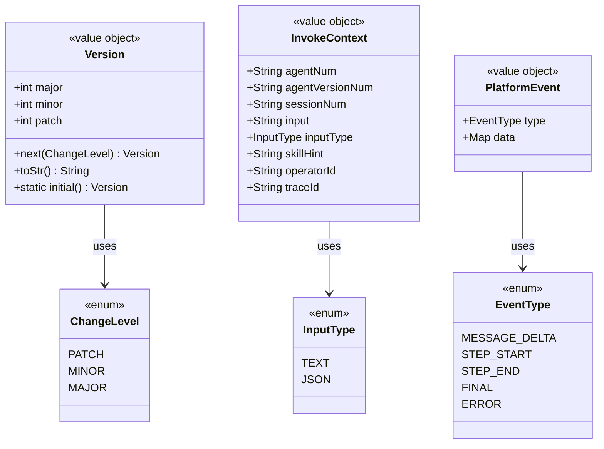
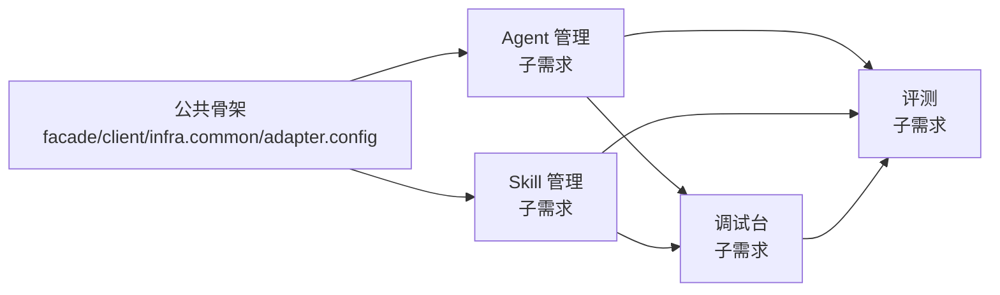

# AgentOps — S2 总体技术方案

> 文档日期：2026-05-11　|　版本：v1.0　|　覆盖周期：S2（2026-04 ~ 2026-07）
> 输入 PRD：[S2-PRD（聚合）](../产品方案/2026-05-11-AgentOps-S2-PRD.md) · [调试台](../产品方案/2026-05-11-调试台-PRD.md) · [Skill 管理](../产品方案/2026-05-11-Skill管理-PRD.md) · [Agent 管理](../产品方案/2026-05-11-Agent管理-PRD.md)
> 代码仓库：[rd-agent-ws](../代码仓库/rd-agent-ws/)（空仓库）
> 子需求方案：[Agent 管理](./2026-05-11_Agent管理-技术方案.md) · [Skill 管理](./2026-05-11_Skill管理-技术方案.md) · [调试台](./2026-05-11_调试台-技术方案.md) · [评测](./2026-05-11_评测-技术方案.md)

---

## 1. 目标与范围

### 1.1 目标

为AgentOps S2 周期（5 个核心模块：调试台 / Skill 评测 / Skill 管理 / Agent 管理 / Agent 评测）产出一份**面向六层 Java 架构落码**的技术方案总图，明确：

- 跨子需求的**统一技术决策**（包根、业务编号、鉴权、Result、错误码、时区、删除策略等）；
- 总体**架构与代码结构**（按层 × 领域映射 Maven 模块与包）；
- **公共契约**（invoke SSE 事件协议、Result 结构、Snowflake 业务号、登录态注入）；
- 子需求拆分与**实现顺序**。

### 1.2 范围

**本次包含**

- 4 份子需求方案的总览编排（Agent / Skill / 调试台 / 评测）
- 跨子需求公共代码结构、共享基础设施、跨层契约
- 部署、监控、分支命名等通用规范

**本次不做**（同 S2 PRD §2.3）

- 工作空间 / RBAC / SSO（单工作空间硬编码）
- MCP 管理 / 知识库管理
- 平台概览 Dashboard
- Agent 自动评测、编排画布

### 1.3 与使用者已对齐的关键决策

| # | 决策项 | 选用 |
| --- | --- | --- |
| 1 | Java 包根 | `ink.garry.rd` |
| 2 | 业务编号 num | 类型前缀(大写) + 时间戳：`AGT202507231517`、`SKL202507231517` |
| 3 | 删除策略 | **逻辑删除**（每张表带 `deleted` 字段） |
| 4 | DB 时间字段 | `TIMESTAMP(3)`，自动时区，`create_time` / `update_time` |
| 5 | 鉴权 | **Cookie + Header 注入**（Filter 从请求头 `X-User-Id` / `X-User-Name` 取，部门统一登录中间件已注入） |
| 6 | Result 结构 | `{ code, message, data, traceId }` |
| 7 | 评测重试 | 用例级重试最多 2 次，最终汇总 |
| 8 | 大文本字段 | 都存 DB JSON / MEDIUMTEXT（不走 OSS） |
| 9 | 文档拆解 | **总体 + 4 份领域子需求方案** |
| 10 | 测试 | 关键逻辑单测 + 集成测（Testcontainers） |
| 11 | 错误码 | 数字错误码（按领域分段） |
| 12 | 可观测 | 仅业务日志（公司 K8s log agent 采集） |

### 1.4 六层依赖关系（提纲）

```
adapter → application → domain
adapter → application → infra
infra   → domain
infra   → facade
domain  → facade
client  → 仅被 adapter / application 依赖
```

---

## 2. 架构设计（仅代码结构）

### 2.1 Maven 多模块树

```
rd-agent-ws/
├── pom.xml                             # 父 POM
├── rd-agent-ws-facade/                 # facade 层
├── rd-agent-ws-client/                 # client 层
├── rd-agent-ws-domain/                 # domain 层
├── rd-agent-ws-infra/                  # infra 层
├── rd-agent-ws-application/            # application 层
├── rd-agent-ws-adapter/                # adapter 层 (Spring Boot 启动)
└── rd-agent-ws-web/                    # 前端 Vite + React + TS
```

### 2.2 代码结构（层 × 领域 × 包 × 职责）

| 层 | 领域 | 包 | 职责 |
| --- | --- | --- | --- |
| facade | common | `ink.garry.rd.agent.ws.facade.common` | Result、CommonRequest、错误码常量、DomainEventPublisher 接口 |
| facade | agent | `ink.garry.rd.agent.ws.facade.agent` | AgentEntity（跨模块描述）、AgentDomainEventDTO、AgentEventPublisher |
| facade | skill | `ink.garry.rd.agent.ws.facade.skill` | SkillEntity、SkillDomainEventDTO、SkillEventPublisher |
| facade | session | `ink.garry.rd.agent.ws.facade.session` | SessionEntity、MessageEntity、InvocationTraceEntity |
| facade | evaluation | `ink.garry.rd.agent.ws.facade.evaluation` | EvaluationEntity、EvaluationCaseEntity、EvalDomainEventDTO |
| client | common | `ink.garry.rd.agent.ws.client.common` | Result\<T\>、PageVO、PageParam、统一错误码枚举 |
| client | agent | `ink.garry.rd.agent.ws.client.agent` | Agent\*Param、Agent\*VO、Invoke\*Param/Event |
| client | skill | `ink.garry.rd.agent.ws.client.skill` | Skill\*Param、Skill\*VO、SkillSyncResultVO |
| client | session | `ink.garry.rd.agent.ws.client.session` | SessionVO、MessageVO、StepChainVO |
| client | evaluation | `ink.garry.rd.agent.ws.client.evaluation` | Eval\*Param、Eval\*VO、ReportVO |
| domain | agent | `ink.garry.rd.agent.ws.domain.agent` | Agent 聚合根 + factory + gateway + repository + valueobject（含 5 种 Runner） |
| domain | skill | `ink.garry.rd.agent.ws.domain.skill` | Skill 聚合根 + 同上 |
| domain | session | `ink.garry.rd.agent.ws.domain.session` | Session 聚合根（含 Message 实体） |
| domain | evaluation | `ink.garry.rd.agent.ws.domain.evaluation` | Evaluation 聚合根（含 EvaluationCase 实体） |
| infra | persistence.agent | `ink.garry.rd.agent.ws.infra.persistence.agent` | AgentEntity（Lombok）、AgentMapper、AgentRepositoryImpl 等 |
| infra | persistence.skill | `ink.garry.rd.agent.ws.infra.persistence.skill` | SkillEntity、SkillMapper、SkillRepositoryImpl |
| infra | persistence.session | `ink.garry.rd.agent.ws.infra.persistence.session` | SessionEntity、MessageEntity、SessionRepositoryImpl |
| infra | persistence.evaluation | `ink.garry.rd.agent.ws.infra.persistence.evaluation` | EvaluationEntity、EvaluationCaseEntity、EvaluationRepositoryImpl |
| infra | llm | `ink.garry.rd.agent.ws.infra.llm` | 公司 LLM 代理 Client（OkHttp + EventSource）+ LlmGatewayImpl |
| infra | skillrepo | `ink.garry.rd.agent.ws.infra.skillrepo` | 公司 Skill 库 Client + SkillSyncGatewayImpl |
| infra | a2a | `ink.garry.rd.agent.ws.infra.a2a` | A2aAgentGatewayImpl + A2aProtocolAdapter（远端事件 → PlatformEvent） |
| infra | nacos | `ink.garry.rd.agent.ws.infra.nacos` | A2aNacosSubscriber（订阅 + 5min 兜底轮询）+ NacosAgentCardFetcher |
| infra | common | `ink.garry.rd.agent.ws.infra.common` | Snowflake、TraceContext、AES 加密工具、DomainEventPublisherImpl |
| application | agent | `ink.garry.rd.agent.ws.application.agent` | AgentCommandService、AgentQueryService、AgentVersionCommandService、AgentInvokeStreamService |
| application | skill | `ink.garry.rd.agent.ws.application.skill` | SkillCommandService、SkillQueryService、SkillVersionCommandService、SkillSyncCommandService |
| application | session | `ink.garry.rd.agent.ws.application.session` | SessionCommandService、SessionQueryService |
| application | evaluation | `ink.garry.rd.agent.ws.application.evaluation` | EvalCommandService、EvalQueryService、EvalWorker（@Async） |
| adapter | agent | `ink.garry.rd.agent.ws.adapter.agent` | AgentCommandController、AgentQueryController、AgentVersionController |
| adapter | skill | `ink.garry.rd.agent.ws.adapter.skill` | SkillCommandController、SkillQueryController、SkillVersionController |
| adapter | debugconsole | `ink.garry.rd.agent.ws.adapter.debugconsole` | DebugInvokeController（SSE）、SessionController |
| adapter | evaluation | `ink.garry.rd.agent.ws.adapter.evaluation` | EvalCommandController、EvalQueryController |
| adapter | config | `ink.garry.rd.agent.ws.adapter.config` | UserContextFilter（登录态注入）、GlobalExceptionHandler、AsyncConfig、SwaggerConfig |
| adapter | listener | `ink.garry.rd.agent.ws.adapter.listener` | DomainEvent 监听（如 AgentVersionPublishedListener） |

### 2.3 子需求文档对应关系

| 子需求 | 对应文档 | 主要领域 |
| --- | --- | --- |
| Agent 管理 | [2026-05-11_Agent管理-技术方案.md](./2026-05-11_Agent管理-技术方案.md) | agent + 2 种 Runner（CONFIG/A2A）+ 版本化（仅 CONFIG）+ A2A Nacos 订阅同步 |
| Skill 管理 | [2026-05-11_Skill管理-技术方案.md](./2026-05-11_Skill管理-技术方案.md) | skill + 公司库同步 + 版本化 + Schema diff |
| 调试台 | [2026-05-11_调试台-技术方案.md](./2026-05-11_调试台-技术方案.md) | session + invoke SSE + ThoughtChain |
| 评测 | [2026-05-11_评测-技术方案.md](./2026-05-11_评测-技术方案.md) | evaluation + LLM Judge + 异步 Worker |

> 总体方案聚焦"跨需求公共"内容；领域细节（聚合类图、表 DDL、Service 时序）在子需求方案。

---

## 3. 领域模型设计（公共约定）

> 各子需求方案有各自完整的"3.x.1 领域模型 / 3.x.2 领域规则 / 3.x.3 领域动作 / 3.x.4 领域事件"。本节仅列**跨领域的统一约定**。

### 3.1 业务层级划分

| 层级 | 业务领域 | 子需求方案 |
| --- | --- | --- |
| L1 资产层 | agent | [Agent 管理](./2026-05-11_Agent管理-技术方案.md) |
| L1 资产层 | skill | [Skill 管理](./2026-05-11_Skill管理-技术方案.md) |
| L2 运行层 | session | [调试台](./2026-05-11_调试台-技术方案.md) |
| L3 质量层 | evaluation | [评测](./2026-05-11_评测-技术方案.md) |

### 3.2 跨领域统一约束

- 每个**聚合根 / 实体**必须含基本属性：`id (Long)`、`num (String)`、`createNo (String)`、`updateNo (String)`、`deleted (Integer)`、`createTime (LocalDateTime)`、`updateTime (LocalDateTime)`；
- 每个聚合根必须含动作：`save(operatorId)` / `delete(operatorId)`；
- **所有领域动作的入参均必须包含 `operatorId`**；
- 跨聚合仅 **ID 引用**，不持有对象引用；跨聚合协作通过领域事件或 application 编排；
- **Version** 作为值对象（Semver），跨 Agent / Skill 复用；
- **InvokeContext** 作为值对象，跨 Agent Runner 与 Session 复用；
- **PlatformEvent**（含 5 类：`message.delta` / `step.start` / `step.end` / `final` / `error`）作为值对象，跨调试台 / 评测 reuse。

### 3.3 跨领域值对象（在 facade 与 domain.common 共享）



### 3.4 跨领域 Gateway 接口（统一在 facade 层定义）

| Gateway | 用途 | 实现位置 |
| --- | --- | --- |
| `LlmGateway` | 调用公司 LLM 代理（含流式） | `infra.llm.LlmGatewayImpl` |
| `SkillRepoGateway` | 同步公司 Skill 库 | `infra.skillrepo.SkillRepoGatewayImpl` |
| `A2aAgentGateway` | A2A 远端 Agent 调用（按 A2A 协议代理 invoke + 事件适配） | `infra.a2a.A2aAgentGatewayImpl` |
| `NacosAgentDiscoveryGateway` | 订阅 Nacos `a2a-agents` group + 拉取 Agent Card 元数据 | `infra.nacos.A2aNacosSubscriber + NacosAgentCardFetcher` |
| `DomainEventPublisher` | 发布领域事件 | `infra.common.DomainEventPublisherImpl`（基于 Spring `ApplicationEventPublisher`） |

### 3.5 跨领域领域事件清单（在 facade 中统一常量）

| 事件名常量 | 触发时机 | 载荷要点 |
| --- | --- | --- |
| `AGENT_VERSION_PUBLISHED` | Agent 新版本发布成功 | agentNum / versionNum / changeLevel / publishedBy |
| `AGENT_OFFLINED` | Agent 下线 | agentNum / versionNum |
| `SKILL_VERSION_PUBLISHED` | Skill 新版本发布成功 | skillNum / versionNum / breakingChange / publishedBy |
| `SKILL_DEPRECATED` | Skill 弃用 | skillNum |
| `SESSION_CREATED` | 新会话创建 | sessionNum / agentNum / agentVersionNum |
| `INVOCATION_FINISHED` | invoke 调用结束 | traceId / agentNum / status / latencyMs |
| `EVALUATION_FINISHED` | 评测任务完成 | evalNum / targetType / targetVersionNum / totalScore |

---

## 4. 应用层设计（公共部分）

> Service 方法清单与时序在子需求方案各自展开。本节仅列跨服务的公共约定。

### 4.1 业务模块划分

| application 模块 | 对应领域 | 子需求方案 |
| --- | --- | --- |
| `application.agent` | agent | Agent 管理 |
| `application.skill` | skill | Skill 管理 |
| `application.session` | session | 调试台 |
| `application.evaluation` | evaluation | 评测 |

### 4.2 公共服务 / 工具

| 公共项 | 位置 | 作用 |
| --- | --- | --- |
| `UserContext` | `infra.common.UserContext`（ThreadLocal） | 存放当前请求 operatorId / userName，从 Filter 注入 |
| `TraceContext` | `infra.common.TraceContext` | 生成 / 透传 traceId（Snowflake，遵循 W3C 风格） |
| `BizNumGenerator` | `infra.common.BizNumGenerator` | 生成业务编号 `<TYPE><yyyyMMddHHmm><seq4>`（如 `AGT2026051114301234`） |
| `JsonSchemaValidator` | `infra.common.JsonSchemaValidator` | 包装 networknt/json-schema-validator |
| `JsonSchemaDiffer` | `infra.common.JsonSchemaDiffer` | Skill 版本发布时的 schema 破坏性检测 |

### 4.3 事务边界约定

- **写操作**走 `CommandService`，方法上加 `@Transactional`；
- **读操作**走 `QueryService`，无事务（默认走主库读，S3 起评估读写分离）；
- **流式调用**走 `StreamService`（如 `AgentInvokeStreamService`），方法返回 `Flux<PlatformEvent>` 或 `SseEmitter`，**不参与事务**（流式过程中按事件 batch 异步落库）。

---

## 5. 控制器/Adapter 层设计（公共约定）

> Controller 接口清单与时序在子需求方案各自展开。本节仅列跨 Controller 的公共约定。

### 5.1 接口路径规范

```
/api/v1/<领域>/<command|query>/<动作>     # 业务接口
/api/v1/<领域>/<num>/<动作>                # 资源接口
```

- **HTTP 方法仅 GET（查询）/ POST（增删改）**；不使用 PUT / DELETE / PATCH；
- 所有接口入参 / 出参用 **JSON** 描述；
- 上传/下载除外（评测报告导出用 `application/octet-stream`）。

### 5.2 公共 Filter 与拦截器

| 组件 | 位置 | 作用 |
| --- | --- | --- |
| `UserContextFilter` | `adapter.config.UserContextFilter` | 从 `X-User-Id` / `X-User-Name` Header 取登录信息存入 ThreadLocal；空则返回 401 |
| `TraceContextFilter` | `adapter.config.TraceContextFilter` | 生成或继承 traceId（W3C `traceparent` 头），存入 MDC 与 ThreadLocal |
| `GlobalExceptionHandler` | `adapter.config.GlobalExceptionHandler` | 统一异常 → Result.fail(code, msg, traceId) |

### 5.3 统一错误码体系（数字编码）

| 码段 | 含义 | 示例 |
| --- | --- | --- |
| 0 | 成功 | 0 |
| 1xxx | 通用错误 | 1001 参数非法、1002 未登录、1003 无权限、1004 资源不存在、1005 资源冲突 |
| 2xxx | Agent 域 | 2001 Agent 不存在、2002 Agent 已下线、2003 创建方式不支持、2004 远端联通失败 |
| 3xxx | Skill 域 | 3001 Skill 不存在、3002 Skill 已弃用、3003 schema 校验失败、3004 schema 破坏性变更需 major |
| 4xxx | Session / Invoke | 4001 invoke 超时、4002 LLM 配额不足、4003 SSE 中断 |
| 5xxx | Evaluation | 5001 评测进行中、5002 用例生成失败、5003 Judge 失败 |
| 6xxx | Version 域 | 6001 草稿不存在、6002 已存在草稿（被锁）、6003 版本号冲突 |
| 9xxx | 系统错误 | 9001 系统繁忙、9002 第三方服务异常 |

### 5.4 Result JSON 结构

**成功响应**

```json
{
  "code": 0,
  "message": "success",
  "data": { /* 业务数据 */ },
  "traceId": "abc-123"
}
```

**失败响应**

```json
{
  "code": 3004,
  "message": "Skill schema 包含破坏性变更，必须选 major 发布",
  "data": null,
  "traceId": "abc-124"
}
```

---

## 6. 数据库设计（公共约定）

详细 DDL 在各子需求方案。本节列**全部公共约束**。

### 6.1 通用列约定（强制）

每张业务表必须包含：

| 列名 | 类型 | 约束 | 说明 |
| --- | --- | --- | --- |
| `id` | `BIGINT NOT NULL AUTO_INCREMENT` | 主键 | 物理主键 |
| `num` | `VARCHAR(64) NOT NULL` | 唯一索引 `uk_<table>_num` | 业务编号，`<TYPE><yyyyMMddHHmm><seq4>` |
| `create_no` | `VARCHAR(64) NOT NULL` | — | 创建人 userId |
| `update_no` | `VARCHAR(64) NOT NULL` | — | 最后更新人 userId |
| `deleted` | `TINYINT(1) NOT NULL DEFAULT 0` | 索引 | 0=正常，1=已删除（逻辑删除） |
| `create_time` | `TIMESTAMP(3) NOT NULL DEFAULT CURRENT_TIMESTAMP(3)` | — | 创建时间，毫秒 |
| `update_time` | `TIMESTAMP(3) NOT NULL DEFAULT CURRENT_TIMESTAMP(3) ON UPDATE CURRENT_TIMESTAMP(3)` | — | 更新时间，毫秒 |

> 时区策略：MySQL `time_zone='SYSTEM'`（K8s Pod 设 `Asia/Shanghai`），`TIMESTAMP(3)` 自动按 session 时区转换；Java 用 `LocalDateTime` 映射。

### 6.2 通用 DDL 模板

```sql
-- 任何业务表必须以此为基础
CREATE TABLE `tpl_xxx` (
  `id` BIGINT NOT NULL AUTO_INCREMENT COMMENT '主键',
  `num` VARCHAR(64) NOT NULL COMMENT '业务编号',
  -- 业务字段...
  `create_no` VARCHAR(64) NOT NULL COMMENT '创建人 userId',
  `update_no` VARCHAR(64) NOT NULL COMMENT '更新人 userId',
  `deleted` TINYINT(1) NOT NULL DEFAULT 0 COMMENT '逻辑删除：0=正常，1=已删除',
  `create_time` TIMESTAMP(3) NOT NULL DEFAULT CURRENT_TIMESTAMP(3) COMMENT '创建时间',
  `update_time` TIMESTAMP(3) NOT NULL DEFAULT CURRENT_TIMESTAMP(3) ON UPDATE CURRENT_TIMESTAMP(3) COMMENT '更新时间',
  PRIMARY KEY (`id`),
  UNIQUE KEY `uk_xxx_num` (`num`),
  KEY `idx_deleted` (`deleted`)
) ENGINE=InnoDB DEFAULT CHARSET=utf8mb4 COMMENT='示例表';
```

### 6.3 表清单总览

| 表名 | 子需求方案 | 用途 |
| --- | --- | --- |
| `agent` | Agent | Agent 元信息 + 当前在线版本指针 |
| `agent_version` | Agent | Agent 版本快照（不可变） |
| `agent_draft` | Agent | Agent 草稿（同 agent 仅 1 行） |
| `skill` | Skill | Skill 元信息 |
| `skill_version` | Skill | Skill 版本快照 |
| `skill_draft` | Skill | Skill 草稿 |
| `session` | 调试台 | 调试 / 外部调用会话 |
| `message` | 调试台 | 会话内消息（含 step_chain JSON） |
| `invocation_trace` | 调试台 | invoke 调用审计 |
| `evaluation` | 评测 | 评测任务 |
| `evaluation_case` | 评测 | 评测用例与判分结果 |
| `eval_seed` | 评测 | 人工种子用例库 |

---

## 7. 模块变更清单（总览）

> 子需求方案各自给出更细的"领域 → 包 → 文件"级清单。本节为跨子需求的**公共变更**。

| 层 | 公共变更项 | 对应 Skill |
| --- | --- | --- |
| facade | `Result<T>`、`PageVO`、`CommonRequest` 基类、`DomainEventPublisher` 接口、`*EventDTO`、`DomainEventConstant` 跨域常量、`Version` / `ChangeLevel` / `InputType` / `EventType` / `PlatformEvent` 共享值对象 | **impl-facade-module** |
| client | `Result<T>` 实现、`PageParam`、统一错误码 `BizCode` 枚举、`InvokeRequest` / `InvokeEventVO` / `StepChainVO` 共享 | **impl-client-module** |
| domain | `domain.common`：`UserContext`（ThreadLocal 接口）、`Operator` 值对象 | **impl-domain-module** |
| infra | `infra.common`：`Snowflake`、`BizNumGenerator`、`TraceContext`、`UserContextHolder`、`AesCryptor`、`JsonSchemaValidator`、`JsonSchemaDiffer`、`DomainEventPublisherImpl` | **impl-infra-module** |
| application | 公共：`@Async("evaluationExecutor")` 配置、`StreamHelper`（PlatformEvent → SseEmitter event 适配） | **impl-application-module** |
| adapter | `UserContextFilter`、`TraceContextFilter`、`GlobalExceptionHandler`、`AsyncConfig`、`WebMvcConfig`（CORS）、`SwaggerConfig`、`AgentWsApplication` 启动类 | **impl-adapter-module** |

---

## 8. 代码分支命名

S2 周期对应 4 + 1 = **5 个分支**（总体不单独建分支，作为公共骨架并入 Agent/Skill/调试台 任一首发分支）：

| 子需求 | 分支名 | 说明 |
| --- | --- | --- |
| Agent 管理 | `feature-20260511-agent-management` | 含公共骨架（facade/client/infra.common/adapter.config） |
| Skill 管理 | `feature-20260511-skill-management` | 依赖 Agent 分支合并后再开 |
| 调试台 | `feature-20260511-debug-console` | 依赖 Agent + Skill |
| 评测 | `feature-20260511-evaluation` | 依赖以上全部 |

> **本总体方案对应分支**：`feature-20260511-agent-management`（首发分支携带公共骨架）。

---

## 9. 实现顺序与依赖

### 9.1 跨子需求的实现顺序



### 9.2 跨层实现顺序（每个子需求内）

按 skill 规范严格走：**facade → client → domain → infra → application → adapter**。

### 9.3 与 PRD 里程碑对齐

| 里程碑 | 时间 | 主要交付 |
| --- | --- | --- |
| **M1** 演示就绪 | 2026-06-08 | 公共骨架 + 调试台 mock + Skill CRUD（无版本化） + Skill 人工调试评测 |
| **M2** 集成就绪 | 2026-07-06 | Agent 配置模式 GA + 真实 LLM + 版本化机制 + Schema diff + 自动评测 + 公司库同步 |
| **M3** S2 收尾 | 2026-07-31 | A2A Nacos 订阅同步 + 版本历史/对比/回滚 + Agent 人工评测 + 跨版本评测对比 |

---

## 10. 接口与数据契约（公共部分）

### 10.1 invoke 请求体 JSON（与调试台 / 评测 reuse）

**请求** `POST /api/v1/agent/{num}/invoke`

```json
{
  "input": "用户输入文本 或 JSON 对象",
  "input_type": "text",
  "skill_hint": "SKL202507231517",
  "session_num": "SES202507231517"
}
```

**响应** `text/event-stream`

```
event: message.delta
data: {"content":"我帮你","index":0}

event: step.start
data: {"step_id":"s1","skill_name":"jira-summary","input":{...},"started_at":"2026-05-11T14:00:00.000+08:00"}

event: step.end
data: {"step_id":"s1","output":{...},"status":"success","latency_ms":120}

event: final
data: {"session_num":"SES...","trace_id":"abc-123","total_tokens":350,"total_latency_ms":2030}
```

### 10.2 Result 标准结构

详见 §5.4。

### 10.3 业务编号 num 规范

| 类型前缀 | 含义 | 示例 |
| --- | --- | --- |
| `AGT` | Agent | `AGT202507231517` |
| `AVN` | Agent 版本 | `AVN202507231517` |
| `SKL` | Skill | `SKL202507231517` |
| `SVN` | Skill 版本 | `SVN202507231517` |
| `SES` | Session | `SES202507231517` |
| `MSG` | Message | `MSG202507231517` |
| `EVL` | Evaluation | `EVL202507231517` |
| `EVC` | Eval Case | `EVC202507231517` |
| `TRC` | Trace | `TRC202507231517` |

> 生成规则：`<前缀><yyyyMMddHHmm><snowflake_seq4>`，14 位字符串。
> 同一分钟同类资源最多 9999 条，足够 S2 业务量。

---

## 11. 其他

### 11.1 技术栈选型（重要决策）

| 类别 | 选用 | 理由 |
| --- | --- | --- |
| JDK | 17 LTS | 部门主流 |
| 框架 | Spring Boot 3.2 | 主流默认 |
| Web 栈 | Spring MVC + SseEmitter + Spring WebSocket | 长连接 < 100，MVC 简单 |
| DB | MySQL 8.0 | 部门主流 |
| ORM | MyBatis 3.5 + MyBatis-Plus 3.5 | 部门规约 |
| 缓存/锁 | Redis 7 + Redisson | 草稿冲突检测用分布式锁 |
| ID 生成 | Snowflake（业务号前缀+时间戳） | 短、有序、可读 |
| JSON | Jackson | Spring 默认 |
| JSON Schema | networknt/json-schema-validator | 维护活跃 + 2020-12 spec |
| JSON Diff | java-json-tools/json-patch | RFC 6902 |
| 异步任务 | Spring `@Async` + ThreadPoolTaskExecutor | M2 评测 QPS 低 |
| LLM 客户端 | OkHttp + EventSource | 公司代理 SDK |
| 加密 | AES-GCM + 公司 KMS | 接入式 Agent 凭证存储 |
| 测试 | JUnit 5 + Mockito + Testcontainers | 关键逻辑单测 + DB/Redis 集成测 |
| 构建 | Maven 3.9 | 部门主流 |
| 前端 | Vite + React 18 + TS + `@ant-design/pro-components` + `@ant-design/x` | 启动快、纯 React 心智、无 Umi 运行时绑定；Pro 组件 + AntD X 与 demo 对齐 |

### 11.1.1 前端菜单结构（2026-05-12 锁定）

顶部双层导航，**3 个一级 tab × 2 个二级**，与后端领域映射如下：

| 一级 tab | 二级菜单 | 前端路径 | 后端领域（子需求） |
| --- | --- | --- | --- |
| 智能体中心 | 智能体管理 | `/agent/manage` | `agent`（Agent 管理） |
| | 智能体调试 | `/agent/debug` | `session` + 复用 `agent.invoke`（调试台） |
| Skill Hub | Skill 管理 | `/skill/manage` | `skill`（Skill 管理） |
| | Skill 评测 | `/skill/evaluation` | `evaluation`（评测） |
| Prompt 中心 | （v0.2 占位） | `/prompt` | — |

> 前端菜单与后端 4 个领域子需求 1:1 + Prompt 占位；详细页面与组件见 [`rd-agent-fe/AGENTS.md`](../代码仓库/rd-agent-fe/AGENTS.md)。

### 11.2 部署形态

- **单 Service Docker** + 公司 K8s 部署
- M2 起 2 副本（高可用），SSE 走 sticky session
- Nginx 反代：`proxy_read_timeout 600s`、WebSocket Upgrade、SSE buffering off
- 配置：Apollo / Nacos（按公司基础设施）
- DB：1 主 1 从（评测查询走从库）
- Redis：单实例（M2）→ 哨兵（S3）

### 11.3 日志规范

- **业务日志**写 `INFO`，关键字段：`traceId` / `userId` / `agentNum` / `skillNum` / `sessionNum` / `status`
- **错误日志**写 `ERROR`，含完整堆栈
- 公司 K8s log agent 自动采集 stdout，无需额外接入
- MDC 自动注入 `traceId` / `userId`

### 11.4 关键非功能要求

| 项 | 要求 |
| --- | --- |
| 列表首屏 | ≤ 1.5s |
| 详情页 | ≤ 2s |
| `invoke` P95 | ≤ 5s；首 token ≤ 1.5s |
| `step.end` 端到端延迟 | ≤ 200ms |
| 单 Agent QPS | 10（创建表单可调） |
| 单步骤入/出参 | ≤ 256 KB（超出截断 + `truncated:true` 标记） |
| 评测自动并发 | 默认 5，上限 20 |
| 鉴权 | Cookie + Header 注入 |
| 凭证存储 | AES-GCM + KMS master key |
| 版本数量 | 每实体最近 50 个，更早归档 |

### 11.5 测试策略

- **关键逻辑单测**（覆盖率目标 ≥ 70%）：`Version.next()`、`JsonSchemaDiffer`、5 种 `AgentRunner`、`BizNumGenerator`、`Evaluation` 状态机
- **集成测试**（Testcontainers MySQL + Redis）：发布流程的事务原子性、草稿冲突检测、评测 Worker 完整链路
- **mock 强契约**：M1 mock SSE 必须按真实事件协议回放，M2 联调时直接换 endpoint 即可

### 11.7 前端鉴权 + 全屏路由（2026-05-12 同步 Figma `73:2` `73:4`）

> 详见 [S2 PRD §3.3](../产品方案/2026-05-11-AgentOps-S2-PRD.md#33-登录与错误页2026-05-12-同步-figma-732-734) 与 [wireframes/B6-登录与错误/](../产品方案/wireframes/B6-登录与错误/)。

| 模块 | 技术点 |
| --- | --- |
| AuthProvider | 启动拉 `/api/v1/auth/me`，失败 currentUser=undefined；本期 mock 默认返回 admin |
| 登录页 `/login` | 全屏布局（bypass ProLayout）；浅灰底 + 480 居中卡片 + 56×56 logo + GT 登录按钮（href 跳 `/api/v1/auth/me` 让 AuthProvider 重新拉，真实环境改 `/sso/login?from=...`）；已登录自动 redirect |
| 错误页 `/403` `/404` `/500` | 全屏布局；`<ErrorPage code>` 单组件 3 配置；圆形错误码 + 标题 + 说明 + 主按钮 + 文字链 |
| 路由通配符 | `<Route path="*">` → 渲染 `<ErrorPage code="404" />`（不再 redirect 到列表） |
| 全屏路径检测 | `App.tsx` 加 `FULLSCREEN_PATHS = ['/login', '/403', '/404', '/500']`，`useLocation` 命中则提前 return 独立 `<Routes>` |
| 401/403/5xx 拦截（M2） | `axios` interceptor：401 → 跳 `/login?from={current}`；403 → 跳 `/403`；5xx → 跳 `/500`（M2 启用，M1 由各页面用 message.error 兜底） |

### 11.6 待对齐项 / 进 S3

- 工作空间 / RBAC / SSO 接入
- MCP / 知识库管理
- 平台概览 Dashboard
- Agent 自动评测、编排画布
- WebFlux 改造（SSE > 500 后启动）
- 评测迁 MQ
- Agent 挂载子 Agent / Skill 时锁定版本

---

## 附：关联文档

- [S2 PRD（聚合）](../产品方案/2026-05-11-AgentOps-S2-PRD.md)
- [Agent 管理 PRD](../产品方案/2026-05-11-Agent管理-PRD.md)
- [Skill 管理 PRD](../产品方案/2026-05-11-Skill管理-PRD.md)
- [调试台 PRD](../产品方案/2026-05-11-调试台-PRD.md)
- [S2 规划](../总体规划/2026-05-11-AgentOps-S2规划.md)
- [总体规划](../总体规划/2026-05-11-AgentOps-总体规划.md)
- [代码仓库 rd-agent-ws](../代码仓库/rd-agent-ws/)
