# Skill 管理 — 技术方案

> 文档日期：2026-05-11　|　版本：v2.11　|　覆盖周期：S2（2026-04 ~ 2026-07）
> 上游 PRD：[Skill 管理 PRD](../产品方案/2026-05-11-Skill管理-PRD.md)
> 总体方案：[2026-05-11_S2总体-技术方案.md](./2026-05-11_S2总体-技术方案.md)

> **v2.11 变更摘要（2026-06-01）**：COMPANY 守卫下沉到领域 + MyBatis-Plus 全局逻辑删除 + adapter 落地 ——
> - **COMPANY 只读守卫下沉**：`SkillCompanyReadOnlyGuard` 应用层 Bean 删除；规则作为领域不变量内嵌到聚合 ——
>   - 新增 `Skill.assertWritableByLocal()`：source=COMPANY 时抛 `BusinessException(1003)`
>   - `Skill.publish` / `Skill.rollbackToVersion` / `Skill.unpublish` 在六步顺序的"规则校验"阶段内部调用该断言
>   - 应用层 `updateSkill` / `discardDraft`（setter+save 链）在修改字段前显式调一次以提前拦截
>   - `delete` 路径仍不做守卫（业务上 COMPANY 副本可由 admin 清理）
>   - 历史脉络：v2.2 从聚合上移到应用层 → v2.11 回归聚合（DDD 原则：不变量属于领域）
> - **MyBatis-Plus 全局逻辑删除**：`application.yml` 已配 `logic-delete-field: deleted` + 0/1；删除 SkillRepositoryImpl / SkillVersionRepositoryImpl / SkillQueryService 共 8 处冗余 `.eq(...::getDeleted, 0)`；MP 自动在 select 追加 `WHERE deleted=0`、把 `mapper.delete(wrapper)` 转 `UPDATE SET deleted=1`
> - **Mapper 收敛**：删除 SkillMapper / SkillVersionMapper 上所有自定义 `@Select`（selectByOwnerAndName / pageQuery / existsByVersion / findBySkillNumAndVersion / listBySkillNumOrderByCreateTimeDesc 共 5 个方法）；所有查询走 `LambdaQueryWrapper` 在 Service 内构造（v2.10 收口的进一步落实）
> - **adapter/skill 落地**：固定 2 个 Controller —— `SkillCommandController`（`/api/v1/skill/command/*` 7 接口）+ `SkillQueryController`（`/api/v1/skill/query/*` 5 接口）+ `assembler/SkillVoAssembler`（Vo ↔ DTO 双向转换）；删除 v2.0 残留的 3 个旧 Controller（SkillQueryController 旧版 / SkillVersionController / SkillSyncController）
> - **client/skill/vo 落地**：10 个 Vo 类（SkillCreateParam / SkillUpdateParam / SkillPageQueryParam / SkillPublishParam / SkillRollbackParam / SkillVo / SkillDetailVo / SkillVersionVo / SkillVersionDetailVo / VersionDiffVo，含静态内部 TagsDiff）；application 层禁引 vo，adapter 层禁引 dto 之外的 application 类型，由 SkillVoAssembler 统一桥接
> - **operatorId 获取**：Controller 继承 `BaseController.getCurrentUserId()`，从 UserContextFilter 注入的请求级 ThreadLocal 取；前端不传 ownerUserId
>
> **v2.10 变更摘要（2026-06-01）**：infra + application 落地 + 文件存储暂不实现 ——
> - **infra/skill 重写完成**：固定 4 子包 `entity / mapper / repository / gateway`；旧 v2.0 残留（SkillNumGatewayImpl / SkillMdParserGatewayImpl / SkillFileStorageGatewayImpl / SkillReadGatewayImpl / SkillVersionReadGatewayImpl / SkillFileValidatorImpl / SkillFactoryImpl / SkillVersionFactoryImpl / factory 子包整体）全部清除
> - **application/skill 落地**：`SkillCommandService`（7 方法：createSkill / updateSkill / discardDraft / publish / rollbackToVersion / unpublish / delete）+ `SkillQueryService`（5 方法：pageList / detail / versionList / versionDetail / compareVersions）+ `SkillCompanyReadOnlyGuard`；DI 一律 `@Resource` 字段注入；写方法标 `@Transactional`；publish 流程编排"factory.buildSkillVersion → version.save → version.publish → skill.publish"四步链
> - **client/skill 拆 dto 子包**：v2.10 起 application 用 `client.skill.dto.*`（SkillCreateParamDTO / SkillUpdateParamDTO / SkillPageQueryParamDTO / SkillPublishParamDTO / SkillRollbackParamDTO / SkillDTO / SkillDetailDTO / SkillVersionDTO / SkillVersionDetailDTO / VersionDiffDTO）；vo 子包（给 adapter 用）待 `/impl-adapter-module` 时再建
> - **SkillFileStorage 暂不实现**：v2.5~v2.6 规划的 `SkillFileStorage` infra `@Component` v2.10 起<b>不再创建</b>；SKILL.md 上传 / 下载 / 删除能力延期。当前阶段应用层暂不处理文件流，{@code skill_file_key} 字段保留但由 application 层在调用前设置占位值或留待 FE 走预签名直传（复用 {@code infra/common/client/terra/OssClient.uploadPresign}）
> - **`SkillFactoryImpl` 不存在**：v2.9 起 domain {@code SkillFactory} 本身是 `@Component` 类（不是接口），infra 无对应 Impl
> - **DDL V9 迁移**：新增 `V9__skill_v2_5_to_v2_9_schema_collapse.sql`；skill 表删 `skill_file_type` / `source_version`，status 默认 DRAFT，重新加回 `current_version_num`；skill_version 表删 10 列、`version_num` → `version`、新增 `name` / `description` / `tags` / `skill_file_key` / `status`、新增 `idx_skill_create_time`、删 `idx_skill_current` / `idx_published_at`
> - **DI 风格**：infra/skill + application/skill 所有 Bean 一律 `@Resource` 字段注入
> - **CQRS 约束**：`SkillCommandService` 不直接注入或调用任何 Mapper；所有非命令式读查询（name 唯一性 / 版本号唯一性 / 当前版本字段加载等）一律通过 `SkillQueryService` 提供的方法间接读取。`SkillQueryService` v2.10 为此新增 `existsByOwnerAndName(ownerUserId, name)` 与 `existsByVersion(skillNum, version)` 两个工具方法
>
> **v2.9 变更摘要（2026-06-01）**：SkillFactory 方法收敛为固定 4 个 ——
> - **`SkillFactory` 固定 4 方法**：`buildSkill` / `buildSkillByNum` / `buildSkillVersion` / `buildSkillVersionByNum`；命名由 `createXxx` 统一改为 `buildXxx`
> - **`buildSkill` 入参展平**：`(name, description, tags, skillFileKey, source, ownerUserId)` 6 个必要字段；`source` 由原先工厂内硬编码 SELF 改为入参（为后续公司库 Skill 接入预留），`status` 仍由工厂内置 DRAFT
> - **`buildSkillVersion` 入参展平**：`(skillNum, version, name, description, tags, skillFileKey)` 6 个必要字段；不再接收完整 `Skill` 对象，由 application 层在调用前从 Skill 中提取
> - **新增 `buildSkillVersionByNum`**：按业务编号加载 SkillVersion 并装配依赖；与 `buildSkillByNum` 对称
> - **status 兜底位置**：`buildSkill` 内显式置 `DRAFT`；`buildSkillVersion` 不设，由 `SkillVersion.save` 兜底 `DRAFT`（v2.8）
>
> **v2.8 变更摘要（2026-06-01）**：SkillVersion 状态默认值与事件完备化 ——
> - **`SkillVersion.save` 默认 DRAFT**：v2.7 默认 PUBLISHED 改为 `DRAFT`（与"save 是创建草稿、publish 才上线"的状态机直觉一致）；`SkillFactory.createInitialVersion` 同步去掉显式 `setStatus(PUBLISHED)`
> - **`SkillVersion.save` 发送 `SKILL_VERSION_SAVED` 事件**：与 `Skill.save → SKILL_SAVED` 风格对齐，每次 save 必发（禁止 wasNew 式判断）
> - **`SkillVersion.delete` 发送 `SKILL_VERSION_DELETED` 事件**：补齐 delete 路径事件
> - **App 层 publish 流程多一步**：v2.8 流程改为 `factory.createInitialVersion → version.save (DRAFT) → version.publish (DRAFT→PUBLISHED) → skill.publish`；v2.7 的"factory 直接置 PUBLISHED → save 即上线"简写下线
>
> **v2.7 变更摘要（2026-06-01）**：聚合纯化 + SkillVersion 增加状态 ——
> - **Skill 聚合纯化**：`Skill.publish(version, operatorId)` 返回值改 **void**；`Skill.publish` 与 `Skill.rollbackToVersion` 只更新 Skill 自身的 `currentVersionNum` + `status`，**完全不再读 / 写 `SkillVersion`**；SkillVersion 行的创建由 application 层（{@code SkillCommandService.publish}）通过 `SkillFactory.createInitialVersion` 在同事务内编排
> - **Skill 移除 `PublisherAware` 接口**：事件发布器统一由 `SkillFactory` 在 createSelfSkill / createByNum 时通过 setter 装配，application 层不再需要 `instanceof PublisherAware` 分支
> - **Skill 依赖收敛**：删除 Skill 聚合的 `SkillVersionRepository` / `SkillVersionGateway` 两个依赖（不再用到）；只保留 `SkillRepository` / `SkillGateway` / `DomainEventPublisher`
> - **SkillVersion 新增 `status` 字段**：复用 {@code SkillStatus} 枚举（值 `DRAFT / PUBLISHED / DEPRECATED` 即"草稿 / 已发布 / 已下架"完全一致）；`SkillVersion.save` 默认置 `PUBLISHED`（版本通常于发布事务内创建即上线）
> - **SkillVersion 新增 `publish` / `unpublish` 两个领域方法**：`publish` 把单个 SkillVersion 行的 status 由 DRAFT 切到 PUBLISHED（发 `SKILL_VERSION_ACTIVATED` 事件）；`unpublish` 由 PUBLISHED 切到 DEPRECATED（发 `SKILL_VERSION_DEPRECATED` 事件）；用于平台运维对单个历史版本做"上线 / 下架"操作，不影响 `Skill` 聚合本身的状态机
> - **`SkillVersionGateway` 进一步收敛**：原 `existsByVersion` / `findBySkillNumAndVersion` 不再被聚合调用，相应校验改由 application 层经 MyBatis Mapper 完成；Gateway 现仅保留 `generateSkillVersionNum()`
> - **`rollbackToVersion` 后置状态**：从 v2.5 的 `DRAFT` 改为 `PUBLISHED`（回滚等同于"指针指向另一个已发布版本"；如需基于回滚再编辑，走常规 `update` 流程置 DRAFT）
> - **DDL（破坏性）**：`skill_version` 表新增 `status VARCHAR(16) NOT NULL DEFAULT 'PUBLISHED'` 列
>
> **v2.6 变更摘要（2026-06-01）**：网关职责收敛 + DI 风格统一 ——
> - **`SkillGateway` 职责收敛**：网关只为<b>领域对象</b>提供工具服务（业务编码生成、领域规则执行所需的 DB 辅助）。`SkillGateway` 仅保留 `generateSkillNum()`；原 `existsByOwnerAndName` / `pageQuery` 不属于"领域对象工具"，移除（应用层在 `createSkill` 流程内调 MyBatis Mapper 做唯一性校验，`SkillQueryService.pageList` 直接调 Mapper）
> - **`SkillVersionGateway` 职责收敛**：保留 `generateSkillVersionNum()`（编号生成）、`existsByVersion()`（{@code Skill.publish} 版本号唯一性预检，领域规则 DB 辅助）、`findBySkillNumAndVersion()`（{@code Skill.rollbackToVersion} 加载目标版本，领域规则 DB 辅助）；移除 `listBySkillNum()`（版本历史查询是应用层只读场景，由 `SkillQueryService.versionList` 调 MyBatis Mapper）
> - **`SkillFactory` 改为 `@Component`**：domain 层 `SkillFactory` 标注 `@Component` 受 Spring 管理；依赖统一通过 `jakarta.annotation.Resource`（即 `@Resource`）字段注入；domain pom 因此新增 `spring-context` + `jakarta.annotation-api` 两个依赖
> - **DI 风格统一**：项目所有 Bean 注入一律用 `@Resource`（不用 `@Autowired` 或构造函数注入）
> - **v2.5 已声明在 gateway 的 `pageQuery` / `listBySkillNum` 等读查询**：归口到 application 层经 MyBatis Mapper 直查，不再走 domain Gateway 抽象
>
> **v2.5 变更摘要（2026-06-01）**：网关收敛 + 公司库同步暂不实现 ——
> - **domain 层 / skill.gateway**：仅保留 `SkillGateway` 和 `SkillVersionGateway` 两个**读查询**接口（承接 Repository 三件套之外的非命令式查询，如 `existsByOwnerAndName` / `existsByVersion` / `listBySkillNum`）；删除 `SkillRepoGateway` / `SkillMdParserGateway` / `SkillFileStorageGateway` / `SkillEventPublisher` 四个旧 Gateway 接口
> - **公司库同步功能**：暂不实现 —— 删除 `/command/sync` 接口、`SkillCommandService.syncFromCompanyRepo` 方法、`SyncResultDTO` / `SyncResultVo`、§3.2.3 同步时序、相关风险与日志条目；`Skill.source = COMPANY` 的代码路径暂时悬空（保留枚举值以备后续接入）
> - **MD 自动解析下线**：`description` 改为始终用户必填，不再由 `SkillMdParser` 自动从 SKILL.md 抽取
> - **文件存储**：`SkillFileStorage` 作为 infra `@Component`（不是 domain Gateway 抽象）直接被应用层 `@Autowired` 注入；放在 `infra.skill.gateway` 包内
> - **领域事件发布**：改用 Spring 自带的 `ApplicationEventPublisher`，不再自建 `SkillEventPublisher` 接口
>
> **v2.4 变更摘要（2026-06-01）**：client 层细化 dto / vo 边界 ——
> - **client 层 / skill 包**：固定为 `dto` 和 `vo` 两个子包；`dto/` 只给 application 用（入参 `XxxParamDTO`，返回 `XxxDTO`），`vo/` 只给 adapter 用（入参 `XxxParam`，返回 `XxxVo`）；**应用层禁止引用 `vo/` 下任何类**
> - **命名规约**：dto 内入参一律 `XxxParamDTO`、返回 `XxxDTO`；vo 内入参 `XxxParam`、返回 `XxxVo`；中间过程类以静态内部类形式定义在所属 Param/返回类内部，不再单独建文件
> - **adapter 强制做 Vo ↔ DTO 转换**：Controller 接收 `XxxParam` → 转 `XxxParamDTO` 调 Service → 拿 `Result<XxxDTO>` → 转 `Result<XxxVo>` 返回前端；放在 `adapter.skill.assembler.SkillVoAssembler`
> - **API 行为零变更**：Java 类型重命名 + 拆包，但 JSON 字段结构、HTTP 路径、状态码、响应包络都不变；不影响联调
>
> **v2.3 变更摘要（2026-06-01）**：架构分层收敛 ——
> - **facade 层**：移除 `facade.skill` 包；原 `SkillDomainEventDTO` 移到 `domain.skill.dto`、`SkillEventPublisher` 接口移到 `domain.skill.gateway`；`DomainEventConstant.SKILL_VERSION_PUBLISHED` 仍在 facade 根（跨模块共享常量）
> - **domain 层 / skill 包**：固定为 `dto / factory / gateway / repository / valueobject` 五个子包；`factory.SkillFactory` 改为类（不是接口）
> - **infra 层 / skill 包**：固定为 `entity / gateway / mapper / repository` 四个子包
> - **application 层**：每个聚合根固定 2 个 Service —— `SkillCommandService` + `SkillQueryService`；原 `SkillVersionCommandService` / `SkillSyncCommandService` 全部并入 `SkillCommandService`
> - **adapter 层**：每个聚合根固定 2 个 Controller —— `SkillCommandController` + `SkillQueryController`；路径前缀收敛为 `/api/v1/skill/command/*` 和 `/api/v1/skill/query/*`（原 `/version/*` 与 `/sync/*` 按读写归并）
>
> **v2.2 变更摘要（2026-06-01）**：进一步收敛聚合行为 ——
> - **Skill 聚合根**：只保留 `save / publish / delete / rollbackToVersion / unpublish(下架)` 五个领域方法；删除 `discardDraft` / `syncFromCompanyRepo` / `assertWritableByLocal`（同步逻辑改到应用层用 Factory + Repo 编排；COMPANY 只读守卫上移到应用层）
> - **SkillVersion**：`version` 字段改 `String`（合并掉 `versionNum`，整个 `Version` VO 也不再用）；删除 `changeLevel` / `skillFileHash` / `changeNote` / `publishedBy` / `publishedAt` / `current` 六个字段；新增 `name`；方法只剩 `save / delete`（`current` 字段消失，`markCurrent` / `unmarkCurrent` 同步删除，当前在线版本改靠 `Skill.currentVersionNum` 直查）
> - **DDL**：`skill_version` 表 `version_num` → `version`，新增 `name`，删 `change_level` / `change_note` / `skill_file_hash` / `published_by` / `published_at` / `current_flag` / `semver_*`
> - **下架 (unpublish)**：复用 `SkillStatus.DEPRECATED`，方法名改为 `unpublish` 以贴近用户语义
>
> **v2.1 变更摘要（2026-06-01）**：领域模型进一步收敛 ——
> - **领域模型**（§3.2）：删除 `SkillDraft` 实体（草稿态合并到 `Skill.status=DRAFT`）+ `SkillSnapshot` 值对象（版本字段平铺到 `SkillVersion`）+ `SkillFileType` 枚举（SKILL 文件统一 `.md`，不再支持 zip）+ `skillId` / `skillFileType` / `sourceVersion` 三个字段；`Skill` 聚合根删除 `saveDraft` / `deprecate` 两个领域动作；`SkillStatus` 枚举 `DRAFT_ONLY` → `DRAFT`
> - **DDL**（§6.2）：`skill` 表删 `skill_id` / `skill_file_type` / `source_version` 三列 + `uk_skill_skill_id` 索引；`status` 默认值 `DRAFT_ONLY` → `DRAFT`；`skill_version` 表 `snapshot` JSON 拆为平铺列（`description` / `tags` / `skill_file_key` / `skill_file_hash`）；**整张 `skill_draft` 表删除**
> - **应用 + 适配层**：`/saveDraft` 重命名为 `/update`（编辑即写主表 + status=DRAFT）；`/deprecate` / `/forkAsSelf` / `/previewSchemaCheck` 接口下线；`discardDraft` 语义改为"用 currentVersion 覆盖回滚"；`/create` 入参去掉 `skillId`，`skillFile` 仅接受 `.md`
> - **事件**：`SKILL_DEPRECATED` 删除（无 deprecate 动作）
>
> **v2.0 变更摘要（2026-05-18）**：Skill 形态由 JSON Schema 工具切换到 SKILL.md 文档模式（对齐 PRD v2.0）：
> - **领域模型**（§3.2）：
>   - `Skill` 聚合根新增 `skillId: String`（slug 风格用户输入，正则 `^[a-z0-9-]{1,128}$`）+ `tags: List<String>` + `skillFileKey: String`（对象存储 key）+ `skillFileType: SkillFileType`（ZIP / MD 二选一）
>   - 删除 `SkillCategory` 枚举；`SkillSnapshot` 重构：去掉 `inputSchema / outputSchema / implEndpoint`，保留 `description / tags / skillFileKey / skillFileType / skillFileHash`
>   - 删除 `SchemaBreakingResult / SchemaBreakingChange / JsonSchemaDiffer` 三组件 + `SkillVersion.breakingChange` 字段（SKILL.md 模式不做结构化 schema diff）
>   - 旧 `remark` 字段重命名为 `changeNote`
> - **DDL（破坏性）**（§6.2）：
>   - `skill` 表加 `skill_id VARCHAR(128) NOT NULL`（唯一约束 `uk_skill_skill_id`）+ `tags JSON` + `skill_file_key VARCHAR(256)` + `skill_file_type VARCHAR(8)`；删除 `category` 列；`source` 枚举 `SELF / COMPANY_SYNC` → `SELF / COMPANY`
>   - `skill_version` 表 `snapshot` JSON 结构变更（含 skillFileKey + skillFileType + skillFileHash，不再含 schema）；`remark` 列重命名为 `change_note`；删除 `breaking_change` 列
> - **应用层 + 适配层**：
>   - `SkillCreateParam` / `SkillDraftParam` 入参字段全量替换；新增 `skillId` 正则校验 + `versionNum` 唯一性应用层兜底校验
>   - `/api/v1/skill/command/create` 改为 `multipart/form-data`（必传 `skillFile`，扩展名限 `.zip` / `.md`）；后端按文件类型分支：`.md` 直接解析；`.zip` 解压做安全校验（根目录有 SKILL.md / 总大小 ≤10 MB / 单文件 ≤2 MB / 拒绝 `..` 路径穿越）后解析其中的 SKILL.md 抽 `description`
>   - 公司库同步路径（`source=COMPANY`）所有用户写入路径在 Service 层拒绝（BizException 1003），不依赖 controller 层 disabled
> - **数据迁移**：旧表无业务数据时直接 DROP + CREATE；如已落地数据需写迁移脚本把 `inputSchema/outputSchema/implEndpoint` 内容合并写入 SKILL.md 兜底（M2 详细方案另议）

---

## 1. 目标与范围

### 1.1 目标

- **Skill 资产管理**：CRUD + 公司 Skill 库一键同步；
- **版本化机制**（v2.2：仅同 skill 下 `version` 字符串唯一性约束 + 草稿/发布单状态切换；不再复用 Agent 的 `Version` / `ChangeLevel`）；
- M1 不做版本化（改了即生效），**M2 起切换草稿/发布机制**（与 PRD §3.3 对齐）；v2.1 起草稿态合并到 `Skill.status=DRAFT`，无独立草稿表。

### 1.2 范围

| 内容 | 范围 |
| --- | --- |
| 业务领域 | `skill`（仅本子需求） |
| 涉及层 | facade / client / domain / infra / application / adapter |
| 不涉及 | 评测台（评测子需求；本方案仅提供"评测入口跳转"链接） |

### 1.3 与公共方案的关系

- 复用公共骨架（Result / GlobalExceptionHandler / UserContext / BizNumGenerator）—— 由 Agent 子需求首发分支携带；v2.3：facade 仅保留跨模块共享常量（如 `DomainEventConstant`），不再有 Skill 专属包
- **基础设施**：Spring `ApplicationEventPublisher`（领域事件发布，v2.5 替代旧 `SkillEventPublisher` 接口）。~~SkillFileStorage~~（v2.10：暂不实现，SKILL.md 文件上传/下载延期；如需走前端直传可复用 `infra/common/client/terra/OssClient.uploadPresign`）

---

## 2. 架构设计（仅代码结构）

| 层 | 领域 | 包 | 职责 |
| --- | --- | --- | --- |
| facade | — | `ink.garry.rd.agent.ws.facade` | 跨模块共享常量（如 `DomainEventConstant.SKILL_VERSION_PUBLISHED`）；**v2.3：无 `facade.skill` 子包** |
| client | skill | `ink.garry.rd.agent.ws.client.skill` | （v2.4：仅作为命名空间，业务类全部放在 `dto` / `vo` 子包） |
| client | skill.dto | `ink.garry.rd.agent.ws.client.skill.dto` | **仅给 application 层用**：入参 `SkillCreateParamDTO` / `SkillUpdateParamDTO` / `SkillPublishParamDTO` / `SkillRollbackParamDTO` / `SkillPageQueryParamDTO`；返回 `SkillDTO` / `SkillDetailDTO` / `SkillVersionDTO` / `SkillVersionDetailDTO` / `SyncResultDTO` / `VersionDiffDTO`；中间过程类以**静态内部类**形式定义在所属 Param/返回类内（如 `SyncResultDTO.ConflictItemDTO`） |
| client | skill.vo | `ink.garry.rd.agent.ws.client.skill.vo` | **仅给 adapter 层用**：入参 `SkillCreateParam` / `SkillUpdateParam` / `SkillPublishParam` / `SkillRollbackParam` / `SkillPageQueryParam`；返回 `SkillVo` / `SkillDetailVo` / `SkillVersionVo` / `SkillVersionDetailVo` / `SyncResultVo` / `VersionDiffVo`；中间过程类同样以静态内部类形式内嵌；⚠️ **应用层禁止引用本子包** |
| domain | skill | `ink.garry.rd.agent.ws.domain.skill` | Skill 聚合根 + SkillVersion 实体（聚合根 / 实体类直接放包根） |
| domain | skill.dto | `ink.garry.rd.agent.ws.domain.skill.dto` | 领域传输 DTO：`SkillDomainEventDTO`（v2.3 从 facade 移入） |
| domain | skill.factory | `ink.garry.rd.agent.ws.domain.skill.factory` | `SkillFactory`（**`@Component` 类**，v2.6：受 Spring 管理；依赖 `@Resource` 注入）：创建 Skill 聚合根 / SkillVersion 快照 |
| domain | skill.gateway | `ink.garry.rd.agent.ws.domain.skill.gateway` | 仅为领域对象提供工具服务（v2.6）：`SkillGateway`（generateSkillNum）+ `SkillVersionGateway`（generateSkillVersionNum / existsByVersion / findBySkillNumAndVersion）；应用层的列表/分页/历史读查询走 MyBatis Mapper，不在此 |
| domain | skill.repository | `ink.garry.rd.agent.ws.domain.skill.repository` | 仓储接口：`SkillRepository` / `SkillVersionRepository` |
| domain | skill.valueobject | `ink.garry.rd.agent.ws.domain.skill.valueobject` | 值对象：`SkillSource` / `SkillStatus` |
| infra | skill.entity | `ink.garry.rd.agent.ws.infra.skill.entity` | `SkillEntity` / `SkillVersionEntity`（Lombok `@Data`，DB 行映射） |
| infra | skill.mapper | `ink.garry.rd.agent.ws.infra.skill.mapper` | `SkillMapper` / `SkillVersionMapper`（MyBatis） |
| infra | skill.repository | `ink.garry.rd.agent.ws.infra.skill.repository` | 仓储实现：`SkillRepositoryImpl` / `SkillVersionRepositoryImpl` |
| infra | skill.gateway | `ink.garry.rd.agent.ws.infra.skill.gateway` | 网关实现：`SkillGatewayImpl`（generateSkillNum，复用 `BizNumGenerator`）+ `SkillVersionGatewayImpl`（generateSkillVersionNum）。v2.10：~~SkillFileStorage~~ 不实现 |
| application | skill | `ink.garry.rd.agent.ws.application.skill` | **每聚合根 2 个 Service**：`SkillCommandService`（写：create/update/publish/rollback/unpublish/delete/discardDraft；v2.5：不含 sync）+ `SkillQueryService`（读：列表 / 详情 / 版本历史 / 对比 / 文件下载）+ `SkillCompanyReadOnlyGuard`（COMPANY 守卫） |
| adapter | skill | `ink.garry.rd.agent.ws.adapter.skill` | **每聚合根 2 个 Controller**：`SkillCommandController`（`/api/v1/skill/command/*`）+ `SkillQueryController`（`/api/v1/skill/query/*`）+ `adapter.skill.assembler.SkillVoAssembler`（v2.4：Vo ↔ DTO 双向转换） |

---

## 3. 领域模型设计

### 3.1 业务层级划分

| 层级 | 业务领域 | 说明 |
| --- | --- | --- |
| L1 资产层 | skill | Skill 元信息 + 版本快照 + 草稿 + 公司库同步 |

### 3.2 skill 领域

#### 3.2.1 领域模型

**聚合与边界**

- 聚合根：`Skill`
- 实体：`SkillVersion`（不可变快照）
- 值对象：`SkillSource`、`SkillStatus`
- 跨聚合引用：仅持有 `agentNum: String`（在"复用数"统计时反查 Agent 表）

> **v2.2 简化（2026-06-01）**：相对 v2.1 进一步收敛 —— `Skill` 聚合只剩 `save / publish / delete / rollbackToVersion / unpublish` 五个方法（COMPANY 守卫与公司库同步逻辑上移到应用层）；`SkillVersion` 字段大幅精简（`version: String` 合并 `versionNum`，新增 `name`，删 `changeLevel` / `skillFileHash` / `changeNote` / `publishedBy` / `publishedAt` / `current` 六个字段），方法只剩 `save / delete`；不再依赖 `Version` / `ChangeLevel` 共享值对象。

> **v2.1 简化（2026-06-01）**：相对 v2.0 进一步收敛 —— 去掉 `SkillDraft` 实体（草稿改由 `SkillStatus.DRAFT` 单状态承载，无独立草稿表）、`SkillSnapshot` 值对象（版本字段直接挂 `SkillVersion`）、`skillId` / `skillFileType` / `sourceVersion` 三个字段；`Skill` 聚合根去掉 `saveDraft` / `deprecate` 两个领域动作。SKILL 文件统一为 `.md` 单文件形态（不再区分 zip / md）。

**领域类图**

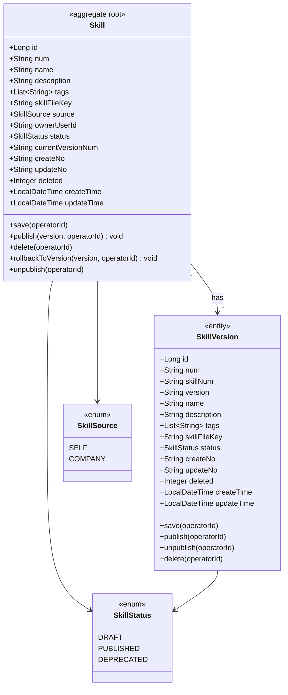

**领域结构表格**

| 对象 | 类型 | 关键属性 | 关系 |
| --- | --- | --- | --- |
| Skill | 聚合根 | id, num, name, description, tags, skillFileKey, source, ownerUserId, status, currentVersionNum | 1—* SkillVersion |
| SkillVersion | 实体（不可变字段，可变 status） | id, num, skillNum, version (String), name, description, tags, skillFileKey, status (v2.7 新增) | 多 → 1 Skill |
| SkillSource | 枚举 | SELF / COMPANY | — |
| SkillStatus | 枚举 | DRAFT / PUBLISHED / DEPRECATED（v2.7：同时被 Skill 和 SkillVersion 复用，对应"草稿 / 已发布 / 已下架"） | — |

**Repository / Gateway / Factory 接口**

| 类 | 方法 |
| --- | --- |
| `SkillRepository` | save(Skill, operatorId)、findByNum(num)、deleteByNum(num, operatorId) |
| `SkillVersionRepository` | save(SkillVersion, operatorId)、findByNum(num)、deleteByNum(num, operatorId) |
| `SkillGateway`（v2.6：仅领域对象工具服务） | generateSkillNum() String |
| `SkillVersionGateway`（v2.7：仅业务编号生成） | generateSkillVersionNum() String |
| `SkillFactory`（v2.9：`@Component` 类，固定 4 方法） | buildSkill(name, description, tags, skillFileKey, source, ownerUserId) Skill、buildSkillByNum(num) Skill、buildSkillVersion(skillNum, version, name, description, tags, skillFileKey) SkillVersion、buildSkillVersionByNum(num) SkillVersion |

> v2.7 收敛：
> - `Skill.publish` / `Skill.rollbackToVersion` 不再读 / 写 SkillVersion，原 `SkillVersionGateway.existsByVersion` 与 `findBySkillNumAndVersion` 也失去聚合内调用点 → 整体下线，相应校验改由 application 层经 `infra.skill.mapper.SkillVersionMapper` 直查。
> - `SkillFactory.createInitialVersion` 在 application 层 publish 流程中使用：app 层先 `factory.createInitialVersion(skill, version, operatorId)` 生成 SkillVersion 并 `save`，再调 `skill.publish(version, operatorId)` 切 Skill 自身状态。
> - `Skill` 聚合不再实现 `PublisherAware`，事件发布器由 Factory 在 createSelfSkill / createByNum 时直接 setter 装配。

#### 3.2.2 领域规则

| 聚合/对象 | 规则类型 | 规则描述 | 违反时表达 |
| --- | --- | --- | --- |
| Skill | 不变性 | `status = DEPRECATED`（即"下架"）时不出现在调试台/评测台/Agent 挂载下拉 | 查询时按 status 过滤 |
| Skill | 不变性 | `source = COMPANY` 时所有用户写入路径（update / publish / unpublish / rollback / delete 等）必须被拒绝 | 应用层守卫（`SkillCompanyReadOnlyGuard`）在 service 入口检查，违反抛 `BizException(1003, "公司库 Skill 只读")` |
| Skill | 业务规则 | 同 ownerUserId 下 `name` 不可重复（仅 SELF；COMPANY 不参与该约束）；v2.6：由 application 层在 `createSkill` 入口经 MyBatis Mapper 校验（不在聚合内执行） | `BizException(1005, "Skill 名称已存在")` |
| Skill | 业务规则 | 编辑/发布需 ownerUserId 或平台管理员 | `BizException(1003, "无权限")` |
| Skill | 业务规则 | `tags` 单项 ≤32 字符；上限 20 个 | `BizException(1001)` |
| Skill | 业务规则 | `skillFileKey` 必填（指向对象存储中的 SKILL.md）；`description` 必填（v2.5：用户必填，不再自动从 SKILL.md 抽取） | `BizException(3003, "SKILL 文件 / 描述缺失")` |
| SkillVersion | 不变性 | 不可修改（仅 INSERT） | DB 层无 UPDATE 接口 |
| SkillVersion | 不变性 | 同 skillNum 下 `version` 不可重复（含已下架历史版本） | 发布前 `existsByVersion` 预检，命中抛 `BizException(3004, "版本号已存在")`；DB 也有 `uk_skill_version_no` 兜底 |
| SkillVersion | 业务规则 | `version` 为字符串（语义无校验，前端约定 `vX.Y.Z` 风格但后端不解析） | — |

#### 3.2.3 领域动作

| 聚合/实体 | 领域动作 | 职责 | 前置条件 | 后置条件/规则 | 领域事件 |
| --- | --- | --- | --- | --- | --- |
| Skill | save(operatorId) | 保存/更新 Skill 元信息（含 status=DRAFT 的草稿态字段） | operatorId 有效 | updateNo 已更新 | `SKILL_SAVED` |
| Skill | publish(version, operatorId) | **v2.7**：仅更新自身的 `currentVersionNum` + `status=PUBLISHED`，<b>不再读写 SkillVersion</b>；SkillVersion 行由 application 层经 Factory 创建并 save | source = SELF；status = DRAFT；version 非空（唯一性由 application 层 Mapper 预检） | `currentVersionNum=version`；`status=PUBLISHED` | `SKILL_VERSION_PUBLISHED` |
| Skill | delete(operatorId) | 逻辑删除 Skill | status != PUBLISHED；operatorId 有权限 | deleted=1 | `SKILL_DELETED` |
| Skill | rollbackToVersion(version, operatorId) | **v2.7**：仅切换 `currentVersionNum` 指针到目标版本号 + `status=PUBLISHED`，<b>不再读写 SkillVersion</b>；目标版本存在性由 application 层 Mapper 预检 | source = SELF；status != DRAFT；version 非空 | `currentVersionNum=version`；`status=PUBLISHED` | `SKILL_ROLLED_BACK` |
| Skill | unpublish(operatorId) | 下架：标记不可被调用方使用 | source = SELF；status = PUBLISHED | status=DEPRECATED；currentVersionNum 保留 | `SKILL_UNPUBLISHED` |
| SkillVersion | save(operatorId) | 保存版本快照；status 默认 DRAFT（v2.8 改） | 仅 INSERT | createNo/updateNo 记录；status=DRAFT 兜底 | `SKILL_VERSION_SAVED`（v2.8 新增） |
| SkillVersion | publish(operatorId) | **v2.7 新增**：DRAFT → PUBLISHED | status == DRAFT | status=PUBLISHED | `SKILL_VERSION_ACTIVATED` |
| SkillVersion | unpublish(operatorId) | **v2.7 新增**：PUBLISHED → DEPRECATED；用于运维下架单个有缺陷的历史版本 | status == PUBLISHED | status=DEPRECATED | `SKILL_VERSION_DEPRECATED` |
| SkillVersion | delete(operatorId) | 软删 | num 非空 | deleted=1 | `SKILL_VERSION_DELETED`（v2.8 新增） |

##### 3.2.3.1 时序：Skill.publish（v2.7：聚合纯化，只更新自身状态机）

```mermaid
sequenceDiagram
    participant App as SkillCommandService
    participant Skill as Skill
    participant Repo as SkillRepository
    participant Pub as DomainEventPublisher

    Note over App: 调用前由 App 层完成 SkillVersion 创建：<br/>1) factory.createInitialVersion → 2) newVersion.save<br/>（version 唯一性已经 Mapper 预检）
    App->>Skill: publish(version, operatorId)
    Skill->>Skill: initialize(operatorId)
    Skill->>Skill: assert status == DRAFT
    Skill->>Skill: currentVersionNum = version; status = PUBLISHED
    Skill->>Skill: validate()
    Skill->>Repo: save(this)
    Skill->>Pub: send(SKILL_VERSION_PUBLISHED, payload)
```

##### ~~3.2.3.2 时序：Skill.saveDraft~~（v2.1 移除）

> 草稿态合并到 `Skill` 主表（`status=DRAFT`），不再有独立的 saveDraft 领域动作。编辑走 `Skill.save()` + 在应用层把 `status` 置为 `DRAFT`，无需新表/锁/快照拷贝。前端"编辑中→保存草稿"现仅触发 `POST /api/v1/skill/command/update`。

##### ~~3.2.3.3 时序：公司库同步~~（v2.5 暂不实现）

> 公司库同步（`syncFromCompanyRepo`）整体功能 v2.5 起 **暂不实现**：路径 `/command/sync`、`SkillCommandService.syncFromCompanyRepo`、`SkillRepoGateway` 接口、`SyncResultDTO` / `SyncResultVo`、相关测试与风险条目全部下线。`Skill.source = COMPANY` 枚举值保留以备后续接入，但当前代码路径无写入入口。

##### 3.2.3.4 时序：Skill.unpublish（下架）

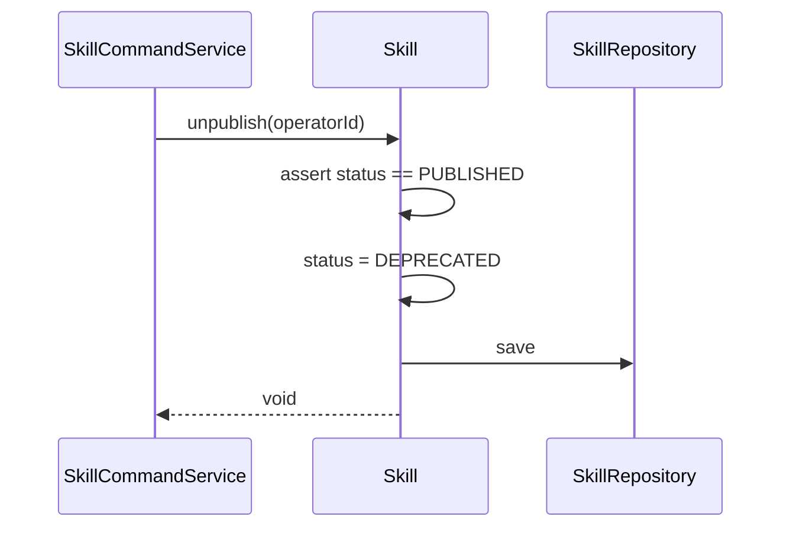

##### 3.2.3.5 时序：Skill.rollbackToVersion（v2.7：仅切换版本号指针 + 状态）

```mermaid
sequenceDiagram
    participant App as SkillCommandService
    participant Skill as Skill
    participant Repo as SkillRepository
    participant Pub as DomainEventPublisher

    Note over App: 调用前由 App 层用 Mapper 预检目标版本是否存在
    App->>Skill: rollbackToVersion(version, operatorId)
    Skill->>Skill: initialize(operatorId)
    Skill->>Skill: assert status != DRAFT
    Skill->>Skill: currentVersionNum = version; status = PUBLISHED
    Skill->>Skill: validate()
    Skill->>Repo: save(this)
    Skill->>Pub: send(SKILL_ROLLED_BACK, payload)
```

##### 3.2.3.6 时序：Skill.delete

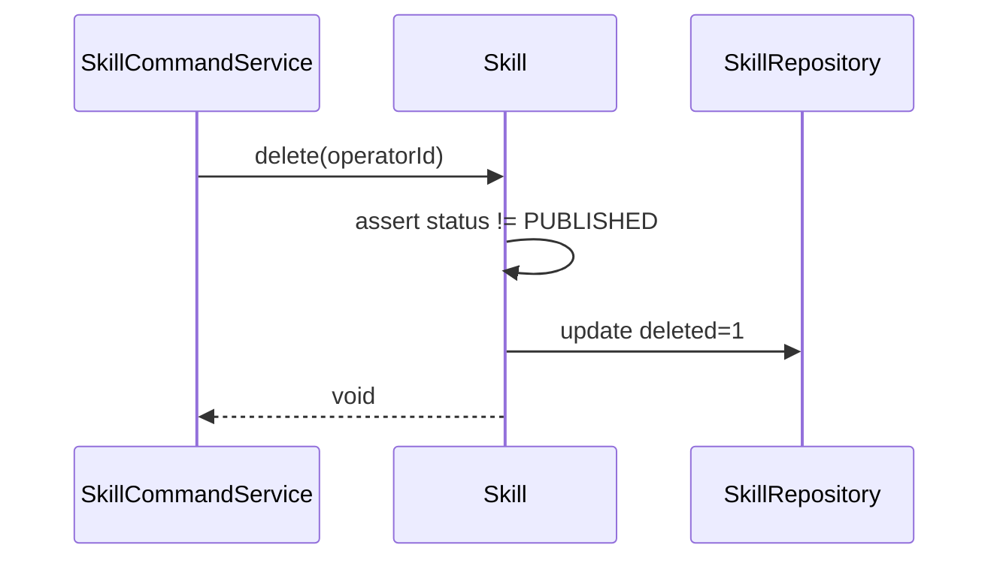

#### 3.2.4 领域事件

| 事件名常量 | 触发时机 | 载荷要点 | 可订阅方/用途 |
| --- | --- | --- | --- |
| `SkillVersionPublishedEvent` | Skill 新版本发布成功（{@code Skill.publish}） | skillNum / version / operatorId / occurredAt | 调试台 invalidate Skill 列表缓存；评测：触发"是否回归测试"提示 |
| `SKILL_VERSION_SAVED` | **v2.8 新增**：SkillVersion 行 save 成功（{@code SkillVersion.save}），状态默认 DRAFT | skillNum / version / status=DRAFT / operatorId | 调试台监听以维护"草稿版本"列表 |
| `SKILL_VERSION_ACTIVATED` | **v2.7 新增**：SkillVersion 行自身由 DRAFT 切到 PUBLISHED（{@code SkillVersion.publish}） | skillNum / version / status=PUBLISHED / operatorId | 调试台 / 评测台刷新可选版本列表 |
| `SKILL_VERSION_DEPRECATED` | **v2.7 新增**：SkillVersion 行自身由 PUBLISHED 切到 DEPRECATED（{@code SkillVersion.unpublish}） | skillNum / version / status=DEPRECATED / operatorId | 调试台 / 评测台从可选版本列表中过滤掉该版本 |
| `SKILL_VERSION_DELETED` | **v2.8 新增**：SkillVersion 行被软删除（{@code SkillVersion.delete}） | skillNum / version / operatorId | 缓存清理；审计日志 |

> v2.5：事件发布改用 Spring 自带 `ApplicationEventPublisher`（不再自建 `SkillEventPublisher` 接口）；事件命名按 Spring 惯例改为 `XxxEvent` 类名（不再用 `DomainEventConstant` 字符串常量）。订阅方用 `@EventListener` 监听。

---

## 4. 应用层设计

### 4.1 业务模块划分

| application 模块 | 对应领域 |
| --- | --- |
| `application.skill` | skill 领域 |

### 4.2 application.skill

#### 4.2.1 Service 方法清单

| Service | 方法 | 职责 | 入参 | 出参 |
| --- | --- | --- | --- | --- |
| `SkillCommandService` | `createSkill(param, skillFile, operatorId)` | 创建自建 Skill + 自动首发（version 由入参传入） | `SkillCreateParamDTO, MultipartFile` | `Result<SkillDTO>` |
| `SkillCommandService` | `updateSkill(skillNum, param, skillFile?, operatorId)` | 修改字段（名称/描述/标签/SKILL.md），自动置 `status=DRAFT`；入口处 COMPANY 只读守卫 | `String, SkillUpdateParamDTO, MultipartFile?` | `Result<Void>` |
| `SkillCommandService` | `discardDraft(skillNum, operatorId)` | 放弃草稿态修改：从 currentVersion 读字段覆盖回 Skill 主表 + `status=PUBLISHED` | `String` | `Result<Void>` |
| `SkillCommandService` | `publish(skillNum, version, operatorId)` | 把当前草稿态字段固化为新版本（含 version 唯一性预检） | `String, String` | `Result<SkillVersionDTO>` |
| `SkillCommandService` | `rollbackToVersion(skillNum, version, operatorId)` | 用目标版本快照覆盖 Skill 字段，status 置 DRAFT | `String, String` | `Result<SkillDTO>` |
| `SkillCommandService` | `unpublish(skillNum, operatorId)` | 下架（`Skill.unpublish` → status=DEPRECATED） | `String` | `Result<Void>` |
| `SkillCommandService` | `delete(skillNum, operatorId)` | 删除（仅 `status != PUBLISHED`） | `String` | `Result<Void>` |
| ~~`SkillCommandService.syncFromCompanyRepo`~~ | **v2.5 暂不实现**：公司库同步功能延期 | — | — |
| `SkillQueryService` | `pageList(query)` | 列表 + 筛选 | `SkillPageQueryParamDTO` | `Result<PageDTO<SkillDTO>>` |
| `SkillQueryService` | `detail(skillNum)` | 详情（status=DRAFT 时直读 Skill 字段；PUBLISHED/DEPRECATED 时关联当前 version 行 + 复用数） | `String` | `Result<SkillDetailDTO>` |
| `SkillQueryService` | `downloadSkillFile(skillNum, version)` | 下载指定版本的 SKILL.md 原文 | `String, String` | `InputStream` (text/markdown，无 DTO 包装) |
| `SkillQueryService` | `versionList(skillNum)` | 版本历史 | `String` | `Result<List<SkillVersionDTO>>` |
| `SkillQueryService` | `versionDetail(skillNum, version)` | 历史版本只读详情 | `String, String` | `Result<SkillVersionDetailDTO>` |
| `SkillQueryService` | `compareVersions(skillNum, vA, vB)` | 版本对比（SKILL.md 行级 + name / tags / description 字段 diff） | `String, String, String` | `Result<VersionDiffDTO>` |

> v2.4：所有入参类型 `XxxParam` → `XxxParamDTO`（位于 `client.skill.dto`）；返回包装内类型 `XxxVO` → `XxxDTO`；应用层只引用 `client.skill.dto`，不引用 `client.skill.vo`。
> v2.3 结构变化：原 `SkillVersionCommandService`（publish/rollback）和 `SkillSyncCommandService`（sync）全部并入 `SkillCommandService`；遵循"每聚合根 2 个 Service（Command + Query）"原则。

#### 4.2.2 方法时序逻辑

##### 4.2.2.1 SkillCommandService.createSkill（v2.10：SKILL 文件流程暂不实现）

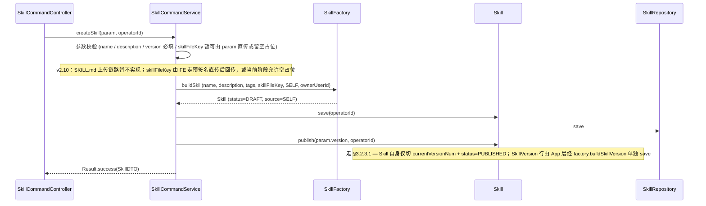

##### 4.2.2.2 SkillCommandService.updateSkill（v2.10：SKILL 文件流程暂不实现）

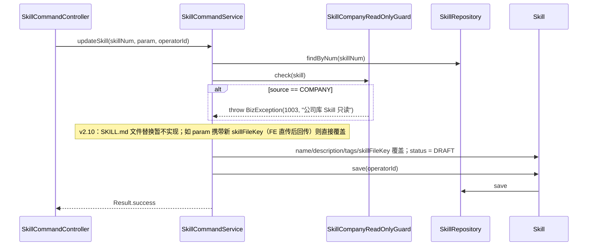

##### 4.2.2.3 SkillCommandService.discardDraft（v2.2：应用层从 currentVersion 读字段覆盖 Skill）

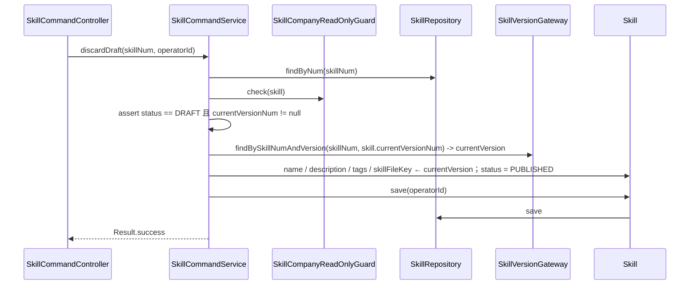

##### 4.2.2.4 SkillCommandService.unpublish（v2.2：下架）

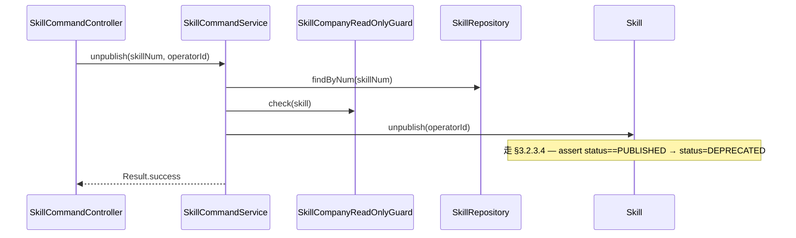

##### 4.2.2.5 SkillCommandService.delete

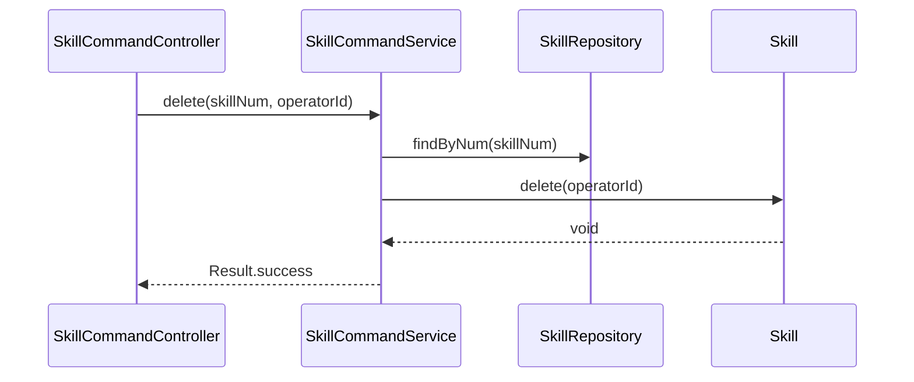

##### 4.2.2.6 SkillCommandService.publish

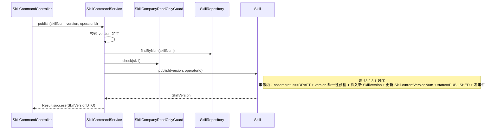

##### 4.2.2.7 SkillCommandService.rollbackToVersion

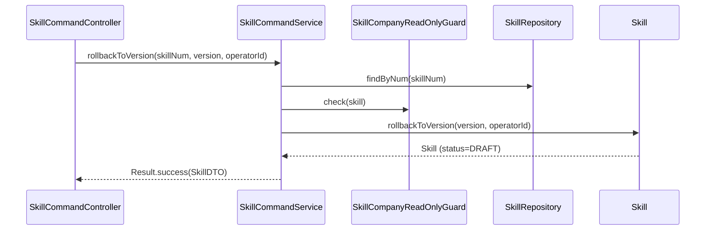

##### 4.2.2.8 ~~SkillCommandService.previewSchemaCheck~~（v2.0 移除）

> v2.0 起 Skill 走 SKILL.md 文档模式，不再有结构化 JSON Schema，破坏性变更靠用户在发布 Modal 里选影响等级 + 变更说明描述；本方法整体移除，对应 controller 接口 `/api/v1/skill/version/previewSchemaCheck` 同步删除。版本对比统一改为 SKILL.md 文本 diff（见 §4.2 `versionCompare`）。

##### ~~4.2.2.9 SkillCommandService.syncFromCompanyRepo~~（v2.5 暂不实现）

> 公司库同步功能 v2.5 整体下线。`SkillRepoGateway` 接口、`SyncResultDTO` / `SyncResultVo`、对应 controller `/command/sync` 同步删除。`Skill.source = COMPANY` 路径暂悬空，后续接入时再补回。

##### 4.2.2.10 SkillQueryService.pageList（v2.6：直接走 MyBatis Mapper）

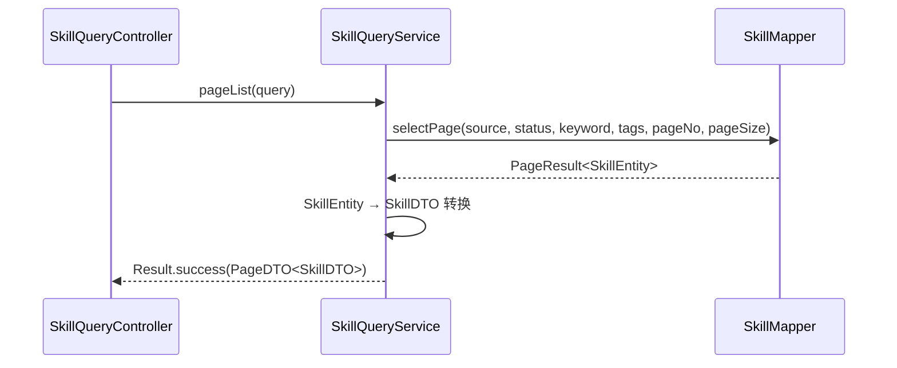

##### 4.2.2.11 SkillQueryService.detail

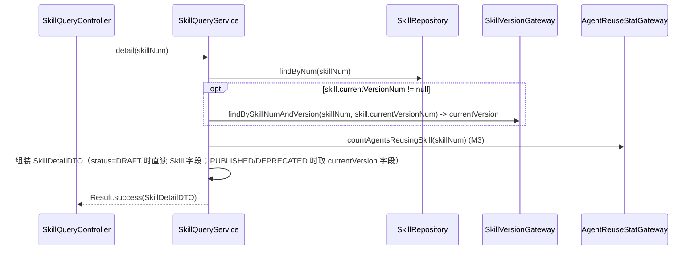

##### 4.2.2.12 SkillQueryService.versionList（v2.6：直接走 MyBatis Mapper）

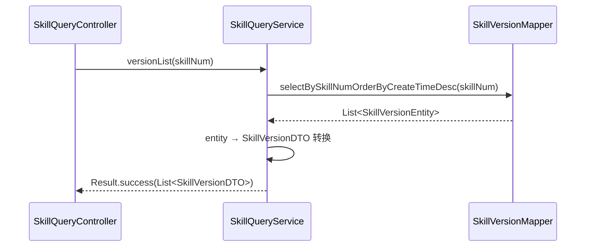

##### 4.2.2.13 SkillQueryService.versionDetail

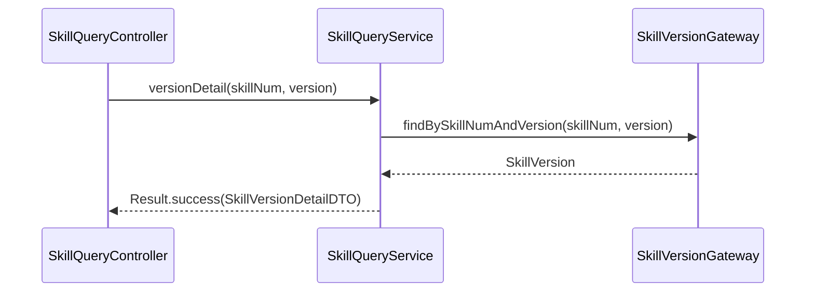

##### 4.2.2.14 SkillQueryService.compareVersions（v2.10：仅字段 diff；SKILL.md 文件 diff 待文件存储接入后启用）

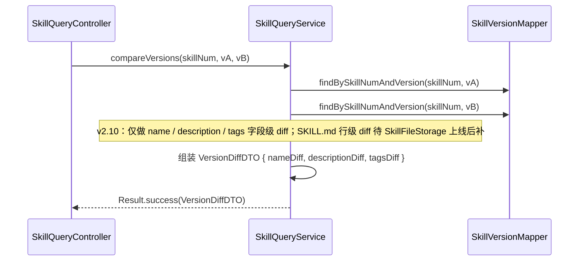

---

## 5. 控制器/Adapter 层设计

### 5.1 业务模块划分

| Controller 模块 | 对应 application | 路径前缀 |
| --- | --- | --- |
| `SkillCommandController` | `SkillCommandService` | `/api/v1/skill/command` |
| `SkillQueryController` | `SkillQueryService` | `/api/v1/skill/query` |

> v2.3 结构变化：原 `SkillVersionController` / `SkillSyncController` 全部并入 `SkillCommandController`（读侧的 version/* 路径并入 `SkillQueryController`），遵循"每聚合根 2 个 Controller（Command + Query）"原则。

### 5.2 skill

#### 5.2.1 Controller 接口清单

| 路径 | 方法 | 入参 JSON | 出参 JSON | 职责 |
| --- | --- | --- | --- | --- |
| `/api/v1/skill/command/create` | POST `multipart/form-data` | `param`（JSON 字段）= `{ name, description?, tags?, version }` + `skillFile`（**.md 文件**，必传） | `{ code, message, data: { num, name, version, source: "SELF" }, traceId }` | 创建自建 Skill + 首发指定 `version`；`description` 留空时由后端从 SKILL.md 抽取 |
| `/api/v1/skill/command/update` | POST `multipart/form-data` | `param`（JSON）= `{ num, name?, description?, tags? }` + `skillFile`（可选 .md 文件，不传沿用当前） | `{ code, message, data: null, traceId }` | 修改字段并自动置 `status=DRAFT`；service 入口做 COMPANY 只读守卫 |
| `/api/v1/skill/command/discardDraft` | POST | `{ num }` | `{ code, message, data: null, traceId }` | 放弃草稿态修改，回滚为 currentVersion 字段，置 `status=PUBLISHED` |
| `/api/v1/skill/command/publish` | POST | `{ skillNum, version }` | `{ code, message, data: { version, occurredAt }, traceId }` | 发布新版本；`version` 与历史重复返回 3004（v2.3：从 `/version/publish` 迁移） |
| `/api/v1/skill/command/rollback` | POST | `{ skillNum, targetVersion }` | `{ code, message, data: { num, status: "DRAFT" }, traceId }` | 回滚：用目标版本快照覆盖当前字段并置 DRAFT（v2.3：从 `/version/rollback` 迁移） |
| `/api/v1/skill/command/unpublish` | POST | `{ num }` | `{ code, message, data: null, traceId }` | 下架（status=PUBLISHED → DEPRECATED） |
| `/api/v1/skill/command/delete` | POST | `{ num }` | `{ code, message, data: null, traceId }` | 删除（仅 `status != PUBLISHED`） |
| ~~`/api/v1/skill/command/sync`~~ | — | — | — | **v2.5 暂不实现**：公司库同步功能延期 |
| `/api/v1/skill/query/list` | POST | `{ pageNo, pageSize, source?, status?, keyword?, tags? }` | `{ code, message, data: { total, list: [{num, name, description, tags, source, currentVersionNum, status, reuseCount, ...}] }, traceId }` | 列表 |
| `/api/v1/skill/query/detail` | GET | `?num=SKL...` | `{ code, message, data: { num, name, description, tags, source, skillFileKey, currentVersion: {version, ...}, reuseCount }, traceId }` | 详情 |
| `/api/v1/skill/query/skillFile` | GET | `?skillNum=SKL...&version=v1.0.0` | `text/markdown`（原文返回） | 下载指定版本的 SKILL.md 原文 |
| `/api/v1/skill/query/versionList` | GET | `?skillNum=SKL...` | `{ code, message, data: [{num, version, name, createTime}] }` | 版本历史（v2.3：从 `/version/list` 迁移） |
| `/api/v1/skill/query/versionDetail` | GET | `?skillNum=SKL...&version=v1.0.1` | `{ code, message, data: { num, skillNum, version, name, description, tags, skillFileKey } }` | 历史版本只读详情（v2.3：从 `/version/detail` 迁移） |
| `/api/v1/skill/query/versionCompare` | POST | `{ skillNum, versionA, versionB }` | `{ code, message, data: { mdDiff: "...", nameDiff: "...", tagsDiff: [...], descriptionDiff: "..." } }` | 版本对比：SKILL.md 行级 + 字段 diff（v2.3：从 `/version/compare` 迁移） |

> ⚠️ **v2.3 路径迁移**：原 `/api/v1/skill/version/*` 与 `/api/v1/skill/sync/*` 全部下线，按读写归并到 `/command/*` 与 `/query/*`。前端需同步替换调用路径。
> ⚠️ **v2.2 下线接口**：（仅参数级变更）`/version/publish` 入参移除 `changeLevel` / `changeNote`，`/version/*` 路径所有 `versionNum` 重命名为 `version`。新增 `/command/unpublish` 接替"下架"语义。
> ⚠️ **v2.1 下线接口**：`/api/v1/skill/command/saveDraft`（合并为 `/update`）、`/api/v1/skill/command/deprecate`、`/api/v1/skill/command/forkAsSelf`（依赖已删除的 skillId）。
> ⚠️ **v2.0 下线接口**：`/api/v1/skill/version/previewSchemaCheck`（schema 破坏性预检）整体移除，SKILL.md 模式下无结构化 schema。

#### 5.2.2 接口时序逻辑

##### 5.2.2.1 POST /api/v1/skill/command/create

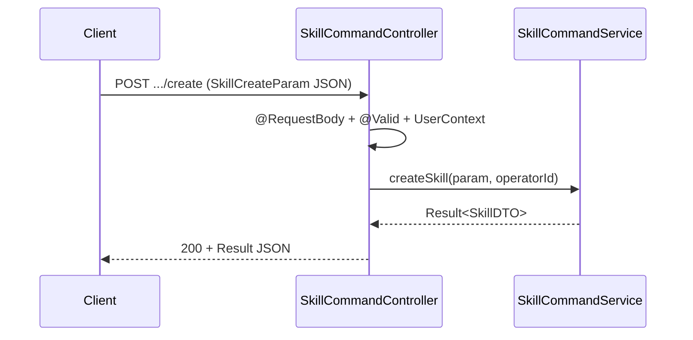

##### 5.2.2.2 POST /api/v1/skill/command/update

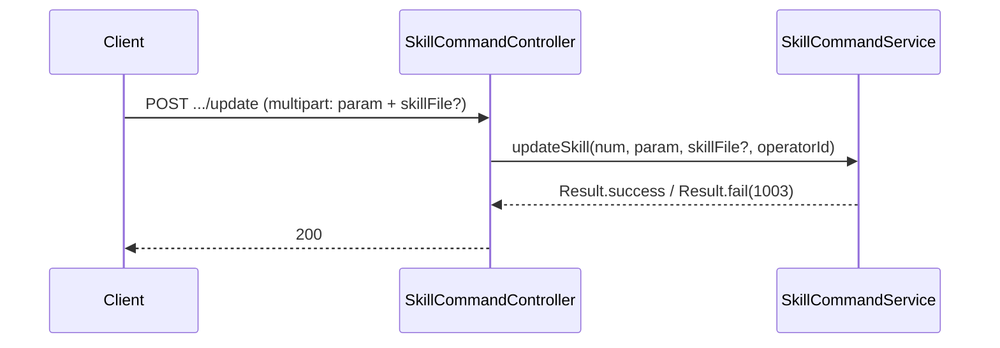

##### 5.2.2.3 POST /api/v1/skill/command/discardDraft

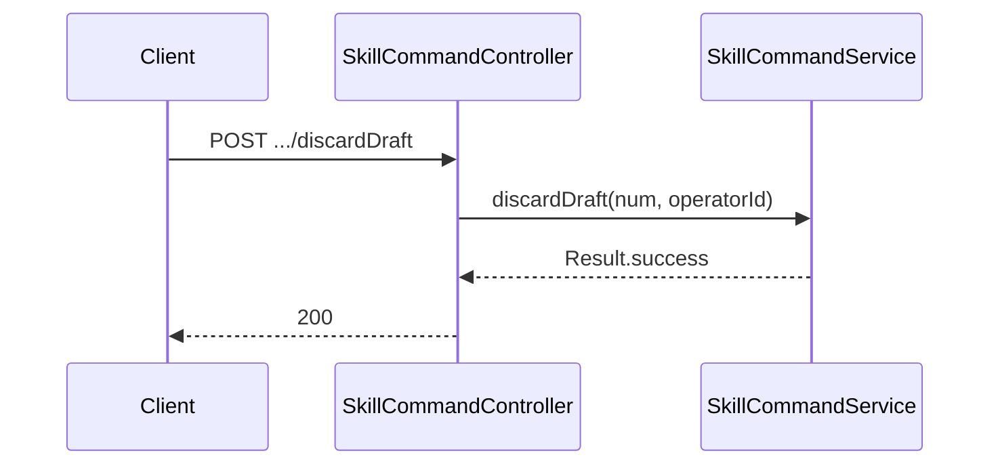

##### ~~5.2.2.4 POST /api/v1/skill/command/deprecate~~（v2.1 移除）→ 由 `/unpublish` 接替

```mermaid
sequenceDiagram
    participant Cli as Client
    participant Ctrl as SkillCommandController
    participant Svc as SkillCommandService

    Cli->>Ctrl: POST .../unpublish
    Ctrl->>Svc: unpublish(num, operatorId)
    Svc-->>Ctrl: Result.success
    Ctrl-->>Cli: 200
```

##### 5.2.2.5 POST /api/v1/skill/command/delete

```mermaid
sequenceDiagram
    participant Cli as Client
    participant Ctrl as SkillCommandController
    participant Svc as SkillCommandService

    Cli->>Ctrl: POST .../delete
    Ctrl->>Svc: delete(num, operatorId)
    Svc-->>Ctrl: Result.success
    Ctrl-->>Cli: 200
```

##### 5.2.2.6 POST /api/v1/skill/command/publish

```mermaid
sequenceDiagram
    participant Cli as Client
    participant Ctrl as SkillCommandController
    participant Svc as SkillCommandService

    Cli->>Ctrl: POST .../publish
    Ctrl->>Ctrl: 校验 version 非空
    Ctrl->>Svc: publish(skillNum, version, operatorId)
    Svc-->>Ctrl: Result.success / Result.fail(3004 版本号已存在)
    Ctrl-->>Cli: 200
```

##### 5.2.2.7 POST /api/v1/skill/command/rollback

```mermaid
sequenceDiagram
    participant Cli as Client
    participant Ctrl as SkillCommandController
    participant Svc as SkillCommandService

    Cli->>Ctrl: POST .../rollback
    Ctrl->>Svc: rollbackToVersion(skillNum, targetVersion, operatorId)
    Svc-->>Ctrl: Result<SkillDTO> (status=DRAFT)
    Ctrl-->>Cli: 200
```

##### 5.2.2.8 ~~POST /api/v1/skill/version/previewSchemaCheck~~（v2.0 移除）

> SKILL.md 模式下无结构化 JSON Schema，本接口整体下线；前端发布 Modal 改为展示 SKILL.md / tags / description 行级文本 diff（沿用 `compareVersions` 接口）。

##### ~~5.2.2.9 POST /api/v1/skill/command/sync~~（v2.5 暂不实现）

> 公司库同步整体下线。Spring `@RequestMapping` 不挂该路径；前端"↻ 同步公司库"按钮 v2.5 隐藏。

##### 5.2.2.10 POST /api/v1/skill/query/list

```mermaid
sequenceDiagram
    participant Cli as Client
    participant Ctrl as SkillQueryController
    participant Svc as SkillQueryService

    Cli->>Ctrl: POST .../list (SkillPageQueryParam)
    Ctrl->>Svc: pageList(query)
    Svc-->>Ctrl: Result<PageDTO<SkillDTO>>
    Ctrl-->>Cli: 200
```

##### 5.2.2.11 GET /api/v1/skill/query/detail

```mermaid
sequenceDiagram
    participant Cli as Client
    participant Ctrl as SkillQueryController
    participant Svc as SkillQueryService

    Cli->>Ctrl: GET .../detail?num=SKL...
    Ctrl->>Svc: detail(num)
    Svc-->>Ctrl: Result<SkillDetailDTO>
    Ctrl-->>Cli: 200
```

##### 5.2.2.12 GET /api/v1/skill/query/versionList

```mermaid
sequenceDiagram
    participant Cli as Client
    participant Ctrl as SkillQueryController
    participant Svc as SkillQueryService

    Cli->>Ctrl: GET .../versionList?skillNum=...
    Ctrl->>Svc: versionList(skillNum)
    Svc-->>Ctrl: Result<List<SkillVersionDTO>>
    Ctrl-->>Cli: 200
```

##### 5.2.2.13 GET /api/v1/skill/query/versionDetail

```mermaid
sequenceDiagram
    participant Cli as Client
    participant Ctrl as SkillQueryController
    participant Svc as SkillQueryService

    Cli->>Ctrl: GET .../versionDetail?skillNum=...&version=...
    Ctrl->>Svc: versionDetail(skillNum, version)
    Svc-->>Ctrl: Result<SkillVersionDetailDTO>
    Ctrl-->>Cli: 200
```

##### 5.2.2.14 POST /api/v1/skill/query/versionCompare

```mermaid
sequenceDiagram
    participant Cli as Client
    participant Ctrl as SkillQueryController
    participant Svc as SkillQueryService

    Cli->>Ctrl: POST .../versionCompare
    Ctrl->>Svc: compareVersions(skillNum, vA, vB)
    Svc-->>Ctrl: Result<VersionDiffDTO>
    Ctrl-->>Cli: 200
```

---

## 6. 数据库设计

### 6.1 表清单

| 表名 | 对应聚合/实体 | 用途 |
| --- | --- | --- |
| `skill` | Skill 聚合根 | Skill 元信息（含 status=DRAFT 时的草稿态字段）+ 当前在线版本指针 |
| `skill_version` | SkillVersion 实体 | 版本快照（不可变） |

> v2.1：删除 `skill_draft` 表（草稿态合并到 `skill.status=DRAFT`）。

### 6.2 DDL

```sql
-- 1. skill
CREATE TABLE `skill` (
  `id` BIGINT NOT NULL AUTO_INCREMENT,
  `num` VARCHAR(64) NOT NULL COMMENT '系统业务编号 SKL...',
  `name` VARCHAR(128) NOT NULL,
  `description` VARCHAR(2048) DEFAULT NULL COMMENT 'status=DRAFT 时为草稿描述,PUBLISHED 时为当前版本描述镜像',
  `tags` JSON DEFAULT NULL COMMENT '自由标签数组 JSON',
  `skill_file_key` VARCHAR(256) DEFAULT NULL COMMENT '当前 SKILL.md 在对象存储中的 key（草稿态与已发布态共用）',
  `source` VARCHAR(16) NOT NULL DEFAULT 'SELF' COMMENT 'SELF / COMPANY',
  `company_source_id` VARCHAR(128) DEFAULT NULL COMMENT '公司库 Skill ID（source=COMPANY 才有，用于增量同步定位）',
  `owner_user_id` VARCHAR(64) NOT NULL,
  `status` VARCHAR(16) NOT NULL DEFAULT 'DRAFT' COMMENT 'DRAFT / PUBLISHED / DEPRECATED',
  `current_version_num` VARCHAR(64) DEFAULT NULL,
  `create_no` VARCHAR(64) NOT NULL,
  `update_no` VARCHAR(64) NOT NULL,
  `deleted` TINYINT(1) NOT NULL DEFAULT 0,
  `create_time` TIMESTAMP(3) NOT NULL DEFAULT CURRENT_TIMESTAMP(3),
  `update_time` TIMESTAMP(3) NOT NULL DEFAULT CURRENT_TIMESTAMP(3) ON UPDATE CURRENT_TIMESTAMP(3),
  PRIMARY KEY (`id`),
  UNIQUE KEY `uk_skill_num` (`num`),
  UNIQUE KEY `uk_skill_owner_name` (`owner_user_id`, `name`, `deleted`),
  UNIQUE KEY `uk_skill_company_source` (`company_source_id`, `deleted`) COMMENT '公司库同步定位',
  KEY `idx_source_status` (`source`, `status`, `deleted`)
) ENGINE=InnoDB DEFAULT CHARSET=utf8mb4 COMMENT='Skill 元信息（含草稿态字段）';

-- 2. skill_version
CREATE TABLE `skill_version` (
  `id` BIGINT NOT NULL AUTO_INCREMENT,
  `num` VARCHAR(64) NOT NULL COMMENT '业务编号 SVN...',
  `skill_num` VARCHAR(64) NOT NULL,
  `version` VARCHAR(32) NOT NULL COMMENT 'v2.2：版本号字符串，用户输入（约定但不强校验 vX.Y.Z），原 version_num 列重命名',
  `name` VARCHAR(128) NOT NULL COMMENT 'v2.2 新增：版本快照的 Skill 名称',
  `description` VARCHAR(2048) DEFAULT NULL COMMENT '版本快照：描述',
  `tags` JSON DEFAULT NULL COMMENT '版本快照：标签数组',
  `skill_file_key` VARCHAR(256) NOT NULL COMMENT '版本快照：SKILL.md 对象存储 key',
  `create_no` VARCHAR(64) NOT NULL,
  `update_no` VARCHAR(64) NOT NULL,
  `deleted` TINYINT(1) NOT NULL DEFAULT 0,
  `create_time` TIMESTAMP(3) NOT NULL DEFAULT CURRENT_TIMESTAMP(3),
  `update_time` TIMESTAMP(3) NOT NULL DEFAULT CURRENT_TIMESTAMP(3) ON UPDATE CURRENT_TIMESTAMP(3),
  PRIMARY KEY (`id`),
  UNIQUE KEY `uk_skill_version_num` (`num`),
  UNIQUE KEY `uk_skill_version_no` (`skill_num`, `version`) COMMENT '同 skill 同版本号唯一',
  KEY `idx_skill_create_time` (`skill_num`, `create_time`)
) ENGINE=InnoDB DEFAULT CHARSET=utf8mb4 COMMENT='Skill 版本快照（不可变）';

-- v2.1：skill_draft 表已删除（草稿态合并到 skill.status=DRAFT）
```

> **v2.2 DDL 变更摘要（2026-06-01）**：
> - `skill_version` 表：`version_num` → `version`（重命名）；新增 `name` 列；删除 `change_level` / `change_note` / `skill_file_hash` / `published_by` / `published_at` / `current_flag` / `semver_major` / `semver_minor` / `semver_patch` 共 9 列；删除 `idx_skill_current` 索引（current_flag 已删）；新增 `idx_skill_create_time` 用于版本历史按时间排序
> - `skill` 表：列结构不变；status 默认值仍为 `DRAFT`
> - "当前在线版本"判定从 `skill_version.current_flag` 切到 `skill.current_version_num` 直查
>
> **v2.1 DDL 变更摘要**（保留作历史记录）：
> - `skill` 表：删除 `skill_id` / `skill_file_type` / `source_version` 三列；删除 `uk_skill_skill_id` 唯一索引；新增 `uk_skill_company_source` 唯一索引（公司库同步定位，用法等同原 `skill_id`）；`status` 默认值 `DRAFT_ONLY` → `DRAFT`
> - `skill_version` 表：`snapshot` JSON 拆为平铺列 `description` / `tags` / `skill_file_key` / `skill_file_hash`（不再含 `skillFileType`）
> - **删除 `skill_draft` 表**：草稿态合并到 `skill` 主表（`status = DRAFT` 标识）
>
> **v2.0 DDL 变更摘要**（保留作历史记录）：
> - `skill` 表：新增 `skill_id` / `tags` / `skill_file_key` / `skill_file_type` 列；删除 `category` 列；`source` 枚举值 `COMPANY_SYNC` → `COMPANY`；新增 `uk_skill_skill_id` 唯一约束；删除 `idx_category` 索引
> - `skill_version` 表：`snapshot` JSON 结构变更（不再含 `inputSchema/outputSchema/implEndpoint`）；`remark` 列重命名为 `change_note`；删除 `breaking_change` 列
> - `skill_draft` 表：仅 `snapshot` JSON 结构变更，列结构不变

### 6.3 与领域对应

- `skill` 表 ↔ `Skill` 聚合根（含 status=DRAFT 时的草稿态字段）
- `skill_version` 表 ↔ `SkillVersion` 实体

### 6.4 关键查询场景与索引

- 列表筛选：`(source, status, deleted)`；标签筛选走 JSON path 函数（MySQL `JSON_CONTAINS`）
- 公司库同步：`(company_source_id, deleted)` 唯一索引
- 当前版本：`skill.current_version_num` 直查（v2.2 起不再用 `current_flag`）
- 版本历史：`(skill_num, create_time)` 倒序

---

## 7. 模块变更清单

| 层 | 变更项 | 对应 Skill |
| --- | --- | --- |
| facade | 仅保留 `DomainEventConstant.SKILL_VERSION_PUBLISHED` 常量（v2.3：无 `facade.skill` 子包） | — |
| client | `client.skill.dto`（v2.4 新增）：入参 `SkillCreateParamDTO` / `SkillUpdateParamDTO` / `SkillPublishParamDTO` / `SkillRollbackParamDTO` / `SkillPageQueryParamDTO`；返回 `SkillDTO` / `SkillDetailDTO` / `SkillVersionDTO` / `SkillVersionDetailDTO` / `SyncResultDTO` / `VersionDiffDTO`；中间过程类以静态内部类形式内嵌。`client.skill.vo`：入参 `SkillCreateParam` / `SkillUpdateParam` / `SkillPublishParam` / `SkillRollbackParam` / `SkillPageQueryParam`；返回 `SkillVo` / `SkillDetailVo` / `SkillVersionVo` / `SkillVersionDetailVo` / `SyncResultVo` / `VersionDiffVo` | **impl-client-module** |
| domain | Skill 聚合根（save/publish/delete/rollbackToVersion/unpublish）+ SkillVersion 实体（save/delete）+ 子包：`dto`（SkillDomainEventDTO）/ `factory`（SkillFactory 类）/ `gateway`（`SkillGateway` + `SkillVersionGateway` 两个**读查询**接口）/ `repository`（SkillRepository / SkillVersionRepository 接口）/ `valueobject`（SkillSource / SkillStatus） | **impl-domain-module** |
| infra | 固定 4 子包 —— `entity`（SkillEntity / SkillVersionEntity）/ `mapper`（SkillMapper / SkillVersionMapper）/ `repository`（SkillRepositoryImpl / SkillVersionRepositoryImpl）/ `gateway`（`SkillGatewayImpl` / `SkillVersionGatewayImpl`）。v2.10：~~SkillFileStorage~~ 不实现 | **impl-infra-module** |
| application | 每聚合根 2 个 Service：`SkillCommandService`（v2.5：不含 sync）+ `SkillQueryService` + `SkillCompanyReadOnlyGuard`；事件用 Spring `ApplicationEventPublisher` | **impl-application-module** |
| adapter | 每聚合根 2 个 Controller：`SkillCommandController`（`/api/v1/skill/command/*`）+ `SkillQueryController`（`/api/v1/skill/query/*`） | **impl-adapter-module** |

---

## 8. 代码分支命名

`feature-20260511-skill-management`

> 依赖 Agent 子需求分支（`feature-20260511-agent-management`）合并后再开。

---

## 9. 实现顺序与依赖

1. **facade**：`DomainEventConstant.SKILL_VERSION_PUBLISHED` 常量（无 Skill 专属包）
2. **client**：固定 2 子包 —— `dto`（给 application：`XxxParamDTO` / `XxxDTO`）+ `vo`（给 adapter：`XxxParam` / `XxxVo`）；应用层禁止引用 `vo/`
3. **domain**：聚合根 Skill + 实体 SkillVersion；5 个固定子包：`dto / factory / gateway / repository / valueobject`；`gateway` 包仅 2 个读查询接口（`SkillGateway` + `SkillVersionGateway`），`SkillFactory` 为类
4. **infra**：4 个固定子包：`entity / mapper / repository / gateway`；含 DDL + Entity + Mapper + RepositoryImpl + 2 个 GatewayImpl（v2.10：~~SkillFileStorage~~ 不实现）
5. **application**：2 个 Service —— `SkillCommandService`（v2.5：不含 sync）+ `SkillQueryService`；外加 `SkillCompanyReadOnlyGuard`；事件用 Spring `ApplicationEventPublisher` 发布
6. **adapter**：2 个 Controller —— `SkillCommandController`（写）+ `SkillQueryController`（读）；multipart/form-data 处理 SKILL.md 上传

---

## 10. 接口与数据契约

详见 §5.2.1 Controller 接口清单。

### 10.1 SkillVersion 关键字段示例（v2.2 平铺字段形态）

```json
{
  "skillNum": "SKL2026051512345",
  "version": "v1.0.0",
  "name": "jira-summary",
  "description": "调用 Jira API 拉取指定 project 的 issue 列表，输出按截止日期排序",
  "tags": ["analysis", "jira", "report"],
  "skillFileKey": "skill-file/SKL2026051512345/v1.0.0/SKILL.md"
}
```

> v2.2 字段精简：`SkillVersion` 仅保留以上 6 个业务字段 +（id/num/createNo/updateNo/deleted/createTime/updateTime 公共字段）。`changeLevel` / `skillFileHash` / `changeNote` / `publishedBy` / `publishedAt` / `current` 全部移除；`version` 为字符串；新增 `name` 字段记录发布时的 Skill 名称。

### 10.2 SKILL.md 文件示例

```markdown
---
name: jira-summary
description: 调用 Jira API 拉取指定 project 的 issue 列表，输出按截止日期排序
---

# jira-summary

## 用途

汇总 Jira project 当周 issue，输出 Markdown 报告。

## 输入示例

`project=AGT, limit=20`

## 输出示例

按截止日期排序的 issue 列表（含 key / summary / assignee / due_date）。
```

> 平台后端解析逻辑：优先读 front-matter `description`；缺失则取首段非标题段落作为 description；首段为空则用 H1 标题（去 `#` 前缀）作为 description。

> ~~10.3 SKILL.zip 包结构示例~~（v2.1 移除）：v2.1 SKILL 文件统一 `.md`，不再支持 zip 形态。


---

## 11. 其他

### 11.1 关键技术点

- **SKILL 文件存储**（v2.10：暂不实现）：原方案为 `multipart/form-data` 上传单个 `.md` 文件 → application 注入 infra `@Component` `SkillFileStorage` → upload/download/delete；v2.10 起 `SkillFileStorage` 不创建，{@code skill_file_key} 字段由 FE 走 {@code OssClient.uploadPresign} 直传 OSS 后回传给 BE，application 直接落表，不经 BE 文件流
- **publish 事务**：`@Transactional` 方法内：assert `Skill.status==DRAFT` → `SkillVersionGateway.existsByVersion` 唯一性预检 → 插入新 SkillVersion（快照 Skill 当前 `name/description/tags/skillFileKey`）→ 更新 `Skill.currentVersionNum=version + status=PUBLISHED` → Spring `ApplicationEventPublisher.publishEvent(SkillVersionPublishedEvent)`
- **草稿态承载**（v2.1）：去掉独立 `skill_draft` 表，草稿等于 `Skill.status=DRAFT`；编辑直接 update Skill 主表；发布即把当前字段固化为 SkillVersion 行
- **当前版本判定**（v2.2）：去掉 `skill_version.current_flag`，"当前在线版本"由 `Skill.currentVersionNum` + `skill_version.version` join 直查
- **COMPANY 守卫**（v2.2）：`SkillCompanyReadOnlyGuard` 在 application service 入口拦截 `source = COMPANY` 的写动作
- **网关职责定义**（v2.6）：domain 层 `SkillGateway` / `SkillVersionGateway` **只为领域对象提供工具服务** —— 业务编码生成 + 领域规则执行所需的 DB 辅助（如 `Skill.publish` 的 version 唯一性、`Skill.rollbackToVersion` 的目标版本加载）；应用层的列表 / 分页 / 历史 / name 唯一性等只读场景由 MyBatis Mapper 直供，不走 Gateway
- **依赖注入风格**（v2.6）：项目所有 Bean 一律用 `jakarta.annotation.Resource`（`@Resource`）字段注入；不用 `@Autowired` 或构造函数注入。`SkillFactory` 本身也是 `@Component`，受 Spring 管理；domain pom 因此新增 `spring-context` + `jakarta.annotation-api` 依赖
- **公司库同步**（v2.5）：**暂不实现**。`/command/sync` 路径、`syncFromCompanyRepo` 方法、`SkillRepoGateway` 接口、`SyncResultDTO` / `SyncResultVo` 全部下线。`Skill.source = COMPANY` 枚举值保留以备后续接入

### 11.1.1 前端关键设计（rd-agent-fe）

> ⚠️ **2026-05-12 同步：** Figma `hoQIHy1FcQdfE49oDsiSV9` 未单独绘制 Skill 管理画板，fe 套用 Agent 管理 (`73:6` / `73:8`) 的扁平化模板 + Skill 业务字段。详见 [PRD §7.1](../产品方案/2026-05-11-Skill管理-PRD.md#71-skill-列表2026-05-12-套-agent-模板) 与 fe tech-debt D-013/D-014/D-015。

| 模块 | 技术点 |
| --- | --- |
| 列表页 `/skill/manage` | 自渲染 `<Table>`，7 列（NAME/DESCRIPTION/TAGS/SOURCE/VERSION/REUSE/操作）；表头 11px 大写 `#F8FAFC`；行 padding 14×16；`#E2E8F0` 边框 + radius 8；单一 320×36 搜索框；右上「↻ 同步公司库」+「+ 新建 Skill」抽屉 |
| 详情页 `/skill/manage/detail/:num` | 自渲染骨架（不再用 ProDescriptions）：面包屑 → 标题行 → 指标行 → 3 Tab（基本信息 / SKILL.md / 版本历史） |
| 详情顶部按钮 | 「版本历史」（切 Tab）+「编辑」（跳 Editor）+「⋯ 更多」(Dropdown) |
| ⋯ 更多菜单 | 版本对比 / 删除（status != PUBLISHED 时） |
| Skill 状态胶囊 | source `自建/公司库` 浅蓝/紫胶囊 + status `● 在用/草稿/已弃用` 绿/黄/红胶囊 |
| 编辑器 `/skill/manage/editor/:num` | 面包屑 / 标题行（status=DRAFT 时黄胶囊 [● 草稿] + [放弃草稿][发布]；status=PUBLISHED 时仅 [开始编辑])/ 字段区（名称 / 描述 / 标签 / 上传 SKILL.md）+ Monaco SKILL.md 预览（只读） |
| 对比页 `/skill/manage/compare/:num` | 面包屑 / 标题 / 版本选择条 (`Base ▾ → Target ▾` + 统计胶囊) / 自渲染 diff 表（SKILL.md 行级 diff + tags / description 字段 diff，红 `#FEF2F2` 旧 / 绿 `#F0FDF4` 新） |

> v2.1 调整：编辑器去掉「检查破坏性」按钮（无 schema）+ 「Schema Tab (Input/Output)」(无结构化 schema)；「保存草稿」收敛为后端自动 `status=DRAFT`，前端只保留 `[放弃草稿][发布]` 两个按钮；详情 Tab 由 4 缩减到 3（去 Schema）。

### 11.2 测试要点

- **单测**（≥ 70% 覆盖率）：publish 时 `version` 与历史重复抛 3004；`SkillCompanyReadOnlyGuard` 在 COMPANY 路径抛 1003；`discardDraft` 用 currentVersion 覆盖字段正确性；`rollbackToVersion` 后 status=DRAFT 且字段已覆盖；`unpublish` 时 status PUBLISHED → DEPRECATED；`SkillGateway` / `SkillVersionGateway` 各查询方法返回值
- **集成测**（Testcontainers）：publish 后 `Skill.status=PUBLISHED` 且 `Skill.currentVersionNum=version`；新 SkillVersion 行落 DB 含 name/description/tags/skillFileKey 平铺字段；上传 .md → `SkillFileStorage` → SkillVersion 平铺字段写库链路全覆盖；`@EventListener` 接收 `SkillVersionPublishedEvent`

### 11.3 风险与应对

| 风险 | 应对 |
| --- | --- |
| SKILL.md 文件超大 | 上限 2 MB；超出 `BizException(1001)` 拒绝 |
| 公司库 Skill 用户绕过 controller 直接调内部 service 写入 | `SkillCompanyReadOnlyGuard` 在 application service 入口统一拦截；service 入口外的"直接调聚合方法"路径由代码审查 + 架构测试（ArchUnit）保证 |
| 草稿态意外丢失（编辑中后退、断网、并发） | 前端每次字段变更或文件替换都调 `/update`（即写主表）；无独立草稿表，重新打开页面直接看到最新 DRAFT 字段；同 Skill 同 owner 只有一份草稿，并发覆盖以最后一次写为准 |
| `version` 字段无后端校验导致用户乱填（如 "v1"、"final"） | 前端校验 `^v\d+\.\d+\.\d+$`；后端仅做唯一性检查；如出现脏数据靠运维脚本批量修复 |
| 应用层直接依赖 infra `SkillFileStorage` 具体类（破坏纯粹 DDD） | 用 ArchUnit 限制仅 `application.skill.*` 可 import `infra.skill.gateway.SkillFileStorage`；后续若有第二个 Skill-like 模块出现，再考虑抽象为 domain Gateway |
| 公司库同步功能 v2.5 缺失，业务方需求来时无法响应 | 已在 v2.5 changelog 与本节标注"暂不实现"；后续接入时按 v2.3 方案补回（SkillCommandService.syncFromCompanyRepo + SkillRepoGateway） |

### 11.4 监控与日志

- 业务日志：`createSkill` / `updateSkill` / `publish` / `unpublish` 各 INFO 一行
- 错误日志：异常堆栈 + traceId
- 关键审计：每次 `publish` 写入业务日志含 publisher / version / skillNum

---

## 附：关联文档

- [总体技术方案](./2026-05-11_S2总体-技术方案.md)
- [Agent 管理 技术方案](./2026-05-11_Agent管理-技术方案.md)
- [调试台 技术方案](./2026-05-11_调试台-技术方案.md)
- [评测 技术方案](./2026-05-11_评测-技术方案.md)
- [Skill 管理 PRD](../产品方案/2026-05-11-Skill管理-PRD.md)
