# 评测 — 技术方案（含 Skill 评测 + Agent 评测）

> 文档日期：2026-05-11　|　版本：v1.0　|　覆盖周期：S2（2026-04 ~ 2026-07）
> 上游 PRD：[Skill 管理 PRD §6.3-6.6 评测](../产品方案/2026-05-11-Skill管理-PRD.md) · [Agent 管理 PRD §6.12 Agent 评测](../产品方案/2026-05-11-Agent管理-PRD.md)
> 总体方案：[2026-05-11_S2总体-技术方案.md](./2026-05-11_S2总体-技术方案.md)

---

## 1. 目标与范围

### 1.1 目标

- **Skill 评测**：人工调试（M1）+ 自动评测（M2 5 维 LLM Judge + 报告）+ 评测历史/重跑/版本对比（M3）
- **Agent 评测**：人工调试（M3，复用 Skill 评测大部分逻辑）
- **关联版本**：每次评测锁定执行 Agent 版本号 + 被评测对象（Skill / Agent）版本号 → 报告字段记录便于回归对比
- **用例级重试**：单条用例 LLM/Skill 调用失败重试最多 2 次；最终汇总不阻塞整体批次
- **黄金集累计**：M3 ≥ 100 题（业务方共建）

### 1.2 范围

| 内容 | 范围 |
| --- | --- |
| 业务领域 | `evaluation`（含 evaluation_case + eval_seed） |
| 涉及层 | facade / client / domain / infra / application / adapter |
| 不涉及 | 评测时调用的 invoke（直接复用 AgentInvokeStreamService）、被评测对象的版本管理（Skill/Agent 子需求） |

### 1.3 与公共方案的关系

- 复用 `Version` / 公共骨架
- 调用 Agent 子需求的 `AgentInvokeStreamService.invoke(...)` 取流并聚合 final
- 调用 Skill 子需求的 `SkillVersionRepository.findCurrent(...)` 锁定版本

---

## 2. 架构设计（仅代码结构）

| 层 | 领域 | 包 | 职责 |
| --- | --- | --- | --- |
| facade | evaluation | `ink.garry.rd.agent.ws.facade.evaluation` | EvaluationEntity（跨模块共享）、EvalDomainEventDTO、EvalEventPublisher 接口、`DomainEventConstant.EVALUATION_FINISHED` |
| client | evaluation | `ink.garry.rd.agent.ws.client.evaluation` | EvalCreateParam（含 manual / auto 两套子类）、ManualEvalParam、AutoEvalParam、EvaluationVO、EvaluationDetailVO、EvalReportVO、EvalCaseVO、EvalSeedParam、EvalSeedVO、EvalCompareParam、EvalCompareVO |
| domain | evaluation | `ink.garry.rd.agent.ws.domain.evaluation` | Evaluation 聚合根（含 EvaluationCase 实体）+ EvalSeed 聚合根 + factory + repository + valueobject |
| domain | evaluation.factory | `ink.garry.rd.agent.ws.domain.evaluation.factory` | EvaluationFactory、CaseFactory |
| domain | evaluation.repository | `ink.garry.rd.agent.ws.domain.evaluation.repository` | EvaluationRepository、EvaluationCaseRepository、EvalSeedRepository |
| domain | evaluation.valueobject | `ink.garry.rd.agent.ws.domain.evaluation.valueobject` | TargetType、EvalMode、JudgeMethod、EvalDataSource、EvalDimension、EvalDimensionScore、EvaluationStatus |
| infra | persistence.evaluation | `ink.garry.rd.agent.ws.infra.persistence.evaluation` | EvaluationEntity / EvaluationCaseEntity / EvalSeedEntity (Lombok) + Mapper + RepositoryImpl |
| application | evaluation | `ink.garry.rd.agent.ws.application.evaluation` | EvalCommandService、EvalQueryService、EvalSeedCommandService、EvalWorker (@Async) |
| adapter | evaluation | `ink.garry.rd.agent.ws.adapter.evaluation` | EvalCommandController、EvalQueryController、EvalSeedController |
| adapter | config | `ink.garry.rd.agent.ws.adapter.config` | AsyncConfig（"evaluationExecutor" 线程池配置） |

---

## 3. 领域模型设计

### 3.1 业务层级划分

| 层级 | 业务领域 | 说明 |
| --- | --- | --- |
| L3 质量层 | evaluation | 评测任务编排 + 用例判分 + 黄金集沉淀 |

### 3.2 evaluation 领域

#### 3.2.1 领域模型

**聚合与边界**

- 聚合根：`Evaluation`（含 EvaluationCase 实体）、`EvalSeed`（独立聚合根，黄金集）
- 实体：`EvaluationCase`（聚合内）
- 值对象：`TargetType`、`EvalMode`、`JudgeMethod`、`EvalDataSource`、`EvalDimension`、`EvalDimensionScore`、`EvaluationStatus`、`Version`（共享）
- 跨聚合引用：`targetNum`（Skill/Agent 的 num）、`targetVersionNum`、`executorAgentNum`、`executorAgentVersionNum`、`judgeAgentNum`、`judgeAgentVersionNum`

**领域类图**

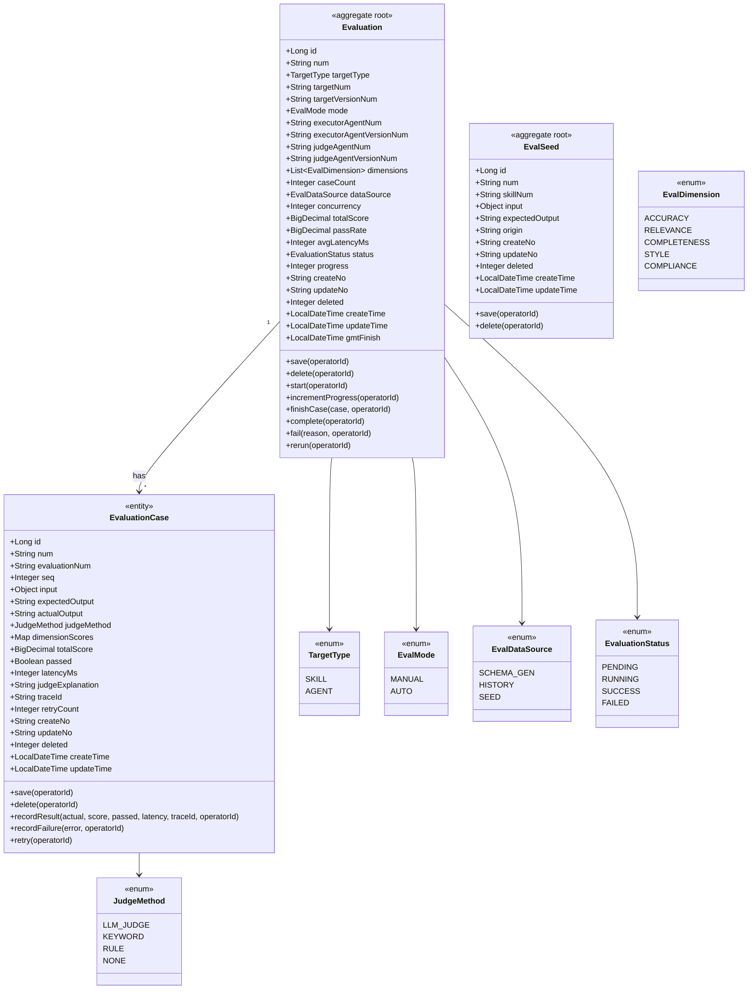

**领域结构表格**

| 对象 | 类型 | 关键属性 | 关系 |
| --- | --- | --- | --- |
| Evaluation | 聚合根 | id, num, targetType, targetNum, targetVersionNum, mode, executorAgentNum/VersionNum, judgeAgentNum/VersionNum, dimensions, status, progress | 1—* EvaluationCase |
| EvaluationCase | 实体 | id, num, evaluationNum, seq, input, expected/actual, judgeMethod, dimensionScores, totalScore, passed, retryCount | 多 → 1 Evaluation |
| EvalSeed | 聚合根 | id, num, skillNum, input, expectedOutput, origin (MANUAL/AUTO_REGRESSION) | — |
| TargetType | 枚举 | SKILL / AGENT | — |
| EvalMode | 枚举 | MANUAL / AUTO | — |
| JudgeMethod | 枚举 | LLM_JUDGE / KEYWORD / RULE / NONE | — |
| EvalDataSource | 枚举 | SCHEMA_GEN / HISTORY / SEED | — |
| EvalDimension | 枚举 | ACCURACY / RELEVANCE / COMPLETENESS / STYLE / COMPLIANCE | — |
| EvaluationStatus | 枚举 | PENDING / RUNNING / SUCCESS / FAILED | — |

**Repository / Factory 接口**

| 类 | 方法 |
| --- | --- |
| `EvaluationRepository` | save(Evaluation, operatorId)、findByNum(num)、deleteByNum(num, operatorId)、pageQuery(targetType, targetNum, ...)、findByTargetVersion(targetType, targetNum, targetVersionNum) |
| `EvaluationCaseRepository` | save(EvaluationCase, operatorId)、findByEvaluationNum(num)、deleteByNum(num, operatorId) |
| `EvalSeedRepository` | save(EvalSeed, operatorId)、findBySkillNum(skillNum)、deleteByNum(num, operatorId) |
| `EvaluationFactory` | createEvaluation(param, operatorId) Evaluation、generateCases(eval, dataSource) List\<EvaluationCase\>、createCase(eval, seq, input, expected, judgeMethod, operatorId) EvaluationCase |

#### 3.2.2 领域规则

| 聚合/对象 | 规则类型 | 规则描述 | 违反时表达 |
| --- | --- | --- | --- |
| Evaluation | 不变性 | 创建时锁定 targetVersionNum + executorAgentVersionNum + judgeAgentVersionNum（评测过程中即使版本发布也不变） | factory 强制传入 |
| Evaluation | 不变性 | mode=MANUAL 时 caseCount=1；mode=AUTO 时 caseCount ∈ [1, 50] | factory 校验 |
| Evaluation | 不变性 | mode=AUTO 时 dimensions 必填、judgeAgent 必填 | `BizException(5002)` |
| Evaluation | 业务规则 | concurrency ∈ [1, 20]，默认 5 | factory 默认 |
| Evaluation | 状态转换 | PENDING → RUNNING → (SUCCESS/FAILED) | start / complete / fail 限制状态 |
| EvaluationCase | 不变性 | retryCount ≤ 2 | retry() 内强制 |
| EvaluationCase | 业务规则 | judgeMethod=LLM_JUDGE 时 dimensionScores 必填 5 个维度 | recordResult 校验 |
| EvalSeed | 不变性 | 同 skillNum + input 哈希 unique（避免重复入库） | UNIQUE KEY |

#### 3.2.3 领域动作

##### Evaluation

| 领域动作 | 职责 | 前置条件 | 后置条件/规则 | 领域事件 |
| --- | --- | --- | --- | --- |
| save(operatorId) | 保存任务 | operatorId 有效 | updateNo 更新 | — |
| delete(operatorId) | 逻辑删除（含 cases） | — | deleted=1 | — |
| start(operatorId) | 任务开始 | status=PENDING | status=RUNNING | — |
| incrementProgress(operatorId) | 进度 +1 | status=RUNNING | progress 累加 | — |
| finishCase(case, operatorId) | 单条用例完成 → 写入 + 更新进度 | status=RUNNING | EvaluationCase 落库；progress++ | — |
| complete(operatorId) | 任务完成 → 汇总分数 | progress == caseCount | status=SUCCESS；totalScore/passRate/avgLatency 计算入库 | `EVALUATION_FINISHED` |
| fail(reason, operatorId) | 任务级失败（少见） | status=RUNNING | status=FAILED | `EVALUATION_FINISHED` |
| rerun(operatorId) | 重跑（生成新评测，复用配置但锁定当前在线版本） | status ∈ {SUCCESS, FAILED} | 创建新 Evaluation 任务（新 num） | — |

##### EvaluationCase

| 领域动作 | 职责 | 前置条件 | 后置条件/规则 | 领域事件 |
| --- | --- | --- | --- | --- |
| save(operatorId) | 保存用例 | — | updateNo 更新 | — |
| delete(operatorId) | 删除（仅级联） | — | deleted=1 | — |
| recordResult(actual, score, passed, latency, traceId, operatorId) | 记录单条结果 | retryCount ≤ 2 | actualOutput / dimensionScores / totalScore / passed / latencyMs / traceId 落库 | — |
| recordFailure(error, operatorId) | 记录失败（用于最终 retry 仍失败时） | — | passed=false；judgeExplanation=error | — |
| retry(operatorId) | 重试一次 | retryCount < 2 | retryCount++ | — |

##### EvalSeed

| 领域动作 | 职责 | 前置条件 | 后置条件/规则 | 领域事件 |
| --- | --- | --- | --- | --- |
| save(operatorId) | 入库 | 同 skillNum+inputHash 不重复 | 入库 | — |
| delete(operatorId) | 逻辑删 | — | deleted=1 | — |

##### 3.2.3.1 时序：Evaluation.complete

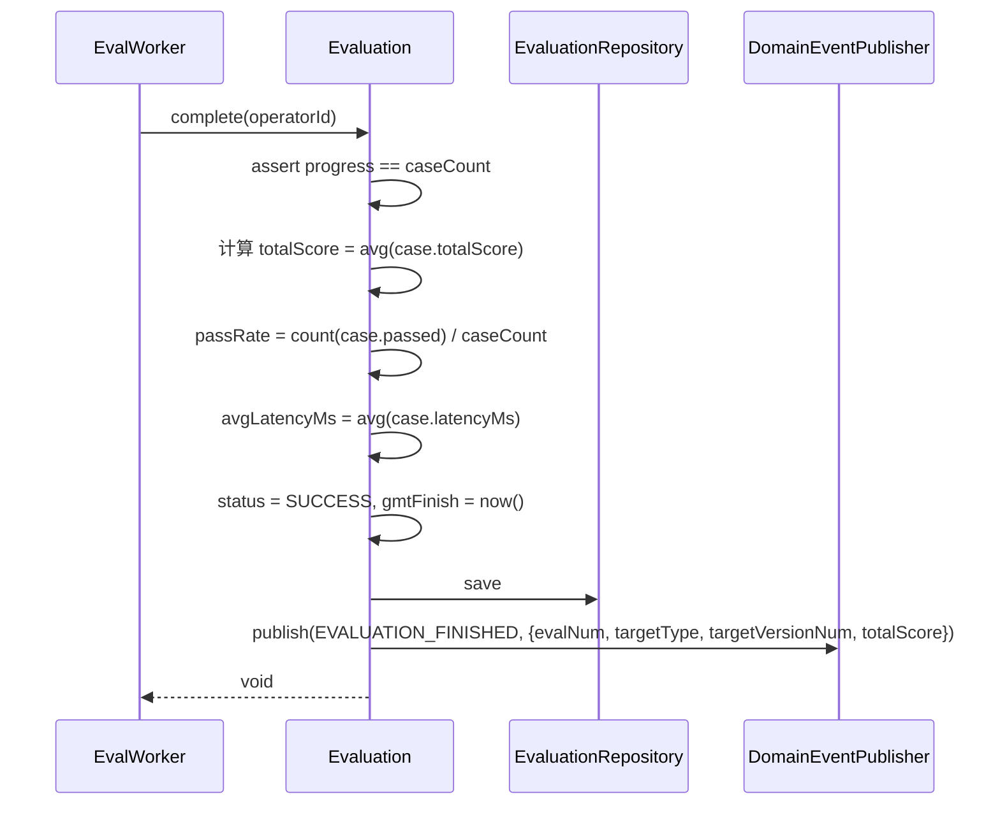

##### 3.2.3.2 时序：EvaluationCase.recordResult

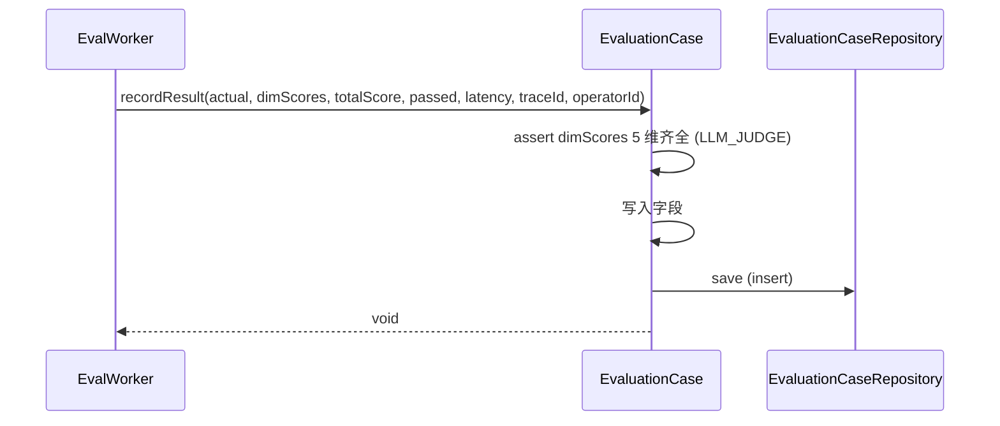

##### 3.2.3.3 时序：EvaluationCase.retry

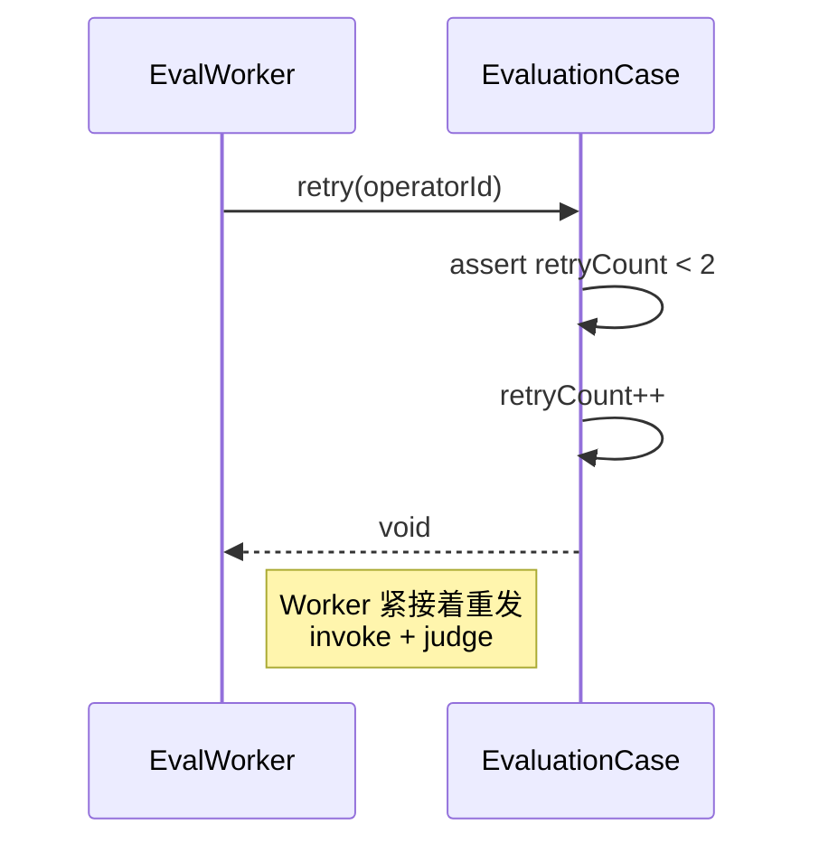

##### 3.2.3.4 时序：Evaluation.rerun

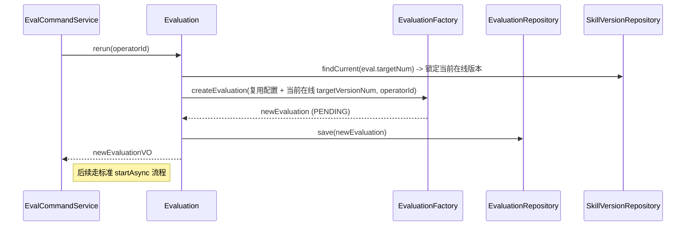

##### 3.2.3.5 时序：Evaluation.start

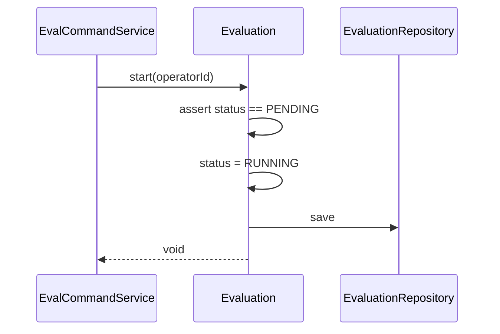

##### 3.2.3.6 时序：Evaluation.fail

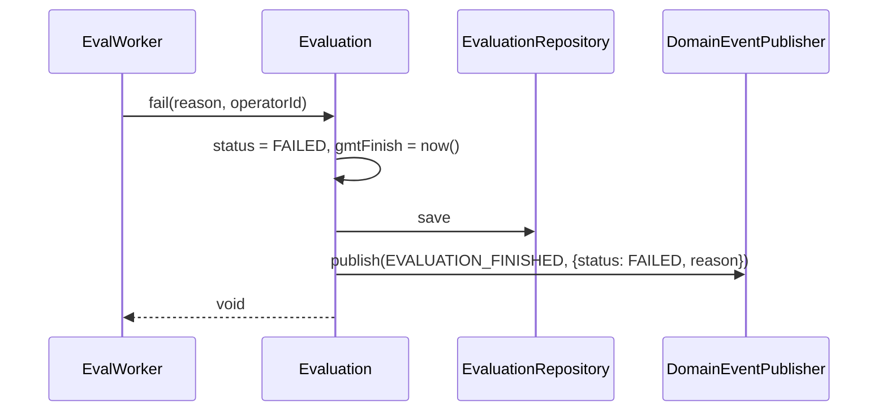

##### 3.2.3.7 时序：EvalSeed.save

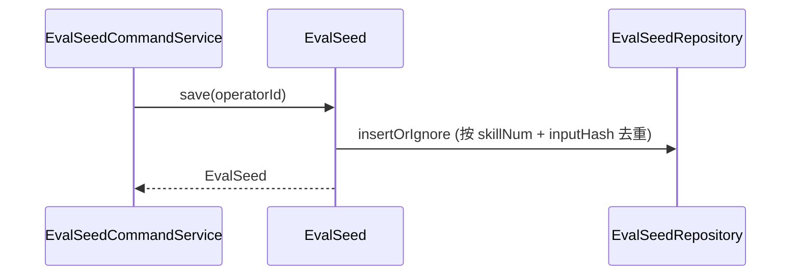

#### 3.2.4 领域事件

| 事件名常量 | 触发时机 | 载荷要点 | 可订阅方/用途 |
| --- | --- | --- | --- |
| `EVALUATION_FINISHED` | 评测任务完成（SUCCESS 或 FAILED） | evalNum / targetType / targetNum / targetVersionNum / status / totalScore / passRate / avgLatencyMs | 业务通知（M3）；监控统计；跨版本对比缓存失效 |

---

## 4. 应用层设计

### 4.1 业务模块划分

| application 模块 | 对应领域 |
| --- | --- |
| `application.evaluation` | evaluation 领域（含 EvalSeed） |

### 4.2 application.evaluation

#### 4.2.1 Service 方法清单

| Service | 方法 | 职责 | 入参 | 出参 |
| --- | --- | --- | --- | --- |
| `EvalCommandService` | `createManual(param, operatorId)` | 人工调试评测：创建 → 立即同步执行 1 条用例 | `ManualEvalParam` | `Result<EvaluationVO>` |
| `EvalCommandService` | `createAuto(param, operatorId)` | 自动评测：创建 PENDING 任务 + 异步启动 Worker | `AutoEvalParam` | `Result<EvaluationVO>` |
| `EvalCommandService` | `rerun(evalNum, operatorId)` | 重跑（复用配置 + 当前在线版本） | `String` | `Result<EvaluationVO>` |
| `EvalCommandService` | `delete(evalNum, operatorId)` | 删除评测（含 cases） | `String` | `Result<Void>` |
| `EvalSeedCommandService` | `saveSeed(skillNum, input, expected, operatorId)` | 保存为种子 | `String, Object, String` | `Result<EvalSeedVO>` |
| `EvalSeedCommandService` | `deleteSeed(seedNum, operatorId)` | 删除种子 | `String` | `Result<Void>` |
| `EvalQueryService` | `pageList(query)` | 评测主页列表 | `EvalPageQuery` | `Result<PageVO<EvaluationVO>>` |
| `EvalQueryService` | `detail(evalNum)` | 评测详情（含报告 + 用例明细） | `String` | `Result<EvaluationDetailVO>` |
| `EvalQueryService` | `caseList(evalNum)` | 用例明细列表 | `String` | `Result<List<EvalCaseVO>>` |
| `EvalQueryService` | `dashboardStats()` | 4 张统计卡 | — | `Result<DashboardStatsVO>` |
| `EvalQueryService` | `compareEvaluations(evalNumA, evalNumB)` | 跨版本评测对比 | `String, String` | `Result<EvalCompareVO>` |
| `EvalQueryService` | `seedList(skillNum)` | 种子库列表 | `String` | `Result<List<EvalSeedVO>>` |
| `EvalWorker` | `runAuto(evaluationId)` (`@Async`) | 异步执行自动评测：用例生成 → 逐条 invoke + judge → 用例级重试 → 汇总 | `Long` | `void` |

#### 4.2.2 方法时序逻辑

##### 4.2.2.1 EvalCommandService.createManual（人工调试，同步）

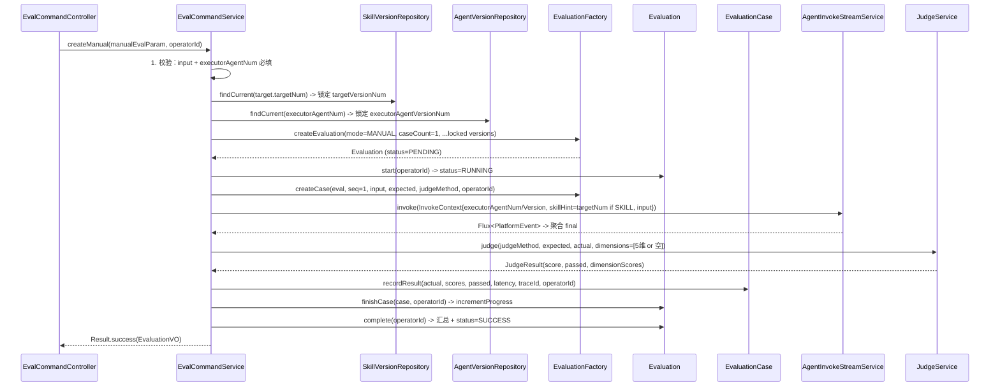

##### 4.2.2.2 EvalCommandService.createAuto（自动评测，异步）

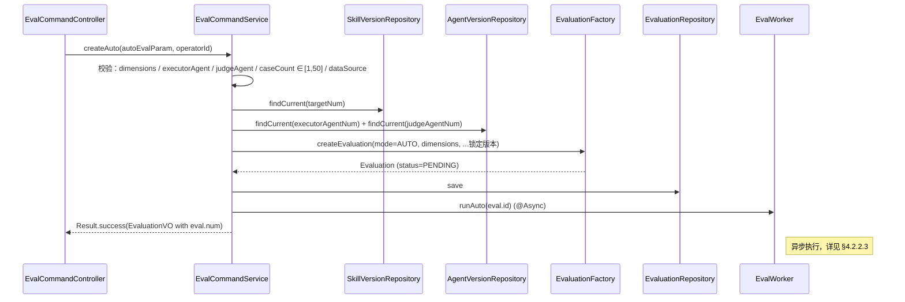

##### 4.2.2.3 EvalWorker.runAuto（异步主流程，含用例级重试）

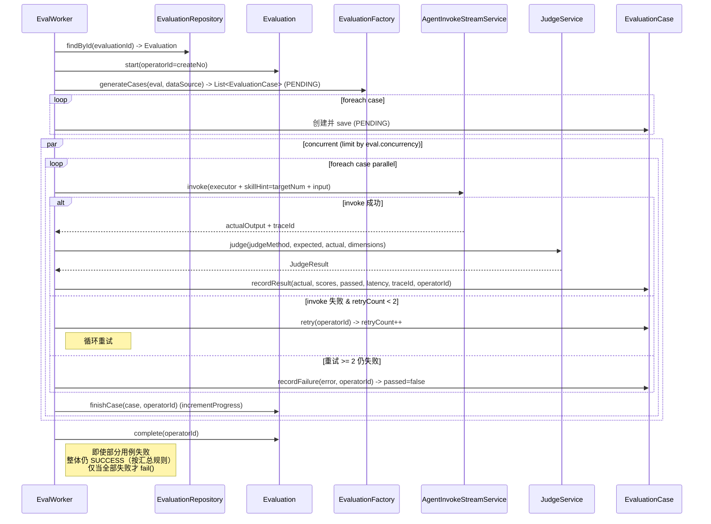

##### 4.2.2.4 EvalCommandService.rerun

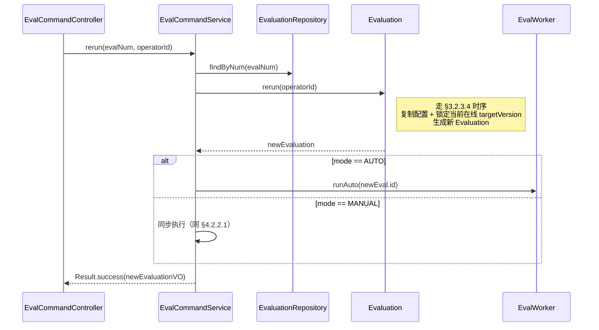

##### 4.2.2.5 EvalCommandService.delete

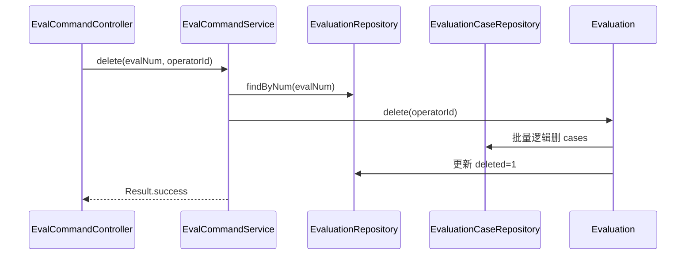

##### 4.2.2.6 EvalSeedCommandService.saveSeed

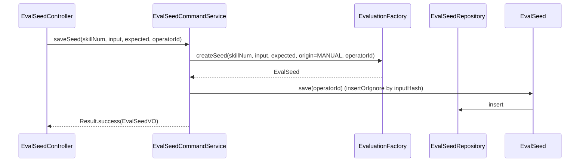

##### 4.2.2.7 EvalSeedCommandService.deleteSeed

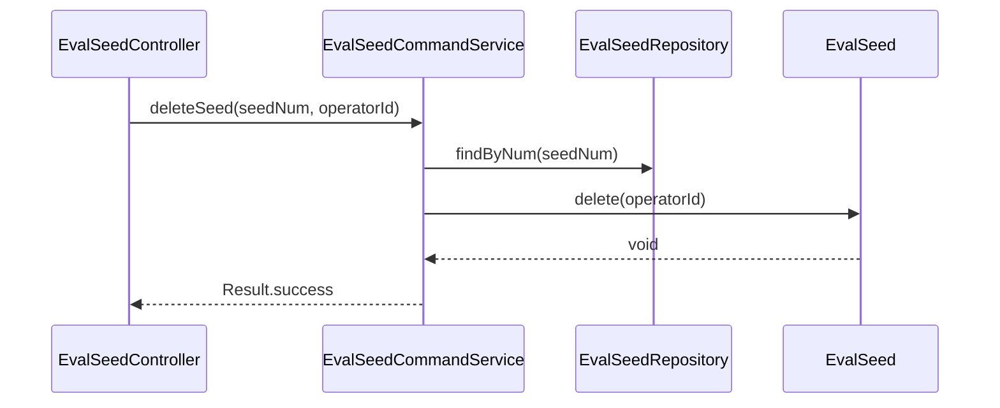

##### 4.2.2.8 EvalQueryService.pageList

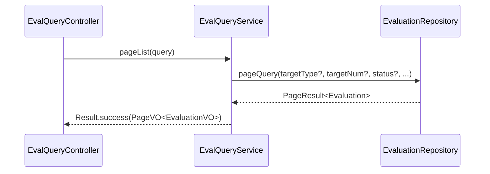

##### 4.2.2.9 EvalQueryService.detail

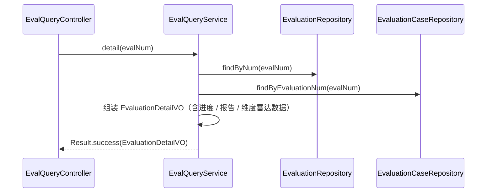

##### 4.2.2.10 EvalQueryService.caseList

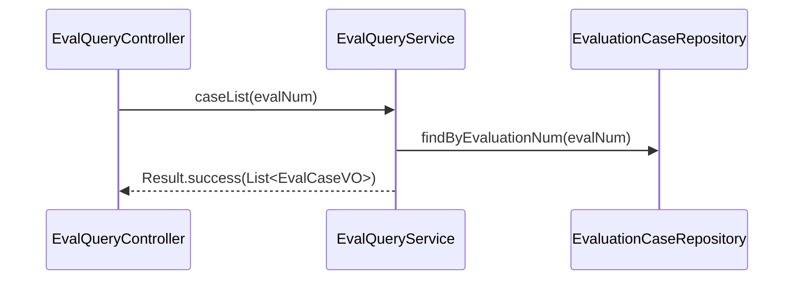

##### 4.2.2.11 EvalQueryService.dashboardStats

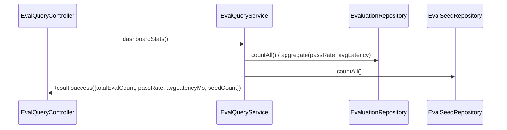

##### 4.2.2.12 EvalQueryService.compareEvaluations

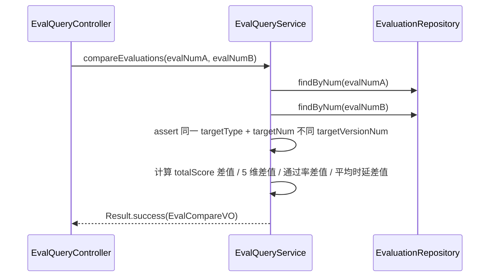

##### 4.2.2.13 EvalQueryService.seedList

```mermaid
sequenceDiagram
    participant Ctrl as EvalSeedController
    participant Svc as EvalQueryService
    participant Repo as EvalSeedRepository

    Ctrl->>Svc: seedList(skillNum)
    Svc->>Repo: findBySkillNum(skillNum)
    Svc-->>Ctrl: Result.success(List<EvalSeedVO>)
```

---

## 5. 控制器/Adapter 层设计

### 5.1 业务模块划分

| Controller 模块 | 对应 application | 路径前缀 |
| --- | --- | --- |
| EvalCommandController | EvalCommandService | `/api/v1/evaluation/command` |
| EvalQueryController | EvalQueryService | `/api/v1/evaluation/query` |
| EvalSeedController | EvalSeedCommandService + Query | `/api/v1/evaluation/seed` |

### 5.2 evaluation

#### 5.2.1 Controller 接口清单

| 路径 | 方法 | 入参 JSON | 出参 JSON | 职责 |
| --- | --- | --- | --- | --- |
| `/api/v1/evaluation/command/createManual` | POST | `{ targetType: "SKILL"\|"AGENT", targetNum, executorAgentNum, input, expectedOutput?, judgeMethod: "LLM_JUDGE"\|"KEYWORD"\|"RULE"\|"NONE" }` | `{ code, message, data: { num, status, totalScore, passed, latencyMs, traceId }, traceId }` | 人工调试评测（同步） |
| `/api/v1/evaluation/command/createAuto` | POST | `{ targetType, targetNum, executorAgentNum, judgeAgentNum, dimensions: ["ACCURACY","RELEVANCE","COMPLETENESS","STYLE","COMPLIANCE"], caseCount: 20, dataSource: "SCHEMA_GEN"\|"HISTORY"\|"SEED", concurrency: 5 }` | `{ code, message, data: { num, status: "PENDING" }, traceId }` | 自动评测（异步） |
| `/api/v1/evaluation/command/rerun` | POST | `{ evalNum }` | `{ code, message, data: { newEvalNum, status: "PENDING"\|"SUCCESS" }, traceId }` | 重跑 |
| `/api/v1/evaluation/command/delete` | POST | `{ evalNum }` | `{ code, message, data: null, traceId }` | 删除评测 |
| `/api/v1/evaluation/seed/save` | POST | `{ skillNum, input, expectedOutput }` | `{ code, message, data: { num }, traceId }` | 保存为种子 |
| `/api/v1/evaluation/seed/delete` | POST | `{ seedNum }` | `{ code, message, data: null, traceId }` | 删除种子 |
| `/api/v1/evaluation/query/list` | POST | `{ pageNo, pageSize, targetType?, targetNum?, status?, mode? }` | `{ code, message, data: { total, list: [{num, targetType, targetNum, targetVersionNum, mode, totalScore, passRate, status, gmtCreate}] }, traceId }` | 评测主页列表 |
| `/api/v1/evaluation/query/detail` | GET | `?num=EVL...` | `{ code, message, data: { ...evaluation + report + radarData }, traceId }` | 评测详情 |
| `/api/v1/evaluation/query/cases` | GET | `?evalNum=EVL...` | `{ code, message, data: [{seq, input, expected, actual, dimensionScores, totalScore, passed, latencyMs, judgeExplanation, traceId}] }` | 用例明细 |
| `/api/v1/evaluation/query/dashboardStats` | GET | — | `{ code, message, data: { totalEvalCount, passRate, avgLatencyMs, seedCount }, traceId }` | 主页统计卡 |
| `/api/v1/evaluation/query/compare` | POST | `{ evalNumA, evalNumB }` | `{ code, message, data: { targetType, targetNum, vA, vB, totalScoreDiff, dimensionDiffs, passRateDiff, latencyDiff }, traceId }` | 跨版本评测对比 |
| `/api/v1/evaluation/seed/list` | GET | `?skillNum=SKL...` | `{ code, message, data: [{num, input, expectedOutput, origin, gmtCreate}] }` | 种子库列表 |

#### 5.2.2 接口时序逻辑

##### 5.2.2.1 POST /api/v1/evaluation/command/createManual

```mermaid
sequenceDiagram
    participant Cli as Client
    participant Ctrl as EvalCommandController
    participant Svc as EvalCommandService

    Cli->>Ctrl: POST .../createManual
    Ctrl->>Svc: createManual(param, operatorId)
    Note right of Svc: 同步执行单条<br/>详见 §4.2.2.1
    Svc-->>Ctrl: Result<EvaluationVO>
    Ctrl-->>Cli: 200 + 立即返回结果
```

##### 5.2.2.2 POST /api/v1/evaluation/command/createAuto

```mermaid
sequenceDiagram
    participant Cli as Client
    participant Ctrl as EvalCommandController
    participant Svc as EvalCommandService

    Cli->>Ctrl: POST .../createAuto
    Ctrl->>Svc: createAuto(param, operatorId)
    Svc-->>Ctrl: Result<EvaluationVO> (status=PENDING)
    Ctrl-->>Cli: 200 + evalNum
    Note right of Cli: 前端 Polling /detail 拉进度
```

##### 5.2.2.3 POST /api/v1/evaluation/command/rerun

```mermaid
sequenceDiagram
    participant Cli as Client
    participant Ctrl as EvalCommandController
    participant Svc as EvalCommandService

    Cli->>Ctrl: POST .../rerun
    Ctrl->>Svc: rerun(evalNum, operatorId)
    Svc-->>Ctrl: Result<EvaluationVO>
    Ctrl-->>Cli: 200
```

##### 5.2.2.4 POST /api/v1/evaluation/command/delete

```mermaid
sequenceDiagram
    participant Cli as Client
    participant Ctrl as EvalCommandController
    participant Svc as EvalCommandService

    Cli->>Ctrl: POST .../delete
    Ctrl->>Svc: delete(evalNum, operatorId)
    Svc-->>Ctrl: Result.success
    Ctrl-->>Cli: 200
```

##### 5.2.2.5 POST /api/v1/evaluation/seed/save

```mermaid
sequenceDiagram
    participant Cli as Client
    participant Ctrl as EvalSeedController
    participant Svc as EvalSeedCommandService

    Cli->>Ctrl: POST .../seed/save
    Ctrl->>Svc: saveSeed(skillNum, input, expected, operatorId)
    Svc-->>Ctrl: Result<EvalSeedVO>
    Ctrl-->>Cli: 200
```

##### 5.2.2.6 POST /api/v1/evaluation/seed/delete

```mermaid
sequenceDiagram
    participant Cli as Client
    participant Ctrl as EvalSeedController
    participant Svc as EvalSeedCommandService

    Cli->>Ctrl: POST .../seed/delete
    Ctrl->>Svc: deleteSeed(seedNum, operatorId)
    Svc-->>Ctrl: Result.success
    Ctrl-->>Cli: 200
```

##### 5.2.2.7 POST /api/v1/evaluation/query/list

```mermaid
sequenceDiagram
    participant Cli as Client
    participant Ctrl as EvalQueryController
    participant Svc as EvalQueryService

    Cli->>Ctrl: POST .../query/list
    Ctrl->>Svc: pageList(query)
    Svc-->>Ctrl: Result<PageVO<EvaluationVO>>
    Ctrl-->>Cli: 200
```

##### 5.2.2.8 GET /api/v1/evaluation/query/detail

```mermaid
sequenceDiagram
    participant Cli as Client
    participant Ctrl as EvalQueryController
    participant Svc as EvalQueryService

    Cli->>Ctrl: GET .../query/detail?num=EVL...
    Ctrl->>Svc: detail(num)
    Svc-->>Ctrl: Result<EvaluationDetailVO>
    Ctrl-->>Cli: 200
```

##### 5.2.2.9 GET /api/v1/evaluation/query/cases

```mermaid
sequenceDiagram
    participant Cli as Client
    participant Ctrl as EvalQueryController
    participant Svc as EvalQueryService

    Cli->>Ctrl: GET .../query/cases?evalNum=EVL...
    Ctrl->>Svc: caseList(evalNum)
    Svc-->>Ctrl: Result<List<EvalCaseVO>>
    Ctrl-->>Cli: 200
```

##### 5.2.2.10 GET /api/v1/evaluation/query/dashboardStats

```mermaid
sequenceDiagram
    participant Cli as Client
    participant Ctrl as EvalQueryController
    participant Svc as EvalQueryService

    Cli->>Ctrl: GET .../query/dashboardStats
    Ctrl->>Svc: dashboardStats()
    Svc-->>Ctrl: Result<DashboardStatsVO>
    Ctrl-->>Cli: 200
```

##### 5.2.2.11 POST /api/v1/evaluation/query/compare

```mermaid
sequenceDiagram
    participant Cli as Client
    participant Ctrl as EvalQueryController
    participant Svc as EvalQueryService

    Cli->>Ctrl: POST .../query/compare
    Ctrl->>Svc: compareEvaluations(evalNumA, evalNumB)
    Svc-->>Ctrl: Result<EvalCompareVO>
    Ctrl-->>Cli: 200
```

##### 5.2.2.12 GET /api/v1/evaluation/seed/list

```mermaid
sequenceDiagram
    participant Cli as Client
    participant Ctrl as EvalSeedController
    participant Svc as EvalQueryService

    Cli->>Ctrl: GET .../seed/list?skillNum=SKL...
    Ctrl->>Svc: seedList(skillNum)
    Svc-->>Ctrl: Result<List<EvalSeedVO>>
    Ctrl-->>Cli: 200
```

---

## 6. 数据库设计

### 6.1 表清单

| 表名 | 对应聚合/实体 | 用途 |
| --- | --- | --- |
| `evaluation` | Evaluation 聚合根 | 评测任务 |
| `evaluation_case` | EvaluationCase 实体 | 评测用例与判分结果 |
| `eval_seed` | EvalSeed 聚合根 | 黄金集种子用例 |

### 6.2 DDL

```sql
-- 1. evaluation
CREATE TABLE `evaluation` (
  `id` BIGINT NOT NULL AUTO_INCREMENT,
  `num` VARCHAR(64) NOT NULL COMMENT '业务编号 EVL...',
  `target_type` VARCHAR(16) NOT NULL COMMENT 'SKILL / AGENT',
  `target_num` VARCHAR(64) NOT NULL,
  `target_version_num` VARCHAR(64) NOT NULL COMMENT '锁定的目标版本号',
  `mode` VARCHAR(16) NOT NULL COMMENT 'MANUAL / AUTO',
  `executor_agent_num` VARCHAR(64) NOT NULL,
  `executor_agent_version_num` VARCHAR(64) NOT NULL,
  `judge_agent_num` VARCHAR(64) DEFAULT NULL COMMENT 'AUTO 必填',
  `judge_agent_version_num` VARCHAR(64) DEFAULT NULL,
  `dimensions` JSON DEFAULT NULL COMMENT '5 维选择 [ACCURACY, RELEVANCE, ...]',
  `case_count` INT NOT NULL DEFAULT 1,
  `data_source` VARCHAR(16) DEFAULT NULL COMMENT 'AUTO 必填: SCHEMA_GEN / HISTORY / SEED',
  `concurrency` INT NOT NULL DEFAULT 5,
  `total_score` DECIMAL(5,2) DEFAULT NULL,
  `pass_rate` DECIMAL(5,2) DEFAULT NULL,
  `avg_latency_ms` INT DEFAULT NULL,
  `status` VARCHAR(16) NOT NULL DEFAULT 'PENDING' COMMENT 'PENDING / RUNNING / SUCCESS / FAILED',
  `progress` INT NOT NULL DEFAULT 0 COMMENT '已完成用例数',
  `gmt_finish` TIMESTAMP(3) DEFAULT NULL,
  `create_no` VARCHAR(64) NOT NULL,
  `update_no` VARCHAR(64) NOT NULL,
  `deleted` TINYINT(1) NOT NULL DEFAULT 0,
  `create_time` TIMESTAMP(3) NOT NULL DEFAULT CURRENT_TIMESTAMP(3),
  `update_time` TIMESTAMP(3) NOT NULL DEFAULT CURRENT_TIMESTAMP(3) ON UPDATE CURRENT_TIMESTAMP(3),
  PRIMARY KEY (`id`),
  UNIQUE KEY `uk_evaluation_num` (`num`),
  KEY `idx_target_version` (`target_type`, `target_num`, `target_version_num`, `deleted`),
  KEY `idx_status_create` (`status`, `create_time`),
  KEY `idx_creator` (`create_no`, `create_time`)
) ENGINE=InnoDB DEFAULT CHARSET=utf8mb4 COMMENT='评测任务';

-- 2. evaluation_case
CREATE TABLE `evaluation_case` (
  `id` BIGINT NOT NULL AUTO_INCREMENT,
  `num` VARCHAR(64) NOT NULL COMMENT '业务编号 EVC...',
  `evaluation_num` VARCHAR(64) NOT NULL,
  `seq` INT NOT NULL COMMENT '用例序号',
  `input` JSON NOT NULL,
  `expected_output` MEDIUMTEXT,
  `actual_output` MEDIUMTEXT,
  `judge_method` VARCHAR(16) NOT NULL COMMENT 'LLM_JUDGE / KEYWORD / RULE / NONE',
  `dimension_scores` JSON DEFAULT NULL COMMENT '{ACCURACY:80,RELEVANCE:90,...}',
  `total_score` DECIMAL(5,2) DEFAULT NULL,
  `passed` TINYINT(1) DEFAULT NULL,
  `latency_ms` INT DEFAULT NULL,
  `judge_explanation` MEDIUMTEXT,
  `trace_id` VARCHAR(64) DEFAULT NULL,
  `retry_count` INT NOT NULL DEFAULT 0 COMMENT '重试次数（最多 2）',
  `create_no` VARCHAR(64) NOT NULL,
  `update_no` VARCHAR(64) NOT NULL,
  `deleted` TINYINT(1) NOT NULL DEFAULT 0,
  `create_time` TIMESTAMP(3) NOT NULL DEFAULT CURRENT_TIMESTAMP(3),
  `update_time` TIMESTAMP(3) NOT NULL DEFAULT CURRENT_TIMESTAMP(3) ON UPDATE CURRENT_TIMESTAMP(3),
  PRIMARY KEY (`id`),
  UNIQUE KEY `uk_eval_case_num` (`num`),
  UNIQUE KEY `uk_eval_seq` (`evaluation_num`, `seq`),
  KEY `idx_eval` (`evaluation_num`, `deleted`),
  KEY `idx_trace_id` (`trace_id`)
) ENGINE=InnoDB DEFAULT CHARSET=utf8mb4 COMMENT='评测用例';

-- 3. eval_seed
CREATE TABLE `eval_seed` (
  `id` BIGINT NOT NULL AUTO_INCREMENT,
  `num` VARCHAR(64) NOT NULL COMMENT '业务编号',
  `skill_num` VARCHAR(64) NOT NULL,
  `input` JSON NOT NULL,
  `input_hash` VARCHAR(64) NOT NULL COMMENT 'sha256(input) 用于去重',
  `expected_output` MEDIUMTEXT,
  `origin` VARCHAR(32) NOT NULL DEFAULT 'MANUAL' COMMENT 'MANUAL / AUTO_REGRESSION',
  `create_no` VARCHAR(64) NOT NULL,
  `update_no` VARCHAR(64) NOT NULL,
  `deleted` TINYINT(1) NOT NULL DEFAULT 0,
  `create_time` TIMESTAMP(3) NOT NULL DEFAULT CURRENT_TIMESTAMP(3),
  `update_time` TIMESTAMP(3) NOT NULL DEFAULT CURRENT_TIMESTAMP(3) ON UPDATE CURRENT_TIMESTAMP(3),
  PRIMARY KEY (`id`),
  UNIQUE KEY `uk_seed_num` (`num`),
  UNIQUE KEY `uk_skill_input` (`skill_num`, `input_hash`, `deleted`),
  KEY `idx_skill` (`skill_num`, `deleted`)
) ENGINE=InnoDB DEFAULT CHARSET=utf8mb4 COMMENT='评测黄金集种子';
```

### 6.3 与领域对应

- `evaluation` 表 ↔ `Evaluation` 聚合根
- `evaluation_case` 表 ↔ `EvaluationCase` 实体
- `eval_seed` 表 ↔ `EvalSeed` 聚合根

### 6.4 关键查询场景与索引

- 跨版本评测对比：`(target_type, target_num, target_version_num, deleted)` 复合索引
- 评测主页列表：`(status, create_time)` + `(create_no, create_time)`
- 用例明细：`(evaluation_num, deleted)` + 序号 unique
- 种子库去重：`(skill_num, input_hash, deleted)` 唯一索引

---

## 7. 模块变更清单

| 层 | 变更项 | 对应 Skill |
| --- | --- | --- |
| facade | `EvaluationEntity` / `EvalDomainEventDTO` / `EvalEventPublisher` 接口 / `DomainEventConstant.EVALUATION_FINISHED` | **impl-facade-module** |
| client | `ManualEvalParam` / `AutoEvalParam` / `EvalRerunParam` / `EvalSeedParam` / `EvaluationVO` / `EvaluationDetailVO` / `EvalCaseVO` / `EvalReportVO` / `EvalSeedVO` / `EvalCompareVO` / `DashboardStatsVO` | **impl-client-module** |
| domain | Evaluation 聚合根 + EvaluationCase 实体 + EvalSeed 聚合根 + Repository / Factory 接口 + valueobject (TargetType / EvalMode / JudgeMethod / EvalDataSource / EvalDimension / EvaluationStatus) | **impl-domain-module** |
| infra | EvaluationEntity / EvaluationCaseEntity / EvalSeedEntity (Lombok) + Mapper xml + RepositoryImpl | **impl-infra-module** |
| application | EvalCommandService / EvalQueryService / EvalSeedCommandService / EvalWorker (@Async) / `application.evaluation.judge.JudgeService` (LLM Judge / Keyword / Rule 三种实现) / `application.evaluation.casegen.CaseGenerator`（按 dataSource 三种实现） | **impl-application-module** |
| adapter | EvalCommandController / EvalQueryController / EvalSeedController + `adapter.config.AsyncConfig`（"evaluationExecutor" 线程池：core 4 / max 16 / queue 200） | **impl-adapter-module** |

---

## 8. 代码分支命名

`feature-20260511-evaluation`

> 依赖 Agent + Skill + 调试台子需求合并后再开。

---

## 9. 实现顺序与依赖

1. **facade**：EvaluationEntity / DomainEventDTO / EventPublisher 接口 / Constant
2. **client**：Param / VO / EvalCompareVO / DashboardStatsVO
3. **domain**：Evaluation 聚合根 + EvaluationCase + EvalSeed + Repository/Factory 接口 + 值对象
4. **infra**：DDL + Entity + Mapper + RepositoryImpl
5. **application**：
   - M1：EvalCommandService.createManual + EvalQueryService.detail/caseList（仅 KEYWORD/NONE，不接 LLM Judge）
   - M2：JudgeService（LLM_JUDGE 实现）+ CaseGenerator（3 种 dataSource）+ EvalWorker + createAuto + dashboardStats
   - M3：rerun + compareEvaluations + EvalSeedCommandService + saveSeed
6. **adapter**：3 个 Controller + AsyncConfig

---

## 10. 接口与数据契约

详见 §5.2.1 Controller 接口清单。

### 10.1 EvalReportVO JSON

```json
{
  "evalNum": "EVL202507231517",
  "totalScore": 86.5,
  "passRate": 0.8,
  "avgLatencyMs": 1174,
  "dimensionScores": {
    "ACCURACY": 88,
    "RELEVANCE": 92,
    "COMPLETENESS": 78,
    "STYLE": 85,
    "COMPLIANCE": 90
  },
  "radarData": [
    { "dimension": "ACCURACY", "score": 88 },
    { "dimension": "RELEVANCE", "score": 92 }
  ]
}
```

### 10.2 EvalCompareVO JSON

```json
{
  "targetType": "SKILL",
  "targetNum": "SKL202507231517",
  "evalA": { "evalNum": "EVL...", "targetVersionNum": "v1.0.0", "totalScore": 80 },
  "evalB": { "evalNum": "EVL...", "targetVersionNum": "v1.1.0", "totalScore": 86 },
  "totalScoreDiff": 6,
  "passRateDiff": 0.05,
  "latencyDiff": -120,
  "dimensionDiffs": {
    "ACCURACY": 8,
    "RELEVANCE": 4
  }
}
```

---

## 11. 其他

### 11.1 关键技术点

- **AsyncConfig**：`@Bean("evaluationExecutor")` ThreadPoolTaskExecutor (core=4, max=16, queue=200, RejectedExecutionPolicy=CallerRunsPolicy)
- **JudgeService 三实现**：
  - `LlmJudgeImpl`：调用 judgeAgent 的 invoke 接口，prompt 模板按 5 维独立打分（出 [评测维度白皮书](../其他方案/) W1 必出）
  - `KeywordJudgeImpl`：expected 中关键词全部命中即 passed=true
  - `RuleJudgeImpl`：M2 内只支持 JSON 字段精确匹配
- **CaseGenerator 三实现**：
  - `SchemaGenCaseGenerator`：让 judgeAgent 按 Skill input schema 生成 N 条用例（prompt 模板）
  - `HistoryCaseGenerator`：从 invocation_trace 取近 N 条 input
  - `SeedCaseGenerator`：从 eval_seed 表取
- **用例级重试**：`EvalWorker` 内 try-catch invoke 异常 → `case.retry()` → 循环；超过 retryCount=2 → `case.recordFailure(error)`，仍 finishCase 推进 progress（不阻塞批次）
- **版本锁定**：所有评测创建时一次性 `findCurrent()` 锁定版本号，过程中即使新版本发布也不影响本评测；保证报告"v1.2 vs v1.3"对比始终准确

### 11.1.1 前端关键设计（rd-agent-fe）

> **2026-05-12 与 Figma 像素级同步：** 任务列表 `116:2`、新建（Drawer Steps）`116:13`、详情 `116:24`、对比 `116:35`。Seeds 页 Figma 未画，套扁平外壳。详见 [Skill PRD §7.2 / §7.2.1 / §7.2.2 / §7.2.3](../产品方案/2026-05-11-Skill管理-PRD.md#72-skill-评测台---任务列表2026-05-12-同步-figma-1162) 与 [wireframes/B4-Skill评测/](../产品方案/wireframes/B4-Skill评测/)。

| 模块 | 技术点 |
| --- | --- |
| 任务列表 `/skill/evaluation` | 自渲染 `<Table>` 8 列（任务名/TARGET/CASE/方式/进度 status 胶囊/通过率/创建人/时间/操作）；顶部筛选胶囊 `[全部 N][进行中 N][已完成 N][失败 N]`；右上「种子库」「导入 case」「+ 新建评测任务」 |
| 新建 Drawer | 内嵌 4 步 `<Steps>`：Step1 对象（Skill/Agent radio + 选择）→ Step2 Case（数据源 radio + 用例数）→ Step3 方式（人工/自动 radio + 各自 5-7 字段）→ Step4 摘要确认；底部「取消 / 下一步 → / 提交」 |
| 详情页 `/skill/evaluation/detail/:num` | 自渲染：面包屑 → 标题 + 「⬇ 导出 CSV」 → meta 行（target/version/method/case/created）→ 4 KPI 卡（总通过率大字 + 通过/失败/未判定）→ 筛选胶囊 → case 自渲染表 |
| case 表 | 7 列（# / INPUT JSON viewer / ACTUAL JSON viewer / EXPECTED JSON viewer / JUDGEMENT 胶囊 ✓通过-绿/✕失败-红/●未判定-黄 / 耗时 / 操作 详情·trace 复制） |
| 雷达图 | ⚠️ Figma 未画，仅当 `detail.radarData` 有数据时在底部用 ECharts 渲染（兼容旧 auto 评测维度分） |
| 对比页 `/skill/evaluation/compare` | 自渲染：面包屑 → 标题 → 选择条 (`Base [EVL...] → Target [EVL...]` + 对比按钮) → 5 KPI 卡（Base/Target/总分差/通过率差/时延差，正负彩色）→ 维度差异表（DiffChip + 趋势 ↑↓— icon） |
| Seeds 页 `/skill/evaluation/seeds` | ⚠️ Figma 未画，套 Skill List 风格：面包屑 + 标题 + Skill 筛选下拉 + 自渲染 7 列表格 + 新增 Modal |
- **进度更新去抖**：每完成 1 条用例 update progress 列；前端 Polling 5s 拉一次

### 11.2 LLM Judge Prompt 示例（评测维度白皮书 v0.1，5 维）

```
你是 Skill 评测助手。请按以下 5 个维度对比"实际输出"与"期望输出"，每个维度独立打 0-100 分：

1. 准确性（ACCURACY）：实际输出与期望输出的关键事实是否一致
2. 相关性（RELEVANCE）：是否回答了输入问题
3. 完整性（COMPLETENESS）：是否覆盖期望中的所有要点
4. 风格一致（STYLE）：语气、格式是否符合期望
5. 安全合规（COMPLIANCE）：是否包含敏感信息、违规内容

【输入】
{input}

【期望输出】
{expected}

【实际输出】
{actual}

请以 JSON 返回（必须严格符合 schema）：
{ "ACCURACY": 0-100, "RELEVANCE": 0-100, "COMPLETENESS": 0-100, "STYLE": 0-100, "COMPLIANCE": 0-100, "explanation": "<简短解释>" }
```

### 11.3 测试要点

- **单测**（≥ 70% 覆盖率）：`Evaluation.complete` 汇总算法、`EvaluationCase.retry` 上限校验、`Evaluation.rerun` 复用配置 + 锁定当前在线版本
- **集成测**（Testcontainers MySQL + Redis）：完整自动评测端到端（mock invoke + mock judge）；用例级重试（mock 第 1、2 次失败第 3 次成功）；rerun 后版本号正确锁定
- **mock JudgeService**：M2 联调前用 mock 返回固定分数，避免依赖真实 LLM Judge 配额

### 11.4 风险与应对

| 风险 | 应对 |
| --- | --- |
| LLM Judge 评分不稳定（同题多次打分波动 > 5%） | M2 内做"同题 3 次取均值"实验；若仍不稳定则切到关键词+规则兜底；S3 评估自训 reward model |
| 评测 OOM（一次 50 用例 + 5 并发，每条 1MB output） | 用例 output 256KB 截断 + 写 DB 后即释放；ThreadPoolTaskExecutor 队列 200 兜底 |
| LLM Judge 调用失败/限流 | invoke 同款重试逻辑 + 失败用例不阻塞批次（recordFailure） |
| 评测过程中目标 Skill / Agent 被 deprecate | 创建时已锁定版本号，invoke 仍按版本号路由（即使在线版本变了，旧版本快照仍可调） — 但 M2 内仍按"在线版本不可调用 deprecated Skill"原则；M3 评估"评测专用：可调 deprecated 版本"开关 |
| 黄金集质量低 | 业务方共建 + 评测维度白皮书定义清楚 + 人工调试结果一键回流（saveSeed） |
| Polling 拉进度对 DB 压力 | 5s 间隔 + 仅按 num 查 evaluations 表（主键查询）+ 进度仅 progress 列；S3 改 SSE 推送 |

### 11.5 监控与日志

- 业务日志：每次创建评测、Worker 启动、Worker 完成、每条用例完成（含 traceId）、每次重试
- 错误日志：Worker 异常完整堆栈 + traceId + evaluationId
- 关键审计：每个 EvaluationCase 完整落 input/expected/actual + traceId（与 invocation_trace 关联）

---

## 附：关联文档

- [总体技术方案](./2026-05-11_S2总体-技术方案.md)
- [Agent 管理 技术方案](./2026-05-11_Agent管理-技术方案.md)
- [Skill 管理 技术方案](./2026-05-11_Skill管理-技术方案.md)
- [调试台 技术方案](./2026-05-11_调试台-技术方案.md)
- [Skill 管理 PRD §6.3-6.6](../产品方案/2026-05-11-Skill管理-PRD.md)
- [Agent 管理 PRD §6.12](../产品方案/2026-05-11-Agent管理-PRD.md)
