# 调试台 — 技术方案

> 文档日期：2026-05-11　|　版本：v1.0　|　覆盖周期：S2（2026-04 ~ 2026-07）
> 上游 PRD：[调试台 PRD](../产品方案/2026-05-11-调试台-PRD.md)
> 总体方案：[2026-05-11_S2总体-技术方案.md](./2026-05-11_S2总体-技术方案.md)

---

## 1. 目标与范围

### 1.1 目标

- **多轮对话调试入口**：选定执行 Agent + 可选调试 Skill，发起 invoke，实时渲染 Bubble 消息流；
- **Skill 步骤级 trace 可视化**：用 Ant Design X ThoughtChain 渲染每一步的入参 / 出参 / 状态 / 耗时；
- **输入器 Text / JSON 双模式**：选定 Skill 且 Skill 有 input schema 时自动切 JSON 并加载 schema 校验；
- **会话与消息管理**：会话列表 / 切换 / 重命名 / 删除；消息历史落库 + 回放；
- **trace_id 全链路**：调试台 → invoke → 工具调用 → 审计日志共享同一 trace。

### 1.2 范围

| 内容 | 范围 |
| --- | --- |
| 业务领域 | `session`（含 message + invocation_trace） |
| 涉及层 | facade / client / domain / infra / application / adapter（前端 web 详见 §11） |
| 不涉及 | invoke 真正的 LLM 调用（在 Agent 子需求 AgentInvokeStreamService）、Skill schema 加载（Skill 子需求） |

### 1.3 与公共方案的关系

- 复用 `InputType` / `EventType` / `PlatformEvent`（共享值对象）
- 复用公共骨架（Result / GlobalExceptionHandler / UserContext / TraceContext / BizNumGenerator）
- 调用 Agent 子需求的 `AgentInvokeStreamService.invoke(...)` 取 `Flux<PlatformEvent>`

---

## 2. 架构设计（仅代码结构）

| 层 | 领域 | 包 | 职责 |
| --- | --- | --- | --- |
| facade | session | `ink.garry.rd.agent.ws.facade.session` | SessionEntity（跨模块共享）、MessageEntity、InvocationTraceEntity、SessionDomainEventDTO、SessionEventPublisher 接口、`DomainEventConstant.SESSION_*` / `INVOCATION_FINISHED` |
| client | session | `ink.garry.rd.agent.ws.client.session` | SessionVO、SessionListVO、MessageVO、StepChainVO（PlatformEvent 序列化 VO）、SessionRenameParam、SessionListQuery |
| client | debugconsole | `ink.garry.rd.agent.ws.client.debugconsole` | DebugInvokeRequest（含 input/input_type/skill_hint/session_num）+ 复用 client.agent.InvokeEventVO |
| domain | session | `ink.garry.rd.agent.ws.domain.session` | Session 聚合根（含 Message 实体）+ factory + repository + valueobject |
| domain | session.factory | `ink.garry.rd.agent.ws.domain.session.factory` | SessionFactory |
| domain | session.repository | `ink.garry.rd.agent.ws.domain.session.repository` | SessionRepository、MessageRepository、InvocationTraceRepository |
| domain | session.valueobject | `ink.garry.rd.agent.ws.domain.session.valueobject` | MessageRole、StepChain、StepNode、InputType（共享）、InvocationStatus |
| infra | persistence.session | `ink.garry.rd.agent.ws.infra.persistence.session` | SessionEntity / MessageEntity / InvocationTraceEntity (Lombok) + Mapper + RepositoryImpl |
| application | session | `ink.garry.rd.agent.ws.application.session` | SessionCommandService、SessionQueryService |
| application | debugconsole | `ink.garry.rd.agent.ws.application.debugconsole` | DebugInvokeStreamService（编排 Session.create + AgentInvokeStreamService + 异步落库 Message+Trace） |
| adapter | debugconsole | `ink.garry.rd.agent.ws.adapter.debugconsole` | DebugInvokeController（SSE）、SessionController |

---

## 3. 领域模型设计

### 3.1 业务层级划分

| 层级 | 业务领域 | 说明 |
| --- | --- | --- |
| L2 运行层 | session | 调试 / 外部调用的会话与消息历史；含 invocation_trace 审计 |

### 3.2 session 领域

#### 3.2.1 领域模型

**聚合与边界**

- 聚合根：`Session`
- 实体：`Message`（聚合内）、`InvocationTrace`（聚合内审计实体）
- 值对象：`MessageRole`、`InputType`（共享）、`StepChain`、`StepNode`、`InvocationStatus`
- 跨聚合引用：仅 `agentNum` / `agentVersionNum`（指向 Agent 聚合，会话起始时锁定）

**领域类图**

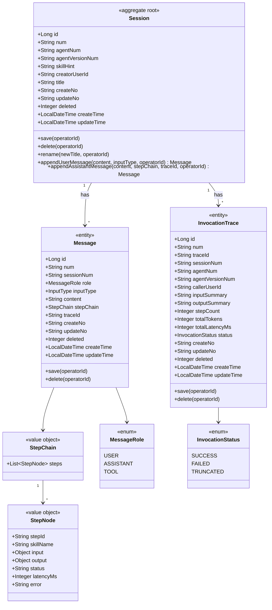

**领域结构表格**

| 对象 | 类型 | 关键属性 | 关系 |
| --- | --- | --- | --- |
| Session | 聚合根 | id, num, agentNum, agentVersionNum, skillHint, creatorUserId, title | 1—* Message；1—* InvocationTrace |
| Message | 实体（聚合内） | id, num, sessionNum, role, inputType, content, stepChain (JSON), traceId | 多 → 1 Session |
| InvocationTrace | 实体（聚合内审计） | id, num, traceId, sessionNum, agentNum, agentVersionNum, status, latency, tokens | 多 → 1 Session |
| StepChain | 值对象 | steps: List\<StepNode\> | — |
| StepNode | 值对象 | stepId, skillName, input, output, status, latencyMs, error | — |
| MessageRole | 枚举 | USER / ASSISTANT / TOOL | — |
| InvocationStatus | 枚举 | SUCCESS / FAILED / TRUNCATED | — |

**Repository / Factory 接口**

| 类 | 方法 |
| --- | --- |
| `SessionRepository` | save(Session, operatorId)、findByNum(num)、deleteByNum(num, operatorId)、pageQuery(creatorUserId, agentNum, pageable) |
| `MessageRepository` | save(Message, operatorId)、findBySessionNumOrderByCreateTime(sessionNum)、deleteByNum(num, operatorId) |
| `InvocationTraceRepository` | save(InvocationTrace, operatorId)、findByTraceId(traceId)、findByNum(num)、deleteByNum(num, operatorId) |
| `SessionFactory` | createSession(agentNum, agentVersionNum, skillHint, creatorUserId, title) Session |

#### 3.2.2 领域规则

| 聚合/对象 | 规则类型 | 规则描述 | 违反时表达 |
| --- | --- | --- | --- |
| Session | 不变性 | 创建时必须锁定 agentVersionNum（即使 Agent 后续发布新版本，本会话仍指向原版本以便回放） | factory 强制传入；不可后改 |
| Session | 业务规则 | 仅 creatorUserId 或平台管理员可改名 / 删除 | `BizException(1003, "无权限")` |
| Session | 业务规则 | 删除会话级联删除其下 Messages 与 InvocationTraces（逻辑删） | 在 `Session.delete` 内编排 |
| Message | 不变性 | role=USER 时必填 inputType（TEXT/JSON）；role=ASSISTANT 时 stepChain 可为空 | factory 校验 |
| Message | 不变性 | content 长度 ≤ 256KB；超过时截断且 stepChain.steps[].input/output 同样 256KB 截断后加 `truncated=true` | 落库前由 application 层截断 |
| InvocationTrace | 不变性 | traceId 全局唯一 | UNIQUE KEY uk_trace_id |
| StepNode | 业务规则 | error 状态步骤不阻塞后续步骤渲染 | application 层不抛异常，按 status=ERROR 落库 |

#### 3.2.3 领域动作

| 聚合/实体 | 领域动作 | 职责 | 前置条件 | 后置条件/规则 | 领域事件 |
| --- | --- | --- | --- | --- | --- |
| Session | save(operatorId) | 保存/更新会话元信息 | operatorId 有效 | updateNo 已更新 | — |
| Session | delete(operatorId) | 逻辑删除会话（级联删 messages + traces） | operatorId 是 creator 或 admin | deleted=1（含子实体） | — |
| Session | rename(newTitle, operatorId) | 重命名 | operatorId 有权限；newTitle 非空且 ≤128 字 | title 更新 | — |
| Session | appendUserMessage(content, inputType, operatorId) | 追加用户消息 | operatorId 是 creator | 新 Message 入库；role=USER | — |
| Session | appendAssistantMessage(content, stepChain, traceId, operatorId) | 追加助手消息（流式完成后批量写入） | session 存在 | 新 Message 入库；role=ASSISTANT；stepChain JSON 落库 | — |
| Message | save(operatorId) | 保存消息 | — | createNo/updateNo 记录 | — |
| Message | delete(operatorId) | 删除消息（仅在删 session 时级联） | — | deleted=1 | — |
| InvocationTrace | save(operatorId) | 落库审计 | traceId 不重复 | 入库 | `INVOCATION_FINISHED` |
| InvocationTrace | delete(operatorId) | 删除审计（仅级联） | — | deleted=1 | — |

##### 3.2.3.1 时序：Session.appendUserMessage

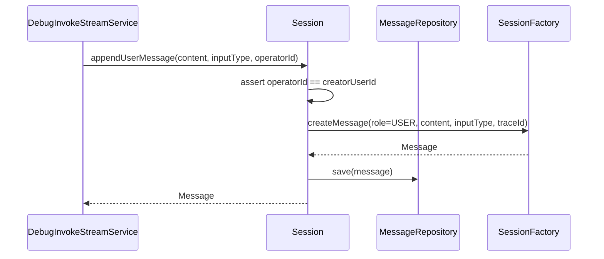

##### 3.2.3.2 时序：Session.appendAssistantMessage

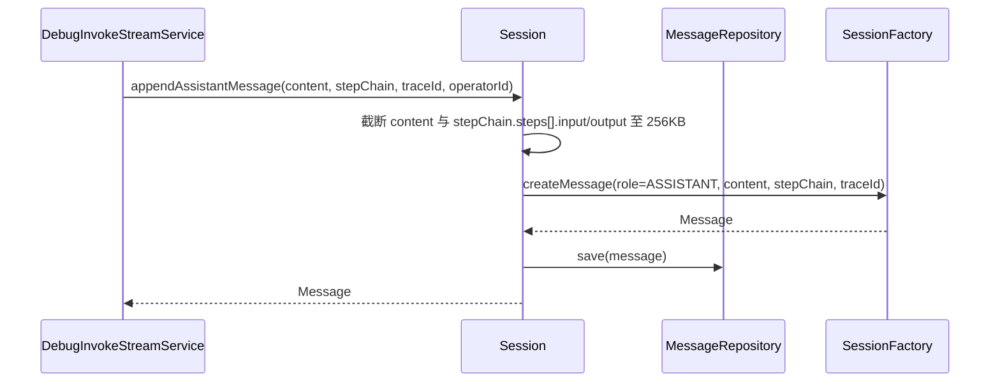

##### 3.2.3.3 时序：Session.delete（级联）

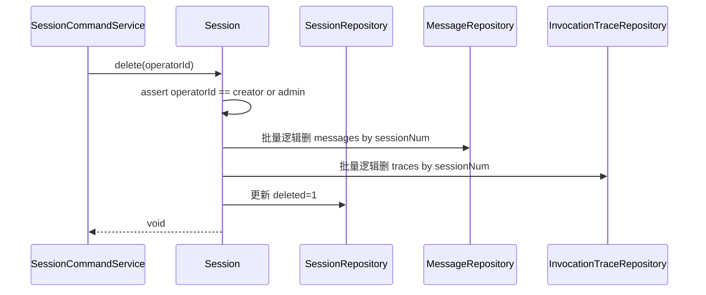

##### 3.2.3.4 时序：Session.rename

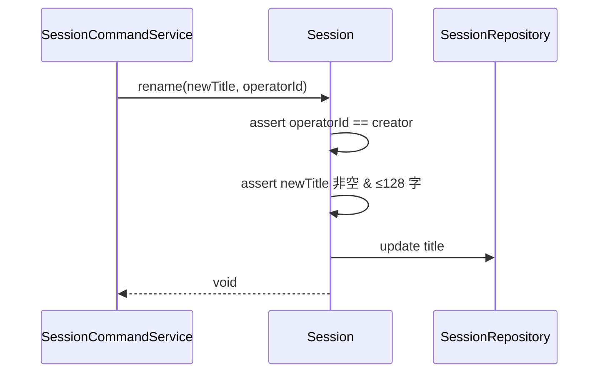

##### 3.2.3.5 时序：InvocationTrace.save

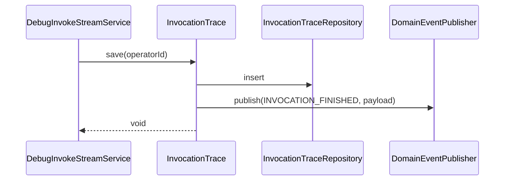

#### 3.2.4 领域事件

| 事件名常量 | 触发时机 | 载荷要点 | 可订阅方/用途 |
| --- | --- | --- | --- |
| `SESSION_CREATED` | 新会话创建 | sessionNum / agentNum / agentVersionNum / creatorUserId | 监控 / 调试台 invalidate 列表缓存 |
| `INVOCATION_FINISHED` | invoke 调用结束（trace 落库） | traceId / sessionNum / agentNum / status / totalLatencyMs | 监控 + 评测 Worker 拉 trace 关联 |

---

## 4. 应用层设计

### 4.1 业务模块划分

| application 模块 | 对应领域 |
| --- | --- |
| `application.session` | Session 元信息管理（CRUD + rename） |
| `application.debugconsole` | 调试台 invoke 编排（依赖 Agent 模块） |

### 4.2 application.session

#### 4.2.1 Service 方法清单

| Service | 方法 | 职责 | 入参 | 出参 |
| --- | --- | --- | --- | --- |
| `SessionCommandService` | `createSession(agentNum, skillHint?, title?, operatorId)` | 创建新会话（锁定 agentVersionNum） | `String, String, String` | `Result<SessionVO>` |
| `SessionCommandService` | `rename(sessionNum, newTitle, operatorId)` | 重命名 | `String, String` | `Result<Void>` |
| `SessionCommandService` | `delete(sessionNum, operatorId)` | 删除会话（级联） | `String` | `Result<Void>` |
| `SessionQueryService` | `pageList(query)` | 列表（按 creatorUserId、agentNum 筛选） | `SessionListQuery` | `Result<PageVO<SessionListVO>>` |
| `SessionQueryService` | `detail(sessionNum)` | 详情（含历史 messages + 锁定的 agentVersionNum） | `String` | `Result<SessionDetailVO>` |
| `SessionQueryService` | `listMessages(sessionNum)` | 加载会话消息历史 | `String` | `Result<List<MessageVO>>` |

#### 4.2.2 方法时序逻辑

##### 4.2.2.1 SessionCommandService.createSession

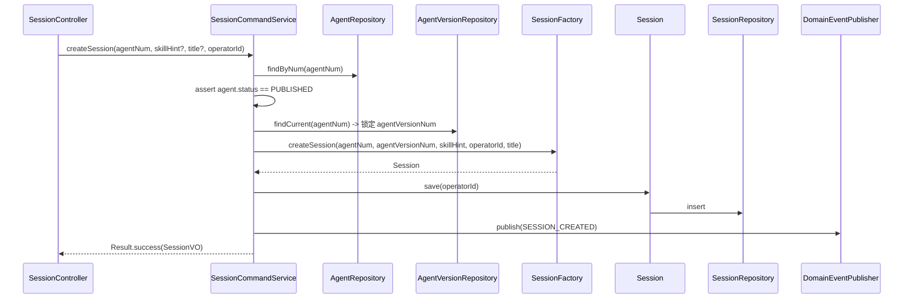

##### 4.2.2.2 SessionCommandService.rename

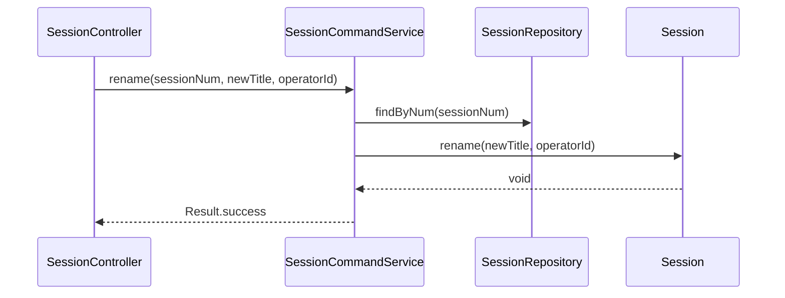

##### 4.2.2.3 SessionCommandService.delete

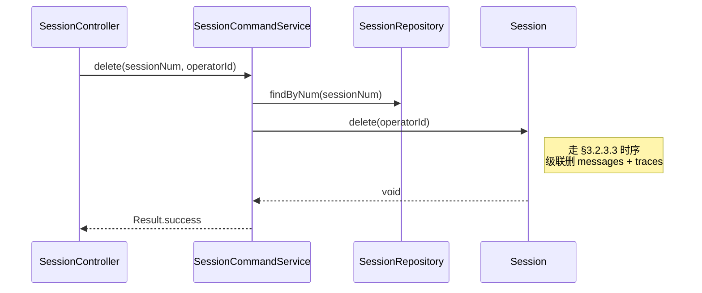

##### 4.2.2.4 SessionQueryService.pageList

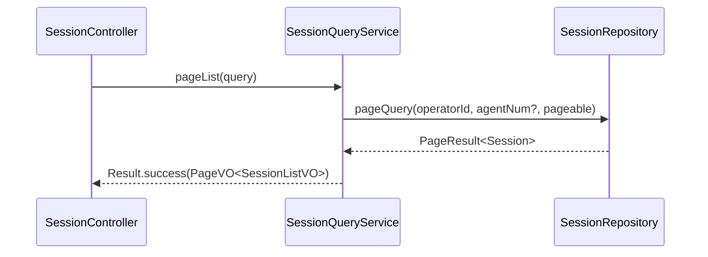

##### 4.2.2.5 SessionQueryService.detail

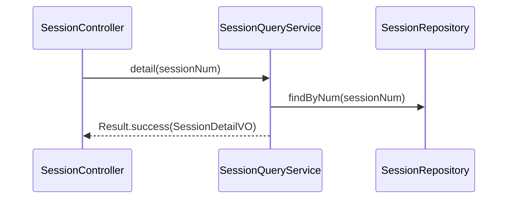

##### 4.2.2.6 SessionQueryService.listMessages

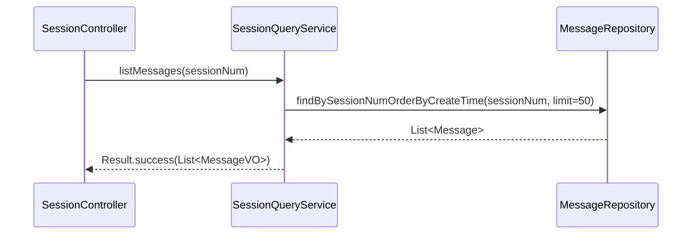

### 4.3 application.debugconsole

#### 4.3.1 Service 方法清单

| Service | 方法 | 职责 | 入参 | 出参 |
| --- | --- | --- | --- | --- |
| `DebugInvokeStreamService` | `invoke(debugInvokeRequest, operatorId)` | 调试台 invoke 编排：缺会话则起新会话 → 落 USER 消息 → 调 AgentInvokeStreamService → 流式回写 + 异步批量落 ASSISTANT 消息 + InvocationTrace | `DebugInvokeRequest` | `Flux<PlatformEvent>` |

#### 4.3.2 方法时序逻辑

##### 4.3.2.1 DebugInvokeStreamService.invoke（核心调用编排）

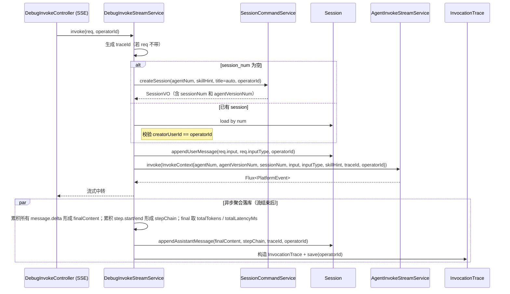

---

## 5. 控制器/Adapter 层设计

### 5.1 业务模块划分

| Controller 模块 | 对应 application | 路径前缀 |
| --- | --- | --- |
| SessionController | SessionCommandService + Query | `/api/v1/session` |
| DebugInvokeController | DebugInvokeStreamService | `/api/v1/debug-console/invoke` (SSE) |

### 5.2 debugconsole

#### 5.2.1 Controller 接口清单

| 路径 | 方法 | 入参 JSON | 出参 JSON | 职责 |
| --- | --- | --- | --- | --- |
| `/api/v1/debug-console/invoke` | POST | `{ agentNum, sessionNum?, input, input_type: "text"\|"json", skill_hint? }` | **`text/event-stream`**（SSE，事件协议见总体方案 §10.1） | 调试台 invoke：缺 session 则起新会话；流式回写 + 异步落库 |
| `/api/v1/session/command/create` | POST | `{ agentNum, skillHint?, title? }` | `{ code, message, data: { num, agentNum, agentVersionNum, title, createTime }, traceId }` | 显式创建会话 |
| `/api/v1/session/command/rename` | POST | `{ num, newTitle }` | `{ code, message, data: null, traceId }` | 重命名 |
| `/api/v1/session/command/delete` | POST | `{ num }` | `{ code, message, data: null, traceId }` | 删除会话 |
| `/api/v1/session/query/list` | POST | `{ pageNo, pageSize, agentNum? }` | `{ code, message, data: { total, list: [{num, agentNum, agentVersionNum, title, lastMessageAt}] }, traceId }` | 会话列表 |
| `/api/v1/session/query/detail` | GET | `?num=SES...` | `{ code, message, data: { num, agentNum, agentVersionNum, skillHint, title, createTime } }` | 会话详情 |
| `/api/v1/session/query/messages` | GET | `?sessionNum=SES...` | `{ code, message, data: [{num, role, inputType?, content, stepChain?, traceId, createTime}] }` | 消息历史 |

#### 5.2.2 接口时序逻辑

##### 5.2.2.1 POST /api/v1/debug-console/invoke (SSE)

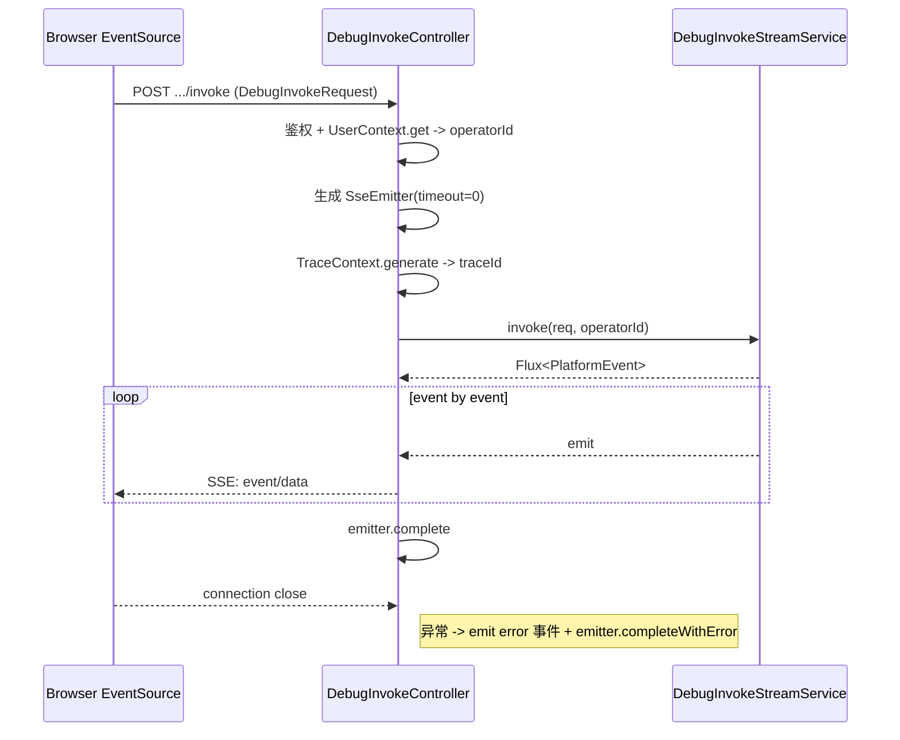

##### 5.2.2.2 POST /api/v1/session/command/create

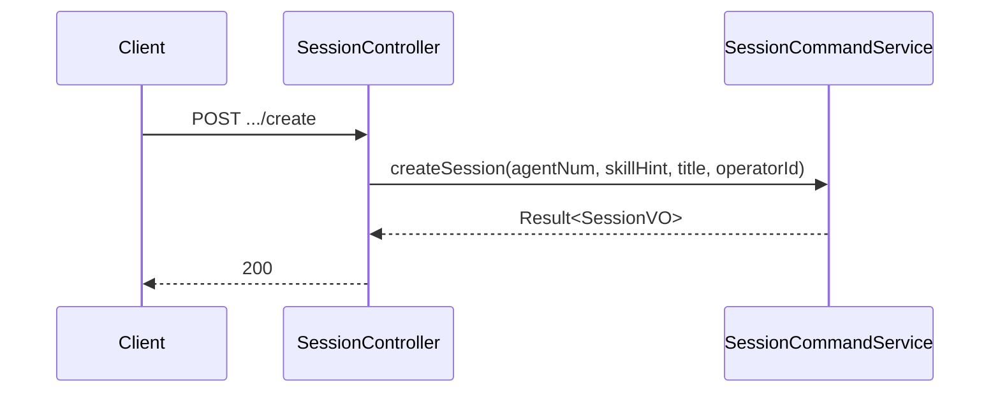

##### 5.2.2.3 POST /api/v1/session/command/rename

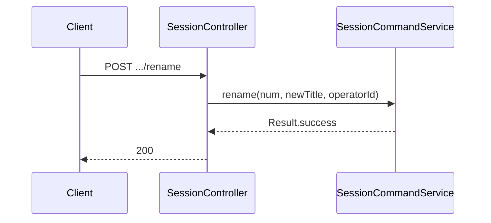

##### 5.2.2.4 POST /api/v1/session/command/delete

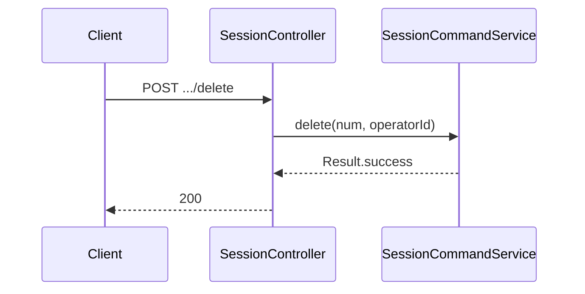

##### 5.2.2.5 POST /api/v1/session/query/list

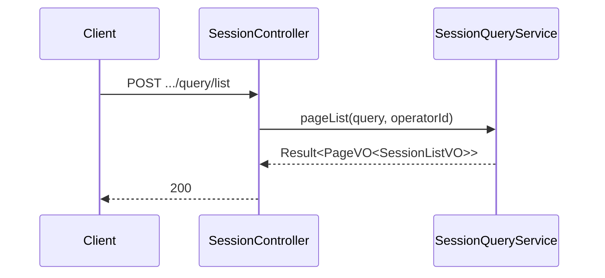

##### 5.2.2.6 GET /api/v1/session/query/detail

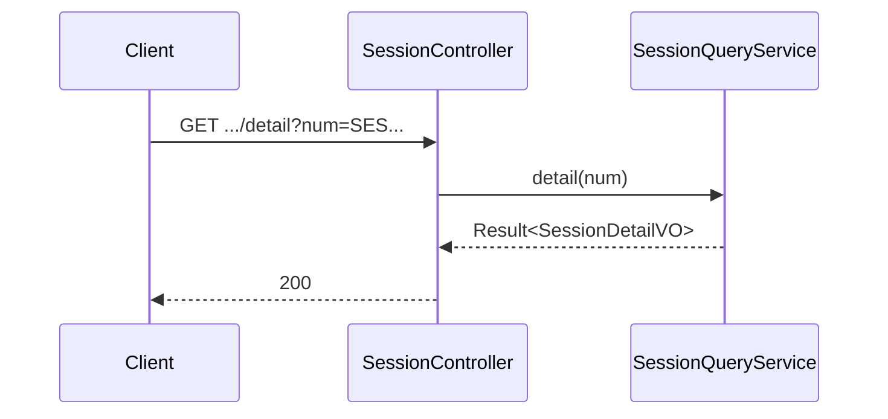

##### 5.2.2.7 GET /api/v1/session/query/messages

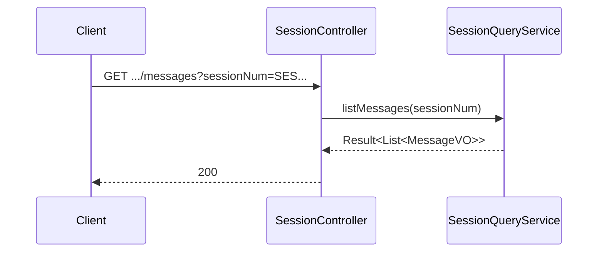

---

## 6. 数据库设计

### 6.1 表清单

| 表名 | 对应聚合/实体 | 用途 |
| --- | --- | --- |
| `session` | Session 聚合根 | 会话元信息（锁定 agentVersionNum） |
| `message` | Message 实体 | 会话内消息（含 stepChain JSON） |
| `invocation_trace` | InvocationTrace 实体 | invoke 调用审计 |

### 6.2 DDL

```sql
-- 1. session
CREATE TABLE `session` (
  `id` BIGINT NOT NULL AUTO_INCREMENT,
  `num` VARCHAR(64) NOT NULL COMMENT '业务编号 SES...',
  `agent_num` VARCHAR(64) NOT NULL,
  `agent_version_num` VARCHAR(64) NOT NULL COMMENT '会话起始时锁定的 Agent 版本',
  `skill_hint` VARCHAR(128) DEFAULT NULL COMMENT '调试 Skill 时的 skill_name',
  `creator_user_id` VARCHAR(64) NOT NULL,
  `title` VARCHAR(128) DEFAULT NULL COMMENT '会话标题',
  `last_message_at` TIMESTAMP(3) DEFAULT NULL COMMENT '最后一条消息时间',
  `create_no` VARCHAR(64) NOT NULL,
  `update_no` VARCHAR(64) NOT NULL,
  `deleted` TINYINT(1) NOT NULL DEFAULT 0,
  `create_time` TIMESTAMP(3) NOT NULL DEFAULT CURRENT_TIMESTAMP(3),
  `update_time` TIMESTAMP(3) NOT NULL DEFAULT CURRENT_TIMESTAMP(3) ON UPDATE CURRENT_TIMESTAMP(3),
  PRIMARY KEY (`id`),
  UNIQUE KEY `uk_session_num` (`num`),
  KEY `idx_creator_agent` (`creator_user_id`, `agent_num`, `deleted`),
  KEY `idx_last_message` (`last_message_at`)
) ENGINE=InnoDB DEFAULT CHARSET=utf8mb4 COMMENT='会话';

-- 2. message
CREATE TABLE `message` (
  `id` BIGINT NOT NULL AUTO_INCREMENT,
  `num` VARCHAR(64) NOT NULL COMMENT '业务编号 MSG...',
  `session_num` VARCHAR(64) NOT NULL,
  `role` VARCHAR(16) NOT NULL COMMENT 'USER / ASSISTANT / TOOL',
  `input_type` VARCHAR(16) DEFAULT NULL COMMENT 'TEXT / JSON（仅 USER）',
  `content` MEDIUMTEXT,
  `step_chain` JSON DEFAULT NULL COMMENT '工具调用步骤链（仅 ASSISTANT）',
  `trace_id` VARCHAR(64) DEFAULT NULL,
  `create_no` VARCHAR(64) NOT NULL,
  `update_no` VARCHAR(64) NOT NULL,
  `deleted` TINYINT(1) NOT NULL DEFAULT 0,
  `create_time` TIMESTAMP(3) NOT NULL DEFAULT CURRENT_TIMESTAMP(3),
  `update_time` TIMESTAMP(3) NOT NULL DEFAULT CURRENT_TIMESTAMP(3) ON UPDATE CURRENT_TIMESTAMP(3),
  PRIMARY KEY (`id`),
  UNIQUE KEY `uk_message_num` (`num`),
  KEY `idx_session_time` (`session_num`, `create_time`, `deleted`),
  KEY `idx_trace_id` (`trace_id`)
) ENGINE=InnoDB DEFAULT CHARSET=utf8mb4 COMMENT='消息';

-- 3. invocation_trace
CREATE TABLE `invocation_trace` (
  `id` BIGINT NOT NULL AUTO_INCREMENT,
  `num` VARCHAR(64) NOT NULL COMMENT '业务编号 TRC...',
  `trace_id` VARCHAR(64) NOT NULL,
  `session_num` VARCHAR(64) DEFAULT NULL,
  `agent_num` VARCHAR(64) NOT NULL,
  `agent_version_num` VARCHAR(64) NOT NULL,
  `caller_user_id` VARCHAR(64) NOT NULL,
  `input_summary` VARCHAR(512) DEFAULT NULL,
  `output_summary` VARCHAR(512) DEFAULT NULL,
  `step_count` INT DEFAULT NULL,
  `total_tokens` INT DEFAULT NULL,
  `total_latency_ms` INT DEFAULT NULL,
  `status` VARCHAR(16) NOT NULL COMMENT 'SUCCESS / FAILED / TRUNCATED',
  `create_no` VARCHAR(64) NOT NULL,
  `update_no` VARCHAR(64) NOT NULL,
  `deleted` TINYINT(1) NOT NULL DEFAULT 0,
  `create_time` TIMESTAMP(3) NOT NULL DEFAULT CURRENT_TIMESTAMP(3),
  `update_time` TIMESTAMP(3) NOT NULL DEFAULT CURRENT_TIMESTAMP(3) ON UPDATE CURRENT_TIMESTAMP(3),
  PRIMARY KEY (`id`),
  UNIQUE KEY `uk_invocation_num` (`num`),
  UNIQUE KEY `uk_trace_id` (`trace_id`),
  KEY `idx_agent_time` (`agent_num`, `create_time`),
  KEY `idx_session` (`session_num`)
) ENGINE=InnoDB DEFAULT CHARSET=utf8mb4 COMMENT='调用审计';
```

### 6.3 与领域对应

- `session` 表 ↔ `Session` 聚合根
- `message` 表 ↔ `Message` 实体
- `invocation_trace` 表 ↔ `InvocationTrace` 实体

### 6.4 关键查询场景与索引

- 会话列表：`(creator_user_id, agent_num, deleted)`
- 消息历史：`(session_num, create_time, deleted)` 复合索引
- trace 查询：`(trace_id)` 唯一索引

---

## 7. 模块变更清单

| 层 | 变更项 | 对应 Skill |
| --- | --- | --- |
| facade | `SessionEntity` / `MessageEntity` / `InvocationTraceEntity` 跨模块描述 / `SessionDomainEventDTO` / `SessionEventPublisher` 接口 / `DomainEventConstant.SESSION_CREATED` / `INVOCATION_FINISHED` | **impl-facade-module** |
| client | `SessionVO` / `SessionListVO` / `SessionDetailVO` / `MessageVO` / `StepChainVO` / `StepNodeVO` / `SessionRenameParam` / `SessionListQuery` / `DebugInvokeRequest` | **impl-client-module** |
| domain | Session 聚合根 + Message + InvocationTrace 实体 + Repository / Factory 接口 + valueobject (MessageRole / StepChain / StepNode / InvocationStatus) | **impl-domain-module** |
| infra | SessionEntity / MessageEntity / InvocationTraceEntity (Lombok) + Mapper xml + RepositoryImpl | **impl-infra-module** |
| application | SessionCommandService / SessionQueryService / DebugInvokeStreamService | **impl-application-module** |
| adapter | SessionController / DebugInvokeController (SSE) | **impl-adapter-module** |

---

## 8. 代码分支命名

`feature-20260511-debug-console`

> 依赖 Agent + Skill 子需求合并后再开。

---

## 9. 实现顺序与依赖

1. **facade**：SessionEntity / DomainEventDTO / EventPublisher 接口 / Constant
2. **client**：SessionVO / MessageVO / StepChainVO / DebugInvokeRequest
3. **domain**：Session 聚合根 + Message + InvocationTrace + Repository/Factory 接口 + 值对象
4. **infra**：DDL + Entity + Mapper + RepositoryImpl
5. **application**：SessionCommandService + SessionQueryService + DebugInvokeStreamService
6. **adapter**：SessionController + DebugInvokeController(SSE)

> M1 内 DebugInvokeStreamService 直接调 Mock AgentInvokeStreamService（在 Agent 子需求 mock 实现；不需要真实 LLM）。

---

## 10. 接口与数据契约

### 10.1 invoke 请求与 SSE 事件

详见 [总体方案 §10.1](./2026-05-11_S2总体-技术方案.md#101-invoke-请求体-json与调试台--评测-reuse)。

### 10.2 StepChainVO / StepNodeVO JSON

```json
{
  "steps": [
    {
      "stepId": "s1",
      "skillName": "jira-summary",
      "input": { "project": "PROJ-X" },
      "output": { "issues": [...] },
      "status": "success",
      "latencyMs": 120,
      "error": null
    },
    {
      "stepId": "s2",
      "skillName": "publish",
      "input": { "channel": "wiki" },
      "output": null,
      "status": "error",
      "latencyMs": 80,
      "error": "permission denied"
    }
  ]
}
```

### 10.3 SessionVO JSON

```json
{
  "num": "SES202507231517",
  "agentNum": "AGT202507231517",
  "agentVersionNum": "v1.2.0",
  "skillHint": "SKL202507231517",
  "title": "本周周报草稿",
  "lastMessageAt": "2026-05-11T14:30:00.000+08:00",
  "createTime": "2026-05-11T14:00:00.000+08:00"
}
```

---

## 11. 其他

### 11.1 前端关键设计（rd-agent-ws-web）

> **2026-05-12 与 Figma `59:2` 像素级同步：** 砍掉 ContextPicker 的 Skill 选择 / Sender 内 Segmented / Welcome 空态。详见 [PRD §7](../产品方案/2026-05-11-调试台-PRD.md#7-原型图--界面说明) 与 [wireframes/B2-调试台/console-main.png](../产品方案/wireframes/B2-调试台/console-main.png)。三处 PRD §6 P0 已改述（Skill 选择、模式切换、Welcome）。

| 模块 | 技术点 |
| --- | --- |
| 智能体调试页面 `/agent/debug`（菜单：智能体中心 → 智能体调试） | `fetch` + `ReadableStream` 自解析 SSE（POST + body，原生 EventSource 不支持）；状态用 React `useReducer`/自定义 hook |
| **页面骨架** | **四段纵向 — Header (56px) / SubToolbar (56px) / 单列居中对话流 (max-width 820) / 居中 Sender (max-width 820)。无常驻会话栏。** |
| **Header** | 自渲染 56px 白底 bottom-border `#E5E7EB`，左 24px padding，文案 `Agent 调试台` 15/500 `#0F172B` |
| **SubToolbar** | **横向 8px gap，全部为自定义 `<ToolbarButton>` (32px 高 / 12px padding / r6 / `#E5E7EB` 边框)：① 🤖 agent dropdown ② 📂 session 胶囊 (含 turns 计数) ③ flex-spacer ④ trace tag (圆角 999) ⑤ + 新对话 ⑥ ⌘J JSON 模式 toggle (active 时填 `#EFF6FF`) ⑦ 🧪 fixtures (M2)。⌘J / Ctrl+J 全局快捷键切换模式。** |
| 输入器 `<DebugSender>` | **接受 `mode: 'text' \| 'json'` prop；text 模式 `<Input.TextArea variant="borderless">` autoSize；json 模式 `@monaco-editor/react`。底部行：左 11/400 `#94A3B8` 提示「Shift+Enter 换行 · ⌘J 切 JSON · 当前输入将作为 input.prompt 字段」（JSON 不合法时显红色错）；右下「⏹ 停止」(loading 时) + 「▶ 发送」(`#3B82F6` 主色)** |
| **消息组件** | **手写 `<UserMessage>` 与 `<AssistantMessage>`，不再用 Antd X `Bubble.List`：** |
| `<MessageHeader>` | avatar (28px 圆) + 用户名 (13/500 `#0F172B`) + 时间戳 (11/400 `#94A3B8`) + rightSlot（assistant 上接状态胶囊 + run_id · 耗时） |
| `<UserMessage>` | avatar 背景 `#EFF6FF`、icon 蓝；气泡 `#F8FAFC` r8 padding 12/16；内容 13/400 |
| `<AssistantMessage>` | avatar 背景 `#3B82F6`、`<ThunderboltFilled>` 白；状态胶囊：streaming `#EFF6FF/#2563EB ● 流式中`、done `#ECFDF5/#10B981 ✓ 已完成`、error `#FEF2F2/#DC2626`；下方四个文本操作按钮（复制 / 重新生成 / 保存为示例 / 分享 run_id），11/400 `#94A3B8` |
| 步骤链 `<StepChainView>` | **重写不用 Antd X `<ThoughtChain>`**：浅灰底卡片 (`#F8FAFC` + `#E5E7EB` r6 padding 10/14) + 折叠标题行 `▸ 已执行 N 步 · type1 → type2 → ...` + 圆点列表（6×6 圆点按 type 分色：thinking `#7C3AED` / tool_use `#059669` / tool_result `#D97706` / text `#2563EB`；error `#EF4444`）；点击单步展开 input/output JSON |
| trace_id 复制 | SubToolbar 右侧 Tag（圆角 999）加 `<CopyOutlined>`，调用 navigator.clipboard.writeText |
| ContextPicker | ⚠️ M1 不再使用（Console 内联 agent dropdown），文件保留待 M2 评测台复用 |

### 11.2 Mock 实现（M1 关键）

`rd-agent-fe/mock/debug.ts`（vite-plugin-mock，Express handler 风格）：

```typescript
import type { Request, Response } from 'express';

export default {
  'POST /api/v1/debug-console/invoke': (req: Request, res: Response) => {
    res.setHeader('Content-Type', 'text/event-stream');
    res.setHeader('Cache-Control', 'no-cache');
    res.setHeader('Connection', 'keep-alive');

    const { input, input_type, skill_hint } = req.body;
    const send = (event: string, data: any) => {
      res.write(`event: ${event}\ndata: ${JSON.stringify(data)}\n\n`);
    };

    let i = 0;
    const events = [
      () => send('message.delta', { content: `收到你的请求：${typeof input === 'string' ? input : JSON.stringify(input)}`, index: 0 }),
      () => send('step.start', { step_id: 's1', skill_name: skill_hint || 'mock-skill', input: input, started_at: new Date().toISOString() }),
      () => send('step.end', { step_id: 's1', output: { ok: true }, status: 'success', latency_ms: 120 }),
      () => send('message.delta', { content: `\n这是模拟的回答。`, index: 1 }),
      () => send('final', { session_num: req.body.sessionNum || 'SES_MOCK', trace_id: 'TRC_MOCK_' + Date.now(), total_tokens: 350, total_latency_ms: 2030 }),
    ];

    const timer = setInterval(() => {
      if (i < events.length) { events[i](); i++; }
      else { clearInterval(timer); res.end(); }
    }, 200);

    req.on('close', () => clearInterval(timer));
  }
};
```

### 11.3 测试要点

- **单测**（≥ 70% 覆盖率）：StepChain 截断逻辑；Session.delete 级联；Message.appendUserMessage 权限校验
- **集成测**（Testcontainers MySQL）：SSE invoke 完整链路（含 mock Agent runner）；trace_id 透传到 message.trace_id 与 invocation_trace.trace_id 一致

### 11.4 风险与应对

| 风险 | 应对 |
| --- | --- |
| SseEmitter 在 Tomcat 默认 200 线程下被打满 | `server.tomcat.threads.max=400`；S3 评估迁 WebFlux |
| 消息流大文本入 DB 撑爆 | 256 KB 截断 + truncated 标记；MEDIUMTEXT（最大 16MB）+ 监控字段长度 |
| Skill 切换时 input schema 加载延迟 | 前端缓存最近 10 个 Skill schema；切换瞬时显示"加载中" |
| 跨 tab 同会话同时编辑导致消息重复入库 | 不解决 S2（前端约束 1 个 tab 1 会话）；S3 加 SSE 客户端唯一标识去重 |
| trace_id 全局唯一性 | Snowflake 单实例足够；多实例需配置 worker_id（公司 K8s 自动注入） |

### 11.5 监控与日志

- 业务日志：每个 invoke 入口（含 agentNum, sessionNum, traceId, skillHint）；每个 SSE 异常断开；每次 session 创建/删除
- 错误日志：完整堆栈 + traceId
- 关键审计：invocation_trace 全量落库（含 status / latency / tokens）

---

## 附：关联文档

- [总体技术方案](./2026-05-11_S2总体-技术方案.md)
- [Agent 管理 技术方案](./2026-05-11_Agent管理-技术方案.md)
- [Skill 管理 技术方案](./2026-05-11_Skill管理-技术方案.md)
- [评测 技术方案](./2026-05-11_评测-技术方案.md)
- [调试台 PRD](../产品方案/2026-05-11-调试台-PRD.md)
