# 工作空间管理 — 技术方案

> 文档日期：2026-06-03　|　版本：v1.0
> 上游 PRD：[2026-06-03 工作空间管理 PRD](../产品方案/2026-06-03-工作空间管理-PRD.md)
> 目标仓库：[rd-agent-be](../代码仓库/rd-agent-be)（六层 Maven 多模块，Java 17 + Spring Boot 3.5）
> BASE_PACKAGE：`ink.garry.rd.agent.ws`
> 兄弟方案：[Skill 管理](./2026-05-11_Skill管理-技术方案.md) · [Agent 管理](./2026-05-11_Agent管理-技术方案.md) · [GCAC-SSO 接入](./2026-05-21_GCAC-SSO接入-完整对接方案.md)

---

## 1. 目标与范围

### 1.1 设计前 12 问共识

| # | 问题 | 共识 |
| --- | --- | --- |
| 1 | 领域归属 | 在 domain 下新增独立领域 `workspace`，与 skill / agent 同级 |
| 2 | 聚合切分 | 单聚合根 `Workspace`，成员关系用两个 `List<String>` 工号数组 `adminList` / `memberList` 直接内聚（不建 WorkspaceMember 实体） |
| 2b | 领域动作收敛 | 工作空间无版本 / 发布等复杂生命周期，**聚合只有 `save` / `delete` 两个领域动作**；"编辑"=整聚合（名称 + 描述 + adminList + memberList）覆盖保存。对应 UI / 接口只有 **创建 / 编辑 / 删除** 三个操作，成员增删与角色调整都在"编辑"里通过整体提交完成 |
| 3 | 改造范围 | **本期全做**：workspace 新领域 + agent / skill 资产表加 `workspace_num` 列 + 查询过滤 + 存量数据迁移 |
| 4 | 跨空间访问拦截 | 全局 `WorkspaceContextInterceptor` + `WorkspaceContextHolder`（ThreadLocal，仿 [UserContextHolder](../代码仓库/rd-agent-be/rd-agent-be-infra/src/main/java/ink/garry/rd/agent/ws/infra/common/util/UserContextHolder.java)） |
| 5 | 默认空间迁移策略 | 全平台一个默认空间 `WS-DEFAULT`，存量 Agent / Skill 全部回填到该空间，存量用户全部入 `members` |
| 6 | WorkspaceContext 存储 | `ThreadLocal<WorkspaceContext>`，Filter 末尾 `clear()`；仿 UserContextHolder 实现 |
| 7 | 通讯录搜索 | 本期扩展 [GcacClient](../代码仓库/rd-agent-be/rd-agent-be-infra/src/main/java/ink/garry/rd/agent/ws/infra/common/client/gcac/GcacClient.java) 新增 `searchProfile(empNoOrName)` 方法 + Gateway 封装 |
| 8 | 删除确认词校验 | **仅前端校验**，后端不二次比对（推翻 PRD 附录 §7 建议） |
| 9 | 站内消息 | 本期**只发领域事件**到 facade.DomainEventPublisher；不接通知通道（事件用于后续扩展，本期 listener 留空实现 / 不订阅） |
| 10 | 审计日志 | 本期不接审计；仅依赖 `create_no / update_no / create_time / update_time` 审计字段 |
| 11 | 子方案拆分 | **单份方案 + 单分支**，按 facade→client→domain→infra→application→adapter 顺序实现 |
| 12 | 字段命名调整 | 与现有项目对齐：用 **`deleted` TINYINT(1)** + `update_no` + `update_time` 表达「逻辑删除 + 删除人 + 删除时间」，不另加 `deleted_at` / `deleted_by` 字段（PRD 附录字段名替换为项目既有规范） |

### 1.2 业务目标

- 收拢 Agent / Skill / 工具等所有资产到「工作空间」这一聚合根之下，作为可见性与归属边界；
- 解除 S2 期间「单工作空间硬编码」的兜底分支，**所有资产查询带 `workspaceNum` 过滤**；
- 提供轻量协作模型：管理员 / 成员两层角色，管理员可加人、改名、删空间。

### 1.3 范围

| 涉及 | 不涉及 |
| --- | --- |
| 新领域 `workspace`（Workspace 聚合根 + adminList / memberList 工号数组） | 跨空间资产共享 / 转移（S3） |
| Workspace CRUD + 成员管理 + 顶栏空间切换器 | 资源级 ACL（S3） |
| 资产表 agent / skill / skill_version 加 `workspace_num` 列 + 索引 + Mapper 改造 | 空间级配额、计费 |
| Application Service 内全部 QueryService 注入空间过滤 | 与 GCAC 部门树映射 |
| 跨空间访问 403 全局拦截 | 通讯录除工号/姓名搜索外的其它字段（仅用 empNo + displayName） |
| GcacClient 扩展 `searchProfile` + `domain.common` 通用 EmployeeDirectoryGateway 封装（员工搜索接口下沉 common） | 审计日志 / 站内消息（仅发领域事件留口） |
| 存量数据迁移脚本（Flyway V11） | 物理删除（坚决软删） |

### 1.4 六层依赖回顾（不展开）

`adapter → application → {client, domain, infra}`；`infra → domain → facade`。本方案不破坏既有依赖方向，所有新增包就位于其层内。详见 [ARCHITECTURE.md §3](../代码仓库/rd-agent-be/ARCHITECTURE.md)。

---

## 2. 架构设计（代码结构）

| 层 | 领域 | 包 | 职责 |
| --- | --- | --- | --- |
| facade | workspace | `ink.garry.rd.agent.ws.facade.domain.workspace` | `WorkspaceEntity`（DomainEntity 子类标识）、`WorkspaceDomainEventDTO`、`WorkspaceDomainEventPublisher` 接口 |
| facade | workspace | `ink.garry.rd.agent.ws.facade.exception` | 复用现有 `BusinessException`；新增错误码常量 `WorkspaceErrorCode`（无空间 / 跨空间访问 / 名称冲突 / 资产非空 / 最后一名管理员） |
| client | workspace | `ink.garry.rd.agent.ws.client.workspace.param` | `WorkspaceCreateParam` / `WorkspaceUpdateParam`（含完整 adminEmpNos / memberEmpNos）/ `WorkspaceDeleteParam` |
| client | workspace | `ink.garry.rd.agent.ws.client.workspace.dto` | `WorkspaceDTO` / `WorkspaceMemberDTO`（infra/application 层间用） |
| client | workspace | `ink.garry.rd.agent.ws.client.workspace.vo` | `WorkspaceVO`（卡片视图）/ `WorkspaceDetailVO`（编辑抽屉）/ `WorkspaceMemberVO`（含 displayName） |
| client | common | `ink.garry.rd.agent.ws.client.common.employee` | **通用**：`EmployeeSearchParam`（param）/ `EmployeeProfileVO`（vo，搜索结果）—— 仿 `client.common.oss` 子包 |
| client | workspace | `ink.garry.rd.agent.ws.client.workspace.constant` | `WorkspaceConstants`（默认空间 num `WS-DEFAULT`、空间名上限、描述上限、成员上限、请求头名 `X-Workspace-Num`） |
| domain | workspace | `ink.garry.rd.agent.ws.domain.workspace` | `Workspace` 聚合根（含 `adminList` / `memberList` 两个 `List<String>` 工号数组） |
| domain | workspace | `ink.garry.rd.agent.ws.domain.workspace.repository` | `WorkspaceRepository`（save / findByNum / deleteByNum） |
| domain | workspace | `ink.garry.rd.agent.ws.domain.workspace.factory` | `WorkspaceFactory`（create + 注入 Publisher） |
| domain | workspace | `ink.garry.rd.agent.ws.domain.workspace.gateway` | `WorkspaceGateway`（generateWorkspaceNum + 名称唯一性预检）/ `WorkspaceReadGateway`（按用户列表 + 全文检索）/ `WorkspaceAssetCountGateway`（统计空间内资产数） |
| domain | workspace | `ink.garry.rd.agent.ws.domain.workspace.dto` | `WorkspaceQueryDTO`（按 empNo 查可见空间）/ `WorkspaceCardDTO`（含成员数）/ `WorkspaceAssetCountDTO`（agent/skill/tool 计数） |
| domain | common | `ink.garry.rd.agent.ws.domain.common.gateway.EmployeeDirectoryGateway` | **通用**：员工通讯录网关接口（searchByEmpNoOrName / findByEmpNo / searchByEmpNos）；workspace 与未来其它领域共用 |
| domain | common | `ink.garry.rd.agent.ws.domain.common.dto.EmployeeProfileDTO` | **通用**：员工档案网关返回 DTO（empNo / displayName / dept） |
| domain | common | `ink.garry.rd.agent.ws.domain.common.DomainEventConstant` | 追加 `WORKSPACE_CREATED` / `WORKSPACE_UPDATED` / `WORKSPACE_DELETED` 共 3 个事件码 |
| infra | workspace | `ink.garry.rd.agent.ws.infra.workspace.entity` | `WorkspaceEntity`（MyBatis-Plus @Data；`admin_list` / `member_list` 为 JSON 字符串列，仿 SkillEntity.tags） |
| infra | workspace | `ink.garry.rd.agent.ws.infra.workspace.mapper` | `WorkspaceMapper`（BaseMapper + 自定义可见空间查询 JSON_CONTAINS） |
| infra | workspace | `ink.garry.rd.agent.ws.infra.workspace.repository` | `WorkspaceRepositoryImpl`（仅注入 WorkspaceMapper；adminList/memberList ↔ JSON 列序列化） |
| infra | workspace | `ink.garry.rd.agent.ws.infra.workspace.factory` | `WorkspaceFactoryImpl`（仅注入 WorkspaceRepository） |
| infra | workspace | `ink.garry.rd.agent.ws.infra.workspace.gateway` | `WorkspaceGatewayImpl` / `WorkspaceReadGatewayImpl` / `WorkspaceAssetCountGatewayImpl`（聚合 Agent / Skill / Tool Mapper 计数） |
| infra | common | `ink.garry.rd.agent.ws.infra.common.gateway.EmployeeDirectoryGatewayImpl` | **通用**：实现 `domain.common.gateway.EmployeeDirectoryGateway`，适配扩展后的 GcacClient，每次实时查 GCAC（不加缓存） |
| infra | common | `ink.garry.rd.agent.ws.infra.common.client.gcac.GcacClient` | **扩展**：新增 `searchProfile(GcacProfileSearchParam)` 方法 + `GcacProfileSearchParam` / `GcacProfileSearchItemDTO` |
| infra | common | `ink.garry.rd.agent.ws.infra.common.util.WorkspaceContextHolder` | ThreadLocal 持有当前请求的 `WorkspaceContext { workspaceNum, role, isMember }`；含 `set / get / currentWorkspaceNum / currentRole / clear` |
| infra | skill | `ink.garry.rd.agent.ws.infra.skill.entity.SkillEntity` | **改造**：增加 `workspaceNum` 字段 + `@TableField("workspace_num")` |
| infra | skill | `ink.garry.rd.agent.ws.infra.skill.mapper.SkillMapper` | **改造**：所有自定义查询 SQL 增加 `AND workspace_num = #{workspaceNum}` |
| infra | agent | `ink.garry.rd.agent.ws.infra.agent.entity.AgentEntity` | **改造**：同上 |
| infra | agent | `ink.garry.rd.agent.ws.infra.agent.mapper.AgentMapper` | **改造**：同上 |
| application | workspace | `ink.garry.rd.agent.ws.application.workspace.command` | `WorkspaceCommandService`（create / update / delete）+ `@Transactional` |
| application | workspace | `ink.garry.rd.agent.ws.application.workspace.query` | `WorkspaceQueryService`（listMyWorkspaces / getDetail） |
| application | common | `ink.garry.rd.agent.ws.application.common.CommonService` | **改造**：新增 `searchEmployees(EmployeeSearchParam)` 方法（通用员工搜索，复用现有 CommonService） |
| application | common | `ink.garry.rd.agent.ws.application.common.listener.WorkspaceDomainEventListener` | 空 listener（订阅 3 个 workspace 事件，本期仅 `log.info`，后续接通知通道） |
| application | skill | `ink.garry.rd.agent.ws.application.skill.query.SkillQueryService` | **改造**：所有 list / detail 接口入参隐式取 `WorkspaceContextHolder.currentWorkspaceNum()` 并传 SkillReadGateway |
| application | agent | `ink.garry.rd.agent.ws.application.agent.query.AgentQueryService` | **改造**：同上 |
| adapter | workspace | `ink.garry.rd.agent.ws.adapter.rest.workspace.WorkspaceCommandController` | POST `/api/v1/workspace/create`、`/api/v1/workspace/update`、`/api/v1/workspace/delete` |
| adapter | workspace | `ink.garry.rd.agent.ws.adapter.rest.workspace.WorkspaceQueryController` | GET `/api/v1/workspace/list`、`/api/v1/workspace/detail` |
| adapter | common | `ink.garry.rd.agent.ws.adapter.common.CommonController` | **改造**：新增 GET `/api/v1/common/employee/search`（通用员工搜索，挂现有 CommonController） |
| adapter | common | `ink.garry.rd.agent.ws.adapter.config.WorkspaceContextInterceptor` | 全局 HandlerInterceptor：从请求头 `X-Workspace-Num` 解析；若非空，校验「调用者是否在该空间内」，否则 403；写入 `WorkspaceContextHolder`；postHandle 中 `clear()` |
| adapter | common | `ink.garry.rd.agent.ws.adapter.config.WebMvcConfig` | **改造**：注册 `WorkspaceContextInterceptor`（排除 `/api/v1/auth/**`、`/api/v1/common/**`、`/api/v1/workspace/list`、`/api/v1/workspace/create`） |

> 包结构与现有 skill / agent 严格对齐；workspace 领域内新增 3 个 Gateway（WorkspaceGateway / WorkspaceReadGateway / WorkspaceAssetCountGateway）的拆分原则：写命令路径用 `WorkspaceGateway`、读路径用 `WorkspaceReadGateway`、跨域读资产计数用独立 `WorkspaceAssetCountGateway`（避免 domain 直接依赖 skill / agent 包）。
>
> **员工搜索下沉 common**：通讯录查询是跨领域通用能力，`EmployeeDirectoryGateway`（接口 + DTO）放 `domain.common`、实现放 `infra.common`、Param/VO 放 `client.common.employee`、对外接口挂现有 `adapter.common.CommonController`（`/api/v1/common/employee/search`）、编排走现有 `application.common.CommonService`，与既有 OSS 通用能力（`client.common.oss` + `infra.common.client.oss` + CommonController `/api/v1/common/oss/*`）同构。workspace 领域通过依赖 `domain.common` 复用该 Gateway（编辑时校验新增成员工号、getDetail 解析 displayName）。
>
> **成员存储简化**：管理员 / 成员不建独立子表与实体，直接以 `adminList` / `memberList` 两个工号字符串数组内聚在 Workspace 聚合中，持久化为 workspace 主表的两个 JSON 列（`admin_list` / `member_list`），与现有 `SkillEntity.tags` 的 JSON 列存储方式一致。

---

## 3. 领域模型设计

### 3.1 业务层级划分

| 层级 | 业务领域 | 说明 |
| --- | --- | --- |
| 平台基础层 | workspace | 资产归属容器，承载多用户协作边界 |
| 资产层（已存在） | agent / skill / tool | 改造：加 `workspaceNum` 外键属性，归属 workspace |

### 3.2 工作空间（workspace）

#### 3.2.1 领域模型

**领域类图（Mermaid）**：

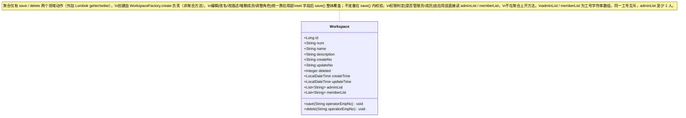

> **为什么聚合只有 save / delete**：工作空间无版本化 / 发布态等复杂生命周期，"编辑"语义就是"把这个空间的最新完整状态存下来"。因此不设 `rename` / `addMember` / `promoteToAdmin` 等细粒度领域动作 —— 应用层把前端提交的完整 `name + description + adminList + memberList` set 进聚合后调用一次 `save()`，由 `save()` 内部统一校验全部不变量并整体落库（JSON 列覆盖写）。
> - **创建**：由 `WorkspaceFactory.create(...)` 装配聚合（工厂职责，非聚合方法），再 `save()`。
> - **权限判定**："是否管理员 / 成员"是应用层鉴权关注点，应用层直接读 `workspace.getAdminList()` / `getMemberList()` 判断，不在聚合上开 `isAdmin` / `containsMember` 之类方法。

**领域结构表**：

| 对象 | 类型 | 属性 | 关系 |
| --- | --- | --- | --- |
| `Workspace` | 聚合根（继承 `DomainEntity`） | `id:Long`、`num:String`（前缀 `WS-` + UUID 后缀，全局唯一）、`name:String`（≤64）、`description:String`（≤200）、`createNo/updateNo/deleted/createTime/updateTime`、`adminList:List<String>`（管理员工号）、`memberList:List<String>`（普通成员工号） | 成员关系内聚在两个工号数组中；通过 `WorkspaceRepository` 整体加载/保存（编辑也走 `save()`，序列化为 JSON 列整体覆盖） |

**聚合与边界**：
- 聚合一致性边界：Workspace 改名 / 改描述 / 增减成员 / 调整角色 / 软删 → 都在同一事务内 `WorkspaceRepository.save(workspace)` 整体落库（adminList / memberList 序列化为两个 JSON 列覆盖写）。
- 角色由"工号在哪个列表"隐式表达：管理员 = 在 `adminList`，成员 = 在 `memberList`；编辑时由前端在两个列表间增删工号，后端整体覆盖。
- `save()` 内统一校验全部不变量（名称 / 描述长度、adminList 非空、两列表互斥、列表内去重），任一不满足抛 `BusinessException`。
- 同一工号互斥：任一工号最多出现在一个列表中。
- 跨聚合仅 ID 引用：资产侧（Agent / Skill）只持有 `workspaceNum` 字符串，**不**反向引用 Workspace 聚合。
- `WorkspaceRepository`（domain 命令路径）方法签名（仅 3 个）：
  ```java
  void save(Workspace aggregate);          // upsert：workspace 行 upsert，adminList/memberList 序列化为 admin_list/member_list 两个 JSON 列整体写
  Workspace findByNum(String num);          // 按 num 加载聚合（JSON 列反序列化为两个 List<String>）；不存在返回 null
  void deleteByNum(String num);             // 硬删调用面（本方案不直接用，所有"删除"走 aggregate.delete + save 的逻辑删；该方法仅满足规范）
  ```
- `WorkspaceReadGateway`（非命令路径，复杂查询走 Mapper）：
  ```java
  List<WorkspaceCardDTO> listVisibleByEmpNo(String empNo);   // "我创建 + 我加入"：WHERE deleted=0 AND (JSON_CONTAINS(admin_list, ?) OR JSON_CONTAINS(member_list, ?))；无分页，单用户上限 50
  Workspace findByCreatorAndName(String creator, String name); // 名称唯一性校验
  ```
- `EmployeeDirectoryGateway`（**位于 `domain.common.gateway`，通用能力**，infra.common 适配 GCAC；workspace 依赖 domain.common 复用）：
  ```java
  List<EmployeeProfileDTO> searchByEmpNoOrName(String keyword, int limit);
  EmployeeProfileDTO findByEmpNo(String empNo);              // 渲染态用，每次实时查 GCAC
  Map<String, EmployeeProfileDTO> searchByEmpNos(Collection<String> empNos); // getDetail 批量解析 displayName
  ```
- `WorkspaceAssetCountGateway`（跨 domain 计数，仅 infra 持有对 agent/skill Mapper 的访问，domain 仅持接口）：
  ```java
  WorkspaceAssetCountDTO countAssets(String workspaceNum);   // { agentCount, skillCount, toolCount=0 (S3 接入) }
  ```

#### 3.2.2 领域规则

| 聚合/对象 | 规则类型 | 规则描述 | 违反时表达 |
| --- | --- | --- | --- |
| Workspace | 名称长度 | `name.length()` ∈ [1, 64]（`save()` 内校验） | `BusinessException("空间名称必须在 1~64 字符之间")` |
| Workspace | 描述长度 | `description == null \|\| description.length() <= 200`（`save()` 内校验） | `BusinessException("空间描述不能超过 200 字符")` |
| Workspace | 名称唯一性 | 在同一 `createNo` 范围内、`deleted=0` 的 Workspace 中 `name` 不重复 | `BusinessException("已存在同名空间，请更换")`（由 Application 层 `WorkspaceReadGateway.findByCreatorAndName` 预检 + DB 唯一索引兜底） |
| Workspace | 至少 1 名管理员 | `adminList` 非空（`save()` 内校验）—— 编辑提交时若清空管理员即拒绝；前端"删除最后一名管理员"按钮亦 disabled | `BusinessException("空间至少保留 1 名管理员")` |
| Workspace | 创建人默认入 admin | `create()` 工厂方法内强制把 creatorEmpNo 放进 `adminList` | 工厂方法内强制 |
| Workspace | 两列表互斥 + 去重 | 同一 `empNo` 不同时出现在 `adminList` 与 `memberList`，各列表内也不重复（`save()` 内校验，重复时去重或报错） | `BusinessException("成员工号重复")` |
| Workspace | 资产非空禁删 | `delete()` 前 Application 层调 `WorkspaceAssetCountGateway.countAssets`，任一非 0 拒删 | `BusinessException("空间内仍有资产，请先清空")`，错误体 `{ blocked: true, counts: {...} }` |
| Workspace | 软删后名称释放 | `deleted=1` 的空间不参与唯一性校验 | 由 `WorkspaceReadGateway.findByCreatorAndName` 默认带 `WHERE deleted=0` 体现 |

> 上述不变量除"名称唯一性 / 资产非空"需借助 Gateway 在应用层预检外，其余全部在聚合 `save()` 内部统一校验，保证无论从哪条路径调用 `save()` 都不会落库非法状态。

#### 3.2.3 领域动作

| 聚合/实体 | 领域动作 | 职责 | 前置条件 | 后置条件/规则 | 领域事件 |
| --- | --- | --- | --- | --- | --- |
| Workspace（工厂） | `WorkspaceFactory.create(name, description, creatorEmpNo, initialAdminEmpNos, initialMemberEmpNos, operatorEmpNo)` | 装配新聚合（非领域动作，工厂方法） | 名称 / 描述长度合法 | num 由 Gateway 生成；creator 入 adminList；其余按入参分配到 adminList / memberList；createNo=updateNo=operatorEmpNo | — |
| Workspace | `save(operatorEmpNo)` | 持久化聚合（创建 / 编辑统一入口）：编辑时由应用层先 set 全部字段（name / description / adminList / memberList）再调用 | 满足全部不变量（名称、描述、adminList 非空、两列表互斥去重）；操作人非空 | upsert workspace（admin_list / member_list JSON 列覆盖写）；新建发 `WORKSPACE_CREATED`、已存在发 `WORKSPACE_UPDATED` | `WORKSPACE_CREATED` / `WORKSPACE_UPDATED` |
| Workspace | `delete(operatorEmpNo)` | 逻辑删除聚合 | Application 层已确认资产为空 | `deleted=1` + updateNo=operatorEmpNo + updateTime=now；publish `WORKSPACE_DELETED` | `WORKSPACE_DELETED` |

> **只有 save / delete 两个领域动作**。"改名 / 改描述 / 增删成员 / 调整角色"不是独立领域动作，而是应用层 `updateWorkspace` 把前端提交的完整状态 set 进聚合后调用 `save()` 完成 —— 与界面的"编辑"单一操作一一对应。创建由 `WorkspaceFactory.create` 负责；权限判定由应用层直接读 `adminList` / `memberList`，均不计入聚合方法。

**时序图 — 创建空间（`WorkspaceFactory.create` + `save`）**：

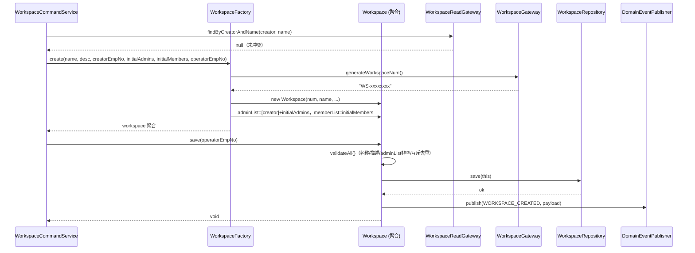

**时序图 — 编辑空间（整聚合覆盖 `save`，涵盖改名/改描述/增删成员/调整角色）**：

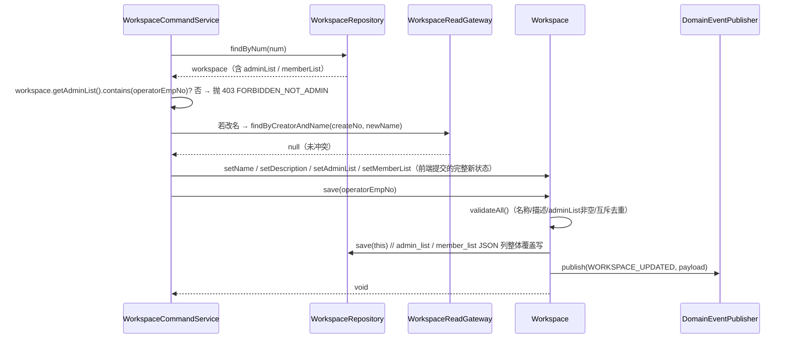

**时序图 — 删除空间（含资产非空预检，`delete` + `save`）**：

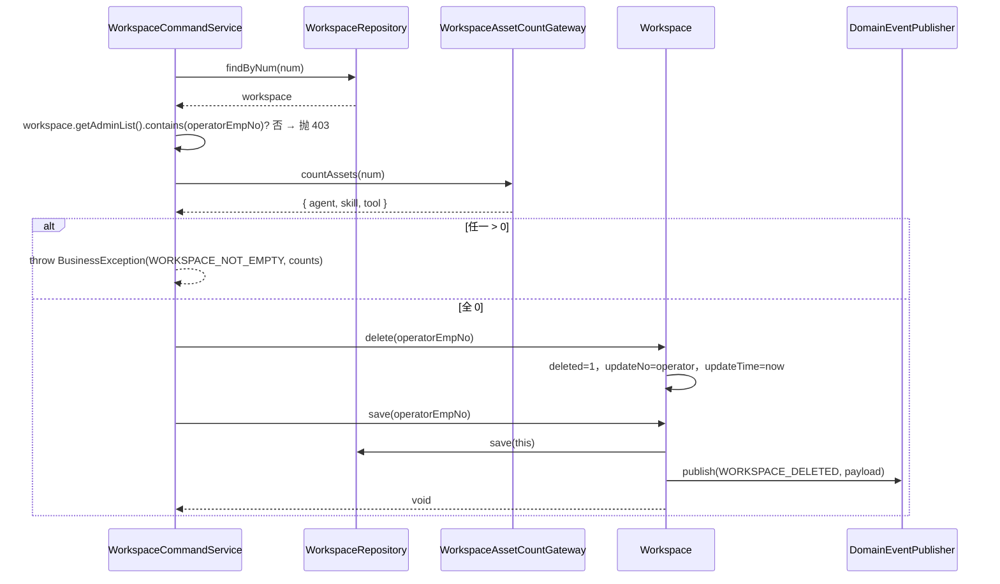

#### 3.2.4 领域事件

| 事件名 | 触发时机 | 载荷要点 | 可订阅方/用途 |
| --- | --- | --- | --- |
| `WORKSPACE_CREATED` | `save()` 时，聚合从 new → persistent 的首次落库 | `{ num, name, creatorEmpNo, adminEmpNos, memberEmpNos, occurredAt }` | application/listener（本期 log；S3 通知 + 审计） |
| `WORKSPACE_UPDATED` | `save()` 时，已存在聚合的编辑落库（名称 / 描述 / 成员任一变化） | `{ num, name, adminEmpNos, memberEmpNos, operatorEmpNo, occurredAt }` | application/listener |
| `WORKSPACE_DELETED` | `delete()` + `save()` 后 | `{ num, name, operatorEmpNo, occurredAt }` | application/listener；S3 接资产清理任务 |

> 仅 3 个事件常量加在 `DomainEventConstant`，事件 payload DTO 统一 `WorkspaceDomainEventDTO`，由 `WorkspaceDomainEventPublisher` 发出。成员的增删与角色变化由 `WORKSPACE_UPDATED` 承载完整 adminEmpNos / memberEmpNos 快照（不再拆细粒度成员事件，与"只有 save / delete 两个领域动作"一致）。

### 3.3 资产领域（agent / skill）— 改造点

> 本期对资产侧的改造**最小化**：仅在持久化层加 `workspace_num` 字段 + 查询过滤，不改聚合根定义本身。

| 聚合根 | 改造 |
| --- | --- |
| `Agent`（domain.agent） | **不改聚合**，仅在 `AgentEntity` + `AgentMapper` 与 Application 层 QueryService 增加空间过滤；agent.workspace_num 由 `AgentFactory.create()` 自动从 `WorkspaceContextHolder.currentWorkspaceNum()` 注入并落库（factory 升级一处） |
| `Skill`（domain.skill） | 同上：`SkillEntity` + `SkillMapper` + `SkillQueryService`；factory 注入 |
| `SkillVersion`（domain.skill） | `SkillVersionEntity` 也加 `workspace_num`，保证版本表查询按空间过滤 |

不在本方案设计资产领域的「领域规则 / 领域动作 / 领域事件」变更（无新增动作；现有动作不受影响）。

---

## 4. 应用层设计

### 4.1 业务模块划分

| 模块 | Service | 与领域映射 |
| --- | --- | --- |
| workspace 命令 | `WorkspaceCommandService` | domain.workspace 的所有写动作 |
| workspace 查询 | `WorkspaceQueryService` | domain.workspace 的读动作（listMyWorkspaces / getDetail） |
| 通用员工搜索 | `CommonService`（改，common 模块） | 经 `domain.common.gateway.EmployeeDirectoryGateway` 搜员工 |
| workspace listener | `WorkspaceDomainEventListener` | 订阅 3 个 workspace 事件，本期仅 log |
| agent 查询改造 | `AgentQueryService`（改） | 注入空间过滤 |
| skill 查询改造 | `SkillQueryService`（改） | 注入空间过滤 |

### 4.2 工作空间命令（workspace.command）

#### 4.2.1 Service 方法清单

| 方法 | 签名 | 职责 | 入参 | 出参 |
| --- | --- | --- | --- | --- |
| `createWorkspace` | `Result<WorkspaceVO> createWorkspace(WorkspaceCreateParam param)` | 创建空间（创建人自动入 adminList） | name / description / initialAdminEmpNos? / initialMemberEmpNos? | 新空间 VO（含 num） |
| `updateWorkspace` | `Result<Void> updateWorkspace(WorkspaceUpdateParam param)` | 编辑空间（整体覆盖：名称 + 描述 + 完整 adminList + 完整 memberList） | num / name / description / adminEmpNos[] / memberEmpNos[] | void；名称冲突 / adminList 为空时抛 `BusinessException` |
| `deleteWorkspace` | `Result<Void> deleteWorkspace(WorkspaceDeleteParam param)` | 软删空间 | num | void；资产非空时抛 `BusinessException("WORKSPACE_NOT_EMPTY", counts)` |

所有命令方法标 `@Transactional(rollbackFor = Exception.class)`；operatorEmpNo 由方法内部从 `UserContextHolder.currentUserId()` 取（不在 Param 显式传，前端不传）。

> **只有 create / update / delete 三个命令**，与界面三个操作一一对应。成员的添加 / 移除 / 升降级全部在 `updateWorkspace` 里完成 —— 前端编辑抽屉里改完管理员 / 成员两栏后，提交**完整的** adminEmpNos / memberEmpNos，应用层 set 进聚合再 `save()` 覆盖。无独立的 addMember / removeMember / changeRole / leave 命令。

#### 4.2.2 方法时序逻辑

**`createWorkspace`**：

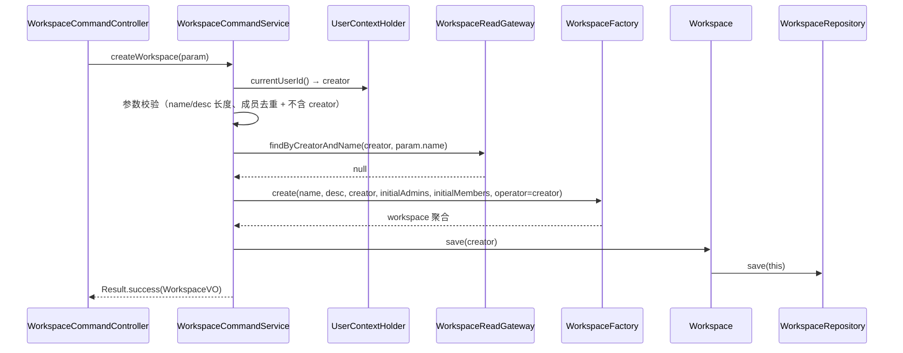

**`updateWorkspace`（编辑：整聚合覆盖）**：

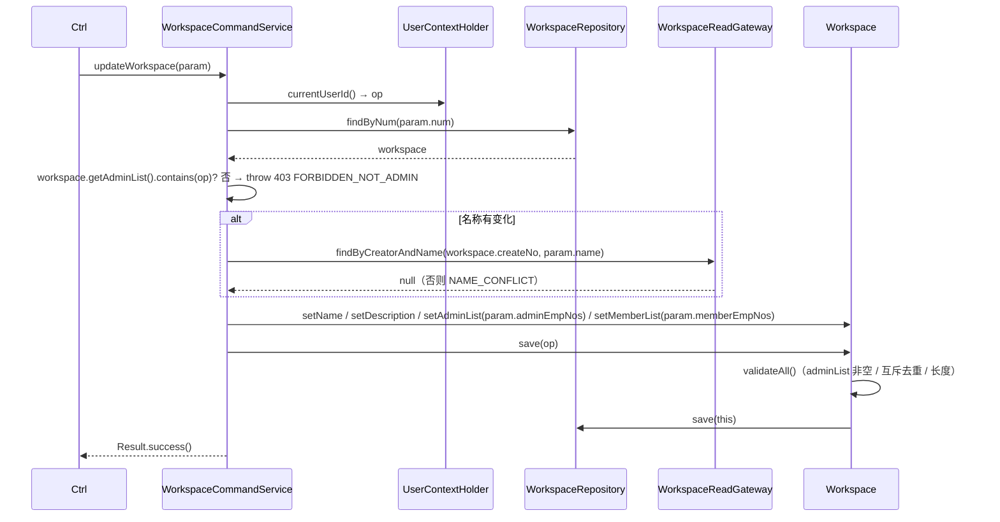

**`deleteWorkspace`**：

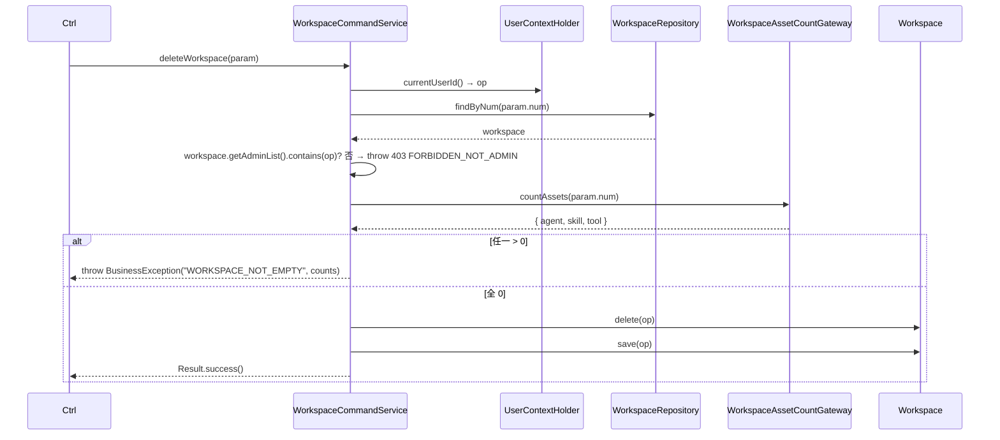

### 4.3 工作空间查询（workspace.query）

#### 4.3.1 Service 方法清单

| 方法 | 签名 | 职责 | 入参 | 出参 |
| --- | --- | --- | --- | --- |
| `listMyWorkspaces` | `Result<List<WorkspaceVO>> listMyWorkspaces()` | "我创建 + 我加入" 的全部空间（含 deleted=0 过滤）；不分页 | — | List<WorkspaceVO>，前端再做搜索过滤 |
| `getDetail` | `Result<WorkspaceDetailVO> getDetail(String num)` | 编辑抽屉用，含成员列表（含 displayName 解析） | num | WorkspaceDetailVO |

查询服务不带 `@Transactional`；`getDetail` 内部通过 `domain.common` 的 `EmployeeDirectoryGateway.searchByEmpNos` 批量解析 displayName。

> **员工搜索不在此**：`searchEmployees` 是跨领域通用接口，已下沉到 `application.common.CommonService`（见 §4.6），不放 WorkspaceQueryService。

#### 4.3.2 方法时序逻辑

**`listMyWorkspaces`**：

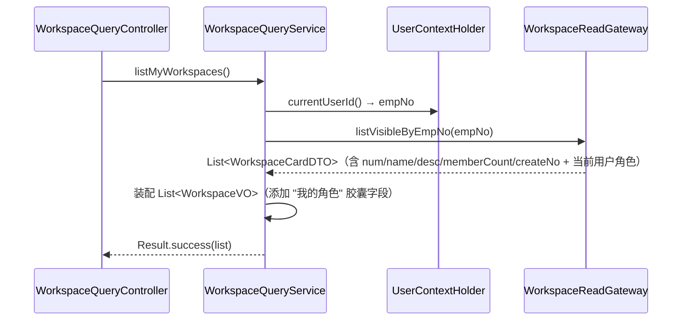

**`getDetail`**：

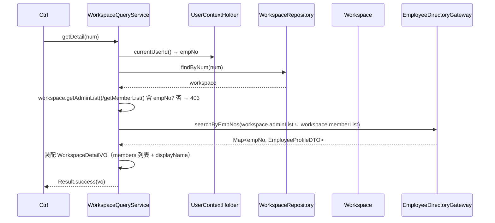

### 4.4 资产查询改造（agent / skill query）

#### 4.4.1 Service 方法清单（仅列改造点）

| 方法（不变） | 改造 |
| --- | --- |
| `AgentQueryService.listAgents(...)` | 方法体首行加 `String ws = WorkspaceContextHolder.currentWorkspaceNum();`，向下游 `AgentReadGateway.listByWorkspace(ws, ...)` 传参 |
| `AgentQueryService.getDetail(num)` | 调 `agent = repo.findByNum(num)`；如 `!ws.equals(agent.getWorkspaceNum())` 抛 `BusinessException("FORBIDDEN_CROSS_WORKSPACE")` |
| `SkillQueryService.listSkills(...)` | 同上 |
| `SkillQueryService.getDetail(num)` | 同上 |

新增 ApplicationException 处理：跨空间访问统一抛 `BusinessException("FORBIDDEN_CROSS_WORKSPACE")`，由 `GlobalExceptionHandler` 映射为 HTTP 403。

#### 4.4.2 方法时序逻辑

**`AgentQueryService.listAgents`（改造后）**：

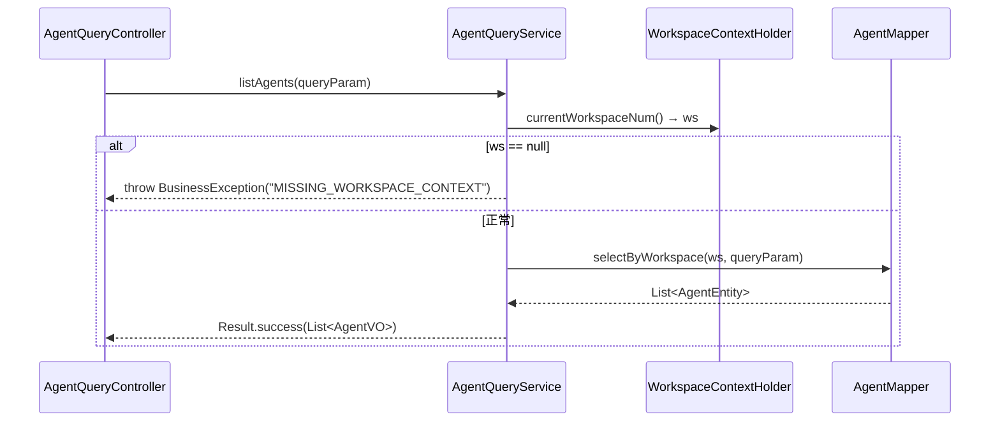

> Skill 查询时序同构，省略。

### 4.5 领域事件 listener（workspace 本期空实现）

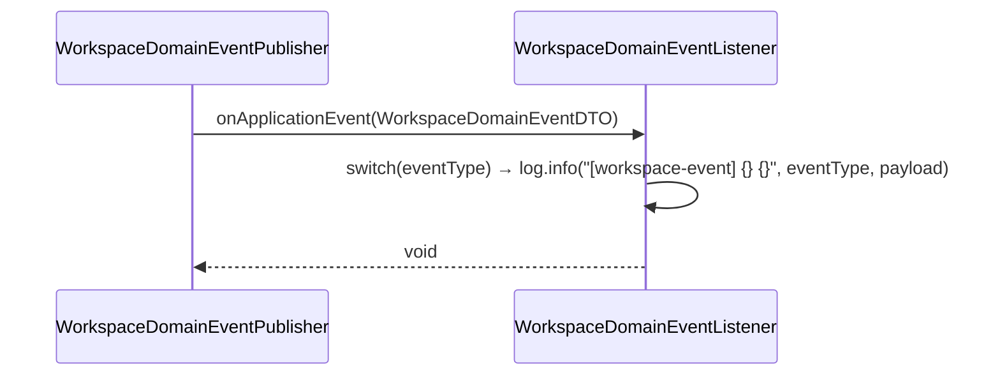

> 本期 listener 实现 `ApplicationListener<WorkspaceDomainEventDTO>`，方法体内仅打 INFO 日志；下期接入站内消息时在此追加分支即可，不改 domain。

### 4.6 通用员工搜索（application.common）

#### 4.6.1 Service 方法清单

| 方法 | 签名 | 职责 | 入参 | 出参 |
| --- | --- | --- | --- | --- |
| `searchEmployees` | `Result<List<EmployeeProfileVO>> searchEmployees(EmployeeSearchParam param)` | 工号 / 姓名搜员工（通用，挂现有 `CommonService`） | keyword（≥2 字符）/ limit（默认 20，max 50） | List<EmployeeProfileVO> |

> 放在 `application.common.CommonService`（已承载 OSS 通用编排），通过 `domain.common.gateway.EmployeeDirectoryGateway` 取数；与 workspace 领域解耦，任何模块都可复用。

#### 4.6.2 方法时序逻辑

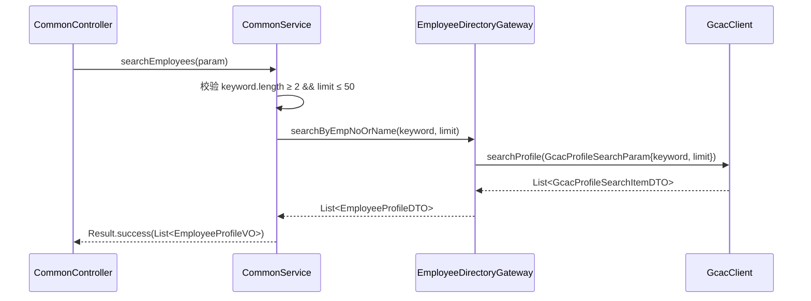

---

## 5. 控制器/Adapter 层设计

### 5.1 业务模块划分

| 模块 | Controller | 与 application 模块对应 |
| --- | --- | --- |
| 工作空间命令 | `WorkspaceCommandController` | `WorkspaceCommandService` |
| 工作空间查询 | `WorkspaceQueryController` | `WorkspaceQueryService` |
| 通用员工搜索 | `CommonController`（现有，新增端点） | `CommonService` |
| 全局上下文 | `WorkspaceContextInterceptor`（不是 Controller，是 HandlerInterceptor） | — |

> 项目约定：HTTP 方法**仅 GET（查询）+ POST（增删改）**；不使用 PUT/DELETE/PATCH（与 [CLAUDE.md](../代码仓库/rd-agent-be/CLAUDE.md) 一致）。

### 5.2 工作空间命令（WorkspaceCommandController）

#### 5.2.1 接口清单

| 方法 | 路径 | 职责 | 入参 JSON | 返回值 JSON |
| --- | --- | --- | --- | --- |
| POST | `/api/v1/workspace/create` | 创建空间 | `{ "name": "AICoding 组", "description": "garry AICoding 团队", "initialAdminEmpNos": [], "initialMemberEmpNos": ["10002","10003"] }`（创建人自动入 adminList，可不在 initialAdminEmpNos 重复） | `{ "code": 0, "data": { "num": "WS-abc123", "name": "AICoding 组", "description": "...", "myRole": "ADMIN", "memberCount": 3, "adminCount": 1 } }` |
| POST | `/api/v1/workspace/update` | 编辑空间（整体覆盖名称 / 描述 / 完整成员两栏） | `{ "num": "WS-abc123", "name": "AICoding 新组", "description": "更新后的描述", "adminEmpNos": ["10001","10005"], "memberEmpNos": ["10002","10003"] }` | `{ "code": 0 }` |
| POST | `/api/v1/workspace/delete` | 软删空间 | `{ "num": "WS-abc123" }` | 成功：`{ "code": 0 }`；资产非空：`{ "code": "WORKSPACE_NOT_EMPTY", "data": { "agent": 3, "skill": 1, "tool": 0 } }` |

> 仅 3 个 POST 接口，对应界面"创建 / 编辑 / 删除"。成员的添加 / 移除 / 升降级在"编辑"里通过提交完整 `adminEmpNos` / `memberEmpNos` 完成，无独立成员接口。

错误码统一：
- `NAME_CONFLICT` → 422，"已存在同名空间"
- `LAST_ADMIN_PROTECTED` → 422，"空间至少保留 1 名管理员"（编辑提交的 adminEmpNos 为空时）
- `WORKSPACE_NOT_EMPTY` → 422，含 counts 字段
- `FORBIDDEN_NOT_ADMIN` → 403，"仅管理员可执行"
- `FORBIDDEN_CROSS_WORKSPACE` → 403，"无权访问该空间"

#### 5.2.2 接口时序逻辑

**POST `/workspace/create`**：

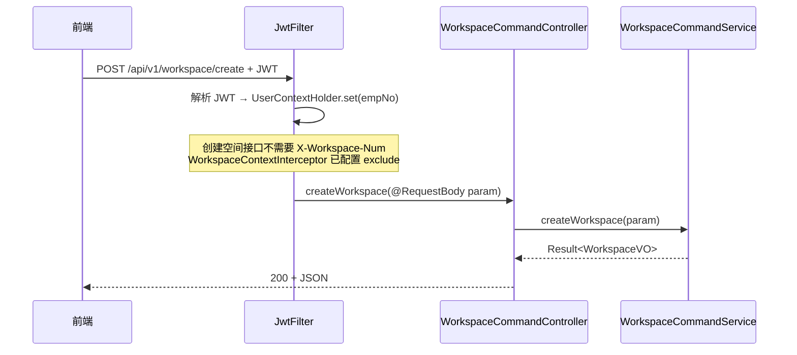

**POST `/workspace/update`**：

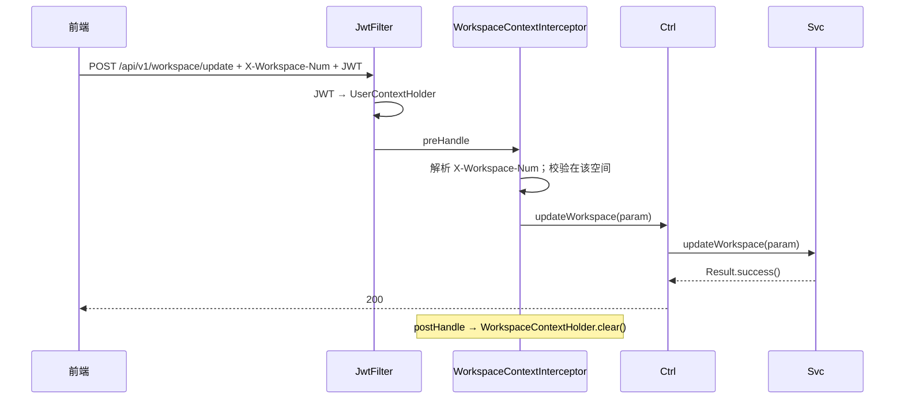

**POST `/workspace/delete`**：

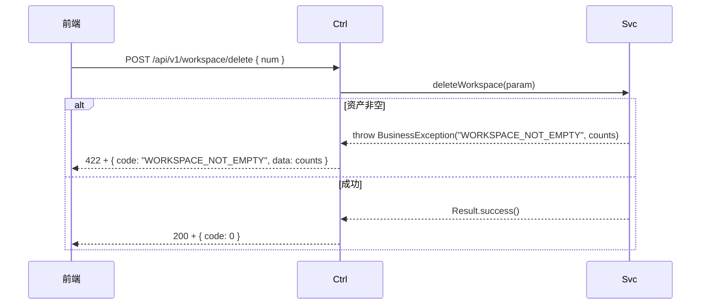

### 5.3 工作空间查询（WorkspaceQueryController）

#### 5.3.1 接口清单

| 方法 | 路径 | 职责 | 入参 JSON / Query | 返回值 JSON |
| --- | --- | --- | --- | --- |
| GET | `/api/v1/workspace/list` | 我可见的全部空间（不分页） | — | `{ "code": 0, "data": [ { "num": "WS-xx", "name": "AICoding 组", "description": "...", "memberCount": 8, "adminCount": 2, "myRole": "ADMIN", "isCreator": true, "createTime": "2026-06-03T10:00:00.000" } ] }` |
| GET | `/api/v1/workspace/detail` | 空间详情（用于编辑抽屉） | Query: `num=WS-xx` | `{ "code": 0, "data": { "num": "WS-xx", "name": "...", "description": "...", "createNo": "10001", "members": [ { "empNo": "10001", "displayName": "张三", "role": "ADMIN", "joinedAt": "2026-06-03T10:00:00.000" }, ... ] } }` |

> 工号 / 姓名搜员工接口已下沉到 `CommonController`（`GET /api/v1/common/employee/search`，见 §5.4）。
> `/workspace/list` 不依赖 `X-Workspace-Num`（在拦截器 exclude 列表中）；`/workspace/detail` 需要：调用者必须在该空间内才能访问。

#### 5.3.2 接口时序逻辑

**GET `/workspace/list`**：

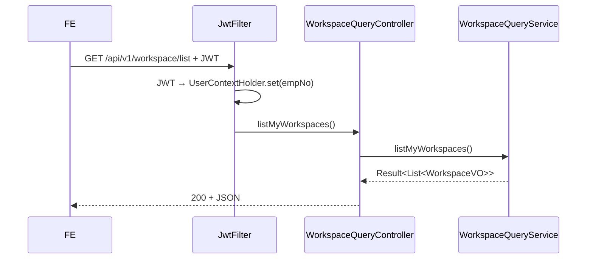

**GET `/workspace/detail`**：

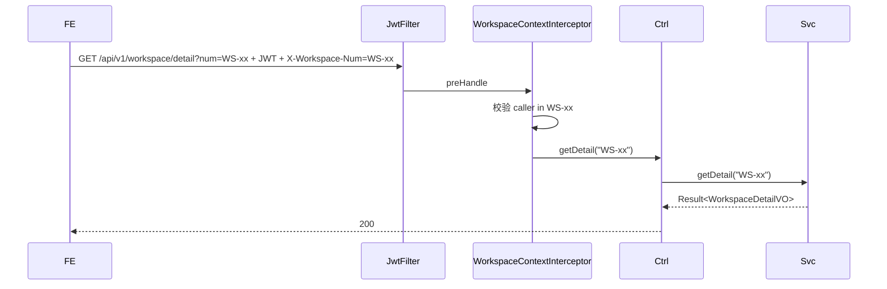

### 5.4 通用员工搜索（CommonController）

#### 5.4.1 接口清单

| 方法 | 路径 | 职责 | 入参 Query | 返回值 JSON |
| --- | --- | --- | --- | --- |
| GET | `/api/v1/common/employee/search` | 工号 / 姓名搜员工（通用） | `keyword=张&limit=20` | `{ "code": 0, "data": [ { "empNo": "10005", "displayName": "张三", "dept": "AI 组" } ] }` |

> 挂在现有 `CommonController`（`@RequestMapping("/api/v1/common")`），与 `/api/v1/common/oss/*` 同列；`/api/v1/common/**` 在拦截器 exclude 列表中，不依赖 `X-Workspace-Num`。

#### 5.4.2 接口时序逻辑

**GET `/common/employee/search`**：

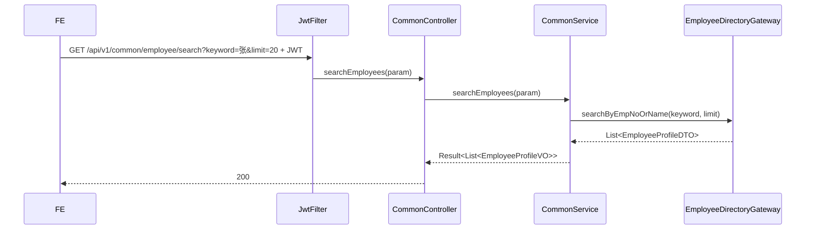

### 5.5 资产侧接口改造（agent / skill 查询）

所有现有 `/api/v1/agent/**`、`/api/v1/skill/**` 的 GET 接口（list / detail）改为：
- 必须带 `X-Workspace-Num` 请求头（拦截器 exclude 列表中**移除**这些路径）；
- 若不带 → `BAD_REQUEST` 400 + `MISSING_WORKSPACE_CONTEXT`；
- 若调用者不在该空间 → 403；
- 若访问的资源 `workspaceNum != 当前空间` → 403。

新增 / 编辑资产的 POST 接口：从 `WorkspaceContextHolder.currentWorkspaceNum()` 自动注入 `workspace_num` 到 Entity。

---

## 6. 数据库设计

### 6.1 表结构

#### 6.1.1 `workspace`（工作空间主表，成员内联为 JSON 列）

| 字段 | 类型 | 必填 | 索引 | 说明 |
| --- | --- | --- | --- | --- |
| `id` | BIGINT AUTO_INCREMENT | ✓ | PK | 主键 |
| `num` | VARCHAR(64) | ✓ | UQ_workspace_num | 业务编号（前缀 `WS-`） |
| `name` | VARCHAR(64) | ✓ | UQ_workspace_creator_name(creator, name, deleted) | 空间名称 |
| `description` | VARCHAR(200) | ✗ | — | 空间描述 |
| `admin_list` | JSON | ✓ DEFAULT (JSON_ARRAY()) | MV idx_workspace_admin（多值索引，可选） | 管理员工号数组，如 `["10001","10002"]`；至少 1 个 |
| `member_list` | JSON | ✓ DEFAULT (JSON_ARRAY()) | MV idx_workspace_member（多值索引，可选） | 普通成员工号数组，如 `["10003"]`；可空数组 |
| `create_no` | VARCHAR(64) | ✓ | IDX_workspace_creator | 创建人工号（同 `creator` 语义） |
| `update_no` | VARCHAR(64) | ✓ | — | 更新人工号（兼任"删除人"语义） |
| `deleted` | TINYINT(1) | ✓ DEFAULT 0 | UQ 含此列 | 0=正常，1=逻辑删除 |
| `create_time` | TIMESTAMP(3) | ✓ DEFAULT CURRENT_TIMESTAMP(3) | — | 创建时间 |
| `update_time` | TIMESTAMP(3) | ✓ DEFAULT CURRENT_TIMESTAMP(3) ON UPDATE CURRENT_TIMESTAMP(3) | — | 更新时间（兼任"删除时间"语义，删除时由 update_time 体现） |

> **成员存储**：管理员 / 成员均以工号字符串数组内联在 `admin_list` / `member_list` 两个 JSON 列，与 `Workspace` 聚合的 `adminList` / `memberList` 字段一一对应（仿 `SkillEntity.tags` 的 JSON 列做法）。不再单独建 `workspace_member` 表。
> **"我可见空间"查询**：`WHERE deleted=0 AND (JSON_CONTAINS(admin_list, JSON_QUOTE(?)) OR JSON_CONTAINS(member_list, JSON_QUOTE(?)))`。单用户可见空间 ≤ 50、平台空间总量小，全表 + JSON_CONTAINS 足够；如需提速可建 MySQL 8 多值索引 `((CAST(admin_list AS CHAR(64) ARRAY)))` / `((CAST(member_list AS CHAR(64) ARRAY)))`。

#### 6.1.2 资产表改造（`agent` / `skill` / `skill_version`）

| 表 | 改动 |
| --- | --- |
| `agent` | 新增 `workspace_num VARCHAR(64) NOT NULL DEFAULT 'WS-DEFAULT'`，回填后改 NOT NULL；建索引 `IDX_agent_workspace(workspace_num, deleted)` |
| `skill` | 同上：`workspace_num VARCHAR(64) NOT NULL DEFAULT 'WS-DEFAULT'` + `IDX_skill_workspace` |
| `skill_version` | 同上：`workspace_num` + `IDX_skill_version_workspace` |

> agent / skill / skill_version 三张表的 `workspace_num` 不建外键约束（保持现有项目"逻辑外键"风格，便于 S3 跨空间转移）。

### 6.2 DDL 语句（Flyway V11）

**文件**：`rd-agent-be-infra/src/main/resources/db/migration/V11__workspace_init_and_asset_link.sql`

```sql
-- ====================================================================
-- 工作空间管理 - V11 初始化脚本
-- 对应技术方案：2026-06-03_工作空间管理-技术方案.md v1.0
-- 包含：
--   1) workspace 表（成员内联为 admin_list / member_list 两个 JSON 列）
--   2) agent / skill / skill_version 表加 workspace_num 列 + 索引
-- ====================================================================

SET NAMES utf8mb4;
SET FOREIGN_KEY_CHECKS = 0;

-- --------------------------------------------------------------------
-- 1. workspace —— 工作空间主表（管理员/成员内联 JSON 列）
-- --------------------------------------------------------------------
DROP TABLE IF EXISTS `workspace`;
CREATE TABLE `workspace` (
  `id` BIGINT NOT NULL AUTO_INCREMENT COMMENT '主键',
  `num` VARCHAR(64) NOT NULL COMMENT '业务编号 WS-...',
  `name` VARCHAR(64) NOT NULL COMMENT '空间名称',
  `description` VARCHAR(200) DEFAULT NULL COMMENT '空间描述',
  `admin_list` JSON NOT NULL COMMENT '管理员工号数组 JSON，如 ["10001"]，至少 1 个',
  `member_list` JSON NOT NULL COMMENT '普通成员工号数组 JSON，如 ["10003"]，可空数组',
  `create_no` VARCHAR(64) NOT NULL COMMENT '创建人工号',
  `update_no` VARCHAR(64) NOT NULL COMMENT '更新人工号',
  `deleted` TINYINT(1) NOT NULL DEFAULT 0 COMMENT '逻辑删除 0=正常 1=删除',
  `create_time` TIMESTAMP(3) NOT NULL DEFAULT CURRENT_TIMESTAMP(3) COMMENT '创建时间',
  `update_time` TIMESTAMP(3) NOT NULL DEFAULT CURRENT_TIMESTAMP(3) ON UPDATE CURRENT_TIMESTAMP(3) COMMENT '更新时间',
  PRIMARY KEY (`id`),
  UNIQUE KEY `uq_workspace_num` (`num`),
  UNIQUE KEY `uq_workspace_creator_name` (`create_no`, `name`, `deleted`),
  KEY `idx_workspace_creator` (`create_no`, `deleted`)
  -- 可选多值索引（MySQL 8.0.17+）加速 JSON_CONTAINS 成员检索：
  -- ,KEY `idx_workspace_admin` ((CAST(`admin_list` AS CHAR(64) ARRAY)))
  -- ,KEY `idx_workspace_member` ((CAST(`member_list` AS CHAR(64) ARRAY)))
) ENGINE=InnoDB DEFAULT CHARSET=utf8mb4 COLLATE=utf8mb4_unicode_ci COMMENT='工作空间主表';

-- --------------------------------------------------------------------
-- 2. agent 表加 workspace_num 列 + 索引
-- --------------------------------------------------------------------
ALTER TABLE `agent`
  ADD COLUMN `workspace_num` VARCHAR(64) NOT NULL DEFAULT 'WS-DEFAULT' COMMENT '归属工作空间业务编号' AFTER `owner_user_id`,
  ADD KEY `idx_agent_workspace` (`workspace_num`, `deleted`);

-- --------------------------------------------------------------------
-- 3. skill 表加 workspace_num 列 + 索引
-- --------------------------------------------------------------------
ALTER TABLE `skill`
  ADD COLUMN `workspace_num` VARCHAR(64) NOT NULL DEFAULT 'WS-DEFAULT' COMMENT '归属工作空间业务编号' AFTER `owner_user_id`,
  ADD KEY `idx_skill_workspace` (`workspace_num`, `deleted`);

-- --------------------------------------------------------------------
-- 4. skill_version 表加 workspace_num 列 + 索引
-- --------------------------------------------------------------------
ALTER TABLE `skill_version`
  ADD COLUMN `workspace_num` VARCHAR(64) NOT NULL DEFAULT 'WS-DEFAULT' COMMENT '归属工作空间业务编号' AFTER `skill_num`,
  ADD KEY `idx_skill_version_workspace` (`workspace_num`, `deleted`);

SET FOREIGN_KEY_CHECKS = 1;
```

### 6.3 DML 语句（Flyway V12 — 数据迁移）

**文件**：`rd-agent-be-infra/src/main/resources/db/migration/V12__workspace_seed_default_and_backfill.sql`

```sql
-- ====================================================================
-- 工作空间管理 - V12 数据迁移
--   1) 创建默认空间 WS-DEFAULT，create_no = 'system'，admin_list 含 sysadmin 占位管理员，
--      member_list 内联所有现存用户工号（从 agent.create_no UNION skill.create_no 推断）
--   2) 将所有现存 agent / skill / skill_version 的 workspace_num 显式置为 WS-DEFAULT（DEFAULT 兜底）
-- ====================================================================

SET NAMES utf8mb4;

-- 1) 默认空间种子：admin_list = ["sysadmin"]，member_list = 所有存量用户工号 JSON 数组
--    （子查询聚合所有出现过的工号为一个 JSON 数组；sysadmin 为占位管理员，后续 SRE 手工调整）
INSERT INTO `workspace` (`num`, `name`, `description`, `admin_list`, `member_list`, `create_no`, `update_no`, `deleted`)
SELECT
  'WS-DEFAULT',
  '默认工作空间',
  '平台默认工作空间，承载存量资产',
  JSON_ARRAY('sysadmin'),
  COALESCE(
    (SELECT JSON_ARRAYAGG(emp_no) FROM (
        SELECT DISTINCT `create_no` AS emp_no FROM `agent` WHERE `create_no` IS NOT NULL AND `create_no` <> 'system'
        UNION
        SELECT DISTINCT `create_no` AS emp_no FROM `skill` WHERE `create_no` IS NOT NULL AND `create_no` <> 'system'
    ) u),
    JSON_ARRAY()
  ),
  'system', 'system', 0
WHERE NOT EXISTS (SELECT 1 FROM `workspace` WHERE `num` = 'WS-DEFAULT');

-- 2) 兜底：将 NULL 或空字符串的 workspace_num 全部置为 WS-DEFAULT
UPDATE `agent`         SET `workspace_num` = 'WS-DEFAULT' WHERE `workspace_num` IS NULL OR `workspace_num` = '';
UPDATE `skill`         SET `workspace_num` = 'WS-DEFAULT' WHERE `workspace_num` IS NULL OR `workspace_num` = '';
UPDATE `skill_version` SET `workspace_num` = 'WS-DEFAULT' WHERE `workspace_num` IS NULL OR `workspace_num` = '';
```

> **回滚预案**：本迁移仅 INSERT 一行 workspace + UPDATE 资产列；回滚时 `DELETE FROM workspace WHERE num='WS-DEFAULT'` + drop 资产表的 `workspace_num` 列即可（配合 feature flag `workspace.enabled` 双轨 48h）。

### 6.4 与领域的对应关系

| 表 / 列 | 对应聚合 / 属性 |
| --- | --- |
| `workspace` | `Workspace` 聚合根 |
| `workspace.admin_list` / `workspace.member_list`（JSON） | 聚合内 `adminList` / `memberList`（`List<String>` 工号数组） |
| `agent` / `skill` / `skill_version`（新增列） | 资产实体上的 `workspaceNum` 外属性 |

### 6.5 关键查询索引建议

| 场景 | 查询 SQL（示意） | 命中索引 |
| --- | --- | --- |
| 列出"我可见的"空间 | `SELECT * FROM workspace WHERE deleted=0 AND (JSON_CONTAINS(admin_list, JSON_QUOTE(?)) OR JSON_CONTAINS(member_list, JSON_QUOTE(?)))` | 全表扫描（空间总量小）；可选多值索引 idx_workspace_admin / idx_workspace_member |
| 名称唯一性预检 | `SELECT id FROM workspace WHERE create_no = ? AND name = ? AND deleted = 0` | `uq_workspace_creator_name` |
| 按 num 加载（含成员 JSON 列） | `SELECT * FROM workspace WHERE num = ? AND deleted = 0`（admin_list / member_list 随行返回，无需 join） | `uq_workspace_num` |
| 资产查询按空间过滤 | `SELECT ... FROM agent WHERE workspace_num = ? AND deleted = 0 ...` | `idx_agent_workspace` |

---

## 7. 模块变更清单

> 按层列出，每条变更标明对应的代码编写类 skill。

### 7.1 facade 层 → 使用 **impl-facade-module**

| 变更 | 说明 |
| --- | --- |
| 新增 `facade.domain.workspace.WorkspaceEntity` | 仅作 DomainEntity 标识基类，保持包结构对称 |
| 新增 `facade.domain.workspace.dto.WorkspaceDomainEventDTO` | 3 个 workspace 事件的统一 payload 容器（eventType + JSON 体） |
| 新增 `facade.domain.workspace.WorkspaceDomainEventPublisher` | 接口；由 infra 实现 |
| 改 `facade.common.DomainEventConstant` | 追加 3 个 workspace 事件码常量 |

### 7.2 client 层 → 使用 **impl-client-module**

| 变更 | 说明 |
| --- | --- |
| 新增 `client.workspace.param.*` | 3 个 Param 类 Create / Update / Delete（见 §2 包表） |
| 新增 `client.workspace.dto.*` | `WorkspaceDTO` / `WorkspaceMemberDTO` |
| 新增 `client.workspace.vo.*` | `WorkspaceVO` / `WorkspaceDetailVO` / `WorkspaceMemberVO` |
| 新增 `client.common.employee.*` | **通用**：`EmployeeSearchParam`（param）/ `EmployeeProfileVO`（vo），仿 `client.common.oss` |
| 新增 `client.workspace.constant.WorkspaceConstants` | `WS_DEFAULT_NUM = "WS-DEFAULT"`、`NAME_MAX_LENGTH = 64`、`DESC_MAX_LENGTH = 200`、`HEADER_X_WORKSPACE_NUM = "X-Workspace-Num"` |

### 7.3 domain 层 → 使用 **impl-domain-module**

| 变更 | 说明 |
| --- | --- |
| 新增 `domain.workspace.Workspace`（聚合根） | 含 §3.2.3 表中所有领域动作；`adminList` / `memberList` 两个 `List<String>` 工号数组（无独立成员实体 / 角色枚举） |
| 新增 `domain.workspace.repository.WorkspaceRepository` | 仅 save / findByNum / deleteByNum 三方法 |
| 新增 `domain.workspace.factory.WorkspaceFactory` | create 方法，注入 WorkspaceGateway + Publisher |
| 新增 `domain.workspace.gateway.WorkspaceGateway` | generateWorkspaceNum |
| 新增 `domain.workspace.gateway.WorkspaceReadGateway` | listVisibleByEmpNo / findByCreatorAndName |
| 新增 `domain.workspace.gateway.WorkspaceAssetCountGateway` | countAssets |
| 新增 `domain.workspace.dto.*` | WorkspaceQueryDTO / WorkspaceCardDTO / WorkspaceAssetCountDTO |
| 新增 `domain.common.gateway.EmployeeDirectoryGateway` | **通用**：searchByEmpNoOrName / findByEmpNo / searchByEmpNos（workspace 与他域共用） |
| 新增 `domain.common.dto.EmployeeProfileDTO` | **通用**：员工档案网关返回 DTO |
| 改 `domain.common.DomainEventConstant` | 同 facade 同步追加 3 常量（与 facade 重复，常量值字符串保持一致） |

### 7.4 infra 层 → 使用 **impl-infra-module**

| 变更 | 说明 |
| --- | --- |
| 新增 `infra.workspace.entity.WorkspaceEntity` | @TableName("workspace") + @Data，字段与 6.1.1 对应；`adminList` / `memberList` 用 `@TableField(typeHandler = JacksonTypeHandler.class)` 映射 JSON 列（仿 SkillEntity.tags） |
| 新增 `infra.workspace.mapper.WorkspaceMapper` | BaseMapper + 自定义 `findVisibleCardsByEmpNo`（JSON_CONTAINS 检索 admin_list / member_list） |
| 新增 `infra.workspace.repository.WorkspaceRepositoryImpl` | 仅注入 WorkspaceMapper；save 时 adminList/memberList ↔ JSON 列整体覆盖写（无子表 diff） |
| 新增 `infra.workspace.factory.WorkspaceFactoryImpl` | 仅注入 WorkspaceRepository |
| 新增 `infra.workspace.gateway.WorkspaceGatewayImpl` | UUID 前缀 `WS-` |
| 新增 `infra.workspace.gateway.WorkspaceReadGatewayImpl` | 仅注入 WorkspaceMapper |
| 新增 `infra.workspace.gateway.WorkspaceAssetCountGatewayImpl` | 注入 AgentMapper + SkillMapper（**注意**：仅 Gateway 实现可跨域注入 Mapper，符合现有架构） |
| 新增 `infra.common.gateway.EmployeeDirectoryGatewayImpl` | **通用**：实现 `domain.common.gateway.EmployeeDirectoryGateway`，注入扩展后的 GcacClient，每次实时查 GCAC（不加缓存）；GCAC 调用失败回退 stub（按 empNo 原样返回） |
| 改 `infra.common.client.gcac.GcacClient` | 新增 `searchProfile(GcacProfileSearchParam)` + 新增 DTO `GcacProfileSearchItemDTO` + `GcacProfileSearchParam` |
| 改 `infra.common.util.UserContextHolder` | 不动 |
| 新增 `infra.common.util.WorkspaceContextHolder` | 仿 UserContextHolder 实现 |
| 改 `infra.skill.entity.SkillEntity` | 加 `workspaceNum` 字段 + `@TableField("workspace_num")` |
| 改 `infra.skill.entity.SkillVersionEntity` | 同上 |
| 改 `infra.skill.mapper.SkillMapper` 自定义 SQL | 增加 `AND workspace_num = #{workspaceNum}` |
| 改 `infra.skill.mapper.SkillVersionMapper` 自定义 SQL | 同上 |
| 改 `infra.skill.factory.SkillFactoryImpl` | 在 create 时从 `WorkspaceContextHolder.currentWorkspaceNum()` 注入 workspaceNum 到 Skill 聚合（**需先在 domain.Skill 聚合根增加 workspaceNum 字段**） |
| 改 `infra.skill.factory.SkillVersionFactoryImpl` | 同上 |
| 改 `infra.agent.entity.AgentEntity` | 加 `workspaceNum` 字段 |
| 改 `infra.agent.mapper.AgentMapper` 自定义 SQL | 增加 `AND workspace_num = #{workspaceNum}` |
| 改 `infra.agent.factory.AgentFactoryImpl` | 同 SkillFactory |
| 新增 Flyway 迁移 `V11__workspace_init_and_asset_link.sql`、`V12__workspace_seed_default_and_backfill.sql` | 见 §6.2 / §6.3 |

> 上述对 domain `Skill` / `Agent` 聚合根的 `workspaceNum` 字段添加属于"领域改造的小变更"，归入 §7.3 domain 层条目；为聚焦本节列表，未单列。

### 7.5 application 层 → 使用 **impl-application-module**

| 变更 | 说明 |
| --- | --- |
| 新增 `application.workspace.command.WorkspaceCommandService` | 3 个命令方法 create / update / delete（见 §4.2），全部 `@Transactional(rollbackFor=Exception.class)` |
| 新增 `application.workspace.query.WorkspaceQueryService` | 2 个查询方法 listMyWorkspaces / getDetail（见 §4.3） |
| 改 `application.common.CommonService` | **通用**：新增 `searchEmployees(EmployeeSearchParam)`（见 §4.6） |
| 新增 `application.common.listener.WorkspaceDomainEventListener` | 实现 ApplicationListener；本期仅 log |
| 改 `application.agent.query.AgentQueryService` | 所有 list/detail 方法首行注入 workspaceNum；跨空间访问抛 403 异常 |
| 改 `application.skill.query.SkillQueryService` | 同上 |

### 7.6 adapter 层 → 使用 **impl-adapter-module**

| 变更 | 说明 |
| --- | --- |
| 新增 `adapter.rest.workspace.WorkspaceCommandController` | 3 个 POST 接口 create / update / delete（见 §5.2） |
| 新增 `adapter.rest.workspace.WorkspaceQueryController` | 2 个 GET 接口 list / detail（见 §5.3） |
| 改 `adapter.common.CommonController` | **通用**：新增 GET `/api/v1/common/employee/search`（见 §5.4） |
| 新增 `adapter.config.WorkspaceContextInterceptor` | preHandle 解析 + 校验；postHandle clear |
| 改 `adapter.config.WebMvcConfig` | 注册拦截器 + 配置 excludePatterns（含 `/api/v1/common/**`） |
| 改 `adapter.config.GlobalExceptionHandler` | 新增对 `WORKSPACE_NOT_EMPTY`（带 counts payload） / `FORBIDDEN_CROSS_WORKSPACE` 的映射 |

---

## 8. 代码分支命名

**本方案对应分支**：`feature-20260603-workspace-management`

> 命名遵循：需求类 → `feature-YYYYMMDD-英文名`；本方案为需求迭代（不是 BUG），日期取方案文档日期 2026-06-03。

---

## 9. 实现顺序与依赖

按六层依赖方向，分 6 个 wave 顺序实现：

1. **facade** 层（impl-facade-module）
   - DomainEventConstant 追加 3 常量
   - WorkspaceEntity 标识基类
   - WorkspaceDomainEventDTO + Publisher 接口
2. **client** 层（impl-client-module）
   - 3 个 workspace Param（Create/Update/Delete）+ 2 个 DTO + 3 个 VO + WorkspaceConstants
   - common：`client.common.employee` 的 EmployeeSearchParam + EmployeeProfileVO
3. **domain** 层（impl-domain-module）
   - Workspace 聚合根（adminList / memberList 两个 List<String> + 全部领域动作）
   - WorkspaceRepository / WorkspaceFactory / 3 个 workspace Gateway 接口（WorkspaceGateway / WorkspaceReadGateway / WorkspaceAssetCountGateway）
   - common：`domain.common.gateway.EmployeeDirectoryGateway` + `domain.common.dto.EmployeeProfileDTO`
   - 在现有 Skill / Agent 聚合根加 `workspaceNum` 字段（仅 getter/setter）
4. **infra** 层（impl-infra-module）
   - Flyway V11 + V12 迁移脚本（建 workspace 表[含 admin_list/member_list JSON 列] + 资产表加列 + 种子数据）
   - WorkspaceEntity（JSON 列 typeHandler） + WorkspaceMapper
   - WorkspaceRepositoryImpl + WorkspaceFactoryImpl + 3 个 workspace GatewayImpl
   - common：`infra.common.gateway.EmployeeDirectoryGatewayImpl` + GcacClient 扩展 `searchProfile`
   - WorkspaceContextHolder
   - 现有 SkillEntity / AgentEntity / SkillVersionEntity 加 `workspaceNum` 字段
   - 现有 SkillFactoryImpl / AgentFactoryImpl 注入 workspaceNum
   - 现有 SkillMapper / AgentMapper / SkillVersionMapper 自定义 SQL 加过滤
5. **application** 层（impl-application-module）
   - WorkspaceCommandService + WorkspaceQueryService（带 @Transactional）
   - 改造 CommonService 新增 searchEmployees
   - WorkspaceDomainEventListener（本期空实现）
   - 改造 AgentQueryService + SkillQueryService 加空间过滤
6. **adapter** 层（impl-adapter-module）
   - WorkspaceCommandController + WorkspaceQueryController
   - 改造 CommonController 新增 employee/search 端点
   - WorkspaceContextInterceptor + WebMvcConfig 注册
   - GlobalExceptionHandler 错误码映射

每个 wave 内可并行；wave 间严格串行。

---

## 10. 接口与数据契约（汇总）

> 此处汇总关键 API 一览，详细 JSON 见 §5.2 / §5.3。

| 方法 | 路径 | 模块 |
| --- | --- | --- |
| POST | `/api/v1/workspace/create` | workspace.command |
| POST | `/api/v1/workspace/update` | workspace.command（编辑：含成员两栏整体覆盖） |
| POST | `/api/v1/workspace/delete` | workspace.command |
| GET | `/api/v1/workspace/list` | workspace.query |
| GET | `/api/v1/workspace/detail` | workspace.query |
| GET | `/api/v1/common/employee/search` | common（通用员工搜索） |

**关键 DTO/VO**：
- `WorkspaceVO`：`{ num, name, description, memberCount, adminCount, myRole, isCreator, createTime }`
- `WorkspaceDetailVO`：`WorkspaceVO` + `members: [ { empNo, displayName, role, joinedAt } ]`
- `WorkspaceUpdateParam`：`{ num, name, description, adminEmpNos: string[], memberEmpNos: string[] }`（编辑整体覆盖）
- `EmployeeProfileVO`（`client.common.employee`）：`{ empNo, displayName, dept? }`

**请求头约定**：
- `X-Workspace-Num`：当前活动空间业务编号；除 `/auth/**` / `/api/v1/common/**` / `/workspace/list` / `/workspace/create` 外的所有 API 必须携带。

---

## 11. 其他（非功能与外部依赖）

### 11.1 性能与上限

| 项 | 目标 / 限制 |
| --- | --- |
| `/workspace/list` 响应 | ≤ 800ms（单用户上限 50 个空间） |
| 单空间成员上限 | 200（DDL 不强制，应用层 `updateWorkspace` 校验 adminList + memberList 合计 ≤ 200） |
| `searchEmployees` keyword | ≥ 2 字符，limit ≤ 50 |
| 拦截器开销 | < 5ms（一次 `SELECT admin_list, member_list FROM workspace WHERE num=?` + JSON 内存判断成员归属） |

### 11.2 GCAC 接入扩展点

新增 `GcacClient.searchProfile(GcacProfileSearchParam)`：
- 调 GCAC OpenAPI（端点待 SRE 确认）`/v1/profiles/search?keyword=&limit=`，Bearer 用 `GcacProperties.systemToken`；
- 失败时返回空列表，**不抛异常**（避免拦截创建空间流程）；
- 单测用 WireMock stub 兜底。

### 11.3 与现有功能的兼容

| 功能 | 兼容方案 |
| --- | --- |
| S2 单工作空间硬编码 | V12 迁移后所有用户 / 资产都在 WS-DEFAULT；硬编码读取逻辑直接删除（保留代码层的 `WS_DEFAULT_NUM` 常量供兜底） |
| 调试台 | 不改调试台代码；它消费 AgentQueryService 已经被改造为按空间过滤 |
| Agent / Skill 现有接口 | 切片式迁移：上线后 24h 内观察 `MISSING_WORKSPACE_CONTEXT` 错误率，若 > 5% 触发回滚（拦截器 fallback 到 WS-DEFAULT） |

### 11.4 单测与回归覆盖

- domain 层：Workspace 聚合 save（创建 / 编辑覆盖）+ delete 两个动作 + 3 类规则违反（名称冲突、adminList 为空、资产非空）的单测必备
- infra 层：WorkspaceRepositoryImpl 的 save —— adminList / memberList 序列化为 admin_list / member_list JSON 列整体覆盖写 + findByNum 反序列化往返必测
- application 层：WorkspaceCommandService 3 个方法（create / update / delete）的"成功 + 主要失败分支"covered
- adapter 层：WorkspaceContextInterceptor 5 类异常态（缺头、空间不存在、调用者不在空间、跨空间访问、exclude 路径通过）
- ArchUnit：补一条规则 — domain.workspace 不依赖任何 domain.agent / domain.skill 包

---

## 附：与上游 PRD 的字段命名映射

| PRD 字段 | 技术方案字段 | 说明 |
| --- | --- | --- |
| `bizCode`（已删） | — | 已在 PRD v1.0 修订中移除 |
| `admins: string[]` / `members: string[]` | 聚合内 `adminList: List<String>` / `memberList: List<String>`；落 workspace 主表 `admin_list` / `member_list` 两个 JSON 列 | 工号字符串数组直接内联，不建成员子表 |
| `deleted_at: timestamp` | `deleted: TINYINT(1)` + `update_time` | 与项目 [SkillEntity](../代码仓库/rd-agent-be/rd-agent-be-infra/src/main/java/ink/garry/rd/agent/ws/infra/skill/entity/SkillEntity.java) 既有规范对齐 |
| `deleted_by: empNo` | `update_no`（兼任删除人语义） | 同上 |
| `createdBy / createdAt / updatedBy / updatedAt` | `create_no / create_time / update_no / update_time` | 同上 |

---

## 附：关联文档

- [上游 PRD](../产品方案/2026-06-03-工作空间管理-PRD.md)
- [Skill 管理 技术方案](./2026-05-11_Skill管理-技术方案.md)（聚合 / Factory / Repository / Mapper 模板参照）
- [Agent 管理 技术方案](./2026-05-11_Agent管理-技术方案.md)（资产侧改造参照）
- [GCAC-SSO 接入完整对接方案](./2026-05-21_GCAC-SSO接入-完整对接方案.md)（GcacClient 扩展基础）
- [六层架构规范 CLAUDE.md](../代码仓库/rd-agent-be/CLAUDE.md)
- [架构契约 ARCHITECTURE.md](../代码仓库/rd-agent-be/ARCHITECTURE.md)
- [Agent 入口地图 AGENTS.md](../代码仓库/rd-agent-be/AGENTS.md)
