# Agent 优化 — 技术方案

> 文档日期：2026-06-04　|　版本：v1.1（秘钥加密存储）　|　对应 PRD：[2026-06-04-Agent优化-PRD.md](../产品方案/2026-06-04-Agent优化-PRD.md)（v1.2）
> 目标仓库：rd-agent-be（六层架构 DDD）/ rd-agent-fe（React+Vite+TS）
> 代码分支：`feature-20260604-agent-optimization`（现有 `feature/2026-06-04/agent-optimization` 已切，沿用）

---

## 1. 目标与范围

### 1.1 要解决的问题

在 [Agent 管理 PRD v3.0](../产品方案/2026-05-11-Agent管理-PRD.md) 既有形态上做 7 项增量优化 + 2 项加密存储调整（PRD v1.2）：

1. 新增「秘钥管理」Tab：`AgentApiKey` 领域实体，创建填备注、系统生成 key、**加密存储（绝不存明文）**、小眼睛按需解密查看 + 复制、单 Agent ≤50、删除即失效。
2. 创建 Agent 流程不含秘钥页（约束固化，无代码新增）。
3. `AgentApiKey` 为 Agent 聚合下的领域实体（落 `domain/agent/`，不独立成域）。
4. 发布版本移除影响等级：删除 `ChangeLevel`，版本号固定 patch+1。
5. Agent 名称唯一性由 per-owner 改为 **per-workspace**（同空间唯一，跨空间可重名）。
6. 创建/编辑表单操作按钮固定底部（纯前端）。
7. 对外 4 接口完备化 + 走秘钥认证（`Authorization: Bearer ak-...`）；调试台保留独立登录态接口。
8. 模型秘钥 `modelApiKey` 保留 `SecretCipher` 加密存储 + 小眼睛按需解密（绝不存明文）。

### 1.2 设计前共识（必问问题回答纪要）

| # | 决策点 | 结论 |
| --- | --- | --- |
| 1 | 对外接口形态 | **新建独立一套** `/api/v1/open/agents/**`，挂秘钥过滤器；调试台沿用 `/api/v1/agents/{num}/invoke` + `/api/v1/session/**`（登录态），互不影响 |
| 2 | 对外路径风格 | 沿用项目 `command/query` + 仅 GET/POST 约定（非 RESTful path 变量风格的会话子资源） |
| 3 | 秘钥调用 operator 身份 | 调用方可在 body 传 `operatorId`；为空记 `system`（审计/会话归属用） |
| 4 | 秘钥明文读取 | 列表查询只返回掩码（key_prefix），**不返回密文/明文**；小眼睛点开调**单条解密接口**按需取明文 |
| 5 | 版本号生成（去 changeLevel 后） | 固定 patch+1，首版 v1.0.0 |
| 6 | 调用秘钥传递 | `Authorization: Bearer ak-...` |
| 7 | 秘钥/模型秘钥存储 | **加密存储，绝不存明文**：API 秘钥存 `key_hash`(SHA-256 认证) + `key_cipher`(可逆密文，小眼睛解密) + `key_prefix`(掩码)；modelApiKey 保留 `SecretCipher` 加密（安全说明见 PRD §2.1.3） |

### 1.3 范围

**涉及层**：facade（事件 DTO 去字段）、client（Param/VO/DTO）、domain（AgentApiKey 实体 + Version/ChangeLevel 调整 + 唯一性网关）、infra（Entity/Mapper/Repo + 秘钥加解密 + modelApiKey 保留加解密）、application（ApiKey 服务 + 解密用例 + 创建/发布调整 + 对外 invoke 服务）、adapter（ApiKey 控制器 + 秘钥过滤器 + 对外控制器）。

**不涉及**：A2A 同步链路、调试台既有接口契约、评测、记忆/限流；秘钥的 scope/限流/过期/轮换（PRD 明确不做）。

**六层依赖**（不变）：facade ← client ← domain ← infra ← application ← adapter（左被右依赖）。

---

## 2. 架构设计（代码结构）

| 层 | 领域 | 包 | 职责 |
| --- | --- | --- | --- |
| facade | agent | `facade.agent` | `AgentDomainEventDTO` 移除 `changeLevel` 字段 |
| facade | common | `facade.common` | `ChangeLevel`（若被引用）评估移除；`Version` 无参 next |
| client | agent | `client.agent` | 新增 `AgentApiKeyCreateParam`/`AgentApiKeyDeleteParam`/`AgentApiKeyVO`/`AgentApiKeyPlainVO`/`dto.AgentApiKeyDTO`；`PublishParam` 去 `changeLevel`；新增对外 `OpenInvokeParam`/`OpenSessionCreateParam`/`OpenSessionListQuery` |
| domain | agent | `domain.agent` | 新增聚合内实体 `AgentApiKey`；`Version.next()` 无参；删除 `valueobject.ChangeLevel`；`AgentVersion` 去 `changeLevel` |
| domain | agent | `domain.agent.repository` | 新增 `AgentApiKeyRepository`（save/findByNum/deleteByNum） |
| domain | agent | `domain.agent.gateway` | 新增 `AgentApiKeyReadGateway`（列表/计数/按 hash 查/归属校验）；`AgentReadGateway` 加 `existsByWorkspaceAndName` |
| domain | agent | `domain.agent.factory` | 新增 `AgentApiKeyFactory`（生成 key + 组装实体 + createByNum） |
| infra | agent | `infra.agent.entity` | 新增 `AgentApiKeyEntity`；`AgentVersionEntity` 去 `change_level` |
| infra | agent | `infra.agent.mapper` | 新增 `AgentApiKeyMapper` |
| infra | agent | `infra.agent.repository` | 新增 `AgentApiKeyRepositoryImpl` |
| infra | agent | `infra.agent.gateway` | 新增 `AgentApiKeyReadGatewayImpl`；`AgentReadGatewayImpl` 加 `existsByWorkspaceAndName` |
| infra | agent | `infra.agent.factory` | `AgentApiKeyFactoryImpl`（生成 key + 算 hash/cipher/prefix）；`ConfigAgentBuilder`/`OpenAiChatModelFactory` 保留运行时解密 modelApiKey 再调 LLM |
| infra | common | `infra.common.security` | `SecretCipher` 保留并复用：秘钥 `key_cipher` 与 `modelApiKey` 均用其加解密；新增 SHA-256 hash 工具 |
| application | agent | `application.agent` | 新增 `AgentApiKeyCommandService`/`AgentApiKeyQueryService`；`AgentCommandService.create` 改唯一性校验、`publish` 去 changeLevel；新增 `OpenAgentInvokeService`（对外调用编排，复用 invoke + session 用例） |
| adapter | agent | `adapter.agent` | 新增 `AgentApiKeyController`（GET/POST）；`AgentCommandController.publish` 入参去 changeLevel |
| adapter | open | `adapter.open` | 新增对外 `OpenAgentController`（invoke + 会话四接口，command/query 风格） |
| adapter | security | `adapter.security` | 新增 `ApiKeyAuthenticationFilter`（仅拦 `/api/v1/open/**`）；`WebMvcConfig` 注册过滤器 + workspace 拦截器排除 open 路径 |

---

## 3. 领域模型设计

### 3.1 业务层级划分

| 层级 | 业务/子域 | 说明 |
| --- | --- | --- |
| 聚合 | agent | Agent 聚合根（既有）；本方案新增聚合内实体 `AgentApiKey`、调整值对象 `Version`、删除 `ChangeLevel` |

> 本方案只涉及 **agent** 一个领域，故领域模型设计只有一节（3.2）。秘钥是 Agent 聚合下的实体，不是独立聚合（一致性边界仍是 Agent；秘钥通过 `agentNum` 关联，跨实体协作由 application 编排，与既有 `AgentVersion` 同构）。

### 3.2 Agent（agent）

#### 3.2.1 领域模型

**领域类图**

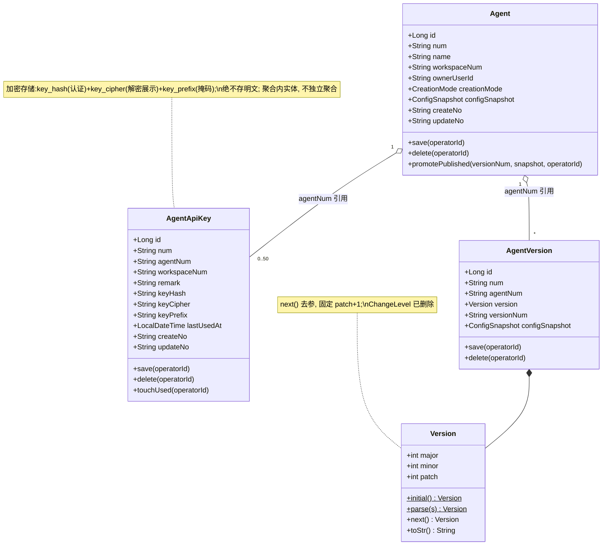

**领域结构表**

| 对象 | 类型 | 关键属性 | 与其它对象关系 |
| --- | --- | --- | --- |
| `AgentApiKey` | 聚合内实体（新增） | id, num（AK 前缀）, agentNum, workspaceNum, remark, keyHash, keyCipher, keyPrefix, lastUsedAt, createNo, updateNo, createTime, updateTime, deleted | 通过 `agentNum` 关联 Agent；同一 agentNum 下 ≤50 |
| `Version` | 值对象（改） | major/minor/patch | `next()` 去 `ChangeLevel` 参数，固定 patch+1 |
| `ChangeLevel` | 枚举（删除） | — | 移除；`AgentVersion`/`PublishParam`/事件不再引用 |
| `AgentVersion` | 聚合内实体（改） | 去掉 `changeLevel` 字段及其校验 | 不变其余 |
| `ConfigSnapshot` | 值对象（语义不变） | `modelApiKey` 保留 `SecretCipher` 加密存读 | 不变结构，加解密保留 |

> **基本属性合规**：`AgentApiKey` 含 id/num/createNo/updateNo（继承 `DomainEntity`）。
> **必备动作合规**：`AgentApiKey` 具备 `save(operatorId)`/`delete(operatorId)`，外加领域动作 `touchUsed(operatorId)`（更新最近使用时间）。

**Repository / Factory / Gateway 方法清单**

| 接口 | 方法 | 说明 |
| --- | --- | --- |
| `AgentApiKeyRepository`（domain） | `save(AgentApiKey)` / `findByNum(num)` / `deleteByNum(num)` | 仅 3 方法（CLAUDE.md §3.5） |
| `AgentApiKeyFactory`（domain） | `create(agentNum, workspaceNum, remark, operatorId)` / `createByNum(num)` | create 内生成 key（`ak-`+随机），算 keyHash/keyCipher/keyPrefix；createByNum 重建带依赖实体 |
| `AgentApiKeyReadGateway`（domain） | `listByAgent(agentNum)` / `countByAgent(agentNum)` / `findByKeyHash(keyHash)` / `existsByNumAndAgent(num, agentNum)` | 列表/计数/认证查(按hash)/归属校验 |
| `AgentReadGateway`（domain，既有加方法） | `existsByWorkspaceAndName(workspaceNum, name)` | 替代 `existsByOwnerAndName` 用于唯一性校验 |

#### 3.2.2 领域规则

| 聚合/对象 | 规则类型 | 规则描述 | 违反时表达 |
| --- | --- | --- | --- |
| AgentApiKey | 不变性 | `agentNum`/`keyHash`/`keyCipher`/`keyPrefix`/`remark` 非空；remark ≤100 | `domainValidate` 抛 IllegalArgument |
| AgentApiKey | 数量约束 | 同一 agentNum 有效秘钥 ≤50（application 创建前 count 校验 + DDL 不强制，靠应用层） | `API_KEY_LIMIT_EXCEEDED` |
| AgentApiKey | 唯一性 | `keyHash` 全局唯一（DDL 唯一索引兜底） | 入库唯一键冲突（生成时极低概率，重试） |
| AgentApiKey | 归属一致 | 删除/查看时 key.agentNum 必须等于路径 agentNum | `API_KEY_AGENT_MISMATCH` |
| Agent | 唯一性（改） | 同 `workspace_num` 内 `name` 唯一（排除 deleted=1、sandbox=1） | `CONFLICT` "名称在当前工作空间内已存在" |
| AgentVersion | 不变性（改） | 发布态去掉 `changeLevel 非空` 校验；仅保留 versionNum/remark/publishedBy 必填 | `domainValidate` |
| Version | 进位规则（改） | `next()` 固定 patch+1；`initial()`=1.0.0 | — |

#### 3.2.3 领域动作

| 聚合/实体 | 领域动作 | 职责 | 前置条件 | 后置条件/规则 | 领域事件 |
| --- | --- | --- | --- | --- | --- |
| AgentApiKey | `save(operatorId)` | 首次落库：初始化、生成 num、校验、持久化 | remark 合法、agentNum 存在 | 落一行 `agent_api_key` | 无（秘钥为聚合内实体，无独立事件） |
| AgentApiKey | `delete(operatorId)` | 逻辑删除秘钥 | 秘钥存在且归属匹配 | `deleted=1`，该 key 认证立即失效 | 无 |
| AgentApiKey | `touchUsed(operatorId)` | 更新 `lastUsedAt`（异步、不阻塞调用） | 秘钥有效 | `last_used_at=now` | 无 |
| Agent | `promotePublished(versionNum, snapshot, operatorId)` | 发布切版本（既有，去 changeLevel 透传） | CONFIG、非 A2A | 主表镜像更新 | `AGENT_VERSION_PUBLISHED`（载荷去 changeLevel） |

> 注：`AgentApiKey` 的动作均无领域事件——秘钥的增删不需要跨聚合订阅（无下游消费方），符合"仅在有订阅价值时发事件"的约束，避免事件噪音。

**时序图 — `AgentApiKey.save`**

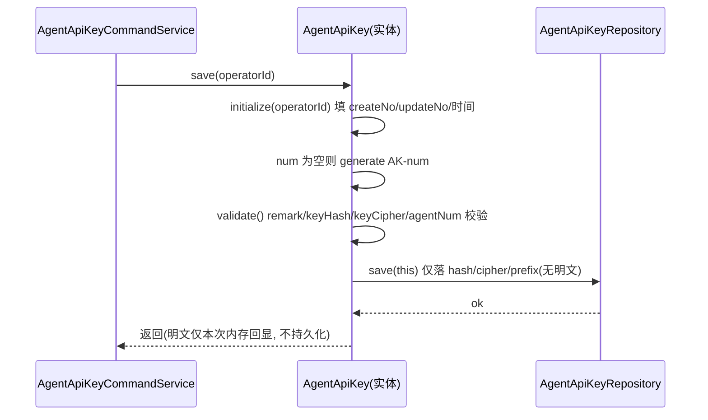

**时序图 — `AgentApiKey.delete`**

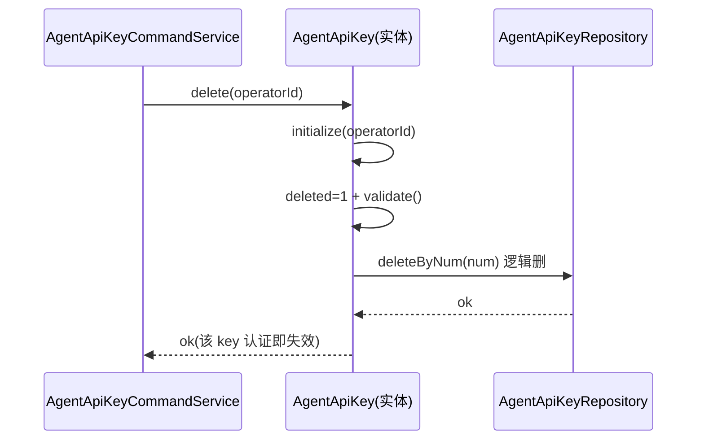

**时序图 — `AgentApiKey.touchUsed`**

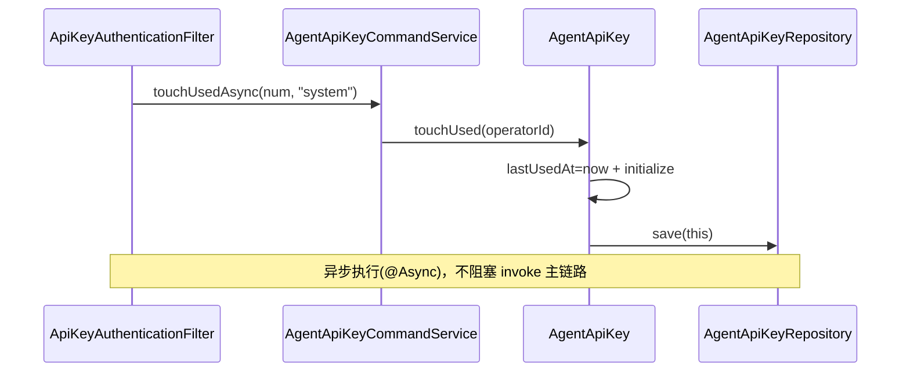

#### 3.2.4 领域事件

| 事件名 | 触发时机 | 载荷要点 | 可订阅方/用途 |
| --- | --- | --- | --- |
| `AGENT_VERSION_PUBLISHED`（改） | 发布版本成功 | agentNum, versionNum, operatorId, occurredAt（**移除 changeLevel**） | 实例缓存失效、下游审计 |
| `AGENT_CREATED` / `AGENT_OFFLINED` / `AGENT_DELETED` | 既有 | 不变 | 既有订阅方 |

> 秘钥相关动作不产生领域事件（见 3.2.3 注）。

---

## 4. 应用层设计

### 4.1 业务模块划分

| 模块 | Service | 对应领域/PRD |
| --- | --- | --- |
| 4.2 秘钥（apiKey） | `AgentApiKeyCommandService` / `AgentApiKeyQueryService` | 更改 1/3 |
| 4.3 Agent（agent） | `AgentCommandService`（改 create / publish） | 更改 4/5/8 |
| 4.4 对外调用（open） | `OpenAgentInvokeService` | 更改 7 |

### 4.2 秘钥（apiKey）

#### 4.2.1 Service 方法清单

| Service | 方法 | 签名 | 职责 |
| --- | --- | --- | --- |
| `AgentApiKeyCommandService` | 创建 | `String create(String agentNum, String remark, String operatorId)` | 校验 Agent 存在且 CONFIG、count<50 → factory 生成 key + hash/cipher/prefix → save → 返回本次明文（不持久化明文） |
| | 删除 | `void delete(String agentNum, String keyNum, String operatorId)` | 校验归属匹配 → delete |
| | 异步标记使用 | `void touchUsedAsync(String keyNum)` | `@Async` 更新 lastUsedAt（认证过滤器调用） |
| `AgentApiKeyQueryService` | 列表（掩码） | `List<AgentApiKeyVO> listByAgent(String agentNum, String operatorId)` | 只返回 prefix 掩码 + 元信息，**不含密文/明文** |
| | 单条解密（小眼睛） | `AgentApiKeyPlainVO reveal(String agentNum, String keyNum, String operatorId)` | 校验归属 → 解密 `key_cipher` 返回明文 + 记审计；登录态 + workspace 校验 |
| | 认证查（内部） | `AgentApiKeyDTO authenticate(String rawKey)` | 供过滤器：`SHA-256(rawKey)` → `findByKeyHash` 命中有效秘钥，返回 agentNum/workspaceNum/num |

#### 4.2.2 方法时序逻辑

**`create`**

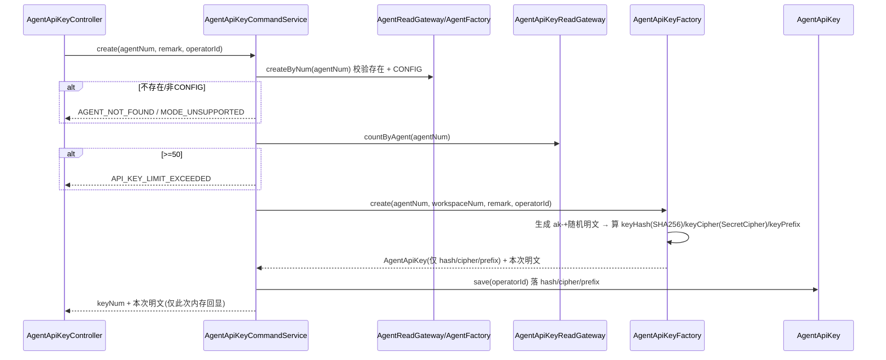

**`delete`**

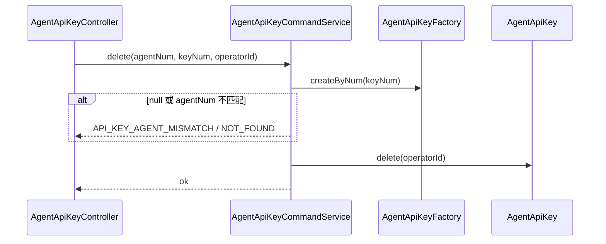

**`listByAgent`（掩码）**

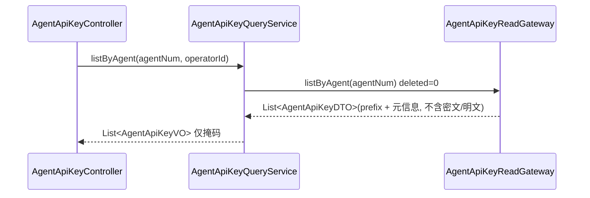

**`reveal`（小眼睛，单条解密）**

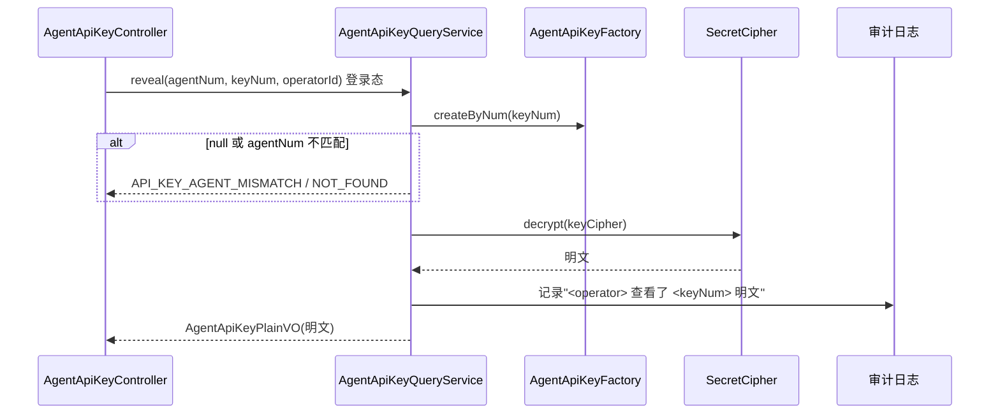

**`authenticate`（内部，过滤器调用）**

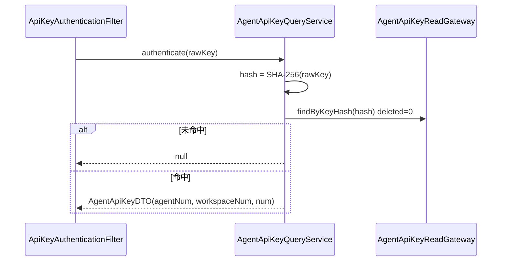

### 4.3 Agent（agent）

#### 4.3.1 Service 方法清单

| Service | 方法 | 变更 |
| --- | --- | --- |
| `AgentCommandService` | `create(param, operatorId)` | 唯一性校验改 `existsByWorkspaceAndName(workspaceNum, name)`；首版构造去 `ChangeLevel.MAJOR` 入参 |
| | `publish(param, operatorId)` | 去 `ChangeLevel.valueOf`；`next = current==null?initial():current.getVersion().next()`；不再 `draft.setChangeLevel` |

#### 4.3.2 方法时序逻辑

**`create`（改）**

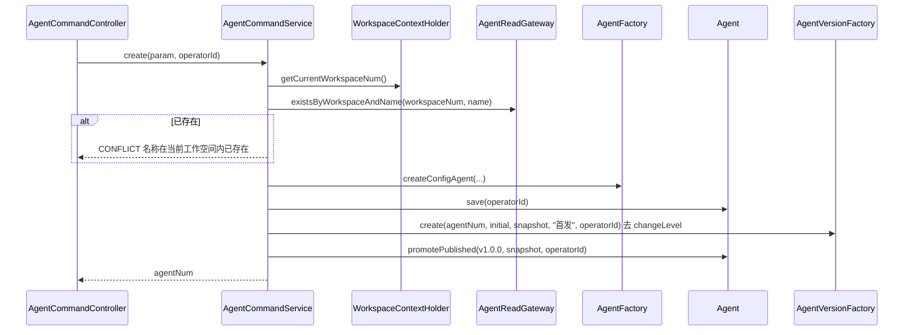

**`publish`（改）**

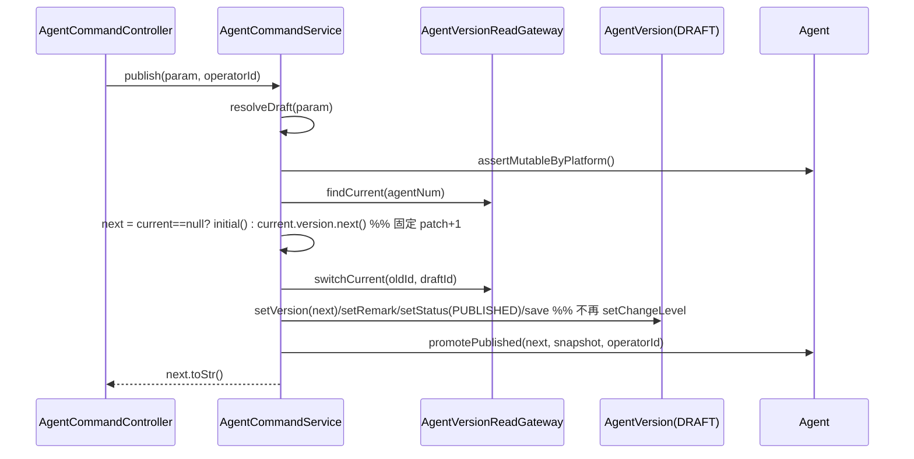

### 4.4 对外调用（open）

> 复用既有调用与会话能力，仅做"对外入口编排 + operator 解析"。不复制业务逻辑：invoke 委托既有 `AgentInvokeService`，会话四接口委托既有 `SessionCommandService`/`SessionQueryService`。

#### 4.4.1 Service 方法清单

| Service | 方法 | 职责 |
| --- | --- | --- |
| `OpenAgentInvokeService` | `Flux<Event> invoke(agentNum, input, sessionNum, operatorId)` | operatorId 为空→"system"；委托 `AgentInvokeService.invokeStream` |
| | `SessionVO createSession(agentNum, skillHint, title, operatorId)` | 委托 `SessionCommandService.createSession` |
| | `PageVO<SessionListVO> listSessions(query, operatorId)` | 委托 `SessionQueryService.pageList` |
| | `SessionDetailVO sessionDetail(num, operatorId)` | 委托 `SessionQueryService.detail` |

#### 4.4.2 方法时序逻辑

**`invoke`（对外）**

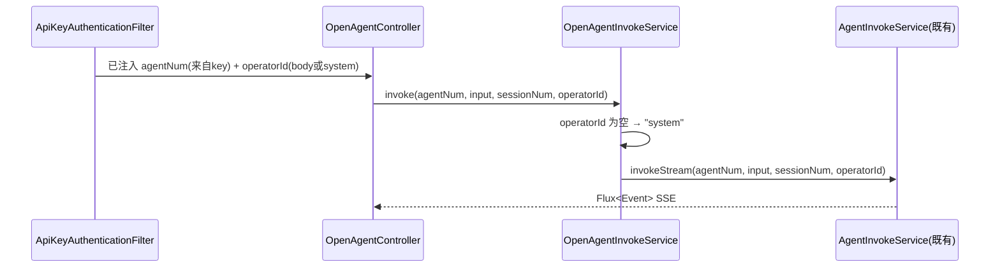

> 会话三方法时序与既有 session 用例一致（参数校验→取 operatorId→Service→封 Result），此处不再重复绘制；差异仅在 operatorId 来源（秘钥链路无登录用户）。

---

## 5. 控制器/Adapter 层设计

### 5.1 业务模块划分

| 模块 | Controller | HTTP | 认证 |
| --- | --- | --- | --- |
| 5.2 秘钥（apiKey） | `AgentApiKeyController` | GET/POST | 登录态（站内管理） |
| 5.3 对外调用（open） | `OpenAgentController` | GET/POST | **秘钥**（`ApiKeyAuthenticationFilter`） |
| — | `AgentCommandController.publish` | POST | 登录态（既有，入参去 changeLevel） |

### 5.2 秘钥（apiKey）

#### 5.2.1 Controller 接口清单

| 接口 | Method | 路径 | 入参(JSON) | 出参(JSON) | 职责 |
| --- | --- | --- | --- | --- | --- |
| 秘钥列表 | GET | `/api/v1/agents/apiKey/query/list?agentNum=AGT001` | — | `Result<List<AgentApiKeyVO>>` | 列表（仅掩码） |
| 创建秘钥 | POST | `/api/v1/agents/apiKey/command/create` | `{"agentNum":"AGT001","remark":"周报系统调用"}` | `Result<{"num":"AK001","key":"ak-..."}>` | 生成并返回本次明文（仅此次） |
| 查看秘钥（小眼睛） | GET | `/api/v1/agents/apiKey/query/reveal?agentNum=AGT001&num=AK001` | — | `Result<{"key":"ak-..."}>` | 解密单条返回明文 + 审计 |
| 删除秘钥 | POST | `/api/v1/agents/apiKey/command/delete` | `{"agentNum":"AGT001","num":"AK001"}` | `Result<Void>` | 逻辑删除 |

**`AgentApiKeyVO`（JSON，列表项，仅掩码）**
```json
{
  "num": "AK001",
  "agentNum": "AGT001",
  "remark": "周报系统调用",
  "keyMasked": "ak-7Qb3****",
  "createNo": "10001",
  "createTime": "2026-06-04 10:00:00.000",
  "lastUsedAt": "2026-06-04 14:05:11.000"
}
```

> `keyMasked` = `key_prefix` + `****`；列表绝不含密文或明文。小眼睛点开另调 `query/reveal` 单条解密接口取 `{"key":"ak-..."}`。

#### 5.2.2 接口时序逻辑

**创建秘钥**
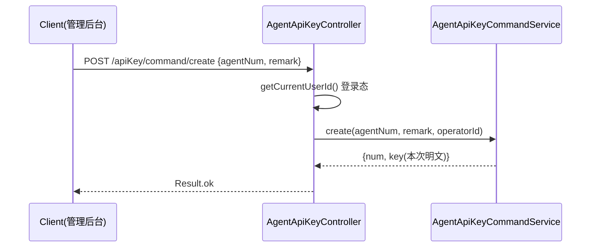

**秘钥列表**
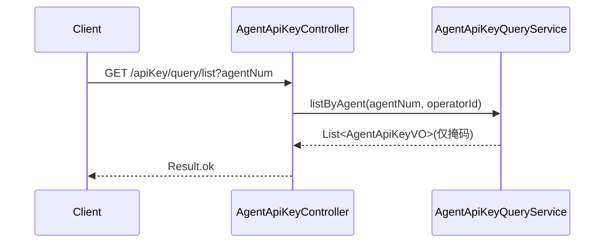

**查看秘钥（小眼睛，单条解密）**
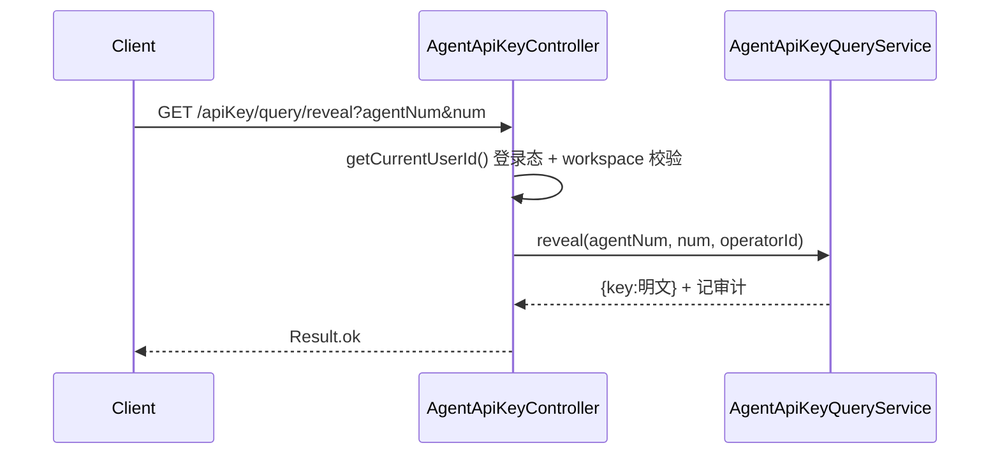

**删除秘钥**
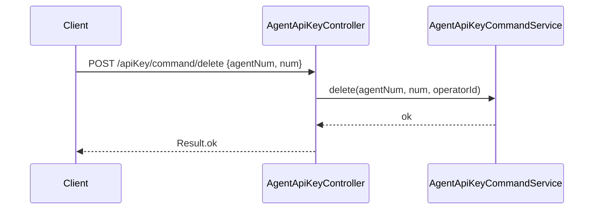

### 5.3 对外调用（open）

#### 5.3.1 Controller 接口清单（秘钥认证）

| 接口 | Method | 路径 | 入参(JSON) | 出参 | 职责 |
| --- | --- | --- | --- | --- | --- |
| 调用 Agent | POST | `/api/v1/open/agents/command/invoke` | `{"agentNum":"AGT001","input":"...","inputType":"text","sessionNum":null,"operatorId":null}` | SSE `text/event-stream` | 流式调用 |
| 创建会话 | POST | `/api/v1/open/agents/command/createSession` | `{"agentNum":"AGT001","skillHint":null,"title":"外部会话","operatorId":null}` | `Result<SessionVO>` | 起会话 |
| 会话列表 | POST | `/api/v1/open/agents/query/sessionList` | `{"agentNum":"AGT001","pageNo":1,"pageSize":20,"operatorId":null}` | `Result<PageVO<SessionListVO>>` | 分页 |
| 会话详情 | GET | `/api/v1/open/agents/query/sessionDetail?num=SES001` | — | `Result<SessionDetailVO>` | 含消息链 |

> `agentNum` 同时由秘钥隐含（key→agentNum）。过滤器校验 body/path 的 agentNum 必须等于 key.agentNum，不一致 403。`operatorId` 调用方可选传，为空记 `system`。

**认证头**：`Authorization: Bearer ak-7Qb3...`

#### 5.3.2 接口时序逻辑

**对外 invoke（含过滤器）**
```mermaid
sequenceDiagram
    participant Caller as 外部系统
    participant F as ApiKeyAuthenticationFilter
    participant Ctrl as OpenAgentController
    participant Svc as OpenAgentInvokeService
    participant Inv as AgentInvokeService
    Caller->>F: POST /open/agents/command/invoke<br/>Authorization: Bearer ak-...
    F->>F: 仅拦 /api/v1/open/**; 提取 Bearer
    alt 缺失/非 ak-
        F-->>Caller: 401 API_KEY_MISSING
    end
    F->>Svc: authenticate(rawKey) 内部 SHA-256→findByKeyHash
    alt 未命中
        F-->>Caller: 401 API_KEY_INVALID
    else 命中
        F->>F: 校验 key.agentNum == body.agentNum
        alt 不匹配
            F-->>Caller: 403 API_KEY_AGENT_MISMATCH
        end
        F->>F: 注入 workspaceNum + apiKeyNum 到 request
        F-)Svc: touchUsedAsync(keyNum) 异步
        F->>Ctrl: 放行
        Ctrl->>Svc: invoke(agentNum, input, sessionNum, operatorId?:system)
        Svc->>Inv: invokeStream(...)
        Inv-->>Caller: SSE message.delta / final
    end
```

**对外创建会话 / 列表 / 详情**：过滤器同上；通过后 Controller 取 `getOpenOperatorId()`（body.operatorId 为空→system），委托既有 session 用例。三接口时序同构，从略。

### 5.4 过滤器与拦截器注册（WebMvcConfig / security）

| 组件 | 变更 |
| --- | --- |
| `ApiKeyAuthenticationFilter`（新增） | `OncePerRequestFilter`；`shouldNotFilter` = 路径非 `/api/v1/open/`；命中则按 §5.3.2 校验；通过后 `request.setAttribute("openWorkspaceNum"/"openApiKeyNum")` |
| `JwtAuthenticationFilter`（既有） | PUBLIC 白名单**加** `/api/v1/open/**`（让 JWT 过滤器放行，交给秘钥过滤器） |
| `WorkspaceContextInterceptor`（既有） | 排除 `/api/v1/open/**`（workspace 由秘钥隐含注入，不走 header） |
| `WebMvcConfig` | 注册秘钥过滤器（`FilterRegistrationBean`，order 在 Jwt 之后）；workspace 拦截器 excludePathPatterns 加 open |

---

## 6. 数据库设计

### 6.1 新增表 `agent_api_key`

| 字段 | 类型 | 必填 | 索引 | 说明 |
| --- | --- | --- | --- | --- |
| id | BIGINT | 是 | PK 自增 | 主键 |
| num | VARCHAR(64) | 是 | UNI | 业务编号 AK 前缀 |
| agent_num | VARCHAR(64) | 是 | idx(agent_num,deleted) | 归属 Agent |
| workspace_num | VARCHAR(64) | 是 | — | 冗余归属空间 |
| remark | VARCHAR(100) | 是 | — | 备注 |
| key_hash | VARCHAR(64) | 是 | UNI | SHA-256(明文)，认证比对用 |
| key_cipher | VARCHAR(255) | 是 | — | SecretCipher 可逆密文，小眼睛解密用 |
| key_prefix | VARCHAR(16) | 是 | — | 明文前 8 位，掩码用 |
| last_used_at | DATETIME(3) | 否 | — | 最近使用时间 |
| create_no | VARCHAR(64) | 是 | — | 创建人 |
| update_no | VARCHAR(64) | 是 | — | 更新人 |
| create_time | DATETIME(3) | 是 | — | 创建时间（毫秒） |
| update_time | DATETIME(3) | 是 | — | 更新时间（毫秒） |
| deleted | TINYINT | 是 | — | 逻辑删除 |

对应领域：`AgentApiKey`（Agent 聚合内实体）。

### 6.2 修改表 `agent_version`

- DROP COLUMN `change_level`（及对应 semver 无关，semver_major/minor/patch 保留）。

### 6.3 修改表 `agent`

- 加部分唯一约束 `uq_agent_ws_name(workspace_num, name, deleted)` 兜底同空间唯一。
- `config_snapshot.modelApiKey` 无表结构变更：保留 `SecretCipher` 加密存读；运行时调 LLM 前解密。

### 6.4 DDL

```sql
-- V13: agent_api_key
SET NAMES utf8mb4;
DROP TABLE IF EXISTS `agent_api_key`;
CREATE TABLE `agent_api_key` (
  `id` BIGINT NOT NULL AUTO_INCREMENT COMMENT '主键',
  `num` VARCHAR(64) NOT NULL COMMENT '业务编号 AK-...',
  `agent_num` VARCHAR(64) NOT NULL COMMENT '归属 Agent 业务编号',
  `workspace_num` VARCHAR(64) NOT NULL DEFAULT 'WS-DEFAULT' COMMENT '冗余归属空间',
  `remark` VARCHAR(100) NOT NULL COMMENT '备注',
  `key_hash` VARCHAR(64) NOT NULL COMMENT 'SHA-256(明文),认证比对用',
  `key_cipher` VARCHAR(255) NOT NULL COMMENT 'SecretCipher 可逆密文,小眼睛解密用',
  `key_prefix` VARCHAR(16) NOT NULL COMMENT '明文前8位,列表掩码用',
  `last_used_at` DATETIME(3) DEFAULT NULL COMMENT '最近一次成功认证时间',
  `create_no` VARCHAR(64) NOT NULL COMMENT '创建人工号',
  `update_no` VARCHAR(64) NOT NULL COMMENT '更新人工号',
  `create_time` DATETIME(3) NOT NULL DEFAULT CURRENT_TIMESTAMP(3) COMMENT '创建时间',
  `update_time` DATETIME(3) NOT NULL DEFAULT CURRENT_TIMESTAMP(3) ON UPDATE CURRENT_TIMESTAMP(3) COMMENT '更新时间',
  `deleted` TINYINT(1) NOT NULL DEFAULT 0 COMMENT '逻辑删除 0=正常 1=删除',
  PRIMARY KEY (`id`),
  UNIQUE KEY `uq_agent_api_key_num` (`num`),
  UNIQUE KEY `uq_agent_api_key_hash` (`key_hash`),
  KEY `idx_agent_api_key_agent` (`agent_num`, `deleted`)
) ENGINE=InnoDB DEFAULT CHARSET=utf8mb4 COLLATE=utf8mb4_unicode_ci COMMENT='Agent API 调用秘钥';

-- V14: 移除发布影响等级
ALTER TABLE `agent_version` DROP COLUMN `change_level`;

-- V15: Agent 名称同空间唯一(部分唯一约束)
ALTER TABLE `agent`
  ADD UNIQUE KEY `uq_agent_ws_name` (`workspace_num`, `name`, `deleted`);
```

> **V15 前置检查**：执行前须确认现网 `agent` 表无同空间同名（deleted=0）冲突行，否则加约束失败。检查 SQL：
> ```sql
> SELECT workspace_num, name, COUNT(*) c FROM agent WHERE deleted=0
> GROUP BY workspace_num, name HAVING c>1;
> ```
> 若有冲突，先人工改名再加约束。

### 6.5 刷数（DML）

- 无强制刷数。`modelApiKey` 保留 `SecretCipher` 加密——若现网历史数据为**明文**（如 dev/test 早期写入），上线前需一次性加密回写为密文，避免运行时解密失败：
```sql
-- 仅当历史 config_snapshot.modelApiKey 为明文时执行：
-- 现状代码注释声称 SecretCipher 加密但实际可能明文,上线前以现网抽样确认。
-- 若为明文,编写一次性加密脚本(读出明文→SecretCipher.encrypt→回写),
-- 涉及 JSON 列内字段,在应用侧脚本处理,不在 Flyway 内做 SQL。
```

> 历史已发布版本号不重算（V14 仅删列，不动 version_num）。秘钥表为新建，无历史数据迁移。

---

## 7. 模块变更清单

### facade（impl-facade-module）
- `facade.agent.AgentDomainEventDTO`：移除 `changeLevel` 字段。
- `facade.common.ChangeLevel` / `facade.common.Version`：评估 `ChangeLevel` 是否被 facade 内引用，若仅 domain 用则保留 facade 版不动；`Version.next` 若 facade 有副本同步无参化（以 domain 为准）。

### client（impl-client-module）
- 新增 `client.agent.AgentApiKeyCreateParam`（agentNum, remark）、`AgentApiKeyDeleteParam`（agentNum, num）、`AgentApiKeyVO`（列表，仅掩码 keyMasked）、`AgentApiKeyPlainVO`（小眼睛，明文 key）、`dto.AgentApiKeyDTO`。
- 新增对外 `client.agent.OpenInvokeParam` / `OpenSessionCreateParam` / `OpenSessionListQuery`（含 operatorId 可选）。
- `client.agent.PublishParam`：删除 `changeLevel` 字段及校验注解。
- `client.agent.AgentCreateParam`：`modelApiKey` 注释保持"加密入库"。

### domain（impl-domain-module）
- 新增 `domain.agent.AgentApiKey`（聚合内实体，save/delete/touchUsed；字段 keyHash/keyCipher/keyPrefix，无明文）。
- 新增 `domain.agent.repository.AgentApiKeyRepository`（save/findByNum/deleteByNum）。
- 新增 `domain.agent.gateway.AgentApiKeyReadGateway`（listByAgent/countByAgent/findByKeyHash/existsByNumAndAgent）。
- 新增 `domain.agent.factory.AgentApiKeyFactory`（create/createByNum，内含 key 生成 + hash/cipher/prefix 计算）。
- `domain.agent.gateway.AgentReadGateway`：加 `existsByWorkspaceAndName`（保留或删除 `existsByOwnerAndName`，确认无其他引用后删）。
- `domain.agent.valueobject.Version`：`next(ChangeLevel)` → `next()` 固定 patch+1。
- 删除 `domain.agent.valueobject.ChangeLevel`。
- `domain.agent.AgentVersion`：移除 `changeLevel` 字段、`domainValidate` 中相关校验、`buildEvent` 中 changeLevel 透传。
- `domain.agent.factory.AgentVersionFactory`：`create(...)` 签名去 `ChangeLevel` 参数。
- `domain.agent.Agent`：`buildEvent` 去 changeLevel 透传。

### infra（impl-infra-module）
- 新增 `infra.agent.entity.AgentApiKeyEntity`、`mapper.AgentApiKeyMapper`、`repository.AgentApiKeyRepositoryImpl`、`gateway.AgentApiKeyReadGatewayImpl`、`factory.AgentApiKeyFactoryImpl`。
- `infra.agent.gateway.AgentReadGatewayImpl`：实现 `existsByWorkspaceAndName`。
- `infra.agent.entity.AgentVersionEntity`：去 `change_level` 列映射。
- `infra.agent.factory.AgentVersionFactoryImpl`：适配去 changeLevel。
- `ConfigAgentBuilder` / `OpenAiChatModelFactory`：保留运行时 `SecretCipher.decrypt(modelApiKey)` 再调 LLM（既有逻辑不动）。
- `infra.common`（SecretCipher）：保留并复用——秘钥 `key_cipher` 与 `modelApiKey` 共用其 encrypt/decrypt；新增 SHA-256 hash 工具（认证用）。
- DDL/迁移脚本：`V13`~`V15`。

### application（impl-application-module）
- 新增 `application.agent.AgentApiKeyCommandService`（create/delete/touchUsedAsync）、`AgentApiKeyQueryService`（listByAgent 掩码 / reveal 单条解密 / authenticate）。
- 新增模型秘钥单条解密用例（供 Step2 / 详情小眼睛），走登录态 + workspace 校验 + 审计。
- `application.agent.AgentCommandService`：`create` 改唯一性校验；`create`/`publish` 去 changeLevel。
- 新增 `application.agent.OpenAgentInvokeService`（对外调用编排，委托既有 invoke/session 用例）。

### adapter（impl-adapter-module）
- 新增 `adapter.agent.AgentApiKeyController`（GET list 掩码 / GET reveal 解密 / POST create / POST delete）。
- 新增 `adapter.open.OpenAgentController`（POST invoke / POST createSession / POST sessionList / GET sessionDetail）。
- 新增 `adapter.security.ApiKeyAuthenticationFilter`（SHA-256 → findByKeyHash 比对）。
- `adapter.security.JwtAuthenticationFilter`：PUBLIC 白名单加 `/api/v1/open/**`。
- `adapter.config.WorkspaceContextInterceptor` / `WebMvcConfig`：排除 open 路径 + 注册秘钥过滤器。
- `adapter.agent.AgentCommandController.publish`：入参 `PublishParam` 去 changeLevel（无逻辑改动，随 client 变更）。

---

## 8. 代码分支命名

- **本方案对应分支**：`feature-20260604-agent-optimization`
- 现有仓库已存在 `feature/2026-06-04/agent-optimization`（前后端均已切），沿用该分支，无需另建。

---

## 9. 实现顺序与依赖

按六层依赖 facade → client → domain → infra → application → adapter：

1. **facade**：`AgentDomainEventDTO` 去 changeLevel。
2. **client**：新增秘钥 Param/VO/DTO、对外 Param；`PublishParam` 去 changeLevel。
3. **domain**：`AgentApiKey` + Repository/Gateway/Factory 接口；`Version.next()` 无参；删 `ChangeLevel`；`AgentVersion`/`AgentVersionFactory` 去 changeLevel；`AgentReadGateway` 加方法。
4. **infra**：`AgentApiKey*` 实现 + DDL（V13~V15）；`AgentReadGatewayImpl.existsByWorkspaceAndName`；秘钥 hash/cipher 计算 + modelApiKey 保留加解密；`AgentVersionEntity` 去列。
5. **application**：秘钥 Command/Query Service；`AgentCommandService` 改 create/publish；`OpenAgentInvokeService`。
6. **adapter**：`AgentApiKeyController`、`OpenAgentController`、`ApiKeyAuthenticationFilter`、Jwt 白名单 + WebMvcConfig 注册。

> 前端（rd-agent-fe）与后端并行，依赖后端接口契约（§5）：秘钥管理 Tab、模型秘钥小眼睛、发布弹窗去影响等级、API 信息 Tab 改对外 open 路径 + Bearer、表单 sticky footer。

---

## 10. 接口与数据契约（汇总）

| 接口 | Method | 路径 | 认证 |
| --- | --- | --- | --- |
| 秘钥列表 | GET | `/api/v1/agents/apiKey/query/list?agentNum=` | 登录态 |
| 创建秘钥 | POST | `/api/v1/agents/apiKey/command/create` | 登录态 |
| 删除秘钥 | POST | `/api/v1/agents/apiKey/command/delete` | 登录态 |
| 对外调用 | POST | `/api/v1/open/agents/command/invoke` | 秘钥 Bearer |
| 对外建会话 | POST | `/api/v1/open/agents/command/createSession` | 秘钥 Bearer |
| 对外会话列表 | POST | `/api/v1/open/agents/query/sessionList` | 秘钥 Bearer |
| 对外会话详情 | GET | `/api/v1/open/agents/query/sessionDetail?num=` | 秘钥 Bearer |
| 发布版本（改） | POST | `/api/v1/agents/publish` | 登录态（入参去 changeLevel） |

主要 DTO/VO：`AgentApiKeyVO` / `AgentApiKeyDTO` / `AgentApiKeyCreateParam` / `AgentApiKeyDeleteParam` / `OpenInvokeParam` / `OpenSessionCreateParam` / `OpenSessionListQuery`。

---

## 11. 其他

### 11.1 错误码（client.common.BizCode 新增）

| 码 | 枚举 | 文案 |
| --- | --- | --- |
| 2017 | `API_KEY_MISSING` | 缺少有效秘钥 |
| 2018 | `API_KEY_INVALID` | 秘钥无效或已删除 |
| 2019 | `API_KEY_AGENT_MISMATCH` | 秘钥与该 Agent 不匹配 |
| 2020 | `API_KEY_LIMIT_EXCEEDED` | 秘钥数量已达上限 50 |

### 11.2 非功能 / 安全

- **加密存储（绝不存明文）**（PRD §2.1.3）：API 秘钥存 `key_hash`(SHA-256 认证) + `key_cipher`(SecretCipher 可逆密文，小眼睛解密) + `key_prefix`(掩码)；modelApiKey 保留 `SecretCipher` 加密。认证链路只碰 hash，不解密；解密接口（reveal）受登录态 + workspace 校验 + 审计保护；列表/批量接口不返回密文/明文。
- `SecretCipher` 密钥经配置中心/环境变量下发，不硬编码、不入库；轮换密钥需配套迁移 `key_cipher` 与 `modelApiKey` 密文。
- `key` 生成：`ak-` + 32 字节 base62 随机（`SecureRandom`）；`key_hash` = SHA-256(明文)，唯一索引冲突时重试。
- `last_used_at` 异步更新（`@Async`），不阻塞 invoke 主链路。
- 性能：秘钥认证为单次 `findByKeyHash`（唯一索引等值查），P99 < 5ms。

### 11.3 JavaDoc

所有新增类/字段/方法须完整 JavaDoc（rd-agent-be 强约束）；`AgentApiKey` 类注释须说明"加密存储(key_hash+key_cipher+key_prefix,绝不存明文)、聚合内实体、≤50"。

---

## 附：关联文档

- [Agent 优化 PRD](../产品方案/2026-06-04-Agent优化-PRD.md)
- [Agent 管理 PRD（父）](../产品方案/2026-05-11-Agent管理-PRD.md)
- [工作空间管理 技术方案](./2026-06-03_工作空间管理-技术方案.md)
- [Agent 管理 技术方案](./2026-05-11_Agent管理-技术方案.md)
