# AgentOps — 沙箱管理 技术方案

> 文档日期：2026-06-08　|　版本：v1.0
> 输入 PRD：[2026-06-08-沙箱管理-PRD](../产品方案/2026-06-08-沙箱管理-PRD.md)
> 关联方案：[工作空间管理-技术方案](./2026-06-03_工作空间管理-技术方案.md) · [Skill 管理-技术方案](./2026-05-11_Skill管理-技术方案.md)
> 代码仓库：[rd-agent-be](../代码仓库/rd-agent-be/)（六层架构，base package `ink.garry.rd.agent.ws`）

---

## 0. 设计前共识（10 问纪要）

设计前与需求方确认的关键决策（写入本方案作为约束依据）：

| # | 议题 | 结论 |
| --- | --- | --- |
| 1 | **部署架构** | **不变，无需设计**：沙箱管理是 rd-agent-be 内的新模块，复用现有后端应用 + rd-agent-fe 前端部署；OpenSandbox 为已接入的外部云服务。 |
| 2 | **规格下发** | **扩展现有 `SandboxClient`** 支持按沙箱传入 CPU / 内存 / 存活时间（现有 `SandboxClient` 仅固定镜像 + 全局 TTL，只有 create/connect/renew/kill）。 |
| 3 | **四态映射** | 提交 = create 容器并拿 sandboxId；上线 = 就绪/健康校验；下线 = kill。 |
| 4 | **状态流转方式** | **异步（事件驱动）**：`提交` 同步把 草稿→初始化 并落库 + 发事件；异步监听器创建容器 + 健康检查通过后再把 初始化→在线。 |
| 5 | **空间归属** | 沙箱归属工作空间，带 `workspaceNum`，名称按 `(workspaceNum, name)` 唯一；列表按当前空间过滤。 |
| 6 | **脏态对账** | 本期加**定时对账 Scheduler**（adapter 层 `@Scheduled`），周期校正在线沙箱与 OpenSandbox 真实状态。 |
| 7 | **删除策略** | **统一软删**（`deleted=1`）+ 删除时联动 `kill` 释放底层容器。 |
| 8 | **初始化刷数** | 不预置任何沙箱数据，全部由用户新建。 |
| 9 | **类型枚举** | 本期 `type` 仅 `CODE`，枚举与 UI 预留扩展位。 |
| 10 | **CPU 精度** | CPU 以 0.5 核步进；持久化用 `DECIMAL(4,1)`，领域 / DTO 用 `BigDecimal`，校验 `cpu * 2` 为整数。 |

> **现状复用点（重要）**：仓库已存在 `rd-agent-be-infra/.../infra/common/client/sandbox/`（`SandboxClient` / `SandboxProperties` / `SandboxInfraConfig`），封装 `com.alibaba.opensandbox` SDK，当前用于 **Agent 运行时**的会话→容器映射（固定镜像、全局 TTL）。本方案**不改其运行时用途**，而是：①为其增加「按规格创建」能力（重载 `create`）；②在其上构建沙箱**资产管理**领域（持久化元数据 + 四态机 + 编排）。

---

## 1. 目标与范围

### 1.1 目标

- 在 rd-agent-be 内新增 **sandbox 领域**，提供代码沙箱资产的增 / 删 / 查 / 改与四态生命周期管理；
- 复用并扩展现有 OpenSandbox 接入（`SandboxClient`），把容器的「创建 / 就绪 / 销毁」编排为四态流转；
- 状态流转走**异步事件驱动**，避免提交动作阻塞在 OpenSandbox 调用上；
- 加定时对账，保证平台 status 与 OpenSandbox 真实状态最终一致。

### 1.2 范围

**做**：sandbox 领域（聚合根 + Factory + Repository + Gateway + 事件）；infra（Entity / Mapper / 实现 + `SandboxClient.create` 重载）；application（CommandService / QueryService + 异步供给 Worker + 事件监听）；adapter（Command/Query Controller + 对账 Scheduler）；client（Param / VO / DTO / 常量）；数据库 `sandbox` 表。

**不做**：Agent 绑定沙箱入口；沙箱内运行日志 / 监控；自动伸缩；镜像自定义；多版本配置；配额费用。（详见 PRD §2.2）

---

## 2. 架构设计

### 2.1 应用架构

本需求是一条标准的「单聚合 + 状态机 + 外部资源编排」纵切，落在六层中。**命令 / 查询分离**：写动作（新建 / 编辑 / 删除 / 提交 / 上线 / 下线 / 重新上线）走 `SandboxCommandController → SandboxCommandService`；读（列表 / 详情 / 唯一性预检）走 `SandboxQueryController → SandboxQueryService`。OpenSandbox 的真实创建 / 销毁由**异步监听器**与**领域网关**触发，不阻塞命令链。

#### 2.1.1 代码结构

| 层 | 领域 | 包 | 职责 |
| --- | --- | --- | --- |
| facade | common | `ink.garry.rd.agent.ws.facade.domain` | 复用现有 `DomainEntity` / `DomainEventDTO` / `DomainEventPublisher`，**本次无新增** |
| client | sandbox | `ink.garry.rd.agent.ws.client.sandbox.vo` | `SandboxCreateParam` / `SandboxUpdateParam` / `SandboxOperateParam` / `SandboxPageQueryParam` / `SandboxVO` / `SandboxDetailVO`（adapter 出入参） |
| client | sandbox | `ink.garry.rd.agent.ws.client.sandbox.dto` | `SandboxCreateParamDTO` / `SandboxUpdateParamDTO` / `SandboxDTO` / `SandboxDetailDTO`（application 出入参） |
| client | sandbox | `ink.garry.rd.agent.ws.client.sandbox.constant` | `SandboxConstants`（名称 / 备注长度、CPU / 内存 / 存活时间区间） |
| domain | sandbox | `ink.garry.rd.agent.ws.domain.sandbox` | `Sandbox` 聚合根（五态机 + save/delete/submit/online/offline/reonline/markProvisionFailed） |
| domain | sandbox | `...domain.sandbox.valueobject` | `SandboxStatus` / `SandboxType` 枚举值对象 |
| domain | sandbox | `...domain.sandbox.repository` | `SandboxRepository`（save / findByNum / deleteByNum） |
| domain | sandbox | `...domain.sandbox.factory` | `SandboxFactory`（buildSandbox / buildSandboxByNum） |
| domain | sandbox | `...domain.sandbox.gateway` | `SandboxGateway`（编号生成）—— sandbox 领域**唯一**网关；容器编排不在 domain |
| domain | sandbox | `...domain.sandbox.dto` | `SandboxDomainEventDTO`（领域事件载荷） |
| domain | common | `...domain.common.DomainEventConstant` | 追加 sandbox 事件常量（修改现有类） |
| infra | sandbox | `ink.garry.rd.agent.ws.infra.sandbox.entity` | `SandboxEntity`（MyBatis-Plus，`@Data`，映射 `sandbox` 表） |
| infra | sandbox | `...infra.sandbox.mapper` | `SandboxMapper`（继承 `BaseMapper`） |
| infra | sandbox | `...infra.sandbox.repository` | `SandboxRepositoryImpl`（实现 `SandboxRepository`，仅注入 `SandboxMapper`） |
| infra | sandbox | `...infra.sandbox.factory` | `SandboxFactoryImpl`（实现 `SandboxFactory`，仅注入 `SandboxRepository`） |
| infra | sandbox | `...infra.sandbox.gateway` | `SandboxGatewayImpl`（复用 `BizNumGenerator` 生成 `SBX+yyyyMMddHHmm+4位序号`） |
| infra | common | `...infra.common.client.sandbox.SandboxClient` | **扩展**：新增 `create(cpu, memoryMb, aliveMinutes)` 重载（按规格建容器）+ 判活方法；现有运行时方法不动 |
| infra | common | `...infra.common.constant.LockKeyConstant` | 追加 `SANDBOX_COMMAND_LOCK_PREFIX`（修改现有类） |
| application | sandbox | `ink.garry.rd.agent.ws.application.sandbox.SandboxCommandService` | 写侧用例：create/update/delete/submit/online/offline/reonline（Redisson 锁 + 事务） |
| application | sandbox | `...application.sandbox.SandboxQueryService` | 读侧用例：分页列表 / 详情 / `(workspaceNum,name)` 唯一性预检 / 在线沙箱清单（供对账） |
| application | sandbox | `...application.sandbox.SandboxRunner` | **沙箱运行时服务**：直接使用 infra `SandboxClient` 建容器 / 健康检查 / kill / 存活查询；自带 `@EventListener` 监听 `SANDBOX_SUBMITTED`（异步供给→ online/markFailed）与 `SANDBOX_OFFLINED`/`SANDBOX_DELETED`（kill 容器） |
| adapter | sandbox | `ink.garry.rd.agent.ws.adapter.sandbox.SandboxCommandController` | POST：create/update/delete/submit/online/offline/reonline |
| adapter | sandbox | `...adapter.sandbox.SandboxQueryController` | GET：page/detail |
| adapter | sandbox | `...adapter.sandbox.SandboxReconcileScheduler` | `@Scheduled` 定时对账在线沙箱与 OpenSandbox 真实状态 |
| adapter | sandbox | `...adapter.sandbox.assembler.SandboxVoAssembler` | Param↔DTO、DTO→VO 转换 |

#### 2.1.2 关键调用关系与同步 / 异步边界

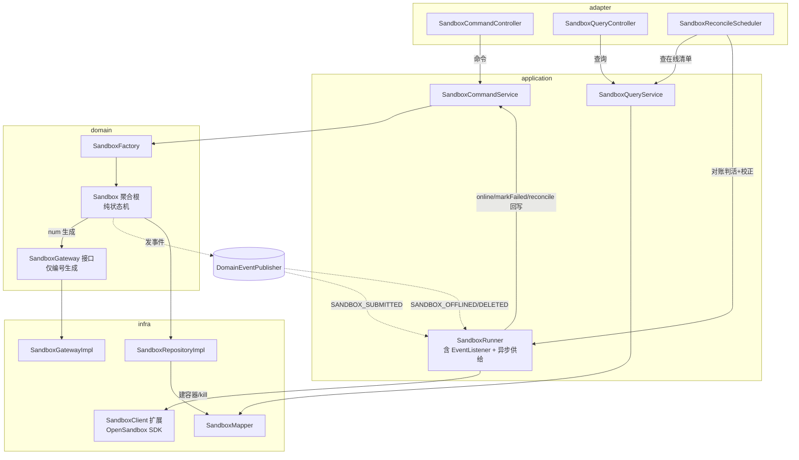

- **同步边界**：`submit` 命令在主线程内只做「草稿→初始化 + 落库 + 发 `SANDBOX_SUBMITTED` 事件」，立即返回；不在命令链里调 OpenSandbox。
- **异步边界（运行时收敛到 `SandboxRunner`）**：`SandboxRunner` 自身用 `@EventListener`（异步线程池）监听 `SANDBOX_SUBMITTED` → **直接使用 infra `SandboxClient`** 创建容器 + 健康检查 → 成功调 `SandboxCommandService.onlineSandbox(num, instanceId)`（初始化→在线），失败调 `markProvisionFailed`（初始化→失败）；并监听 `SANDBOX_OFFLINED` / `SANDBOX_DELETED` → 用 `SandboxClient.kill` 销毁容器。容器编排**全部在应用层 `SandboxRunner`**，domain 聚合是纯状态机、不感知 OpenSandbox。
- **命令 / 查询归属**：create / update / delete / submit / online / offline / reonline 均为**命令类**（CommandController / CommandService）；page / detail / 唯一性预检 / 在线清单为**查询类**（QueryController / QueryService）。CommandService 内的读取统一调 QueryService。

#### 2.1.3 模块自检（架构）

- [x] 应用架构含代码结构四列表格 + 调用关系图；
- [x] 命令 / 查询归属明确（写动作走 Command*，读走 Query*，无歧义）；
- [x] adapter 入口覆盖 Controller（HTTP）+ Scheduler（定时对账）+ 事件监听（在 application 层 listener）；
- [x] 部署架构处理方式已三选一 = 不变。

### 2.2 部署架构

**部署架构不变，无新增应用 / 前端部署实例，复用现有部署架构。**

沙箱管理是 rd-agent-be 内的新模块，随现有后端应用一同部署；前端随 rd-agent-fe 现有管理端部署。OpenSandbox 为已接入的外部云服务（`sandbox.*` 配置经 K8s Secret / 环境变量注入），本方案仅复用其连接，不新增部署组件。异步供给线程池与定时对账均在现有应用进程内运行（多副本下对账任务需加分布式锁防并发，见 §7.4）。

---

## 3. Facade 层设计

**本次无 Facade 层变更。** 复用现有 `DomainEntity`（审计字段 + save/delete/validate 抽象）、`DomainEventDTO`、`DomainEventPublisher`。sandbox 聚合根直接继承 `DomainEntity`，事件走现有 `CommonDomainEventPublisher`（Spring `ApplicationEventPublisher` 本地发布）。

---

## 4. 领域层设计

### 4.1 业务层级划分

| 层级 | 业务 / 子域 | 说明 |
| --- | --- | --- |
| 资产域 | sandbox（沙箱） | 代码沙箱资产，单聚合根 `Sandbox`，含五态（草稿/初始化/在线/下线/失败）生命周期与 OpenSandbox 容器编排 |

本方案仅一个业务领域 `sandbox`，下设 §4.2。

### 4.2 沙箱（sandbox）

#### 4.2.1 领域模型

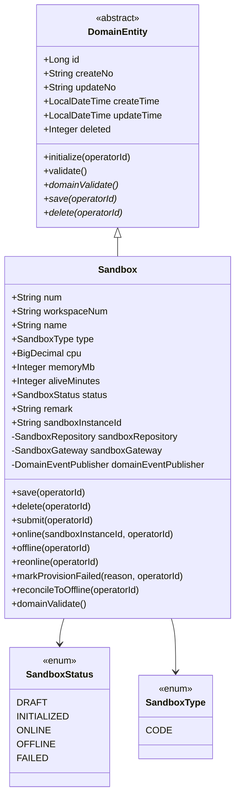

**领域结构表**

| 对象 | 类型 | 属性 | 与其它对象关系 |
| --- | --- | --- | --- |
| `Sandbox` | 聚合根 | id, num, workspaceNum, name, type, cpu, memoryMb, aliveMinutes, status, remark, sandboxInstanceId, createNo, updateNo, createTime, updateTime, deleted | 持有 `SandboxRepository`、`SandboxGateway`、`DomainEventPublisher` 装配依赖 |
| `SandboxStatus` | 值对象（枚举） | DRAFT / INITIALIZED / ONLINE / OFFLINE / FAILED | 被 `Sandbox` 引用 |
| `SandboxType` | 值对象（枚举） | CODE | 被 `Sandbox` 引用 |

- **基本属性（强制）**：`id`（Long）、`num`、`createNo`、`updateNo` 均具备；审计字段继承自 `DomainEntity`。
- **软删除约束**：`deleted` 仅存在于 `DomainEntity`（持久化细节），聚合自身业务字段不含 `isDeleted`。
- **装配依赖（强制）**：聚合根持有 `SandboxRepository` / `SandboxGateway`（编号生成）/ `DomainEventPublisher`；由 `SandboxFactory` 装配。容器编排不在聚合内，故聚合不持有任何运行时网关。
- **聚合边界**：单聚合，无聚合内子实体；`workspaceNum` 为跨聚合的 ID 引用（不引 Workspace 实体）。
- **`sandboxInstanceId`**：OpenSandbox 容器 id，草稿态为空，提交（创建容器）成功后写入。

#### 4.2.2 领域动作

| 聚合/实体 | 领域动作 | 职责 | 前置条件 | 后置条件/规则 | 领域事件 |
| --- | --- | --- | --- | --- | --- |
| Sandbox | `save(operatorId)` | 新建或编辑落库（草稿/失败态全字段；非草稿仅备注，编辑规则由应用层按状态控制入参） | 通过 `domainValidate` | 首次落库生成 num；status 兜底 DRAFT | `SANDBOX_CREATED`（首次）/ `SANDBOX_UPDATED`（已存在） |
| Sandbox | `submit(operatorId)` | 提交：草稿/失败 → 初始化，发供给事件（不在此调 OpenSandbox） | status==DRAFT 或 FAILED | status=INITIALIZED；清空上次 sandboxInstanceId | `SANDBOX_SUBMITTED` |
| Sandbox | `online(sandboxInstanceId, operatorId)` | 上线：初始化 → 在线（由 `SandboxRunner` 在容器就绪后带实例 id 调用） | status==INITIALIZED 且 instanceId 非空 | 绑定 instanceId；status=ONLINE | `SANDBOX_ONLINED` |
| Sandbox | `offline(operatorId)` | 下线：在线 → 下线（kill 容器由 `SandboxRunner` 监听事件执行） | status==ONLINE | status=OFFLINE | `SANDBOX_OFFLINED` |
| Sandbox | `reonline(operatorId)` | 重新上线：下线 → 初始化（重新走供给流程） | status==OFFLINE | status=INITIALIZED；发供给事件 | `SANDBOX_SUBMITTED` |
| Sandbox | `markProvisionFailed(reason, operatorId)` | 初始化失败：初始化 → 失败，记录失败原因 | status==INITIALIZED | status=FAILED；清空 sandboxInstanceId | `SANDBOX_PROVISION_FAILED` |
| Sandbox | `reconcileToOffline(operatorId)` | 脏态对账：在线 → 下线（容器判活由 `SandboxRunner` 完成） | status==ONLINE | status=OFFLINE | `SANDBOX_OFFLINED` |
| Sandbox | `delete(operatorId)` | 软删；在线态禁删（kill 残留容器由 `SandboxRunner` 监听事件执行） | status!=ONLINE | deleted=1 | `SANDBOX_DELETED` |

> **设计要点**：聚合是**纯状态机**，所有动作只做状态流转 + 落库 + 发事件，**不**调用 OpenSandbox。容器的创建 / 健康检查 / 销毁 / 存活查询全部由应用层 `SandboxRunner` **直接使用 infra `SandboxClient`** 完成：
> - `submit` 仅置 INITIALIZED + 发 `SANDBOX_SUBMITTED`；`SandboxRunner` 监听该事件 → 建容器 + 健康检查 → 成功调 `online(instanceId, operatorId)`、失败调 `markProvisionFailed(reason, operatorId)`。
> - `offline` / `delete` 仅流转状态 + 发事件；`SandboxRunner` 监听 `SANDBOX_OFFLINED` / `SANDBOX_DELETED` → `SandboxClient.kill` 销毁容器。
> - 初始化失败时转 **FAILED** 态（非回落草稿），用户可在失败态**重新提交**（`submit`，FAILED→INITIALIZED）、**编辑**（改规格后 save，仍停 FAILED）或**删除**。

**时序图：submit（提交，同步快路径）**

```mermaid
sequenceDiagram
    participant CS as SandboxCommandService
    participant AGG as Sandbox
    participant REPO as SandboxRepository
    participant PUB as DomainEventPublisher
    CS->>AGG: submit(operatorId)
    AGG->>AGG: initialize(operatorId)
    AGG->>AGG: 校验 status==DRAFT 或 FAILED
    AGG->>AGG: status = INITIALIZED; sandboxInstanceId = null
    AGG->>AGG: validate()
    AGG->>REPO: save(this)
    AGG->>PUB: send(SANDBOX_SUBMITTED{num})
    AGG-->>CS: return
```

**时序图：online（上线，由 `SandboxRunner` 在容器就绪后带实例 id 调用）**

```mermaid
sequenceDiagram
    participant RUN as SandboxRunner
    participant CS as SandboxCommandService
    participant AGG as Sandbox
    participant REPO as SandboxRepository
    participant PUB as DomainEventPublisher
    RUN->>CS: onlineSandbox(num, instanceId, operatorId)
    CS->>AGG: online(instanceId, operatorId)
    AGG->>AGG: initialize(operatorId)
    AGG->>AGG: 校验 status==INITIALIZED && instanceId!=null
    AGG->>AGG: sandboxInstanceId = instanceId; status = ONLINE
    AGG->>AGG: validate()
    AGG->>REPO: save(this)
    AGG->>PUB: send(SANDBOX_ONLINED{num})
```

**时序图：offline（下线，kill 容器由 `SandboxRunner` 监听事件执行）**

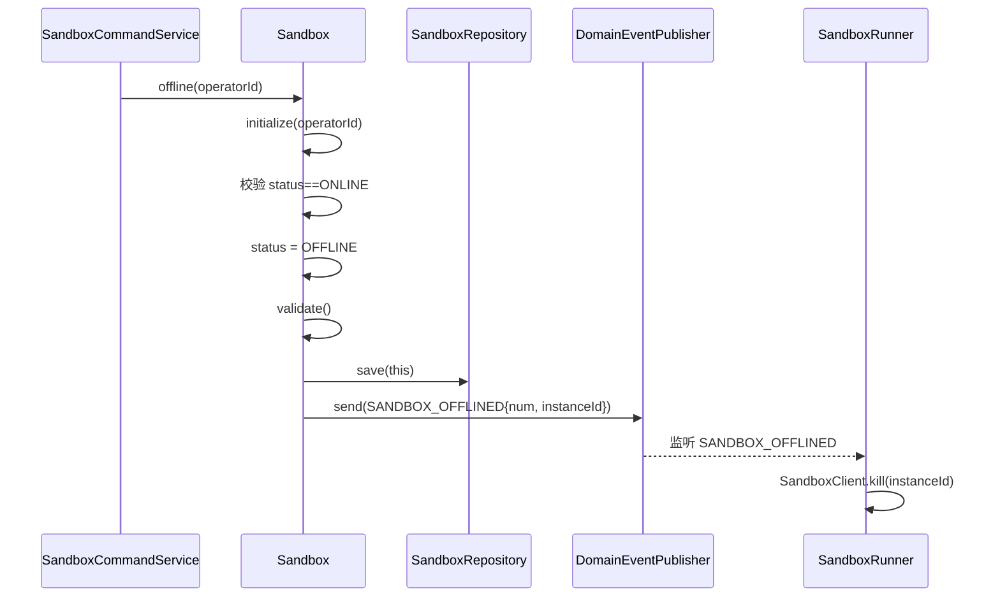

**时序图：delete（软删；kill 残留容器由 `SandboxRunner` 监听事件执行）**

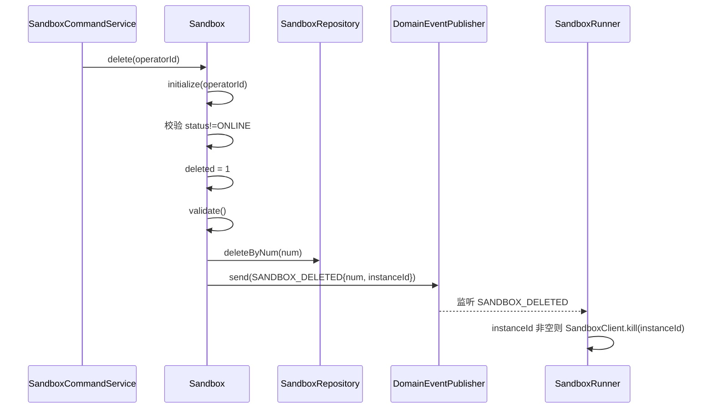

**时序图：markProvisionFailed（初始化失败 → 失败态）**

```mermaid
sequenceDiagram
    participant RUN as SandboxRunner
    participant CS as SandboxCommandService
    participant AGG as Sandbox
    participant REPO as SandboxRepository
    participant PUB as DomainEventPublisher
    RUN->>CS: markProvisionFailed(num, reason, operatorId)
    CS->>AGG: markProvisionFailed(reason, operatorId)
    AGG->>AGG: initialize(operatorId)
    AGG->>AGG: 校验 status==INITIALIZED
    AGG->>AGG: status = FAILED; sandboxInstanceId = null
    AGG->>AGG: validate()
    AGG->>REPO: save(this)
    AGG->>PUB: send(SANDBOX_PROVISION_FAILED{num, reason})
```

**时序图：reonline（重新上线 = 回到初始化重走供给）**

```mermaid
sequenceDiagram
    participant CS as SandboxCommandService
    participant AGG as Sandbox
    participant REPO as SandboxRepository
    participant PUB as DomainEventPublisher
    CS->>AGG: reonline(operatorId)
    AGG->>AGG: initialize(operatorId)
    AGG->>AGG: 校验 status==OFFLINE
    AGG->>AGG: status = INITIALIZED; sandboxInstanceId = null
    AGG->>AGG: validate()
    AGG->>REPO: save(this)
    AGG->>PUB: send(SANDBOX_SUBMITTED{num})
```

**时序图：save（新建 / 编辑统一入口）**

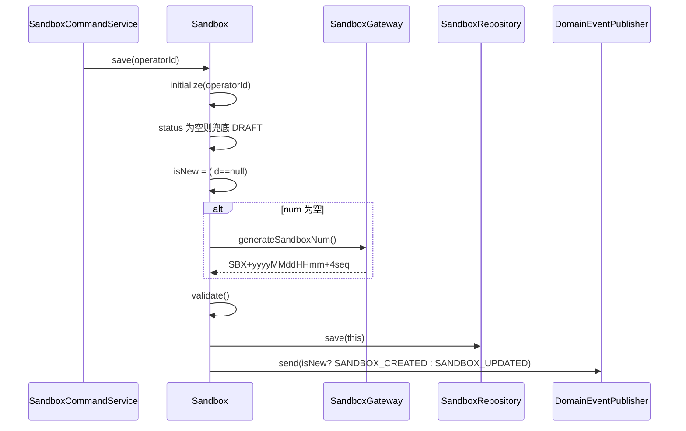

#### 4.2.3 领域规则

| 聚合/对象 | 规则类型 | 规则描述 | 违反时表达 |
| --- | --- | --- | --- |
| Sandbox | 不变性 | `name` 非空且长度 ≤64 | Assert「沙箱名称必须在 1~64 字符之间」 |
| Sandbox | 不变性 | `type` 非空（本期仅 CODE） | Assert「沙箱类型不能为空」 |
| Sandbox | 不变性 | `cpu` ≥0.5 且为 0.5 整数倍（`cpu*2` 为整数）；≤16 | Assert「CPU 需为 0.5 核的整数倍，区间 0.5~16」 |
| Sandbox | 不变性 | `memoryMb` ∈ [128, 65536] | Assert「内存需在 128~65536 MB 之间」 |
| Sandbox | 不变性 | `aliveMinutes` ∈ [1, 1440] | Assert「容器存活时间需在 1~1440 分钟之间」 |
| Sandbox | 不变性 | `remark` 长度 ≤100 | Assert「备注不超过 100 字」 |
| Sandbox | 不变性 | `status` 非空 | Assert「沙箱状态不能为空」 |
| Sandbox | 状态机 | submit 仅 DRAFT / FAILED 可触发 | BusinessException「仅草稿态或失败态可提交」 |
| Sandbox | 状态机 | online 仅 INITIALIZED 且 instanceId 非空 | BusinessException「仅初始化态且容器已创建可上线」 |
| Sandbox | 状态机 | offline 仅 ONLINE 可触发 | BusinessException「仅在线态可下线」 |
| Sandbox | 状态机 | reonline 仅 OFFLINE 可触发 | BusinessException「仅下线态可重新上线」 |
| Sandbox | 状态机 | markProvisionFailed 仅 INITIALIZED 可触发 | BusinessException「仅初始化态可标记失败」 |
| Sandbox | 状态机 | delete 禁止 ONLINE | BusinessException「请先下线后再删除」 |
| Sandbox | 不变性 | 规格（cpu/memory/aliveMinutes/type）仅在 DRAFT / FAILED 态可改；其余态仅备注可改 | 由**应用层** `updateSandbox` 按 status 决定写入哪些字段（草稿/失败全字段、其余仅 remark），再调 `save`；领域不设独立动作 |

#### 4.2.4 领域工厂

`SandboxFactory`（domain 定义接口，infra 实现）。遵循仓库既有 `build*` / `build*ByNum` 命名（与 `SkillFactory` / `WorkspaceFactory` 一致）。

| Factory | 方法名 | 入参 | 返回值 | 职责 | 依赖 |
| --- | --- | --- | --- | --- | --- |
| `SandboxFactory` | `buildSandbox` | workspaceNum, name, type, cpu, memoryMb, aliveMinutes, remark | `Sandbox` | 用创建期用户可填字段构建新聚合（未落库），装配依赖；status 由 save 兜底 DRAFT | — |
| `SandboxFactory` | `buildSandboxByNum` | num | `Sandbox` | 经 `SandboxRepository.findByNum` 加载并装配依赖；不存在返回 null | `SandboxRepository` |

- **create 参数约束**：`buildSandbox` 仅接收用户可填业务字段（workspaceNum 由应用层从当前空间上下文传入、name、type、cpu、memoryMb、aliveMinutes、remark）；不含 operatorId、status、num、sandboxInstanceId、审计字段。
- **构建约束**：application 不得 `new Sandbox()` 或调静态 create；统一经工厂。

**时序图：buildSandboxByNum**

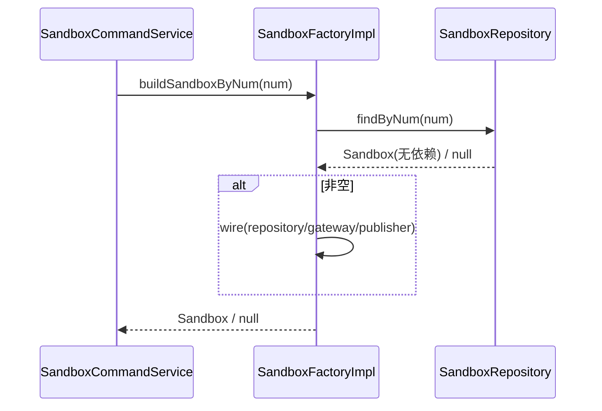

#### 4.2.5 领域网关

sandbox 领域**仅有一个网关** `SandboxGateway`，只负责业务编号生成。OpenSandbox 容器的创建 / 健康检查 / 销毁 / 存活查询**不是领域出站协作能力**，而是应用层职责——由 `SandboxRunner` 直接使用 infra `SandboxClient` 完成，因此 domain 不定义任何运行时网关。

| Gateway | 方法名 | 入参 | 返回值 | 职责 | 外部依赖 | 失败策略 |
| --- | --- | --- | --- | --- | --- | --- |
| `SandboxGateway` | `generateSandboxNum()` | — | String | 复用统一 `BizNumGenerator.generate("SBX")` 产出 `SBX+yyyyMMddHHmm+4位序号` | — | 不涉及外部，无失败 |

- **定义位置**：`SandboxGateway` 接口定义在 `domain.sandbox.gateway`；
- **实现位置**：`SandboxGatewayImpl` 在 infra；
- **依赖约束**：domain 只依赖接口；容器编排在应用层 `SandboxRunner`，不经任何领域网关。

#### 4.2.6 领域事件

| 事件名 | 触发时机 | 载荷要点 | 可订阅方/用途 |
| --- | --- | --- | --- |
| `SANDBOX_CREATED` | 首次 save 落库 | num, workspaceNum, name | 审计 |
| `SANDBOX_UPDATED` | 已存在 save 落库 | num, 变更字段 | 审计 |
| `SANDBOX_SUBMITTED` | submit / reonline（草稿/失败/下线 → 初始化） | num, operatorId | **`SandboxRunner` 监听触发异步供给** |
| `SANDBOX_ONLINED` | online 成功 | num, sandboxInstanceId | 审计 |
| `SANDBOX_OFFLINED` | offline / reconcileToOffline | num, sandboxInstanceId | **`SandboxRunner` 监听 kill 容器** + 审计 |
| `SANDBOX_PROVISION_FAILED` | markProvisionFailed | num, failReason | 审计 + 前端提示 |
| `SANDBOX_DELETED` | delete | num, sandboxInstanceId | **`SandboxRunner` 监听 kill 残留容器** + 审计 |

事件常量追加到现有 `ink.garry.rd.agent.ws.domain.common.DomainEventConstant`。

#### 4.2.7 模块自检（领域层）

- [x] 六子节齐全（模型 / 动作 / 规则 / 工厂 / 网关 / 事件）；
- [x] 基本属性 id/num/createNo/updateNo + 装配依赖具备（Repository / SandboxGateway / Publisher）；聚合无 isDeleted；
- [x] 所有动作带 operatorId；save/delete 具备；聚合为纯状态机，不调 OpenSandbox；
- [x] Factory 仅 build/buildByNum 两方法；**仅一个网关** `SandboxGateway` 在 domain、实现在 infra；
- [x] 每个领域动作配时序图。

---

## 5. 基础设施层设计

### 5.1 sandbox 领域 infra 清单

| 类型 | 类名 | 包路径 | 职责 | 依赖 | 对应表/外部 | 新增/修改 |
| --- | --- | --- | --- | --- | --- | --- |
| Entity | `SandboxEntity` | `infra.sandbox.entity` | `@Data` + `@TableName("sandbox")`，字段含注释；Entity↔领域转换静态方法 | — | `sandbox` 表 | 新增 |
| Mapper | `SandboxMapper` | `infra.sandbox.mapper` | 继承 `BaseMapper<SandboxEntity>` | MyBatis-Plus | `sandbox` 表 | 新增 |
| RepositoryImpl | `SandboxRepositoryImpl` | `infra.sandbox.repository` | 实现 `SandboxRepository`：save（upsert）/ findByNum / deleteByNum（软删 UPDATE deleted=1）；仅注入 `SandboxMapper` | `SandboxMapper` | `sandbox` 表 | 新增 |
| ~~FactoryImpl~~ | （无） | — | `SandboxFactory` 为 domain 层 `@Component` 具体类（与 `WorkspaceFactory` 一致），**infra 无对应 Impl**；工厂直接 `@Resource` 注入 `SandboxRepository`/`SandboxGateway`/`DomainEventPublisher` 完成装配 | — | — | — |
| GatewayImpl | `SandboxGatewayImpl` | `infra.sandbox.gateway` | 复用 `BizNumGenerator` 生成 `SBX+yyyyMMddHHmm+4位序号`（唯一网关实现，注入 `BizNumGenerator`） | `BizNumGenerator` | — | 新增 |
| client 扩展 | `SandboxClient` | `infra.common.client.sandbox` | **新增 `create(cpu, memoryMb, aliveMinutes)` 重载**：在现有固定镜像基础上设置 CPU/内存/timeout=aliveMinutes，返回 sandboxId；新增 `boolean isAlive(id)`（对账判活，若现有未提供）；现有 `create(env)` / connect / renew / kill 不动 | OpenSandbox SDK | OpenSandbox | 修改 |
| client 扩展 | `SandboxProperties` | `infra.common.client.sandbox` | 视 SDK 能力新增资源限额默认值字段（可选） | — | — | 修改（可选） |
| 常量 | `LockKeyConstant` | `infra.common.constant` | 追加 `SANDBOX_COMMAND_LOCK_PREFIX = "sandbox:command:lock:"`、`SANDBOX_RECONCILE_LOCK = "sandbox:reconcile:lock"` | — | — | 修改 |

> **`@Resource` 注入约定**：所有 infra Bean 统一字段注入 `@Resource`，不使用 `@Autowired` / 构造器 / Setter / `ApplicationContext`。`SandboxRepositoryImpl` 仅注入 `SandboxMapper`（不得注入 Gateway / Publisher / 其它 Mapper）。

> **不新增运行时网关实现**：本次不再有 `SandboxRuntimeGatewayImpl` —— 容器编排移到应用层 `SandboxRunner` 直接使用 `SandboxClient`。

### 5.2 `SandboxClient` 扩展要点

现有 `create(Map<String,String> env)` 用 `Sandbox.builder().image(...).env(...).timeout(ttl()).manualCleanup()...`。新增按规格重载（被应用层 `SandboxRunner` 直接调用，不经领域网关）：

```
/** 按规格创建容器并返回 sandboxId（沙箱资产管理用）。 */
public String create(BigDecimal cpu, int memoryMb, int aliveMinutes) {
    try (Sandbox sandbox = Sandbox.builder()
            .image(properties.getImage())
            .cpu(cpu)            // 若 SDK 支持资源限额
            .memoryMb(memoryMb)  // 若 SDK 支持
            .timeout(Duration.ofMinutes(aliveMinutes))
            .manualCleanup()
            .connectionConfig(connectionConfig)
            .build()) {
        return sandbox.getId();
    }
}
```

> **SDK 能力待核实**：`com.alibaba.opensandbox` 的 `Sandbox.builder()` 是否暴露 cpu / memory 限额需在落码前确认。**若 SDK 不支持按容器设 CPU/内存**，退化为：平台侧持久化 cpu/memoryMb 作为元数据展示，容器仍用固定规格创建（共识 #2 的兜底分支），并在方案落码时回写本节说明。`timeout=aliveMinutes` 为容器存活上限（共识 #3）。健康检查 / 判活复用现有 `connect(id)` 探活或 `SandboxManager` 查询能力。

### 5.3 模块自检（infra）

- [x] Entity/Mapper/RepositoryImpl/FactoryImpl/GatewayImpl/common 齐全；
- [x] RepositoryImpl 仅注入本聚合 Mapper，不作 application 查询入口；
- [x] FactoryImpl 只实现 build/buildByNum；仅一个 `SandboxGatewayImpl`；
- [x] `@Resource` 注入；与 §8 数据库设计一致。

---

## 6. 应用层设计

### 6.1 业务模块划分

| 模块 | 类 | 类型 | 说明 |
| --- | --- | --- | --- |
| sandbox | `SandboxCommandService` | 命令 | create/update/delete/submit/online/offline/reonline/markProvisionFailed/reconcileToOffline |
| sandbox | `SandboxQueryService` | 查询 | page/detail/existsByWorkspaceAndName/listOnlineSandboxes/getInstanceId |
| sandbox | `SandboxRunner` | 运行时 + 事件 | 直接用 infra `SandboxClient` 建容器 / 健康检查 / kill / 判活；`@EventListener` 监听 `SANDBOX_SUBMITTED`（异步供给→ online/markFailed）、`SANDBOX_OFFLINED`/`SANDBOX_DELETED`（kill 容器）；供对账判活 |

> **依赖与分层**：`SandboxCommandService` 经 `SandboxFactory` 拿聚合并调领域动作（聚合是纯状态机，只碰仓储/编号网关/事件）；读取走 `SandboxQueryService`（`SandboxMapper` 只读查询返回 client DTO）。**容器编排归 `SandboxRunner`** —— 它直接注入并使用 infra 工具类 `SandboxClient`（`application → infra` 在本项目 ARCHITECTURE.md 中为允许方向，且有 `SkillCommandService` 用 infra client 的先例），不经任何领域网关。`SandboxRunner` 完成容器动作后，回调 `SandboxCommandService` 的状态流转方法落库（保持事务 + 锁在 CommandService 内统一）。

> **命名避让**：本模块运行时服务命名为 `SandboxRunner`，与既有的 Agent 运行时 `application.sandbox.SandboxService`（会话→容器映射）区分，互不影响。

### 6.2 sandbox 模块

#### 6.2.1 Service 方法清单

**SandboxCommandService**（写，均 `@Transactional` + Redisson 锁；operatorId 由 adapter / Runner 传入）

| 方法 | 签名 | 职责 | 入参/出参 |
| --- | --- | --- | --- |
| createSandbox | `SandboxDTO createSandbox(SandboxCreateParamDTO, String operatorId)` | 新建草稿 | 入 ParamDTO；出 SandboxDTO（含 num） |
| updateSandbox | `void updateSandbox(SandboxUpdateParamDTO, String operatorId)` | 编辑（按状态约束可改字段） | 入 ParamDTO |
| deleteSandbox | `void deleteSandbox(String num, String operatorId)` | 软删（kill 由 Runner 监听事件做） | — |
| submitSandbox | `void submitSandbox(String num, String operatorId)` | 草稿/失败 → 初始化 + 发供给事件 | — |
| onlineSandbox | `void onlineSandbox(String num, String instanceId, String operatorId)` | 初始化 → 在线（由 `SandboxRunner` 容器就绪后回调） | — |
| markProvisionFailed | `void markProvisionFailed(String num, String reason, String operatorId)` | 初始化 → 失败（由 `SandboxRunner` 供给失败回调） | — |
| offlineSandbox | `void offlineSandbox(String num, String operatorId)` | 在线 → 下线（发事件，Runner kill） | — |
| reonlineSandbox | `void reonlineSandbox(String num, String operatorId)` | 下线 → 初始化 + 发供给事件 | — |
| reconcileToOffline | `void reconcileToOffline(String num, String operatorId)` | 对账校正：在线 → 下线（由 `SandboxRunner` 判活后回调） | — |

**SandboxQueryService**（读）

| 方法 | 签名 | 职责 |
| --- | --- | --- |
| pageSandboxes | `PageDTO<SandboxDTO> pageSandboxes(SandboxPageQueryParamDTO)` | 按 workspaceNum + type/status/keyword 分页 |
| getDetail | `SandboxDetailDTO getDetail(String num)` | 详情（全字段 + 状态） |
| existsByWorkspaceAndName | `boolean existsByWorkspaceAndName(String workspaceNum, String name)` | 唯一性预检（供 Command 复用） |
| listOnlineSandboxes | `List<SandboxDTO> listOnlineSandboxes()` | 在线沙箱清单（供对账 Scheduler） |
| getInstanceId | `String getInstanceId(String num)` | 取沙箱当前容器实例 id（供 Runner kill / 判活） |

#### 6.2.2 方法时序逻辑

**createSandbox**

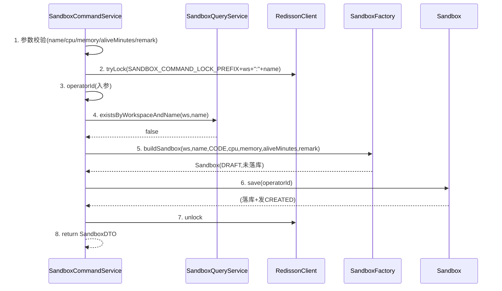

**updateSandbox**

```mermaid
sequenceDiagram
    participant CS as SandboxCommandService
    participant QS as SandboxQueryService
    participant R as RedissonClient
    participant FAC as SandboxFactory
    participant AGG as Sandbox
    CS->>CS: 1. 参数校验
    CS->>R: 2. tryLock(prefix+num)
    CS->>FAC: 4. buildSandboxByNum(num)
    FAC-->>CS: Sandbox / null(→NOT_FOUND)
    CS->>QS: 名称变更则 existsByWorkspaceAndName 预检
    CS->>AGG: 5. 按 status set 字段(草稿/失败:全字段; 其余:仅 remark)
    CS->>AGG: 6. save(operatorId) (发UPDATED)
    CS->>R: 7. unlock
```

**submitSandbox**（同步快路径，不调 OpenSandbox）

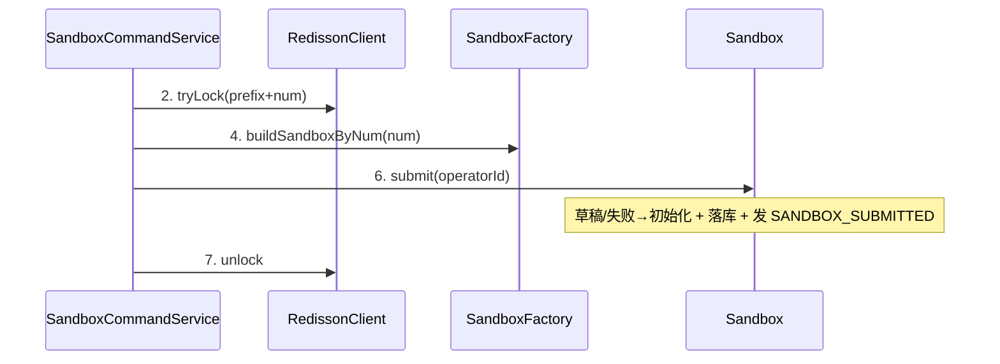

**onlineSandbox / markProvisionFailed / offlineSandbox / deleteSandbox / reonlineSandbox / reconcileToOffline**：均套用「锁 → buildByNum →（null 抛 NOT_FOUND）→ 调对应领域动作 → 解锁」骨架；`onlineSandbox` 额外把 `SandboxRunner` 传入的 `instanceId` 透传给聚合 `online(instanceId, operatorId)`。

#### 6.2.3 SandboxRunner（运行时服务 + 事件监听）

`SandboxRunner` 是容器编排的唯一落点：注入 infra `SandboxClient`（建容器 / kill / 判活）、`SandboxCommandService`（状态回写）、`SandboxQueryService`（取规格 / 实例 id）。它用 Spring `@EventListener`（挂 `sandboxProvisionExecutor` 异步线程池）订阅领域事件，按事件类型分支处理。

**监听 `SANDBOX_SUBMITTED`：异步供给容器**

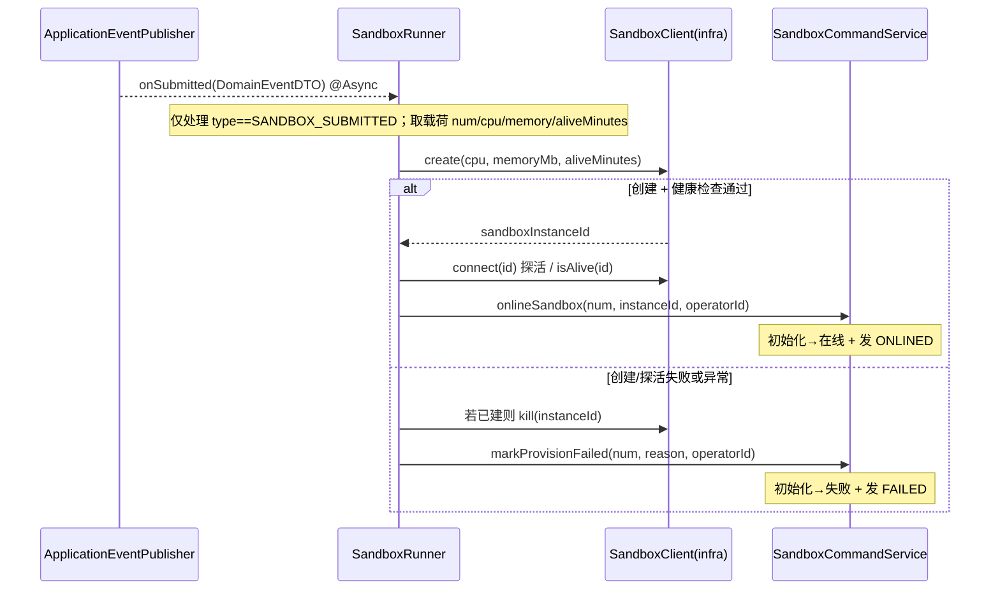

**监听 `SANDBOX_OFFLINED` / `SANDBOX_DELETED`：销毁容器**

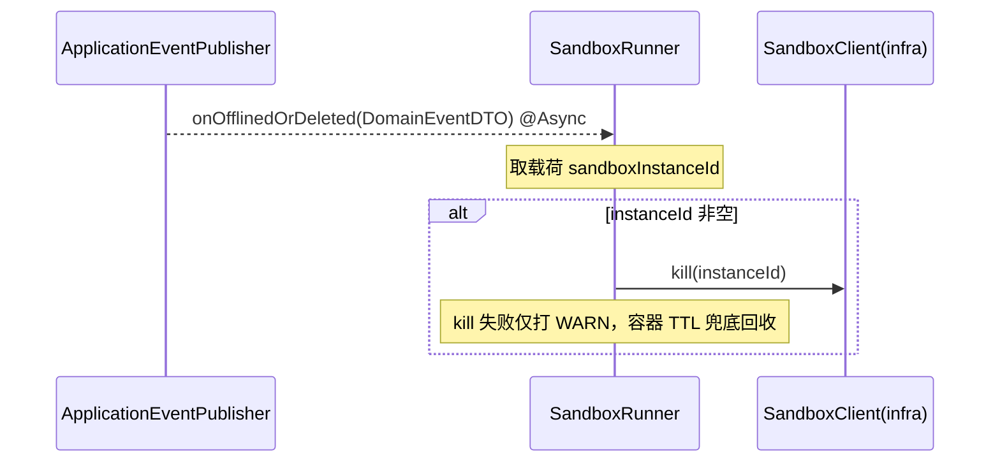

> **线程池**：复用现有异步范式（参 `AsyncConfig` 的 `evaluationExecutor`），新增 `sandboxProvisionExecutor` Bean（adapter.config.AsyncConfig，`@EnableAsync` 已开启）。`@EventListener` + `@Async("sandboxProvisionExecutor")` 组合实现「提交后立即返回、容器供给异步进行」。
> **回写事务**：`SandboxRunner` 自身不开事务、不持锁；容器动作完成后调 `SandboxCommandService` 的方法，由后者在锁 + `@Transactional` 内完成状态落库，避免长事务包住 OpenSandbox 调用。
> **幂等**：`onlineSandbox` / `markProvisionFailed` 内部经聚合状态前置校验（仅 INITIALIZED 可流转），事件重复投递时非初始化态直接忽略。

#### 6.2.4 模块自检（应用层）

- [x] 先 6.1 模块划分再按模块编写；
- [x] Command/Query 分工清晰；application 未注入 Repository/Gateway；容器编排集中在 `SandboxRunner` 直接用 infra `SandboxClient`（`application→infra` 合规）；
- [x] CommandService 写操作 Redisson 锁 + 事务（锁内开事务）；
- [x] 每个方法配时序图；`@Resource` 注入。

---

## 7. Adapter 层设计

### 7.1 业务模块划分

| 模块 | 类 | 类型 | 说明 |
| --- | --- | --- | --- |
| sandbox | `SandboxCommandController` | HTTP（POST） | 新建/编辑/删除/提交/下线/重新上线 |
| sandbox | `SandboxQueryController` | HTTP（GET） | 分页/详情 |
| sandbox | `SandboxReconcileScheduler` | 定时任务 | 对账在线沙箱与 OpenSandbox 真实状态 |
| sandbox | `SandboxVoAssembler` | 组件 | Param↔DTO、DTO→VO 转换 |

> 事件监听不在 adapter —— 由 application 层 `SandboxRunner` 用 `@EventListener` 自行订阅领域事件处理容器编排（见 §6.2.3）；本节仅列 HTTP + 定时任务入口。

### 7.2 sandbox 模块

#### 7.2.1 Controller 接口清单

基址 `/api/v1/sandbox`。operatorId 由 `BaseController.getCurrentUserId()` 取，不入参。workspaceNum 由前端当前空间上下文传入（与工作空间管理一致）。

| 方法 | 路径 | 入参 | 出参 | 职责 |
| --- | --- | --- | --- | --- |
| POST | `/create` | `SandboxCreateParam` | `Result<SandboxVO>` | 新建草稿 |
| POST | `/update` | `SandboxUpdateParam` | `Result<Void>` | 编辑 |
| POST | `/delete` | `SandboxOperateParam`(num) | `Result<Void>` | 软删 |
| POST | `/submit` | `SandboxOperateParam`(num) | `Result<Void>` | 提交（草稿→初始化） |
| POST | `/offline` | `SandboxOperateParam`(num) | `Result<Void>` | 下线 |
| POST | `/reonline` | `SandboxOperateParam`(num) | `Result<Void>` | 重新上线 |
| GET | `/page` | `SandboxPageQueryParam`(query) | `Result<PageVO<SandboxVO>>` | 分页列表 |
| GET | `/detail` | `num`(query) | `Result<SandboxDetailVO>` | 详情 |

> 仅 GET / POST；入参 `*Param`（client.sandbox.vo），出参 `*VO`；application 返回 DTO，Controller 经 `SandboxVoAssembler` 做 DTO→VO 转换。

**接口 JSON 示例**

`POST /api/v1/sandbox/create` 入参：
```json
{
  "workspaceNum": "WS-3f9a1c2b4d5e",
  "name": "Python代码执行环境",
  "type": "CODE",
  "cpu": 1.5,
  "memoryMb": 2048,
  "aliveMinutes": 60,
  "remark": "日常脚本执行"
}
```
返回：
```json
{
  "code": 0, "message": "OK",
  "data": { "num": "SBX2026060810300001", "name": "Python代码执行环境", "type": "CODE",
            "cpu": 1.5, "memoryMb": 2048, "aliveMinutes": 60, "status": "DRAFT", "remark": "日常脚本执行" }
}
```

`POST /api/v1/sandbox/submit` 入参：`{ "num": "SBX2026060810300001" }` → `{ "code":0, "message":"OK", "data":null }`

`GET /api/v1/sandbox/page?workspaceNum=WS-xx&type=CODE&status=ONLINE&keyword=py&pageNo=1&pageSize=20` 返回 `Result<PageVO<SandboxVO>>`。

#### 7.2.2 定时任务清单

| 任务 | cron | 幂等 | 并发控制 | 调用 Service | 失败/告警 |
| --- | --- | --- | --- | --- | --- |
| `SandboxReconcileScheduler.reconcile` | `0 0/5 * * * ?`（每 5 分钟） | 逐沙箱按真实状态校正，重复执行结果一致 | Redisson `SANDBOX_RECONCILE_LOCK`（多副本只一个跑） | `listOnlineSandboxes` + `queryAlive` + 校正命令 | 单沙箱异常打 WARN 不中断整轮；连续失败打 ERROR 告警 |

#### 7.2.3 接口/任务时序逻辑

**POST /create**

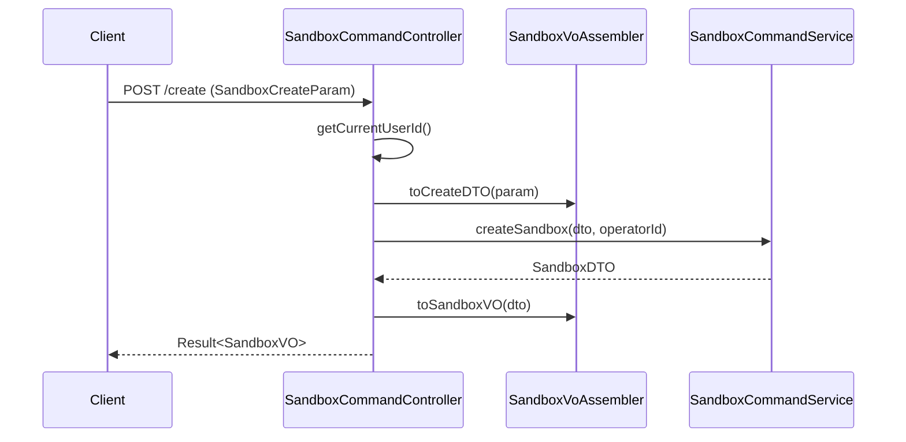

**POST /submit / /offline / /reonline / /delete**（同构）

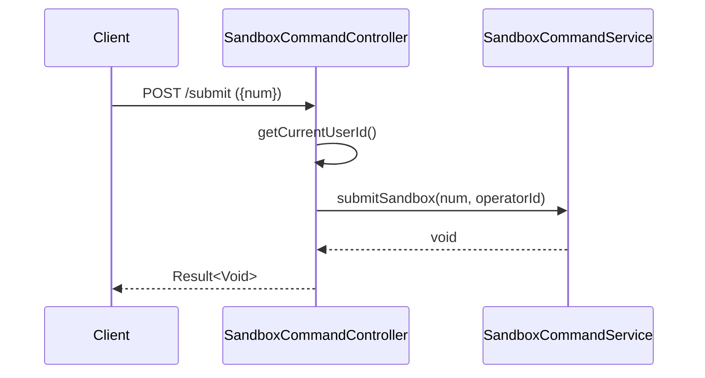

**GET /page**

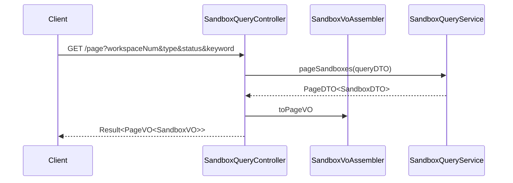

**定时对账 reconcile**

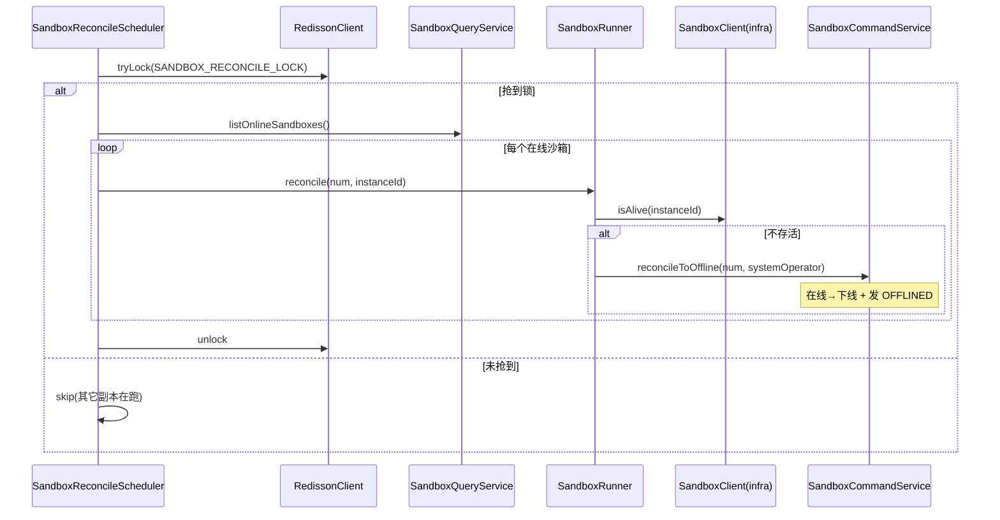

> 容器判活由 `SandboxRunner` 直接调 infra `SandboxClient` 完成；判定不存活后回调 `SandboxCommandService.reconcileToOffline(num, operatorId)` 落库（在线→下线）。Scheduler 只负责调度 + 分布式锁，不直接碰 OpenSandbox。

#### 7.2.4 模块自检（adapter）

- [x] 仅 GET/POST；入参 `*Param`、出参 `*VO`，DTO→VO 在 Controller 说明；
- [x] 定时任务含 cron / 幂等 / 并发锁 / 告警；
- [x] 每个入口配时序图；`@Resource` 注入；事件监听归 application 层 `SandboxRunner`（已说明）。

---

## 8. 数据库设计

### 8.1 表结构：`sandbox`

| 字段 | 类型 | 必填 | 索引 | 说明 |
| --- | --- | --- | --- | --- |
| `id` | BIGINT AUTO_INCREMENT | ✓ | PK | 主键 |
| `num` | VARCHAR(64) | ✓ | UNIQUE | 业务编号 `SBX+yyyyMMddHHmm+4位序号` |
| `workspace_num` | VARCHAR(64) | ✓ | idx | 归属工作空间编号 |
| `name` | VARCHAR(64) | ✓ | UNIQUE(ws,name,deleted) | 沙箱名称 |
| `type` | VARCHAR(32) | ✓ | — | 类型，本期 `CODE` |
| `cpu` | DECIMAL(4,1) | ✓ | — | CPU 核数（0.5 步进，如 1.5） |
| `memory_mb` | INT | ✓ | — | 内存 MB |
| `alive_minutes` | INT | ✓ | — | 容器存活时间（分钟） |
| `status` | VARCHAR(32) | ✓ | idx | `DRAFT`/`INITIALIZED`/`ONLINE`/`OFFLINE`/`FAILED` |
| `remark` | VARCHAR(100) | — | — | 备注 ≤100 字 |
| `sandbox_instance_id` | VARCHAR(128) | — | — | OpenSandbox 容器 id；草稿态空 |
| `create_no` | VARCHAR(64) | ✓ | — | 创建人工号 |
| `update_no` | VARCHAR(64) | ✓ | — | 更新人工号 |
| `deleted` | TINYINT(1) | ✓ | — | 逻辑删除 0/1 |
| `create_time` | TIMESTAMP(3) | ✓ | — | 创建时间（毫秒） |
| `update_time` | TIMESTAMP(3) | ✓ | — | 更新时间（毫秒） |

**对应关系**：表 `sandbox` ↔ 聚合根 `Sandbox`（1:1，无聚合内子实体）。

### 8.2 DDL

```sql
SET FOREIGN_KEY_CHECKS = 0;

CREATE TABLE `sandbox` (
  `id` BIGINT NOT NULL AUTO_INCREMENT COMMENT '主键',
  `num` VARCHAR(64) NOT NULL COMMENT '业务编号 SBX+yyyyMMddHHmm+4位序号',
  `workspace_num` VARCHAR(64) NOT NULL DEFAULT 'WS-DEFAULT' COMMENT '归属工作空间业务编号',
  `name` VARCHAR(64) NOT NULL COMMENT '沙箱名称',
  `type` VARCHAR(32) NOT NULL DEFAULT 'CODE' COMMENT '沙箱类型：CODE=代码沙箱',
  `cpu` DECIMAL(4,1) NOT NULL COMMENT 'CPU 核数，0.5 步进，区间 0.5~16',
  `memory_mb` INT NOT NULL COMMENT '内存大小（MB），区间 128~65536',
  `alive_minutes` INT NOT NULL COMMENT '容器存活时间（分钟），区间 1~1440',
  `status` VARCHAR(32) NOT NULL DEFAULT 'DRAFT' COMMENT '状态：DRAFT/INITIALIZED/ONLINE/OFFLINE/FAILED',
  `remark` VARCHAR(100) DEFAULT NULL COMMENT '备注，≤100 字',
  `sandbox_instance_id` VARCHAR(128) DEFAULT NULL COMMENT 'OpenSandbox 容器 id，草稿态为空',
  `create_no` VARCHAR(64) NOT NULL COMMENT '创建人工号',
  `update_no` VARCHAR(64) NOT NULL COMMENT '更新人工号',
  `deleted` TINYINT(1) NOT NULL DEFAULT 0 COMMENT '逻辑删除 0=正常 1=删除',
  `create_time` TIMESTAMP(3) NOT NULL DEFAULT CURRENT_TIMESTAMP(3) COMMENT '创建时间',
  `update_time` TIMESTAMP(3) NOT NULL DEFAULT CURRENT_TIMESTAMP(3) ON UPDATE CURRENT_TIMESTAMP(3) COMMENT '更新时间',
  PRIMARY KEY (`id`),
  UNIQUE KEY `uq_sandbox_num` (`num`),
  UNIQUE KEY `uq_sandbox_ws_name` (`workspace_num`, `name`, `deleted`),
  KEY `idx_sandbox_ws_status` (`workspace_num`, `status`, `deleted`),
  KEY `idx_sandbox_status` (`status`, `deleted`)
) ENGINE=InnoDB DEFAULT CHARSET=utf8mb4 COLLATE=utf8mb4_unicode_ci COMMENT='沙箱资产主表';

SET FOREIGN_KEY_CHECKS = 1;
```

> 建议作为 Flyway 迁移脚本落 `rd-agent-be-infra/src/main/resources/db/migration/`（版本号取当前最大 +1）。

### 8.3 DML（刷数）

**无刷数**（共识 #8：不预置任何沙箱数据）。`workspace_num` 默认 `WS-DEFAULT` 仅作单空间兜底，不批量回填。

### 8.4 模块自检（数据库）

- [x] `id` BIGINT 自增；`create_time`/`update_time` 毫秒精度（TIMESTAMP(3)）；
- [x] `num` 唯一索引 + `(workspace_num,name,deleted)` 唯一；状态查询有联合索引；
- [x] DDL 可直接执行；与领域 / infra 一致；无 DML。

---

## 9. 模块变更清单

| 层 | 变更 | 实现 Skill |
| --- | --- | --- |
| facade | 无变更（复用 DomainEntity / DomainEventDTO / DomainEventPublisher） | impl-facade-module（无需调用） |
| client | 新增 `SandboxCreateParam` / `SandboxUpdateParam` / `SandboxOperateParam` / `SandboxPageQueryParam` / `SandboxVO` / `SandboxDetailVO` / `PageVO`（若无）；DTO：`SandboxCreateParamDTO` / `SandboxUpdateParamDTO` / `SandboxDTO` / `SandboxDetailDTO` / `SandboxPageQueryParamDTO`；常量 `SandboxConstants` | impl-client-module |
| domain | 新增聚合 `Sandbox`（纯状态机）；枚举 `SandboxStatus` / `SandboxType`；接口 `SandboxRepository` / `SandboxFactory` / `SandboxGateway`（唯一网关）；事件载荷 `SandboxDomainEventDTO`；修改 `DomainEventConstant` 追加 7 个常量 | impl-domain-module |
| infra | 新增 `SandboxEntity` / `SandboxMapper` / `SandboxRepositoryImpl` / `SandboxFactoryImpl` / `SandboxGatewayImpl`；修改 `SandboxClient`（新增按规格 `create` 重载 + 判活）、`LockKeyConstant`（追加锁前缀）；Flyway DDL 脚本 | impl-infra-module |
| application | 新增 `SandboxCommandService` / `SandboxQueryService` / `SandboxRunner`（容器编排 + `@EventListener`） | impl-application-module |
| adapter | 新增 `SandboxCommandController` / `SandboxQueryController` / `SandboxReconcileScheduler` / `SandboxVoAssembler`；修改 `AsyncConfig` 增 `sandboxProvisionExecutor` | impl-adapter-module |

---

## 10. 代码分支命名

**本方案对应分支**：`feature-20260608-sandbox-management`

> 需求类 → `feature-YYYYMMDD-英文名`；日期取方案文档日期 2026-06-08。

---

## 11. 实现顺序与依赖

`client → domain → infra → application → adapter`（facade 无变更，跳过）：

1. **client**：Param / VO / DTO / `SandboxConstants`（契约先行）。
2. **domain**：`SandboxStatus` / `SandboxType` → `SandboxRepository` / `SandboxFactory` / `SandboxGateway` 接口 → `Sandbox` 聚合（纯状态机）→ `DomainEventConstant` 追加。
3. **infra**：DDL（Flyway）→ `SandboxEntity` / `SandboxMapper` → `SandboxRepositoryImpl` → `SandboxGatewayImpl` → `SandboxClient` 扩展（按规格 create + 判活）→ `SandboxFactoryImpl` → `LockKeyConstant`。
4. **application**：`SandboxQueryService` → `SandboxCommandService` → `SandboxRunner`（容器编排 + `@EventListener`）。
5. **adapter**：`AsyncConfig` 加线程池 → `SandboxVoAssembler` → `SandboxQueryController` → `SandboxCommandController` → `SandboxReconcileScheduler`。

> 落码前置校验点：①确认 OpenSandbox SDK 是否支持按容器设 CPU/内存（决定 §5.2 走扩展还是兜底分支）；②确认 `probeReady` 健康检查的最廉价实现（connect 探活 vs SDK 健康接口）。

---

## 12. 接口与数据契约

详见 §7.2.1 JSON 示例。核心 DTO/VO：`SandboxDTO`（列表项）、`SandboxDetailDTO`（详情）、`SandboxCreateParamDTO`/`SandboxUpdateParamDTO`（入参）。状态枚举字符串：`DRAFT`/`INITIALIZED`/`ONLINE`/`OFFLINE`/`FAILED`，前端映射中文 草稿/初始化/在线/下线/失败 与色彩（灰/蓝/绿/橙/红）。

---

## 13. 其他

- **配置项**：复用现有 `sandbox.*`（apiKey/domain/protocol/image/ttlMinutes/requestTimeoutSeconds）；`ttlMinutes` 作为容器存活默认值，沙箱 `aliveMinutes` 覆盖单容器 timeout。
- **多副本对账并发**：`SandboxReconcileScheduler` 必须走 Redisson 锁，避免多 pod 同时对账重复 kill。
- **审计**：复用现有审计基础设施，事件类型 `SANDBOX_CREATED/UPDATED/SUBMITTED/ONLINED/OFFLINED/PROVISION_FAILED/DELETED`。
- **非功能**：列表首屏 ≤1.5s；OpenSandbox 调用超时复用 `requestTimeoutSeconds=30`；供给失败转 FAILED 态允许用户重新提交。
- **遗留待核实**：OpenSandbox SDK 资源限额参数（§5.2）、健康检查接口（§11）。

---

## 附：与 PRD 的覆盖核对

| PRD 要点 | 本方案落点 |
| --- | --- |
| 增删查改 | §6 Command/Query + §7 Controller |
| OpenSandbox 对接 | §5.2 SandboxClient 扩展 + §6.2.3 SandboxRunner（直接用 SandboxClient） |
| 名称/类型/CPU/内存/存活时间/状态/备注字段 | §4.2.1 + §8.1 |
| 草稿→初始化→在线→下线四态 + 失败态 | §4.2.2 状态机 + SandboxStatus（含 FAILED） |
| 提交动作（草稿/失败→初始化） | §4.2.2 submit + §6.2.2 submitSandbox（同步快路径） |
| 异步供给（提交后建容器+健康检查→在线，失败→FAILED） | §6.2.3 SandboxRunner（@EventListener 监听 SANDBOX_SUBMITTED） |
| CPU 0.5 步进 | §4.2.3 规则 + §8 DECIMAL(4,1) |
| 非草稿规格锁定仅改备注（编辑直接 save） | §4.2.3 规则 + §6.2.2 updateSandbox（应用层按 status set 字段） |
| 删除状态守卫（在线禁删/联动 kill） | §4.2.2 delete + §4.2.3 |
| 容器存活到期回收 | §13 aliveMinutes→timeout + §7.2.2 对账 Scheduler |
| 脏态对账 | §7.2.2 SandboxReconcileScheduler |
