# AgentOps — 工具管理 技术方案

> 文档日期：2026-06-09　|　版本：v1.0
> 对应 PRD：[2026-06-01-工具管理-PRD](../产品方案/2026-06-01-工具管理-PRD.md)
> 代码仓库：[rd-agent-be](../代码仓库/rd-agent-be/)　基础包：`ink.garry.rd.agent.ws`
> 兄弟方案：[Skill 管理-技术方案](./2026-05-11_Skill管理-技术方案.md) · [沙箱管理-技术方案](./2026-06-08_沙箱管理-技术方案.md) · [Agent 管理-技术方案](./2026-05-11_Agent管理-技术方案.md)

---

## 0. 设计前共识（12 问纪要）

设计前与负责人确认，结论作为本方案约束（避免实现期返工）：

| # | 议题 | 结论 |
| --- | --- | --- |
| 1 | 部署架构处理方式 | **不变，无需设计**：工具管理是 rd-agent-be 内新模块，无新增应用/前端部署实例，复用现有部署架构。 |
| 2 | 运行时调用边界 | **仅资产 CRUD + 挂载列表**：本方案只交付工具资产的建/编/发布/弃用/列表/详情/复用数 + 给 Agent 挂载用的「已发布工具列表」查询。MCP 代理转发、`OpenApiToMcpAdapter`、变量注入等运行时调用作为后续 agentrunner 方案单列。 |
| 3 | 聚合粒度 | **单一 `Tool` 聚合 + JSON 值对象**：S2 不做版本化；`endpoints[]` / `proxyHeaders[]` / `mcpConfig` / `openApiSpec` 全部作为值对象内嵌，落库为 `tool` 表的 JSON/text 列。无 `ToolVersion` 实体、无端点子表。 |
| 4 | reuseCount 实现 | **查询时实时 count**：列表/详情查询时按 `agent.config_snapshot.mcpNums` 包含本工具 num 实时统计已发布 Agent 数；不冗余 `reuse_count` 字段。 |
| 5 | Agent Step4 改造 | **纳入本方案范围**：把 Agent 管理 CONFIG 模式 Step4 的 mock 切换为真实「已发布工具列表」数据源；`AgentCommandService` 保存时校验挂载的 mcpNum 为 `PUBLISHED`。Agent 领域 `ConfigSnapshot.mcpNums` 已存在，不改领域模型。 |
| 6 | MCP 代理字段深度 | **仅存配置 + 格式校验**：落库 `proxyEnabled` + `proxyHeaders`（JSON），变量占位符 `{\w+}` 格式校验后端兜底；`BuiltinVariableRegistry` 与运行时变量解析不在本方案。 |
| 7 | OpenAPI 解析 | **发布时解析端点元数据**：发布动作内把 `openApiSpec` 解析为端点摘要（端点数 / path / method / summary）落 `endpointMeta`（JSON），供列表展示端点数与详情预览；原文仍存 `openApiSpec`。复用同一解析器服务 MCP API 打包两种来源。 |
| 8 | 引用一致性 | **引用检查 + 动态跟随**：弃用/删除 FC 工具前，经 QueryService 校验是否被任何 `packageMode=EXISTING_API` 的 MCP 工具引用，被引用则拒绝弃用并提示；MCP API 打包动态跟随来源 FC 工具最新已发布配置。 |
| 9 | name 唯一性 | **工作空间内强唯一**（不区分 type）：DB `uq(workspace_num, name, deleted)`；创建/发布前端失焦调后端 check。 |
| 10 | 三态机模式 | **复用 Skill 三态机**：`DRAFT / PUBLISHED / DEPRECATED`；领域动作 `save / publish / unpublish(重新发布走 publish) / delete`；编辑已发布 → 状态回 `DRAFT`（复用同一记录，无版本表）；草稿物理删，已发布/已废弃软删。 |
| 11 | 创建发布语义 | **创建仅草稿，publish 独立**：`createTool` 只落 `DRAFT`；前端「直接发布」= 调 `createTool` 后再调 `publish`，两接口分离（区别于 Skill 的「创建即首发」）。 |
| 12 | 挂载/复用数接口归属 | **均为查询类**：「已发布工具列表」「复用数下钻 Agent 列表」由 `ToolQueryController`（GET）提供。 |

---

## 1. 目标与范围

### 1.1 目标

- 在 rd-agent-be 内新增 **工具（tool）领域**，承载 MCP 与 FunctionCall 两类工具的目录化管理；
- 支持 **4 种创建方式**：MCP 远程连接、MCP API 打包、FunctionCall OpenAPI Spec 导入、FunctionCall 手动录入；
- 实现 **草稿 / 已发布 / 已废弃** 三态机与编辑回滚草稿语义；
- 对外提供「已发布工具列表」查询，承接 **Agent 管理 Step4 由 mock 切真实数据源**；
- 提供工具 **复用数**（被多少已发布 Agent 挂载）与反向下钻 Agent 列表。

### 1.2 范围

**做**：工具 CRUD、4 种创建方式落库与发布校验、三态机、MCP 代理字段存储 + 透传 Header 格式校验、OpenAPI 发布时端点元数据解析、MCP API 打包引用 FC 工具的一致性校验、工作空间内 name 唯一、reuseCount 实时统计、Agent Step4 数据源切换 + 挂载校验。

**不做**（运行时，单列后续方案）：MCP 代理实际转发、`OpenApiToMcpAdapter` 运行时封装、`BuiltinVariableRegistry` 变量注入、调用配额/费用、工具版本化、工具评测、跨工作空间共享。

---

## 2. 架构设计

### 2.1 应用架构

工具管理复用 rd-agent-be 现有六层架构，新增 `tool` 领域，与 `skill` / `sandbox` 平级。下表按本方案涉及的层 / 领域 / 包 / 职责列出代码结构。

| 层 | 领域 | 包 | 职责 |
| --- | --- | --- | --- |
| facade | common | `ink.garry.rd.agent.ws.facade.domain` | 复用 `DomainEntity` / `DomainEventDTO` / `DomainEventPublisher`，**无新增**（详见 §3） |
| facade | common | `ink.garry.rd.agent.ws.facade.common` | 复用 `Result` / `PageVO`，无新增 |
| client | tool | `ink.garry.rd.agent.ws.client.tool.vo` | Controller 入参 `*Param` 与出参 `*Vo`（`ToolCreateParam` / `ToolUpdateParam` / `ToolVo` 等） |
| client | tool | `ink.garry.rd.agent.ws.client.tool.dto` | application 层入参/出参 DTO（`ToolCreateParamDTO` / `ToolDTO` / `ToolDetailDTO` / `ToolPageQueryParamDTO`） |
| client | common | `ink.garry.rd.agent.ws.client.common` | `BizCode` 新增工具域错误码（7xxx 段） |
| domain | tool | `ink.garry.rd.agent.ws.domain.tool` | `Tool` 聚合根（含 save/publish/unpublish/delete 领域动作） |
| domain | tool | `ink.garry.rd.agent.ws.domain.tool.valueobject` | `ToolType` / `CreationMode` / `ToolStatus` / `McpConfigType` / `PackageMode` / `ProxyHeader` / `ApiEndpoint` / `EndpointMeta` 等值对象 |
| domain | tool | `ink.garry.rd.agent.ws.domain.tool.repository` | `ToolRepository`（save / findByNum / deleteByNum） |
| domain | tool | `ink.garry.rd.agent.ws.domain.tool.factory` | `ToolFactory`（create / createByNum） |
| domain | tool | `ink.garry.rd.agent.ws.domain.tool.gateway` | `ToolGateway`（generateToolNum / parseOpenApi 端点解析辅助） |
| domain | tool | `ink.garry.rd.agent.ws.domain.tool.dto` | `ToolDomainEventDTO`（领域事件载荷） |
| infra | tool | `ink.garry.rd.agent.ws.infra.tool.entity` | `ToolEntity`（MyBatis-Plus，对应 `tool` 表） |
| infra | tool | `ink.garry.rd.agent.ws.infra.tool.mapper` | `ToolMapper extends BaseMapper<ToolEntity>` |
| infra | tool | `ink.garry.rd.agent.ws.infra.tool.repository` | `ToolRepositoryImpl`（Entity ↔ Tool 转换 + 持久化） |
| infra | tool | `ink.garry.rd.agent.ws.infra.tool.factory` | `ToolFactoryImpl`（仅注入 `ToolRepository`） |
| infra | tool | `ink.garry.rd.agent.ws.infra.tool.gateway` | `ToolGatewayImpl`（`BizNumGenerator` 编号 + OpenAPI 解析实现） |
| application | tool | `ink.garry.rd.agent.ws.application.tool` | `ToolCommandService` / `ToolQueryService` |
| application | agent | `ink.garry.rd.agent.ws.application.agent` | `AgentCommandService` Step4 改造：保存挂载 mcpNum 时经 `ToolQueryService` 校验为 PUBLISHED（**改造点**） |
| adapter | tool | `ink.garry.rd.agent.ws.adapter.tool` | `ToolCommandController`（POST）/ `ToolQueryController`（GET） |
| adapter | tool | `ink.garry.rd.agent.ws.adapter.tool.assembler` | `ToolVoAssembler`（Param→DTO、DTO→Vo） |

**关键调用关系与命令/查询划分：**

- **命令类**（`ToolCommandController` → `ToolCommandService`）：`createTool`（仅草稿）、`updateTool`（编辑→回 DRAFT）、`publish`、`unpublish`（含重新发布）、`deleteDraft`。CommandService 经 `ToolFactory` 构建/加载领域对象，调用 `Tool` 领域动作落库；写操作加 Redis 分布式锁。
- **查询类**（`ToolQueryController` → `ToolQueryService`）：`pageList`、`detail`、`listMountable`（给 Agent Step4 的已发布工具列表）、`reuseCount` + `listMountedAgents`（复用数下钻）、`existsByName`（唯一性预检）、`existsReferencedByMcp`（FC 弃用前引用检查）。QueryService 经 infra `ToolMapper` / `AgentMapper` 只读查询返回 DTO。
- **依赖方向**：adapter → application → (domain + infra)；domain 仅依赖 facade。application **禁止注入 Repository / Gateway**，跨领域读取（如 reuseCount 扫 Agent）统一走 QueryService 的 Mapper 只读查询。
- **同步/异步边界**：本方案全部同步；reuseCount 实时 count，无异步事件依赖。领域事件（`TOOL_*`）经现有 `DomainEventPublisher` 发布到审计基础设施，与 Skill/Agent 同链路。

#### 模块自检（架构）

- [x] 应用架构含代码结构四列表格；adapter 入口本方案仅 HTTP Controller（无定时任务/事件监听）；
- [x] 命令/查询已明确区分（Command：建/编/发布/弃用/删；Query：列表/详情/挂载/复用数/校验）；
- [x] 部署架构三选一已确认「不变」（见 §0 #1 与 §2.2）；
- [x] 复用与扩展点已说明（新增 tool 领域，改造 AgentCommandService Step4）。

### 2.2 部署架构

**部署架构不变，无新增应用/前端部署实例，复用现有部署架构。** 工具管理为 rd-agent-be 应用内新增领域，随现有后端服务一并部署；前端为现有管理端新增 `/tools` 路由，随现有前端构建发布。依赖的 MySQL / Redis 复用现有云服务，无新增基础设施。

---

## 3. Facade 层设计

**本次无 Facade 层变更。** 工具领域复用现有 facade 通用契约：

- `DomainEntity`（审计字段 id / createNo / updateNo / createTime / updateTime / deleted + initialize/validate/save/delete）；
- `DomainEventDTO` + `DomainEventPublisher`（领域事件发布）；
- `Result` / `PageVO`（client 出参包装）；
- `BusinessException`（业务异常）。

工具域事件常量（`TOOL_*`）追加到 infra 侧的 `DomainEventConstant`（与现有 SKILL_*/SANDBOX_* 同文件），不属 facade 变更。

#### 模块自检（facade）

- [x] 已明确写出「本次无 Facade 层变更」，复用类已列举。

---

## 4. 领域层设计

### 4.1 业务层级划分

| 业务层级 | 业务/子域 | 说明 |
| --- | --- | --- |
| 资产域 | 工具（tool） | 本方案新增；与 skill / sandbox / agent 平级，承载 MCP 与 FunctionCall 工具资产 |
| 资产域 | Agent（agent） | 既有；本方案仅在应用层改造 Step4 数据源，**不改 agent 领域模型** |

工具领域仅一个聚合根 `Tool`，下设 §4.2 一节。

### 4.2 工具（tool）

#### 4.2.1 领域模型

**聚合边界**：`Tool` 为单一聚合根，无聚合内子实体；`endpoints` / `proxyHeaders` / `mcpConfig` / `endpointMeta` 均为值对象（不可变、随聚合整体存取）。跨聚合（引用 FC 工具）仅以 `sourceFcToolNum`（num）引用，不持有对象。

**领域类图：**

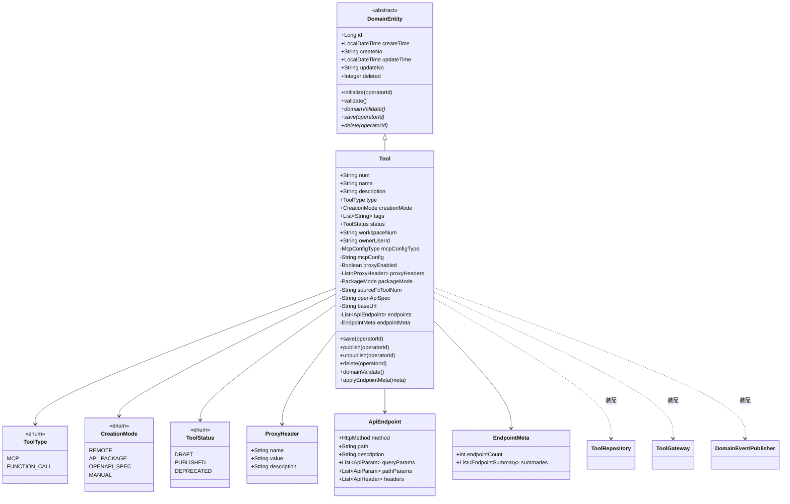
```mermaid
classDiagram
    class DomainEntity {
        <<abstract>>
        +Long id
        +LocalDateTime createTime
        +String createNo
        +LocalDateTime updateTime
        +String updateNo
        +Integer deleted
        +initialize(operatorId)
        +validate()
        +domainValidate()*
        +save(operatorId)*
        +delete(operatorId)*
    }
    class Tool {
        +String num
        +String name
        +String description
        +ToolType type
        +CreationMode creationMode
        +List~String~ tags
        +ToolStatus status
        +String workspaceNum
        +String ownerUserId
        -McpConfigType mcpConfigType
        -String mcpConfig
        -Boolean proxyEnabled
        -List~ProxyHeader~ proxyHeaders
        -PackageMode packageMode
        -String sourceFcToolNum
        -String openApiSpec
        -String baseUrl
        -List~ApiEndpoint~ endpoints
        -EndpointMeta endpointMeta
        +save(operatorId)
        +publish(operatorId)
        +unpublish(operatorId)
        +delete(operatorId)
        +domainValidate()
        +applyEndpointMeta(meta)
    }
    class ToolType {
        <<enum>>
        MCP
        FUNCTION_CALL
    }
    class CreationMode {
        <<enum>>
        REMOTE
        API_PACKAGE
        OPENAPI_SPEC
        MANUAL
    }
    class ToolStatus {
        <<enum>>
        DRAFT
        PUBLISHED
        DEPRECATED
    }
    class ProxyHeader {
        +String name
        +String value
        +String description
    }
    class ApiEndpoint {
        +HttpMethod method
        +String path
        +String description
        +List~ApiParam~ queryParams
        +List~ApiParam~ pathParams
        +List~ApiHeader~ headers
    }
    class EndpointMeta {
        +int endpointCount
        +List~EndpointSummary~ summaries
    }
    DomainEntity <|-- Tool
    Tool --> ToolType
    Tool --> CreationMode
    Tool --> ToolStatus
    Tool --> ProxyHeader
    Tool --> ApiEndpoint
    Tool --> EndpointMeta
    Tool ..> ToolRepository : 装配
    Tool ..> ToolGateway : 装配
    Tool ..> DomainEventPublisher : 装配
```

**领域结构表：**

| 对象 | 类型 | 关键属性 | 与其它对象关系 |
| --- | --- | --- | --- |
| `Tool` | 聚合根（extends DomainEntity） | num / name / description / type / creationMode / tags / status / workspaceNum / ownerUserId + 各创建方式专有字段 | 持有 ToolRepository / ToolGateway / DomainEventPublisher（transient 装配依赖） |
| `ToolType` | 值对象（enum） | MCP / FUNCTION_CALL | Tool.type；建好不可改 |
| `CreationMode` | 值对象（enum） | REMOTE / API_PACKAGE / OPENAPI_SPEC / MANUAL | Tool.creationMode；建好不可改 |
| `ToolStatus` | 值对象（enum） | DRAFT / PUBLISHED / DEPRECATED | Tool.status；系统派生 |
| `McpConfigType` | 值对象（enum） | LOCAL / REMOTE | 仅 type=MCP,creationMode=REMOTE 使用 |
| `PackageMode` | 值对象（enum） | EXISTING_API / OPENAPI_PASTE | 仅 type=MCP,creationMode=API_PACKAGE 使用 |
| `ProxyHeader` | 值对象 | name / value / description | Tool.proxyHeaders 列表项；value 可含 `{变量名}` |
| `ApiEndpoint` | 值对象 | method / path / description / queryParams / pathParams / headers | Tool.endpoints 列表项（MANUAL） |
| `ApiParam` | 值对象 | name / type / defaultValue / description | ApiEndpoint.queryParams/pathParams 项 |
| `ApiHeader` | 值对象 | name / defaultValue / description | ApiEndpoint.headers 项 |
| `EndpointMeta` | 值对象 | endpointCount / summaries | 发布时由 OpenAPI 解析填充（OPENAPI_SPEC / API_PACKAGE-OPENAPI_PASTE） |

**基本属性（强制）**：`id`、`num`、`create_no`、`update_no` 均具备（`id`/createTime/updateTime/deleted 继承自 `DomainEntity`，`createNo`/`updateNo` 即 create_no/update_no）。聚合根持有三类领域协作依赖：`ToolRepository`、`ToolGateway`、`DomainEventPublisher`（均 transient，由 `ToolFactory` 装配）。

**软删除标记约束（强制）**：`Tool` 聚合内不出现 `is_deleted/deleted/isDeleted` 业务字段；`deleted` 仅作为 `DomainEntity` 持久化审计标识由基类管理，infra Entity / DB 表承载，聚合领域动作不读写它做业务判断。

**必备动作（强制）**：`save(operatorId)`、`delete(operatorId)` 均实现；所有领域动作均带 `operatorId`。

#### 4.2.2 领域动作

| 聚合/实体 | 领域动作 | 职责 | 前置条件 | 后置条件/规则 | 领域事件 |
| --- | --- | --- | --- | --- | --- |
| Tool | `save(operatorId)` | 保存/更新工具元信息（草稿态 upsert） | 无状态约束；name/type/creationMode 非空 | status 为空兜底 DRAFT；num 为空则 `generateToolNum`；按 type+creationMode 做形态字段校验 | `TOOL_SAVED` |
| Tool | `publish(operatorId)` | 草稿 → 已发布；全字段必填 + 形态完整性校验；OpenAPI 形态解析端点元数据 | status==DRAFT | 走全量 `domainValidate`；OPENAPI 形态经 Gateway 解析 `endpointMeta`；status=PUBLISHED | `TOOL_PUBLISHED` |
| Tool | `unpublish(operatorId)` | 已发布 → 已废弃（弃用）/ 已废弃 → 已发布（重新发布，见说明） | status==PUBLISHED（弃用）或 status==DEPRECATED（重新发布） | 弃用置 DEPRECATED；重新发布置 PUBLISHED | `TOOL_DEPRECATED` / `TOOL_PUBLISHED` |
| Tool | `delete(operatorId)` | 物理/逻辑删除工具 | status==DRAFT（仅草稿可硬删） | 草稿物理删（deleteByNum）；非草稿禁删抛业务异常 | `TOOL_DELETE_DRAFT` |

> **重新发布说明**：PRD 状态机「已废弃 → 已发布（重新发布）」与「草稿 → 已发布（发布）」是两条不同跃迁。实现上 `Tool` 提供 `publish`（DRAFT→PUBLISHED，含发布校验与端点解析）与 `republish`（DEPRECATED→PUBLISHED，仅切状态不重解析）两个方法，避免在一个方法里混判前置状态。下文时序图分别给出。

**领域动作时序图：**

**(1) `save` —— 保存草稿/编辑暂存**

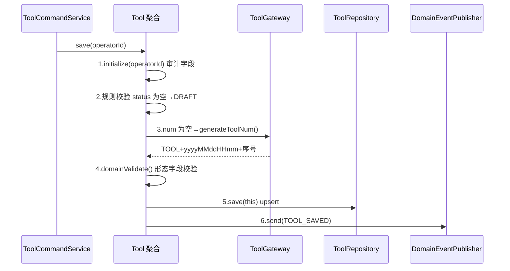
```mermaid
sequenceDiagram
    participant App as ToolCommandService
    participant Tool as Tool 聚合
    participant GW as ToolGateway
    participant Repo as ToolRepository
    participant Pub as DomainEventPublisher

    App->>Tool: save(operatorId)
    Tool->>Tool: 1.initialize(operatorId) 审计字段
    Tool->>Tool: 2.规则校验 status 为空→DRAFT
    Tool->>GW: 3.num 为空→generateToolNum()
    GW-->>Tool: TOOL+yyyyMMddHHmm+序号
    Tool->>Tool: 4.domainValidate() 形态字段校验
    Tool->>Repo: 5.save(this) upsert
    Tool->>Pub: 6.send(TOOL_SAVED)
```

**(2) `publish` —— 草稿发布（含 OpenAPI 端点解析）**

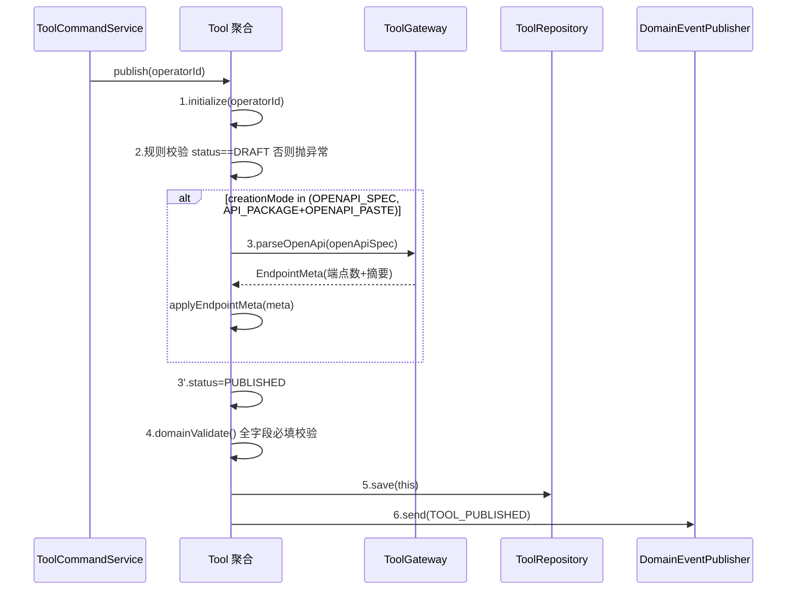
```mermaid
sequenceDiagram
    participant App as ToolCommandService
    participant Tool as Tool 聚合
    participant GW as ToolGateway
    participant Repo as ToolRepository
    participant Pub as DomainEventPublisher

    App->>Tool: publish(operatorId)
    Tool->>Tool: 1.initialize(operatorId)
    Tool->>Tool: 2.规则校验 status==DRAFT 否则抛异常
    alt creationMode in (OPENAPI_SPEC, API_PACKAGE+OPENAPI_PASTE)
        Tool->>GW: 3.parseOpenApi(openApiSpec)
        GW-->>Tool: EndpointMeta(端点数+摘要)
        Tool->>Tool: applyEndpointMeta(meta)
    end
    Tool->>Tool: 3'.status=PUBLISHED
    Tool->>Tool: 4.domainValidate() 全字段必填校验
    Tool->>Repo: 5.save(this)
    Tool->>Pub: 6.send(TOOL_PUBLISHED)
```

**(3) `unpublish` —— 弃用**

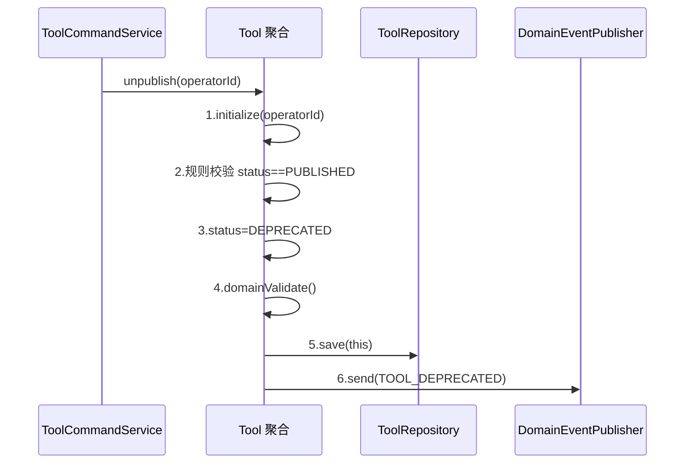
```mermaid
sequenceDiagram
    participant App as ToolCommandService
    participant Tool as Tool 聚合
    participant Repo as ToolRepository
    participant Pub as DomainEventPublisher

    App->>Tool: unpublish(operatorId)
    Tool->>Tool: 1.initialize(operatorId)
    Tool->>Tool: 2.规则校验 status==PUBLISHED
    Tool->>Tool: 3.status=DEPRECATED
    Tool->>Tool: 4.domainValidate()
    Tool->>Repo: 5.save(this)
    Tool->>Pub: 6.send(TOOL_DEPRECATED)
```

**(4) `republish` —— 重新发布**

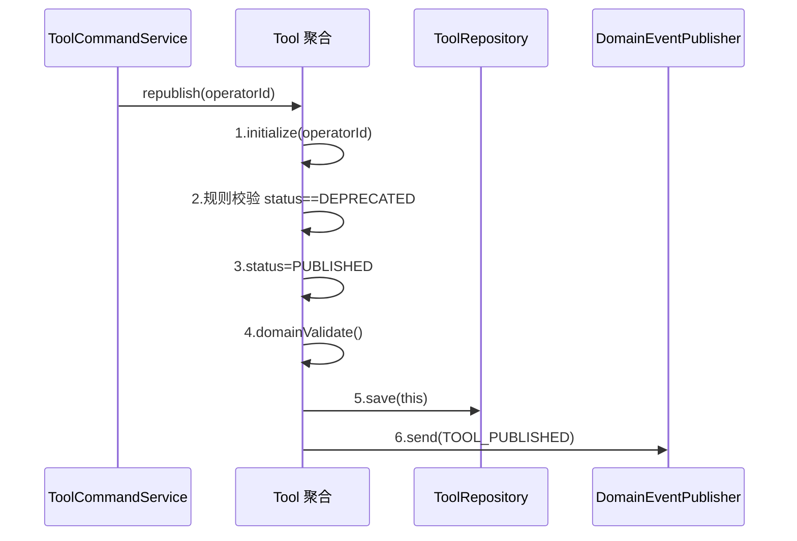
```mermaid
sequenceDiagram
    participant App as ToolCommandService
    participant Tool as Tool 聚合
    participant Repo as ToolRepository
    participant Pub as DomainEventPublisher

    App->>Tool: republish(operatorId)
    Tool->>Tool: 1.initialize(operatorId)
    Tool->>Tool: 2.规则校验 status==DEPRECATED
    Tool->>Tool: 3.status=PUBLISHED
    Tool->>Tool: 4.domainValidate()
    Tool->>Repo: 5.save(this)
    Tool->>Pub: 6.send(TOOL_PUBLISHED)
```

**(5) `delete` —— 删除草稿**

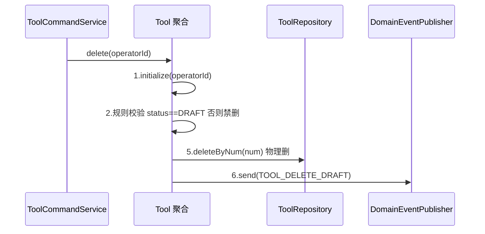
```mermaid
sequenceDiagram
    participant App as ToolCommandService
    participant Tool as Tool 聚合
    participant Repo as ToolRepository
    participant Pub as DomainEventPublisher

    App->>Tool: delete(operatorId)
    Tool->>Tool: 1.initialize(operatorId)
    Tool->>Tool: 2.规则校验 status==DRAFT 否则禁删
    Tool->>Repo: 5.deleteByNum(num) 物理删
    Tool->>Pub: 6.send(TOOL_DELETE_DRAFT)
```

#### 4.2.3 领域规则

| 聚合/对象 | 规则类型 | 规则描述 | 违反时表达 |
| --- | --- | --- | --- |
| Tool | 不变性 | name/description/type/creationMode 必填；description ≤500 字符 | BusinessException 7001 参数非法 |
| Tool | 不变性 | tags ≤20 个，单 tag ≤32 字符 | BusinessException 7001 |
| Tool | 形态约束 | type=MCP+REMOTE：mcpConfigType + mcpConfig 必填且合法 JSON（≤64KB） | BusinessException 7002 MCP 配置非法 |
| Tool | 形态约束 | type=MCP+API_PACKAGE：packageMode 必填；EXISTING_API→sourceFcToolNum 必填，OPENAPI_PASTE→openApiSpec 必填 | BusinessException 7003 打包配置非法 |
| Tool | 形态约束 | type=FC+OPENAPI_SPEC：openApiSpec 必填且合法（≤1MB） | BusinessException 7004 OpenAPI 非法 |
| Tool | 形态约束 | type=FC+MANUAL：baseUrl 合法 URL；endpoints ≥1 且 ≤50；path 占位符与 pathParams 一一对应 | BusinessException 7005 端点配置非法 |
| Tool | 代理约束 | proxyEnabled=false 时 proxyHeaders 必须为空；header 名工具内不重复（大小写不敏感）；value 变量占位仅 `{\w+}` | BusinessException 7006 代理配置非法 |
| Tool | 状态约束 | publish 仅 DRAFT；unpublish 仅 PUBLISHED；republish 仅 DEPRECATED；delete 仅 DRAFT | BusinessException 7007 状态非法 |
| Tool | 引用约束 | 被任何 MCP API 打包工具引用的 FC 工具不可弃用/删除（应用层经 QueryService 前置校验） | BusinessException 7008 工具被引用 |

> 形态校验仅在 `publish`（全量）执行；`save` 草稿态仅校验 name/type/creationMode（PRD §7.7.5）。形态分支校验封装为 `Tool` 私有方法 `validateByShape()`，由 `domainValidate` 在发布路径调用。

#### 4.2.4 领域工厂

`ToolFactory` 接口由 domain 定义、infra 实现，仅 2 个方法：

| Factory | 方法名 | 入参 | 返回值 | 职责 | 依赖 |
| --- | --- | --- | --- | --- | --- |
| ToolFactory | `create(...)` | name, description, type, creationMode, tags, + 各形态业务字段（mcpConfigType/mcpConfig/proxyEnabled/proxyHeaders/packageMode/sourceFcToolNum/openApiSpec/baseUrl/endpoints） | Tool（未落库，已装配依赖） | 用创建工具时用户填写的业务字段构建新 Tool；status 不在此赋值（由 save 兜底 DRAFT） | 装配 Repository/Gateway/EventPublisher |
| ToolFactory | `createByNum(num)` | num | Tool（已装配依赖，不存在返回 null） | 经 Repository.findByNum 加载既有 Tool 并装配依赖 | ToolRepository |

> **create 参数约束**：`create(...)` 入参仅含用户可填字段；不含 `operatorId`、createNo/updateNo、status、num、审计字段、endpointMeta（系统派生）。`workspaceNum` 由 FactoryImpl 内部从 `WorkspaceContextHolder` 注入（与 Skill/Sandbox 一致），不作为业务可见入参。`ownerUserId` 由应用层在 save 前 set（或由 create 接收——与现有 SkillFactory 一致，作为负责人字段允许入参）。
> 不设计 `createById` / `rebuild` 等其它方法。`createByNum` 时序内部经 Repository 获取数据并构建对象。

**`createByNum` 时序：**

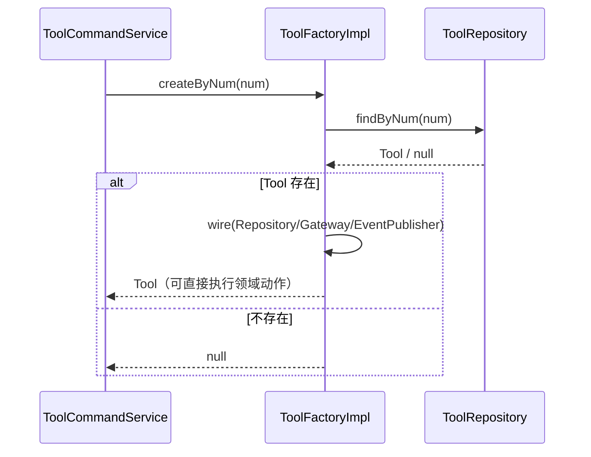
```mermaid
sequenceDiagram
    participant App as ToolCommandService
    participant F as ToolFactoryImpl
    participant Repo as ToolRepository

    App->>F: createByNum(num)
    F->>Repo: findByNum(num)
    Repo-->>F: Tool / null
    alt Tool 存在
        F->>F: wire(Repository/Gateway/EventPublisher)
        F-->>App: Tool（可直接执行领域动作）
    else 不存在
        F-->>App: null
    end
```

#### 4.2.5 领域网关

`ToolGateway` 接口定义在 domain，infra 实现 `ToolGatewayImpl`：

| Gateway | 方法名 | 入参 | 返回值 | 职责 | 外部依赖 | 失败策略 |
| --- | --- | --- | --- | --- | --- | --- |
| ToolGateway | `generateToolNum(ToolType type)` | type | String | 生成业务编号：MCP→`MCP+yyyyMMddHHmm+序号`，FC→`FC+...`（复用 `BizNumGenerator`） | BizNumGenerator(雪花) | 不失败 |
| ToolGateway | `parseOpenApi(String spec)` | OpenAPI/Swagger JSON 原文 | EndpointMeta | 解析端点元数据（端点数 + 每端点 path/method/summary） | 内置 JSON 解析（Hutool JSONUtil） | 解析失败抛 BusinessException 7004 |

> `parseOpenApi` 属「领域规则执行所需的辅助能力」（发布时聚合内需要端点元数据），符合网关收敛范围。domain 仅依赖 `ToolGateway` 接口；application 不直接调 `ToolGatewayImpl`。

#### 4.2.6 领域事件

| 事件名 | 触发时机 | 载荷要点 | 可订阅方/用途 |
| --- | --- | --- | --- |
| `TOOL_SAVED` | save 成功（每次必发） | num / name / type / creationMode / status / operatorId | 审计日志（TOOL_CREATE 派生） |
| `TOOL_PUBLISHED` | publish / republish 成功 | num / type / status / operatorId | 审计日志（TOOL_PUBLISH） |
| `TOOL_DEPRECATED` | unpublish 成功 | num / operatorId | 审计日志（TOOL_DEPRECATE） |
| `TOOL_DELETE_DRAFT` | delete 草稿成功 | num / operatorId | 审计日志（TOOL_DELETE_DRAFT） |

> 事件常量追加到现有 `DomainEventConstant`。审计基础设施复用平台现有（同 Agent/Skill 走同一份 DomainEventPublisher → 审计落库链路），本方案不新增审计组件。

#### 模块自检（领域层）

- [x] 二级目录为业务领域（4.2 工具），下含六个三级子节（模型/动作/规则/工厂/网关/事件）；
- [x] `Tool` 聚合根设计 Factory，仅 `create` / `createByNum` 两方法；create 入参无 operatorId/状态/审计字段；
- [x] `ToolGateway` 定义在 domain、infra 实现；
- [x] 基本属性 id/num/create_no/update_no 齐备；聚合根持有 Repository/Gateway/DomainEventPublisher；无 is_deleted 业务字段；具备 save/delete；所有动作带 operatorId；
- [x] 每个领域动作配时序图（save/publish/unpublish/republish/delete + createByNum）。

---

## 5. 基础设施层设计

### 5.1 tool 领域 infra 清单

| 类型 | 类名 | 包路径 | 职责 | 依赖 | 对应表/外部服务 | 新增/修改 |
| --- | --- | --- | --- | --- | --- | --- |
| Entity | `ToolEntity` | `infra.tool.entity` | `tool` 表映射（Lombok @Data，字段含注释）；JSON 列以 String 存 | — | tool 表 | 新增 |
| Mapper | `ToolMapper` | `infra.tool.mapper` | `extends BaseMapper<ToolEntity>`，无自定义 SQL | ToolEntity | tool 表 | 新增 |
| RepositoryImpl | `ToolRepositoryImpl` | `infra.tool.repository` | 实现 `ToolRepository`；Entity↔Tool 转换（值对象 JSON 序列化用 fastjson2）+ save/findByNum/deleteByNum | **仅注入 ToolMapper** | tool 表 | 新增 |
| FactoryImpl | `ToolFactoryImpl` | `infra.tool.factory` | 实现 `ToolFactory`（create/createByNum）；create 注入 workspaceNum；装配领域依赖 | **仅注入 ToolRepository** + ToolGateway + DomainEventPublisher（装配用） | — | 新增 |
| GatewayImpl | `ToolGatewayImpl` | `infra.tool.gateway` | 实现 `ToolGateway`（generateToolNum/parseOpenApi） | BizNumGenerator | — | 新增 |
| common | `DomainEventConstant` | `infra.common.constant` | 追加 `TOOL_SAVED/TOOL_PUBLISHED/TOOL_DEPRECATED/TOOL_DELETE_DRAFT` | — | — | 修改 |
| common | `LockKeyConstant` | `infra.common.constant` | 追加工具用例锁 key 前缀 `TOOL_COMMAND` | — | — | 修改 |

### 5.2 转换与序列化要点

- `endpoints` / `proxyHeaders` / `endpointMeta` 值对象 ↔ JSON 列：`ToolRepositoryImpl` 用 fastjson2 序列化/反序列化（与 AgentEntity.config_snapshot 同模式）；`mcpConfig` / `openApiSpec` 为 text 原文直存。
- `ToolRepositoryImpl` 不注入 Gateway / DomainEventPublisher / 其它 Mapper，仅注入 `ToolMapper`；不作为 application 查询入口（reuseCount/列表读走 QueryService）。
- Spring Bean 注入统一 `@Resource`，禁用 `@Autowired` / 构造器 / Setter / `ApplicationContext` 手动获取。

#### 模块自检（infra）

- [x] 覆盖 Entity/Mapper/RepositoryImpl/FactoryImpl/GatewayImpl + common；
- [x] RepositoryImpl 仅注入本聚合 Mapper，不作 application 查询入口；FactoryImpl 仅注入 Repository（+装配依赖）；
- [x] 与 §8 数据库设计、§4 domain 接口一致；
- [x] 统一 `@Resource` 注入。

---

## 6. 应用层设计

### 6.1 业务模块划分

| application 模块 | 对应领域 | 说明 |
| --- | --- | --- |
| 6.2 工具（tool） | domain.tool | `ToolCommandService` + `ToolQueryService` |
| 6.3 Agent（agent）改造 | domain.agent | `AgentCommandService` Step4 挂载校验改造（仅改造，不新增模块） |

**依赖硬约束**：application 禁止注入/调用 `ToolRepository` 与 `ToolGateway`；所有读查询（列表/详情/挂载列表/复用数/唯一性/引用检查）走 `ToolQueryService`（经 `ToolMapper`/`AgentMapper` 只读）。CommandService 需读取时调 QueryService。

### 6.2 工具（tool）

#### 6.2.1 Service 方法清单

**`ToolCommandService`**（写侧，方法均 `@Transactional`，写操作加 Redis 锁）：

| 方法 | 签名 | 职责 | 入参/出参 |
| --- | --- | --- | --- |
| createTool | `ToolDTO createTool(ToolCreateParamDTO, String operatorId)` | 创建草稿工具（仅 DRAFT） | in: 创建参数 + operatorId / out: ToolDTO |
| updateTool | `void updateTool(ToolUpdateParamDTO, String operatorId)` | 编辑工具字段；任何编辑后 status 切回 DRAFT；type/creationMode 不可改（忽略入参） | in: 更新参数 |
| publish | `void publish(String num, String operatorId)` | 草稿 → 已发布（全字段校验 + OpenAPI 端点解析） | in: num |
| unpublish | `void unpublish(String num, String operatorId)` | 已发布 → 已废弃；前置校验 reuseCount 仅提示（不阻塞，提示在 adapter/前端二次确认） | in: num |
| republish | `void republish(String num, String operatorId)` | 已废弃 → 已发布 | in: num |
| deleteDraft | `void deleteDraft(String num, String operatorId)` | 物理删草稿；非草稿禁删 | in: num |

**`ToolQueryService`**（读侧，MyBatis-Plus LambdaQueryWrapper，返回 DTO）：

| 方法 | 签名 | 职责 |
| --- | --- | --- |
| pageList | `PageVO<ToolDTO> pageList(ToolPageQueryParamDTO)` | 列表分页（类型/创建方式/状态/标签/关键字筛选）；每行附实时 reuseCount |
| detail | `ToolDetailDTO detail(String num)` | 全字段详情（含 endpointMeta + reuseCount） |
| listMountable | `List<ToolDTO> listMountable(String workspaceNum)` | 给 Agent Step4：仅 status=PUBLISHED，按 type 分组返回 |
| reuseCount | `int reuseCount(String toolNum)` | 实时统计：扫 agent 表 status=PUBLISHED 且 config_snapshot.mcpNums 含 toolNum 的数量 |
| listMountedAgents | `List<AgentBriefDTO> listMountedAgents(String toolNum)` | 复用数下钻：返回挂载该工具的已发布 Agent 简表 |
| existsByName | `boolean existsByName(String workspaceNum, String name, String excludeNum)` | 工作空间内 name 唯一性预检 |
| existsReferencedByMcp | `boolean existsReferencedByMcp(String fcToolNum)` | FC 工具是否被 MCP API 打包工具（EXISTING_API）引用 |

> **reuseCount 实时统计实现**：`agent.config_snapshot` 为 JSON 列。S2 实现优先用 MySQL `JSON_CONTAINS(config_snapshot->'$.mcpNums', JSON_QUOTE(:toolNum))` + `status='PUBLISHED'` 做 selectCount；若 MyBatis-Plus LambdaWrapper 不便表达 JSON 函数，则在 `AgentMapper` 声明一条带 `@Select` 的 count 方法（属 agent 领域 infra，归 AgentMapper）。列表场景批量：一次 `selectList` 已发布 Agent 的 mcpNums 后在内存聚合计数，避免 N+1。

#### 6.2.2 方法时序逻辑

**createTool（CommandService 八步）：**

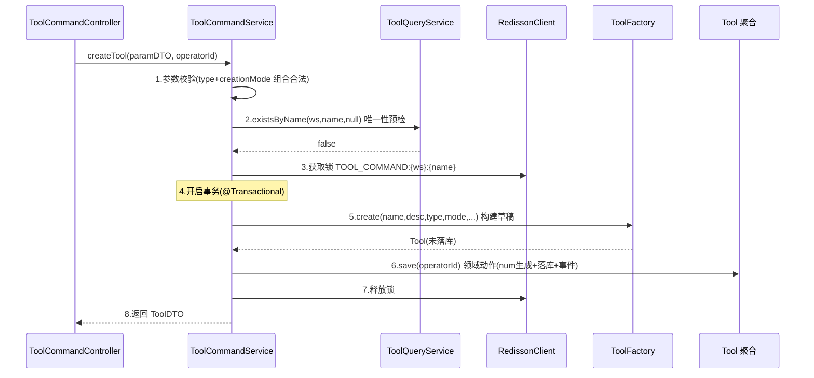
```mermaid
sequenceDiagram
    participant C as ToolCommandController
    participant Cmd as ToolCommandService
    participant Q as ToolQueryService
    participant Lock as RedissonClient
    participant F as ToolFactory
    participant Tool as Tool 聚合

    C->>Cmd: createTool(paramDTO, operatorId)
    Cmd->>Cmd: 1.参数校验(type+creationMode 组合合法)
    Cmd->>Q: 2.existsByName(ws,name,null) 唯一性预检
    Q-->>Cmd: false
    Cmd->>Lock: 3.获取锁 TOOL_COMMAND:{ws}:{name}
    Note over Cmd: 4.开启事务(@Transactional)
    Cmd->>F: 5.create(name,desc,type,mode,...) 构建草稿
    F-->>Cmd: Tool(未落库)
    Cmd->>Tool: 6.save(operatorId) 领域动作(num生成+落库+事件)
    Cmd->>Lock: 7.释放锁
    Cmd-->>C: 8.返回 ToolDTO
```

**updateTool（编辑→回 DRAFT）：**

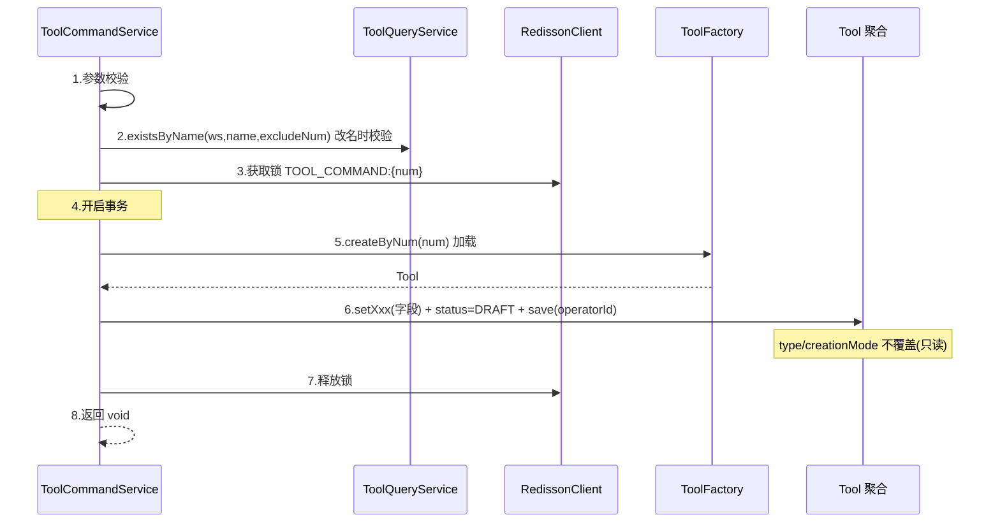
```mermaid
sequenceDiagram
    participant Cmd as ToolCommandService
    participant Q as ToolQueryService
    participant Lock as RedissonClient
    participant F as ToolFactory
    participant Tool as Tool 聚合

    Cmd->>Cmd: 1.参数校验
    Cmd->>Q: 2.existsByName(ws,name,excludeNum) 改名时校验
    Cmd->>Lock: 3.获取锁 TOOL_COMMAND:{num}
    Note over Cmd: 4.开启事务
    Cmd->>F: 5.createByNum(num) 加载
    F-->>Cmd: Tool
    Cmd->>Tool: 6.setXxx(字段) + status=DRAFT + save(operatorId)
    Note over Tool: type/creationMode 不覆盖(只读)
    Cmd->>Lock: 7.释放锁
    Cmd-->>Cmd: 8.返回 void
```

**publish：**

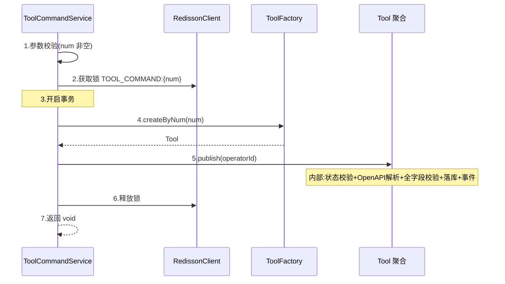
```mermaid
sequenceDiagram
    participant Cmd as ToolCommandService
    participant Lock as RedissonClient
    participant F as ToolFactory
    participant Tool as Tool 聚合

    Cmd->>Cmd: 1.参数校验(num 非空)
    Cmd->>Lock: 2.获取锁 TOOL_COMMAND:{num}
    Note over Cmd: 3.开启事务
    Cmd->>F: 4.createByNum(num)
    F-->>Cmd: Tool
    Cmd->>Tool: 5.publish(operatorId)
    Note over Tool: 内部:状态校验+OpenAPI解析+全字段校验+落库+事件
    Cmd->>Lock: 6.释放锁
    Cmd-->>Cmd: 7.返回 void
```

**unpublish（弃用，含引用检查）：**

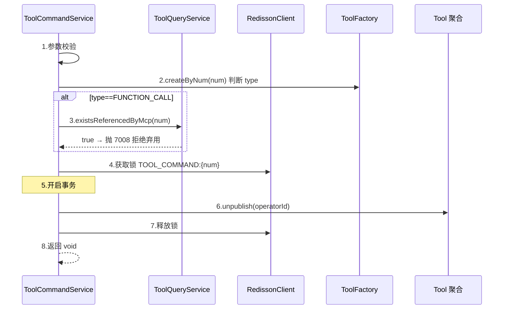
```mermaid
sequenceDiagram
    participant Cmd as ToolCommandService
    participant Q as ToolQueryService
    participant Lock as RedissonClient
    participant F as ToolFactory
    participant Tool as Tool 聚合

    Cmd->>Cmd: 1.参数校验
    Cmd->>F: 2.createByNum(num) 判断 type
    alt type==FUNCTION_CALL
        Cmd->>Q: 3.existsReferencedByMcp(num)
        Q-->>Cmd: true → 抛 7008 拒绝弃用
    end
    Cmd->>Lock: 4.获取锁 TOOL_COMMAND:{num}
    Note over Cmd: 5.开启事务
    Cmd->>Tool: 6.unpublish(operatorId)
    Cmd->>Lock: 7.释放锁
    Cmd-->>Cmd: 8.返回 void
```

**republish：**

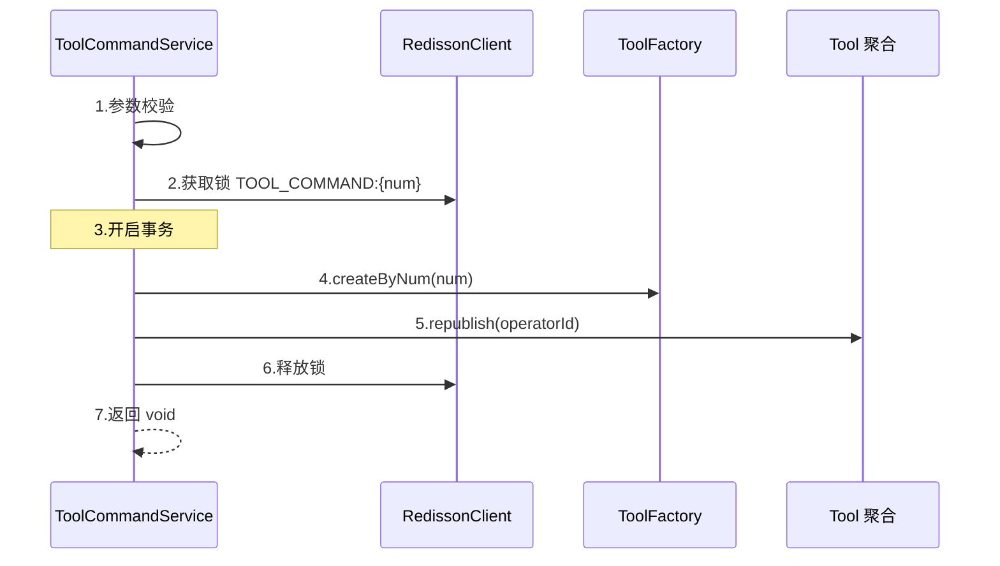
```mermaid
sequenceDiagram
    participant Cmd as ToolCommandService
    participant Lock as RedissonClient
    participant F as ToolFactory
    participant Tool as Tool 聚合
    Cmd->>Cmd: 1.参数校验
    Cmd->>Lock: 2.获取锁 TOOL_COMMAND:{num}
    Note over Cmd: 3.开启事务
    Cmd->>F: 4.createByNum(num)
    Cmd->>Tool: 5.republish(operatorId)
    Cmd->>Lock: 6.释放锁
    Cmd-->>Cmd: 7.返回 void
```

**deleteDraft：**

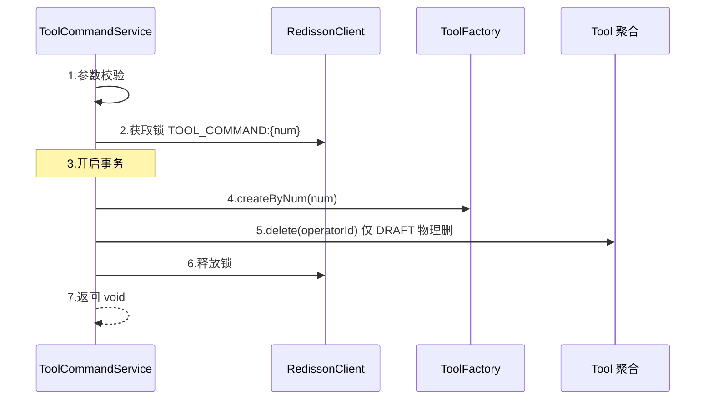
```mermaid
sequenceDiagram
    participant Cmd as ToolCommandService
    participant Lock as RedissonClient
    participant F as ToolFactory
    participant Tool as Tool 聚合
    Cmd->>Cmd: 1.参数校验
    Cmd->>Lock: 2.获取锁 TOOL_COMMAND:{num}
    Note over Cmd: 3.开启事务
    Cmd->>F: 4.createByNum(num)
    Cmd->>Tool: 5.delete(operatorId) 仅 DRAFT 物理删
    Cmd->>Lock: 6.释放锁
    Cmd-->>Cmd: 7.返回 void
```

**pageList（含 reuseCount 批量聚合）：**

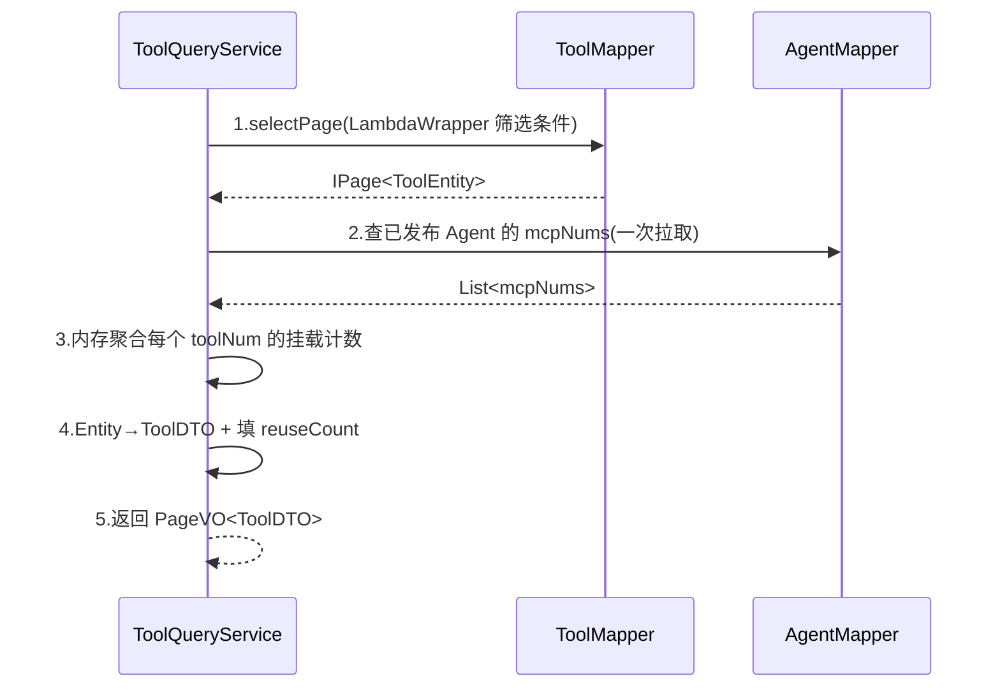
```mermaid
sequenceDiagram
    participant Q as ToolQueryService
    participant TM as ToolMapper
    participant AM as AgentMapper
    Q->>TM: 1.selectPage(LambdaWrapper 筛选条件)
    TM-->>Q: IPage<ToolEntity>
    Q->>AM: 2.查已发布 Agent 的 mcpNums(一次拉取)
    AM-->>Q: List<mcpNums>
    Q->>Q: 3.内存聚合每个 toolNum 的挂载计数
    Q->>Q: 4.Entity→ToolDTO + 填 reuseCount
    Q-->>Q: 5.返回 PageVO<ToolDTO>
```

**listMountable / detail / reuseCount / listMountedAgents / existsByName / existsReferencedByMcp：** 均为单步只读查询（LambdaWrapper selectList/selectOne/selectCount → DTO），时序为 `QueryService → Mapper → DTO`，从略（见 §6.2.1 表）。

### 6.3 Agent（agent）改造

#### 6.3.1 Service 方法清单（改造点）

| 方法 | 改造内容 |
| --- | --- |
| `AgentQueryService.listMountableTools()`（或现有 Step4 数据源方法） | 由返回 mock 列表改为委托 `ToolQueryService.listMountable(workspaceNum)`，返回真实已发布工具（按 MCP/FC 分组） |
| `AgentCommandService.saveDraft/publish`（保存配置含 mcpNums 处） | 保存 ConfigSnapshot.mcpNums 时，经 `ToolQueryService` 校验每个 mcpNum 对应工具存在且 status=PUBLISHED，否则抛业务异常（防挂载草稿/废弃工具） |

> 不改 Agent 领域模型（`ConfigSnapshot.mcpNums` 已存在）。校验逻辑置于 application 层 AgentCommandService，调用 ToolQueryService。

#### 6.3.2 方法时序逻辑

**Agent Step4 拉取真实工具列表：**

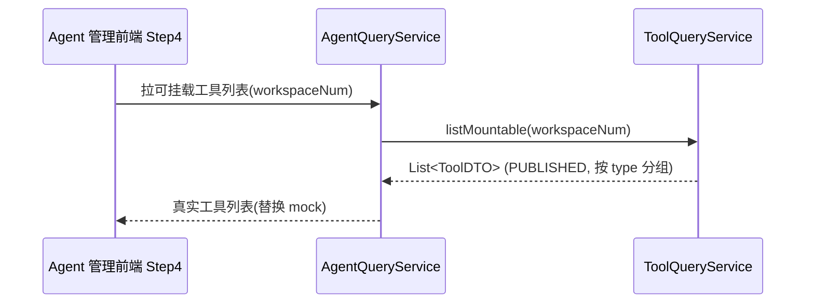
```mermaid
sequenceDiagram
    participant FE as Agent 管理前端 Step4
    participant AQ as AgentQueryService
    participant TQ as ToolQueryService
    FE->>AQ: 拉可挂载工具列表(workspaceNum)
    AQ->>TQ: listMountable(workspaceNum)
    TQ-->>AQ: List<ToolDTO> (PUBLISHED, 按 type 分组)
    AQ-->>FE: 真实工具列表(替换 mock)
```

**Agent 保存配置时校验挂载工具：**

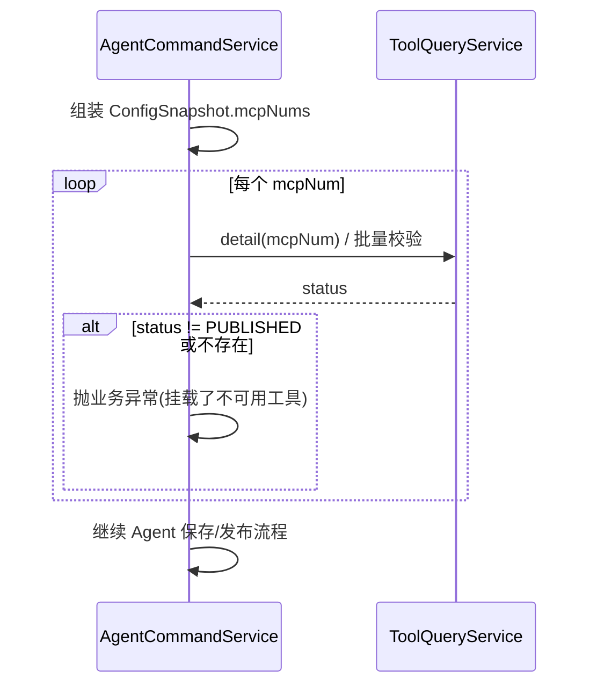
```mermaid
sequenceDiagram
    participant AC as AgentCommandService
    participant TQ as ToolQueryService
    AC->>AC: 组装 ConfigSnapshot.mcpNums
    loop 每个 mcpNum
        AC->>TQ: detail(mcpNum) / 批量校验
        TQ-->>AC: status
        alt status != PUBLISHED 或不存在
            AC->>AC: 抛业务异常(挂载了不可用工具)
        end
    end
    AC->>AC: 继续 Agent 保存/发布流程
```

#### 模块自检（应用层）

- [x] 6.1 业务模块划分先行，按模块二级目录（6.2 工具 / 6.3 Agent 改造）；
- [x] Command/Query 分工明确；application 未注入 Repository/Gateway，读查询走 QueryService；
- [x] CommandService 写操作设计 Redis 分布式锁，事务内嵌锁区域；
- [x] 每个 Service 方法配时序图（只读单步查询已说明从略并给出统一形态）；
- [x] 统一 `@Resource` 注入。

---

## 7. Adapter 层设计

### 7.1 业务模块划分

| 模块 | 入口类型 | 类 | 对应应用层 |
| --- | --- | --- | --- |
| 7.2 工具命令 | HTTP Controller(POST) | `ToolCommandController` | ToolCommandService |
| 7.3 工具查询 | HTTP Controller(GET) | `ToolQueryController` | ToolQueryService |
| — | Assembler | `ToolVoAssembler` | Param→DTO、DTO→Vo |

本方案 adapter 入口仅 HTTP Controller，**无定时任务、无事件监听**。HTTP 仅用 GET（查询）/ POST（增删改）。入参 `*Param`、出参 `Result<*Vo>`，operatorId 由 `BaseController.getCurrentUserId()` 注入。

### 7.2 工具命令（ToolCommandController，前缀 `/api/v1/tool/command`）

| 方法 | HTTP | 路径 | 入参(Param) | 出参 | 职责 |
| --- | --- | --- | --- | --- | --- |
| create | POST | /create | ToolCreateParam | Result<ToolVo> | 创建草稿 |
| update | POST | /update | ToolUpdateParam | Result<Void> | 编辑（→DRAFT） |
| publish | POST | /publish | ToolNumParam | Result<Void> | 发布 |
| unpublish | POST | /unpublish | ToolNumParam | Result<Void> | 弃用 |
| republish | POST | /republish | ToolNumParam | Result<Void> | 重新发布 |
| deleteDraft | POST | /deleteDraft | ToolNumParam | Result<Void> | 删草稿 |

**入参示例（create，MCP 远程连接）：**

```json
{
  "name": "jira-mcp",
  "description": "Jira MCP server 远程连接",
  "type": "MCP",
  "creationMode": "REMOTE",
  "tags": ["jira", "issue"],
  "mcpConfigType": "REMOTE",
  "mcpConfig": "{\"url\":\"https://mcp.example.com/sse\",\"transport\":\"sse\",\"headers\":{\"Authorization\":\"Bearer xxx\"}}",
  "proxyEnabled": true,
  "proxyHeaders": [
    { "name": "Authorization", "value": "Bearer {userToken}", "description": "透传用户 token" },
    { "name": "X-Trace-Id", "value": "{traceId}", "description": "" }
  ]
}
```

**入参示例（create，FunctionCall 手动录入）：**

```json
{
  "name": "git-api",
  "description": "Git 后台 API",
  "type": "FUNCTION_CALL",
  "creationMode": "MANUAL",
  "baseUrl": "https://api.example.com",
  "endpoints": [
    {
      "method": "GET",
      "path": "/users/{id}",
      "description": "获取用户详情",
      "queryParams": [{ "name": "verbose", "type": "boolean", "defaultValue": "false", "description": "是否详细" }],
      "pathParams": [{ "name": "id", "type": "string", "defaultValue": null, "description": "用户 ID" }],
      "headers": [{ "name": "Accept", "defaultValue": "application/json", "description": "" }]
    }
  ]
}
```

**返回示例（Result<ToolVo>）：**

```json
{
  "code": 0,
  "message": "success",
  "data": {
    "num": "MCP202606091530001",
    "name": "jira-mcp",
    "type": "MCP",
    "creationMode": "REMOTE",
    "status": "DRAFT",
    "reuseCount": 0,
    "tags": ["jira", "issue"],
    "createNo": "12345",
    "updateTime": "2026-06-09 15:30:00"
  }
}
```

**命令接口时序逻辑（create 示例）：**

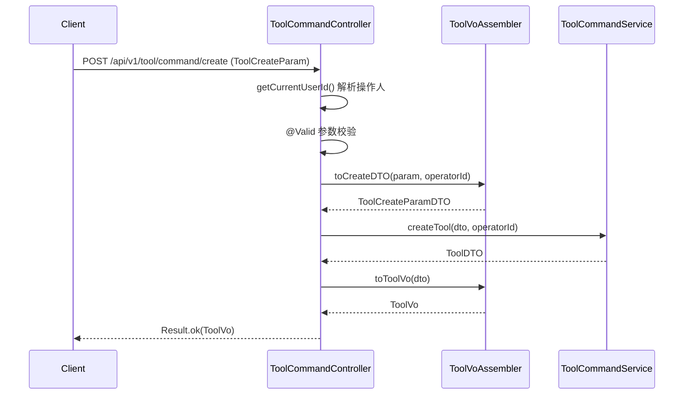
```mermaid
sequenceDiagram
    participant Client
    participant C as ToolCommandController
    participant A as ToolVoAssembler
    participant S as ToolCommandService
    Client->>C: POST /api/v1/tool/command/create (ToolCreateParam)
    C->>C: getCurrentUserId() 解析操作人
    C->>C: @Valid 参数校验
    C->>A: toCreateDTO(param, operatorId)
    A-->>C: ToolCreateParamDTO
    C->>S: createTool(dto, operatorId)
    S-->>C: ToolDTO
    C->>A: toToolVo(dto)
    A-->>C: ToolVo
    C-->>Client: Result.ok(ToolVo)
```

> 其余命令接口（update/publish/unpublish/republish/deleteDraft）时序同构：`Param →(getCurrentUserId)→ Assembler → CommandService → Result.ok`，从略。

### 7.3 工具查询（ToolQueryController，前缀 `/api/v1/tool/query`）

| 方法 | HTTP | 路径 | 入参 | 出参 | 职责 |
| --- | --- | --- | --- | --- | --- |
| page | GET | /page | ToolPageQueryParam(query) | Result<PageVO<ToolVo>> | 列表分页筛选 |
| detail | GET | /detail | num(query) | Result<ToolDetailVo> | 详情 |
| mountable | GET | /mountable | workspaceNum(query,可省) | Result<List<ToolVo>> | Agent Step4 已发布工具列表 |
| reuseCount | GET | /reuseCount | num(query) | Result<Integer> | 复用数 |
| mountedAgents | GET | /mountedAgents | num(query) | Result<List<AgentBriefVo>> | 复用数下钻 Agent 列表 |
| checkName | GET | /checkName | name + excludeNum(query) | Result<Boolean> | name 唯一性校验 |

**查询接口时序逻辑（page 示例）：**

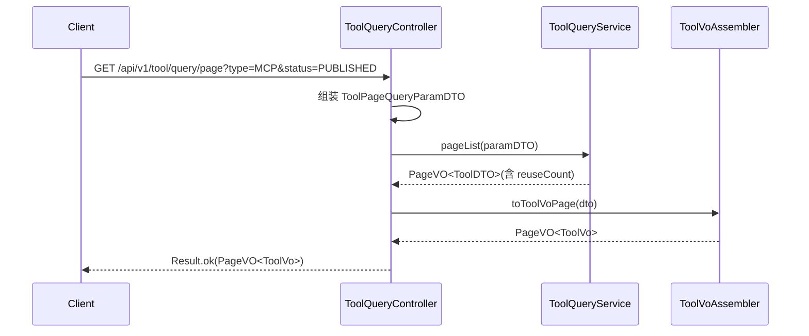
```mermaid
sequenceDiagram
    participant Client
    participant C as ToolQueryController
    participant S as ToolQueryService
    participant A as ToolVoAssembler
    Client->>C: GET /api/v1/tool/query/page?type=MCP&status=PUBLISHED
    C->>C: 组装 ToolPageQueryParamDTO
    C->>S: pageList(paramDTO)
    S-->>C: PageVO<ToolDTO>(含 reuseCount)
    C->>A: toToolVoPage(dto)
    A-->>C: PageVO<ToolVo>
    C-->>Client: Result.ok(PageVO<ToolVo>)
```

> detail / mountable / reuseCount / mountedAgents / checkName 时序同构（GET → QueryService → DTO → Assembler → Vo），从略。

#### 模块自检（adapter）

- [x] 入口仅 HTTP Controller（无定时/监听）；HTTP 仅 GET/POST；
- [x] 入参 `*Param`、出参 `Result<*Vo>`；DTO→Vo 经 Assembler；
- [x] 每个入口给出时序图（同构接口已说明从略并给出统一形态）；
- [x] 统一 `@Resource`；operatorId 从 UserContext 取不从入参。

---

## 8. 数据库设计

### 8.1 表结构：`tool`

单表承载工具资产；S2 不做版本化、无端点子表，`endpoints`/`proxy_headers`/`endpoint_meta` 为 JSON 列，`mcp_config`/`open_api_spec` 为 text 列。

| 字段 | 类型 | 必填 | 说明/索引 |
| --- | --- | --- | --- |
| `id` | BIGINT AUTO_INCREMENT | ✓ | 主键，自增 |
| `num` | VARCHAR(64) | ✓ | 业务编号 MCP+/FC+ 前缀；唯一索引 |
| `workspace_num` | VARCHAR(64) | ✓ | 归属工作空间；默认 WS-DEFAULT |
| `name` | VARCHAR(128) | ✓ | 工具名称；(workspace_num,name,deleted) 唯一 |
| `description` | VARCHAR(500) | ✓ | 描述 |
| `type` | VARCHAR(32) | ✓ | MCP / FUNCTION_CALL；建好不可改 |
| `creation_mode` | VARCHAR(32) | ✓ | REMOTE/API_PACKAGE/OPENAPI_SPEC/MANUAL |
| `tags` | JSON | — | 标签数组 |
| `status` | VARCHAR(16) | ✓ | DRAFT/PUBLISHED/DEPRECATED；默认 DRAFT |
| `mcp_config_type` | VARCHAR(16) | — | LOCAL/REMOTE（MCP-REMOTE 用） |
| `mcp_config` | TEXT | — | MCP 配置 JSON 原文（≤64KB） |
| `proxy_enabled` | TINYINT(1) | ✓ | 是否启用代理；默认 0 |
| `proxy_headers` | JSON | — | 透传请求头数组 [{name,value,description}] |
| `package_mode` | VARCHAR(16) | — | EXISTING_API/OPENAPI_PASTE（MCP-API_PACKAGE 用） |
| `source_fc_tool_num` | VARCHAR(64) | — | 来源 FC 工具 num（EXISTING_API）；idx 索引 |
| `open_api_spec` | MEDIUMTEXT | — | OpenAPI 原文（≤1MB；OPENAPI_SPEC/OPENAPI_PASTE 用） |
| `base_url` | VARCHAR(512) | — | FC 手动录入 Base URL |
| `endpoints` | JSON | — | FC 手动录入端点数组 |
| `endpoint_meta` | JSON | — | 发布时解析的端点元数据（端点数+摘要） |
| `owner_user_id` | VARCHAR(64) | ✓ | 负责人/创建人用户 ID |
| `create_no` | VARCHAR(64) | ✓ | 创建人工号 |
| `update_no` | VARCHAR(64) | ✓ | 更新人工号 |
| `deleted` | TINYINT(1) | ✓ | 逻辑删除 0/1；默认 0 |
| `create_time` | TIMESTAMP(3) | ✓ | 创建时间（毫秒精度） |
| `update_time` | TIMESTAMP(3) | ✓ | 更新时间（毫秒精度） |

**索引**：`uq_tool_num(num)`、`uq_tool_ws_name(workspace_num,name,deleted)`、`idx_tool_ws_type_status(workspace_num,type,status,deleted)`、`idx_tool_source_fc(source_fc_tool_num)`、`idx_tool_status(status,deleted)`。

### 8.2 DDL

迁移版本 `V18`（现有最大为 V17）。

```sql
-- ====================================================================
-- 工具管理 - V18 初始化脚本
-- 对应技术方案：2026-06-09_工具管理-技术方案.md v1.0 §8
-- 包含：1) tool 表（MCP / FunctionCall 工具资产；三态生命周期 + 4 种创建方式）
-- 说明：不预置任何工具数据，无 DML 刷数。
-- ====================================================================

SET NAMES utf8mb4;
SET FOREIGN_KEY_CHECKS = 0;

DROP TABLE IF EXISTS `tool`;
CREATE TABLE `tool` (
  `id` BIGINT NOT NULL AUTO_INCREMENT COMMENT '主键',
  `num` VARCHAR(64) NOT NULL COMMENT '业务编号 MCP+/FC+ 前缀+yyyyMMddHHmm+序号',
  `workspace_num` VARCHAR(64) NOT NULL DEFAULT 'WS-DEFAULT' COMMENT '归属工作空间业务编号',
  `name` VARCHAR(128) NOT NULL COMMENT '工具名称，工作空间内唯一',
  `description` VARCHAR(500) NOT NULL COMMENT '工具描述，≤500 字',
  `type` VARCHAR(32) NOT NULL COMMENT '工具类型：MCP / FUNCTION_CALL，建好不可改',
  `creation_mode` VARCHAR(32) NOT NULL COMMENT '创建方式：REMOTE/API_PACKAGE/OPENAPI_SPEC/MANUAL',
  `tags` JSON DEFAULT NULL COMMENT '标签数组，≤20 个',
  `status` VARCHAR(16) NOT NULL DEFAULT 'DRAFT' COMMENT '状态：DRAFT/PUBLISHED/DEPRECATED',
  `mcp_config_type` VARCHAR(16) DEFAULT NULL COMMENT 'MCP 配置子类型：LOCAL/REMOTE',
  `mcp_config` TEXT DEFAULT NULL COMMENT 'MCP 配置 JSON 原文，≤64KB',
  `proxy_enabled` TINYINT(1) NOT NULL DEFAULT 0 COMMENT '是否启用 MCP 代理 0/1',
  `proxy_headers` JSON DEFAULT NULL COMMENT '透传请求头数组 [{name,value,description}]',
  `package_mode` VARCHAR(16) DEFAULT NULL COMMENT 'MCP API 打包方式：EXISTING_API/OPENAPI_PASTE',
  `source_fc_tool_num` VARCHAR(64) DEFAULT NULL COMMENT '来源 FC 工具 num（EXISTING_API 引用，动态跟随）',
  `open_api_spec` MEDIUMTEXT DEFAULT NULL COMMENT 'OpenAPI/Swagger 原文，≤1MB',
  `base_url` VARCHAR(512) DEFAULT NULL COMMENT 'FC 手动录入 Base URL',
  `endpoints` JSON DEFAULT NULL COMMENT 'FC 手动录入端点数组',
  `endpoint_meta` JSON DEFAULT NULL COMMENT '发布时解析的端点元数据（端点数+摘要）',
  `owner_user_id` VARCHAR(64) NOT NULL COMMENT '负责人/创建人用户 ID',
  `create_no` VARCHAR(64) NOT NULL COMMENT '创建人工号',
  `update_no` VARCHAR(64) NOT NULL COMMENT '更新人工号',
  `deleted` TINYINT(1) NOT NULL DEFAULT 0 COMMENT '逻辑删除 0=正常 1=删除',
  `create_time` TIMESTAMP(3) NOT NULL DEFAULT CURRENT_TIMESTAMP(3) COMMENT '创建时间',
  `update_time` TIMESTAMP(3) NOT NULL DEFAULT CURRENT_TIMESTAMP(3) ON UPDATE CURRENT_TIMESTAMP(3) COMMENT '更新时间',
  PRIMARY KEY (`id`),
  UNIQUE KEY `uq_tool_num` (`num`),
  UNIQUE KEY `uq_tool_ws_name` (`workspace_num`, `name`, `deleted`),
  KEY `idx_tool_ws_type_status` (`workspace_num`, `type`, `status`, `deleted`),
  KEY `idx_tool_source_fc` (`source_fc_tool_num`),
  KEY `idx_tool_status` (`status`, `deleted`)
) ENGINE=InnoDB DEFAULT CHARSET=utf8mb4 COLLATE=utf8mb4_unicode_ci COMMENT='工具资产主表（MCP/FunctionCall）';

SET FOREIGN_KEY_CHECKS = 1;
```

### 8.3 DML（刷数）

无。本方案不预置工具数据，无历史数据迁移（Agent Step4 mock 不落库，无外键引用问题）。

### 8.4 与领域对应

`tool` 表 ↔ `Tool` 聚合（1:1）；`tags`/`proxy_headers`/`endpoints`/`endpoint_meta` JSON 列 ↔ 同名值对象（fastjson2 序列化）；reuseCount 不落库（查询时扫 `agent.config_snapshot.mcpNums` 实时算）。

#### 模块自检（数据库）

- [x] 主键 id BIGINT 自增；create_time/update_time 命名且 TIMESTAMP(3) 毫秒精度；
- [x] num 业务编号 + 唯一索引；工作空间内 name 唯一；
- [x] DDL 可直接执行（V18），与表结构与 infra 设计一致；无 DML；
- [x] 索引覆盖列表筛选（ws+type+status）与引用检查（source_fc_tool_num）场景。

---

## 9. 模块变更清单

| 层 | 变更 | 实现 Skill |
| --- | --- | --- |
| facade | 无变更（复用 DomainEntity/DomainEventDTO/DomainEventPublisher/Result/PageVO） | impl-facade-module（不涉及） |
| client | 新增 `tool.vo`（ToolCreateParam/ToolUpdateParam/ToolNumParam/ToolPageQueryParam/ToolVo/ToolDetailVo/AgentBriefVo）；新增 `tool.dto`（ToolCreateParamDTO/ToolUpdateParamDTO/ToolDTO/ToolDetailDTO/ToolPageQueryParamDTO/AgentBriefDTO）；`BizCode` 追加 7xxx 工具域错误码 | **impl-client-module** |
| domain | 新增 `Tool` 聚合；`valueobject`（ToolType/CreationMode/ToolStatus/McpConfigType/PackageMode/HttpMethod/ProxyHeader/ApiEndpoint/ApiParam/ApiHeader/EndpointMeta/EndpointSummary）；`repository.ToolRepository`；`factory.ToolFactory`；`gateway.ToolGateway`；`dto.ToolDomainEventDTO` | **impl-domain-module** |
| infra | 新增 `ToolEntity`/`ToolMapper`/`ToolRepositoryImpl`/`ToolFactoryImpl`/`ToolGatewayImpl`；`DomainEventConstant` 追加 TOOL_*；`LockKeyConstant` 追加 TOOL_COMMAND；V18 迁移；`AgentMapper` 追加 reuseCount 用 count 查询（如需 JSON 函数） | **impl-infra-module** |
| application | 新增 `ToolCommandService`/`ToolQueryService`；改造 `AgentQueryService`（Step4 数据源）与 `AgentCommandService`（挂载 PUBLISHED 校验） | **impl-application-module** |
| adapter | 新增 `ToolCommandController`/`ToolQueryController`/`ToolVoAssembler` | **impl-adapter-module** |

---

## 10. 代码分支命名

**需求类**，本方案对应分支：

```
feature-20260609-tool-management
```

---

## 11. 实现顺序与依赖

按六层依赖推进（facade 无变更，跳过）：

1. **client**（impl-client-module）：先定 Param/DTO/Vo 与 BizCode 契约；
2. **domain**（impl-domain-module）：Tool 聚合 + 值对象 + Repository/Factory/Gateway 接口 + 领域事件；
3. **infra**（impl-infra-module）：Entity/Mapper/RepositoryImpl/FactoryImpl/GatewayImpl + V18 迁移 + 事件常量；与 §8 数据库、§4 domain 接口相互校验；
4. **application**（impl-application-module）：ToolCommand/QueryService → 再改造 Agent Step4（依赖 ToolQueryService 就绪）；
5. **adapter**（impl-adapter-module）：Controller + Assembler。

里程碑对齐：M1 优先 client/domain/infra/application 的 MCP 远程 + FC 手动 + 三态机 + 列表；M2 补 MCP API 打包 + FC OpenAPI 解析 + 代理字段 + Agent Step4 切换 + 弃用引用检查；M3 补详情/复用数下钻/废弃工具 tooltip。

---

## 12. 接口与数据契约

关键 API（全部 GET 查询 / POST 增删改，详见 §7）：

- 命令：`POST /api/v1/tool/command/{create|update|publish|unpublish|republish|deleteDraft}`
- 查询：`GET /api/v1/tool/query/{page|detail|mountable|reuseCount|mountedAgents|checkName}`

主要 DTO/VO：`ToolCreateParam`/`ToolUpdateParam`/`ToolVo`/`ToolDetailVo`/`ToolPageQueryParam`/`AgentBriefVo`（client.tool.vo）；`ToolCreateParamDTO`/`ToolDTO`/`ToolDetailDTO`/`ToolPageQueryParamDTO`（client.tool.dto）。JSON 入参/出参示例见 §7.2 / §7.3。

---

## 13. 其他

- **配置项**：OpenAPI 文档上限 1MB、MCP 配置 64KB、单工具端点 50、列表默认分页 20/最大 100 —— 作为 `ToolEntity`/校验常量在 infra/domain 落实（PRD §9）。
- **审计**：TOOL_SAVED/PUBLISHED/DEPRECATED/DELETE_DRAFT 事件复用平台现有审计基础设施（同 Agent/Skill），事件类型映射 PRD §10 的 `TOOL_CREATE/TOOL_PUBLISH/TOOL_DEPRECATE/TOOL_DELETE_DRAFT`。
- **权限**：M1 复用工作空间成员角色，所有成员可创建/编辑/发布（PRD §9）。
- **后续（不在本方案）**：MCP 代理运行时转发、`OpenApiToMcpAdapter`、`BuiltinVariableRegistry` 变量注入、调用预览解析后请求头 —— 留待 agentrunner 运行时方案。

---

## 附：与 PRD 的覆盖核对

| PRD 章节 | 本方案落点 |
| --- | --- |
| §7.1 字段定义（通用+各形态专有） | §4.2.1 领域模型 + §8.1 表结构 |
| §7.2 列表与基础功能 | §6.2 pageList/detail + §7.3 查询接口 |
| §7.3 mcpConfig 校验 | §4.2.3 形态约束（落库兜底）+ §6 仅存配置 |
| §7.4 OpenAPI 校验 | §4.2.5 parseOpenApi + §6 发布时解析端点元数据 |
| §7.5 MCP 代理与透传 | §4.2.1 proxyEnabled/proxyHeaders + §4.2.3 代理约束（仅存配置+格式校验） |
| §7.6 FC 手动端点配置 | §4.2.1 ApiEndpoint/ApiParam/ApiHeader 值对象 |
| §7.7 编辑与发布 | §4.2.2 领域动作 + §6.2 updateTool/publish |
| §7.8 Agent 挂载对接 | §6.3 Agent Step4 改造 + listMountable/校验 |
| §4.2 状态机 | §4.2.2 save/publish/unpublish/republish/delete |
| §附4 引用一致性 | §6.2 existsReferencedByMcp + §4.2.3 引用约束 |
| §附6 name 唯一 | §8.1 uq_tool_ws_name + §6.2 existsByName |
| §附7 复用数统计 | §6.2 reuseCount 实时 count（共识 #4） |
| §9 非功能（上限/分页/审计） | §13 其他 + §8 索引 |
