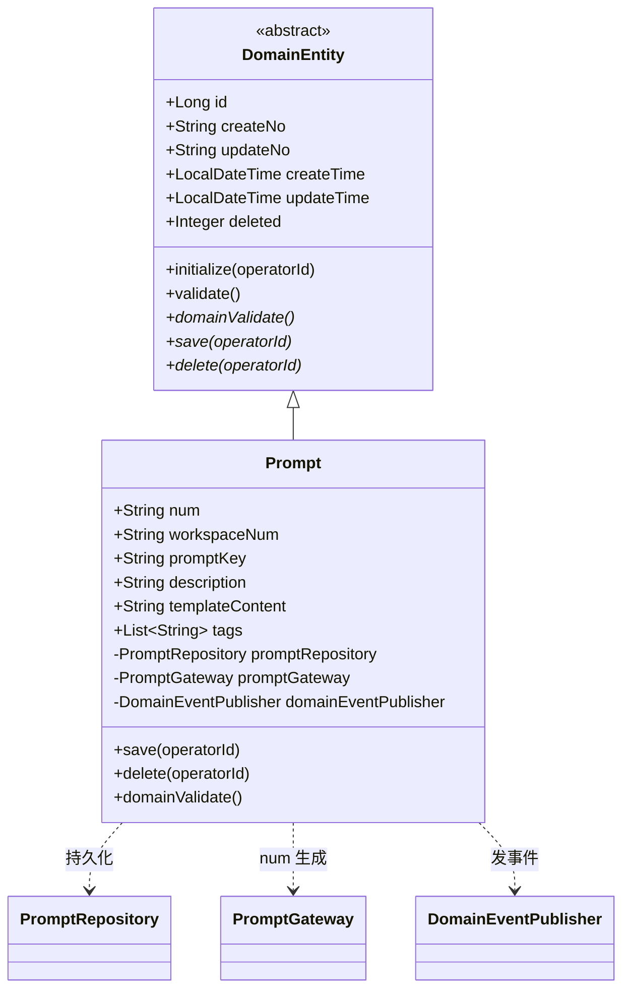
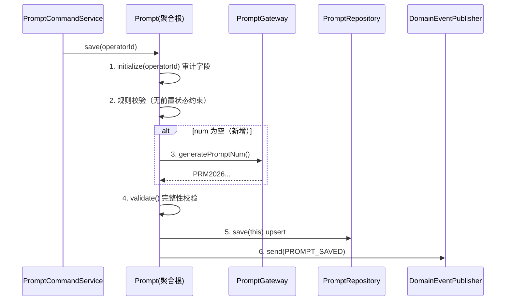
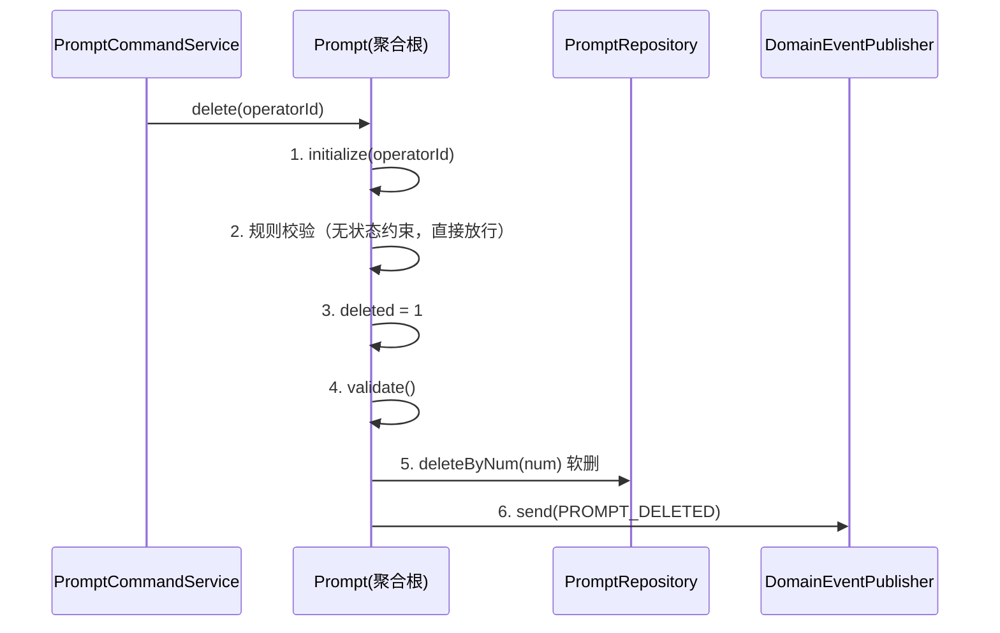
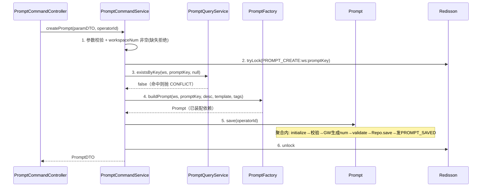
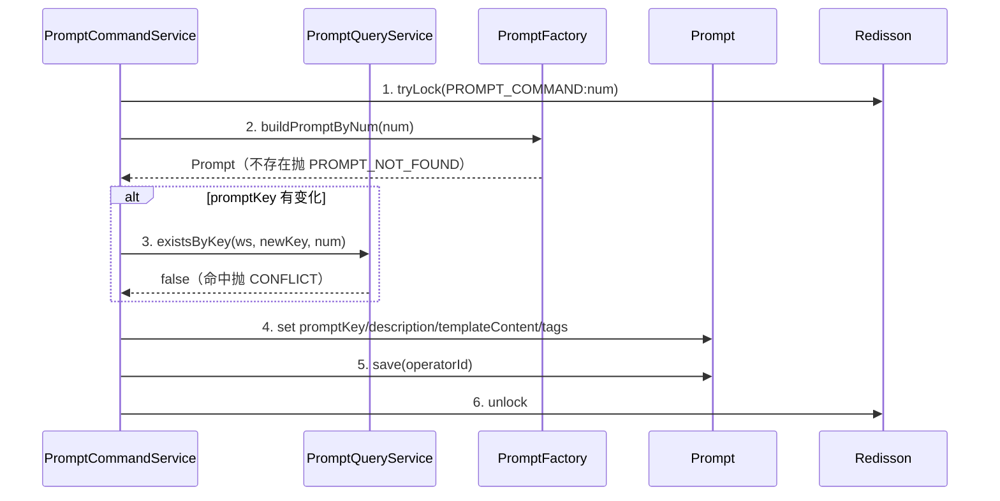
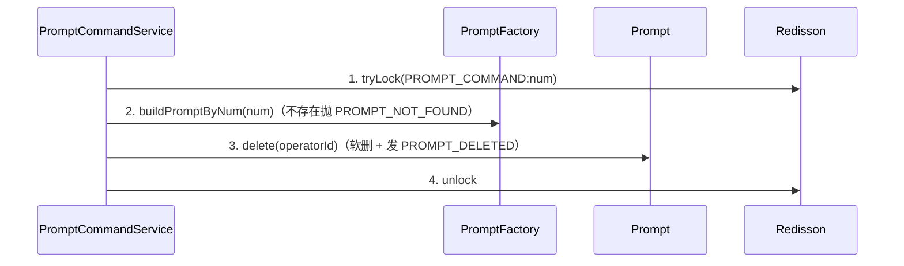
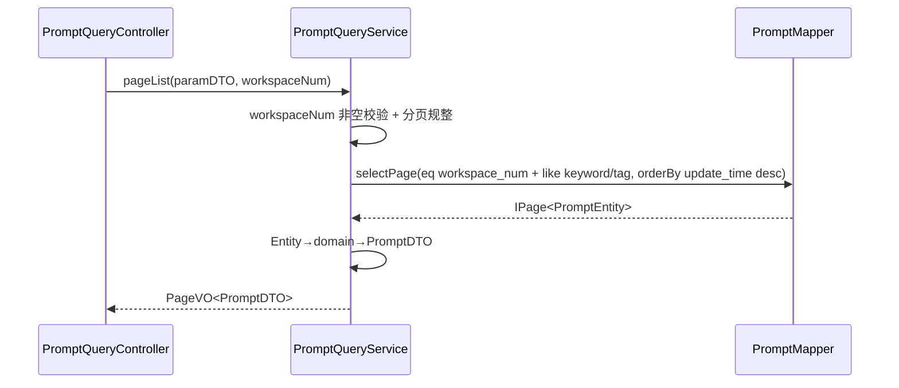
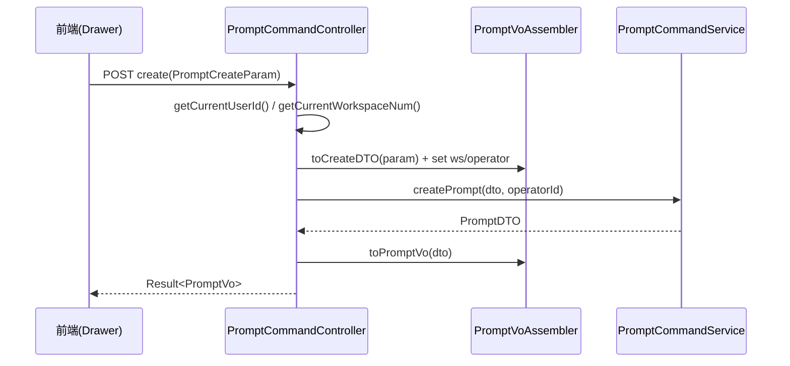

# AgentOps — Prompt 中心 技术方案

> 文档日期：2026-06-10　|　版本：v1.0　|　覆盖周期：S2
> 输入 PRD：[2026-06-10-Prompt中心-PRD](../产品方案/2026-06-10-Prompt中心-PRD.md)
> 参照实现：[工具管理技术方案](./2026-06-09_工具管理-技术方案.md) · Skill 领域（`ink.garry.rd.agent.ws.domain.skill`）
> 代码仓库：rd-agent-be（六层架构）/ rd-agent-fe
> 分支：`feature-20260610-prompt-center`

---

## 0. 设计前共识（设计前 10 问纪要）

设计前与需求方确认要点，作为本方案的硬约束：

| # | 问题 | 结论 |
| --- | --- | --- |
| 1 | 唯一性「空间」边界 | **归属工作空间**；存在**两个**工作空间内唯一键：①`(workspace_num, num)` ②`(workspace_num, prompt_key)` |
| 2 | 「业务编码」形态 | 业务编码即聚合 **`num`** 字段，**参考 Skill 的 num**；不单独建字典表 |
| 3 | num 生成方式 | **系统生成**（Gateway + `BizNumGenerator`，前缀 `PRM`），用户不可见、不可填 |
| 4 | 删除方式 | **软删除**（复用 `DomainEntity.deleted`，0/1） |
| 5 | 模板变量 `{{变量名}}` | **前后端均不解析**；后端**原样存储**模板原文，使用时（调用方运行时）再替换；本期无 `variables` 列、无变量清单接口 |
| 6 | 状态控制 | **无状态机**（无草稿/发布/弃用）；新增即生效、编辑即生效 |
| 7 | 与 Agent/Skill 联动 | **仅独立资产沉淀**；本期不提供运行时取模板查询接口、不统计被引用数 |
| 8 | 列表查询范围 | **按当前工作空间过滤**（`X-Workspace-Num` 头，与 Skill/Tool 一致） |
| 9 | 部署架构 | **部署不变**，无新增应用/前端部署实例，复用现有部署架构 |
| 10 | 新增/编辑交互 | 前端**右侧侧边弹窗（Drawer）**，新增/编辑共用（前端实现细节，后端无差异） |

> **与 PRD 的偏差说明**：PRD §2/§7 表述为「同一**业务编码**下 Prompt Key 唯一」，且业务编码为「用户可读必填字段」。设计阶段需求方将其收敛为：**业务编码 = 系统生成的 `num`**，唯一性下沉到**工作空间**层级，并拆为两个独立工作空间内唯一键（`num`、`prompt_key` 各自唯一）。本方案以设计阶段结论为准；`prompt_key` 仍为用户填写的稳定引用键，在工作空间内唯一。

---

## 1. 目标与范围

### 1.1 目标

为平台新增 **Prompt 中心**，把散落在代码中的提示词沉淀为可检索、可维护、可按 Key 稳定引用的结构化资产，维护无需研发发版。

### 1.2 范围

**本期做**

- 新增 `prompt` 单聚合领域（无状态机、无版本、无子实体）；
- Prompt 增删查改：创建 / 编辑 / 软删除 / 分页列表 / 详情；
- 工作空间内两个唯一约束：`num`（系统生成）、`prompt_key`（用户填写）；
- 字段：业务编码（num）、Prompt Key、描述、模板内容（原样存储）、标签、归属工作空间；
- 列表按当前工作空间过滤 + 关键字/标签筛选；
- Flyway `V19__prompt_init.sql`。

**本期不做**

- ❌ 状态控制 / 版本化 / 变量解析与清单 / 运行时取模板接口 / 被引用统计 / 权限分级（详见 §0）。

### 1.3 自检

- [x] 已确认涉及层：facade（无变更）/ client / domain / infra / application / adapter。
- [x] 命令类（创建、编辑、删除）与查询类（列表、详情、唯一性校验）已区分。
- [x] 部署架构处理方式已三选一 → 部署不变。

---

## 2. 架构设计

### 2.1 应用架构

新增 `prompt` 领域，完全复用平台单聚合资产的成熟模式（对标 Skill / Tool / Sandbox）：adapter 拆 `PromptCommandController`（POST）+ `PromptQueryController`（GET）；application 拆 `PromptCommandService` + `PromptQueryService`（CQRS）；domain 为单聚合 `Prompt` + Factory/Repository/Gateway；infra 实现持久化与 num 生成。

**代码结构**

| 层 | 领域 | 包 | 职责 |
| --- | --- | --- | --- |
| facade | common | `ink.garry.rd.agent.ws.facade.domain` | 复用 `DomainEntity` / `DomainEventDTO` / `DomainEventPublisher`，**本次无变更** |
| client | prompt | `ink.garry.rd.agent.ws.client.prompt.dto` | `PromptCreateParamDTO` / `PromptUpdateParamDTO` / `PromptPageQueryParamDTO` / `PromptDTO` / `PromptDetailDTO` |
| client | prompt | `ink.garry.rd.agent.ws.client.prompt.vo` | `PromptCreateParam` / `PromptUpdateParam` / `PromptNumParam` / `PromptPageQueryParam` / `PromptVo` / `PromptDetailVo` |
| client | common | `ink.garry.rd.agent.ws.client.common` | `BizCode` 扩展 Prompt 相关错误码 |
| domain | prompt | `ink.garry.rd.agent.ws.domain.prompt` | 聚合根 `Prompt` |
| domain | prompt | `.prompt.repository` | `PromptRepository`（save / findByNum / deleteByNum） |
| domain | prompt | `.prompt.factory` | `PromptFactory`（buildPrompt / buildPromptByNum） |
| domain | prompt | `.prompt.gateway` | `PromptGateway`（generatePromptNum） |
| domain | prompt | `.prompt.dto` | `PromptDomainEventDTO`（事件载荷） |
| domain | common | `ink.garry.rd.agent.ws.domain.common` | `DomainEventConstant` 扩展 Prompt 事件常量 |
| infra | prompt | `ink.garry.rd.agent.ws.infra.prompt.entity` | `PromptEntity`（表 `prompt`） |
| infra | prompt | `.prompt.mapper` | `PromptMapper`（MyBatis-Plus BaseMapper） |
| infra | prompt | `.prompt.repository` | `PromptRepositoryImpl` |
| infra | prompt | `.prompt.factory` | `PromptFactoryImpl` |
| infra | prompt | `.prompt.gateway` | `PromptGatewayImpl`（复用 `BizNumGenerator`，前缀 `PRM`） |
| application | prompt | `ink.garry.rd.agent.ws.application.prompt` | `PromptCommandService`（写）/ `PromptQueryService`（读） |
| adapter | prompt | `ink.garry.rd.agent.ws.adapter.prompt` | `PromptCommandController`（POST）/ `PromptQueryController`（GET）/ `assembler.PromptVoAssembler` |

**关键调用关系与命令/查询归属**

| 控制器 | 类别 | 接口 | 应用服务 |
| --- | --- | --- | --- |
| PromptCommandController | 命令 | create / update / delete | PromptCommandService |
| PromptQueryController | 查询 | page / detail / checkKey | PromptQueryService |

- 同步调用，无异步边界、无定时任务、无 MQ 监听。
- application 不注入 domain Repository / Gateway；写经 `PromptFactory` 拿聚合调领域动作，唯一性预检经 `PromptQueryService`（CQRS）。
- workspaceNum 由 adapter 经 `BaseController.getCurrentWorkspaceNum()`（`X-Workspace-Num` 头）注入；operatorId 经 `getCurrentUserId()` 注入。

### 2.2 部署架构

**部署架构不变，无新增应用/前端部署实例，复用现有部署架构。** Prompt 中心为 rd-agent-be 内新增领域、rd-agent-fe 内新增页面，随现有后端服务与前端应用一同发布，不引入新组件、不依赖新增云服务。

### 2.3 自检

- [x] 应用架构含四列代码结构表；命令/查询归属明确；adapter 仅 HTTP 入口（无定时/监听）。
- [x] 部署架构三选一 → 不变，已按规范写明。

---

## 3. Facade 层设计

**本次无 Facade 层变更。** 复用现有 `DomainEntity`（审计字段 + save/delete 抽象）、`DomainEventDTO`、`DomainEventPublisher`、`Result`、`PageVO`，无需新增或修改通用基类、通用事件契约、通用返回对象。

---

## 4. 领域层设计

### 4.1 业务层级划分

| 层级 | 业务/子域 | 说明 |
| --- | --- | --- |
| 资产域 | prompt | 提示词资产单聚合；无状态、无版本、无子实体 |

### 4.2 提示词（prompt）

#### 4.2.1 领域模型

`Prompt` 为单一聚合根，继承 `DomainEntity`（含 id / createNo / updateNo / createTime / updateTime / deleted）。聚合内无实体、无值对象（标签为 `List<String>`，模板内容为原文 String）。



| 对象 | 类型 | 属性 | 约束 / 关系 |
| --- | --- | --- | --- |
| Prompt | 聚合根 | id:Long | 主键，持久层自增 |
|  |  | num:String | 业务编码；系统生成（前缀 PRM）；`(workspaceNum, num)` 工作空间内唯一 |
|  |  | workspaceNum:String | 归属工作空间；Factory 由 `WorkspaceContextHolder` 注入 |
|  |  | promptKey:String | 用户填写的稳定引用键；`(workspaceNum, promptKey)` 工作空间内唯一 |
|  |  | description:String | 描述，选填，≤500 字符 |
|  |  | templateContent:String | 模板原文（含 `{{变量}}`，原样存储不解析），必填，≤20000 字符 |
|  |  | tags:List\<String\> | 标签数组，≤20 个，单标签 ≤32 字符 |
|  |  | createNo/updateNo/createTime/updateTime/deleted | 继承审计字段 |
| — | 协作依赖（transient） | promptRepository / promptGateway / domainEventPublisher | 由 `PromptFactory` 装配 |

> 聚合根与领域实体中**不出现** `is_deleted`/`isDeleted` 业务字段；软删标记 `deleted` 来自 `DomainEntity` 基类（持久化细节）。

#### 4.2.2 领域动作

| 聚合/实体 | 领域动作 | 职责 | 前置条件 | 后置条件/规则 | 领域事件 |
| --- | --- | --- | --- | --- | --- |
| Prompt | save(operatorId) | 新增/更新 Prompt（upsert） | 必填校验通过 | num 为空时经 Gateway 生成；落库 | PROMPT_SAVED |
| Prompt | delete(operatorId) | 软删除 Prompt | 无（无状态约束） | deleted=1；按 num 软删 | PROMPT_DELETED |

> 无状态机，故无 publish/unpublish 等动作；编辑直接复用 `save`。所有动作含 `operatorId`。

**save 时序**



**delete 时序**



#### 4.2.3 领域规则

| 聚合/对象 | 规则类型 | 规则描述 | 违反时表达 |
| --- | --- | --- | --- |
| Prompt | 不变性 | promptKey / templateContent 必填非空 | `domainValidate` 抛 IllegalArgumentException（Hutool Assert） |
| Prompt | 长度约束 | description ≤500；templateContent ≤20000 | 同上 |
| Prompt | 标签约束 | tags ≤20 个，单标签 ≤32 字符，无空白项 | 同上 |
| Prompt | 唯一性（应用层预检 + DB 兜底） | `(workspaceNum, num)`、`(workspaceNum, promptKey)` 各自工作空间内唯一 | 预检命中抛 `BizCode.CONFLICT`；并发兜底由 DB 唯一索引抛冲突 |

> 唯一性属跨行约束，不在聚合内校验；由 `PromptQueryService` 预检 + DB 唯一索引兜底（见 §6、§8）。

#### 4.2.4 领域工厂

`PromptFactory` 仅两方法（与平台规约一致）：

| Factory | 方法名 | 入参 | 返回值 | 职责 | 依赖 |
| --- | --- | --- | --- | --- | --- |
| PromptFactory | buildPrompt | workspaceNum, promptKey, description, templateContent, tags | Prompt | 用用户可填字段构建新 Prompt（未落库），装配依赖 | PromptRepository / PromptGateway / DomainEventPublisher |
| PromptFactory | buildPromptByNum | num | Prompt（不存在返回 null） | 经 Repository 加载既有 Prompt 并装配依赖 | PromptRepository |

> `buildPrompt` 入参**仅用户可见字段**：不含 num（系统生成）、operatorId、审计字段。`buildPromptByNum` 内部经 `promptRepository.findByNum(num)` 取数后装配。无 `createById` / `rebuild` 等其它方法。

#### 4.2.5 领域网关

| Gateway | 方法名 | 入参 | 返回值 | 职责 | 外部依赖 | 失败策略 |
| --- | --- | --- | --- | --- | --- | --- |
| PromptGateway | generatePromptNum | — | String | 生成全局唯一业务编号（前缀 PRM） | infra `BizNumGenerator` | 生成器保证唯一；异常上抛 |

> 接口定义于 domain，实现于 infra `PromptGatewayImpl`；domain 只依赖接口，application 不直接调 GatewayImpl。

#### 4.2.6 领域事件

| 事件名 | 触发时机 | 载荷要点 | 可订阅方/用途 |
| --- | --- | --- | --- |
| PROMPT_SAVED | save 成功后 | num / workspaceNum / promptKey / operatorId | 审计、未来扩展（本期无订阅方） |
| PROMPT_DELETED | delete 成功后 | num / operatorId | 审计 |

> 事件载荷为 `PromptDomainEventDTO`，经 `DomainEventPublisher` 发送，模式与 `SkillDomainEventDTO` 一致；本期无消费方，仅留审计/扩展位。

### 4.3 自检

- [x] 聚合根具备 id/num/createNo/updateNo + Repository/Gateway/DomainEventPublisher 三依赖。
- [x] save/delete 均带 operatorId；无软删业务字段；每个领域动作配时序图。
- [x] Factory 仅 buildPrompt / buildPromptByNum 两方法；Gateway 定义于 domain、infra 实现。

---

## 5. 基础设施层设计

| 类型 | 类名 | 包路径 | 职责 | 依赖 | 对应表/服务 | 新增/修改 |
| --- | --- | --- | --- | --- | --- | --- |
| Entity | PromptEntity | `infra.prompt.entity` | 表 `prompt` 映射；tags 以 JSON 列（fastjson2）；含 `toDomain()` / `fromDomain()` | — | `prompt` | 新增 |
| Mapper | PromptMapper | `infra.prompt.mapper` | MyBatis-Plus `BaseMapper<PromptEntity>` | — | `prompt` | 新增 |
| RepositoryImpl | PromptRepositoryImpl | `infra.prompt.repository` | 实现 `PromptRepository`：save（upsert，按 num 判存在）/ findByNum / deleteByNum（软删）；仅 Entity↔domain 转换 | PromptMapper | `prompt` | 新增 |
| FactoryImpl | PromptFactoryImpl | `infra.prompt.factory` | 实现 `PromptFactory`：buildPrompt / buildPromptByNum；装配 Repository/Gateway/Publisher | PromptRepository / PromptGateway / DomainEventPublisher | — | 新增 |
| GatewayImpl | PromptGatewayImpl | `infra.prompt.gateway` | 实现 `PromptGateway.generatePromptNum`，复用 `BizNumGenerator.generate("PRM")` | BizNumGenerator | — | 新增 |

> 约束：所有 Bean 注入用 `@Resource`；`PromptRepositoryImpl` 只注入 `PromptMapper`（不注入 Gateway/Publisher/其它聚合）；`PromptFactoryImpl` 注入 Repository/Gateway/Publisher 用于装配；RepositoryImpl 不作 application 查询入口（查询走 QueryService + Mapper）。

**自检**：[x] Entity/Mapper/RepositoryImpl/FactoryImpl/GatewayImpl 齐备，与 domain 接口、§8 表结构一致；统一 `@Resource`。

---

## 6. 应用层设计

### 6.1 业务模块划分

| 模块 | Service | 与领域对应 |
| --- | --- | --- |
| prompt（命令） | PromptCommandService | domain prompt 写 |
| prompt（查询） | PromptQueryService | domain prompt 读 |

### 6.2 提示词（prompt）

#### 6.2.1 Service 方法清单

**PromptCommandService**

| 方法 | 签名 | 职责 | 入参/出参 |
| --- | --- | --- | --- |
| createPrompt | `PromptDTO createPrompt(PromptCreateParamDTO param, String operatorId)` | 新建 Prompt（含 workspaceNum/operatorId 注入）；双唯一预检 | 入 ParamDTO，出 PromptDTO（含生成 num） |
| updatePrompt | `void updatePrompt(PromptUpdateParamDTO param, String operatorId)` | 按 num 加载并更新字段；promptKey 变更时唯一预检（排除自身） | 入 ParamDTO |
| deletePrompt | `void deletePrompt(String num, String operatorId)` | 软删除（无状态约束） | 入 num |

**PromptQueryService**

| 方法 | 签名 | 职责 |
| --- | --- | --- |
| pageList | `PageVO<PromptDTO> pageList(PromptPageQueryParamDTO param, String workspaceNum)` | 工作空间内分页+筛选（keyword/tag），按 update_time DESC |
| detail | `PromptDetailDTO detail(String num, String workspaceNum)` | 详情（全字段） |
| existsByKey | `boolean existsByKey(String workspaceNum, String promptKey, String excludeNum)` | promptKey 工作空间内唯一性预检（编辑排除自身） |

> 分层约束：CommandService 不注入 Repository/Gateway，唯一性预检调 QueryService；QueryService 用 MyBatis-Plus `LambdaQueryWrapper` + `PromptMapper` 只读查询，Entity→domain→DTO。

#### 6.2.2 方法时序逻辑

**createPrompt**



> 事务 `@Transactional(rollbackFor=Exception.class)` 内嵌于锁区域（先锁后事务），与 `ToolCommandService.runWithLock` 一致。创建锁键 `PROMPT_CREATE_LOCK_PREFIX + ws + ":" + promptKey`（num 尚未生成）。

**updatePrompt**



**deletePrompt**



**pageList / detail / existsByKey**（查询，无锁无事务）



### 6.3 自检

- [x] 先 6.1 模块划分再按模块编写；每方法一时序图。
- [x] application 未注入 Repository/Gateway；查询走 QueryService；写操作有 Redisson 锁；`@Resource` 注入。

---

## 7. Adapter 层设计

### 7.1 业务模块划分

| 模块 | 入口类 | 类型 |
| --- | --- | --- |
| prompt | PromptCommandController | HTTP POST（命令） |
| prompt | PromptQueryController | HTTP GET（查询） |
| prompt | PromptVoAssembler | Vo↔DTO 转换（非入口） |

> 无定时任务、无事件监听入口。

### 7.2 提示词（prompt）

#### 7.2.1 Controller 接口清单

| 方法 | HTTP | 路径 | 入参 | 出参 | 职责 |
| --- | --- | --- | --- | --- | --- |
| create | POST | `/api/v1/prompt/command/create` | PromptCreateParam | Result\<PromptVo\> | 新建 |
| update | POST | `/api/v1/prompt/command/update` | PromptUpdateParam | Result\<Void\> | 编辑 |
| delete | POST | `/api/v1/prompt/command/delete` | PromptNumParam | Result\<Void\> | 软删除 |
| page | GET | `/api/v1/prompt/query/page` | PromptPageQueryParam | Result\<PageVO\<PromptVo\>\> | 工作空间内分页列表 |
| detail | GET | `/api/v1/prompt/query/detail` | num | Result\<PromptDetailVo\> | 详情 |
| checkKey | GET | `/api/v1/prompt/query/checkKey` | promptKey, excludeNum? | Result\<Boolean\> | Key 唯一性校验（前端失焦） |

**入参/出参 JSON 示例**

`POST /api/v1/prompt/command/create` 入参（PromptCreateParam）：
```json
{
  "promptKey": "greeting.intro",
  "description": "开场欢迎语",
  "templateContent": "你好 {{userName}}，欢迎使用 {{productName}}。",
  "tags": ["客服", "通用"]
}
```
返回 `Result<PromptVo>`：
```json
{
  "code": 0,
  "message": "success",
  "data": {
    "num": "PRM2026061012340001",
    "workspaceNum": "WS-DEFAULT",
    "promptKey": "greeting.intro",
    "description": "开场欢迎语",
    "templateContent": "你好 {{userName}}，欢迎使用 {{productName}}。",
    "tags": ["客服", "通用"],
    "createNo": "1001",
    "updateNo": "1001",
    "createTime": "2026-06-10 12:34:00.000",
    "updateTime": "2026-06-10 12:34:00.000"
  }
}
```

`GET /api/v1/prompt/query/checkKey?promptKey=greeting.intro&excludeNum=PRM...` 返回 `Result<Boolean>`（`true`=已存在不可用）。

> workspaceNum / operatorId 不在入参中，由 `BaseController.getCurrentWorkspaceNum()` / `getCurrentUserId()` 注入。HTTP 仅 GET/POST；入参 `*Param`、出参 `Result<*Vo>`。Service 返回 DTO，Controller 经 `PromptVoAssembler` 做 DTO→Vo 转换。

#### 7.2.2 接口时序逻辑（create 示例）



> update / delete / page / detail / checkKey 时序同构（Client→Controller→Assembler→Service→[DTO→Vo]→Result），不再赘述。异常经全局异常处理器映射为 `Result.code`（CONFLICT=Key/编码冲突，PROMPT_NOT_FOUND=不存在）。

### 7.3 自检

- [x] HTTP 仅 GET/POST；入参 `*Param`、出参 `Result<*Vo>`；DTO→Vo 转换已说明；每接口含时序图；无定时/监听入口；`@Resource` 注入。

---

## 8. 数据库设计

### 8.1 表结构

表 `prompt`（对应聚合 `Prompt`）：

| 字段 | 类型 | 必填 | 说明 |
| --- | --- | --- | --- |
| id | BIGINT AUTO_INCREMENT | Y | 主键 |
| num | VARCHAR(64) | Y | 业务编码（前缀 PRM + yyyyMMddHHmm + 序号），系统生成 |
| workspace_num | VARCHAR(64) | Y | 归属工作空间，默认 WS-DEFAULT |
| prompt_key | VARCHAR(128) | Y | 用户填写的引用键 |
| description | VARCHAR(500) | N | 描述，≤500 字 |
| template_content | MEDIUMTEXT | Y | 模板原文（含 {{变量}}，原样存储） |
| tags | JSON | N | 标签数组，≤20 |
| owner_user_id | VARCHAR(64) | Y | 负责人/创建人用户 ID |
| create_no | VARCHAR(64) | Y | 创建人工号 |
| update_no | VARCHAR(64) | Y | 更新人工号 |
| deleted | TINYINT(1) | Y | 逻辑删除 0/1 |
| create_time | TIMESTAMP(3) | Y | 创建时间（毫秒精度） |
| update_time | TIMESTAMP(3) | Y | 更新时间（毫秒精度） |

**索引**：`uq_prompt_num(num)` 全局唯一；`uq_prompt_ws_num(workspace_num, num, deleted)`；`uq_prompt_ws_key(workspace_num, prompt_key, deleted)`；`idx_prompt_ws(workspace_num, deleted)`。

> 两个工作空间内唯一键以 `(…, deleted)` 复合，软删后可复用同 key（与 `tool` 表 `uq_tool_ws_name` 一致）。`num` 另加全局唯一约束防生成器碰撞。

### 8.2 DDL（`V19__prompt_init.sql`）

```sql
-- ====================================================================
-- Prompt 中心 - V19 初始化脚本
-- 对应技术方案：2026-06-10_Prompt中心-技术方案.md v1.0 §8
-- 包含：1) prompt 表（提示词资产；无状态、无版本、单聚合）
-- 说明：不预置任何数据，无 DML 刷数。
-- ====================================================================

SET NAMES utf8mb4;
SET FOREIGN_KEY_CHECKS = 0;

DROP TABLE IF EXISTS `prompt`;
CREATE TABLE `prompt` (
  `id` BIGINT NOT NULL AUTO_INCREMENT COMMENT '主键',
  `num` VARCHAR(64) NOT NULL COMMENT '业务编码 PRM+yyyyMMddHHmm+序号，系统生成',
  `workspace_num` VARCHAR(64) NOT NULL DEFAULT 'WS-DEFAULT' COMMENT '归属工作空间业务编号',
  `prompt_key` VARCHAR(128) NOT NULL COMMENT 'Prompt 引用键，工作空间内唯一',
  `description` VARCHAR(500) DEFAULT NULL COMMENT '描述，≤500 字',
  `template_content` MEDIUMTEXT NOT NULL COMMENT '模板原文（含 {{变量}}，原样存储）',
  `tags` JSON DEFAULT NULL COMMENT '标签数组，≤20 个',
  `owner_user_id` VARCHAR(64) NOT NULL COMMENT '负责人/创建人用户 ID',
  `create_no` VARCHAR(64) NOT NULL COMMENT '创建人工号',
  `update_no` VARCHAR(64) NOT NULL COMMENT '更新人工号',
  `deleted` TINYINT(1) NOT NULL DEFAULT 0 COMMENT '逻辑删除 0=正常 1=删除',
  `create_time` TIMESTAMP(3) NOT NULL DEFAULT CURRENT_TIMESTAMP(3) COMMENT '创建时间',
  `update_time` TIMESTAMP(3) NOT NULL DEFAULT CURRENT_TIMESTAMP(3) ON UPDATE CURRENT_TIMESTAMP(3) COMMENT '更新时间',
  PRIMARY KEY (`id`),
  UNIQUE KEY `uq_prompt_num` (`num`),
  UNIQUE KEY `uq_prompt_ws_num` (`workspace_num`, `num`, `deleted`),
  UNIQUE KEY `uq_prompt_ws_key` (`workspace_num`, `prompt_key`, `deleted`),
  KEY `idx_prompt_ws` (`workspace_num`, `deleted`)
) ENGINE=InnoDB DEFAULT CHARSET=utf8mb4 COLLATE=utf8mb4_unicode_ci COMMENT='Prompt 提示词资产主表';

SET FOREIGN_KEY_CHECKS = 1;
```

> 本期无刷数 DML。`owner_user_id` 与 `create_no` 同源（创建人），保留独立列对齐 `tool` 表结构。

### 8.3 自检

- [x] id BIGINT 自增；create_time/update_time 毫秒精度且命名规范；含 DDL；表↔聚合对应；双唯一索引覆盖两个唯一键。

---

## 9. 模块变更清单

| 层 | 变更 | 实现 Skill |
| --- | --- | --- |
| facade | 无变更（复用 DomainEntity/DomainEventDTO/DomainEventPublisher/Result/PageVO） | impl-facade-module（不涉及） |
| client | 新增 `prompt.dto`：PromptCreateParamDTO / PromptUpdateParamDTO / PromptPageQueryParamDTO / PromptDTO / PromptDetailDTO；`prompt.vo`：PromptCreateParam / PromptUpdateParam / PromptNumParam / PromptPageQueryParam / PromptVo / PromptDetailVo；`common.BizCode` 扩展 PROMPT_NOT_FOUND（沿用 CONFLICT/INVALID_PARAM） | impl-client-module |
| domain | 新增聚合 `Prompt`；`PromptRepository`/`PromptFactory`/`PromptGateway` 接口；`PromptDomainEventDTO`；`DomainEventConstant` 增 PROMPT_SAVED/PROMPT_DELETED | impl-domain-module |
| infra | 新增 `PromptEntity`/`PromptMapper`/`PromptRepositoryImpl`/`PromptFactoryImpl`/`PromptGatewayImpl`；Flyway `V19__prompt_init.sql` | impl-infra-module |
| application | 新增 `PromptCommandService`/`PromptQueryService`；`LockKeyConstant` 增 PROMPT_CREATE_LOCK_PREFIX/PROMPT_COMMAND_LOCK_PREFIX | impl-application-module |
| adapter | 新增 `PromptCommandController`/`PromptQueryController`/`PromptVoAssembler` | impl-adapter-module |

**自检**：[x] 每条变更对应唯一 impl skill，与各层设计一致。

---

## 10. 代码分支命名

`feature-20260610-prompt-center`

---

## 11. 实现顺序与依赖

按六层依赖推进（facade 无变更，跳过）：

1. **client** — ParamDTO / DTO / VO / BizCode 扩展（契约先行）
2. **domain** — Prompt 聚合 + Repository/Factory/Gateway 接口 + 事件常量/DTO
3. **infra** — Entity/Mapper/RepositoryImpl/FactoryImpl/GatewayImpl + `V19__prompt_init.sql`（与 domain 接口、§8 表结构互校）
4. **application** — PromptQueryService（被 Command 预检依赖）→ PromptCommandService + 锁常量
5. **adapter** — Controller + Assembler

> 前端（rd-agent-fe）：列表页 + 右侧 Drawer 新增/编辑 + checkKey 失焦校验，依赖后端接口契约（§7）。

---

## 12. 其他

- **配置项**：无新增配置；复用现有 DataSource / Redisson / Flyway / Workspace 上下文拦截器。
- **非功能**：列表分页查询千级数据 <1s；唯一性 DB 索引兜底防并发绕过；模板原文最大 ~16MB（MEDIUMTEXT），应用层限 20000 字符。
- **审计**：复用 DomainEntity 审计字段（createNo/updateNo/createTime/updateTime）。
