# Skill 管理优化技术方案（双模式创建 + 文件入库 + 发布检测）

> 文档日期：2026-06-10　|　输入 PRD：[2026-06-10-Skill管理优化-PRD.md](../产品方案/2026-06-10-Skill管理优化-PRD.md)
> 基线技术方案：[2026-05-11_Skill管理-技术方案.md](./2026-05-11_Skill管理-技术方案.md)
> 代码仓库：rd-agent-be（六层架构 Java）/ rd-agent-fe

---

## 0. 设计前共识（12 问回答纪要）

| # | 议题 | 结论 |
| --- | --- | --- |
| 1 | 部署架构 | **不变，无需设计**：复用现有 rd-agent-be / rd-agent-fe 部署，纯代码内改造（新增表 + 接口），无新增应用/前端实例、无新增组件 |
| 2 | 文件树入库模型 | **独立 `skill_resource_file` 表**：一文件/文件夹一行，含 path/type/parent/encoding/mime/content；与现有 `SkillResourceFile` 值对象对齐 |
| 3 | 发布检测执行方式 | **同步阻塞**：点发布 → 后端事务内顺序跑大小/格式/可用性三检（PRD 目标 ≤5s），通过即生效、不通过即检测不通过；无异步任务/无新部署 |
| 4 | 创建与发布关系 | **创建只存草稿**，发布单独触发检测：改造现有「createSkill 创建即首发」为「创建落 DRAFT，publish 才触发检测」 |
| 5 | 双向同步实现层 | **前端实现**：name/version/description ↔ front-matter 由 FE 解析/序列化 YAML，后端按结构化字段落库，不解析 SKILL.md 衔接头 |
| 6 | 检测记录领域模型 | **独立 `SkillCheckRecord` 聚合根**：独立表 + Repository + Factory，与 Skill/SkillVersion 并列 |
| 7 | 可用性检测深度 | **解析装载 + 引用完整性**：复用 AgentScope 解析逻辑，校验能解析、front-matter 合法、SKILL.md 内引用的相对路径资源在文件树中都存在；不跑业务语义、不挂沙盒冒烟 |
| 8 | OSS 存量迁移 | **不做存量迁移**（同 PRD）：方案不含迁移脚本，只保证新链路全走 DB |
| 9 | skillFileKey 字段 | **废弃**：domainValidate 不再强校验，文件实体改由 `skill_resource_file` 表承载 |
| 10 | 上传 zip 解压位置 | **后端解压入库**：复用 `AgentScopeSkillRepositoryAdapter.expandZip` 同款逻辑（文本 UTF-8 / 二进制 Base64）；FE 仅上传原始 zip |
| 11 | 检测失败重试 | **修复后重新发布**：检测不通过回 DRAFT，改完重新 publish 再走一轮检测，生成新检测记录；不单独提「重新检测」按钮 |
| 12 | 资源树读取接口 | **一次返回整树含内容**：详情/编辑按 skillNum+version 返回整棵文件树（图片 Base64 随树返回），前端直接渲染 |

> 交互补充（PRD 最新）：新建 Skill「上传 / 直接创建」方式选择为**新建页面内顶部切换控件（Segmented/Radio，非弹窗）**，纯前端页面内行为；后端仍是单一 `POST /skill/create` 接口带 `mode` 字段区分，**不影响后端设计**。

---

## 1. 目标与范围

### 1.1 目标

在现有成熟的 Skill 六层模块（`ink.garry.rd.agent.ws.*.skill`）之上做两块优化：

1. **双模式创建 + 文件入库**：新建 Skill 支持「上传 zip」与「直接创建（在线编辑 SKILL.md + 资源文件树）」二选一；Skill 的目录结构与文件内容全部入库（新增 `skill_resource_file` 表），图片转 Base64 存库，**下线对象存储依赖**。
2. **发布检测**：发布动作前插入「检测中」中间态，同步执行大小（≤10 MB）/ 格式 / 可用性三检；通过 → 生效，不通过 → 检测不通过并展示错误；每次检测落 `SkillCheckRecord` 检测记录。

### 1.2 范围

**本次做**：

- domain：`Skill`/`SkillVersion` 去 `skillFileKey`、改持有资源文件树；新增 `SkillCheckRecord` 聚合根 + 检测领域服务（Gateway）；`SkillStatus` 新增 `CHECKING`/`CHECK_FAILED`。
- infra：新增 `skill_resource_file`、`skill_check_record` 两表 + Entity/Mapper/RepositoryImpl/FactoryImpl/GatewayImpl；改造 AgentScope 加载适配器从 DB 读资源。
- application：改造 `SkillCommandService.createSkill`（创建落草稿，含双模式入参）+ `publish`（插入三检）；新增检测记录查询、资源树查询、zip 解析预览。
- adapter：新增「上传 zip 解析预览」「资源树查询」「检测记录列表/详情」接口；改造 create/publish。
- fe：新建页面顶部方式切换 + 直接创建编辑器（front-matter 双向同步 + 资源树）+ 发布检测态 + 检测记录页。

**本次不做**：OSS 存量迁移、SKILL.md 富文本编辑、检测阈值可配置化、可用性业务语义评判、多人协同实时编辑。

---

## 2. 架构设计

### 2.1 应用架构

沿用六层架构，改动落在既有 `skill` 领域包内，新增 `skillcheck` 子域承载检测记录。代码结构：

| 层 | 领域 | 包 | 职责 |
| --- | --- | --- | --- |
| facade | — | `ink.garry.rd.agent.ws.facade.domain` | 无变更（复用 DomainEntity / DomainEventDTO / DomainEventPublisher） |
| client | skill | `client.skill.vo` / `client.skill.dto` | 新增双模式创建 Param、资源树节点 VO/DTO、检测记录 VO/DTO、zip 解析预览 VO |
| domain | skill | `domain.skill` | `Skill`/`SkillVersion` 去 skillFileKey、改持资源文件树；save/publish 调整 + 新增检测态切换动作 |
| domain | skill | `domain.skill.valueobject` | `SkillResourceFile` 增 path/parentPath/content/encoding/mime；`SkillStatus` 增 CHECKING/CHECK_FAILED |
| domain | skill | `domain.skill.gateway` | 新增 `SkillResourceGateway`（zip 解压切分）、`SkillCheckGateway`（检测引擎：大小/格式/可用性） |
| domain | skillcheck | `domain.skillcheck` | 新增 `SkillCheckRecord` 聚合根 + Repository + Factory + Gateway + 值对象 |
| infra | skill | `infra.skill.entity` / `.mapper` | 新增 `SkillResourceFileEntity` + Mapper；`SkillEntity`/`SkillVersionEntity` 去 skill_file_key |
| infra | skill | `infra.skill.repository` | RepositoryImpl 改为 save/load 级联资源树 |
| infra | skill | `infra.skill.gateway` | `SkillResourceGatewayImpl`（zip 解压，复用 expandZip）、`SkillCheckGatewayImpl`（检测引擎） |
| infra | skill | `infra.skill.agentscope` | `AgentScopeSkillRepositoryAdapter` 改为从 DB 读资源树（去 OssClient） |
| infra | skillcheck | `infra.skillcheck` | `SkillCheckRecordEntity`/Mapper/RepositoryImpl/GatewayImpl |
| application | skill | `application.skill` | `SkillCommandService` 创建/发布改造 + 检测编排；`SkillQueryService` 增资源树/检测记录/zip 解析查询 |
| adapter | skill | `adapter.skill` | Command/Query Controller 增双模式创建、zip 解析、资源树、检测记录接口 |

**命令/查询归属**：

- **命令类**（SkillCommandController → SkillCommandService）：创建 Skill（双模式）、发布（触发检测）、更新草稿、放弃草稿、回滚、下架、删除。
- **查询类**（SkillQueryController → SkillQueryService）：资源文件树查询、检测记录列表/详情、zip 解析预览（只解析不落库）、列表/详情（沿用基线）。

**同步检测边界**：`publish` 在用例锁 + 单事务内调 `SkillCheckGateway` 顺序执行三检；通过则建版本快照 + `Skill.publish` 切 PUBLISHED + 落检测记录(PASS)；不通过则 `Skill.markCheckFailed` 置 CHECK_FAILED + 落检测记录(FAIL) + 抛 `BusinessException` 返回错误明细（版本快照尚未创建，无需回滚）。

### 2.2 部署架构

**部署架构不变，无新增应用/前端部署实例，复用现有部署架构。** 本次为 rd-agent-be / rd-agent-fe 代码内改造（新增 2 张表 + 若干接口），不引入异步 worker、消息队列或独立检测服务；下线对象存储（OSS）的**使用**，不涉及部署组件变更。

> **模块自检（架构）**：✅ 应用架构含四列代码结构表；✅ 命令/查询归属明确；✅ 部署三选一=不变，已按规范写明；✅ 同步检测无异步入口，adapter 无新增 Scheduler/Listener。

---

## 3. Facade 层设计

**本次无 Facade 层变更。** 复用现有 `DomainEntity`（id/num/createNo/updateNo/deleted/createTime/updateTime + save/delete 抽象 + domainValidate + initialize/validate）、`DomainEventDTO`、`DomainEventPublisher`、`Result`、`BusinessException`。新增聚合根 `SkillCheckRecord` 直接继承现有 `DomainEntity`。

> **模块自检（Facade）**：✅ 已明确无变更。

---

## 4. 领域层设计

### 4.1 业务层级划分

| 层级 | 领域/子域 | 说明 |
| --- | --- | --- |
| 资产域 | skill | Skill 聚合（元信息 + 资源文件树 + 生命周期），SkillVersion 实体（版本快照含资源树） |
| 资产域 | skillcheck | SkillCheckRecord 聚合（一次发布检测的结果留痕） |

### 4.2 Skill（skill）

#### 4.2.1 领域模型

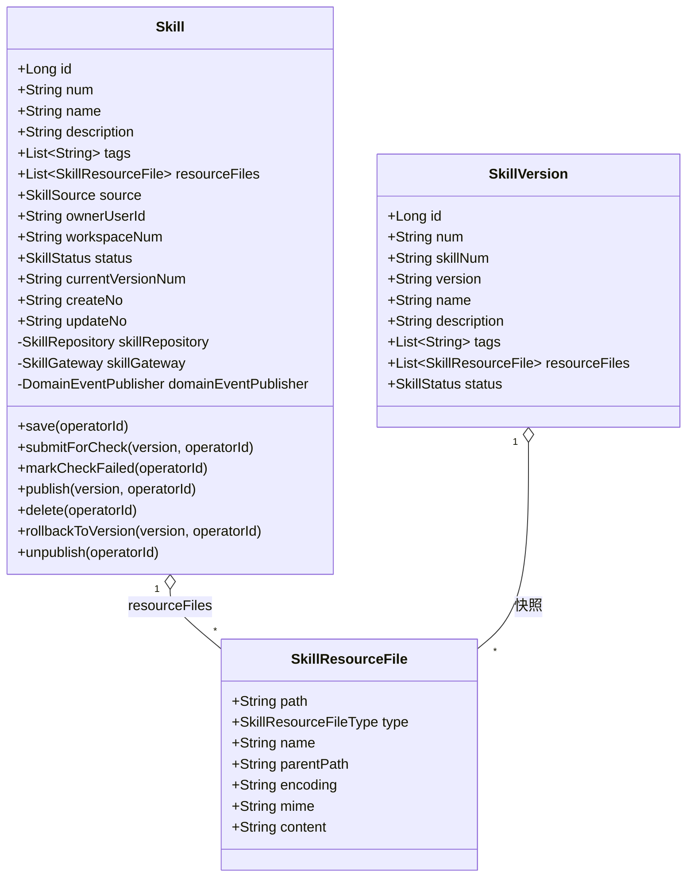

| 对象 | 类型 | 关键属性 | 与其它对象关系 |
| --- | --- | --- | --- |
| `Skill` | 聚合根 | id/num/name/description/tags/**resourceFiles**/source/ownerUserId/workspaceNum/status/currentVersionNum | 持有 SkillResourceFile 集合；通过 currentVersionNum 关联 SkillVersion（仅 ID 引用） |
| `SkillVersion` | 实体 | num/skillNum/version/name/description/tags/**resourceFiles**/status | 发布时对 Skill 资源树做快照 |
| `SkillResourceFile` | 值对象 | **path**/type/name/**parentPath**/**encoding**/**mime**/**content** | Skill / SkillVersion 内聚 |
| `SkillResourceFileType` | 枚举 | FILE / FOLDER | — |
| `SkillStatus` | 枚举 | DRAFT / **CHECKING** / **CHECK_FAILED** / PUBLISHED / DEPRECATED | 新增 2 值 |
| `SkillSource` | 枚举 | SELF / COMPANY | 无变更 |

**变更要点**：

- `Skill`/`SkillVersion` **删除 `skillFileKey`**（OSS key），新增 `resourceFiles: List<SkillResourceFile>`（整棵文件树含内容）。
- `SkillResourceFile` 值对象**重构**：删除 `parentResource`/`fileKey`，改为 `path`（相对路径，树主键）/`parentPath`/`encoding`(text/base64)/`mime`/`content`（文本原文或 Base64 串）。
- `domainValidate()`：去掉 `Assert.notBlank(skillFileKey,...)`；新增「resourceFiles 中必须存在根 `SKILL.md`」「path 无 `..` 穿越/无绝对路径/同 parentPath 下不重名」校验。
- 软删除标记 `deleted` 仅在 DB/Entity，聚合内不出现（沿用现状）。

#### 4.2.2 领域动作

| 聚合/实体 | 领域动作 | 职责 | 前置条件 | 后置条件/规则 | 领域事件 |
| --- | --- | --- | --- | --- | --- |
| Skill | `save(operatorId)` | 保存/更新元信息 + 资源树（status 默认 DRAFT） | source≠COMPANY | 落库 skill + 级联 skill_resource_file | SKILL_SAVED |
| Skill | `submitForCheck(version, operatorId)` | 提交发布：状态 DRAFT→CHECKING | status=DRAFT；version 非空 | status=CHECKING（应用层随后调检测网关） | SKILL_CHECK_STARTED |
| Skill | `markCheckFailed(operatorId)` | 检测不通过：状态→CHECK_FAILED | status=CHECKING | status=CHECK_FAILED | SKILL_CHECK_FAILED |
| Skill | `publish(version, operatorId)` | 检测通过后切版本指针 + 状态 PUBLISHED | status=CHECKING | 覆盖主表快照 + currentVersionNum=version + status=PUBLISHED | SKILL_VERSION_PUBLISHED |
| Skill | `delete(operatorId)` | 逻辑删除 | status≠PUBLISHED | deleted=1 | SKILL_DELETED |
| Skill | `rollbackToVersion(version, operatorId)` | 回滚到历史版本 | status≠DRAFT；version 存在 | 覆盖主表 + 资源树快照 | SKILL_ROLLED_BACK |
| Skill | `unpublish(operatorId)` | 下架 | status=PUBLISHED | status=DEPRECATED | SKILL_UNPUBLISHED |

> 检测同步阻塞，CHECKING 是事务内的瞬时态（落库一次便于检测记录关联 + 极端慢时前端可见）。检测**编排**放在 application 层（见 §6.2.2），领域只暴露 `submitForCheck`（入口）+ `markCheckFailed`/`publish`（结果态切换）三个方法；检测**规则执行**由 `SkillCheckGateway` 承担。

**领域动作时序图**：

`Skill.save(operatorId)`（含资源树级联）：

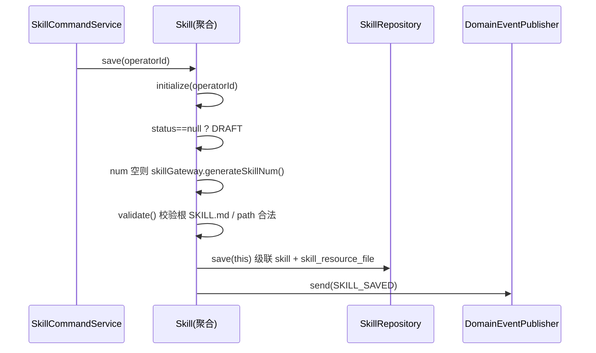

`Skill.submitForCheck(version, operatorId)`：

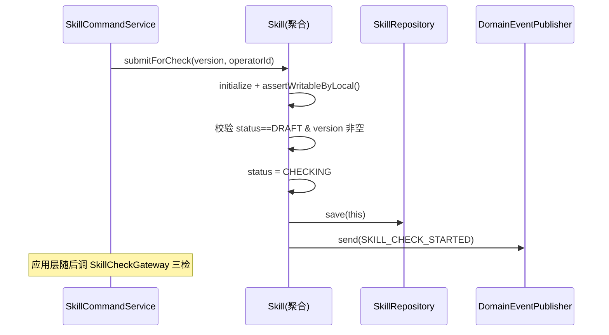

`Skill.publish(version, operatorId)`（检测通过后）：

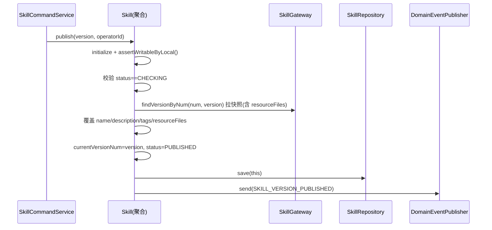

`Skill.markCheckFailed(operatorId)`：

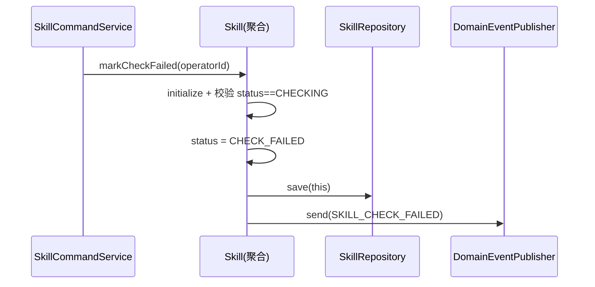

`Skill.rollbackToVersion` / `unpublish` / `delete`：沿用基线时序（仅 `rollbackToVersion` 的快照覆盖增加 resourceFiles 一项），详见基线方案 §4，不重复绘制。

#### 4.2.3 领域规则

| 聚合/对象 | 规则类型 | 规则描述 | 违反时表达 |
| --- | --- | --- | --- |
| Skill | 不变性 | 资源树必须含根 `SKILL.md`（FILE 类型） | BusinessException「缺少 SKILL.md」 |
| Skill | 不变性 | 资源 path 不含 `..`、非绝对路径、同 parentPath 下 name 不重复 | domainValidate 抛错 |
| Skill | 状态机 | DRAFT→CHECKING→(PUBLISHED \| CHECK_FAILED)；CHECK_FAILED→DRAFT（updateSkill）→CHECKING | Assert 状态非法 |
| Skill | 只读 | source=COMPANY 禁止本地写（assertWritableByLocal） | BusinessException(1003) |
| Skill | 唯一性 | 同 ownerUserId 下 name 唯一（SELF）；同 skillNum 下 version 唯一 | BizCode.CONFLICT / VERSION_CONFLICT |
| SkillResourceFile | 不变性 | encoding∈{text,base64}；base64 时 content 必须合法 Base64 且 mime 在白名单 | 格式检测拦截 |

#### 4.2.4 领域工厂

`SkillFactory`（沿用现有，调整 `buildSkill`/`buildSkillVersion` 签名）：

| Factory | 方法 | 入参 | 返回 | 职责 | 依赖 |
| --- | --- | --- | --- | --- | --- |
| SkillFactory | `buildSkill(name, description, tags, resourceFiles, source, ownerUserId)` | 用户可填字段 + 资源树 | Skill | 构建新 Skill（去 skillFileKey，加 resourceFiles）；status 由 save 兜底 DRAFT | SkillRepository/SkillGateway/Publisher |
| SkillFactory | `buildSkillByNum(num)` | num | Skill | 从仓储加载 + 装配（含资源树） | 同上 |
| SkillFactory | `buildSkillVersion(skillNum, version, name, description, tags, resourceFiles)` | 快照字段 + 资源树 | SkillVersion | 构建版本快照（去 skillFileKey，加 resourceFiles） | SkillVersionRepository/Gateway/Publisher |
| SkillFactory | `buildSkillVersionByNum(num)` | num | SkillVersion | 加载 + 装配 | 同上 |

> `buildSkill`/`buildSkillVersion` 入参去掉 `skillFileKey`，加 `resourceFiles`；其余不变。语义对齐 create（buildXxx）/ createByNum（buildXxxByNum）。

#### 4.2.5 领域网关

| Gateway | 方法 | 入参 | 返回 | 职责 | 外部依赖 | 失败策略 |
| --- | --- | --- | --- | --- | --- | --- |
| SkillGateway | `generateSkillNum()` | — | String | 生成 SKL 编号 | 编号生成器 | 沿用 |
| SkillGateway | `findVersionByNum(skillNum, version)` | — | SkillVersionGatewayDTO | 拉版本快照（**增 resourceFiles**，去 skillFileKey） | Mapper | 不存在返 null |
| **SkillResourceGateway**（新增） | `expandZip(zipBytes)` | zip 字节 | `List<SkillResourceFile>` | 解压 zip → 切分文件树（文本 UTF-8 / 二进制 Base64），校验根 SKILL.md、路径穿越、单文件大小 | 无（纯内存 ZipInputStream + Hutool Base64） | 非法抛 BusinessException |
| **SkillCheckGateway**（新增） | `check(resourceFiles)` | 资源树 | `SkillCheckResultDTO`（三项子结果 + errors） | 执行大小/格式/可用性三检 | 复用 AgentScope 解析逻辑 | **不抛异常**，结果以结构体返回，由应用层决定状态切换 |

> `SkillResourceGateway`/`SkillCheckGateway` 接口定义在 domain，实现在 infra。`SkillCheckGateway.check` 设计为**返回结果不抛异常**——「检测不通过」是正常业务结果（要落记录 + 展示），非异常流。

#### 4.2.6 领域事件

| 事件名 | 触发时机 | 载荷要点 | 用途 |
| --- | --- | --- | --- |
| SKILL_SAVED | save 后 | num/name/status | 沿用 |
| **SKILL_CHECK_STARTED** | submitForCheck 后 | num/version | 检测开始留痕（可选订阅） |
| **SKILL_CHECK_FAILED** | markCheckFailed 后 | num/version/错误摘要 | 检测失败通知 |
| SKILL_VERSION_PUBLISHED | publish 后 | num/version | 沿用 |
| SKILL_DELETED / SKILL_ROLLED_BACK / SKILL_UNPUBLISHED | 对应动作后 | num | 沿用 |

新增常量加入 `DomainEventConstant`：`SKILL_CHECK_STARTED`、`SKILL_CHECK_FAILED`。

### 4.3 SkillCheckRecord（skillcheck）

#### 4.3.1 领域模型

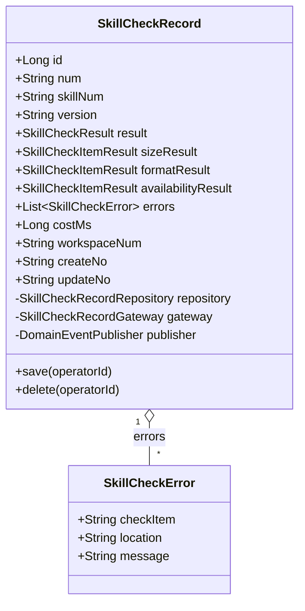

| 对象 | 类型 | 关键属性 | 关系 |
| --- | --- | --- | --- |
| `SkillCheckRecord` | 聚合根 | id/num/skillNum/version/result/sizeResult/formatResult/availabilityResult/errors/costMs/workspaceNum | 含 SkillCheckError 列表 |
| `SkillCheckError` | 值对象 | checkItem(SIZE/FORMAT/AVAILABILITY)/location(文件路径)/message | 内聚 |
| `SkillCheckResult` | 枚举 | PASS / FAIL | 整体结果 |
| `SkillCheckItemResult` | 枚举 | PASS / FAIL / SKIPPED | 单项结果 |

**基本属性**：id/num/create_no/update_no 齐全；聚合根持有 Repository/Gateway/DomainEventPublisher；无软删除标记（仅 Entity 有 deleted）。

#### 4.3.2 领域动作

| 聚合/实体 | 领域动作 | 职责 | 前置条件 | 后置条件 | 领域事件 |
| --- | --- | --- | --- | --- | --- |
| SkillCheckRecord | `save(operatorId)` | 保存一次检测记录 | skillNum/version/result 非空 | num 生成 + 落库 | SKILL_CHECK_RECORDED |
| SkillCheckRecord | `delete(operatorId)` | 软删（清理场景，常规不用） | num 非空 | deleted=1 | SKILL_CHECK_RECORD_DELETED |

`SkillCheckRecord.save` 时序：

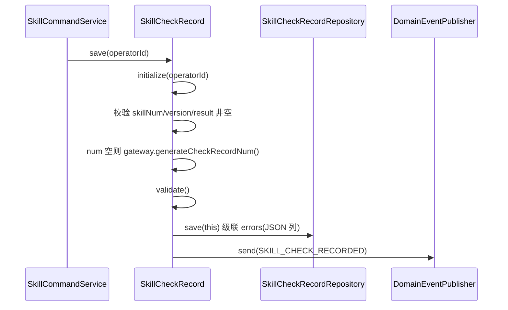

`SkillCheckRecord.delete` 时序：

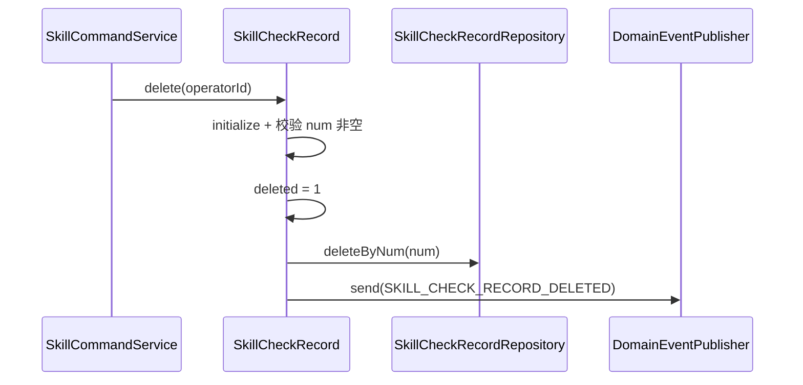

#### 4.3.3 领域规则

| 对象 | 规则类型 | 规则描述 | 违反时表达 |
| --- | --- | --- | --- |
| SkillCheckRecord | 不变性 | result=FAIL 时 errors 非空 | domainValidate 抛错 |
| SkillCheckRecord | 不变性 | skillNum/version/result/三项子结果必填 | domainValidate 抛错 |

#### 4.3.4 领域工厂

| Factory | 方法 | 入参 | 返回 | 职责 | 依赖 |
| --- | --- | --- | --- | --- | --- |
| SkillCheckRecordFactory | `buildCheckRecord(skillNum, version, result, sizeResult, formatResult, availabilityResult, errors, costMs)` | 检测结果字段 | SkillCheckRecord | 构建新检测记录（未落库） | Repository/Gateway/Publisher |
| SkillCheckRecordFactory | `buildCheckRecordByNum(num)` | num | SkillCheckRecord | 加载 + 装配 | 同上 |

#### 4.3.5 领域网关

| Gateway | 方法 | 入参 | 返回 | 职责 | 外部依赖 | 失败策略 |
| --- | --- | --- | --- | --- | --- | --- |
| SkillCheckRecordGateway | `generateCheckRecordNum()` | — | String | 生成 SCR 编号 | 编号生成器 | — |

#### 4.3.6 领域事件

| 事件名 | 触发时机 | 载荷要点 | 用途 |
| --- | --- | --- | --- |
| SKILL_CHECK_RECORDED | save 后 | num/skillNum/version/result | 检测留痕（可选订阅审计） |
| SKILL_CHECK_RECORD_DELETED | delete 后 | num | 清理留痕 |

> **模块自检（领域）**：✅ 两领域各六节齐全；✅ 聚合根具备 id/num/create_no/update_no + Repository/Gateway/Publisher + save/delete + 所有动作带 operatorId；✅ 聚合内无 isDeleted；✅ Factory 仅 create(buildXxx)/createByNum(buildXxxByNum) 两类语义；✅ Gateway 定义在 domain、infra 实现；✅ 每个领域动作配时序图。

---

## 5. 基础设施层设计

### 5.1 skill 领域

| 类型 | 类名 | 包路径 | 职责 | 依赖 | 对应表/外部 | 新增/修改 |
| --- | --- | --- | --- | --- | --- | --- |
| Entity | `SkillEntity` | `infra.skill.entity` | 去 `skill_file_key` 列映射；其余不变 | — | skill | 修改 |
| Entity | `SkillVersionEntity` | `infra.skill.entity` | 去 `skill_file_key` 列映射 | — | skill_version | 修改 |
| Entity | `SkillResourceFileEntity` | `infra.skill.entity` | 资源文件树持久化：owner_type(SKILL/VERSION)/owner_num/path/type/parent_path/encoding/mime/content | — | skill_resource_file | 新增 |
| Mapper | `SkillResourceFileMapper` | `infra.skill.mapper` | 按 owner 批量增删查资源文件 | — | skill_resource_file | 新增 |
| RepositoryImpl | `SkillRepositoryImpl` | `infra.skill.repository` | save 时级联保存资源树（先删 owner 下旧资源再批量插）；findByNum 装载资源树 | SkillMapper + SkillResourceFileMapper | skill / skill_resource_file | 修改 |
| RepositoryImpl | `SkillVersionRepositoryImpl` | `infra.skill.repository` | 同上，版本快照的资源树级联 | SkillVersionMapper + SkillResourceFileMapper | skill_version / skill_resource_file | 修改 |
| GatewayImpl | `SkillGatewayImpl` | `infra.skill.gateway` | `findVersionByNum` 返回快照增 resourceFiles；generateSkillNum 不变 | SkillVersionMapper + SkillResourceFileMapper | — | 修改 |
| GatewayImpl | `SkillResourceGatewayImpl` | `infra.skill.gateway` | 实现 `expandZip`：解压 zip → 切分文件树（TEXT_EXTENSIONS 命中 UTF-8、否则 Base64；裁单级子目录前缀；校验根 SKILL.md / 路径穿越 / 单文件 ≤2MB） | 无（ZipInputStream + Hutool Base64） | — | 新增 |
| GatewayImpl | `SkillCheckGatewayImpl` | `infra.skill.gateway` | 实现 `check`：①大小（解码后总字节 ≤10MB）②格式（根 SKILL.md + front-matter YAML 可解析 + name/description/version 齐全且 version 合法 Semver + path 合法 + 图片 Base64 合法且 MIME 白名单 + 文本 UTF-8）③可用性（复用 AgentScope 解析装载 + SKILL.md 内相对路径引用在文件树中均存在）；返回结构化结果不抛异常 | 复用 AgentScope 解析逻辑 | — | 新增 |
| common | `AgentScopeSkillRepositoryAdapter` | `infra.skill.agentscope` | **去 OssClient**：getSkill/getAllSkills 改为从 `skill_resource_file` 读资源树装配 AgentSkill（文本直取 content，base64 加 `base64:` 前缀对齐 SkillBox 物化约定）；REPOSITORY_TYPE 改 `rd-agent-mysql` | SkillMapper + SkillVersionMapper + SkillResourceFileMapper | skill_resource_file | 修改 |

### 5.2 skillcheck 领域

| 类型 | 类名 | 包路径 | 职责 | 依赖 | 对应表 | 新增/修改 |
| --- | --- | --- | --- | --- | --- | --- |
| Entity | `SkillCheckRecordEntity` | `infra.skillcheck.entity` | 检测记录持久化；errors 以 JSON 列存 | — | skill_check_record | 新增 |
| Mapper | `SkillCheckRecordMapper` | `infra.skillcheck.mapper` | 按 skillNum 分页查、按 num 查详情 | — | skill_check_record | 新增 |
| RepositoryImpl | `SkillCheckRecordRepositoryImpl` | `infra.skillcheck.repository` | save/findByNum/deleteByNum | SkillCheckRecordMapper | skill_check_record | 新增 |
| GatewayImpl | `SkillCheckRecordGatewayImpl` | `infra.skillcheck.gateway` | generateCheckRecordNum（前缀 SCR） | 编号生成器 | — | 新增 |

> `SkillCheckRecordFactory` 为 domain 层 `@Component`，注入上述 Repository/Gateway + Publisher。

**资源树存储设计**：`skill_resource_file` 用 `(owner_type, owner_num)` 二元组归属——`owner_type=SKILL` 时 `owner_num=skill.num`（草稿态可编辑树）；`owner_type=VERSION` 时 `owner_num=skill_version.num`（发布快照树，不可变）。发布时把 SKILL 树整体复制一份为 VERSION 树。

> **模块自检（infra）**：✅ Entity/Mapper/RepositoryImpl/FactoryImpl/GatewayImpl/common 齐全；✅ RepositoryImpl 仅注入本聚合 Mapper（SkillResourceFileMapper 属 skill 聚合内）；✅ Bean 注入 `@Resource`；✅ 与领域接口、数据库设计一致；✅ AgentScope 适配器去 OSS 与「下线对象存储」一致。

---

## 6. 应用层设计

### 6.1 业务模块划分

| 模块 | Service | 对应领域 |
| --- | --- | --- |
| skill 写 | `SkillCommandService` | skill |
| skill 读 | `SkillQueryService` | skill + skillcheck |

### 6.2 skill 写（SkillCommandService）

#### 6.2.1 Service 方法清单

| 方法 | 签名 | 职责 | 入参/出参 |
| --- | --- | --- | --- |
| `createSkill` | `SkillDTO createSkill(SkillCreateParamDTO, operatorId)` | **改造**：双模式入参（mode=UPLOAD 带 zipBase64 / mode=DIRECT 带 resourceFiles）→ 解析/组装资源树 → 落 DRAFT（**不再首发**） | SkillCreateParamDTO / SkillDTO |
| `parseZipPreview` | `SkillResourceTreeDTO parseZipPreview(zipBase64)` | zip 解析预览：调 SkillResourceGateway.expandZip 返回资源树（不落库） | String / SkillResourceTreeDTO |
| `updateSkill` | `void updateSkill(SkillUpdateParamDTO, operatorId)` | **改造**：支持更新 resourceFiles；CHECK_FAILED/PUBLISHED → DRAFT | SkillUpdateParamDTO |
| `publish` | `void publish(SkillPublishParamDTO, operatorId)` | **改造**：submitForCheck→三检→PASS 则建版本+publish / FAIL 则 markCheckFailed；落检测记录 | SkillPublishParamDTO |
| `discardDraft` / `rollbackToVersion` / `unpublish` / `delete` | 沿用基线（rollback 增资源树覆盖） | — | — |

#### 6.2.2 方法时序逻辑

`createSkill`（双模式，创建落草稿）：

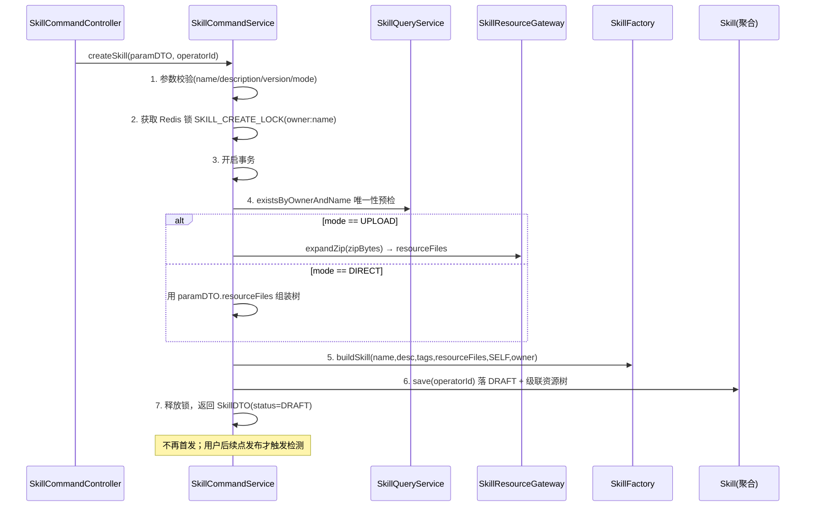

`publish`（发布触发同步三检，先检测后建版本）：

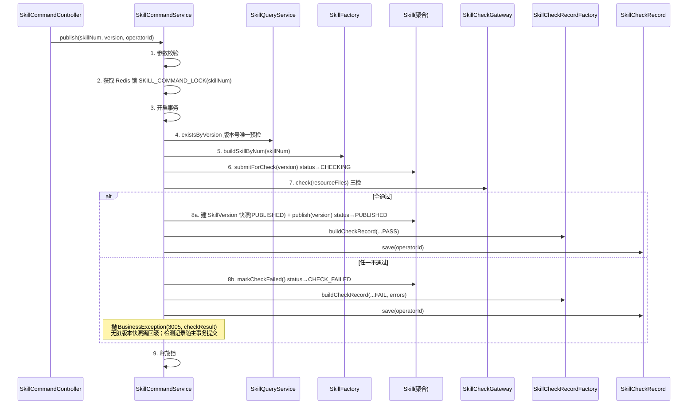

> **事务说明**：版本快照创建放在**检测通过之后**（步骤 8a），失败路径（8b）不产生版本快照，因此「检测不通过」无需回滚脏数据；Skill=CHECK_FAILED 状态切换 + 检测记录落库 + 抛异常三者在同一事务——这里需让异常**不回滚** Skill 状态与检测记录。实现采用：检测失败时**先提交** markCheckFailed + checkRecord（方法内 try 包住检测，失败分支正常 return 写库），再由 Controller 层根据返回的失败结果体决定抛业务异常/直接返回 `Result.fail`。即 application 层 publish **不抛异常**，返回 `SkillPublishResultDTO`（含 result + errors），由 adapter 决定响应码（见 §7.2）。

### 6.3 skill 读（SkillQueryService）

#### 6.3.1 Service 方法清单

| 方法 | 签名 | 职责 |
| --- | --- | --- |
| `resourceTree` | `SkillResourceTreeDTO resourceTree(skillNum, version)` | 按 skillNum+version（version 空取草稿 SKILL 树）返回整棵文件树含内容（图片 Base64 随树） |
| `checkRecordPage` | `PageVO<SkillCheckRecordDTO> checkRecordPage(skillNum, pageParam)` | 检测记录分页列表 |
| `checkRecordDetail` | `SkillCheckRecordDTO checkRecordDetail(recordNum)` | 单条检测记录详情（三项子结果 + errors） |
| 沿用 | existsByOwnerAndName / existsByVersion / pageList / detail / versionDetail … | 基线不变 |

#### 6.3.2 方法时序逻辑

`resourceTree`：

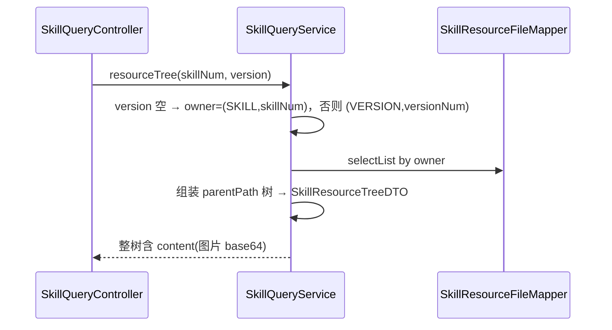

`checkRecordPage`：

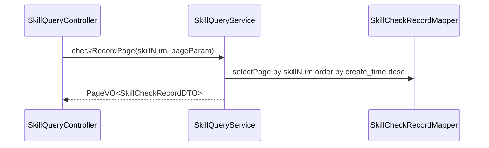

`checkRecordDetail`：

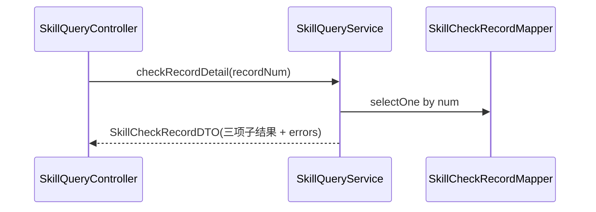

> **模块自检（应用）**：✅ 6.1 模块划分 + 按模块二级目录；✅ 每方法配时序图；✅ Command 不注入 Repository/Gateway（查询走 QueryService，QueryService 经 Mapper 只读）；✅ CommandService 写操作有 Redis 锁 + 事务在锁内；✅ `@Resource` 注入。

---

## 7. Adapter 层设计

### 7.1 业务模块划分

| 模块 | 类 | 类型 | 对应应用层 |
| --- | --- | --- | --- |
| skill 命令 | `SkillCommandController` | HTTP POST | SkillCommandService |
| skill 查询 | `SkillQueryController` | HTTP GET（parseZip 用 POST） | SkillQueryService |

无定时任务、无事件监听新增（同步检测）。

### 7.2 skill 命令（SkillCommandController）

#### 7.2.1 Controller 接口清单

| 方法 | HTTP/路径 | 入参(Param) | 出参 | 职责 |
| --- | --- | --- | --- | --- |
| create | POST `/skill/create` | `SkillCreateParam`（含 mode/zipBase64/resourceFiles） | `Result<SkillVo>` | **改造**：双模式创建，落草稿 |
| update | POST `/skill/update` | `SkillUpdateParam`（增 resourceFiles） | `Result<Void>` | 更新草稿 |
| publish | POST `/skill/publish` | `SkillPublishParam` | `Result<SkillPublishResultVo>` | **改造**：触发三检；PASS 返回 ok，FAIL 返回 3005 + errors |
| 沿用 | discardDraft/rollback/unpublish/delete/...Version | — | — | 基线不变 |

`SkillCreateParam` JSON（直接创建模式）：

```json
{
  "mode": "DIRECT",
  "name": "jira-summary",
  "description": "汇总 Jira 当周 issue",
  "version": "1.0.0",
  "tags": ["分析"],
  "resourceFiles": [
    {"path": "SKILL.md", "type": "FILE", "parentPath": null, "encoding": "text", "mime": "text/markdown", "content": "---\nname: jira-summary\n..."},
    {"path": "assets", "type": "FOLDER", "parentPath": null},
    {"path": "assets/logo.png", "type": "FILE", "parentPath": "assets", "encoding": "base64", "mime": "image/png", "content": "iVBORw0KGgo..."}
  ]
}
```

`SkillCreateParam` JSON（上传模式）：

```json
{ "mode": "UPLOAD", "name": "jira-summary", "description": "...", "version": "1.0.0", "tags": [], "zipBase64": "UEsDBBQ..." }
```

`publish` 检测失败返回（`Result<SkillPublishResultVo>`）：

```json
{ "code": 3005, "message": "Skill 检测不通过",
  "data": { "result": "FAIL",
    "sizeResult": "PASS", "formatResult": "FAIL", "availabilityResult": "FAIL",
    "errors": [
      {"checkItem": "FORMAT", "location": "SKILL.md", "message": "front-matter 缺少 version"},
      {"checkItem": "AVAILABILITY", "location": "references/api.md", "message": "SKILL.md 引用的资源在文件树中不存在"}
    ] } }
```

`create` 时序：

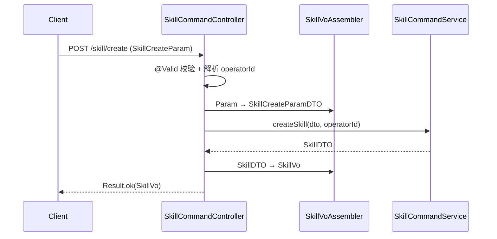

`publish` 时序（含检测失败）：

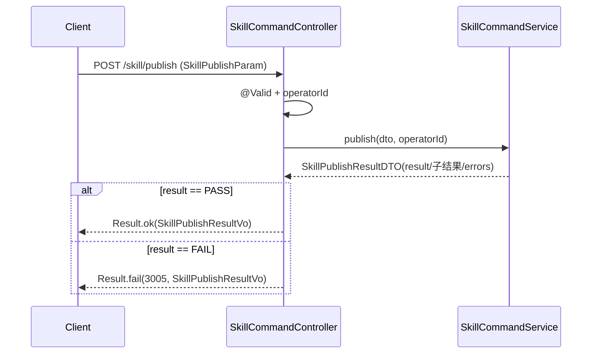

### 7.3 skill 查询（SkillQueryController）

#### 7.3.1 Controller 接口清单

| 方法 | HTTP/路径 | 入参(Param) | 出参 | 职责 |
| --- | --- | --- | --- | --- |
| resourceTree | GET `/skill/resourceTree` | num + version(可空) | `Result<SkillResourceTreeVo>` | 返回整棵资源树含内容 |
| parseZip | POST `/skill/parseZip` | `SkillZipParseParam`(zipBase64) | `Result<SkillResourceTreeVo>` | zip 解析预览（只解析不落库，POST 因含大体积 body） |
| checkRecordPage | GET `/skill/checkRecord/page` | `SkillCheckRecordPageParam` | `Result<PageVO<SkillCheckRecordVo>>` | 检测记录列表 |
| checkRecordDetail | GET `/skill/checkRecord/detail` | recordNum | `Result<SkillCheckRecordVo>` | 检测记录详情 |

> `parseZip` 为查询语义但用 POST：携带 zip Base64 大体积 body，符合「POST=带 body」工程惯例；不改变状态，归 QueryService 处理。

`resourceTree` 时序：

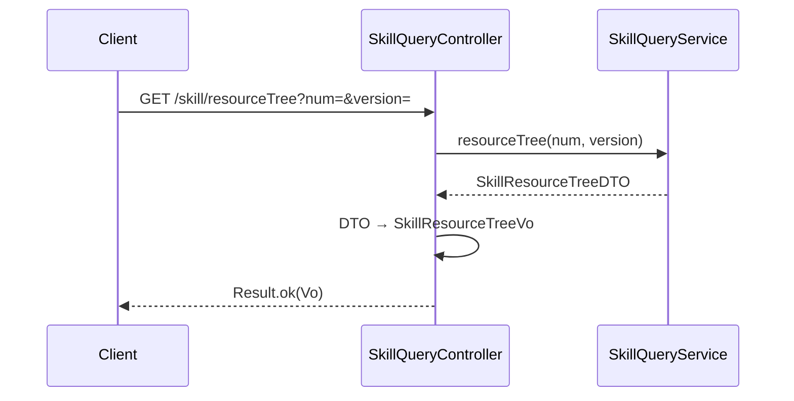

`parseZip` 时序：

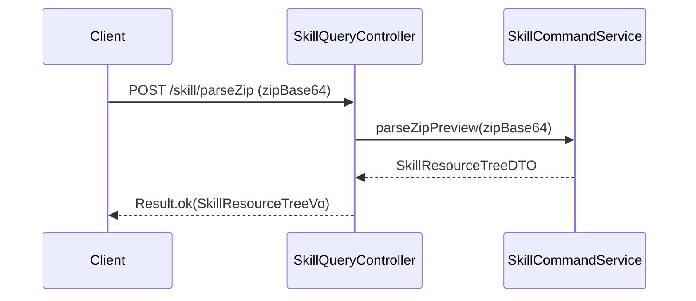

`checkRecordPage` / `checkRecordDetail` 时序：

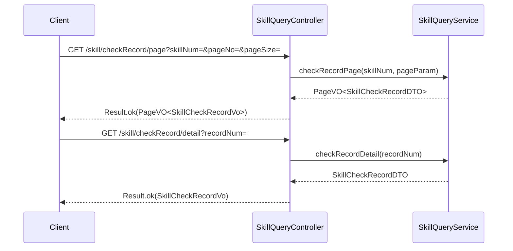

> **模块自检（adapter）**：✅ HTTP 仅 GET/POST；✅ 入参 `*Param`、出参 `Result<*VO>`，DTO→VO 转换在 Controller/Assembler；✅ 每接口配时序图；✅ 无新增定时任务/监听；✅ `@Resource` 注入。

---

## 8. 数据库设计

### 8.1 表结构

**skill / skill_version（修改）**：删除 `skill_file_key` 列（资源改由 skill_resource_file 承载）；`status` 列枚举值新增 `CHECKING`/`CHECK_FAILED`（VARCHAR 无需改 DDL，仅语义扩展）。

**skill_resource_file（新增）**：

| 字段 | 类型 | 必填 | 索引 | 说明 |
| --- | --- | --- | --- | --- |
| id | BIGINT AUTO_INCREMENT | ✓ | PK | 自增主键 |
| owner_type | VARCHAR(16) | ✓ | uk(owner_type,owner_num,path,deleted) | SKILL / VERSION |
| owner_num | VARCHAR(64) | ✓ | uk | skill.num 或 skill_version.num |
| path | VARCHAR(512) | ✓ | uk | 相对路径，如 references/guide.md |
| type | VARCHAR(8) | ✓ | — | FILE / FOLDER |
| parent_path | VARCHAR(512) | — | idx | 父节点路径，根为 NULL |
| encoding | VARCHAR(8) | — | — | text / base64（FOLDER 为空） |
| mime | VARCHAR(64) | — | — | text/markdown、image/png |
| content | LONGTEXT | — | — | 文本原文 或 Base64 串（FOLDER 为空） |
| create_no | VARCHAR(64) | ✓ | — | 创建人 |
| update_no | VARCHAR(64) | ✓ | — | 更新人 |
| deleted | TINYINT | ✓ | — | 0/1 |
| create_time | DATETIME(3) | ✓ | — | 创建时间 |
| update_time | DATETIME(3) | ✓ | — | 更新时间 |

**skill_check_record（新增）**：

| 字段 | 类型 | 必填 | 索引 | 说明 |
| --- | --- | --- | --- | --- |
| id | BIGINT AUTO_INCREMENT | ✓ | PK | 自增主键 |
| num | VARCHAR(64) | ✓ | uk | 检测记录编号（前缀 SCR） |
| skill_num | VARCHAR(64) | ✓ | idx | 所属 Skill |
| version | VARCHAR(32) | ✓ | — | 检测的目标版本号 |
| result | VARCHAR(8) | ✓ | — | PASS / FAIL |
| size_result | VARCHAR(8) | ✓ | — | PASS/FAIL/SKIPPED |
| format_result | VARCHAR(8) | ✓ | — | 同上 |
| availability_result | VARCHAR(8) | ✓ | — | 同上 |
| errors | TEXT | — | — | 错误明细数组 JSON |
| cost_ms | BIGINT | ✓ | — | 总耗时毫秒 |
| workspace_num | VARCHAR(64) | ✓ | idx | 归属空间 |
| create_no | VARCHAR(64) | ✓ | — | 触发人 |
| update_no | VARCHAR(64) | ✓ | — | 更新人 |
| deleted | TINYINT | ✓ | — | 0/1 |
| create_time | DATETIME(3) | ✓ | — | 检测时间 |
| update_time | DATETIME(3) | ✓ | — | 更新时间 |

### 8.2 DDL（Flyway 迁移，版本号需与 Prompt/模型管理协调顺延，避免 V19 冲突）

```sql
-- 资源文件树
CREATE TABLE skill_resource_file (
    id           BIGINT       NOT NULL AUTO_INCREMENT COMMENT '自增主键',
    owner_type   VARCHAR(16)  NOT NULL COMMENT '归属类型 SKILL/VERSION',
    owner_num    VARCHAR(64)  NOT NULL COMMENT 'skill.num 或 skill_version.num',
    path         VARCHAR(512) NOT NULL COMMENT '相对路径',
    type         VARCHAR(8)   NOT NULL COMMENT 'FILE/FOLDER',
    parent_path  VARCHAR(512) NULL     COMMENT '父节点路径',
    encoding     VARCHAR(8)   NULL     COMMENT 'text/base64',
    mime         VARCHAR(64)  NULL     COMMENT 'MIME 类型',
    content      LONGTEXT     NULL     COMMENT '文本原文或 Base64 串',
    create_no    VARCHAR(64)  NOT NULL COMMENT '创建人',
    update_no    VARCHAR(64)  NOT NULL COMMENT '更新人',
    deleted      TINYINT      NOT NULL DEFAULT 0 COMMENT '逻辑删除 0/1',
    create_time  DATETIME(3)  NOT NULL DEFAULT CURRENT_TIMESTAMP(3) COMMENT '创建时间',
    update_time  DATETIME(3)  NOT NULL DEFAULT CURRENT_TIMESTAMP(3) ON UPDATE CURRENT_TIMESTAMP(3) COMMENT '更新时间',
    PRIMARY KEY (id),
    UNIQUE KEY uk_owner_path (owner_type, owner_num, path, deleted),
    KEY idx_owner (owner_type, owner_num),
    KEY idx_parent (owner_type, owner_num, parent_path)
) ENGINE=InnoDB DEFAULT CHARSET=utf8mb4 COMMENT='Skill 资源文件树';

-- 检测记录
CREATE TABLE skill_check_record (
    id                   BIGINT      NOT NULL AUTO_INCREMENT COMMENT '自增主键',
    num                  VARCHAR(64) NOT NULL COMMENT '检测记录编号 SCR',
    skill_num            VARCHAR(64) NOT NULL COMMENT '所属 Skill',
    version              VARCHAR(32) NOT NULL COMMENT '目标版本号',
    result               VARCHAR(8)  NOT NULL COMMENT 'PASS/FAIL',
    size_result          VARCHAR(8)  NOT NULL COMMENT 'PASS/FAIL/SKIPPED',
    format_result        VARCHAR(8)  NOT NULL COMMENT 'PASS/FAIL/SKIPPED',
    availability_result  VARCHAR(8)  NOT NULL COMMENT 'PASS/FAIL/SKIPPED',
    errors               TEXT        NULL     COMMENT '错误明细 JSON 数组',
    cost_ms              BIGINT      NOT NULL DEFAULT 0 COMMENT '总耗时毫秒',
    workspace_num        VARCHAR(64) NOT NULL COMMENT '归属空间',
    create_no            VARCHAR(64) NOT NULL COMMENT '触发人',
    update_no            VARCHAR(64) NOT NULL COMMENT '更新人',
    deleted              TINYINT     NOT NULL DEFAULT 0 COMMENT '逻辑删除 0/1',
    create_time          DATETIME(3) NOT NULL DEFAULT CURRENT_TIMESTAMP(3) COMMENT '检测时间',
    update_time          DATETIME(3) NOT NULL DEFAULT CURRENT_TIMESTAMP(3) ON UPDATE CURRENT_TIMESTAMP(3) COMMENT '更新时间',
    PRIMARY KEY (id),
    UNIQUE KEY uk_num (num),
    KEY idx_skill (skill_num),
    KEY idx_workspace (workspace_num)
) ENGINE=InnoDB DEFAULT CHARSET=utf8mb4 COMMENT='Skill 发布检测记录';

-- skill / skill_version 去 OSS key 列（视存量决定是否执行 DROP，见 §8.3）
-- ALTER TABLE skill DROP COLUMN skill_file_key;
-- ALTER TABLE skill_version DROP COLUMN skill_file_key;
```

### 8.3 刷数 / 迁移

**无刷数**。本次不做 OSS→DB 存量迁移（同 PRD）。`DROP COLUMN skill_file_key` 是否执行视存量而定：若有存量 OSS Skill 仍需读取，暂保留列（仅代码不再写），与「不做存量迁移」一致；新链路一律不写该列。`content` 字段为 LONGTEXT（最大 4GB），单 Skill ≤10MB（Base64 膨胀后约 13MB）远低于上限；注意 MySQL `max_allowed_packet` 需 ≥ 单次写入资源树总量（建议 ≥64MB，运维确认）。

### 8.4 表与领域对应

| 表 | 领域对象 |
| --- | --- |
| skill | Skill 聚合根 |
| skill_version | SkillVersion 实体 |
| skill_resource_file | SkillResourceFile 值对象（按 owner 归属 Skill / SkillVersion） |
| skill_check_record | SkillCheckRecord 聚合根 |

> **模块自检（数据库）**：✅ 主键 BIGINT 自增；✅ create_time/update_time 命名 + DATETIME(3) 毫秒；✅ DDL 可执行；✅ 无刷数已说明；✅ 与领域/infra 一致。

---

## 9. 模块变更清单

| 层 | 变更 | 实现 Skill |
| --- | --- | --- |
| facade | 无变更 | —（impl-facade-module 不涉及） |
| client | 新增 `SkillResourceFileVo/DTO`、`SkillResourceTreeVo/DTO`、`SkillCheckRecordVo/DTO`、`SkillPublishResultVo/DTO`、`SkillZipParseParam`、`SkillCheckRecordPageParam`；改造 `SkillCreateParam/DTO`（mode/zipBase64/resourceFiles）、`SkillUpdateParam/DTO`（resourceFiles）；新增 BizCode `SKILL_CHECK_FAILED(3005)` | impl-client-module |
| domain | `Skill`/`SkillVersion` 去 skillFileKey + 加 resourceFiles + save/publish 调整 + 新增 submitForCheck/markCheckFailed；`SkillResourceFile` 值对象重构；`SkillStatus` 增 CHECKING/CHECK_FAILED；新增 `SkillResourceGateway`/`SkillCheckGateway` 接口；新增 `skillcheck` 子域（SkillCheckRecord 聚合 + Repository + Factory + Gateway + 值对象）；`DomainEventConstant` 增事件常量 | impl-domain-module |
| infra | 新增 `SkillResourceFileEntity`/Mapper；`SkillEntity`/`SkillVersionEntity` 去列映射；`SkillRepositoryImpl`/`SkillVersionRepositoryImpl` 级联资源树；新增 `SkillResourceGatewayImpl`/`SkillCheckGatewayImpl`；`AgentScopeSkillRepositoryAdapter` 去 OSS 改读 DB；新增 `skillcheck` infra（Entity/Mapper/RepositoryImpl/GatewayImpl）；Flyway 迁移脚本 | impl-infra-module |
| application | `SkillCommandService` 改造 createSkill（双模式落草稿）/publish（三检编排）+ 新增 parseZipPreview；`SkillQueryService` 新增 resourceTree/checkRecordPage/checkRecordDetail | impl-application-module |
| adapter | `SkillCommandController` 改造 create/publish；`SkillQueryController` 新增 resourceTree/parseZip/checkRecordPage/checkRecordDetail；`SkillVoAssembler` 增转换 | impl-adapter-module |

> **模块自检（变更清单）**：✅ 每条对应唯一实现 Skill；✅ 与各层设计一致。

---

## 10. 代码分支命名

- 后端：`feature-20260610-skill-resource-inline-and-publish-check`
- 前端：`feature-20260610-skill-resource-inline-and-publish-check`

---

## 11. 实现顺序与依赖

1. **client**（impl-client-module）：Param/DTO/VO + BizCode —— 契约先行。
2. **domain**（impl-domain-module）：SkillResourceFile 重构 + SkillStatus 扩展 + Skill/SkillVersion 调整 + 两个新 Gateway 接口 + skillcheck 子域。
3. **infra**（impl-infra-module）：建表 Entity/Mapper + RepositoryImpl 级联 + 两个 GatewayImpl（zip 解压 / 检测引擎）+ AgentScope 适配器改造 + skillcheck infra + Flyway。
4. **application**（impl-application-module）：createSkill/publish 改造 + 查询新增。
5. **adapter**（impl-adapter-module）：Controller 接口 + Assembler。
6. **fe**：新建页面顶部方式切换 + 直接创建编辑器（front-matter 双向同步 + 资源树）+ 发布检测态 + 检测记录页。

依赖方向严格 facade→client→domain→infra→application→adapter，无逆依赖。

---

## 12. 接口与数据契约（关键 API 汇总）

| 接口 | 方法/路径 | 入参 | 出参 |
| --- | --- | --- | --- |
| 创建（双模式） | POST `/skill/create` | SkillCreateParam(mode/zipBase64/resourceFiles) | Result\<SkillVo\> |
| zip 解析预览 | POST `/skill/parseZip` | SkillZipParseParam(zipBase64) | Result\<SkillResourceTreeVo\> |
| 资源树查询 | GET `/skill/resourceTree` | num, version? | Result\<SkillResourceTreeVo\> |
| 发布（触发检测） | POST `/skill/publish` | SkillPublishParam | Result\<SkillPublishResultVo\>（FAIL 时 code=3005） |
| 检测记录列表 | GET `/skill/checkRecord/page` | SkillCheckRecordPageParam | Result\<PageVO\<SkillCheckRecordVo\>\> |
| 检测记录详情 | GET `/skill/checkRecord/detail` | recordNum | Result\<SkillCheckRecordVo\> |

---

## 13. 其他

- **大小口径**：10MB 以**解码后原始字节**计（Base64 入库膨胀约 ×1.33 不计入用户可见大小）；检测引擎对 base64 资源先 decode 再累加字节数。
- **MIME 白名单**：png/jpg/jpeg/gif/svg/webp（图片）；文本类按 TEXT_EXTENSIONS（复用现有适配器白名单）。
- **复用点**：`expandZip` 切分逻辑、TEXT_EXTENSIONS 白名单、AgentScope 解析装载逻辑——建议抽到 infra common 的 `SkillResourceCodec` 工具类，供 SkillResourceGatewayImpl / SkillCheckGatewayImpl / AgentScopeSkillRepositoryAdapter 三处共用。
- **下线 OSS**：本次 Skill 模块不再调用 OssClient；CommonController 等其它模块的 OSS 用途不受影响。
- **双向同步**：name/version/description ↔ SKILL.md front-matter 同步由前端实现（YAML 解析/序列化），后端按结构化字段落库，不解析 SKILL.md 衔接头。

---

## 附：与 PRD 的覆盖核对

| PRD 功能点 | 技术方案落点 |
| --- | --- |
| §6.1 新建页面顶部方式切换 | 前端页面内 Segmented；后端单一 create 接口带 mode 分支 + parseZipPreview |
| §6.2 双向同步 | 前端实现（§0-Q5）；后端按结构化字段落库 |
| §6.3 资源文件树 | SkillResourceFile 值对象 + skill_resource_file 表 + resourceTree 接口 |
| §6.4 入库存储/Base64 | encoding=text/base64，content 字段，LONGTEXT |
| §6.5 发布检测 | publish 三检编排 + SkillCheckGateway |
| §6.6 检测记录 | SkillCheckRecord 聚合 + skill_check_record 表 + checkRecord 接口 |
