# 2026-06-10_模型管理-技术方案

> 文档日期：2026-06-10　|　版本：v1.0　|　对应 PRD：[2026-06-10-模型管理-PRD](../产品方案/2026-06-10-模型管理-PRD.md)
> 代码仓库：rd-agent-be（Java 17 + Spring Boot 3.5 六层架构）+ rd-agent-fe
> 分支：`feature-20260610-model-management`

---

## 1. 目标与范围

### 1.1 要解决的问题

把 LLM 模型接入信息（名称 / 模型 ID / API Key / Base URL）从各服务代码与 Agent `ConfigSnapshot` 内联配置中抽离，沉淀为 rd-agent-be 内一个**独立、可启停、按工作空间归属**的模型注册表（model registry）。提供模型的新增、修改、软删除（仅草稿）、启用、禁用，模型生命周期由「草稿 / 启用 / 禁用」三态机管控。

### 1.2 设计前共识（已与需求方确认）

| # | 决策点 | 结论 |
| --- | --- | --- |
| 1 | 归属范围 | **工作空间级**：模型聚合带 `workspaceNum`，与 Tool / Sandbox 一致 |
| 2 | modelId 与 num | **modelId 为用户输入的独立业务字段；num 由系统生成**（前缀 `MDL`，复用 `BizNumGenerator`）。两者分离：num 作聚合主键标识与寻址，modelId 是用户填写的对外模型标识 |
| 3 | 唯一性范围 | `modelId` 与 `name` **均在同一工作空间内唯一**（DB 双唯一索引，软删维度参与） |
| 4 | 删除语义 | **软删除**（`deleted=1`），仅草稿态可删；与 Sandbox 一致 |
| 5 | 启用预检 | **仅切状态，不做连通性测试**（PRD §2.2 不做项，S3 评估） |
| 6 | 领域事件 | **发事件，本期无监听者**（`MODEL_SAVED` / `MODEL_ENABLED` / `MODEL_DISABLED` / `MODEL_DELETED`），与 Tool / Sandbox 同构，仅保证审计一致性 |
| 7 | Agent 改造 | **不改造**：Agent 仍用 `ConfigSnapshot` 内联模型配置，本期仅独立建模型库，不做强绑定（S3 评估引用） |
| 8 | 编辑时 API Key | **留空则保留原密文**，填了新值才覆盖重加密；列表 / 详情默认脱敏 |
| 9 | API Key 加密 | **复用 `infra/common/util/SecretCipher`（AES）**，密文落 `api_key_cipher` 列，前缀落 `api_key_prefix` 列 |
| 10 | 部署架构 | **不变**，无新增应用 / 前端部署实例，复用现有部署架构 |

> ⚠️ **PRD 修正点**：PRD 原文写「模型 ID 全局唯一」，与共识 #1（工作空间级隔离）冲突。本方案按**工作空间内唯一**实现，PRD §2.1 / §7.1 / §9 / §11 的「全局唯一」表述应同步调整为「工作空间内唯一」。

### 1.3 范围

- **做**：model 领域新增（单聚合 + 三态机）；CRUD + 启用 / 禁用；modelId & name 空间内双唯一；API Key 加密落库 + 出参脱敏；Flyway V19 建表。
- **不做**：连通性测试、调用计量、参数模板、版本化、与 Agent 强绑定与被引用数统计、权限分级 / 审批流（详见 PRD §2.2）。

### 1.4 模块自检（架构设计前）

- [x] 角色边界：纯 Control Plane 数据管理，无 sphere 透传，无外部 HTTP 调用 → 本方案**无领域网关对外调用**，Gateway 仅承担 num 生成。

---

## 2. 架构设计

### 2.1 应用架构

新增 `model` 业务领域，贯穿六层；单聚合根 `Model`，纯状态机 + 字段不变量校验。命令 / 查询分离：写走 `ModelCommandService` + 聚合领域动作，读走 `ModelQueryService` + MyBatis-Plus。基础包 `ink.garry.rd.agent.ws`。

#### 2.1.1 代码结构

| 层 | 领域 | 包 | 职责 |
| --- | --- | --- | --- |
| facade | common | `ink.garry.rd.agent.ws.domain`（已存在） | 复用 `DomainEntity` / `DomainEventDTO` / `DomainEventPublisher` / `Result` / `PageVO`；**本次无新增** |
| client | model | `ink.garry.rd.agent.ws.client.model.vo` | Controller 入参 `*Param`、出参 `*VO` |
| client | model | `ink.garry.rd.agent.ws.client.model.dto` | 应用层入参 / 出参 `*ParamDTO` / `ModelDTO` |
| client | model | `ink.garry.rd.agent.ws.client.model.constant` | `ModelConstants`（长度上限等） |
| domain | model | `ink.garry.rd.agent.ws.domain.model` | 聚合根 `Model`（状态机 + 校验 + save/enable/disable/delete） |
| domain | model | `ink.garry.rd.agent.ws.domain.model.valueobject` | `ModelStatus` 枚举 |
| domain | model | `ink.garry.rd.agent.ws.domain.model.dto` | `ModelDomainEventDTO`（事件载荷） |
| domain | model | `ink.garry.rd.agent.ws.domain.model.repository` | `ModelRepository` 接口（save / findByNum / deleteByNum） |
| domain | model | `ink.garry.rd.agent.ws.domain.model.factory` | `ModelFactory` 接口（create / createByNum） |
| domain | model | `ink.garry.rd.agent.ws.domain.model.gateway` | `ModelGateway` 接口（生成 num + API Key 加解密/掩码） |
| infra | model | `ink.garry.rd.agent.ws.infra.model.entity` | `ModelEntity`（MyBatis-Plus，含 `api_key_cipher`/`api_key_prefix`） |
| infra | model | `ink.garry.rd.agent.ws.infra.model.mapper` | `ModelMapper`（BaseMapper） |
| infra | model | `ink.garry.rd.agent.ws.infra.model.repository` | `ModelRepositoryImpl`（Entity ↔ 领域对象，含密文转换） |
| infra | model | `ink.garry.rd.agent.ws.infra.model.factory` | `ModelFactoryImpl`（注入 ModelRepository） |
| infra | model | `ink.garry.rd.agent.ws.infra.model.gateway` | `ModelGatewayImpl`（BizNumGenerator + SecretCipher） |
| infra | common | `db/migration/V19__model_init.sql` | 建 `model` 表 |
| application | model | `ink.garry.rd.agent.ws.application.model` | `ModelCommandService`（写 + Redisson 锁）、`ModelQueryService`（读） |
| adapter | model | `ink.garry.rd.agent.ws.adapter.model` | `ModelCommandController`（POST）、`ModelQueryController`（GET） |
| adapter | model | `ink.garry.rd.agent.ws.adapter.model.assembler` | `ModelVoAssembler`（Param↔DTO、DTO→VO） |

#### 2.1.2 关键调用关系与命令/查询归属

```
[ModelCommandController(POST)] ──Param→DTO──▶ [ModelCommandService] ──▶ ModelFactory ──▶ Model 聚合
                                                      │（唯一性预检 CQRS）              │（领域动作内调 Repository/Gateway/EventPublisher）
                                                      └──────────▶ [ModelQueryService] ◀┘
[ModelQueryController(GET)] ───Param→DTO──▶ [ModelQueryService] ──MyBatis-Plus──▶ ModelMapper ──▶ DTO→VO
```

- **命令类**（POST，新增 / 修改 / 删除 / 启用 / 禁用）：`ModelCommandController` → `ModelCommandService`。
- **查询类**（GET，列表 / 详情）：`ModelQueryController` → `ModelQueryService`。
- 同步边界：全部为同步请求，无异步 Worker、无定时任务、无事件监听者（事件仅发不订阅）。
- 依赖方向：`adapter → application → {client, domain, infra}`；`infra → domain → facade`，无逆向。

### 2.2 部署架构

**部署架构不变，无新增应用 / 前端部署实例，复用现有部署架构。** 模型管理仅是 rd-agent-be 内新增 `model` 模块与一张新表，随主应用一同部署；API Key 加密依赖既有配置项 `app.secret.cipher-key`（SecretCipher 已在用），无新增配置。

#### 2.2.1 模块自检（架构设计后）

- [x] 应用架构含代码结构四列表格；命令 / 查询归属明确（CRUD+启停为命令，列表+详情为查询）；adapter 仅 HTTP 入口，无定时任务 / 事件监听；部署架构三选一已确认为「不变」。

---

## 3. Facade 层设计

**本次无 Facade 层变更。** 复用既有 `DomainEntity`（审计字段 + save/delete/validate）、`DomainEventDTO` / `DomainEventPublisher`（事件契约）、`Result` / `PageVO`（返回包装）。新增事件类型常量 `MODEL_*` 落在 domain 层 `DomainEventConstant`（与 `TOOL_*` / `SANDBOX_*` 同处），不属 facade 变更。

---

## 4. 领域层设计

### 4.1 业务层级划分

| 层级 | 业务 / 子域 | 说明 |
| --- | --- | --- |
| 资产域 | model | LLM 模型接入资源，单聚合根 `Model`，工作空间级归属，三态生命周期 |

本方案仅一个领域 `model`，下设 4.2 一节。

### 4.2 模型（model）

#### 4.2.1 领域模型

**聚合边界**：`Model` 为单聚合根，无内部实体，API Key 以加密字段形式直接挂在聚合上（非值对象分表）。一致性边界 = 单条模型记录。

**领域类图**

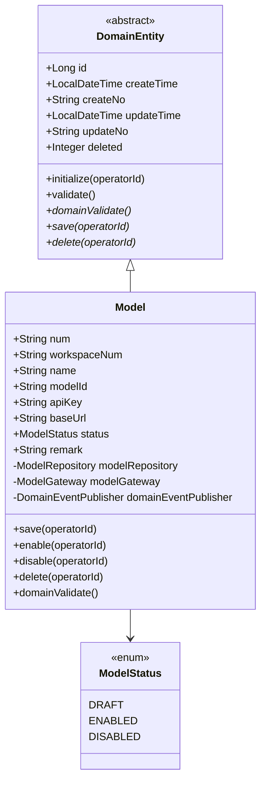

**字段表**

| 对象 | 属性 | 类型 | 说明 / 约束 | 关系 |
| --- | --- | --- | --- | --- |
| Model | id | Long | 主键，持久层自增（继承自 DomainEntity） | — |
| Model | num | String | 业务编号 `MDL+yyyyMMddHHmm+4位序号`，save 时为空则经 Gateway 生成 | 聚合标识 |
| Model | workspaceNum | String | 归属工作空间编号，Factory create 时由应用层传入 | — |
| Model | name | String | 模型名称，必填，≤128，**同空间内唯一** | — |
| Model | modelId | String | 用户填写的模型标识，必填，≤128，**同空间内唯一**，建议英文/数字/中划线/点/下划线 | — |
| Model | apiKey | String | 模型 API Key**明文**（领域内只持有明文；密文转换在 infra Repository ↔ Gateway 完成），必填 | — |
| Model | baseUrl | String | 模型服务端点，必填，须 http(s) 开头 | — |
| Model | status | ModelStatus | DRAFT / ENABLED / DISABLED，save 兜底 DRAFT | — |
| Model | remark | String | 备注，选填，≤500 | — |
| Model | createNo/updateNo/createTime/updateTime/deleted | — | 继承自 DomainEntity（软删标记仅在 Entity / DB，**不**在聚合暴露业务语义） | — |

> **强规约符合性**：聚合根具备 id / num / createNo / updateNo（继承）；持有 `ModelRepository` / `ModelGateway` / `DomainEventPublisher` 三类协作依赖（`transient`）；具备 `save` / `delete` 领域动作；所有领域动作带 `operatorId`；`deleted` 软删标记由基类承载、仅 infra/DB 使用，不在 `Model` 业务字段中体现。

#### 4.2.2 领域动作

| 聚合/实体 | 领域动作 | 职责 | 前置条件 | 后置条件/规则 | 领域事件 |
| --- | --- | --- | --- | --- | --- |
| Model | save(operatorId) | 新增 / 编辑 upsert | 无状态前置（新增兜底 DRAFT；编辑保持原 status） | 审计初始化 + num 兜底生成 + 全字段校验 + 持久化 | MODEL_SAVED |
| Model | enable(operatorId) | 启用：DRAFT/DISABLED → ENABLED | status ∈ {DRAFT, DISABLED} | status=ENABLED；非法态抛 8003 | MODEL_ENABLED |
| Model | disable(operatorId) | 禁用：ENABLED → DISABLED | status == ENABLED | status=DISABLED；非法态抛 8003 | MODEL_DISABLED |
| Model | delete(operatorId) | 软删：仅 DRAFT | status == DRAFT | deleted=1（infra 软删）；非法态抛 8003 | MODEL_DELETED |

> 业务码段：**8xxx 模型域**（8001 字段非法 / 8002 唯一冲突由应用层 BizCode.CONFLICT 兜底 / 8003 状态非法）。

**时序图 — save（新增 / 编辑共用）**

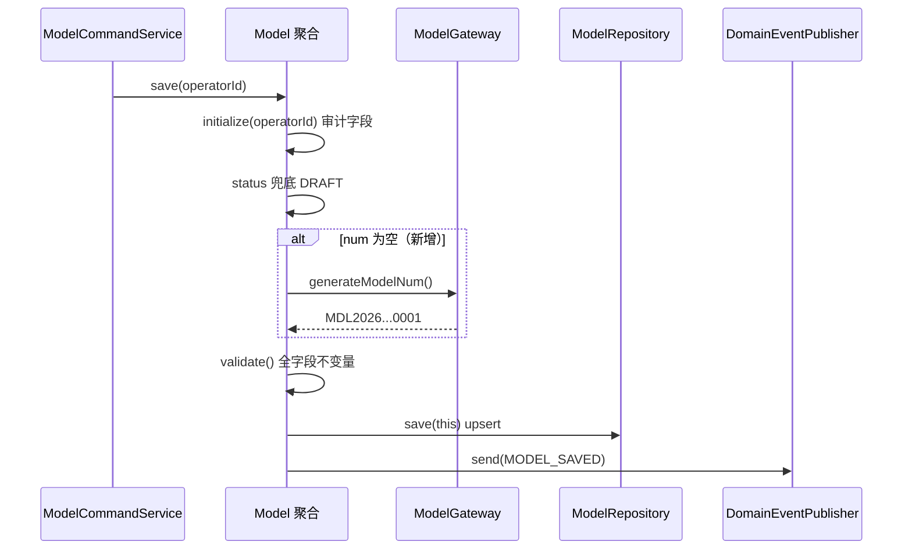

**时序图 — enable**

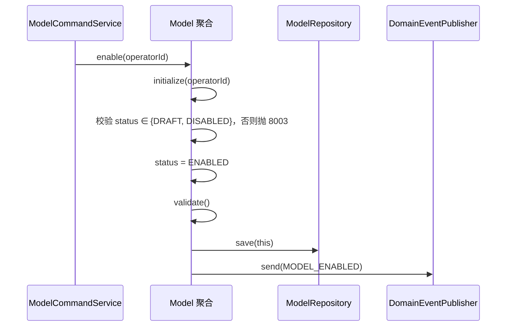

**时序图 — disable**

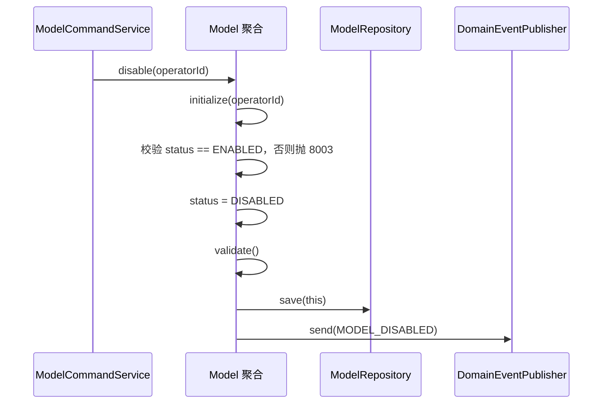

**时序图 — delete（软删，仅草稿）**

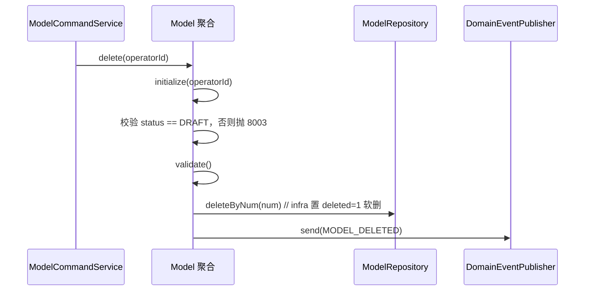

#### 4.2.3 领域规则

| 聚合/对象 | 规则类型 | 规则描述 | 违反时表达 |
| --- | --- | --- | --- |
| Model | 必填不变量 | name / modelId / apiKey / baseUrl / status 非空 | BusinessException(8001) |
| Model | 长度约束 | name ≤128、modelId ≤128、remark ≤500 | BusinessException(8001) |
| Model | 格式约束 | baseUrl 须以 `http://` 或 `https://` 开头 | BusinessException(8001) |
| Model | 状态流转 | enable 仅 DRAFT/DISABLED；disable 仅 ENABLED；delete 仅 DRAFT | BusinessException(8003) |
| Model | 唯一性（空间内） | (workspaceNum, modelId)、(workspaceNum, name) 唯一 | 应用层预检 BizCode.CONFLICT + DB 唯一索引兜底 |

> 唯一性为跨记录约束，不属聚合内不变量：由 `ModelCommandService` 调 `ModelQueryService` 预检 + DB 双唯一索引兜底（见 §6.2）。

#### 4.2.4 领域工厂

`ModelFactory` 接口（domain 定义，infra 实现），仅两个方法：

| Factory | 方法 | 入参 | 返回 | 职责 | 依赖 |
| --- | --- | --- | --- | --- | --- |
| ModelFactory | create(...) | workspaceNum, name, modelId, apiKey, baseUrl, remark | Model（未落库、已装配依赖） | 用创建期用户可填字段构建新聚合；status/num/审计由 save 处理 | ModelRepository, ModelGateway, DomainEventPublisher |
| ModelFactory | createByNum(num) | num | Model（已装配依赖）/null | 经 Repository.findByNum 加载并 wire 三依赖 | ModelRepository, ModelGateway, DomainEventPublisher |

> **create 参数约束**：仅含用户可填字段（无 operatorId / status / num / 审计字段）。`createByNum` 内部走 `ModelRepository.findByNum(num)`。

**时序图 — createByNum**

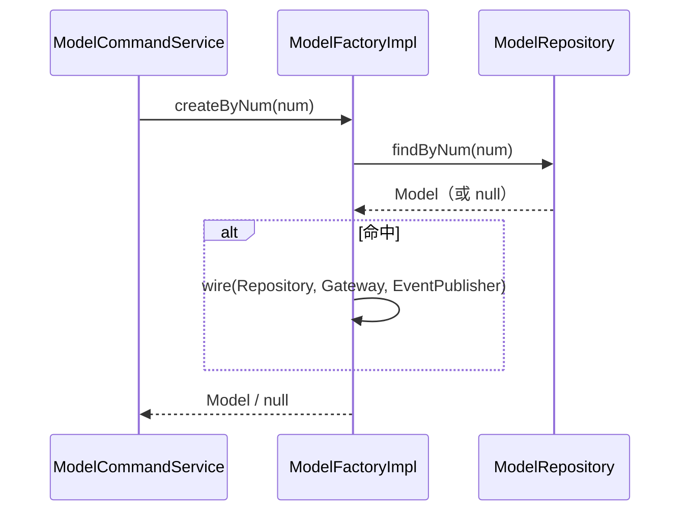

#### 4.2.5 领域网关

`ModelGateway` 接口（domain 定义，infra 实现）：

| Gateway | 方法 | 入参 | 返回 | 职责 | 外部依赖 | 失败策略 |
| --- | --- | --- | --- | --- | --- | --- |
| ModelGateway | generateModelNum() | — | String | 生成业务编号 `MDL+yyyyMMddHHmm+4位序号` | BizNumGenerator | — |

> API Key 的加解密 / 掩码**不放 Gateway**：领域内 `Model.apiKey` 始终持有明文；密文 ↔ 明文转换由 `ModelRepositoryImpl` 在 Entity ↔ 领域对象映射时调用 `SecretCipher` 完成（持久化实现细节，符合 infra 职责）。Gateway 仅承担 num 生成，保持 domain 仅依赖 facade。

#### 4.2.6 领域事件

| 事件名 | 触发时机 | 载荷要点 | 可订阅方/用途 |
| --- | --- | --- | --- |
| MODEL_SAVED | save 成功 | num/workspaceNum/modelId/name/status/operatorId（**不含 apiKey**） | 本期无订阅者，审计一致性 |
| MODEL_ENABLED | enable 成功 | num/workspaceNum/status/operatorId | 同上 |
| MODEL_DISABLED | disable 成功 | num/workspaceNum/status/operatorId | 同上 |
| MODEL_DELETED | delete 成功 | num/workspaceNum/operatorId | 同上 |

> 事件载荷 `ModelDomainEventDTO` **严禁包含 apiKey / 密文**（防泄露）。

#### 4.2.7 模块自检（领域层后）

- [x] 六子节齐全；聚合具备基本属性 + 三协作依赖 + save/delete；Factory 仅 create/createByNum；Gateway 在 domain 定义 infra 实现；无软删标记业务字段；每个领域动作有时序图与 operatorId。

---

## 5. 基础设施层设计

| 类型 | 类名 | 包路径 | 职责 | 依赖 | 对应表/外部 | 新增/修改 |
| --- | --- | --- | --- | --- | --- | --- |
| Entity | ModelEntity | infra.model.entity | `@Data` 字段映射 `model` 表；含 `apiKeyCipher` / `apiKeyPrefix`，**无明文 apiKey 列** | — | model 表 | 新增 |
| Mapper | ModelMapper | infra.model.mapper | MyBatis-Plus `BaseMapper<ModelEntity>` | — | model 表 | 新增 |
| RepositoryImpl | ModelRepositoryImpl | infra.model.repository | 实现 `ModelRepository`：save / findByNum / deleteByNum；**Entity↔领域对象时调 SecretCipher 做 apiKey 明文↔密文 + 前缀**；仅注入本聚合 ModelMapper | ModelMapper, SecretCipher | model 表 | 新增 |
| FactoryImpl | ModelFactoryImpl | infra.model.factory | 实现 `ModelFactory`：create / createByNum；仅注入 ModelRepository（+ Gateway/EventPublisher 用于 wire） | ModelRepository, ModelGateway, DomainEventPublisher | — | 新增 |
| GatewayImpl | ModelGatewayImpl | infra.model.gateway | 实现 `ModelGateway.generateModelNum`，复用 BizNumGenerator（前缀 `MDL`） | BizNumGenerator | — | 新增 |
| common | DomainEventConstant | domain.common | 追加 `MODEL_SAVED/ENABLED/DISABLED/DELETED` 常量 | — | — | 修改 |
| common | LockKeyConstant | infra.common.constant | 追加 `MODEL_CREATE_LOCK_PREFIX` / `MODEL_COMMAND_LOCK_PREFIX` | — | — | 修改 |

**API Key 密文转换约定**（ModelRepositoryImpl 内，参照 Agent modelApiKey 处理）：
- **领域对象 → Entity（save）**：`entity.apiKeyCipher = secretCipher.encrypt(model.apiKey)`；`entity.apiKeyPrefix = secretCipher.maskPrefix(model.apiKey)`。
- **Entity → 领域对象（findByNum）**：`model.apiKey = secretCipher.decrypt(entity.apiKeyCipher)`（领域内持明文）。
- **编辑留空保留原 Key**：由应用层 `ModelCommandService.update` 判定——入参 apiKey 为空时，不覆盖聚合 apiKey（先 `createByNum` 拿到含原明文的聚合，跳过 set），从而 save 时密文不变。

> Spring Bean 注入统一 `@Resource`；RepositoryImpl 不作为 application 查询入口（查询走 QueryService 直连 Mapper）。

### 5.1 模块自检（基础设施层后）

- [x] Entity/Mapper/RepositoryImpl/FactoryImpl/GatewayImpl/common 齐全；RepositoryImpl 仅注入本聚合 Mapper + SecretCipher；与 §4 接口、§8 表结构一致；`@Resource` 注入；apiKey 明文不落库。

---

## 6. 应用层设计

### 6.1 业务模块划分

| 模块 | 对应领域 | Service | 职责 |
| --- | --- | --- | --- |
| model | model | ModelCommandService | 写：create/update/delete/enable/disable，Redisson 锁 + 唯一性预检 + 事务 |
| model | model | ModelQueryService | 读：分页列表 / 详情 / 唯一性预检（existsBy*），MyBatis-Plus，出参脱敏 |

### 6.2 模型（model）

#### 6.2.1 Service 方法清单

**ModelCommandService**（写，每方法 `@Transactional(rollbackFor=Exception.class)`，先锁后事务）

| 方法 | 签名 | 入参 | 出参 | 职责 |
| --- | --- | --- | --- | --- |
| createModel | `ModelDTO createModel(ModelCreateParamDTO, String operatorId)` | 创建参数 + 操作人 | ModelDTO（含 num，status=DRAFT，apiKey 脱敏） | 校验 + (ws,modelId)/(ws,name) 唯一预检 + Factory.create + save |
| updateModel | `void updateModel(ModelUpdateParamDTO, String operatorId)` | num + 待改字段 | — | createByNum + 名称/modelId 变更唯一预检 + **apiKey 留空保留原值** + save（状态不变） |
| deleteModel | `void deleteModel(String num, String operatorId)` | num | — | createByNum + delete（仅草稿，软删） |
| enableModel | `void enableModel(String num, String operatorId)` | num | — | createByNum + enable（DRAFT/DISABLED→ENABLED） |
| disableModel | `void disableModel(String num, String operatorId)` | num | — | createByNum + disable（ENABLED→DISABLED） |

**ModelQueryService**（读，MyBatis-Plus LambdaQueryWrapper，禁注入 Repository/Gateway）

| 方法 | 签名 | 出参 | 职责 |
| --- | --- | --- | --- |
| pageModels | `PageVO<ModelDTO> pageModels(ModelPageQueryParamDTO, String workspaceNum)` | 分页 ModelDTO（apiKey 脱敏，按 update_time DESC） | 按 ws + name/modelId/status/keyword 筛选 |
| getDetail | `ModelDetailDTO getDetail(String num, String workspaceNum)` | 详情 DTO（apiKey 脱敏） | 单条详情 + 跨空间访问拦截 |
| existsByWorkspaceAndModelId | `boolean existsByWorkspaceAndModelId(ws, modelId)` | boolean | modelId 唯一预检 |
| existsByWorkspaceAndName | `boolean existsByWorkspaceAndName(ws, name)` | boolean | name 唯一预检 |

> **脱敏口径**：DTO 出参 `apiKeyMasked = api_key_prefix + "****"`，QueryService 直接读 `api_key_prefix` 列拼接，**绝不解密、不返回密文**。详情 / 列表均如此。

#### 6.2.2 方法时序逻辑

**createModel**

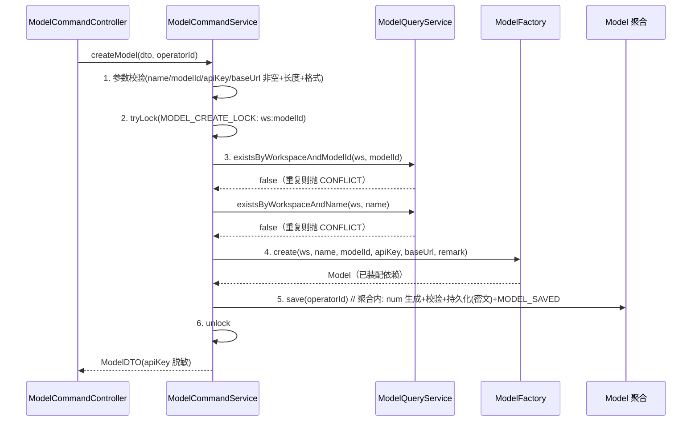

**updateModel（apiKey 留空保留原值 + 状态不变）**

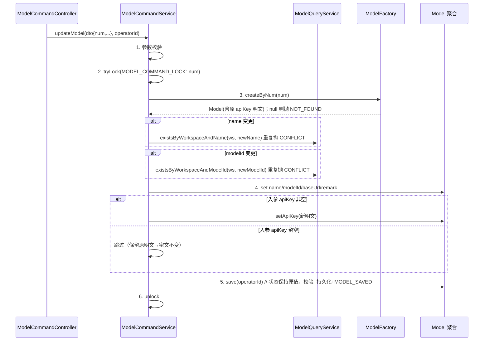

**enableModel / disableModel / deleteModel**（同构，仅领域动作不同）

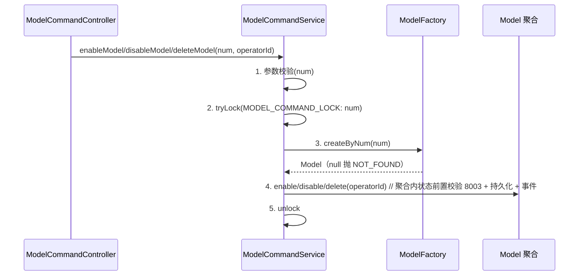

**pageModels（读）**

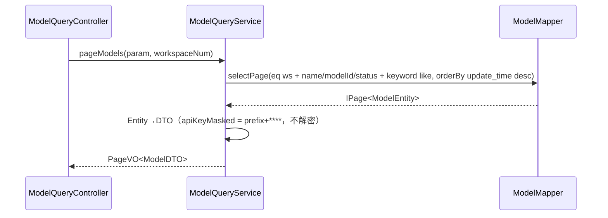

### 6.3 模块自检（应用层后）

- [x] Command/Query 分工清晰；入参 `*ParamDTO`、出参 DTO；**未注入 Repository/Gateway**，唯一性走 QueryService；CommandService 写操作有 Redisson 锁（先锁后事务）；每方法有时序图；`@Resource` 注入；apiKey 留空保留逻辑明确。

---

## 7. Adapter 层设计

### 7.1 业务模块划分

| 模块 | 类 | 类型 | 对应应用服务 |
| --- | --- | --- | --- |
| model | ModelCommandController | HTTP POST | ModelCommandService |
| model | ModelQueryController | HTTP GET | ModelQueryService |
| model | ModelVoAssembler | 装配器 | Param↔DTO、DTO→VO |

> 无定时任务、无事件监听入口（事件仅发不订阅）。

### 7.2 模型（model）

#### 7.2.1 Controller 接口清单

基础路径 `/api/v1/model`，操作人 `getCurrentUserId()`、空间 `getCurrentWorkspaceNum()` 由 `BaseController` 从上下文读取（参照 SandboxController）。

| 方法 | 路径 | 入参 | 出参 | 职责 |
| --- | --- | --- | --- | --- |
| POST | /create | ModelCreateParam | Result\<ModelVO\> | 新建（草稿态） |
| POST | /update | ModelUpdateParam | Result\<Void\> | 编辑（状态不变，apiKey 可留空） |
| POST | /delete | ModelOperateParam{num} | Result\<Void\> | 软删（仅草稿） |
| POST | /enable | ModelOperateParam{num} | Result\<Void\> | 启用 |
| POST | /disable | ModelOperateParam{num} | Result\<Void\> | 禁用 |
| GET | /page | ModelPageQueryParam | Result\<PageVO\<ModelVO\>\> | 分页列表 |
| GET | /detail | num（query） | Result\<ModelVO\> | 详情 |

**入参 / 出参 JSON**

`POST /create` 入参 `ModelCreateParam`：
```json
{ "workspaceNum": "WS-DEFAULT", "name": "GPT-4o", "modelId": "gpt-4o",
  "apiKey": "sk-real-secret", "baseUrl": "https://api.openai.com/v1", "remark": "OpenAI 官方端点" }
```
`POST /update` 入参 `ModelUpdateParam`（apiKey 留空=保留原值）：
```json
{ "num": "MDL2026061015300001", "name": "GPT-4o", "modelId": "gpt-4o",
  "apiKey": "", "baseUrl": "https://api.openai.com/v1", "remark": "更新备注" }
```
`POST /enable|disable|delete` 入参 `ModelOperateParam`：
```json
{ "num": "MDL2026061015300001" }
```
返回 `Result<ModelVO>`（apiKey 脱敏，绝不回明文/密文）：
```json
{ "code": 0, "message": "ok",
  "data": { "num": "MDL2026061015300001", "workspaceNum": "WS-DEFAULT",
    "name": "GPT-4o", "modelId": "gpt-4o", "apiKeyMasked": "sk-rea****",
    "baseUrl": "https://api.openai.com/v1", "status": "DRAFT", "remark": "OpenAI 官方端点",
    "createNo": "12345", "updateNo": "12345",
    "createTime": "2026-06-10 15:30:00.000", "updateTime": "2026-06-10 15:30:00.000" } }
```
`GET /page` 入参 `ModelPageQueryParam`：
```json
{ "pageNo": 1, "pageSize": 20, "name": "", "modelId": "", "status": "ENABLED", "keyword": "gpt" }
```

#### 7.2.2 接口时序逻辑

**POST /create**

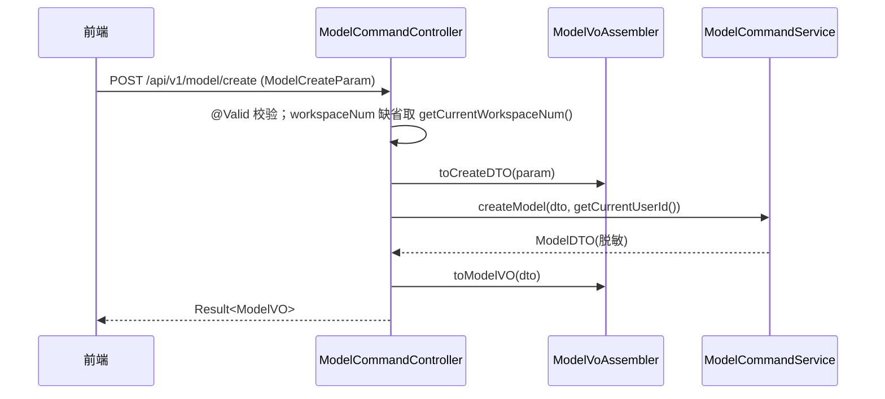

**POST /enable|disable|delete**（同构）

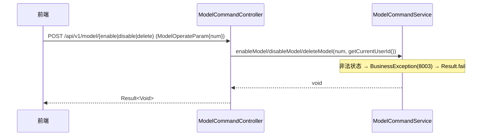

**GET /page**

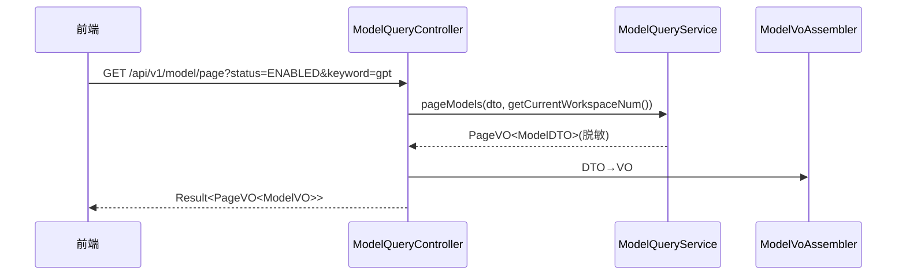

### 7.3 模块自检（Adapter 层后）

- [x] HTTP 仅 GET（查询）/ POST（增删改）；入参 `*Param`、出参 `*VO`；DTO→VO 转换在 Assembler；每接口有时序图；无定时任务 / 监听；非法状态走 8003 错误码；`@Resource`。

---

## 8. 数据库设计

### 8.1 表结构 model

| 字段 | 类型 | 必填 | 说明 | 索引 |
| --- | --- | --- | --- | --- |
| id | BIGINT AUTO_INCREMENT | 是 | 主键 | PK |
| num | VARCHAR(64) | 是 | 业务编号 `MDL+yyyyMMddHHmm+4位` | uq_model_num |
| workspace_num | VARCHAR(64) | 是 | 归属工作空间，默认 WS-DEFAULT | 联合索引 |
| name | VARCHAR(128) | 是 | 模型名称 | uq_model_ws_name |
| model_id | VARCHAR(128) | 是 | 用户填写模型标识 | uq_model_ws_model_id |
| api_key_cipher | VARCHAR(512) | 是 | API Key AES 密文（SecretCipher） | — |
| api_key_prefix | VARCHAR(32) | 否 | API Key 明文前缀（列表脱敏展示用） | — |
| base_url | VARCHAR(512) | 是 | 模型服务端点 | — |
| status | VARCHAR(32) | 是 | DRAFT/ENABLED/DISABLED，默认 DRAFT | idx_model_ws_status |
| remark | VARCHAR(500) | 否 | 备注 | — |
| create_no | VARCHAR(64) | 是 | 创建人工号 | — |
| update_no | VARCHAR(64) | 是 | 更新人工号 | — |
| deleted | TINYINT(1) | 是 | 软删 0/1，默认 0 | 参与唯一索引 |
| create_time | TIMESTAMP(3) | 是 | 创建时间（毫秒） | — |
| update_time | TIMESTAMP(3) | 是 | 更新时间（毫秒） | — |

> 表与聚合 `Model` 一一对应。**无明文 apiKey 列**；唯一索引带 `deleted` 维度，软删后可复用同名 / 同 modelId（与 sandbox 一致）。

### 8.2 DDL（V19__model_init.sql）

```sql
-- ====================================================================
-- 模型管理 - V19 初始化脚本
-- 对应技术方案：2026-06-10_模型管理-技术方案.md v1.0 §8
-- 包含：model 表（LLM 模型接入资源；三态生命周期 + API Key 加密）
-- 说明：不预置任何模型数据，无 DML 刷数。
-- ====================================================================
SET NAMES utf8mb4;
SET FOREIGN_KEY_CHECKS = 0;

DROP TABLE IF EXISTS `model`;
CREATE TABLE `model` (
  `id` BIGINT NOT NULL AUTO_INCREMENT COMMENT '主键',
  `num` VARCHAR(64) NOT NULL COMMENT '业务编号 MDL+yyyyMMddHHmm+4位序号',
  `workspace_num` VARCHAR(64) NOT NULL DEFAULT 'WS-DEFAULT' COMMENT '归属工作空间业务编号',
  `name` VARCHAR(128) NOT NULL COMMENT '模型名称',
  `model_id` VARCHAR(128) NOT NULL COMMENT '用户填写的模型标识（空间内唯一）',
  `api_key_cipher` VARCHAR(512) NOT NULL COMMENT 'API Key AES 密文（SecretCipher 加密，绝不存明文）',
  `api_key_prefix` VARCHAR(32) DEFAULT NULL COMMENT 'API Key 明文前缀，列表脱敏展示用（prefix+****）',
  `base_url` VARCHAR(512) NOT NULL COMMENT '模型服务端点 Base URL',
  `status` VARCHAR(32) NOT NULL DEFAULT 'DRAFT' COMMENT '状态：DRAFT/ENABLED/DISABLED',
  `remark` VARCHAR(500) DEFAULT NULL COMMENT '备注，≤500 字',
  `create_no` VARCHAR(64) NOT NULL COMMENT '创建人工号',
  `update_no` VARCHAR(64) NOT NULL COMMENT '更新人工号',
  `deleted` TINYINT(1) NOT NULL DEFAULT 0 COMMENT '逻辑删除 0=正常 1=删除',
  `create_time` TIMESTAMP(3) NOT NULL DEFAULT CURRENT_TIMESTAMP(3) COMMENT '创建时间',
  `update_time` TIMESTAMP(3) NOT NULL DEFAULT CURRENT_TIMESTAMP(3) ON UPDATE CURRENT_TIMESTAMP(3) COMMENT '更新时间',
  PRIMARY KEY (`id`),
  UNIQUE KEY `uq_model_num` (`num`),
  UNIQUE KEY `uq_model_ws_model_id` (`workspace_num`, `model_id`, `deleted`),
  UNIQUE KEY `uq_model_ws_name` (`workspace_num`, `name`, `deleted`),
  KEY `idx_model_ws_status` (`workspace_num`, `status`, `deleted`)
) ENGINE=InnoDB DEFAULT CHARSET=utf8mb4 COLLATE=utf8mb4_unicode_ci COMMENT='LLM 模型接入资源主表';

SET FOREIGN_KEY_CHECKS = 1;
```

### 8.3 刷数

无。本期不预置模型数据，不迁移 Agent 现有内联模型配置（共识 #7 不改造 Agent）。

### 8.4 模块自检（数据库后）

- [x] id BIGINT 自增；create_time/update_time 毫秒精度；num + (ws,model_id) + (ws,name) 三唯一索引；status 索引；无明文 key 列；与 §4 聚合、§5 Entity 一致。

---

## 9. 模块变更清单

| 层 | 变更 | 实现 Skill |
| --- | --- | --- |
| facade | 无变更（复用 DomainEntity/事件契约/Result/PageVO） | —（impl-facade-module 跳过） |
| client | 新增 ModelCreateParam/ModelUpdateParam/ModelOperateParam/ModelPageQueryParam（vo）、ModelVO（vo）、ModelCreateParamDTO/ModelUpdateParamDTO/ModelPageQueryParamDTO/ModelDTO/ModelDetailDTO（dto）、ModelConstants（constant） | impl-client-module |
| domain | 新增 Model 聚合、ModelStatus 枚举、ModelDomainEventDTO、ModelRepository/ModelFactory/ModelGateway 接口；DomainEventConstant 追加 MODEL_* | impl-domain-module |
| infra | 新增 ModelEntity/ModelMapper/ModelRepositoryImpl/ModelFactoryImpl/ModelGatewayImpl、V19__model_init.sql；LockKeyConstant 追加 MODEL_* | impl-infra-module |
| application | 新增 ModelCommandService/ModelQueryService | impl-application-module |
| adapter | 新增 ModelCommandController/ModelQueryController/ModelVoAssembler | impl-adapter-module |

### 9.1 前端（rd-agent-fe）

资产侧导航新增「模型管理」：列表页（ProTable + 状态标签 + 行操作按 status 动态展示，删除仅草稿可点）、新增/编辑 Drawer（API Key 显隐 + 编辑留空保留、底部固定按钮）、详情（apiKey 脱敏）。接口对接 §7.2.1 七个端点。沿用 Ant Design Pro，与 Tool/Sandbox 页面同构。

### 9.2 模块自检（变更清单后）

- [x] 每条变更对应唯一 impl-* skill，与各层设计一致。

---

## 10. 代码分支命名

**`feature-20260610-model-management`**

---

## 11. 实现顺序与依赖

`client → domain → infra（含 Flyway V19）→ application → adapter → 前端`

（facade 无变更跳过。先定 client 契约与 domain 聚合/接口，再 infra 落 Entity/Mapper/Impl + 建表 + 密文转换，再 application 编排，最后 adapter 暴露接口，前端对接。）

---

## 12. 接口与数据契约

见 §7.2.1（七个端点的路径、方法、Param/VO JSON）。核心 DTO/VO：`ModelDTO`（内部含明文 apiKey 仅用于 Command 创建返回前置脱敏）/ `ModelVO`（对外 `apiKeyMasked`）/ `ModelDetailDTO` / 四个 `*Param` / 四个 `*ParamDTO`。

---

## 13. 其他

- **配置项**：复用既有 `app.secret.cipher-key`（SecretCipher AES 密钥种子），无新增。
- **安全**（PRD §9）：apiKey AES 加密落库，列表/详情/日志/事件载荷全程脱敏（`prefix+****`），编辑回显脱敏串、留空保留原值；唯一性 DB 双唯一索引兜底；非法状态后端 8003 拦截。
- **审计**：create_no/update_no/create_time/update_time + MODEL_* 事件。
- **JavaDoc**：所有类/属性/方法须中文 JavaDoc（rd-agent-be 强约束）。
- **验证闭环**：`mvn -DskipTests clean package` + `mvn test`（ArchUnit 守卫）。
