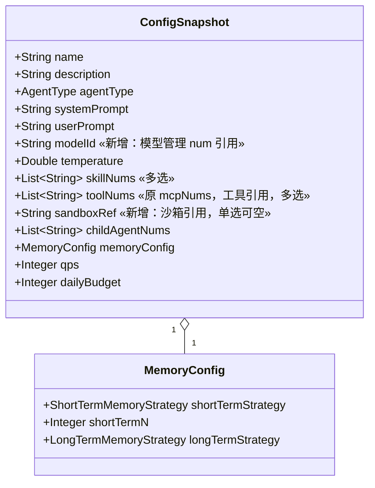
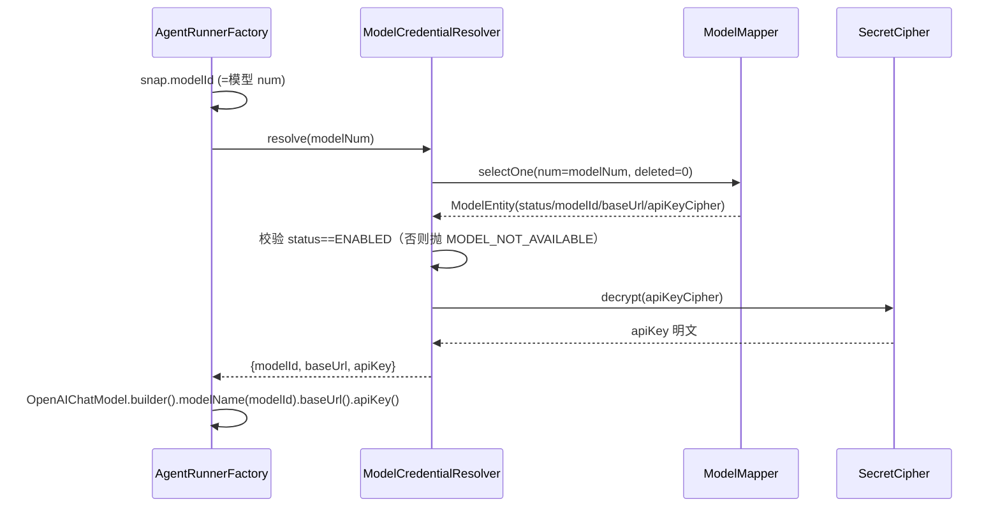
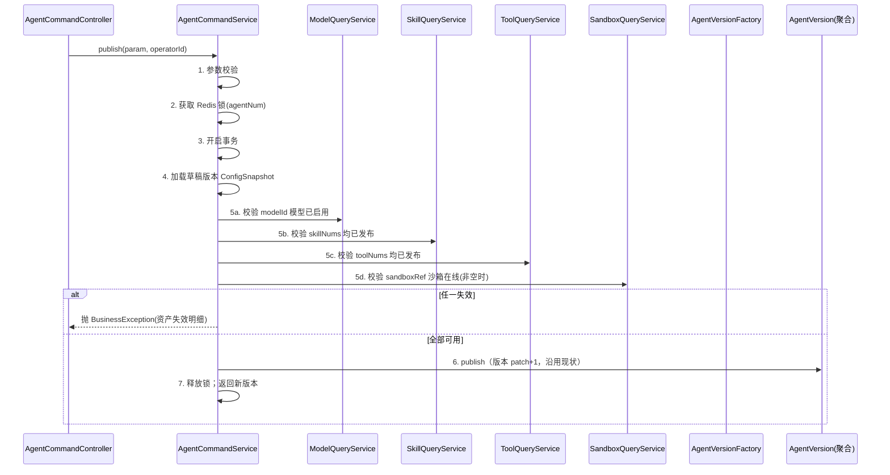
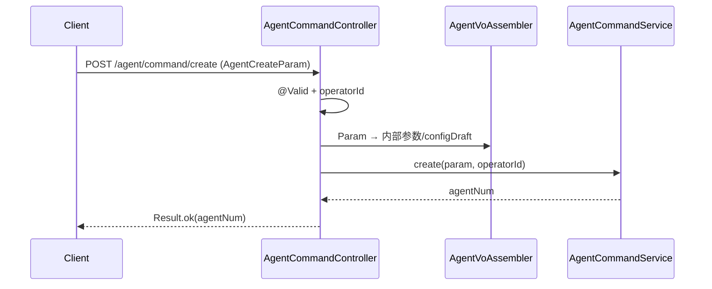

# Agent 配置优化技术方案（单页表单 + 资产化关联）

> 文档日期：2026-06-11　|　输入 PRD：[2026-06-11-Agent配置优化-PRD.md](../产品方案/2026-06-11-Agent配置优化-PRD.md)
> 基线：[Agent 管理 PRD v3.0](../产品方案/2026-05-11-Agent管理-PRD.md) + [Agent 优化 PRD v1.2](../产品方案/2026-06-04-Agent优化-PRD.md)
> 代码仓库：rd-agent-be（六层架构 Java）/ rd-agent-fe

---

## 0. 设计前共识（设计问答纪要）

| # | 议题 | 结论 |
| --- | --- | --- |
| 1 | 部署架构 | **不变，无需设计**：纯代码内改造（ConfigSnapshot 字段 + 表单 + 运行时装配），无新增应用/前端实例、无新增组件 |
| 2 | `ConfigSnapshot.modelId` 语义 | **存模型管理的业务编号 num**（如 `MDL...`）；不存用户填的 modelId 字符串——num 全局唯一稳定，模型改名/改 modelId 不影响引用 |
| 3 | 运行时 LLM 凭证 | **运行时实时解析**：`AgentRunnerFactory` 按 `modelId(=模型 num)` 查模型管理记录，取 modelId/apiKey(解密)/baseUrl 装配；Agent 不存模型凭证快照，始终用最新 |
| 4 | 存量清理范围 | **只删 CONFIG 模式 Agent** 及其版本/快照（含旧 model 手填字段数据）；A2A Agent 不动 |
| 5 | 工具引用字段 | `ConfigSnapshot.mcpNums` **重命名为 `toolNums`**（语义=工具引用，含 MCP/FC）；同步改 Entity/DTO/VO/Param |
| 6 | 资产下拉数据源 | **复用各模块现有列表接口**（模型 pageModels / Skill pageList / 工具 pageList / 沙箱 pageList）；前端按可用状态筛选，不新增后端接口 |
| 7 | Prompt 中心选择 | **纯前端取内容填入**：前端调 Prompt 中心列表 + 详情拿模板内容填入系统提示词框；Agent 不存 Prompt 引用关系，后端无需改 |
| 8 | 资产失效校验 | **发布时校验 + 运行时���底**：发布前校验引用资产可用（模型启用/工具发布/沙箱在线/Skill 发布），失效拦发布；运行时再校验一次兜底 |

> **命令/查询归属**：单页表单提交（create / editDraftVersion / publish）= 命令；资产下拉列表 = 各资产模块既有查询（不在本方案 Agent 侧新增）。

---

## 1. 目标与范围

### 1.1 目标

在现有 Agent 六层模块（`ink.garry.rd.agent.ws.*.agent` + `application.agentrunner`）之上，对**配置模式（CONFIG）Agent 的配置形态**做改造：

1. **单页分区表单**：新建/编辑由 5 步分步改为单页（前端改造为主；后端 create/editDraftVersion 入参已是整份配置，天然支持）。
2. **配置资产化**：`ConfigSnapshot` 删手填模型字段（`model`/`modelApiKey`/`modelBaseUrl`），改 `modelId`（模型管理 num 引用）；新增 `sandboxRef`（沙箱引用，单选）；`mcpNums`→`toolNums`（工具引用）；Skill 多选不变。
3. **运行时改造**：`AgentRunnerFactory` LLM 装配由「读快照手填字段」改为「按 modelId 实时解析模型管理记录」。
4. **存量清理**：删除存量 CONFIG Agent 数据，旧手填字段直接删，无迁移、无运行时回退。

### 1.2 范围

**本次做**：domain（ConfigSnapshot/MemoryConfig 调整，无新增聚合）、infra（AgentVersionEntity 快照 JSON 字段调整 + AgentRunnerFactory 运行时装配改造 + 模型/沙箱解析）、application（AgentCommandService 校验调整）、client（Param/DTO/VO 字段调整）、adapter（无新增端点，仅 DTO/VO 透传）、fe（单页表单 + 工具与上下文 Tab + Prompt 中心选择）、DB（V22：删存量 CONFIG Agent + 无表结构变更，快照为 JSON）。

**本次不做**：A2A 模式、状态机、版本化（patch+1）、秘钥管理、对外 API、Agent 类型扩展、KB；模型/Skill/工具/沙箱各模块自身能力。

---

## 2. 架构设计

### 2.1 应用架构

沿用六层，改动集中在 `agent` 领域的 ConfigSnapshot 值对象与 `agentrunner` 运行时装配；**不新增聚合、不新增 Repository/Factory**。代码结构：

| 层 | 领域 | 包 | 职责 |
| --- | --- | --- | --- |
| facade | — | `facade.domain` | 无变更 |
| client | agent | `client.agent` / `client.agent.dto` | `AgentCreateParam`/`AgentDTO`/`AgentVersionVO` 等：删 model 手填字段、加 modelId/sandboxRef、mcpNums→toolNums |
| domain | agent | `domain.agent.valueobject` | `ConfigSnapshot` 字段调整（删 3 手填、加 modelId/sandboxRef、改 toolNums）；`MemoryConfig` 不变 |
| infra | agent | `infra.agent.entity` | `AgentVersionEntity` 的 snapshot JSON 序列化字段随 ConfigSnapshot 调整（JSON 列，无 DDL 变更） |
| infra | agentrunner | `application.agentrunner.factory` | **`AgentRunnerFactory`**：LLM 装配改为按 modelId 解析模型管理；沙箱按 sandboxRef 解析（运行时装配，按现有包归属在 application.agentrunner） |
| application | agent | `application.agent` | `AgentCommandService`：create/editDraftVersion/publish 的字段校验与资产可用性校验调整；经各资产 QueryService 校验 |
| application | agentrunner | `application.agentrunner` | 运行时装配链路（AgentRunnerFactory/AgentRunnerService）模型解析改造 |
| adapter | agent | `adapter.agent` | Controller 无新增端点；入参/出参 DTO↔VO 字段透传调整 |

**关键调用关系**：

- **命令链**：AgentCommandController →（已有）AgentCommandService.create / editDraftVersion / publish → AgentFactory/AgentVersionFactory 构建 + 校验。资产可用性校验经**各资产模块 QueryService**（模型/Skill/工具/沙箱），不直接碰其 Repository。
- **运行时链**：AgentRunnerService → AgentRunnerFactory → 按 `ConfigSnapshot.modelId` 调模型解析（经模型 QueryService 或只读 Mapper 取 apiKey 解密）+ 按 `sandboxRef` 解析沙箱 + 按 `toolNums`/`skillNums` 装配工具/Skill。
- **同步边界**：全同步；无新增异步/MQ。

### 2.2 部署架构

**部署架构不变，无新增应用/前端部署实例，复用现有部署架构。** 本次为 rd-agent-be / rd-agent-fe 代码内改造，不引入新组件。

> **模块自检（架构）**：✅ 四列代码结构表；✅ 命令/查询归属明确（配置提交=命令，资产下拉=既有查询）；✅ 部署三选一=不变；✅ 无新增 adapter 入口。

---

## 3. Facade 层设计

**本次无 Facade 层变更。** 复用现有 `DomainEntity`/`DomainEventDTO`/`DomainEventPublisher`/`Result`/`BusinessException`。Agent 聚合、版本化、状态机均不变。

> **模块自检（Facade）**：✅ 已明确无变更。

---

## 4. 领域层设计

> **重要**：本次 Agent 领域**不新增聚合根/实体/Repository/Factory/Gateway**，仅调整 `agent` 领域下的**值对象 `ConfigSnapshot`**（与 `MemoryConfig` 保持不变）。因此领域层设计聚焦值对象变更，不重复 Agent 聚合既有结构。

### 4.1 业务层级划分

| 层级 | 领域 | 说明 |
| --- | --- | --- |
| 智能体域 | agent | Agent 聚合（不变）+ AgentVersion 实体（不变）+ **ConfigSnapshot 值对象（本次调整）** |

### 4.2 agent —— ConfigSnapshot 值对象调整

#### 4.2.1 领域模型

`ConfigSnapshot` 是 CONFIG 模式 Agent 的配置快照值对象（贫血模型，完整 Lombok，序列化进 AgentVersion 的 JSON 快照）。本次字段变更：



| 对象 | 类型 | 关键变更 |
| --- | --- | --- |
| `ConfigSnapshot` | 值对象 | **删除** `model` / `modelApiKey` / `modelBaseUrl`；**新增** `modelId`（String，模型管理 num）、`sandboxRef`（String，沙箱引用，可空）；**重命名** `mcpNums` → `toolNums`；其余字段不变 |
| `MemoryConfig` | 值对象 | 不变（短期/长期记忆策略） |

> 值对象无领域动作/工厂/网关/事件（贫血模型）；本节仅记录字段调整，下方 4.2.2~4.2.6 标注「不适用」。

#### 4.2.2 领域动作

**不适用**：ConfigSnapshot 为值对象，无领域动作。Agent 聚合的 create/publish/offline 等动作不变（详见基线方案）。

#### 4.2.3 领域规则

| 对象 | 规则类型 | 规则描述 | 违反时表达 |
| --- | --- | --- | --- |
| ConfigSnapshot | 必填 | CONFIG 发布时 `modelId` 必填（替代原 model/key/url 必填） | 校验在 application 发布流程（见 §6） |
| ConfigSnapshot | 引用 | `skillNums`/`toolNums` 为多选引用列表（可空集合）；`sandboxRef` 单选可空 | — |

#### 4.2.4 领域工厂

**不适用**（无新增聚合）。Agent / AgentVersion 既有 Factory 不变；`AgentVersionFactory` 构建 ConfigSnapshot 时按新字段组装（infra 实现层调整，见 §5）。

#### 4.2.5 领域网关

**不适用**（Agent 领域本次不新增 Gateway）。模型/沙箱解析在运行时装配层（infra/application.agentrunner）通过**各资产模块的查询能力**完成，不在 Agent 领域定义新 Gateway。

#### 4.2.6 领域事件

**不适用**：ConfigSnapshot 调整不引入新事件；Agent 既有事件（AGENT_VERSION_PUBLISHED 等）不变。

> **模块自检（领域）**：✅ 本次仅值对象字段调整，已明确无新增聚合/动作/工厂/网关/事件；✅ 软删除标记不涉及；✅ ConfigSnapshot 字段变更与 PRD 一致（modelId/sandboxRef/toolNums）。

---

## 5. 基础设施层设计

> 无新增 Entity/Mapper/Repository/Factory。改动集中在：① AgentVersion 快照 JSON 序列化随 ConfigSnapshot 字段调整（JSON 列，无 DDL）；② 运行时 LLM 装配按 modelId 解析模型管理（新增一个「模型运行时凭证解析」能力）；③ 沙箱按 sandboxRef 解析。

### 5.1 agent 领域 infra

| 类型 | 类名 | 包路径 | 职责 | 依赖 | 新增/修改 |
| --- | --- | --- | --- | --- | --- |
| Entity | `AgentVersionEntity` | `infra.agent.entity` | snapshot 列（JSON）随 ConfigSnapshot 序列化字段调整：去 model/modelApiKey/modelBaseUrl、加 modelId/sandboxRef、mcpNums→toolNums；**JSON 列无 DDL 变更** | — | 修改（仅序列化映射，若有显式字段拷贝则同步） |
| common | `SecretCipher` | `infra.common.util` | 复用（解密模型 apiKey），不改 | — | 复用 |

### 5.2 agentrunner 运行时装配（核心改造）

| 类型 | 类名 | 包路径 | 职责 | 依赖 | 新增/修改 |
| --- | --- | --- | --- | --- | --- |
| 运行时装配 | `AgentRunnerFactory` | `application.agentrunner.factory` | **LLM 装配改造**：原直接读 `snapshot.model/modelBaseUrl/modelApiKey`，改为按 `snapshot.modelId(=模型 num)` 经「模型运行时凭证解析」取 modelId/baseUrl/apiKey(解密) 装配 `OpenAIChatModel`；工具装配 `toolNums`（含 MCP/FC）；沙箱按 `sandboxRef` 解析（无则用默认/不挂） | 新增「模型凭证解析」+ 沙箱解析 | 修改 |
| 模型凭证解析 | `ModelCredentialResolver`（新增，infra/common 或 model 模块 infra） | `infra.model.gateway` 或 `infra.common` | 按模型 num 查 ModelEntity（须 status=ENABLED）→ 用 SecretCipher 解密 apiKeyCipher → 返回运行时凭证（modelId/baseUrl/apiKey 明文）；模型不存在/未启用抛 `MODEL_NOT_AVAILABLE` | ModelMapper + SecretCipher | 新增 |

**模型运行时凭证解析设计**：

- 运行时需要**明文 apiKey**，而模型管理的 `ModelQueryService` 只返回脱敏（绝不解密）——因此**不能复用脱敏查��**，需新增解析能力。
- 放置：归属模型模块的 infra（`infra.model.gateway.ModelCredentialResolver` 或作为 model 领域的运行时 Gateway 实现），仅注入 `ModelMapper` + `SecretCipher`，符合 infra 注入约束。
- 校验：`status != ENABLED` 或记录不存在 → 抛业务异常（运行时兜底，对应发布时校验的二次保险）。



> **模块自检（infra）**：✅ 无新增表；✅ AgentVersionEntity 仅 JSON 序列化调整；✅ ModelCredentialResolver 仅注入 Mapper + SecretCipher（合注入约束）；✅ 运行时凭证解析不复用脱敏查询，单独取密文解密；✅ `@Resource` 注入。

---

## 6. 应用层设计

### 6.1 业务模块划分

| 模块 | Service | 对应领域 |
| --- | --- | --- |
| agent 写 | `AgentCommandService` | agent（create / editDraftVersion / publish 字段与校验调整） |
| agentrunner | `AgentRunnerService` / `AgentRunnerFactory` | 运行时装配（模型解析改造，见 §5.2） |

### 6.2 agent 写（AgentCommandService）

#### 6.2.1 Service 方法清单

| 方法 | 签名（不变） | 本次调整 |
| --- | --- | --- |
| `create` | `String create(AgentCreateParam, operatorId)` | 入参字段调整（去 model 手填、加 modelId/sandboxRef、mcpNums→toolNums）；组装 ConfigSnapshot 用新字段 |
| `editDraftVersion` | `void editDraftVersion(versionId, Map<String,Object> configDraft, operatorId)` | configDraft 承载单页表单整份配置（新字段）；反序列化为 ConfigSnapshot 时用新字段 |
| `publish` | `String publish(PublishParam, operatorId)` | **新增资产可用性校验**：发布前校验 modelId 对应模型已启用、toolNums 对应工具已发布、sandboxRef 对应沙箱在线、skillNums 对应 Skill 已发布；任一失效抛业务异常 |

> 单页表单**不改变** create/editDraftVersion/publish 的方法签名——它们本就接收整份配置（AgentCreateParam / configDraft Map）。「去分步」是前端改造；后端只需字段调整 + 发布校验增强。

#### 6.2.2 方法时序逻辑

`publish`（新增资产可用性校验）：



`create` / `editDraftVersion`：沿用现状步骤（锁 + 事务 + Factory 构建），仅 ConfigSnapshot 字段映射调整，不重复绘制。

> **CQRS 约束**：资产可用性校验经**各资产模块 QueryService**（ModelQueryService/SkillQueryService/ToolQueryService/SandboxQueryService），不直接调其 Repository。

> **模块自检（应用）**：✅ 方法签名不变，仅字段 + 发布校验调整；✅ 校验经各资产 QueryService（不碰 Repository/Gateway）；✅ publish 写操作有 Redis 锁 + 事务在锁内；✅ `@Resource` 注入。

---

## 7. Adapter 层设计

### 7.1 业务模块划分

| 模块 | 类 | 类型 | 本次调整 |
| --- | --- | --- | --- |
| agent 命令 | `AgentCommandController` | HTTP POST | **无新增端点**；create/editDraftVersion/publish 入参 Param 字段透传调整 |
| agent 查询 | `AgentQueryController` | HTTP GET | detail/version 出参 VO 字段透传调整（去 model 手填、加 modelId/sandboxRef、toolNums） |

> 资产下拉列表**复用各资产模块既有 Controller**（模型/Skill/工具/沙箱的 list 查询），Agent adapter 不新增端点。

#### 7.2 接口字段调整（无新增路径）

| 接口 | 方法/路径（不变） | 入参/出参字段调整 |
| --- | --- | --- |
| 创建 | POST `/api/v1/agent/command/create` | `AgentCreateParam`：去 model/modelApiKey/modelBaseUrl，加 modelId/sandboxRef，mcpNums→toolNums |
| 编辑草稿 | POST `/api/v1/agent/command/editDraftVersion` | configDraft（JSON）字段同上 |
| 发布 | POST `/api/v1/agent/command/publish` | 失效资产校验失败返回业务错误码 + 明细 |
| 详情 | GET `/api/v1/agent/query/detail` | `AgentDetailVO.currentSnapshot`：字段同步；不再返回 modelApiKey（原硬编码 ***，现直接无此字段） |

`AgentCreateParam` JSON（配置模式，调整后）：

```json
{
  "name": "客服助手", "description": "...", "agentType": "NORMAL",
  "systemPrompt": "...", "userPrompt": "...",
  "modelId": "MDL2026061012345",
  "temperature": 0.7,
  "skillNums": ["SKL...","SKL..."],
  "toolNums": ["TOOL...","TOOL..."],
  "sandboxRef": "SBX...",
  "memoryConfig": { "shortTermStrategy": "LAST_N_TURNS", "shortTermN": 10, "longTermStrategy": "NONE" },
  "qps": 10, "dailyBudget": 100
}
```

`create` 时序：



> **模块自检（adapter）**：✅ HTTP 仅 GET/POST；✅ 入参 `*Param`、出参 `Result<*VO>`；✅ 无新增端点（资产下拉复用各模块）；✅ `@Resource` 注入。

---

## 8. 数据库设计

### 8.1 表���构

**无表结构变更**：Agent 配置存于 `agent_version.snapshot`（JSON 列），ConfigSnapshot 字段调整只影响 JSON 内容，不改列。`agent` / `agent_version` 表结构不变。

### 8.2 DDL

无 CREATE / ALTER。

### 8.3 刷数 / 数据清理（V22）

**只清理存量 CONFIG 模式 Agent**（PRD 决策：直接删、不迁移）。删除范围：CONFIG 模式 Agent 主表行 + 其 agent_version 行（含旧 model 手填字段的 snapshot）；A2A Agent 不动。

```sql
-- ====================================================================
-- Agent 配置优化 - V22 存量清理（只删 CONFIG 模式 Agent，A2A 不动）
-- 对应技术方案：2026-06-11_Agent配置优化-技术方案.md §8.3
-- 说明：PRD 决策——存量配置模式 Agent 直接删除，不迁移、手填模型字段不保留。
-- 注意：执行前确认环境；删除不可逆。按外键/引用顺序先删子表(版本)再删主表。
-- ====================================================================
SET NAMES utf8mb4;

-- 1) 删除 CONFIG 模式 Agent 的版本行
DELETE FROM agent_version
WHERE agent_num IN (SELECT num FROM agent WHERE creation_mode = 'CONFIG');

-- 2) 删除 CONFIG 模式 Agent 的对外秘钥（若有，AgentApiKey 归属 Agent 聚合）
DELETE FROM agent_api_key
WHERE agent_num IN (SELECT num FROM agent WHERE creation_mode = 'CONFIG');

-- 3) 删除 CONFIG 模式 Agent 主表行
DELETE FROM agent WHERE creation_mode = 'CONFIG';
```

> 上述表名/列名（`agent` / `agent_version` / `agent_api_key` / `creation_mode` / `agent_num`）以实际 schema 为准，落地前由 impl 阶段核对；子查询删除如遇 MySQL「不能在删除时查询同表」限制，改用临时表或先查出 num 列表再删。snapshot 为 JSON 列，旧手填字段随版本行删除自然清除。

> **模块自检（数据库）**：✅ 无表结构变更（JSON 列承载）；✅ 含存量清理 DML（按顺序先删版本/秘钥再删主表）；✅ 与 PRD「只删 CONFIG、不迁移」一致。

---

## 9. 模块变更清单

| 层 | 变更 | 实现 Skill |
| --- | --- | --- |
| facade | 无变更 | —（impl-facade-module 不涉及） |
| client | `AgentCreateParam`/`AgentDTO`/`AgentVersionVO`/`AgentVersionDTO` 等：去 model/modelApiKey/modelBaseUrl，加 modelId/sandboxRef，mcpNums→toolNums | impl-client-module |
| domain | `ConfigSnapshot` 值对象：删 3 手填字段 + 加 modelId/sandboxRef + mcpNums→toolNums；MemoryConfig 不变；无新增聚合 | impl-domain-module |
| infra | `AgentVersionEntity` snapshot 序列化字段同步；新增 `ModelCredentialResolver`（按 num 解密取模型凭证）；`AgentRunnerFactory` LLM 装配改 modelId 解析 + 沙箱 sandboxRef 解析；V22 清理脚本 | impl-infra-module |
| application | `AgentCommandService` create/editDraftVersion 字段映射 + publish 资产可用性校验（经各资产 QueryService）；`AgentRunnerService` 运行时模型解析链路 | impl-application-module |
| adapter | `AgentCommandController`/`AgentQueryController` 入参/出参字段透传调整（无新增端点）；`AgentVoAssembler` 字段映射 | impl-adapter-module |
| fe | 单页分区表单（去 Steps）+「工具与上下文」横向 Tab + 系统提示词从 Prompt 中心选择 + 4 资产下拉（按可用状态）+ sticky footer | —（前端，不走 impl-*-module） |

> **模块自检（变更清单）**：✅ 每条对应唯一实现 Skill（fe 除外）；✅ 与各层设计一致。

---

## 10. 代码分支命名

- 后端：`feature-20260611-agent-config-form-and-asset-ref`
- 前端：`feature-20260611-agent-config-form-and-asset-ref`

---

## 11. 实现顺序与依赖

1. **client**（impl-client-module）：Param/DTO/VO 字段调整 —— 契约先行。
2. **domain**（impl-domain-module）：ConfigSnapshot 字段调整。
3. **infra**（impl-infra-module）：AgentVersionEntity 序列化同步 + ModelCredentialResolver + AgentRunnerFactory 装配改造 + V22 清理脚本。
4. **application**（impl-application-module）：AgentCommandService 字段映射 + publish 资产校验。
5. **adapter**（impl-adapter-module）：Controller/Assembler 字段透传。
6. **fe**：单页表单 + 工具与上下文 Tab + Prompt 中心选择 + 资产下拉。
7. **DB**：执行 V22 存量清理（部署时）。

依赖方向严格 facade→client→domain→infra→application→adapter，无逆依赖。

---

## 12. 接口与数据契约（关键 API 汇总）

| 接口 | 方法/路径 | 字段调整 |
| --- | --- | --- |
| 创建 Agent | POST `/api/v1/agent/command/create` | AgentCreateParam：modelId/sandboxRef/toolNums（去 model 手填） |
| 编辑草稿 | POST `/api/v1/agent/command/editDraftVersion` | configDraft 同上 |
| 发布 | POST `/api/v1/agent/command/publish` | 资产失效校验失败 → 业务错误 + 明细 |
| 详情 | GET `/api/v1/agent/query/detail` | currentSnapshot 字段同步 |
| 资产下拉 | 各资产模块既有 list 接口 | 复用，无新增 |

---

## 13. 其他

- **运行时模型解析**：核心改造点——`AgentRunnerFactory` 不再读快照手填凭证，按 modelId(=模型 num) 经 ModelCredentialResolver 实���取解密凭证；模型禁用/删除时运行时报错（与发布时校验互为兜底）。
- **OpenAiChatModelFactory/ConfigAgentBuilder**：现状整文件注释（停用），本次活代码路径在 `AgentRunnerFactory`（agentscope OpenAIChatModel）；改造以活路径为准，注释文件不动或顺带清理。
- **BizCode**：新增 `MODEL_NOT_AVAILABLE`（模型未启用/不存在）等资产失效码（client 层）。
- **Prompt 中心选择**：纯前端（调 Prompt 列表 + 详情取模板内容填入），后端无改动、不存 Prompt 引用。
- **沙箱单选**：sandboxRef 单选可空；运行时 SandboxTool 按 sandboxRef 解析具体沙箱（现状为默认编排，需对齐到按引用选择）。

---

## 附：与 PRD 的覆盖核对

| PRD 功能点 | 技术方案落点 |
| --- | --- |
| §7.1 单页表单去分步 | 前端改造（§9 fe）；后端方法签名不变 |
| §7.3 关联模型（手填→引用） | ConfigSnapshot modelId + ModelCredentialResolver 运行时解析（§4.2/§5.2） |
| §7.4 Skill 多选 | skillNums（不变） |
| §7.5 工具配置 | mcpNums→toolNums（§4.2/§9） |
| §7.6 沙箱配置（新增） | sandboxRef + 运行时沙箱解析（§4.2/§5.2） |
| §7.6A 工具与上下文 Tab | 前端改造（§9 fe） |
| §7.2 Prompt 中心选择 | 纯前端（§13） |
| §10 存量直接删除 | V22 清理脚本（§8.3） |

