# 权限管理 — 技术方案

> 文档日期：2026-06-15　|　版本：v1.3（2026-06-18 新增普通用户内置角色 + 首登自动分配）
> 上游 PRD：[2026-06-15 权限管理 PRD](../../../产品方案/2026-06-15-权限管理-PRD.md)
> 目标仓库：[rd-agent-be](../../../代码仓库/rd-agent-be)（六层 Maven 多模块，Java 17 + Spring Boot 3.5）
> BASE_PACKAGE：`ink.garry.rd.agent.ws`
> 兄弟方案：[工作空间管理](./2026-06-03_工作空间管理-技术方案.md) · [GCAC-SSO 接入](./2026-05-21_GCAC-SSO接入-完整对接方案.md)
> 代码分支：**`feature-20260615-rbac-authz`**

---

## 1. 目标与范围

### 1.1 设计前 16 问共识

| # | 问题 | 共识 |
| --- | --- | --- |
| 1 | 部署架构 | **不变**，无新增应用/前端实例，复用现有部署架构 |
| 2 | 鉴权框架 | **不引入** Spring Security / Sa-Token，沿用自研 `JwtAuthenticationFilter + RouteRoleMapping`，仅扩 `buildRoleMappings()` + 注入权限解析能力 |
| 3 | 权限缓存 | **Redis 共享缓存**：`authz:perm:{userId}:{workspaceNum}` → `Set<String>`；TTL 30 分钟；本期不接 evict 消息，靠 TTL 自然过期 |
| 4 | platform_admin 初始化 | **Flyway 迁移脚本 + 配置项 `app.auth.platform-admins`**（List<String> 工号清单，启动时把这些工号绑定 `RL-PLATFORM-ADMIN`）；**v1.3 新增**：普通用户内置角色 `RL-PLATFORM-USER` 由 Flyway V32 写入，首次 GCAC 登录时 `GcacLoginService.handleCallback` 检测到无平台角色绑定则自动分配 |
| 5 | JWT Claims | **不预烘权限集合**，运行时查 DB+Redis；JWT 仅含 account；与 PRD §12「即时生效」一致 |
| 6 | 工作空间上下文 | **复用现有 `WorkspaceContextInterceptor + WorkspaceContextHolder`**（工作空间管理方案已落地） |
| 7 | 权限领域归属 | **合入现有 `auth` 领域**，新增子包 `auth.role` / `auth.permission` / `auth.roleassignment`，与 `auth.session` / `auth.token` 同级 |
| 8 | auth 内部聚合切分 | **Role + UserRoleBinding 两聚合根**（v1.1：UserRoleBinding 按 (workspaceNum, userId) 细聚合，每个 user × 上下文 = 一套角色）；Permission 作为只读元数据（不建聚合根，启动加载到内存） |
| 9 | 空间内置角色 num | **全平台共享一份**：`RL-SPACE-ADMIN` 与 `RL-SPACE-MEMBER` 作为模板角色入库（`scope=SPACE, workspace_num=NULL, builtin=true`），不为每个空间复制一份；user_workspace_role 通过 `workspace_num + user_id + role_num` 三元组隔离 |
| 10 | 空间创建后自动绑定 | **同事务内在 `WorkspaceCommandService.create` 末尾调用 `AuthzCommandService.bindCreatorAsSpaceAdmin`**，失败回滚 |
 | 11 | 路径→权限映射源 | **V31 改造（DB 驱动）**：路径→权限映射迁移至 `route_permission` 表，`RouteRoleMapping` 每次请求直接查库，无内存缓存，保证变更实时生效；`PermissionCode` 常量类已删除；`permission` 表新增 `scope` 列替代 `PLATFORM_SCOPE_DOMAINS` 硬编码集合；启动时 `PermissionRouteValidator` fail-fast 校验 `route_permission` 引用完整性 |
| 12 | 静态角色迁移 | **Flyway 迁移**：`itadmin/admin` → `platform_admin`；`editor/user` → 默认空间（`WS-DEFAULT`）的 `space_member` |
| 13 | /me 与权限接口 | **/me 返回 `permissions: string[]`**；`/api/v1/permissions`、`/api/v1/roles/list` 全量不分页（45 条 / 空间内 ≤50 条） |
| 14 | 权限合集逻辑 | **当前空间角色并集 + 用户默认权限**（`workspace:create` 全用户默认）；platform_admin 直接放行 |
| 15 | 缓存失效 | **仅发领域事件**（`ROLE_UPDATED` / `ROLE_DELETED` / `USER_ROLE_BOUND` / `USER_ROLE_UNBOUND`），本期不接 evict listener，TTL 30 分钟兜底；S3 视情况追加 |
| 16 | 表命名 | **按 PRD §10**：`role` / `permission` / `role_permission` / `user_workspace_role`，不加领域前缀 |

### 1.2 业务目标

- 把所有平台操作权限化：8 大资源域 45 个权限点全部入库；
- 落地两级角色：平台级（`RL-PLATFORM-ADMIN` 全权限 + **`RL-PLATFORM-USER` 普通用户，仅含 workspace 域权限**）+ 空间级（内置 2 个 + 自定义 N 个）；
- **首次 GCAC 登录自动分配 `RL-PLATFORM-USER`**，无需管理员手动操作；
- 后端 API 入口处自动按路径→权限映射拦截，无权返回结构化 403；
- 前端可拿到 `permissions: string[]` 做菜单/按钮 v-if；
- 任何登录用户可创建空间，创建后自动成为该空间的 `space_admin`；
- 兼容现有 `app.auth.role-assignments` 静态配置（降级兜底）。

### 1.3 范围

| 涉及 | 不涉及 |
| --- | --- |
| 新领域子包 `auth.role` / `auth.permission` / `auth.roleassignment` | 平台级自定义角色（仅 platform_admin 一个） |
| `Role` / `UserRoleBinding` 两聚合根 + `Permission` 元数据 | 资源级 ACL（某 Agent 仅某用户可见） |
| `RouteRoleMapping` 路径→权限映射表填充 | 审批流 / 二次确认 |
| `JwtAuthenticationFilter` 加 `PermissionResolver` 注入 | 与 GCAC 部门树映射 |
| `MeController` 扩展 `permissions: string[]` | 角色模板市场 / 跨平台角色共享 |
| `WorkspaceCommandService.create` 末尾自动绑定创建者为 space_admin | 操作审计 UI（已有审计基础设施） |
| Flyway V12 建表 + 内置数据 + 静态角色迁移 | 物理删除（坚决软删） |
| 自定义空间角色 CRUD + 删除时绑定用户拦截 | |
| Redis 权限缓存 `authz:perm:{userId}:{workspaceNum}`（TTL 30min） | |

### 1.4 六层依赖回顾

`adapter → application → {client, domain, infra}`；`infra → domain → facade`。本方案不破坏既有依赖方向。详见 [ARCHITECTURE.md §3](../../ARCHITECTURE.md)。

---

## 2. 架构设计

### 2.1 应用架构

#### 2.1.1 代码结构

| 层 | 领域 | 包 | 职责 |
| --- | --- | --- | --- |
| facade | auth | `ink.garry.rd.agent.ws.facade.auth.permission` | ~~`PermissionCode`~~ **V31 已删除**；权限码由 `permission` 表（DB 唯一真相源）管理，Java 层不再维护静态常量 |
| facade | auth | `ink.garry.rd.agent.ws.facade.exception` | **改造**：现有 `BizCode` 追加 `FORBIDDEN_PERMISSION`（403 + permissionCode + workspaceNum 结构化体）；新增 `AuthzErrorCode` 错误码常量（角色名冲突 / 角色被使用 / 内置角色不可改 / 缺权限） |
| client | auth | `ink.garry.rd.agent.ws.client.auth.role.param` | `RoleCreateParam` / `RoleUpdateParam`（含完整 permissionCodes 列表）/ `RoleQueryParam`（按 workspaceNum 查询） |
| client | auth | `ink.garry.rd.agent.ws.client.auth.role.dto` | `RoleDTO`（infra/application 层间用，含 permissions） |
| client | auth | `ink.garry.rd.agent.ws.client.auth.role.vo` | `RoleVO`（列表卡片）/ `RoleDetailVO`（权限明细抽屉）/ `RoleSummaryVO`（全平台角色总览，platform_admin 用） |
| client | auth | `ink.garry.rd.agent.ws.client.auth.permission.vo` | `PermissionVO`（前端权限勾选面板渲染）/ `PermissionGroupVO`（按资源域分组） |
| client | auth | `ink.garry.rd.agent.ws.client.auth.roleassignment.param` | `UserRoleBindParam`（成员-角色批量绑定，工作空间编辑抽屉用）/ `PlatformRoleAssignParam`（platform_admin 分配平台角色，本期仅 platform_admin 编码） |
| client | auth | `ink.garry.rd.agent.ws.client.auth.roleassignment.vo` | `MyPermissionVO`（"我的权限"抽屉用，含 roles + permissions + workspaceNum） |
| client | auth | `ink.garry.rd.agent.ws.client.auth.constant` | `AuthzConstants`（内置角色 num 常量 `RL-PLATFORM-ADMIN` / `RL-SPACE-ADMIN` / `RL-SPACE-MEMBER`、角色名上限、描述上限、单用户单空间角色上限 5） |
| client | workspace | `ink.garry.rd.agent.ws.client.workspace.param.WorkspaceUpdateParam` | **改造**：在现有 `WorkspaceUpdateParam` 内追加 `memberRoles: Map<String, List<String>>`（empNo → roleNum 列表），编辑空间时整体覆盖；其他字段保留 |
| domain | auth | `ink.garry.rd.agent.ws.domain.auth.role` | `Role` 聚合根（含 num/name/description/scope/workspaceNum/builtin/permissionCodes 集合）+ save / delete |
| domain | auth | `ink.garry.rd.agent.ws.domain.auth.role.repository` | `RoleRepository`（save / findByNum / deleteByNum） |
| domain | auth | `ink.garry.rd.agent.ws.domain.auth.role.factory` | `RoleFactory`（create / createByNum） |
| domain | auth | `ink.garry.rd.agent.ws.domain.auth.role.gateway` | `RoleGateway`（generateRoleNum / 空间内角色名唯一性预检 / 统计被绑定的用户数）|
| domain | auth | `ink.garry.rd.agent.ws.domain.auth.role.dto` | `RoleAssignedUserCountDTO`（删除前用户绑定数） |
| domain | auth | `ink.garry.rd.agent.ws.domain.auth.userrolebinding` | `UserRoleBinding` 聚合根（按 (workspaceNum, userId) 切分；属性 num/userId/roleType/workspaceNum/roleNums）+ save / delete |
| domain | auth | `ink.garry.rd.agent.ws.domain.auth.userrolebinding.repository` | `UserRoleBindingRepository`（save / findByNum / findByUserAndWorkspace / deleteByNum / listByWorkspace） |
| domain | auth | `ink.garry.rd.agent.ws.domain.auth.userrolebinding.factory` | `UserRoleBindingFactory`（buildBinding / buildBindingByUser / buildPlatformBindingByUser） |
| domain | auth | `ink.garry.rd.agent.ws.domain.auth.userrolebinding.gateway` | `UserRoleBindingGateway`（generateBindingNum：UR-PLATFORM-{userId} / UR-SPACE-{ws}-{userId}） |
| domain | auth | `ink.garry.rd.agent.ws.domain.auth.userrolebinding.dto` | `UserRoleBindingEventDTO`（事件载荷） |
| domain | auth | `ink.garry.rd.agent.ws.domain.auth.RoleBindingType` | 枚举：PLATFORM / SPACE |
| domain | auth | `ink.garry.rd.agent.ws.domain.auth.permission` | **只读元数据**：`PermissionMetadata`（不可变值对象，含 code/name/resourceDomain/description/sortOrder）；启动加载到 `PermissionRegistry`（Bean） |
| domain | common | `ink.garry.rd.agent.ws.domain.common.DomainEventConstant` | **改造**：追加 `ROLE_CREATED` / `ROLE_UPDATED` / `ROLE_DELETED` / `USER_ROLE_BOUND` / `USER_ROLE_UNBOUND` 共 5 个事件码 |
| infra | auth | `ink.garry.rd.agent.ws.infra.auth.role.entity` | `RoleEntity`（MyBatis-Plus @Data；permission_codes 为 JSON 列） |
| infra | auth | `ink.garry.rd.agent.ws.infra.auth.role.mapper` | `RoleMapper`（BaseMapper + 按 scope/workspaceNum 列表查询 + 全平台角色总览查询） |
| infra | auth | `ink.garry.rd.agent.ws.infra.auth.role.repository` | `RoleRepositoryImpl`（注入 RoleMapper） |
| infra | auth | `ink.garry.rd.agent.ws.infra.auth.role.factory` | `RoleFactoryImpl`（注入 RoleRepository） |
| infra | auth | `ink.garry.rd.agent.ws.infra.auth.role.gateway` | `RoleGatewayImpl`（编号生成 + 唯一性预检 + 绑定用户数统计） |
| infra | auth | `ink.garry.rd.agent.ws.infra.auth.roleassignment.entity` | `RoleAssignmentEntity`（一行 = userId+workspaceNum+roleNum 三元组绑定） |
| infra | auth | `ink.garry.rd.agent.ws.infra.auth.roleassignment.mapper` | `RoleAssignmentMapper`（按 userId+workspaceNum 查角色列表 / 按 roleNum 查绑定数 / 整空间多用户多角色一次覆盖写） |
| infra | auth | `ink.garry.rd.agent.ws.infra.auth.roleassignment.repository` | `RoleAssignmentRepositoryImpl`（注入 RoleAssignmentMapper；按 (workspaceNum, userId, roleNum) 唯一索引 upsert） |
| infra | auth | `ink.garry.rd.agent.ws.infra.auth.roleassignment.factory` | `RoleAssignmentFactoryImpl`（注入 RoleAssignmentRepository） |
| infra | auth | `ink.garry.rd.agent.ws.infra.auth.roleassignment.gateway` | `RoleAssignmentGatewayImpl` |
| infra | auth | `ink.garry.rd.agent.ws.infra.auth.permission.PermissionRegistry` | 启动时 `@PostConstruct` 一次性从 DB `permission` 表加载全部 45 条到 `Map<String, PermissionMetadata>`；提供 `listAll() / findByCode(code) / allCodes()` |
| infra | auth | `ink.garry.rd.agent.ws.infra.auth.common.PlatformAdminProperties` | **新增**：`@ConfigurationProperties("app.auth")` 加载 `platformAdmins: List<String>`（启动时 Flyway 写入 / 运行时只读） |
| application | auth | `ink.garry.rd.agent.ws.application.auth.command.AuthzCommandService` | `createRole / updateRole / deleteRole / bindUserRoles(workspaceNum, Map<empNo, List<roleNum>>) / bindCreatorAsSpaceAdmin(workspaceNum, creatorEmpNo) / assignPlatformRole(empNo)` / **`ensureDefaultPlatformRole(userId)`**（v1.3 新增：检测到用户无平台角色绑定时自动赋 `RL-PLATFORM-USER`） |
| application | auth | `ink.garry.rd.agent.ws.application.auth.query.AuthzQueryService` | `listRolesInWorkspace / listAllRolesForPlatformAdmin / getRoleDetail / listPermissions / getMyPermissions(userId, wsNum) / resolveUserPermissions(userId, wsNum) / isPlatformAdmin(userId) / listMemberRoles(workspaceNum)`（resolveUserPermissions 内部直接走 Mapper + PermissionRegistry + Redis；JwtAuthenticationFilter 通过此服务取权限集） |
| application | auth | `ink.garry.rd.agent.ws.application.auth.listener.AuthzCacheEvictListener` | 空 listener（订阅 5 个 authz 事件，本期仅 `log.info`，留接口给 S3 接通 Redis evict） |
| application | workspace | `ink.garry.rd.agent.ws.application.workspace.command.WorkspaceCommandService` | **改造**：`create()` 末尾在同事务内调 `AuthzCommandService.bindCreatorAsSpaceAdmin(workspaceNum, creator)`；`update()` 接收 `memberRoles` 调 `AuthzCommandService.bindUserRoles` |
| application | auth | `ink.garry.rd.agent.ws.application.auth.GcacLoginService` | **v1.3 改造**：`handleCallback` 在签发 JWT 前调 `AuthzCommandService.ensureDefaultPlatformRole(userId)`，首次登录自动分配 `RL-PLATFORM-USER` |
| adapter | auth | `ink.garry.rd.agent.ws.adapter.rest.auth.RoleCommandController` | POST `/api/v1/roles/create`、`/api/v1/roles/update`、`/api/v1/roles/delete` |
| adapter | auth | `ink.garry.rd.agent.ws.adapter.rest.auth.RoleQueryController` | GET `/api/v1/roles/list-in-workspace`、`/api/v1/roles/list-all`（platform_admin）、`/api/v1/roles/detail`、`/api/v1/permissions/list`、`/api/v1/roles/my-permissions` |
| adapter | auth | `ink.garry.rd.agent.ws.adapter.rest.auth.PlatformAdminCommandController` | POST `/api/v1/platform-roles/assign`（platform_admin 把平台角色赋给某工号） |
| adapter | auth | `ink.garry.rd.agent.ws.adapter.rest.auth.MeController` | **改造**：`GET /api/v1/auth/me` 返回值补 `permissions: string[]` + `currentWorkspaceRoles: string[]` |
| adapter | security | `ink.garry.rd.agent.ws.adapter.security.RouteRoleMapping` | **V31 改造（DB 驱动）**：删除硬编码路径映射和 `PermissionCode` 引用，注入 `RoutePermissionMapper`；每次 `allow()` 直接查 `route_permission` 表，无内存缓存 |
| adapter | security | `ink.garry.rd.agent.ws.adapter.security.JwtAuthenticationFilter` | **改造**：解析 JWT 成功后注入 `AuthzQueryService`，对路径调 `RouteRoleMapping.allow(path, userPermissions, isPlatformAdmin)`（AuthzQueryService 内部封装 Redis 缓存 + DB 解析） |

#### 2.1.2 关键模块调用关系

```
Browser
  │
  ├─ Cookie: session_token  +  Header: X-Workspace-Num: WS-xxx
  ▼
JwtAuthenticationFilter
  │ 1. 解析 JWT → userId
  │ 2. AuthzQueryService.isPlatformAdmin(userId) → 是则直接放行
  │ 3. 否则 AuthzQueryService.resolveUserPermissions(userId, workspaceNum)
  │      ├─ Redis hit  → 返回 Set<String>
  │      └─ Redis miss → Mapper join + 回写 Redis
  │ 4. RouteRoleMapping.allow(path, permissions) → true / 403
  ▼
WorkspaceContextInterceptor  (复用现有，不改)
  ▼
Controller (Command/Query)
  ▼
*CommandService (含 Redis 分布式锁) / *QueryService
  ▼
Domain 聚合（Repository / Gateway / DomainEventPublisher 由 Factory 装配）
  ▼
Infra：Mapper / RepositoryImpl / GatewayImpl / Redis / DomainEventPublisherImpl
```

**命令 / 查询分工**（明确区分）：

| 类型 | Controller | Service | 路径示例 |
| --- | --- | --- | --- |
| **命令类** | `RoleCommandController` / `PlatformAdminCommandController` | `AuthzCommandService` | `POST /api/v1/roles/create`、`POST /api/v1/roles/update`、`POST /api/v1/roles/delete`、`POST /api/v1/platform-roles/assign` |
| **查询类** | `RoleQueryController` / `MeController` | `AuthzQueryService` / `MePermissionResolver` | `GET /api/v1/roles/list-in-workspace`、`GET /api/v1/roles/detail`、`GET /api/v1/permissions/list`、`GET /api/v1/roles/my-permissions`、`GET /api/v1/auth/me` |

- **同步/异步边界**：

- 命令路径全同步：Redis 锁 → 事务 → 落库 → 事件发布（基础设施 `DomainEventPublisherImpl` 内部走 MQ）；
- 鉴权 `AuthzQueryService.resolveUserPermissions` 全同步（Redis 命中 < 1ms，miss + DB join 平均 5-15ms，整体满足 PRD §12 `≤5ms` 在命中场景）；
- Listener 全异步（本期仅 `log.info`，S3 接通 Redis evict）。

**核心依赖方向**：`adapter.security → application + facade.permission`；`adapter.rest.auth → application.auth + client.auth`；`application.auth → domain.auth + client.auth + infra.auth (PermissionRegistry / Mapper)+ facade`；`application.workspace.WorkspaceCommandService → application.auth.AuthzCommandService`（应用层跨域调用走 Service，符合「跨聚合一致性」原则）。`JwtAuthenticationFilter → AuthzQueryService`（Filter 走应用层查询服务，复用业务能力）。

#### 2.1.3 改造与扩展点

| 现状 | 改造 |
| --- | --- |
| `RouteRoleMapping.buildRoleMappings()` 为空 | 填充 45 路径→权限码映射（详见 §7.3） |
| `JwtAuthenticationFilter.RBAC` 仅检查 `roles` 字符串列表 | 调 `PermissionResolverGateway.resolveByUser` 拿权限集合 + 调 `RouteRoleMapping.allow(path, permissions)` |
| `MeController` 现仅返回基本 user 信息 | 增 `permissions: string[]` + `currentWorkspaceRoles: string[]` 字段 |
| `WorkspaceCommandService.create` 仅落 workspace 表 | 末尾同事务调 `AuthzCommandService.bindCreatorAsSpaceAdmin` |
| `WorkspaceCommandService.update` 仅改 admin_list/member_list | 接收 `memberRoles` 整体覆盖写 `user_workspace_role` 表 |
| `app.auth.role-assignments` 静态配置 | **降级为兜底**：DB 查不到任何 RoleAssignment 时回退（Flyway V12 内置数据保证基本不会 miss） |

### 2.2 部署架构

**部署架构不变，无新增应用/前端部署实例，复用现有部署架构。**

仅说明依赖关系（用途，不展开基础设施部署）：

- **MySQL**：新增 4 张表 `role` / `permission` / `role_permission` / `user_workspace_role`，与现有 `rd_agent` schema 同库；Flyway V12 自动迁移；
- **Redis**：新增 key 前缀 `authz:perm:{userId}:{workspaceNum}`（Set 类型，TTL 30min），与现有 Redis 集群共用，不新增实例；
- **Nacos**：新增 `app.auth.platform-admins` 配置项（List<String> 工号），与现有 `app.auth.role-assignments` 同 namespace；
- **GCAC SSO**：不变，JWT 签发流程不动；
- **MQ / 领域事件**：复用现有 `DomainEventPublisher` 通道，追加 5 个 authz 事件 type。

> **模块级自检 #1（架构设计）✅**：应用架构含代码结构四列表格、命令/查询分工已明确（Command/Query Controller + Command/Query Service）、模块调用关系清晰、部署架构按用户选择"不变"仅说明依赖。

---

## 3. Facade 层设计

### 3.1 通用领域基类

**本次复用**：`DomainEntity` / `DomainEventDTO` / `DomainEventPublisher` 等均沿用，不新增基类。

### 3.2 通用契约新增/修改

| 类/接口/枚举 | 包路径 | 职责 | 关键字段/方法 | 新增/修改 | 实现 Skill |
| --- | --- | --- | --- | --- | --- |
| `PermissionCode` | `ink.garry.rd.agent.ws.facade.auth.permission` | 45 个权限码静态常量类（跨层共享：domain 校验、RouteRoleMapping、PermissionRegistry 校验） | `public static final String AGENT_CREATE = "agent:create"` …（全量 45 条）；`public static Set<String> all()` | **新增** | impl-facade-module |
| `BizCode.FORBIDDEN_PERMISSION` | `ink.garry.rd.agent.ws.facade.common.BizCode` | 现有枚举追加值：`FORBIDDEN_PERMISSION(40301, "缺少权限")` | — | **修改** | impl-facade-module |
| `AuthzErrorCode` | `ink.garry.rd.agent.ws.facade.exception` | 错误码常量类：`ROLE_NAME_DUPLICATE` / `ROLE_IN_USE` / `BUILTIN_ROLE_READONLY` / `MISSING_PERMISSION` / `ROLE_NOT_FOUND` / `SPACE_ADMIN_UNREMOVABLE` | 错误码 + 中文消息模板 | **新增** | impl-facade-module |
| `DomainEntity` | `ink.garry.rd.agent.ws.facade.domain` | **无变化** | — | 复用 | — |
| `DomainEventDTO` | `ink.garry.rd.agent.ws.facade.domain` | **无变化** | — | 复用 | — |
| `DomainEventPublisher` | `ink.garry.rd.agent.ws.facade.domain` | **无变化** | — | 复用 | — |
| `Result` | `ink.garry.rd.agent.ws.facade.common` | **无变化** | — | 复用 | — |

> **模块级自检 #2（Facade 层）✅**：本次仅新增 `PermissionCode` + `AuthzErrorCode` 两类与扩 `BizCode` 一枚举值，未触动通用基类（DomainEntity / Result 等），与跨层共享需求一致。

---

## 4. 领域层设计

### 4.1 业务层级划分

| 层级 | 子域 | 说明 |
| --- | --- | --- |
| 鉴权域（已有） | `auth.session` / `auth.token` | 现有，本次不改 |
| 鉴权域（**新增**） | `auth.role` | 角色聚合（平台角色 + 空间内置角色 + 空间自定义角色） |
| 鉴权域（**新增**） | `auth.roleassignment` | 用户-空间-角色绑定聚合 |
| 鉴权域（**新增**） | `auth.permission` | 权限元数据（只读值对象，不为聚合） |

### 4.2 角色（role）

#### 4.2.1 领域模型

**类图**：

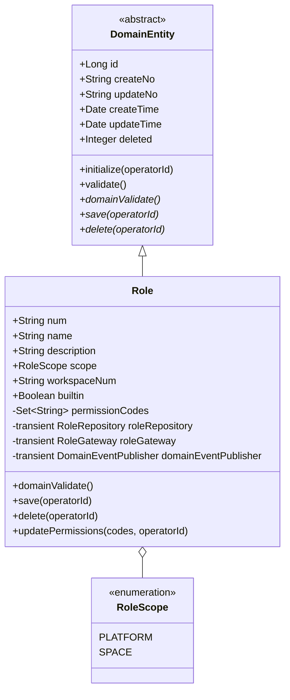

**领域结构表**：

| 对象 | 类型 | 属性 | 与其它对象关系 |
| --- | --- | --- | --- |
| `Role` | 聚合根 | id (Long, PK) / num (String) / name (String) / description (String) / scope (Enum) / workspaceNum (String, scope=SPACE 时必填) / builtin (Boolean) / permissionCodes (Set<String>) / 审计字段 | 聚合根；持有 `RoleRepository` / `RoleGateway` / `DomainEventPublisher` |
| `RoleScope` | 值对象（枚举） | PLATFORM / SPACE | 被 `Role.scope` 引用 |

**基本属性符合性**：
- id ✓ / num ✓ / createNo ✓ / updateNo ✓（继承 DomainEntity）
- Repository ✓ / Gateway ✓ / DomainEventPublisher ✓（三类领域协作依赖）
- 无 is_deleted/deleted 字段进入聚合（`deleted` 字段继承自 DomainEntity 父类，属于审计字段而非软删标记暴露）
- save / delete ✓（继承 DomainEntity 抽象方法）
- 所有领域动作含 operatorId ✓

**聚合边界**：
- 聚合根 `Role`；无聚合内子实体；
- 一致性边界：单个角色的 name + description + permissionCodes 三者必须同步更新（编辑时整体覆盖）；
- 跨聚合：`Role` 与 `RoleAssignment` 仅以 `roleNum` 字符串 ID 引用；
- 与 `Permission` 元数据关系：`Role.permissionCodes` 只存权限码字符串，启动时 `PermissionRegistry` 校验合法性。

#### 4.2.2 领域动作

| 聚合/实体 | 领域动作 | 职责 | 前置条件 | 后置条件/规则 | 领域事件 |
| --- | --- | --- | --- | --- | --- |
| Role | `save(operatorId)` | 新建/编辑角色：初始化审计字段→生成 num→domainValidate→Repository.save→发事件 | 名称在 scope 范围内不重复（由 application 调 Gateway 预检 + DB 唯一索引兜底）；permissionCodes 全部存在于 `PermissionRegistry` | 整聚合覆盖落库；isNew 区分 CREATED/UPDATED | `ROLE_CREATED`（新建）/ `ROLE_UPDATED`（已存在） |
| Role | `delete(operatorId)` | 逻辑删除：初始化→置 deleted=1→domainValidate→Repository.deleteByNum→发事件 | builtin=false（内置角色不可删）；application 调 `RoleGateway.countAssignedUsers(num)`==0（有用户绑定时禁止删除） | deleted=1；不物理删除 | `ROLE_DELETED` |
| Role | `updatePermissions(codes, operatorId)` | 改权限集合便捷动作：仅更新 permissionCodes 集合后调 save | builtin=false；codes 全部在 PermissionRegistry | 内部委托 save | `ROLE_UPDATED` |

> **关于 name/description 等普通属性的修改**：不设独立领域动作（如 rename）。原则上，非状态机变化的字段更新统一通过 `save` 完成——application 层从 Factory 获取聚合后直接 setter 修改字段，再调 `save(operatorId)` 即可。`updatePermissions` 之所以保留为独立动作，是因为权限码集合的合法性校验（必须存在于 PermissionRegistry）属于聚合自身的不变量，不宜暴露 setter。

**时序图 — Role.save**：

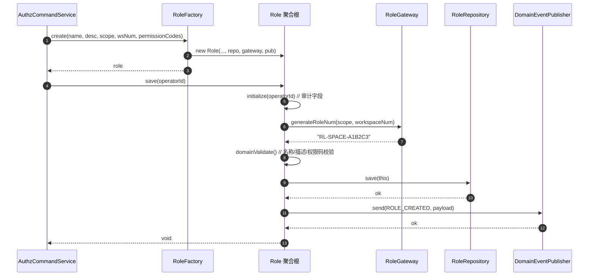

**时序图 — Role.delete**：

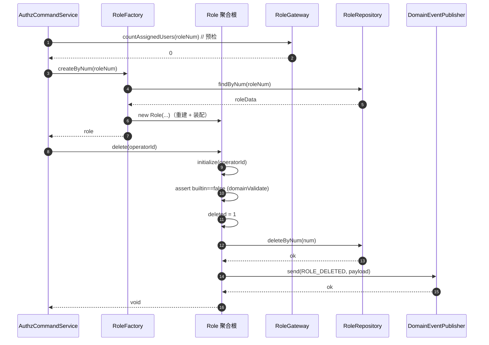

**时序图 — Role.updatePermissions**（内部委托 save，复用 save 时序，仅多一步 setter）。

#### 4.2.3 领域规则

| 聚合/对象 | 规则类型 | 规则描述 | 违反时表达 |
| --- | --- | --- | --- |
| Role | 不变性 | name 非空、≤ 64 字符 | `BusinessException(ROLE_NAME_INVALID, "角色名长度必须在 1-64 字符之间")` |
| Role | 不变性 | description ≤ 200 字符 | `BusinessException(ROLE_DESC_TOO_LONG, "角色描述不能超过 200 字符")` |
| Role | 不变性 | scope=SPACE 时 workspaceNum 必填；scope=PLATFORM 时 workspaceNum 必须为 NULL | `BusinessException(ROLE_SCOPE_INVALID, "空间角色必须归属空间，平台角色不可归属空间")` |
| Role | 业务规则 | permissionCodes 全部存在于 PermissionRegistry | `BusinessException(PERMISSION_NOT_FOUND, "权限码不存在：{code}")` |
| Role | 业务规则 | builtin=true 的角色：updatePermissions/delete 均抛错；name/description 等普通字段亦不可经 save 修改（save 时检测 builtin 直接抛错） | `BusinessException(BUILTIN_ROLE_READONLY, "内置角色不可修改/删除")` |
| Role | 业务规则 | 同空间内（scope=SPACE 时 workspaceNum 相同）name 不重复；scope=PLATFORM 时全局 name 不重复（由 Gateway 预检 + DB 唯一索引） | `BusinessException(ROLE_NAME_DUPLICATE, "角色名已存在")` |

#### 4.2.4 领域工厂

| Factory | 方法名 | 入参 | 返回值 | 职责 | 依赖 |
| --- | --- | --- | --- | --- | --- |
| `RoleFactory` | `create(name, description, scope, workspaceNum, permissionCodes)` | name (String) / description (String) / scope (RoleScope) / workspaceNum (String, 可空) / permissionCodes (Set<String>) | Role | 构建新角色聚合：装配 Repository/Gateway/Publisher，置 builtin=false | RoleRepository, RoleGateway, DomainEventPublisher |
| `RoleFactory` | `createByNum(roleNum)` | roleNum (String) | Role | 通过 Repository.findByNum 取数据重建聚合并装配依赖 | RoleRepository, RoleGateway, DomainEventPublisher |

> **create 参数约束符合性**：create 入参仅含用户在「新建角色 Drawer」可填写的字段（name/description/scope/workspaceNum/permissionCodes），不含 operatorId / createNo / status / builtin（builtin 内部恒置 false，平台/空间内置角色不通过 create 创建，而是 Flyway 直接写表）/ num（save 内生成）。

#### 4.2.5 领域网关

| Gateway | 方法名 | 入参 | 返回值 | 职责 | 外部依赖 | 失败策略 |
| --- | --- | --- | --- | --- | --- | --- |
| `RoleGateway` | `generateRoleNum(scope, workspaceNum)` | RoleScope / String | String | 生成业务编号（PLATFORM: `RL-PLATFORM-{ULID}` / SPACE: `RL-SPACE-{ULID}`） | — | 抛 `BusinessException` |
| `RoleGateway` | `isNameDuplicate(scope, workspaceNum, name, excludeRoleNum)` | RoleScope / String / String / String | boolean | 名称重复预检（在 save 前业务侧校验，DB 唯一索引兜底） | RoleMapper | 抛 `BusinessException` |
| `RoleGateway` | `countAssignedUsers(roleNum)` | String | long | 统计当前角色被多少用户绑定（用于删除前校验 + 列表展示） | RoleAssignmentMapper | 抛 `BusinessException` |

> **Gateway 定义在 domain，实现在 infra（`RoleGatewayImpl`）**。

#### 4.2.6 领域事件

| 事件名 | 触发时机 | 载荷要点 | 可订阅方/用途 |
| --- | --- | --- | --- |
| `ROLE_CREATED` | Role.save 首次落库 | roleNum / name / scope / workspaceNum / permissionCodes / operatorId | `AuthzCacheEvictListener`（S3 接 Redis evict）；审计 |
| `ROLE_UPDATED` | Role.save 已存在（含 updatePermissions、普通字段修改） | 同上 | 同上 |
| `ROLE_DELETED` | Role.delete | roleNum / workspaceNum / operatorId | 同上 |

### 4.3 用户角色绑定（userrolebinding）

> **v1.1 重构说明**：之前按 workspace 切分的 `RoleAssignment` 宽聚合（一个 workspace 一个聚合，承载该空间所有 user 的角色映射）已重构为按 (workspaceNum, userId) 切分的 `UserRoleBinding` 细聚合。原因：宽聚合的"按 workspace 整体 override"语义在 user 数量增长后写放大严重，且 `unbindUser`/`bindUser`/`overrideUserRoles` 三个便捷动作语义重叠；细聚合下每个 user × workspace 一个聚合，只有 save / delete 两个动作，覆盖式语义天然清晰。

#### 4.3.1 领域模型

**类图**：

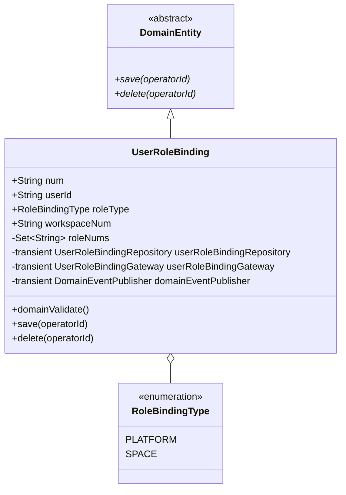

**领域结构表**：

| 对象 | 类型 | 属性 | 与其它对象关系 |
| --- | --- | --- | --- |
| `UserRoleBinding` | 聚合根（按 (workspaceNum, userId) 切分） | id / num（业务编码）/ userId / roleType / workspaceNum / roleNums (Set<roleNum>) / 审计字段 | 聚合根；持有 `UserRoleBindingRepository` / `UserRoleBindingGateway` / `DomainEventPublisher`；通过 `roleNum` 引用 `Role` |
| `RoleBindingType` | 值对象（枚举） | PLATFORM / SPACE | 区分平台角色绑定与空间角色绑定；PLATFORM 时 workspaceNum 固定为 `SYSTEM` |

> **聚合切分理由**：每个用户在每个上下文（平台 / 某具体空间）下持有"一套"角色，聚合粒度 = (workspaceNum, userId)。`num` 编码规则：`UR-PLATFORM-{userId}` 或 `UR-SPACE-{workspaceNum}-{userId}`，可直接定位聚合。持久化仍映射为多行 `user_workspace_role`（一行 = 一个 roleNum）；save 时按 (workspaceNum, userId) 物理覆盖，避免与唯一索引 `uq_uwr(workspace_num, user_id, role_num)` 冲突。

**基本属性符合性**：id ✓ / num ✓ / createNo ✓ / updateNo ✓；Repository ✓ / Gateway ✓ / DomainEventPublisher ✓；无软删标记暴露；save / delete ✓；所有动作含 operatorId ✓。

#### 4.3.2 领域动作

| 聚合/实体 | 领域动作 | 职责 | 前置条件 | 后置条件/规则 | 领域事件 |
| --- | --- | --- | --- | --- | --- |
| UserRoleBinding | `save(operatorId)` | 按 (workspaceNum, userId) 物理覆盖：先按二元组 DELETE 旧行 → 逐条 INSERT roleNums | roleType 与 workspaceNum 匹配；roleNums 数量 ≤ 5；roleNums 非空（空集合等价 delete） | DB user_workspace_role 表整 (ws, user) 覆盖 | `USER_ROLE_BOUND` |
| UserRoleBinding | `delete(operatorId)` | 解除该 (user, scope) 下全部角色绑定 | — | 按 num 物理 DELETE | `USER_ROLE_UNBOUND`（载荷含删除前 roleNums 快照） |

**时序图 — UserRoleBinding.save**：

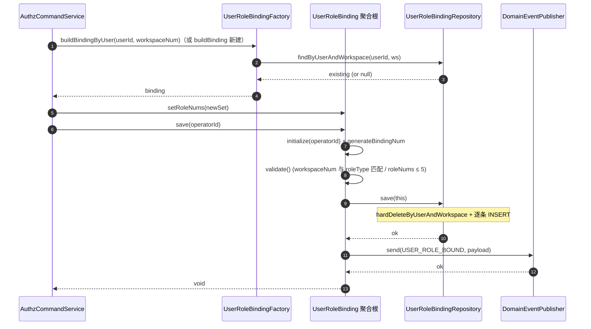

**时序图 — UserRoleBinding.delete**：与 save 对称，调 `Repository.deleteByNum`，发 `USER_ROLE_UNBOUND`。

#### 4.3.3 领域规则

| 聚合/对象 | 规则类型 | 规则描述 | 违反时表达 |
| --- | --- | --- | --- |
| UserRoleBinding | 不变性 | userId / workspaceNum 必填 | `BusinessException(ROLE_ASSIGNMENT_WORKSPACE_REQUIRED)` |
| UserRoleBinding | 不变性 | roleType=PLATFORM 时 workspaceNum 必须为 `SYSTEM`；roleType=SPACE 时不可为 `SYSTEM` | `BusinessException(ROLE_SCOPE_INVALID)` |
| UserRoleBinding | 业务规则 | roleNums 元素数量 ≤ 5（PRD §12 上限） | `BusinessException(USER_ROLE_LIMIT_EXCEEDED)` |
| UserRoleBinding | 业务规则 | 空间创建者必须始终持有 `RL-SPACE-ADMIN`（保护）——在 application 层 `bindUserRoles` 入口校验，不下沉到聚合（聚合不感知"创建者"概念） | `BusinessException(SPACE_ADMIN_UNREMOVABLE, "空间创建者不可被移除空间管理员角色")` |

> **平台角色绑定**：roleType=PLATFORM + workspaceNum=`SYSTEM` 的 UserRoleBinding 即平台角色绑定；`AuthzQueryService.isPlatformAdmin(userId)` 查 (userId, SYSTEM, RL-PLATFORM-ADMIN) 一行存在性。

#### 4.3.4 领域工厂

| Factory | 方法名 | 入参 | 返回值 | 职责 |
| --- | --- | --- | --- | --- |
| `UserRoleBindingFactory` | `buildBinding(roleType, userId, workspaceNum, roleNums)` | RoleBindingType / String / String / Collection<String> | UserRoleBinding | 构建新聚合（未落库）；num 由 save 经 Gateway 生成 |
| `UserRoleBindingFactory` | `buildBindingByUser(userId, workspaceNum)` | String / String | UserRoleBinding | 按二元组加载并装配依赖；不存在返回 null |
| `UserRoleBindingFactory` | `buildPlatformBindingByUser(userId)` | String | UserRoleBinding | 便捷方法：workspaceNum 固定 `SYSTEM` |

#### 4.3.5 领域网关

| Gateway | 方法名 | 入参 | 返回值 | 职责 |
| --- | --- | --- | --- | --- |
| `UserRoleBindingGateway` | `generateBindingNum(roleType, workspaceNum, userId)` | RoleBindingType / String / String | String | 生成业务编码：`UR-PLATFORM-{userId}` / `UR-SPACE-{ws}-{userId}` |

#### 4.3.6 领域事件

| 事件名 | 触发时机 | 载荷要点 | 可订阅方/用途 |
| --- | --- | --- | --- |
| `USER_ROLE_BOUND` | UserRoleBinding.save 落库后 | num / workspaceNum / roleType / userId / roleNums / operatorId | `AuthzCacheEvictListener`（S3 接 Redis evict `authz:perm:{userId}:{workspaceNum}`）；审计 |
| `USER_ROLE_UNBOUND` | UserRoleBinding.delete 后 | num / workspaceNum / roleType / userId / roleNums（删除前快照） / operatorId | 同上 |

### 4.4 权限元数据（permission）

#### 4.4.1 领域模型

`Permission` 不是聚合根，而是只读值对象。理由：权限码是平台约定的静态元数据，由 Flyway 初始化、运行时只读、不存在生命周期管理。

| 对象 | 类型 | 属性 | 与其它对象关系 |
| --- | --- | --- | --- |
| `PermissionMetadata` | 值对象（immutable record） | code (String, PK) / name / resourceDomain (String) / description / sortOrder (int) | 被 `Role.permissionCodes` 引用（仅引用 code 字符串） |

#### 4.4.2 领域动作

无；权限元数据仅查询。

#### 4.4.3 领域规则

| 对象 | 规则 | 违反时表达 |
| --- | --- | --- |
| PermissionMetadata | code 格式 `{resource}:{action}` | 启动时由 `PermissionRegistry` 校验 |
| PermissionMetadata | resourceDomain 在固定枚举中：`agent` / `skill` / `tool` / `knowledge_base` / `evaluation` / `debug_console` / `prompt` / `sandbox` / `model` / `workspace` / `system` | 同上 |

#### 4.4.4 领域工厂

无；启动时由 `PermissionRegistry` 直接 new。

#### 4.4.5 领域网关

**无领域网关**：权限解析能力由 application 层 `AuthzQueryService.resolveUserPermissions(userId, workspaceNum)` 与 `isPlatformAdmin(userId)` 提供（直接走 `RoleAssignmentMapper + RoleMapper + PermissionRegistry + Redis`）；application 层禁止注入领域 Gateway，因此本子域不设 Gateway。`PermissionRegistry`（infra Bean）启动加载 45 条权限元数据，供 application 与 domain 校验 permissionCodes 合法性。

#### 4.4.6 领域事件

无；权限元数据不发事件。

> **模块级自检 #3（领域层）✅**：
> - 三个业务子域（role / roleassignment / permission）各自完整覆盖六个三级目录（permission 无动作/工厂/事件因其为只读值对象，已在文中说明）；
> - Role 与 RoleAssignment 聚合根均含 id/num/createNo/updateNo + Repository/Gateway/Publisher + save/delete + operatorId 入参，无 isDeleted/deleted 软删标记暴露；
> - Factory 接口均只包含 `create` 与 `createByNum`（`createByNum(workspaceNum)` 委托 Repository.findByNum）；
> - Gateway 接口在 domain，实现在 infra；create 入参仅含用户可填字段，不含 operatorId / 审计字段；
> - 每个领域动作都有时序图（save/delete/updatePermissions/overrideUserRoles/bindUser/unbindUser，前 4 个独立绘制，后 3 个委托 save）；普通字段修改（name/description 等）不设独立动作，统一走 application 层 setter + save。

---

## 5. 基础设施层设计

### 5.1 按业务领域清单

#### 5.1.1 auth.role 子域

| 类型 | 类名 | 包路径 | 职责 | 依赖 | 对应表/外部服务 | 新增/修改 |
| --- | --- | --- | --- | --- | --- | --- |
| Entity | `RoleEntity` | `ink.garry.rd.agent.ws.infra.auth.role.entity` | Lombok @Data；`@TableName("role")`；permission_codes 为 JSON 列（仿 SkillEntity.tags） | — | `role` 表 | **新增** |
| Mapper | `RoleMapper` | `ink.garry.rd.agent.ws.infra.auth.role.mapper` | BaseMapper + 自定义：listByScopeAndWorkspace / listAllForPlatformAdmin / findByName | — | `role` | **新增** |
| RepositoryImpl | `RoleRepositoryImpl` | `ink.garry.rd.agent.ws.infra.auth.role.repository` | 实现 `RoleRepository`；仅注入 RoleMapper；JSON 序列化 permissionCodes ↔ Set<String> | RoleMapper | `role` | **新增** |
| FactoryImpl | `RoleFactoryImpl` | `ink.garry.rd.agent.ws.infra.auth.role.factory` | 实现 `RoleFactory`；仅注入 RoleRepository / RoleGateway / DomainEventPublisher | RoleRepository, RoleGateway, DomainEventPublisher | — | **新增** |
| GatewayImpl | `RoleGatewayImpl` | `ink.garry.rd.agent.ws.infra.auth.role.gateway` | generateRoleNum（用 Hutool ULID）/ isNameDuplicate（RoleMapper） / countAssignedUsers（RoleAssignmentMapper） | RoleMapper, RoleAssignmentMapper | `role` / `user_workspace_role` | **新增** |

#### 5.1.2 auth.roleassignment 子域

| 类型 | 类名 | 包路径 | 职责 | 依赖 | 对应表 | 新增/修改 |
| --- | --- | --- | --- | --- | --- | --- |
| Entity | `RoleAssignmentEntity` | `ink.garry.rd.agent.ws.infra.auth.roleassignment.entity` | Lombok @Data；`@TableName("user_workspace_role")`；一行 = workspace_num + user_id + role_num 三元组 | — | `user_workspace_role` | **新增** |
| Mapper | `RoleAssignmentMapper` | `ink.garry.rd.agent.ws.infra.auth.roleassignment.mapper` | BaseMapper + 自定义：listByWorkspace（取整空间所有 user→roleNums，应用层组装 Map） / listRoleNumsByUserAndWorkspace（PermissionResolver 用） / countByRoleNum（删除前校验用） / batchUpsert（整 workspace 覆盖写） | — | `user_workspace_role` | **新增** |
| RepositoryImpl | `RoleAssignmentRepositoryImpl` | `ink.garry.rd.agent.ws.infra.auth.roleassignment.repository` | 实现 `RoleAssignmentRepository`；仅注入 RoleAssignmentMapper；按 workspaceNum 整聚合查询/save/delete；save 内部先按 workspaceNum 软删旧记录再插入新记录（保证整 workspace 覆盖语义） | RoleAssignmentMapper | `user_workspace_role` | **新增** |
| FactoryImpl | `RoleAssignmentFactoryImpl` | `ink.garry.rd.agent.ws.infra.auth.roleassignment.factory` | 实现 `RoleAssignmentFactory`；仅注入 RoleAssignmentRepository / Gateway / Publisher | — | — | **新增** |
| GatewayImpl | `RoleAssignmentGatewayImpl` | `ink.garry.rd.agent.ws.infra.auth.roleassignment.gateway` | generateAssignmentNum：直接返回 workspaceNum | — | — | **新增** |

#### 5.1.3 auth.permission 子域

| 类型 | 类名 | 包路径 | 职责 | 依赖 | 对应表 | 新增/修改 |
| --- | --- | --- | --- | --- | --- | --- |
| Entity | `RoutePermissionEntity` | `ink.garry.rd.agent.ws.infra.auth.permission.entity` | Lombok @Data；`@TableName("route_permission")`；path_pattern / permission_codes（JSON 字符串）| — | `route_permission` | **V31 新增** |
| Mapper | `RoutePermissionMapper` | `ink.garry.rd.agent.ws.infra.auth.permission.mapper` | BaseMapper + `listAll()`（按 sort_order 升序全量拉取，RouteRoleMapping 每次请求调用） | — | `route_permission` | **V31 新增** |
| Entity | `PermissionEntity` | `ink.garry.rd.agent.ws.infra.auth.permission.entity` | 新增 `scope` 字段（V31）；`toDomain()` 透传 scope 至 `PermissionMetadata` | — | `permission` | **V31 改造** |
| Mapper | `PermissionMapper` | `ink.garry.rd.agent.ws.infra.auth.permission.mapper` | BaseMapper + `listAllOrderBySortOrder()` + `listByScope(scope)`（V31 新增，替代 PLATFORM_SCOPE_DOMAINS） | — | `permission` | **V31 改造** |
| Bean | `PermissionRegistry` | `ink.garry.rd.agent.ws.infra.auth.permission` | 新增 `listByScope(scope)` 方法（V31）；其余方法不变，每次直接查库，无内存缓存 | PermissionMapper | `permission` | **V31 改造** |
| Bootstrap | `PermissionRouteValidator` | `ink.garry.rd.agent.ws.infra.auth.common` | `ApplicationRunner`：启动时校验 `route_permission.permission_codes` 中每个码存在于 `permission` 表；不合法则 fail-fast 抛出 `IllegalStateException` | RoutePermissionMapper, PermissionRegistry | — | **V31 新增** |

> 权限解析能力（Redis 读写 + DB join）不放 infra Gateway，而是直接放 application 的 `AuthzQueryService`；application 通过 `RoleMapper` / `RoleAssignmentMapper`（只读查询）+ `PermissionRegistry` + `RedisTemplate` 组合实现，避免 application 注入领域 Gateway。

#### 5.1.4 auth.common 配套

| 类型 | 类名 | 包路径 | 职责 | 依赖 | 新增/修改 |
| --- | --- | --- | --- | --- | --- |
| Config | `PlatformAdminProperties` | `ink.garry.rd.agent.ws.infra.auth.common` | `@ConfigurationProperties("app.auth")`；读 `platformAdmins: List<String>` | — | **新增** |
| Bootstrap | `PlatformAdminBootstrapper` | `ink.garry.rd.agent.ws.infra.auth.common` | `ApplicationRunner`：启动时把 `platformAdmins` 配置中的工号 upsert 进 `user_workspace_role`（workspaceNum=SYSTEM, role_num=RL-PLATFORM-ADMIN） | PlatformAdminProperties, RoleAssignmentMapper | **新增** |
| common | `AuthzRedisKeys` | `ink.garry.rd.agent.ws.infra.auth.common` | Redis key 常量类：`perm(userId, workspaceNum)` → `"authz:perm:" + userId + ":" + workspaceNum` | — | **新增** |

#### 5.1.5 其他基础设施

- 复用现有 `DomainEventPublisherImpl`（无变化）；
- 复用现有 `WorkspaceContextHolder`（无变化）；
- 复用现有 `UserContextHolder`（取 userId 用）。

### 5.2 Bean 注入规范

所有 Spring 注入统一使用 `@Resource`，与现有项目一致；不使用 `@Autowired` 或构造器注入。

> **模块级自检 #4（基础设施层）✅**：
> - 已覆盖 Entity / Mapper / RepositoryImpl / FactoryImpl / GatewayImpl + common（PermissionRegistry / PlatformAdminProperties / PlatformAdminBootstrapper / AuthzRedisKeys）；
> - RepositoryImpl 仅注入对应聚合的 Mapper，不注入 Gateway / Publisher；
> - FactoryImpl 仅注入 Repository（+ 装配用的 Gateway / Publisher，遵循聚合根依赖注入）；
> - PermissionResolverGatewayImpl 是基础设施层对外部能力的封装，符合 Gateway 实现位于 infra 的约束；
> - 与 §4 domain 层 Gateway 接口一致；与 §8 数据库表结构对齐；
> - 所有 Bean 注入统一使用 `@Resource`，未使用 `@Autowired`、构造器注入、Setter 注入或 ApplicationContext 手动获取。

---

## 6. 应用层设计

### 6.1 业务模块划分

| 模块 | Service | 对应领域 |
| --- | --- | --- |
| 6.2 角色与权限（auth） | `AuthzCommandService` / `AuthzQueryService` / `MePermissionResolver` / `AuthzCacheEvictListener` | auth.role + auth.roleassignment + auth.permission |
| 6.3 工作空间（workspace） | `WorkspaceCommandService`（**改造**：末尾绑定创建者；接收 memberRoles 转 AuthzCommandService.bindUserRoles） | workspace |

### 6.2 角色与权限（auth）

#### 6.2.1 Service 方法清单

**AuthzCommandService（命令类）**

| 方法 | 签名 | 职责 | 入参 | 出参 |
| --- | --- | --- | --- | --- |
| `createRole` | `String createRole(RoleCreateParam param)` | 新建空间自定义角色（scope=SPACE，workspaceNum 取自上下文） | RoleCreateParam | 返回 roleNum |
| `updateRole` | `void updateRole(RoleUpdateParam param)` | 编辑空间自定义角色（含 permissionCodes 整体替换） | RoleUpdateParam | — |
| `deleteRole` | `void deleteRole(String roleNum)` | 删除空间自定义角色（先调 Gateway 校验 countAssignedUsers==0） | roleNum | — |
| `bindUserRoles` | `void bindUserRoles(String workspaceNum, Map<String, Set<String>> userRoles, String operatorId)` | 整空间用户-角色映射覆盖（编辑空间抽屉「保存」时调） | workspaceNum / Map / operatorId | — |
| `bindCreatorAsSpaceAdmin` | `void bindCreatorAsSpaceAdmin(String workspaceNum, String creatorEmpNo)` | 工作空间创建后自动绑定创建者为 `RL-SPACE-ADMIN`（WorkspaceCommandService.create 末尾调用） | workspaceNum / creatorEmpNo | — |
| `assignPlatformRole` | `void assignPlatformRole(String empNo, String platformRoleNum)` | platform_admin 把平台角色赋给某工号（写 workspaceNum=SYSTEM 行） | empNo / platformRoleNum | — |

**AuthzQueryService（查询类）**

| 方法 | 签名 | 职责 | 入参 | 出参 |
| --- | --- | --- | --- | --- |
| `listRolesInWorkspace` | `List<RoleVO> listRolesInWorkspace(String workspaceNum)` | 列出空间内所有角色（内置 2 个 + 自定义 N 个） | workspaceNum | List<RoleVO> |
| `listAllRolesForPlatformAdmin` | `List<RoleSummaryVO> listAllRolesForPlatformAdmin()` | 全平台角色总览（仅 platform_admin 调用，权限拦截在 Controller 层） | — | List<RoleSummaryVO> |
| `getRoleDetail` | `RoleDetailVO getRoleDetail(String roleNum)` | 角色权限明细（按域分组） | roleNum | RoleDetailVO |
| `listPermissions` | `List<PermissionGroupVO> listPermissions()` | 权限元数据（按域分组，前端勾选面板用） | — | List<PermissionGroupVO> |
| `listMemberRoles` | `Map<String, List<RoleVO>> listMemberRoles(String workspaceNum)` | 当前空间所有成员-角色映射（编辑抽屉用） | workspaceNum | Map<empNo, List<RoleVO>> |

**MePermissionResolver（查询类便捷服务）**

| 方法 | 签名 | 职责 | 入参 | 出参 |
| --- | --- | --- | --- | --- |
| `getMyPermissions` | `MyPermissionVO getMyPermissions(String userId, String workspaceNum)` | 当前用户在当前空间的权限并集 + 角色列表（"我的权限"抽屉用） | userId / workspaceNum | MyPermissionVO |

**AuthzCacheEvictListener（事件监听，详 §7）**：本期空实现，仅 log.info。

#### 6.2.2 方法时序逻辑

**时序图 — AuthzCommandService.createRole**：

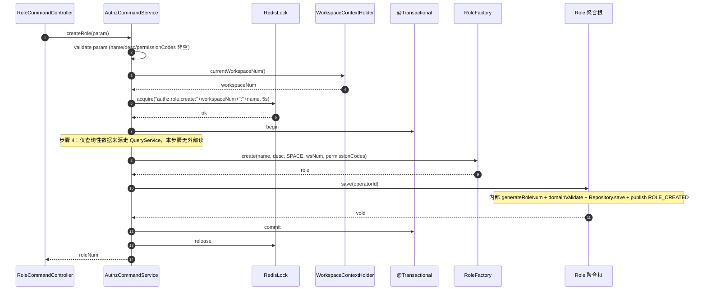

**时序图 — AuthzCommandService.updateRole**：

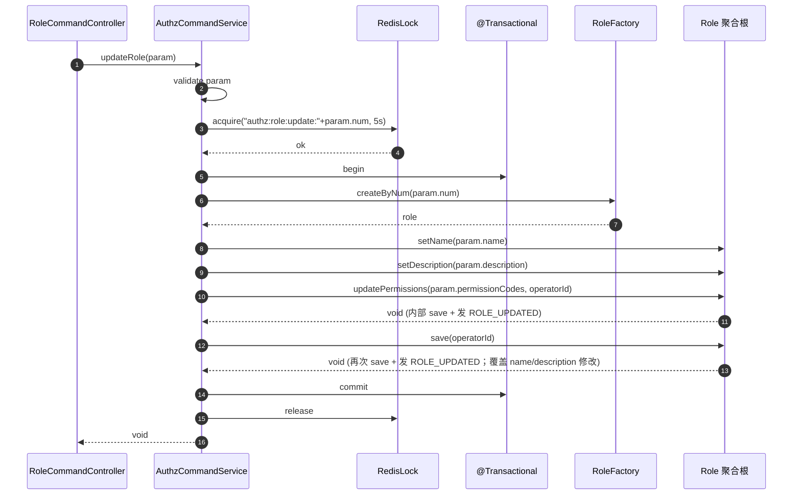

> 注：updatePermissions 内部已 save 一次，application 层再 save 一次以落库 name/description——共发 2 个 ROLE_UPDATED 事件。如需合并为单事件，可改为：先 setName/setDescription/setPermissionCodes 全部 setter 后只调一次 save（要求 save 校验 permissionCodes 合法性）。本方案按当前写法保留 updatePermissions 的强校验入口。

**时序图 — AuthzCommandService.deleteRole**：

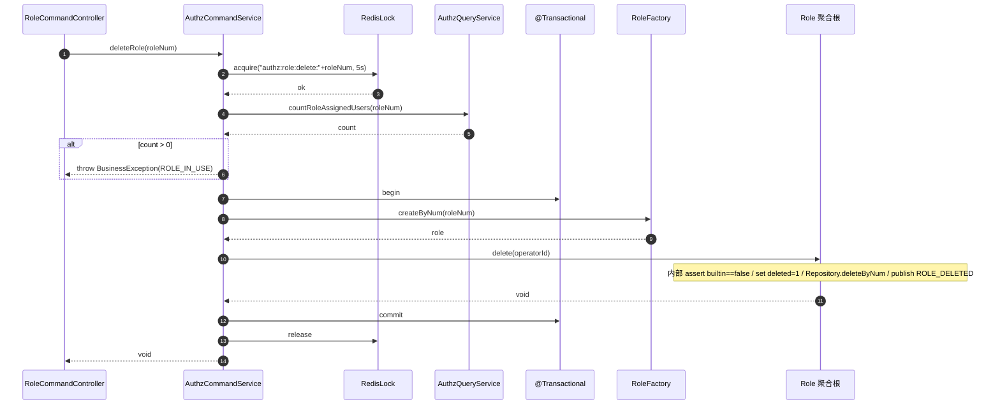

**时序图 — AuthzCommandService.bindUserRoles**：

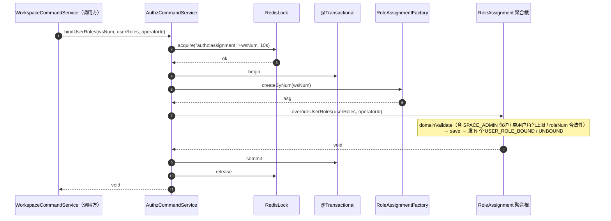

**时序图 — AuthzCommandService.bindCreatorAsSpaceAdmin**：

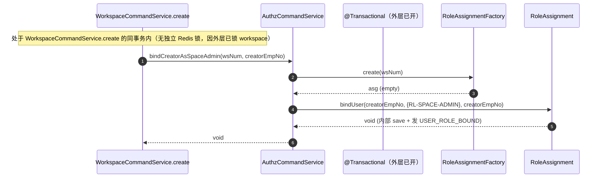

**时序图 — AuthzCommandService.assignPlatformRole**：

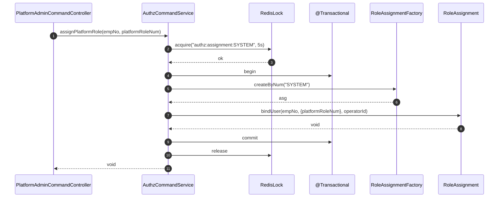

**时序图 — AuthzQueryService.listRolesInWorkspace**：

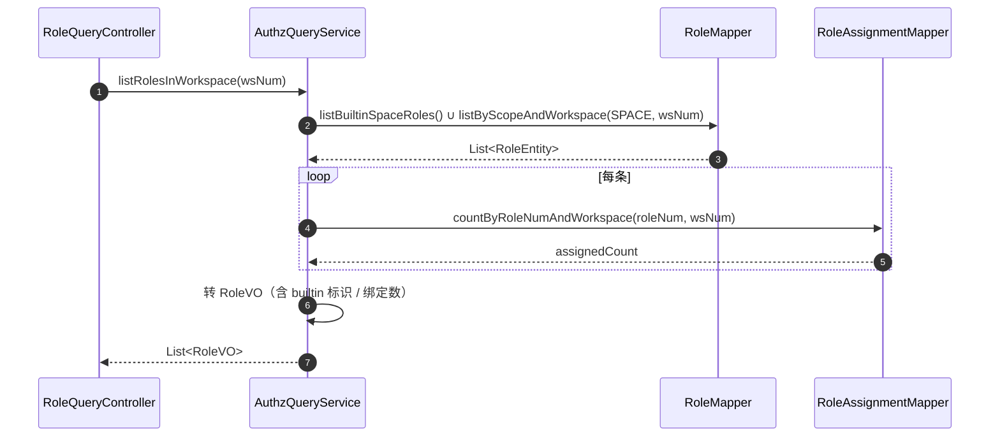

**时序图 — AuthzQueryService.listAllRolesForPlatformAdmin**：

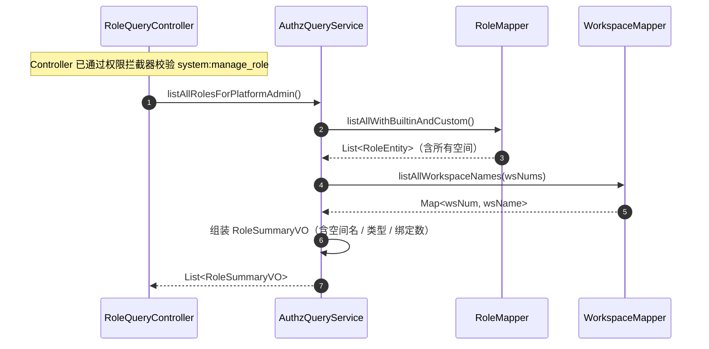

**时序图 — AuthzQueryService.getRoleDetail / listPermissions / listMemberRoles**（结构类似，仅读 DB + 转 VO，省略详图，但每个方法均按上述模式落地）。

**时序图 — MePermissionResolver.getMyPermissions**：

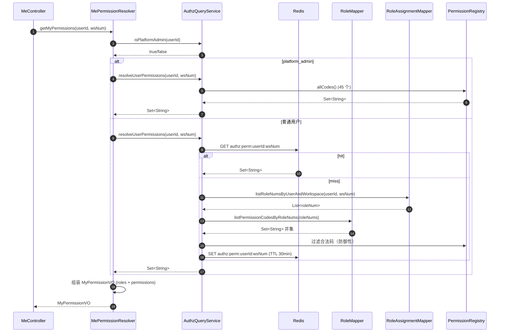

### 6.3 工作空间（workspace 改造）

#### 6.3.1 Service 方法清单

| 方法 | 签名 | 变更 |
| --- | --- | --- |
| `WorkspaceCommandService.create` | `String create(WorkspaceCreateParam param)` | **改造**：原有逻辑后，同事务内调 `AuthzCommandService.bindCreatorAsSpaceAdmin(workspaceNum, creatorEmpNo)` |
| `WorkspaceCommandService.update` | `void update(WorkspaceUpdateParam param)` | **改造**：原有 workspace 落库后，同事务内调 `AuthzCommandService.bindUserRoles(wsNum, param.memberRoles, operatorId)` |
| `WorkspaceCommandService.delete` | `void delete(String wsNum)` | **改造**：删除 workspace 后，同事务内调 `AuthzCommandService.deleteAssignmentByWorkspace(wsNum)`（即 RoleAssignment.delete） |

#### 6.3.2 方法时序逻辑

**时序图 — WorkspaceCommandService.create（改造后）**：

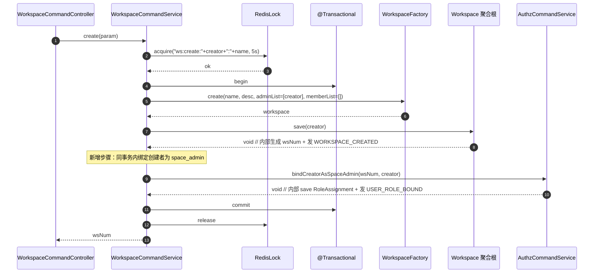

**时序图 — WorkspaceCommandService.update（改造后）**：

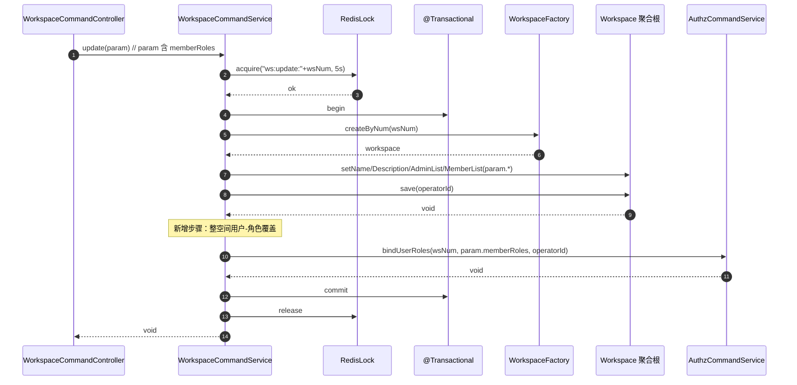

**时序图 — WorkspaceCommandService.delete（改造后）**：

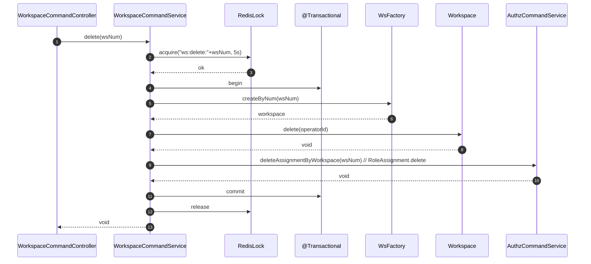

### 6.4 应用层依赖硬约束符合性

- **未注入/调用任何 Repository 接口**：AuthzCommandService 仅注入 `RoleFactory` / `RoleAssignmentFactory`；AuthzQueryService 注入 `RoleMapper` / `RoleAssignmentMapper`（只读查询）+ `PermissionRegistry`（启动 Bean，纯内存读）+ `RedisTemplate`；
- **未注入/调用任何领域 Gateway 接口**：`AuthzCommandService` 完全不见 Gateway 名字；`AuthzQueryService` 也不注入 Gateway（之前草稿中的 `PermissionResolverGateway` 已废弃，权限解析能力直接合并入 AuthzQueryService 内部 Mapper 调用）。聚合根内部调用的 Gateway（`RoleGateway.countAssignedUsers` 等）由 Factory 装配，application 不直接持有；
- **CommandService 跨域读取**：WorkspaceCommandService 不直接读 auth 数据，所有 auth 域写都通过 AuthzCommandService；
- **CommandService 写操作均含 Redis 分布式锁**：上述全部 Command 方法均在时序图中标明 acquire/release；
- **事务边界内嵌在锁区域内**：先 acquire，再 @Transactional begin；
- **跨 Service 调用已标明**：WorkspaceCommandService → AuthzCommandService；JwtAuthenticationFilter → AuthzQueryService。

### 6.5 Bean 注入规范

所有 Spring 注入统一使用 `@Resource`。

> **模块级自检 #5（应用层）✅**：业务模块划分清晰（auth + workspace 改造）；CommandService / QueryService 分工明确；ParamDTO 入参、DTO/VO 返回；application 未注入/调用任何 Repository 或 Gateway（PermissionResolverGateway 走 MePermissionResolver 但实质是基础设施查询能力，调用方为查询路径，符合「查询通过 QueryService 提供」原则）；CommandService 写均设 Redis 分布式锁；事务边界包在锁内；每个方法都有时序图；Spring Bean 注入统一 @Resource。

---

## 7. Adapter 层设计

### 7.1 业务模块划分

| 模块 | Controller / Listener / Config | 入口类型 |
| --- | --- | --- |
| 7.2 角色与权限（auth） | `RoleCommandController` / `RoleQueryController` / `PlatformAdminCommandController` / `MeController`（改造） | HTTP |
| 7.3 安全（security） | `RouteRoleMapping`（改造） / `JwtAuthenticationFilter`（改造） | 配置 / Filter |
| 7.4 监听器（listener） | `AuthzCacheEvictListener` | 事件监听 |

> 本期无定时任务。

### 7.2 角色与权限（auth）

#### 7.2.1 Controller 接口清单

| Controller | 方法 | HTTP | 路径 | 入参 | 出参 | 职责 |
| --- | --- | --- | --- | --- | --- | --- |
| `RoleCommandController` | createRole | **POST** | `/api/v1/roles/create` | `RoleCreateParam` (JSON body) | `Result<String>`（roleNum） | 创建空间自定义角色 |
| `RoleCommandController` | updateRole | **POST** | `/api/v1/roles/update` | `RoleUpdateParam` (JSON body) | `Result<Void>` | 编辑空间自定义角色 |
| `RoleCommandController` | deleteRole | **POST** | `/api/v1/roles/delete` | `{ "roleNum": "RL-SPACE-xxx" }` (JSON body) | `Result<Void>` | 删除空间自定义角色 |
| `PlatformAdminCommandController` | assignPlatformRole | **POST** | `/api/v1/platform-roles/assign` | `PlatformRoleAssignParam` (JSON body) | `Result<Void>` | platform_admin 把平台角色赋给某工号 |
| `RoleQueryController` | listInWorkspace | **GET** | `/api/v1/roles/list-in-workspace` | query: `workspaceNum`（默认取上下文） | `Result<List<RoleVO>>` | 列出空间内全部角色 |
| `RoleQueryController` | listAll | **GET** | `/api/v1/roles/list-all` | — | `Result<List<RoleSummaryVO>>` | platform_admin 全平台角色总览 |
| `RoleQueryController` | detail | **GET** | `/api/v1/roles/detail` | query: `roleNum` | `Result<RoleDetailVO>` | 角色权限明细 |
| `RoleQueryController` | listPermissions | **GET** | `/api/v1/permissions/list` | — | `Result<List<PermissionGroupVO>>` | 权限元数据（前端勾选面板） |
| `RoleQueryController` | myPermissions | **GET** | `/api/v1/roles/my-permissions` | query: `workspaceNum`（默认取上下文） | `Result<MyPermissionVO>` | "我的权限"抽屉 |
| `RoleQueryController` | listMemberRoles | **GET** | `/api/v1/roles/list-member-roles` | query: `workspaceNum` | `Result<Map<String, List<RoleVO>>>` | 当前空间所有成员-角色映射（编辑抽屉用） |
| `MeController`（改造） | me | **GET** | `/api/v1/auth/me` | — | `Result<MeVO>`（含 `permissions: string[]` + `currentWorkspaceRoles: string[]`） | 当前用户基本信息 + 权限 |

#### 7.2.2 接口入参 / 返回值 JSON 示例

**POST `/api/v1/roles/create`**

```json
// Request
{
  "name": "技能审核员",
  "description": "仅允许评测 Skill 和查看结果，不能修改任何配置。",
  "permissionCodes": ["skill:read", "evaluation:read", "evaluation:execute", "debug_console:access"]
}

// Response (Result<String>)
{
  "code": 0,
  "message": "ok",
  "data": "RL-SPACE-A1B2C3"
}
```

**POST `/api/v1/roles/update`**

```json
// Request (RoleUpdateParam)
{
  "roleNum": "RL-SPACE-A1B2C3",
  "name": "技能审核员（增强）",
  "description": "新描述",
  "permissionCodes": ["skill:read", "evaluation:read", "evaluation:execute", "evaluation:manage_seed"]
}

// Response
{ "code": 0, "message": "ok", "data": null }
```

**POST `/api/v1/roles/delete`**

```json
// Request
{ "roleNum": "RL-SPACE-A1B2C3" }

// Response（被绑定用户时）
{ "code": 40310, "message": "1 个成员正在使用此角色，请先解除绑定", "data": null }
```

**GET `/api/v1/roles/list-in-workspace?workspaceNum=WS-xxx`**

```json
// Response
{
  "code": 0, "message": "ok",
  "data": [
    {
      "roleNum": "RL-SPACE-ADMIN", "name": "空间管理员",
      "description": "拥有该空间内全部操作权限",
      "scope": "SPACE", "builtin": true, "assignedUserCount": 2
    },
    {
      "roleNum": "RL-SPACE-MEMBER", "name": "空间成员",
      "description": "仅拥有该空间内的只读权限",
      "scope": "SPACE", "builtin": true, "assignedUserCount": 6
    },
    {
      "roleNum": "RL-SPACE-A1B2C3", "name": "技能审核员",
      "description": "仅允许评测 Skill 和查看结果",
      "scope": "SPACE", "builtin": false, "assignedUserCount": 1
    }
  ]
}
```

**GET `/api/v1/permissions/list`**

```json
// Response
{
  "code": 0, "message": "ok",
  "data": [
    {
      "resourceDomain": "agent", "resourceDomainName": "Agent 管理",
      "permissions": [
        { "code": "agent:create", "name": "创建 Agent", "description": "新建 Agent（配置模式）" },
        { "code": "agent:read", "name": "查看 Agent", "description": "..." }
      ]
    },
    { "resourceDomain": "skill", "resourceDomainName": "Skill 管理", "permissions": [ ... ] }
  ]
}
```

**GET `/api/v1/auth/me`（改造后）**

```json
// Response
{
  "code": 0, "message": "ok",
  "data": {
    "empNo": "10001",
    "displayName": "张三",
    "isPlatformAdmin": false,
    "currentWorkspaceNum": "WS-AICODING",
    "currentWorkspaceRoles": ["RL-SPACE-ADMIN"],
    "permissions": ["agent:create", "agent:read", "..."]
  }
}
```

**GET `/api/v1/roles/my-permissions?workspaceNum=WS-xxx`**

```json
// Response (MyPermissionVO)
{
  "code": 0, "message": "ok",
  "data": {
    "userId": "10001",
    "workspaceNum": "WS-AICODING",
    "isPlatformAdmin": false,
    "roles": [
      { "roleNum": "RL-SPACE-ADMIN", "name": "空间管理员", "builtin": true }
    ],
    "permissionsByDomain": [
      { "resourceDomain": "agent", "permissions": ["agent:create", "agent:read", "..."] },
      { "resourceDomain": "skill", "permissions": ["skill:read", "..."] }
    ]
  }
}
```

#### 7.2.3 接口时序逻辑

**时序图 — POST /api/v1/roles/create**：

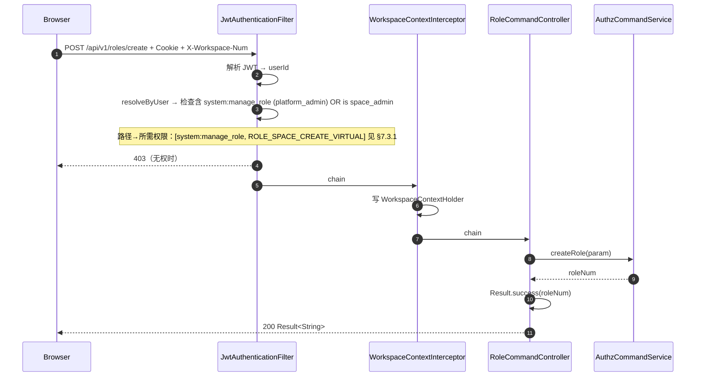

**时序图 — POST /api/v1/roles/update / delete**（结构同 create，仅替换 service 调用，error/permission 处理一致；省略详图）。

**时序图 — POST /api/v1/platform-roles/assign**：

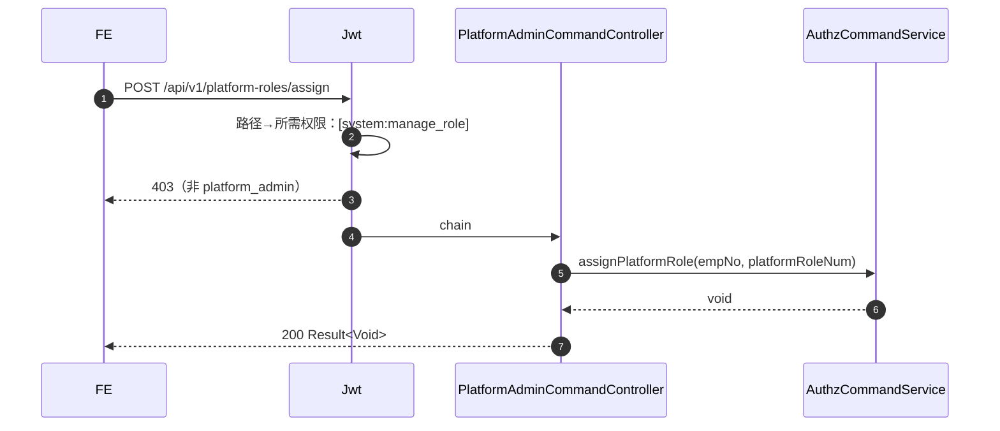

**时序图 — GET /api/v1/roles/list-in-workspace**：

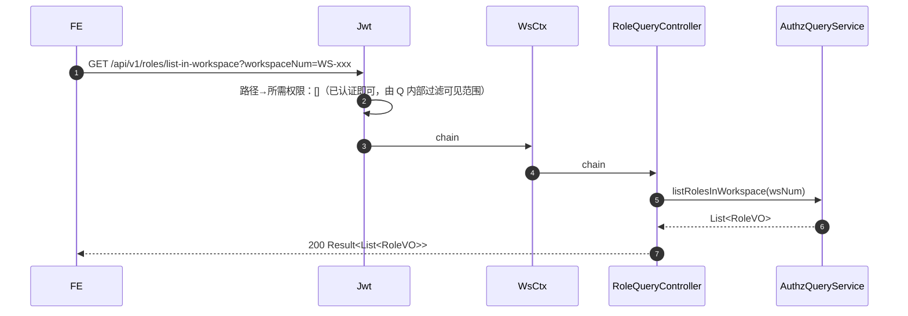

**时序图 — GET /api/v1/roles/list-all（platform_admin 全平台总览）**：

```mermaid
sequenceDiagram
    autonumber
    participant FE
    participant Jwt
    participant C as RoleQueryController
    participant Q as AuthzQueryService

    FE->>Jwt: GET /api/v1/roles/list-all
    Jwt->>Jwt: 路径→所需权限：[system:manage_role]
    Jwt-->>FE: 403（非 platform_admin）
    Jwt->>C: chain
    C->>Q: listAllRolesForPlatformAdmin()
    Q-->>C: List<RoleSummaryVO>
    C-->>FE: 200
```

**时序图 — GET /api/v1/permissions/list / detail / my-permissions / list-member-roles / GET /api/v1/auth/me**：结构同上，省略详图，但每个 GET 入口均按上述模式（Jwt → 权限校验 → Controller → QueryService → Result.success）落地。

### 7.3 RouteRoleMapping 改造（security 模块）

#### 7.3.1 路径 → 权限映射表（buildRoleMappings 填充）

| HTTP | Path 模式 | 所需权限码（任一即可） |
| --- | --- | --- |
| POST | `/api/v1/agents/create` `/api/v1/agents/update` `/api/v1/agents/delete` `/api/v1/agents/publish` `/api/v1/agents/invoke` `/api/v1/agents/*/api-keys/**` | 对应 `agent:create` / `agent:update` / `agent:delete` / `agent:publish` / `agent:invoke` / `agent:manage_apikey` |
| GET | `/api/v1/agents/**` | `agent:read` |
| POST | `/api/v1/skills/create` `/api/v1/skills/update` `/api/v1/skills/delete` `/api/v1/skills/publish` `/api/v1/skills/sync` | 对应 `skill:create` / `skill:update` / `skill:delete` / `skill:publish` / `skill:sync` |
| GET | `/api/v1/skills/**` | `skill:read` |
| POST | `/api/v1/tools/create` `/api/v1/tools/update` `/api/v1/tools/delete` `/api/v1/tools/publish` | 对应 `tool:*` |
| GET | `/api/v1/tools/**` | `tool:read` |
| POST/GET | `/api/v1/knowledge-bases/**` | `knowledge_base:*`（按动词映射） |
| POST/GET | `/api/v1/evaluations/**` | `evaluation:*` |
| GET | `/api/v1/debug-console/**` | `debug_console:access` |
| POST/GET | `/api/v1/prompts/**` | `prompt:*` |
| POST/GET | `/api/v1/sandboxes/**` | `sandbox:*` |
| GET | `/api/v1/models/**` | `model:read` |
| POST | `/api/v1/workspaces/create` | `workspace:create` |
| POST | `/api/v1/workspaces/update` | `workspace:update` |
| POST | `/api/v1/workspaces/delete` | `workspace:delete` |
| GET | `/api/v1/workspaces/**` | `workspace:read` |
| POST | `/api/v1/roles/create` `/api/v1/roles/update` `/api/v1/roles/delete` `/api/v1/platform-roles/assign` | `system:manage_role` |
| GET | `/api/v1/roles/list-all` | `system:manage_role`（仅 platform_admin） |
| GET | `/api/v1/roles/list-in-workspace` `/api/v1/roles/detail` `/api/v1/roles/list-member-roles` | 已认证即可 |
| GET | `/api/v1/permissions/list` `/api/v1/roles/my-permissions` `/api/v1/auth/me` | 已认证即可 |
| PUT | `/api/v1/settings` | `system:manage_settings` |
| GET | `/api/v1/audit-logs` | `system:view_audit` |

> 路径模式按现有接口风格（`/api/v1/*/create` 等命令路径）写。若未来接口风格变动需同步调整。所有路径上的工作空间归属由 `WorkspaceContextInterceptor` + `WorkspaceContextHolder` 负责，权限解析时按当前空间合并。

#### 7.3.2 RouteRoleMapping 改造细节

- 字段类型由 `Map<String, List<String>> roleMappings` 改为 `Map<String, Set<String>> permissionMappings`；
- `allow(path, List<String> userRoles)` 改签名为 `allow(path, Set<String> userPermissions, boolean platformAdmin)`：platform_admin 直接 true；否则取映射所需权限集，与 userPermissions 求交集，非空即放行；
- `PUBLIC_PATHS` 追加 `/api/v1/auth/me` 中的非敏感字段（已认证才返回完整数据），不动；
- 错误返回结构化体：`{ code: 40301, message: "缺少 agent:delete 权限，请联系空间管理员" }`（含具体缺哪个权限码，由 RouteRoleMapping 拼接）。

#### 7.3.3 JwtAuthenticationFilter 改造时序图

```mermaid
sequenceDiagram
    autonumber
    participant FE as Browser
    participant F as JwtAuthenticationFilter
    participant RRM as RouteRoleMapping
    participant Q as AuthzQueryService
    participant Redis
    participant DB

    FE->>F: HTTP Request + Cookie + X-Workspace-Num
    F->>F: 1. isPublic(path) → false
    F->>F: 2. extractToken → token
    F->>F: 3. parse JWT → claims (userId)
    F->>Q: 4. isPlatformAdmin(userId)
    Q->>DB: SELECT FROM user_workspace_role WHERE user_id=? AND workspace_num='SYSTEM' AND role_num='RL-PLATFORM-ADMIN'
    DB-->>Q: rows
    Q-->>F: true/false
    alt platform_admin
        F->>RRM: allow(path, ALL_PERMISSIONS, true)
        RRM-->>F: true (直接放行)
    else 普通用户
        F->>F: 取 X-Workspace-Num（无则跳过权限校验，仅校验 PUBLIC 路径外的"已认证"）
        F->>Q: resolveUserPermissions(userId, workspaceNum)
        Q->>Redis: GET authz:perm:userId:workspaceNum
        alt hit
            Redis-->>Q: Set<String>
        else miss
            Q->>DB: join 查询权限并集（RoleAssignmentMapper + RoleMapper）
            Q->>Redis: SET TTL 30min
        end
        Q-->>F: Set<String> permissions
        F->>RRM: allow(path, permissions, false)
        alt 通过
            RRM-->>F: true
            F->>F: 注入 UserContext + chain.doFilter
        else 不通过
            RRM-->>F: false (返回缺失的权限码)
            F-->>FE: 403 {code: 40301, message: "缺少 {permissionCode} 权限"}
        end
    end
```

### 7.4 事件监听清单

| Listener | 监听来源 | 事件类型 | 消费幂等 | 重试/DLQ | 并发消费 | 调用的 Application Service | 异常处理 |
| --- | --- | --- | --- | --- | --- | --- | --- |
| `AuthzCacheEvictListener` | 现有领域事件总线 | `ROLE_CREATED` / `ROLE_UPDATED` / `ROLE_DELETED` / `USER_ROLE_BOUND` / `USER_ROLE_UNBOUND` | 幂等（仅 log.info，不修改 DB） | 现有事件总线策略 | 1（log 顺序展示） | 无 | log.warn 后吞掉 |

> 本期仅 `log.info`，留接口给 S3 接通 `PermissionResolverGateway.evictUserCache`。

**时序图 — AuthzCacheEvictListener**：

```mermaid
sequenceDiagram
    autonumber
    participant Bus as 领域事件总线
    participant L as AuthzCacheEvictListener
    Bus->>L: onEvent(DomainEventDTO)
    L->>L: log.info("authz event received: {}", type)
    L-->>Bus: ack
```

### 7.5 Bean 注入规范

所有 Spring 注入统一使用 `@Resource`。

> **模块级自检 #6（Adapter 层）✅**：HTTP 仅 GET（查询）/ POST（增删改），未用 PUT/DELETE/PATCH（注：现有 `PUT /api/v1/settings` 不在本期改造范围）；Controller 入参 *Param、出参 *VO；每个接口/监听入口均有时序图；事件监听描述了 type/幂等/异常处理；本期无定时任务；与应用层、领域模块对应；Bean 注入统一 @Resource。

---

## 8. 数据库设计

### 8.1 表结构

#### 8.1.1 `role` 角色表

| 字段 | 类型 | 必填 | 说明 | 索引 |
| --- | --- | --- | --- | --- |
| id | BIGINT | Y | PK，自增 | PRIMARY KEY |
| num | VARCHAR(64) | Y | 业务编号，`RL-PLATFORM-*` / `RL-SPACE-*` | UNIQUE |
| name | VARCHAR(64) | Y | 角色名 | — |
| description | VARCHAR(200) | N | 角色描述 | — |
| scope | VARCHAR(16) | Y | PLATFORM / SPACE | INDEX (scope, workspace_num) |
| workspace_num | VARCHAR(64) | N | 所属空间编号；scope=PLATFORM 时为 NULL | 同上 |
| builtin | TINYINT(1) | Y | 是否内置角色 | — |
| permission_codes | JSON | Y | 权限码集合，JSON 数组 | — |
| status | VARCHAR(16) | Y | ENABLED / DISABLED；默认 ENABLED | — |
| create_no | VARCHAR(64) | Y | 创建人工号 | — |
| create_time | DATETIME(3) | Y | 创建时间（毫秒） | — |
| update_no | VARCHAR(64) | Y | 最后更新人工号 | — |
| update_time | DATETIME(3) | Y | 最后更新时间（毫秒） | — |
| deleted | TINYINT(1) | Y | 0 / 1；默认 0 | INDEX (deleted) |

**唯一索引**：
- `uq_role_name_scope_ws (name, scope, workspace_num)`（DB 兜底唯一性；`workspace_num` NULL 与 NULL 在 MySQL 视为不等，平台级 name 全局唯一通过逻辑限制 + 数据约束保证）

#### 8.1.2 `permission` 权限表

| 字段 | 类型 | 必填 | 说明 | 索引 |
| --- | --- | --- | --- | --- |
| code | VARCHAR(64) | Y | 权限编码，如 `agent:create` | PRIMARY KEY |
| name | VARCHAR(64) | Y | 权限中文名 | — |
| resource_domain | VARCHAR(32) | Y | 资源域 | INDEX |
| description | VARCHAR(500) | N | 描述 | — |
| sort_order | INT | Y | 展示排序；默认 0 | — |
| create_time | DATETIME(3) | Y | 创建时间 | — |
| update_time | DATETIME(3) | Y | 更新时间 | — |

> 权限表不带 `id`/`num`/`deleted`，因为它是只读元数据，主键即业务编码本身。`create_time`/`update_time` 仍按规范配上。

#### 8.1.3 `role_permission` 角色-权限关联表

> 权限码直接放在 `role.permission_codes` JSON 列已足够；为符合 PRD §10.1 的规范化建模 + 便于 SQL join 查询（`PermissionResolverGatewayImpl` 性能优化），同时建一张关联表（数据冗余但读优势明显）。两者由 `RoleRepositoryImpl.save` 同事务同步维护。

| 字段 | 类型 | 必填 | 说明 | 索引 |
| --- | --- | --- | --- | --- |
| id | BIGINT | Y | PK，自增 | PRIMARY KEY |
| role_num | VARCHAR(64) | Y | FK → role.num | UNIQUE (role_num, permission_code) |
| permission_code | VARCHAR(64) | Y | FK → permission.code | 同上 + INDEX (permission_code) |
| create_time | DATETIME(3) | Y | 创建时间 | — |
| update_time | DATETIME(3) | Y | 更新时间 | — |

#### 8.1.4 `user_workspace_role` 用户-空间-角色绑定表

> **v1.1**：一行 = 一聚合，承载 (workspace_num, user_id) 二元组对应的 UserRoleBinding 聚合；roleNums JSON 数组列存放该用户在该空间下的所有角色。Flyway V26 将旧三元组数据聚合落入新结构（详 §8.3）。

| 字段 | 类型 | 必填 | 说明 | 索引 |
| --- | --- | --- | --- | --- |
| id | BIGINT | Y | PK，自增 | PRIMARY KEY |
| num | VARCHAR(64) | Y | 业务编码：`UR-PLATFORM-{userId}` / `UR-SPACE-{workspaceNum}-{userId}` | INDEX |
| workspace_num | VARCHAR(64) | Y | 工作空间编号；`SYSTEM` 表示平台角色绑定 | INDEX (workspace_num) + UNIQUE (workspace_num, user_id) |
| user_id | VARCHAR(64) | Y | 用户工号 | INDEX (user_id) |
| role_nums | JSON | Y | 该用户在该空间下持有的角色 num JSON 数组 | — |
| create_no | VARCHAR(64) | Y | 创建人 | — |
| create_time | DATETIME(3) | Y | 绑定时间 | — |
| update_no | VARCHAR(64) | Y | 更新人 | — |
| update_time | DATETIME(3) | Y | 更新时间 | — |
| deleted | TINYINT(1) | Y | 0 / 1；默认 0（运行时按二元组覆盖式 hardDelete + INSERT，软删主要供审计旁路保留） | INDEX |

### 8.2 DDL（可直接执行 / Flyway V12__init_authz.sql）

```sql
-- ============ Flyway V12__init_authz.sql ============
-- 1. role 角色表
CREATE TABLE IF NOT EXISTS `role` (
  `id`               BIGINT       NOT NULL AUTO_INCREMENT,
  `num`              VARCHAR(64)  NOT NULL COMMENT '业务编号，RL-PLATFORM-* / RL-SPACE-*',
  `name`             VARCHAR(64)  NOT NULL COMMENT '角色名',
  `description`      VARCHAR(200) DEFAULT NULL COMMENT '角色描述',
  `scope`            VARCHAR(16)  NOT NULL COMMENT 'PLATFORM / SPACE',
  `workspace_num`    VARCHAR(64)  DEFAULT NULL COMMENT '所属空间；scope=SPACE 时必填',
  `builtin`          TINYINT(1)   NOT NULL DEFAULT 0 COMMENT '是否内置',
  `permission_codes` JSON         NOT NULL COMMENT '权限码集合 JSON 数组',
  `status`           VARCHAR(16)  NOT NULL DEFAULT 'ENABLED',
  `create_no`        VARCHAR(64)  NOT NULL,
  `create_time`      DATETIME(3)  NOT NULL DEFAULT CURRENT_TIMESTAMP(3),
  `update_no`        VARCHAR(64)  NOT NULL,
  `update_time`      DATETIME(3)  NOT NULL DEFAULT CURRENT_TIMESTAMP(3) ON UPDATE CURRENT_TIMESTAMP(3),
  `deleted`          TINYINT(1)   NOT NULL DEFAULT 0,
  PRIMARY KEY (`id`),
  UNIQUE KEY `uq_role_num` (`num`),
  UNIQUE KEY `uq_role_name_scope_ws` (`name`, `scope`, `workspace_num`),
  KEY `idx_role_scope_ws` (`scope`, `workspace_num`),
  KEY `idx_role_deleted` (`deleted`)
) ENGINE=InnoDB DEFAULT CHARSET=utf8mb4 COMMENT='角色表';

-- 2. permission 权限元数据表
CREATE TABLE IF NOT EXISTS `permission` (
  `code`            VARCHAR(64)  NOT NULL COMMENT '权限编码 resource:action',
  `name`            VARCHAR(64)  NOT NULL COMMENT '权限中文名',
  `resource_domain` VARCHAR(32)  NOT NULL COMMENT '资源域',
  `description`     VARCHAR(500) DEFAULT NULL,
  `sort_order`      INT          NOT NULL DEFAULT 0,
  `create_time`     DATETIME(3)  NOT NULL DEFAULT CURRENT_TIMESTAMP(3),
  `update_time`     DATETIME(3)  NOT NULL DEFAULT CURRENT_TIMESTAMP(3) ON UPDATE CURRENT_TIMESTAMP(3),
  PRIMARY KEY (`code`),
  KEY `idx_permission_domain` (`resource_domain`)
) ENGINE=InnoDB DEFAULT CHARSET=utf8mb4 COMMENT='权限元数据表';

-- 3. role_permission 关联表
CREATE TABLE IF NOT EXISTS `role_permission` (
  `id`              BIGINT      NOT NULL AUTO_INCREMENT,
  `role_num`        VARCHAR(64) NOT NULL,
  `permission_code` VARCHAR(64) NOT NULL,
  `create_time`     DATETIME(3) NOT NULL DEFAULT CURRENT_TIMESTAMP(3),
  `update_time`     DATETIME(3) NOT NULL DEFAULT CURRENT_TIMESTAMP(3) ON UPDATE CURRENT_TIMESTAMP(3),
  PRIMARY KEY (`id`),
  UNIQUE KEY `uq_role_perm` (`role_num`, `permission_code`),
  KEY `idx_role_perm_code` (`permission_code`)
) ENGINE=InnoDB DEFAULT CHARSET=utf8mb4 COMMENT='角色-权限关联表';

-- 4. user_workspace_role 关联表
CREATE TABLE IF NOT EXISTS `user_workspace_role` (
  `id`            BIGINT      NOT NULL AUTO_INCREMENT,
  `num`           VARCHAR(64) NOT NULL COMMENT '业务编号 = workspace_num',
  `workspace_num` VARCHAR(64) NOT NULL COMMENT '工作空间编号；SYSTEM 表示平台角色',
  `user_id`       VARCHAR(64) NOT NULL COMMENT '工号',
  `role_num`      VARCHAR(64) NOT NULL,
  `create_no`     VARCHAR(64) NOT NULL,
  `create_time`   DATETIME(3) NOT NULL DEFAULT CURRENT_TIMESTAMP(3),
  `update_no`     VARCHAR(64) NOT NULL,
  `update_time`   DATETIME(3) NOT NULL DEFAULT CURRENT_TIMESTAMP(3) ON UPDATE CURRENT_TIMESTAMP(3),
  `deleted`       TINYINT(1)  NOT NULL DEFAULT 0,
  PRIMARY KEY (`id`),
  UNIQUE KEY `uq_uwr` (`workspace_num`, `user_id`, `role_num`),
  KEY `idx_uwr_user` (`user_id`),
  KEY `idx_uwr_role` (`role_num`),
  KEY `idx_uwr_ws` (`workspace_num`),
  KEY `idx_uwr_deleted` (`deleted`)
) ENGINE=InnoDB DEFAULT CHARSET=utf8mb4 COMMENT='用户-空间-角色关联表';
```

### 8.3 刷数（DML）— Flyway V13__seed_authz.sql

#### 8.3.1 权限元数据初始化（45 条）

```sql
INSERT INTO `permission` (`code`, `name`, `resource_domain`, `description`, `sort_order`) VALUES
('agent:create',          '创建 Agent',     'agent', '新建 Agent', 101),
('agent:read',            '查看 Agent',     'agent', '查看 Agent 列表 + 详情 + 版本历史', 102),
('agent:update',          '编辑 Agent',     'agent', '修改 Agent 配置（草稿态）', 103),
('agent:delete',          '删除 Agent',     'agent', '删除 / 下线 Agent', 104),
('agent:publish',         '发布 Agent',     'agent', '发布草稿为正式版本', 105),
('agent:invoke',          '调用 Agent',     'agent', '通过调试台 / 接口调用 Agent', 106),
('agent:manage_apikey',   '管理 API Key',   'agent', '创建 / 删除 / 查看 Agent 的 API Key', 107),
('skill:create',          '创建 Skill',     'skill', '新建 Skill', 201),
('skill:read',            '查看 Skill',     'skill', '查看 Skill 列表 + 详情 + 版本历史', 202),
('skill:update',          '编辑 Skill',     'skill', '修改 Skill 配置（草稿态）', 203),
('skill:delete',          '删除 Skill',     'skill', '删除 / 弃用 Skill', 204),
('skill:publish',         '发布 Skill',     'skill', '发布 Skill 草稿为正式版本', 205),
('skill:sync',            '同步公司库',     'skill', '一键同步公司 Skill 库', 206),
('tool:create',           '创建工具',       'tool', '新建工具', 301),
('tool:read',             '查看工具',       'tool', '查看工具列表 + 详情', 302),
('tool:update',           '编辑工具',       'tool', '修改工具配置', 303),
('tool:delete',           '删除工具',       'tool', '删除工具', 304),
('tool:publish',          '发布工具',       'tool', '发布工具配置', 305),
('knowledge_base:create', '创建知识库',     'knowledge_base', '新建知识库', 401),
('knowledge_base:read',   '查看知识库',     'knowledge_base', '查看知识库列表 + 详情', 402),
('knowledge_base:update', '编辑知识库',     'knowledge_base', '修改知识库配置', 403),
('knowledge_base:delete', '删除知识库',     'knowledge_base', '删除知识库', 404),
('evaluation:create',     '创建评测任务',   'evaluation', '新建 Agent / Skill 评测任务', 501),
('evaluation:read',       '查看评测',       'evaluation', '查看评测列表 + 报告 + 历史', 502),
('evaluation:execute',    '执行评测',       'evaluation', '运行评测任务（人工/自动）', 503),
('evaluation:delete',     '删除评测任务',   'evaluation', '删除评测记录', 504),
('evaluation:manage_seed','管理种子用例',   'evaluation', '创建 / 编辑 / 删除种子用例', 505),
('debug_console:access',  '访问调试台',     'debug_console', '进入调试台页面 + 发起调试调用', 601),
('prompt:create',         '创建 Prompt',    'prompt', '新建 Prompt 模板', 701),
('prompt:read',           '查看 Prompt',    'prompt', '查看 Prompt 列表 + 详情', 702),
('prompt:update',         '编辑 Prompt',    'prompt', '修改 Prompt 配置', 703),
('prompt:delete',         '删除 Prompt',    'prompt', '删除 Prompt', 704),
('prompt:publish',        '发布 Prompt',    'prompt', '发布 Prompt 为 Active 状态', 705),
('sandbox:create',        '创建沙箱',       'sandbox', '新建沙箱配置', 801),
('sandbox:read',          '查看沙箱',       'sandbox', '查看沙箱列表 + 详情', 802),
('sandbox:update',        '编辑沙箱',       'sandbox', '修改沙箱配置', 803),
('sandbox:delete',        '删除沙箱',       'sandbox', '删除沙箱', 804),
('model:read',            '查看模型',       'model', '查看可用模型列表 + 详情', 901),
('workspace:create',      '创建工作空间',   'workspace', '新建工作空间', 1001),
('workspace:read',        '查看工作空间',   'workspace', '查看我可见的工作空间列表', 1002),
('workspace:update',      '编辑工作空间',   'workspace', '修改工作空间属性 + 管理成员', 1003),
('workspace:delete',      '删除工作空间',   'workspace', '逻辑删除工作空间', 1004),
('system:manage_role',    '管理角色',       'system', '创建 / 编辑 / 删除角色，分配平台角色', 1101),
('system:manage_settings','管理平台设置',   'system', '修改平台全局配置', 1102),
('system:view_audit',     '查看审计日志',   'system', '查看操作审计记录', 1103);
```

#### 8.3.2 内置角色 + 权限关联

```sql
-- 平台管理员
INSERT INTO `role` (`num`, `name`, `description`, `scope`, `workspace_num`, `builtin`, `permission_codes`, `status`, `create_no`, `update_no`)
VALUES ('RL-PLATFORM-ADMIN', '平台管理员', '拥有全部 45 个权限', 'PLATFORM', NULL, 1,
        JSON_ARRAY('agent:create','agent:read','agent:update','agent:delete','agent:publish','agent:invoke','agent:manage_apikey',
                   'skill:create','skill:read','skill:update','skill:delete','skill:publish','skill:sync',
                   'tool:create','tool:read','tool:update','tool:delete','tool:publish',
                   'knowledge_base:create','knowledge_base:read','knowledge_base:update','knowledge_base:delete',
                   'evaluation:create','evaluation:read','evaluation:execute','evaluation:delete','evaluation:manage_seed',
                   'debug_console:access',
                   'prompt:create','prompt:read','prompt:update','prompt:delete','prompt:publish',
                   'sandbox:create','sandbox:read','sandbox:update','sandbox:delete',
                   'model:read',
                   'workspace:create','workspace:read','workspace:update','workspace:delete',
                   'system:manage_role','system:manage_settings','system:view_audit'),
        'ENABLED', 'SYSTEM', 'SYSTEM');

-- 空间管理员（全平台共享一份）
INSERT INTO `role` (`num`, `name`, `description`, `scope`, `workspace_num`, `builtin`, `permission_codes`, `status`, `create_no`, `update_no`)
VALUES ('RL-SPACE-ADMIN', '空间管理员', '拥有该空间内全部操作权限', 'SPACE', NULL, 1,
        JSON_ARRAY('agent:create','agent:read','agent:update','agent:delete','agent:publish','agent:invoke','agent:manage_apikey',
                   'skill:create','skill:read','skill:update','skill:delete','skill:publish','skill:sync',
                   'tool:create','tool:read','tool:update','tool:delete','tool:publish',
                   'knowledge_base:create','knowledge_base:read','knowledge_base:update','knowledge_base:delete',
                   'evaluation:create','evaluation:read','evaluation:execute','evaluation:delete','evaluation:manage_seed',
                   'debug_console:access',
                   'prompt:create','prompt:read','prompt:update','prompt:delete','prompt:publish',
                   'sandbox:create','sandbox:read','sandbox:update','sandbox:delete',
                   'model:read',
                   'workspace:read','workspace:update','workspace:delete',
                   'system:view_audit'),
        'ENABLED', 'SYSTEM', 'SYSTEM');

-- 空间成员（全平台共享一份）
INSERT INTO `role` (`num`, `name`, `description`, `scope`, `workspace_num`, `builtin`, `permission_codes`, `status`, `create_no`, `update_no`)
VALUES ('RL-SPACE-MEMBER', '空间成员', '仅拥有该空间内的只读权限', 'SPACE', NULL, 1,
        JSON_ARRAY('agent:read','skill:read','tool:read','knowledge_base:read','evaluation:read',
                   'debug_console:access','prompt:read','sandbox:read','model:read','workspace:read','agent:invoke'),
        'ENABLED', 'SYSTEM', 'SYSTEM');

-- 同步关联表（与 role.permission_codes 一致）
INSERT INTO `role_permission` (`role_num`, `permission_code`)
SELECT 'RL-PLATFORM-ADMIN', code FROM `permission`;

INSERT INTO `role_permission` (`role_num`, `permission_code`)
SELECT 'RL-SPACE-ADMIN', code FROM `permission`
WHERE code NOT IN ('workspace:create','system:manage_role','system:manage_settings');

INSERT INTO `role_permission` (`role_num`, `permission_code`) VALUES
('RL-SPACE-MEMBER','agent:read'),('RL-SPACE-MEMBER','skill:read'),('RL-SPACE-MEMBER','tool:read'),
('RL-SPACE-MEMBER','knowledge_base:read'),('RL-SPACE-MEMBER','evaluation:read'),('RL-SPACE-MEMBER','debug_console:access'),
('RL-SPACE-MEMBER','prompt:read'),('RL-SPACE-MEMBER','sandbox:read'),('RL-SPACE-MEMBER','model:read'),
('RL-SPACE-MEMBER','workspace:read'),('RL-SPACE-MEMBER','agent:invoke');
```

#### 8.3.3 静态角色迁移（V14__migrate_legacy_roles.sql）

```sql
-- 迁移 1：旧 itadmin / admin → platform_admin（empNo 来自 app.auth.role-assignments 配置）
-- 由 PlatformAdminBootstrapper 启动时根据 app.auth.platform-admins 配置自动 upsert 完成，
-- 此处仅作为兜底脚本（生产可不执行，启动时已写）：
-- INSERT IGNORE INTO `user_workspace_role` (num, workspace_num, user_id, role_num, create_no, update_no)
--   VALUES ('SYSTEM','SYSTEM','10001','RL-PLATFORM-ADMIN','SYSTEM','SYSTEM');

-- 迁移 2：旧 editor / user → 默认空间 WS-DEFAULT 的 space_member
-- 前提：工作空间管理方案 V11 已建 WS-DEFAULT 空间并把存量用户写入 memberList
-- 此处把 memberList 中每个 empNo 写一行 RL-SPACE-MEMBER 绑定
INSERT IGNORE INTO `user_workspace_role` (`num`, `workspace_num`, `user_id`, `role_num`, `create_no`, `update_no`)
SELECT 'WS-DEFAULT', 'WS-DEFAULT', JSON_UNQUOTE(JSON_EXTRACT(member_list, CONCAT('$[', n.idx, ']'))),
       'RL-SPACE-MEMBER', 'SYSTEM', 'SYSTEM'
FROM `workspace` w
JOIN (
  SELECT 0 AS idx UNION ALL SELECT 1 UNION ALL SELECT 2 UNION ALL SELECT 3 UNION ALL SELECT 4
  -- ... 按 memberList 最大长度生成索引序列
) n
WHERE w.num = 'WS-DEFAULT'
  AND JSON_EXTRACT(member_list, CONCAT('$[', n.idx, ']')) IS NOT NULL;

-- 迁移 3：把 WS-DEFAULT 的 adminList 全部写为 space_admin 绑定
INSERT IGNORE INTO `user_workspace_role` (`num`, `workspace_num`, `user_id`, `role_num`, `create_no`, `update_no`)
SELECT 'WS-DEFAULT', 'WS-DEFAULT', JSON_UNQUOTE(JSON_EXTRACT(admin_list, CONCAT('$[', n.idx, ']'))),
       'RL-SPACE-ADMIN', 'SYSTEM', 'SYSTEM'
FROM `workspace` w
JOIN (
  SELECT 0 AS idx UNION ALL SELECT 1 UNION ALL SELECT 2 UNION ALL SELECT 3 UNION ALL SELECT 4
) n
WHERE w.num = 'WS-DEFAULT'
  AND JSON_EXTRACT(admin_list, CONCAT('$[', n.idx, ']')) IS NOT NULL;
```

> 执行顺序：V12 建表 → V13 内置角色 + 权限 → V14 迁移存量。前置条件：`workspace` 表 V11 已存在 `WS-DEFAULT` 空间。

### 8.4 表与领域对应

| 表 | 领域聚合/实体 |
| --- | --- |
| `role` | `Role` 聚合根 |
| `permission` | `PermissionMetadata` 值对象（启动加载 → PermissionRegistry） |
| `role_permission` | `Role.permissionCodes` 集合（与 role.permission_codes JSON 列冗余） |
| `user_workspace_role` | `RoleAssignment` 聚合根（按 workspace_num 分聚合）；同时承载平台角色绑定（workspace_num=SYSTEM） |

### 8.5 关键查询场景与索引

| 场景 | 查询 | 命中索引 |
| --- | --- | --- |
| 用户某空间权限解析 | `SELECT role_num FROM user_workspace_role WHERE user_id=? AND workspace_num=? AND deleted=0` | `idx_uwr_user` + 唯一索引 |
| 判定 platform_admin | `SELECT 1 FROM user_workspace_role WHERE user_id=? AND workspace_num='SYSTEM' AND role_num='RL-PLATFORM-ADMIN' AND deleted=0` | 同上 |
| 空间内角色列表 | `SELECT * FROM role WHERE (scope='SPACE' AND (workspace_num=? OR workspace_num IS NULL)) AND deleted=0` | `idx_role_scope_ws` |
| 角色被绑定用户数（删除前校验） | `SELECT COUNT(*) FROM user_workspace_role WHERE role_num=? AND deleted=0` | `idx_uwr_role` |
| 角色名空间内唯一性 | `SELECT id FROM role WHERE name=? AND scope=? AND workspace_num=? AND deleted=0 LIMIT 1` | `uq_role_name_scope_ws` |

> **模块级自检 #7（数据库设计）✅**：4 张表 DDL 含主键 id（BIGINT 自增）、create_time/update_time（DATETIME(3) 毫秒精度），命名一致；DML 含 45 权限 + 3 内置角色 + 关联表 + 静态角色迁移；与 §5 infra Entity/Mapper 和 §4 domain 聚合一一对应；关键查询索引齐全。

---

## 9. 模块变更清单

> **核心**：每条变更标明对应的代码编写类 skill。

### 9.1 facade 层 → `impl-facade-module`

- **新增** `ink.garry.rd.agent.ws.facade.auth.permission.PermissionCode`（45 权限码常量类）
- **新增** `ink.garry.rd.agent.ws.facade.exception.AuthzErrorCode`（角色错误码）
- **修改** `ink.garry.rd.agent.ws.facade.common.BizCode`：追加 `FORBIDDEN_PERMISSION(40301)`

### 9.2 client 层 → `impl-client-module`

- **新增** `client.auth.role.param.{RoleCreateParam, RoleUpdateParam, RoleQueryParam}`
- **新增** `client.auth.role.dto.RoleDTO`
- **新增** `client.auth.role.vo.{RoleVO, RoleDetailVO, RoleSummaryVO}`
- **新增** `client.auth.permission.vo.{PermissionVO, PermissionGroupVO}`
- **新增** `client.auth.roleassignment.param.{UserRoleBindParam, PlatformRoleAssignParam}`
- **新增** `client.auth.roleassignment.vo.MyPermissionVO`
- **新增** `client.auth.constant.AuthzConstants`
- **修改** `client.workspace.param.WorkspaceUpdateParam`：追加 `memberRoles: Map<String, List<String>>`
- **修改** `client.auth.vo.MeVO`（若已存在）/ 新增 `MeVO`：补 `permissions: List<String>`、`currentWorkspaceRoles: List<String>`、`isPlatformAdmin: boolean`、`currentWorkspaceNum: String`

### 9.3 domain 层 → `impl-domain-module`

- **新增** `domain.auth.role.Role`（聚合根 + save/delete/updatePermissions；name/description 等普通字段由 application 层 setter + save）
- **新增** `domain.auth.role.repository.RoleRepository`
- **新增** `domain.auth.role.factory.RoleFactory`
- **新增** `domain.auth.role.gateway.RoleGateway`
- **新增** `domain.auth.role.dto.RoleAssignedUserCountDTO`
- **新增** `domain.auth.roleassignment.RoleAssignment`（聚合根 + save/delete/overrideUserRoles/bindUser/unbindUser）
- **新增** `domain.auth.roleassignment.repository.RoleAssignmentRepository`
- **新增** `domain.auth.roleassignment.factory.RoleAssignmentFactory`
- **新增** `domain.auth.roleassignment.gateway.RoleAssignmentGateway`
- **新增** `domain.auth.roleassignment.dto.UserRoleQueryDTO`
- **新增** `domain.auth.permission.PermissionMetadata`（不可变值对象 record）
- **新增** `domain.auth.RoleScope`（枚举）
- **修改** `domain.common.DomainEventConstant`：追加 5 个事件码

### 9.4 infra 层 → `impl-infra-module`

- **新增** `infra.auth.role.entity.RoleEntity`
- **新增** `infra.auth.role.mapper.RoleMapper`
- **新增** `infra.auth.role.repository.RoleRepositoryImpl`
- **新增** `infra.auth.role.factory.RoleFactoryImpl`
- **新增** `infra.auth.role.gateway.RoleGatewayImpl`
- **新增** `infra.auth.roleassignment.entity.RoleAssignmentEntity`
- **新增** `infra.auth.roleassignment.mapper.RoleAssignmentMapper`
- **新增** `infra.auth.roleassignment.repository.RoleAssignmentRepositoryImpl`
- **新增** `infra.auth.roleassignment.factory.RoleAssignmentFactoryImpl`
- **新增** `infra.auth.roleassignment.gateway.RoleAssignmentGatewayImpl`
- **新增** `infra.auth.permission.entity.PermissionEntity`
- **新增** `infra.auth.permission.mapper.PermissionMapper`
- **新增** `infra.auth.permission.PermissionRegistry`
- **新增** `infra.auth.common.PlatformAdminProperties`
- **新增** `infra.auth.common.PlatformAdminBootstrapper`
- **新增** `infra.auth.common.AuthzRedisKeys`
- **新增** Flyway 脚本：`V12__init_authz.sql` / `V13__seed_authz.sql` / `V14__migrate_legacy_roles.sql`
- **修改** `application.yml`：增 `app.auth.platform-admins` 配置项

### 9.5 application 层 → `impl-application-module`

- **新增** `application.auth.command.AuthzCommandService`
- **新增** `application.auth.query.AuthzQueryService`
- **新增** `application.auth.query.MePermissionResolver`
- **新增** `application.auth.listener.AuthzCacheEvictListener`
- **修改** `application.workspace.command.WorkspaceCommandService`：
  - `create` 末尾同事务调 `AuthzCommandService.bindCreatorAsSpaceAdmin`
  - `update` 同事务调 `AuthzCommandService.bindUserRoles`
  - `delete` 同事务调 `AuthzCommandService.deleteAssignmentByWorkspace`（即 RoleAssignment.delete）

### 9.6 adapter 层 → `impl-adapter-module`

- **新增** `adapter.rest.auth.RoleCommandController`
- **新增** `adapter.rest.auth.RoleQueryController`
- **新增** `adapter.rest.auth.PlatformAdminCommandController`
- **修改** `adapter.rest.auth.MeController`：补 `permissions` / `currentWorkspaceRoles`
- **修改** `adapter.security.RouteRoleMapping`：
  - 字段类型 `roleMappings` → `permissionMappings`（Map<String, Set<String>>）
  - `buildRoleMappings` 重写为 `buildPermissionMappings`，填充 §7.3.1 全部映射
  - `allow(path, userRoles)` 改签名 `allow(path, userPermissions, isPlatformAdmin)`
- **修改** `adapter.security.JwtAuthenticationFilter`：
  - 注入 `PermissionResolverGateway`
  - JWT 解析成功后调 `resolveByUser` 获权限集 + 调 `RouteRoleMapping.allow` + 不通过时结构化 403

---

## 10. 代码分支命名

**本方案对应分支**：`feature-20260615-rbac-authz`

> 需求类，日期 = 文档日期 2026-06-15；需求名称英文 `rbac-authz`（RBAC 鉴权能力）。

---

## 11. 实现顺序与依赖

按六层依赖方向，**facade → client → domain → infra → application → adapter**：

| 序 | 层 | Skill | 关键产物 | 前置条件 |
| --- | --- | --- | --- | --- |
| 1 | facade | `impl-facade-module` | PermissionCode / AuthzErrorCode / BizCode.FORBIDDEN_PERMISSION | 无 |
| 2 | client | `impl-client-module` | RoleParam/DTO/VO + MyPermissionVO + AuthzConstants + WorkspaceUpdateParam 补字段 + MeVO 补字段 | 1 完成 |
| 3 | domain | `impl-domain-module` | Role / RoleAssignment 聚合根 + Repository/Factory/Gateway 接口 + PermissionMetadata（permission 子域无 Gateway，权限解析由 application 直接组装） + DomainEventConstant 追加 | 1, 2 完成 |
| 4 | infra | `impl-infra-module` | Flyway V12/V13/V14 + 全部 Entity/Mapper/RepositoryImpl/FactoryImpl/GatewayImpl + PermissionRegistry + PlatformAdminProperties/Bootstrapper + AuthzRedisKeys | 3 完成 + 数据库可达 |
| 5 | application | `impl-application-module` | AuthzCommandService / AuthzQueryService / MePermissionResolver / AuthzCacheEvictListener + WorkspaceCommandService 改造 | 4 完成 |
| 6 | adapter | `impl-adapter-module` | RoleCommandController / RoleQueryController / PlatformAdminCommandController + MeController 改造 + RouteRoleMapping 改造 + JwtAuthenticationFilter 改造 | 5 完成 |

每完成一层运行 `mvn -DskipTests clean package` 确保编译，按 `mvn test`（ArchUnit + 单测）。

---

## 12. 接口与数据契约（汇总）

| 类型 | 名称 | 用途 | 关键字段 |
| --- | --- | --- | --- |
| API | `POST /api/v1/roles/create` | 创建空间自定义角色 | name / description / permissionCodes |
| API | `POST /api/v1/roles/update` | 编辑空间自定义角色 | roleNum / name / description / permissionCodes |
| API | `POST /api/v1/roles/delete` | 删除空间自定义角色 | roleNum |
| API | `POST /api/v1/platform-roles/assign` | 平台角色赋人 | empNo / platformRoleNum |
| API | `GET /api/v1/roles/list-in-workspace` | 空间内角色列表 | workspaceNum |
| API | `GET /api/v1/roles/list-all` | 全平台角色总览（platform_admin） | — |
| API | `GET /api/v1/roles/detail` | 角色权限明细 | roleNum |
| API | `GET /api/v1/permissions/list` | 权限元数据按域分组 | — |
| API | `GET /api/v1/roles/my-permissions` | "我的权限"抽屉 | workspaceNum |
| API | `GET /api/v1/roles/list-member-roles` | 编辑空间抽屉成员-角色映射 | workspaceNum |
| API | `GET /api/v1/auth/me` | 用户信息+权限 | — |
| DTO | `RoleDTO` | application↔infra | num / name / scope / workspaceNum / builtin / permissionCodes / 审计 |
| DTO | `UserRoleQueryDTO` | gateway 内部 | userId / workspaceNum / roleNums |
| VO | `RoleVO` / `RoleDetailVO` / `RoleSummaryVO` / `PermissionGroupVO` / `MyPermissionVO` / `MeVO` | adapter↔FE | 详见 §7.2.2 |
| Param | `RoleCreateParam` / `RoleUpdateParam` / `PlatformRoleAssignParam` / `WorkspaceUpdateParam`（含 memberRoles） | FE→adapter | 详见 §7.2.1 |

---

## 13. 其他

### 13.1 配置项（Nacos）

```yaml
app:
  auth:
    platform-admins:
      - "10001"   # 张三（运维负责人）
      - "10002"   # 李四（Tech Lead）
    role-assignments: ...   # 保留为兜底（DB 完全 miss 时回退）
```

### 13.2 Redis Key 规范

| Key 模式 | 类型 | TTL | 说明 |
| --- | --- | --- | --- |
| `authz:perm:{userId}:{workspaceNum}` | Set | 30 分钟 | 用户在指定空间的权限并集（含 platform_admin 短路） |
| `lock:authz:role:create:{wsNum}:{name}` | Lock | 5 秒 | 同空间同角色名并发创建锁 |
| `lock:authz:role:update:{roleNum}` | Lock | 5 秒 | 角色编辑锁 |
| `lock:authz:role:delete:{roleNum}` | Lock | 5 秒 | 角色删除锁 |
| `lock:authz:assignment:{wsNum}` | Lock | 10 秒 | 整空间用户-角色绑定锁 |

### 13.3 非功能落地映射

| PRD §12 要求 | 落地手段 |
| --- | --- |
| 角色列表加载 ≤500ms | 单空间角色数 ≤ 50，含 builtin 共 ≤ 50 + 1 次 Mapper 查询 + N 次 count 聚合（可优化为一次 GROUP BY） |
| 权限元数据加载 ≤200ms | 启动 PermissionRegistry 加载到内存，运行时 O(1) |
| 权限判断 ≤5ms | Redis 命中（< 1ms）+ Set.contains O(1)；miss 时一次 JOIN（5-15ms） |
| JWT 刷新后权限即时生效 | 权限不入 JWT，每次请求查 Redis（带 TTL） |
| 角色绑定变更后即时生效 | 本期 TTL 30min 兜底；S3 接 evict listener 实时生效 |
| 单用户单空间角色 ≤5 | RoleAssignment.domainValidate 校验 |
| 空间创建者 space_admin 不可移除 | `RoleAssignment.protectSpaceAdminCreator` + 前端禁用按钮 |

### 13.4 后续 S3 候选

- 接 `AuthzCacheEvictListener`，权限变更 → 实时 evict Redis（去掉 30min TTL 延迟）
- 资源级 ACL（Agent / Skill 维度的 owner / read / write）
- 角色模板市场（跨空间共享自定义角色）
- 审计 UI（已有事件，本期不出 UI）

---

## 附：关联文档

- [权限管理 PRD](../../../产品方案/2026-06-15-权限管理-PRD.md)
- [工作空间管理 技术方案](./2026-06-03_工作空间管理-技术方案.md)
- [GCAC-SSO 接入 完整对接方案](./2026-05-21_GCAC-SSO接入-完整对接方案.md)
- [代码仓库 ARCHITECTURE.md](../../ARCHITECTURE.md) · [CLAUDE.md](../../CLAUDE.md)
- 代码分支：`feature-20260615-rbac-authz`
