# 2026-06-17_模型管理优化-技术方案

> 上游 PRD：[2026-06-17-模型管理优化-PRD.md](../产品方案/2026-06-17-模型管理优化-PRD.md)  
> 关联方案：[2026-06-10_模型管理-技术方案.md](./2026-06-10_模型管理-技术方案.md) · [2026-06-11_Agent配置优化-技术方案.md](./2026-06-11_Agent配置优化-技术方案.md) · [2026-06-15_权限管理-技术方案.md](./2026-06-15_权限管理-技术方案.md)  
> 代码分支：`feature-20260617-model-management-scope`

## 1. 目标与范围

### 1.1 目标

本方案在既有模型管理、Agent 配置资产化、权限管理方案基础上做增量改造：

1. 模型注册表从“空间模型”升级为“系统模型 + 空间模型”两层归属，支持平台管理员维护全平台共享模型。
2. Agent 关联模型时可选择“系统模型或当前空间模型”，保存/发布阶段由服务端校验归属，运行时仍按模型 `num` 解析凭证。
3. 系统模型 API Key 在所有前端接口彻底不返回，包括明文、密文、脱敏串和 prefix。
4. Agent `ConfigSnapshot` 增加 `enablePlan`，本期只持久化和回显，运行时不消费。
5. Agent 绑定 Skill、Tool 等有发布版本的资源时，快照保存资源 `num + versionNum`，运行时按快照版本读取配置，避免资源新版本影响已发布 Agent。

### 1.2 设计前共识

| 序号 | 决策项 | 默认建议 |
| --- | --- | --- |
| 1 | 部署架构 | 部署架构不变，无新增部署组件。 |
| 2 | 方案拆分 | 一份技术方案内拆成三个低耦合子域：模型 scope、Agent 快照与资源版本、权限/前端入口。 |
| 3 | 接口路径 | 现有后端路径为 `/api/v1/model`，本方案优先沿用；PRD 中 `/api/v1/models/selectable` 可作为兼容别名，不做大规模路径迁移。 |
| 4 | scope 判定 | 前端可传展示意图，但服务端必须按可信入口、权限和工作空间上下文判定 `scope`，不能信任前端参数。 |
| 5 | 唯一性 | SPACE 继续按 `(workspace_num, model_id, deleted)` 唯一；PLATFORM 用生成列/函数索引只约束系统模型，避免错误约束所有空间模型。 |
| 6 | Agent 模型字段 | 保留历史字段名 `ConfigSnapshot.modelId`，字段值仍为模型管理 `model.num`；本期不迁移为 `modelNum`。 |
| 7 | 资源版本字段 | 新增 `skillRefs`、`toolRefs`，结构为资源 num + `versionNum`；保留 `skillNums`、`toolNums` 做兼容和读回。 |
| 8 | 旧快照兼容 | 仅有 `skillNums`/`toolNums` 的旧快照，在首次编辑或发布时补齐版本；运行兼容期按当前发布版本兜底并记录告警。 |
| 9 | Plan 模式 | `enablePlan` 本期只存储/展示，Agent 运行时不读取。 |
| 10 | 权限 | 空间模型写操作使用 `model:create/update/delete`；系统模型写操作使用 `system:manage_settings`。 |
| 11 | 前端 | 仅设计接口与页面改造清单，不展开 Ant Design Pro 详细 UI 实现。 |
| 12 | 测试 | 覆盖迁移、权限、系统 Key 不出参、模型归属校验、资源版本钉住。 |

### 1.3 范围

**本次做**

- `model` 表新增 `scope`，`scope=PLATFORM` 时 `workspace_num=NULL`，存量数据迁移为 `SPACE`。
- `Model` 聚合、Entity、DTO/VO、Query/Command Service 扩展 `scope`。
- 新增系统模型管理入口能力：与空间模型共用 Controller/Service，通过 `scope` 和上下文区分。
- 新增可选模型查询：返回系统启用模型与当前空间启用模型合集，不返回 API Key。
- Agent 保存/发布校验关联模型必须为系统模型或当前空间模型。
- `ConfigSnapshot` 增加 `enablePlan`、`skillRefs`、`toolRefs`。
- Skill 等有版本资源运行时按 `versionNum` 解析；旧 `skillNums/toolNums` 兼容读。
- RouteRoleMapping 和前端菜单/按钮权限按新权限点补齐。

**本次不做**

- Plan 模式运行时供应商参数适配。
- 模型版本化、模型引用版本钉住、模型审批流。
- 模型连通性测试、调用计量、费用统计、限流配额。
- Tool 模块若当前没有独立版本表，本方案不额外设计 Tool 版本表；`toolRefs` 是统一契约，待 Tool 具备版本号后按同规则强制落版本。
- 对外开放查看系统模型 API Key 的任何接口。

### 1.4 子需求拆解

| 子需求 | 低耦合边界 | 主要改造 |
| --- | --- | --- |
| 模型归属升级 | `model` 领域自身 | scope、workspace nullable、唯一索引、系统 Key 出参剔除、可选模型查询 |
| Agent 配置增强 | `agent` 值对象与运行时装配 | enablePlan、skillRefs/toolRefs、模型归属校验、版本资源解析 |
| 权限与前端入口 | `auth/security` 与 Web | 路径权限、菜单、按钮、选择器展示 |

## 2. 架构设计

### 2.1 应用架构

#### 2.1.1 代码结构

| 层 | 领域 | 包 | 职责 |
| --- | --- | --- | --- |
| facade | auth | `ink.garry.rd.agent.ws.facade.auth.permission` | `PermissionCode` 增加模型写权限常量。 |
| client | model | `ink.garry.rd.agent.ws.client.model.dto` | 模型 DTO/ParamDTO 增加 `scope`；新增 selectable DTO。 |
| client | model | `ink.garry.rd.agent.ws.client.model.vo` | 模型 VO/Param 增加 `scope`；新增 `ModelSelectableVO`；系统模型 VO 不组装 `apiKeyMasked`。 |
| client | agent | `ink.garry.rd.agent.ws.client.agent` | Agent 创建/版本 VO 透传 `enablePlan`、`skillRefs`、`toolRefs`。 |
| domain | model | `ink.garry.rd.agent.ws.domain.model` | `Model` 聚合新增 `scope` 与 workspace/scope 一致性规则。 |
| domain | model | `ink.garry.rd.agent.ws.domain.model.valueobject` | 新增 `ModelScope` 枚举：`SPACE`、`PLATFORM`。 |
| domain | agent | `ink.garry.rd.agent.ws.domain.agent.valueobject` | `ConfigSnapshot` 新增 `enablePlan`、`SkillRef`、`ToolRef`。 |
| infra | model | `ink.garry.rd.agent.ws.infra.model.entity` | `ModelEntity` 新增 `scope` 字段映射。 |
| infra | model | `ink.garry.rd.agent.ws.infra.model.repository` | Entity/Domain 映射新增 scope；系统模型 workspace 置空。 |
| infra | model | `ink.garry.rd.agent.ws.infra.model.gateway` | `ModelCredentialResolver` 保持按 num 解析，新增注释说明不感知 scope。 |
| application | model | `ink.garry.rd.agent.ws.application.model` | Command/Query 增加 scope 上下文、可选模型列表、归属校验能力。 |
| application | agent | `ink.garry.rd.agent.ws.application.agent` | Agent 保存/发布校验模型归属；补齐资源 refs 版本号。 |
| application | agentrunner | `ink.garry.rd.agent.ws.application.agentrunner` | Skill/Tool 装配优先按 refs 版本解析，legacy 列表兜底。 |
| adapter | model | `ink.garry.rd.agent.ws.adapter.model` | 共用模型 Controller，新增 selectable 查询入口。 |
| adapter | model | `ink.garry.rd.agent.ws.adapter.model.assembler` | DTO/VO 转换时按 scope 剔除系统模型 Key。 |
| adapter | security | `ink.garry.rd.agent.ws.adapter.security` | RouteRoleMapping 增加模型权限映射。 |

#### 2.1.2 调用关系

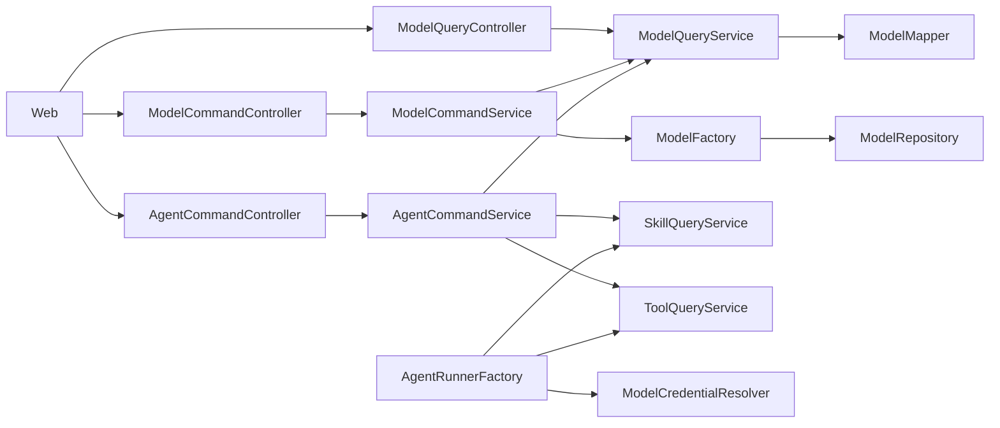

- 命令类：模型新增/编辑/删除/启用/禁用走 `ModelCommandController` + `ModelCommandService`；Agent 保存/发布走 `AgentCommandService`。
- 查询类：模型列表/详情/选择器走 `ModelQueryController` + `ModelQueryService`。
- `AgentCommandService` 只能调用各资源的 QueryService 做校验，不直接调用其他领域 Repository/Gateway。
- `ModelCredentialResolver` 是运行时凭证解析能力，只按模型 `num` 查启用模型和解密 Key，不按 scope 做业务授权。

### 2.2 部署架构

部署架构不变，无新增应用/前端部署实例，复用现有部署架构。

### 2.3 架构自检

- [x] 应用架构已覆盖六层变更和调用关系。
- [x] 部署架构按用户默认决策保持不变。
- [x] 命令/查询职责已区分；Agent 跨资源校验走 QueryService。

## 3. Facade 层设计

本次 Facade 层只涉及权限常量和错误码复用，不新增通用领域基类、通用事件契约。

| 类/接口/枚举 | 包路径 | 职责 | 关键字段/方法 | 新增/修改 | 实现 Skill |
| --- | --- | --- | --- | --- | --- |
| `PermissionCode` | `ink.garry.rd.agent.ws.facade.auth.permission` | 增加模型写权限常量 | `MODEL_CREATE`、`MODEL_UPDATE`、`MODEL_DELETE`，保留 `MODEL_READ` | 修改 | impl-facade-module |
| `BizCode` | `ink.garry.rd.agent.ws.client.common` 或现有错误码位置 | 复用 `FORBIDDEN`、`MODEL_NOT_AVAILABLE`、`CONFLICT`；如无权限细分错误则复用权限方案的 `FORBIDDEN_PERMISSION` | 无新增必须项 | 修改/复用 | impl-client-module |

### 3.1 Facade 自检

- [x] 已明确无通用基类和事件契约变化。
- [x] 权限常量与权限管理方案对齐。

## 4. 领域层设计

### 4.1 业务层级划分

| 业务层级 | 领域 | 说明 |
| --- | --- | --- |
| 资产域 | model | LLM 模型接入资源，新增系统/空间归属。 |
| 智能体域 | agent | Agent 配置快照值对象扩展，不新增聚合。 |

### 4.2 模型（model）

#### 4.2.1 领域模型

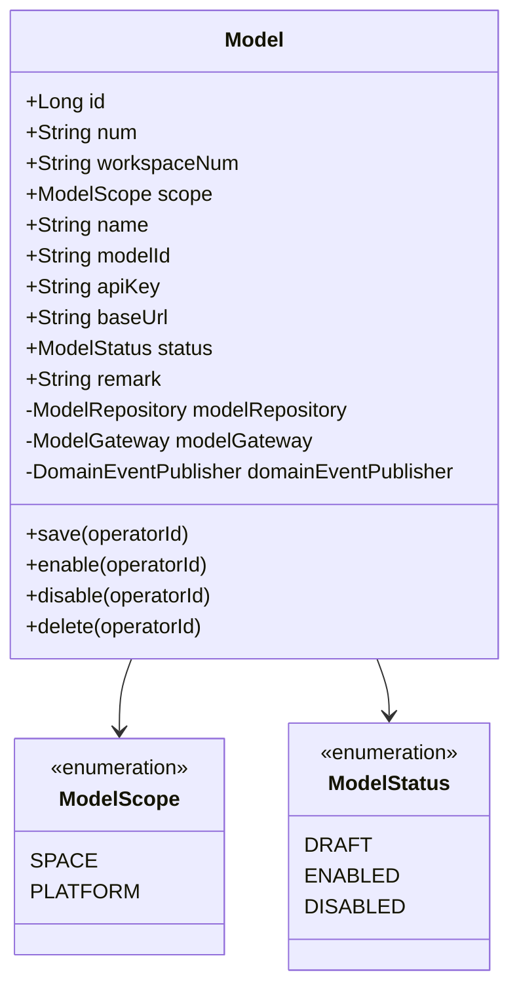

| 对象 | 类型 | 字段/关系 | 说明 |
| --- | --- | --- | --- |
| `Model` | 聚合根 | `scope: ModelScope` | 新增模型归属。 |
| `Model` | 聚合根 | `workspaceNum` | `SPACE` 必填；`PLATFORM` 必须为空。 |
| `Model` | 聚合根 | `apiKey` | 领域内仍为明文，infra 落库加密；系统模型不改变运行时解密逻辑。 |
| `ModelScope` | 枚举 | `SPACE/PLATFORM` | 与 DB `model.scope` 一致。 |

#### 4.2.2 领域动作

| 聚合/实体 | 领域动作 | 职责 | 前置条件 | 后置条件/规则 | 领域事件 |
| --- | --- | --- | --- | --- | --- |
| Model | `save(operatorId)` | 新增/编辑模型 | scope 非空；scope/workspace 一致 | 保存聚合；PLATFORM workspace 置空；SPACE workspace 非空 | `MODEL_SAVED` |
| Model | `enable(operatorId)` | 启用模型 | 状态为 DRAFT 或 DISABLED | status=ENABLED | `MODEL_ENABLED` |
| Model | `disable(operatorId)` | 禁用模型 | 状态为 ENABLED | status=DISABLED | `MODEL_DISABLED` |
| Model | `delete(operatorId)` | 删除草稿 | 状态为 DRAFT | infra/DB 软删除 | `MODEL_DELETED` |

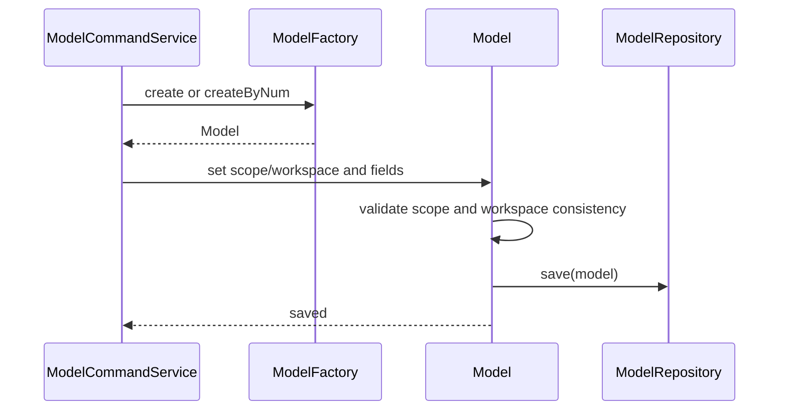

#### 4.2.3 领域规则

| 聚合/对象 | 规则类型 | 规则描述 | 违反时表达 |
| --- | --- | --- | --- |
| Model | 必填 | `scope/name/modelId/apiKey/baseUrl/status` 非空 | `INVALID_PARAM` |
| Model | scope 一致性 | `PLATFORM` 的 `workspaceNum` 必须为 null；`SPACE` 的 `workspaceNum` 必须非空 | `INVALID_PARAM` |
| Model | 状态流转 | 沿用既有三态机 | `MODEL_STATUS_INVALID` 或现有状态错误码 |
| Model | 唯一性 | SPACE 按工作空间唯一；PLATFORM 按平台唯一 | 应用层预检 + DB 唯一索引兜底 |
| Model | 安全 | 领域事件和日志不得包含 apiKey 明文/密文 | 单测/代码审查兜底 |

#### 4.2.4 领域工厂

| Factory | 方法名 | 入参 | 返回值 | 职责 | 依赖 |
| --- | --- | --- | --- | --- | --- |
| `ModelFactory` | `create(...)` | `scope, workspaceNum, name, modelId, apiKey, baseUrl, remark` | `Model` | 根据用户可填字段构建新模型；scope 由 application 判定后传入 | ModelRepository, ModelGateway, DomainEventPublisher |
| `ModelFactory` | `createByNum(num)` | `num` | `Model/null` | 按 num 加载既有模型并装配依赖 | ModelRepository, ModelGateway, DomainEventPublisher |

> 现有代码方法名为 `buildModel/buildModelByNum`。落码时可保留兼容方法，但新增/调整设计按 `create/createByNum` 收敛；若为降低改动面保留旧名，语义必须与上表一致。

#### 4.2.5 领域网关

| Gateway | 方法名 | 入参 | 返回值 | 职责 | 外部依赖 | 失败策略 |
| --- | --- | --- | --- | --- | --- | --- |
| `ModelGateway` | `generateModelNum()` | 无 | String | 生成模型业务编号 | BizNumGenerator | 生成失败抛业务异常 |

#### 4.2.6 领域事件

| 事件名 | 触发时机 | 载荷要点 | 可订阅方/用途 |
| --- | --- | --- | --- |
| `MODEL_SAVED` | 新增/编辑保存后 | `num, scope, workspaceNum, status`，不含 apiKey | 审计、缓存刷新 |
| `MODEL_ENABLED` | 启用后 | `num, scope, workspaceNum` | 审计 |
| `MODEL_DISABLED` | 禁用后 | `num, scope, workspaceNum` | 审计 |
| `MODEL_DELETED` | 草稿删除后 | `num, scope, workspaceNum` | 审计 |

### 4.3 Agent（agent）

#### 4.3.1 领域模型

`ConfigSnapshot` 是值对象，不新增 Agent 聚合根、Repository、Factory 或 Gateway。

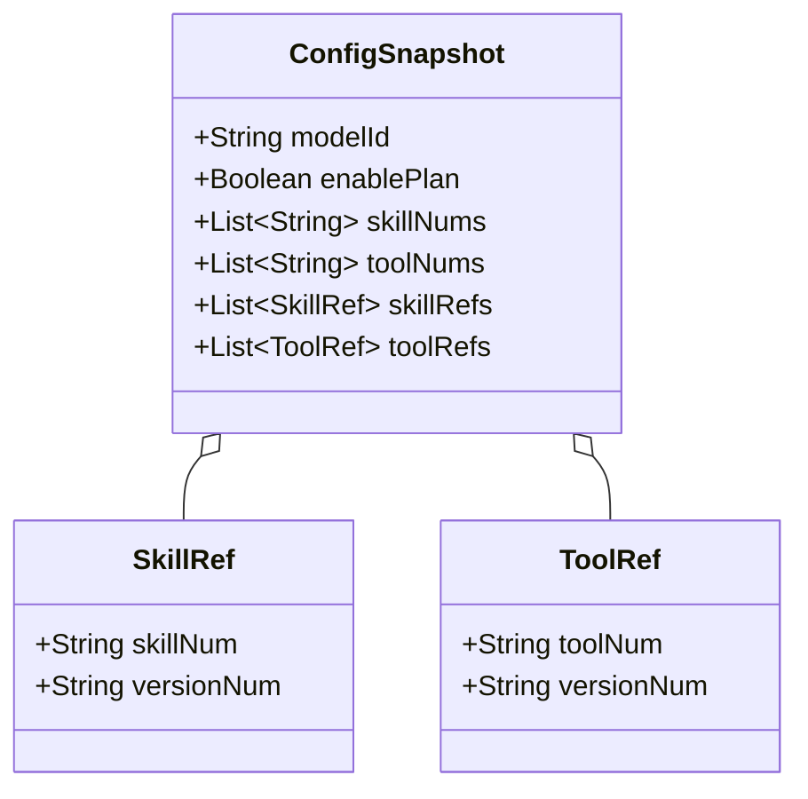

| 对象 | 类型 | 字段/关系 | 说明 |
| --- | --- | --- | --- |
| `ConfigSnapshot` | 值对象 | `enablePlan` | 默认 false；可空兼容旧快照。 |
| `ConfigSnapshot` | 值对象 | `skillRefs` | 新写入优先字段，元素为 `skillNum + versionNum`。 |
| `ConfigSnapshot` | 值对象 | `toolRefs` | 统一契约；仅当 Tool 具备版本号时强制写入版本。 |
| `ConfigSnapshot` | 值对象 | `skillNums/toolNums` | 兼容旧数据和前端旧回填，不作为新运行时主依据。 |

#### 4.3.2 领域动作

不适用。`ConfigSnapshot` 为值对象，校验与补齐在 application 层完成。

#### 4.3.3 领域规则

| 聚合/对象 | 规则类型 | 规则描述 | 违反时表达 |
| --- | --- | --- | --- |
| ConfigSnapshot | 默认值 | `enablePlan == null` 时按 false 处理 | 反序列化后归一化 |
| ConfigSnapshot | 模型引用 | `modelId` 继续存模型 `num` | 保存/发布校验不通过抛 `MODEL_NOT_AVAILABLE` |
| ConfigSnapshot | 版本引用 | `skillRefs`/`toolRefs` 中同一资源不重复；`versionNum` 非空 | `INVALID_PARAM` |
| ConfigSnapshot | 兼容 | refs 缺失时可从旧 nums 补齐当前发布版本，并记录 warning | 兼容期后改为强校验 |

#### 4.3.4 领域工厂

不新增。Agent/AgentVersion 既有 Factory 不变。

#### 4.3.5 领域网关

不新增。资源版本解析由 application QueryService 完成，运行时装配不引入领域 Gateway。

#### 4.3.6 领域事件

不新增。Agent 发布、版本归档等事件沿用既有事件。

### 4.4 领域自检

- [x] Model 聚合新增 scope，领域动作、规则、工厂、网关、事件已覆盖。
- [x] Agent 仅调整值对象，已明确无新增聚合/工厂/网关/事件。
- [x] 软删除仍属于 infra/DB 细节；系统模型 Key 不进入事件载荷。

## 5. 基础设施层设计

### 5.1 model 领域

| 类型 | 类名 | 包路径 | 职责 | 依赖 | 对应表/外部 | 新增/修改 |
| --- | --- | --- | --- | --- | --- | --- |
| Entity | `ModelEntity` | `infra.model.entity` | 新增 `scope` 字段，`workspaceNum` 允许 null | 无 | `model` | 修改 |
| Mapper | `ModelMapper` | `infra.model.mapper` | 复用 BaseMapper；必要时增加 selectable 查询 SQL | MyBatis-Plus | `model` | 修改 |
| RepositoryImpl | `ModelRepositoryImpl` | `infra.model.repository` | Entity/Domain 映射 scope；PLATFORM 保存时 workspace 置 null | ModelMapper, SecretCipher | `model` | 修改 |
| FactoryImpl | `ModelFactoryImpl` | `infra.model.factory` | 构建/加载 Model 时装配 scope | ModelRepository, ModelGateway | 无 | 修改 |
| GatewayImpl | `ModelGatewayImpl` | `infra.model.gateway` | 生成 num，保持不变 | BizNumGenerator | 无 | 不变 |
| Runtime | `ModelCredentialResolver` | `infra.model.gateway` | 运行时按 num 解密凭证；不感知 scope | ModelMapper, SecretCipher | `model` | 注释/测试补强 |

### 5.2 agent 领域

| 类型 | 类名 | 包路径 | 职责 | 依赖 | 对应表/外部 | 新增/修改 |
| --- | --- | --- | --- | --- | --- | --- |
| Entity | `AgentVersionEntity` | `infra.agent.entity` | snapshot JSON 兼容新增字段，无 DDL | JSON 序列化 | `agent_version.snapshot` | 修改/验证 |
| Runtime | `AgentRunnerFactory` | `application.agentrunner.factory` | 优先按 `skillRefs/toolRefs` 装配资源版本；旧 nums 兜底 | SkillQueryService, ToolQueryService | Skill/Tool | 修改 |

### 5.3 版本资源解析约定

| 资源 | 当前代码能力 | 新增解析方式 |
| --- | --- | --- |
| Skill | 有 `skill_version` 与 `currentVersionNum` | 保存/发布时写 `skillRefs[].versionNum = SkillDTO.currentVersionNum`；运行时用 `SkillQueryService.versionDetail(skillNum, versionNum)`。 |
| Tool | 当前无独立版本表 | 保留 `toolRefs` 契约；若 Tool 后续新增版本，保存/发布时写当前发布版本，运行时按 `toolNum + versionNum` 解析。当前实现继续用 `toolNums`/`findByNum`。 |
| Sandbox | 当前仅 `sandboxRef` | 不在本期版本钉住范围；后续有版本时复用 refs 模式。 |

### 5.4 基础设施自检

- [x] Entity/Repository/Factory 与 DB scope 字段一致。
- [x] `ModelCredentialResolver` 不承担授权职责，授权在保存/发布阶段完成。
- [x] Agent snapshot 为 JSON，无新增表结构。

## 6. 应用层设计

### 6.1 业务模块划分

| 业务模块 | Service | 职责 |
| --- | --- | --- |
| model 写 | `ModelCommandService` | 创建/编辑/删除/启用/禁用模型，按 scope 做唯一性预检与 workspace 归一化。 |
| model 读 | `ModelQueryService` | 查询系统/空间模型、选择器、归属校验、脱敏策略。 |
| agent 写 | `AgentCommandService` | Agent 保存/发布校验模型归属、补齐资源版本 refs、写入 enablePlan。 |
| agent 运行时 | `AgentRunnerFactory` | 按 snapshot refs 解析版本化资源；legacy 兜底。 |

### 6.2 model（ModelCommandService / ModelQueryService）

#### 6.2.1 Service 方法清单

| Service | 方法签名 | 职责 | 入参/出参 |
| --- | --- | --- | --- |
| ModelCommandService | `ModelDTO createModel(ModelCreateParamDTO param, String operatorId, ModelScope scope, String workspaceNum)` | 新建模型；scope 由 adapter/上下文解析后传入；PLATFORM 强制 workspace null | ParamDTO → ModelDTO |
| ModelCommandService | `void updateModel(ModelUpdateParamDTO param, String operatorId, ModelScope requestScope, String workspaceNum)` | 编辑模型；校验目标模型 scope 与请求入口一致；apiKey 留空保留 | ParamDTO |
| ModelCommandService | `void deleteModel(String num, String operatorId, ModelScope requestScope, String workspaceNum)` | 删除草稿；校验入口归属 | num |
| ModelCommandService | `void enableModel(String num, String operatorId, ModelScope requestScope, String workspaceNum)` | 启用模型；校验入口归属 | num |
| ModelCommandService | `void disableModel(String num, String operatorId, ModelScope requestScope, String workspaceNum)` | 禁用模型；校验入口归属 | num |
| ModelQueryService | `PageVO<ModelDTO> pageModels(ModelPageQueryParamDTO param, ModelScope scope, String workspaceNum)` | 列表；SPACE 查当前空间，PLATFORM 查系统模型 | PageVO |
| ModelQueryService | `ModelDetailDTO getDetail(String num, ModelScope requestScope, String workspaceNum)` | 详情；按入口校验可见性 | DetailDTO |
| ModelQueryService | `List<ModelSelectableDTO> listSelectable(String workspaceNum)` | Agent 选择器：系统启用模型 + 当前空间启用模型，不含 Key | List |
| ModelQueryService | `ModelDTO requireSelectableEnabled(String modelNum, String workspaceNum)` | Agent 保存/发布归属校验：PLATFORM 或当前 SPACE 且 ENABLED | ModelDTO |
| ModelQueryService | `boolean existsByScopeAndModelId(ModelScope scope, String workspaceNum, String modelId, String excludeNum)` | 唯一性预检 | boolean |
| ModelQueryService | `boolean existsByScopeAndName(ModelScope scope, String workspaceNum, String name, String excludeNum)` | 名称唯一性预检 | boolean |

#### 6.2.2 方法时序逻辑

**createModel**

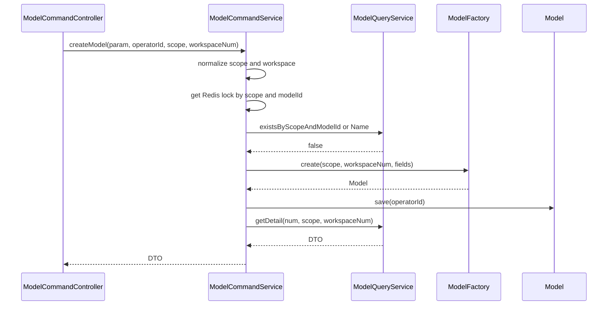

**update/enable/disable/delete**

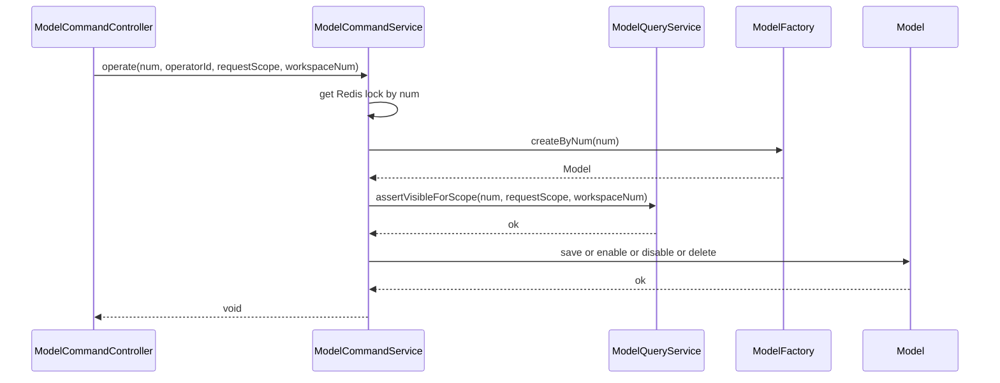

**listSelectable**

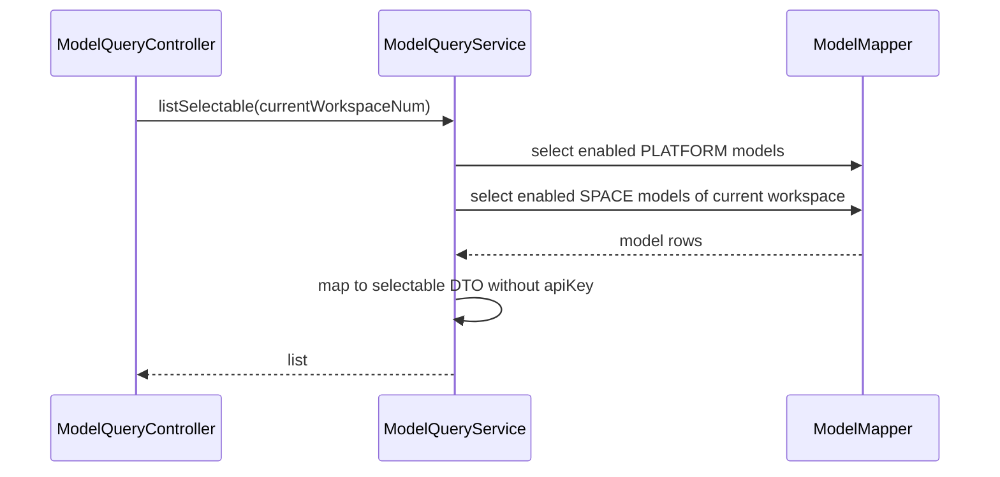

### 6.3 agent（AgentCommandService）

#### 6.3.1 Service 方法清单

| Service | 方法签名 | 职责 |
| --- | --- | --- |
| AgentCommandService | `String create(AgentCreateParam param, String operatorId)` | 组装 ConfigSnapshot，写入 `enablePlan`，补齐 refs。 |
| AgentCommandService | `void editDraftVersion(String versionId, Map<String,Object> configDraft, String operatorId)` | 反序列化 ConfigSnapshot 后校验模型归属、补齐资源版本。 |
| AgentCommandService | `String publish(PublishParam param, String operatorId)` | 发布前再次校验模型归属和资源版本存在性。 |
| AgentCommandService | `ConfigSnapshot normalizeSnapshot(ConfigSnapshot snapshot, String workspaceNum)` | 默认 false、legacy nums 补齐 refs、去重。 |
| AgentCommandService | `void validateModelSelectable(String modelNum, String workspaceNum)` | 调 `ModelQueryService.requireSelectableEnabled`。 |
| AgentCommandService | `List<SkillRef> resolveSkillRefs(List<String> skillNums, List<SkillRef> skillRefs, String workspaceNum)` | 新 refs 优先；旧 nums 查当前发布版本补齐。 |

#### 6.3.2 方法时序逻辑

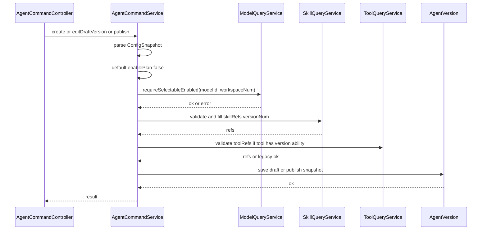

### 6.4 agent 运行时（AgentRunnerFactory）

#### 6.4.1 Service 方法清单

| 方法/能力 | 职责 | 兼容策略 |
| --- | --- | --- |
| `resolveModel(snapshot.modelId)` | 继续调用 `ModelCredentialResolver.resolve(modelNum)` | 不按 scope 授权，保存/发布已校验。 |
| `resolveSkills(snapshot.skillRefs)` | 按 `skillNum + versionNum` 加载版本资源 | refs 为空时用 `skillNums` 查当前发布版本并 warning。 |
| `resolveTools(snapshot.toolRefs)` | Tool 具备版本后按 `toolNum + versionNum` 加载 | 当前 Tool 无版本表时沿用 `toolNums`。 |
| `ignoreEnablePlan(snapshot.enablePlan)` | 本期不消费 Plan 模式 | 仅保留日志/调试展示，不改变模型调用参数。 |

#### 6.4.2 方法时序逻辑

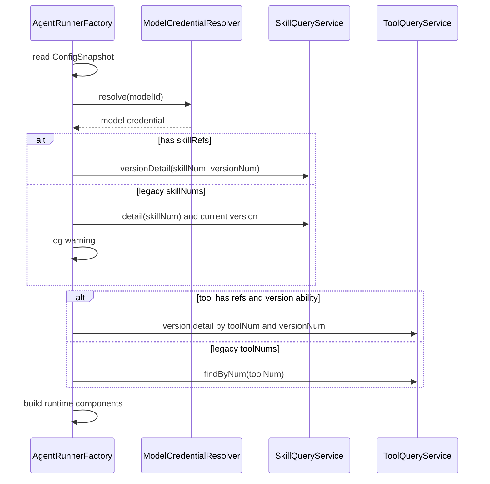

### 6.5 应用层自检

- [x] CommandService 不直接注入/调用 domain Repository 或 Gateway。
- [x] 模型归属校验收敛到 `ModelQueryService.requireSelectableEnabled`。
- [x] 资源版本补齐在保存/发布阶段完成，运行时优先按 refs。

## 7. Adapter 层设计

### 7.1 业务模块划分

| 模块 | 入口 | 类型 | 应用服务 |
| --- | --- | --- | --- |
| model 写 | `ModelCommandController` | HTTP POST | ModelCommandService |
| model 读 | `ModelQueryController` | HTTP GET | ModelQueryService |
| model 装配 | `ModelVoAssembler` | Assembler | DTO/VO 转换、系统 Key 剔除 |
| security | `RouteRoleMapping` | Filter 配置 | 权限映射 |

### 7.2 Controller 接口清单

基础路径优先沿用现有 `/api/v1/model`。为兼容 PRD/前端约定，可为选择器增加 `/api/v1/models/selectable` 只读别名；其他接口不做复数路径迁移。

| Controller | 方法 | HTTP | 路径 | 入参 | 出参 | 权限 |
| --- | --- | --- | --- | --- | --- | --- |
| ModelCommandController | create | POST | `/api/v1/model/create` | `ModelCreateParam` | `Result<ModelVO>` | SPACE: `model:create`; PLATFORM: `system:manage_settings` |
| ModelCommandController | update | POST | `/api/v1/model/update` | `ModelUpdateParam` | `Result<Void>` | SPACE: `model:update`; PLATFORM: `system:manage_settings` |
| ModelCommandController | delete | POST | `/api/v1/model/delete` | `ModelOperateParam` | `Result<Void>` | SPACE: `model:delete`; PLATFORM: `system:manage_settings` |
| ModelCommandController | enable | POST | `/api/v1/model/enable` | `ModelOperateParam` | `Result<Void>` | SPACE: `model:update`; PLATFORM: `system:manage_settings` |
| ModelCommandController | disable | POST | `/api/v1/model/disable` | `ModelOperateParam` | `Result<Void>` | SPACE: `model:update`; PLATFORM: `system:manage_settings` |
| ModelQueryController | page | GET | `/api/v1/model/page` | `ModelPageQueryParam` | `Result<PageVO<ModelVO>>` | `model:read` 或 `system:manage_settings` |
| ModelQueryController | detail | GET | `/api/v1/model/detail` | `ModelDetailQueryParam` | `Result<ModelDetailVO>` | `model:read` 或 `system:manage_settings` |
| ModelQueryController | selectable | GET | `/api/v1/model/selectable` | `ModelSelectableQueryParam` | `Result<List<ModelSelectableVO>>` | 已登录 + Agent 编辑权限场景，服务端按当前空间过滤 |

> 入口 scope 判定：空间入口必须有当前工作空间上下文；系统入口必须具备 `system:manage_settings`，并将 scope 固定为 `PLATFORM`。若保留 `scope` 参数，服务端只把它作为入口意图，最终值由权限和上下文决策。

### 7.3 入参/出参 JSON

`ModelCreateParam`

```json
{
  "scope": "SPACE",
  "name": "GPT-4o",
  "modelId": "gpt-4o",
  "apiKey": "sk-xxx",
  "baseUrl": "https://api.openai.com/v1",
  "remark": "OpenAI official endpoint"
}
```

`ModelVO` 空间模型返回示例：

```json
{
  "num": "MDL2026061710010001",
  "workspaceNum": "WS-001",
  "scope": "SPACE",
  "name": "GPT-4o",
  "modelId": "gpt-4o",
  "apiKeyMasked": "sk-****",
  "baseUrl": "https://api.openai.com/v1",
  "status": "ENABLED"
}
```

`ModelVO` 系统模型返回示例：

```json
{
  "num": "MDL2026061710010002",
  "workspaceNum": null,
  "scope": "PLATFORM",
  "name": "Claude 3.5",
  "modelId": "claude-3-5",
  "baseUrl": "https://api.anthropic.com/v1",
  "status": "ENABLED"
}
```

> 系统模型响应中不得出现 `apiKey`、`apiKeyMasked`、`apiKeyPrefix`、`apiKeyCipher` 任一字段。

`ModelSelectableVO`

```json
{
  "num": "MDL2026061710010002",
  "scope": "PLATFORM",
  "name": "Claude 3.5",
  "modelId": "claude-3-5",
  "baseUrl": "https://api.anthropic.com/v1",
  "status": "ENABLED"
}
```

`AgentCreateParam` 快照相关字段：

```json
{
  "modelId": "MDL2026061710010002",
  "enablePlan": false,
  "skillRefs": [
    {"skillNum": "SKL202606010001", "versionNum": "1.0.3"}
  ],
  "toolRefs": [
    {"toolNum": "MCP202606010001", "versionNum": "1.0.0"}
  ],
  "skillNums": ["SKL202606010001"],
  "toolNums": ["MCP202606010001"]
}
```

### 7.4 接口时序逻辑

**GET selectable**

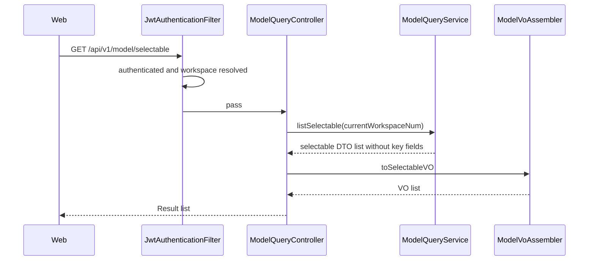

**POST create/update**

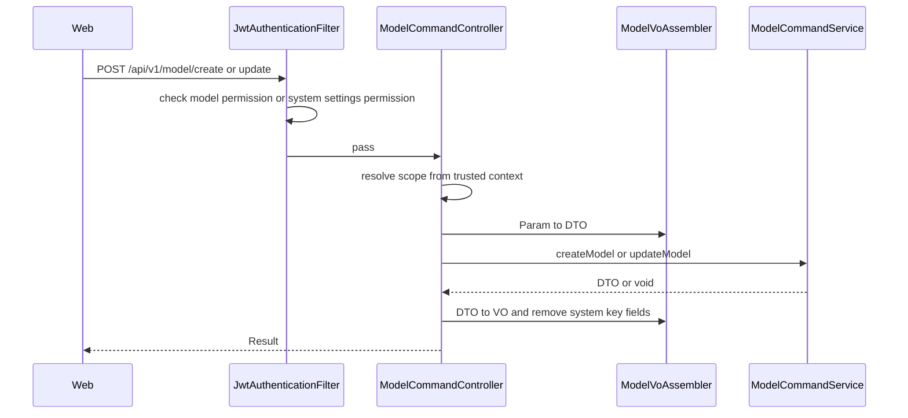

### 7.5 定时任务与事件监听

本次无新增定时任务、无新增事件监听。

### 7.6 Adapter 自检

- [x] HTTP 仅使用 GET/POST。
- [x] Controller 入参使用 `*Param`，返回使用 `*VO`。
- [x] 系统模型 Key 在 Assembler/VO 阶段剔除，选择器无 Key 字段。
- [x] 无新增定时任务和事件监听，已明确说明。

## 8. 数据库设计

### 8.1 表结构变更

表：`model`

| 字段 | 类型 | 必填 | 默认值 | 说明 |
| --- | --- | --- | --- | --- |
| `scope` | `VARCHAR(16)` | Y | `SPACE` | `SPACE` 或 `PLATFORM`。 |
| `workspace_num` | `VARCHAR(64)` | N | NULL | 从 NOT NULL 改为 nullable；PLATFORM 必须为 NULL。 |
| `platform_model_id_key` | `VARCHAR(128)` generated | N | NULL | 仅 PLATFORM 生成 `model_id`，用于平台模型唯一约束。 |
| `platform_name_key` | `VARCHAR(128)` generated | N | NULL | 仅 PLATFORM 生成 `name`，保持与空间模型同名唯一体验。 |

保留索引：

- `uq_model_num(num)`。
- `uq_model_ws_model_id(workspace_num, model_id, deleted)`：SPACE 空间内 modelId 唯一。
- `uq_model_ws_name(workspace_num, name, deleted)`：SPACE 空间内 name 唯一。

新增索引：

- `uq_model_platform_model_id(platform_model_id_key, deleted)`：PLATFORM 内 modelId 唯一。
- `uq_model_platform_name(platform_name_key, deleted)`：PLATFORM 内 name 唯一。
- `idx_model_scope_status(scope, workspace_num, status, deleted)`：选择器和列表查询。

### 8.2 DDL（Flyway V29__model_scope_platform.sql）

```sql
SET NAMES utf8mb4;

ALTER TABLE `model`
  ADD COLUMN `scope` VARCHAR(16) NOT NULL DEFAULT 'SPACE' COMMENT '模型归属：SPACE=空间模型，PLATFORM=系统模型' AFTER `workspace_num`;

UPDATE `model`
SET `scope` = 'SPACE'
WHERE `scope` IS NULL OR `scope` = '';

ALTER TABLE `model`
  MODIFY COLUMN `workspace_num` VARCHAR(64) NULL DEFAULT NULL COMMENT '归属工作空间业务编号；系统模型为空';

ALTER TABLE `model`
  ADD COLUMN `platform_model_id_key` VARCHAR(128)
    GENERATED ALWAYS AS (
      CASE WHEN `scope` = 'PLATFORM' THEN `model_id` ELSE NULL END
    ) STORED COMMENT '系统模型 model_id 唯一约束生成列',
  ADD COLUMN `platform_name_key` VARCHAR(128)
    GENERATED ALWAYS AS (
      CASE WHEN `scope` = 'PLATFORM' THEN `name` ELSE NULL END
    ) STORED COMMENT '系统模型 name 唯一约束生成列';

ALTER TABLE `model`
  ADD UNIQUE KEY `uq_model_platform_model_id` (`platform_model_id_key`, `deleted`),
  ADD UNIQUE KEY `uq_model_platform_name` (`platform_name_key`, `deleted`),
  ADD KEY `idx_model_scope_status` (`scope`, `workspace_num`, `status`, `deleted`);
```

> MySQL 生成列使用 `NULL` 避免约束 SPACE 数据。不得改成 `UNIQUE(scope, model_id, deleted)`，否则会导致不同空间 SPACE 模型同 `model_id` 冲突。

### 8.3 权限种子刷新（Flyway V30__refresh_authz_model_permissions.sql）

若当前权限种子尚未包含 `model:create`、`model:update`、`model:delete`，新增或刷新：

```sql
INSERT INTO `permission` (`code`, `name`, `resource`, `description`, `sort_order`, `create_time`, `update_time`)
VALUES
('model:create', '创建模型', 'model', '创建空间模型', 904, NOW(3), NOW(3)),
('model:update', '编辑模型', 'model', '编辑、启用、禁用空间模型', 906, NOW(3), NOW(3)),
('model:delete', '删除模型', 'model', '删除草稿空间模型', 908, NOW(3), NOW(3))
ON DUPLICATE KEY UPDATE
  `name` = VALUES(`name`),
  `resource` = VALUES(`resource`),
  `description` = VALUES(`description`),
  `sort_order` = VALUES(`sort_order`),
  `update_time` = NOW(3);
```

内置角色刷新策略：

- `SPACE_ADMIN` 增加 `model:create`、`model:update`、`model:delete`。
- `SPACE_MEMBER` 保留 `model:read`。
- `PLATFORM_ADMIN` 全权限或通过 platform_admin 短路，系统模型写操作仍要求 `system:manage_settings`。

### 8.4 Agent 快照 JSON

`agent_version.snapshot` 为 JSON 列，无 DDL。新增 JSON 字段：

```json
{
  "enablePlan": false,
  "skillRefs": [{"skillNum": "SKL...", "versionNum": "1.0.0"}],
  "toolRefs": [{"toolNum": "MCP...", "versionNum": "1.0.0"}]
}
```

### 8.5 数据库自检

- [x] `model.id` 仍为 BIGINT 自增，`create_time/update_time` 保持毫秒精度。
- [x] DDL 包含存量迁移和索引调整。
- [x] PLATFORM 唯一约束只作用于系统模型，不影响 SPACE 跨空间同名/同 modelId。
- [x] Agent 快照 JSON 不需要表结构变更。

## 9. 模块变更清单

| 层 | 变更 | 实现 Skill |
| --- | --- | --- |
| facade | `PermissionCode` 增加 `model:create/update/delete`；确认 `system:manage_settings` 可用于系统模型写操作 | impl-facade-module |
| client | `ModelCreateParam/ModelUpdateParam/ModelPageQueryParam/ModelVO/ModelDTO` 增加 `scope`；新增 `ModelSelectableVO/DTO`；Agent Param/VO 增加 `enablePlan/skillRefs/toolRefs` | impl-client-module |
| domain | `Model` 增加 `scope`；新增 `ModelScope`；`ConfigSnapshot` 增加 `enablePlan`、`SkillRef`、`ToolRef` | impl-domain-module |
| infra | `ModelEntity/ModelRepositoryImpl/ModelFactoryImpl` 增加 scope 映射；新增 Flyway V29/V30；`ModelCredentialResolver` 测试补强 | impl-infra-module |
| application | `ModelCommandService/ModelQueryService` 增加 scope 查询、系统 Key 剔除、选择器、归属校验；`AgentCommandService` 增加 enablePlan、refs 补齐和版本校验；`AgentRunnerFactory` 按 refs 解析 | impl-application-module |
| adapter | `ModelCommandController/ModelQueryController/ModelVoAssembler` 增加 scope 入口、selectable、VO 剔除；`RouteRoleMapping` 增加路径权限 | impl-adapter-module |

### 9.1 前端变更清单

| 模块 | 变更 |
| --- | --- |
| 导航 | 新增「系统 → 模型管理」，仅 `system:manage_settings` 可见。 |
| 模型管理页 | 复用现有模型管理组件；空间入口固定 SPACE，系统入口固定 PLATFORM。 |
| 编辑 Drawer | 系统模型编辑时 API Key 输入框为空，占位“留空保留原值”，不提供显隐查看。 |
| 列表/详情 | 系统模型不展示 API Key；空间模型沿用脱敏展示。 |
| Agent 配置 | 关联模型下拉使用 selectable 接口，展示“系统/空间”tag；基本信息增加 `enablePlan` 开关。 |
| Agent 资源 | Skill/Tool 选择回填 refs；旧 nums 可读但新保存优先提交 refs。 |

### 9.2 变更清单自检

- [x] 每条变更可对应唯一实现 Skill。
- [x] 前端仅列接口/页面改造，不展开 UI 细节。

## 10. 代码分支命名

本方案对应分支：`feature-20260617-model-management-scope`

## 11. 实现顺序与依赖

| 顺序 | 层 | 内容 | 依赖 |
| --- | --- | --- | --- |
| 1 | facade | 权限常量补齐 | 无 |
| 2 | client | Model/Agent Param、DTO、VO 契约 | 1 |
| 3 | domain | Model scope、ConfigSnapshot refs/enablePlan | 2 |
| 4 | infra | model 表迁移、Entity/Repository/Factory 映射 | 3 |
| 5 | application | Model scope 编排、Agent 校验与 refs 补齐、运行时解析 | 4 |
| 6 | adapter | Controller、Assembler、RouteRoleMapping | 5 |
| 7 | frontend | 菜单、页面复用、Agent 表单 | 6 |
| 8 | tests | 单测/集成测试/迁移验证 | 1-7 |

## 12. 接口与数据契约

| API | HTTP | 路径 | 入参 | 出参 | 说明 |
| --- | --- | --- | --- | --- | --- |
| 创建模型 | POST | `/api/v1/model/create` | `ModelCreateParam` | `Result<ModelVO>` | scope 由服务端最终判定。 |
| 编辑模型 | POST | `/api/v1/model/update` | `ModelUpdateParam` | `Result<Void>` | 系统模型 apiKey 留空保留。 |
| 删除模型 | POST | `/api/v1/model/delete` | `ModelOperateParam` | `Result<Void>` | 仅草稿。 |
| 启用模型 | POST | `/api/v1/model/enable` | `ModelOperateParam` | `Result<Void>` | DRAFT/DISABLED → ENABLED。 |
| 禁用模型 | POST | `/api/v1/model/disable` | `ModelOperateParam` | `Result<Void>` | ENABLED → DISABLED。 |
| 模型分页 | GET | `/api/v1/model/page` | `ModelPageQueryParam` | `Result<PageVO<ModelVO>>` | 系统入口查 PLATFORM，空间入口查 SPACE。 |
| 模型详情 | GET | `/api/v1/model/detail` | `ModelDetailQueryParam` | `Result<ModelDetailVO>` | 系统模型无 Key 字段。 |
| 可选模型 | GET | `/api/v1/model/selectable` | `ModelSelectableQueryParam` | `Result<List<ModelSelectableVO>>` | 系统启用模型 + 当前空间启用模型；无 Key 字段。 |
| 可选模型兼容别名 | GET | `/api/v1/models/selectable` | 同上 | 同上 | 仅在前端已按 PRD 复数路径实现时增加。 |

关键值对象：

```java
class SkillRef {
    private String skillNum;
    private String versionNum;
}

class ToolRef {
    private String toolNum;
    private String versionNum;
}
```

## 13. 测试方案

| 测试类型 | 覆盖点 |
| --- | --- |
| Flyway 迁移测试 | 存量 model 迁移为 SPACE；workspace 可空；PLATFORM 唯一约束不影响不同空间 SPACE 同 modelId。 |
| ModelQueryService 单测 | 系统模型列表/详情/selectable 不含 `apiKeyMasked`；空间模型仍脱敏。 |
| ModelCommandService 单测 | PLATFORM 创建 workspace 置 null；SPACE 无 workspace 拒绝；唯一性预检分 scope。 |
| AgentCommandService 单测 | 当前空间模型可保存；其他空间模型拒绝；系统模型可保存；禁用模型拒绝。 |
| ConfigSnapshot 序列化测试 | `enablePlan` 缺失默认 false；`skillRefs/toolRefs` 可反序列化；旧 `skillNums/toolNums` 可兼容。 |
| 运行时解析测试 | Skill 有 refs 时按 `versionNum` 取版本；legacy skillNums 兜底并记录 warning。 |
| 权限集成测试 | space_member 不能创建/编辑/删除空间模型；space_admin 可以；非 platform_admin 不能写系统模型。 |
| 安全回归测试 | 系统模型 VO JSON 不出现 `apiKey/apiKeyMasked/apiKeyPrefix/apiKeyCipher`。 |

## 14. 其他

### 14.1 非功能落地

| 项 | 落地方式 |
| --- | --- |
| 性能 | selectable 使用两次索引查询后内存合并，或 Mapper UNION；索引 `idx_model_scope_status` 支撑。 |
| 安全 | 系统 Key 不在 DTO/VO 中组装；日志、事件、异常消息不得拼接 Key。 |
| 兼容 | 保留 `/api/v1/model`；Agent `modelId` 字段名不改；旧 nums 快照可读。 |
| 可观测 | legacy 资源版本兜底需 warning 日志，便于后续清理。 |

### 14.2 PRD 覆盖核对

| PRD 条目 | 技术设计 |
| --- | --- |
| 模型 scope 维度 | §4.2、§5.1、§8 |
| 平台模型管理入口 | §7、§9.1 |
| 系统 Key 严控 | §6.2、§7.3、§13 |
| Agent 关联模型扩展 | §6.3、§7.2、§12 |
| Agent Plan 模式 | §4.3、§6.3 |
| Agent 资源版本钉住 | §4.3、§5.3、§6.3、§6.4 |
| 权限点扩展 | §3、§7.2、§8.3 |

