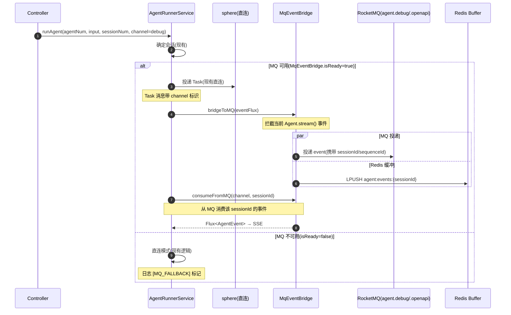
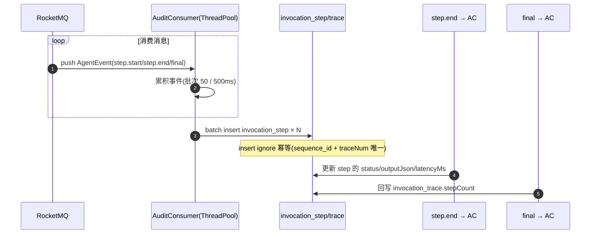
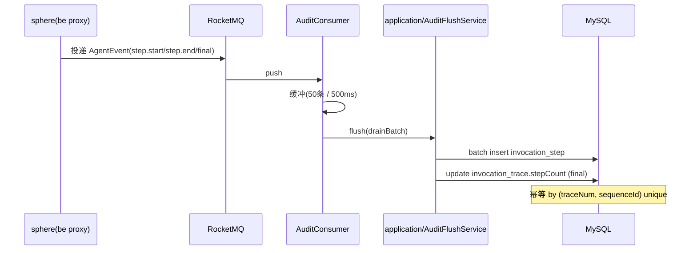
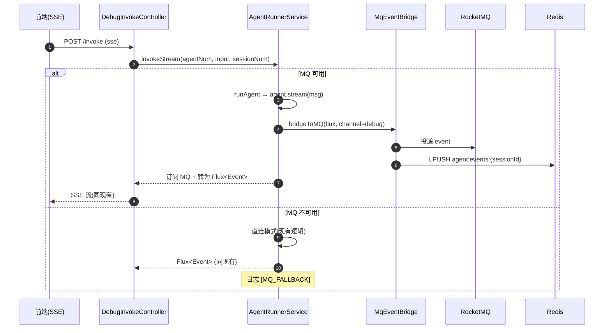

# Agent 运行时 MQ 优化 — 技术方案

> 文档日期：2026-06-18　|　版本：v1.0  
> 对应 PRD：[2026-06-18_Agent运行时MQ优化-PRD.md](../../产品方案/2026-06-18_Agent运行时MQ优化-PRD.md)  
> 代码分支：`feature-20260618-agent-mq-optimization`

---

## 1. 目标与范围

### 1.1 目标

在 rd-agent-be 侧引入 RocketMQ 消息队列，作为 Agent 执行事件的传输层，实现：

1. be 无状态化 — 多 Pod 下任意 Pod 均可响应 SSE 请求，无需 sticky session；
2. 调试台通道与 Open API 通道隔离 — 使用独立 Topic（`agent.debug` / `agent.openapi`），可独立限流降级；
3. SSE 断点续读 — 基于 Redis 缓存 5 分钟内事件，支持 `Last-Event-ID` 重连；
4. 旁路审计 — 独立 Consumer 异步写 `invocation_trace` 和新增的 `invocation_step` 表；
5. 降级能力 — MQ 不可用时自动切回直连模式（透传 sphere 的当前行为）。

### 1.2 设计共识

| 决策项 | 结论 |
|--------|------|
| 部署架构 | 不变，复用现有 K8s 部署；RocketMQ 由中间件团队提供，本方案不涉及 |
| MQ 选型 | RocketMQ |
| Topic 隔离 | 同一集群，两个独立 Topic：`agent.debug` / `agent.openapi` |
| sphere 改造 | 不做，be 侧负责 MQ 事件转发 → sphere 的执行结果通过**回调/直连**方式返回，be 将其投递到 MQ |
| 现有 InvocationTrace 写入 | 保留兜底，旁路 consumer 作为补充 |
| 断点续读 Redis | be 侧独立完成，复用现有 Redis（Redisson / StringRedisTemplate） |
| 审计 Consumer | 部署在 be 进程内，独立线程池 |
| 降级回切 | 自动回切（MQ 恢复后自动切回 MQ 模式） |
| SSE 连接生命周期 | 等 MQ 消息消费完毕后再关闭 |
| 去重 | be 侧 Consumer 去重（`agent.openapi` at-least-once） |
| 审计表 | 新建 `invocation_step` 表 |

### 1.3 范围

**本期包含：**
- 引入 RocketMQ 客户端依赖（producer + consumer）
- 新增 `AgentEventBus` 领域服务，封装 MQ 事件投递与消费
- 改造 `AgentRunnerService.runAgent()` 执行流：事件流由直连 → via MQ
- 调试台 Topic 与 Open API Topic 路由机制
- SSE 断点续读（Redis 缓冲近 5 分钟事件）
- 旁路审计 Consumer（异步写 `invocation_trace` + `invocation_step`）
- MQ 不可用降级为直连模式 + 自动回切

**本期不包含：**
- sphere 侧改造（spherical 层不涉及）
- WebSocket 升级
- Human-in-the-loop / Agent 间协作
- MQ 监控告警运维配置

---

## 2. 架构设计

### 2.1 应用架构

#### 2.1.1 代码结构

| 层 | 领域 | 包 | 职责 |
|----|------|-----|------|
| facade | agent | `facade/agent` | `AgentEvent` 通用事件契约（事件类型枚举、事件 DTO） |
| client | mq | `client/mq` | MQ 事件传输 DTO、事件常量 |
| client | session | `client/session` | `InvocationTraceDTO`、`InvocationStepDTO`（审计入参） |
| domain | session | `domain/session` | `InvocationStep` 领域模型、`InvocationStepRepository`、`InvocationStepFactory` |
| infra | mq | `infra/mq` | RocketMQ Producer/Consumer 实现、事件序列化、MQ 配置 |
| infra | session | `infra/session` | `InvocationStepEntity`、`InvocationStepMapper`、`InvocationStepRepositoryImpl`、`InvocationStepFactoryImpl` |
| infra | common | `infra/common` | Redis 事件缓冲（`EventBufferGatewayImpl`） |
| application | agentrunner | `application/agentrunner` | `AgentRunnerService` 改造为 MQ 模式 + 降级策略 |
| application | mq | `application/mq` | MQ Consumer 桥接逻辑、`EventReplayService`（断点续读） |
| adapter | mq | `adapter/mq/listener` | MQ 事件监听入口（`AgentDebugConsumer`、`AgentOpenApiConsumer`、`AuditConsumer`） |
| adapter | config | `adapter/config` | MQ 线程池配置 |

#### 2.1.2 模块调用关系

```
Client → DebugInvokeController / OpenAgentController
    │  adapter 层
    ▼
AgentInvokeService / OpenAgentInvokeService
    │  application 层
    ▼
AgentRunnerService.runAgent() [改造]
    │  1. 投递 Task 到 sphere（直连，现有逻辑不变）
    │  2. 订阅 MQ（session_id 路由）
    │  3. await MQ 事件流 → 包装为 Flux<Event> 返回
    │  4. 事件同时写入 Redis 缓冲区（供续读）
    ▼
MQ Consumer Bridge (application/mq)
    ├── DebugConsumer → agent.debug Topic
    ├── OpenApiConsumer → agent.openapi Topic
    └── AuditConsumer → 旁路写 invocation_trace + invocation_step

MQ Producer (infra/mq)
    ↑ 由 AgentRunnerService 内部的转发逻辑调用
    ↑ 将 sphere 返回的事件投递到对应 Topic

Redis EventBuffer (infra/common)
    ↑ 由 AgentRunnerService 在收到事件时写入
    ↑ 供断点续读（EventReplayService）读取

Audit Consumer (adapter/mq/listener)
    ↑ 独立线程池消费两个 Topic 的 step 事件
    ↑ 异步写库
```

#### 2.1.3 命令类 / 查询类归属

| 操作 | 类型 | 说明 |
|------|------|------|
| `POST /api/v1/debug-console/invoke?sessionId=xxx` | 命令（CommandController） | 触发 Agent 执行，产生 SSE 流 |
| `GET /api/v1/debug-console/resume?sessionId=xxx&lastEventId=42` | 查询（QueryController） | SSE 断点续读，查询 Redis 缓冲区 |
| `POST /v1/open/agents/command/invoke` | 命令（CommandController） | 触发 Agent 执行，产生 SSE 流 |
| `POST 内部 MQ Consumer` | 事件监听 | 消费 MQ 事件 |

### 2.2 部署架构

部署架构不变，无新增应用/前端部署实例，复用现有部署架构。RocketMQ 集群由中间件团队提供，be 通过配置连接即可。

---

## 3. Facade 层设计

本次无 Facade 层变更。现有的 `DomainEntity`、`DomainEventDTO`、`DomainEventPublisher`、`Result` 等通用契约均满足本次需求，不涉及增加或修改。

新增的事件契约（`AgentEvent` 和事件类型枚举）将定义在 infra 层作为 MQ 消息体，不由 facade 层承载，因为 MQ 消息格式是基础设施层的实现细节，不应泄露到通用契约层。

---

## 4. 领域层设计

### 4.1 业务层级划分

| 层级 | 业务/子域 | 说明 |
|------|-----------|------|
| 核心域 | session | 会话、调用追踪、步骤追踪 |
| 支撑域 | mq（事件网关） | MQ 事件投递与消费的领域接口 |

### 4.2 调用追踪步骤（InvocationStep）

#### 4.2.1 领域模型

**领域类图：**

```
┌──────────────────────────────┐
│       InvocationStep         │  ← 值对象（非聚合根）
│  ─────────────────────────   │
│  - num: String               │
│  - traceNum: String          │  ← 关联 InvocationTrace.num
│  - sessionNum: String        │
│  - sequenceId: Long          │
│  - stepType: String          │  (step.start / step.end / message.delta / error)
│  - stepName: String          │  (skill_name / tool_name)
│  - inputJson: String         │
│  - outputJson: String        │
│  - status: String            │  (running / success / failed)
│  - latencyMs: Integer        │
│  - occurredAt: LocalDateTime │
│  - createNo: String          │
│  - updateNo: String          │
└──────────────────────────────┘
```

`InvocationStep` 是值对象而非聚合根——它依附于 `InvocationTrace` 而存在，通过 `traceNum` 关联。其生命周期由旁路审计 Consumer 管理（批量异步写入），不经过 domain Repository 的标准 save/delete/deleteByNum 路径。

| 对象 | 类型 | 属性 | 与其他对象关系 |
|------|------|------|--------------|
| InvocationStep | 值对象 | num, traceNum, sessionNum, sequenceId, stepType, stepName, inputJson, outputJson, status, latencyMs, occurredAt, createNo, updateNo | - 通过 traceNum 关联 InvocationTrace<br>- 通过 sessionNum 关联 Session |

#### 4.2.2 领域动作

| 聚合/实体 | 领域动作 | 职责 | 前置条件 | 后置条件 | 领域事件 |
|-----------|---------|------|---------|---------|---------|
| InvocationStep | 无 | 值对象，纯数据载体 | — | — | — |

InvocationStep 作为值对象，不封装领域行为。它的创建和持久化由 application 层的审计 Consumer 直接通过 infra Mapper 批量写入，不经 domain 层（因为批量写入的性能要求 > 领域封装价值）。这与现有 InvocationTrace 的设计保持一致——InvocationTrace 是聚合根，InvocationStep 是它的附属记录。

#### 4.2.3 领域规则

| 聚合/对象 | 规则类型 | 规则描述 | 违反时表达 |
|-----------|---------|---------|-----------|
| InvocationStep | 时序 | 同一个 traceNum 下 sequenceId 必须严格递增 | 审计 Consumer 收到乱序事件时，按 sequenceId 排序再批量写入 |

#### 4.2.4 领域工厂

本次无 Factory 变更。`InvocationStepRepository` 使用批量 insert 而非标准 CRUD。

#### 4.2.5 领域网关

本次新增 **EventGateway** 领域网关接口：

| Gateway | 方法名 | 入参 | 返回值 | 职责 | 外部依赖 | 失败策略 |
|---------|--------|------|--------|------|---------|---------|
| EventGateway | `publishEvent(channel, event)` | channel(String), event(AgentEvent) | void | 将 Agent 执行事件投递到对应 Topic | RocketMQ | 降级为直连（不投递） |
| EventGateway | `isAvailable()` | 无 | boolean | 检测 MQ 连接是否可用 | RocketMQ | 返回 false |
| EventGateway | `subscribeSession(sessionId, channel)` | sessionId(String), channel(String) | void | 订阅指定 session_id 的事件 | RocketMQ | 降级直连 |
| EventGateway | `unsubscribeSession(sessionId)` | sessionId(String) | void | 取消 session 订阅 | RocketMQ | 忽略失败 |
| EventGateway | `nextEvent(sessionId, timeout)` | sessionId(String), timeout(Duration) | Mono<AgentEvent> | 阻塞等待下一条 session 事件 | RocketMQ | 超时返回 empty |

**EventGateway** 接口定义在 domain 层（属于支撑域 `mq`），实现由 infra 层的 RocketMQ GatewayImpl 完成。

#### 4.2.6 领域事件

| 事件名 | 触发时机 | 载荷要点 | 可订阅方/用途 |
|--------|---------|---------|-------------|
| 无新增 | — | — | Agent 执行事件通过 MQ 而非 domain event 传递 |

---

## 5. 基础设施层设计

### 5.1 MQ 连接与事件投递

| 类型 | 类名 | 包路径 | 职责 |
|------|------|--------|------|
| GatewayImpl | `RocketMqEventGatewayImpl` | `infra/mq/gateway` | 实现 EventGateway 接口 |
| common | `MqConfig` | `infra/mq/config` | RocketMQ 连接配置（NameServer、Topic 映射） |
| common | `AgentEventSerializer` | `infra/mq/serializer` | AgentEvent ↔ 字节序列化 |
| common | `RocketMqProducer` | `infra/mq/producer` | RocketMQ Producer 单例（Spring Bean） |
| common | `RocketMqConsumer` | `infra/mq/consumer` | RocketMQ Consumer 管理（按 session_id 动态订阅） |

**MQ 消息体格式（AgentEvent）：**

```java
@Data
@AllArgsConstructor
@NoArgsConstructor
public class AgentEvent {
    private String sessionId;       // 会话编号
    private Long sequenceId;        // 全局递增序号
    private String eventType;       // message.delta / step.start / step.end / final / error
    private String eventName;       // 事件名称（step 时为 step_name）
    private Object payload;         // 事件载荷
    private Long timestamp;         // 事件时间戳（ms）
    private String traceId;         // W3C traceId
}
```

### 5.2 Redis 事件缓冲

| 类型 | 类名 | 包路径 | 职责 |
|------|------|--------|------|
| GatewayImpl | `EventBufferGatewayImpl` | `infra/common/gateway` | Redis List 缓冲事件 |

**Redis Key 设计：**
- `agent:events:{sessionId}` — List 结构，每个元素是 JSON 序列化的 AgentEvent
- TTL: 5 分钟（`EXPIRE agent:events:xxx 300`）
- 容量限制：每 session 最多保留 1000 条（List 超过后 trim）

### 5.3 InvocationStep 持久化

| 类型 | 类名 | 包路径 | 对应表 |
|------|------|--------|--------|
| Entity | `InvocationStepEntity` | `infra/session/entity` | `invocation_step` |
| Mapper | `InvocationStepMapper` | `infra/session/mapper` | MyBatis-Plus Mapper |
| common | `AuditBatchInserter` | `infra/session/repository` | 批量 insert（非 RepositoryImpl） |

### 5.4 MQ 降级探测器

| 类型 | 类名 | 包路径 | 职责 |
|------|------|--------|------|
| common | `MqHealthIndicator` | `infra/mq/health` | 检测 MQ 连接健康状态（实现 `isAvailable()`） |

`MqHealthIndicator` 使用心跳 + 定时检测：
- 每 5 秒发送一次 ping 检查 RocketMQ 连接状态
- 连续 3 次失败 → 标记 MQ 不可用
- 恢复 1 次 → 自动标记 MQ 可用

---

## 6. 应用层设计

### 6.1 业务模块划分

| 模块 | 说明 |
|------|------|
| agentrunner | AgentRunnerService 改造 — MQ 模式执行流 |
| mq | MQ Consumer 桥接逻辑、EventReplayService |

### 6.2 AgentRunner 模块

#### 6.2.1 Service 方法清单

| Service | 方法 | 入参 | 返回值 | 职责 |
|---------|------|------|--------|------|
| `AgentRunnerService`（改造） | `runAgent()` | agentNum, input, sessionNum, operatorId | `Flux<Event>` | 同现有签名，内部改为 MQ 模式 |
| `MqEventBridge`（新增） | `bridgeToMQ()` | Flux<Event> | `Flux<Event>` | 拦截 Event 流 → 写入 MQ + Redis buffer |
| `MqEventBridge` | `consumeFromMQ()` | channel, sessionId | `Flux<AgentEvent>` | 从 MQ 消费指定 session 事件 |
| `MqEventBridge` | `isReady()` | 无 | `Mono<Boolean>` | 检测 MQ 是否可用 |

#### 6.2.2 runAgent 改造时序逻辑



**改造后的 `runAgent()` 方法核心逻辑：**

1. **确定会话**（不变）：`StrUtil.isBlank(sessionNum) → createSession`
2. **构建 Agent**（不变）：`agentRunnerFactory.build(agentNum, sessionNum)`
3. **添加用户消息**（不变）：`sessionCommandService.appendUserMessage(...)`
4. **加载会话**（不变）：`agent.loadIfExists(redisSession, sessionNum)`
5. **决策**：MQ 是否可用？
   - **MQ 模式**：`agent.stream(msg)` → `.transform(MqEventBridge::bridgeToMQ)` → 同时调用 `MqEventBridge::consumeFromMQ` 从 MQ 消费并转为 SSE Event 返回 → 写入 Redis Buffer
   - **直连降级**：走现有逻辑

**MQ 模式与直连模式的转换细节：**

```
agent.stream(msg)              ← AgentScope 原生 Event 流
    │
    ▼
MqEventBridge.bridgeToMQ(Flux<Event>)
    │  1. 消费 Event 流
    │  2. 构建 AgentEvent（含 sequence_id）
    │  3. 投递到对应 Topic (agent.debug / agent.openapi)
    │  4. 写入 Redis buffer (agent:events:{sessionId})
    │  5. SegmentAccumulator 累积（现有逻辑）
    │  6. doOnComplete → sessionCommandService.appendAssistantMessage
    │  7. doOnComplete → agent.saveTo(redisSession)
    ▼
Flux<Event> (透传原始 Event)

```

**SSE 响应构建（MQ Consumer 侧）：**

```
consumeFromMQ(channel, sessionId)
    │
    ▼
Topic: agent.debug / agent.openapi
    │  按 sessionId:selector 过滤
    ├── event.id → sequenceId
    │  每个 MQ message → SseEvent
    ├── event: message.delta
    ├── event: step.start
    │  ...
    └── final → SSE close
```

#### 6.2.3 MQ → SSE 转换逻辑

**MqStreamConsumer**（新增 Service）负责将 MQ 消息流转换为 `Flux<Event>` 供 Controller 返回：

```java
@Service
public class MqStreamConsumer {

    public Flux<SseEvent> consume(String sessionId, String channel, Duration timeout) {
        return Flux.create(sink -> {
            MqConsumer consumer = mqClient.createConsumer(channel, sessionId, new MqMessageListener() {
                @Override
                public void onMessage(AgentEvent event) {
                    // 收到 final → sink.complete()
                    // 收到 error → sink.error()
                    // 其他 → sink.next(toSseEvent(event))
                }
                @Override
                public void onTimeout() {
                    sink.complete();
                }
            });
            sink.onCancel(consumer::close);
            consumer.subscribe();
        }).timeout(timeout);
    }
}
```

### 6.3 MQ Consumer 模块

#### 6.3.1 Service 方法清单

| Service | 方法 | 入参 | 返回值 | 职责 |
|---------|------|------|--------|------|
| `MqEventBridge` | `bridgeToMQ()` | Flux\<Event>, channel, sessionId | Flux\<Event> | 透传 Event 流 + 旁路投递 MQ + Redis  |
| `MqEventBridge` | `consumeFromMQ()` | channel, sessionId | Flux\<AgentEvent> | 从 MQ 订阅事件 |
| `MqEventBridge` | `createEventConsumer()` | channel, sessionId, timeout | Consumer\<AgentEvent> | 创建低层 MQ Consumer |
| `EventReplayService` | `replayEvents()` | sessionId, lastEventId | Flux\<AgentEvent> | 从 Redis 按 Last-Event-ID 续读 |
| `AuditFlushService` | `flushToDb()` | AgentEvent 批量 | void | 批量写 invocation_trace + invocation_step |

#### 6.3.2 旁路审计 Consumer 时序



---

## 7. Adapter 层设计

### 7.1 业务模块划分

| 模块 | 类型 | 说明 |
|------|------|------|
| mq/listener | MQ Consumer | 三个 Listener（Debug / OpenApi / Audit） |
| debugconsole | Controller | SSE 端点改造 + 新增续读端点 |
| open | Controller | Open API SSE 端点改造 |

### 7.2 MQ 事件监听

#### 7.2.1 监听清单

| 监听器 | Topic | Consumer Group | 职责 | 线程池 |
|--------|-------|---------------|------|--------|
| `AgentDebugConsumer` | `agent.debug` | `cg-agent-debug` | 推送给调试台 SSE | agentInvokeExecutor |
| `AgentOpenApiConsumer` | `agent.openapi` | `cg-agent-openapi` | 推送给业务方 SSE | agentInvokeExecutor |
| `AuditConsumer` | `agent.debug` + `agent.openapi` | `cg-audit` | 旁路审计写库 | evaluationExecutor |

#### 7.2.2 监听器时序逻辑



**消费者配置：**

| 配置项 | agent.debug | agent.openapi |
|--------|------------|--------------|
| 消费线程数 | 4 | 8 |
| 最大重试次数 | 0 (at-most-once) | 3 (at-least-once + 幂等) |
| 消息保留时长 | 1h | 24h |
| QPS 上限 | 500 | 500 |

#### 7.2.3 审计 Consumer 去重

`agent.openapi` Topic 是 at-least-once 语义，AuditConsumer 消费时用 `(traceNum, sequenceId)` 作为唯一约束，`insert ignore` 实现幂等。

### 7.3 HTTP Controller

#### 7.3.1 Controller 接口清单

| 方法 | 路径 | 入参 | 出参 | 职责 |
|------|------|------|------|------|
| POST（改造） | `/api/v1/debug-console/invoke` | `DebugInvokeRequest` | `Flux<Event>` (SSE) | 调试台 invoke → MQ 模式/降级 |
| POST（改造） | `/api/v1/open/agents/command/invoke` | `OpenInvokeParam` | `Flux<Event>` (SSE) | Open API invoke → MQ 模式/降级 |
| GET（新增） | `/api/v1/debug-console/resume` | `sessionId`, `lastEventId` | `Flux<SseEvent>` (SSE) | 断点续读 |

**续读端点 JSON 入参：**

```
GET /api/v1/debug-console/resume?sessionId=sess-xxx&lastEventId=42
```

返回值：续读事件流（SSE），格式与原 SSE 协议一致，每个事件携带 `id: {sequenceId}`。

#### 7.3.2 Controller 时序逻辑

**Post /invoke (SSE) — MQ 模式：**



**Controller 层面的降级对前端透明**：不论 MQ 模式还是直连模式，Controller 返回类型和 SSE 协议完全一致。

### 7.4 Config 新增

| 类型 | 类名 | 包路径 | 职责 |
|------|------|--------|------|
| config | `RocketMqConfig` | `adapter/config/mq` | RocketMQ 线程池与连接配置 |

---

## 8. 数据库设计

### 8.1 表结构

#### 8.1.1 invocation_step（新增）

```sql
CREATE TABLE `invocation_step` (
    `id`            BIGINT       NOT NULL AUTO_INCREMENT PRIMARY KEY COMMENT '自增主键',
    `num`           VARCHAR(64)  NOT NULL COMMENT '业务编号(ISTP前缀)',
    `trace_num`     VARCHAR(64)  NOT NULL COMMENT '关联 invocation_trace.num',
    `session_num`   VARCHAR(64)  NOT NULL COMMENT '会话编号',
    `sequence_id`   BIGINT       NOT NULL COMMENT '全局递增序号(SSE event.id)',
    `step_type`     VARCHAR(32)  NOT NULL COMMENT '事件类型: message.delta/step.start/step.end/final/error',
    `step_name`     VARCHAR(128) DEFAULT NULL COMMENT '步骤名(skill_name/tool_name/llm)',
    `input_json`    TEXT         DEFAULT NULL COMMENT '输入(step.start时)',
    `output_json`   TEXT         DEFAULT NULL COMMENT '输出(step.end/final时)',
    `status`        VARCHAR(16)  DEFAULT NULL COMMENT '状态: running/success/failed',
    `latency_ms`    INT          DEFAULT NULL COMMENT '耗时(ms,step.end时)',
    `occurred_at`   DATETIME(3)  NOT NULL COMMENT '事件发生时间',
    `create_no`     VARCHAR(64)  NOT NULL COMMENT '创建人',
    `update_no`     VARCHAR(64)  NOT NULL COMMENT '更新人',
    `create_time`   DATETIME(3)  NOT NULL DEFAULT CURRENT_TIMESTAMP(3) COMMENT '创建时间',
    `update_time`   DATETIME(3)  NOT NULL DEFAULT CURRENT_TIMESTAMP(3) ON UPDATE CURRENT_TIMESTAMP(3) COMMENT '最后更新时间',

    INDEX `idx_trace_num` (`trace_num`),
    UNIQUE KEY `uk_trace_seq` (`trace_num`, `sequence_id`),
    INDEX `idx_session_num` (`session_num`)
) ENGINE=InnoDB DEFAULT CHARSET=utf8mb4 COMMENT='Agent 调用步骤追踪';
```

#### 8.1.2 invocation_trace（现有表，无字段变更）

不变。旁路 Consumer 写入 `invocation_trace` 表的字段与现有逻辑一致，只是改为异步批量 insert。

### 8.2 DDL

```sql
-- 8.2.1 新建 invocation_step 表
CREATE TABLE `invocation_step` (
    `id`            BIGINT       NOT NULL AUTO_INCREMENT PRIMARY KEY COMMENT '自增主键',
    `num`           VARCHAR(64)  NOT NULL COMMENT '业务编号(ISTP前缀)',
    `trace_num`     VARCHAR(64)  NOT NULL COMMENT '关联 invocation_trace.num',
    `session_num`   VARCHAR(64)  NOT NULL COMMENT '会话编号',
    `sequence_id`   BIGINT       NOT NULL COMMENT '全局递增序号(SSE event.id)',
    `step_type`     VARCHAR(32)  NOT NULL COMMENT '事件类型: message.delta/step.start/step.end/final/error',
    `step_name`     VARCHAR(128) DEFAULT NULL COMMENT '步骤名(skill_name/tool_name/llm)',
    `input_json`    TEXT         DEFAULT NULL COMMENT '输入(step.start时)',
    `output_json`   TEXT         DEFAULT NULL COMMENT '输出(step.end/final时)',
    `status`        VARCHAR(16)  DEFAULT NULL COMMENT '状态: running/success/failed',
    `latency_ms`    INT          DEFAULT NULL COMMENT '耗时(ms,step.end时)',
    `occurred_at`   DATETIME(3)  NOT NULL COMMENT '事件发生时间',
    `create_no`     VARCHAR(64)  NOT NULL COMMENT '创建人',
    `update_no`     VARCHAR(64)  NOT NULL COMMENT '更新人',
    `create_time`   DATETIME(3)  NOT NULL DEFAULT CURRENT_TIMESTAMP(3) COMMENT '创建时间',
    `update_time`   DATETIME(3)  NOT NULL DEFAULT CURRENT_TIMESTAMP(3) ON UPDATE CURRENT_TIMESTAMP(3) COMMENT '最后更新时间',

    INDEX `idx_trace_num` (`trace_num`),
    UNIQUE KEY `uk_trace_seq` (`trace_num`, `sequence_id`),
    INDEX `idx_session_num` (`session_num`)
) ENGINE=InnoDB DEFAULT CHARSET=utf8mb4 COMMENT='Agent 调用步骤追踪';
```

### 8.3 刷数/数据迁移

本次无刷数操作。

### 8.4 与领域的对应

| 表 | 领域模型/值对象 | 说明 |
|----|----------------|------|
| `invocation_step` | `InvocationStep`（值对象） | 由 AuditConsumer 批量写入，不经过 domain Repository |

---

## 9. 模块变更清单

### facade

**本次无 Facade 层变更。** 新增的事件契约定义在 infra 层，因为 MQ 消息格式是基础设施的私有实现细节，不应泄露到 facace 层的通用契约中。

### client

| 变更类型 | 文件 | 包路径 | 职责 | 使用 skill |
|---------|------|--------|------|-----------|
| **新增** | `InvocationStepVO.java` | `client/session` | 调用步骤 VO | impl-client-module |
| **新增** | `InvocationStepRecord.java` | `client/session` | 审计批量写入 DTO | impl-client-module |

### domain

| 变更类型 | 文件 | 包路径 | 职责 | 使用 skill |
|---------|------|--------|------|-----------|
| **新增** | `InvocationStep.java` | `domain/session` | 调用步骤值对象 | impl-domain-module |
| **新增** | `EventGateway.java` | `domain/mq` | MQ 事件网关接口 | impl-domain-module |
| **新增** | `AgentEvent.java` | `domain/mq` | 事件 DTO | impl-domain-module |

### infra

| 变更类型 | 文件 | 包路径 | 职责 | 使用 skill |
|---------|------|--------|------|-----------|
| **新增** | `RocketMqEventGatewayImpl.java` | `infra/mq/gateway` | EventGateway MQ 实现 | impl-infra-module |
| **新增** | `MqConfig.java` | `infra/mq/config` | RocketMQ 连接配置 | impl-infra-module |
| **新增** | `AgentEventSerializer.java` | `infra/mq/serializer` | 事件序列化 | impl-infra-module |
| **新增** | `RocketMqProducer.java` | `infra/mq/producer` | Producer 封装 | impl-infra-module |
| **新增** | `RocketMqConsumer.java` | `infra/mq/consumer` | Consumer 管理 | impl-infra-module |
| **新增** | `MqHealthIndicator.java` | `infra/mq/health` | MQ 健康检测 | impl-infra-module |
| **新增** | `EventBufferGatewayImpl.java` | `infra/common/gateway` | Redis 事件缓冲 | impl-infra-module |
| **新增** | `InvocationStepEntity.java` | `infra/session/entity` | invocation_step 表实体 | impl-infra-module |
| **新增** | `InvocationStepMapper.java` | `infra/session/mapper` | MyBatis Mapper | impl-infra-module |
| **修改** | `RedisKeyConstant.java` | `infra/common/constant` | 新增事件缓冲 key 常量 | impl-infra-module |

**pom.xml 变更（rd-agent-be-infra/pom.xml）：**

```xml
<!-- RocketMQ 客户端 -->
<dependency>
    <groupId>org.apache.rocketmq</groupId>
    <artifactId>rocketmq-spring-boot-starter</artifactId>
</dependency>
```

**pom.xml 变更（rd-agent-be-parent/pom.xml dependencyManagement）：**

需在 parent POM 中添加 RocketMQ 版本管理。

### application

| 变更类型 | 文件 | 包路径 | 职责 | 使用 skill |
|---------|------|--------|------|-----------|
| **修改** | `AgentRunnerService.java` | `application/agentrunner` | 改造为 MQ 模式 + 降级 | impl-application-module |
| **新增** | `MqEventBridge.java` | `application/mq` | MQ Consumer 桥接 | impl-application-module |
| **新增** | `EventReplayService.java` | `application/mq` | 断点续读 | impl-application-module |
| **新增** | `AuditFlushService.java` | `application/mq` | 旁路审计批量写库 | impl-application-module |

### adapter

| 变更类型 | 文件 | 包路径 | 职责 | 使用 skill |
|---------|------|--------|------|-----------|
| **修改** | `DebugInvokeController.java` | `adapter/debugconsole` | Controller 不动，靠 AgentRunnerService 自动切换 | impl-adapter-module |
| **修改** | `OpenAgentController.java` | `adapter/open` | 同上 | impl-adapter-module |
| **新增** | `AgentDebugConsumer.java` | `adapter/mq/listener` | agent.debug Topic 消费 | impl-adapter-module |
| **新增** | `AgentOpenApiConsumer.java` | `adapter/mq/listener` | agent.openapi Topic 消费 | impl-adapter-module |
| **新增** | `AuditConsumer.java` | `adapter/mq/listener` | 旁路审计 Topic 消费 | impl-adapter-module |
| **新增** | `RocketMqConfig.java` | `adapter/config/mq` | MQ 消费线程池 | impl-adapter-module |
| **新增** | `DebugResumeController.java` | `adapter/debugconsole` | GET 续读端点 | impl-adapter-module |

---

## 10. 代码分支命名

```
feature-20260618-agent-mq-optimization
```

---

## 11. 实现顺序与依赖

### 实现顺序

```
RocketMQ 依赖引入
    ↓
infra MQ 基础设施（Producer / Consumer / Config / HealthIndicator）
    ↓
Redis EventBuffer Gateway
    ↓
EventGateway 接口 + RocketMQ 实现
    ↓
AgentRunnerService 改造（MQ 模式 + 降级）
    ↓
MqEventBridge + 消费逻辑
    ↓
Adapter: DebugConsumer / OpenApiConsumer
    ↓
InvocationStep 表 + Entity/Mapper
    ↓
AuditConsumer + AuditFlushService
    ↓
EventReplayService + DebugResumeController
    ↓
配置项（Apollo）与 RocketMQ Config
```

### 技能映射

| 步骤 | 内容 | 使用 skill |
|------|------|-----------|
| 1 | 引入 RocketMQ 依赖 | impl-third-party-sdk |
| 2 | MQ 基础设施 + EventGateway | impl-infra-module |
| 3 | Redis EventBuffer | impl-infra-module |
| 4 | AgentRunnerService 改造 | impl-application-module |
| 5 | MQ Consumer 桥接 | impl-application-module |
| 6 | Adapter Consumer + Controller | impl-adapter-module |
| 7 | 审计表 + Consumer | impl-infra-module + impl-application-module + impl-adapter-module |
| 8 | 续读 | impl-application-module + impl-adapter-module |

---

## 12. Apollo 配置项

**RocketMQ 连接（新 Namespace: `rd-agent-be-mq`）：**

| 配置 Key | 默认值 | 说明 |
|---------|--------|------|
| `rocketmq.name-server` | — | NameServer 地址 |
| `rocketmq.producer.group` | `pg-agent-event` | Producer Group |
| `rocketmq.consumer.debug.group` | `cg-agent-debug` | 调试台 Consumer Group |
| `rocketmq.consumer.openapi.group` | `cg-agent-openapi` | Open API Consumer Group |
| `rocketmq.consumer.audit.group` | `cg-audit` | 审计 Consumer Group |
| `rocketmq.topic.debug` | `agent.debug` | 调试台 Topic |
| `rocketmq.topic.openapi` | `agent.openapi` | Open API Topic |

**MQ 降级开关（现有 Namespace: `rd-agent-be`）：**

| 配置 Key | 默认值 | 说明 |
|---------|--------|------|
| `mq.health-check.enabled` | `true` | 启用 MQ 健康检测 |
| `mq.health-check.interval-ms` | `5000` | 健康检测间隔 5s |
| `mq.health-check.fail-threshold` | `3` | 连续失败阈值 → 标记不可用 |
| `mq.fallback.fallback` | `true` | MQ 不可用时降级直连 |

---

## 13. 非功能需求满足方案

| 类别 | 方案 |
|------|------|
| **延迟 ≤ 50ms(P99)** | MQ Producer/Consumer 复用现有线程池，消息投递 + 消费在同进程内，P99 增量 < 50ms |
| **可靠性** | debug Topic at-most-once（无重试）；openapi Topic at-least-once + 幂等去重 |
| **隔离** | 两个 Topic 各有独立 Consumer Group 和线程池，debug 积压不影响 openapi |
| **容量** | 单 Topic 支持峰值 500 msg/s；Redis 缓冲每 session 最多 1000 条 |
| **降级** | MqHealthIndicator 自动检测 → 降级直连 → 恢复后自动回切 |
| **安全** | MQ 消息体由 Application 层构建时不含 API Key 等敏感字段 |
| **可观测** | 每个 Topic 暴露消费延迟、积压深度（通过 Prometheus + Actuator Metrics） |

---

## 14. 模块级自检

| 章节 | 自检结果 |
|------|---------|
| 架构设计（应用 + 部署） | ✅ 两节完整，部署架构不变 |
| Facade 层 | ✅ 无变更，已写明 |
| 领域层 | ✅ 领域模型/网关/值对象完整 |
| 基础设施层 | ✅ Entity/Mapper/ MQ 实现/ Redis buffer / HealthIndicator 完整 |
| 应用层 | ✅ 两个模块，AgentRunnerService + MqEventBridge + AuditFlushService + EventReplayService |
| Adapter 层 | ✅ Controller 改造 + 3 个 MQ Consumer + 1 个续读端点 |
| 数据库 | ✅ invocation_step 表 DDL + 索引 |
| 模块变更清单 | ✅ 每项对应唯一 skill |
| 代码分支 | ✅ feature-20260618-agent-mq-optimization |