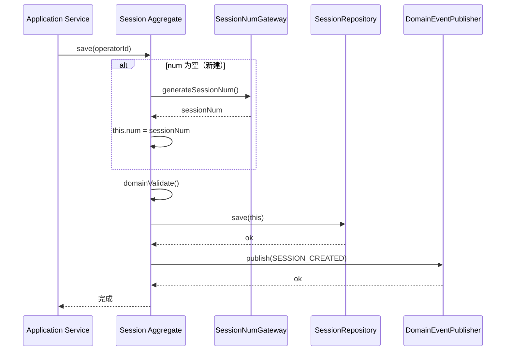
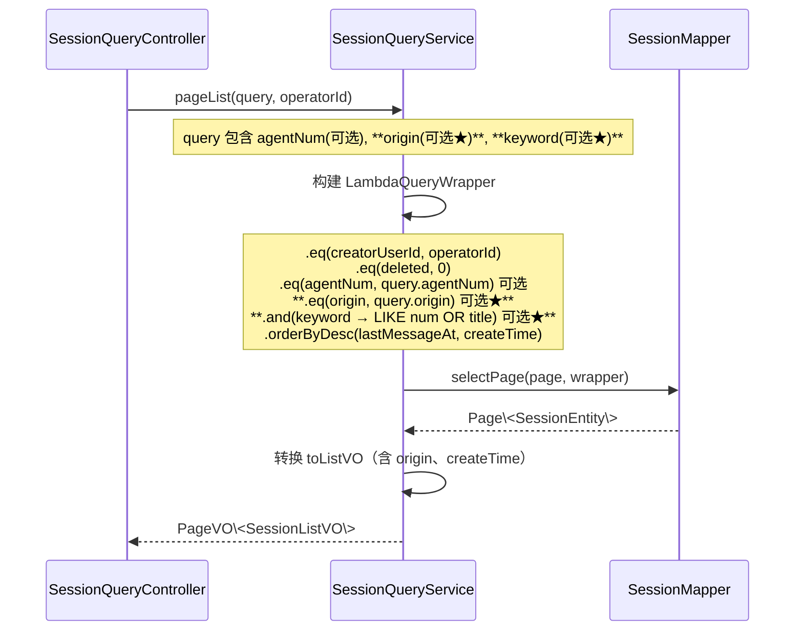
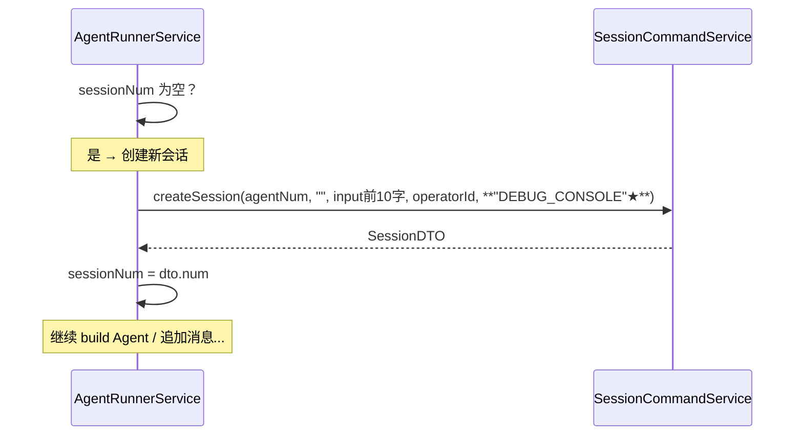
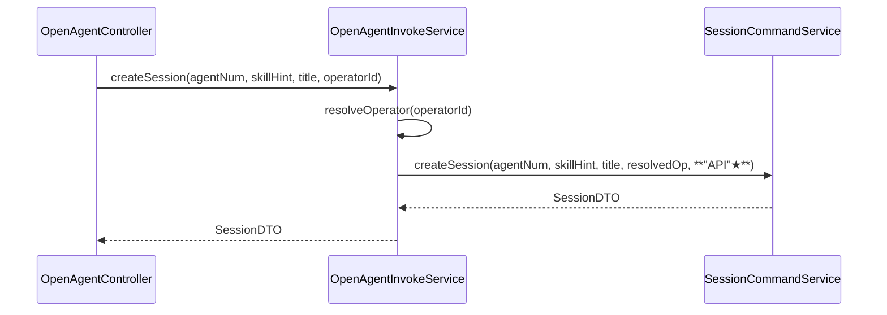
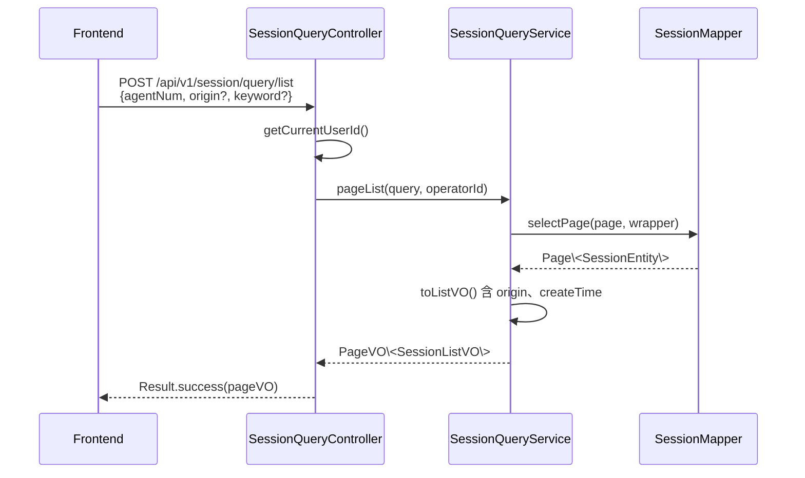
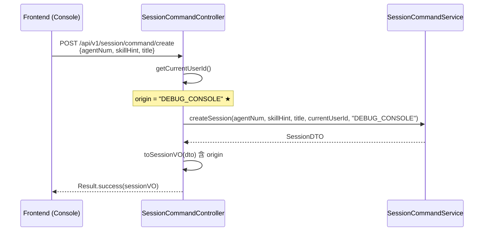
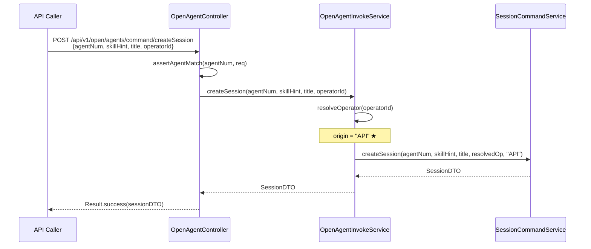

# 会话来源字段与会话历史 Tab 技术方案

## 1. 目标与范围

### 解决的问题
1. 当前 `session` 表没有 `origin` 字段，无法区分调试台（DebugConsole）和 Open API 发起的会话
2. 调试台下拉列表混入 API 会话，干扰开发者调试体验
3. Agent 详情页缺少会话历史查看入口，用户无法集中查看某 Agent 的全部历史对话

### 范围
- **包含**：
  - `session` 表新增 `origin` 字段（枚举：`DEBUG_CONSOLE` / `API`），存量默认为 `DEBUG_CONSOLE`
  - 所有创建会话入口按来源写入对应 `origin`
  - 后端列表查询接口支持 `origin` 过滤 + `keyword` 搜索
  - 所有 Session VO/DTO 增加 `origin` 字段；`SessionListVO` 增加 `createTime` 字段
  - 调试台前端列表查询追加 `origin=DEBUG_CONSOLE` 过滤
  - Agent 详情页（CONFIG + A2A 双模式）新增「会话历史」Tab，含搜索 + 分页表格 + 右侧抽屉详情
  - Console 消息展示组件抽取为独立组件 `SessionMessagesView`，供调试台和右侧抽屉复用

- **不包含**：
  - 会话归档、关闭、批量删除功能
  - 移动端适配
  - 历史会话数据刷数迁移（DDL 仅改默认值，存量数据 origin 统一为 `DEBUG_CONSOLE`）

### 设计前问答共识
| 问题 | 结论 |
|------|------|
| 部署架构 | 部署架构不变，无新增应用/前端部署实例，复用现有部署架构 |
| origin 枚举 | 仅 `DEBUG_CONSOLE` / `API`，无其他来源 |
| 存量数据处理 | 存量会话 origin 默认 `DEBUG_CONSOLE` |
| 调试台列表权限 | 保留 `creator_user_id` 归属人过滤 + `origin=DEBUG_CONSOLE` |
| 会话历史 Tab 权限 | 展示该 Agent 下的**全部会话**（不分创建人） |
| 抽屉消息区域 | 只读，去掉输入框和发送功能 |
| SessionListVO 新增字段 | 新增 `origin`、`createTime` |
| keyword 搜索范围 | 在 `session.num` + `session.title` 中 LIKE 匹配 |
| Console 消息组件 | 抽取为独立组件 `SessionMessagesView` |
| Agent 详情页改造范围 | CONFIG 和 A2A 模式都加「会话历史」Tab |
| 分页与排序 | pageSize=20，按 `last_message_at DESC` 排序 |
| 错误与空态处理 | 空态展示「暂无会话记录」；加载异常展示错误提示 |

---

## 2. 架构设计

### 2.1 应用架构

#### 代码结构

| 层 | 领域 | 包 | 职责 |
|----|------|----|------|
| facade | common | `ink.garry.rd.agent.ws.facade` | 本次无变更 |
| client | session | `ink.garry.rd.agent.ws.client.session` | SessionListQuery：新增 `origin`、`keyword` 参数；SessionListVO：新增 `origin`、`createTime`；SessionVO：新增 `origin`；SessionDetailVO：新增 `origin`；SessionDTO：新增 `origin` |
| domain | session | `ink.garry.rd.agent.ws.domain.session` | Session 聚合根新增 `origin` 属性；SessionFactory.createSession 增加 `origin` 参数 |
| infra | session | `ink.garry.rd.agent.ws.infra.session.entity` | SessionEntity 新增 `origin` 字段；SessionRepositoryImpl / SessionFactoryImpl / SessionMapper 同步调整 |
| application | session | `ink.garry.rd.agent.ws.application.session` | SessionCommandService.createSession 增加 `origin` 入参；SessionQueryService.pageList 增加 origin 过滤 + keyword LIKE 搜索 |
| application | agentrunner | `ink.garry.rd.agent.ws.application.agentrunner` | AgentRunnerService.runAgent 惰性建 session 时传 `origin=DEBUG_CONSOLE` |
| application | agent | `ink.garry.rd.agent.ws.application.agent` | OpenAgentInvokeService.createSession 传 `origin=API` |
| adapter | session | `ink.garry.rd.agent.ws.adapter.session` | SessionCommandController.create 传 `origin=DEBUG_CONSOLE` |
| adapter | open | `ink.garry.rd.agent.ws.adapter.open` | OpenAgentController.createSession 传 `origin=API` |
| adapter | agent | `ink.garry.rd.agent.ws.adapter.session` | SessionQueryController.list 透传 origin 参数 |
| frontend | components | `src/components/SessionMessagesView` | 新抽取的独立消息展示组件（只读模式） |
| frontend | pages/Agents/detail | `src/pages/Agents/detail/` | 新增 SessionHistoryTab 子组件；新增 sessions Tab 项 |
| frontend | pages/Console | `src/pages/Console/` | 改由 SessionMessagesView 渲染消息列表；reloadSessions 传 `origin: 'DEBUG_CONSOLE'` |
| frontend | services/session | `src/services/session/` | API 层新增 `origin` 参数支持 |
| frontend | types | `src/types/session.ts` | SessionListVO 新增 `origin`、`createTime`；SessionVO 新增 `origin` |

#### 模块调用关系

```mermaid
flowchart TD
  subgraph 调试台会话列表（改造）
    A[Console 页面] -->|POST /api/v1/session/query/list<br/>origin=DEBUG_CONSOLE| B[SessionQueryController.list]
    B --> C[SessionQueryService.pageList]
    C --> D[SessionMapper.selectPage]
    D -->|WHERE creator_user_id + origin + keyword| E[(session 表)]
  end

  subgraph 会话历史 Tab（新增）
    F[Agent 详情页<br/>SessionHistoryTab] -->|POST /api/v1/session/query/list<br/>仅 agentNum（不传 origin）| B
  end

  subgraph 创建会话入口（改造）
    G[调试台 create 按钮] --> H[SessionCommandController.create]
    H --> I[SessionCommandService.createSession]
    I --> J[origin = DEBUG_CONSOLE ★标注]
    J --> K[(session 表)]

    L[调试台 invoke 惰性建] --> M[AgentRunnerService.runAgent]
    M --> I
    
    N[Open API createSession] --> O[OpenAgentController.createSession]
    O --> P[OpenAgentInvokeService.createSession]
    P --> I
    P --> Q[origin = API ★标注]
    Q --> K
  end
```

### 2.2 部署架构

部署架构不变，无新增应用/前端部署实例，复用现有部署架构。

---

## 3. Facade 层设计

本次无 Facade 层变更。

---

## 4. 领域层设计

### 4.1 业务层级划分

| 层级 | 业务/子域 |
|------|-----------|
| session | 会话管理（调试台会话、API 会话） |

### 4.2 会话（session）

#### 4.2.1 领域模型

**Session 聚合根类图**

| 属性 | 类型 | 说明 |
|------|------|------|
| num | String | 业务编号 SES... |
| agentNum | String | Agent 业务编号 |
| agentVersionNum | String | 会话起始时锁定的 Agent 版本 |
| skillHint | String | 调试 Skill 时的 skill_name（可空） |
| creatorUserId | String | 创建人 userId |
| title | String | 会话标题（≤128，可空） |
| lastMessageAt | Timestamp | 最后一条消息时间（可空） |
| **origin** | **String** | **★新增：会话来源（DEBUG_CONSOLE / API）** |
| sessionRepository | SessionRepository | 领域协作依赖（仓储接口，注入使用） |
| messageRepository | MessageRepository | 领域协作依赖（消息仓储接口，注入使用） |
| sessionNumGateway | SessionNumGateway | 领域协作依赖（编号生成网关，注入使用） |
| domainEventPublisher | DomainEventPublisher | 领域协作依赖（事件发布器，注入使用） |

**继承自 DomainEntity**：
| 属性 | 类型 | 说明 |
|------|------|------|
| id | Long | 主键 |
| deleted | Integer | 软删除标记（仅 Entity 层，领域对象不使用） |
| createNo | String | 创建人 |
| updateNo | String | 更新人 |
| createTime | Timestamp | 创建时间 |
| updateTime | Timestamp | 更新时间 |

**聚合说明**
- 聚合根：`Session`（会话）
- 聚合内实体：`Message`（消息）、`InvocationTrace`（调用跟踪）
- 一致性边界：会话创建 → 保存；删除 → 级联删除消息与跟踪；不跨越聚合直接引用

#### 4.2.2 领域动作

| 聚合/实体 | 领域动作 | 职责 | 前置条件 | 后置条件/规则 | 领域事件 |
|-----------|----------|------|----------|-------------|----------|
| Session | save(operatorId) | 保存会话（新建/更新） | 参数校验通过、origin 非空 | 持久化会话，发 SESSION_CREATED 事件 | SESSION_CREATED |
| Session | delete(operatorId) | 删除会话 | 归属人校验通过 | 逻辑删除，级联删 Message/Trace，发 SESSION_DELETED 事件 | SESSION_DELETED |
| Session | rename(newTitle, operatorId) | 重命名会话 | 归属人校验通过，title≤128 | 更新 title，触 update_time | — |
| Session | appendUserMessage(...) | 追加用户消息 | 会话已保存 | 创建 Message，刷新 lastMessageAt | — |
| Session | appendAssistantMessage(...) | 追加助手消息 | 会话已保存 | 创建 Message，刷新 lastMessageAt | — |

**Session.save 时序图**



#### 4.2.3 领域规则

| 聚合/对象 | 规则类型 | 规则描述 | 违反时表达 |
|-----------|----------|----------|-----------|
| Session | 必填校验 | num / agentNum / agentVersionNum / creatorUserId / origin 必填 | domainValidate 抛异常 |
| Session | 长度限制 | title ≤ 128 字 | domainValidate 抛异常 |
| Session | 归属校验 | 只有 creatorUserId 等于 operatorId 时才可删除/重命名 | assertOwner 抛"无权限操作该会话" |
| Session | 来源校验 | origin 必须是 `DEBUG_CONSOLE` 或 `API` | 枚举校验 |

#### 4.2.4 领域工厂

| Factory | 方法名 | 入参 | 返回值 | 职责 | 依赖 |
|---------|--------|------|--------|------|------|
| SessionFactory | create(agentNum, agentVersionNum, skillHint, creatorUserId, title, origin) | 用户创建会话时填写的业务字段 | Session | 构建新的 Session 聚合根 | — |
| SessionFactory | createByNum(num) | 业务编码 | Session | 从 Repository 加载既有 Session | SessionRepository |

**SessionFactory.create 参数说明**
- 入参为用户创建会话时可填写或系统可确定的业务字段：`agentNum`、`agentVersionNum`、`skillHint`（可空）、`creatorUserId`（可空=system）、`title`（可空）、`origin`
- 不包含：`operatorId`、创建人/更新人、状态、审计字段、系统生成编号、默认值等内部流转内容

#### 4.2.5 领域网关

| Gateway | 方法名 | 入参 | 返回值 | 职责 | 外部依赖 | 失败策略 |
|---------|--------|------|--------|------|----------|----------|
| SessionNumGateway | generateSessionNum() | 无 | String | 生成 SES 前缀的业务编号 | 编号生成服务 | 抛异常 |

#### 4.2.6 领域事件

| 事件名 | 触发时机 | 载荷要点 | 可订阅方/用途 |
|--------|----------|----------|-------------|
| SESSION_CREATED | Session.save() 成功时 | sessionNum, agentNum, agentVersionNum, operatorId, occurredAt | 审计日志、通知 |
| SESSION_DELETED | Session.delete() 成功时 | sessionNum, operatorId | 审计日志、缓存清除 |

---

## 5. 基础设施层设计

### 5.1 Entity 变更

| Entity | 包路径 | 变更 | 对应表 |
|--------|--------|------|--------|
| SessionEntity | `ink.garry.rd.agent.ws.infra.session.entity.SessionEntity` | 新增 `origin` 字段（String） | `session` |

### 5.2 Mapper 变更

| Mapper | 包路径 | 变更 | 说明 |
|--------|--------|------|------|
| SessionMapper | `ink.garry.rd.agent.ws.infra.session.mapper.SessionMapper` | 无新增方法 | 查询条件由 QueryService 通过 LambdaQueryWrapper 拼接 |

### 5.3 RepositoryImpl 变更

| RepositoryImpl | 包路径 | 变更 |
|----------------|--------|------|
| SessionRepositoryImpl | `ink.garry.rd.agent.ws.infra.session.repository.SessionRepositoryImpl` | 无方法变更，Entity 自动映射 origin |

### 5.4 FactoryImpl 变更

| FactoryImpl | 包路径 | 变更 |
|-------------|--------|------|
| SessionFactoryImpl | `ink.garry.rd.agent.ws.infra.session.factory.SessionFactoryImpl` | create 方法增加 `origin` 参数，传递给 Session 构造函数 |

### 5.5 GatewayImpl

本次无 GatewayImpl 变更。

### 5.6 common 能力

本次无变更。

---

## 6. 应用层设计

### 6.1 业务模块划分

| 模块 | 对应领域 | 说明 |
|------|----------|------|
| session | session | 会话创建、查询 |
| agentrunner | session | 惰性建会话（调试台 invoke） |
| agent | session | 惰性建会话（Open API） |

### 6.2 会话（session）

#### 6.2.1 Service 方法清单

**SessionCommandService**

| 方法 | 入参 | 返回值 | 职责 |
|------|------|--------|------|
| createSession | String agentNum, String skillHint, String title, String operatorId, **String origin★** | SessionDTO | 创建新会话，按入口写入 origin |

**SessionQueryService**

| 方法 | 入参 | 返回值 | 职责 |
|------|------|--------|------|
| pageList | **SessionListQuery（新增 origin、keyword 参数）**, String operatorId | PageVO\<SessionListVO\> | 分页查询会话列表，支持 origin 过滤 + keyword 搜索 |

#### 6.2.2 方法时序逻辑

**SessionCommandService.createSession 时序**

```mermaid
sequenceDiagram
  participant Ctrl as Controller
  participant CmdSvc as SessionCommandService
 participant QuerySvc as SessionQueryService (used elsewhere)
  participant AgentQry as AgentQueryService
  participant Factory as SessionFactory
  participant Session as Session Aggregate
  participant Repo as SessionRepository

  Ctrl->>CmdSvc: createSession(agentNum, skillHint, title, operatorId, origin)
  Note over CmdSvc: 无事务/无锁（非持久化写，但实际有持久化）
  CmdSvc->>AgentQry: findAgentByNum(agentNum)
  AgentQry-->>CmdSvc: AgentDTO
  CmdSvc->>CmdSvc: 校验 status == PUBLISHED
  CmdSvc->>CmdSvc: resolveSessionVersionNum(agent)
  CmdSvc->>Factory: create(agentNum, versionNum, skillHint, operatorId, title, **origin★**)
  Factory-->>CmdSvc: Session
  CmdSvc->>Session: save(operatorId)
  Note over Session: 内部调用 SessionNumGateway 生成 num<br/>→ SessionRepository 持久化<br/>→ DomainEventPublisher 发布事件
  Session-->>CmdSvc: ok
  CmdSvc-->>Ctrl: SessionDTO（含 origin）
```



**SessionQueryService.pageList 时序**



### 6.3 调试台 invoke 惰性建会话

**AgentRunnerService.runAgent 惰性建会话** — 仅修改 `origin` 传参



### 6.4 Open API 创建会话

**OpenAgentInvokeService.createSession** — 仅修改 `origin` 传参



---

## 7. Adapter 层设计

### 7.1 业务模块划分

| 入口类型 | 模块 | 说明 |
|----------|------|------|
| Controller | session (SessionCommandController) | 新增 origin 参数传递 |
| Controller | session (SessionQueryController) | list 接口支持 origin、keyword 查询参数 |
| Controller | open (OpenAgentController) | createSession 传 origin=API |

### 7.2 会话查询（session.query）

**Controller 接口清单**

#### POST /api/v1/session/query/list（改造-新增过滤参数）

**职责**：分页查询当前用户可见的会话列表

**入参（SessionListQuery）**：
```json
{
  "pageNo": 1,
  "pageSize": 20,
  "agentNum": "AGT20260723xxxx",
  "origin": "DEBUG_CONSOLE",   // ★新增：可选
  "keyword": "日志"            // ★新增：可选，在 num/title 中 LIKE 匹配
}
```

**返回值（Result<PageVO<SessionListVO>>）**：
```json
{
  "code": 200,
  "message": "success",
  "data": {
    "pageNo": 1,
    "pageSize": 20,
    "total": 42,
    "list": [
      {
        "num": "SES20260723xxxx",
        "agentNum": "AGT20260723xxxx",
        "agentVersionNum": "1.0.0",
        "title": "帮助排查日志问题",
        "lastMessageAt": "2026-07-23T14:30:00.000",
        "origin": "DEBUG_CONSOLE",     // ★新增
        "createTime": "2026-07-23T14:00:00.000"  // ★新增
      }
    ]
  }
}
```

**接口时序**



#### POST /api/v1/session/command/create（改造-新增 origin 传参）

**职责**：调试台创建新会话

**入参（SessionCreateParam）** — 无变化
```json
{
  "agentNum": "AGT20260723xxxx",
  "skillHint": "",
  "title": "新会话"
}
```

**返回值（Result<SessionVO>）**：
```json
{
  "code": 200,
  "message": "success",
  "data": {
    "num": "SES20260723xxxx",
    "agentNum": "AGT20260723xxxx",
    "agentVersionNum": "1.0.0",
    "skillHint": "",
    "title": "新会话",
    "lastMessageAt": null,
    "createTime": "2026-07-23T14:00:00.000",
    "origin": "DEBUG_CONSOLE"     // ★新增
  }
}
```

**接口时序**



#### POST /api/v1/open/agents/command/createSession（改造-新增 origin 传参）

**职责**：API 创建新会话

**入参（OpenSessionCreateParam）** — 无变化
```json
{
  "agentNum": "AGT20260723xxxx",
  "skillHint": "",
  "title": "",
  "operatorId": ""
}
```

**返回值（Result<SessionDTO>）**：
```json
{
  "code": 200,
  "message": "success",
  "data": {
    "num": "SES20260723xxxx",
    "agentNum": "AGT20260723xxxx",
    "agentVersionNum": "1.0.0",
    "skillHint": "",
    "creatorUserId": "system",
    "title": "",
    "lastMessageAt": null,
    "origin": "API",              // ★新增
    "createNo": "system",
    "updateNo": "system",
    "createTime": "2026-07-23T14:00:00.000",
    "updateTime": "2026-07-23T14:00:00.000"
  }
}
```

**接口时序**



---

## 8. 数据库设计

### 8.1 session 表 — 新增字段

| 字段 | 类型 | 必填 | 默认值 | 索引 | 说明 |
|------|------|------|--------|------|------|
| origin | VARCHAR(32) | 是 | 'DEBUG_CONSOLE' | — | 会话来源枚举：DEBUG_CONSOLE / API |

**ALTER TABLE DDL**：
```sql
ALTER TABLE `session`
  ADD COLUMN `origin` VARCHAR(32) NOT NULL DEFAULT 'DEBUG_CONSOLE'
  COMMENT '会话来源：DEBUG_CONSOLE / API' AFTER `title`;
```

**注意**：存量默认值为 `DEBUG_CONSOLE`（按设计前问答结论）。

### 8.2 完整 session 表结构（变更后）

```sql
CREATE TABLE `session` (
  `id` BIGINT NOT NULL AUTO_INCREMENT COMMENT '主键',
  `num` VARCHAR(64) NOT NULL COMMENT '业务编号 SES...',
  `agent_num` VARCHAR(64) NOT NULL COMMENT 'Agent num',
  `agent_version_num` VARCHAR(64) NOT NULL COMMENT '会话起始时锁定的 Agent 版本',
  `skill_hint` VARCHAR(128) DEFAULT NULL COMMENT '调试 Skill 时的 skill_name',
  `creator_user_id` VARCHAR(64) NOT NULL COMMENT '创建人 userId',
  `title` VARCHAR(128) DEFAULT NULL COMMENT '会话标题',
  `origin` VARCHAR(32) NOT NULL DEFAULT 'DEBUG_CONSOLE' COMMENT '会话来源：DEBUG_CONSOLE / API',
  `last_message_at` TIMESTAMP(3) DEFAULT NULL COMMENT '最后一条消息时间',
  `create_no` VARCHAR(64) NOT NULL COMMENT '创建人',
  `update_no` VARCHAR(64) NOT NULL COMMENT '更新人',
  `deleted` TINYINT(1) NOT NULL DEFAULT 0 COMMENT '逻辑删除',
  `create_time` TIMESTAMP(3) NOT NULL DEFAULT CURRENT_TIMESTAMP(3) COMMENT '创建时间',
  `update_time` TIMESTAMP(3) NOT NULL DEFAULT CURRENT_TIMESTAMP(3) ON UPDATE CURRENT_TIMESTAMP(3) COMMENT '更新时间',
  PRIMARY KEY (`id`),
  UNIQUE KEY `uk_session_num` (`num`),
  KEY `idx_creator_agent` (`creator_user_id`, `agent_num`, `deleted`),
  KEY `idx_last_message` (`last_message_at`)
) ENGINE=InnoDB DEFAULT CHARSET=utf8mb4 COMMENT='调试台会话';
```

### 8.3 与领域对应

| 表 | 对应实体 | 说明 |
|----|----------|------|
| session | Session（聚合根） | origin 字段映射 Session.origin 属性 |

---

## 9. 模块变更清单

| 层 | 变更项 | 对应 Skill |
|----|--------|-----------|
| facade | 本次无变更 | — |
| client | SessionListQuery：新增 `origin`、`keyword` 参数 | impl-client-module |
| client | SessionListVO：新增 `origin`、`createTime` 字段 | impl-client-module |
| client | SessionVO：新增 `origin` 字段 | impl-client-module |
| client | SessionDetailVO：新增 `origin` 字段 | impl-client-module |
| client | SessionDTO：新增 `origin` 字段 | impl-client-module |
| domain | Session 聚合根：新增 `origin` 属性 | impl-domain-module |
| domain | SessionFactory.create：新增 `origin` 参数 | impl-domain-module |
| domain | SessionEntity：新增 `origin` 字段（infra 层对应更新） | impl-domain-module（含对应 infra 映射） |
| infra | SessionEntity：新增 `origin` 字段映射 | impl-infra-module |
| infra | SessionFactoryImpl.create：新增 `origin` 参数传递 | impl-infra-module |
| application | SessionCommandService.createSession：新增 `origin` 参数 | impl-application-module |
| application | SessionQueryService.pageList：新增 origin 过滤 + keyword LIKE 搜索 | impl-application-module |
| application | AgentRunnerService.runAgent：惰性建 session 传 `origin="DEBUG_CONSOLE"` | impl-application-module |
| application | OpenAgentInvokeService.createSession：传 `origin="API"` | impl-application-module |
| adapter | SessionCommandController.create：传 `origin="DEBUG_CONSOLE"` | impl-adapter-module |
| adapter | OpenAgentController.createSession：传 `origin="API"` | impl-adapter-module |
| adapter | SessionQueryController.list：透传 origin/keyword 查询参数 | impl-adapter-module |
| frontend | SessionListVO 类型：新增 `origin`、`createTime` | 前端手动 |
| frontend | 抽取 Console 消息展示为独立组件 `SessionMessagesView` | 前端手动 |
| frontend | Agent 详情页：新增 SessionHistoryTab 组件（表格+搜索+抽屉） | 前端手动 |
| frontend | Agent 详情页 Tab 列表：CONFIG+A2A 双模式增加 `sessions` 项 | 前端手动 |
| frontend | Console 页面：pageList 传 `origin: 'DEBUG_CONSOLE'` | 前端手动 |

---

## 10. 代码分支命名

**分支名**：`feature-20260723-session-origin`

---

## 11. 实现顺序与依赖

建议实现顺序：

1. **数据库 DDL** — 执行 ALTER TABLE 新增 `origin` 字段（手动在本地库执行）
2. **client** — 新增 SessionListQuery 参数、VO/DTO 字段 → impl-client-module
3. **domain** — Session 聚合根增加 origin 属性、Factory 增加参数 → impl-domain-module
4. **infra** — SessionEntity/factoryImpl 同步 → impl-infra-module
5. **application** — CommandService/QueryService/AgentRunnerService/OpenAgentInvokeService → impl-application-module
6. **adapter** — Controller 层改造 → impl-adapter-module
7. **前端** — 类型更新 → 抽取 SessionMessagesView 组件 → 新增 SessionHistoryTab → Console 改造

---

## 12. 接口与数据契约

详见第 7 节（Adapter 层设计），主要接口清单：

| 路径 | 方法 | 变更 |
|------|------|------|
| POST /api/v1/session/query/list | POST（查询） | 新增 `origin`、`keyword` 入参；`SessionListVO` 新增 `origin`、`createTime` 出参 |
| POST /api/v1/session/command/create | POST（写） | Controller 层自动传 `origin=DEBUG_CONSOLE` |
| POST /api/v1/open/agents/command/createSession | POST（写） | Controller 层自动传 `origin=API` |

---

## 13. 其他

### 配置项
- 无新增配置项

### 数据迁移
- 存量数据：`ALTER TABLE` 设置 `default 'DEBUG_CONSOLE'`，新增行自动带默认值；存量行在首次 ALTER 时需手动 `UPDATE session SET origin = 'DEBUG_CONSOLE' WHERE origin IS NULL;`（如适用）

### 非功能需求
- 安全性：调试台列表保留 `creator_user_id` 归属人校验；会话历史 Tab 展示 Agent 全部会话（不分创建人）需确认是否有权限诉求，当前按 "展示该 Agent 下的全部会话" 设计
- 兼容性：未传 `origin`/`keyword` 的查询请求保持向后兼容（条件为空则不过滤）