# Agent 绑定 Skill 版本与版本化调试 技术方案

> 文档版本：v1.0　｜　编写日期：2026-07-28　｜　目标仓库：rd-agent-be（六层 Maven 多模块）
> 输入 PRD：[2026-07-28_Agent绑定Skill版本与版本化调试-PRD.md](../产品方案/2026-07-28_Agent绑定Skill版本与版本化调试-PRD.md)
> 代码分支：`feature-20260728-agent-skill-version-binding`（前后端同名）

---

## 1. 目标与范围

### 1.1 要解决的问题

1. Agent 挂载的每个 Skill 精确绑定到 `(skillNum, versionNum)`，加载 / 运行 / 调试严格按绑定版本加载对应 Skill 版本快照，不随 Skill 后续发版漂移。
2. Skill 发布新版本后，Agent 编辑态可重新选择绑定版本（升级 / 回退），并给出「有新版本」提示与一键切换。
3. 调试台支持选择目标 Agent 版本（草稿态 / 在线 / 历史）进行调试，草稿态可在**发布前**验证。
4. 版本选择器标注每个版本的状态（草稿态 / 发布态 / 历史态）。

### 1.2 设计前 10 问共识（本方案据此落地）

| # | 决策项 | 结论 |
|---|--------|------|
| 1 | 调试目标版本传参 | `DebugInvokeRequest` 增加**可空单字段** `targetVersion`：传 `vX.Y.Z` 调发布/历史版；传字面量 `DRAFT` 调草稿；为空按默认 |
| 2 | Runner 装配 | **改造现有** `AgentRunnerFactory.build` 增加**可空** `targetVersion` 参数；为空 → 当前在线版本快照（生产/最新在线，行为不变），非空 → 目标版本快照（含草稿）；放开「Agent 必须 PUBLISHED」强校验 |
| 3 | Skill 可绑定版本源 | **新增专用** `bindableVersions` 接口，仅返回 `PUBLISHED`（排除 DRAFT/DEPRECATED），带 `latest` 标记 |
| 4 | 部署架构 | **不变**，无新增部署组件 |
| 5 | 新版本提示（FR1.5） | **本期纳入**：后端为每个已绑定 Skill 计算 `hasNewer` + `latestVersion` |
| 6 | 调试切版本会话 | **新会话**：前端切版本后下次 invoke 不传 sessionNum，后端自动建 `DEBUG_CONSOLE` 会话 |
| 7 | 可绑定版本状态范围 | 仅 `PUBLISHED` |
| 8 | 存量 legacy `skillNums` | **本期全量刷数迁移**为 `skillRefs`（一次性运维接口），迁移全部 `agent_version`（DRAFT/PUBLISHED/ARCHIVED）+ `agent.config_snapshot` 镜像；迁移后删除 legacy 兜底分支 |

### 1.3 复用现状（关键：底座已具备大量能力）

- `ConfigSnapshot.skillRefs`（`List<SkillRef>`，`skillNum + versionNum`）与值对象 `SkillRef` **已存在**；`AgentCreateParam.skillRefs`（`List<SkillRefParam>`）**已存在**；草稿编辑走 `AgentCommandService.editDraftVersion(versionId, Map configDraft, ...)` 透传——**Agent 绑定 Skill 版本的写入链路已通**。
- `AgentRunnerFactory.registerSkills` **已优先按 `skillRefs` 钉住版本加载**，`AgentScopeSkillRepositoryAdapter.getSkillByVersion(skillNum, version)` **已支持任意历史版本读取**——**「按绑定版本加载」运行时能力已具备**。
- `AgentQueryService.versionList(agentNum, limit)` / `versionDetail(agentNum, versionNum)` 已返回含 `status`（DRAFT/PUBLISHED/ARCHIVED）+ `configSnapshot` 的版本数据；`SkillQueryService.versionList(skillNum)` 已返回 Skill 版本列表。

### 1.4 本方案实际改造点（增量）

- **模块一/二（绑定 + 可绑定版本）**：新增 `bindableVersions` 查询、`skillBindingStatus`（新版本提示）查询；写入侧复用现有 `skillRefs`（前端补版本选择 UI）。
- **模块三（版本化调试）**：`DebugInvokeRequest.targetVersion` + 调用链透传 + `AgentRunnerFactory.build` 增版本参数并放开 PUBLISHED 校验 + `AgentQueryService.loadAgentForDebug`。
- **模块四（状态标识）**：新增 `debugVersionList` 查询（含草稿，带状态标签）。
- **数据迁移**：一次性运维接口全量回填 `skillNums → skillRefs`。

### 1.5 不做

- 不做 Skill 版本自动跟随最新版策略；不改 Skill/Agent 自身发版流程；不做工具（Tool）版本化绑定与调试；不做 A2A 版本化；无部署架构变更。

**【架构自检】** 应用/部署架构处理方式已明确（部署不变）；命令/查询归属已划分（见 2.1）；改造点均落到具体层与包。✅

---

## 2. 架构设计

### 2.1 应用架构

本需求横跨 `skill` / `agent` / `agentrunner` / `debugconsole` 子域，以**查询增强 + 调试调用链改造 + 一次性数据迁移**为主，无新增聚合 / 领域动作 / 数据库表。

**命令 / 查询归属：**

| 类型 | 归属 | 说明 |
|------|------|------|
| `bindableVersions`（Skill 可绑定版本列表） | **查询** | GET，QueryService 只读 |
| `debugVersionList`（Agent 可调试版本列表，含草稿+状态标签） | **查询** | GET，QueryService 只读 |
| `skillBindingStatus`（已绑定 Skill 的新版本提示） | **查询** | GET，QueryService 只读 |
| `debug invoke`（按版本调试调用，流式） | **命令** | POST，触发执行 + 写调试会话消息 |
| `migrate skill-refs`（存量刷数） | **命令** | POST，一次性运维，仅平台管理员 |

**代码结构（层 / 领域 / 包 / 职责）：**

| 层 | 领域 | 包 | 职责 |
|----|------|-----|------|
| client | skill | `ink.garry.rd.agent.ws.client.skill.vo` | 新增 `SkillBindableVersionVO`（简单 GET 用 `@RequestParam`，不造 Param 类） |
| client | agent | `ink.garry.rd.agent.ws.client.agent` | 新增 `AgentDebugVersionVO`、`AgentSkillBindingStatusVO`、`MigrateSkillRefsResultVO`（GET 用 `@RequestParam`） |
| client | debugconsole | `ink.garry.rd.agent.ws.client.debugconsole` | 修改 `DebugInvokeRequest`：新增可空 `targetVersion`（`target_version`） |
| domain | agent | `...domain.agent.valueobject` | **无结构变更**，复用 `ConfigSnapshot.skillRefs` / `SkillRef` |
| infra | agent | `...infra.agent.mapper` | 复用 `AgentVersionMapper` / `AgentMapper`（只读 + `UpdateWrapper` 单列回填，不新增 Mapper） |
| infra | skill | `...infra.skill.mapper` | 复用 `SkillVersionMapper` / `SkillMapper`（可绑定版本查询） |
| application | skill | `...application.skill.SkillQueryService` | 新增 `bindableVersions(skillNum)` |
| application | agent | `...application.agent.AgentQueryService` | 新增 `debugVersionList`、`loadAgentForDebug`、`skillBindingStatus` |
| application | agent | `...application.agent.SkillRefMigrationService` | 新增：存量 `skillNums → skillRefs` 一次性迁移（命令） |
| application | agentrunner | `...application.agentrunner.factory.AgentRunnerFactory` | 修改 `build` 增加可空 `targetVersion`，放开 PUBLISHED 校验 |
| application | agentrunner | `...application.agentrunner.AgentRunnerService` | 修改 `runAgent` 透传 `targetVersion` |
| application | debugconsole | `...application.debugconsole.AgentInvokeService` | 修改 `invokeStream` 透传 `targetVersion` |
| adapter | skill | `...adapter.skill.SkillQueryController` | 新增 GET `/bindable-versions` |
| adapter | agent | `...adapter.agent.AgentQueryController` | 新增 GET `/debug-versions`、GET `/skill-binding-status` |
| adapter | agent | `...adapter.agent.AgentMaintenanceController` | 新增 POST `/migrate-skill-refs`（平台管理员） |
| adapter | debugconsole | `...adapter.debugconsole.DebugInvokeController` | 修改：透传 `target_version` |

**关键调用关系与依赖方向：**

- 查询：`QueryController(GET) → QueryService → infra Mapper（只读）→ client VO/DTO`。遵守「application 不注入 Repository / Gateway，查询走 QueryService + infra Mapper」。
- 调试命令：`DebugInvokeController(POST/SSE) → AgentInvokeService → AgentRunnerService → AgentRunnerFactory.build(targetVersion) → AgentQueryService.loadAgentForDebug → AgentScopeSkillRepositoryAdapter.getSkillByVersion`，返回 `Flux<Event>` 经 adapter 转 SSE。
- 迁移命令：`AgentMaintenanceController(POST) → SkillRefMigrationService → [SkillQueryService 读当前发布版] + [SkillRefBackfillMapper 回填 JSON 列]`（见 §8 迁移说明）。
- 依赖方向：`adapter → application → {client, domain, infra}`；`infra → domain → facade`，无逆向。

### 2.2 部署架构

**部署架构不变，无新增应用/前端部署实例，复用现有部署架构。** rd-agent-be（后端）+ rd-agent-fe（前端）现有拓扑不变，无新增中间件 / 云服务 / 网络入口；调试调用仍走本服务现有 SSE 通道。

**【架构自检】** 代码结构四列表齐全；命令/查询已区分且无歧义；部署三选一取「不变」，本节仅写明不变。✅

---

## 3. Facade 层设计

**本次无 Facade 层变更。** 不涉及 `DomainEntity` / `DomainEventDTO` / `DomainEventPublisher` / `Result` 等通用契约的新增或修改；不新增领域事件基础类型。

**【Facade 自检】** 已确认无变更并写明。✅

---

## 4. 领域层设计

### 4.1 业务层级划分

| 层级 | 业务/子域 | 本方案涉及 |
|------|-----------|-----------|
| 数据管理层 | agent（Agent 聚合 + AgentVersion 聚合） | 复用现有模型，无结构变更 |
| 数据管理层 | skill（Skill 聚合 + SkillVersion 实体） | 复用现有模型，无结构变更 |

> 本需求为**查询 + 调试装配 + 数据迁移**类需求，**不新增聚合根、实体、值对象、领域动作、领域工厂、领域网关、领域事件**。以下按领域说明复用点与唯一的领域相关约束补充。

### 4.2 Agent 领域（agent）

#### 4.2.1 领域模型
- **复用**聚合根 `Agent`（`currentVersionNum` 指当前在线版本、`configSnapshot` 为在线版本镜像）与 `AgentVersion`（三态 `DRAFT/PUBLISHED/ARCHIVED`，各自持 `ConfigSnapshot`）。
- **复用**值对象 `ConfigSnapshot.skillRefs`（`List<SkillRef>`）与 `SkillRef(skillNum, versionNum)`——即 Agent↔Skill 版本绑定的载体。
- 本方案**不改动**上述类的属性与结构。

#### 4.2.2 领域动作
- **无新增领域动作**。调试装配不改变领域状态（只读快照）；版本绑定变更沿用既有 `editDraftVersion`（草稿保存）与 `publish`（发布生效），本方案不改其签名与语义。

#### 4.2.3 领域规则
| 聚合/对象 | 规则类型 | 规则描述 | 违反时表达 |
|-----------|----------|----------|-----------|
| ConfigSnapshot | 不变性（**沿用**） | 已发布版本（PUBLISHED/ARCHIVED）快照不可变，含其 `skillRefs` | 由 `AgentVersion` 三态语义保证，本方案不新增 |
| skillRef（发布校验，application 兜底） | 业务规则 | 发布 Agent 时每个 `skillRef.versionNum` 应指向存在且 `PUBLISHED` 的 SkillVersion | 校验在 application 发布流程经 `SkillQueryService` 完成（非 domain 硬校验），失败给明确错误 |

#### 4.2.4 领域工厂
- **无新增/修改**。调试装配不经工厂重建聚合，快照读取走 QueryService（只读，见 §6）。

#### 4.2.5 领域网关
- **无新增/修改**。复用 `AgentVersionGateway`（`findCurrent` / `findByAgentNumAndVersionNum` / `findByAgentNumAndStatus` / `listByAgentNum`）——但注意：这些是**领域网关**，仅供领域对象/工厂/infra 内部使用；application 的调试/查询读取**不经 Gateway**，改由 QueryService 直读 infra Mapper（见 §6 约束）。

#### 4.2.6 领域事件
- **无新增领域事件**。调试调用与数据迁移均不发布领域事件（迁移为 JSON 回填，见 §8）。

### 4.3 Skill 领域（skill）

#### 4.3.1 领域模型
- **复用** `Skill`（`currentVersionNum` 指当前发布版）与 `SkillVersion`（`status` DRAFT/PUBLISHED/DEPRECATED、`version` 版本号、资源树快照）。无结构变更。

#### 4.3.2 ~ 4.3.6 领域动作/规则/工厂/网关/事件
- **均无新增/修改**。可绑定版本查询为只读，不触发任何 Skill 领域动作与事件。

**【领域层自检】** 已逐领域确认无结构变更并写明；唯一业务规则（发布时校验 skillRef 版本存在性）明确落在 application 兜底而非 domain；无违反 Factory/Gateway 强规约（因无新增）。✅

---

## 5. 基础设施层设计

### 5.1 Skill 可绑定版本查询（复用 Mapper）
- **复用** `SkillMapper`（取 `Skill.currentVersionNum` 作为「最新发布版」判定）与 `SkillVersionMapper`（按 `skillNum + status=PUBLISHED` 列出版本，按 `create_time` 倒序）。无新增 Entity/Mapper。

### 5.2 Agent 可调试版本 / 目标版本快照读取（复用 Mapper）
- **复用** `AgentVersionMapper`：
  - 列全部版本（DRAFT + PUBLISHED + ARCHIVED）供 `debugVersionList`；
  - 按 `agentNum + versionNum` 或 `agentNum + status=DRAFT` 取单版本 `config_snapshot`（JSON 文本）供 `loadAgentForDebug`。
- **复用** `AgentMapper`：取 `agent.config_snapshot` 镜像（`targetVersion` 为空时的当前在线快照）。
- `config_snapshot` 为 JSON 文本列（`agent_version.config_snapshot` / `agent.config_snapshot`），由 QueryService 反序列化为 `AgentDTO.ConfigSnapshot`。

### 5.3 存量刷数回填（复用现有 Mapper，实现落地为准）
- **不新增 Mapper**：迁移直接复用 `AgentVersionMapper` / `AgentMapper`：
  - 读：`selectList`（lambdaQuery）扫描 `agent_version` 全部行与 `agent`（CONFIG 且 config_snapshot 非空）行；
  - 写：`update(null, new UpdateWrapper<>().set("config_snapshot", json).eq("id", id))`——**字符串列名单列回填**，不依赖 MyBatis-Plus lambda TableInfo 缓存（便于纯单测），只更新 `config_snapshot` 一列。
- **不触碰**审计/状态字段（迁移不改变业务状态、不发事件，见 §8）。
- 读当前发布版走 `SkillMapper`（`Skill.currentVersionNum`），迁移过程内以 `Map` 缓存 skillNum→版本。

> **注入约束**：所有 infra Bean 注入统一 `@Resource`；本方案 infra 仅新增只读/单列更新 Mapper，不引入 Gateway/Repository 变更。

**【基础设施层自检】** Entity/Mapper 与数据库一致（无 schema 变更）；新增 Mapper 仅做 JSON 列扫描/回填；无 RepositoryImpl/FactoryImpl/GatewayImpl 变更并已说明复用。✅

---

## 6. 应用层设计

### 6.1 业务模块划分

| 模块 | Service | 与领域对应 |
|------|---------|-----------|
| 6.2 skill | `SkillQueryService`（增强） | skill 领域 |
| 6.3 agent（查询） | `AgentQueryService`（增强） | agent 领域 |
| 6.4 agent（迁移，命令） | `SkillRefMigrationService`（新增） | agent 领域 |
| 6.5 agentrunner | `AgentRunnerFactory` / `AgentRunnerService`（改造） | agent 运行时装配 |
| 6.6 debugconsole | `AgentInvokeService`（改造） | 调试调用编排 |

> 依赖约束：QueryService 只读 infra Mapper 返回 client DTO/VO；CommandService 不注入 Repository/Gateway；本方案的调试与迁移读取其他数据均经对应 QueryService。

### 6.2 skill 模块

#### 6.2.1 Service 方法清单
| Service | 方法 | 入参 | 出参 | 职责 |
|---------|------|------|------|------|
| SkillQueryService | `bindableVersions(String skillNum)` | skillNum | `List<SkillBindableVersionVO>` | 返回该 Skill 全部 `PUBLISHED` 版本（版本号、发布/创建时间、`latest` 标记），按时间倒序；`latest` = 等于 `Skill.currentVersionNum` 者 |

#### 6.2.2 方法时序逻辑

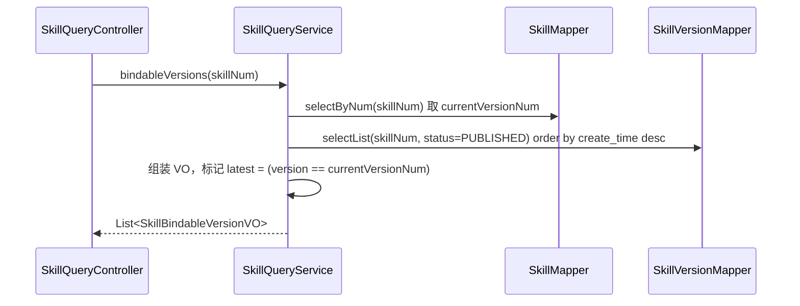

### 6.3 agent 模块（查询增强）

#### 6.3.1 Service 方法清单
| Service | 方法 | 入参 | 出参 | 职责 |
|---------|------|------|------|------|
| AgentQueryService | `debugVersionList(String agentNum)` | agentNum | `List<AgentDebugVersionVO>` | 列该 Agent 全部可调试版本（DRAFT + PUBLISHED + ARCHIVED），带 `status` 与 `statusLabel`（草稿态/发布态/历史态）；排序 DRAFT→当前在线→历史(倒序) |
| AgentQueryService | `loadAgentForDebug(String agentNum, String targetVersion)` | agentNum、可空 targetVersion | `AgentDTO` | 解析目标版本快照为 `AgentDTO`（`configSnapshot` 取自目标版本；`name/description` 取自快照）。空→当前在线；`DRAFT`→草稿版本；否则→按 versionNum 版本 |
| AgentQueryService | `skillBindingStatus(String agentNum, String targetVersion)` | agentNum、可空 targetVersion | `List<AgentSkillBindingStatusVO>` | 对目标版本 `skillRefs` 逐项算 `latestVersion`（=Skill.currentVersionNum）、`hasNewer`、`boundDeprecated`，用于新版本提示 |

#### 6.3.2 方法时序逻辑

`debugVersionList`：
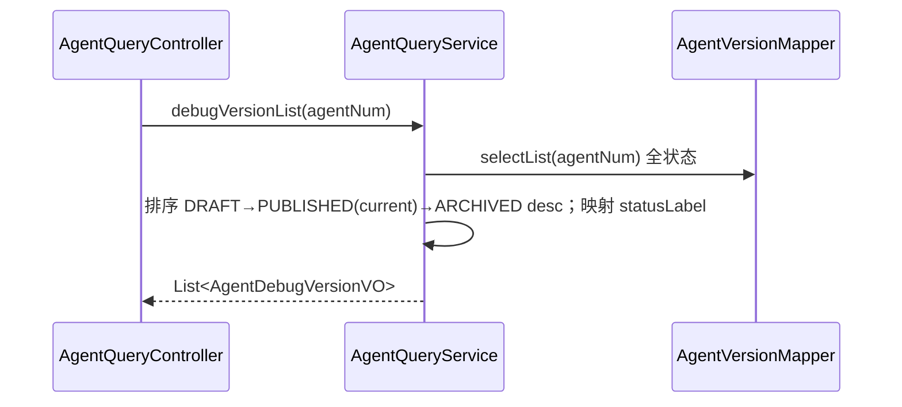

`loadAgentForDebug`：
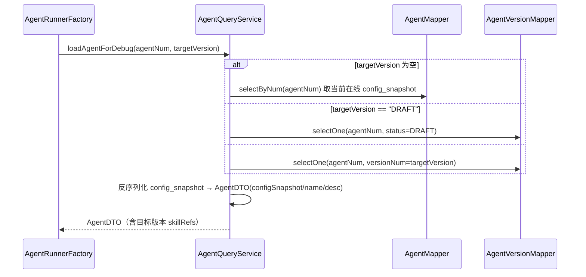

`skillBindingStatus`：
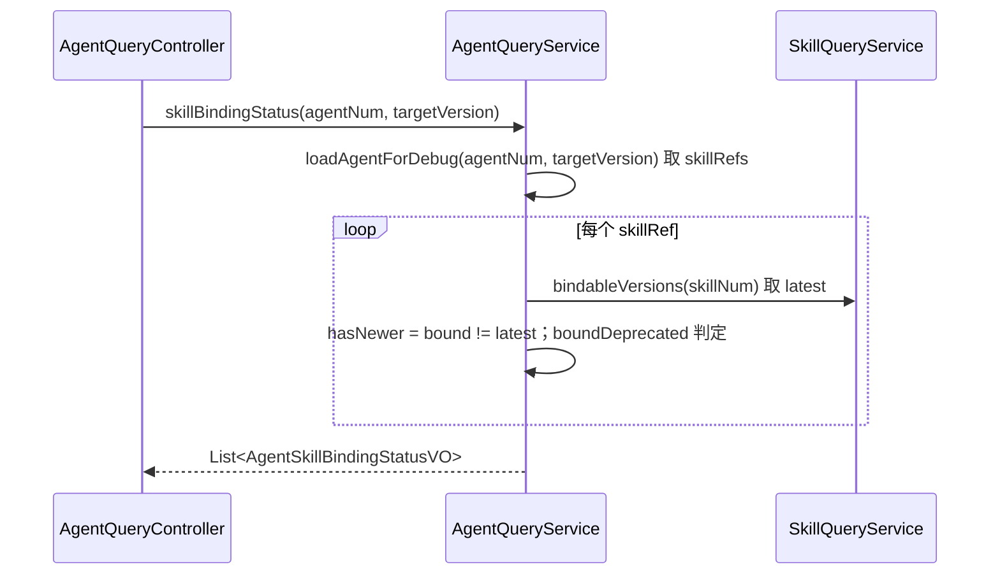

### 6.4 agent 模块（迁移，命令）

#### 6.4.1 Service 方法清单
| Service | 方法 | 入参 | 出参 | 职责 |
|---------|------|------|------|------|
| SkillRefMigrationService | `migrateSkillRefs(String operatorId)` | operatorId | `MigrateSkillRefsResultVO` | 一次性全量：扫描 `agent_version` + `agent` 的 `config_snapshot`，对**有 `skillNums` 且无 `skillRefs`** 者，按 `skillNum` 解析当前发布版生成 `skillRefs` 回填；幂等（已有 `skillRefs` 跳过） |

#### 6.4.2 方法时序逻辑
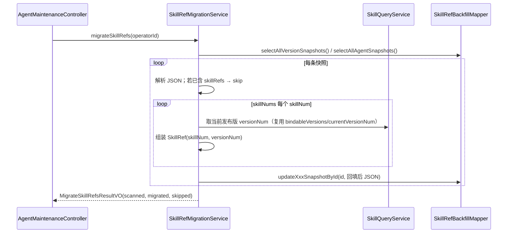

> **迁移的分层说明（重要）**：该迁移为**一次性数据修复（backfill）**，仅重写 `config_snapshot` 单个 JSON 列，**不产生业务状态流转、不发领域事件**，且需覆盖不可变的 ARCHIVED 历史版本——不适合走聚合 `save()`。因此明确以 application `SkillRefMigrationService` + infra `SkillRefBackfillMapper` 单列回填实现，**为对 domain 写规约的一次自觉、受限例外**（仅此迁移适用）；读当前发布版仍走 `SkillQueryService`，不注入 Repository/Gateway。运维执行完成后可下线该接口与 Mapper。

### 6.5 agentrunner 模块（改造）

#### 6.5.1 Service 方法清单
| Service | 方法 | 变更 | 说明 |
|---------|------|------|------|
| AgentRunnerFactory | `build(String agentNum, String sessionNum, String targetVersion)` | **改造**（重载保留旧签名 → 委托 targetVersion=null） | 目标版本快照装配 Runner；放开「Agent 必须 PUBLISHED」；空→当前在线（生产行为不变，要求存在在线版本） |
| AgentRunnerService | `runAgent(agentNum, input, sessionNum, operatorId, targetVersion)` | **改造**（增末位可空参数） | 透传 targetVersion 到 build |

#### 6.5.2 方法时序逻辑
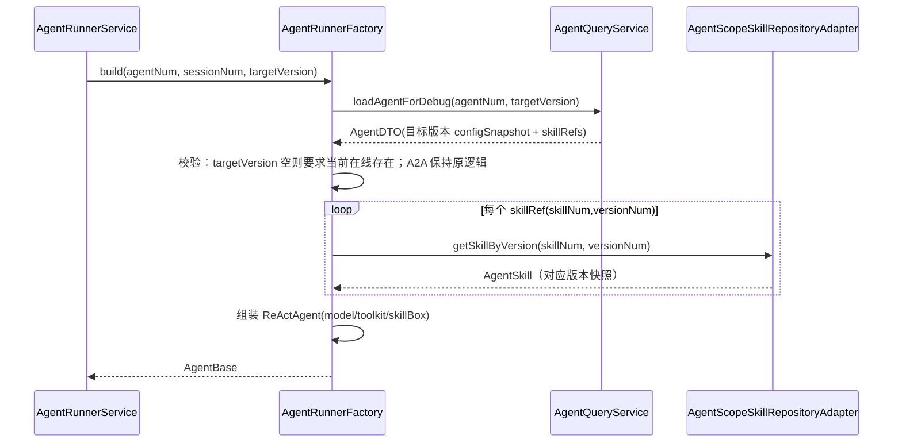

> **兼容**：`build(agentNum, sessionNum)` 旧重载保留并委托 `build(agentNum, sessionNum, null)`，其余现有调用方零改动；生产 invoke（targetVersion=null）取当前在线快照，行为不变。`registerSkills` 在 §8 迁移完成后**删除 legacy `skillNums` 兜底分支**，仅保留 `skillRefs` 路径。

### 6.6 debugconsole 模块（改造）

#### 6.6.1 Service 方法清单
| Service | 方法 | 变更 |
|---------|------|------|
| AgentInvokeService | `invokeStream(agentNum, input, sessionNum, operatorId, targetVersion)` | 增末位可空 `targetVersion`，透传至 `runAgent` |

#### 6.6.2 方法时序逻辑
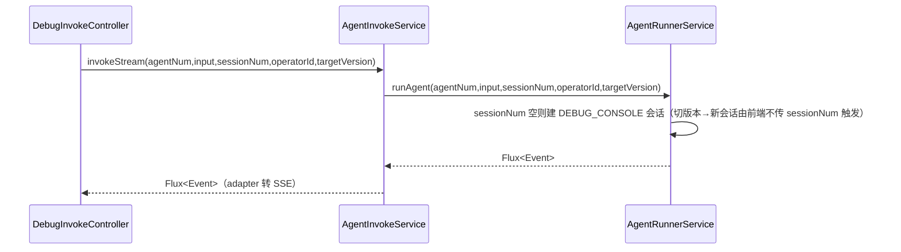

**【应用层自检】** 先模块划分再按模块；每方法配时序图；QueryService 只读 Mapper、CommandService/迁移未注入 Repository/Gateway（迁移的 backfill 例外已显式说明）；`@Resource` 注入。✅

---

## 7. Adapter 层设计

### 7.1 业务模块划分
| 模块 | 入口类 | 类型 |
|------|--------|------|
| 7.2 skill | `SkillQueryController` | GET |
| 7.3 agent | `AgentQueryController` | GET |
| 7.4 agent（运维） | `AgentMaintenanceController` | POST |
| 7.5 debugconsole | `DebugInvokeController` | POST/SSE |

> HTTP 仅 GET（查询）/ POST（增删改）；简单 GET 沿用仓库既有惯例以 `@RequestParam` 传参（与 `versionList` / `detail` 等一致，不另造 `*Param` 类）；返回 `Result<*VO>`；`@Resource` 注入。查询类 QueryService 直接返回 VO（与既有 `listA2aSyncCandidates` 一致）。

### 7.2 skill — SkillQueryController（前缀 `/api/v1/skill/query`）
| 方法 | 路径 | 入参 | 出参 | 职责 |
|------|------|------|------|------|
| GET | `/api/v1/skill/query/bindable-versions` | `@RequestParam skillNum` | `Result<List<SkillBindableVersionVO>>` | 可绑定版本列表 |

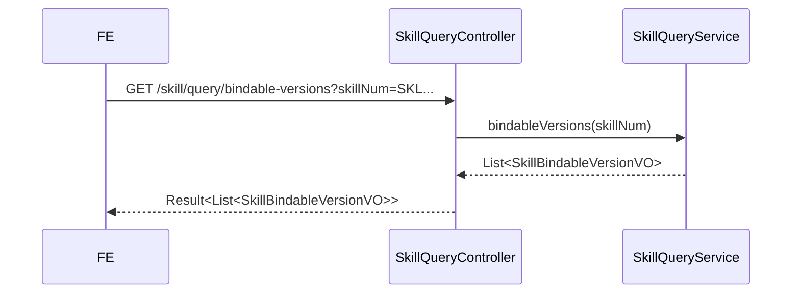

### 7.3 agent — AgentQueryController（前缀 `/api/v1/agents`）
| 方法 | 路径 | 入参 | 出参 | 职责 |
|------|------|------|------|------|
| GET | `/api/v1/agents/debug-versions` | `@RequestParam agentNum` | `Result<List<AgentDebugVersionVO>>` | 可调试版本选择器数据（含草稿 + 状态标签） |
| GET | `/api/v1/agents/skill-binding-status` | `@RequestParam agentNum, targetVersion?` | `Result<List<AgentSkillBindingStatusVO>>` | 已绑定 Skill 的新版本提示 |

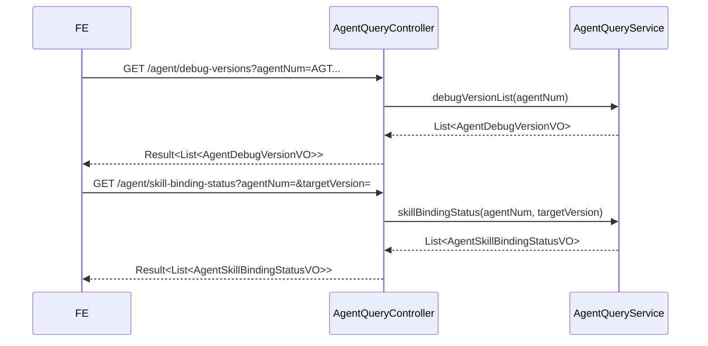

### 7.4 agent（运维）— AgentMaintenanceController
| 方法 | 路径 | 入参 | 出参 | 职责 |
|------|------|------|------|------|
| POST | `/api/v1/agents/maintenance/migrate-skill-refs` | 空 body | `Result<MigrateSkillRefsResultVO>` | 一次性刷数（**权限：平台管理员**，控制器内 `AuthzQueryService.isPlatformAdmin` 兜底校验 + 路由级 RBAC） |

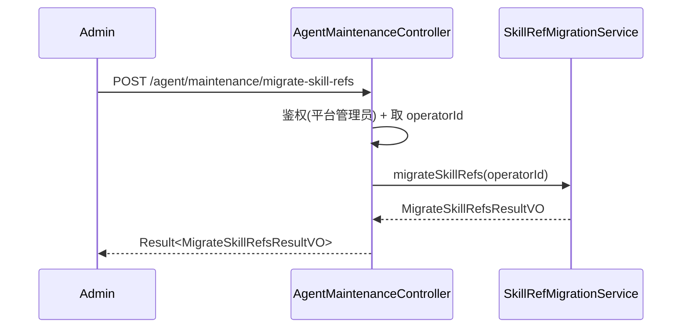

### 7.5 debugconsole — DebugInvokeController（改造）
| 方法 | 路径 | 入参 | 出参 | 职责 |
|------|------|------|------|------|
| POST | `/api/v1/debug-console/invoke` | `DebugInvokeRequest{..., target_version?}` | `Flux<ServerSentEvent<String>>` | 按目标版本调试（含草稿），SSE 流式 |

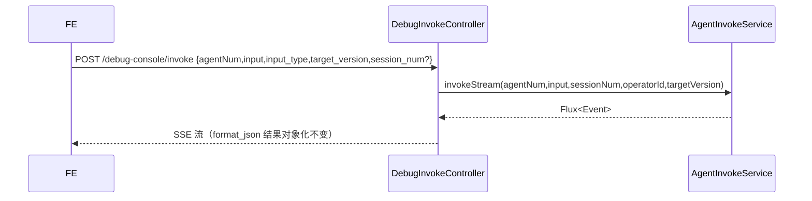

**【Adapter 自检】** 仅 GET/POST；入参 `*Param`、出参 `Result<*VO>`（调试为 SSE 流式，属既有约定）；每入口配时序图；运维接口标注权限；`@Resource` 注入。✅

---

## 8. 数据库设计

### 8.1 表结构与 DDL

**无 schema 变更，无新增表 / 字段 / 索引。** `skillRefs` 存于既有 JSON 文本列：
- `agent_version.config_snapshot`（各版本快照，含 DRAFT/PUBLISHED/ARCHIVED）
- `agent.config_snapshot`（当前在线版本镜像）

二者反序列化为 `ConfigSnapshot`，`skillRefs` 为其字段。故本方案**不产生 DDL**（无 Flyway 迁移脚本）。

### 8.2 数据迁移（刷数，应用级 JSON 回填，非纯 SQL）

- **目标**：将存量仅含 `skillNums`（无 `skillRefs`）的快照，回填为 `skillRefs`（每项 = 迁移时该 `skillNum` 的当前发布版本 `Skill.currentVersionNum`）。
- **范围**：`agent_version` 全部行（DRAFT/PUBLISHED/ARCHIVED）+ `agent.config_snapshot` 镜像（CONFIG 且非空）。
- **执行方式**：一次性运维接口 `POST /agent/maintenance/migrate-skill-refs`（平台管理员），可重跑（幂等：已含 `skillRefs` 跳过）。
- **不生成裸 DML**：因 `skillRefs` 嵌于 JSON，需应用逻辑逐条读取 → 按 `skillNum` 解析发布版 → 序列化回写单列，故由 `SkillRefMigrationService` 实现（伪逻辑见 §6.4.2）。
- **回填后处置**：确认全量迁移完成后，删除 `AgentRunnerFactory.registerSkills` 的 legacy `skillNums` 兜底分支。

> 说明：迁移只更新 `config_snapshot` 列，不改 `create_time/update_time` 语义字段值的业务含义（如需保留审计可选带 `update_no`，但不改变状态/版本号）。

**【数据库自检】** 无 schema 变更已写明；迁移为应用级 JSON 回填（非 DDL/裸 DML），幂等与范围明确；与领域/ infra 一致。✅

---

## 9. 模块变更清单

### client → `impl-client-module`
- 新增 `SkillBindableVersionVO`（skill.vo）
- 新增 `AgentDebugVersionVO`、`AgentSkillBindingStatusVO`、`MigrateSkillRefsResultVO`（agent）
- 修改 `DebugInvokeRequest`：新增可空 `targetVersion`（`@JsonProperty("target_version")`）
- 简单 GET 沿用 `@RequestParam`，不新增 `*QueryParam` 类

### domain → `impl-domain-module`
- **无结构变更**（复用 `ConfigSnapshot.skillRefs` / `SkillRef`）。

### infra → `impl-infra-module`
- **不新增 Mapper**：迁移复用 `AgentVersionMapper` / `AgentMapper`（`UpdateWrapper` 字符串列名单列回填）
- 复用 `SkillMapper` / `SkillVersionMapper` / `AgentMapper` / `AgentVersionMapper`（只读查询）

### application → `impl-application-module`
- `SkillQueryService`：新增 `bindableVersions`
- `AgentQueryService`：新增 `debugVersionList` / `loadAgentForDebug` / `skillBindingStatus`
- 新增 `SkillRefMigrationService`：`migrateSkillRefs`
- `AgentRunnerFactory`：改造 `build`（增 `targetVersion`，放开 PUBLISHED 校验，迁移后删 legacy 分支）
- `AgentRunnerService`：改造 `runAgent`（透传 `targetVersion`）
- `AgentInvokeService`：改造 `invokeStream`（透传 `targetVersion`）

### adapter → `impl-adapter-module`
- `SkillQueryController`：新增 GET `/bindable-versions`
- `AgentQueryController`：新增 GET `/debug-versions`、GET `/skill-binding-status`
- 新增 `AgentMaintenanceController`：POST `/migrate-skill-refs`（平台管理员）
- `DebugInvokeController`：改造透传 `target_version`

### facade → 无变更

**【模块变更清单自检】** 每条变更对应唯一 impl skill，且与各层设计一致。✅

---

## 10. 代码分支命名

- **需求类**：`feature-20260728-agent-skill-version-binding`（rd-agent-be 与 rd-agent-fe **同名**）。

---

## 11. 实现顺序与依赖

1. **client**：新增/修改 VO / Param / `DebugInvokeRequest`（契约先行）。
2. **infra**：`SkillRefBackfillMapper`（迁移用）。
3. **application**：
   - 查询：`SkillQueryService.bindableVersions` → `AgentQueryService.debugVersionList` / `loadAgentForDebug` / `skillBindingStatus`；
   - 调试链：`AgentRunnerFactory.build`（增 targetVersion）→ `AgentRunnerService.runAgent` → `AgentInvokeService.invokeStream`；
   - 迁移：`SkillRefMigrationService.migrateSkillRefs`。
4. **adapter**：`SkillQueryController` / `AgentQueryController` / `AgentMaintenanceController` / `DebugInvokeController`。
5. **上线运维**：执行 `migrate-skill-refs` 全量刷数 → 校验通过 → **删除** `registerSkills` legacy `skillNums` 兜底分支并回归。
6. domain / facade 无改动。每层完成后 `mvn -DskipTests clean package` + `mvn test` 全绿（遵循后端构建强约束）。

---

## 12. 接口与数据契约（JSON 示例）

**GET `/api/v1/skill/query/bindable-versions?skillNum=SKL20260601xxxxxx`**
```json
// Result<List<SkillBindableVersionVO>>
{ "code": 0, "data": [
  { "versionNum": "v1.3.0", "publishedTime": "2026-07-20 10:00:00.000", "latest": true },
  { "versionNum": "v1.2.0", "publishedTime": "2026-07-01 09:30:00.000", "latest": false }
] }
```

**GET `/api/v1/agents/debug-versions?agentNum=AGT20260511xxxxxx`**
```json
// Result<List<AgentDebugVersionVO>>
{ "code": 0, "data": [
  { "versionNum": null, "status": "DRAFT", "statusLabel": "草稿态", "current": false },
  { "versionNum": "v1.3.0", "status": "PUBLISHED", "statusLabel": "发布态", "current": true, "publishedTime": "2026-07-20 10:00:00.000" },
  { "versionNum": "v1.2.0", "status": "ARCHIVED", "statusLabel": "历史态", "current": false, "publishedTime": "2026-07-01 09:30:00.000" }
] }
```

**GET `/api/v1/agents/skill-binding-status?agentNum=AGT...&targetVersion=DRAFT`**
```json
// Result<List<AgentSkillBindingStatusVO>>
{ "code": 0, "data": [
  { "skillNum": "SKL...", "skillName": "代码检查", "boundVersion": "v1.2.0", "latestVersion": "v1.3.0", "hasNewer": true, "boundDeprecated": false }
] }
```

**POST `/api/v1/debug-console/invoke`**
```json
// DebugInvokeRequest（target_version 可空：vX.Y.Z / "DRAFT" / 省略）
{ "agentNum": "AGT...", "input": "帮我分析这个需求", "input_type": "text", "target_version": "DRAFT", "session_num": null }
```

**POST `/api/v1/agents/maintenance/migrate-skill-refs`**
```json
// Result<MigrateSkillRefsResultVO>
{ "code": 0, "data": { "scanned": 1280, "migrated": 342, "skipped": 938 } }
```

---

## 13. 其他

- **非功能**：调试调用不写生产会话历史（走 `DEBUG_CONSOLE` 会话）、不计费、不污染线上版本号；权限沿用现有 RBAC 与工作空间隔离，运维迁移接口限平台管理员。
- **兼容/回滚**：`build` 旧重载保留，生产 invoke 行为不变；迁移接口幂等可重跑；若迁移异常，legacy 兜底分支在迁移校验通过前**不删除**，保证可回退。
- **前端（rd-agent-fe）配套**（同分支，不在本后端方案展开）：Skill 挂载区版本下拉 + 新版本提示 + 一键切换；调试台 Agent 版本选择器（默认草稿→在线）+ 状态标签 + 切版本清空 sessionNum。

### 13.1 临时刷数代码（⚠️ 下个版本必须移除）

本次刷数迁移相关代码均为**一次性临时代码**，仅服务存量 `skillNums → skillRefs` 回填。**全量迁移执行并校验通过后，下一个版本必须删除以下代码，不得长期保留：**

| 层 | 待移除代码 | 说明 |
|----|-----------|------|
| adapter | `AgentMaintenanceController#migrateSkillRefs`（POST `/api/v1/agents/maintenance/migrate-skill-refs`） | 一次性运维接口，用完即删；`AgentMaintenanceController` 无其他方法，整类删除 |
| application | `SkillRefMigrationService`（含 `migrateSkillRefs` / `backfill` / `resolveCurrentVersion`） | 迁移编排，用完即删 |
| client | `MigrateSkillRefsResultVO` | 迁移结果 VO，用完即删 |
| application | `AgentRunnerFactory#registerSkills` 的 legacy `skillNums` 兜底分支 | 迁移后所有快照均含 `skillRefs`，兜底分支失去意义，一并删除 |

> 实现说明：迁移的 JSON 单列回填直接复用 `AgentVersionMapper` / `AgentMapper` + `UpdateWrapper`（字符串列名 `config_snapshot`），<b>未新增 `SkillRefBackfillMapper`</b>；删除时无需清理额外 Mapper。

> 删除前置条件：`migrate-skill-refs` 全量执行完成（`scanned == migrated + skipped` 且抽样校验 `skillRefs` 已回填），且监控确认运行时不再触发 legacy `skillNums` 兜底 WARN 日志。

---

> 交付说明：本技术方案按六层与各 `impl-*-module` 对齐；实现时按 §9 模块变更清单选用对应 skill，按 §11 顺序推进。
