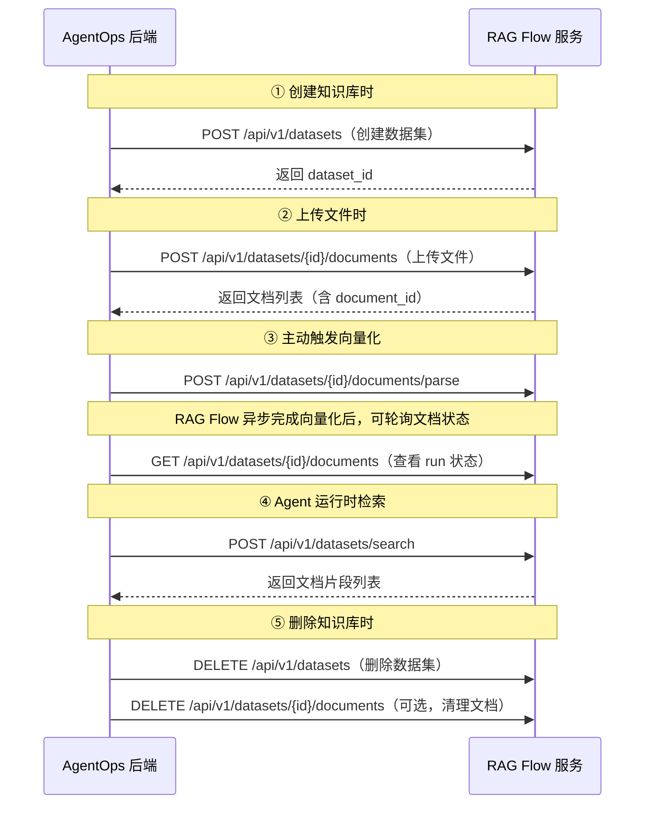

# RAG Flow 开放接口文档

> 文档日期：2026-07-29　|　版本：v1.0
> 来源仓库：[infiniflow/ragflow](https://github.com/infiniflow/ragflow.git)（Go + Python 混合架构）
> 用途：AgentOps 知识库管理对接 RAG Flow 的接口参考

---

## 概览

RAG Flow 是一个开源 RAG（检索增强生成）系统，提供以下核心 API 类别供外部系统集成：

| API 类别 | 对接 AgentOps 用途 | 重要性 |
| --- | --- | --- |
| **数据集（Dataset）管理** | 在 RAG Flow 侧创建/管理知识库（对应 AgentOps 的知识库） | ★★★★★ |
| **文档（Document）管理** | 上传/删除文档，触发向量化解析 | ★★★★★ |
| **检索（Search）** | Agent 运行时从知识库检索相关文档片段 | ★★★★★ |
| **聊天补全（Chat Completions）** | Agent 基于知识库生成回答（流式） | ★★★★☆ |
| **文件（File）管理** | 上传文件，关联到数据集 | ★★★☆☆ |
| **系统/健康检查** | 连通性/健康检查 | ★★★☆☆ |
| **鉴权（Token）管理** | 创建 API Key 用于服务间认证 | ★★★☆☆ |

---

## 鉴权方式

RAG Flow 支持三种鉴权方式：

| 方式 | Header | 说明 |
| --- | --- | --- |
| **JWT Token** | `Authorization: Bearer <jwt_token>` | Web 端登录后使用 |
| **API Key** | `Authorization: Bearer <api_key>` | 服务间调用使用（对应 AgentOps 的 RAG Flow 来源配置） |
| **Beta Token** | `Authorization: Bearer <beta_token>` | 公开 Bot 端点使用 |

> **AgentOps 集成推荐**：使用 **API Key** 方式。后端在创建知识库时，调用 RAG Flow 的 `/api/v1/system/tokens` 创建 API Key，后续所有请求都使用该 Key。

---

## 一、数据集（Dataset）管理

数据集是 RAG Flow 中的"知识库"概念，一个数据集包含多个文档。

### 1.1 创建数据集

```
POST /api/v1/datasets
Content-Type: application/json
Authorization: Bearer <api_key>
```

**请求体：**

| 字段 | 类型 | 必填 | 说明 |
| --- | --- | --- | --- |
| `name` | string | ✓ | 数据集名称 |
| `description` | string | 可选 | 数据集描述 |
| `embedding_model` | string | 可选 | 嵌入模型名称（不指定则使用租户默认模型） |
| `chunk_method` | string | 可选 | 分块方法，枚举值：`naive`, `book`, `email`, `laws`, `manual`, `one`, `paper`, `picture`, `presentation`, `qa`, `table`, `tag`（默认 `naive`） |
| `permission` | string | 可选 | 可见性：`me`（仅自己）/ `team`（团队共享） |
| `parser_config` | object | 可选 | 解析器配置 |

**响应：**

```json
{
  "code": 0,
  "data": {
    "id": "<dataset_id>",
    "name": "<name>",
    "chunk_count": 0,
    "token_count": 0,
    "create_time": "...",
    "update_time": "...",
    "parser_id": "naive",
    "parser_config": {...},
    "permission": "me"
  }
}
```

### 1.2 查询数据集列表

```
GET /api/v1/datasets?page=1&page_size=30&orderby=create_time&desc=true
Authorization: Bearer <api_key>
```

**查询参数：**

| 参数 | 类型 | 默认值 | 说明 |
| --- | --- | --- | --- |
| `page` | int | 1 | 页码 |
| `page_size` | int | 30 | 每页数量 |
| `orderby` | string | `create_time` | 排序字段 |
| `desc` | bool | `true` | 是否降序 |
| `name` | string | — | 按名称筛选 |
| `id` | string | — | 按 ID 筛选 |

**响应：**

```json
{
  "code": 0,
  "data": [
    {
      "id": "<dataset_id>",
      "name": "<name>",
      "chunk_count": 0,
      "token_count": 0,
      "create_time": "...",
      "update_time": "...",
      "parser_id": "naive",
      "parser_config": {...},
      "permission": "me"
    }
  ],
  "total": 1
}
```

### 1.3 获取数据集详情

```
GET /api/v1/datasets/<dataset_id>
Authorization: Bearer <api_key>
```

**响应：** 同上单个数据集 JSON 结构。

### 1.4 更新数据集

```
PUT /api/v1/datasets/<dataset_id>
Content-Type: application/json
Authorization: Bearer <api_key>
```

**请求体（可选字段，仅传入要修改的）：**

| 字段 | 类型 | 说明 |
| --- | --- | --- |
| `name` | string | 新名称 |
| `description` | string | 新描述 |
| `embedding_model` | string | 新嵌入模型 |
| `chunk_method` | string | 新分块方法 |
| `permission` | string | 新可见性 |
| `parser_config` | object | 新解析器配置 |

### 1.5 删除数据集

```
DELETE /api/v1/datasets
Content-Type: application/json
Authorization: Bearer <api_key>
```

**请求体：**

```json
{
  "ids": ["<dataset_id_1>", "<dataset_id_2>"],
  "delete_all": false
}
```

| 字段 | 类型 | 说明 |
| --- | --- | --- |
| `ids` | array | 要删除的数据集 ID 列表 |
| `delete_all` | bool | 设为 `true` 则删除所有数据集（此时忽略 `ids`）|

---

## 二、文档（Document）管理

文档是数据集的组成部分，上传后 RAG Flow 会自动执行分块和向量化。

### 2.1 上传文档到数据集

```
POST /api/v1/datasets/<dataset_id>/documents
Content-Type: multipart/form-data
Authorization: Bearer <api_key>
```

**表单字段：**

| 字段 | 类型 | 必填 | 说明 |
| --- | --- | --- | --- |
| `file` | file | ✓ | 要上传的文件（PDF, Word, Excel, Markdown, 图片等）|
| `parent_path` | string | 可选 | 上传到父文件夹下的子路径（可选嵌套路径）|

**响应：**

```json
{
  "code": 0,
  "data": [
    {
      "id": "<document_id>",
      "name": "文档名称.pdf",
      "chunk_count": 0,
      "token_count": 0,
      "dataset_id": "<dataset_id>",
      "chunk_method": "naive",
      "run": "0"
    }
  ]
}
```

### 2.2 查询数据集内的文档列表

```
GET /api/v1/datasets/<dataset_id>/documents?page=1&page_size=30&orderby=create_time&desc=true&keywords=<keyword>
Authorization: Bearer <api_key>
```

**查询参数（全部可选）：**

| 参数 | 类型 | 默认值 | 说明 |
| --- | --- | --- | --- |
| `page` | int | 1 | 页码 |
| `page_size` | int | 30 | 每页数量 |
| `orderby` | string | `create_time` | 排序字段 |
| `desc` | bool | `true` | 是否降序 |
| `keywords` | string | — | 文档名称模糊搜索 |
| `suffix` | array | — | 按后缀筛选（如 `pdf`, `docx`）|
| `types` | array | — | 按文件类型筛选 |
| `run` | array | — | 按处理状态筛选（`0`=未开始, `1`=运行中, `2`=已取消, `3`=完成, `4`=失败）|
| `name` | string | — | 精确匹配文档名称 |
| `id` | string | — | 精确匹配文档 ID |

> ⚠️ 查询参数中的 `run` 也接受文本值：`UNSTART`, `RUNNING`, `CANCEL`, `DONE`, `FAIL`

**响应：**

```json
{
  "code": 0,
  "data": {
    "total": 10,
    "docs": [
      {
        "id": "<document_id>",
        "name": "文档.pdf",
        "chunk_count": 15,
        "token_count": 3000,
        "dataset_id": "<dataset_id>",
        "chunk_method": "naive",
        "run": "3",
        "thumbnail": "base64_or_url",
        "type": "pdf",
        "size": 2048000,
        "create_time": 1700000000,
        "parser_config": {...}
      }
    ]
  }
}
```

### 2.3 删除数据集内的文档

```
DELETE /api/v1/datasets/<dataset_id>/documents
Content-Type: application/json
Authorization: Bearer <api_key>
```

**请求体：**

```json
{
  "ids": ["<document_id_1>", "<document_id_2>"],
  "delete_all": false
}
```

### 2.4 更新文档

```
PATCH /api/v1/datasets/<dataset_id>/documents/<document_id>
Content-Type: application/json
Authorization: Bearer <api_key>
```

**请求体（可选字段）：**

| 字段 | 类型 | 说明 |
| --- | --- | --- |
| `name` | string | 新名称 |
| `chunk_method` | string | 新分块方法 |
| `parser_config` | object | 新解析器配置 |
| `enabled` | 0/1 | 启用/禁用文档 |

### 2.5 下载文档

```
GET /api/v1/datasets/<dataset_id>/documents/<document_id>
Authorization: Bearer <api_key>
```

返回文件流。

### 2.6 触发文档解析（向量化）

```
POST /api/v1/datasets/<dataset_id>/documents/parse
Content-Type: application/json
Authorization: Bearer <api_key>
```

**请求体：**

```json
{
  "document_ids": ["<document_id_1>", "<document_id_2>"]
}
```

> 调用此接口后 RAG Flow 开始异步解析（分块 + 向量化）。文档状态从 `0`（未开始）→ `1`（进行中）→ `3`（完成）或 `4`（失败）。

### 2.7 停止文档解析

```
POST /api/v1/datasets/<dataset_id>/documents/stop
Content-Type: application/json
Authorization: Bearer <api_key>
```

**请求体：** 同 `parse` 接口的 `document_ids` 结构。

---

## 三、知识检索（Search）

### 3.1 跨数据集检索

```
POST /api/v1/datasets/search
Content-Type: application/json
Authorization: Bearer <api_key>
```

**请求体：**

| 字段 | 类型 | 必填 | 默认值 | 说明 |
| --- | --- | --- | --- | --- |
| `dataset_ids` | array | ✓ | — | 要检索的数据集 ID 列表 |
| `question` | string | ✓ | — | 查询问题 |
| `top_k` | int | 可选 | 3 | 返回的文档片段数 |
| `similarity_threshold` | float | 可选 | 0.0 | 相似度阈值（只返回高于此值的）|
| `vector_similarity_weight` | float | 可选 | 0.3 | 向量相似度权重（全文检索权重 = 1 - 此值）|
| `doc_ids` | array | 可选 | — | 限定在某些文档内检索 |
| `page` | int | 可选 | 1 | 分页 |
| `size` | int | 可选 | 10 | 分页大小 |
| `use_kg` | bool | 可选 | false | 是否使用知识图谱 |
| `keyword` | bool | 可选 | false | 是否启用关键词检索 |
| `meta_data_filter` | object | 可选 | — | 元数据过滤条件 |

**响应：**

```json
{
  "code": 0,
  "data": {
    "chunks": [
      {
        "id": "<chunk_id>",
        "content": "<文档片段文本>",
        "document_id": "<document_id>",
        "document_name": "文档名称.pdf",
        "dataset_id": "<dataset_id>",
        "dataset_name": "数据集名称",
        "similarity": 0.85,
        "vector_similarity": 0.82,
        "term_similarity": 0.65,
        "positions": [],
        "img_id": "图片ID（如有）"
      }
    ],
    "total": 1,
    "labels": []
  }
}
```

> 🔥 **这是 AgentOps 集成最核心的接口**。Agent 运行时需要调用此接口执行知识检索。

### 3.2 单数据集检索

```
POST /api/v1/datasets/<dataset_id>/search
Content-Type: application/json
Authorization: Bearer <api_key>
```

**请求体：** 同上，但不需要传 `dataset_ids`（默认使用路径中的 `dataset_id`）。

---

## 四、聊天补全（Chat Completions）

### 4.1 基于知识库的流式聊天

```
POST /api/v1/chat/completions
Content-Type: application/json
Authorization: Bearer <api_key>
```

**请求体：**

| 字段 | 类型 | 必填 | 说明 |
| --- | --- | --- | --- |
| `kb_ids` | array | ✓ | 知识库 ID 列表 |
| `question` | string | ✓ | 用户问题 |
| `stream` | bool | 可选（默认 true）| 是否流式返回 |
| `search_config` | object | 可选 | 检索配置（similarity_threshold, vector_similarity_weight, top_k 等）|

**响应（流式，SSE）：**

```
data:{"code":0,"message":"","data":{"answer":"基于...的回答","reference":[]}}
...
data:{"code":0,"message":"","data":true}
```

### 4.2 OpenAI 兼容接口

```
POST /api/v1/openai/<chat_id>/chat/completions
Content-Type: application/json
Authorization: Bearer <api_key>
```

兼容 OpenAI Chat Completions 格式，其中 `<chat_id>` 是 RAG Flow 侧的对话（Dialog）ID。

---

## 五、文件（File）管理

### 5.1 上传文件

```
POST /api/v1/files
Content-Type: multipart/form-data
Authorization: Bearer <api_key>
```

### 5.2 文件列表

```
GET /api/v1/files
Authorization: Bearer <api_key>
```

### 5.3 删除文件

```
DELETE /api/v1/files
Content-Type: application/json
Authorization: Bearer <api_key>
```

### 5.4 文件关联到数据集

```
POST /api/v1/files/link-to-datasets
Content-Type: application/json
Authorization: Bearer <api_key>
```

---

## 六、系统与鉴权

### 6.1 健康检查（无需鉴权）

```
GET /api/v1/system/ping
```

**响应：**

```json
{
  "code": 0
}
```

### 6.2 创建 API Key

```
POST /api/v1/system/tokens
Content-Type: application/json
Authorization: Bearer <jwt_token>
```

**请求体：**

| 字段 | 类型 | 必填 | 说明 |
| --- | --- | --- | --- |
| `name` | string | ✓ | API Key 名称 |

**响应：**

```json
{
  "code": 0,
  "data": {
    "token": "<api_key_string>"
  }
}
```

### 6.3 列出 API Key

```
GET /api/v1/system/tokens
Authorization: Bearer <jwt_token>
```

### 6.4 删除 API Key

```
DELETE /api/v1/system/tokens/<key>
Authorization: Bearer <jwt_token>
```

### 6.5 获取系统版本

```
GET /api/v1/system/version
```

---

## 七、代理/Agent 相关

### 7.1 Agent Bot 补全

```
POST /api/v1/agentbots/<agent_id>/completions
Content-Type: application/json
Authorization: Bearer <beta_token>
```

### 7.2 Agent Bot 输入参数

```
GET /api/v1/agentbots/<agent_id>/inputs
Authorization: Bearer <beta_token>
```

### 7.3 Agent Bot 日志

```
GET /api/v1/agentbots/<agent_id>/logs/<message_id>
Authorization: Bearer <beta_token>
```

---

## AgentOps 对接集成方案（建议）

### 核心流程



### 关键配置项

AgentOps 侧知识库的 `sourceConfig` 存储以下信息：

```json
{
  "endpoint": "http://<ragflow_host>:<port>",
  "apiKey": "<encrypted_api_key>",
  "knowledgeBaseId": "<ragflow_dataset_id>"
}
```

### 轮询状态建议

文档上传到 RAG Flow 后，向量化是异步的。建议使用指数退避轮询：

- 初始间隔：1 秒
- 最大间隔：30 秒
- 超时：10 分钟
- 判断依据：文档列表接口返回的 `run` 字段（`3` = 完成，`4` = 失败）

### 错误处理

| 响应 code | 含义 | AgentOps 处理 |
| --- | --- | --- |
| 0 | 成功 | 正常处理 |
| 101 | 参数错误（ARGUMENT_ERROR） | 提示用户检查配置 |
| 102 | 数据错误（DATA_ERROR） | 记录日志，提示用户重试 |
| 401/403 | 鉴权错误 | 提示 API Key 过期或不正确 |
| 500 | 服务端错误 | 降级处理，Agent 不使用知识库 |

---

## 参考资料

- RAG Flow GitHub：https://github.com/infiniflow/ragflow.git
- RAG Flow Python API：`api/apps/restful_apis/` 目录
- RAG Flow Go API：`internal/router/router.go`（Gin 框架）
- AgentOps 知识库 PRD：[2026-06-22-知识库管理-PRD.md](../产品方案/2026-06-22-知识库管理-PRD.md)