# AgentOps — 知识库管理 技术方案

> 文档日期：2026-07-30　|　版本：v1.0
> 对应 PRD：[2026-06-22-知识库管理-PRD](../产品方案/2026-06-22-知识库管理-PRD.md)
> 代码仓库：[rd-agent-be](../代码仓库/rd-agent-be/)　基础包：`ink.garry.rd.agent.ws`
> 兄弟方案：[工具管理-技术方案](./2026-06-09_工具管理-技术方案.md) · [模型管理-技术方案](./2026-06-10_模型管理-技术方案.md)

---

## 目录

1. [目标与范围](#1-目标与范围)
2. [架构设计](#2-架构设计)
3. [Facade 层设计](#3-facade-层设计)
4. [领域层设计](#4-领域层设计)
5. [基础设施层设计](#5-基础设施层设计)
6. [应用层设计](#6-应用层设计)
7. [Adapter 层设计](#7-adapter-层设计)
8. [数据库设计](#8-数据库设计)
9. [模块变更清单](#9-模块变更清单)
10. [代码分支命名](#10-代码分支命名)
11. [实现顺序与依赖](#11-实现顺序与依赖)
12. [接口与数据契约](#12-接口与数据契约)
13. [其他](#13-其他)

---

## 1. 目标与范围

### 1.1 目标

- 在 rd-agent-be 内新增 **知识库（knowledgebase）领域**，承载知识库及文档的生命周期管理；
- 集成 **RAG Flow** 作为知识库的向量化引擎与检索后端，实现知识库创建、文件上传、向量化、检索全流程；
- 为 Agent 运行时提供知识检索能力：**自动注入上下文（AUTO 模式）**、**按需搜索工具（ON_DEMAND 模式）**、**混合模式（HYBRID）**；
- 知识库的绑定关系存储于 Agent 版本配置 JSON 中，复用 `ConfigSnapshot` 扩展机制。

### 1.2 范围

**做**：
- `knowledgebase` 领域新增（单聚合根 `KnowledgeBase` + 子实体 `KnowledgeBaseFile`）；
- 知识库 CRUD + 文件上传/删除 + 向量化状态同步；
- RAG Flow 集成：数据集自动创建、文件上传与解析触发、检索、文档删；
- 向量化状态同步：后端定时任务轮询 RAG Flow 文档处理状态并回写；
- Agent 运行时知识检索中间件：AUTO / ON_DEMAND / HYBRID 三种模式；
- Agent 版本配置中存储知识库绑定关系（`knowledgeBaseBindings`）；
- Flyway V35 迁移脚本（`knowledge_base` + `knowledge_base_file` 表）。

**不做**（本期）：
- 金山文档（KINGSOFT）来源集成（**字段/枚举上预留**，不实现逻辑）；
- RAG Flow 数据集删除（知识库软删不动远端数据集）；
- 知识库版本化、评测、跨工作空间共享；
- 前端直接对接 RAG Flow（前端只通过后端 API 交互）。

### 1.3 设计前共识

| # | 决策点 | 结论 |
| --- | --- | --- |
| 1 | 对接范围 | **仅对接 RAG Flow**；KINGSOFT 来源预留枚举与字段，不实现逻辑 |
| 2 | 部署架构 | **不变**，无新增应用/前端部署实例，复用现有部署架构 |
| 3 | 知识库编号前缀 | **KB**（如 `KB202607301200001`），文件编号前缀 **KBF** |
| 4 | sourceConfig 设计 | 仅存 `ragFlowDatasetId`（RAG Flow 侧的 dataset ID）；endpoint、apiKey 归平台级 Apollo 配置，**不存到每个 KB 的 sourceConfig 中** |
| 5 | 文件上传流程 | 前端 → OSS/Terra（STS 预签名上传）→ 后端回调 → 后端从 OSS 下载文件 → multipart 上传至 RAG Flow → 触发向量化 |
| 6 | 向量化状态同步 | **后端定时任务轮询** RAG Flow 文档处理状态并回写到 `knowledge_base_file.vector_status`；前端通过后端 API 查状态，不直接调 RAG Flow |
| 7 | 删除语义 | 知识库：**软删**（deleted=1），不删远端 RAG Flow 数据集；**文件删除**：同时删除远端 RAG Flow 文档并软删本地记录 |
| 8 | Agent 绑定 | 存 Agent 版本配置 JSON `knowledgeBaseBindings: [{kbNum, retrievalMode, topK, minScore}]`，复用 `ConfigSnapshot` JSON 扩展 |
| 9 | 检索暴露方式 | KnowledgeBase 聚合上提供 `retrieve(question, topK, minScore)` 只读领域动作，通过聚合持有的 Gateway 调用 RAG Flow |
| 10 | 业务错误码 | 分配 **90xx** 段（知识库 90xx，知识库文件 91xx） |
| 11 | 唯一性 | 知识库名称同一工作空间内唯一 |
| 12 | 运行时中间件 | 三种模式：AUTO（Agent 回复前自动注入知识库上下文）、ON_DEMAND（注册 `SearchKnowledgeTool` 让 Agent 自主决定）、HYBRID（两者兼具） |
| 13 | 删除前校验 | 删除知识库前必须校验是否有 Agent 绑定，有绑定则阻塞删除并提示 |
| 14 | sourceConfig 补充字段 | KINGSOFT 预留字段：`kingsoftEndpoints`、`kingsoftApplicationId` 等（不实现，仅 VO/DTO 中预留） |

---

## 2. 架构设计

### 2.1 应用架构

知识库管理复用 rd-agent-be 现有六层架构，新增 `knowledgebase` 领域，与 `tool` / `model` / `skill` / `sandbox` 平级。下表按本方案涉及的层 / 领域 / 包 / 职责列出代码结构。

| 层 | 领域 | 包 | 职责 |
| --- | --- | --- | --- |
| facade | common | `ink.garry.rd.agent.ws.facade.domain` | 复用 `DomainEntity` / `DomainEventDTO` / `DomainEventPublisher`，**无新增**（详见 §3） |
| facade | common | `ink.garry.rd.agent.ws.facade.common` | 复用 `Result` / `PageVO`，无新增 |
| client | knowledgebase | `ink.garry.rd.agent.ws.client.knowledgebase.vo` | Controller 入参 `*Param`、出参 `*VO` |
| client | knowledgebase | `ink.garry.rd.agent.ws.client.knowledgebase.dto` | 应用层入参/出参 DTO（`KbCreateParamDTO` / `KbDTO` / `KbFileDTO` 等） |
| client | knowledgebase | `ink.garry.rd.agent.ws.client.knowledgebase.constant` | `KbConstants`（长度上限、默认值、预留枚举） |
| client | common | `ink.garry.rd.agent.ws.client.common` | `BizCode` 新增知识库域错误码（90xx 段） |
| domain | knowledgebase | `ink.garry.rd.agent.ws.domain.knowledgebase` | `KnowledgeBase` 聚合根 |
| domain | knowledgebase | `ink.garry.rd.agent.ws.domain.knowledgebase.entity` | `KnowledgeBaseFile` 子实体 |
| domain | knowledgebase | `ink.garry.rd.agent.ws.domain.knowledgebase.valueobject` | `SourceType` / `VectorStatus` / `KbStatus` / `KbSourceConfig` / `RetrievalMode` 等值对象 |
| domain | knowledgebase | `ink.garry.rd.agent.ws.domain.knowledgebase.repository` | `KnowledgeBaseRepository`（save / findByNum / deleteByNum）|
| domain | knowledgebase | `ink.garry.rd.agent.ws.domain.knowledgebase.repository` | `KnowledgeBaseFileRepository`（save / batchSave / findByKbNum / findByNum / deleteByNum）|
| domain | knowledgebase | `ink.garry.rd.agent.ws.domain.knowledgebase.factory` | `KnowledgeBaseFactory`（create / createByNum）|
| domain | knowledgebase | `ink.garry.rd.agent.ws.domain.knowledgebase.gateway` | `KnowledgeBaseGateway`（generateKbNum / generateFileNum / createDataset / uploadDocument / parseDocuments / queryDocumentRunStatus / deleteDocument / search）|
| domain | knowledgebase | `ink.garry.rd.agent.ws.domain.knowledgebase.dto` | `KbDomainEventDTO`（领域事件载荷）|
| infra | knowledgebase | `ink.garry.rd.agent.ws.infra.knowledgebase.entity` | `KnowledgeBaseEntity` / `KnowledgeBaseFileEntity`（MyBatis-Plus）|
| infra | knowledgebase | `ink.garry.rd.agent.ws.infra.knowledgebase.mapper` | `KnowledgeBaseMapper` / `KnowledgeBaseFileMapper extends BaseMapper` |
| infra | knowledgebase | `ink.garry.rd.agent.ws.infra.knowledgebase.repository` | `KnowledgeBaseRepositoryImpl` / `KnowledgeBaseFileRepositoryImpl` |
| infra | knowledgebase | `ink.garry.rd.agent.ws.infra.knowledgebase.factory` | `KnowledgeBaseFactoryImpl` |
| infra | knowledgebase | `ink.garry.rd.agent.ws.infra.knowledgebase.gateway` | `KnowledgeBaseGatewayImpl`（BizNumGenerator + RagFlowClient）|
| infra | common | `ink.garry.rd.agent.ws.infra.common.client.ragflow` | `RagFlowClient`（Hutool HttpUtil 封装 RAG Flow REST API 调用）|
| infra | common | `db/migration/V35__knowledge_base_init.sql` | 建 `knowledge_base` + `knowledge_base_file` 表 |
| application | knowledgebase | `ink.garry.rd.agent.ws.application.knowledgebase` | `KnowledgeBaseCommandService`（写 + Redisson 锁）、`KnowledgeBaseQueryService`（读）|
| application | agentrunner | `ink.garry.rd.agent.ws.application.agentrunner` | 新增 KB 运行时中间件：`KbContextInjector`（AUTO 模式注入器）、`SearchKnowledgeTool`（ON_DEMAND 模式工具）|
| adapter | knowledgebase | `ink.garry.rd.agent.ws.adapter.knowledgebase` | `KbCommandController`（POST）/ `KbQueryController`（GET）|
| adapter | knowledgebase | `ink.garry.rd.agent.ws.adapter.knowledgebase.assembler` | `KbVoAssembler`（Param→DTO、DTO→VO）|
| adapter | common | `ink.garry.rd.agent.ws.adapter.common.scheduler` | `KbVectorizationSyncScheduleJob`（定时同步向量化状态）|

**关键调用关系与命令/查询划分：**

```
[KbCommandController(POST)] ──Param→DTO──▶ [KnowledgeBaseCommandService] ──▶ KbFactory ──▶ KnowledgeBase 聚合
                                                   │（预检 CQRS）                  │（领域动作内调 Repository/Gateway/EventPublisher）
                                                   └──────────▶ [KnowledgeBaseQueryService] ◀┘
[KbQueryController(GET)] ───Param→DTO──▶ [KnowledgeBaseQueryService] ──Mapper──▶ DTO→VO

[KbVectorizationSyncScheduleJob] ──▶ [KnowledgeBaseCommandService] ──▶ syncVectorizationStatuses()

[AgentRunnerService] ──▶ [KbContextInjector / SearchKnowledgeTool] ──▶ KnowledgeBase.retrieve(...)
```

**核心依赖方向与同步异步边界：**

- **同步**（用户触发）：知识库 CRUD → 领域动作内同步调 RAG Flow API（创建数据集、上传文档、解析触发）→ 响应返回；
- **异步**（RAG Flow 向量化状态同步）：定时任务轮询 → 仅回写 DB，不发通知；
- **Agent 运行时检索**：同步调用 RAG Flow search API，通过领域动作 `KnowledgeBase.retrieve()` 暴露。

#### 模块自检（架构设计）

- [x] 应用架构包含代码结构四列表格（层/领域/包/职责）及关键调用关系图
- [x] 模块调用关系明确区分命令类（KbCommandController→KbCommandService）与查询类（KbQueryController→KbQueryService）
- [x] Adapter 入口覆盖 HTTP Controller + 定时任务（KbVectorizationSyncScheduleJob）
- [x] 部署架构处理方式已与用户确认：不变，无新增应用/前端部署实例

### 2.2 部署架构

**部署架构不变，无新增应用/前端部署实例，复用现有部署架构。**

本方案仅需要在 rd-agent-be 现有部署中，在 Apollo 配置中心 DEV/TEST/PROD 环境新增 RAG Flow 连接配置（`ragflow.endpoint` + `ragflow.apiKey`），不涉及新增部署组件或扩缩容。

外部依赖：RAG Flow 服务（独立部署，AgentOps 后端通过 HTTP 调用）。

---

## 3. Facade 层设计

**本次无 Facade 层变更。**

知识库管理复用现有 `DomainEntity`（提供 `id`/`num`/`create_no`/`update_no`/`createTime`/`updateTime`/`deleted` 基础字段 + `initialize`/`validate`/`domainValidate`/`save`/`delete` 抽象方法）、`DomainEventDTO`、`DomainEventPublisher`、`Result`、`PageVO` 等通用基础类型，无需新增或修改。

#### 模块自检（Facade 层）

- [x] 本次无 Facade 层变更，已明确写出。

---

## 4. 领域层设计

### 4.1 业务层级划分

| 业务层级 | 业务领域 | 说明 |
| --- | --- | --- |
| 基础层 | skill / tool / model / sandbox | 资产目录，已存在 |
| **知识层** | **knowledgebase** | **本方案新增**，知识库 + 文件管理 |
| 组合层 | agent | Agent 运行时绑定知识库与检索 |

**领域定位**：`knowledgebase` 是 AgentOps 中的「知识层」基础设施，介于基础资产层（tool/skill/model）与组合层（agent）之间。知识库依赖基础层（非直接依赖），Agent 在配置时挂载知识库并选择检索模式。

### 4.2 知识库（knowledgebase）

#### 4.2.1 领域模型

**聚合设计：单聚合根 `KnowledgeBase` + 子实体 `KnowledgeBaseFile`**

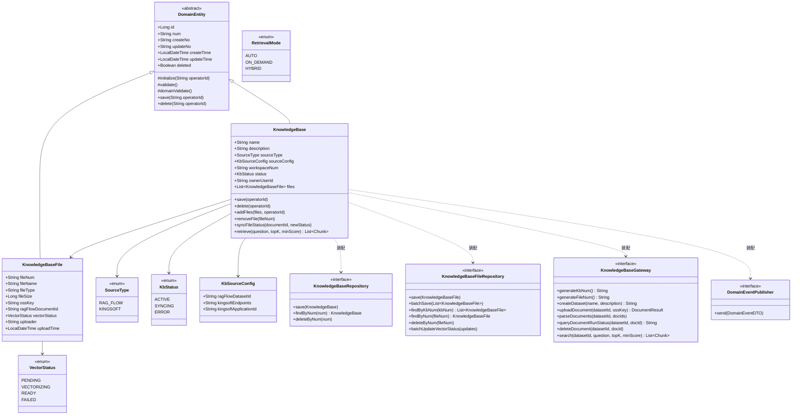

**领域结构表：**

| 对象 | 类型 | 关键属性 | 与其它对象关系 |
| --- | --- | --- | --- |
| `KnowledgeBase` | 聚合根（extends DomainEntity） | num / name / description / sourceType / sourceConfig / workspaceNum / status / ownerUserId | 持有 KnowledgeBaseRepository / KnowledgeBaseFileRepository / KnowledgeBaseGateway / DomainEventPublisher（transient 装配依赖） |
| `KnowledgeBaseFile` | 子实体（extends DomainEntity） | fileNum / fileName / fileType / fileSize / ossKey / ragFlowDocumentId / vectorStatus / uploader / uploadTime | 属于 KnowledgeBase，由 KB.files 维护集合 |
| `SourceType` | 值对象（enum） | RAG_FLOW / KINGSOFT | KnowledgeBase.sourceType；KINGSOFT 只预留枚举不实现 |
| `KbStatus` | 值对象（enum） | ACTIVE / SYNCING / ERROR | KnowledgeBase.status；由子文件 vectorStatus 派生 |
| `VectorStatus` | 值对象（enum） | PENDING / VECTORIZING / READY / FAILED | KnowledgeBaseFile.vectorStatus；对应 RAG Flow run 状态映射 |
| `KbSourceConfig` | 值对象 | ragFlowDatasetId / kingsoftEndpoints / kingsoftApplicationId | KnowledgeBase.sourceConfig，JSON 列序列化 |
| `RetrievalMode` | 值对象（enum） | AUTO / ON_DEMAND / HYBRID | 用于 Agent 版本配置绑定，非知识库领域直接属性 |
| `Chunk` | 值对象（POJO） | id / content / documentId / documentName / datasetId / similarity / vectorSimilarity / termSimilarity | 检索结果片段，领域层返回值 |

**基本属性（强制）**：`id`、`num`、`create_no`、`update_no` 均具备（继承自 `DomainEntity`）。聚合根持有三类领域协作依赖：`KnowledgeBaseRepository`、`KnowledgeBaseFileRepository`、`KnowledgeBaseGateway`、`DomainEventPublisher`（均 transient，由 `KnowledgeBaseFactory` 装配）。

**软删除标记约束（强制）**：`KnowledgeBase` / `KnowledgeBaseFile` 聚合内不出现 `is_deleted/deleted/isDeleted` 业务字段；`deleted` 仅作为 `DomainEntity` 持久化审计标识由基类管理，infra Entity / DB 表承载，聚合领域动作不读写它做业务判断。

**必备动作（强制）**：`save(operatorId)`、`delete(operatorId)` 均实现；所有领域动作均带 `operatorId`。

#### 4.2.2 领域动作

| 聚合/实体 | 领域动作 | 职责 | 前置条件 | 后置条件/规则 | 领域事件 |
| --- | --- | --- | --- | --- | --- |
| KnowledgeBase | `save(operatorId)` | 保存/更新知识库元信息 | name/workspaceNum/sourceType 非空 | num 为空则 `generateKbNum`；创建时通过 Gateway `createDataset` 在 RAG Flow 侧建数据集；`sourceConfig.ragFlowDatasetId` 由 createDataset 返回值填充 | `KB_SAVED` |
| KnowledgeBase | `delete(operatorId)` | 软删除知识库 | 前置校验：无 Agent 绑定（应用层负责） | `deleted=1`；不动远端 RAG Flow 数据集；同时软删所有关联 `KnowledgeBaseFile` | `KB_DELETED` |
| KnowledgeBase | `addFiles(files, operatorId)` | 添加文件到知识库 | status 非 ERROR 阻塞态；files 合法 | 遍历文件列表：通过 Gateway `uploadDocument` 上传到 RAG Flow → `parseDocuments` 触发向量化 → 返回 `documentId` → 创建 KnowledgeBaseFile 子实体（vectorStatus=PENDING）→ 批量持久化 | `KB_FILE_ADDED` |
| KnowledgeBase | `removeFile(fileNum)` | 从知识库移除文件 | fileNum 对应的文件存在且 vectorStatus!=VECTORIZING | 通过 Gateway `deleteDocument` 删除远端 RAG Flow 文档 → 本地软删 KnowledgeBaseFile | `KB_FILE_REMOVED` |
| KnowledgeBase | `syncFileStatus(datasetId, docId, newVectorStatus)` | 同步单个文档向量化状态 | docId 存在 | 更新对应 KnowledgeBaseFile.vectorStatus；同时根据全部子文件状态重新派生 KbStatus | `KB_STATUS_CHANGED`（当 KbStatus 变化时） |
| KnowledgeBase | `retrieve(question, topK, minScore)` | 知识检索 | status==ACTIVE 或 SYNCING；sourceConfig.ragFlowDatasetId 非空 | 通过 Gateway `search` 在 RAG Flow 侧执行向量检索，返回 Chunk 列表 | 无事件（只读操作） |

**领域动作时序图：**

**(1) `save` —— 创建知识库（含自动创建 RAG Flow 数据集）**

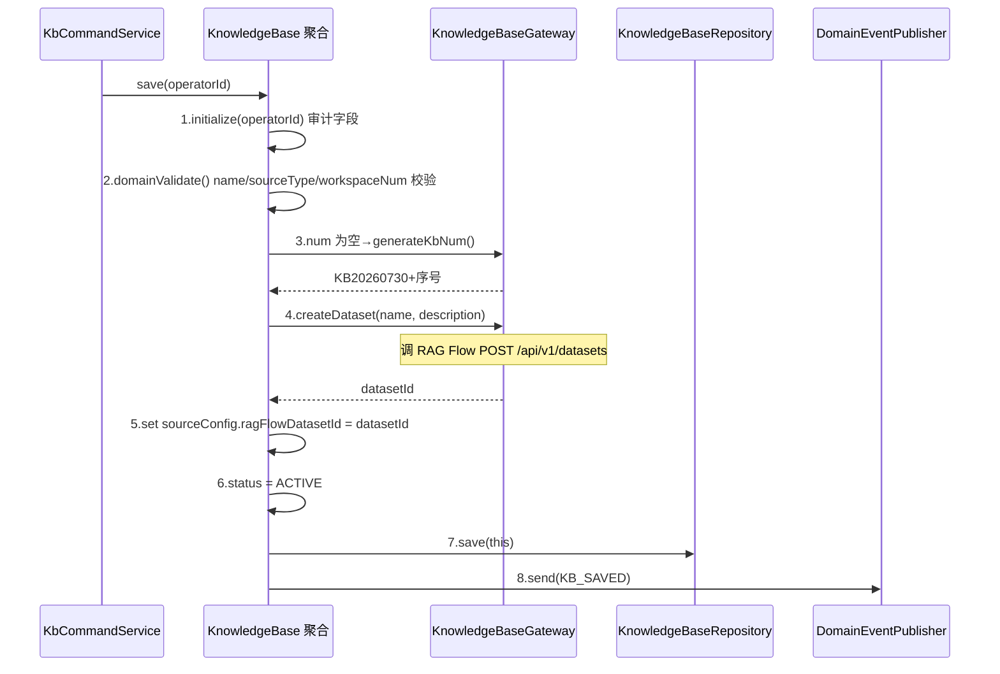

**(2) `delete` —— 软删除知识库**

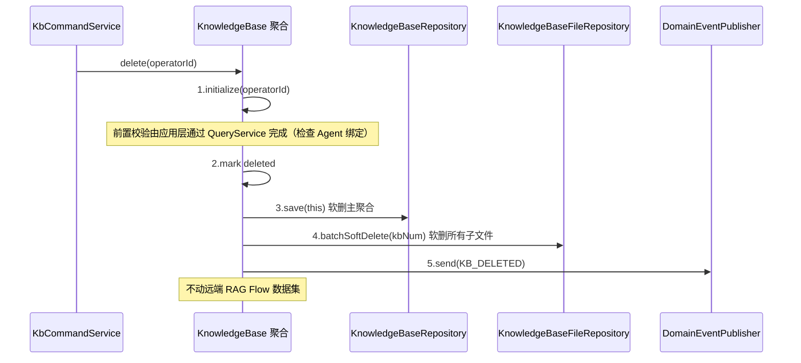

**(3) `addFiles` —— 添加文件到知识库**

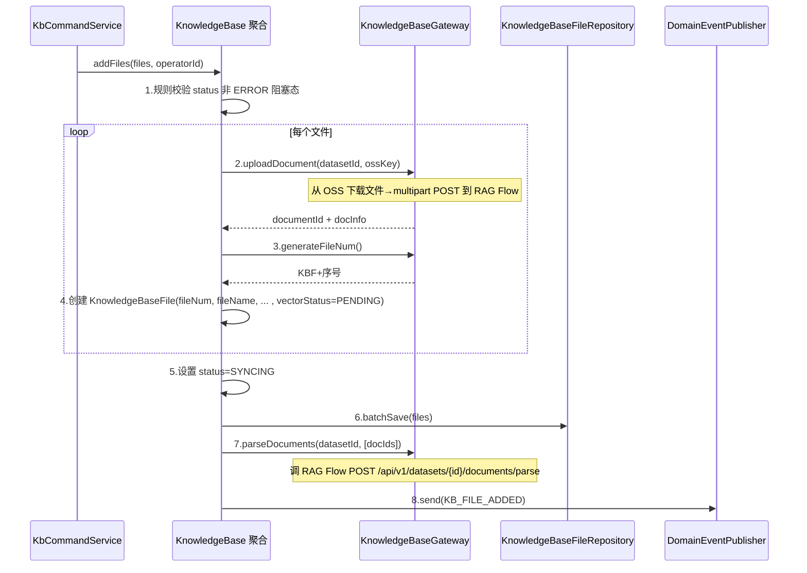

**(4) `removeFile` —— 移除文件**

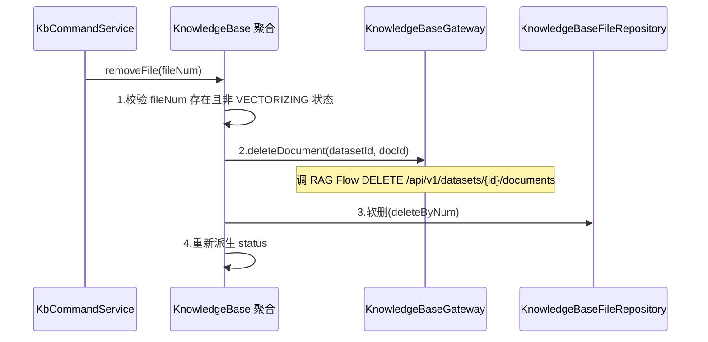

**(5) `syncFileStatus` —— 同步/回写向量化状态（定时任务触发）**

```mermaid
sequenceDiagram
    participant Scheduler as KbVectorizationSyncScheduleJob
    participant Cmd as KbCommandService
    participant KB as KnowledgeBase 聚合
    participant GW as KnowledgeBaseGateway
    participant FileRepo as KnowledgeBaseFileRepository
    participant Pub as DomainEventPublisher

    Scheduler->>Cmd: syncVectorizationStatuses()
    Cmd->>KB: createByNum(kbNum) 加载知识库
    loop 每个 vectorStatus in (PENDING, VECTORIZING) 的文件
        KB->>GW: 5.queryDocumentRunStatus(datasetId, docId)
        GW-->>KB: run 状态码 "0"|"1"|"2"|"3"|"4"
        KB->>KB: 6.映射为 VectorStatus 并更新 file.vectorStatus
    end
    KB->>KB: 7.全部文件处理完后派生 KbStatus
    Note over KB: 全部 READY→ACTIVE; 有 FAILED→ERROR; 还有 PENDING/VECTORIZING→SYNCING
    KB->>FileRepo: 8.batchUpdateVectorStatus(updates)
    alt KbStatus 变化
        KB->>Pub: 9.send(KB_STATUS_CHANGED)
    end
```

**(6) `retrieve` —— 知识检索（只读，Agent 运行时调用）**

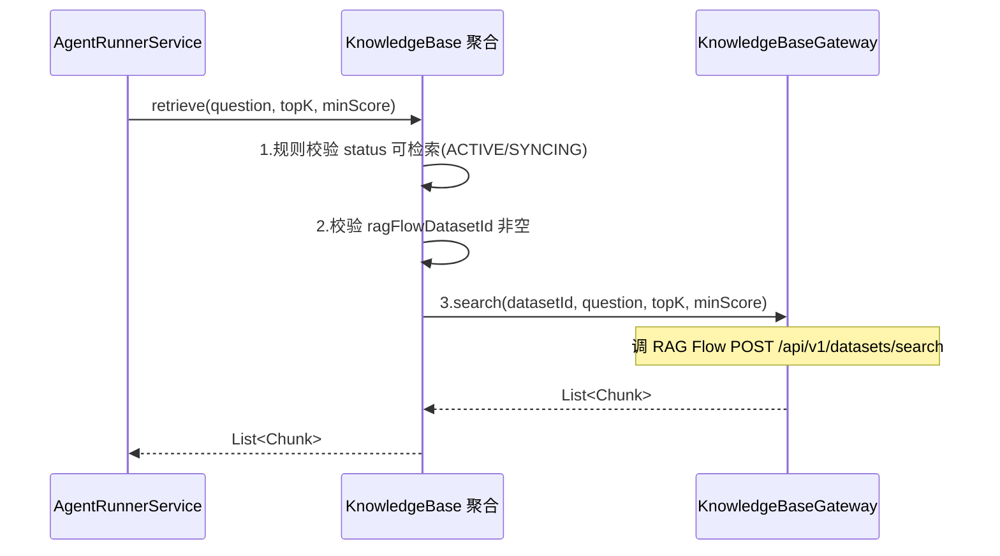

#### 4.2.3 领域规则

| 聚合/对象 | 规则类型 | 规则描述 | 违反时表达 |
| --- | --- | --- | --- |
| KnowledgeBase | 不变性 | name/workspaceNum/sourceType 必填；name ≤128 字符，description ≤500 字符 | BizCode 9001 参数非法 |
| KnowledgeBase | 不变性 | name 同一工作空间内唯一 | BizCode 9002 名称已存在 |
| KnowledgeBase | 状态约束 | sourceType 创建后不可修改 | BizCode 9003 来源类型不可变更 |
| KnowledgeBase | 状态约束 | 软删除的知识库不可再添加/移除文件 | BizCode 9004 知识库已删除 |
| KnowledgeBase | 状态约束 | 知识库不可删除（有绑定 Agent）→ 应用层前置校验 | BizCode 9005 知识库已被 Agent 绑定 |
| KnowledgeBase | 检索约束 | retrieve 仅 ACTIVE/SYNCING 状态可执行 | BizCode 9006 知识库状态不可检索 |
| KnowledgeBaseFile | 不变性 | fileName/fileType/fileSize/ossKey 必填 | BizCode 9101 文件参数非法 |
| KnowledgeBaseFile | 状态约束 | vectorStatus=VECTORIZING 的文件不可删除 | BizCode 9102 文件正在向量化 |

#### 4.2.4 领域工厂

`KnowledgeBaseFactory` 接口由 domain 定义、infra 实现，仅 2 个方法：

| Factory | 方法名 | 入参 | 返回值 | 职责 | 依赖 |
| --- | --- | --- | --- | --- | --- |
| KnowledgeBaseFactory | `create(...)` | name, description, sourceType, ownerUserId | KnowledgeBase（未落库，已装配依赖） | 用创建知识库时用户填写的业务字段构建新 KnowledgeBase；status 不在此赋值（由 save 派生 ACTIVE） | 装配 Repository/FileRepository/Gateway/EventPublisher |
| KnowledgeBaseFactory | `createByNum(num)` | num | KnowledgeBase（已装配依赖，不存在返回 null） | 经 Repository.findByNum 加载既有 KnowledgeBase 并装配依赖 | KnowledgeBaseRepository + KnowledgeBaseFileRepository |

> **create 参数约束**：`create(...)` 入参仅含用户可填字段（name/description/sourceType/ownerUserId）；不含 `operatorId`、createNo/updateNo、status、num、sourceConfig.ragFlowDatasetId（系统派生）、审计字段。`workspaceNum` 由 FactoryImpl 内部从 `WorkspaceContextHolder` 注入（与 Tool/Model 一致），不作为业务可见入参。

**`createByNum` 时序：**

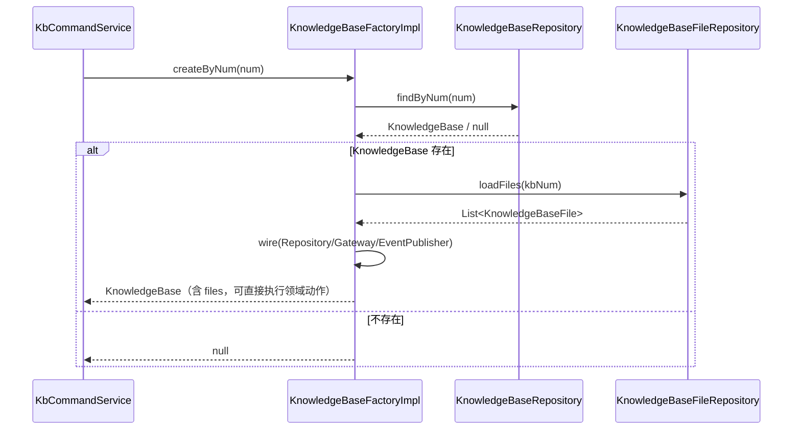

#### 4.2.5 领域网关

`KnowledgeBaseGateway` 接口定义在 domain，infra 实现 `KnowledgeBaseGatewayImpl`：

| Gateway | 方法名 | 入参 | 返回值 | 职责 | 外部依赖 | 失败策略 |
| --- | --- | --- | --- | --- | --- | --- |
| KnowledgeBaseGateway | `generateKbNum()` | 无 | String | 生成知识库编号 KB+yyyyMMddHHmm+序号（复用 BizNumGenerator） | BizNumGenerator | 不失败 |
| KnowledgeBaseGateway | `generateFileNum()` | 无 | String | 生成文件编号 KBF+yyyyMMddHHmm+序号 | BizNumGenerator | 不失败 |
| KnowledgeBaseGateway | `createDataset(name, desc)` | name, description | String (datasetId) | 在 RAG Flow 侧创建数据集 | RAG Flow POST /api/v1/datasets | 网络异常/API 错误抛 GatewayException |
| KnowledgeBaseGateway | `uploadDocument(datasetId, ossKey)` | datasetId, ossKey | DocumentResult | 从 OSS 下载文件 → multipart POST 到 RAG Flow | OSS + RAG Flow | OSS 下载/RAG Flow 上传失败抛异常 |
| KnowledgeBaseGateway | `parseDocuments(datasetId, docIds)` | datasetId, docId 列表 | void | 触发 RAG Flow 解析（向量化） | RAG Flow POST /api/v1/datasets/{id}/documents/parse | 失败抛异常（不影响文件落库） |
| KnowledgeBaseGateway | `queryDocumentRunStatus(datasetId, docId)` | datasetId, docId | String (run 状态码) | 查询 RAG Flow 文档处理状态 | RAG Flow GET /api/v1/datasets/{id}/documents | 失败重试 + 告警 |
| KnowledgeBaseGateway | `deleteDocument(datasetId, docId)` | datasetId, docId | void | 删除 RAG Flow 侧文档 | RAG Flow DELETE /api/v1/datasets/{id}/documents | 失败记录日志（幂等） |
| KnowledgeBaseGateway | `search(datasetId, question, topK, minScore)` | datasetId, question, topK(默认3), minScore(默认0.5) | List\<Chunk\> | 在 RAG Flow 侧执行向量检索 | RAG Flow POST /api/v1/datasets/search | 失败抛异常降级 |

> domain 仅依赖 `KnowledgeBaseGateway` 接口；application 不直接调用 `KnowledgeBaseGatewayImpl`。

#### 4.2.6 领域事件

| 事件名 | 触发时机 | 载荷要点 | 可订阅方/用途 |
| --- | --- | --- | --- |
| `KB_SAVED` | 创建知识库成功 | num / name / sourceType / workspaceNum / operatorId | 审计日志 |
| `KB_DELETED` | 软删除知识库成功 | num / operatorId | 审计日志 |
| `KB_FILE_ADDED` | 文件添加到知识库成功 | kbNum / fileCount / fileNums / operatorId | 审计日志 |
| `KB_FILE_REMOVED` | 文件从知识库移除成功 | kbNum / fileNum / operatorId | 审计日志 |
| `KB_STATUS_CHANGED` | KbStatus 发生变化（派生后） | kbNum / oldStatus / newStatus | 审计日志、可通知前端刷新 |

> 事件常量追加到现有 `DomainEventConstant`。审计基础设施复用平台现有链路。

#### 模块自检（领域层）

- [x] 二级目录为业务领域（4.2 知识库），下含六个三级子节（模型/动作/规则/工厂/网关/事件）；
- [x] `KnowledgeBase` 聚合根设计 Factory，仅 `create` / `createByNum` 两方法；create 入参无 operatorId/状态/审计字段；
- [x] `KnowledgeBaseGateway` 定义在 domain、infra 实现；
- [x] 基本属性 id/num/create_no/update_no 齐备；聚合根持有 Repository/Gateway/DomainEventPublisher；无 is_deleted 业务字段；具备 save/delete；所有动作带 operatorId；
- [x] 每个领域动作配时序图（save/delete/addFiles/removeFile/syncFileStatus/retrieve + createByNum）。

---

## 5. 基础设施层设计

### 5.1 knowledgebase 领域 infra 清单

| 类型 | 类名 | 包路径 | 职责 | 依赖 | 对应表/外部服务 | 新增/修改 |
| --- | --- | --- | --- | --- | --- | --- |
| Entity | `KnowledgeBaseEntity` | `infra.knowledgebase.entity` | `knowledge_base` 表映射；`source_config` JSON 列 String 存 | — | knowledge_base 表 | 新增 |
| Entity | `KnowledgeBaseFileEntity` | `infra.knowledgebase.entity` | `knowledge_base_file` 表映射 | — | knowledge_base_file 表 | 新增 |
| Mapper | `KnowledgeBaseMapper` | `infra.knowledgebase.mapper` | `extends BaseMapper<KnowledgeBaseEntity>`，无自定义 SQL | KnowledgeBaseEntity | knowledge_base 表 | 新增 |
| Mapper | `KnowledgeBaseFileMapper` | `infra.knowledgebase.mapper` | `extends BaseMapper<KnowledgeBaseFileEntity>`，`batchUpdateVectorStatus` 批量更新 | KnowledgeBaseFileEntity | knowledge_base_file 表 | 新增 |
| RepositoryImpl | `KnowledgeBaseRepositoryImpl` | `infra.knowledgebase.repository` | 实现 `KnowledgeBaseRepository`；Entity↔KnowledgeBase 转换 | **仅注入 KnowledgeBaseMapper** | knowledge_base 表 | 新增 |
| RepositoryImpl | `KnowledgeBaseFileRepositoryImpl` | `infra.knowledgebase.repository` | 实现 `KnowledgeBaseFileRepository`；Entity↔KnowledgeBaseFile 转换；batchUpdate 实现 | **仅注入 KnowledgeBaseFileMapper** | knowledge_base_file 表 | 新增 |
| FactoryImpl | `KnowledgeBaseFactoryImpl` | `infra.knowledgebase.factory` | 实现 `KnowledgeBaseFactory`（create + createByNum）；create 注入 workspaceNum；装配领域依赖 | **仅注入** KnowledgeBaseRepository + KnowledgeBaseFileRepository + KnowledgeBaseGateway + DomainEventPublisher | — | 新增 |
| GatewayImpl | `KnowledgeBaseGatewayImpl` | `infra.knowledgebase.gateway` | 实现 `KnowledgeBaseGateway`；协调 BizNumGenerator + RagFlowClient + OssClient 完成网关方法 | BizNumGenerator / RagFlowClient / OssClient | RAG Flow + OSS | 新增 |
| client | `RagFlowClient` | `infra.common.client.ragflow` | 封装 RAG Flow REST API 调用（Hutool HttpUtil）；方法：createDataset / uploadDocument / parseDocuments / queryDocuments / deleteDocument / search / ping | OkHttp / Hutool HttpUtil | RAG Flow 服务 | 新增 |
| client | `RagFlowConfig` | `infra.common.client.ragflow.config` | RAG Flow 连接配置 POJO（endpoint / apiKey），由 Apollo 配置注入 | — | Apollo 配置 | 新增 |
| common | `DomainEventConstant` | `infra.common.constant` | 追加 `KB_SAVED / KB_DELETED / KB_FILE_ADDED / KB_FILE_REMOVED / KB_STATUS_CHANGED` | — | — | 修改 |
| common | `LockKeyConstant` | `infra.common.constant` | 追加知识库用例锁 key 前缀 `KNOWLEDGE_BASE_COMMAND` | — | — | 修改 |

### 5.2 RagFlowClient 设计要点

`RagFlowClient` 使用 **Hutool HttpUtil** 封装 HTTP 调用（与 `GcacClient`、`FunctionCallInvoker` 同模式），不引入新的 HTTP 客户端库。

```java
@Component
public class RagFlowClient {
    // 从 Apollo 注入
    @Resource
    private RagFlowConfig ragFlowConfig;

    /**
     * 创建数据集
     * POST /api/v1/datasets
     */
    public String createDataset(String name, String description) {
        JSONObject body = JSONUtil.createObj()
            .set("name", name)
            .set("description", description);
        String response = HttpUtil.createPost(endpoint + "/api/v1/datasets")
            .header("Authorization", "Bearer " + apiKey)
            .body(body.toString())
            .execute()
            .body();
        // 解析 response → 提取 dataset id
    }

    /**
     * 上传文档到数据集
     * POST /api/v1/datasets/{datasetId}/documents (multipart/form-data)
     */
    public DocumentUploadResult uploadDocument(String datasetId, String ossKey) {
        // 1. 通过 OssClient 从 OSS 下载文件到临时目录
        File tempFile = ossClient.download(ossKey);
        // 2. multipart POST 到 RAG Flow
        String response = HttpUtil.createPost(endpoint + "/api/v1/datasets/" + datasetId + "/documents")
            .header("Authorization", "Bearer " + apiKey)
            .form("file", tempFile)
            .execute()
            .body();
        // 3. 清理临时文件
    }

    // ... 其余方法类似
}
```

### 5.3 转换与序列化要点

- `source_config` JSON 列 ↔ `KbSourceConfig` 值对象：`KnowledgeBaseRepositoryImpl` 用 fastjson2 序列化/反序列化（同 AgentEntity.config_snapshot 模式）。
- `KnowledgeBaseRepositoryImpl` 仅注入 `KnowledgeBaseMapper`，不作为 application 查询入口。
- Spring Bean 注入统一 `@Resource`，禁用 `@Autowired` / 构造器 / Setter / `ApplicationContext` 手动获取。

### 5.4 平台级 RAG Flow 配置（Apollo）

| 配置键 | 类型 | 说明 |
| --- | --- | --- |
| `ragflow.endpoint` | String | RAG Flow 服务地址（如 `http://ragflow.example.com`） |
| `ragflow.apiKey` | String | 平台级 API Key（所有知识库共享一套凭证） |
| `ragflow.connectTimeout` | int | 连接超时（毫秒，默认 5000） |
| `ragflow.readTimeout` | int | 读取超时（毫秒，默认 30000） |

#### 模块自检（infra）

- [x] 覆盖 Entity/Mapper/RepositoryImpl/FactoryImpl/GatewayImpl + common + RagFlowClient；
- [x] RepositoryImpl 仅注入本聚合 Mapper，不作 application 查询入口；FactoryImpl 仅注入 Repository（+装配依赖）；
- [x] 与 §8 数据库设计、§4 domain 接口一致；
- [x] 统一 `@Resource` 注入。

---

## 6. 应用层设计

### 6.1 业务模块划分

| application 模块 | 对应领域 | 说明 |
| --- | --- | --- |
| 6.2 知识库（knowledgebase） | domain.knowledgebase | `KnowledgeBaseCommandService` + `KnowledgeBaseQueryService` |
| 6.3 Agent 运行时（agentrunner） | — | 新增 KB 运行时中间件（KbContextInjector / SearchKnowledgeTool）在 AgentRunner 中注册 |

**依赖硬约束**：application 禁止注入/调用 `KnowledgeBaseRepository` / `KnowledgeBaseFileRepository` / `KnowledgeBaseGateway`；所有读查询走 `KnowledgeBaseQueryService`（经 Mapper 只读）。CommandService 需读取时调 QueryService。

### 6.2 知识库（knowledgebase）

#### 6.2.1 Service 方法清单

**`KnowledgeBaseCommandService`**（写侧，方法均 `@Transactional`，写操作加 Redis 锁）：

| 方法 | 签名 | 职责 | 入参/出参 |
| --- | --- | --- | --- |
| createKb | `KbDTO createKb(KbCreateParamDTO, String operatorId)` | 创建知识库（含 RAG Flow 数据集自动创建） | in: name/description/sourceType/ownerUserId / out: KbDTO |
| updateKb | `void updateKb(KbUpdateParamDTO, String operatorId)` | 编辑知识库元信息（name/description）；sourceType 不可改 | in: num/name/description |
| deleteKb | `void deleteKb(String num, String operatorId)` | 软删除知识库；前置校验 Agent 绑定 | in: num |
| addFiles | `List<KbFileDTO> addFiles(String kbNum, List<FileUploadParamDTO>, String operatorId)` | 向知识库添加文件（OSS key → RAG Flow 上传 + 向量化触发） | in: kbNum + 文件列表(ossKey/fileName/fileType/fileSize) / out: KbFileDTO |
| removeFile | `void removeFile(String kbNum, String fileNum, String operatorId)` | 从知识库移除文件（含 RAG Flow 远端删除） | in: kbNum + fileNum |
| syncVectorizationStatuses | `void syncVectorizationStatuses()` | 定时任务：轮询所有 SYNCING 知识库的 PENDING/VECTORIZING 文件状态 | in: 无（定时触发） |

**`KnowledgeBaseQueryService`**（读侧，MyBatis-Plus LambdaQueryWrapper，返回 DTO）：

| 方法 | 签名 | 职责 |
| --- | --- | --- |
| pageList | `PageVO<KbDTO> pageList(KbPageQueryParamDTO)` | 列表分页（名称/来源类型/状态/关键字筛选） |
| detail | `KbDetailDTO detail(String num)` | 全字段详情（含文件列表 + 各状态文件计数） |
| listBindable | `List<KbDTO> listBindable(String workspaceNum)` | 给 Agent 绑定选择：仅 ACTIVE 状态、有 READY 文件的知识库 |
| existsByName | `boolean existsByName(String workspaceNum, String name, String excludeNum)` | 工作空间内 name 唯一性预检 |
| existsBoundByAgent | `boolean existsBoundByAgent(String kbNum)` | 知识库是否被任何 Agent 绑定（Agent 版本配置 JSON 含 kbNum） |

#### 6.2.2 方法时序逻辑

**createKb（CommandService 八步）：**

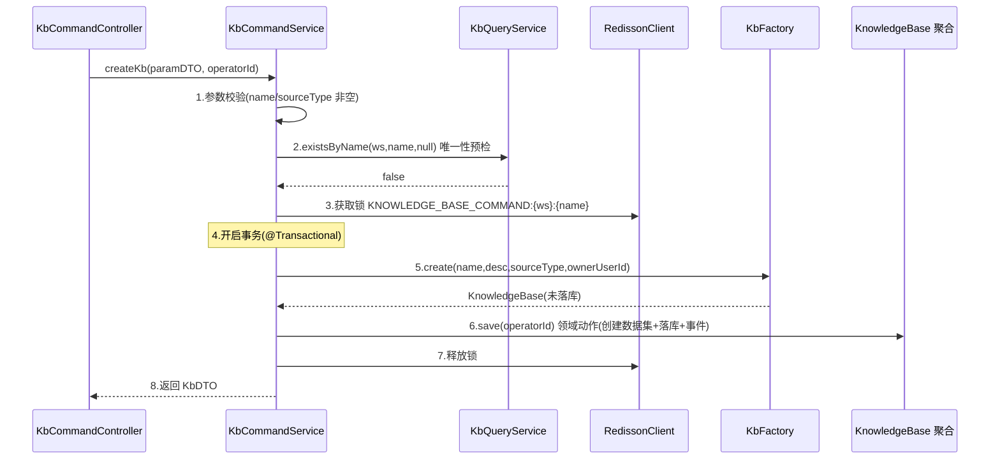

**updateKb：**

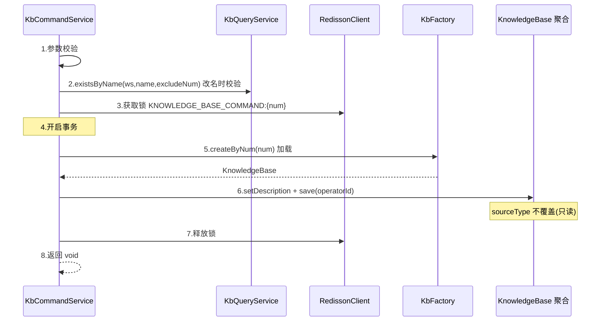

**deleteKb（含 Agent 绑定校验）：**

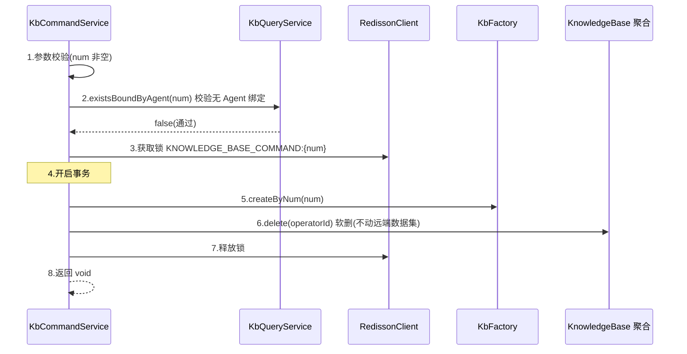

**addFiles（含 OSS 下载 → RAG Flow 上传 → 向量化触发）：**

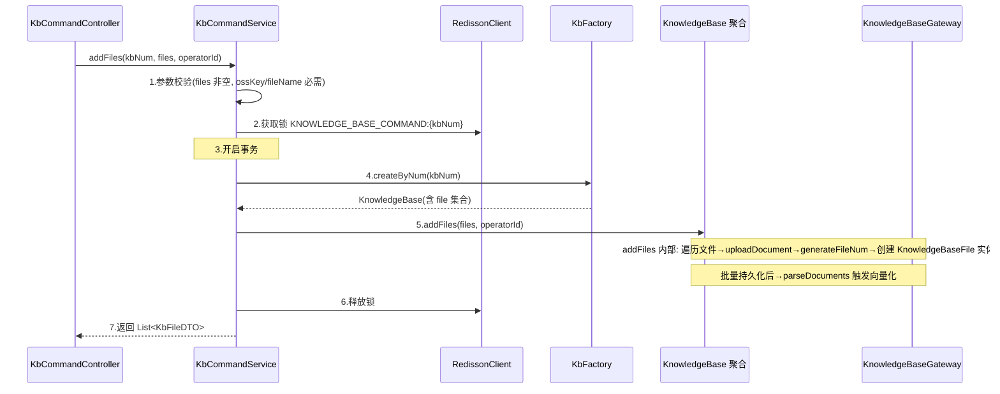

**removeFile：**

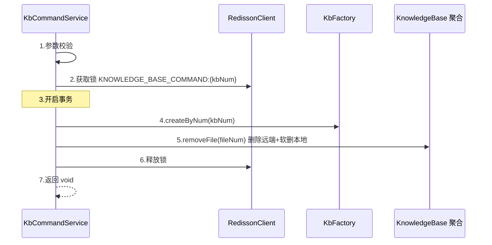

**syncVectorizationStatuses（定时任务批量同步）：**

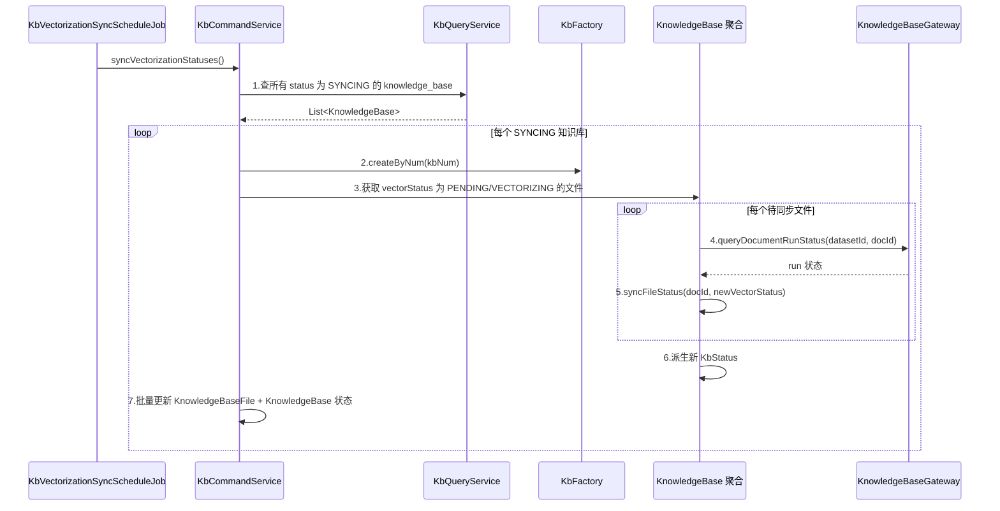

### 6.3 Agent 运行时中间件（agentrunner）

#### 6.3.1 设计方案

Agent 知识检索能力通过 Agent 版本配置 JSON 中的 `knowledgeBaseBindings` 字段声明，AgentRunnerService 在运行时根据绑定配置注入检索能力：

```json
// Agent ConfigSnapshot.agentConfigJson 中的 knowledgeBaseBindings
{
  "knowledgeBaseBindings": [
    {
      "kbNum": "KB202607301200001",
      "retrievalMode": "AUTO",
      "topK": 3,
      "minScore": 0.5
    },
    {
      "kbNum": "KB202607301200002",
      "retrievalMode": "ON_DEMAND",
      "topK": 5,
      "minScore": 0.3
    }
  ]
}
```

**三种检索模式的行为：**

| 模式 | 行为 | 实现方式 |
| --- | --- | --- |
| **AUTO** | Agent 每次收到用户消息前自动注入知识库检索结果作为上下文前缀 | `KbContextInjector`（Hook/Interceptor）：在 Agent 回复前执行，调 `KnowledgeBase.retrieve()` 将 Chunk 内容注入 System Prompt |
| **ON_DEMAND** | Agent 自主决定是否检索，通过调用内置工具触发 | `SearchKnowledgeTool`（AgentScope Tool）：注册为 Agent 可用工具，Agent 决定何时调、调什么问题 |
| **HYBRID** | 兼具 AUTO + ON_DEMAND，自动注入上下文 + 注册搜索工具 | 两者同时注册 |

#### 6.3.2 方法时序逻辑

**AUTO 模式（Agent 回复前自动注入上下文）：**

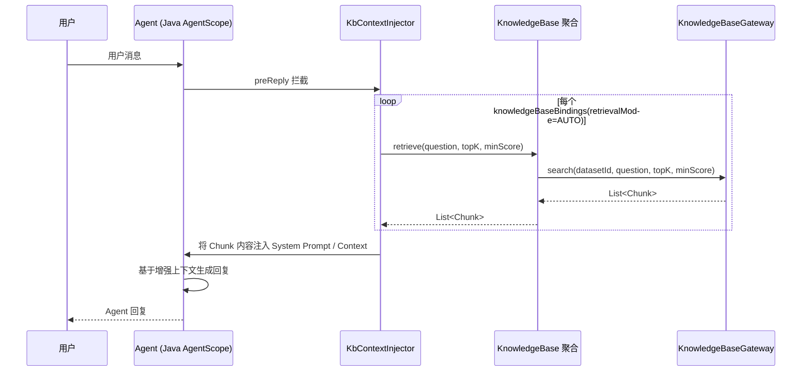

**ON_DEMAND 模式（注册 SearchKnowledgeTool）：**

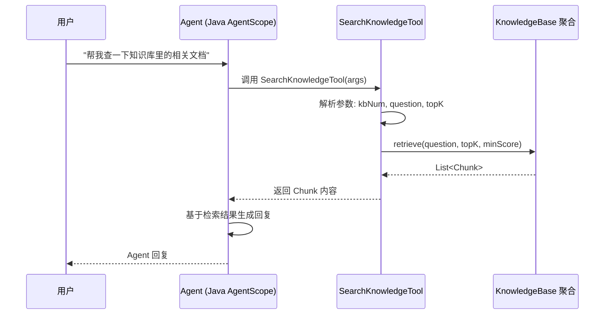

#### 模块自检（应用层）

- [x] 6.1 业务模块划分先行，按模块二级目录（6.2 知识库 / 6.3 Agent 运行时）；
- [x] Command/Query 分工明确；application 未注入 Repository/Gateway，读查询走 QueryService；
- [x] CommandService 写操作设计 Redis 分布式锁，事务内嵌锁区域；
- [x] 每个 Service 方法配时序图（只读单步查询已说明形态，核心写操作完整给出）；
- [x] 统一 `@Resource` 注入。

---

## 7. Adapter 层设计

### 7.1 业务模块划分

| 模块 | 入口类型 | 类 | 对应应用层 |
| --- | --- | --- | --- |
| 7.2 知识库命令 | HTTP Controller(POST) | `KbCommandController` | KnowledgeBaseCommandService |
| 7.3 知识库查询 | HTTP Controller(GET) | `KbQueryController` | KnowledgeBaseQueryService |
| 7.4 向量化同步 | 定时任务 | `KbVectorizationSyncScheduleJob` | KnowledgeBaseCommandService.syncVectorizationStatuses() |
| — | Assembler | `KbVoAssembler` | Param→DTO、DTO→VO |

本方案 adapter 入口包括 HTTP Controller + 定时任务。HTTP 仅用 GET（查询）/ POST（增删改）。入参 `*Param`、出参 `Result<*VO>`，operatorId 由 `BaseController.getCurrentUserId()` 注入。

### 7.2 知识库命令（KbCommandController，前缀 `/api/v1/kb/command`）

| 方法 | HTTP | 路径 | 入参(Param) | 出参 | 职责 |
| --- | --- | --- | --- | --- | --- |
| create | POST | /create | KbCreateParam | Result<KbVO> | 创建知识库 |
| update | POST | /update | KbUpdateParam | Result<Void> | 编辑知识库元信息 |
| delete | POST | /delete | KbNumParam | Result<Void> | 软删除知识库 |
| addFiles | POST | /addFiles | KbAddFilesParam | Result<List<KbFileVO>> | 添加文件 |
| removeFile | POST | /removeFile | KbRemoveFileParam | Result<Void> | 移除文件 |

**入参示例（create）：**

```json
{
  "name": "产品文档知识库",
  "description": "存放产品相关的各类文档",
  "sourceType": "RAG_FLOW",
  "ownerUserId": "10001"
}
```

**入参示例（addFiles）：**

```json
{
  "kbNum": "KB202607301200001",
  "files": [
    {
      "ossKey": "oss://agentops/kb/20260730/spec.pdf",
      "fileName": "产品规格书.pdf",
      "fileType": "pdf",
      "fileSize": 2048000
    },
    {
      "ossKey": "oss://agentops/kb/20260730/guide.docx",
      "fileName": "使用指南.docx",
      "fileType": "docx",
      "fileSize": 1024000
    }
  ]
}
```

**返回示例（Result<KbVO>）：**

```json
{
  "code": 0,
  "message": "success",
  "data": {
    "num": "KB202607301200001",
    "name": "产品文档知识库",
    "description": "存放产品相关的各类文档",
    "sourceType": "RAG_FLOW",
    "sourceConfig": {
      "ragFlowDatasetId": "a1b2c3d4-e5f6-7890-abcd-ef1234567890"
    },
    "status": "ACTIVE",
    "fileCount": 0,
    "readyFileCount": 0,
    "createNo": "10001",
    "updateTime": "2026-07-30 12:00:00.000"
  }
}
```

**命令接口时序逻辑（create 示例）：**

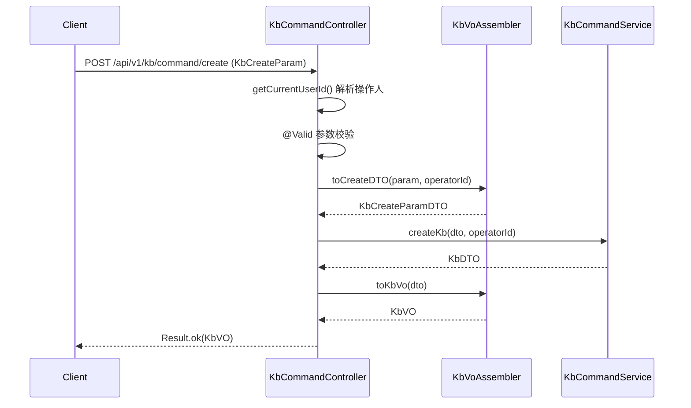

> 其余命令接口（update/delete/addFiles/removeFile）时序同构：`Param → getCurrentUserId → Assembler → CommandService → Result.ok`，从略。

### 7.3 知识库查询（KbQueryController，前缀 `/api/v1/kb/query`）

| 方法 | HTTP | 路径 | 入参 | 出参 | 职责 |
| --- | --- | --- | --- | --- | --- |
| page | GET | /page | KbPageQueryParam(query) | Result<PageVO<KbVO>> | 列表分页筛选 |
| detail | GET | /detail | num(query) | Result<KbDetailVO> | 详情（含文件列表） |
| bindable | GET | /bindable | workspaceNum(query,可省) | Result<List<KbVO>> | Agent 可绑定的知识库列表 |
| checkName | GET | /checkName | name + excludeNum(query) | Result<Boolean> | name 唯一性校验 |
| listFiles | GET | /listFiles | kbNum(query) | Result<List<KbFileVO>> | 知识库文件列表 |

**返回示例（Result<KbDetailVO>）：**

```json
{
  "code": 0,
  "message": "success",
  "data": {
    "num": "KB202607301200001",
    "name": "产品文档知识库",
    "description": "存放产品相关的各类文档",
    "sourceType": "RAG_FLOW",
    "sourceConfig": {
      "ragFlowDatasetId": "a1b2c3d4-e5f6-7890-abcd-ef1234567890"
    },
    "status": "SYNCING",
    "fileCount": 2,
    "readyFileCount": 1,
    "files": [
      {
        "fileNum": "KBF202607301200001",
        "fileName": "产品规格书.pdf",
        "fileType": "pdf",
        "fileSize": 2048000,
        "vectorStatus": "READY",
        "uploader": "10001",
        "uploadTime": "2026-07-30 12:01:00.000"
      },
      {
        "fileNum": "KBF202607301200002",
        "fileName": "使用指南.docx",
        "fileType": "docx",
        "fileSize": 1024000,
        "vectorStatus": "VECTORIZING",
        "uploader": "10001",
        "uploadTime": "2026-07-30 12:01:05.000"
      }
    ],
    "createNo": "10001",
    "updateTime": "2026-07-30 12:01:05.000"
  }
}
```

**查询接口时序逻辑（page 示例）：**

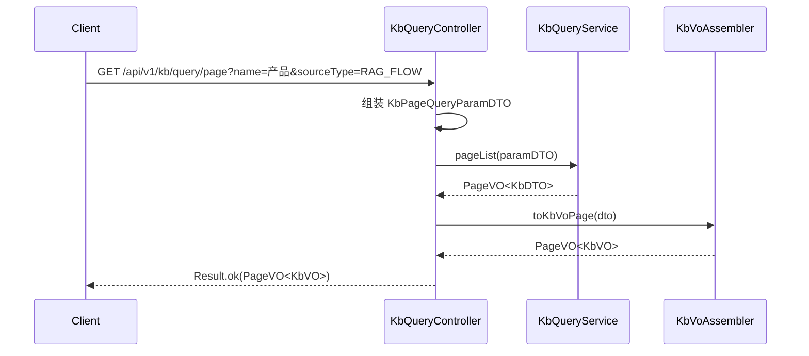

> detail / bindable / checkName / listFiles 时序同构，从略。

### 7.4 向量化同步定时任务（KbVectorizationSyncScheduleJob）

| 字段 | 说明 |
| --- | --- |
| **任务名称** | 知识库向量化状态同步任务 |
| **触发周期** | 每 30 秒执行一次（cron: `*/30 * * * * ?`），避免对 RAG Flow 造成过大的轮询压力 |
| **幂等策略** | 天然幂等：只查询 vectorStatus 为 PENDING/VECTORIZING 的文件，更新依据 RAG Flow 返回的最新状态 |
| **并发控制** | 多节点通过 Redis 分布式锁控制（key: `KNOWLEDGE_BASE_SYNC_LOCK`），仅一个节点执行 |
| **调用的 Service** | `KnowledgeBaseCommandService.syncVectorizationStatuses()` |
| **失败重试** | 单次轮询失败（网络异常/RAG Flow 超时）跳过当前批次，下次轮询重试 |
| **告警** | 连续 3 次失败通过 platform 告警通道通知 |

**定时任务时序逻辑：**

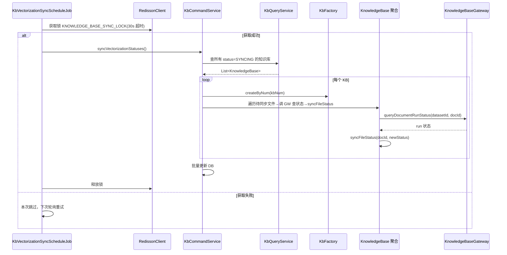

#### 模块自检（adapter）

- [x] 覆盖 HTTP Controller（命令+查询）+ 定时任务；
- [x] HTTP 仅 GET（查询）/ POST（增删改）；
- [x] 入参 `*Param`、出参 `Result<*VO>`；DTO→VO 经 Assembler；
- [x] 每个入口给出时序图（同构接口已说明从略）；
- [x] 定时任务说明 cron、幂等、并发控制与告警；
- [x] 统一 `@Resource`；operatorId 从 UserContext 取不从入参。

---

## 8. 数据库设计

### 8.1 表结构：`knowledge_base`（知识库主表）

| 字段 | 类型 | 必填 | 说明/索引 |
| --- | --- | --- | --- |
| `id` | BIGINT AUTO_INCREMENT | ✓ | 主键，自增 |
| `num` | VARCHAR(64) | ✓ | 业务编号 KB+yyyymmddHHmm+序号；唯一索引 |
| `name` | VARCHAR(128) | ✓ | 知识库名称；(workspace_num,name,deleted) 唯一 |
| `description` | VARCHAR(500) | ✓ | 描述 |
| `source_type` | VARCHAR(32) | ✓ | 来源类型：RAG_FLOW / KINGSOFT（预留）|
| `source_config` | JSON | — | 来源配置 JSON（ragFlowDatasetId + KINGSOFT 预留字段）|
| `workspace_num` | VARCHAR(64) | ✓ | 归属工作空间；默认 WS-DEFAULT |
| `status` | VARCHAR(16) | ✓ | 状态：ACTIVE / SYNCING / ERROR；默认 ACTIVE |
| `owner_user_id` | VARCHAR(64) | ✓ | 负责人/创建人用户 ID |
| `create_no` | VARCHAR(64) | ✓ | 创建人工号 |
| `update_no` | VARCHAR(64) | ✓ | 更新人工号 |
| `deleted` | TINYINT(1) | ✓ | 逻辑删除 0/1；默认 0 |
| `create_time` | DATETIME(3) | ✓ | 创建时间（毫秒精度） |
| `update_time` | DATETIME(3) | ✓ | 更新时间（毫秒精度） |

**索引**：`uq_kb_num(num)`、`uq_kb_ws_name(workspace_num,name,deleted)`、`idx_kb_ws_status(workspace_num,status,deleted)`。

### 8.2 表结构：`knowledge_base_file`（知识库文件子表）

| 字段 | 类型 | 必填 | 说明/索引 |
| --- | --- | --- | --- |
| `id` | BIGINT AUTO_INCREMENT | ✓ | 主键，自增 |
| `file_num` | VARCHAR(64) | ✓ | 文件编号 KBF+yyyymmddHHmm+序号；唯一索引 |
| `kb_num` | VARCHAR(64) | ✓ | 所属知识库 num；外键逻辑关联 knowledge_base.num |
| `file_name` | VARCHAR(256) | ✓ | 文件名 |
| `file_type` | VARCHAR(32) | ✓ | 文件类型（pdf/docx/xlsx/md/txt/图片等）|
| `file_size` | BIGINT | ✓ | 文件大小（字节）|
| `oss_key` | VARCHAR(1024) | ✓ | OSS 对象键 |
| `rag_flow_document_id` | VARCHAR(128) | — | RAG Flow 侧文档 ID |
| `vector_status` | VARCHAR(16) | ✓ | 向量化状态：PENDING / VECTORIZING / READY / FAILED；默认 PENDING |
| `uploader` | VARCHAR(64) | ✓ | 上传者用户 ID |
| `upload_time` | DATETIME(3) | — | 上传时间 |
| `create_no` | VARCHAR(64) | ✓ | 创建人工号 |
| `update_no` | VARCHAR(64) | ✓ | 更新人工号 |
| `deleted` | TINYINT(1) | ✓ | 逻辑删除 0/1；默认 0 |
| `create_time` | DATETIME(3) | ✓ | 创建时间（毫秒精度）|
| `update_time` | DATETIME(3) | ✓ | 更新时间（毫秒精度）|

**索引**：`uq_kbf_file_num(file_num)`、`idx_kbf_kb_num(kb_num,deleted)`、`idx_kbf_vector_status(vector_status,deleted)`。

### 8.3 DDL

迁移版本 `V35`（现有最大为 V34）。

```sql
-- ====================================================================
-- 知识库管理 - V35 初始化脚本
-- 对应技术方案：2026-07-30_知识库管理-技术方案.md v1.0 §8
-- 包含：1) knowledge_base 表（知识库主表）
--       2) knowledge_base_file 表（知识库文件子表）
-- 说明：不预置任何知识库数据，无 DML 刷数。
-- ====================================================================

SET NAMES utf8mb4;
SET FOREIGN_KEY_CHECKS = 0;

-- ----------------------------
-- 知识库主表
-- ----------------------------
DROP TABLE IF EXISTS `knowledge_base`;
CREATE TABLE `knowledge_base` (
  `id` BIGINT NOT NULL AUTO_INCREMENT COMMENT '主键',
  `num` VARCHAR(64) NOT NULL COMMENT '业务编号 KB+yyyyMMddHHmm+序号',
  `name` VARCHAR(128) NOT NULL COMMENT '知识库名称，工作空间内唯一',
  `description` VARCHAR(500) NOT NULL COMMENT '知识库描述，≤500 字',
  `source_type` VARCHAR(32) NOT NULL COMMENT '来源类型：RAG_FLOW(对接RAG Flow) / KINGSOFT(金山文档,预留)',
  `source_config` JSON DEFAULT NULL COMMENT '来源配置JSON: {ragFlowDatasetId:"", kingsoftEndpoints:"", kingsoftApplicationId:""}',
  `workspace_num` VARCHAR(64) NOT NULL DEFAULT 'WS-DEFAULT' COMMENT '归属工作空间业务编号',
  `status` VARCHAR(16) NOT NULL DEFAULT 'ACTIVE' COMMENT '知识库状态：ACTIVE(正常) / SYNCING(向量化中) / ERROR(异常)',
  `owner_user_id` VARCHAR(64) NOT NULL COMMENT '负责人/创建人用户 ID',
  `create_no` VARCHAR(64) NOT NULL COMMENT '创建人工号',
  `update_no` VARCHAR(64) NOT NULL COMMENT '更新人工号',
  `deleted` TINYINT(1) NOT NULL DEFAULT 0 COMMENT '逻辑删除 0=正常 1=删除',
  `create_time` DATETIME(3) NOT NULL DEFAULT CURRENT_TIMESTAMP(3) COMMENT '创建时间',
  `update_time` DATETIME(3) NOT NULL DEFAULT CURRENT_TIMESTAMP(3) ON UPDATE CURRENT_TIMESTAMP(3) COMMENT '更新时间',
  PRIMARY KEY (`id`),
  UNIQUE KEY `uq_kb_num` (`num`),
  UNIQUE KEY `uq_kb_ws_name` (`workspace_num`, `name`, `deleted`),
  KEY `idx_kb_ws_status` (`workspace_num`, `status`, `deleted`)
) ENGINE=InnoDB DEFAULT CHARSET=utf8mb4 COLLATE=utf8mb4_unicode_ci COMMENT='知识库主表';

-- ----------------------------
-- 知识库文件子表
-- ----------------------------
DROP TABLE IF EXISTS `knowledge_base_file`;
CREATE TABLE `knowledge_base_file` (
  `id` BIGINT NOT NULL AUTO_INCREMENT COMMENT '主键',
  `file_num` VARCHAR(64) NOT NULL COMMENT '文件编号 KBF+yyyyMMddHHmm+序号',
  `kb_num` VARCHAR(64) NOT NULL COMMENT '所属知识库 num，逻辑关联 knowledge_base.num',
  `file_name` VARCHAR(256) NOT NULL COMMENT '文件名（含扩展名）',
  `file_type` VARCHAR(32) NOT NULL COMMENT '文件类型：pdf/docx/xlsx/md/txt/jpg/png 等',
  `file_size` BIGINT NOT NULL COMMENT '文件大小（字节）',
  `oss_key` VARCHAR(1024) NOT NULL COMMENT 'OSS 对象键',
  `rag_flow_document_id` VARCHAR(128) DEFAULT NULL COMMENT 'RAG Flow 侧文档 ID',
  `vector_status` VARCHAR(16) NOT NULL DEFAULT 'PENDING' COMMENT '向量化状态：PENDING(待处理) / VECTORIZING(处理中) / READY(就绪) / FAILED(失败)',
  `uploader` VARCHAR(64) NOT NULL COMMENT '上传者用户 ID',
  `upload_time` DATETIME(3) DEFAULT NULL COMMENT '上传时间',
  `create_no` VARCHAR(64) NOT NULL COMMENT '创建人工号',
  `update_no` VARCHAR(64) NOT NULL COMMENT '更新人工号',
  `deleted` TINYINT(1) NOT NULL DEFAULT 0 COMMENT '逻辑删除 0=正常 1=删除',
  `create_time` DATETIME(3) NOT NULL DEFAULT CURRENT_TIMESTAMP(3) COMMENT '创建时间',
  `update_time` DATETIME(3) NOT NULL DEFAULT CURRENT_TIMESTAMP(3) ON UPDATE CURRENT_TIMESTAMP(3) COMMENT '更新时间',
  PRIMARY KEY (`id`),
  UNIQUE KEY `uq_kbf_file_num` (`file_num`),
  KEY `idx_kbf_kb_num` (`kb_num`, `deleted`),
  KEY `idx_kbf_vector_status` (`vector_status`, `deleted`)
) ENGINE=InnoDB DEFAULT CHARSET=utf8mb4 COLLATE=utf8mb4_unicode_ci COMMENT='知识库文件子表';

SET FOREIGN_KEY_CHECKS = 1;
```

### 8.4 DML（刷数）

无。本方案不预置知识库数据，无历史数据迁移。

### 8.5 与领域对应

| 表 | 领域对应 |
| --- | --- |
| `knowledge_base` | `KnowledgeBase` 聚合根（1:1）|
| `knowledge_base_file` | `KnowledgeBaseFile` 子实体（多:1 隶属 KnowledgeBase）|

`source_config` JSON 列 ↔ `KbSourceConfig` 值对象（fastjson2 序列化/反序列化）。

#### 模块自检（数据库）

- [x] 主键 id BIGINT 自增；create_time/update_time 命名且 DATETIME(3) 毫秒精度；
- [x] num 业务编号 + 唯一索引；工作空间内 name 唯一；
- [x] DDL 可直接执行（V35），与表结构与 infra 设计一致；无 DML；
- [x] 索引覆盖列表筛选（ws+status）与文件查询（kb_num+deleted、vector_status+deleted）场景；
- [x] source_type 枚举预留 KINGSOFT。

---

## 9. 模块变更清单

| 层 | 变更 | 实现 Skill |
| --- | --- | --- |
| facade | **无变更**（复用 DomainEntity/DomainEventDTO/DomainEventPublisher/Result/PageVO） | impl-facade-module（不涉及） |
| client | 新增 `knowledgebase.vo`（KbCreateParam/KbUpdateParam/KbNumParam/KbPageQueryParam/KbVO/KbDetailVO/KbFileVO/KbAddFilesParam/KbRemoveFileParam）；新增 `knowledgebase.dto`（KbCreateParamDTO/KbUpdateParamDTO/KbDTO/KbDetailDTO/KbFileDTO/FileUploadParamDTO/KbPageQueryParamDTO）；`knowledgebase.constant`（KbConstants）；`BizCode` 追加 90xx/91xx 知识库域错误码 | **impl-client-module** |
| domain | 新增 `KnowledgeBase` 聚合根；`KnowledgeBaseFile` 子实体；`valueobject`（SourceType/KbStatus/VectorStatus/KbSourceConfig/RetrievalMode/Chunk）；`repository.KnowledgeBaseRepository` / `repository.KnowledgeBaseFileRepository`；`factory.KnowledgeBaseFactory`；`gateway.KnowledgeBaseGateway`；`dto.KbDomainEventDTO` | **impl-domain-module** |
| infra | 新增 `KnowledgeBaseEntity`/`KnowledgeBaseFileEntity`/`KnowledgeBaseMapper`/`KnowledgeBaseFileMapper`/`KnowledgeBaseRepositoryImpl`/`KnowledgeBaseFileRepositoryImpl`/`KnowledgeBaseFactoryImpl`/`KnowledgeBaseGatewayImpl`；`RagFlowClient` / `RagFlowConfig`；`DomainEventConstant` 追加 KB_*；`LockKeyConstant` 追加 KNOWLEDGE_BASE_COMMAND / KNOWLEDGE_BASE_SYNC_LOCK；V35 迁移 | **impl-infra-module** |
| application | 新增 `KnowledgeBaseCommandService`/`KnowledgeBaseQueryService`；新增 `agentrunner.KbContextInjector`（AUTO 模式注入器）；新增 `agentrunner.SearchKnowledgeTool`（ON_DEMAND 搜索工具） | **impl-application-module** |
| adapter | 新增 `KbCommandController`/`KbQueryController`/`KbVoAssembler`；新增 `KbVectorizationSyncScheduleJob`（定时同步任务） | **impl-adapter-module** |

---

## 10. 代码分支命名

**需求类**，本方案对应分支：

```
feature-20260730-knowledge-base-management
```

---

## 11. 实现顺序与依赖

按六层依赖推进（facade 无变更，跳过）：

1. **client**（impl-client-module）：先定 Param/DTO/VO 与 BizCode 契约；
2. **domain**（impl-domain-module）：KnowledgeBase 聚合 + KnowledgeBaseFile 子实体 + 值对象 + Repository/Factory/Gateway 接口 + 领域事件；
3. **infra**（impl-infra-module）：Entity/Mapper/RepositoryImpl/FactoryImpl/GatewayImpl + RagFlowClient + V35 迁移 + 事件/锁常量；与 §8 数据库、§4 domain 接口相互校验；
4. **application**（impl-application-module）：KnowledgeBaseCommandService/QueryService → KbContextInjector → SearchKnowledgeTool；
5. **adapter**（impl-adapter-module）：Controller + Assembler + 定时任务。

里程碑对齐：
- **M1**：KB CRUD（创建/编辑/列表/详情/软删）+ RAG Flow 数据集自动创建 + 文件上传与向量化触发；
- **M2**：向量化状态同步定时任务 + 文件删除（含 RAG Flow 远端清除）；
- **M3**：Agent 绑定（knowledgeBaseBindings JSON 扩展）+ 运行时中间件（AUTO / ON_DEMAND / HYBRID）。

---

## 12. 接口与数据契约

**关键 API**（全部 GET 查询 / POST 增删改，详见 §7）：

- **命令**：`POST /api/v1/kb/command/{create|update|delete|addFiles|removeFile}`
- **查询**：`GET /api/v1/kb/query/{page|detail|bindable|checkName|listFiles}`

**主要 DTO/VO**：
- Param 类：`KbCreateParam` / `KbUpdateParam` / `KbNumParam` / `KbAddFilesParam` / `KbRemoveFileParam` / `KbPageQueryParam`（client.knowledgebase.vo）
- DTO 类：`KbCreateParamDTO` / `KbUpdateParamDTO` / `KbDTO` / `KbDetailDTO` / `KbFileDTO` / `FileUploadParamDTO` / `KbPageQueryParamDTO`（client.knowledgebase.dto）
- VO 类：`KbVO` / `KbDetailVO` / `KbFileVO` / `KbPageVO`（client.knowledgebase.vo）

JSON 入参/出参示例见 §7.2 / §7.3。

---

## 13. 其他

### 13.1 外部依赖

| 依赖 | 用途 | 集成方式 | Apollo 配置 |
| --- | --- | --- | --- |
| **RAG Flow** | 知识库数据集管理、文档向量化、语义检索 | HTTP REST API（Hutool HttpUtil） | `ragflow.endpoint` / `ragflow.apiKey` / 超时配置 |
| **OSS/Terra** | 文件存储（STS 预签名上传） | 复用现有 OssClient | 复用现有配置 |

### 13.2 配置项（Apollo 新增）

| 配置键 | 默认值 | 说明 |
| --- | --- | --- |
| `ragflow.endpoint` | — | RAG Flow 服务地址 |
| `ragflow.apiKey` | — | 平台级 API Key |
| `ragflow.connectTimeout` | 5000 | 连接超时（ms）|
| `ragflow.readTimeout` | 30000 | 读取超时（ms）|
| `kb.syncVectorization.cron` | `*/30 * * * * ?` | 向量化状态同步定时任务 cron |

### 13.3 非功能需求

- **幂等性**：文件上传到 RAG Flow 非幂等（RAG Flow 每次上传创建新文档记录），前端需要防止重复提交；
- **超时控制**：大文件（>10MB）上传到 RAG Flow 可能耗时较长，设置 readTimeout=30s，超时后记录日志允许重试；
- **错误降级**：检索接口失败时 Agent 应降级（不含知识库上下文继续回复），不影响 Agent 基础对话能力；
- **定时任务单点**：通过 Redis 分布式锁保证多节点仅一个执行同步任务。

### 13.4 PRD 修正点

- PRD 原文在 `sourceConfig` 中设计了 `endpoint` / `apiKey` / `knowledgeBaseId`，但根据设计前共识#4，endpoint 和 apiKey 归平台级 Apollo 配置，`sourceConfig` 仅存 `ragFlowDatasetId`；
- PRD 中「金山文档」来源枚举 (`KINGSOFT`) 与相关字段已在 VO/DTO/枚举中保留，但本期不实现逻辑。

### 13.5 RAG Flow 向量化状态映射

| RAG Flow run 值 | 含义 | 映射到 VectorStatus |
| --- | --- | --- |
| `"0"` / `"UNSTART"` | 未开始 | `PENDING` |
| `"1"` / `"RUNNING"` | 进行中 | `VECTORIZING` |
| `"2"` / `"CANCEL"` | 已取消 | `FAILED`（视为失败） |
| `"3"` / `"DONE"` | 完成 | `READY` |
| `"4"` / `"FAIL"` | 失败 | `FAILED` |

---

## 变更日志

| 版本 | 日期 | 变更内容 |
| --- | --- | --- |
| v1.0 | 2026-07-30 | 初版，知识库管理技术方案（仅 RAG Flow）|