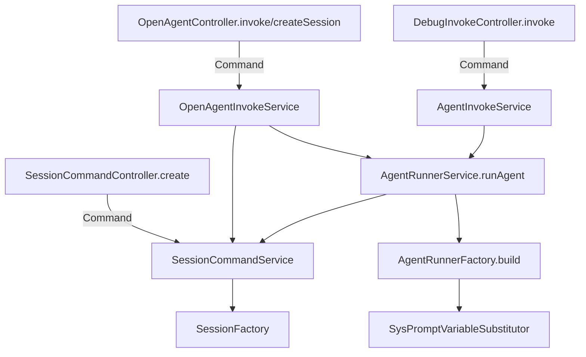
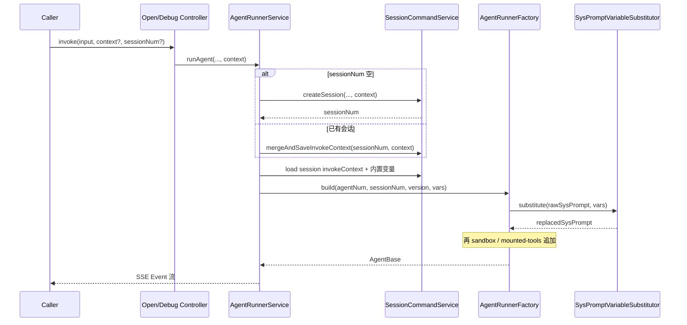
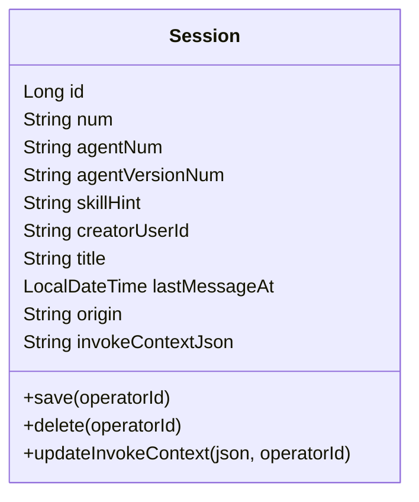
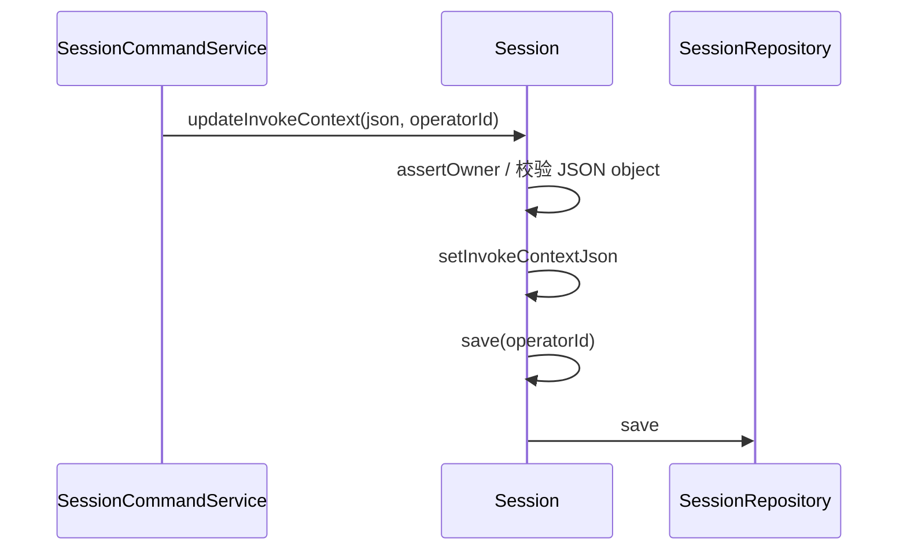
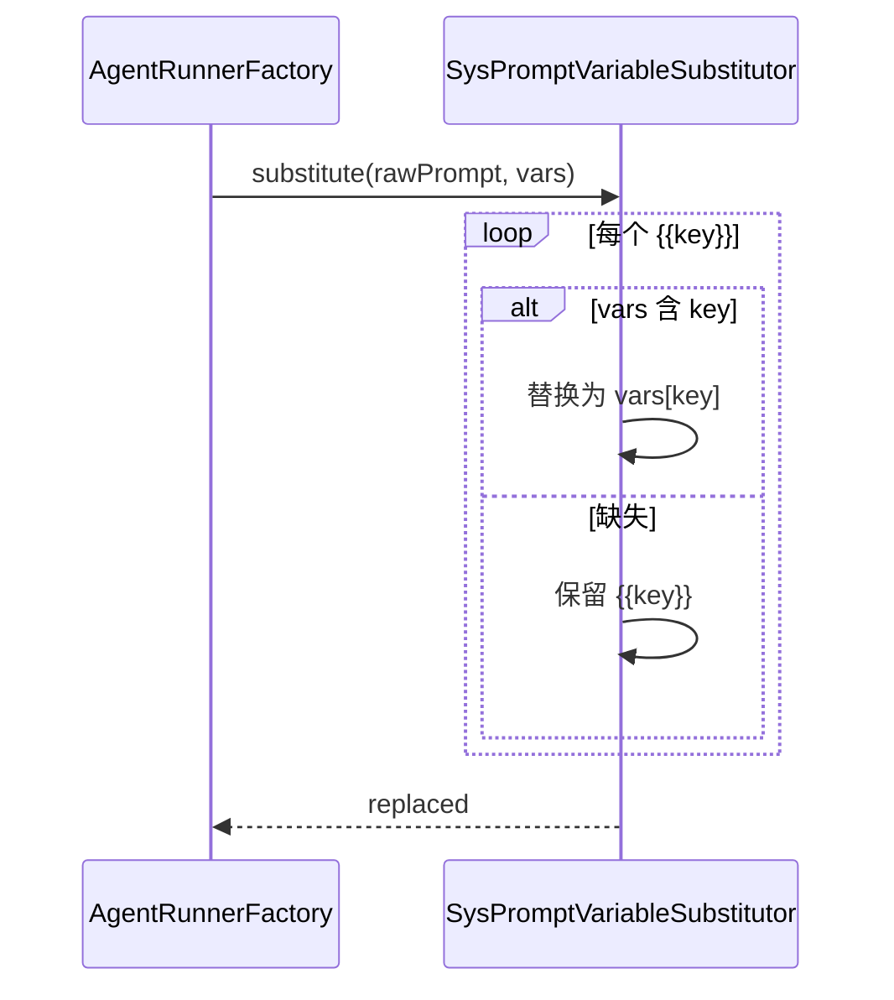
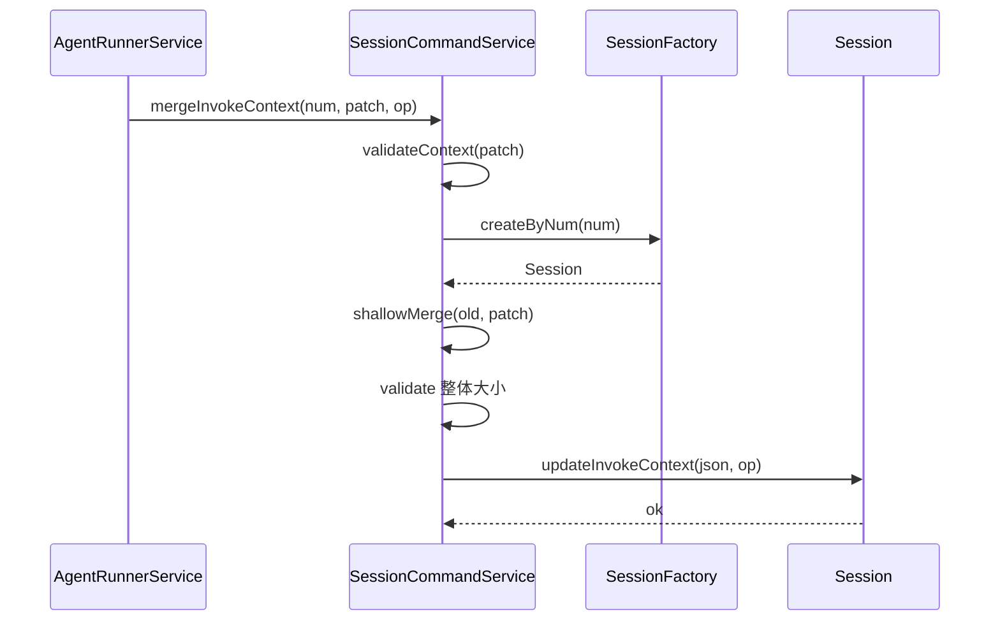
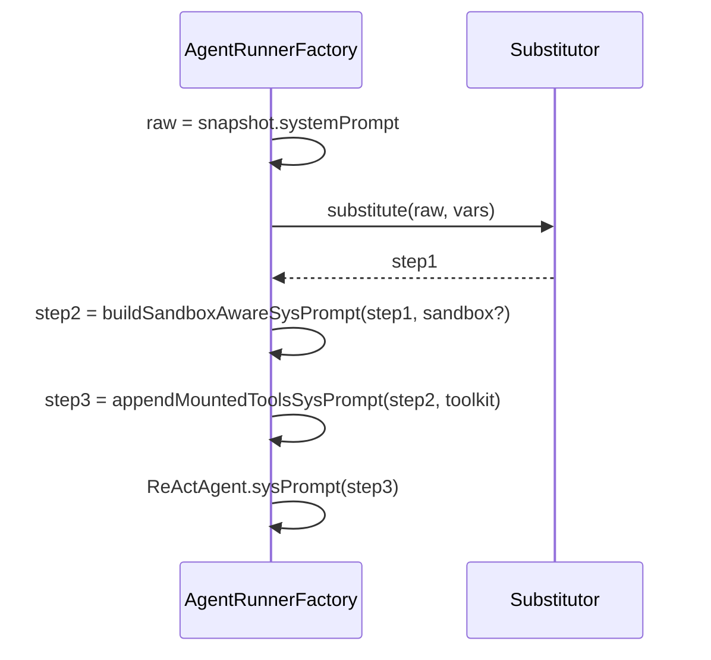
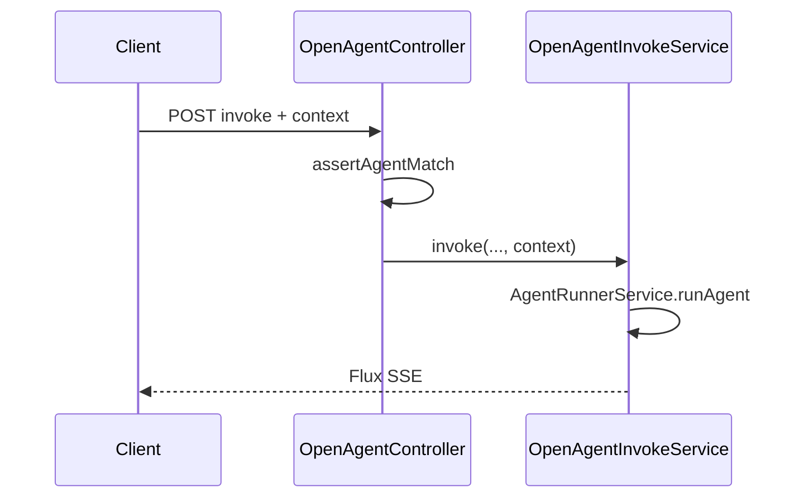

# 系统提示词变量替换与调用上下文注入 技术方案

> 文档版本：v1.0　｜　编写日期：2026-08-09　｜　所属产品：AgentOps（rd-agent-be / rd-agent-fe）  
> 对应 PRD：[2026-08-09_系统提示词变量替换与调用上下文注入-PRD.md](../产品方案/2026-08-09_系统提示词变量替换与调用上下文注入-PRD.md)

## 1. 目标与范围

### 解决的问题
业务页（如订单详情）发起对话时，需把页面上下文注入 Agent 系统提示词；同时用户在对话中仍可查询其他业务对象。现网系统提示词写死后无法按调用方变量替换，Open API / 调试台也无统一 `context` 通道。

### 范围
- **包含**：
  - 系统提示词 `{{key}}` 变量替换（进入 Agent 前；缺失保留原文）
  - Open API `invoke` / `createSession` 支持 `context`
  - 调试台 Context 键值表（localStorage 本地保存）+ invoke/createSession 透传
  - 会话级 `invoke_context` 落库与继承；本轮 `context` 浅合并覆盖后持久化
  - 内置变量（全大写），配置页系统提示词区展示说明 +「插入默认上下文示例」
  - 前端 Agent 配置页、调试台改造
- **不包含**：
  - 工具 RuntimeContext / FC·MCP 参数兜底（严格只做提示词替换）
  - 嵌套对象 context、表达式引擎、严格模式失败
  - A2A Agent 提示词装配改造
  - 部署架构变更

### 设计前问答共识

| # | 问题 | 结论 |
|---|------|------|
| 1 | MVP / 会话级 | **单轮 + 会话级继承都做** |
| 2 | 变量语法 | `{{key}}`，key=`[A-Za-z_][A-Za-z0-9_]*`，大小写敏感 |
| 3 | 缺失变量 | **保留 `{{key}}` 原文** |
| 4 | 值类型 | string / number / boolean；替换时 `String.valueOf`；禁止嵌套对象 |
| 5 | 大小限制 | 单键 ≤2KB，整体序列化 ≤16KB；超限 `INVALID_PARAM` |
| 6 | 与平台追加段落顺序 | **先业务 systemPrompt 变量替换**，再沙箱说明 / 挂载工具清单 |
| 7 | 工具侧 context | **本期不做** |
| 8 | 调试台 UI | **键值表**；**localStorage 本地保存** |
| 9 | Open API | `invoke` + **`createSession` 同步支持** |
| 10 | 内置变量 | 需要；**全大写**；系统提示词字段旁说明有哪些；合并时后写覆盖先写 |
| 11 | 部署架构 | **② 不变** |
| 12 | 前端 | **必须包含**调试台 + Agent 配置页示例插入 |

### 代码分支命名
`feature-20260809-sysprompt-context-vars`

---

## 2. 架构设计

### 2.1 应用架构

#### 代码结构

| 层 | 领域 | 包 | 职责 |
|----|------|----|------|
| facade | — | — | 本次无变更 |
| client | agent / session / debugconsole | `...client.agent` / `...client.session` / `...client.debugconsole` | OpenInvokeParam / OpenSessionCreateParam / DebugInvokeRequest / SessionCreateParam / SessionDTO·VO 增加 `context` 或 `invokeContext`；校验辅助 DTO 可选 |
| domain | session | `...domain.session` | Session 聚合增加 `invokeContext`；创建/更新上下文领域动作 |
| domain | agentrunner（无新聚合） | — | 无新聚合；替换逻辑放 application 工具类 |
| infra | session | `...infra.session` | SessionEntity 字段、Factory/Repository 映射、Flyway |
| application | common | `...application.common.prompt` | **新增** `SysPromptVariableSubstitutor`（纯函数：校验 context + 替换） |
| application | session | `...application.session` | createSession / 合并并持久化 invokeContext |
| application | agentrunner | `...application.agentrunner` | `AgentRunnerService` / `AgentRunnerFactory` 传入合并后的 vars，先替换再追加平台段落 |
| application | agent / debugconsole | `...application.agent` / `...debugconsole` | Open / Debug 入口透传 context |
| adapter | open / debugconsole / session | 对应 adapter 包 | 入参透传；无新鉴权码 |
| frontend | Console / Agents editor | `agent-fe/src/pages/...` | Context 键值表、localStorage、配置页变量说明与示例插入 |

#### 模块调用关系（命令类）



查询类：会话详情/列表若需回显默认 context，由 `SessionQueryService` 映射 `invokeContext` 到 VO（只读）。

#### 核心时序（invoke）



### 2.2 部署架构

部署架构不变，无新增应用/前端部署实例，复用现有部署架构。

---

## 3. Facade 层设计

本次无 Facade 层变更。

---

## 4. 领域层设计

### 4.1 业务层级划分

| 层级 | 业务/子域 | 说明 |
|------|-----------|------|
| L1 | session | 会话默认调用上下文持久化 |
| L1 | agentrunner | 运行时系统提示词装配（应用层工具，无新聚合） |
| L1 | agent（open）/ debugconsole | 调用入口透传（application/adapter） |

### 4.2 会话（session）

#### 4.2.1 领域模型



| 对象 | 类型 | 属性/说明 | 关系 |
|------|------|-----------|------|
| Session | 聚合根 | 新增 `invokeContextJson`（TEXT，存 JSON object 字符串；领域内可用 `Map` 读写时互转） | 既有 Message 等不变 |

基本属性 id/num/create_no/update_no 及 Repository / SessionNumGateway / DomainEventPublisher 保持既有；**无软删除字段进领域模型**。

#### 4.2.2 领域动作

| 聚合 | 动作 | 职责 | 前置 | 后置 | 事件 |
|------|------|------|------|------|------|
| Session | `updateInvokeContext(String json, String operatorId)` | 校验 JSON 为 object 后写入并 save | 归属人校验（与 rename 同口径：operator 须为 creator；Open API 的 system 操作人需与现网 create/append 策略一致——**沿用现网 Open 会话 operator 规则，不因本需求收紧**） | invokeContext 更新 | 可不发事件（低频配置型字段）；若现网会话更新无事件则不新增 |



`createSession` 工厂入参增加可选 `invokeContextJson`，首次 `save` 写入。

#### 4.2.3 领域规则

| 对象 | 规则类型 | 描述 | 违反时 |
|------|----------|------|--------|
| Session.invokeContext | 格式 | 必须是 JSON object（`{}`），禁止 array/primitives 根 | 业务异常 INVALID_PARAM |
| Session.invokeContext | 大小 | 序列化 UTF-8 字节 ≤ 16KB；单 value 字符串化 ≤ 2KB | INVALID_PARAM |
| 键名 | 格式 | 业务键匹配 `[A-Za-z_][A-Za-z0-9_]*` | INVALID_PARAM |

#### 4.2.4 领域工厂

| Factory | 方法 | 入参 | 返回 | 职责 |
|---------|------|------|------|------|
| SessionFactory | `createSession(..., String invokeContextJson)` | 在现有 create 参数上增加可空 invokeContextJson | Session | 新建会话 |
| SessionFactory | `createByNum(String num)` | num | Session | 加载既有 |

#### 4.2.5 领域网关

本次无新增 Gateway；沿用 `SessionNumGateway`。

#### 4.2.6 领域事件

本次不强制新增会话上下文变更事件。

### 4.3 agentrunner（无新聚合）

变量替换为 **application 纯工具类**，不进领域聚合，避免与 Agent 版本快照生命周期耦合（快照仍存模板原文）。

---

## 5. 基础设施层设计

| 类型 | 类名 | 包路径 | 职责 | 变更 |
|------|------|--------|------|------|
| Entity | SessionEntity | `...infra.session.entity` | 新增 `invokeContext` → 列 `invoke_context` | 修改 |
| Mapper | SessionMapper | 既有 | MP 自动映射 | 修改（字段） |
| FactoryImpl | SessionFactoryImpl | 既有 | create 写入 invokeContext | 修改 |
| RepositoryImpl | SessionRepositoryImpl | 既有 | toDomain/fromDomain 映射 | 修改 |
| Migration | V36__session_add_invoke_context.sql | `db/migration` | DDL | 新增 |

注入统一 `@Resource`。

---

## 6. 应用层设计

### 6.1 业务模块划分

| 模块 | 对应领域 | 说明 |
|------|----------|------|
| common.prompt | — | 变量校验与替换 |
| session | session | 上下文持久化与合并 |
| agentrunner | agentrunner | 装配时替换 sysPrompt |
| agent（open）/ debugconsole | 入口 | 透传 context |

### 6.2 common.prompt — SysPromptVariableSubstitutor

#### 6.2.1 方法清单

| 方法 | 签名（示意） | 职责 |
|------|----------------|------|
| validateContext | `void validateContext(Map<String, Object> context)` | 类型/键名/大小校验 |
| merge | `Map<String, String> merge(Map... layers)` | 浅合并，后层覆盖前层；value→String |
| substitute | `String substitute(String template, Map<String, String> vars)` | 按 `\{\{([A-Za-z_][A-Za-z0-9_]*)\}\}` 替换；未命中保留原文 |
| builtinVars | `Map<String, String> builtinVars(sessionNum, agentNum, agentVersionNum, workspaceNum, operatorId)` | 仅大写键 |

**内置变量（须在 FE 系统提示词旁展示）**：

| 键 | 含义 |
|----|------|
| `SESSION_NUM` | 当前会话编号 |
| `AGENT_NUM` | Agent 编号 |
| `AGENT_VERSION_NUM` | 本次装配使用的版本号（含 DRAFT/在线 semver） |
| `WORKSPACE_NUM` | 工作空间编号（Open/调试有则填，无则空串） |
| `OPERATOR_ID` | 操作人（Open 可能为 `system`） |

合并顺序（后者覆盖前者）：

1. 内置变量  
2. 会话已存 `invoke_context`  
3. 本轮请求 `context`（若有）

#### 6.2.2 时序 — substitute



### 6.3 session — SessionCommandService

#### 6.3.1 Service 方法清单

| Service | 方法 | 职责 |
|---------|------|------|
| SessionCommandService | `createSession(..., Map context)` | validateContext → JSON → Factory.create → save；DTO 带回 |
| SessionCommandService | `mergeInvokeContext(sessionNum, Map patch, operatorId)` | 加载会话；浅合并；校验大小；`updateInvokeContext` |
| SessionQueryService | 详情/列表映射 | VO 增加 `invokeContext`（Map），供调试台回填（可选） |

#### 6.3.2 时序 — mergeInvokeContext



### 6.4 agentrunner

#### 6.4.1 Service 方法清单

| Service | 方法 | 变更 |
|---------|------|------|
| AgentRunnerService | `runAgent(..., Map context)` | 建会话/合并上下文 → 组装 vars → `build(..., vars)` |
| AgentRunnerFactory | `build(agentNum, sessionNum, targetVersion, Map vars)` | `substitute(systemPrompt, vars)` → `buildSandboxAwareSysPrompt` → `appendMountedToolsSysPrompt` |
| AgentInvokeService / OpenAgentInvokeService | invoke / createSession | 增加 context 入参并下传 |

#### 6.4.2 时序 — build 提示词



**惰性建会话**：`runAgent` 在 `sessionNum` 为空时 `createSession` 须带上本轮 `context`，避免丢默认上下文。

---

## 7. Adapter 层设计

### 7.1 业务模块划分

| 模块 | 入口 | 说明 |
|------|------|------|
| open | OpenAgentController | invoke / createSession |
| debugconsole | DebugInvokeController | invoke |
| session | SessionCommandController | create（调试台显式建会话） |

无新增定时任务 / MQ 监听。

### 7.2 Open API

#### 7.2.1 接口清单

**POST** `/api/v1/open/agents/command/invoke`

请求 JSON：

```json
{
  "agentNum": "AGT...",
  "input": "这个单什么时候发货？",
  "sessionNum": "SES...",
  "operatorId": "u-1",
  "context": {
    "orderId": "ORD-123",
    "page": "order_detail"
  }
}
```

响应：既有 SSE `text/event-stream`。

**POST** `/api/v1/open/agents/command/createSession`

```json
{
  "agentNum": "AGT...",
  "skillHint": "",
  "title": "",
  "operatorId": "u-1",
  "context": {
    "orderId": "ORD-123"
  }
}
```

响应：

```json
{
  "code": 0,
  "message": "success",
  "data": {
    "num": "SES...",
    "agentNum": "AGT...",
    "invokeContext": { "orderId": "ORD-123" },
    "origin": "API"
  }
}
```

#### 7.2.2 时序



### 7.3 调试台

**POST** `/api/v1/debug-console/invoke`

```json
{
  "agentNum": "AGT...",
  "session_num": "SES...",
  "input": "...",
  "input_type": "text",
  "target_version": "v1.0.1",
  "context": {
    "orderId": "ORD-123"
  }
}
```

`context` 使用 camelCase（与 Open 对齐）；若需 snake_case 别名可加 `@JsonAlias`，**推荐统一 camelCase `context`**。

**POST** `/api/v1/session/command/create`：`SessionCreateParam` 增加可选 `context`，调试台「新会话」可写入默认上下文。

### 7.4 错误码

沿用 `BizCode.INVALID_PARAM`（或项目既有参数错误码），文案区分：键非法 / 类型非法 / 超长。

---

## 8. 数据库设计

### 8.1 表变更：`session`

| 列 | 类型 | 空 | 说明 |
|----|------|----|------|
| invoke_context | TEXT | YES | JSON object 文本；默认 NULL 表示无会话默认上下文 |

主键 `id`、审计字段既有不变。

### 8.2 DDL

```sql
-- V36__session_add_invoke_context.sql
ALTER TABLE `session`
    ADD COLUMN `invoke_context` TEXT NULL
    COMMENT '会话默认调用上下文 JSON object，供系统提示词变量替换继承'
    AFTER `origin`;
```

### 8.3 刷数

无需 DML；存量 NULL 视为空 Map。

### 8.4 与领域对应

`session.invoke_context` ↔ `Session.invokeContextJson`。

---

## 9. 模块变更清单

| 层 | 变更 | Skill |
|----|------|-------|
| facade | 无 | — |
| client | OpenInvokeParam / OpenSessionCreateParam / DebugInvokeRequest / SessionCreateParam / SessionDTO·VO 增加 context/invokeContext | impl-client-module |
| domain | Session 字段 + updateInvokeContext；Factory.create 入参 | impl-domain-module |
| infra | Entity/Factory/Repo 映射 + Flyway V36 | impl-infra-module |
| application | SysPromptVariableSubstitutor；SessionCommandService；AgentRunnerService/Factory；Open/Debug 透传 | impl-application-module |
| adapter | OpenAgentController、DebugInvokeController、SessionCommandController 透传 | impl-adapter-module |
| frontend | 调试台键值表 + localStorage；Agent 配置页变量说明与示例插入；API types | （FE，无 Java skill） |

---

## 10. 代码分支命名

**分支**：`feature-20260809-sysprompt-context-vars`

---

## 11. 实现顺序与依赖

1. **client** 契约字段  
2. **domain + infra + Flyway**（session.invoke_context）  
3. **application** `SysPromptVariableSubstitutor` + 单测  
4. **application** Session 合并持久化 + AgentRunner 装配替换  
5. **adapter** Open / Debug / Session create 透传  
6. **frontend** 调试台 Context 键值表 + Agent 配置页文案/示例  
7. 联调：Open API 订单场景 + 调试台本地缓存

---

## 12. 接口与数据契约（汇总）

### 12.1 context 校验规则

- 根类型：JSON object  
- value：仅 string / number / boolean（Jackson 反序列化后校验）  
- key：`[A-Za-z_][A-Za-z0-9_]*`  
- 单 value `String.valueOf` 后 UTF-8 长度 ≤ 2048  
- 整个 object `JSON.toJSONString` UTF-8 长度 ≤ 16384  

### 12.2 替换规则

- 模式：`\{\{([A-Za-z_][A-Za-z0-9_]*)\}\}`  
- 命中：替换为变量值  
- 未命中：**保留原文** `{{key}}`  
- 不递归替换（替换结果中的 `{{x}}` 不再处理）

### 12.3 前端

| 项 | 约定 |
|----|------|
| 调试台存储 key | `agentops.debug.invokeContext.${agentNum}` → `Array<{key,value}>` 或 object |
| 键值表 | 可增删行；发送前组装为 object；非法 key 前端拦截 |
| 切换 Agent | 读取对应 localStorage；切换会话不强制清面板（本地保存优先） |
| 配置页 | 系统提示词下方展示内置变量表；按钮「插入默认上下文示例」追加 PRD 示例段落（含 `{{orderId}}` 与可覆盖说明） |

---

## 13. 其他

### 13.1 测试要点

| 用例 | 期望 |
|------|------|
| 模板含 `{{orderId}}`，context 有值 | 模型侧 sysPrompt 已替换 |
| 缺 `orderId` | 提示词仍含 `{{orderId}}` |
| 内置 `{{SESSION_NUM}}` | 替换为真实会话号 |
| 业务键与内置同名全大写 | 本轮 context / 会话层覆盖内置 |
| createSession 带 context 后 invoke 不带 | 仍用会话默认 |
| invoke 带新 context | 浅合并落库且本轮生效 |
| 超长 context | 400 INVALID_PARAM |
| 不传 context、无占位符 | 与现网一致 |
| 单元测试 | Substitutor 正则/缺失/类型；Factory sysPrompt 顺序（先替换后追加） |

### 13.2 安全与兼容

- context 不替代鉴权；不写入版本快照  
- 日志只打未命中变量名列表，避免完整 context 明文  
- 老客户端不传 context：完全兼容  

### 13.3 配置项

无新增 Spring 配置；限制常量放 `SysPromptVariableSubstitutor`。

---

## 模块自检摘要

- [x] 应用/部署架构已区分；部署不变  
- [x] 无 Facade 变更已声明  
- [x] Session 领域字段/动作/工厂已覆盖；替换器放 application 避免假聚合  
- [x] Infra + DDL V36  
- [x] Application 命令/查询边界与时序  
- [x] Adapter 仅 GET/POST，JSON 契约  
- [x] 分支名 `feature-20260809-sysprompt-context-vars`  
- [x] FE 范围含调试台 + 配置页  
