# Agent 应用评测 技术方案

> 文档版本：v1.0　｜　编写日期：2026-08-22　｜　所属产品：AgentOps（rd-agent-be / rd-agent-fe）  
> 对应 PRD：[2026-08-22_Agent应用评测-PRD.md](../产品方案/2026-08-22_Agent应用评测-PRD.md)（v1.1）  
> 对标：阿里云百炼新版「评测集 × 评估器 × 评测任务」

---

## 1. 目标与范围

### 解决的问题

拆除现有 Skill 中心的评测实现，按百炼模型重建 **Agent 应用评测**：版本化评测集、可复用评估器、冻结配置的评测任务；侧栏挂在「Agent 调试」下，页内顶 Tab 切换三资产。

### 范围

| 包含 | 不包含 |
| --- | --- |
| 删除旧 `evaluation` / `evaluation_case` / `eval_seed` 表、API、FE `/skill/evaluation`、旧权限点 | 评测发布门禁 |
| 新域：评测集 / 评估器 / 评测任务（含对比） | 独立部署组件、跨空间市场 |
| P0：xlsx 导入、内置 Code 规则评估器、任务跑 Agent、任务对比、FE Tab 壳 | 知识库自动出题 |
| P1：LLM 评估器、人工标签、调试台回流、不关联 Agent 纯标注 | Reward Model 微调 |
| P2：从标注蒸馏评估器、轨迹明细增强、自定义 Code 脚本评估器 | Skill 评测保留（**明确删除**） |

### 设计前问答共识

| # | 问题 | 结论 |
|---|------|------|
| 1 | 交付范围 | **PRD 全部做**（文内按 P0/P1/P2 分期实现） |
| 2 | 与旧 Skill 评测 | **删除重建**，不兼容旧表/旧 API |
| 3 | 领域 | **新建**评测相关聚合（评测集 / 评估器 / 评测任务），包仍落在 `evaluation` 下按子域拆分 |
| 4 | Code 评估器 | **P0 仅内置固定规则**；自定义 Code 脚本 → **P2**（原答 C，脚本延后） |
| 5 | LLM 评估器 | **平台模型配置 + 内部 LLM 调用**（`ModelCredentialResolver` + ChatModel），不强制评测 Agent |
| 6 | 异步 | 复用 `@Async("evaluationExecutor")` |
| 7 | 综合 Pass | **该条全部挂载评估器均为 Pass → 综合 Pass** |
| 8 | 权限 | **新权限点**（替换旧 `evaluation:*`） |
| 9 | 前端 | **必须包含** |
| 10 | 导入格式 | **xlsx** |
| 11 | 部署架构 | **② 不变** |
| 12 | 旧 API | **删除** |

### 代码分支命名

`feature-20260822-agent-app-evaluation`

---

## 2. 架构设计

### 2.1 应用架构

#### 代码结构

| 层 | 领域 | 包 | 职责 |
|----|------|----|------|
| facade | evaluation | `...facade.evaluation` | 替换/精简 `EvalDomainEventDTO` 事件载荷（任务完成等） |
| client | evaluation | `...client.evaluation.dataset` / `grader` / `task` | Param / VO / 枚举；按子域分包 |
| domain | evaluation | `...domain.evaluation.dataset` | 聚合 `EvalDataset`（含版本快照协作） |
| domain | evaluation | `...domain.evaluation.grader` | 聚合 `EvalGrader` |
| domain | evaluation | `...domain.evaluation.task` | 聚合 `EvalTask` + 实体 `EvalTaskItem` |
| domain | evaluation | `...domain.evaluation`（共享） | `EvalNumGateway`、状态值对象、公共枚举 |
| infra | evaluation | `...infra.evaluation.*` | Entity / Mapper / RepositoryImpl / FactoryImpl / NumGatewayImpl |
| application | evaluation | `...application.evaluation.dataset` | Dataset Command/Query |
| application | evaluation | `...application.evaluation.grader` | Grader Command/Query；内置规则引擎；LLM 评分器（P1） |
| application | evaluation | `...application.evaluation.task` | Task Command/Query；`EvalTaskWorker` |
| application | evaluation | `...application.evaluation.support` | xlsx 解析、字段映射解析、综合 Pass 计算 |
| adapter | evaluation | `...adapter.evaluation.dataset` 等 | Command/Query Controller |
| adapter | config / security | 权限种子、路由权限、`AsyncConfig`（复用） | 删除旧评测 Controller |
| frontend | AgentEvaluation | `agent-fe/src/pages/AgentEvaluation/*` | Tab 壳 + 列表/详情/创建/对比 |

#### 模块调用关系

**命令类**

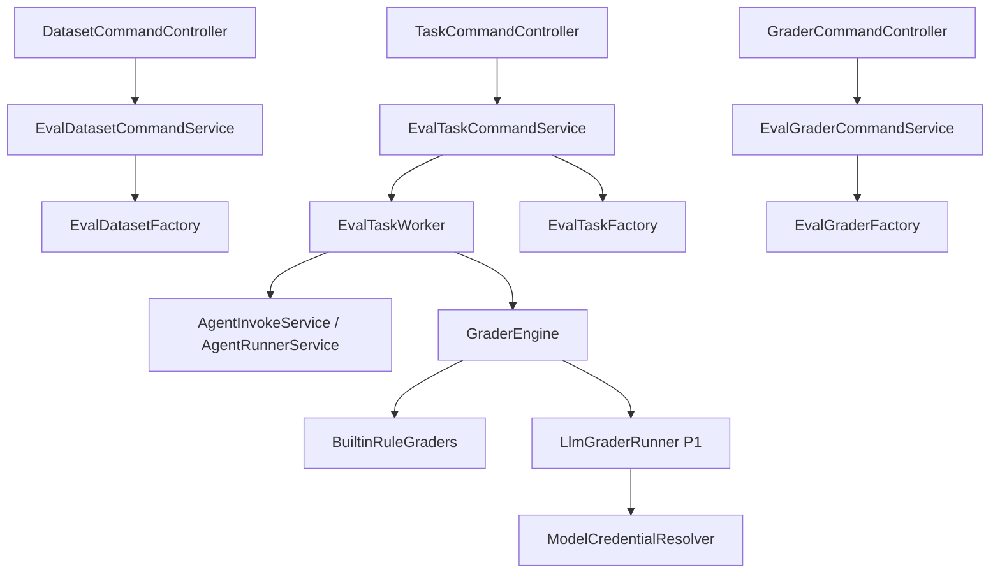

**查询类**

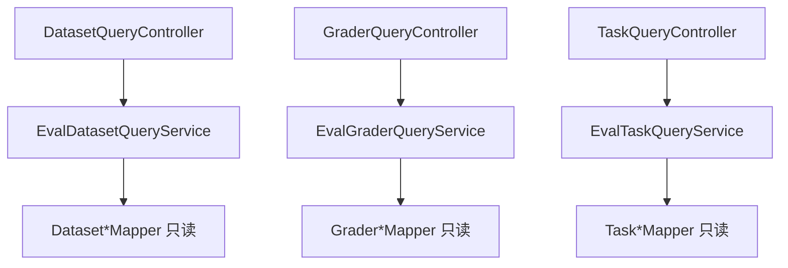

> application **禁止**注入 Repository / Gateway；写路径经 Factory → 领域动作；读路径仅 QueryService + Mapper。

#### 核心执行时序（任务跑批）

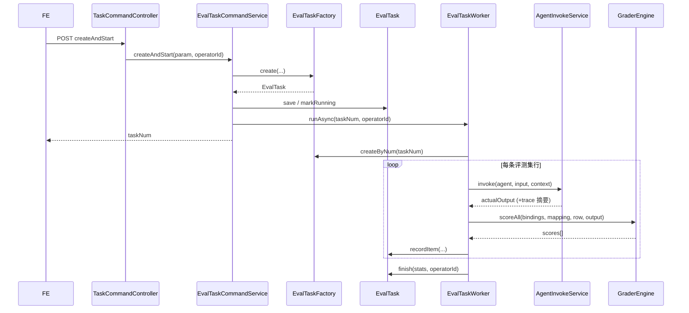

### 2.2 部署架构

**部署架构不变，无新增应用/前端部署实例，复用现有部署架构。**

- 后端仍为 `rd-agent-be` 单应用；评测跑批占用现有 `evaluationExecutor` 线程池。  
- 前端仍为 `rd-agent-fe` 管理端；仅路由与菜单变更。  
- 无新增中间件；DB 通过 Flyway 迁移（删旧表建新表）。

---

## 3. Facade 层设计

| 类型 | 包路径 | 职责 | 变更 |
|------|--------|------|------|
| `EvalDomainEventDTO` | `...facade.evaluation` | 任务完成/失败事件载荷：`taskNum`、`workspaceNum`、`status`、统计字段 | **修改**（去掉 skill/旧 evaluation 字段） |
| DomainEntity / Result 等 | — | — | **本次无 Facade 通用基类变更** |

事件名常量放 domain：`EVAL_TASK_FINISHED` / `EVAL_TASK_FAILED`（替换旧 `EVALUATION_FINISHED`）。

---

## 4. 领域层设计

### 4.1 业务层级划分

| 层级 | 子域 | 说明 |
|------|------|------|
| L1 评测资产 | dataset | 评测集草稿、发布版本、行数据 |
| L1 评测资产 | grader | 评估器定义与版本 |
| L1 评测执行 | task | 评测任务、用例结果、评分明细 |

包前缀统一：`ink.garry.rd.agent.ws.domain.evaluation.{dataset|grader|task}`。

编号前缀（`EvalNumGateway`）：

| 对象 | 前缀 | 示例 |
|------|------|------|
| 评测集 | `EDS` | EDS-... |
| 评测集版本 | `EDV` | EDV-...（可选，也可用 datasetNum+version 唯一） |
| 评测集行 | `EDR` | EDR-... |
| 评估器 | `EGR` | EGR-... |
| 评测任务 | `ETK` | ETK-... |
| 任务用例 | `ETI` | ETI-... |

---

### 4.2 评测集（dataset）

#### 4.2.1 领域模型

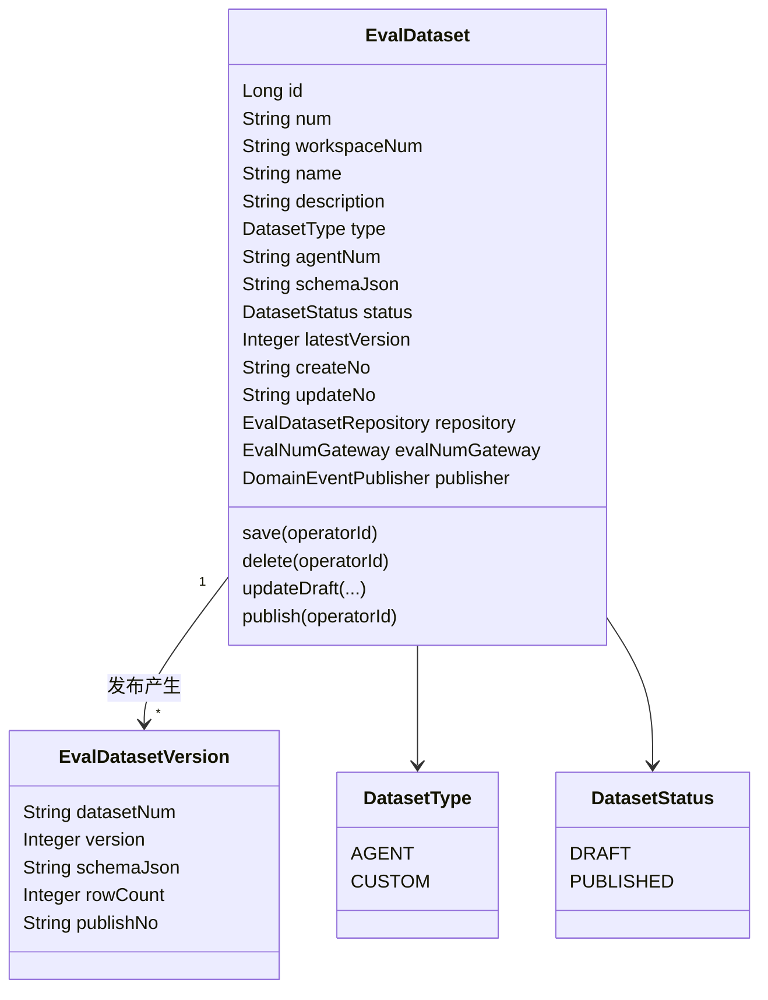

| 对象 | 类型 | 关键属性 | 关系 |
|------|------|----------|------|
| EvalDataset | 聚合根 | num, workspaceNum, type, schemaJson, status, latestVersion | 根 |
| EvalDatasetVersion | 值对象/只读快照（持久化表，非独立聚合） | datasetNum, version, schemaJson, rowCount | 从属于 Dataset |
| 行数据 | 持久化实体（infra），领域以 JSON 行列表协作 | dataJson 含 input/context/reference/... | 草稿行挂 dataset；发布时按 version 固化 |

> 软删除标记 **不出现在领域对象**；仅 infra Entity `deleted`。

#### 4.2.2 领域动作

| 聚合 | 动作 | 职责 | 前置 | 后置 / 事件 |
|------|------|------|------|-------------|
| EvalDataset | save | 新建或更新草稿元数据 | name/type 合法 | 落库 |
| EvalDataset | delete | 软删（未有任务引用或允许删） | 无运行中任务引用 | 落库 |
| EvalDataset | updateSchema | 改表结构（仅 DRAFT） | status=DRAFT | schemaJson 更新 |
| EvalDataset | replaceDraftRows | 替换草稿行 | status=DRAFT | 行表重写 |
| EvalDataset | publish | 固化版本 | 至少 1 行；schema 合法 | latestVersion++；写 version 快照+行副本；可发 `DATASET_PUBLISHED` |

**publish 时序**

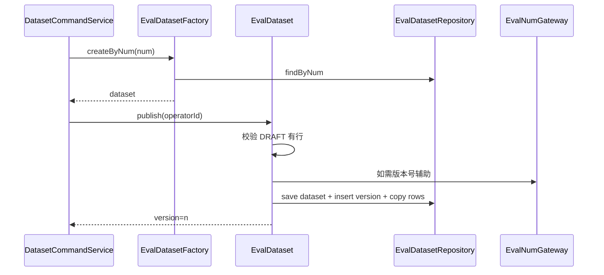

**save 时序**

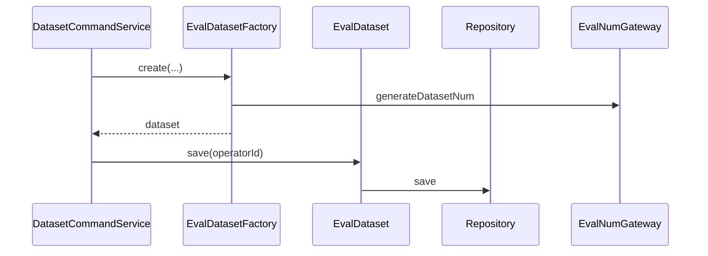

#### 4.2.3 领域规则

| 对象 | 规则 | 违反 |
|------|------|------|
| EvalDataset | type 创建后不可改 | BusinessException |
| EvalDataset | 仅 DRAFT 可改 schema/行 | INVALID_STATUS |
| EvalDataset | publish 时行数 ≥ 1 | INVALID_PARAM |
| EvalDataset | Agent 型必须有 agentNum | INVALID_PARAM |
| Version | 已发布版本不可改行 | 只读 |

#### 4.2.4 领域工厂

| Factory | 方法 | 入参 | 返回 | 职责 |
|---------|------|------|------|------|
| EvalDatasetFactory | create | workspaceNum, name, description, type, agentNum, schemaJson | EvalDataset | 新建草稿 |
| EvalDatasetFactory | createByNum | num | EvalDataset | 加载 |

#### 4.2.5 领域网关

| Gateway | 方法 | 职责 | 失败 |
|---------|------|------|------|
| EvalNumGateway | generateDatasetNum / generateDatasetRowNum | 编号 | 抛系统异常 |
| EvalDatasetReadGateway（可选） | countTasksByDatasetVersion | 删除前引用检查 | 返回 0 |

#### 4.2.6 领域事件

| 事件 | 时机 | 载荷 |
|------|------|------|
| DATASET_PUBLISHED | publish 成功 | datasetNum, version, workspaceNum |

---

### 4.3 评估器（grader）

#### 4.3.1 领域模型

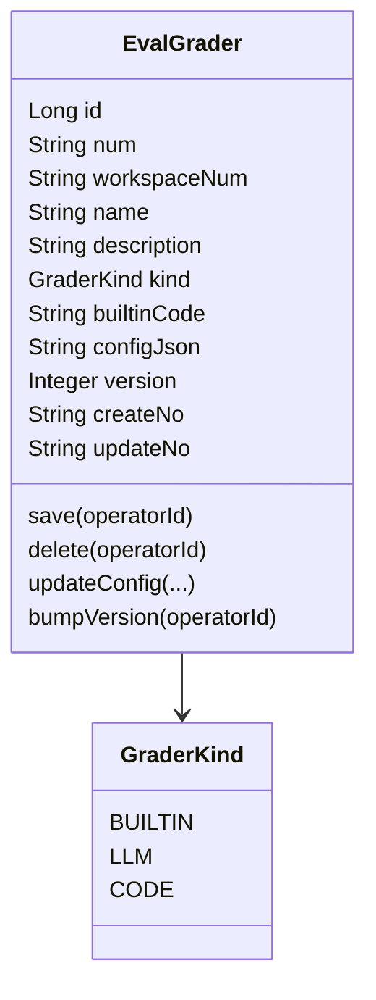

| builtinCode（P0） | 含义 | config 要点 |
|-------------------|------|-------------|
| `NON_EMPTY` | 输出非空 | — |
| `EXACT_MATCH` | 与 reference 精确匹配 | trim/ignoreCase 可选 |
| `CONTAINS` | 包含关键词 | keywords[] 来自 mapping 或 config |
| `JSON_VALID` | 合法 JSON | — |

P1：`kind=LLM`，configJson含 `modelNum`、`promptTemplate`、`scoreMin`/`scoreMax`、`passThreshold`、变量名列表。  
P2：`kind=CODE`，configJson 含脚本与入参声明。

#### 4.3.2 领域动作

| 动作 | 职责 | 前置 |
|------|------|------|
| save | 创建/更新元数据与 config | 名称唯一（空间内） |
| delete | 软删 | 无任务引用绑定 |
| bumpVersion | 配置变更升版本 | — |

**save 时序**

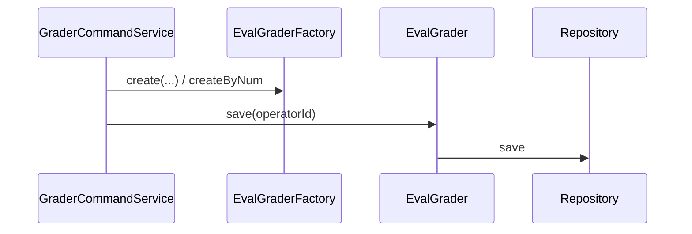

#### 4.3.3 领域规则

| 规则 | 说明 |
|------|------|
| BUILTIN 的 builtinCode 必须在白名单 | 否则 INVALID_PARAM |
| LLM 必须配置 modelNum + promptTemplate（P1） | |
| 被任务快照引用的历史 version 仍可读 | 删的是当前 grader 行 |

#### 4.3.4 领域工厂

| 方法 | 入参 |
|------|------|
| create | workspaceNum, name, description, kind, builtinCode, configJson |
| createByNum | num |

#### 4.3.5 领域网关

复用 `EvalNumGateway.generateGraderNum()`。

#### 4.3.6 领域事件

可选 `GRADER_UPDATED`；P0 可不发。

---

### 4.4 评测任务（task）

#### 4.4.1 领域模型

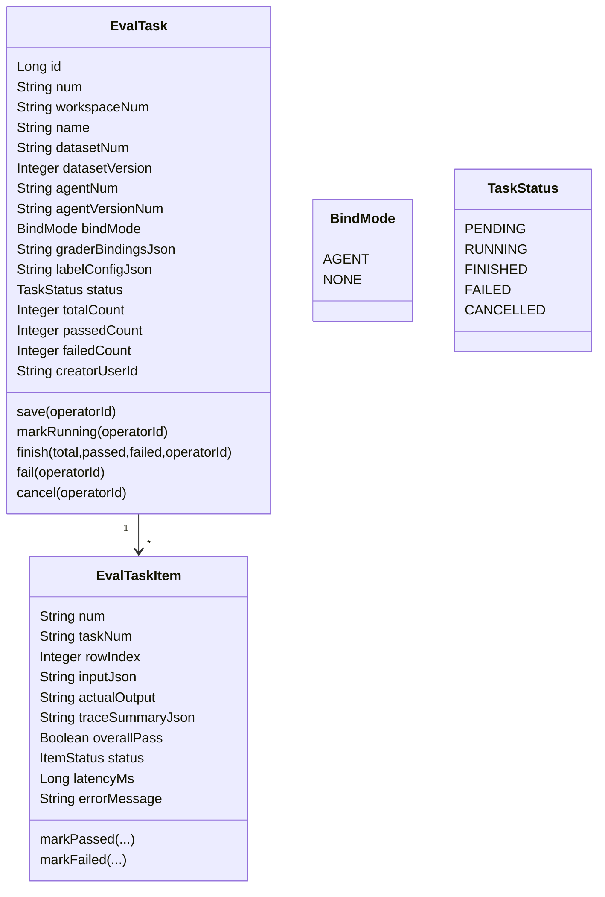

`graderBindingsJson` 快照示例：

```json
[
  {
    "graderNum": "EGR-xxx",
    "graderVersion": 1,
    "kind": "BUILTIN",
    "builtinCode": "CONTAINS",
    "mapping": {
      "response": "$actual_output",
      "keywords": "$row.fineKeywords"
    },
    "configSnapshot": {}
  }
]
```

特殊数据源：`$actual_output`、`$row.<field>`、`$trace`。

#### 4.4.2 领域动作

| 动作 | 职责 | 事件 |
|------|------|------|
| save | 创建任务（配置冻结自此写入） | — |
| markRunning | PENDING→RUNNING | — |
| recordItem | 写入/更新一条用例结果与分数（经 Repository） | — |
| finish | 汇总统计 FINISHED | EVAL_TASK_FINISHED |
| fail / cancel | 终态 | EVAL_TASK_FAILED（fail） |

**finish 时序**

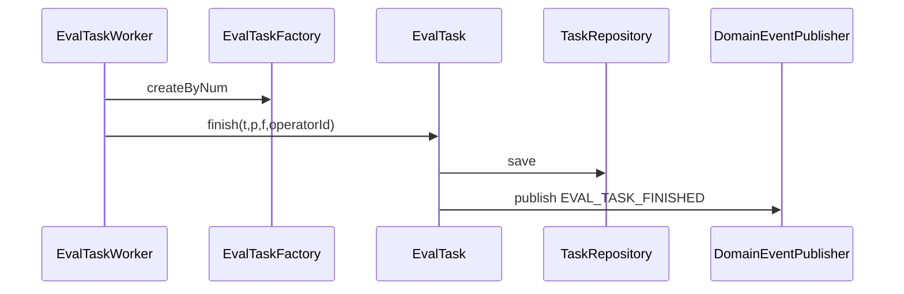

#### 4.4.3 领域规则

| 规则 | 说明 |
|------|------|
| 创建后不可改 dataset/agent/bindings | 产品冻结 |
| bindMode=AGENT 时 agentNum+version 必填 | |
| bindMode=NONE 时评测集行需已有输出列（P1） | |
| 综合 Pass = 全部 grader Pass | |
| 运行中可 cancel | RUNNING→CANCELLED |

#### 4.4.4 领域工厂

| 方法 | 入参 |
|------|------|
| EvalTaskFactory.create | workspaceNum, name, description, datasetNum, datasetVersion, bindMode, agentNum, agentVersionNum, graderBindingsJson, labelConfigJson, creatorUserId |
| EvalTaskFactory.createByNum | num |
| EvalTaskItemFactory.create | taskNum, rowIndex, inputJson |
| EvalTaskItemFactory.createByNum | num |

#### 4.4.5 领域网关

| Gateway | 方法 |
|---------|------|
| EvalNumGateway | generateTaskNum / generateTaskItemNum |
| EvalTaskReadGateway | loadPublishedDatasetRows(datasetNum, version)（只读协作，或由 application Query 提供行给 Worker） |

> 推荐：**Worker 通过 Task 相关 QueryService / 专用 Application 组件读行**，避免 domain 依赖过重读模型；若用 Gateway，接口定义在 domain、实现在 infra。

#### 4.4.6 领域事件

| 事件 | 时机 |
|------|------|
| EVAL_TASK_FINISHED | finish |
| EVAL_TASK_FAILED | fail |

---

## 5. 基础设施层设计

### 5.1 拆除旧实现（必须先做）

| 动作 | 说明 |
|------|------|
| 删除 Java | 旧 `Evaluation`/`EvaluationCase`/`EvalSeed` 全链路（domain/application/adapter/client/infra） |
| Flyway | `V39__agent_app_evaluation_rebuild.sql`：`DROP` 旧三表；建新表；替换 permission 种子 |
| FE | 删除 `pages/Evaluation/*`、`/skill/evaluation` 路由与 API client |

### 5.2 新增类型清单（按子域）

| 类型 | 类名 | 包 | 表/依赖 |
|------|------|----|---------|
| Entity | EvalDatasetEntity / VersionEntity / RowEntity | infra.evaluation.dataset | 见 §8 |
| Entity | EvalGraderEntity | infra.evaluation.grader | |
| Entity | EvalTaskEntity / ItemEntity / ItemScoreEntity | infra.evaluation.task | |
| Mapper | 对应 *Mapper | | MyBatis |
| RepositoryImpl | EvalDatasetRepositoryImpl 等 | | |
| FactoryImpl | EvalDatasetFactoryImpl 等 | | 仅 create / createByNum |
| GatewayImpl | EvalNumGatewayImpl | | BizNumGenerator 新前缀 |
| common | RedisKey / LockKey 评测相关常量 | | 任务创建锁 `eval:task:create:{ws}` 等 |

注入统一 `@Resource`。

### 5.3 内置评估器与 LLM（application 协作，infra 提供模型凭证）

- P0：`BuiltinGraderEngine` 纯 Java，无脚本沙箱。  
- P1：`LlmGraderRunner` 使用 `ModelCredentialResolver` + `OpenAIChatModel`（非流式 completion），解析 JSON `{score, reason}`。  
- P2：Code 沙箱另案。

---

## 6. 应用层设计

### 6.1 业务模块划分

| 模块 | 对应领域 | Command | Query |
|------|----------|---------|-------|
| dataset | 4.2 | EvalDatasetCommandService | EvalDatasetQueryService |
| grader | 4.3 | EvalGraderCommandService | EvalGraderQueryService |
| task | 4.4 | EvalTaskCommandService | EvalTaskQueryService |
| support | — | EvalTaskWorker、GraderEngine、XlsxDatasetImporter | — |

---

### 6.2 dataset

#### 6.2.1 Service 方法清单

| Service | 方法 | 入参 | 出参 | 职责 |
|---------|------|------|------|------|
| Command | create | CreateDatasetParam | num | 建草稿 |
| Command | updateDraft | UpdateDatasetParam | void | 改元数据/schema |
| Command | importXlsx | datasetNum, Multipart 或已解析行 | void | 解析 xlsx 写草稿行 |
| Command | publish | datasetNum | version | 发布 |
| Command | delete | datasetNum | void | 删 |
| Query | page | PageQuery | PageVO | 列表 |
| Query | detail | num | DetailVO | 含 schema、版本列表 |
| Query | listRows | num, version\|draft | rows | 行数据 |
| Query | downloadTemplate | type, agentNum? | file | 模板 |

#### 6.2.2 关键时序

**create**

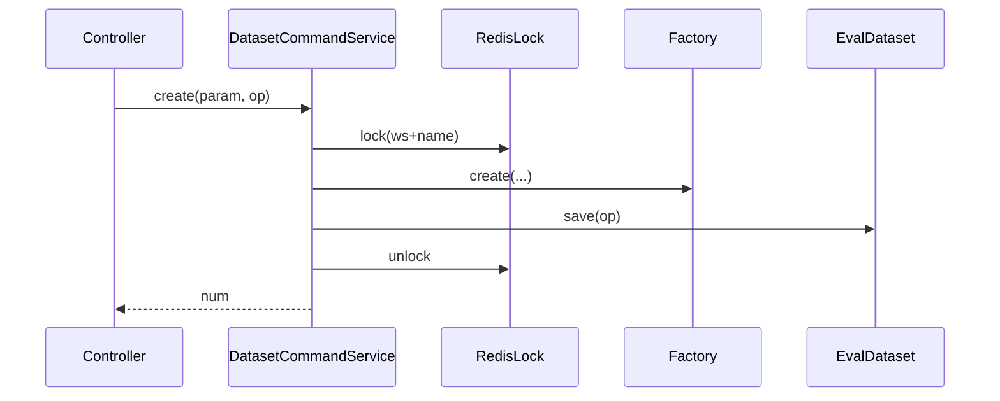

**importXlsx**

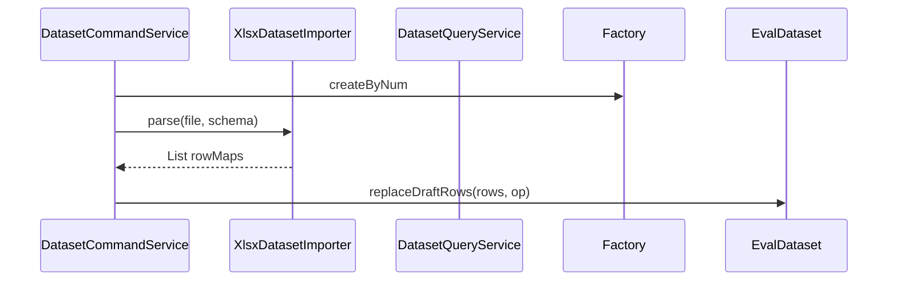

**publish**：见领域 publish 时序；Command 外包锁 `eval:dataset:publish:{num}`。

---

### 6.3 grader

#### 6.3.1 Service 方法清单

| Service | 方法 | 职责 | 阶段 |
|---------|------|------|------|
| Command.createBuiltin | 从预置模板 fork 到空间 | P0 |
| Command.createLlm | 创建 LLM 评估器 | P1 |
| Command.update / delete | 更新/删除 | P0 |
| Command.trialRun | 试跑（不落任务） | P0 builtin / P1 LLM |
| Query.page / detail | 列表详情 | P0 |
| Query.listPresets | 平台预置目录 | P0 |

#### 6.3.2 trialRun 时序

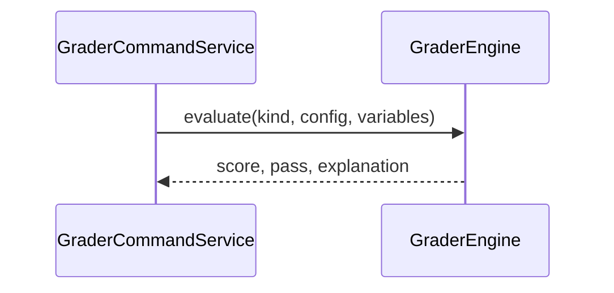

---

### 6.4 task

#### 6.4.1 Service 方法清单

| Service | 方法 | 职责 | 阶段 |
|---------|------|------|------|
| Command.createAndStart | 校验映射完整→保存快照→异步跑 | P0 |
| Command.cancel | 取消运行中任务 | P1 |
| Command.rerunFailed | 重跑失败项 | P1 |
| Command.delete | 删任务 | P0 |
| Command.saveLabels | 人工标注（P1） | P1 |
| Query.page / detail / items | 列表详情明细 | P0 |
| Query.compare | 两任务对比 | P0 |
| Query.stats | Tab 摘要可选 | P1 |

#### 6.4.2 createAndStart 时序

```mermaid
sequenceDiagram
  participant S as TaskCommandService
  participant DQ as DatasetQueryService
  participant GQ as GraderQueryService
  participant F as TaskFactory
  participant T as EvalTask
  participant W as EvalTaskWorker
  S->>DQ: 校验 dataset 版本存在
  S->>GQ: 拉取 grader 配置并固化 bindings 快照
  S->>S: 校验 mapping 全覆盖
  S->>F: create(...)
  S->>T: save; markRunning
  S->>W: runAsync(taskNum, op)
  S-->>S: return num
```

#### 6.4.3 EvalTaskWorker 时序

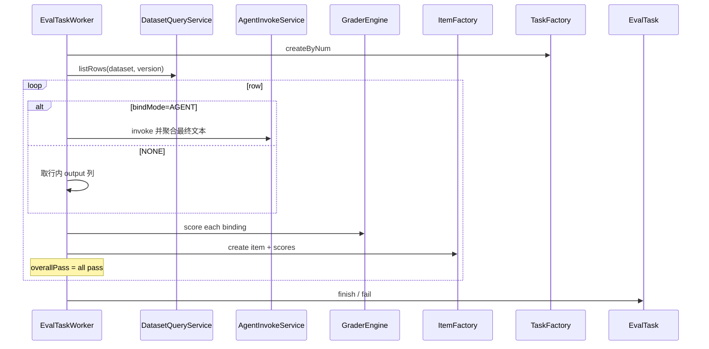

**invoke 实现要求**：必须真正调用现有 `AgentInvokeService`/`AgentRunnerService` 并聚合 `AGENT_RESULT` 文本（修复旧 EvalWorker 空实现）。超时默认 60s；失败记 item FAILED，默认「遇错继续」。

**并发**：线程池内单任务内可串行 P0（实现简单）；配置项 `app.evaluation.task.concurrency` 预留，默认 1。

---

### 6.5 GraderEngine（support）

| 方法 | 说明 |
|------|------|
| evaluateAll(bindings, row, actual, trace) | 返回每评估器 ScoreResult |
| evaluateOne(...) | 单次 |

综合：`overallPass = scoreResults.stream().allMatch(ScoreResult::passed)`。

---

## 7. Adapter 层设计

### 7.1 业务模块划分

| 模块 | Controller | 前缀 |
|------|------------|------|
| dataset | EvalDatasetCommandController / QueryController | `/api/v1/evaluation/dataset/command` · `/query` |
| grader | EvalGraderCommandController / QueryController | `/api/v1/evaluation/grader/command` · `/query` |
| task | EvalTaskCommandController / QueryController | `/api/v1/evaluation/task/command` · `/query` |

HTTP **仅 GET / POST**。文件上传：`POST .../command/importXlsx`（multipart）。

删除：旧 `EvalCommandController` / `EvalQueryController` / `EvalSeedController`。

定时任务：P0 无。  
事件监听：可选审计监听 `EVAL_TASK_FINISHED`（P1）。

---

### 7.2 dataset 接口清单（JSON）

**POST `/api/v1/evaluation/dataset/command/create`**

```json
// req
{ "name": "客服回归集", "description": "", "type": "AGENT", "agentNum": "AGT-xxx", "schemaJson": "[{\"name\":\"input\",\"type\":\"string\"},{\"name\":\"reference\",\"type\":\"string\"}]" }
// resp Result
{ "success": true, "data": { "num": "EDS-xxx" } }
```

**POST `/command/updateDraft`** · **POST `/command/publish`** `{ "num": "EDS-xxx" }` → `{ "version": 1 }`  
**POST `/command/importXlsx`** multipart: `num`, `file`  
**POST `/command/delete`** `{ "num": "EDS-xxx" }`  
**POST `/query/page`** 分页；**GET `/query/detail?num=`**；**GET `/query/rows?num=&version=`**（version 空=草稿）  
**GET `/query/template?type=AGENT&agentNum=`** 下载 xlsx

**create 时序**

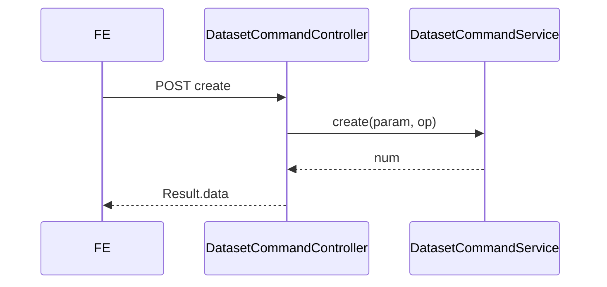

---

### 7.3 grader 接口清单

**POST `/command/createBuiltin`** `{ "presetCode":"CONTAINS", "name":"含关键词" }`  
**POST `/command/createLlm`**（P1）  
**POST `/command/update`** / **`delete`** / **`trialRun`**  
**POST `/query/page`** · **GET `/query/detail`** · **GET `/query/presets`**

**trialRun req**

```json
{
  "graderNum": "EGR-xxx",
  "variables": { "response": "hello", "reference": "hello" }
}
```

---

### 7.4 task 接口清单

**POST `/command/createAndStart`**

```json
{
  "name": "v3 回归",
  "datasetNum": "EDS-xxx",
  "datasetVersion": 1,
  "bindMode": "AGENT",
  "agentNum": "AGT-xxx",
  "agentVersionNum": "AV-xxx",
  "graders": [
    {
      "graderNum": "EGR-xxx",
      "mapping": {
        "response": "$actual_output",
        "reference": "$row.reference"
      }
    }
  ]
}
```

**POST `/command/cancel`** · **`rerunFailed`** · **`delete`** · **`saveLabels`**（P1）  
**POST `/query/page`** · **GET `/query/detail`** · **GET `/query/items?taskNum=`**  
**POST `/query/compare`**

```json
// compare req
{ "leftTaskNum": "ETK-1", "rightTaskNum": "ETK-2" }
// resp：通过率差 + 逐条 uplift/regress/same（按 rowIndex 对齐）
```

**createAndStart 时序**

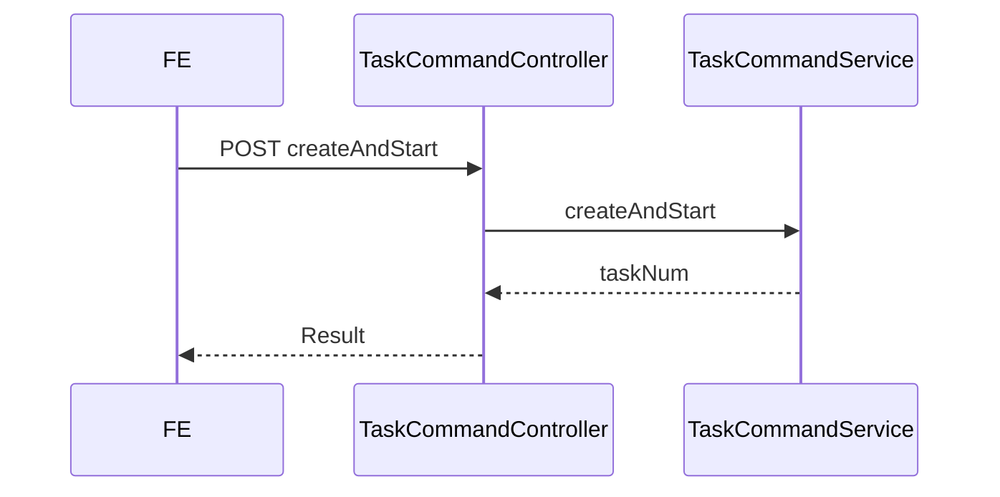

---

### 7.5 权限与路由

新 SPACE 权限点（替换旧五条）：

| code | 说明 |
|------|------|
| `evaluation:dataset:read` / `create` / `update` / `delete` / `publish` | 评测集 |
| `evaluation:grader:read` / `create` / `update` / `delete` | 评估器 |
| `evaluation:task:read` / `create` / `execute` / `delete` / `compare` | 任务 |

- 侧栏「Agent 评测」：具备任一 `evaluation:*:read` 即显示（或 `evaluation:task:read`）。  
- `route_permission` 为上述 API 前缀补齐映射。  
- 平台/空间管理员角色种子替换为新权限；成员默认仅 `*:read`。

---

## 8. 数据库设计

### 8.1 与领域对应

| 表 | 聚合/实体 |
|----|-----------|
| eval_dataset | EvalDataset |
| eval_dataset_version | 发布快照 |
| eval_dataset_row | 草稿行 version IS NULL；发布行 version=n |
| eval_grader | EvalGrader |
| eval_task | EvalTask |
| eval_task_item | EvalTaskItem |
| eval_task_item_score | 每评估器得分 |

### 8.2 DDL（V39）

```sql
-- V39__agent_app_evaluation_rebuild.sql

DROP TABLE IF EXISTS `evaluation_case`;
DROP TABLE IF EXISTS `evaluation`;
DROP TABLE IF EXISTS `eval_seed`;

CREATE TABLE `eval_dataset` (
  `id` BIGINT NOT NULL AUTO_INCREMENT PRIMARY KEY,
  `num` VARCHAR(64) NOT NULL,
  `workspace_num` VARCHAR(64) NOT NULL,
  `name` VARCHAR(128) NOT NULL,
  `description` VARCHAR(512) DEFAULT NULL,
  `type` VARCHAR(32) NOT NULL COMMENT 'AGENT/CUSTOM',
  `agent_num` VARCHAR(64) DEFAULT NULL,
  `schema_json` MEDIUMTEXT NOT NULL,
  `status` VARCHAR(32) NOT NULL COMMENT 'DRAFT/PUBLISHED',
  `latest_version` INT NOT NULL DEFAULT 0,
  `create_no` VARCHAR(64) NOT NULL,
  `update_no` VARCHAR(64) NOT NULL,
  `deleted` TINYINT(1) NOT NULL DEFAULT 0,
  `create_time` DATETIME(3) NOT NULL DEFAULT CURRENT_TIMESTAMP(3),
  `update_time` DATETIME(3) NOT NULL DEFAULT CURRENT_TIMESTAMP(3) ON UPDATE CURRENT_TIMESTAMP(3),
  UNIQUE KEY `uk_eval_dataset_num` (`num`),
  KEY `idx_eval_dataset_ws` (`workspace_num`, `deleted`)
) COMMENT='评测集';

CREATE TABLE `eval_dataset_version` (
  `id` BIGINT NOT NULL AUTO_INCREMENT PRIMARY KEY,
  `dataset_num` VARCHAR(64) NOT NULL,
  `version` INT NOT NULL,
  `schema_json` MEDIUMTEXT NOT NULL,
  `row_count` INT NOT NULL,
  `publish_no` VARCHAR(64) NOT NULL,
  `create_time` DATETIME(3) NOT NULL DEFAULT CURRENT_TIMESTAMP(3),
  `update_time` DATETIME(3) NOT NULL DEFAULT CURRENT_TIMESTAMP(3) ON UPDATE CURRENT_TIMESTAMP(3),
  UNIQUE KEY `uk_dataset_ver` (`dataset_num`, `version`)
) COMMENT='评测集已发布版本';

CREATE TABLE `eval_dataset_row` (
  `id` BIGINT NOT NULL AUTO_INCREMENT PRIMARY KEY,
  `num` VARCHAR(64) NOT NULL,
  `dataset_num` VARCHAR(64) NOT NULL,
  `version` INT DEFAULT NULL COMMENT 'NULL=草稿',
  `row_index` INT NOT NULL,
  `data_json` MEDIUMTEXT NOT NULL,
  `create_no` VARCHAR(64) NOT NULL,
  `update_no` VARCHAR(64) NOT NULL,
  `deleted` TINYINT(1) NOT NULL DEFAULT 0,
  `create_time` DATETIME(3) NOT NULL DEFAULT CURRENT_TIMESTAMP(3),
  `update_time` DATETIME(3) NOT NULL DEFAULT CURRENT_TIMESTAMP(3) ON UPDATE CURRENT_TIMESTAMP(3),
  UNIQUE KEY `uk_eval_dataset_row_num` (`num`),
  KEY `idx_dataset_row` (`dataset_num`, `version`, `deleted`)
) COMMENT='评测集行';

CREATE TABLE `eval_grader` (
  `id` BIGINT NOT NULL AUTO_INCREMENT PRIMARY KEY,
  `num` VARCHAR(64) NOT NULL,
  `workspace_num` VARCHAR(64) NOT NULL,
  `name` VARCHAR(128) NOT NULL,
  `description` VARCHAR(512) DEFAULT NULL,
  `kind` VARCHAR(32) NOT NULL COMMENT 'BUILTIN/LLM/CODE',
  `builtin_code` VARCHAR(64) DEFAULT NULL,
  `config_json` MEDIUMTEXT NOT NULL,
  `version` INT NOT NULL DEFAULT 1,
  `create_no` VARCHAR(64) NOT NULL,
  `update_no` VARCHAR(64) NOT NULL,
  `deleted` TINYINT(1) NOT NULL DEFAULT 0,
  `create_time` DATETIME(3) NOT NULL DEFAULT CURRENT_TIMESTAMP(3),
  `update_time` DATETIME(3) NOT NULL DEFAULT CURRENT_TIMESTAMP(3) ON UPDATE CURRENT_TIMESTAMP(3),
  UNIQUE KEY `uk_eval_grader_num` (`num`),
  KEY `idx_eval_grader_ws` (`workspace_num`, `deleted`)
) COMMENT='评估器';

CREATE TABLE `eval_task` (
  `id` BIGINT NOT NULL AUTO_INCREMENT PRIMARY KEY,
  `num` VARCHAR(64) NOT NULL,
  `workspace_num` VARCHAR(64) NOT NULL,
  `name` VARCHAR(128) NOT NULL,
  `description` VARCHAR(512) DEFAULT NULL,
  `dataset_num` VARCHAR(64) NOT NULL,
  `dataset_version` INT NOT NULL,
  `bind_mode` VARCHAR(32) NOT NULL COMMENT 'AGENT/NONE',
  `agent_num` VARCHAR(64) DEFAULT NULL,
  `agent_version_num` VARCHAR(64) DEFAULT NULL,
  `grader_bindings_json` MEDIUMTEXT NOT NULL,
  `label_config_json` MEDIUMTEXT DEFAULT NULL,
  `status` VARCHAR(32) NOT NULL,
  `total_count` INT NOT NULL DEFAULT 0,
  `passed_count` INT NOT NULL DEFAULT 0,
  `failed_count` INT NOT NULL DEFAULT 0,
  `creator_user_id` VARCHAR(64) NOT NULL,
  `create_no` VARCHAR(64) NOT NULL,
  `update_no` VARCHAR(64) NOT NULL,
  `deleted` TINYINT(1) NOT NULL DEFAULT 0,
  `create_time` DATETIME(3) NOT NULL DEFAULT CURRENT_TIMESTAMP(3),
  `update_time` DATETIME(3) NOT NULL DEFAULT CURRENT_TIMESTAMP(3) ON UPDATE CURRENT_TIMESTAMP(3),
  UNIQUE KEY `uk_eval_task_num` (`num`),
  KEY `idx_eval_task_ws` (`workspace_num`, `deleted`, `status`)
) COMMENT='评测任务';

CREATE TABLE `eval_task_item` (
  `id` BIGINT NOT NULL AUTO_INCREMENT PRIMARY KEY,
  `num` VARCHAR(64) NOT NULL,
  `task_num` VARCHAR(64) NOT NULL,
  `row_index` INT NOT NULL,
  `input_json` MEDIUMTEXT NOT NULL,
  `actual_output` MEDIUMTEXT DEFAULT NULL,
  `trace_summary_json` MEDIUMTEXT DEFAULT NULL,
  `overall_pass` TINYINT(1) DEFAULT NULL,
  `status` VARCHAR(32) NOT NULL,
  `latency_ms` BIGINT DEFAULT NULL,
  `error_message` VARCHAR(1024) DEFAULT NULL,
  `label_json` MEDIUMTEXT DEFAULT NULL,
  `create_no` VARCHAR(64) NOT NULL,
  `update_no` VARCHAR(64) NOT NULL,
  `deleted` TINYINT(1) NOT NULL DEFAULT 0,
  `create_time` DATETIME(3) NOT NULL DEFAULT CURRENT_TIMESTAMP(3),
  `update_time` DATETIME(3) NOT NULL DEFAULT CURRENT_TIMESTAMP(3) ON UPDATE CURRENT_TIMESTAMP(3),
  UNIQUE KEY `uk_eval_task_item_num` (`num`),
  KEY `idx_task_item` (`task_num`, `deleted`)
) COMMENT='评测任务用例';

CREATE TABLE `eval_task_item_score` (
  `id` BIGINT NOT NULL AUTO_INCREMENT PRIMARY KEY,
  `task_item_num` VARCHAR(64) NOT NULL,
  `grader_num` VARCHAR(64) NOT NULL,
  `grader_version` INT NOT NULL,
  `score` DECIMAL(10,4) DEFAULT NULL,
  `passed` TINYINT(1) NOT NULL,
  `explanation` VARCHAR(2048) DEFAULT NULL,
  `create_time` DATETIME(3) NOT NULL DEFAULT CURRENT_TIMESTAMP(3),
  `update_time` DATETIME(3) NOT NULL DEFAULT CURRENT_TIMESTAMP(3) ON UPDATE CURRENT_TIMESTAMP(3),
  KEY `idx_item_score` (`task_item_num`)
) COMMENT='用例×评估器得分';
```

### 8.3 权限 DML（摘要）

```sql
DELETE FROM role_permission WHERE permission_code LIKE 'evaluation:%';
DELETE FROM permission WHERE code LIKE 'evaluation:%';

INSERT INTO permission (code, name, resource_domain, scope, remark, sort_order, create_time, update_time) VALUES
('evaluation:dataset:read','查看评测集','evaluation','SPACE','',510,NOW(3),NOW(3)),
('evaluation:dataset:create','创建评测集','evaluation','SPACE','',511,NOW(3),NOW(3)),
('evaluation:dataset:update','编辑评测集','evaluation','SPACE','',512,NOW(3),NOW(3)),
('evaluation:dataset:delete','删除评测集','evaluation','SPACE','',513,NOW(3),NOW(3)),
('evaluation:dataset:publish','发布评测集','evaluation','SPACE','',514,NOW(3),NOW(3)),
('evaluation:grader:read','查看评估器','evaluation','SPACE','',520,NOW(3),NOW(3)),
('evaluation:grader:create','创建评估器','evaluation','SPACE','',521,NOW(3),NOW(3)),
('evaluation:grader:update','编辑评估器','evaluation','SPACE','',522,NOW(3),NOW(3)),
('evaluation:grader:delete','删除评估器','evaluation','SPACE','',523,NOW(3),NOW(3)),
('evaluation:task:read','查看评测任务','evaluation','SPACE','',530,NOW(3),NOW(3)),
('evaluation:task:create','创建评测任务','evaluation','SPACE','',531,NOW(3),NOW(3)),
('evaluation:task:execute','执行评测任务','evaluation','SPACE','',532,NOW(3),NOW(3)),
('evaluation:task:delete','删除评测任务','evaluation','SPACE','',533,NOW(3),NOW(3)),
('evaluation:task:compare','对比评测任务','evaluation','SPACE','',534,NOW(3),NOW(3));

-- 将上述 code 赋予 RL-PLATFORM-ADMIN / 空间管理员；成员仅 *:read
```

> 具体 `role_permission` / `route_permission` 插入在迁移中写全，与现网角色 num 对齐。

### 8.4 刷数

旧评测数据 **不迁移**（产品确认删除重建）。无历史 DML 转换。

---

## 9. 模块变更清单

| 层 | 变更 | Skill |
|----|------|-------|
| facade | 调整 EvalDomainEventDTO | impl-facade-module |
| client | 删除旧 evaluation DTO；新增 dataset/grader/task Param/VO | impl-client-module |
| domain | 删除旧聚合；新增 dataset/grader/task 聚合与 Factory/Gateway/Repo 接口 | impl-domain-module |
| infra | Flyway V39；新 Entity/Mapper/Impl；删旧 | impl-infra-module |
| application | 新 Command/Query/Worker/GraderEngine/Xlsx；删旧 Eval* | impl-application-module |
| adapter | 新 Controller；权限路由；删旧 Controller | impl-adapter-module |
| frontend | WorkLayout 菜单；AgentEvaluation 页面；删 Skill Evaluation | （FE 约定，无 Java skill） |

---

## 10. 代码分支命名

**`feature-20260822-agent-app-evaluation`**

---

## 11. 实现顺序与依赖

1. **Flyway V39 + 删旧代码**（表与 Java/FE 旧评测）  
2. **facade → client** 契约  
3. **domain** dataset → grader → task  
4. **infra** 实现与编号  
5. **application** Dataset/Grader → GraderEngine → TaskWorker（先打通 builtin）  
6. **adapter** API + 权限  
7. **FE** Tab 壳 + 三列表 + 创建/详情/对比  
8. **P1** LLM grader、标签、回流、NONE 绑定、cancel/rerun  
9. **P2** 自定义 Code、蒸馏、轨迹增强  

顺序符合：facade → client → domain → infra → application → adapter → FE。

---

## 12. 接口与数据契约（前端对齐）

### 12.1 前端路由

| 路由 | 说明 |
|------|------|
| `/agent/evaluation` | redirect → `/agent/evaluation/tasks` |
| `/agent/evaluation/datasets` | Tab 评测集 |
| `/agent/evaluation/graders` | Tab 评估器 |
| `/agent/evaluation/tasks` | Tab 任务 |
| `/agent/evaluation/datasets/new` · `/:num` | 深页 |
| `/agent/evaluation/graders/new` · `/:num` | 深页 |
| `/agent/evaluation/tasks/new` · `/:num` | 深页 |
| `/agent/evaluation/compare` | 对比 |

`WorkLayout`「调试与评测」：

```text
Agent 调试 /agent/debug
Agent 评测 /agent/evaluation   // 权限：evaluation:task:read 等
```

删除 `/skill/evaluation/**` 与旧 breadcrumb。

### 12.2 FE 目录建议

```
pages/AgentEvaluation/
  layout/EvaluationShell.tsx   // 顶 Tab
  datasets/List.tsx Detail.tsx Create.tsx
  graders/List.tsx Detail.tsx
  tasks/List.tsx Detail.tsx Create.tsx Compare.tsx
services/evaluation/...        // 新 API
```

### 12.3 xlsx 约定（P0）

- 表头 = schema 列名；首列建议 `input`；可选 `reference`、`context`（context 单元格为 JSON 字符串）。  
- 单文件 ≤ 20MB；行数 P0 建议 ≤ 500（可配置）。

---

## 13. 其他

### 配置项

```yaml
app:
  evaluation:
    task:
      invoke-timeout-seconds: 60
      concurrency: 1
      continue-on-error: true
    import:
      max-rows: 500
      max-file-mb: 20
```

### 非功能

- Code/自定义脚本 P2 才引入沙箱；P0 无任意代码执行。  
- LLM grader 费用计入任务详情 token 汇总（能取则取）。  
- 审计：publish、createAndStart、delete 写操作日志。  

### 风险与依赖

- Agent invoke 聚合结果必须可靠（依赖现网 SSE/`AGENT_RESULT`）。  
- 删除旧评测不可逆，上线前确认无业务依赖 Skill 评测。  

### 子需求落地切片（实现时可按 PR 拆）

| 切片 | 内容 |
|------|------|
| S1 | 拆旧 + 表 + 权限 |
| S2 | 评测集 API + FE Tab/列表/发布/xlsx |
| S3 | 评估器 builtin + 试跑 + FE |
| S4 | 任务执行 + 明细 + 对比 + FE |
| S5 | P1 LLM/标签/回流 |
| S6 | P2 Code/蒸馏/轨迹 |

---

## 14. 修订记录

| 版本 | 日期 | 说明 |
|------|------|------|
| v1.0 | 2026-08-22 | 首版：删旧建新；三资产域；P0 builtin；部署不变；含 FE |
