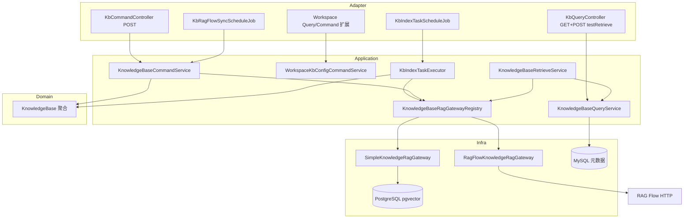
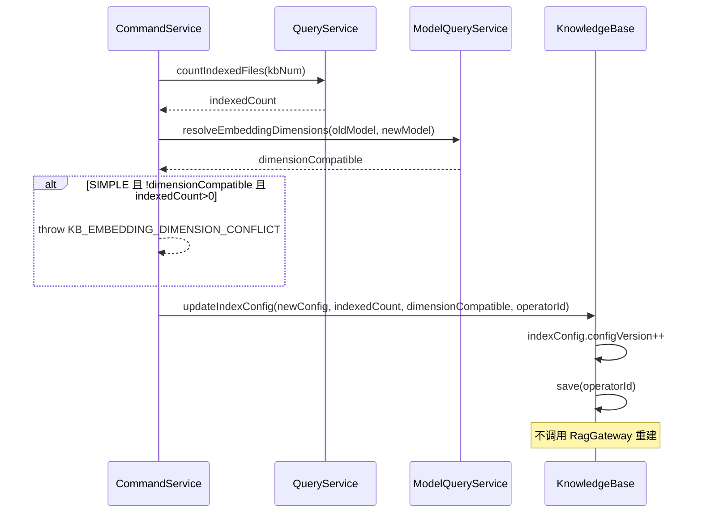
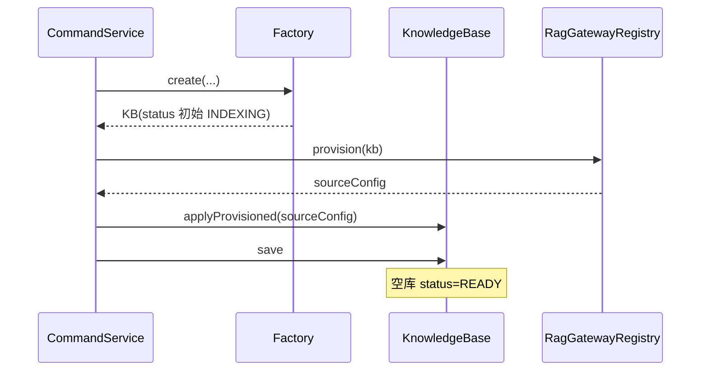
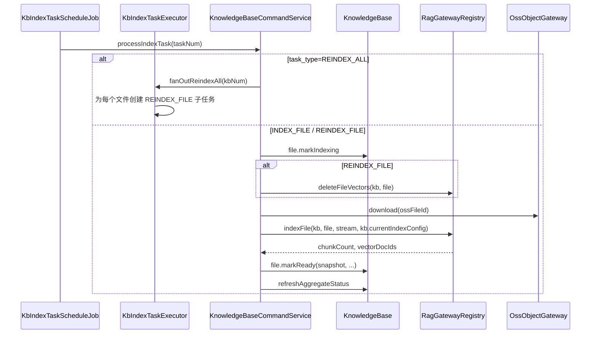

# AgentOps — 知识库管理 技术方案

> 文档日期：2026-08-23　|　版本：v2.2（方案评审修订）
> 对应 PRD：[2026-08-23-知识库管理-PRD](../产品方案/2026-08-23_知识库管理-PRD.md)
> 前序方案：[2026-07-30_知识库管理-技术方案](./2026-07-30_知识库管理-技术方案.md)（v1.0，RAG Flow 单轨，本文档替代）
> 代码仓库：agent-be + agent-fe　基础包：`ink.garry.rd.agent.ws`
> 兄弟方案：[工具管理-技术方案](./2026-06-09_工具管理-技术方案.md) · [模型管理-技术方案](./2026-06-10_模型管理-技术方案.md)

---

## 目录

1. [目标与范围](#1-目标与范围)
2. [架构设计](#2-架构设计)
3. [Facade 层设计](#3-facade-层设计)
4. [领域层设计](#4-领域层设计)
5. [基础设施层设计](#5-基础设施层设计)
6. [应用层设计](#6-应用层设计)
7. [Adapter 层设计](#7-adapter-层设计)
8. [数据库设计](#8-数据库设计)
9. [前端设计](#9-前端设计)
10. [模块变更清单](#10-模块变更清单)
11. [代码分支命名](#11-代码分支命名)
12. [实现顺序与依赖](#12-实现顺序与依赖)
13. [接口与数据契约](#13-接口与数据契约)
14. [其他](#14-其他)

---

## 1. 目标与范围

### 1.1 目标

- 在 rd-agent-be 新增 **knowledgebase** 领域，承载知识库与文件全生命周期；
- 支持双类型知识库：**SIMPLE**（AgentScope SimpleKnowledge + PgVector）与 **RAG_FLOW**（对接 RAG Flow），**产品能力一致、RagGateway 实现不同**；
- 新增 **工作空间知识库配置**（`workspace_kb_config`），空间级默认 Embedding / 分块 / RAG Flow 连接；
- 索引配置 **configVersion 增量生效**：改配置不自动重建存量，仅新上传与手动重建使用新配置；
- Agent 运行时支持 **AUTO / ON_DEMAND / HYBRID** 检索模式，绑定写入 `ConfigSnapshot.knowledgeBaseBindings`；
- agent-fe 提供知识库管理全页面 + 空间设置 + Agent 绑定 UI。

### 1.2 范围

**做（P0）**

| 模块 | 内容 |
| --- | --- |
| BE | `knowledgebase` 六层 + `workspace` 扩展 KB 配置 |
| BE | `SimpleKnowledgeRagGateway` / `RagFlowKnowledgeRagGateway` |
| BE | 异步索引任务、RAG Flow 状态轮询任务 |
| BE | `KbContextInjector` + `SearchKnowledgeTool` |
| BE | Flyway `V45__knowledge_base_init.sql` |
| FE | 知识库列表/创建向导/详情、空间 KB 配置、Agent 知识库 Tab |
| 存储 | MySQL 元数据；PostgreSQL（pgvector）存 SIMPLE 模式向量 |

**不做（本期）**

- 金山文档（KINGSOFT）逻辑；sphere 生产执行面对接（架构预留）；
- Rerank / Query Rewrite；知识库跨空间共享；kbType 创建后变更；
- RAG Flow 远端 dataset 物理删除（软删本地即可）。

### 1.3 设计前共识（源自 PRD 与方案评审）

| # | 决策点 | 结论 |
| --- | --- | --- |
| 1 | 元数据存储 | **MySQL** `rd_agent`：`knowledge_base` / `knowledge_base_file` / `kb_index_task` / `workspace_kb_config` |
| 2 | 向量存储 | **PostgreSQL + pgvector**（仅 SIMPLE）；RAG_FLOW 向量在 RAG Flow 侧 |
| 3 | 部署架构 | **应用/前端部署实例不变**；新增 **PostgreSQL 云服务连接**（非新应用进程） |
| 4 | 编号前缀 | KB / KBF / KBT（任务） |
| 5 | 配置增量生效 | 空间配置 / KB `indexConfig` 变更 **不触发** 存量重建；`configVersion` 追踪 |
| 6 | 维度变更 | SIMPLE 模式换 Embedding 致维度变化且存在已索引文件 → **拒绝保存** |
| 7 | RAG Flow 凭证 | `endpoint` / `apiKey` 存 **空间配置**，不入 KB 级 |
| 8 | 文件上传 | FE OSS STS 直传 → BE 登记 → 异步索引（SIMPLE 本地流水线 / RAG_FLOW 上传远端） |
| 9 | Agent 绑定 | `knowledgeBaseBindings: [{kbNum, retrievalMode, topK, minScore}]` |
| 10 | 错误码 | 知识库 **1201–1209**，文件 **1211–1219**，空间 KB 配置 **1221–1229**（**禁止**占用 9xxx，该段为系统错误 9001/9002） |
| 11 | 权限 | 复用 `knowledge_base:*`；空间配置需空间管理员 |
| 12 | AgentScope | 引入 `agentscope-extensions-rag-simple`，与 `agentscope.version` 对齐 |

### 1.4 设计决策定稿（全部按推荐方案执行）

> 以下原待定项均已确认，实现阶段**不得偏离**；若需变更须重新评审 PRD/技术方案。

| # | 决策点 | 定稿结论 |
| --- | --- | --- |
| D1 | PostgreSQL 部署 | **独立库** `rd_agent_vector`（与 MySQL `rd_agent` 分离）；dev docker-compose 起 pgvector 镜像，test/stag/prod 用云 RDS |
| D2 | Embedding 模型来源 | **模型管理**中选 `EMBEDDING` 类型；空间配置填默认 `embeddingModelId`；KB 创建可覆盖 |
| D3 | 默认 Embedding | 空间未配置时，读 `app.knowledge-base.default-embedding-model-id`（yaml 兜底） |
| D4 | 空间允许的类型 | 默认 **SIMPLE + RAG_FLOW 均启用**；空间管理员可关闭其中一种 |
| D5 | 默认创建类型 | **SIMPLE**（简洁模式） |
| D6 | 默认分块策略 | `PARAGRAPH` / chunkSize **512** / overlap **64** / Word 表格 **单独成块 + MARKDOWN** |
| D7 | 默认 Embedding 维度 | **1024**（与 `text-embedding-v3` 对齐）；创建 collection 时写入 `sourceConfig.dimensions` |
| D8 | 相似度度量 | PgVector 使用 **cosine**（`PgVectorStore` 默认） |
| D9 | 配置变更语义 | 空间配置 / KB `indexConfig` **仅增量生效**；存量仅 **手动重建** 三条路径（单文件 / 旧版本批量 / 全库） |
| D10 | 维度冲突 | **仅 SIMPLE**：存在已索引文件时 **拒绝保存** 会导致维度变化的 Embedding 变更 |
| D11 | kbType 变更 | **禁止**（创建后 immutable） |
| D12 | 索引执行 | **异步任务表** `kb_index_task` + 定时 Job 拉取；上传接口秒级返回 |
| D13 | RAG_FLOW 状态同步 | **定时轮询** `KbRagFlowSyncScheduleJob`（30s）；不做 Webhook |
| D14 | 第一期执行面 | **仅调试台**（`AgentRunnerFactory`）；sphere 对接放 **M5 方案预留**，本期不实现 |
| D15 | 混合配置检索 | 允许同一 KB 内多 `configVersion` chunk 共存；query 向量用 **当前** Embedding 模型。**已知限制**：跨版本 chunk 的 score 不可严格比较；若更换 Embedding 模型，建议对旧版本文件执行「批量重建旧版本」以恢复召回质量（维度不变时系统不强制） |
| D16 | Agent 绑定上限 | 单 Agent 最多 **10** 个知识库 |
| D17 | 全局 chunk 上限 | 每轮对话注入上限 **20** chunks（`max-chunks-per-turn`） |
| D18 | 单文件大小 | **50MB**；MIME 白名单由空间配置维护 |
| D19 | RAG Flow dataset 删除 | 知识库软删 **不删** 远端 dataset（与 v1 一致） |
| D20 | SIMPLE collection 清理 | 软删后 **异步标记废弃**，本期不强制物理 drop |
| D21 | 发布门禁 | Agent **发布**时经 `EvalPublishGateService` 校验绑定 KB 均为 **READY**（M3 实现）；草稿保存仅校验 kbNum 存在且同 workspace，**不**强制 READY |
| D22 | 实现分期 | **M1→M5** 按 §12 顺序；**FE 主流程随 M1–M4 分期交付**，M5 为体验收尾 + 门禁 + 测试 + sphere 方案 |
| D23 | 代码分支 | `feature-20260823-knowledge-base` |
| D24 | 权限 | 知识库 CRUD 用 `knowledge_base:*`；空间 KB 配置用 **空间管理员** |
| D25 | FE 表单 | 创建向导 **两步**；索引配置字段由 `typeSchemas` API 驱动 |

### 1.5 方案评审修订（v2.1 → v2.2）

| # | 问题 | 修订 |
| --- | --- | --- |
| R1 | 错误码 90xx 与 `BizCode.SYSTEM_BUSY(9001)` / `THIRD_PARTY_ERROR(9002)` 冲突 | 知识库域改用 **12xx 段**（§14.2） |
| R2 | 领域聚合调用 `QueryService` 违反六层依赖 | `updateIndexConfig` 的已索引文件数、维度解析由 **CommandService** 预检后传入领域动作 |
| R3 | 聚合根持有 `KnowledgeBaseProvider` 并调外部索引/检索 | 外部能力收敛为 **`KnowledgeBaseRagGateway`**，仅 **应用层**（CommandService / Executor / RetrieveService）调用；聚合根只改状态 |
| R4 | Gateway 返回 `KbChunkDTO`（client 类型） | Gateway 返回领域值对象 **`RetrievedChunk`**，Assembler 转 DTO |
| R5 | `KnowledgeBase.delete` 内查 Agent 绑定 | 删除前由 **CommandService** 调 `AgentQueryService` / `countAgentsBound` |
| R6 | 创建成功响应 `status=DRAFT` 与可绑定语义矛盾 | provision 成功后空库 **READY**（无文件亦可绑定；检索返回空） |
| R7 | `REINDEX_ALL` 单 task 无法对应单 `file_num` | `file_num=NULL` 的父任务由 Executor **扇出** N 个 `REINDEX_FILE` 子任务 |
| R8 | `testRetrieve` 放在 CommandService | 读操作归入 **QueryService**；Adapter 仍用 POST（与 FC 测试连接一致） |
| R9 | M5 才交付 FE 与 PRD P0 矛盾 | FE 按 §12 分期随 M1–M4 交付 |
| R10 | 新建 `WorkspaceKbConfigController` 与现有 workspace 路由不一致 | 扩展 **`WorkspaceQueryController` / `WorkspaceCommandController`** |
| R11 | Job 拉取 `RETRY` 但 task 状态枚举无 RETRY | 失败任务 `retry_count < max` 时 Job **重置为 PENDING** 重试 |
| R12 | 重建未声明先删旧向量 | `REINDEX_FILE` / `REINDEX_ALL` 执行前 **先** `deleteFileVectors` 再 `indexFile` |
| R13 | RAG_FLOW 无 Embedding 维度 | D10 维度冲突规则 **仅 SIMPLE**；RAG_FLOW 改 parser/chunkMethod 同样仅增量生效 |
| R14 | `registerFile` 未校验 OSS 归属 | CommandService 校验 `ossFileId` 属于当前 workspace（STS 上传记录） |
| R15 | §8.3 DDL 占位 | 补充完整 `V45` DDL 草案 |

---

## 2. 架构设计

### 2.1 应用架构

#### 2.1.1 代码结构

| 层 | 领域 | 包 | 职责 |
| --- | --- | --- | --- |
| facade | common | `ink.garry.rd.agent.ws.facade.domain` | 复用 `DomainEntity` / 事件契约，无新增 |
| client | knowledgebase | `...client.knowledgebase.vo` | `*Param` / `*VO` |
| client | knowledgebase | `...client.knowledgebase.dto` | `*ParamDTO` / `*DTO` |
| client | knowledgebase | `...client.knowledgebase.constant` | `KbType` / `KbIndexStatus` / `RetrievalMode` 等 |
| client | workspace | `...client.workspace.dto` | `WorkspaceKbConfigDTO`（扩展） |
| client | agent | `...client.agent` | `KnowledgeBaseBindingParam` / DTO |
| client | common | `...client.common.BizCode` | 1201–1229 错误码 |
| domain | knowledgebase | `...domain.knowledgebase` | `KnowledgeBase` 聚合根 |
| domain | knowledgebase | `...domain.knowledgebase.entity` | `KnowledgeBaseFile` |
| domain | knowledgebase | `...domain.knowledgebase.valueobject` | `KbType` / `KbIndexConfig` / `KbSourceConfig` / `RetrievalMode` / `RetrievedChunk` |
| domain | knowledgebase | `...domain.knowledgebase.repository` | `KnowledgeBaseRepository` / `KnowledgeBaseFileRepository` |
| domain | knowledgebase | `...domain.knowledgebase.factory` | `KnowledgeBaseFactory` |
| domain | knowledgebase | `...domain.knowledgebase.gateway` | `KnowledgeBaseRagGateway`（策略接口）/ `KbNumGateway` |
| domain | workspace | `...domain.workspace` | `WorkspaceKbConfig` 值对象 + `WorkspaceKbConfigRepository` |
| infra | knowledgebase | `...infra.knowledgebase.*` | Entity / Mapper / RepositoryImpl / FactoryImpl |
| infra | knowledgebase | `...infra.knowledgebase.gateway` | `SimpleKnowledgeRagGateway` / `RagFlowKnowledgeRagGateway` |
| infra | knowledgebase | `...infra.knowledgebase.support` | `KnowledgeBaseRagGatewayRegistry`（kbType → Gateway） |
| infra | workspace | `...infra.workspace` | `WorkspaceKbConfigRepositoryImpl` |
| infra | common | `...infra.common.client.ragflow` | `RagFlowClient` |
| infra | common | `...infra.knowledgebase.pgvector` | `PgVectorDataSourceConfig` |
| application | knowledgebase | `...application.knowledgebase` | `KnowledgeBaseCommandService` / `KnowledgeBaseQueryService` |
| application | knowledgebase | `...application.knowledgebase.task` | `KbIndexTaskExecutor` |
| application | workspace | `...application.workspace` | `WorkspaceKbConfigCommandService` / `QueryService` |
| application | agentrunner | `...application.agentrunner` | `KbContextInjector` / `SearchKnowledgeTool` / `KnowledgeBaseRetrieveService` |
| application | agent | `...application.agent` | `ConfigSnapshot` 扩展 `knowledgeBaseBindings` 归一化 |
| adapter | knowledgebase | `...adapter.knowledgebase` | `KbCommandController` / `KbQueryController` |
| adapter | workspace | `...adapter.workspace` | 在现有 Workspace Query/Command 上扩展 KB 配置 GET/POST |
| adapter | common | `...adapter.common.scheduler` | `KbIndexTaskScheduleJob` / `KbRagFlowSyncScheduleJob` |

#### 2.1.2 关键调用关系



**命令 / 查询划分**

- **Command**：创建/更新/删除 KB、上传登记、触发重建、空间 KB 配置保存；
- **Query**：列表/详情/文件列表/mountable/type-schemas/配置版本统计、**testRetrieve**（只读探测，POST 路由）。

**分层约束（评审修订）**

- **Domain** 不依赖 application 层，**不**注入 `QueryService` / `RagGateway`；
- **RagGateway** 由 application 经 `KnowledgeBaseRagGatewayRegistry` 按 `kbType` 解析后调用；
- Agent 绑定删除校验、OSS 归属、Embedding 维度解析均在 **CommandService** 完成。

**同步 / 异步边界**

| 路径 | 同步 | 异步 |
| --- | --- | --- |
| 创建 KB | provision collection/dataset | — |
| 上传文件登记 | 写 file 记录 + 创建 task | 索引执行 |
| 修改 indexConfig | bump version | **不**投递重建 |
| SIMPLE 索引 | — | parse → chunk → embed → pgvector |
| RAG_FLOW 上传 | 调远端 upload | 轮询 run status |
| Agent retrieve | 同步检索 | — |

#### 模块自检（架构设计）

- [x] 四列表格 + 调用关系 + 命令/查询划分
- [x] Adapter：HTTP + 定时任务
- [x] MySQL 元数据 / PostgreSQL 向量职责清晰

### 2.2 部署架构

**部署架构不变，无新增应用/前端部署实例，复用现有 agent-be + agent-fe 部署。**

**新增外部依赖（连接级，非新应用进程）：**

| 依赖 | 用途 | 配置项 |
| --- | --- | --- |
| PostgreSQL + pgvector | SIMPLE 模式向量存储 | `app.knowledge-base.pgvector.jdbc-url` 等 |
| RAG Flow HTTP | RAG_FLOW 模式索引与检索 | 空间 `workspace_kb_config.ragFlowDefaults` |
| Embedding API | SIMPLE 向量化 | 模型管理 + `ModelCredentialResolver` |
| OSS | 原始文件 | 复用现有 |

dev 环境可通过 docker-compose 增加 PostgreSQL（pgvector 镜像）；test/stag/prod 使用云 RDS PostgreSQL 实例，**不部署新 Java 服务**。

---

## 3. Facade 层设计

**本次无 Facade 层变更。**

复用 `DomainEntity`、`DomainEventDTO`、`DomainEventPublisher`、`Result`、`PageVO`。

---

## 4. 领域层设计

### 4.1 业务层级划分

| 层级 | 业务域 | 说明 |
| --- | --- | --- |
| 资产层 | knowledgebase | 知识库聚合、文件、索引任务 |
| 空间层 | workspace（扩展） | 空间知识库默认配置 |
| 运行时层 | agent（ConfigSnapshot 扩展） | Agent 绑定与检索模式 |

### 4.2 知识库（knowledgebase）

#### 4.2.1 领域模型

**聚合根 `KnowledgeBase`**（继承 `DomainEntity`）

| 属性 | 类型 | 说明 |
| --- | --- | --- |
| id | Long | 物理主键 |
| num | String | kbNum，KB 前缀 |
| workspaceNum | String | 工作空间 |
| name / description | String | 基本信息 |
| kbType | KbType | SIMPLE / RAG_FLOW，不可变 |
| status | KbStatus | INDEXING / READY / PARTIAL_FAILED / DISABLED（**无 DRAFT**：创建 provision 成功后即为 READY） |
| indexConfig | KbIndexConfig | 含 configVersion |
| sourceConfig | KbSourceConfig | collectionName 或 datasetId |
| retrievalDefaults | KbRetrievalDefaults | 默认 topK / minScore |
| fileCount / chunkCount | Integer | 统计 |

**协作依赖（聚合根持有）**：`KnowledgeBaseRepository`、`KbNumGateway`、`DomainEventPublisher`（**不**持有 RagGateway）。

**子实体 `KnowledgeBaseFile`**

| 属性 | 说明 |
| --- | --- |
| num | KBF 前缀 |
| kbNum | 所属知识库 |
| ossFileId / fileName / mimeType / fileSize | 文件元数据 |
| indexStatus | PENDING … READY / FAILED |
| indexConfigSnapshot | 索引完成时冻结 |
| chunkCount / vectorDocIds | 向量引用 |
| errorMessage / indexedAt | 状态 |

**值对象**

```java
// KbIndexConfig（JSON 持久化，按 kbType 字段不同）
class KbIndexConfig {
    int configVersion;
    // SIMPLE
    String embeddingModelId;
    SplitStrategy splitStrategy;
    int chunkSize;
    int chunkOverlap;
    Boolean wordSeparateTables;
    String wordTableFormat;
    // RAG_FLOW
    String parserId;
    String chunkMethod;
    Boolean layoutRecognize;
}

// KbSourceConfig
class KbSourceConfig {
    String vectorCollectionName;  // SIMPLE
    Integer dimensions;
    String ragFlowDatasetId;      // RAG_FLOW
}

enum KbType { SIMPLE, RAG_FLOW }
enum RetrievalMode { AUTO, ON_DEMAND, HYBRID }

// RetrievedChunk（检索结果值对象，Gateway 返回）
class RetrievedChunk {
    String kbNum;
    String fileNum;
    String fileName;
    int configVersion;
    String content;
    double score;
}
```

**`ConfigSnapshot` 扩展（agent 域值对象）**

```java
class KnowledgeBaseBinding {
    String kbNum;
    RetrievalMode retrievalMode;
    Integer topK;
    Double minScore;
}
// ConfigSnapshot.knowledgeBaseBindings: List<KnowledgeBaseBinding>
```

#### 4.2.2 领域动作

| 聚合/实体 | 领域动作 | 职责 | 操作人 |
| --- | --- | --- | --- |
| KnowledgeBase | `applyProvisioned(sourceConfig, operatorId)` | provision **成功后**写入 sourceConfig，status→READY | ✓ |
| KnowledgeBase | `updateBasicInfo(name, desc, operatorId)` | 更新名称描述 | ✓ |
| KnowledgeBase | `updateIndexConfig(newConfig, indexedFileCount, dimensionCompatible, operatorId)` | 应用层传入已索引文件数与维度兼容性 → configVersion++，**不**重建 | ✓ |
| KnowledgeBase | `updateRetrievalDefaults(...)` | 更新默认检索参数 | ✓ |
| KnowledgeBase | `registerFile(file, operatorId)` | 新增文件记录 PENDING；有文件进入 INDEXING | ✓ |
| KnowledgeBase | `refreshAggregateStatus(operatorId)` | 根据文件状态汇总 READY/PARTIAL_FAILED/INDEXING | ✓ |
| KnowledgeBase | `markDisabled(operatorId)` / `markEnabled(operatorId)` | 禁用/启用 | ✓ |
| KnowledgeBase | `delete(operatorId)` | 软删（**不**查 Agent 绑定） | ✓ |
| KnowledgeBaseFile | `markIndexing(operatorId)` | 状态 → PARSING | ✓ |
| KnowledgeBaseFile | `markReady(snapshot, chunkCount, vectorDocIds, operatorId)` | READY + 写 snapshot | ✓ |
| KnowledgeBaseFile | `markFailed(error, operatorId)` | FAILED | ✓ |
| KnowledgeBaseFile | `markDeleted(operatorId)` | 软删（**不**调 Gateway 删向量） | ✓ |

> **外部编排**（CommandService / Executor，非领域动作）：`RagGateway.provision`、`.indexFile`、`.deleteFileVectors`、`.retrieve`、`.teardown`。

**`updateIndexConfig` 时序（核心）**



**`create` 时序**



#### 4.2.3 领域规则

| 对象 | 规则 | 违反表达 |
| --- | --- | --- |
| KnowledgeBase | 同 workspace 内 name 唯一 | `KB_NAME_DUPLICATE` |
| KnowledgeBase | kbType 创建后不可变 | `KB_TYPE_IMMUTABLE` |
| KnowledgeBase | 删除前无 Agent 绑定 | **CommandService** 预检 → `KB_BOUND_BY_AGENT` |
| KnowledgeBase | SIMPLE 维度变更且存在索引文件 | **CommandService** 预检 → `KB_EMBEDDING_DIMENSION_CONFLICT` |
| KnowledgeBase | RAG_FLOW 改 parser/chunkMethod | 同 SIMPLE：**仅增量**，不自动重建 |
| KnowledgeBase | indexConfig 变更不自动重建 | 领域动作内禁止投递 reindex 任务 |
| KnowledgeBase | 空库（0 文件）provision 后 | status=**READY**，可绑定、可检索（空结果） |
| KnowledgeBaseFile | 索引使用 KB **当前** indexConfig | Executor 读取聚合当前配置 |
| KnowledgeBaseFile | REINDEX 前先删旧向量 | Executor：`deleteFileVectors` → `indexFile` |
| KnowledgeBaseFile | 成功后 snapshot = 当前 config 副本 | — |

#### 4.2.4 领域工厂

**`KnowledgeBaseFactory`**

| 方法 | 入参 | 职责 |
| --- | --- | --- |
| `create(...)` | workspaceNum, name, description, kbType, indexConfig, retrievalDefaults | 构建新聚合（status 初始 INDEXING，待 provision） |
| `createByNum(kbNum)` | kbNum | Repository 加载 |

#### 4.2.5 领域网关

**`KnowledgeBaseRagGateway`**（策略接口，infra 多实现；**仅 application 调用**）

| 方法 | 职责 |
| --- | --- |
| `KbType supportedType()` | 类型标识 |
| `KbSourceConfig provision(KnowledgeBase kb)` | 创建底层 collection/dataset，返回 sourceConfig |
| `IndexResult indexFile(KnowledgeBase kb, KnowledgeBaseFile file, InputStream content, KbIndexConfig config)` | 索引单文件 |
| `void deleteFileVectors(KnowledgeBase kb, KnowledgeBaseFile file)` | 删向量 |
| `List<RetrievedChunk> retrieve(KnowledgeBase kb, String question, int topK, double minScore)` | 检索 |
| `void teardown(KnowledgeBase kb)` | 可选清理（软删期可 no-op） |

**`KbNumGateway`**

| 方法 | 职责 |
| --- | --- |
| `generateKbNum()` / `generateFileNum()` / `generateTaskNum()` | 编号生成 |

> 原 v1 `KnowledgeBaseGateway` 拆为 **RagGateway 策略** + **KbNumGateway**；Registry 放 application/infra support，**不**注入聚合根。

#### 4.2.6 领域事件

| 事件 | 触发时机 | 载荷 |
| --- | --- | --- |
| `KbCreatedEvent` | provision 成功 | kbNum, kbType, workspaceNum |
| `KbIndexConfigUpdatedEvent` | configVersion 递增 | kbNum, oldVersion, newVersion |
| `KbFileIndexedEvent` | 文件 READY | kbNum, fileNum, configVersion |
| `KbDeletedEvent` | 软删 | kbNum |

### 4.3 工作空间（workspace）扩展

#### 4.3.1 领域模型

**`WorkspaceKbConfig`**（值对象/轻量聚合，按 workspaceNum 一行）

- `workspaceNum`
- `configJson`：allowedKbTypes、simpleDefaults、ragFlowDefaults、文件限制等

#### 4.3.2 领域动作

| 动作 | 说明 |
| --- | --- |
| `save(config, operatorId)` | 保存空间配置；**不**触发任何 KB 重建 |
| `resolveDefaults(kbType)` | 创建 KB 时合并默认值 |

#### 4.3.3 领域规则

- ragFlowApiKey 仅存加密密文；
- 保存空间配置不影响已有 KB 的 indexConfig / 文件 snapshot。

---

## 5. 基础设施层设计

### 5.1 knowledgebase

| 类型 | 类 | 职责 |
| --- | --- | --- |
| Entity | `KnowledgeBaseEntity` / `KnowledgeBaseFileEntity` / `KbIndexTaskEntity` | MyBatis-Plus |
| Mapper | `KnowledgeBaseMapper` 等 | CRUD |
| RepositoryImpl | `KnowledgeBaseRepositoryImpl` 等 | 领域对象转换 |
| FactoryImpl | `KnowledgeBaseFactoryImpl` | Factory 实现 |
| Gateway | `SimpleKnowledgeRagGateway` | SimpleKnowledge + PgVectorStore + Readers |
| Gateway | `RagFlowKnowledgeRagGateway` | RagFlowClient 封装 |
| Registry | `KnowledgeBaseRagGatewayRegistry` | kbType → Gateway |
| Config | `PgVectorDataSourceConfig` | 独立 PG 数据源（非 MySQL） |

**`SimpleKnowledgeRagGateway` 实现要点**

```java
// 依赖 agentscope-extensions-rag-simple
// 1. ModelCredentialResolver 解析 embeddingModelId
// 2. DashScopeTextEmbedding / OpenAITextEmbedding 等
// 3. PgVectorStore.builder().collectionName(...).dimensions(...)
// 4. Reader 按 mime 路由：PDFReader / WordReader / TikaReader
// 5. Reader(chunkSize, SplitStrategy, overlap)
// 6. knowledge.addDocuments(docs)
// 7. metadata: kb_num, file_num, file_name, config_version
```

**`RagFlowKnowledgeRagGateway` 实现要点**

- 复用 v1 方案 `RagFlowClient`：createDataset、upload、parse、search、deleteDocument；
- endpoint/apiKey 从 `WorkspaceKbConfig` 读取；
- 状态轮询由 `KbRagFlowSyncScheduleJob` 驱动。

### 5.2 workspace

| 类型 | 类 | 职责 |
| --- | --- | --- |
| Entity | `WorkspaceKbConfigEntity` | `id` PK；`workspace_num` UK（每空间一行） |
| RepositoryImpl | `WorkspaceKbConfigRepositoryImpl` | 读写 config_json |

### 5.3 common

| 类型 | 类 | 职责 |
| --- | --- | --- |
| Client | `RagFlowClient` | HTTP 封装（v1 可复用） |
| Crypto | 复用现有密钥加密 | ragFlowApiKey 加解密 |

### 5.4 Maven 依赖

```xml
<dependency>
  <groupId>io.agentscope</groupId>
  <artifactId>agentscope-extensions-rag-simple</artifactId>
  <version>${agentscope.version}</version>
</dependency>
<!-- PostgreSQL driver 若尚未引入 -->
```

---

## 6. 应用层设计

### 6.1 业务模块划分

| 模块 | Service |
| --- | --- |
| knowledgebase | `KnowledgeBaseCommandService` / `KnowledgeBaseQueryService` |
| knowledgebase.task | `KbIndexTaskExecutor` |
| workspace | `WorkspaceKbConfigCommandService` / `WorkspaceKbConfigQueryService` |
| agentrunner | `KnowledgeBaseRetrieveService` / `KbContextInjector` / `SearchKnowledgeTool` |
| agent | `AgentCommandService` 扩展 bindings 归一化 |

### 6.2 知识库（knowledgebase）

#### 6.2.1 Service 方法清单

**KnowledgeBaseCommandService**

| 方法 | 职责 |
| --- | --- |
| `create(KbCreateParamDTO)` | 锁 workspace+name → Factory.create → RagGateway.provision → applyProvisioned → save |
| `updateBasic(KbUpdateBasicParamDTO)` | 更新名称描述 |
| `updateIndexConfig(KbUpdateIndexConfigParamDTO)` | Query 统计 + Model 维度校验 → 领域 bump version |
| `delete(kbNum)` | `countAgentsBound` → RagGateway.teardown（可选）→ 软删 |
| `registerUploadedFile(KbUploadFileParamDTO)` | 校验 OSS 归属 → 登记文件 + 创建 INDEX_FILE task |
| `deleteFile(kbNum, fileNum)` | RagGateway 删向量 → 文件软删 → refreshAggregateStatus |
| `reindexFile(kbNum, fileNum)` | 投递 task REINDEX_FILE |
| `reindexStaleFiles(kbNum)` | 为 snapshot.version < current 的文件批量投递 REINDEX_FILE |
| `reindexAll(kbNum)` | 投递 **父任务** REINDEX_ALL（file_num=NULL） |
| `processIndexTask(taskNum)` | 委托 Executor |
| `syncRagFlowFileStatuses()` | 轮询 RAG_FLOW 文件状态 |

**KnowledgeBaseQueryService**

| 方法 | 职责 |
| --- | --- |
| `list(KbListParamDTO)` | 分页列表 |
| `detail(kbNum)` | 详情 + 配置版本统计 |
| `listFiles(kbNum)` | 文件列表 |
| `mountable(workspaceNum)` | Agent 选择器（status=READY） |
| `typeSchemas()` | 返回 SIMPLE/RAG_FLOW 表单 schema |
| `countAgentsBound(kbNum)` | 删除前校验（Command 亦调用） |
| `countIndexedFiles(kbNum)` | 已 READY 文件数（配置变更预检） |
| `configAlignmentStats(kbNum)` | 各 configVersion 文件数 |
| `testRetrieve(KbTestRetrieveParamDTO)` | 经 Registry 同步 retrieve（只读；可记审计日志） |

#### 6.2.2 索引任务执行时序



**任务状态机**

- `PENDING` → `RUNNING` → `SUCCESS` | `FAILED`
- `FAILED` 且 `retry_count < maxRetries`：Job 将状态 **重置为 PENDING** 并 `retry_count++`（无单独 RETRY 枚举）
- `REINDEX_ALL` 父任务：扇出完成后父任务标 SUCCESS；子任务独立执行

### 6.3 工作空间 KB 配置

| Service | 方法 |
| --- | --- |
| Command | `save(WorkspaceKbConfigSaveParamDTO)` |
| Query | `get(workspaceNum)` |

### 6.4 Agent 运行时（agentrunner）

| 组件 | 职责 |
| --- | --- |
| `KnowledgeBaseRetrieveService` | 按 bindings 经 Registry.retrieve，合并去重 |
| `KbContextInjector` | AUTO/HYBRID：用户消息前注入 knowledge context |
| `SearchKnowledgeTool` | ON_DEMAND/HYBRID：AgentScope Tool |
| `AgentRunnerFactory` | 注册上述组件 |

**检索合并规则**

- 并行 retrieve；按 score 降序；
- 每条 chunk 前缀 `[KB:{name}]`；
- 全局上限 `app.knowledge-base.retrieval.max-chunks-per-turn`（默认 20）。

### 6.5 Agent 绑定写入

`AgentCommandService.normalizeConfigSnapshot` 扩展：

- 解析 `knowledgeBaseBindings`；
- 校验 kbNum 存在、同 workspace；
- 去重 kbNum；默认 topK/minScore 回填；
- **草稿保存**：允许绑定非 READY 的 KB（便于编辑中配置）；
- **发布**（`EvalPublishGateService`）：绑定 KB 必须 **READY**，否则阻断发布。

---

## 7. Adapter 层设计

### 7.1 业务模块划分

| 模块 | 入口 |
| --- | --- |
| knowledgebase | `KbCommandController` / `KbQueryController` |
| workspace | 现有 `WorkspaceQueryController` / `WorkspaceCommandController` 扩展 |
| scheduler | `KbIndexTaskScheduleJob` / `KbRagFlowSyncScheduleJob` |

### 7.2 知识库 HTTP 接口

**约定**：仅 GET / POST；路径前缀 `/api/v1/knowledge-base/`。

| 方法 | 路径 | 职责 |
| --- | --- | --- |
| POST | `/command/create` | 创建 KB |
| POST | `/command/updateBasic` | 更新基本信息 |
| POST | `/command/updateIndexConfig` | 更新索引配置（增量生效） |
| POST | `/command/delete` | 删除 KB |
| POST | `/command/registerFile` | 上传登记 |
| POST | `/command/deleteFile` | 删文件 |
| POST | `/command/reindexFile` | 单文件重建 |
| POST | `/command/reindexStaleFiles` | 重建旧版本文件 |
| POST | `/command/reindexAll` | 全库重建（扇出子任务） |
| POST | `/query/testRetrieve` | 检索测试（QueryService） |
| GET | `/query/list` | 列表 |
| GET | `/query/detail` | 详情 |
| GET | `/query/files` | 文件列表 |
| GET | `/query/mountable` | 可绑定列表 |
| GET | `/query/typeSchemas` | 类型表单 schema |
| GET | `/query/configAlignment` | 配置对齐统计 |

**工作空间 KB 配置**

| 方法 | 路径 |
| --- | --- |
| GET | `/api/v1/workspace/query/kbConfig` |
| POST | `/api/v1/workspace/command/saveKbConfig` |

### 7.3 定时任务

| 任务 | Cron | 职责 |
| --- | --- | --- |
| `KbIndexTaskScheduleJob` | `*/10 * * * * ?` | 拉取 PENDING 任务；失败可重试的重置为 PENDING |
| `KbRagFlowSyncScheduleJob` | `*/30 * * * * ?` | 同步 RAG_FLOW 文件向量化状态 |

幂等：task 状态机 CAS；Redisson 锁 `kb:index:{taskNum}`。

---

## 8. 数据库设计

### 8.1 存储职责

| 存储 | 内容 |
| --- | --- |
| **MySQL** | 知识库元数据、文件元数据、索引任务、空间 KB 配置 |
| **PostgreSQL** | SIMPLE 模式向量（PgVectorStore 管理表结构） |

### 8.2 MySQL 表结构

#### `workspace_kb_config`

| 字段 | 类型 | 说明 |
| --- | --- | --- |
| id | BIGINT PK AI | |
| workspace_num | VARCHAR(64) UK | |
| config_json | JSON NOT NULL | 空间 KB 配置 |
| create_no / update_no | VARCHAR(64) | |
| create_time / update_time | DATETIME(3) | |
| is_deleted | TINYINT | |

#### `knowledge_base`

| 字段 | 类型 | 说明 |
| --- | --- | --- |
| id | BIGINT PK AI | |
| num | VARCHAR(32) UK | KB 前缀 |
| workspace_num | VARCHAR(64) | IDX |
| name | VARCHAR(64) | UK(workspace_num, name) |
| description | VARCHAR(500) | |
| kb_type | VARCHAR(20) | SIMPLE / RAG_FLOW |
| status | VARCHAR(32) | |
| index_config | JSON | 含 configVersion |
| source_config | JSON | |
| retrieval_defaults | JSON | |
| file_count / chunk_count | INT | |
| create_no / update_no | VARCHAR(64) | |
| create_time / update_time | DATETIME(3) | |
| is_deleted | TINYINT | |

#### `knowledge_base_file`

| 字段 | 类型 | 说明 |
| --- | --- | --- |
| id | BIGINT PK AI | |
| num | VARCHAR(32) UK | KBF |
| kb_num | VARCHAR(32) | IDX |
| oss_file_id | VARCHAR(128) | |
| file_name | VARCHAR(255) | |
| mime_type | VARCHAR(128) | |
| file_size | BIGINT | |
| index_status | VARCHAR(32) | |
| index_config_snapshot | JSON | |
| chunk_count | INT | |
| vector_doc_ids | JSON | |
| error_message | VARCHAR(1000) | |
| indexed_at | DATETIME(3) | |
| create_no / update_no | VARCHAR(64) | |
| create_time / update_time | DATETIME(3) | |
| is_deleted | TINYINT | |

#### `kb_index_task`

| 字段 | 类型 | 说明 |
| --- | --- | --- |
| id | BIGINT PK AI | |
| num | VARCHAR(32) UK | KBT |
| kb_num | VARCHAR(32) | IDX |
| file_num | VARCHAR(32) | NULL 表示 REINDEX_ALL 父任务 |
| task_type | VARCHAR(32) | INDEX_FILE / REINDEX_FILE / REINDEX_ALL |
| status | VARCHAR(32) | PENDING / RUNNING / SUCCESS / FAILED |
| retry_count | INT | 默认 0；Job 重试时递增 |
| max_retries | INT | 默认 3 |
| payload | JSON | 可选扩展 |
| error_message | VARCHAR(1000) | |
| create_no / update_no | VARCHAR(64) | |
| create_time / update_time | DATETIME(3) | |

### 8.3 DDL（Flyway `V45__knowledge_base_init.sql`）

```sql
-- workspace_kb_config：每工作空间一行
CREATE TABLE workspace_kb_config (
    id              BIGINT       NOT NULL AUTO_INCREMENT PRIMARY KEY,
    workspace_num   VARCHAR(64)  NOT NULL,
    config_json     JSON         NOT NULL,
    create_no       VARCHAR(64)  DEFAULT NULL,
    update_no       VARCHAR(64)  DEFAULT NULL,
    create_time     DATETIME(3)  NOT NULL DEFAULT CURRENT_TIMESTAMP(3),
    update_time     DATETIME(3)  NOT NULL DEFAULT CURRENT_TIMESTAMP(3) ON UPDATE CURRENT_TIMESTAMP(3),
    is_deleted      TINYINT      NOT NULL DEFAULT 0,
    UNIQUE KEY uk_workspace_num (workspace_num)
) ENGINE=InnoDB DEFAULT CHARSET=utf8mb4;

CREATE TABLE knowledge_base (
    id                  BIGINT       NOT NULL AUTO_INCREMENT PRIMARY KEY,
    num                 VARCHAR(32)  NOT NULL,
    workspace_num       VARCHAR(64)  NOT NULL,
    name                VARCHAR(64)  NOT NULL,
    description         VARCHAR(500) DEFAULT NULL,
    kb_type             VARCHAR(20)  NOT NULL,
    status              VARCHAR(32)  NOT NULL,
    index_config        JSON         NOT NULL,
    source_config       JSON         DEFAULT NULL,
    retrieval_defaults  JSON         DEFAULT NULL,
    file_count          INT          NOT NULL DEFAULT 0,
    chunk_count         INT          NOT NULL DEFAULT 0,
    create_no           VARCHAR(64)  DEFAULT NULL,
    update_no           VARCHAR(64)  DEFAULT NULL,
    create_time         DATETIME(3)  NOT NULL DEFAULT CURRENT_TIMESTAMP(3),
    update_time         DATETIME(3)  NOT NULL DEFAULT CURRENT_TIMESTAMP(3) ON UPDATE CURRENT_TIMESTAMP(3),
    is_deleted          TINYINT      NOT NULL DEFAULT 0,
    UNIQUE KEY uk_num (num),
    UNIQUE KEY uk_workspace_name (workspace_num, name),
    KEY idx_workspace (workspace_num)
) ENGINE=InnoDB DEFAULT CHARSET=utf8mb4;

CREATE TABLE knowledge_base_file (
    id                      BIGINT       NOT NULL AUTO_INCREMENT PRIMARY KEY,
    num                     VARCHAR(32)  NOT NULL,
    kb_num                  VARCHAR(32)  NOT NULL,
    oss_file_id             VARCHAR(128) NOT NULL,
    file_name               VARCHAR(255) NOT NULL,
    mime_type               VARCHAR(128) DEFAULT NULL,
    file_size               BIGINT       NOT NULL DEFAULT 0,
    index_status            VARCHAR(32)  NOT NULL,
    index_config_snapshot   JSON         DEFAULT NULL,
    chunk_count             INT          NOT NULL DEFAULT 0,
    vector_doc_ids          JSON         DEFAULT NULL,
    error_message           VARCHAR(1000) DEFAULT NULL,
    indexed_at              DATETIME(3)  DEFAULT NULL,
    create_no               VARCHAR(64)  DEFAULT NULL,
    update_no               VARCHAR(64)  DEFAULT NULL,
    create_time             DATETIME(3)  NOT NULL DEFAULT CURRENT_TIMESTAMP(3),
    update_time             DATETIME(3)  NOT NULL DEFAULT CURRENT_TIMESTAMP(3) ON UPDATE CURRENT_TIMESTAMP(3),
    is_deleted              TINYINT      NOT NULL DEFAULT 0,
    UNIQUE KEY uk_num (num),
    KEY idx_kb_num (kb_num)
) ENGINE=InnoDB DEFAULT CHARSET=utf8mb4;

CREATE TABLE kb_index_task (
    id              BIGINT       NOT NULL AUTO_INCREMENT PRIMARY KEY,
    num             VARCHAR(32)  NOT NULL,
    kb_num          VARCHAR(32)  NOT NULL,
    file_num        VARCHAR(32)  DEFAULT NULL COMMENT 'REINDEX_ALL 父任务为 NULL',
    task_type       VARCHAR(32)  NOT NULL,
    status          VARCHAR(32)  NOT NULL,
    retry_count     INT          NOT NULL DEFAULT 0,
    max_retries     INT          NOT NULL DEFAULT 3,
    payload         JSON         DEFAULT NULL,
    error_message   VARCHAR(1000) DEFAULT NULL,
    create_no       VARCHAR(64)  DEFAULT NULL,
    update_no       VARCHAR(64)  DEFAULT NULL,
    create_time     DATETIME(3)  NOT NULL DEFAULT CURRENT_TIMESTAMP(3),
    update_time     DATETIME(3)  NOT NULL DEFAULT CURRENT_TIMESTAMP(3) ON UPDATE CURRENT_TIMESTAMP(3),
    UNIQUE KEY uk_num (num),
    KEY idx_kb_status (kb_num, status)
) ENGINE=InnoDB DEFAULT CHARSET=utf8mb4;
```

### 8.4 PostgreSQL

- 库名定稿：`rd_agent_vector`（独立实例，见 §1.4 D1）；
- `CREATE EXTENSION IF NOT EXISTS vector;`
- 表由 `PgVectorStore` 按 collection 创建，**不手写业务 DDL**；
- collection 命名：`kb_{kbNum}`。

### 8.5 Agent 配置 JSON 扩展

`agent_version.config_snapshot` 增加字段（JSON）：

```json
"knowledgeBaseBindings": [
  { "kbNum": "KB...", "retrievalMode": "AUTO", "topK": 5, "minScore": 0.5 }
]
```

---

## 9. 前端设计

### 9.1 路由（agent-fe）

| 路由 | 页面 |
| --- | --- |
| `/knowledge-bases` | 列表 |
| `/knowledge-bases/new` | 创建向导 |
| `/knowledge-bases/:kbNum` | 详情（文件/索引配置/检索测试/基本信息） |
| `/workspaces/:wsNum/settings/knowledge-base` | 空间 KB 配置 |

### 9.2 模块结构

```
src/pages/KnowledgeBases/
  list/index.tsx
  create/index.tsx          # 两步向导
  detail/index.tsx
  components/KbFileTable.tsx
  components/KbIndexConfigForm.tsx
  components/KbRetrieveTestPanel.tsx
src/pages/Workspaces/settings/KbConfigTab.tsx
src/pages/Agents/components/KbPickerModal.tsx
src/services/knowledgeBase/{api,hooks,index}.ts
src/types/knowledgeBase.ts
```

### 9.3 与 Agent 集成

- 启用 `ToolsContextSection` 知识库 Tab；
- `KbPickerModal` 参考 `ToolPickerModal`；
- Agent 保存时提交 `knowledgeBaseBindings`。

### 9.4 API 对接

复用 `services/tool` 模式：React Query hooks + `X-Workspace-Num` 头。

---

## 10. 模块变更清单

| 层 | 变更 | Skill |
| --- | --- | --- |
| facade | 无变更 | — |
| client | knowledgebase *Param/*VO/*DTO；workspace KbConfig；agent Binding；BizCode 12xx | impl-client-module |
| domain | KnowledgeBase 聚合、RagGateway 接口、RetrievedChunk、WorkspaceKbConfig | impl-domain-module |
| infra | Entity/Mapper/Repository/RagGateway/PgVector/RagFlow；V45 迁移 | impl-infra-module |
| application | Command/Query/Executor/Retrieve/Injector/Tool | impl-application-module |
| adapter | Controllers + Schedulers | impl-adapter-module |
| agent-fe | 页面 + 服务 + Agent Tab | agent-fe 规范 |

---

## 11. 代码分支命名

**需求分支**：`feature-20260823-knowledge-base`

前后端均在同一分支开发，FE 依赖 BE 接口契约先行定义（client 层）。

---

## 12. 实现顺序与依赖


| 阶段 | 内容 | 验收 |
| --- | --- | --- |
| **M1** | BE：workspace_kb_config + SIMPLE CRUD + 上传 + 异步索引 + PG；**FE**：列表 + 创建向导 + 详情（文件上传/状态） | 上传 PDF → READY → testRetrieve |
| **M2** | BE：configVersion 增量 + 手动重建 + 配置对齐 API；**FE**：索引配置编辑 + 对齐/重建操作 | 改配置后旧文件版本不变 |
| **M3** | BE：Agent bindings + KbContextInjector + SearchKnowledgeTool + `EvalPublishGateService`；**FE**：Agent 知识库 Tab | AUTO 模式命中文档 |
| **M4** | BE：RAG_FLOW Gateway + 轮询；**FE**：双类型创建向导 + RAG 状态展示 | RAG Flow 库全流程 |
| **M5** | FE 体验收尾 + 权限审计 + 冒烟脚本 + 单测 + sphere 对接方案文档 | PRD §10 验收清单 |

---

## 13. 接口与数据契约

### 13.1 创建知识库 POST `/command/create`

**请求**

```json
{
  "name": "技术方案库",
  "description": "研发团队技术方案",
  "kbType": "SIMPLE",
  "indexConfig": {
    "embeddingModelId": "MDL20260823001",
    "splitStrategy": "PARAGRAPH",
    "chunkSize": 512,
    "chunkOverlap": 64,
    "wordSeparateTables": true,
    "wordTableFormat": "MARKDOWN"
  },
  "retrievalDefaults": { "topK": 5, "minScore": 0.5 }
}
```

**响应**

```json
{
  "code": 0,
  "data": { "kbNum": "KB202608231200001", "status": "READY" }
}
```

### 13.2 更新索引配置 POST `/command/updateIndexConfig`

```json
{
  "kbNum": "KB202608231200001",
  "indexConfig": {
    "embeddingModelId": "MDL20260823002",
    "splitStrategy": "SENTENCE",
    "chunkSize": 512,
    "chunkOverlap": 64
  }
}
```

> 成功则 `configVersion` 递增；**不**返回重建任务 ID。

### 13.3 Agent ConfigSnapshot 片段

```json
{
  "knowledgeBaseBindings": [
    {
      "kbNum": "KB202608231200001",
      "retrievalMode": "HYBRID",
      "topK": 5,
      "minScore": 0.5
    }
  ]
}
```

### 13.4 主要 DTO/VO 清单

| 名称 | 用途 |
| --- | --- |
| `KbDTO` / `KbDetailDTO` | 列表/详情 |
| `KbFileDTO` | 文件行 |
| `KbChunkDTO` | 检索结果 chunk |
| `KbConfigAlignmentDTO` | 配置版本统计 |
| `WorkspaceKbConfigDTO` | 空间配置 |
| `KbTypeSchemaVO` | 动态表单 schema |
| `MountableKbItemVO` | Agent 选择器 |

---

## 14. 其他

### 14.1 配置项（application.yml）

```yaml
app:
  knowledge-base:
    default-embedding-model-id: ${KB_DEFAULT_EMBEDDING_MODEL:}  # 空间未配置时兜底
    pgvector:
      jdbc-url: jdbc:postgresql://localhost:5432/rd_agent_vector
      username: ${PG_VECTOR_USER}
      password: ${PG_VECTOR_PASSWORD}
    indexing:
      max-concurrent-tasks: 3
      max-file-size-mb: 50
    retrieval:
      max-chunks-per-turn: 20
```

### 14.2 错误码（12xx 段，与 `BizCode` 对齐）

> **禁止**使用 9001/9002 段——该段已用于 `SYSTEM_BUSY` / `THIRD_PARTY_ERROR`。

| 码 | 枚举建议 | 含义 |
| --- | --- | --- |
| 1201 | `KB_NOT_FOUND` | 知识库不存在 |
| 1202 | `KB_NAME_DUPLICATE` | 名称重复 |
| 1203 | `KB_TYPE_IMMUTABLE` | 类型不可变 |
| 1204 | `KB_BOUND_BY_AGENT` | Agent 已绑定无法删除 |
| 1205 | `KB_EMBEDDING_DIMENSION_CONFLICT` | Embedding 维度冲突（仅 SIMPLE） |
| 1206 | `KB_STATUS_INVALID` | 状态不允许该操作 |
| 1211 | `KBF_FILE_NOT_FOUND` | 文件不存在 |
| 1212 | `KBF_INDEX_FAILED` | 文件索引失败 |
| 1213 | `KBF_OSS_FORBIDDEN` | OSS 文件不属于当前工作空间 |
| 1221 | `WS_KB_CONFIG_INVALID` | 空间 KB 配置无效 |

### 14.3 非功能

| 项 | 要求 |
| --- | --- |
| 性能 | 索引异步；检索 P95 < 3s（TopK=5） |
| 安全 | workspace 隔离；apiKey 加密；OSS 鉴权 |
| 审计 | 创建/删/配置变更/全库重建 |
| 测试 | RagGateway 单测 + CommandService 单测 + 冒烟脚本 |

### 14.4 与 v1 技术方案差异摘要

| 项 | v1 | v2（本文档） |
| --- | --- | --- |
| 向量引擎 | 仅 RAG Flow | SIMPLE（PgVector）+ RAG_FLOW |
| 配置层级 | 平台 Apollo | **工作空间** + 知识库 |
| Gateway | 单一 RagFlow | **KnowledgeBaseRagGateway** 策略 |
| 配置变更 | 未定义 | **configVersion 增量生效** |
| 元数据 | MySQL | MySQL（不变） |
| 向量 | RAG Flow 侧 | SIMPLE 用 **PostgreSQL** |

---

**文档状态**：已定稿（v2.2，决策项见 §1.4，评审修订见 §1.5）  
**下一步**：按 §12 从 M1 开始落码；验收见 [2026-08-23-知识库管理-PRD](../产品方案/2026-08-23_知识库管理-PRD.md) §10
