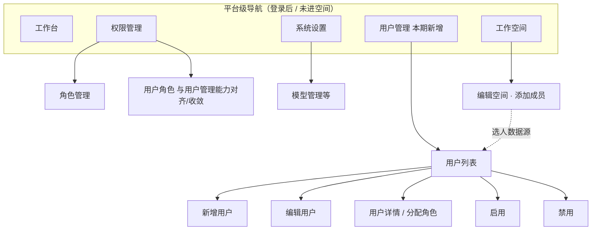
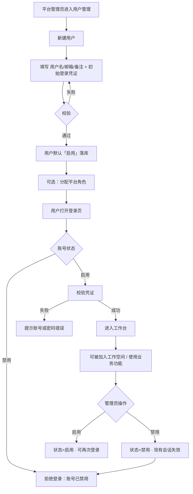
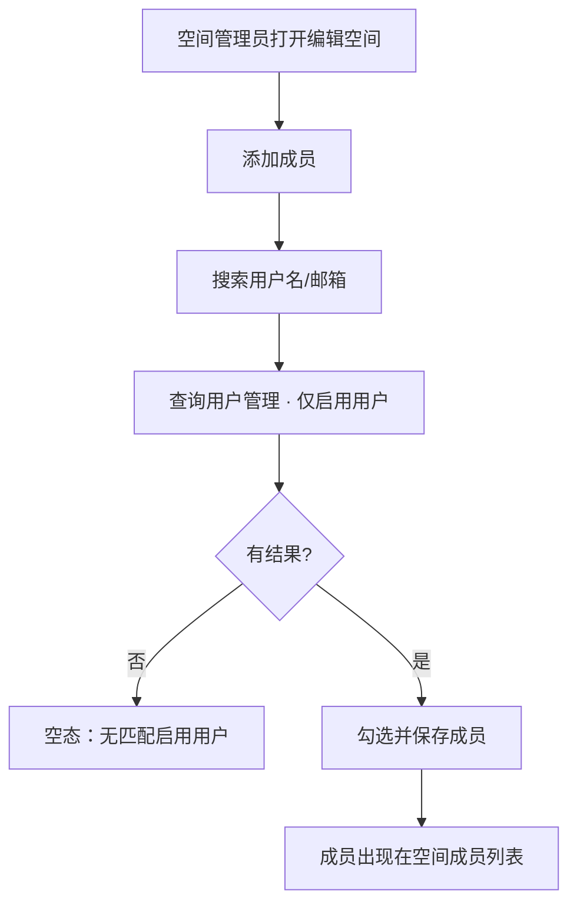
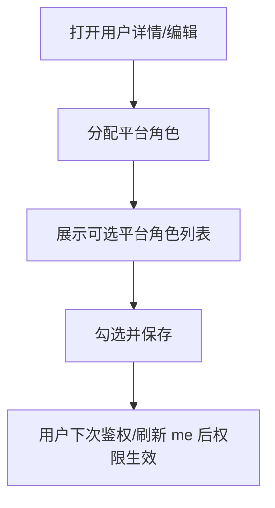
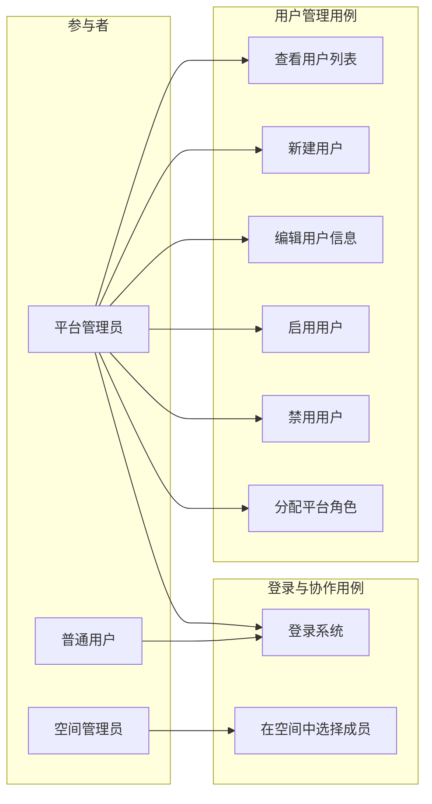

# AgentOps — 用户管理 PRD

> 文档日期：2026-08-07 | 版本：v1.0  
> 产品：AgentOps 管理后台  
> 下游输入：供 **design-technical-solution** 做技术方案设计与落码拆解  
> 关联文档：[权限管理 PRD](../../agent-be/doc/产品方案/2026-06-15-权限管理-PRD.md) · [工作空间管理 PRD](../../agent-be/doc/产品方案/2026-06-03-工作空间管理-PRD.md)

---

## 1. 产品/需求背景

### 1.1 为什么要做

当前平台身份来源不完整：

- SSO / GCAC 已拆除，本地联调依赖 `disable-auth` + 默认用户注入，**没有可运营的用户主体**；
- 工作空间「添加成员」、权限「用户角色」等场景缺少统一的用户主数据，选人体验碎片化、无法保证「选到的人一定能登录」；
- 系统级已有「权限管理」「系统设置」导航，但缺少与之**平级的用户治理入口**，平台管理员无法在控制台维护账号生命周期。

### 1.2 解决什么问题

- 建立平台级 **用户主数据（User Directory）**：用户名、邮箱、备注、启停状态；
- 支持对用户 **新增 / 修改 / 启用 / 禁用**；
- **启用中的真实用户可登录系统**；
- 可在用户管理中为用户 **分配平台角色**；
- 工作空间内选人、以及其他「选用户」场景，**数据源统一来自用户管理中的启用用户**。

### 1.3 面向用户

| 角色 | 描述 |
| --- | --- |
| **平台管理员**（`platform_admin`） | 维护用户、启停账号、分配平台角色 |
| **具备用户管理权限的运维人员** | 同平台管理员子集能力（按权限码控制） |
| **普通业务用户** | 使用账号登录；可被加入工作空间、被分配空间角色 |

---

## 2. 目标与范围

### 2.1 目标

| 目标 | 度量 |
| --- | --- |
| 用户主数据可运营 | 平台管理员可完成用户新增 / 编辑 / 启用 / 禁用闭环 |
| 真实登录可用 | 启用用户可用账号凭证登录；禁用用户无法登录 |
| 角色可分配 | 可在用户管理中为用户绑定/调整平台角色 |
| 选人同源 | 工作空间添加成员等选人控件仅展示「启用」用户，且来自用户管理 |

### 2.2 范围

**本期做（MVP）**

- 一级导航「用户管理」，与「权限管理」「系统设置」平级（HomeLayout 平台级菜单）
- 用户列表、搜索/筛选、新增、编辑、启用、禁用
- 用户字段：用户名、邮箱、备注；状态（启用 / 禁用）
- 登录：启用用户可登录；禁用用户登录被拒绝
- 为用户分配平台角色（在用户详情 / 编辑流程中完成）
- 工作空间成员选择、以及其它平台级「选用户」入口，统一改为用户管理数据源（仅启用用户）

**本期不做**

- ❌ 用户自助注册 / 邀请链接注册
- ❌ 与外部 IdP / SSO / 部门树同步（可后续接入，本期以本地维护为准）
- ❌ 用户组 / 部门组织树
- ❌ 硬删除用户（以禁用代替；历史审计与归属保留）
- ❌ 空间内自定义角色的新建（仍归属权限/空间管理）；本期只保证「选人」与「平台角色分配」
- ❌ 批量导入导出（CSV）— 可列为 P2
- ❌ 操作审计独立 UI（沿用现有审计基础设施即可落事件）

---

## 3. 系统线框图（必选）

### 3.1 信息架构（与现有平级）



### 3.2 页面骨架

```
┌─ AgentOps ───────────────────────────────────────────┐
│ Logo  AgentOps          [工作台][工作空间][用户管理]   │
│                         [权限管理][系统设置]    头像 ▾ │
├────────────┬──────────────────────────────────────────┤
│ 用户管理   │  用户列表                                │
│            │  [搜索用户名/邮箱] [状态▾] [+ 新建用户]   │
│            │  ┌────────────────────────────────────┐  │
│            │  │ 用户名 │ 邮箱 │ 备注 │ 状态 │ 操作 │  │
│            │  │ alice  │ a@.. │ ... │ 启用 │ 编辑…│  │
│            │  └────────────────────────────────────┘  │
│            │                                          │
│            │  抽屉/弹窗：新建 · 编辑 · 分配角色         │
└────────────┴──────────────────────────────────────────┘
```

**说明**

| 模块/页面 | 职责 | 对应功能需求 |
| --- | --- | --- |
| 用户列表 | 检索、筛选、启停入口 | F1 / F3 / F4 |
| 新建/编辑 | 维护用户名、邮箱、备注 | F2 |
| 分配角色 | 绑定平台角色 | F5 |
| 登录页 | 真实用户凭证登录 | F6 |
| 工作空间选人 | 成员来自启用用户 | F7 |

---

## 4. 业务流程图（必选）

### 4.1 用户生命周期（新增 → 登录 → 启停）



### 4.2 工作空间选人（同源）



### 4.3 分配平台角色



---

## 5. 用例图（必选）



**图例说明**

| 参与者 | 主要用例 |
| --- | --- |
| 平台管理员 | 用户 CRUD 生命周期 + 分配平台角色 + 自身可登录 |
| 普通用户 | 使用启用账号登录；不可管理他人账号 |
| 空间管理员 | 从用户管理启用用户中选择空间成员 |

---

## 6. 用户与场景

### 6.1 用户故事

1. **作为平台管理员**，我希望在「用户管理」中新建员工账号（用户名、邮箱、备注），以便对方能登录 AgentOps。  
2. **作为平台管理员**，我希望能禁用离职或异常账号，以便其无法继续登录。  
3. **作为平台管理员**，我希望在用户详情中分配平台角色，以便控制其平台级能力。  
4. **作为空间管理员**，我希望添加成员时只能选到平台已维护且启用的用户，以便协作对象一定可登录。  
5. **作为业务用户**，我希望用分配给我的账号登录系统，以便进入工作台与空间。

### 6.2 典型场景

| 场景 | 路径 |
| --- | --- |
| 入职开通 | 管理员新建用户 → 告知初始凭证 → 用户登录 → 可选分配角色 → 加入空间 |
| 离职回收 | 管理员禁用用户 → 用户无法登录 → 空间成员列表中可标记/过滤（展示策略见 F7） |
| 权限调整 | 管理员修改用户平台角色 → 用户刷新后菜单/接口权限变化 |

---

## 7. 功能需求

### 7.1 功能清单

| 编号 | 功能点 | 简要说明 | 优先级 |
| --- | --- | --- | --- |
| F1 | 用户列表 | 分页列表；支持按用户名/邮箱关键字搜索；按状态（全部/启用/禁用）筛选 | P0 |
| F2 | 新建 / 编辑用户 | 字段：用户名、邮箱、备注；新建时设置初始登录凭证；用户名全局唯一 | P0 |
| F3 | 启用用户 | 将禁用用户恢复为启用；可再次登录 | P0 |
| F4 | 禁用用户 | 启用用户改为禁用；立即不可登录；已登录会话失效 | P0 |
| F5 | 分配平台角色 | 在用户管理内为用户绑定/变更平台角色（与权限体系一致） | P0 |
| F6 | 真实用户登录 | 登录页支持账号+凭证登录；仅启用用户可登录；登录后进入既有工作台 | P0 |
| F7 | 选人同源 | 工作空间添加成员等选人组件，数据源=用户管理中的**启用**用户 | P0 |
| F8 | 权限码与菜单 | 「用户管理」菜单对具备权限者可见；与权限管理、系统设置平级 | P0 |
| F9 | 与「用户角色」入口收敛 | 明确两入口关系：避免冲突；推荐用户管理为主入口，原「用户角色」只读或跳转 | P1 |
| F10 | 批量导入用户 | CSV 批量创建 | P2 |

### 7.2 字段定义

| 字段 | 必填 | 说明 |
| --- | --- | --- |
| 用户名 | 是 | 登录标识；全局唯一；创建后是否允许改名由技术方案确认（建议创建后不可改，降低归属混乱） |
| 邮箱 | 是 | 格式校验；建议全局唯一 |
| 备注 | 否 | 自由文本，便于运维备注部门/用途 |
| 状态 | 系统维护 | 启用 / 禁用；新建默认启用 |
| 登录凭证 | 新建必填 | 本期本地登录所需（如初始密码）；修改密码策略可简化为「管理员重置」 |
| 平台角色 | 否 | 可多角色或单角色：与现有权限模型对齐（见权限管理 PRD） |

### 7.3 业务规则

1. **唯一性**：用户名不可重复；邮箱不可重复。  
2. **禁用不删除**：禁用后保留历史创建人/成员关系展示所需的最小信息；不物理删除。  
3. **禁用即拒登**：禁用用户登录失败；已有会话在下次请求或主动踢下线时失效。  
4. **选人范围**：空间选人仅返回 `状态=启用` 的用户。  
5. **自我保护**：不允许禁用「当前唯一的 platform_admin」或当前操作者把自己禁用到无人可管（至少保留一名平台管理员可用）。  
6. **权限**：用户管理操作需要独立权限码（建议如 `user_manage:read/create/update/enable/disable/assign_role`），仅平台级角色可授予。

### 7.4 导航与权限（平级要求）

HomeLayout 平台级菜单顺序建议：

1. 工作台  
2. 工作空间  
3. **用户管理**（本期）  
4. 权限管理  
5. 系统设置  

三者「用户管理 / 权限管理 / 系统设置」为**同级分组**，不互相嵌套。

---

## 8. 原型图 / 界面说明（必选）

### 8.1 用户列表页

```
┌─ 用户管理 / 用户列表 ─────────────────────────────┐
│ 关键字 [____________]  状态 [全部 ▾]   [+ 新建用户] │
│                                                     │
│ 用户名     邮箱              备注      状态   操作   │
│ ------------------------------------------------- │
│ alice.zhang a@garry.com     平台管理员  启用  编辑 │
│                                         分配角色   │
│                                         禁用       │
│ bob.li      b@garry.com     业务同学    禁用  编辑 │
│                                         启用       │
│                                                     │
│ 共 2 条                              < 1 >          │
└─────────────────────────────────────────────────────┘
```

- 操作列按状态切换「启用/禁用」文案；危险操作二次确认。  
- 空态：尚无用户时引导「新建用户」。

### 8.2 新建 / 编辑抽屉

```
┌─ 新建用户 ─────────────────────┐
│ 用户名 *  [________________]   │
│ 邮箱   *  [________________]   │
│ 备注      [________________]   │
│ 初始密码 * [________________]   │  （仅新建；编辑可提供「重置密码」）
│                                │
│          [取消]  [确定]         │
└────────────────────────────────┘
```

### 8.3 分配角色

```
┌─ 分配平台角色 · alice.zhang ───┐
│ ☑ platform_admin               │
│ ☐ （其它平台角色，若有）         │
│                                │
│          [取消]  [保存]         │
└────────────────────────────────┘
```

### 8.4 登录页（对接真实用户）

在现有登录页基础上：

- 增加「用户名 / 密码」表单（替代仅「进入系统」的本地旁路，或与旁路并存：生产关旁路）；  
- 错误态：凭证错误、账号已禁用，文案可区分；  
- 成功：进入 `/workbench`，`/api/v1/auth/me` 返回该用户身份与权限。

### 8.5 工作空间选人

```
┌─ 添加成员 ─────────────────────┐
│ 搜索 [alice________]           │
│ ○ alice.zhang  a@garry.com     │  ← 仅启用用户
│ （不展示已禁用用户）             │
│              [取消] [添加]      │
└────────────────────────────────┘
```

### 8.6 关键状态

| 状态 | 表现 |
| --- | --- |
| 列表空态 | 插画/文案 +「新建用户」 |
| 搜索无结果 | 「未找到匹配用户」 |
| 禁用确认 | Modal：确认后该用户将无法登录 |
| 表单校验失败 | 字段级错误（唯一性、邮箱格式） |
| 无权限 | 菜单不展示；直链进入 403 |

---

## 9. 非功能需求

| 类别 | 要求 |
| --- | --- |
| 安全 | 登录凭证不可明文落库；传输 HTTPS（生产）；禁用立即生效 |
| 权限 | 用户管理接口与菜单均受 RBAC 控制；审计记录谁创建/启停/改角色 |
| 性能 | 用户列表默认分页，首屏 P95 &lt; 1s（千级用户内） |
| 兼容 | 仅 Web 管理端；与现有 HomeLayout / 工作空间编辑交互一致 |
| 可用性 | 关键操作有确认与明确错误提示 |

---

## 10. 与现有功能的关系

| 关系 | 说明 | 兼容 / 迁移要点 |
| --- | --- | --- |
| **全新模块** | 「用户管理」为平台级新能力 | 新增菜单、权限码、用户主数据 |
| **改造登录** | 从 disable-auth / 无签发登录 → 真实用户登录 | 本地开发可保留 disable-auth 开关；生产关闭 |
| **改造选人** | 工作空间成员搜索不再依赖已下线通讯录/空实现 | 统一查用户管理启用用户 |
| **衔接权限管理** | 平台角色模型复用现有 RBAC | 用户 ↔ 平台角色绑定落在用户管理；与「用户角色」页收敛 |
| **工作空间** | 成员仍是用户标识集合 | 标识与用户管理用户名/用户 ID 对齐 |

---

## 11. 验收标准

1. 平台管理员可在「用户管理」完成：新建、编辑、启用、禁用，字段含用户名、邮箱、备注。  
2. 启用用户可用凭证登录；禁用用户登录失败，且提示可理解。  
3. 可为用户分配平台角色，分配后 `/auth/me` 权限与菜单符合预期。  
4. 工作空间添加成员搜索结果**仅来自启用用户**，且与用户管理数据一致。  
5. 「用户管理」菜单与「权限管理」「系统设置」平级展示，无权限用户不可见。  
6. 不允许出现「禁用后仍能调用需登录业务接口」的漏洞（抽检）。  
7. 用户名/邮箱唯一性冲突有明确前端与接口错误提示。

---

## 附：供技术方案设计的边界提示（非实现细节）

以下供 **design-technical-solution** 开场 10 问时快速对齐，**不约束具体技术选型**：

1. 用户主键用用户名还是内部 UUID？空间成员存哪个？  
2. 平台角色是单选还是多选？与现有 `user_workspace_role` / platform 绑定表如何复用？  
3. 初始密码与重置密码的产品策略（强制改密？）  
4. 禁用后空间成员列表是否仍展示该成员（只读灰显）还是自动移除？  
5. 现有 `platform-admins` 配置启动灌入与用户管理的迁移关系？  
6. 登录签发 JWT 的产品会话时长是否沿用现有 Cookie 策略？  

---

## 附：关联文档

- [权限管理 PRD](../../agent-be/doc/产品方案/2026-06-15-权限管理-PRD.md)  
- [工作空间管理 PRD](../../agent-be/doc/产品方案/2026-06-03-工作空间管理-PRD.md)  
- 本仓库前端导航：`agent-fe/src/layouts/HomeLayout.tsx`
