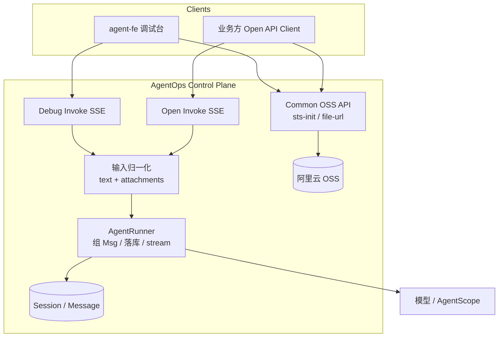
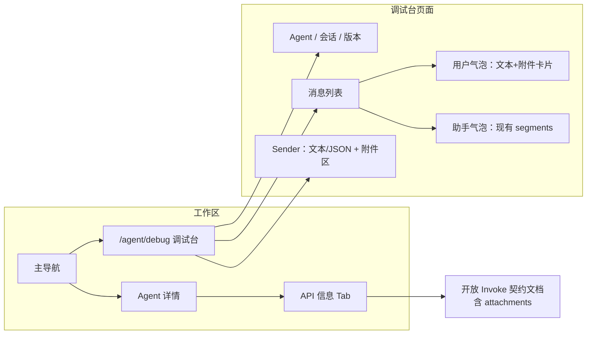
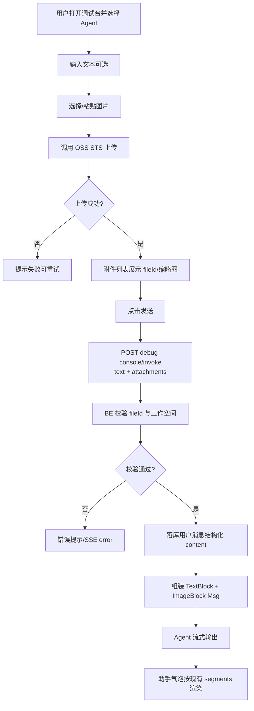
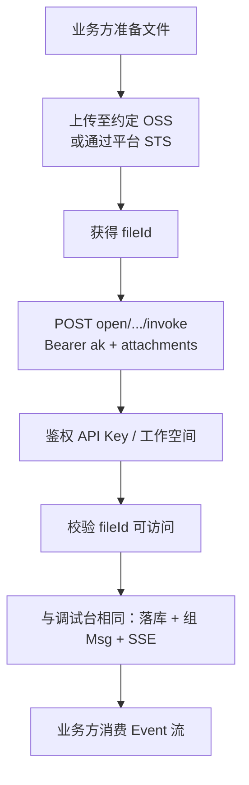
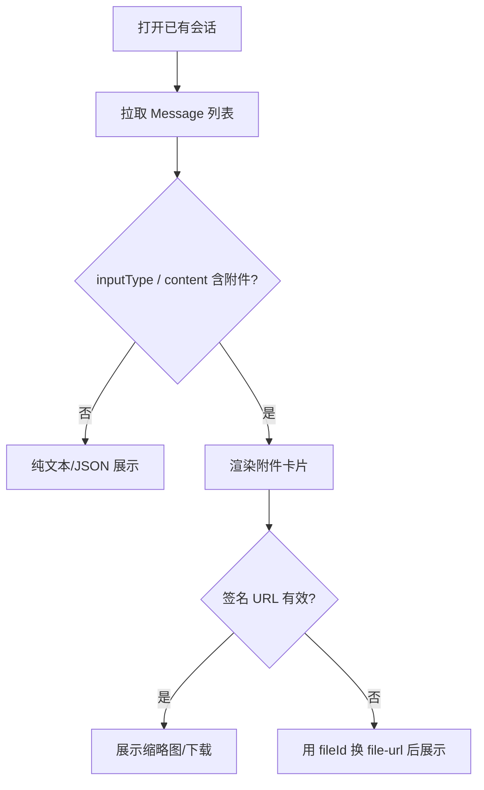
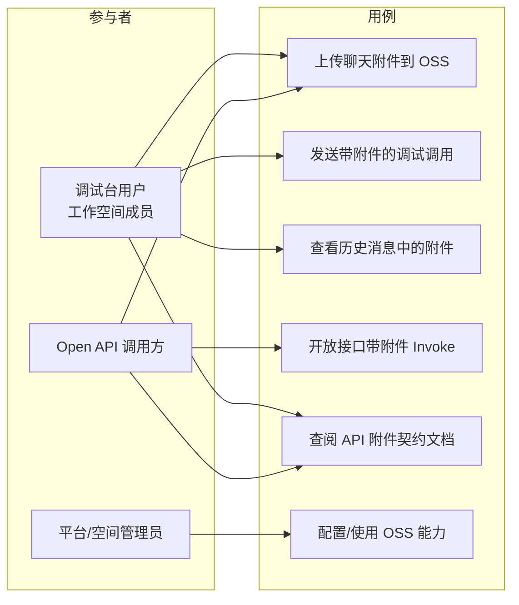

# Agent 多模态与附件能力 产品需求文档（PRD）

> 文档日期：2026-08-16  
> 产品：AgentOps（Control Plane：`agent-be` + `agent-fe`）  
> 状态：草案（方向已确认：先上传再引用 + 统一 Content Parts；开放接口与调试台同源）  
> 下游：可作为 `design-technical-solution` 输入

---

## 1. 产品/需求背景

### 为什么要做

当前 Agent 调用（开放 Event SSE 与调试台）在端到端上**仅支持纯文本**（及调试台 JSON 文本编辑）。`inputType` 虽有「预留多模态」注释，但未真正参与组装 AgentScope `Msg`；用户也无法在对话中上传图片/文件。业务侧与内部调试人员无法验证 Vision 模型，也无法把单据、截图、附件作为一轮对话的输入。

### 解决什么问题

1. **用户侧输入**：支持图片（及后续通用文件）作为对话附件，与文本一起发给 Agent。  
2. **契约统一**：开放接口与调试台使用同一套「文本 + attachments」模型，避免双轨实现。  
3. **可回放**：历史消息能展示用户曾上传的附件（缩略图/文件卡片），签名 URL 可刷新。  
4. **为后续「Agent 产出文件再展示」打底**：复用 OSS 与文件卡片组件（本 PRD 以**用户→Agent** 为主；Agent→用户为关联能力，见范围说明）。

### 面向用户

| 角色 | 诉求 |
|------|------|
| 业务集成方（Open API） | 用 API Key 调用时携带附件引用，完成多模态问答 |
| 内部开发/运营（调试台） | 在 `/agent/debug` 上传/粘贴图片，直接验证 Agent 行为 |
| 工作空间开发者 | 在 API 文档中看到清晰契约与限制 |

---

## 2. 目标与范围

### 目标

1. 一轮对话支持「文本 + 若干附件」输入，后端组装为 AgentScope 多 ContentBlock `Msg` 并流式返回（现有 SSE 协议主体不变）。  
2. 开放接口与调试台**共用同一输入契约**；调试台提供上传与气泡展示。  
3. 用户消息可结构化落库并在历史中回放附件。  
4. 明确能力边界：MVP 聚焦**图片多模态**；通用文档类附件的深度解析可分期。

### 范围（本次包含）

| 模块 | 内容 |
|------|------|
| 附件上传 | 复用现有 OSS STS / `file-url`；聊天场景接入 |
| 调用契约 | `text` + `attachments[]`；兼容纯文本旧调用 |
| 调试台 | 选文件/上传、预览、发送、用户气泡展示 |
| 开放接口 | Invoke 扩展字段 + API 文档（`ApiInfoTab`） |
| 后端组装 | 统一归一化 → 校验 fileId → 组 Msg → 落库 |
| 历史回放 | 会话消息按结构化 content / attachments 展示 |

### 不做什么（明确排除）

- ❌ 将大文件 Base64 直接塞进 invoke JSON / SSE（除极小调试例外，不作为正式契约）  
- ❌ MVP 内 `multipart` 一包上传到 invoke（可作为后续可选增强）  
- ❌ 自研向量库/知识库（与本需求无关）  
- ❌ A2UI 通道内嵌附件的完整产品化（可后续对齐同一 attachments 模型）  
- ❌ 保证任意 PDF/Office 都能被模型「原生看懂」（通用文件走元数据展示 + 后续 Tool 解析，见分期）  
- ❌ Agent 生成文件后的完整下载中心（可复用文件卡片，但作为关联/后续项）  
- ❌ 评测集批量带图用例（后续）

### 分期建议（与实现优先级对齐）

| 阶段 | 内容 | 优先级 |
|------|------|--------|
| **M1** | 图片附件：上传 → invoke → Vision Msg → 落库 → 调试台/Open/历史 | P0 |
| **M2** | 通用文件附件展示 + 可选抽文本/Tool 读取 | P1 |
| **M3** | 粘贴/拖拽增强、助手侧产出文件卡片、A2UI 对齐 | P2 |

---

## 3. 系统线框图（必选）

### 3.1 系统结构（模块关系）



### 3.2 前端信息架构（调试相关）



### 3.3 说明

- **OSS Common API**：已有资产上传能力，本需求扩展「聊天附件」使用场景与前缀/权限约定。  
- **归一化层**：保证 Debug / Open 进入 Runner 前结构一致。  
- **消息列表**：用户侧新增附件展示；助手侧 M1 不强制改协议。

---

## 4. 业务流程图（必选）

### 4.1 主流程：调试台发送带图消息



### 4.2 主流程：开放接口带附件调用



### 4.3 历史回放



### 4.4 关键异常分支

| 分支 | 处理 |
|------|------|
| 上传失败 / 超限 | 前端拦截 + 提示；不发起 invoke |
| fileId 不存在或越权 | BE 拒绝本轮；明确错误码/文案 |
| Agent 绑定模型不支持 Vision | M1：仍发送但文档提示风险；可选 P1 做预检警告 |
| 仅附件无文本 | 允许（例如「描述这张图」由系统默认文案或空 text + 图）——产品默认：**允许空 text，但至少 1 个附件或非空 text** |

---

## 5. 用例图（必选）



### 说明

- **UC1** 可被 UC2/UC4 包含（先上传再引用）。  
- 权限：调试台走 JWT + `X-Workspace-Num`；Open 走 API Key；附件访问必须绑定租户/前缀，防止 fileId 枚举越权。

---

## 6. 用户与场景

### 用户故事

1. **作为**调试人员，**我希望**在调试台上传一张业务截图并提问，**以便**验证 Vision Agent 是否理解界面内容。  
2. **作为**业务后端，**我希望**先把用户上传的图片存到 OSS，再在 Open Invoke 里带上 `fileId`，**以便**在不改 SSE 协议主体的情况下做多模态客服。  
3. **作为**产品同学，**我希望**回看历史会话时仍能看到当时的图，**以便**排查「当时到底给模型看了什么」。  
4. **作为**集成方，**我希望**API 文档写清附件字段与限制，**以便**一次对接成功。

### 典型场景

| 场景 | 输入 | 期望 |
|------|------|------|
| 看图说话 | 文本 + 1～N 张图 | 模型基于图文回答；流式文本照常 |
| 纯图 | 仅图片 | 可发送；模型描述/回答 |
| 兼容旧调用 | 仅 `input` 字符串 | 行为与现网一致 |
| 超大图 | 超过大小上限 | 上传阶段拒绝 |

---

## 7. 功能需求

### 7.1 功能点一览

| 序号 | 功能点 | 简要说明 | 优先级 |
|------|--------|----------|--------|
| F1 | 统一附件数据模型 | `attachments[]`：fileId、name、mimeType、size、kind（可推导） | P0 |
| F2 | 兼容纯文本 invoke | 无 attachments 时行为不变 | P0 |
| F3 | OSS 聊天上传 | 调试台使用现有 STS；约定 object 前缀（如 chat/） | P0 |
| F4 | 调试台 Sender 附件区 | 选择图片、上传进度、可删除、发送前预览 | P0 |
| F5 | 调试台用户气泡附件展示 | 图片缩略图；点击预览/打开 | P0 |
| F6 | Debug Invoke 传 attachments | 请求体扩展；与 BE 契约一致 | P0 |
| F7 | Open Invoke 传 attachments | `OpenInvokeParam` 扩展；鉴权后校验 fileId | P0 |
| F8 | 输入归一化与 Msg 组装 | text + ImageBlock(s)；统一入口 | P0 |
| F9 | 用户消息结构化落库 | 可回放；存 fileId 而非长期公网 URL | P0 |
| F10 | 历史换签展示 | URL 过期时用 fileId 换临时 URL | P0 |
| F11 | API 文档更新 | ApiInfoTab：字段、示例、限制、错误说明 | P0 |
| F12 | 类型/大小白名单 | 如 png/jpeg/webp/gif；单文件与单轮数量上限 | P0 |
| F13 | 粘贴剪贴板图片 | Sender 支持 paste | P1 |
| F14 | 拖拽上传 | Sender 拖拽 | P1 |
| F15 | 通用文件 kind=file | 卡片展示；模型侧策略（元数据/抽文本/Tool） | P1 |
| F16 | 模型 Vision 能力提示 | 绑定模型不支持时警告 | P1 |
| F17 | 助手产出文件卡片 | Tool 结构化 file 结果展示 | P2 |
| F18 | multipart invoke | 可选直传 | P2 |

### 7.2 契约草案（产品层，非实现细节）

**附件对象（逻辑字段）**

| 字段 | 必填 | 说明 |
|------|------|------|
| fileId | 是 | OSS 对象标识（与现有 file-url 体系一致） |
| name | 是 | 原始文件名，用于展示 |
| mimeType | 是 | 如 `image/png` |
| size | 是 | 字节数，用于校验与展示 |
| kind | 否 | `image` / `file` / `audio` / `video`；缺省由 mime 推导 |

**Invoke（概念）**

- 保留现有：`agentNum`、`sessionNum`、`input`（文本）、`context` 等  
- 新增：`attachments: Attachment[]`（可空）  
- `inputType`：无附件时 `text`/`json`；有图片附件时可标 `multimodal` 或由服务端推断  

**校验规则（P0）**

- 至少满足：`input` 非空 **或** `attachments` 非空  
- 单文件大小、单轮附件数量、mime 白名单  
- fileId 必须属于当前调用身份可访问范围  

### 7.3 与助手输出的关系（边界）

- M1 **不要求**改造助手 SSE 事件类型。  
- 若未来 Tool 上传 OSS 并返回结构化 `{ type: "file", ... }`，调试台用与用户附件**同一套文件卡片组件**展示，但数据来源字段不同（tool_result vs user attachments）。

---

## 8. 原型图 / 界面说明（必选）

### 8.1 调试台 Sender（正常态）

```text
┌─────────────────────────────────────────────────────────┐
│  [文本 | JSON]                    [📎 附件]  [发送]     │
│  ┌─────────────────────────────────────────────────┐   │
│  │ 请描述图中的异常堆栈…                            │   │
│  └─────────────────────────────────────────────────┘   │
│  附件：                                                 │
│  ┌──────────┐ ┌──────────┐                              │
│  │ 🖼 preview│ │ 🖼 …     │  ×可删   上传中…/失败重试   │
│  │ a.png    │ │ b.png    │                              │
│  └──────────┘ └──────────┘                              │
└─────────────────────────────────────────────────────────┘
```

**说明**：JSON 模式下附件区仍可用（附件不进入 Monaco JSON 正文）；文案提示「附件与 JSON 正文相互独立」。

### 8.2 用户消息气泡（含附件）

```text
┌─ me ──────────────────────────────┐
│ 看看这两张图的差异                 │
│ ┌─────┐ ┌─────┐                    │
│ │ img │ │ img │  ← 缩略图可点预览  │
│ └─────┘ └─────┘                    │
└────────────────────────────────────┘
```

### 8.3 关键状态

| 状态 | 表现 |
|------|------|
| 上传中 | 附件卡片 loading，发送按钮禁用或允许发已成功项（建议：全部成功才可发） |
| 上传失败 | 卡片错误态 + 重试/移除 |
| 超限 | Toast：类型或大小不符 |
| 历史 URL 过期 | 自动换签；失败显示「无法预览」+ 重试 |
| 空会话 | 维持现有空态；无附件特殊要求 |

### 8.4 API 信息 Tab

在现有「Invoke（SSE）」文档块中增加：

- `attachments` 字段表  
- 请求示例（text + 一张图）  
- 限制说明与错误示例  

---

## 9. 非功能需求

| 类别 | 要求 |
|------|------|
| 性能 | 上传走直传 OSS；invoke 仅传元数据；单轮附件数量与大小设上限（具体数值技术方案阶段定，PRD 要求「可配置/可文档化」） |
| 安全 | fileId 鉴权防越权；日志禁止打印长期可用的签名 URL 与密钥；Open 与 Debug 均校验租户 |
| 隐私 | 附件随会话权限；删除会话/消息时的 OSS 清理策略可 P1（M1 至少文档说明「是否级联删对象」） |
| 兼容 | 旧纯文本客户端零改动可继续调用 |
| 可用性 | 明确模型不支持 Vision 时的产品提示（P1） |
| 审计 | 若现有审计覆盖 invoke，附件数量/mime 可作为扩展信息（P1） |
| 多端 | 本需求仅 Web 管理端 + Open API；无移动端 |

---

## 10. 与现有功能的关系

| 现有能力 | 关系 |
|----------|------|
| Debug / Open Invoke SSE | **扩展**请求体与用户消息落库；SSE Event 主体兼容 |
| `AgentRunnerService` | **改造** Msg 组装与 `appendUserMessage` 内容形态 |
| OSS STS / file-url | **复用**；扩展聊天场景与权限前缀 |
| `InputType`（TEXT/JSON） | **扩展**或增加 MULTIMODAL；逻辑以 attachments 为准 |
| `ApiInfoTab` | **文档更新** |
| Token 用量展示 | 无冲突；多模态可能增加 token，沿用现有 usage 回传 |
| A2UI Open API | 本期不强制；建议后续复用同一 attachments 归一化 |
| 知识库 / RAG | 无关；附件不是知识库文档入库 |

**兼容要点**：仅传 `input` 字符串的调用必须保持现网行为；新字段缺省等价于无附件。

---

## 11. 验收标准

### M1（P0）完成标准

1. 调试台可上传 ≥1 张白名单图片，发送后助手能针对图片内容回答（在 Vision 模型下人工验收）。  
2. 同一会话刷新/重开后，历史用户消息仍展示对应缩略图（换签可用）。  
3. Open Invoke 带合法 `attachments` 与纯文本调用均可成功；非法 fileId 被拒绝且错误可理解。  
4. 不传 `attachments` 的旧请求与改前行为一致（回归）。  
5. `ApiInfoTab` 已包含附件字段、示例与限制说明。  
6. 超限类型/大小在上传或发送前被拦截。

### 成功指标（定性）

- 内部可用调试台完成「截图 → 提问 → 得到基于图的回答」闭环。  
- 至少一条业务/示例 Open 调用文档可被外部按文档复现。

---

## 12. 待技术方案澄清清单（供 design-technical-solution）

以下不在 PRD 拍死，留给技术方案「设计前问答」：

1. ImageBlock 使用 URL 还是字节；与当前模型/AgentScope 2.x 的最佳路径。  
2. `content` JSON 内嵌 vs 旁路附件表。  
3. OSS key 命名与生命周期（是否按 session/message 分区）。  
4. 具体大小/数量上限默认值。  
5. 执行面若拆至 sphere，attachments 如何下发。  
6. JSON 模式与附件同时存在时的产品文案与校验细节。  

---

## 修订记录

| 日期 | 说明 |
|------|------|
| 2026-08-16 | 初稿：确认「先上传再引用 + 统一 parts」；覆盖 Open + 调试台；M1 聚焦图片 |
