# AgentOps — 用户管理技术方案

> 文档日期：2026-08-07 | 版本：v1.0  
> 输入 PRD：[doc/产品方案/2026-08-07_用户管理-PRD.md](../产品方案/2026-08-07_用户管理-PRD.md)  
> 代码分支：`feature-20260807-user-management`  
> 下游落码：按层调用 impl-facade / client / domain / infra / application / adapter

---

## 0. 设计共识（来自设计前问答）

| # | 结论 |
|---|---|
| 范围 | 用户主数据 + 登录 + 平台角色分配 + 空间选人同源，**一次性上线** |
| 领域 | 新建独立领域 **`user`**（不并入 auth） |
| 业务主键 | **`num`（`USR-` + 12 hex）**；登录标识为 **username** |
| 用户名 | **允许修改**，全局唯一 |
| 平台角色 | **可多选**；复用 `user_workspace_role`（`workspace_num=SYSTEM`） |
| 入口 | 「用户管理」与「权限管理→用户角色」**两入口保留** |
| 登录 | 用户名+密码；管理员设置/重置初始密码；**BCrypt** 哈希 |
| 禁用后空间成员 | **仍展示、灰显**；不可再被新选入 |
| platform-admins | 启动时确保配置中的 username 存在为启用用户并绑定 `RL-PLATFORM-ADMIN`；本地保留 `disable-auth` 旁路 |
| 部署 | **部署架构不变**，无新增部署组件 |
| 前端 | 用户管理页 + 登录页 + 空间选人改造；无其它强制页面 |

身份贯穿约定：`user_workspace_role.user_id`、`workspace.admin_list/member_list`、JWT `UserClaims.account/uuid` **统一存 `User.num`**；展示名通过 `User.username` 解析。

---

## 1. 目标与范围

### 1.1 目标

1. 落地平台用户主数据与生命周期（新建/编辑/启用/禁用）。  
2. 启用用户可用户名+密码登录，签发既有 JWT Cookie。  
3. 用户管理内分配平台角色（复用现有绑定模型）。  
4. 工作空间选人改为查询启用用户，替换已 stub 的通讯录搜索。

### 1.2 范围 / 不在范围

**在范围**：BE 六层 `user` 域 + 登录命令 + 权限种子 + FE 菜单/页面/登录/MemberSelect；Flyway V35。  

**不在范围**：SSO、自助注册、用户组、硬删除、CSV 批量导入、部署架构变更。

---

## 2. 架构设计

### 2.1 应用架构

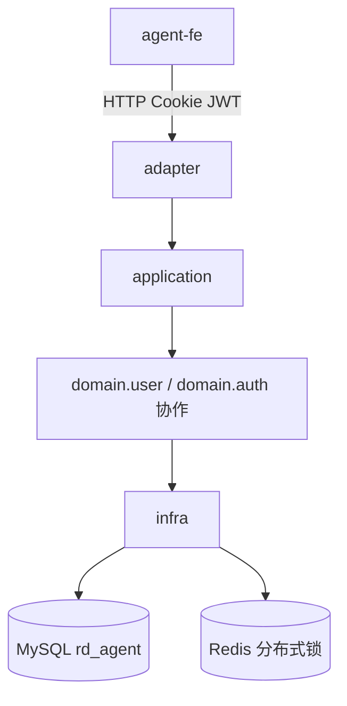

**命令 / 查询划分**

| 类型 | 入口 | Service |
|---|---|---|
| 命令 | `UserCommandController`、`AuthLoginController` | `UserCommandService`、`AuthLoginCommandService` |
| 查询 | `UserQueryController`；改造 `CommonController` 员工搜索 | `UserQueryService` |

**代码结构**

| 层 | 领域 | 包 | 职责 |
|---|---|---|---|
| facade | auth/token | `ink.garry.rd.agent.ws.facade.auth.token` | 复用 `LocalTokenIssuer` / `UserClaims`；无新增契约 |
| client | user | `ink.garry.rd.agent.ws.client.user.*` | 用户 Param/VO/常量/错误码 |
| client | auth | `ink.garry.rd.agent.ws.client.auth.*` | 登录 Param/VO |
| domain | user | `ink.garry.rd.agent.ws.domain.user.*` | User 聚合、Factory、Repository、Gateway、事件 |
| infra | user | `ink.garry.rd.agent.ws.infra.user.*` | Entity/Mapper/RepositoryImpl/FactoryImpl/GatewayImpl |
| application | user | `ink.garry.rd.agent.ws.application.user.command/query` | UserCommandService / UserQueryService |
| application | auth | `ink.garry.rd.agent.ws.application.auth.command` | AuthLoginCommandService；复用 AuthzCommandService 绑角色 |
| adapter | user | `ink.garry.rd.agent.ws.adapter.user` | UserCommand/QueryController |
| adapter | auth | `ink.garry.rd.agent.ws.adapter.auth` | AuthLoginController；MeController 补 username |
| adapter | security | `ink.garry.rd.agent.ws.adapter.security` | PUBLIC 放行 `/api/v1/auth/login` |
| adapter | common | `ink.garry.rd.agent.ws.adapter.common` | 员工搜索改调 UserQueryService |

### 2.2 部署架构

**部署架构不变，无新增应用/前端部署实例，复用现有部署架构。**

---

## 3. Facade 层设计

**本次无 Facade 层变更。**

复用既有：

- `LocalTokenIssuer#issue/parse`
- `UserClaims{uuid, account, roles}`：登录签发时 `uuid=account=User.num`，`roles` 填平台角色 num 列表（可空，鉴权仍以 DB 为准）
- `Result` / `BusinessException` / `BizCode`

---

## 4. 领域层设计

### 4.1 业务层级划分

| 层级 | 业务/子域 | 说明 |
|---|---|---|
| L1 平台身份 | user | 用户主数据与启停、密码哈希字段 |
| L1 平台鉴权 | auth（协作） | 登录签发 JWT；平台角色绑定复用 UserRoleBinding |
| L1 空间协作 | workspace / common（改造） | 成员 ID 语义改为 User.num；选人查启用用户 |

### 4.2 用户（user）

#### 4.2.1 领域模型

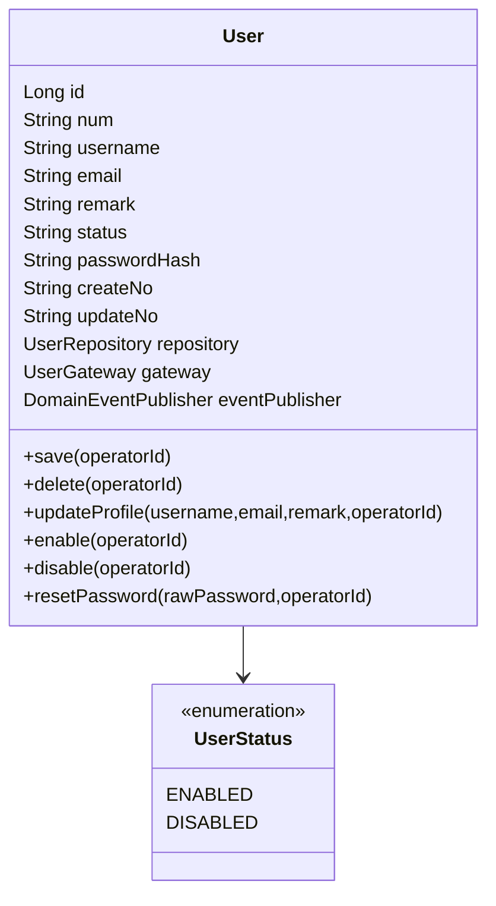

| 对象 | 类型 | 属性 | 关系 |
|---|---|---|---|
| User | 聚合根 | id, num, username, email, remark, status, passwordHash, createNo, updateNo；协作依赖 Repository/Gateway/EventPublisher | 无子实体 |
| UserStatus | 枚举值对象 | ENABLED / DISABLED | 被 User 引用 |

约束：领域模型**不含** `deleted` 软删标记（仅 infra Entity 有）。

#### 4.2.2 领域动作

| 聚合 | 领域动作 | 职责 | 前置 | 后置/规则 | 事件 |
|---|---|---|---|---|---|
| User | save(operatorId) | 持久化新建/更新 | 校验通过 | num 空则网关生成 | UserSaved |
| User | delete(operatorId) | 软删（产品默认不暴露） | 存在 | infra deleted=1 | UserDeleted |
| User | updateProfile(...) | 改用户名/邮箱/备注 | 启用或禁用均可改资料 | 唯一性由 Gateway 校验 | UserProfileUpdated |
| User | enable(operatorId) | 启用 | 当前 DISABLED | status=ENABLED | UserEnabled |
| User | disable(operatorId) | 禁用 | 当前 ENABLED；网关校验非最后一名 platform_admin | status=DISABLED | UserDisabled |
| User | resetPassword(raw, operatorId) | 管理员重置密码 | raw 非空 | passwordHash=Gateway.hash | UserPasswordReset |

**时序：save**

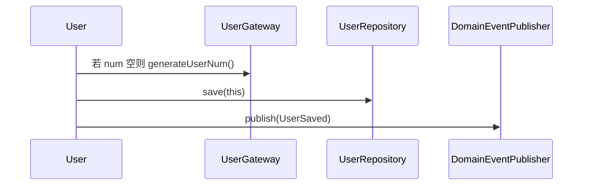

**时序：updateProfile**

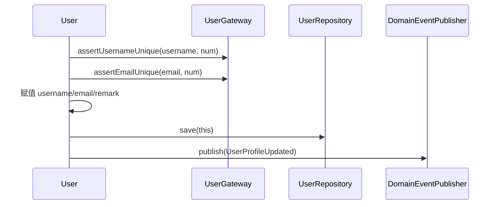

**时序：enable / disable**

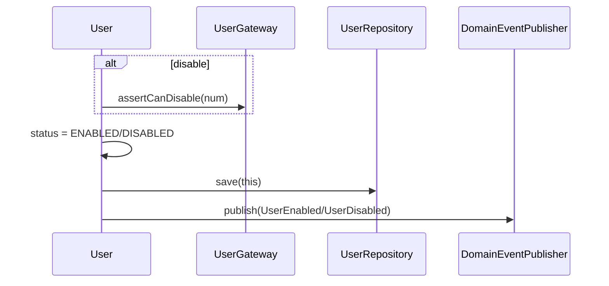

**时序：resetPassword**

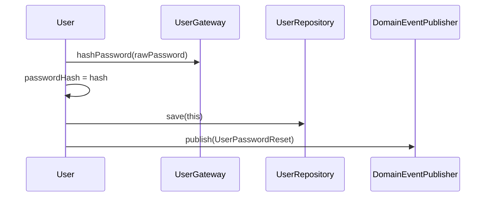

**时序：delete**

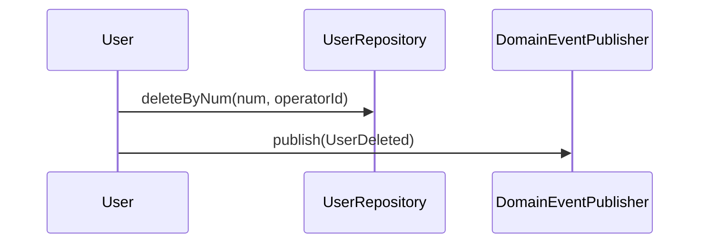

#### 4.2.3 领域规则

| 聚合 | 规则类型 | 描述 | 违反表达 |
|---|---|---|---|
| User | 唯一性 | username、email 全局唯一（未软删范围） | BizCode 冲突 |
| User | 格式 | email 基础格式；username 非空、长度≤64、`[A-Za-z0-9._-]+` | 参数错误 |
| User | 启停 | 不可禁用系统中最后一个持有 `RL-PLATFORM-ADMIN` 的启用用户 | 业务拒绝 |
| User | 登录 | 仅 ENABLED 可登录；密码 BCrypt 匹配 | 未授权/禁用 |
| User | 密码 | 原始密码不落库；仅存 passwordHash | — |

#### 4.2.4 领域工厂

| Factory | 方法 | 入参 | 返回 | 职责 | 依赖 |
|---|---|---|---|---|---|
| UserFactory | create | username, email, remark, rawPassword | User | 新建未落库；hash 经 Gateway；status=ENABLED；num 空 | Gateway, Repository, EventPublisher |
| UserFactory | createByNum | num | User | 仓储加载并装配协作依赖 | Repository, Gateway, EventPublisher |

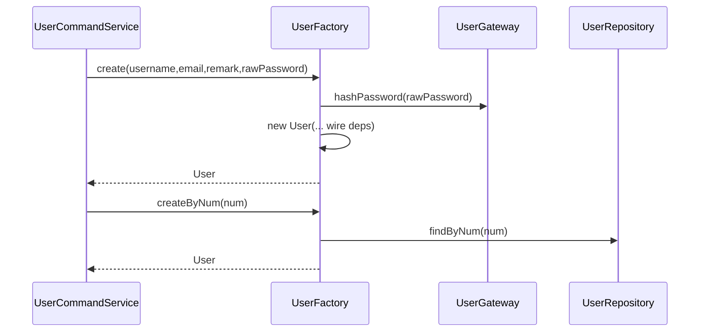

#### 4.2.5 领域网关

| Gateway | 方法 | 入参 | 返回 | 职责 | 外部依赖 | 失败策略 |
|---|---|---|---|---|---|---|
| UserGateway | generateUserNum | — | String | 生成 `USR-`+12hex | 本地随机 | 重试至唯一 |
| UserGateway | hashPassword | raw | String | BCrypt hash | spring-security-crypto | 抛错 |
| UserGateway | matchesPassword | raw, hash | boolean | BCrypt 校验 | 同上 | false |
| UserGateway | assertUsernameUnique | username, excludeNum | void | 唯一校验 | Mapper | BusinessException |
| UserGateway | assertEmailUnique | email, excludeNum | void | 唯一校验 | Mapper | BusinessException |
| UserGateway | assertCanDisable | userNum | void | 非最后一名启用 platform_admin | UserRoleBinding 查询 | BusinessException |

#### 4.2.6 领域事件

| 事件名 | 触发时机 | 载荷要点 | 订阅方 |
|---|---|---|---|
| UserSaved | save | num, username | 审计 |
| UserProfileUpdated | updateProfile | num, username, email | 审计 |
| UserEnabled / UserDisabled | enable/disable | num | 审计；禁用可扩展踢会话 |
| UserPasswordReset | resetPassword | num | 审计（无密码） |
| UserDeleted | delete | num | 审计 |

---

## 5. 基础设施层设计

### 5.1 user 域

| 类型 | 类名 | 包路径 | 职责 | 依赖 | 表/外部 | 新增/修改 |
|---|---|---|---|---|---|---|
| Entity | UserEntity | infra.user.entity | 表映射含 deleted | MP | `sys_user` | 新增 |
| Mapper | UserMapper | infra.user.mapper | CRUD + 唯一查询 + 关键字搜索 | MP | `sys_user` | 新增 |
| RepositoryImpl | UserRepositoryImpl | infra.user.repository | Entity↔User | Mapper | `sys_user` | 新增 |
| FactoryImpl | UserFactoryImpl | infra.user.factory | 实现 create/createByNum | Repo/Gateway/Publisher | — | 新增 |
| GatewayImpl | UserGatewayImpl | infra.user.gateway | num/哈希/唯一/禁校验 | Mapper + BCrypt + BindingMapper | — | 新增 |
| Bootstrap | UserPlatformAdminBootstrapper | infra.user.bootstrap | 替代/增强原 PlatformAdminBootstrapper：确保配置 username 对应用户存在并绑平台管理员 | UserFactory + Authz | yml | 新增（原 Bootstrapper 改为委托或删除重复逻辑） |

**注入约定**：统一 `@Resource`。

**依赖**：`pom` 增加 `spring-security-crypto`（仅 BCrypt，不引入完整 Security Filter 链）。

### 5.2 auth / common 协作

| 类型 | 变更 |
|---|---|
| JwtTokenProviderImpl | 无接口变更；登录调用 `issue` |
| CloudBusClient | 保持 stub；业务搜索不再依赖 |
| PlatformAdminBootstrapper | 改为基于 `sys_user` 的 bootstrap（见上） |

---

## 6. 应用层设计

### 6.1 业务模块划分

| 模块 | 对应领域 | Service |
|---|---|---|
| user | user | UserCommandService / UserQueryService |
| auth-login | auth | AuthLoginCommandService |
| authz（复用） | auth | AuthzCommandService.saveUserPlatformRoles 等 |
| common（改造） | common | CommonService.searchEmployees → UserQueryService |

**硬约束**：application **不**注入 UserRepository / UserGateway；写路径只经 Factory + 领域动作；读路径走 QueryService + Mapper。

### 6.2 用户（user）

#### 6.2.1 Service 方法清单

**UserCommandService**

| 方法 | 职责 | 入参 | 出参 |
|---|---|---|---|
| createUser | 新建用户 | UserCreateParam, operatorId | UserVO |
| updateUser | 改资料（可改 username） | UserUpdateParam, operatorId | UserVO |
| enableUser | 启用 | UserNumParam, operatorId | void |
| disableUser | 禁用 | UserNumParam, operatorId | void |
| resetPassword | 管理员重置密码 | UserResetPasswordParam, operatorId | void |
| savePlatformRoles | 覆盖保存平台角色 | UserPlatformRolesParam, operatorId | void |

**UserQueryService**

| 方法 | 职责 | 入参 | 出参 |
|---|---|---|---|
| pageUsers | 分页列表 | UserPageQuery | PageResult\<UserVO\> |
| getUser | 详情（含平台角色） | num | UserDetailVO |
| searchEnabledUsers | 启用用户搜索（选人） | keyword, limit | List\<UserBriefVO\> |
| resolveDisplayNames | num→username 批量 | Collection\<String\> nums | Map\<String,String\> |

#### 6.2.2 方法时序逻辑

**createUser**

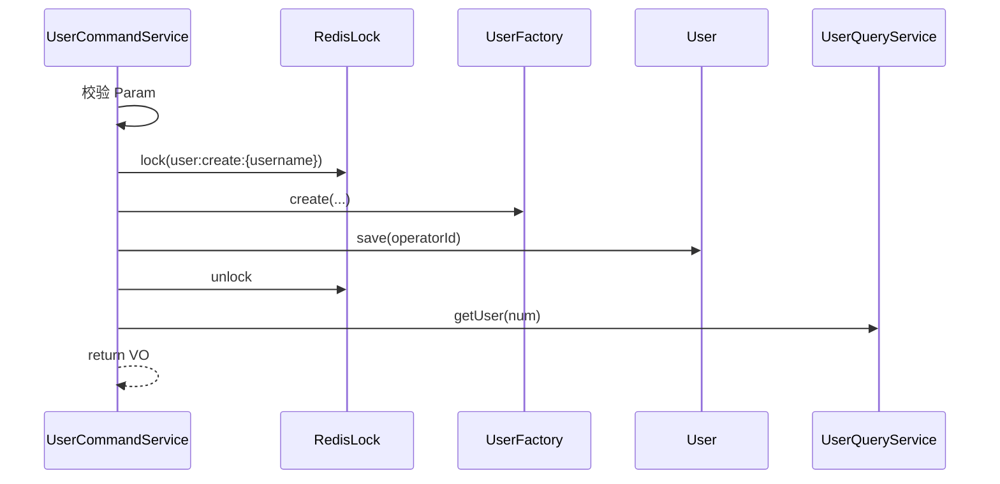

**updateUser**

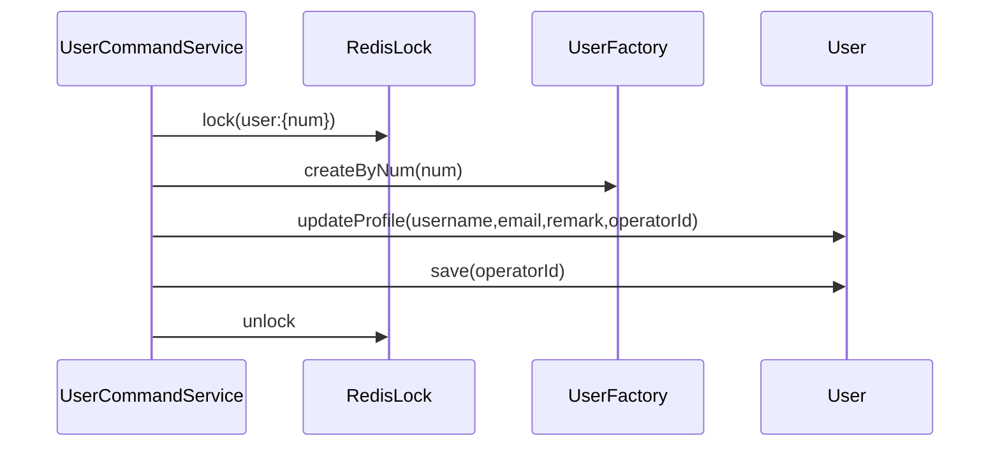

**enableUser / disableUser**

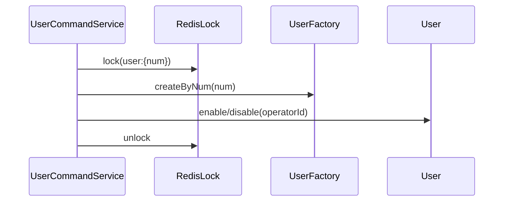

**resetPassword**


**savePlatformRoles**

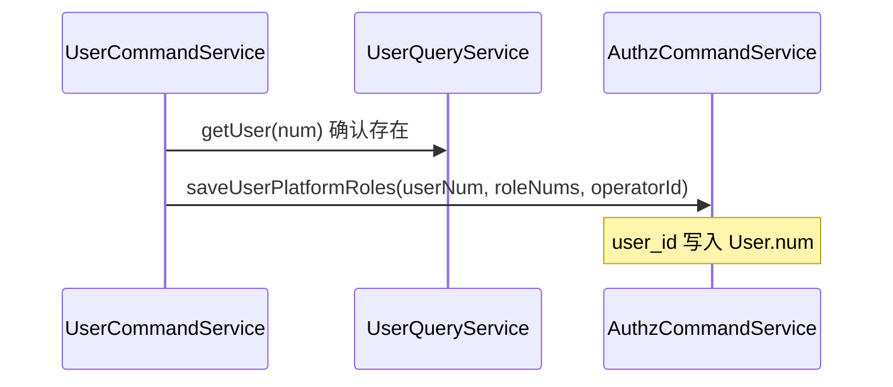

**pageUsers / getUser / searchEnabledUsers**

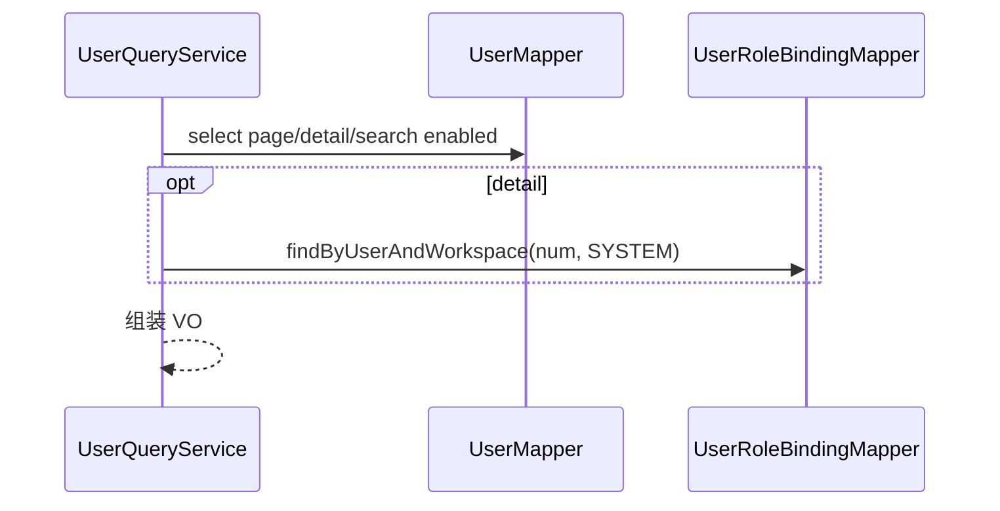

### 6.3 认证登录（auth-login）

#### 6.3.1 Service 方法清单

| Service | 方法 | 职责 | 入参 | 出参 |
|---|---|---|---|---|
| AuthLoginCommandService | login | 校验用户名密码、启停、签发 JWT、写 Cookie 所需 token | LoginParam | LoginResultVO(token, userNum, username) |
| AuthLoginCommandService | logout | 返回清 Cookie 指令（adapter 落 Cookie） | — | void |

#### 6.3.2 方法时序逻辑

**login**

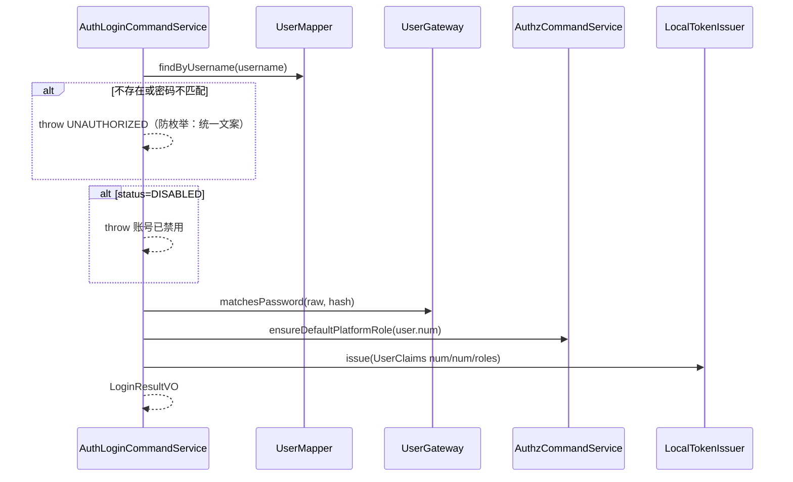

**logout**：无领域写；adapter 清 Cookie。

### 6.4 Common 选人改造

`CommonService.searchEmployees`：改为调用 `UserQueryService.searchEnabledUsers`，VO 映射：

- `empNo` ← `User.num`（兼容现有 FE 字段名，语义改为用户业务编号）
- `displayName` ← `User.username`

---

## 7. Adapter 层设计

### 7.1 业务模块划分

| 模块 | 入口类型 | 说明 |
|---|---|---|
| user | HTTP Controller | 用户命令/查询 |
| auth-login | HTTP Controller | 登录/登出 |
| security | Filter/Config | PUBLIC 路径、Cookie 写入 |
| common | HTTP 改造 | 员工搜索同源 |
| fe | 前端 | 菜单/页面（见 §13） |

无新增定时任务 / MQ Listener。

### 7.2 用户（user）

#### 7.2.1 Controller 接口清单

**UserQueryController** 前缀 `/api/v1/users`

| 方法 | 路径 | 权限 | 职责 |
|---|---|---|---|
| GET | `/page` | user_manage:read | 分页 |
| GET | `/detail` | user_manage:read | 详情 `?num=` |
| GET | `/search-enabled` | 已登录 | 选人（启用）`?keyword=&limit=` |

**UserCommandController** 前缀 `/api/v1/users`

| 方法 | 路径 | 权限 | 职责 |
|---|---|---|---|
| POST | `/create` | user_manage:create | 新建 |
| POST | `/update` | user_manage:update | 编辑 |
| POST | `/enable` | user_manage:enable | 启用 |
| POST | `/disable` | user_manage:disable | 禁用 |
| POST | `/reset-password` | user_manage:update | 重置密码 |
| POST | `/save-platform-roles` | user_manage:assign_role | 保存平台角色 |

**入参/出参 JSON 示例**

`POST /create` 请求：
```json
{
  "username": "bob.li",
  "email": "bob.li@garry.com",
  "remark": "业务同学",
  "password": "Init@123456"
}
```
响应：
```json
{
  "code": 0,
  "message": "success",
  "data": {
    "num": "USR-a1b2c3d4e5f6",
    "username": "bob.li",
    "email": "bob.li@garry.com",
    "remark": "业务同学",
    "status": "ENABLED"
  }
}
```

`POST /update`：
```json
{
  "num": "USR-a1b2c3d4e5f6",
  "username": "bob.li2",
  "email": "bob.li@garry.com",
  "remark": "备注"
}
```

`POST /enable|disable|reset-password`：
```json
{ "num": "USR-a1b2c3d4e5f6" }
```
```json
{ "num": "USR-a1b2c3d4e5f6", "password": "New@123456" }
```

`POST /save-platform-roles`：
```json
{
  "num": "USR-a1b2c3d4e5f6",
  "roleNums": ["RL-PLATFORM-ADMIN", "RL-PLATFORM-USER"]
}
```

`GET /page` 响应 data：
```json
{
  "list": [
    {
      "num": "USR-a1b2c3d4e5f6",
      "username": "bob.li",
      "email": "bob.li@garry.com",
      "remark": "业务同学",
      "status": "ENABLED"
    }
  ],
  "total": 1,
  "pageNo": 1,
  "pageSize": 20
}
```

#### 7.2.2 接口时序

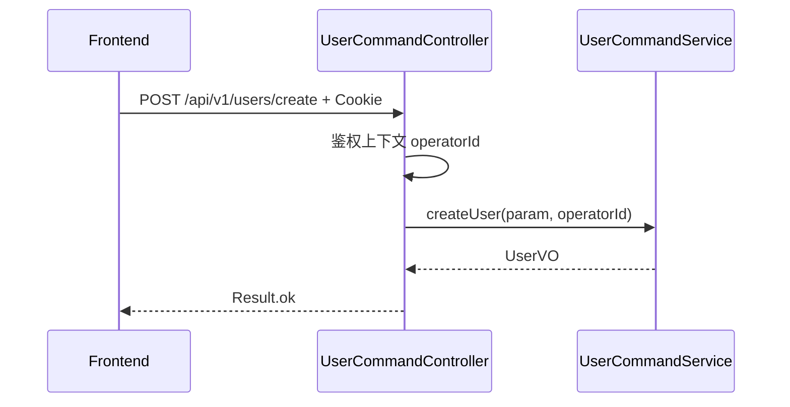

（update/enable/disable/reset-password/save-platform-roles 时序同构：Controller→CommandService。）

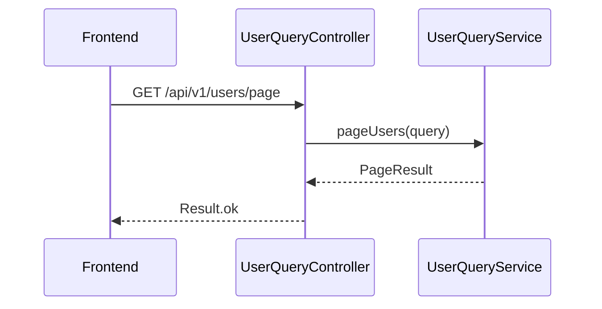

### 7.3 认证登录（auth-login）

#### 7.3.1 Controller 接口清单

**AuthLoginController** 前缀 `/api/v1/auth`

| 方法 | 路径 | 鉴权 | 职责 |
|---|---|---|---|
| POST | `/login` | PUBLIC | 登录，Set-Cookie `session_token` |
| POST | `/logout` | 已登录或放行 | MaxAge=0 清 Cookie |

`POST /login` 请求：
```json
{ "username": "bob.li", "password": "Init@123456" }
```
响应：
```json
{
  "code": 0,
  "message": "success",
  "data": {
    "userNum": "USR-a1b2c3d4e5f6",
    "username": "bob.li"
  }
}
```

#### 7.3.2 接口时序

```mermaid
sequenceDiagram
  participant FE as Frontend
  participant C as AuthLoginController
  participant S as AuthLoginCommandService
  participant Jwt as JwtProperties
  FE->>C: POST /api/v1/auth/login
  C->>S: login(param)
  S-->>C: token + profile
  C->>C: Set-Cookie session_token HttpOnly
  C-->>FE: Result.ok(profile)
```

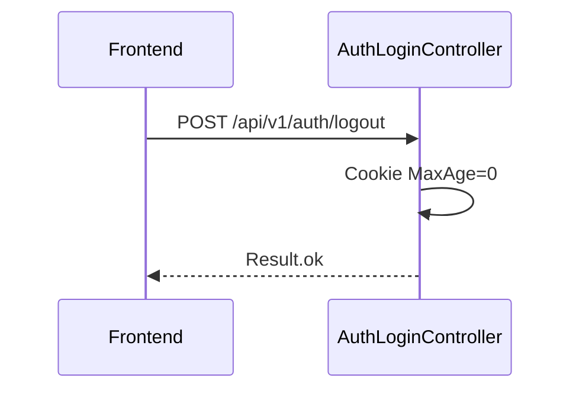

**MeController 调整**：`userId` 返回 `User.num`；`userName` 查 `sys_user.username`（QueryService）；无用户记录时兼容旧数据回退 account。

**RouteRoleMapping.PUBLIC_PATHS** 增加：`/api/v1/auth/login`。

---

## 8. 数据库设计

### 8.1 表与领域对应

| 表 | 领域对象 | 说明 |
|---|---|---|
| `sys_user` | User 聚合 | 用户主数据 |
| `user_workspace_role` | 复用 | `user_id` 语义改为 `User.num` |
| `permission` / `route_permission` / `role_permission` | 权限种子 | 新增 user_manage:* |

### 8.2 表结构：`sys_user`

| 字段 | 类型 | 必填 | 说明 |
|---|---|---|---|
| id | BIGINT AI PK | 是 | 主键 |
| num | VARCHAR(64) | 是 | 业务编号 USR-…，唯一 |
| username | VARCHAR(64) | 是 | 登录名，唯一 |
| email | VARCHAR(128) | 是 | 唯一 |
| remark | VARCHAR(512) | 否 | 备注 |
| status | VARCHAR(16) | 是 | ENABLED/DISABLED |
| password_hash | VARCHAR(100) | 是 | BCrypt |
| create_no | VARCHAR(64) | 是 | 创建人 num 或 SYSTEM |
| update_no | VARCHAR(64) | 是 | 更新人 |
| create_time | DATETIME(3) | 是 | 创建时间 |
| update_time | DATETIME(3) | 是 | 更新时间 |
| deleted | TINYINT | 是 | 软删 0/1 |

索引：`uk_num(num,deleted)`、`uk_username(username,deleted)`、`uk_email(email,deleted)`、`idx_status(status,deleted)`。

### 8.3 DDL（Flyway V35）

```sql
-- V35__user_management.sql

CREATE TABLE IF NOT EXISTS `sys_user` (
  `id` BIGINT NOT NULL AUTO_INCREMENT COMMENT '主键',
  `num` VARCHAR(64) NOT NULL COMMENT '业务编号 USR-xxx',
  `username` VARCHAR(64) NOT NULL COMMENT '登录用户名',
  `email` VARCHAR(128) NOT NULL COMMENT '邮箱',
  `remark` VARCHAR(512) NULL COMMENT '备注',
  `status` VARCHAR(16) NOT NULL COMMENT 'ENABLED/DISABLED',
  `password_hash` VARCHAR(100) NOT NULL COMMENT 'BCrypt',
  `create_no` VARCHAR(64) NOT NULL COMMENT '创建人',
  `update_no` VARCHAR(64) NOT NULL COMMENT '更新人',
  `create_time` DATETIME(3) NOT NULL DEFAULT CURRENT_TIMESTAMP(3) COMMENT '创建时间',
  `update_time` DATETIME(3) NOT NULL DEFAULT CURRENT_TIMESTAMP(3) ON UPDATE CURRENT_TIMESTAMP(3) COMMENT '更新时间',
  `deleted` TINYINT NOT NULL DEFAULT 0 COMMENT '软删',
  PRIMARY KEY (`id`),
  UNIQUE KEY `uk_sys_user_num` (`num`, `deleted`),
  UNIQUE KEY `uk_sys_user_username` (`username`, `deleted`),
  UNIQUE KEY `uk_sys_user_email` (`email`, `deleted`),
  KEY `idx_sys_user_status` (`status`, `deleted`)
) ENGINE=InnoDB DEFAULT CHARSET=utf8mb4 COLLATE=utf8mb4_unicode_ci COMMENT='平台用户主数据';

-- 权限点
INSERT INTO `permission` (`code`,`name`,`module`,`scope`,`description`,`sort_order`,`create_time`,`update_time`) VALUES
('user_manage:read','查看用户','user_manage','PLATFORM','用户列表/详情',801,NOW(3),NOW(3)),
('user_manage:create','创建用户','user_manage','PLATFORM','新建用户',802,NOW(3),NOW(3)),
('user_manage:update','编辑用户','user_manage','PLATFORM','编辑资料/重置密码',803,NOW(3),NOW(3)),
('user_manage:enable','启用用户','user_manage','PLATFORM','启用账号',804,NOW(3),NOW(3)),
('user_manage:disable','禁用用户','user_manage','PLATFORM','禁用账号',805,NOW(3),NOW(3)),
('user_manage:assign_role','分配用户平台角色','user_manage','PLATFORM','保存平台角色',806,NOW(3),NOW(3));

-- 路由权限（sort_order 示例）
INSERT INTO `route_permission` (`path_pattern`,`permission_codes`,`description`,`sort_order`,`create_time`,`update_time`) VALUES
('/api/v1/users/page','["user_manage:read"]','用户分页',801,NOW(3),NOW(3)),
('/api/v1/users/detail','["user_manage:read"]','用户详情',802,NOW(3),NOW(3)),
('/api/v1/users/create','["user_manage:create"]','创建用户',803,NOW(3),NOW(3)),
('/api/v1/users/update','["user_manage:update"]','更新用户',804,NOW(3),NOW(3)),
('/api/v1/users/reset-password','["user_manage:update"]','重置密码',805,NOW(3),NOW(3)),
('/api/v1/users/enable','["user_manage:enable"]','启用用户',806,NOW(3),NOW(3)),
('/api/v1/users/disable','["user_manage:disable"]','禁用用户',807,NOW(3),NOW(3)),
('/api/v1/users/save-platform-roles','["user_manage:assign_role"]','保存平台角色',808,NOW(3),NOW(3));
-- /search-enabled：仅需已认证，不配权限码（默认已认证即可）

-- 将新权限并入平台管理员角色权限集（role / role_permission）
INSERT INTO `role_permission` (`role_num`,`permission_code`,`create_time`,`update_time`)
SELECT 'RL-PLATFORM-ADMIN', p.code, NOW(3), NOW(3) FROM `permission` p
WHERE p.code LIKE 'user_manage:%'
AND NOT EXISTS (
  SELECT 1 FROM `role_permission` rp WHERE rp.role_num='RL-PLATFORM-ADMIN' AND rp.permission_code=p.code
);

UPDATE `role`
SET `permission_codes` = JSON_MERGE_PRESERVE(
  COALESCE(`permission_codes`, JSON_ARRAY()),
  JSON_ARRAY('user_manage:read','user_manage:create','user_manage:update','user_manage:enable','user_manage:disable','user_manage:assign_role')
)
WHERE `num` = 'RL-PLATFORM-ADMIN';
```

> 注：若现网 `role.permission_codes` 更新策略与 JSON_MERGE 不兼容，实现时改为应用层或精确 UPDATE；以可执行为准。

### 8.4 刷数 / 迁移 DML

启动 `UserPlatformAdminBootstrapper`（非纯 SQL）：

1. 读取 `app.auth.platform-admins` 列表（username）。  
2. 若 `sys_user` 无该 username：创建启用用户，初始密码来自配置 `app.auth.bootstrap-default-password`（仅 dev 默认，生产必改）。  
3. `AuthzCommandService` 确保 SYSTEM 绑定含 `RL-PLATFORM-ADMIN`，`user_id=User.num`。  

历史 `user_workspace_role.user_id` / 空间 JSON 若仍是旧 AD 字符串：提供可选迁移脚本「username → num」；**新库空数据无需刷**。

---

## 9. 模块变更清单

| 层 | 变更 | Skill |
|---|---|---|
| facade | 无变更 | — |
| client | 新增 `client.user` Param/VO/常量；`LoginParam`/`LoginResultVO` | **impl-client-module** |
| domain | 新增 `domain.user` 聚合/Factory/Repo/Gateway/事件 | **impl-domain-module** |
| infra | `sys_user` Entity/Mapper/Impl；GatewayImpl；Bootstrapper；Flyway V35；依赖 crypto | **impl-infra-module** |
| application | UserCommand/QueryService；AuthLoginCommandService；CommonService 改造；调用 AuthzCommandService | **impl-application-module** |
| adapter | User*Controller；AuthLoginController；PUBLIC 路径；MeController；FE 联调契约 | **impl-adapter-module** |

前端（同迭代，非六层 skill）：HomeLayout 菜单、Users 页面、Login 表单、MemberSelect、logout→`/api/v1/auth/logout`。

---

## 10. 代码分支命名

**分支名：`feature-20260807-user-management`**

---

## 11. 实现顺序与依赖

1. **client** — Param/VO/错误码  
2. **domain** — User 聚合与接口  
3. **infra + Flyway V35** — 表、实现、Bootstrap  
4. **application** — User*Service、AuthLoginCommandService、CommonService  
5. **adapter** — Controllers、Cookie、PUBLIC、Me  
6. **FE** — 菜单/用户管理/登录/选人  
7. 联调：关 `disable-auth` 验证真登录；开 `disable-auth` 验证本地旁路仍可用  

顺序符合 **facade(无) → client → domain → infra → application → adapter**。

---

## 12. 接口与数据契约（汇总）

| 方法 | 路径 | 说明 |
|---|---|---|
| GET | `/api/v1/users/page` | 分页 |
| GET | `/api/v1/users/detail` | 详情 |
| GET | `/api/v1/users/search-enabled` | 选人 |
| POST | `/api/v1/users/create` | 新建 |
| POST | `/api/v1/users/update` | 更新 |
| POST | `/api/v1/users/enable` | 启用 |
| POST | `/api/v1/users/disable` | 禁用 |
| POST | `/api/v1/users/reset-password` | 重置密码 |
| POST | `/api/v1/users/save-platform-roles` | 平台角色 |
| POST | `/api/v1/auth/login` | 登录 PUBLIC |
| POST | `/api/v1/auth/logout` | 登出 |
| GET | `/api/v1/common/employee/search` | **改造**：启用用户 |

既有 `POST /api/v1/platform-roles/save-user-roles` **保留**（两入口）；约定其 `empNo` 入参升级为传 **User.num**（FE 用户角色页同步改）。

---

## 13. 其他

### 13.1 配置项

```yaml
app:
  auth:
    disable-auth: ${AUTH_DISABLED:true}   # 本地旁路保留
    platform-admins: alice.zhang,garry.wang1
    bootstrap-default-password: ${AUTH_BOOTSTRAP_PASSWORD:ChangeMe@123}
    jwt: ... # 复用
```

### 13.2 前端要点

| 项 | 说明 |
|---|---|
| 菜单 | HomeLayout 增加「用户管理」`/users`，权限 `user_manage:*` 任一；与权限管理、系统设置平级 |
| 页面 | 列表/新建编辑抽屉/分配角色/启停确认 |
| 登录 | 用户名+密码 → `POST /api/v1/auth/login`；成功 refresh me |
| 登出 | `POST /api/v1/auth/logout` 后跳转 `/login` |
| MemberSelect | 调 `/api/v1/users/search-enabled` 或改造后的 employee/search；选项 value=`num`，label=`username` |
| 空间成员展示 | 对禁用用户灰显（详情批量 resolve status） |

### 13.3 非功能

- 密码永不日志输出；登录失败统一文案防枚举。  
- Command 写操作 Redis 锁；事务在锁内。  
- 审计：复用 AuthAuditHelper / 领域事件落审计。  

### 13.4 风险与兼容

- 存量空间成员若仍是 AD 字符串，需迁移到 `User.num` 后选人/鉴权才一致；新环境无历史则可忽略。  
- `platform-roles/save-user-roles` 入参语义从 empNo → User.num，需同步改 FE「用户角色」页。

---

## 模块自检记录

| 模块 | 结论 |
|---|---|
| 架构 | 应用/部署已写；命令查询已分；部署选 ② |
| Facade | 明确无变更 |
| 领域 | user 六节齐全；Factory 仅 create/createByNum；无软删字段 |
| Infra | Entity/Mapper/Impl/Gateway/Bootstrap 对齐 |
| Application | 禁 Repository/Gateway 注入；锁+时序齐全 |
| Adapter | 仅 GET/POST；JSON 契约；login PUBLIC |
| 数据库 | BIGINT AI id；create_time/update_time 毫秒；DDL+权限 DML |
| 变更清单 | 均可映射 impl-*-module |
| 分支 | `feature-20260807-user-management` |
