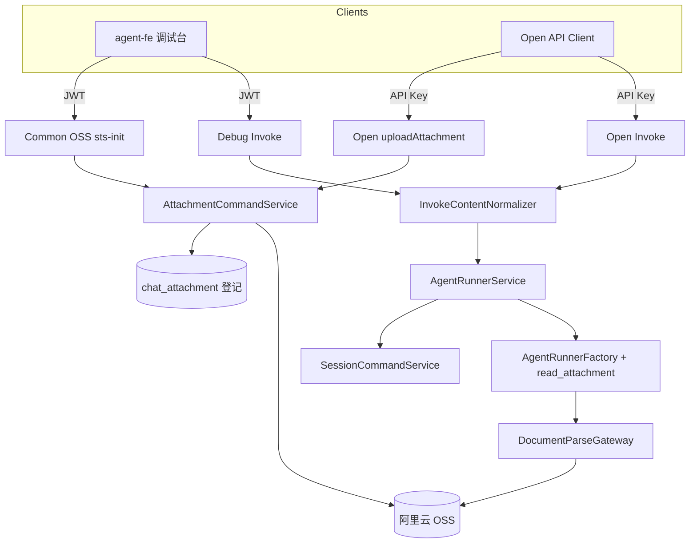
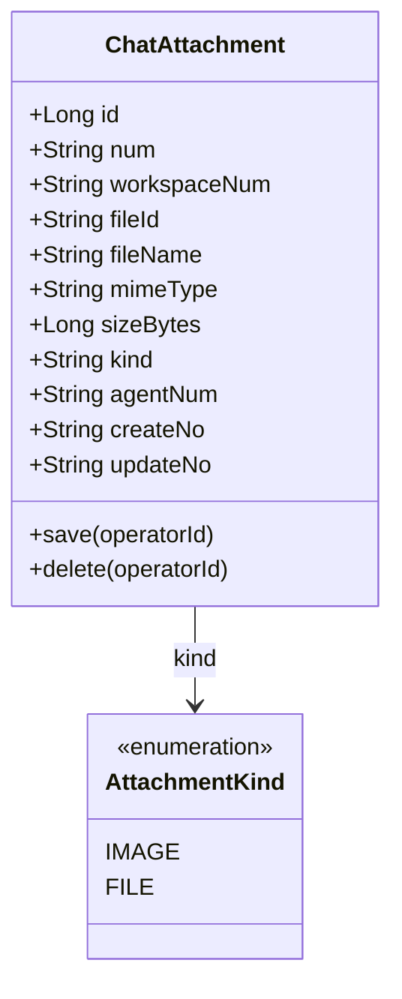
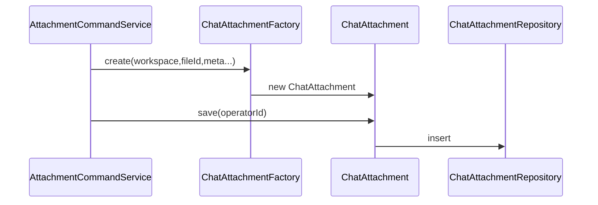
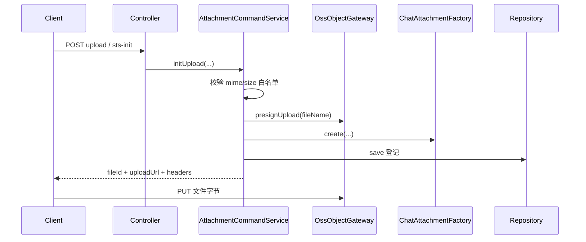
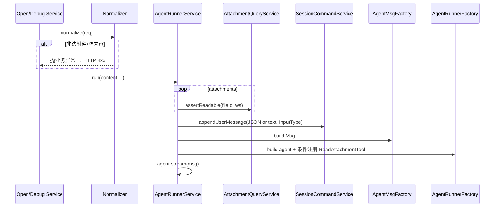
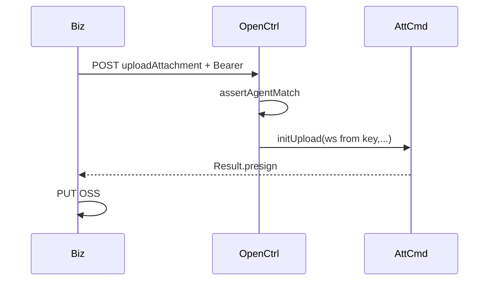
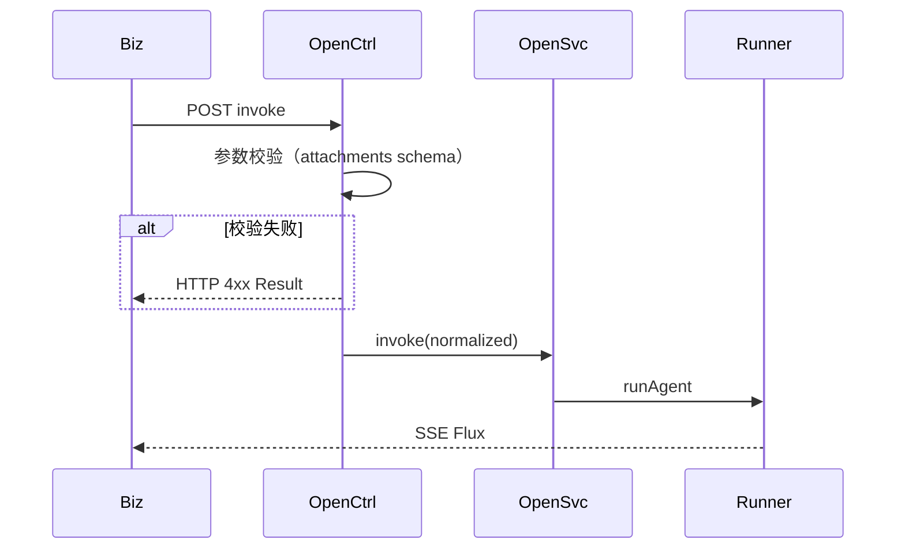

# AgentOps — Agent 多模态与附件能力技术方案

> 文档日期：2026-08-16 | 版本：v1.0  
> 输入 PRD：[doc/产品方案/2026-08-16_Agent多模态与附件能力-PRD.md](../产品方案/2026-08-16_Agent多模态与附件能力-PRD.md)  
> 代码分支：`feature-20260816-agent-multimodal-attachments`  
> 下游落码：按层调用 impl-facade / client / domain / infra / application / adapter；前端按约定改造

---

## 0. 设计共识（来自设计前问答）

| # | 结论 |
|---|---|
| 1 能力分流 | **图片** → AgentScope `ImageBlock` 直进 `Msg`；**Word/Excel/PDF/TXT/Markdown** → 仅元数据进上下文 + 平台内置 **`read_attachment` Tool 按需读取**；禁止整份文档塞进提示词 |
| 2 交付节奏 | **开放接口与调试台同一迭代一起上**（含上传、invoke、Tool、历史卡片） |
| 3 模块落点 | 复用 `session` / `agentrunner` / `debugconsole` / open agent / `common.oss`；新增轻量 **`attachment`** 登记与解析能力，不新建微服务 |
| 4 入参规则 | **`input` 与 `attachments` 至少一个有内容**（允许纯附件） |
| 5 持久化 | **方案 A**：用户消息 `content` 存 JSON（含 text + attachments）；扩展 `InputType` |
| 6 上传 | **调试台与开放接口都必须先走平台上传接口**；开放侧**新增上传附件接口**（API Key）；直传 OSS，Invoke 只带 `fileId` 引用 |
| 7 Tool 挂载 | **`read_attachment` 平台内置**；有附件的调用自动注入 Toolkit（无需 Agent 工具配置勾选） |
| 8 解析范围 | Tool 支持：**Word、Excel、PDF、TXT、Markdown**；强制 `maxChars` 截断 |
| 9 删除策略 | **OSS 对象与登记记录永不删除**（不做会话级联删文件） |
| 10 兼容与错误 | 旧纯文本 Invoke **硬性兼容**；附件校验失败 → **HTTP 4xx**（非 SSE error） |
| 11 前端 | 选文件、粘贴、拖拽、上传预览、用户气泡/会话历史 **文件卡片**、换签预览 |
| 12 部署 | **部署架构不变**，无新增应用实例，复用现有 be / fe / OSS |

---

## 1. 目标与范围

### 1.1 目标

1. 统一「先上传、再引用」：Admin OSS + **Open 上传附件** → Invoke 携带 `attachments[]`。  
2. Runner 统一组装：`TextBlock` + `ImageBlock*`；文档类仅清单 + `read_attachment`。  
3. 用户消息结构化落库，调试台/会话历史展示文件卡片。  
4. 开放 Invoke / Debug Invoke **同一归一化模型**，行为一致。

### 1.2 范围 / 不在范围

**在范围**：上传（Common + Open）、Invoke 契约扩展、登记表与 ACL、Msg 组装、内置 Tool、文档解析依赖、FE 调试台与 API 文档、历史换签展示。  

**不在范围**：整份文档塞 Prompt、Invoke multipart 直传、A2UI 附件产品化、知识库入库、OSS 删除、部署变更、评测集带图。

---

## 2. 架构设计

### 2.1 应用架构



**命令 / 查询划分**

| 类型 | 入口 | Service |
|------|------|---------|
| 命令 | Open 上传、Common sts-init（扩展登记）、Debug/Open Invoke | `AttachmentCommandService`、`AgentRunnerService` / 既有 Invoke 编排 |
| 查询 | `file-url` 换签、会话消息列表（已有） | `AttachmentQueryService`（换签前 ACL）、既有 `SessionQueryService` |

**代码结构**

| 层 | 领域 | 包 | 职责 |
|----|------|-----|------|
| facade | agent | `...facade.common` / `InputType` | 扩展 `InputType` 枚举（若 facade 已有副本则同步） |
| client | attachment | `...client.attachment.*` | 上传/附件 Param、VO、常量、错误码 |
| client | agent / debugconsole | `...client.agent` / `...client.debugconsole` | `OpenInvokeParam`、`DebugInvokeRequest` 扩展 attachments |
| client | common.oss | 既有 | 复用 Presign VO；必要时补字段说明 |
| domain | attachment | `...domain.attachment.*` | 附件登记聚合、规则、Factory、Repository、Gateway |
| domain | session / agent | 既有 | Message content 语义扩展；InputType |
| infra | attachment | `...infra.attachment.*` | Entity/Mapper/Repo/Factory/GatewayImpl；文档解析实现 |
| infra | common.oss | 既有 | 复用 `OssClient` |
| application | attachment | `...application.attachment.command/query` | 上传登记、ACL、换签校验、解析用例（供 Tool） |
| application | agentrunner | `...application.agentrunner` | Normalizer、MsgFactory、`ReadAttachmentTool`、Factory 注入 |
| application | agent / debugconsole / session | 既有 | Open/Debug 调用归一化后进 Runner；落库 |
| adapter | open | `...adapter.open` | Open 上传 + Invoke 参数校验（4xx） |
| adapter | common / debugconsole | 既有 | Common sts 登记钩子；Debug Invoke 4xx |
| fe | Console / services | `agent-fe/src/...` | Sender 附件、卡片、上传、ApiInfoTab |

### 2.2 部署架构

**部署架构不变，无新增应用/前端部署实例，复用现有部署架构。**  
依赖既有 MySQL、Redis、OSS；新增 Flyway 表与 Maven 解析依赖随 `agent-be` 发布即可。

---

## 3. Facade 层设计

| 类/枚举 | 包 | 变更 | 职责 | Skill |
|---------|-----|------|------|-------|
| `InputType` | `ink.garry.rd.agent.ws.facade.common`（若存在）及 domain 副本 | **修改** | 新增 `MULTIMODAL`；与 domain 保持一致 | impl-facade-module |
| 其它 Result/通用基类 | — | **无变更** | — | — |

若 facade 无 `InputType`、仅 domain 有，则 **本次 Facade 仅声明「无其它契约变更」**，以 domain `InputType` 为准并在清单中写明。

**自检**：Facade 变更范围已明确（InputType 同步）；无新增通用 Result。

---

## 4. 领域层设计

### 4.1 业务层级划分

| 层级 | 说明 |
|------|------|
| L1 附件登记 | 上传成功后登记 fileId，永不删除；供 ACL 与 Tool |
| L1 会话消息 | 用户消息 content 结构化 |
| L1 Agent 运行 | Msg 组装 + 内置读附件 Tool |

### 4.2 附件（attachment）

#### 4.2.1 领域模型



| 对象 | 类型 | 关键属性 | 关系 |
|------|------|----------|------|
| ChatAttachment | 聚合根 | num、workspaceNum、fileId、fileName、mimeType、sizeBytes、kind、agentNum、createNo、updateNo；持有 Repository/Gateway/Publisher | 聚合根 |
| AttachmentKind | 值对象/枚举 | IMAGE / FILE | 由 mime 推导 |

软删除：领域对象**不出现** deleted；表可无软删或仅 `deleted=0` 占位但**业务禁止删除**（`delete` 动作抛业务异常或空实现禁调用）。

#### 4.2.2 领域动作

| 聚合 | 动作 | 职责 | 前置 | 后置/事件 |
|------|------|------|------|-----------|
| ChatAttachment | `register(...)` via Factory.create + save | 登记上传成功的附件 | fileId 唯一；mime/size 合法 | 可选 `ChatAttachmentRegisteredEvent` |
| ChatAttachment | `assertAccessible(workspaceNum)` | ACL | workspace 匹配 | — |
| ChatAttachment | `delete(operatorId)` | **禁止** | — | 抛「附件不可删除」 |



#### 4.2.3 领域规则

| 对象 | 规则 | 违反 |
|------|------|------|
| ChatAttachment | fileId 全局唯一 | 冲突错误 |
| ChatAttachment | mime 必须在白名单 | 400 |
| ChatAttachment | size ≤ 配置上限 | 400 |
| ChatAttachment | 禁止物理/逻辑删除 | 业务异常 |
| ACL | 仅同 workspaceNum 可 Invoke/Tool 读取 | 403/404 |

#### 4.2.4 领域工厂

| Factory | 方法 | 入参 | 返回 | 职责 |
|---------|------|------|------|------|
| ChatAttachmentFactory | create | workspaceNum, fileId, fileName, mimeType, sizeBytes, agentNum? | ChatAttachment | 新建登记 |
| ChatAttachmentFactory | createByNum | num | ChatAttachment | 按业务号加载 |

#### 4.2.5 领域网关

| Gateway | 方法 | 职责 | 外部依赖 | 失败策略 |
|---------|------|------|----------|----------|
| OssObjectGateway | presignUpload / generateDownloadUrl | 复用 OssClient | OSS | 抛错 → 4xx/5xx |
| DocumentParseGateway | extractText(fileId, mime, maxChars) | 下载并解析文档文本 | OSS + POI/PDFBox/Tika | 返回可读错误供 Tool |

#### 4.2.6 领域事件

| 事件 | 时机 | 载荷 | 用途 |
|------|------|------|------|
| ChatAttachmentRegisteredEvent | 登记成功 | num, fileId, workspaceNum | 审计/日志（可选订阅） |

### 4.3 会话消息（session）— 扩展

#### 4.3.1 领域模型（扩展要点）

- `InputType` 增加 `MULTIMODAL`。  
- 用户消息 `content`：  
  - TEXT/JSON：保持字符串/JSON 文本语义；  
  - MULTIMODAL：JSON 字符串，schema：

```json
{
  "text": "可选说明",
  "attachments": [
    {
      "fileId": "...",
      "name": "...",
      "mimeType": "...",
      "size": 123,
      "kind": "image|file"
    }
  ]
}
```

- 不新增 Message 附件子实体（共识方案 A）。

#### 4.3.2～4.3.6

复用既有 Session/Message 动作；新增规则：`appendUserMessage` 在 MULTIMODAL 时校验 JSON schema；无新增 Factory/Gateway（解析走 attachment 域）。

### 4.4 Agent 运行（agentrunner）— 扩展（非经典 DDD 聚合，应用层组件）

| 组件 | 职责 |
|------|------|
| `InvokeContentNormalizer` | 将 Open/Debug 请求归一为 `NormalizedInvokeContent(text, attachments)` |
| `AgentMsgFactory` | 构建 `Msg`：文本 + ImageBlock；文档只进「附件清单」系统提示或用户侧说明 |
| `ReadAttachmentTool` | AgentScope Tool：按 fileId 解析文本并截断 |

**自检**：附件聚合具备 id/num/create_no/update_no 与 save；禁止删除；Factory 仅 create/createByNum；Gateway 在 domain 定义。

---

## 5. 基础设施层设计

| 类型 | 类名 | 包 | 职责 | 依赖 | 表/外部 | 变更 |
|------|------|-----|------|------|---------|------|
| Entity | ChatAttachmentEntity | `...infra.attachment.entity` | 表映射 | MP | chat_attachment | 新增 |
| Mapper | ChatAttachmentMapper | `...infra.attachment.mapper` | CRUD + findByFileId | — | chat_attachment | 新增 |
| RepositoryImpl | ChatAttachmentRepositoryImpl | `...infra.attachment.gateway` | 领域转换 | Mapper | — | 新增 |
| FactoryImpl | ChatAttachmentFactoryImpl | 同上 | create / createByNum | Repo | — | 新增 |
| GatewayImpl | OssObjectGatewayImpl | 同上 | 委托 OssClient | OssClient | OSS | 新增 |
| GatewayImpl | DocumentParseGatewayImpl | 同上 | 下载+解析 | OssClient, POI, PDFBox, 纯文本 | OSS | 新增 |
| 依赖 | pom | rd-agent-be-infra 或 application | 引入 poi-ooxml、pdfbox；（可选）tika-core | Maven | — | 新增 |

注入统一 `@Resource`。

**解析策略（摘要）**

| mime / 扩展名 | 实现 |
|---------------|------|
| txt / md | UTF-8 读文本 |
| docx | POI XWPF |
| xlsx | POI XSSF（单元格拼文本） |
| pdf | PDFBox 抽文本 |
| 其它 | Tool 返回不支持类型 |

**自检**：Entity 与 DDL 一致；解析失败不写库删除。

---

## 6. 应用层设计

### 6.1 业务模块划分

| 模块 | 对应领域 | 说明 |
|------|----------|------|
| attachment | attachment | 上传登记、ACL、解析 |
| agentrunner | agentrunner | 归一化、Msg、Tool、Runner |
| agent / debugconsole / session | 既有 | Open/Debug 入口衔接、落库 |

### 6.2 附件（attachment）

#### 6.2.1 Service 方法清单

| Service | 方法 | 入参 | 出参 | 职责 |
|---------|------|------|------|------|
| AttachmentCommandService | initUpload | workspaceNum, agentNum?, fileName, contentType, size, operatorId | Presign VO + fileId | 校验白名单 → OSS presign → **预登记或上传完成回调登记** |
| AttachmentCommandService | confirmUpload（若需要） | fileId, workspaceNum | void | 可选：客户端 PUT 成功后确认；MVP 可在 init 时先登记 status=PENDING，Invoke 时校验对象存在 |
| AttachmentQueryService | assertReadable | fileId, workspaceNum | ChatAttachmentDTO | ACL |
| AttachmentQueryService | getDownloadUrl | fileId, workspaceNum | url | 换签前 ACL |
| AttachmentQueryService | extractForTool | fileId, workspaceNum, maxChars | text | Tool 调用 |

**上传登记时序（推荐 MVP：init 即登记 + Invoke/Tool 时 HEAD/GET 校验对象存在）**



### 6.3 Agent 运行（agentrunner）

#### 6.3.1 Service / 组件方法清单

| 组件 | 方法 | 职责 |
|------|------|------|
| InvokeContentNormalizer | normalize(open/debug param) | 得到 text + attachments；校验「至少一个非空」；推导 kind |
| AgentMsgFactory | build(content, workspaceNum) | 校验每个 fileId ACL；图片 → ImageBlock（短签 URL 或 SDK 要求形态）；文件 → 不注入全文 |
| AgentRunnerService | runAgent(...) | 改签名接收 NormalizedInvokeContent；落库 MULTIMODAL/TEXT；组装 Msg；stream |
| AgentRunnerFactory | build(...) | **若本轮 attachments 含非 image 或任意附件**：注册 `ReadAttachmentTool`（平台内置，建议**有附件即注册**；无附件可不注册以减噪声） |
| ReadAttachmentTool | call(fileId, maxChars?) | QueryService.extractForTool |

#### 6.3.2 runAgent 时序



**图片 ImageBlock**：优先使用可访问的短签 URL；若 SDK/模型要求 base64，则 Gateway 下载小图转码（受 size 上限约束）。

**系统侧提示（有文件类附件时）**：向 Agent 注入简短说明（非全文）：「用户本轮附件列表：…；需阅读内容时调用 read_attachment(fileId)」。

**自检**：application 不直接注入 attachment Repository；写路径经领域对象/既有 Session 聚合。

---

## 7. Adapter 层设计

### 7.1 业务模块划分

| 模块 | 入口 |
|------|------|
| open | 上传附件、Invoke（扩展） |
| common | sts-init 挂钩登记（调试台） |
| debugconsole | Invoke 扩展与 4xx |
| fe | 调试台 UI / ApiInfoTab |

HTTP **仅 GET/POST**。

### 7.2 开放接口（open）

#### 7.2.1 Controller 接口清单

**POST** `/api/v1/open/agents/command/uploadAttachment`  
鉴权：`Authorization: Bearer ak-...`；校验 body.agentNum 与密钥归属。

请求 JSON：

```json
{
  "agentNum": "AGT-xxx",
  "fileName": "合同.docx",
  "contentType": "application/vnd.openxmlformats-officedocument.wordprocessingml.document",
  "size": 512000
}
```

成功响应（`Result` 包装，data）：

```json
{
  "fileId": "chat/WS-xxx/20260816/uuid-合同.docx",
  "url": "https://oss-presigned...",
  "method": "PUT",
  "signedHeaders": { "Content-Type": "..." },
  "expireAt": "2026-08-16T06:00:00.000Z"
}
```

失败：400 类型/大小不合法；403 agent 不匹配；401 密钥无效。

**POST** `/api/v1/open/agents/command/invoke`（扩展，兼容旧客户端）

请求 JSON：

```json
{
  "agentNum": "AGT-xxx",
  "input": "总结附件要点",
  "inputType": "multimodal",
  "sessionNum": null,
  "operatorId": null,
  "context": {},
  "attachments": [
    {
      "fileId": "chat/.../uuid-合同.docx",
      "name": "合同.docx",
      "mimeType": "application/vnd.openxmlformats-officedocument.wordprocessingml.document",
      "size": 512000,
      "kind": "file"
    }
  ]
}
```

校验失败（空内容、越权 fileId、超限）：**在进入 SSE 之前 HTTP 4xx**（与共识一致）。  
成功：既有 `text/event-stream`。

可选（P1）：**POST** `/api/v1/open/agents/query/fileUrl` `{ "fileId": "..." }` → 临时下载 URL（ACL）；调试台可继续用 Common `file-url`。

#### 7.2.2 接口时序（上传）



#### 7.2.3 接口时序（Invoke）



### 7.3 Common / Debug

| 接口 | 变更 |
|------|------|
| POST `/api/v1/common/oss/sts-init` | 成功后**写入 chat_attachment 登记**（workspace 来自 JWT）；fileName 建议强制 chat 前缀策略 |
| POST `/api/v1/common/oss/file-url` | 换签前走 AttachmentQueryService ACL（同空间） |
| POST `/api/v1/debug-console/invoke` | body 增加 `attachments`（snake_case 与现网一致）；校验失败 4xx |

Debug 请求示例：

```json
{
  "agentNum": "AGT-xxx",
  "session_num": null,
  "input": "看看图",
  "input_type": "multimodal",
  "attachments": [
    {
      "fileId": "...",
      "name": "a.png",
      "mimeType": "image/png",
      "size": 1000,
      "kind": "image"
    }
  ],
  "target_version": null,
  "context": {}
}
```

### 7.4 前端要点（非 adapter，实现约束）

- `DebugSender`：附件按钮、粘贴、拖拽；`uploadFile` → 登记用 Common sts-init。  
- 用户气泡 / `SessionMessagesView`：解析 MULTIMODAL content → **文件卡片**（图缩略图 / 文档图标+名+大小）。  
- `ApiInfoTab`：补充 uploadAttachment + invoke attachments。  

**自检**：仅 GET/POST；Open 上传与 Invoke 均有 JSON 契约；4xx 在 SSE 前。

---

## 8. 数据库设计

### 8.1 表 `chat_attachment`

与领域 ChatAttachment 对应；**业务上永不删行、永不删 OSS**（可无硬删接口）。

| 字段 | 类型 | 说明 |
|------|------|------|
| id | BIGINT AI PK | 主键 |
| num | VARCHAR(64) | 业务号 `CHA-`… |
| workspace_num | VARCHAR(64) | 工作空间 |
| file_id | VARCHAR(512) | OSS objectId，唯一 |
| file_name | VARCHAR(256) | 原始名 |
| mime_type | VARCHAR(128) | |
| size_bytes | BIGINT | |
| kind | VARCHAR(16) | IMAGE/FILE |
| agent_num | VARCHAR(64) | 可空（调试未选齐时） |
| create_no | VARCHAR(64) | |
| update_no | VARCHAR(64) | |
| create_time | DATETIME(3) | |
| update_time | DATETIME(3) | |
| deleted | TINYINT | 固定 0；禁止置 1 |

索引：`uk_file_id(file_id)`；`idx_ws(workspace_num, create_time)`。

### 8.2 DDL

```sql
-- V38__chat_attachment.sql
CREATE TABLE IF NOT EXISTS `chat_attachment` (
  `id` BIGINT NOT NULL AUTO_INCREMENT COMMENT '主键',
  `num` VARCHAR(64) NOT NULL COMMENT '业务编号 CHA-...',
  `workspace_num` VARCHAR(64) NOT NULL COMMENT '工作空间',
  `file_id` VARCHAR(512) NOT NULL COMMENT 'OSS 对象 ID',
  `file_name` VARCHAR(256) NOT NULL COMMENT '原始文件名',
  `mime_type` VARCHAR(128) NOT NULL COMMENT 'MIME',
  `size_bytes` BIGINT NOT NULL COMMENT '字节数',
  `kind` VARCHAR(16) NOT NULL COMMENT 'IMAGE/FILE',
  `agent_num` VARCHAR(64) NULL COMMENT '关联 Agent，可空',
  `create_no` VARCHAR(64) NOT NULL COMMENT '创建人',
  `update_no` VARCHAR(64) NOT NULL COMMENT '更新人',
  `create_time` DATETIME(3) NOT NULL DEFAULT CURRENT_TIMESTAMP(3),
  `update_time` DATETIME(3) NOT NULL DEFAULT CURRENT_TIMESTAMP(3) ON UPDATE CURRENT_TIMESTAMP(3),
  `deleted` TINYINT NOT NULL DEFAULT 0 COMMENT '禁止业务删除，恒 0',
  PRIMARY KEY (`id`),
  UNIQUE KEY `uk_chat_attachment_file_id` (`file_id`),
  UNIQUE KEY `uk_chat_attachment_num` (`num`),
  KEY `idx_chat_attachment_ws_time` (`workspace_num`, `create_time`)
) ENGINE=InnoDB DEFAULT CHARSET=utf8mb4 COLLATE=utf8mb4_unicode_ci COMMENT='聊天附件登记（永不删除）';
```

### 8.3 message 表

**无强制改表**；`content` 已为文本，MULTIMODAL 存 JSON 字符串；`input_type` 扩展枚举值 `MULTIMODAL`。

### 8.4 刷数

无历史刷数 DML。

**自检**：id BIGINT 自增；create_time/update_time 毫秒；业务号独立。

---

## 9. 模块变更清单

| 层 | 变更 | Skill |
|----|------|-------|
| facade | InputType +MULTIMODAL（若适用） | impl-facade-module |
| client | attachment Param/VO；OpenInvokeParam.attachments；OpenUploadAttachmentParam；DebugInvokeRequest.attachments；错误码 | impl-client-module |
| domain | attachment 聚合 + Factory/Repo/Gateway；session InputType；禁止删除规则 | impl-domain-module |
| infra | Entity/Mapper/Impl；DocumentParseGatewayImpl；pom 依赖；Flyway V38 | impl-infra-module |
| application | AttachmentCommand/QueryService；Normalizer；MsgFactory；ReadAttachmentTool；Runner/Factory 改造；Open/Debug 衔接 | impl-application-module |
| adapter | Open uploadAttachment；Invoke/Debug 校验 4xx；Common sts 登记 | impl-adapter-module |
| fe | DebugSender 附件；气泡/历史卡片；ApiInfoTab；类型定义 | （前端实现，非 Java skill） |

---

## 10. 代码分支命名

**`feature-20260816-agent-multimodal-attachments`**

---

## 11. 实现顺序与依赖

1. **facade / client**：InputType、DTO、错误码、Open/Debug 契约  
2. **domain**：ChatAttachment + 规则  
3. **数据库 + infra**：V38、解析依赖、GatewayImpl  
4. **application**：上传登记、Normalizer、MsgFactory、Tool、Runner  
5. **adapter**：Open 上传、Invoke/Debug 4xx、Common 挂钩  
6. **fe**：上传交互、卡片、文档  
7. **联调**：图片 Vision；docx Tool 读取；旧纯文本回归  

顺序：**facade → client → domain → infra → application → adapter → fe**。

---

## 12. 接口与数据契约（汇总）

| 接口 | 方法 | 鉴权 | 说明 |
|------|------|------|------|
| `/api/v1/open/agents/command/uploadAttachment` | POST | API Key | 开放上传预签名 + 登记 |
| `/api/v1/open/agents/command/invoke` | POST | API Key | 扩展 attachments；失败 4xx |
| `/api/v1/common/oss/sts-init` | POST | JWT | 调试台上传 + 登记 |
| `/api/v1/common/oss/file-url` | POST | JWT | 换签 + ACL |
| `/api/v1/debug-console/invoke` | POST | JWT | 扩展 attachments；失败 4xx |

**白名单（可配置，默认）**

- 图片：`image/png`, `image/jpeg`, `image/webp`, `image/gif`  
- 文档：docx / xlsx / pdf / txt / markdown 对应 MIME  
- 单文件大小、单轮附件数：配置项（如 10MB、最多 6 个）— 具体默认值实现时写入 `application.yml` 并文档化  

**read_attachment Tool**

- name: `read_attachment`  
- params: `fileId` (必填), `maxChars` (可选，默认如 20000)  
- 返回：纯文本或错误信息字符串  

---

## 13. 其他

| 项 | 说明 |
|----|------|
| 配置 | `app.attachment.max-size-bytes`、`max-count-per-turn`、`allowed-mime-types`、`read-max-chars` |
| 安全 | fileId 必须落在登记表且 workspace 匹配；日志禁止输出完整预签名 URL |
| 兼容 | 无 attachments 的旧 Invoke 路径零行为变化 |
| 观测 | 登记成功/解析失败/Tool 调用打结构化日志 |
| 与 PRD | 覆盖 PRD M1 + 文档类 Tool（共识加强版）；OSS 永不删 |

---

## 修订记录

| 日期 | 说明 |
|------|------|
| 2026-08-16 | v1.0：基于 PRD + 设计前 12 问共识；Open 新增 uploadAttachment；read_attachment 平台内置 |
